# PM 트랙 Day 1 교재 — 프로젝트 매니지먼트 일반론과 착수(Initiating)

> **이 교재의 위치** — 4일 PM 특강의 첫째 날 본문이다. 슬라이드는 강사가 이 본문 가운데 무엇을 어떤 순서로 설명하는지를 정하고, 워크북은 이 본문의 개념을 가상회사 ㈜온담F&B홀딩스의 프로젝트 P1(차세대 주문·재고 통합 플랫폼 구축)에 적용해 산출물을 직접 작성하게 한다. 본문은 그 둘의 뿌리다. 강의를 듣기 전에 한 번, 워크북을 쓰다가 막힐 때 한 번, 과정이 끝난 뒤 한 번 읽도록 쓰였다.
>
> **전제 독자** — 주니어 PM과 3~7년차 현업 실무자. 프로젝트의 정의나 간트차트 읽는 법 같은 기초는 다루지 않는다. 대신 "알고 있다고 생각했는데 실무에서 틀리는 것"과 "표준이 말하지 않는 것"에 지면을 쓴다. PMP를 보유한 독자는 제2장에서 자신이 공부한 판본이 현행 판본과 어떻게 다른지 확인하게 될 것이다.
>
> **사례 회사** — 이 교재의 모든 예시는 `교재/공통/가상회사_온담F앤B.md`에 정의된 온담F&B홀딩스와 ONE ONDAM 프로그램(총 428억 원, P1~P5)을 재료로 쓴다. 숫자는 그 문서의 §5 핵심 숫자 표를 따른다. 본문을 읽기 전에 그 문서 전체를 통독할 필요는 없다. **§1.1 한 문단 요약 · §3.4 기간과 마일스톤 · §4.2 등장인물 표 · §6 이해관계와 긴장**(합쳐서 약 25분)만 먼저 읽고, 나머지는 본문의 ■ 사례 사실 줄이 가리킬 때 찾아 읽으라. Day1 1교시 앞의 사례 브리핑(20분)과 `교재/공통/01_사례_한장.pdf`(책받침 한 장)가 같은 역할을 한다.
>
> **읽는 법과 분량** — 이 교재는 하루에 다 읽는 책이 아니다. 목차의 표시대로 필독 절만 수업 전에 읽으면 되고(약 100분), 나머지는 수업 후·과정 후에 읽는다. 본문의 온담 단락은 앞머리에 **■ 사례 사실** 줄을 두어 그 단락이 쓰는 사례의 사실과 출처(사례 §·숫자 표 ID)를 먼저 적었다 — 사례 문서를 통독하지 않았어도 그 줄만 읽으면 따라올 수 있고, 더 알고 싶으면 그 §을 펼친다. 용어·약어·문서 ID(R-10, CR-09, A10, BL-02 …)가 낯설면 `교재/공통/02_용어약어색인.md`를, 4일 전체의 읽는 순서는 `교재/공통/00_학습안내.md`를 본다.
---

## 목차

표시 없는 절은 **수업 전 필독**(약 100분), (심화)는 수업 후 일주일 안에 읽는 절(약 20분), (과정 후)로 표시된 장은 4일이 끝난 뒤 읽는 학술 배경과 읽을 자료다. 각 장 끝의 "핵심 정리" 첫 상자(한 줄씩)는 수업 직전 5분 복습용이다.

**제1장 프로젝트란 무엇인가**
- 1.1 프로젝트·프로그램·포트폴리오·운영 — 세 표준의 정의를 나란히 놓으면 보이는 것
- 1.2 프로젝트는 왜 실패하는가 — 통계를 그대로 믿으면 안 되는 이유
- 1.3 프로젝트를 임시조직으로 본다는 것
- 1.4 프로젝트 유형은 하나가 아니다 — NTCP 다이아몬드
- 1.5 분야별 대조 — 같은 단어, 다른 리듬, 다른 되돌림 비용 (심화)
- 핵심 정리 / 생각해 볼 질문 / 워크북 연결

**제2장 표준의 지형 — 무엇을 따를 것인가**
- 2.1 PMBOK의 계보 — 6판, 7판, 그리고 8판의 부분 회귀
- 2.2 PMBOK 8판의 6 원칙과 7 성과영역
- 2.3 PRINCE2 7 — 프로젝트 보드, 예외 관리, 산출물 기반 계획
- 2.4 ISO 21502:2020 — 계약서가 인용하는 표준 (심화)
- 2.5 애자일·SAFe·하이브리드의 위치
- 2.6 테일러링 — 되돌림 비용, Boehm-Turner, Cynefin
- 2.7 자격 체계의 실효성 (심화)
- 핵심 정리 / 생각해 볼 질문 / 워크북 연결

**제3장 착수 — 프로젝트는 어떻게 시작되는가**
- 3.1 착수 이전 — 비즈니스 케이스와 편익의 소유권
- 3.2 프로젝트 헌장 — 항목별 의미와 한국 기업에서의 실질화
- 3.3 이해관계자 — 식별·분석·참여 계획
- 3.4 거버넌스 — 스폰서·운영위원회·PMO·PM의 권한 구조
- 3.5 초기 리스크와 프리모템
- 3.6 분야별 착수 노하우 — SI, 건설·EPC, 제조 NPD, 제약 (심화)
- 핵심 정리 / 생각해 볼 질문 / 워크북 연결

**제4장 이 날의 학술 배경 — 깊이 읽기 (과정 후)**
- 4.1 Rethinking Project Management의 다섯 방향
- 4.2 Morris — 프로젝트 관리에서 프로젝트들의 관리로
- 4.3 Flyvbjerg — 착각과 기만, 그리고 "천천히 생각하고 빠르게 실행하라"
- 4.4 Staw — 몰입의 상승과 결정자의 분리
- 4.5 서지와 읽는 순서

**제5장 읽을 자료 (과정 후)**
- 5.1 필수 (과정 전)
- 5.2 심화 (과정 후)
- 5.3 참고

---

# 제1장 프로젝트란 무엇인가

## 1.1 프로젝트·프로그램·포트폴리오·운영 — 세 표준의 정의를 나란히 놓으면 보이는 것

### 개념

프로젝트라는 말은 너무 흔해서 정의할 필요가 없어 보인다. 그러나 정의는 실무에서 곧바로 돈과 권한으로 번역된다. 어떤 일을 프로젝트라고 부르는 순간 그 일에는 시작과 끝이 생기고, 예산이 별도로 잡히고, 책임자가 지명되고, 끝나면 조직이 해산된다. 반대로 운영이라고 부르면 그 일은 연간 예산 안에서 반복되고, 담당 부서가 계속 맡고, 끝이 없다. 같은 일을 두고 프로젝트냐 운영이냐를 다투는 것은 개념 논쟁이 아니라 "누가 돈을 대고 누가 책임지는가"의 논쟁이다.

세 표준의 정의를 나란히 놓아 보자.

| 표준 | 프로젝트의 정의 (요지) | 프로그램 | 포트폴리오 |
|---|---|---|---|
| **ISO 21502:2020** | 합의된 목표(objectives)를 달성하기 위해 착수되는 임시적 노력(temporary endeavour). 시작과 끝이 정의되고, 조정·통제되는 활동으로 구성된다 | 상호 연관된 프로젝트와 프로그램 활동의 집합으로, 개별적으로 관리해서는 얻을 수 없는 편익(benefits)을 얻기 위해 함께 관리된다 | 전략적 목표 달성을 위해 함께 관리되는 프로젝트·프로그램·운영 업무의 집합 |
| **PMBOK Guide 8판** (PMI, 2025) | 고유한 제품·서비스·결과를 만들기 위한 임시적 노력. 8판은 여기에 "가치(value)를 인도한다"는 관점을 앞세운다 | 편익과 통제를 얻기 위해 조정 방식으로 관리되는 관련 프로젝트·부속 프로그램·프로그램 활동 | 전략 목표 달성을 위해 그룹으로 관리되는 프로젝트·프로그램·부속 포트폴리오·운영 |
| **MSP 5판** (AXELOS/PeopleCert, 2020) | (프로그램 표준이므로 프로젝트를 "산출물(outputs)을 만드는 것"으로 위치시킨다) | 전략적 목표와 연결된 **성과(outcomes)와 편익**을 실현하기 위해 프로젝트와 다른 활동을 조정·지휘하는 임시적 구조. 핵심 어휘: outputs → capabilities → outcomes → benefits | (MoP가 별도로 다룬다) |

세 정의는 표면상 비슷하다. 그러나 무엇을 강조하는지가 다르고, 그 차이가 실무에서 쓸모 있다.

첫째, 세 표준 모두 프로젝트를 **임시적(temporary)**이라고 정의한다. 이것은 "짧다"는 뜻이 아니다. 17개월짜리 P1도, 10년짜리 원전 건설도 임시적이다. 임시적이라는 말은 **끝이 정의되어 있다**는 뜻이며, 뒤의 1.3절에서 보듯 끝이 정의되어 있다는 사실이 프로젝트 조직의 행동 논리를 근본적으로 바꾼다.

둘째, 프로그램의 정의에서 세 표준이 공통으로 쓰는 단어는 **편익(benefits)**이다. 프로그램은 프로젝트를 여러 개 모아 놓은 것이 아니다. 프로젝트 하나하나로는 나오지 않는 편익을 얻기 위해 함께 관리하는 것이 프로그램이다. MSP는 이것을 가장 정교한 언어로 표현한다. 프로젝트는 **산출물(outputs)**을 만든다. 산출물은 조직에 새로운 **역량(capabilities)**을 준다. 역량이 실제로 쓰이면 **성과(outcomes)**가 생기고, 성과가 측정 가능한 가치로 나타난 것이 **편익(benefits)**이다. 이 네 단어의 사슬은 이 교재 전체에서 반복해서 등장한다.

셋째, 포트폴리오의 정의에는 **전략**과 **운영**이 들어 있다. 포트폴리오는 "지금 이 조직이 무엇에 돈을 쓰고 있는가"의 전체 그림이며, 그 안에 프로젝트만이 아니라 운영도 포함된다. 즉 포트폴리오 계층은 "이 프로젝트를 할 것인가 말 것인가"를 다른 프로젝트·운영과의 자원 경쟁 속에서 결정하는 곳이다.

세 계층과 운영의 관계, 그리고 산출물에서 편익까지의 사슬을 한 장으로 놓으면 그림 1-1과 같다.

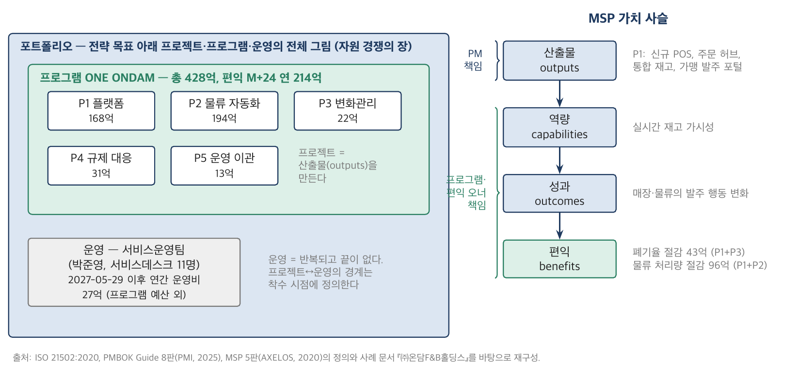

*그림 1-1. 포트폴리오·프로그램·프로젝트·운영의 관계와 MSP 가치 사슬. 포트폴리오 안에 프로그램 ONE ONDAM(428억, 다섯 프로젝트)과 운영이 함께 놓인다. 오른쪽은 MSP의 outputs → capabilities → outcomes → benefits 사슬로, 산출물까지가 PM의 책임이고 그 뒤는 프로그램·편익 오너의 책임이다. ISO 21502, PMBOK 8판, MSP 5판의 정의와 사례 문서를 바탕으로 재구성.*

### 온담의 사례로 읽기

> ■ **사례 사실** — ONE ONDAM 프로그램 428억, 다섯 프로젝트 P1 168 / P2 194 / P3 22 / P4 31 / P5 13억(사례 §2.5, P-01); 이사회 승인 편익 M+24 연 214억 — 폐기율 43억은 P1의 재고 가시성에서, 물류 처리량 96억은 P2 설비에서 나온다(§5.5 B-04·B-06); 종료 후 운영은 서비스운영팀 박준영(데스크 11명), 연 운영비 27억은 프로그램 예산 밖(§4.2, P-27).

ONE ONDAM은 프로그램이다. 총 428억 원, 다섯 개 프로젝트(P1 플랫폼 168억, P2 물류 자동화 194억, P3 변화관리 22억, P4 규제 대응 31억, P5 운영 이관 13억)로 구성되고, 이사회가 승인한 편익은 M+24 시점 연간 절감 214억 원이다. 이 214억은 어느 한 프로젝트가 만들지 않는다. 폐기율 절감 43억은 P1이 만드는 실시간 재고 가시성(산출물)이 매장·물류의 발주 행동을 바꿀 때(역량 → 성과) 비로소 나타나고, 물류 처리량 절감 96억은 P2의 설비와 P1의 재고 원장이 함께 작동해야 나온다. 편익이 프로젝트 경계를 넘어서 발생한다는 사실 자체가 이 일을 프로그램으로 묶어야 하는 이유다.

여러분이 4일 동안 관리하는 P1은 그 프로그램 안의 프로젝트다. P1의 산출물은 명확하다 — 신규 POS, 주문 허브, 통합 재고, 가맹 발주 포털, 통합 계층과 데이터 전환. 그러나 P1의 편익은 P1 혼자 만들지 못한다. 이 구분을 헌장에 정확히 적는 것이 제3장의 과제다.

운영과의 경계도 온담에 있다. P5 운영 이관이 끝나는 2027-05-29 이후 새 플랫폼은 운영본부 서비스운영팀(박준영 팀장, 서비스데스크 11명)의 것이 된다. 연간 운영비 27억 원은 프로그램 예산 428억에 들어 있지 않고 운영 예산이다. 프로젝트가 끝나는 지점과 운영이 시작되는 지점을 착수 시점에 정의하지 않으면, 종료 시점에 "이건 프로젝트가 마저 해 줘야 한다"와 "이건 운영이 받아야 한다"의 다툼이 반드시 일어난다.

### 실무에서 어떻게 틀리는가

가장 흔한 오류는 **프로그램을 프로젝트 도구로 관리하는 것**이다. 한국 대기업의 "전사 혁신 과제", "디지털 전환 TF"는 대부분 정의상 프로그램인데, 하나의 WBS·하나의 일정·하나의 PM으로 관리된다. 그러면 세 가지가 무너진다. 첫째, 편익의 소유자가 없어진다 — 프로젝트 PM은 산출물까지만 책임질 수 있는데 편익 214억이 PM의 KPI로 내려온다. 둘째, 프로젝트 사이의 의존이 관리되지 않는다 — P2 설비 리드타임이 34주에서 41주로 늘어날 수 있다는 벤더 통지는 P1의 컷오버 일정을 바꾸지만, P1 PM에게는 그것을 다룰 권한이 없고 프로그램 계층이 없으면 아무도 다루지 않는다. 셋째, 종료 조건이 흐려진다 — 산출물이 나왔는데 편익이 안 나오면 프로젝트가 끝났는지 안 끝났는지 아무도 말할 수 없다.

반대 방향의 오류도 있다. **운영을 프로젝트로 포장하는 것**이다. 매년 반복되는 시스템 업그레이드, 연례 매장 리뉴얼을 프로젝트로 만들면 매번 헌장·킥오프·종료 보고서가 붙고, 조직은 문서를 만드는 데 지친다. 반복되고 끝이 없는 일은 운영이며, 운영에는 운영의 관리 방식(ITIL의 practice, 서비스 수준 관리)이 따로 있다. Day4에서 다룬다.

### 표준에서는 뭐라 하는가

PMBOK 8판은 프로젝트를 포트폴리오·프로그램·운영과의 관계 속에서 설명하며, 8판의 첫 번째 원칙 "총체적 관점 채택(Adopt a holistic view)"이 바로 이 관계를 보라는 요구다. PRINCE2 7은 프로젝트를 "합의된 비즈니스 케이스에 따라 하나 이상의 비즈니스 제품을 인도할 목적으로 만들어진 임시조직"으로 정의한다 — 여기서 주목할 단어는 **임시조직(temporary organization)**과 **비즈니스 케이스**다. ISO 21502는 프로젝트를 "조직의 맥락(organizational context)" 안에 두고, 프로젝트가 조직의 전략·거버넌스·운영과 어떻게 연결되는지를 §4에서 먼저 서술한 뒤 프로젝트 관리 실무를 §6~7에서 다룬다. 세 표준 모두 프로젝트를 고립된 것으로 보지 않는다. 이 점이 다음 절들의 출발점이다.

---

## 1.2 프로젝트는 왜 실패하는가 — 통계를 그대로 믿으면 안 되는 이유

### 흔히 인용되는 숫자

프로젝트 관리 교육과 제안서, 임원 보고서에 가장 자주 등장하는 통계는 Standish Group의 CHAOS Report다. "IT 프로젝트의 성공률은 30% 안팎이고 절반 이상이 문제를 겪으며(challenged) 나머지는 실패한다"는 문장을 여러분도 본 적이 있을 것이다. 1994년 첫 보고서의 표본은 응답자 365명·애플리케이션 8,380건이었고, 성공 16%·challenged 53%라는 숫자가 이후 30년 동안 업계의 상식이 되었다.

이 숫자를 그대로 믿으면 안 된다. 두 논문이 그 이유를 보여 준다.

### Eveleens & Verhoef — 정의가 잘못되었다

Eveleens와 Verhoef는 2010년 IEEE Software에 실린 「The Rise and Fall of the Chaos Report Figures」에서 Standish의 성공 정의 자체를 검토했다. Standish는 "최초 추정한 시간·비용·기능 안에 완료된 프로젝트"를 성공으로, 완료되었으나 추정을 초과한 것을 challenged로 분류한다. 저자들은 자체 데이터 1,211개 실제 프로젝트의 5,457개 추정치에 이 정의를 그대로 적용했다.

결과는 이렇다. 추정치를 실제보다 10~100배 부풀리는 관행을 가진 어느 조직(논문의 Organization X)은 이 정의로는 약 70%가 "성공"이다. 추정이 실제와 훨씬 가깝지만 약간 과소추정하는 경향이 있는 Landmark Graphics는 6%만 "성공"이다. 그리고 Landmark의 편향 방향만 반대로 뒤집은 가상의 조직은 94%가 "성공"이 된다. 즉 이 지표는 프로젝트가 얼마나 잘 관리되었는지가 아니라 **추정이 어느 방향으로 편향되어 있는지**를 측정한다. 저자들은 네 가지 문제를 정리한다 — 오도적이고(misleading), 일방적이며(one-sided), 추정 관행을 왜곡하고(pervert the estimation practice), 결국 의미 없는 숫자(meaningless figures)라는 것이다.

세 조직의 '성공률'을 나란히 놓으면 이 지표가 무엇을 재는지 드러난다(그림 1-2).

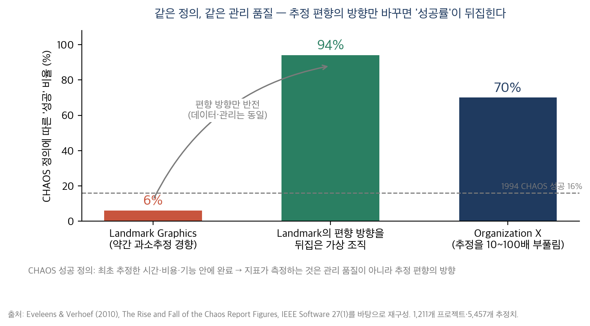

*그림 1-2. CHAOS 성공 정의의 결함 — 추정 편향의 방향에 따라 뒤집히는 '성공률'. 같은 정의를 적용해도 과소추정 조직(Landmark)은 6%, 편향 방향만 뒤집은 가상 조직은 94%, 추정을 크게 부풀리는 Organization X는 70%가 '성공'이 된다. 지표가 측정하는 것은 관리 품질이 아니라 추정 편향의 방향이다. Eveleens & Verhoef (2010)를 바탕으로 재구성.*

세 번째 문제가 실무에서 가장 중요하다. 이 지표를 KPI로 쓰는 조직에서 합리적 행동은 **추정을 부풀리는 것**이다. 여유를 크게 잡으면 "성공"이 늘어난다. 조직이 성공률을 높이려 하면 할수록 추정은 나빠진다. 여러분 회사가 "일정 준수율"을 PM 평가 지표로 쓰고 있다면 같은 메커니즘이 이미 작동하고 있을 가능성이 높다.

Jørgensen과 Moløkken-Østvold의 2006년 논문 「How large are software cost overruns?」은 다른 각도에서 1994년 보고서를 검토했다. 이들은 "평균 원가 초과 189%"라는 널리 인용되는 값 자체의 신뢰성을 문제 삼았고, 다른 연구들의 원가 초과율이 그보다 훨씬 낮다는 점을 지적했다.

두 논문의 결론은 "프로젝트는 실패하지 않는다"가 아니다. **이 숫자로는 아무것도 알 수 없다**는 것이다.

### Flyvbjerg — 다른 데이터, 다른 결론

Bent Flyvbjerg는 반대 방향에서 접근했다. 그는 응답 설문이 아니라 실제 인프라 프로젝트의 최초 승인 예산과 최종 실적을 수십 년에 걸쳐 수집했고, 그 데이터에서 그가 "iron law of megaprojects"라고 부르는 규칙성을 발견했다 — "Over budget, over time, over and over again." 2014년 Project Management Journal의 개관 논문에서 그는 두 가지 관찰을 제시한다. 첫째, 대형 프로젝트 열 중 아홉은 원가를 초과한다. 둘째, 원가·일정·편익 세 차원 각각에서 계획대로 되는 확률을 1/10로 잡으면 셋을 동시에 만족할 확률은 약 1/1,000이고, 관대하게 각 2/10으로 잡아도 8/1,000이다.

이 두 관찰은 자주 뒤섞여 인용된다. "90%가 초과한다"는 것이 iron law이고, 곱셈 구조는 별개의 논증이다. 곱셈 구조가 말하는 바는 조직이 대개 한 차원(대개 일정)만 관리하면서 프로젝트를 성공이라 부른다는 것이다. 온담의 2019년 스마트오더는 34억 원을 예산 안에서 썼지만 8개월 만에 중단됐다. 원가 차원은 성공이고 편익 차원은 실패다. 이런 프로젝트를 무엇이라 부를 것인가가 다음 소절의 주제다.

두 관찰을 분리해 그리면 그림 1-3과 같다.

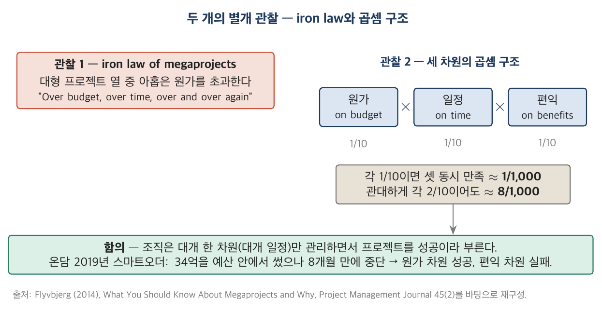

*그림 1-3. Flyvbjerg의 두 관찰 — iron law와 세 차원의 곱셈 구조. 관찰 1(열 중 아홉이 원가 초과)과 관찰 2(원가·일정·편익 각 1/10이면 셋 동시 만족은 약 1/1,000, 각 2/10이어도 8/1,000)는 별개의 논증이다. 온담의 2019년 스마트오더는 원가 차원 성공, 편익 차원 실패다. Flyvbjerg (2014)를 바탕으로 재구성.*

Flyvbjerg의 처방은 **reference class forecasting(RCF)**이다. Kahneman과 Tversky가 1979년에 정식화한 outside view를 실제 예측 절차로 옮긴 것으로, 절차는 세 단계다. (1) 지금 계획하는 프로젝트와 유사한 과거 프로젝트 집합(reference class)을 20~30건 이상 확보한다. (2) 그 집합에서 관심 변수(예: 최종 실적 ÷ 최초 승인 예산)의 분포를 구한다. (3) 그 분포에서 원하는 신뢰 수준의 값을 읽어 현재 추정치에 상향 조정(uplift)을 적용하거나, 현재 프로젝트의 상대적 위험을 판단한다. 영국 재무부의 Green Book과 교통부(DfT)가 이 절차를 공식 지침에 탑재했다.

RCF의 핵심은 순서다. **내부 추정을 먼저 만들고 RCF로 검증하면 안 된다.** 앵커링 때문에 내부 추정치가 기준점이 되어 버린다. 외부 분포를 먼저 보고, 그다음에 "우리 프로젝트가 그 분포의 어디에 있을 이유가 있는가"를 묻는 것이 올바른 순서다. 그리고 reference class를 너무 좁게 잡으면 안 된다. "우리와 완전히 같은 프로젝트"만 찾으면 표본이 세 개가 되고, 그것은 Flyvbjerg가 uniqueness bias라고 부르는 함정의 작동 방식이다.

올바른 순서와 틀린 순서를 대조하면 그림 1-4와 같다.

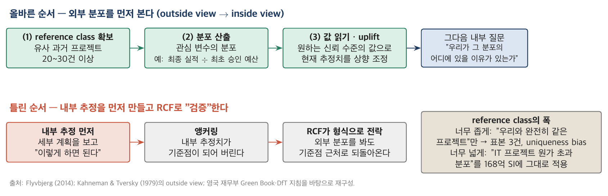

*그림 1-4. Reference Class Forecasting의 3단계와 순서가 뒤집혔을 때의 앵커링. 위: 외부 분포를 먼저 보는 올바른 순서(reference class 확보 → 분포 산출 → uplift → 그다음 내부 질문). 아래: 내부 추정을 먼저 만들면 그 값이 기준점이 되어 RCF가 형식으로 전락한다. reference class는 너무 좁아도(uniqueness bias) 너무 넓어도 틀린다. Flyvbjerg (2014), Kahneman & Tversky (1979)를 바탕으로 재구성.*

### 그러면 Flyvbjerg의 숫자는 믿어도 되는가

Flyvbjerg의 데이터는 Standish와 달리 실측 기반이고 정의가 명확하다. 그러나 그것도 그대로 옮겨 쓰면 안 된다. 그의 표본은 교통·에너지·올림픽 같은 공공 인프라가 중심이고, 2022년 JMIS 논문에서 IT 프로젝트 5,392건을 다루긴 했지만 그것도 특정 데이터베이스의 표본이다. 한국 중견기업의 168억 원 SI 프로젝트에 "IT 프로젝트 원가 초과 분포"를 그대로 적용하는 것은 reference class를 너무 넓게 잡는 반대쪽 오류다.

여기서 배울 것은 숫자가 아니라 태도다. **남의 통계를 인용하지 말고 자기 조직의 base rate를 만들라.** 온담에는 이미 데이터가 있다 — 2014년 SAP 도입 74억(계획 대비 실적은 사례 문서에 없으므로 워크북에서 가정을 세운다), 2019년 스마트오더 34억(중단), 2022년 WMS 고도화 12억(범위 63% 축소), 2025년 검사기록 디지털화 견적 34억(반려). 네 건은 reference class로 삼기에는 너무 적다. 그러나 "우리 회사의 정보화 사업 네 건 중 두 건이 중단 또는 대폭 축소되었다"는 사실은 P1의 초기 리스크 등록부에 들어가야 할 base rate다. 이사회가 승인 조건 5항에 내부감사 지적을 명시한 것도 같은 인식이다.

또 하나, Flyvbjerg 자신이 2022년 논문에서 강조한 것은 IT 프로젝트의 원가 초과가 정규분포가 아니라 **멱함수(power-law) 분포**를 따른다는 점이다. 이것은 "평균 초과율에 맞춰 컨틴전시를 얹으면 된다"는 관행이 틀렸음을 뜻한다. 꼬리가 두꺼운 분포에서는 평균이 위험을 심하게 과소평가하고, 어떤 유한한 컨틴전시도 꼬리를 덮지 못한다. 처방은 버퍼 증액이 아니라 극단 사건의 전파 경로를 끊는 것, 즉 상호의존을 줄이는 분할(modularity)이다. 이 논점은 Day2의 원가 기준선과 Day3의 리스크 세션에서 다시 나온다.

두 분포의 형태를 겹쳐 놓으면 왜 평균 기반 컨틴전시가 틀리는지 보인다(그림 1-5).

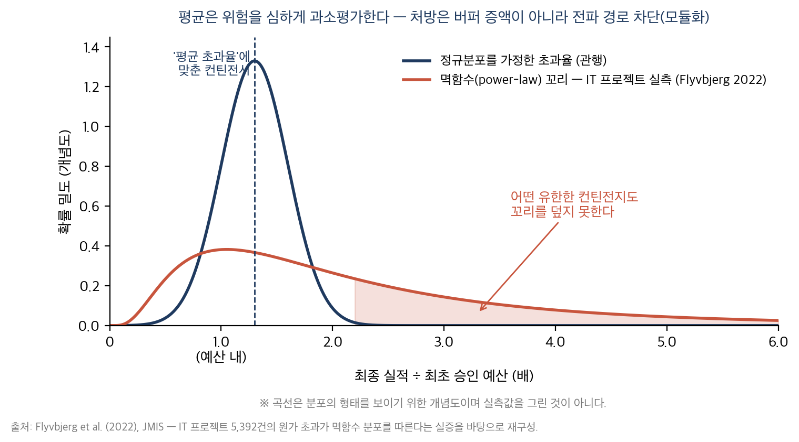

*그림 1-5. 정규분포 가정과 멱함수 꼬리 — '평균 컨틴전시'가 실패하는 이유. 정규분포를 가정하면 평균 초과율에 맞춘 컨틴전시로 대부분을 덮을 수 있다고 믿게 된다. 꼬리가 두꺼운 분포에서는 평균이 위험을 심하게 과소평가하고 어떤 유한한 컨틴전시도 꼬리를 덮지 못한다. 곡선은 분포의 형태를 보이는 개념도이며 실측값이 아니다. Flyvbjerg et al. (2022)를 바탕으로 재구성.*

### 성공의 두 정의

이 절을 닫기 전에 용어 하나를 세워 두어야 한다. Cooke-Davies는 2002년 논문 「The 'real' success factors on projects」에서 세 개의 다른 질문을 분리했다. **프로젝트 관리 성공(project management success)**은 시간·비용·범위를 지켰는가이고, **프로젝트 성공(project success)**은 프로젝트가 목표한 편익을 실현했는가이며, **지속적 성공(consistent success)**은 조직이 그것을 반복할 수 있는가이다. 세 질문의 답은 서로 독립적이다. 온타임·온버짓인데 아무도 쓰지 않는 시스템이 있고, 6개월 지연되고 20% 초과했는데 회사를 살린 시스템이 있다.

세 정의와 그 조합을 그림 1-6에 정리했다.

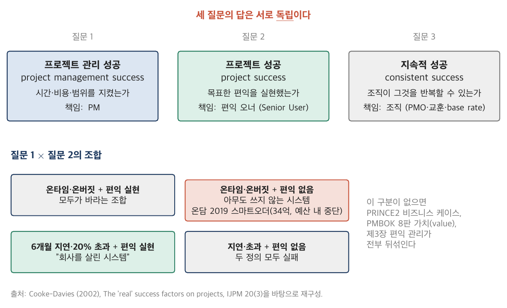

*그림 1-6. Cooke-Davies의 성공 세 정의와 그 독립성. 프로젝트 관리 성공(시간·비용·범위, PM 책임), 프로젝트 성공(편익, 편익 오너 책임), 지속적 성공(조직의 반복 능력)은 서로 독립이다. 아래 2×2는 질문 1과 질문 2의 조합으로, 온담 2019 스마트오더는 '온타임·온버짓 + 편익 없음' 칸에 놓인다. Cooke-Davies (2002)를 바탕으로 재구성.*

이 구분을 세우지 않으면 제2장에서 PRINCE2의 비즈니스 케이스, PMBOK 8판의 가치(value), 제3장의 편익 관리 논의가 전부 뒤섞인다. 여러분이 이 과정에 들어오기 전에 제출한 "최근 종료된 프로젝트의 온타임·온버짓 여부와 편익 달성 여부"는 바로 이 두 정의를 분리해 보라는 뜻이었다.

### 실무에서 어떻게 틀리는가

임원 보고서에 CHAOS 수치를 "업계 표준 실패율"로 인용하는 것이 첫 번째 오류다. 경력 있는 청중 앞에서 이 숫자를 쓰면 그 자리에서 신뢰를 잃는다. 두 번째 오류는 반대로 "그러니 프로젝트 관리는 소용없다"고 결론짓는 것이다. Eveleens와 Verhoef의 결론은 지표가 의미 없다는 것이지 프로젝트가 실패한다는 것도 성공한다는 것도 아니다. 세 번째 오류는 Flyvbjerg의 iron law를 "메가프로젝트는 다 실패한다"는 냉소로 쓰는 것이다. 그의 실제 결론은 "best practice는 예외이고 average practice가 재앙"이라는 것이며, 그래서 성공 사례(마드리드 지하철 확장, 빌바오 구겐하임)를 따로 연구해야 한다는 연구 의제로 이어진다. 네 번째는 자기 조직의 base rate를 만들지 않는 것이다. 통계를 비판할 줄 아는 조직은 많지만, 자기 데이터를 모으는 조직은 드물다.

---

## 1.3 프로젝트를 임시조직으로 본다는 것

### 개념

표준은 프로젝트를 라이프사이클로 설명한다. 착수·계획·실행·감시통제·종료라는 단계가 있고, 각 단계에 프로세스와 산출물이 있다. 이 그림은 유용하지만 한 가지를 설명하지 못한다 — 왜 프로젝트 안의 사람들이 그렇게 행동하는가.

Lundin과 Söderholm은 1995년 Scandinavian Journal of Management에 실린 「A theory of the temporary organization」에서 다른 렌즈를 제안했다. 프로젝트를 프로세스의 연쇄가 아니라 **임시조직(temporary organization)**으로 보자는 것이다. 임시조직은 네 가지 구조 개념으로 정의된다.

- **시간(Time)** — 임시조직에는 끝이 있다. 영구조직에서 시간은 흐르는 것이지만, 임시조직에서 시간은 소모되는 것이다. 남은 시간이 줄어든다는 사실이 모든 결정을 압박한다.
- **과업(Task)** — 임시조직은 특정한 과업 때문에 존재한다. 과업이 끝나면 존재 이유가 사라진다.
- **팀(Team)** — 사람들이 과업을 위해 모이고, 과업 후에 흩어진다. 영구조직의 부서와 달리 팀원의 소속감은 과업에 묶여 있다.
- **전환(Transition)** — 임시조직은 무엇인가를 이전 상태에서 이후 상태로 바꾸기 위해 존재한다.

그리고 임시조직의 행위는 네 가지 개념으로 시퀀싱된다.

- **행위 기반 기업가정신(action-based entrepreneurialism)** — 누군가가 "이 일을 하자"고 말하고 사람들을 설득해야 임시조직이 생긴다. 착수는 분석의 결과가 아니라 행위의 결과다.
- **몰입 형성을 위한 단편화(fragmentation for commitment-building)** — 과업이 잘게 나뉘어야 사람들이 각자의 조각에 몰입한다. WBS는 계획 도구이기 전에 몰입 도구다.
- **계획된 고립(planned isolation)** — 임시조직은 모조직의 일상적 간섭으로부터 의도적으로 격리된다. 별도 사무실, 별도 예산, 별도 보고선.
- **제도화된 종료(institutionalized termination)** — 끝이 제도화되어 있다. 종료 보고서, 해산, 인력의 복귀.

여덟 개념과 그것이 설명하는 실무 현상의 대응을 그림 1-7에 정리했다.

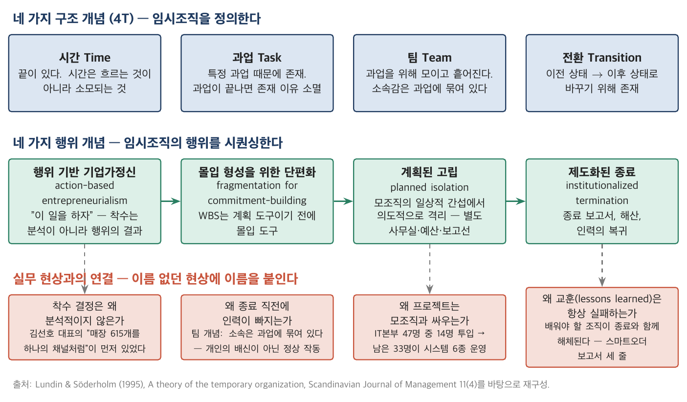

*그림 1-7. 임시조직 이론 — 4개 구조 개념(4T)과 4개 행위 개념, 그리고 그것이 설명하는 실무 현상. 위: 시간·과업·팀·전환의 네 구조 개념. 가운데: 행위 기반 기업가정신 → 몰입 형성을 위한 단편화 → 계획된 고립 → 제도화된 종료의 시퀀스. 아래: 각 개념이 설명하는 실무 현상(착수 결정의 비분석성, 종료 직전 인력 이탈, 모조직과의 긴장, 교훈의 실패). Lundin & Söderholm (1995)을 바탕으로 재구성.*

### 왜 이 관점이 실무에서 유용한가

이 여덟 개념은 실무자가 매일 겪으면서도 이름을 붙이지 못하던 현상을 설명한다.

**왜 교훈(lessons learned)은 항상 실패하는가.** 제도화된 종료 때문이다. 교훈을 배워야 할 조직이 종료와 함께 해체된다. 배운 사람은 다음 프로젝트로 흩어지고, 문서는 아무도 열지 않는 폴더에 남는다. 온담의 스마트오더 종료 보고서에 중단 사유가 세 줄만 적힌 것은 담당자가 게을러서가 아니다. 종료 시점의 임시조직에는 그 문서를 잘 쓸 유인이 구조적으로 없다.

**왜 종료 직전에 인력이 빠지는가.** 팀 개념 때문이다. 팀원의 소속은 과업에 묶여 있고, 과업의 끝이 보이면 합리적 개인은 다음 과업을 찾는다. SI 프로젝트에서 안정화 기간에 핵심 개발자가 다른 사업으로 옮겨가는 현상은 개인의 배신이 아니라 임시조직의 정상 작동이다. 이것을 막으려면 종료 이후의 경로(P5 운영 이관, 다음 프로젝트 배치)를 착수 시점에 설계해야 한다.

**왜 프로젝트는 모조직과 싸우는가.** 계획된 고립 때문이다. 고립은 프로젝트가 일하기 위한 조건이지만, 모조직에서 보면 프로젝트는 "자기들끼리 뭔가 하는 사람들"이다. 온담 IT본부 47명 중 14명이 P1에 투입되면 남은 33명이 기존 시스템 6종과 인터페이스 47본을 운영해야 한다. 프로젝트의 고립은 운영의 부담이다. 이 긴장을 관리하는 것이 거버넌스의 일이다.

**왜 착수 결정은 분석적이지 않은가.** 행위 기반 기업가정신 때문이다. 김선호 대표의 "매장 615개를 하나의 채널처럼"이라는 말이 먼저 있었고, 비즈니스 케이스는 그 말을 정당화하기 위해 나중에 쓰였다. 이것은 비판이 아니라 관찰이다. 거의 모든 프로젝트가 이렇게 시작되며, 제3장의 비즈니스 케이스 논의는 이 사실을 전제로 해야 한다.

### 어떤 프로젝트도 섬이 아니다

Engwall은 2003년 Research Policy의 「No project is an island: linking projects to history and context」에서 임시조직 이론을 한 걸음 더 밀었다. 그의 주장은 프로젝트의 일정·예산·조직 구성·핵심 갈등이 착수 전에 이미 조직의 역사와 정치로 상당 부분 결정되어 있다는 것이다. 킥오프 시점에 PM이 하는 진짜 일은 계획을 세우는 것이 아니라 **이미 결정된 것들을 목록화하는 것**이다.

온담에서 이것은 명백하다. P1의 컷오버가 2027년 2월 마지막 주말이어야 하는 이유는 프로젝트 분석의 결과가 아니라 2019년 사모펀드 투자 계약의 2027년 IPO 조항 때문이다. 요구사항 1,180건 중 IT본부가 인터페이스와 데이터 구조(SyRS 396건)를 먼저 확정하려는 이유는 2011년 OD-POS를 박세연 본부장이 직접 만들었고 문서 없는 인터페이스 13본이 그 시기에 생겼기 때문이다. 가맹점주협의회가 판매 데이터 연동에 경계하는 이유는 2019년 스마트오더가 8개월 만에 중단된 경험 때문이다. 이 셋 중 어느 것도 P1이 만든 것이 아니지만, 셋 다 P1의 범위와 일정과 이해관계자 등록부를 결정한다.

Engwall의 방법론적 함의는 프로젝트를 이해하려면 그 프로젝트 하나를 분석하는 것으로는 부족하고, 앞선 프로젝트들과의 관계를 봐야 한다는 것이다. 여러분이 새 프로젝트를 맡을 때 첫 주에 해야 할 일은 그 조직에서 직전에 끝난(또는 중단된) 비슷한 프로젝트 두세 개의 종료 보고서를 읽는 것이다.

### 실무에서 어떻게 틀리는가

"임시조직"을 "한시적 조직"이라는 사전적 의미로만 쓰는 것이 첫 번째 오류다. 이론의 핵심은 시간 제약이 조직의 행위 논리 자체를 바꾼다는 것이며, 분석 단위가 결정(decision)이 아니라 행위(action)라는 점이다. 두 번째 오류는 4T를 헌장 체크리스트로 만드는 것이다. "시간·과업·팀·전환을 각각 적으시오"는 이론을 양식으로 전락시킨다. 세 번째는 "맥락이 중요하다"는 상투구로 Engwall을 축약하는 것이다. 그의 주장은 인과 주장이다 — 직전 프로젝트의 정치적 결과가 이번 프로젝트의 특징을 설명한다. 그래서 종료 보고서를 읽으라는 처방이 나온다.

### 학술적으로는

임시조직 문헌은 Bakker의 2010년 체계적 리뷰(International Journal of Management Reviews)가 지도를 그렸고, Sydow와 Braun의 2018년 논문이 조직 간(interorganizational) 차원 — 발주사·수행사·하도급이 얽힌 한국 SI·건설 구조를 다룰 수 있는 유일한 이론 가지 — 을 정리했다. 같은 1995년 특집호에 실린 Kreiner의 「In search of relevance: Project management in drifting environments」는 환경이 흐르므로 계획을 잘 지키는 것이 오히려 관련성 상실로 이어질 수 있다는 역설을 제시한다. 이 역설은 Day3의 변경 관리에서 다시 만난다.

---

## 1.4 프로젝트 유형은 하나가 아니다 — NTCP 다이아몬드

### 개념

"모든 프로젝트에 같은 방법을 쓰면 안 된다"는 말에는 누구나 동의한다. 그런데 "그럼 무엇을 기준으로 다르게 하는가"에 답하는 표준은 없다. PMBOK 7판과 8판 모두 테일러링을 강조하지만 판단 기준을 주지 않는다. Shenhar와 Dvir는 2007년 『Reinventing Project Management』에서 600여 프로젝트의 실증 연구를 바탕으로 그 기준을 네 개의 축으로 제안했다. NTCP — Novelty, Technology, Complexity, Pace다.

네 축의 단계 수가 서로 다르다는 점이 이 모델의 핵심이며, 여기서 교재 오류가 자주 난다. **Novelty 3단계, Technology 4단계, Complexity 3단계, Pace 4단계**다.

| 축 | 질문 | 단계 | 이 축이 결정하는 것 |
|---|---|---|---|
| **Novelty** (신규성) | 시장과 사용자에게 이 산출물이 얼마나 새로운가 | derivative (파생) / platform (플랫폼) / breakthrough (돌파) | 요구사항을 언제 확정할 수 있는가. 시장 조사의 신뢰도 |
| **Technology** (기술) | 사용하는 기술이 얼마나 성숙한가 | low-tech / medium-tech / high-tech / super-high-tech | 설계 동결 시점과 설계 반복(design cycle) 횟수 |
| **Complexity** (복잡성) | 시스템의 범위와 계층이 얼마나 넓은가 | assembly (조립) / system (시스템) / array (배열 — 시스템의 시스템) | 조직 구조와 절차의 형식성. 하도급·인터페이스 관리 |
| **Pace** (속도) | 시간이 얼마나 결정적인가 | regular / fast-competitive / time-critical / blitz | 의사결정 권한의 위임 수준. 상위 관리자의 개입 정도 |

각 축의 위치를 다이아몬드 모양 그림 위에 찍어 연결하면 그 프로젝트의 프로파일이 된다. 다이아몬드가 클수록(바깥쪽일수록) 리스크가 크고 관리 방식이 더 유연해야 한다. 중요한 것은 네 축이 **직교(orthogonal)**한다는 점이다. 네 점수를 합산해 "난이도 등급"을 만드는 것은 모델을 무의미하게 만든다. 각 축은 서로 다른 관리 처방에 대응한다.

### 온담 P1을 이 모델로 진단하면

> ■ **사례 사실** — 사용자 규모 매장 직원 1,510명·가맹점주 331명·B2B 거래처 260개사(§1.4, C-08~C-10); 문서 없는 인터페이스 13본(§2.1, C-18), 전환 대상 1,842 테이블·7.4TB(§3.2, P-10), 3PL WMS 커스터마이징 불가(§3.5); 계약 상대 벤더 11개사(P-28), PMO 프로그램 4 + P1 3명(P-29), 별도 법인 온담푸드시스템(§4.2); **고정 기한 3개** — 개인정보 보호법 대응 2026-09-11, 컷오버 창 2027-02-26~28(IPO 2027년 3분기 예비심사에서 역산), 전자금융업 등록 2027-03-31(§3.4·§5.4); 대표이사 "가능하다면 더 앞당기라" / CFO "1차연도 148억으로 줄이라"(§6.3 세 개의 시계).

P1을 축별로 놓아 보자. 여기서 제시하는 판단은 하나의 예시이며, 워크북에서 여러분은 스스로 다시 판단하고 근거를 적게 된다.

**Novelty — platform.** 새 POS와 주문 허브는 온담에게 새롭지만 시장에는 흔하다. 옴니채널 주문, 클라우드 POS, 가맹 발주 포털은 모두 선행 사례가 있는 유형이다. 그러나 온담의 사용자(매장 직원 1,510명, 가맹점주 331명, B2B 거래처 260개사)에게는 업무 방식 자체가 바뀌는 플랫폼급 변화다. derivative는 아니다 — OD-POS 2.1의 개선이 아니라 구조(로컬 DB + 야간 동기화 → 중앙 실시간)를 바꾸기 때문이다. breakthrough도 아니다 — 시장이 이런 제품을 어떻게 쓰는지는 알려져 있다. platform 수준의 처방은 "요구사항을 초기에 대부분 확정할 수 있지만 사용자 검증을 여러 번 거쳐야 한다"이며, 이것은 P1이 2주 스프린트 36회의 하이브리드를 택한 것과 맞는다.

**Technology — medium-tech.** 클라우드, API 게이트웨이, MDM, SAP 애드온은 모두 성숙한 기술이다. 새로 발명할 것은 없다. 그러나 문서 없는 인터페이스 13본을 재구축해야 하고, 1,842개 테이블·7.4TB를 전환해야 하며, 3PL이 소유한 WMS와의 연동 방식을 바꿔야 한다. 기술 자체는 낮지만 **기존 기술의 미지(unknown)**가 크다. medium-tech 처방은 "설계 동결을 한 번 또는 두 번, 프로토타입 후 확정"이다. P1의 설계 스프린트 6회와 데이터 전환 리허설 3회가 그 두 번의 반복에 해당한다.

**Complexity — array에 가까운 system.** P1 자체는 다섯 개 산출물이 통합되는 system 수준이다. 그러나 P1은 ONE ONDAM 프로그램의 척추이며 P2의 설비, P4의 규제, P5의 운영과 인터페이스로 묶여 있다. 벤더 11개사, 별도 법인 ㈜온담푸드시스템, 3PL 대성로지스가 계약 주체로 얽힌다. 프로그램 관점에서 보면 array다. array 수준의 처방은 "형식적 계약·문서·인터페이스 관리, 별도의 통합 조직"이며, 프로그램 PMO 4명과 P1 PMO 3명, 형상관리·인터페이스 목록의 관리가 이 처방에 해당한다.

**Pace — time-critical.** 컷오버 2027-02-26~28은 IPO 예비심사 일정에서 역산된 창이고, 개인정보 보호법 대응 2026-09-11과 전자금융업 등록 2027-03-31은 협상 불가능한 외부 기한이다. 이것은 fast-competitive(빨리 하면 좋다)가 아니라 time-critical(기한을 놓치면 프로젝트의 의미가 크게 훼손된다)이다. blitz(위기 대응)는 아니다. time-critical 처방은 "일정 관리에 최상위 우선순위, 의사결정 권한의 상당한 위임, 상위 관리자의 밀착 관여"다. 대표이사가 착수 회의에서 "가능하다면 더 앞당기라"고 한 것과, CFO가 1차연도 집행을 148억으로 줄이라고 한 것은 이 축에서 정면으로 충돌한다. 헌장의 우선순위 항목이 이 충돌을 적어야 한다.

이 진단에서 나오는 결론은 P1이 **"표준 SI 프로젝트"가 아니라는 것**이다. 기술은 낮지만 복잡성은 array급이고 속도는 time-critical이다. 이 조합은 "기술 리스크보다 통합·일정 리스크에 관리 자원을 집중하라"는 처방을 준다. 그리고 같은 프로그램의 P2(물류 자동화 설비)는 전혀 다른 프로파일 — Technology는 medium이지만 설비 발주 후 되돌릴 수 없고 Pace는 리드타임에 묶여 있다 — 을 갖는다. 같은 프로그램 안의 두 프로젝트가 같은 관리 방식을 써서는 안 된다는 것을 이 그림 한 장이 보여 준다. 제2장의 테일러링에서 이 대조를 이어 간다.

네 축의 위치를 다이아몬드 위에 찍으면 P1의 프로파일은 그림 1-8과 같다.

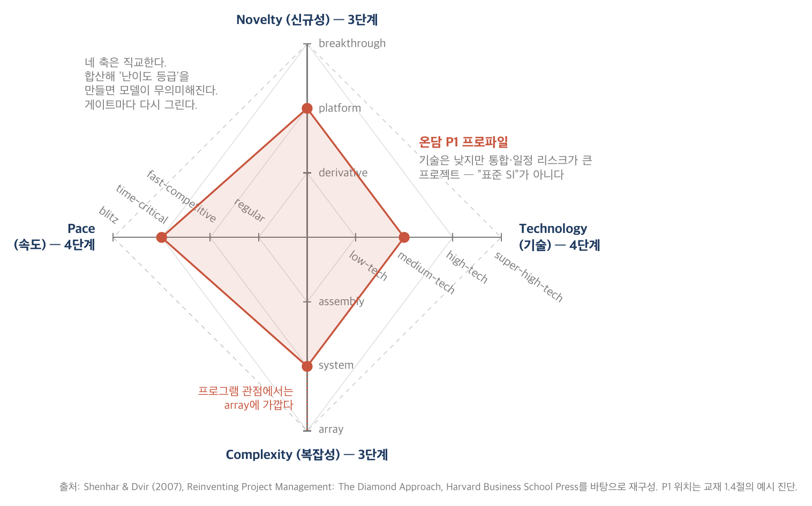

*그림 1-8. NTCP 다이아몬드 — 온담 P1의 위치. 네 축의 단계 수가 다르다(Novelty 3 / Technology 4 / Complexity 3 / Pace 4). 온담 P1은 Novelty=platform, Technology=medium-tech, Complexity=system(프로그램 관점에서는 array에 가깝다), Pace=time-critical에 위치한다. 네 축은 직교하며 합산하지 않는다. Shenhar & Dvir (2007)를 바탕으로 재구성.*

### 실무에서 어떻게 틀리는가

첫 번째 오류는 네 축을 점수로 합산해 "이 프로젝트는 3.2등급"이라고 말하는 것이다. 축은 직교하며 각각 다른 처방으로 이어진다. 두 번째 오류는 착수 시점에 한 번 그리고 끝내는 것이다. Pace는 특히 프로젝트 중간에 승격한다 — fast-competitive였던 프로젝트가 경쟁사 발표로 time-critical이 되고, 규제 기한이 다가오면 blitz가 된다. 게이트마다 다시 그려야 한다. 세 번째 오류는 그림만 그리고 처방을 정하지 않는 것이다. 다이아몬드는 진단이 아니라 처방 근거이며, "이 축이 이 단계이므로 이 프로세스를 이렇게 조정한다"는 규칙표가 함께 만들어져야 한다. 그 규칙표가 제2장의 테일러링 결정 기록이다.

### 학술적으로는

NTCP는 상황적합이론(contingency theory)을 프로젝트에 적용한 것이다. Shenhar 등의 2001년 Long Range Planning 논문 「Project Success: A Multidimensional Strategic Concept」은 성공을 4차원(project efficiency / impact on the customer / direct business and organizational success / preparing for the future)으로 정의했고, 2007년 책에서 impact on the team을 더해 5차원이 되었다. 두 문헌을 인용할 때 차원 수를 혼동하지 말아야 한다. 이 다차원 성공 모델의 핵심은 차원의 상대적 중요도가 시간에 따라 변한다는 것이다 — 효율은 종료 시점에, 고객 영향은 1~2년 후에, 미래 준비는 3~5년 후에 측정한다. 온담의 편익 검토 게이트 G5가 P1 종료(2027-05) 후 10개월 뒤인 2028-03-31에 잡혀 있는 것은 이 시간차를 반영한 것이다. Baccarini의 1996년 4페이지 논문 「The concept of project complexity—a review」는 Complexity 축을 differentiation(구성 요소의 수와 다양성)과 interdependency(상호의존)의 두 변수로 조작화했는데, 이것이 Flyvbjerg의 멱함수 생성 메커니즘(상호의존에 의한 연쇄)과 연결된다. 복잡성과 불확실성은 다른 개념이다 — Padalkar와 Gopinath(2016)가 문헌 차원에서 정리했듯 복잡성은 구조의 속성이고 불확실성은 정보의 상태이므로 처방이 다르다(복잡성 → 구조 분할, 불확실성 → 학습 반복).

---

## 1.5 분야별 대조 — 같은 단어, 다른 리듬, 다른 되돌림 비용 (심화)

프로젝트라는 같은 단어가 SI, 건설·EPC, 제조 NPD, 제약 임상에서 얼마나 다른 것을 가리키는지는 그 분야를 옮겨 본 사람만 안다. 이 절은 네 분야를 다섯 가지 축으로 대조한다. 여러분이 어느 분야에 있든 나머지 세 분야의 리듬을 알아야 하는 이유는, 온담 같은 프로그램에서 SI(P1)와 설비(P2)와 변화관리(P3)가 같은 테이블에 앉기 때문이다.

| 축 | SI (정보시스템 구축) | 건설·EPC | 제조 NPD (신제품 개발) | 제약 임상·규제 |
|---|---|---|---|---|
| **산출물의 성격** | 소프트웨어 — 복제 비용 0, 수정 가능 | 물리 구조물 — 한 번 세우면 그 자리에 있음 | 물리 제품 + 양산 공정 | 승인(approval) — 규제기관의 결정 |
| **되돌림 비용** | 낮음~중간. 코드는 고칠 수 있으나 데이터 전환과 컷오버는 되돌리기 어렵다 | 매우 높음. 기초 타설 후에는 설계 변경이 곧 철거 | 높음. 금형 제작 후 설계 변경은 주 단위 재작업, 양산 후에는 리콜 | 극단적. 제출 후 문서 세트가 잠기고, 심사 시계는 제출자가 통제하지 못한다 |
| **리듬을 결정하는 것** | 요구사항 확정 시점과 인터페이스 상대의 준비 | 자재 리드타임, 공정 순서(Path of Construction), 날씨·인허가 | 금형·부품 리드타임, EVT/DVT/PVT 동결 단계 | 규제기관의 심사 일정, 추가자료 요구 왕복 횟수 |
| **범위가 정해지는 시점** | 늦다. 계약 후에도 요구사항이 움직인다 | 이르다. 설계 성숙도(AACE Class)가 계약 유형을 결정 | 게이트마다 단계적으로. Gate 1~2에서 kill 가능 | 임상 프로토콜 승인 시점에 사실상 고정 |
| **주된 실패 양상** | 요구사항 팽창, 데이터 전환 실패, 인터페이스 상대 미확정 | 설계 미성숙 상태의 총액확정(LSTK) 계약, 동시지연 클레임 | 게이트가 이빨이 없어 kill이 0건, 금형 뒤의 설계 변경 | 추가자료 라운드를 0회로 가정한 일정 위에 출시일을 공표 |
| **PM이 통제 못 하는 것** | 발주사의 내부 결정, 상대 시스템 소유자 | 발주 방식, 인허가, 지반 | 협력사 부품 단산(EOL), 수율 곡선 | 규제기관 |

이 표에서 가장 중요한 열은 **되돌림 비용**이다. 되돌림 비용이 프로젝트 관리 방식을 결정한다. 되돌릴 수 있는 것은 실험할 수 있고, 실험할 수 있으면 반복적으로 일할 수 있다. 되돌릴 수 없는 것은 결정 전에 최대한 알아야 하고, 그래서 앞단(front-end)에 시간을 써야 한다. 제2장의 테일러링은 이 한 문장 위에 서 있다.

네 분야의 되돌림 비용이 시간축 위에서 어디서 급등하는지를 겹쳐 보면 그림 1-9와 같다.

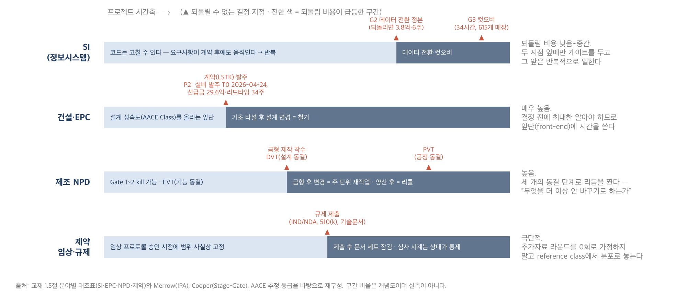

*그림 1-9. 분야별 되돌림 비용의 시간축 대조 — SI·건설/EPC·제조 NPD·제약. 각 행은 프로젝트 시간축이며 진한 색은 되돌림 비용이 급등한 구간, ▲는 되돌릴 수 없는 결정 지점이다. SI는 데이터 전환 정본(G2)과 컷오버(G3) 두 지점만 비가역이고, EPC는 계약·발주 이후, NPD는 금형 이후, 제약은 규제 제출 이후가 비가역이다. 구간 비율은 개념도이며 실측이 아니다. 교재 1.5절 대조표를 바탕으로 재구성.*

### SI

SI의 특수성은 산출물이 소프트웨어라는 데서 나온다. 코드는 고칠 수 있으므로 요구사항이 계약 후에도 움직이고, 그래서 SI의 핵심 갈등은 범위다. 온담 P1의 요구사항 1,180건, FP 12,400점, 매월 마지막 수요일 베이스라인 동결, 격주 변경협의체는 모두 이 갈등을 관리하는 장치다. SI에서 되돌리기 어려운 것은 두 가지뿐이다 — 데이터 전환(정본 결정 후 되돌리면 610개 테이블 재매핑에 3.8억·6주)과 컷오버(34시간, 615개 매장 펌웨어 일괄배포). 그래서 SI PM은 이 두 지점 앞에 게이트(G2 데이터 전환 정본 결정, G3 컷오버 승인)를 두고 그 앞은 반복적으로 일한다. 한국 SI의 또 다른 특수성은 발주사·수행사의 이원 구조다. 발주사 PM(여러분)과 수행사 PM(이재현)은 같은 프로젝트의 다른 이해관계를 가지며, 수행사는 손익률 6.5%를 지켜야 하므로 발주사의 미결정으로 인한 대기를 변경대가로 기록하려 한다. SI의 실패는 컷오버 주말에 일어나지 않는다. 컷오버 주말은 3개월 전에 이미 결정된 결과를 확인하는 자리이며, 진짜 원인은 대개 데이터 정제 착수 지연과 인터페이스 상대 시스템의 미확정이다.

### 건설·EPC

EPC(Engineering, Procurement, Construction)에서는 되돌림 비용이 극단적으로 높다. 그래서 EPC의 관리 기술은 대부분 "결정 전에 얼마나 아는가"를 다룬다. AACE의 추정 등급(Class 5~1)은 설계 성숙도(정의도 0~2%에서 50~100%까지)로 추정치의 신뢰 구간을 정하며, 설계가 Class 4 이하인 상태에서 총액확정(LSTK) 계약을 맺으면 리스크가 이전되는 것이 아니라 가격에 프리미엄으로 얹히거나 클레임으로 되돌아온다는 것을 Merrow의 IPA 데이터가 보여 준다. 온담 P2(194억, AS/RS 12,400 로케이션, 셔틀 42대)가 정확히 이 구조다. 설비 발주 확정(T0, 2026-04-24) 후에는 선급금 29.6억과 리드타임 34주(41주 가능성)가 잠기고, 처리량 4,200 케이스/시간이라는 목표가 현장에서 검증된 숫자가 아니라는 한동석 본부장의 지적은 "Class 4 설계로 target을 정했다"는 EPC의 고전적 실패 패턴이다. EPC PM이 SI PM에게 줄 수 있는 것은 "추정치를 숫자 하나가 아니라 숫자 + 정확도 밴드 + 그 밴드의 근거 산출물 목록으로 유통시키는 문화"다. SI 견적이 늘 약속으로 변질되는 이유는 밴드가 없기 때문이다.

### 제조 NPD

신제품 개발의 리듬은 Cooper의 Stage-Gate가 정의한다. 게이트는 회의가 아니라 **투자 결정**이며, 산출물은 검토 의견이 아니라 Go / Kill / Hold / Recycle 중 하나의 자원 배분 결정이다. 게이트에 다음 스테이지의 인력·예산이 붙어 있지 않으면 통과된 과제가 자원을 못 받아 늘어지고, 결국 게이트 자체가 무의미해진다. NPD의 되돌림 비용은 금형에서 급등한다 — 사출·프레스 금형은 설계 확정 후 제작에 수 주에서 수 개월이 걸리고 T1 이후 수정마다 다시 주 단위가 붙는다. 그래서 NPD는 EVT(기능 동결)·DVT(설계 동결)·PVT(공정 동결)라는 세 개의 동결 단계로 리듬을 짜며, 각 단계의 본질은 "무엇을 더 이상 안 바꾸기로 하는가"다. 온담에는 NPD 프로젝트가 없지만, P3 변화관리의 파일럿 12개점과 슈퍼유저 124명은 NPD의 "작은 규모로 먼저 검증하고 확대한다"는 논리를 빌린 것이다.

### 제약 임상·규제

규제 산업의 프로젝트는 산출물이 물건이 아니라 **승인**이라는 점에서 다르다. 규제 제출(IND/NDA, 510(k)/De Novo/PMA, 기술문서 심사)은 제출 순간 문서 세트가 잠기고, 심사 시계는 제출자가 통제할 수 없으며, 추가자료 요구는 시계를 멈추고 재개 시점을 상대가 정한다. 일반 프로젝트의 여유(float) 개념이 성립하지 않는다. 온담은 제약회사가 아니지만 P4 규제 대응 워크스트림 — 개인정보 보호법 개정 대응(2026-09-11), 전자금융업 등록(신청 2027-01-29, 심사 대응 2027-03-31), ISMS-P 인증(2027-06) — 은 같은 구조다. 최영주 CPO의 "규제 시행일은 협상 대상이 아니다"는 말은 규제 게이트의 비가역성을 정확히 표현한다. 규제 산업에서 배울 것은 "규제 마일스톤을 표준 심사 기간만큼의 고정 블록으로 간트에 놓고 추가자료 라운드를 0회로 가정하지 말라"는 것이다.

### 실무에서 어떻게 틀리는가

분야를 옮긴 PM이 가장 자주 하는 실수는 자기 분야의 도구를 그대로 들고 가는 것이다. 건설의 자원 평준화는 노무가 대체 가능하기 때문에 작동하지만, 소프트웨어 엔지니어는 대체 불가라 평준화는 곧 지연이다. 건설의 EVM CPI는 단가×수량으로 실적원가가 분리되기 때문에 정보가 있지만, IT는 인건비가 사실상 고정이라 CPI가 1 근처에 붙어 정보량이 없다. 반대로 SI의 "일단 만들고 고치자"를 설비 프로젝트에 가져가면 선급금 29.6억이 날아간다. 같은 프로그램 안에서 P1 PM과 P2 PM이 서로의 리듬을 이해하지 못하면 프로그램 운영위는 통역 없는 회의가 된다.

---

## 제1장 핵심 정리

> **한 줄씩 — 수업 직전 5분 복습용**
> 1. 프로젝트는 산출물을 만들고, 편익은 프로그램이 여러 프로젝트를 묶어야 나온다.
> 2. "성공률 30%" 같은 통계는 프로젝트 성과가 아니라 추정 편향을 재는 숫자다 — KPI로 쓰지 말라.
> 3. 처방은 reference class forecasting — 남들의 실제 분포를 먼저 보고, 우리 추정은 나중에.
> 4. 일정·예산을 지킨 것(관리 성공)과 편익이 난 것(프로젝트 성공)은 별개다.
> 5. 프로젝트는 임시조직이다 — 끝이 정해져 있다는 사실이 사람들의 행동을 바꾼다.
> 6. NTCP 네 축은 합산하지 않고 축마다 다른 처방을 읽는다; 온담 P1은 기술은 낮고 통합·일정이 위험하다.
> 7. 분야 차이의 핵심 변수는 되돌림 비용 — 되돌릴 수 있으면 반복하고, 없으면 앞단에 시간을 쓴다.
>
> 아래는 같은 내용의 자세한 판이다.

1. 프로젝트는 산출물(outputs)을 만들고, 프로그램은 산출물이 역량(capabilities)·성과(outcomes)를 거쳐 편익(benefits)이 되도록 여러 프로젝트를 함께 관리한다. 편익이 프로젝트 경계를 넘어 발생한다는 사실이 프로그램의 존재 이유다.
2. Standish CHAOS의 성공률은 프로젝트 성과가 아니라 추정 편향의 방향을 측정한다(Eveleens & Verhoef, 2010). KPI로 쓰면 추정을 부풀리는 것이 최적 행동이 된다.
3. Flyvbjerg의 iron law와 3차원 곱셈 구조는 별개의 관찰이다. 처방은 reference class forecasting이며, 외부 분포를 먼저 보고 내부 추정을 나중에 한다.
4. 프로젝트 관리 성공(시간·비용·범위)과 프로젝트 성공(편익)은 독립적이다(Cooke-Davies, 2002).
5. 프로젝트를 임시조직으로 보면(Lundin & Söderholm, 1995) 교훈의 실패, 종료 직전 인력 이탈, 모조직과의 긴장이 설명된다. 어떤 프로젝트도 섬이 아니다(Engwall, 2003) — 착수 시점의 진짜 일은 이미 결정된 것의 목록화다.
6. NTCP 다이아몬드(Novelty 3 / Technology 4 / Complexity 3 / Pace 4)는 축별로 다른 처방을 준다. 합산하지 말고, 게이트마다 다시 그린다.
7. 분야 차이의 핵심 변수는 되돌림 비용이다. 되돌릴 수 있으면 반복하고, 되돌릴 수 없으면 앞단에 시간을 쓴다.

## 생각해 볼 질문

1. 여러분 회사에서 "프로젝트"라고 불리지만 정의상 프로그램이거나 운영인 것이 있는가. 그것을 프로젝트로 부르면서 무엇이 잘못되고 있는가.
2. 여러분 조직이 PM 평가에 쓰는 지표는 추정을 어느 방향으로 밀고 있는가.
3. 온담의 2019년 스마트오더는 예산 안에서 중단됐다. 이것은 실패인가. 어느 정의로 실패인가.
4. 여러분이 가장 최근에 맡은 프로젝트의 일정·범위·조직 구성 가운데 착수 전에 이미 결정되어 있던 것은 몇 퍼센트인가. 그것을 누가 결정했는가.
5. P1의 NTCP 프로파일에서 Complexity를 system으로 볼 것인가 array로 볼 것인가. 어느 쪽으로 보느냐에 따라 무엇이 달라지는가.

## 워크북 연결

이 장은 어느 한 산출물이 아니라 Day1 워크북 **다섯 산출물 모두의 전제**다. 1.1절의 프로젝트·프로그램 구분은 워크북 §1 비즈니스 케이스 항목 4(편익 — P1 직접 기여와 P2 의존을 나눈다)와 §2 헌장 항목 5(범위 경계)에 쓰이고, 1.2절의 성공의 두 정의는 §2 헌장 항목 3(성공 기준 — 프로젝트 관리 성공과 프로젝트 성공의 두 층)에, 1.3절의 임시조직 관점은 §4 거버넌스 항목 3(에스컬레이션 시한)에, 1.4절 NTCP의 Pace=time-critical 진단은 §2 헌장 항목 13(우선순위 — 일정과 1차연도 예산의 충돌을 스폰서가 결정하게 적는다)에 그대로 쓰인다. 심화 과제(3~7년차): 온담의 과거 정보화 사업 4건(2014 SAP, 2019 스마트오더, 2022 WMS, 2025 검사기록)을 reference class의 출발점으로 삼아 P1의 초기 base rate 문장을 한 단락 쓴다 — Day2 리스크 등록부(⑩) 항목 1의 척도 정의에 붙인다.

---

# 제2장 표준의 지형 — 무엇을 따를 것인가

## 2.1 PMBOK의 계보 — 6판, 7판, 그리고 8판의 부분 회귀

### 왜 계보를 알아야 하는가

PMBOK Guide는 참고서다. 법도 아니고 계약 조건도 아니다. 그런데도 판본을 알아야 하는 이유는 세 가지다. 첫째, 여러분 회사의 PMO 표준·산출물 양식·직무기술서가 어느 판본의 목차를 인용하고 있는지에 따라 그 문서들의 조항 번호가 살아 있거나 죽어 있다. 둘째, 계약서와 RFP에 "PMBOK 준거"라고 쓰는 관행이 있으며, 판본과 문서를 특정하지 않은 그 문구는 분쟁의 씨앗이다. 셋째, 표준을 만드는 조직이 5년 사이에 자기 구조를 두 번 뒤집었다는 사실 자체가 프로젝트 관리라는 분야의 현재 상태를 말해 준다.

### 연표

```
1996   PMBOK 1판 계열 — 9 Knowledge Areas
2017   6판 — 10 Knowledge Areas / 5 Process Groups / 49 processes / ITTO
       + Agile Practice Guide (PMI와 Agile Alliance 공동 저작)
2019   APM Body of Knowledge 7판 — PMI보다 먼저 원칙·맥락 중심으로 재편
2020   ISO 21502:2020 — ISO 21500:2012를 대체하는 프로젝트 관리 본체 지침
2021   7판 — 12 principles / 8 performance domains. 프로세스·ITTO 전면 삭제
       실무 콘텐츠는 PMIstandards+(구독형 온라인)로 이전
       ISO 21500:2021 — 제목이 "Context and concepts"로 변경
2022   PMI 「Process Groups: A Practice Guide」 별책 — 7판의 공백을 PMI가 스스로 보완
2023   PRINCE2 7 (PeopleCert) — 7 principles / 7 practices / 7 processes
2025-11  8판 (디지털) — 6 principles / 7 performance domains / 5 Focus Areas / 40 processes
2026-01  8판 (인쇄본)
2026-07-09  PMP 시험 신버전 시행 (근거는 ECO, PMBOK은 참고 문헌)
```

이 연표를 시간축 위에 놓으면 그림 2-1과 같다.

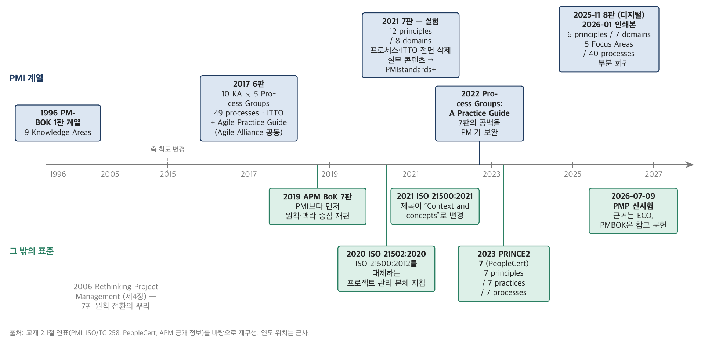

*그림 2-1. PMBOK 계보와 주변 표준의 연표 (1996–2026). 위는 PMI 계열(1996 1판 → 2017 6판 → 2021 7판 → 2022 Process Groups 별책 → 2025-11/2026-01 8판), 아래는 그 밖의 표준(2019 APM BoK 7판, 2020 ISO 21502, 2021 ISO 21500 개칭, 2023 PRINCE2 7, 2026-07-09 PMP 신시험). 2006년 Rethinking Project Management가 7판 원칙 전환의 뿌리다. 2015년 이후는 축 척도를 확대했다. 교재 2.1절 연표를 바탕으로 재구성.*

### 6판 (2017) — 아직 살아 있는 사내 표준의 원본

6판의 구조는 10개 지식영역(Integration, Scope, Schedule, Cost, Quality, Resource, Communications, Risk, Procurement, Stakeholder) × 5개 프로세스 그룹(Initiating, Planning, Executing, Monitoring and Controlling, Closing) = 49개 프로세스이며, 각 프로세스는 ITTO(Inputs, Tools & Techniques, Outputs)로 서술된다. 예를 들어 4.1 Develop Project Charter의 입력은 비즈니스 문서(비즈니스 케이스, 편익 관리 계획)·협약·기업 환경 요인·조직 프로세스 자산이고, 출력은 프로젝트 헌장과 가정 기록부다.

이 구조는 두 가지 이유로 한국 기업에 깊이 뿌리내렸다. 첫째, **감사(audit) 가능성**이다. 사내 감사·외부 감리·발주처 검수는 "이 문서가 있는가, 없는가"를 판정할 수 있는 문장을 요구하며, 49개 프로세스의 출력물 목록은 정확히 그런 문장이다. 둘째, **양식이 자산**이다. 수년간 축적된 49개 프로세스의 산출물 서식은 조직의 자산이고, 원칙 12개로는 서식이 나오지 않는다. 그래서 2026년 현재도 한국 대기업·공공 PMO의 사내 표준 문서체계는 대부분 6판 ITTO를 뼈대로 남아 있다.

이 교재는 6판을 "폐기된 판"으로 다루지 않는다. 6판은 **한국 기업 문서체계의 원본(source document)**이며, 8판이 40개 프로세스를 되살린 것은 6판이 옳았다는 뜻이 아니라 **프로세스 없는 표준은 조직이 쓸 수 없다**는 실무 피드백의 결과다.

### 7판 (2021) — 실험

7판은 프로세스와 ITTO를 전부 지우고 12개 원칙과 8개 성과영역으로 대체했다. 12원칙은 다음과 같다 — stewardship / team / stakeholders / value / systems thinking / leadership / tailoring / quality / complexity / risk / adaptability and resiliency / change. 8개 성과영역은 Stakeholders / Team / Development Approach and Life Cycle / Planning / Project Work / Delivery / Measurement / Uncertainty다.

7판에 대해 알아야 할 사실이 셋 있다. 첫째, 물리적으로 **두 문서가 한 권**에 묶여 있다 — ANSI 승인 표준인 『The Standard for Project Management』와 안내서인 『PMBOK Guide』다. 계약서에 "PMBOK 7판 준거"라고 쓰면 어느 문서를 말하는지 불명확해지며, ANSI 표준을 인용해야 하는 자리에 Guide를 인용하면 준거 문구가 무력해질 수 있다. 둘째, 원칙 12개는 감사할 수 없는 문장이다. "성실하고 존중하며 배려하는 관리자가 되라(Be a diligent, respectful, and caring steward)"를 준수했는지 참/거짓으로 판정할 방법이 없다. 그래서 7판은 ISO 9001 내부심사, CMMI, 정보시스템 감리, 사내 위임전결규정 어디와도 연결되지 못했고, 한국 PMO들은 7판을 책장에 꽂아 둔 채 6판 ITTO 표를 계속 썼다. 셋째, 얇아진 대가로 실무 콘텐츠가 PMIstandards+라는 구독형 온라인 플랫폼으로 옮겨갔다. 사내 표준 문서에서 이 플랫폼 링크를 걸면 비회원 직원은 접근할 수 없다.

7판의 원칙 전환은 PMI의 독창적 결단이 아니었다. APM Body of Knowledge 7판이 2019년에 먼저 원칙·맥락 중심으로 재편했고, 그 뿌리는 2006년 Rethinking Project Management 연구 네트워크(제4장)까지 올라간다. 즉 7판은 20년 늦게 학술 논쟁을 반영한 것이었고, 8판은 그 반영이 실무와 충돌한 뒤의 재타협이다.

2022년 PMI가 「Process Groups: A Practice Guide」를 별책으로 낸 것은 이 충돌의 문서적 증거다. "프로세스가 필요한 사람들을 위해" 낸 이 책은 PMI 스스로 7판의 공백을 인정한 것이며, 8판의 Focus Areas 복귀와 한 줄로 이어진다.

### 8판 (2025-11 디지털 / 2026-01 인쇄) — 부분 회귀

8판의 구조는 **6 core principles + 7 performance domains + 5 Focus Areas 안의 40 processes**다. Focus Areas의 이름은 Initiating / Planning / Executing / Monitoring and Controlling / Closing — 6판의 5 Process Groups와 같은 이름이다. "5 Process Groups가 Focus Areas라는 이름으로 돌아왔다"가 이 개정의 가장 정직한 요약이다. 단 8판은 40개 프로세스를 non-prescriptive(비처방적)로 규정하고, 예측형·애자일·하이브리드 모두에 적용 가능하다고 명시한다.

성과영역은 8개에서 7개로 재편되면서 이름이 지식영역풍으로 돌아왔다 — Governance, Scope, Schedule, Finance, Stakeholders, Resources, Risk. 실질 변경은 두 가지다. **Integration이 Governance로 바뀌었고**, **Cost가 Finance로 바뀌었다.** 전자는 통합 관리를 "산출물을 합치는 일"에서 "결정 권한과 책임의 구조"로 재정의한 것이고, 후자는 원가 관리를 "예산 대비 실적"에서 "자금 조달·현금흐름·재무 관점"으로 넓힌 것이다. 온담의 CFO가 1차연도 집행을 148억으로 줄이고 자산 지출 일부를 리스·운영비로 돌릴 수 있는지 검토하라고 요구한 것은 정확히 Cost가 아니라 Finance의 질문이다.

그리고 세 개의 지식영역이 독립 도메인에서 사라졌다. **Quality**는 QA(프로세스 감사)가 Governance로, QC(산출물 검사)가 Scope로 갈라져 들어갔다. **Communications**는 Stakeholders에 흡수됐다 — 의사소통 계획서가 이해관계자 관리의 하위 문서가 되었다는 뜻이며, "누구에게 무엇을 보내는가"가 아니라 "누구의 무엇을 움직이는가"가 상위 질문이 되었다. **Procurement**도 독립 도메인이 아니다. 이 세 가지의 정확한 배치는 8판 인쇄본으로 확인해야 하며, 사내 문서가 이 세 지식영역의 조항을 인용하고 있다면 재매핑이 필요하다.

### 한국 기업 사내 표준이 6판에 머물러 있다는 현실과 그 함의

여러분 다수는 두 판본 뒤처진 사내 표준으로 일하면서, 한 판본 뒤처진 자격 지식을 갖고 있다. 이것은 부끄러운 일이 아니라 정상 상태다. 그러나 함의는 있다.

첫째, 사내 문서가 인용하는 "PMBOK 6판 4.6 Perform Integrated Change Control" 같은 조항 번호는 현행 판본에서는 존재하지 않는다. 외부 감리나 발주처가 "현행 표준 준거"를 요구하면 그 조항은 방어할 수 없다. 처방은 사내 표준을 8판으로 다시 쓰는 것이 아니라 **재매핑 대장**을 만드는 것이다 — 사내 문서·조항 / 6판 근거 / 8판 대응 위치 / 조치의 4열. 예를 들어 통합변경통제 절차서는 6판 4.6 → 8판 Governance 도메인으로, 조항 번호만 교체하고 절차 본문은 유지한다. 원가관리계획서는 6판 7.1 → 8판 Finance로, 명칭을 바꾸고 자금 조달·현금흐름 항목 신설을 검토한다.

둘째, PMP를 승진 요건으로 걸어 둔 회사는 시험 개정 시점 전후로 응시자 간 형평 문제가 생긴다. 이것은 PMO가 아니라 인사의 문제이지만 PM이 먼저 알아 두어야 한다.

셋째, 가장 중요한 함의는 이것이다. **판본이 바뀌어도 살아남는 산출물이 무엇인가.** 6판의 49개 프로세스 산출물 중 8판에서도 여전히 필요한 것, PRINCE2에서도 ISO 21502에서도 요구하는 것은 소수다 — 헌장(비즈니스 정당성), 범위·일정·원가 기준선, 리스크 등록부, 변경 기록, 이해관계자 등록부. 이 핵심 소수를 중심으로 사내 표준을 다시 보는 것이 Day4의 과제다.

### 실무에서 어떻게 틀리는가

"PMBOK 7판이 나왔으니 사내 표준을 원칙 기반으로 다시 쓰자"며 프로세스와 산출물 목록을 지운 조직이 있었다. 6개월 뒤 감사에서 "표준 미준수 여부를 판정할 기준이 없음"을 지적받고 원복했다. 반대로 "PMBOK은 어차피 참고서니 판본은 중요하지 않다"고 넘기면 사내 문서가 인용한 조항 번호가 전부 깨진 채로 방치된다. 그리고 제안서에 "PMBOK 준거"라고만 쓰고 판본과 문서(Standard인지 Guide인지)를 특정하지 않으면 발주처 감리 단계에서 어느 판 어느 조항을 만족해야 하는지 다툼이 생긴다. 8판이 "테일러링 원칙을 버렸다"고 말하는 것도 오류다 — 7판의 #7 Tailor based on context는 8판에서 별도 원칙이 아니라 각 성과영역 안에 구체 예시와 함께 분산 배치되었다.

---

## 2.2 PMBOK 8판의 6 원칙과 7 성과영역

이 절은 8판의 골격을 각각 한 문단씩 설명한다. 원칙의 정확한 영어 문구는 출처에 따라 축약형과 완전형이 혼재하므로, 인쇄본을 기준으로 삼되 여기서는 두 형태를 함께 적는다.

8판의 세 층을 한 장으로 놓으면 그림 2-2와 같다.

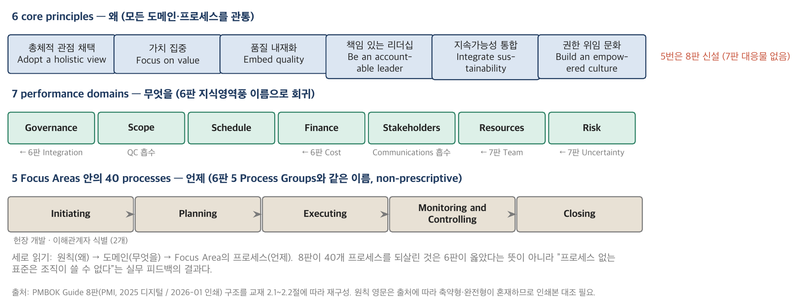

*그림 2-2. PMBOK 8판의 구조 — 6 원칙 / 7 성과영역 / 5 Focus Areas 안의 40 프로세스. 세로로 읽으면 원칙(왜) → 도메인(무엇을) → Focus Area의 프로세스(언제)다. 5번 원칙 지속가능성은 8판 신설이며, Focus Areas의 이름은 6판 5 Process Groups와 같다. 원칙 영문은 출처에 따라 축약형·완전형이 혼재하므로 인쇄본 대조가 필요하다. PMBOK Guide 8판(PMI, 2025)을 바탕으로 재구성.*

### 6 core principles

**1. 총체적 관점 채택 (Adopt a holistic view).** 프로젝트를 고립된 것이 아니라 조직·포트폴리오·환경 안의 시스템으로 보라는 원칙이다. 7판의 "시스템 상호작용 인식(#5)"과 "복잡성 항해(#9)"를 흡수했다. 실무에서 이 원칙은 "P2가 늦으면 P1 컷오버가 밀린다"는 사실을 리스크 등록부에 적는 것, 가맹점 단말 배포 범위가 가맹 계약 부속서 개정(P3) 협상의 재료라는 것을 아는 것으로 나타난다. 제1장의 임시조직론과 Engwall의 "어떤 프로젝트도 섬이 아니다"가 이 원칙의 학술적 근거다.

**2. 가치 집중 (Focus on value).** 프로젝트의 목적은 산출물이 아니라 가치이며, 가치는 이해관계자에게 정의된다. 7판의 #4를 그대로 유지하면서 #3 이해관계자 참여, #11 적응성, #12 변화 실현을 흡수했다. 이 원칙이 실무에서 의미하는 것은 "온타임·온버짓"이 성공의 정의가 아니라는 것(Cooke-Davies의 구분)이고, 편익 214억의 산출 근거를 항목별로 요구하는 CFO의 질문이 PM의 적이 아니라 이 원칙의 실행이라는 것이다.

**3. 품질 내재화 (Embed quality into processes and deliverables).** 7판 #8의 "Build quality"에서 동사가 "Embed"로 바뀌었다. 품질을 검사로 사후에 확인하는 것이 아니라 프로세스와 산출물 안에 처음부터 넣으라는 뜻이며, 지속가능성과 컴플라이언스 차원이 추가되었다. Quality가 독립 도메인에서 사라진 것과 짝을 이룬다 — 품질은 별도 관리 대상이 아니라 모든 도메인의 속성이 되었다.

**4. 책임 있는 리더십 (Be an accountable leader / Lead accountably).** 7판의 #1 stewardship과 #6 leadership behaviors를 병합했다. 책임(accountability)이라는 단어가 원칙 이름에 들어간 것이 의미 있다 — 결정에는 이름이 붙어야 한다. 온담 CCB의 "반대의견 실명 기재 의무"와 2022년 WMS 범위 축소 회의록의 비어 있는 물류본부장 서명란은 이 원칙의 양극단이다.

**5. 지속가능성 통합 (Integrate sustainability within all project areas).** 8판에서 신설된 원칙으로 7판에 대응물이 없다. 환경·사회·경제적 지속가능성을 프로젝트의 모든 영역에 통합하라는 요구이며, PRINCE2 7이 같은 해(2023) sustainability를 일곱 번째 성과목표축으로 추가한 것과 같은 흐름이다. 한국 실무에서 이 원칙은 아직 ESG 보고 요건이나 발주처의 조달 조건으로 간접 등장하는 단계이며, 온담 P2의 물류 인력 246명 문제(처리량 두 배가 인원 절반이라는 노조의 읽기)는 사회적 지속가능성이 프로젝트 리스크로 나타나는 사례다.

**6. 권한 위임 문화 구축 (Build an empowered culture / Build empowered teams).** 7판 #2의 "협력적 팀 환경"이 진화한 것이다. 팀에 결정 권한을 주라는 원칙이며, PRINCE2의 Manage by Exception과 허용범위(tolerance)가 이 원칙을 제도로 구현하는 장치다. "권한 없는 PM"이 일반적인 한국에서 이 원칙은 가장 이상과 현실의 거리가 먼 원칙이며, 그래서 제3장 거버넌스에서 따로 다룬다.

### 7 performance domains

**Governance (거버넌스).** 6판의 Integration Management가 승격·교체된 것이다. 결정 권한의 구조, 변경 통제, 프로세스 감사(QA), 프로젝트와 조직 거버넌스의 연결을 다룬다. 8판이 이것을 첫 번째 도메인으로 놓은 것은 프로젝트 실패의 가장 흔한 원인이 기술이 아니라 "누가 결정하는가"의 부재라는 인식을 반영한다. 온담의 3층 변경 통제(CCB / 변경협의체 / 기준선 재확인)와 6개 게이트(G0~G5)가 이 도메인의 산출물이다.

**Scope (범위).** 무엇을 만들고 무엇을 만들지 않는가. 요구사항 수집, 범위 정의, WBS, 산출물 검사(QC)와 인수가 여기 있다. P1의 요구사항 1,180건(StRS 214 / SyRS 396 / SRS 570)과 범위 제외 목록(SAP 교체, P2 설비, P3 교육, P4 규제 등록, P5 운영 조직)이 이 도메인의 내용이다.

**Schedule (일정).** 활동 정의, 순서, 기간 추정, 일정 개발과 통제. 7판의 Planning과 Measurement에 흩어져 있던 것이 다시 모였다. P1의 스프린트 36회, G1~G4 게이트, 컷오버 창이 여기 속한다.

**Finance (재무).** 6판 Cost에서 개칭·확장되었다. 원가 추정과 예산, 통제에 더해 자금 조달, 현금흐름, 재무적 지속가능성을 포함한다. 온담의 승인 예산 168억 / 집행 한도 156억 / 계획 원가 145.8억이라는 세 층과 1차연도 집행 148억 요구, 단일 건 5,000만 원 이상 CFO 결재라는 내부통제 개정은 모두 Finance의 질문이다.

**Stakeholders (이해관계자).** 식별, 분석, 참여, 그리고 6판의 Communications Management를 흡수한 의사소통 계획. 제3장 3.3절에서 자세히 다룬다.

**Resources (자원).** 7판의 Team에서 이름이 돌아왔다. 인적 자원과 물적 자원의 계획·확보·개발·관리. P1의 피크 인력 82명(수행사 61 + 발주사 14 + SW 벤더 7)과 IT본부 47명 중 14명 투입의 운영 부담이 이 도메인의 문제다.

**Risk (리스크).** 7판의 Uncertainty에서 이름이 돌아왔다. 식별, 분석, 대응, 감시. 제3장 3.5절의 초기 리스크와 프리모템이 이 도메인의 착수 시점 활동이다.

### 도메인 배치의 함의

7개 도메인의 이름이 6판 지식영역풍으로 돌아왔다는 것은 사내 문서 재매핑이 생각보다 쉽다는 뜻이다. 그러나 Quality·Communications·Procurement의 소멸과 Governance·Finance의 등장은 조항 번호 교체만으로 끝나지 않는 실질 변경이다. 한국 SI의 "품질보증팀"이 QA(Governance)인지 QC(Scope)인지, 조달 절차서를 어느 도메인 아래 둘 것인지는 조직마다 결정해야 한다.

사내 표준 재매핑 대장의 출발점이 되는 대응 관계를 그림 2-3에 그렸다.

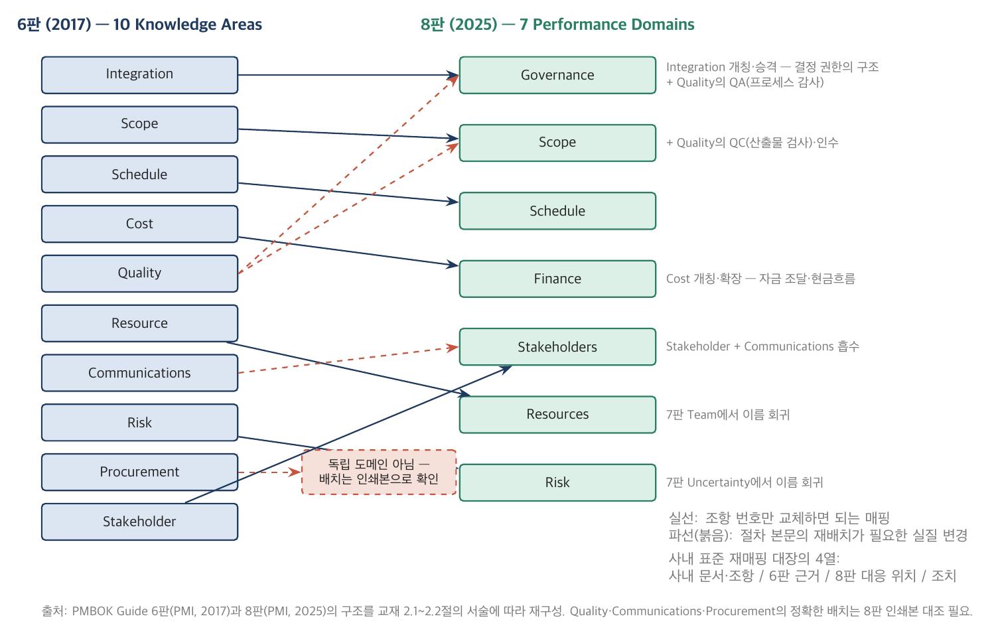

*그림 2-3. 6판 10 지식영역 → 8판 7 성과영역 재매핑. 실선은 조항 번호만 교체하면 되는 매핑, 붉은 파선은 절차 본문의 재배치가 필요한 실질 변경이다(Integration→Governance, Cost→Finance, Quality의 QA/QC 분리, Communications의 Stakeholders 흡수, Procurement의 독립 도메인 소멸). 세 지식영역의 정확한 배치는 8판 인쇄본으로 확인한다. 교재 2.1~2.2절을 바탕으로 재구성.*

---

## 2.3 PRINCE2 7 — 프로젝트 보드, 예외 관리, 산출물 기반 계획

### 구조

PRINCE2(PRojects IN Controlled Environments)는 영국 정부에서 출발해 현재 PeopleCert(구 AXELOS)가 소유한 방법론이다. 2023년 개정된 PRINCE2 7은 7 principles / 7 practices / 7 processes로 구성된다.

**7 principles** — continued business justification(지속적 사업 정당성) / learn from experience(경험에서 학습) / defined roles, responsibilities and relationships(정의된 역할·책임·관계) / manage by stages(단계별 관리) / manage by exception(예외 관리) / focus on products(산출물 집중) / tailor to suit the project(프로젝트에 맞게 테일러링).

**7 practices** (6판까지는 themes라 불렀다) — business case / organizing / plans / quality / risk / issues / progress.

**7 processes** — starting up a project / directing a project / initiating a project / controlling a stage / managing product delivery / managing a stage boundary / closing a project.

PRINCE2 7에서 바뀐 것은 통합 요소가 4개에서 5개로(People 추가), 성과목표축이 6개에서 7개로(sustainability 추가), 관리 접근법이 9개(benefits, change, communication, commercial, digital and data, issue, quality, risk, sustainability)로 확장된 것이다.

### PMBOK과의 결정적 차이

PMBOK은 "무엇을 알아야 하는가"의 지식체계이고 PRINCE2는 "누가 무엇을 결정하는가"의 방법론이다. 이 차이가 네 가지 장치에서 드러난다.

**Project Board — 스폰서를 세 역할로 나눈다.** PMBOK은 "sponsor"라는 단일 명사로 의사결정자를 표현한다. PRINCE2는 Project Board를 **Executive / Senior User / Senior Supplier** 세 역할로 구조화한다. Executive는 비즈니스 케이스, 즉 "이 프로젝트가 돈을 쓸 가치가 있는가"에 책임진다. Senior User는 산출물이 실제로 사용되어 편익이 나오는 것에 책임진다 — 요구사항을 대표하고, 편익 실현의 책무가 여기 있다. Senior Supplier는 산출물을 만드는 쪽의 자원과 기술적 실현 가능성에 책임진다. 세 역할은 이해가 상충하는 당사자를 강제로 한 의사결정체에 넣는다. 한국 대기업 프로젝트가 표류하는 가장 흔한 원인은 스폰서가 없어서가 아니라 사용자 대표와 공급자 대표가 같은 테이블에 앉지 않아서다. 온담 P1은 이 구조를 그대로 채택했다 — Executive 정미란 CFO, Senior User 오정근 영업본부장, Senior Supplier 박세연 IT본부장. G0 착수 조건에 "Executive / Senior User / Senior Supplier 실명 지명"이 들어 있는 이유다.

PRINCE2 7의 구조와 온담 P1의 Project Board 배정을 그림 2-4에 정리했다.

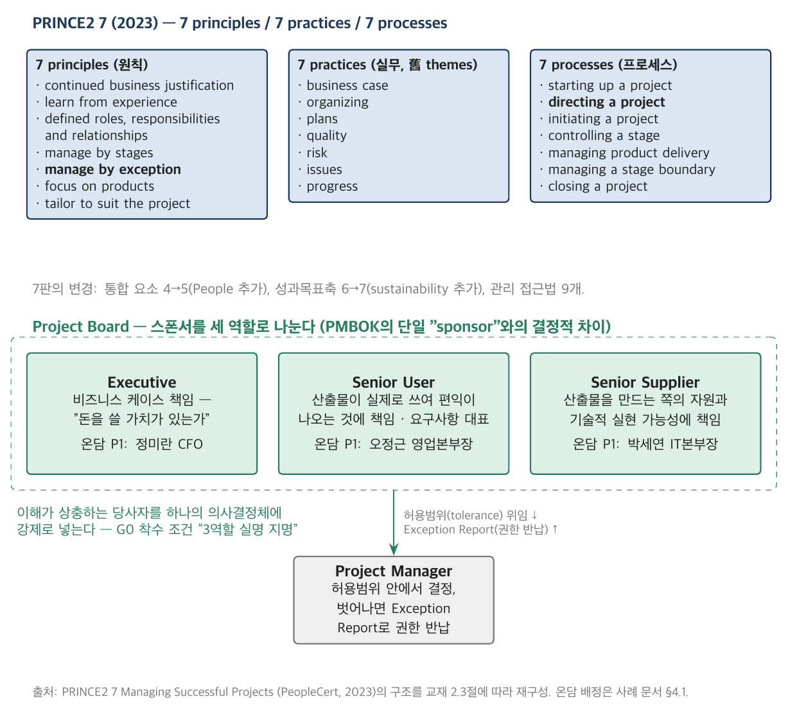

*그림 2-4. PRINCE2 7의 삼중 구조와 Project Board 3역할. 위: 7 principles / 7 practices / 7 processes. 아래: Executive(정미란 CFO) · Senior User(오정근 영업본부장) · Senior Supplier(박세연 IT본부장)로 구성된 Project Board가 허용범위를 아래로 위임하고 PM은 Exception Report로 권한을 반납한다. PRINCE2 7(PeopleCert, 2023)과 사례 문서 §4.1을 바탕으로 재구성.*

**Manage by Exception — 허용범위 안에서는 보고하지 않을 권리.** PRINCE2의 진짜 자산은 7원칙이 아니라 **7개 성과목표축(benefits, cost, time, quality, scope, sustainability, risk) × 3계층(project / stage / work package)의 허용범위(tolerance) 격자**다. 각 계층의 관리자는 자기 허용범위 안에서는 상위에 보고하지 않고 결정하며, 허용범위를 벗어날 것으로 예측되는 순간 Exception Report로 결정 권한을 상위 계층에 되돌려 준다. Exception Report는 "문제 보고서"가 아니라 **권한 반납 문서**다. 한국 조직에 이 개념을 도입해서 얻는 실익은 보고 규율의 강화가 아니라 그 반대 — 허용범위 안에서는 보고하지 않을 권리다. 주간보고·수시보고 문화의 비용을 줄이는 가장 표준 근거가 확실한 처방이며, PM의 자율성을 규정으로 방어하는 유일한 수단이다. 온담의 허용범위 초안(원가 +6% = 10.08억, 일정 +15영업일, 범위 ±3% = ±35건, 리스크 EMV 8억, 편익 −5%p)이 이 격자의 프로젝트 계층이다. 제3장 3.4에서 다시 다룬다.

**Product-Based Planning — 활동이 아니라 산출물부터.** PRINCE2의 계획은 Project Product Description → Product Breakdown Structure → Product Descriptions → Product Flow Diagram의 4종 세트로 시작한다. 활동(설계하기, 개발하기)이 아니라 산출물(설계서, 모듈)을 먼저 정의하고, 각 Product Description에 품질 기준(quality criteria)과 검수 방법(quality method), 검수 책임자를 강제로 적게 한다. 활동 중심 WBS는 "무엇을 했는지"를 추적하게 만들어 산출물의 검수 기준이 계획에서 누락되는데, 이것이 한국 SI·건설 검수 분쟁의 원인 대부분이다. Product Description에 품질 기준을 적게 하는 구조가 검수 분쟁을 사전에 없애는 가장 값싼 처방이다. Day2의 WBS에서 이 대조를 실습한다.

**Business Case 중심 — 단계 경계마다 갱신.** PRINCE2는 Business Case를 승인용 문서가 아니라 살아 있는 문서로 취급한다. 첫 원칙이 "continued business justification"인 것은 우연이 아니다. 각 관리 단계(stage)의 경계에서 Business Case가 갱신되고, "이 프로젝트를 계속할 이유가 아직 있는가"를 Project Board가 되묻는다. 편익 실현의 책무는 Senior User에게, 사업 정당성 유지는 Executive에게 명시적으로 배치되며, 편익 검토는 프로젝트 종료 이후 시점에 예약된다(post-project benefits review). 온담의 6개 게이트에서 "게이트마다 편익 실현 전망을 재확인한다"는 이사회 조건 3항과 G5 편익 검토(2028-03-31)가 이 구조다.

### 한국에서 PRINCE2가 실무에 주는 것

PRINCE2 자격 자체의 한국 내 시장 가치는 낮다. 그러나 PRINCE2의 네 장치는 자격과 무관하게 한국 조직에 직접 이식 가능하며, 특히 다음 세 가지에서 값이 크다.

첫째, **운영위원회 명단에 3역할을 배정하는 것**만으로 "전원 찬성, 아무도 책임 없음" 상태가 진단된다. 여러분 회사 운영위 명단을 놓고 각 인물에 Executive / Senior User / Senior Supplier를 배정해 보라. 배정이 안 되는 인물(대개 절반 이상)과 비어 있는 역할(대개 Senior Supplier)이 그 프로젝트의 거버넌스 결함이다.

둘째, **허용범위 격자를 사내 위임전결규정에 매핑**하면 결재 라인이 눈에 보이게 줄어든다. 온담의 "본부장 위임전결 한도 5억"과 "프로젝트 원가 허용범위 +6% = 10.08억"은 서로 맞지 않는다. 이 불일치를 찾아내는 것이 격자의 첫 번째 용도다.

셋째, **영국·EU·중동 발주처 대응과 글로벌 본사 거버넌스 보고**에서 "문서 이름을 맞추는 능력"으로 값이 생긴다. Highlight Report, End Stage Report, Exception Report, PID(Project Initiation Documentation)라는 이름을 알면 해외 발주처의 요구 문서를 사내 문서와 매핑할 수 있다.

### 실무에서 어떻게 틀리는가

Exception Report를 기존 이슈 보고서의 새 이름으로 쓰면서 허용범위를 정의하지 않으면 보고 서식만 하나 늘고 위임은 전혀 일어나지 않는다. 허용범위를 "±10%"처럼 전 프로젝트 공통 숫자로 박아 두면 격자는 장식이 된다 — 허용범위는 Business Case의 편익 민감도에서 역산해야 하며, 편익이 얇은 프로젝트는 비용 허용범위가 좁아야 한다. PBS를 WBS로 이름만 바꿔 부르며 여전히 동사(설계하기, 개발하기)로 채우는 것도 흔하다 — PBS의 노드는 명사여야 하고, 명사가 아니면 검수할 수 없다는 점이 기법의 전부다. 그리고 PMBOK의 변경통제위원회(CCB)와 PRINCE2의 Change Authority는 권한의 흐름이 반대다 — PRINCE2는 Project Board가 change budget과 함께 권한을 아래로 위임하는 구조이고, PMBOK CCB는 권한을 위로 회수하는 구조다. 두 개를 섞으면 변경 처리 시간이 오히려 늘어난다. 온담의 3층 변경 통제는 이 둘을 의도적으로 섞어 놓았으며, Day3에서 그 비용을 확인하게 된다.

---

## 2.4 ISO 21502:2020 — 계약서가 인용하는 표준 (심화)

### 왜 교육시장에서는 무명이고 계약서에서는 유명한가

ISO 21502:2020 『Project, programme and portfolio management — Guidance on project management』는 ISO/TC 258이 만든 프로젝트 관리 본체 지침이다. 자격시험이 없다. 그래서 교육시장에서는 거의 언급되지 않는다. 그러나 글로벌 EPC·발주처 계약서와 RFP에서는 "PMBOK 준거"보다 "ISO 21502 준거" 문구가 더 자주 등장한다.

이유는 중립성이다. 발주처가 PMI 계열이고 시공사가 PRINCE2 계열이며 본사가 자체 방법론인 상황에서 "PMBOK에 따른다"는 조항은 한쪽 벤더 프레임워크를 강제하는 것이며 분쟁의 씨앗이다. ISO 21502의 실무(practices) 어휘로 계약 요구사항을 쓰면 각 당사자가 자기 방법론으로 이행하면서도 같은 기준으로 판정받을 수 있다. 공공·다국적 상황에서 특정 벤더 프레임워크를 계약에 못 박을 수 없을 때 유일하게 인용 가능한 표준이 이것이다.

### 구조

ISO 21502는 §4에서 프로젝트 관리의 맥락(조직 환경, 거버넌스, 프로젝트와 운영·프로그램·포트폴리오의 관계)을 서술하고, §5에서 프로젝트 관리의 전제 조건(사업 정당성, 거버넌스 프레임워크)을, §6에서 통합된 프로젝트 관리 실무(사전 착수 활동, 프로젝트 감독, 지휘, 착수, 통제, 종료, 사후 활동)를, §7에서 관리 실무(계획, 편익, 범위, 자원, 일정, 원가, 리스크, 이슈, 변경 통제, 품질, 이해관계자, 의사소통, 조직 변화, 보고, 정보·문서, 조달, 교훈)를 다룬다. 특징은 §6.2 "pre-project activities"와 §6.9 "post-project activities"가 명시적으로 있다는 것이다 — 프로젝트의 앞과 뒤를 표준 안에 넣은 것이며, Morris의 front-end 주장(제4장)과 편익 관리를 표준 수준에서 수용한 것이다.

### ISO 21500의 함정 — "ISO 21500에 따라 관리한다"는 왜 틀렸는가

ISO 21500은 2012년판의 제목이 『Guidance on project management』였다. 그래서 많은 계약서와 사내 규정이 "ISO 21500에 따라 프로젝트를 관리한다"고 썼다. 그런데 2021년 개정판의 제목은 『Project, programme and portfolio management — Context and concepts』다. 21500은 더 이상 프로젝트 관리 지침이 아니라 상위 개념·맥락 문서이며, 프로젝트 관리 지침은 21502로 옮겨갔다. 즉 지금 "ISO 21500에 따라 프로젝트를 관리한다"는 문장은 "개념 문서에 따라 관리한다"는 무의미한 문장이다. 용어는 ISO 21506:2024 『Vocabulary』가 별도로 담당한다 — "21500이 용어 표준"이라고 가르치는 강사가 많은데 이것도 틀렸다.

ISO 21500 계열의 나머지도 연도를 정확히 알아야 한다. 21503(프로그램)과 21504(포트폴리오)는 2022년에 개정되었고, 21505:2017은 거버넌스, 21511:2018은 WBS, 21508:2018은 EVM(2판이 2026년 예정), 21512:2024는 EVM 구현 지침이다. 특히 21505 거버넌스는 이사회·오너 계층의 책무를 다루는 유일한 ISO 문서로, PRINCE2 Project Board 구조를 "표준 근거가 있는 것"으로 정당화할 때 인용하면 경영진 설득력이 달라진다.

### 실무에서 어떻게 틀리는가

계약서에 "ISO 21500에 따라 관리한다"고 쓴 조항은 지금 전부 무력하다. 계약을 새로 쓸 때는 "ISO 21502:2020의 §7 관리 실무에 따라" 또는 "ISO 21506:2024의 용어 정의에 따라"처럼 문서와 연도와 조항을 특정해야 한다. 그리고 ISO 21502는 "무엇을 해야 하는가"만 말하고 "어떻게"는 말하지 않는다. 이것을 방법론으로 쓰려 하면 실망한다 — 이것은 계약과 감리의 언어이지 팀의 언어가 아니다.

---

## 2.5 애자일·SAFe·하이브리드의 위치

### 애자일은 표준의 반대편이 아니다

애자일은 2001년 선언문에서 출발한 소프트웨어 개발 접근이며, 그 실행 프레임워크(Scrum, Kanban, XP)와 확장 프레임워크(SAFe, LeSS, Nexus, Disciplined Agile)가 있다. 이것들은 PMBOK·PRINCE2·ISO와 같은 층위의 "표준"이 아니라, 그 표준들이 "개발 접근(development approach)"이라고 부르는 것의 한 종류다. PMBOK 8판이 40개 프로세스를 예측형·애자일·하이브리드 모두에 적용 가능하다고 명시한 것, PRINCE2가 PRINCE2 Agile을 별도로 낸 것은 애자일을 표준 바깥이 아니라 안에 두려는 시도다.

이 절과 앞 절들에서 다룬 표준·프레임워크의 상대적 위치를 그림 2-5에 놓았다.

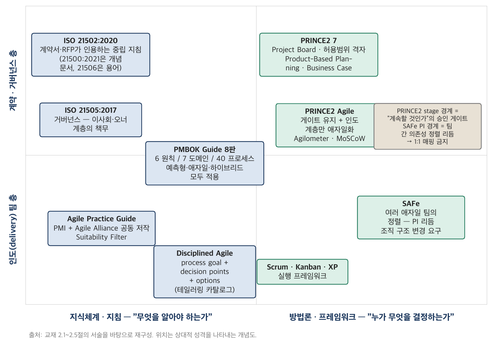

*그림 2-5. 표준 지형도 — 지식체계/방법론 축과 계약·거버넌스/인도 팀 축 위의 위치. 가로축은 '무엇을 알아야 하는가'(지식체계·지침)와 '누가 무엇을 결정하는가'(방법론·프레임워크), 세로축은 계약·거버넌스 층과 인도 팀 층이다. ISO 21502·21505와 PMBOK, PRINCE2 7과 PRINCE2 Agile, Agile Practice Guide·Disciplined Agile, SAFe·Scrum 등의 상대적 위치를 나타내는 개념도다. PRINCE2 stage와 SAFe PI는 1:1로 매핑하지 않는다. 교재 2.1~2.5절을 바탕으로 재구성.*

**Agile Practice Guide** (2017)는 PMI 단독 저작이 아니라 **Agile Alliance와의 공동 저작**이다. 이 사실은 정치적으로 중요하다 — 애자일 커뮤니티 앞에서 "PMI가 만든 애자일 가이드"로 소개하면 그 순간 신뢰를 잃는다. 이 가이드의 실무 자산은 **Suitability Filter**다. 문화(culture), 팀(team), 프로젝트(project)의 3범주에서 각각 몇 개 항목을 점수화해 방사형 그림으로 그리고, 그림이 중심에 모이면 애자일 적합, 바깥으로 퍼지면 예측형 적합, 섞이면 하이브리드를 검토하라는 도구다. 7판의 테일러링 서술보다 훨씬 실습 가능하다.

**PRINCE2 Agile**은 SAFe와 반대 방향의 처방이다. SAFe가 조직 구조를 바꾸라고 요구하는 반면, PRINCE2 Agile은 기존 게이트 거버넌스(Project Board, 단계, 허용범위)를 유지하면서 인도 계층만 애자일화한다. 핵심 도구는 Agilometer(6축 리스크 평가)와 "고정할 것과 유연할 것의 재배치" — 시간과 비용을 고정하고 범위를 MoSCoW로 유연하게 한다 — 이다. 한국 대기업이 게이트 거버넌스를 버릴 수 없는 상황에서 현실적 절충안을 찾을 때 이것이 유일한 표준급 처방이다.

**Disciplined Agile(DA)**은 PMI가 2019년에 인수한 외부 프레임워크(Ambler/Lines 계보)라 PMBOK과 개념 족보가 다르다. 『Choose Your WoW!』의 "process goal + decision points + options" 구조는 테일러링을 선택지 카탈로그로 조작화한 유일한 대형 프레임워크이며, 사내 방법론 서가를 설계할 때 PMBOK의 테일러링 장보다 직접 베낄 수 있다. 단 DA의 lifecycle 개념과 PMBOK의 development approach를 같은 슬라이드에 섞으면 용어가 충돌하므로 출처를 분리해야 한다.

**SAFe**는 대규모 조직에서 여러 애자일 팀을 정렬하는 프레임워크다. 한국에서 SAFe 도입이 실패하는 원인은 대부분 Boehm-Turner의 personnel(팀 숙련도)과 culture(자율 선호 vs 질서 선호) 축을 무시하고 프로세스만 이식한 것이다(2.6절). 그리고 표준 대조표를 1:1로 만들면 안 된다 — PRINCE2의 management stage와 SAFe의 PI(Program Increment)는 둘 다 시간 상자지만 통제 목적이 정반대다. stage 경계는 "계속할 것인가"를 되묻는 승인 게이트이고, PI 경계는 팀 간 의존성을 맞추는 정렬 리듬이다. "PI = Stage"로 매핑하고 stage boundary 산출물(End Stage Report, 갱신된 Business Case)을 없애면 프로젝트를 중단할 의사결정 지점이 조직에서 사라진다.

### 하이브리드 — 온담 P1의 선택

P1은 하이브리드다 — 2주 스프린트 36회(설계 6 / 구현 20 / 통합·시험 10)로 인도하되, 요구사항 베이스라인을 월 1회 동결하고, 계약은 FP 12,400점 고정가이며, 게이트 G0~G4로 승인한다. 이것은 PRINCE2 Agile의 처방("게이트를 유지하고 인도 계층을 애자일화")에 가깝다. 하이브리드의 설계 문제는 두 기능을 어디에 배치하느냐다. 사업 정당성 재확인은 게이트(G1, G2, G3)에, 팀 간 정렬은 스프린트 경계와 월 1회 베이스라인 동결에 둔다. 이 배치가 명시되지 않은 하이브리드는 애자일의 유연성도 예측형의 통제도 얻지 못한다.

### 실무에서 어떻게 틀리는가

"애자일이 waterfall을 대체했다"는 방법론 교체 서사가 첫 번째 오류다. Lenfle과 Loch(2010)가 보였듯 맨해튼 프로젝트와 폴라리스 같은 원조 대형 프로젝트는 실제로 병렬 실험과 유연성으로 운영되었고, 표준화 과정에서 "통제와 단계 접근"만 남은 것이다. 애자일은 신문물이 아니라 잃어버린 뿌리다. 두 번째 오류는 하이브리드를 "스프린트로 일하면서 간트차트도 그리는 것"으로 이해하는 것이다. 하이브리드는 어느 결정을 언제 되돌릴 수 있게 남겨 두고 어느 결정을 언제 동결하는가의 설계이며, 그 설계가 없으면 두 방식의 비용만 합쳐진다.

---

## 2.6 테일러링 — 되돌림 비용, Boehm-Turner, Cynefin

### 개념

테일러링(tailoring)은 표준을 프로젝트에 맞게 조정하는 것이다. PMBOK 7·8과 PRINCE2 7, ISO 21502 모두 테일러링을 요구한다. 그러나 어느 표준도 "무엇을 기준으로 조정하는가"에 대한 판단 도구를 주지 않는다. 이 절은 세 가지 도구를 소개하고, 그 셋을 관통하는 하나의 변수 — **되돌림 비용** — 를 앞세운다.

### 되돌림 비용이 방법을 결정한다

예측형(predictive)·하이브리드·적응형(adaptive) 가운데 무엇을 고를 것인가에 대한 가장 단순하고 강력한 기준은 이것이다. **결정을 되돌리는 데 얼마가 드는가.**

되돌림 비용이 낮으면 결정을 빨리 내리고 틀리면 고치는 것이 합리적이다. 실험할 수 있고, 실험할 수 있으면 반복적으로 일할 수 있다. 되돌림 비용이 높으면 결정 전에 최대한 알아야 하고, 그래서 앞단에 시간을 쓰고 동결 시점을 명확히 해야 한다. 적응형과 예측형은 이념이 아니라 되돌림 비용에 대한 두 개의 합리적 반응이다.

같은 프로그램 안의 두 프로젝트를 놓고 보자.

**P1 — 소프트웨어, 되돌릴 수 있다.** 코드는 고칠 수 있다. 화면 설계를 잘못했으면 다음 스프린트에 바꾼다. 스프린트 1회 비용은 약 1.41억 원(44명 × 0.5개월 × 월 640만 원)이므로, 잘못된 결정 하나의 되돌림 비용은 대개 1~2 스프린트, 즉 1.4~2.8억 원 안이다. 이 정도면 실험이 가능하다. 그래서 P1은 2주 스프린트로 일하고 요구사항을 월 단위로 동결한다. 단 P1 안에도 되돌릴 수 없는 결정이 둘 있다 — 데이터 전환 정본 결정(G2, 2026-11-27, 되돌리면 610개 테이블 재매핑에 3.8억·6주)과 컷오버(G3 승인 후 34시간, 615개 매장 펌웨어 일괄배포). 이 두 지점 앞은 예측형으로 일해야 한다. 리허설 3회, 롤백 절차 검증, point of no return 명시가 그 예측형 요소다.

**P2 — 물류 자동화 설비, 되돌릴 수 없다.** AS/RS 12,400 로케이션, 셔틀 42대는 설비 발주 확정(T0, 2026-04-24) 후에는 선급금 29.6억이 잠기고 리드타임 34주(41주 가능성)가 압축되지 않는다. 처리량 4,200 케이스/시간이라는 사양은 발주 전에 확정되어야 하며, 발주 후에 "현장에서 검증된 숫자가 아니다"라는 것이 밝혀지면 그 비용은 설비 재발주 또는 성능 미달 상태의 운영이다. P2는 예측형이어야 하고, 앞단(설계 성숙도, 처리량 검증, 발주 사양 동결)에 시간을 써야 한다. P2에 스프린트를 적용하는 것은 무의미하다 — 설비 벤더는 2주마다 무언가를 인도하지 않는다.

이 대조에서 나오는 결론은 **프로그램 하나에 방법론 하나를 강제하면 안 된다**는 것이다. ONE ONDAM은 P1 하이브리드, P2 예측형, P3 변화관리(파일럿 후 확대 — 적응형 요소), P4 규제(예측형, 기한 고정), P5 운영 이관(예측형, SAC 기준)이 공존하는 프로그램이며, 프로그램 운영위의 일은 이 다섯 리듬을 통역하는 것이다.

두 프로젝트를 되돌림 비용 축 위에 놓으면 그림 2-6과 같다.

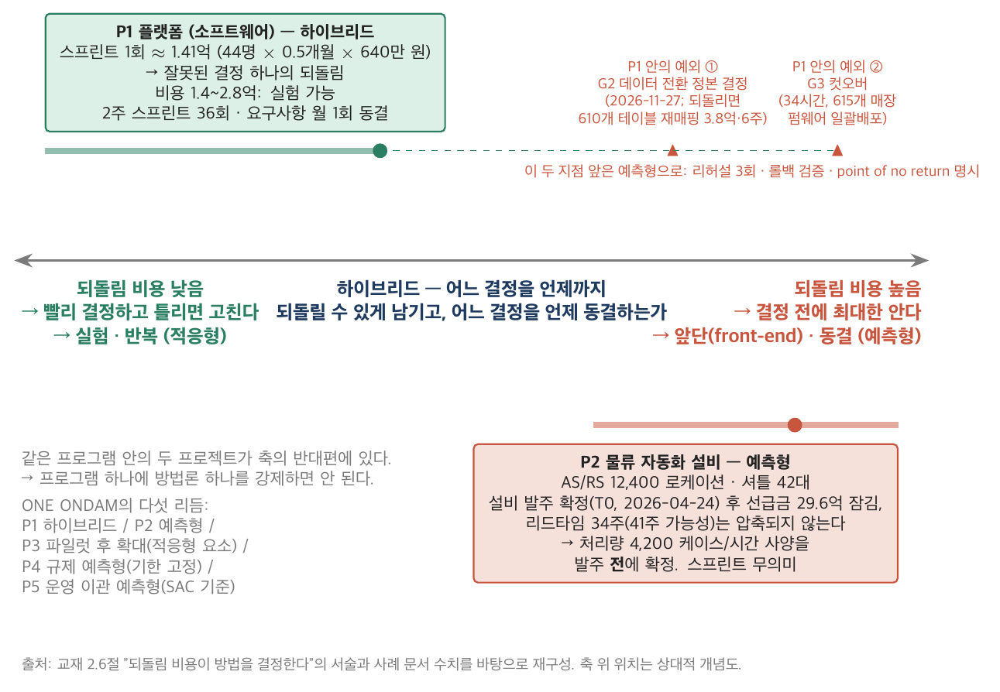

*그림 2-6. 되돌림 비용 축 위의 P1(소프트웨어)과 P2(설비). P1은 스프린트 1회 약 1.41억이라는 낮은 되돌림 비용으로 반복하되, G2 데이터 전환 정본 결정과 G3 컷오버 두 지점 앞은 예측형으로 일한다. P2는 설비 발주 확정(T0) 후 선급금 29.6억과 리드타임 34주가 잠기므로 앞단에 시간을 쓰는 예측형이어야 한다. 축 위 위치는 상대적 개념도다. 교재 2.6절을 바탕으로 재구성.*

### Boehm-Turner 5축

Boehm과 Turner는 2003년 『Balancing Agility and Discipline: A Guide for the Perplexed』에서 애자일과 규율(plan-driven)의 균형점을 다섯 축의 극좌표로 진단하는 방법을 제안했다.

| 축 | 애자일 쪽 (중심) | 규율 쪽 (바깥) |
|---|---|---|
| **Size** (인원) | 소규모 팀 | 대규모 |
| **Criticality** (결함 시 피해) | 편의 손실 | 생명·막대한 자금 손실 |
| **Dynamism** (요구사항 변화율) | 월 50% 변화 | 월 1% 변화 |
| **Personnel** (팀 숙련도, Cockburn 레벨) | 고숙련 비율 높음 | 저숙련 비율 높음 |
| **Culture** (조직 문화) | 자율(empowerment)을 통해 번성 | 질서(order)를 통해 번성 |

다섯 점이 모두 중심에 모이면 애자일, 모두 바깥에 있으면 규율 중심, 섞여 있으면 혼합이다. 그러나 이 책의 진짜 처방은 "한 방법을 골라라"가 아니다. **축이 서로 다른 방향을 가리키면 시스템을 쪼개서 부분마다 다른 방법을 써라**는 것이다. 2003년 문헌인데 2026년 SAFe 도입 실패 원인 분석에 여전히 가장 잘 맞는다.

P1에 적용하면 — Size는 피크 82명으로 바깥쪽이다. Criticality는 615개 매장의 결제를 처리하므로 중간~바깥이다(생명은 아니지만 매출 손실은 크다). Dynamism은 요구사항이 월 단위로 동결되므로 중간이다. Personnel은 수행사 61명의 숙련 분포를 알아야 하며, 사례에 없으므로 워크북에서 가정한다. Culture는 온담이 가족 경영에서 기관투자자 시계로 넘어가는 회사이고 CFO의 내부통제 강화 요구(단일 건 5,000만 원 이상 CFO 결재)를 보면 질서 쪽이다. 다섯 축이 한 방향을 가리키지 않는다. 그렇다면 처방은 시스템 분할이다 — 매장 화면·가맹 포털(SRS 570건, dynamism 높음, criticality 낮음)은 더 애자일하게, 인터페이스·데이터 구조·결제(SyRS 396건, criticality 높음, dynamism 낮음)는 더 규율 있게. 이것은 영업본부와 IT본부의 우선순위 긴장(사례 문서 §6.1)을 방법론 수준에서 해소하는 한 가지 답이기도 하다.

다섯 축 위의 P1과 분할 후 두 부분의 프로파일을 그림 2-7에 그렸다.

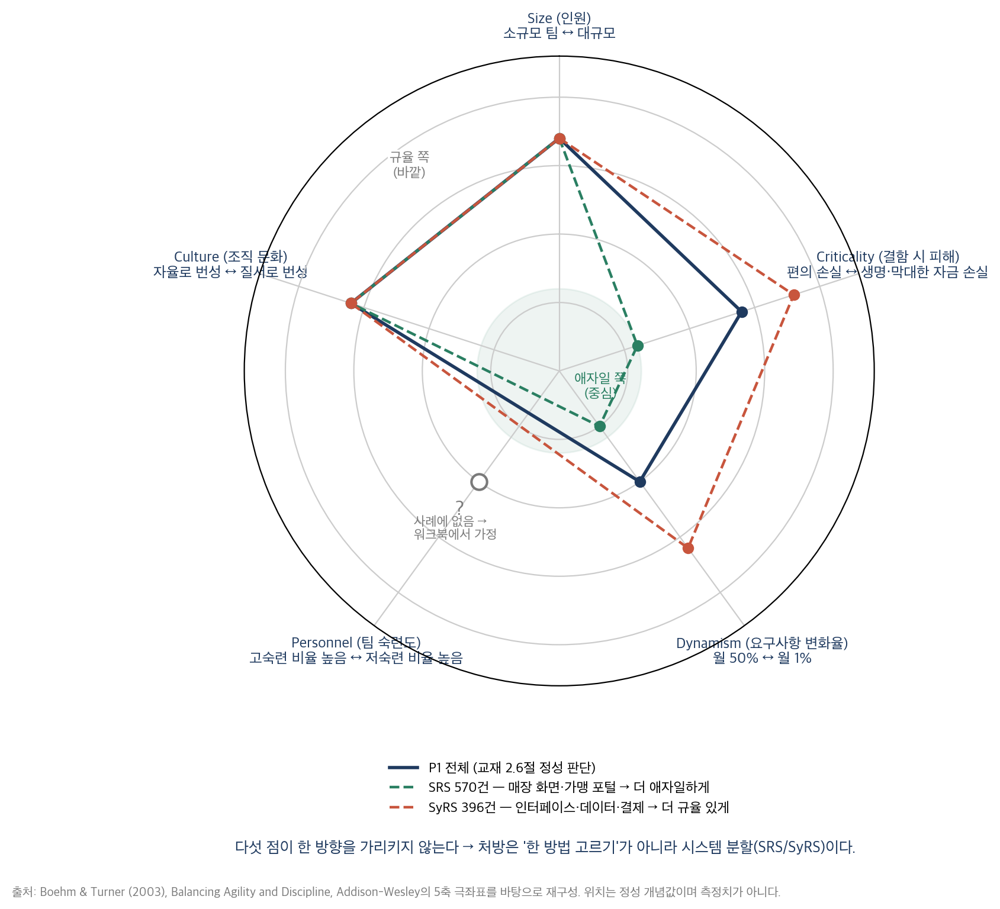

*그림 2-7. Boehm-Turner 5축 극좌표 — P1 전체와 SRS/SyRS 분할. 중심은 애자일, 바깥은 규율 쪽이다. P1 전체(실선)는 다섯 점이 한 방향을 가리키지 않으며, Personnel은 사례에 없어 워크북에서 가정한다. 파선은 SRS(매장 화면·가맹 포털 — 더 애자일하게)와 SyRS(인터페이스·데이터·결제 — 더 규율 있게)로 분할했을 때의 프로파일이다. 위치는 정성 개념값이다. Boehm & Turner (2003)를 바탕으로 재구성.*

한국 조직에서 실제로 결정적인 축은 **Personnel과 Culture**다. 애자일 전환 프로젝트는 거의 항상 이 두 축을 무시하고 프로세스만 이식해서 실패한다. 5축 진단 결과를 "애자일 점수"로 환산해 조직 전체에 하나의 방법을 강제하는 것은 원저의 결론과 정반대다.

### Cynefin — 방법론 선택 도구가 아니다

Snowden과 Boone의 2007년 HBR 논문 「A Leader's Framework for Decision Making」이 Cynefin의 정본 인용이다. Cynefin은 상황을 네 도메인(clear/obvious, complicated, complex, chaotic)과 무질서(disorder)로 나누고, 도메인마다 **다른 의사결정 순서**를 처방한다.

| 도메인 | 인과관계 | 의사결정 순서 | 실무 |
|---|---|---|---|
| Clear (obvious) | 명백하고 누구나 안다 | sense → categorize → respond | 모범 사례(best practice) 적용 |
| Complicated | 존재하지만 분석이 필요하다 | sense → analyze → respond | 전문가 분석, 좋은 사례(good practice) |
| Complex | 사후에만 알 수 있다 | probe → sense → respond | 안전한 실험(safe-to-fail probes), 창발 |
| Chaotic | 없다 | act → sense → respond | 일단 행동해 안정화 |

Cynefin을 프로젝트 관리에서 가장 자주 오용하는 형태는 "우리 프로젝트는 complex하니까 애자일"이라는 3단 논법이다. 이것은 두 가지 점에서 틀렸다. 첫째, Cynefin의 처방은 방법론 선택이 아니라 **의사결정 양식의 전환**이다 — complex 도메인의 처방은 "스프린트를 돌려라"가 아니라 "작고 안전한 실험을 여러 개 병렬로 던져 무엇이 창발하는지 감지한 뒤 반응하라"이며, 이것은 애자일 프레임워크와 겹치지만 같은 것이 아니다. 둘째, Snowden의 핵심 주장은 **도메인 판정 자체가 사후적**이라는 것이다. 어떤 상황이 complex였는지는 지나고 나서야 확정되며, 사전에 "이 프로젝트는 complex"라고 라벨을 붙이는 것은 프레임워크의 논지에 어긋난다.

프로젝트 관리에서 Cynefin의 올바른 용법은 프로젝트 전체가 아니라 **결정 하나하나**에 적용하는 것이다. P1에서 "SAP 애드온으로 ECC와 연결한다"는 complicated다 — 전문가가 분석하면 답이 나온다. "가맹점주가 실시간 판매 데이터 연동에 어떻게 반응할 것인가"는 complex다 — 파일럿 12개점이라는 probe를 먼저 던져야 한다. "OD-POS 서버 OS 지원 종료 후 보안 사고가 나면"은 chaotic이다 — 일단 행동해 안정화하고 나중에 분석한다. 하나의 프로젝트 안에 네 도메인이 공존하며, PM의 일은 지금 다루는 결정이 어느 도메인인지 감각하고 의사결정 순서를 바꾸는 것이다.

네 도메인과 P1의 결정 예시를 그림 2-8에 배치했다.

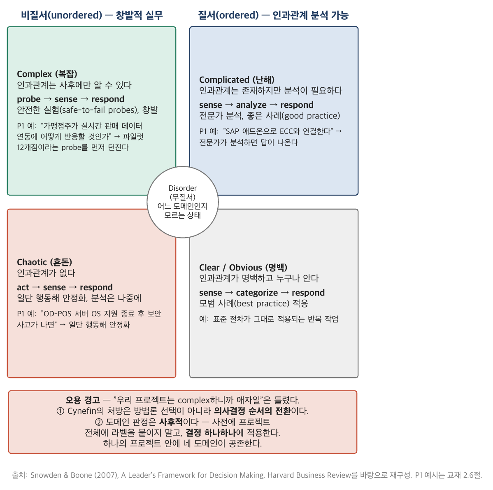

*그림 2-8. Cynefin의 네 도메인과 도메인별 의사결정 순서 — P1의 결정 예시. Complex는 probe → sense → respond, Complicated는 sense → analyze → respond, Chaotic은 act → sense → respond, Clear는 sense → categorize → respond다. 처방은 방법론 선택이 아니라 의사결정 순서의 전환이며, 도메인 판정은 사후적이므로 프로젝트 전체가 아니라 결정 하나하나에 적용한다. Snowden & Boone (2007)을 바탕으로 재구성.*

Cynefin 옆에 자주 놓이는 Stacey matrix(요구사항 합의도 × 기술 확실성 2×2)에 대해 한 가지를 알아 두어야 한다 — 세간에 유통되는 simple/complicated/complex/chaotic 4구획의 그 2×2는 Ralph Stacey의 원 도식이 아니라 후대의 각색본이다(Brenda Zimmerman 계열의 재구성이 Liberating Structures의 'Agreement-Certainty Matching Matrix'로 이어진 계보). "Stacey 본인이 이 그림과 거리를 두었다"는 서술이 2차 문헌에 자주 등장하지만, 어느 판본 어느 장에서 그렇게 했는지 1차 출처는 확인되지 않았다 — 그러므로 "만든 사람이 버린 그림"이라고 단정하지 말라. 대신 "여러분이 본 4구획 그림에는 Stacey가 붙이지 않은 라벨이 붙어 있다, 각색본이다"라고 말하라. 검증 가능한 사실만으로도 같은 효과를 내고, 반박당하지 않는다.

### 테일러링을 문서로 남기기

세 도구로 판단한 결과는 문서로 남아야 한다. PMBOK 7·8 모두 테일러링을 강조하지만 양식을 주지 않는다. 근거 기록이 없으면 사내 감사·외부 감리에서 모든 생략이 "표준 미준수"로 잡히고, PMO는 방어를 위해 결국 문서를 다 만들게 된다 — 이것이 한국 조직에서 문서가 줄지 않는 진짜 메커니즘이다.

**테일러링 결정 기록(Tailoring Decision Record, TDR)**은 이 고리를 끊는 한 장이다. 생략하거나 조정한 프로세스·산출물마다 한 행씩, 네 칸을 적는다 — 무엇을 / 왜 / 어떤 리스크를 수용하는가 / 누가 승인했는가. 이 네 칸이 있으면 같은 생략이 "미준수"에서 "승인된 테일러링"으로 바뀐다. 테일러링을 "프로젝트 관리 계획서 안의 서술 문단"으로 처리하면 안 된다 — 서술은 감사에서 조항 대응이 되지 않으며, 생략한 항목별로 행이 하나씩 있는 표여야 대응이 된다. Day1 워크북 §3에서 P1의 TDR을 작성한다.

### 실무에서 어떻게 틀리는가

가장 흔한 오류는 테일러링을 "문서를 줄이는 것"으로만 이해하는 것이다. 테일러링은 늘리는 것이기도 하다 — P1의 데이터 전환 리허설 3회, 외부 감리 4.2억, 발주사 PMO 3명은 표준이 요구하지 않지만 온담의 과거 실패(2023년 "위탁 산출물 형상관리 미비" 지적)가 요구하는 추가다. 두 번째 오류는 NTCP·Boehm-Turner·Cynefin이 서로 다른 답을 줄 때 하나를 고르는 것이다. 세 도구는 다른 질문에 답한다 — NTCP는 프로젝트 유형, Boehm-Turner는 팀과 조직의 준비도, Cynefin은 개별 결정의 성격. 충돌 지점이 바로 설계해야 할 지점이다.

---

## 2.7 자격 체계의 실효성 (심화)

### 무엇이 있는가

| 자격 | 발급 | 기반 문서 | 성격 |
|---|---|---|---|
| **PMP** | PMI | ECO(Examination Content Outline). PMBOK은 참고 문헌 중 하나 | 경력·교육 요건 + 시험. 2026-07-09 신버전 시행 |
| **PMI-ACP** | PMI | 애자일 실무 | 애자일 실무 경력 + 시험 |
| **PRINCE2 7 Foundation / Practitioner** | PeopleCert | PRINCE2 7 매뉴얼 | Foundation은 지식, Practitioner는 적용 시나리오 |
| **SAFe (SA, SSM, SPC 등)** | Scaled Agile | SAFe 프레임워크 | 역할별 2일 교육 + 시험. 갱신 연 1회 |
| **IPMA Level A~D** | IPMA 각국 협회 | ICB4 (29개 역량 요소) | 프로세스가 아니라 개인 역량 인증 |

### PMP 2026 신시험에 대해 알아야 할 것

PMP 시험 신버전은 2026-07-09에 시행되었다. 수강생이 반드시 묻는 질문 — "그럼 PMP를 8판으로 다시 봐야 하나요" — 에 대한 답은 "아니오, 그리고 질문 자체가 틀렸다"이다. **PMP 시험의 근거는 ECO이며 PMBOK은 참고 문헌 목록에 있는 여러 권 중 하나다.** 신 ECO의 방향은 가치 인도, 거버넌스, 지속가능성, 이해관계자 참여, 테일러링 강조이며, 예측형·애자일·하이브리드 3방식 전반을 다룬다. 새로운 문항 유형(사례 세트, 끌어놓기, 그래프 해석)이 추가되었다. Business Environment 도메인의 배점이 크게 올랐다는 2차 출처 보고가 있으나 PMI ECO 원문 대조는 이 교재에서 하지 못했으므로 숫자는 단정하지 않는다.

그래서 판본 논쟁은 자격시험 문제가 아니라 사내 문서 체계 문제다. 여러분이 답해야 할 질문은 "8판으로 시험을 볼까"가 아니라 "우리 PMO 표준 문서의 조항 번호를 어디에 재매핑할까"이다.

### 실효성 — 시장별로 다르다

자격의 실효는 시장별로 다르며, 수강생별로 커리어 경로를 묻고 답을 달리 주어야 한다.

**PMP**는 한국에서 여전히 가장 인지도 높은 PM 자격이며, 공공 정보화 사업의 수행 인력 평가에서 가점 요소로 작동하고, 대기업 PMO 채용 요건에 자주 등장한다. 그러나 PMP가 증명하는 것은 "지식 보유와 경력 시간"이지 "상황 속 판단"이 아니다. Crawford, Morris, Thomas, Winter(2006)가 지적한 대로 자격 기반 역량 모델은 훈련받은 기술자(trained technician)를 측정하며, 실제 성과는 성찰적 실무자(reflective practitioner)의 판단에서 나온다. PMP는 문을 여는 열쇠이지 방 안에서 일하는 방법이 아니다.

**PRINCE2**는 한국 내 자격 가치 자체는 낮지만, 영국·EU·중동 발주처 대응과 글로벌 본사 거버넌스 보고에서 "문서 이름을 맞추는 능력"으로 값이 생긴다. 해외 발주 프로젝트나 외국계 본사를 둔 회사의 PM에게는 PMP보다 실효가 클 수 있다.

**SAFe SPC**는 조직 전환 컨설팅 수임에는 유리하나 PM 개인의 급여 프리미엄은 PMP보다 낮은 경향이 있다. 그리고 SAFe 자격은 연 1회 갱신 비용이 있다.

**IPMA ICB4**는 자격 자체의 한국 내 실효는 낮지만, ICB4 문서는 자격과 무관하게 HR 산출물의 원천으로 가치가 크다. 사내 PM 등급제·직무기술서·승진 요건을 만들 때 PMBOK 목차를 베끼면 "지식영역을 안다"는 이상한 역량모델이 나온다. ICB4는 애초에 역량 서술(Perspective 5 / People 10 / Practice 14)로 설계되어 있어 요소별 핵심 역량 지표를 그대로 평가 문항으로 쓸 수 있다.

### 실무에서 어떻게 틀리는가

사내 교육 커리큘럼을 PMBOK 목차에 맞추면 시험 합격률로는 오히려 역효과가 난다 — 시험은 ECO로 출제되기 때문이다. 자격을 "PM 역량의 증명"으로 채용·승진에 쓰면 자격은 있으나 판단이 없는 PM을 승진시키게 된다. 반대로 자격을 무용하다고 하는 것도 오류다 — 원 논문의 주장은 대체가 아니라 발달 경로이며, 자격은 공통 어휘를 확보하는 가장 빠른 방법이다.

---

## 제2장 핵심 정리

> **한 줄씩 — 수업 직전 5분 복습용**
> 1. PMBOK은 6판(프로세스) → 7판(원칙만) → 8판(원칙 + 프로세스 부분 회귀)로 움직였다.
> 2. 한국 사내 표준은 대개 6판이다 — 다시 쓰지 말고 8판 위치로 재매핑하는 표 한 장을 만든다.
> 3. PRINCE2에서 가져올 것은 세 역할(Executive·Senior User·Senior Supplier)과 허용범위·예외 관리다.
> 4. 계약서는 PMBOK이 아니라 ISO 21502를 인용한다 — "ISO 21500에 따라"는 2021년 이후 틀린 문장이다.
> 5. 애자일은 표준의 반대편이 아니라 인도 방식의 하나다 — 게이트는 남기고 인도 층만 반복한다.
> 6. 테일러링의 기준도 되돌림 비용이다; 결정은 무엇을/왜/수용 리스크/승인자 네 칸으로 남긴다.
> 7. 자격은 문을 여는 열쇠지 판단을 대신하지 않는다.
>
> 아래는 같은 내용의 자세한 판이다.

1. PMBOK은 6판(49 프로세스/ITTO) → 7판(12원칙/8도메인, 프로세스 삭제) → 8판(6원칙/7도메인/5 Focus Areas/40 프로세스, 부분 회귀)으로 움직였다. 8판의 회귀는 프로세스 없는 표준을 조직이 쓸 수 없다는 실무 피드백의 결과다.
2. 한국 기업 사내 표준은 대부분 6판 ITTO에 머물러 있다. 처방은 재작성이 아니라 4열 재매핑 대장이다. Integration→Governance, Cost→Finance, Quality·Communications·Procurement의 소멸이 실질 변경이다.
3. PRINCE2의 실무 자산은 Project Board 3역할(Executive / Senior User / Senior Supplier), 7축×3계층 허용범위 격자와 Manage by Exception, Product-Based Planning, 단계 경계마다 갱신되는 Business Case다.
4. 계약서와 RFP는 PMBOK보다 ISO 21502를 인용한다. "ISO 21500에 따라 관리한다"는 2021년 이후 틀린 문장이다 — 지침은 21502, 용어는 21506.
5. 애자일은 표준의 반대편이 아니라 개발 접근의 한 종류다. PRINCE2 Agile은 게이트를 유지하며 인도 계층만 애자일화하고, Stage와 PI는 1:1이 아니다.
6. 테일러링의 기준은 되돌림 비용이다. NTCP(유형), Boehm-Turner(준비도, 축이 갈리면 분할), Cynefin(개별 결정의 양식)은 다른 질문에 답한다. 결과는 TDR 네 칸(무엇을/왜/수용 리스크/승인자)으로 남긴다.
7. PMP 시험의 근거는 ECO이며 PMBOK은 참고 문헌이다. 자격은 문을 여는 열쇠이지 판단을 대신하지 않는다.

## 생각해 볼 질문

1. 여러분 회사의 사내 표준 산출물 가운데 판본이 바뀌어도 살아남을 것은 무엇인가. 왜 그것들만 살아남는가.
2. 여러분 프로젝트의 운영위원회 명단에 Executive / Senior User / Senior Supplier를 배정해 보라. 배정되지 않는 사람과 비어 있는 역할은 무엇인가.
3. 여러분 프로젝트에서 되돌릴 수 없는 결정은 무엇이고, 그 결정 앞에 얼마나 시간을 쓰고 있는가.
4. Boehm-Turner 5축에서 여러분 조직의 Personnel과 Culture는 어디에 있는가. 그것을 무시한 방법론 도입이 있었는가.
5. 8판이 Quality를 독립 도메인에서 없앤 것에 동의하는가. 여러분 회사의 품질보증팀은 QA(Governance)인가 QC(Scope)인가.

## 워크북 연결

이 장은 워크북에 별도 산출물을 두지 않는다. 대신 Day1 워크북 각 산출물의 **X.2 표준에서의 위치** 표(PMBOK 8판 / 6판 사내 표준 대조 / PRINCE2 7 / ISO 21502)가 이 장의 적용이다 — §1~§5의 X.2 표를 읽을 때 2.1절(6판→8판 계보)과 2.3절(PRINCE2의 Project Brief→PID, Manage by Exception)이 그 표의 열 이름을 설명한다. 2.6절 테일러링은 §2 헌장 항목 12(거버넌스·PM 권한)와 §4 거버넌스 항목 4(허용범위 위임)에서 "P1은 어느 프로세스를 생략·조정하는가"의 근거로 쓰인다. 심화 과제(3~7년차): 자기 회사 사내 표준의 산출물 목록을 6판 프로세스 번호 → 8판 Focus Area·성과영역으로 재매핑한 표 한 장을 만들고, P1과 P2의 되돌림 비용 대조(2.6절)에서 출발해 P1이 생략·추가·조정하는 프로세스를 네 칸(무엇을 / 어떻게 / 왜 / 누가 승인)으로 기록한다.

---

# 제3장 착수 — 프로젝트는 어떻게 시작되는가

## 3.1 착수 이전 — 비즈니스 케이스와 편익의 소유권

> ■ **사례 사실** — 이사회 승인 경위와 조건 5개, 편익 8항목의 기준값·목표값·분모(§2.4, §5.5 B-01~08); 두 번의 실패 — 2019 스마트오더 34억 8개월 중단, 2022 WMS 고도화 12억 범위 63% 축소 — 와 내부감사 지적 '편익 산정 근거 부재'(§6.5, §2.4); 한동석 "4,200은 현장 숫자가 아니다"(§4.2·§6.4).

### 착수 전에 이미 결정된 것들

제1장에서 Engwall을 통해 보았듯 프로젝트의 많은 것은 착수 전에 결정된다. 표준은 이 사실을 두 가지 방식으로 수용한다. ISO 21502는 §6.2에 "pre-project activities"를 명시했고, PRINCE2는 Starting Up a Project 프로세스를 Initiating a Project 앞에 두어 "이 프로젝트를 착수할 가치가 있는가"를 먼저 묻게 한다. PMBOK 8판의 Initiating Focus Area는 프로세스가 둘뿐이며(헌장 개발, 이해관계자 식별), 그 입력인 비즈니스 케이스와 편익 관리 계획은 프로젝트 바깥 — 포트폴리오·프로그램 계층 — 에서 온다.

즉 착수의 첫 번째 일은 무언가를 새로 만드는 것이 아니라 **이미 만들어진 비즈니스 케이스를 읽고 그 안의 숫자와 가정을 검증하는 것**이다. 온담 P1의 PM이 착수 시점에 받는 것은 이사회 부의안(2025-12)과 그 별지의 편익 표(연간 214억), 프로그램 관리 규정, 이사회 승인 조건 5개항이다. 이 문서들을 읽지 않고 헌장을 쓰는 것은 남이 정한 목표를 자기가 정한 것처럼 서명하는 일이다.

### 비즈니스 케이스에는 무엇이 들어가는가

비즈니스 케이스(business case)는 "이 투자를 왜 해야 하는가"를 결정권자가 판단할 수 있도록 쓴 문서다. 표준마다 항목 이름은 조금씩 다르지만 골격은 같다.

| 항목 | 무엇을 적는가 | 온담 P1에서 |
|---|---|---|
| **문제 / 기회** | 지금 무엇이 잘못되어 있고, 그것이 얼마의 비용을 만드는가. 숫자로 | OD-POS 서버 OS 지원 종료(2024-07), 인터페이스 47본 중 문서 부재 13본, 재고 실시간 가시성 부재. 폐기율 3.9% = 연 98.7억(2,530억 × 3.9%), 결품률 4.7%, 가맹 발주 리드타임 38시간 |
| **대안** | 아무것도 안 하기, 최소 대응, 제안 대안, 그 밖의 대안. 각각의 비용과 효과 | (a) 현행 유지 — 보안 패치 없는 결제 시스템 운영 지속, SAP ECC 2027-12 유지보수 종료 시 이중 위기. (b) OD-POS 부분 개선 + SAP 유지 — 실시간 재고 불가. (c) 통합 플랫폼 재구축(P1). (d) 상용 패키지 도입 — 사례 문서에 검토 기록 없음, 워크북에서 가정 |
| **편익** | 무엇이 얼마나 좋아지는가. 기준값·목표값·측정 방법·측정 시점·측정 책임자 | 이사회 승인 편익 표 B-01~B-08, M+24 연간 214억. 측정 책임자는 "프로그램 착수 후 지정 예정" — 이것이 첫 번째 결함이다 |
| **비용** | 프로젝트 비용 + 운영 비용. 총소유비용(TCO) 관점 | P1 168억 + 프로그램 나머지 260억. 연간 운영비 27억(3년 81억)은 편익 합계에서 아직 차감되지 않음 — 두 번째 결함 |
| **리스크** | 이 투자가 실패하거나 편익이 안 나올 주요 이유 | 과거 2건의 중단·축소(2019, 2022), P2 리드타임, 3PL WMS 데이터 개방, 가맹 계약 부속서 개정(388점 서면 동의), 규제 기한 |
| **권고** | 어느 대안을 왜. 승인 조건 | 이사회 원칙 승인 + 5개 조건 |

이 표를 채우면서 알게 되는 것은 온담의 비즈니스 케이스가 이미 존재하지만 **완결되어 있지 않다**는 점이다. 편익 표의 결품률(B-03)은 "기회손실, 미산정"이고, 재고 정확도(B-02)의 분모는 순환실사 대상 SKU 69%뿐이며, 물류 처리량 절감 96억(B-06)은 이사회 자료에 분모가 없고 그 위에 노조가 "인원 절반이라는 뜻이냐"고 묻고 있다. CFO는 "근거가 없는 항목은 승인하지 않겠다"고 했고, 내부감사는 "편익 산정 근거를 문서로 제출하라"고 했다. PM의 착수 시점 일은 이 결함을 고치는 것이 아니라 — 그것은 PM의 권한 밖이다 — **결함을 목록으로 만들어 스폰서에게 결정을 요구하는 것**이다.

### 편익은 누가 소유하는가 — Zwikael & Smyrk의 ITO 모델

Zwikael과 Smyrk는 2011년 『Project Management for the Creation of Organisational Value』에서 Input-Transform-Outcome(ITO) 모델을 제시했다. 프로젝트는 입력(자원)을 변환해 **산출물(output)**을 만들고, 산출물이 **활용(utilisation)**되어야 **성과(outcome)**가 나온다. 이 모델의 핵심은 책임의 분리다.

- **산출물(output)**은 PM의 책임이다. 정해진 사양·일정·예산 안에서 산출물을 인도하는 것.
- **활용(utilisation)**과 **성과(outcome)**는 사업 오너(project owner, 대개 스폰서 또는 현업 책임자)의 책임이다. 산출물이 실제로 쓰이게 하고, 그 결과 편익이 나오게 하는 것.

이 분리가 왜 중요한가. PM에게 매출·절감 목표를 부여하면 PM은 통제 불가능한 것에 책임을 지게 되고, 그 결과 범위 방어와 책임 회피가 합리적 행동이 된다. 한국 기업에서 가장 자주 잘못 설계되는 지점이 바로 이것이다 — benefit owner를 PM이나 PMO장으로 지정하는 것. PRINCE2가 편익 실현의 책무를 Senior User에게 두는 것도 같은 논리다. 온담에서 폐기율 43억의 오너는 P1 PM이 아니라 구매·매장 운영을 책임지는 영업본부장 오정근(Senior User)이어야 하고, 물류 처리량 96억의 오너는 물류본부장 한동석이어야 하며, 매장 인건비율 38억의 오너 역시 영업본부다. 편익 오너의 이름이 없는 편익은 착수 시점에 이미 실현되지 않기로 결정된 편익이다.

편익 측정 시점이 프로젝트 종료 이후(G5, 2028-03-31)이므로 측정 책임자는 반드시 **상설 조직의 실명**이어야 한다. 프로젝트 조직은 그때 없다(제1장의 제도화된 종료). 부서명을 쓰면 그 편익은 6개월 안에 유령이 된다.

책임의 분리선을 그림 3-1에 그렸다.

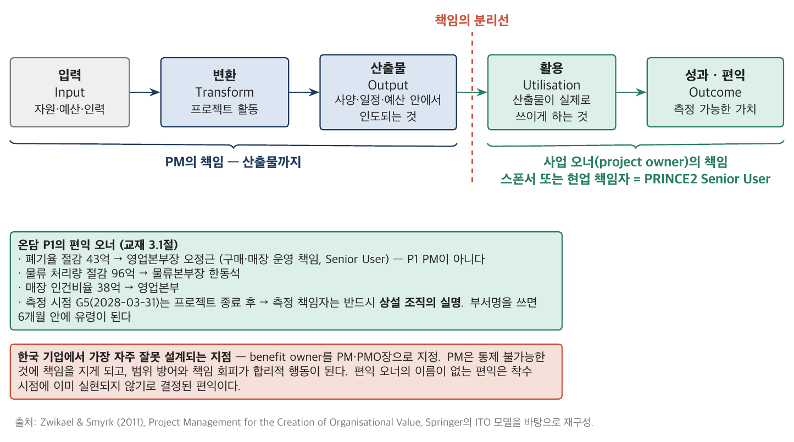

*그림 3-1. Zwikael & Smyrk의 ITO 모델 — 산출물과 성과 사이의 책임 분리선. 입력 → 변환 → 산출물까지가 PM의 책임이고, 활용과 성과·편익은 사업 오너(스폰서 또는 현업 책임자, PRINCE2 Senior User)의 책임이다. 온담에서 폐기율 43억의 오너는 오정근, 물류 처리량 96억은 한동석이며, 측정 책임자는 상설 조직의 실명이어야 한다. Zwikael & Smyrk (2011)을 바탕으로 재구성.*

### 편익 실현은 왜 대부분 실패하는가 — Ward & Daniel

Ward와 Daniel은 『Benefits Management: How to Increase the Business Value of Your IT Investments』(2판, 2012)에서 IT 투자의 편익이 실현되지 않는 이유를 이렇게 정리한다. 편익은 기술이 아니라 **조직 변화**에서 나오는데, 대부분의 프로젝트는 기술을 인도하고 끝난다. 그들의 도구인 **Benefits Dependency Network(BDN)**는 투자 목적 ← 편익 ← 사업 변화(business changes) ← 조력 변화(enabling changes) ← IT 조력자(IT enablers)를 역방향으로 연결한 다이어그램이다. 즉 "이 편익이 나오려면 누가 무엇을 다르게 해야 하고, 그러려면 무엇이 먼저 바뀌어야 하고, 그것을 가능하게 하는 IT 기능은 무엇인가"를 거꾸로 추적한다.

온담의 편익 표를 BDN으로 그려 보면 문제가 보인다. 폐기율 3.9% → 2.2%가 나오려면 매장 직원이 실시간 재고를 보고 발주량을 바꿔야 한다(사업 변화). 그러려면 매장 직원이 새 POS의 재고 화면을 쓸 줄 알아야 하고(조력 변화 — P3 교육 3,900명), 발주 정책이 바뀌어야 한다(조력 변화 — 영업본부의 규정 개정). P1이 만드는 것은 맨 왼쪽의 IT 조력자뿐이다. 나머지는 P3와 영업본부의 일이다. BDN은 "P1이 성공해도 편익이 안 나올 수 있는 경로"를 착수 시점에 보여 주며, 그것이 P1 헌장의 가정·제약 항목과 리스크 등록부의 재료가 된다.

폐기율과 가맹 발주 리드타임 두 편익을 BDN으로 옮기면 그림 3-2와 같다.

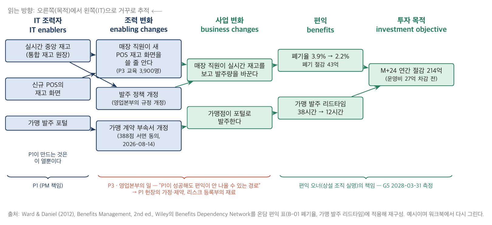

*그림 3-2. 온담 편익의 Benefits Dependency Network — 폐기율과 가맹 발주 리드타임. 오른쪽 투자 목적(연 214억)에서 왼쪽 IT 조력자로 거꾸로 추적한다. P1이 만드는 것은 맨 왼쪽 열뿐이고, 조력 변화(P3 교육 3,900명, 발주 정책 개정, 가맹 부속서 개정)와 사업 변화(매장 직원이 실시간 재고를 보고 발주량을 바꾼다)는 P3와 영업본부의 일이다. 예시이며 워크북에서 다시 그린다. Ward & Daniel (2012)의 BDN을 바탕으로 재구성.*

Bradley의 『Benefit Realisation Management』(2판, 2010)는 이 틀을 실행 절차로 내린 실무서다 — Benefit Map, benefit profile(편익마다 기준값·목표값·측정 방법·오너·시점을 적는 한 장), benefit owner 지정 절차. "편익 오너는 PM이 아니다"라는 원칙을 조직도 수준에서 설계하는 방법이 여기 있다.

### 실무에서 어떻게 틀리는가

비즈니스 케이스를 착수 승인용으로 한 번 쓰고 서랍에 넣는 것이 첫 번째 오류다. PRINCE2가 단계 경계마다 갱신을 요구하는 이유는 "계속할 이유가 아직 있는가"를 되묻는 기능이 없으면 좀비 프로젝트가 생기기 때문이다. 두 번째 오류는 편익을 프로젝트 승인 문서에만 쓰고 종료와 함께 폐기하는 것이다 — 편익은 정의상 프로젝트 종료 후에 발생하므로, 종료 시점에 소유권이 상설 조직으로 이전되지 않으면 측정 자체가 불가능하다. 세 번째 오류는 Gate 1에서 5년 매출 추정과 전체 NPV를 요구하는 것이다. 그 숫자는 반드시 허구이며, 조직은 "숫자를 잘 만드는 팀"에 자원을 배분하게 된다(Flyvbjerg의 survival of the unfittest). 실물옵션 관점에서 게이트는 "다음 단계로 갈 권리를 사는 것"이지 프로젝트 전체를 승인하는 것이 아니다. 네 번째 오류는 운영비를 편익에서 차감하지 않는 것이다 — 온담의 214억은 연 27억 운영비를 빼면 187억이고, 그것이 정직한 숫자다.

---

## 3.2 프로젝트 헌장 — 항목별 의미와 한국 기업에서의 실질화

> ■ **사례 사실** — 헌장 15개 항목에 들어갈 온담의 원재료 — 정의·범위·제외(§3.1·§3.2), 예산 3층 168.0 / 156.0 / 145.8(§3.3, P-08), 마일스톤 G0~G5와 고정 기한(§3.4·§5.4), 제약 — 성수기 창·병행 운영·P2 의존·3PL·전결 한도 5억(§3.5), 허용범위 초안(§5.6), 우선순위 충돌의 세 시계(§6.3).

### 왜 쓰는가

프로젝트 헌장(project charter)은 프로젝트의 존재를 공식화하고 PM에게 조직 자원을 쓸 권한을 부여하는 문서다. 이 정의에서 중요한 단어는 **권한**이다. 헌장은 계획서가 아니다. 헌장이 답하는 질문은 "무엇을 어떻게 할 것인가"가 아니라 "왜 이것을 하고, 누가 결정하며, PM은 무엇을 할 수 있는가"다.

세 표준에서의 위치는 다음과 같다. PMBOK 8판에서 헌장은 Initiating Focus Area의 첫 프로세스(Develop Project Charter)의 출력이며, 스폰서가 발행하고 PM이 작성을 돕는다. PRINCE2에서는 헌장이라는 단어 대신 두 문서가 있다 — Starting Up a Project에서 만드는 **Project Brief**(간략한 정당성·범위·역할)와 Initiating a Project에서 만드는 **PID(Project Initiation Documentation)**(계획·통제·역할·비즈니스 케이스를 모은 완전한 착수 문서). PMBOK의 헌장은 PRINCE2의 Project Brief에 가깝고, PID는 PMBOK의 프로젝트 관리 계획서에 가깝다. ISO 21502는 §6.4 "initiating a project"에서 "project charter or equivalent"를 승인하도록 하며, 그 내용으로 목표·범위·거버넌스·역할·제약을 요구한다.

세 표준의 착수 문서 대응을 그림 3-3에 정리했다.

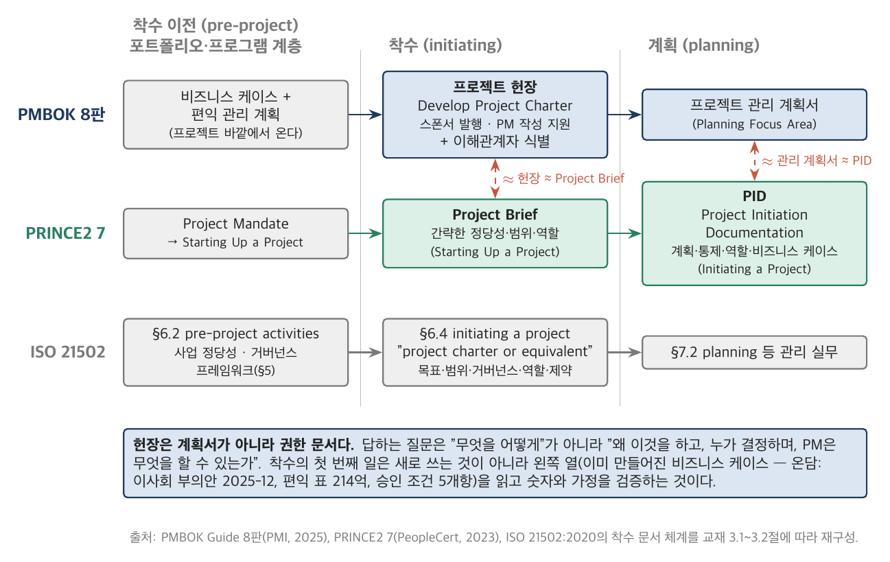

*그림 3-3. 착수 문서의 흐름 — 비즈니스 케이스 → 헌장 → 관리 계획서와 PRINCE2·ISO 21502 대응. PMBOK의 헌장은 PRINCE2의 Project Brief에, 프로젝트 관리 계획서는 PID에 가깝다. ISO 21502는 §6.2 pre-project activities와 §6.4 initiating a project('project charter or equivalent')로 앞과 뒤를 표준 안에 넣었다. 착수의 첫 번째 일은 왼쪽 열(이미 만들어진 비즈니스 케이스)을 읽고 검증하는 것이다. 세 표준을 교재 3.1~3.2절에 따라 재구성.*

### 항목별 의미 — 무엇을 어떻게 적는가

아래는 헌장의 표준 항목이다. 워크북 §4에 빈 템플릿과 온담 P1 완성 예시가 있으며, 여기서는 각 항목이 **무엇을 묻는지**와 **흔한 오류**를 설명한다.

**프로젝트 목적 / 정당성 (Purpose / Justification).** 사업적 배경, 해결할 문제, 기대 효과를 3~5문장으로, 반드시 숫자를 포함해 쓴다. 흔한 오류는 솔루션을 목적으로 적는 것이다 — "차세대 주문·재고 통합 플랫폼을 구축한다"는 목적이 아니다. 목적은 "보안 패치가 중단된 시스템으로 615개 매장의 결제를 처리하고 있고, 재고를 실시간으로 볼 수 없어 연간 약 98.7억 원어치 식자재가 폐기되며, 2027년 IPO 예비심사 전에 이 상태를 벗어나야 한다"이다. 목적은 프로젝트가 없어져도 남는 문장이어야 한다.

**측정 가능한 목표와 성공 기준 (Objectives / Success Criteria).** 프로젝트 관리 성공(산출물·일정·예산)과 프로젝트 성공(편익)을 분리해 적는다. 전자는 PM이 책임지고 후자는 편익 오너가 책임진다는 것을 문서에서 드러낸다. 온담 P1의 전자는 "2027-05-29까지 156억 집행 한도 내에서 다섯 산출물을 인도하고 P5의 서비스 인수 기준(SAC)을 충족한다"이고, 후자는 "M+24(2028-03-31) 시점 폐기율 2.2%, 결품률 1.5%, 가맹 발주 리드타임 12시간 — 측정 책임자 실명"이다. 흔한 오류는 편익 목표를 PM의 성공 기준에 넣는 것이다.

**상위 수준 요구사항 (High-level Requirements).** 상세 요구사항이 아니라 "무엇이 충족되어야 이 프로젝트가 의미 있는가"의 5~10줄. 온담에서는 실시간 중앙 재고, 모든 채널의 단일 주문 원장, 가맹 발주 채널 통합, 규제 요건(개인정보 처리항목 142개, 전자금융업) 반영, 1,842개 테이블 이관.

**상위 수준 범위와 제외 범위 (Scope / Out of Scope).** 무엇을 만드는가보다 **무엇을 만들지 않는가**가 헌장에서 더 중요하다. 제외 범위가 없는 헌장은 범위 팽창의 초대장이다. P1의 제외 범위는 SAP ECC 교체, 이천 설비·WMS(P2), 교육·가맹 계약 개정(P3), 규제 등록 자체(P4), 운영 조직 편성(P5)이다. 흔한 오류는 제외 범위를 적지 않거나, 적더라도 "기타 협의된 사항"처럼 모호하게 적는 것이다.

**주요 산출물 (Deliverables).** 명사로 적는다. "개발"이 아니라 "신규 POS와 매장 운영 시스템". PRINCE2의 Product-Based Planning이 여기서 출발한다.

**주요 마일스톤 (Milestones).** 날짜와 함께. 특히 되돌릴 수 없는 지점(G2 데이터 전환 정본 결정, G3 컷오버 승인)과 외부 고정 기한(2026-09-11, 2027-03-31)을 구분해 표시한다.

**예산 요약 (Budget).** 하나의 숫자가 아니라 층을 적는다. 승인 예산 168.0억 / 집행 한도 156.0억 / 계획 원가 145.8억 / PM 통제 컨틴전시 10.2억 / 프로그램 관리예비비 12.0억(스폰서 결재). 흔한 오류는 168억 하나만 적어 "우리 예산이 얼마인가"에 답이 세 개라는 사실을 숨기는 것이다.

**가정과 제약 (Assumptions / Constraints).** 가정은 "참이라고 믿고 계획하지만 확인되지 않은 것", 제약은 "바꿀 수 없는 것"이다. P1의 제약은 컷오버 창(2027-02-26~28), 규제 기한 두 개, 집행 한도, FP 12,400점 계약. 가정은 P2가 2027-01 통합시험 전에 인터페이스 준비를 마친다는 것, 대성로지스가 준실시간 API 연동에 합의한다는 것, 가맹 계약 부속서 개정이 2026-08-14까지 끝난다는 것, 박세연 본부장이 문서 없는 인터페이스 13본의 분석에 시간을 낸다는 것. 가정은 리스크 등록부의 첫 번째 원천이다 — 가정이 틀리면 그것이 리스크다.

**주요 리스크 (High-level Risks).** 5~10개. 착수 시점에 이미 보이는 것. 3.5절의 프리모템 결과가 여기 들어간다.

**이해관계자 요약 (Key Stakeholders).** 이름과 역할. 3.3절.

**거버넌스와 PM의 권한 (Governance / PM Authority).** 이것이 헌장의 심장이다. 누가 스폰서인가(정미란 CFO), 운영위원회 구성과 주기(프로그램 운영위 월 1회), 변경 통제 경로(CCB 월 1회 셋째 목요일, 계약상 변경협의체 격주 수요일), 에스컬레이션 경로, 그리고 **PM이 스스로 결정할 수 있는 범위**(허용범위 — 원가 +6% 이내, 일정 +15영업일 이내, 범위 ±35건 이내, PM 컨틴전시 10.2억 집행). 흔한 오류는 이 항목을 "PM은 프로젝트를 총괄한다"는 한 줄로 채우는 것이다.

**승인 (Approval).** 스폰서의 서명. 서명이 없는 헌장은 헌장이 아니다.

### 한국 기업에서 헌장이 형식화되는 이유

한국 기업의 헌장은 대부분 형식이다. 킥오프 자료의 첫 두 장이거나, PMO 양식에 맞춰 채운 뒤 아무도 다시 열지 않는 문서다. 이유는 네 가지다.

첫째, **결정이 헌장 밖에서 이미 내려졌기 때문이다.** 이사회 부의안, 사업계획서, 품의서가 이미 있고, 헌장은 그것을 PMO 양식으로 옮겨 적은 사본이다. 사본은 힘이 없다.

둘째, **PM의 권한 항목을 채울 권한이 PM에게 없기 때문이다.** 헌장에 "PM은 원가 10억 이내에서 결정한다"고 쓰려면 위임전결규정이 그것을 허용해야 하는데, 대개 본부장 위임전결 한도(온담은 5억)와 맞지 않고, 그 불일치를 다룰 사람이 없다.

셋째, **스폰서가 헌장을 읽지 않기 때문이다.** 스폰서는 품의서에 결재했고, 헌장은 PMO가 요구하는 문서다. 서명란은 대리 서명 또는 전자결재 자동 승인이다.

넷째, **헌장이 계약서와 충돌하기 때문이다.** SI에서 진짜 범위 문서는 계약서·과업지시서·제안서이고, 헌장은 그것과 다르게 쓸 수 없다. 그래서 헌장은 계약서의 요약이 된다.

### 실질화하는 방법

헌장을 살리는 방법은 양식을 바꾸는 것이 아니라 **헌장이 답해야 할 결정을 스폰서에게 요구하는 것**이다.

첫째, 헌장을 "결정 요청서"로 쓴다. 채워 넣는 문서가 아니라 스폰서가 결정해야 할 항목 — 우선순위(일정·비용·품질 중 무엇을 먼저 희생하는가), 허용범위, 편익 오너 실명, 미확정 가정 — 을 빈칸으로 남기고 스폰서에게 "이 빈칸을 채우면 헌장이 완성됩니다"라고 제시한다. 온담에서 대표(일정 우선)와 CFO(비용 우선)와 수행사(품질·범위 고정)의 세 시계가 맞지 않는다는 것을 헌장 초안의 "우선순위" 항목에 세 시계를 그대로 적어 스폰서가 하나를 고르게 한다. 스폰서가 고르지 않으면 그 사실 자체를 기록한다.

둘째, **가정·제약 목록을 헌장의 가장 긴 항목으로** 만든다. "내가 통제하지 못하는 것이 내 일정을 결정한다"를 문서로 남긴 PM만이 지연이 발생했을 때 설명할 근거가 있다. P2 리드타임, 3PL 협상, 가맹 부속서 개정, 규제 기한 네 가지는 헌장 가정·제약 목록의 절반이어야 한다.

셋째, **PM 권한 항목을 위임전결규정과 대조**한다. 불일치가 있으면 그 불일치를 헌장에 적고 스폰서가 결정하게 한다 — "PM 통제 컨틴전시 10.2억은 본부장 위임전결 한도 5억을 초과하므로, 5억 초과 건은 스폰서 사전 결재로 한다" 또는 "프로그램 관리 규정 별표에 따라 PM 결재로 한다". 어느 쪽이든 문서에 있어야 한다.

넷째, **과거 실패에 대한 답을 헌장에 넣는다.** 이사회 승인 조건 5항은 2020년·2023년 내부감사 지적을 반복하지 말라는 것이다. 헌장의 리스크와 거버넌스 항목에 "편익 산정 근거 문서(편익 프로필 8종) — 오너 실명 — G1까지", "중단 결정 시 손실 확정 절차 — CCB 규정 제○조", "위탁 산출물 형상관리·소스 인수 절차 — 계약 부속서 ○"를 명시하면 헌장은 감사 질의에 대한 답이 된다.

다섯째, **헌장을 게이트마다 다시 연다.** 서명 후 서랍에 넣지 않고 G1, G2, G3에서 목적·성공 기준·가정을 재확인한다. PRINCE2가 Business Case를 단계 경계마다 갱신하는 것과 같은 논리다.

### 실무에서 어떻게 틀리는가

헌장을 킥오프 발표 자료로 대체하는 것, 목적 칸에 솔루션을 적는 것, 제외 범위를 비워 두는 것, 예산을 한 숫자로 적는 것, PM 권한을 "총괄"로 적는 것, 편익 목표를 PM 성공 기준에 넣는 것, 가정을 적지 않는 것, 스폰서가 읽지 않은 헌장에 서명을 받는 것. 이 여덟 개 중 여러분의 마지막 프로젝트 헌장에 몇 개가 해당하는가.

---

## 3.3 이해관계자 — 식별·분석·참여 계획

### 개념

이해관계자(stakeholder)는 프로젝트에 영향을 주거나 프로젝트로부터 영향을 받는 개인·집단·조직이다. 이 정의는 넓다. 넓어야 한다. 착수 시점에 이해관계자를 좁게 잡은 프로젝트는 중간에 "그런 사람이 있는 줄 몰랐다"를 반복한다. 이해관계자 관리는 세 단계다 — **식별**(누가 있는가), **분석**(각자 무엇을 원하고 얼마나 영향력이 있는가), **참여 계획**(누구를 어떻게 다룰 것인가).

PMBOK 8판에서 이해관계자 식별은 Initiating의 두 프로세스 중 하나이고, Stakeholders 도메인은 6판의 Communications를 흡수했다. PRINCE2는 이해관계자를 organizing practice와 communication management approach에서 다루며, Project Board의 3역할이 핵심 이해관계자를 구조 안에 넣는 장치다. ISO 21502 §7.12는 이해관계자 참여를 별도 실무로 둔다.

### Power/Interest Grid — 유용하지만 한계가 있다

가장 널리 쓰이는 분석 도구는 권력(power)과 관심(interest)의 2×2 격자다. 높은 권력·높은 관심은 밀착 관리, 높은 권력·낮은 관심은 만족 유지, 낮은 권력·높은 관심은 정보 제공, 둘 다 낮으면 모니터링. 간단하고 회의실에서 10분이면 그린다.

그러나 이 격자에는 세 가지 한계가 있다. (a) **긴급성(urgency) 축이 없다** — "지금 터지는 이해관계자"와 "언젠가 중요한 이해관계자"를 구분하지 못한다. (b) **정당성(legitimacy)이 없는 권력자와 정당성만 있는 약자를 같은 칸에 넣는다** — 권력은 있지만 요구가 정당하지 않은 사람과, 요구는 정당하지만 힘이 없는 사람은 완전히 다른 대응을 요구한다. (c) **정적이다** — 연합 형성과 속성의 이동을 담지 못한다.

### Mitchell-Agle-Wood 현저성(Salience) 모델

Mitchell, Agle, Wood는 1997년 Academy of Management Review의 「Toward a Theory of Stakeholder Identification and Salience」에서 이해관계자를 세 속성으로 분류했다.

- **권력(Power)** — 자기 의지를 관철할 수단이 있는가 (강제적·물질적·규범적).
- **정당성(Legitimacy)** — 그 요구가 사회적·조직적으로 정당하다고 인정되는가.
- **긴급성(Urgency)** — 그 요구가 즉각적 대응을 요구하는가 (시간 민감성 + 중대성).

세 속성의 조합으로 7유형이 나온다.

| 속성 수 | 유형 | 속성 | 의미 |
|---|---|---|---|
| 1 (잠재적, latent) | Dormant | 권력만 | 힘은 있지만 지금은 무관심. 깨어나면 위험 |
| | Discretionary | 정당성만 | 요구는 정당하지만 힘도 긴급성도 없음. 도덕적 대상 |
| | Demanding | 긴급성만 | 시끄럽지만 힘도 정당성도 없음 |
| 2 (기대적, expectant) | Dominant | 권력 + 정당성 | 전형적 핵심 이해관계자 |
| | Dangerous | 권력 + 긴급성 | 정당성 없는 힘 + 급함. 강제적 수단 사용 가능 |
| | Dependent | 정당성 + 긴급성 | 정당하고 급하지만 힘이 없음. 다른 이해관계자에 의존 |
| 3 (확정적, definitive) | Definitive | 셋 다 | 최우선 |

이 모델의 실무 가치는 두 가지다. 첫째, **속성은 고정되어 있지 않다** — 획득되고 상실된다. Dormant가 긴급성을 얻으면 Dangerous가 되고, Dependent가 Dominant와 연합하면 Definitive가 된다. 둘째, 유형마다 대응이 다르다. Dangerous에게는 정당성을 부여하거나(테이블에 앉힌다) 권력을 차단해야 하고, Dependent에게는 그의 요구를 대변할 Dominant를 찾아 줘야 한다.

### 온담의 이해관계자를 이 모델로 읽기

> ■ **사례 사실** — 인물 13명 + 서면 등장 4명의 직책·경력·입장·발언은 §4.2 표 한 장에 있다. 이 절이 판단 근거로 쓰는 것 — 관리예비비 24억 스폰서 결재·편익 근거 요구(§2.4), 1차연도 148억(§6.3), 가맹 388점 서면 동의와 데이터 소유권(§6.2), 3PL 계약은 물류본부 소관(§6.4), 노조 물류지부 246명과 처리량 목표 공개(§6.4), 내부감사 지적 세 가지(§2.4·§6.5), SAC 판정권 박준영(§4.2).

사례 문서 §4.2의 인물들을 세 속성으로 놓아 보자. 판단은 예시이며 워크북에서 다시 한다.

- **정미란 CFO** — 권력(스폰서, 관리예비비 결재), 정당성(편익 근거 요구는 이사회 조건), 긴급성(1차연도 148억 집행 요구는 자금 계획과 연동). **Definitive.**
- **김선호 대표** — 권력(이사회 의장), 정당성, 긴급성(IPO 시계). **Definitive.** 단 일상적 관여는 낮으므로 Dormant처럼 보일 수 있다 — 게이트에서 깨어난다.
- **오정근 영업본부장** — 권력(Senior User, 가맹 협상 책임), 정당성(요구사항 대표). 긴급성은 성수기·가맹 반발 시 급등. **Dominant → Definitive 이동 가능.**
- **박세연 IT본부장** — 권력(아키텍처 최종 승인, 기존 시스템의 유일한 해독자), 정당성. **Dominant.** 그의 협조 없이 데이터 전환이 불가능하다는 사실은 권력의 원천이 직위가 아니라 지식이라는 점을 보여 준다.
- **한동석 물류본부장** — 권력(3PL 계약 소관, 이천센터 운영), 정당성. P1에 대한 관심은 낮으나 P2와 WMS 연동에서 Definitive. P1 PM이 통제하지 못하는 결정의 소유자.
- **서정필 가맹점주협의회장** — 정당성(388점의 대표, 데이터 소유권), 긴급성(단말 비용·데이터 연동이 결정되기 전에). 권력은 직접적이지 않으나 388점 서면 동의 거부라는 집합적 권력이 있다. **Dependent → 오정근과 연합하면 Definitive.** 2019년 스마트오더가 중단된 것은 이 연합이 반대 방향으로 작동한 결과다.
- **김미르 노조 물류지부장** — 정당성(246명의 대표), 긴급성(처리량 목표가 공개된 지금). 권력은 이천센터 현장 협조 거부. P1의 직접 이해관계자는 아니지만 재고 데이터 전환과 인터페이스 시험에 현장 협조가 필요하다. **Dependent이며 Dangerous로 이동할 수 있다.**
- **윤태호 내부감사팀장** — 정당성(이사회 조건 5항의 원천), 권력(서면 질의). 긴급성은 낮으나 게이트마다 상승. **Dominant.**
- **최영주 CPO** — 정당성(규제 해석), 긴급성(2026-09-11). 권력은 "검토 의견 제공, 아키텍처 결정 안 함"으로 스스로 한정. **Dependent** — 그의 요구를 아키텍처에 반영하려면 박세연이 움직여야 한다.
- **이재현 수행사 PM** — 권력(61명, 변경대가 청구권), 정당성(계약). **Dominant.**
- **강윤지 지역매니저** — 정당성(매장 현장), 긴급성(오픈 후). 권력 없음. **Discretionary** — 그러나 슈퍼유저 124명의 대표가 되면 활용률을 좌우한다.
- **박준영 서비스운영팀장** — 정당성(SAC 판정권), 긴급성은 오픈 3개월 전부터. **Dependent → 종료 시점 Definitive.**

이 배치에서 보이는 것은 P1의 가장 위험한 이해관계자가 권력자가 아니라 **정당성과 긴급성은 있지만 권력이 없어 다른 이해관계자와 연합할 동기가 있는 사람들**(서정필, 김미르, 강윤지)이라는 점이다. 2019년의 실패는 이들이 연합했을 때 일어났다.

세 속성의 교집합 위에 온담의 인물을 놓으면 그림 3-4와 같다.

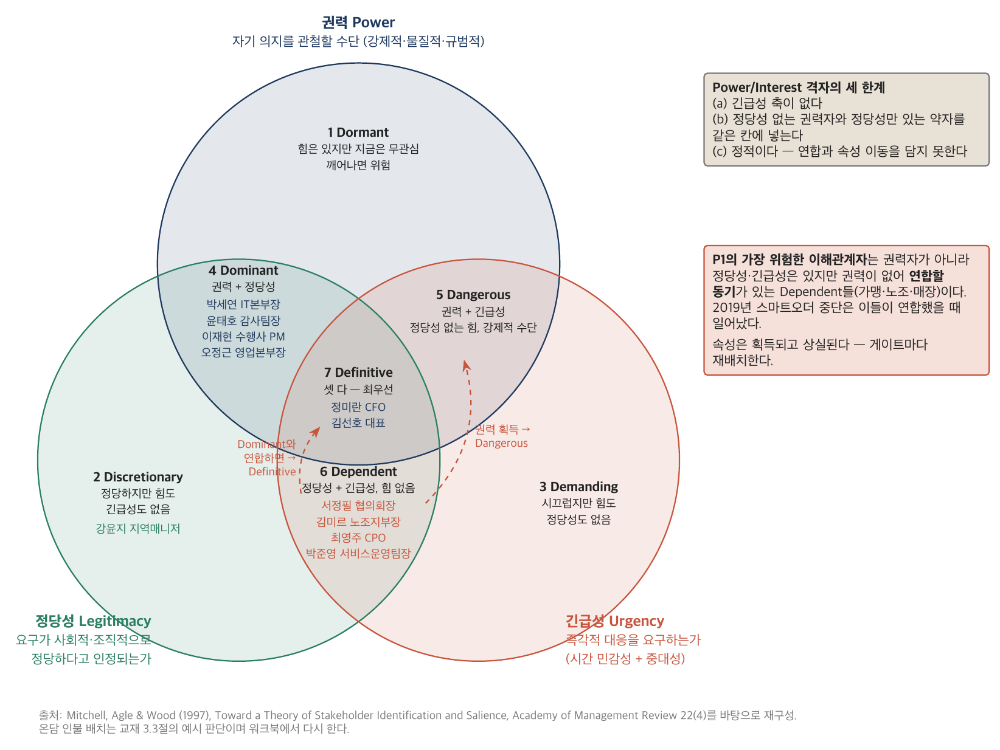

*그림 3-4. Mitchell-Agle-Wood 현저성 모델 — 3속성 벤 다이어그램의 7유형과 온담 인물 배치. 권력·정당성·긴급성 세 원의 교집합으로 Dormant, Discretionary, Demanding(1속성), Dominant, Dangerous, Dependent(2속성), Definitive(3속성)가 나온다. 온담 인물 배치는 3.3절의 예시 판단이며, 파선 화살표는 속성 획득·연합에 따른 이동(Dependent → Definitive, Dependent → Dangerous)을 나타낸다. Mitchell, Agle & Wood (1997)를 바탕으로 재구성.*

### 한국 조직 특유의 이해관계자

서구 문헌의 이해관계자 목록에 잘 나오지 않지만 한국 프로젝트에서 반복적으로 결정적인 이해관계자가 넷 있다.

**노동조합.** 시스템 도입은 노동 조건의 변경이며, 단체협약에 따라 사전 협의 대상일 수 있다. 물류 자동화·매장 인건비율 목표(21.4% → 20.1%)처럼 인력 효율이 편익으로 명시된 프로그램에서 노조는 착수 시점부터 Definitive에 가깝다. "P1은 물류 인력 프로젝트가 아니다"는 P1 PM의 말이 맞지만, 노조가 그렇게 보지 않는다는 사실이 리스크다.

**가맹점주협의회.** 가맹사업법상 가맹본부는 가맹점주단체와의 협의 의무가 있고, 가맹 계약 부속서 개정은 개별 서면 동의를 요구한다. 가맹점의 판매 데이터와 단말은 가맹점주의 소유다. 본사가 "우리 시스템"이라고 부르는 것의 절반은 본사 것이 아니다.

**감사실 / 준법.** 내부감사는 프로젝트의 고객이 아니지만, 과거 지적사항의 작성자이고 종료 후 감사의 수행자다. 착수 시점에 "어떤 문서가 있으면 지적하지 않을 것인가"를 물어 두면 종료 시점의 비용이 줄어든다. 한국 대기업에서 이것을 착수 시점에 하는 PM은 드물다.

**그룹 지주사 / 별도 법인.** ㈜온담푸드시스템은 100% 종속기업이지만 별도 법인이다. 계약 주체가 둘, 개인정보 처리자가 둘, 정보보안 정책이 둘이 된다. "그룹이니까 하나의 계약서로 되겠지"는 통하지 않는다. 지주사가 있는 그룹에서는 지주사 IT 표준·보안 정책·구매 규정이 별도의 이해관계자다.

### 참여 계획 — 분석은 대응이 있어야 의미가 있다

이해관계자 등록부의 마지막 열은 "현재 참여 수준 → 목표 참여 수준 → 그 간극을 메울 행동"이다. 참여 수준은 대개 unaware / resistant / neutral / supportive / leading의 5단계로 적는다. 서정필 협의회장은 현재 "발주 포털은 환영, 데이터·단말은 저항"이므로 항목별로 다르다 — 등록부에 한 사람을 두 행으로 적어야 할 때가 있다. 목표는 "데이터 연동 범위에 대해 neutral 이상"이고, 행동은 "가맹 단말 배포 범위와 데이터 연동 수준을 요구사항 베이스라인 동결 전에 오정근 본부장을 통해 협의회에 제시"이며, 시점은 2026-08-14 부속서 개정 목표일 이전이다. 행동에 이름과 날짜가 없는 참여 계획은 계획이 아니다.

### 실무에서 어떻게 틀리는가

이해관계자 등록부를 착수 시점에 한 번 만들고 종료까지 갱신하지 않는 것이 첫 번째 오류다. 현저성은 게이트마다 재배치된다. 두 번째 오류는 등록부에 직위만 적고 사람을 적지 않는 것이다 — "영업본부장"이 아니라 "오정근, 2005년 입사, 가맹사업팀장 출신, 가맹 재계약률 91%가 KPI, 2019년 스마트오더 중단을 사업본부에서 겪음"이어야 그의 행동을 예측할 수 있다. 세 번째 오류는 부정적 이해관계자를 등록부에서 빼는 것이다 — 문서가 유출될까 봐, 또는 "그 사람은 관계없다"고 판단해서. Dependent와 Dangerous를 등록부에서 빼면 연합이 형성될 때 대응할 근거가 없다. 네 번째 오류는 이해관계자 관리를 PM 혼자 하는 것이다. 서정필은 오정근이, 김미르는 한동석이, 윤태호는 정미란이 다뤄야 할 이해관계자다. PM의 일은 누가 누구를 다루는지를 정하고 그것이 일어나는지 확인하는 것이다.

---

## 3.4 거버넌스 — 스폰서·운영위원회·PMO·PM의 권한 구조

> ■ **사례 사실** — 거버넌스 구조 — 프로그램 이사회(의장 김선호)·스폰서 정미란·운영위·PMO·CCB 7인·변경협의체(§4.1); 위임 한도 — 본부장 전결 5억, 5,000만 원 이상 CFO 결재(2026-02-16 시행), 관리예비비 24억 스폰서(§3.5·§2.4); 허용범위 초안 원가 +6%(10.08억) / 일정 +15영업일 / …(§5.6); 발주사 투입 14명 대부분 겸임(§3.5).

### 개념

거버넌스(governance)는 "누가 무엇을 결정하고 누구에게 책임지는가"의 구조다. PMBOK 8판이 Governance를 첫 번째 성과영역으로 둔 것, ISO 21505:2017이 거버넌스를 별도 표준으로 둔 것, PRINCE2의 첫 프로세스가 Directing a Project인 것은 모두 같은 인식을 반영한다 — 프로젝트 실패의 가장 흔한 원인은 기술이 아니라 결정의 부재다.

거버넌스 구조의 표준 구성 요소는 다음과 같다.

**스폰서(Sponsor / Executive).** 프로젝트에 자원을 대고 비즈니스 케이스에 책임지는 사람. 한 명이어야 한다. 위원회는 스폰서가 될 수 없다. 온담 P1의 스폰서는 정미란 CFO이며, 그가 프로그램 스폰서이기도 하다는 점(P1 별도 스폰서가 없음)은 워크북에서 검토할 거버넌스 논점이다.

**운영위원회(Steering Committee / Project Board).** 스폰서가 의장이 되어 주요 결정을 내리는 의사결정체. PRINCE2는 이것을 3역할로 구조화한다(2.3절). 온담은 프로그램 운영위(월 1회, 스폰서 + 프로그램 PMO장 + 5개 PM)와 프로그램 이사회(분기 1회 + 게이트, 의장 김선호)의 2층이다. 운영위는 정보 공유회가 아니라 결정 기관이어야 하며, 안건에 "결정 요청 사항"이 없는 운영위는 열지 않는 편이 낫다.

**PMO(Project/Programme Management Office).** 표준·도구·보고·형상관리·품질보증을 제공하는 지원 조직. P3O는 PMO를 조직 형태(permanent/temporary, hub-and-spoke)와 기능 카탈로그로 분해한다. 온담은 프로그램 PMO 4명 + P1 PMO 3명(상주, 24개월, 12.6억 예산에 포함) + P2 PMO 2명이다. PMO는 결정하지 않는다 — 결정을 준비하고 기록한다. PMO가 결정하기 시작하면 스폰서가 결정하지 않게 된다.

**PM.** 산출물 인도에 책임지고, 허용범위 안에서 결정하며, 허용범위를 벗어나면 에스컬레이션한다.

**변경 통제 기구.** 온담은 3층이다 — 사내 CCB(7인, 월 1회 셋째 목요일, 정족수 5인, 반대의견 실명 기재), 계약상 변경협의체(발주사 3 + 수행사 3, 격주 수요일), 기준선 재확인 절차(분기 1회 또는 FP 누적 변동 ±3% 초과 시). 이 3층의 관계 — 어느 변경이 어느 층으로 가는가 — 는 Day3의 주제다.

이 구성 요소들을 결정의 흐름으로 그리면 그림 3-5와 같다.

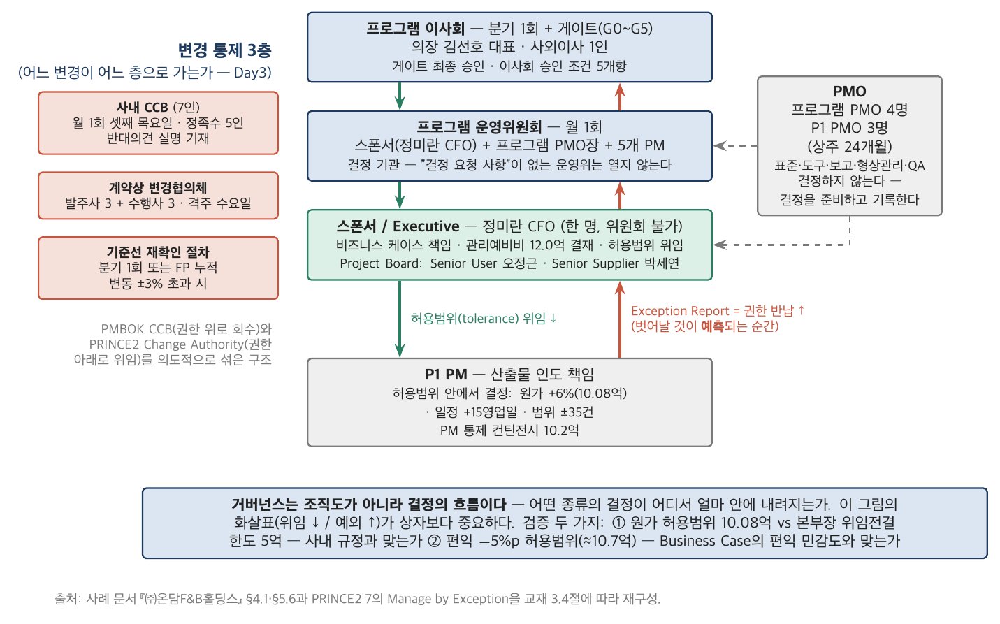

*그림 3-5. 온담 P1의 거버넌스 구조 — 결정의 흐름(위임 ↓ / 예외 ↑)과 변경 통제 3층. 프로그램 이사회 → 운영위원회 → 스폰서 → PM으로 허용범위가 위임되고, 벗어날 것이 예측되면 Exception Report로 권한이 반납된다. PMO는 결정하지 않고 준비·기록한다. 왼쪽은 사내 CCB·계약상 변경협의체·기준선 재확인 절차의 3층 변경 통제다. 사례 문서 §4.1·§5.6과 PRINCE2 7을 바탕으로 재구성.*

### Manage by Exception과 허용범위

PRINCE2의 예외 관리는 거버넌스를 실제로 작동하게 하는 장치다. 각 계층에 허용범위(tolerance)를 주고, 그 안에서는 상위에 묻지 않고 결정하며, 벗어날 것이 예측되면 Exception Report로 권한을 반납한다. 온담의 허용범위 초안(사례 문서 §5.6)을 프로젝트 계층 기준으로 보면 다음과 같다.

| 축 | 작업패키지 | 프로젝트 (P1) | 프로그램 |
|---|---|---|---|
| 원가 | +2% | +6% (10.08억) | +12% |
| 일정 | +5영업일 | +15영업일 | +30영업일 |
| 범위 | ±1% | ±3% (±35건) | ±6% |
| 품질 | 결함밀도 0.13건/FP | 0.4건/FP | 0.8건/FP |
| 리스크 | EMV 2.7억 | EMV 8억 | EMV 16억 |
| 편익 | −1.7%p | −5%p | −10%p |
| 안전·지속가능성 | 0 | 0 | 0 |

이 격자가 말하는 것은 P1 PM이 원가 10.08억, 일정 15영업일, 범위 ±35건 안에서는 스폰서에게 묻지 않고 결정할 수 있다는 것이다. 그리고 그것을 벗어날 것이 예측되는 순간 — 실제로 벗어난 후가 아니라 — Exception Report를 쓴다. 이 격자는 두 가지 방향으로 검증해야 한다. 첫째, **사내 규정과 맞는가.** 원가 허용범위 10.08억은 본부장 위임전결 한도 5억을 초과한다. 둘째, **Business Case의 편익 민감도와 맞는가.** 편익 −5%p 허용범위는 214억의 5%인 약 10.7억이 사라져도 프로젝트 계층에서 처리한다는 뜻인데, CFO가 "근거 없는 편익은 승인하지 않겠다"고 한 상황에서 이 폭이 적절한지는 스폰서가 결정해야 한다.

격자를 표로 다시 그리고 예외 반납의 방향을 표시하면 그림 3-6과 같다.

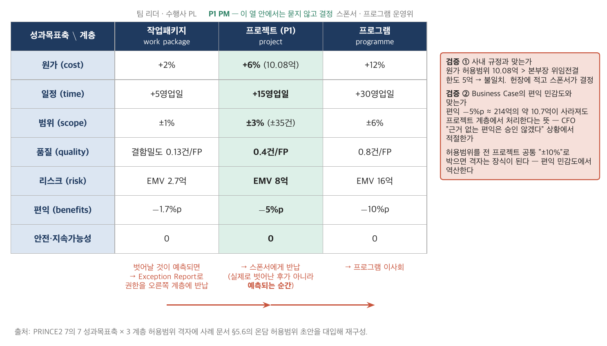

*그림 3-6. 허용범위 격자 — 7 성과목표축 × 3 계층 (온담 초안). 가운데 열(프로젝트 P1)이 PM이 스폰서에게 묻지 않고 결정할 수 있는 범위다. 벗어날 것이 예측되는 순간 오른쪽 계층으로 권한을 반납한다. 검증 두 가지 — 원가 허용범위 10.08억과 본부장 위임전결 한도 5억의 불일치, 편익 -5%p(약 10.7억)의 적절성. PRINCE2 7의 격자에 사례 문서 §5.6을 대입해 재구성.*

### "권한 없는 PM"이 한국에서 왜 일반적이며 어떻게 일하는가

한국 기업의 PM은 대개 권한이 없다. 예산 집행권은 재경과 본부장에게, 인사권은 소속 부서장에게, 계약 변경권은 구매와 법무에게, 요구사항 확정권은 현업 임원에게 있다. PM에게 남는 것은 일정표와 회의 소집권이다. 이것은 개인의 문제가 아니라 구조의 문제이며, 이유는 세 가지다.

첫째, **매트릭스 조직에서 기능 부서의 권한이 프로젝트의 권한보다 세다.** 한국 대기업은 기능 조직이 강하고 프로젝트 조직은 임시다(제1장의 임시조직). 임시조직에 권한을 주면 영구조직이 잃는다.

둘째, **위임전결규정이 직위 기준이지 역할 기준이 아니다.** "본부장 5억"은 있어도 "PM 10억"은 없다. PM은 직위가 아니라 역할이므로 위임전결규정에 자리가 없다.

셋째, **스폰서가 권한을 위임하지 않고 보고를 요구한다.** 허용범위가 없으니 모든 결정이 보고 대상이고, 보고가 많으니 PM은 결정하는 사람이 아니라 보고하는 사람이 된다.

권한 없는 PM이 일하는 방법은 세 가지다.

**허용범위를 문서로 획득한다.** 헌장의 PM 권한 항목과 허용범위 격자를 스폰서 서명으로 확보하는 것이 PM이 권한을 얻는 유일한 표준 근거 경로다. "PM은 총괄한다"가 아니라 "PM은 원가 10.08억, 일정 15영업일, 범위 ±35건 안에서 결정한다"를 서명받는다. 이것이 헌장을 실질화하는 이유이기도 하다.

**결정을 결정권자에게 가져간다 — 단, 선택지와 권고와 기한을 붙여서.** 권한이 없는 PM의 무기는 결정을 잘 준비하는 것이다. "P2 리드타임이 41주로 늘면 (a) 컷오버를 2027-03-12로 미룬다(G3 합류 버퍼 15영업일 소진) (b) 물류 인터페이스를 컷오버 범위에서 빼고 2차 오픈으로 미룬다 (c) P2 벤더에 리드타임 단축 대가를 지급한다. 권고는 (b). 결정 기한은 2026-06-30, 그 이후는 (a)만 남는다." 이 형식으로 스폰서에게 가져가면 스폰서는 결정하거나 결정하지 않은 책임을 진다. 어느 쪽이든 기록된다.

**에스컬레이션을 BATNA로 쓰지 않는다.** 매트릭스 PM의 BATNA(협상 결렬 시 최선의 대안)는 대개 에스컬레이션이고, 그것은 대부분 나쁜 BATNA다. 한 번 쓰면 관계 자본이 소진되고, 임원이 PM 편을 들지 않으면 BATNA가 공개적으로 무너진다. 상대의 BATNA — 내 요청을 거절해도 그가 잃는 것 — 를 계산하는 것이 영향력의 실체다. 박세연 본부장이 인터페이스 분석에 시간을 내지 않으면 그가 잃는 것은 "우리 손으로 운영할 수 있는 시스템"이라는 그 자신의 목표다.

### 실무에서 어떻게 틀리는가

운영위원회 명단에 임원 이름만 채우고 3역할을 배정하지 않는 것, 운영위를 정보 공유회로 운영하는 것, PMO가 결정하는 것, 허용범위 없이 Exception Report 양식만 도입하는 것, 허용범위를 사내 위임전결규정과 대조하지 않는 것, 에스컬레이션을 위협 수단으로 쓰는 것. 그리고 가장 근본적인 오류 — 거버넌스를 "조직도 그리기"로 이해하는 것. 거버넌스는 조직도가 아니라 **결정의 흐름**이며, 어떤 종류의 결정이 어디서 얼마 안에 내려지는지가 그려져야 한다. 온담 사례 §4.1의 조직도 아래 문단(3층 변경 통제)이 조직도보다 중요한 이유다.

---

## 3.5 초기 리스크와 프리모템

> ■ **사례 사실** — 프리모템의 재료 — 두 번의 실패의 경과(§6.5), 통제 밖의 것들: P2 설비 리드타임 34→41주 통지·3PL·규제 시행일·노조(§6.4, P-17), 원 개발자 3명 중 1명 재직·서버 OS 지원 종료(§2.1), 가맹 부속서 개정 서면 동의(§3.5·§6.2).

### 착수 시점에 리스크를 보는 법

착수 시점의 리스크 식별은 계획 단계의 리스크 관리와 다르다. 아직 WBS도 일정도 없다. 그래서 착수 시점의 리스크는 활동 단위가 아니라 **가정 단위**와 **구조 단위**에서 나온다.

**가정에서.** 헌장의 가정 목록 각 항목은 "이 가정이 틀리면 무엇이 일어나는가"라는 질문으로 리스크가 된다. "대성로지스가 준실시간 API 연동에 합의한다"는 가정이 틀리면 통합 재고의 물류센터 부분이 야간 배치로 남고, 재고 정확도 목표 98.5%가 구조적으로 불가능해지며, 편익 B-02·B-03·B-04가 흔들린다. 2022년에 정확히 이것이 일어났다.

**구조에서.** 제1장의 임시조직론과 Engwall이 말하는 "이미 결정된 것들"이 리스크의 두 번째 원천이다. 통제 밖의 의존(P2, 3PL, 규제, 노조), 과거 실패의 반복 패턴(편익 근거 부재, 형상관리 미비), 이해관계자 연합의 가능성(가맹·노조·매장), 핵심 인물 의존(박세연 — 기존 시스템의 유일한 해독자, OD-POS 원 개발자 3명 중 재직 1명).

**base rate에서.** 제1장 1.2절의 reference class가 세 번째 원천이다. 온담의 정보화 사업 4건 중 2건이 중단·축소되었다는 사실, IT 프로젝트 원가 초과가 멱함수 분포를 따른다는 Flyvbjerg의 실증은 "이 프로젝트는 다르다"는 믿음에 대한 외부 시각이다.

### 계획 오류와 외부 시각

Kahneman과 Tversky가 1979년에 이름 붙인 **planning fallacy(계획 오류)**는 사람들이 과제 완료 시간을 체계적으로 과소추정하는 경향이다. Buehler, Griffin, Ross의 1994년 실험은 이 현상의 결정적 특징을 보였다 — **자기 과거 실적 정보를 주어도 예측이 개선되지 않는다.** 사람들은 자신의 과거 지연을 알면서도 이번에는 다를 것이라고 믿는다. 후속 연구(Newby-Clark et al., 2000)는 사람들이 낙관 시나리오에 집중하고 비관 시나리오를 무시한다는 것을 보였다.

이 발견이 outside view의 필요성을 만든다. 내부 시각(inside view)은 이 프로젝트의 세부 계획을 보고 "이렇게 하면 된다"고 추정한다. 외부 시각(outside view)은 이 프로젝트를 유사한 프로젝트들의 한 사례로 보고 "그 부류는 대개 이렇게 되었다"에서 출발한다. Lovallo와 Kahneman의 2003년 HBR 논문 「Delusions of Success」가 이것을 경영 언어로 옮겼고, Flyvbjerg의 RCF가 절차로 만들었다.

착수 시점의 PM에게 이것은 다음을 뜻한다. P1 계획이 17개월·156억이라고 할 때, "이 계획이 맞는가"를 묻기 전에 "온담과 비슷한 규모의 회사가 비슷한 규모의 플랫폼 재구축을 했을 때 대개 얼마나 걸리고 얼마나 초과했는가"를 먼저 물어야 한다. 그 답을 구할 데이터가 없다면 — 대개 없다 — "데이터가 없다"는 사실 자체가 첫 번째 리스크다.

### 프리모템 — Gary Klein

Gary Klein은 2007년 HBR의 2페이지 글 「Performing a Project Premortem」에서 착수 시점의 리스크 식별 기법을 제안했다. 절차는 단순하다. 팀이 계획을 공유한 뒤, 진행자가 말한다 — "지금은 프로젝트가 끝난 시점이고, 이 프로젝트는 완전히 실패했다. 각자 2분 동안 그 실패의 이유를 적으라." 그다음 돌아가며 한 가지씩 이유를 말하고 기록한다.

이 기법의 설계 핵심은 두 가지다. (a) **"실패했다"를 완료된 사실로 전제한다.** "실패할 수 있다면 왜"가 아니라 "실패했다. 왜"다. Mitchell, Russo, Pennington의 1989년 실험(prospective hindsight)은 미래를 이미 일어난 일로 회고하게 만들면 사건의 이유를 생성하는 능력이 유의하게 높아진다는 것을 보였다. 문법의 차이가 효과를 만든다. (b) **프로젝트의 약점을 아는 반대자가 안전하게 말할 수 있는 장을 만든다.** 킥오프 직후의 팀은 낙관과 몰입(제1장의 commitment-building)으로 차 있고, 이 분위기에서 "이건 안 될 것 같다"고 말하는 것은 사회적 비용이 크다. 프리모템은 그 발언을 과제로 만들어 비용을 없앤다.

절차와 문법의 차이를 그림 3-7에 정리했다.

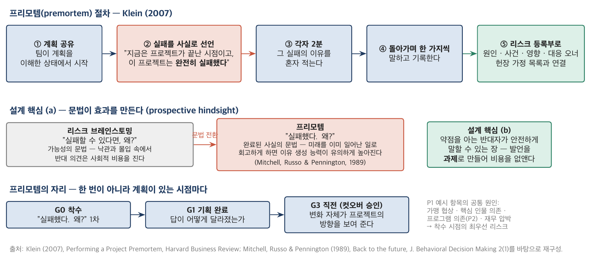

*그림 3-7. 프리모템 절차와 '실패했다'의 문법. 위: 계획 공유 → 실패를 사실로 선언 → 각자 2분 → 돌아가며 한 가지씩 → 리스크 등록부로 옮기는 다섯 단계. 가운데: '실패할 수 있다면 왜'(브레인스토밍)와 '실패했다. 왜'(프리모템)의 문법 대조 — prospective hindsight. 아래: G0·G1·G3 직전에 반복한다. Klein (2007), Mitchell, Russo & Pennington (1989)을 바탕으로 재구성.*

P1의 프리모템에서 나올 법한 실패 이유를 예시로 적어 본다. 워크북에서 여러분은 스스로 작성한다.

- 2027-05 P1 종료. 컷오버는 했지만 가맹점 388점 중 140점이 새 POS 소프트웨어 배포를 거부해 두 시스템이 병행 운영되고 있다. 부속서 개정 서면 동의를 2026-08까지 못 받았기 때문이다.
- 데이터 전환 정본 결정(G2)이 두 달 밀렸다. 문서 없는 인터페이스 13본의 분석이 박세연 본부장 한 사람에게 걸려 있었고, 그가 P1 외에 SAP ECC 유지보수 종료 대응도 맡고 있었다.
- P2 설비 리드타임이 41주가 되어 물류 인터페이스 시험이 컷오버 후로 밀렸고, 통합 재고의 절반이 야간 배치로 남았다. 편익 B-02·B-04는 G5에서 미달로 나왔다.
- CFO가 1차연도 집행을 148억으로 줄이면서 데이터 전환 전문 용역(11.4억)을 2027년으로 미뤘고, 리허설 3회가 1회로 줄었다.
- 수행사가 발주사 미결정 대기 시간을 변경대가로 청구했고, 변경협의체가 여섯 달 동안 합의하지 못해 감리 지적 시정조치가 검수를 막았다.
- 오픈 첫 달 서비스데스크 11명에게 매장 615개의 콜이 몰렸고, 박준영 팀장이 SAC 미충족으로 인수를 거부해 P1 종료가 두 달 밀렸다.

이 목록의 각 항목은 리스크 등록부의 한 행이 된다 — 원인, 사건, 영향, 대응 오너. 그리고 여러 항목이 같은 원인(가맹 협상, 핵심 인물 의존, 프로그램 의존, 재무 압박)을 가리키는 것이 보인다. 그 공통 원인이 착수 시점의 최우선 리스크다.

### 프리모템의 자리

프리모템은 착수 시점에 한 번 하고 끝내는 것이 아니다. Klein의 원래 용법도 계획이 있는 시점마다다. 온담이라면 G0(착수), G1(기획 완료), G3 직전(컷오버 승인)에 각각 다시 한다. 게이트마다 "실패했다. 왜"의 답이 달라지며, 그 변화가 프로젝트가 어디로 가고 있는지를 보여 준다.

### 실무에서 어떻게 틀리는가

착수 시점 리스크 등록부를 "일반적 리스크 목록"(일정 지연, 예산 초과, 인력 이탈, 요구사항 변경)으로 채우는 것이 첫 번째 오류다. 그것은 모든 프로젝트의 리스크이지 이 프로젝트의 리스크가 아니며, 대응이 나오지 않는다. 두 번째 오류는 프리모템을 "리스크 브레인스토밍"으로 바꾸는 것이다 — "실패했다"의 문법을 "실패할 수 있다"로 바꾸는 순간 효과가 사라진다. 세 번째 오류는 프리모템 결과를 기록만 하고 리스크 등록부와 헌장 가정 목록에 연결하지 않는 것이다. 네 번째는 반대자의 발언을 킥오프의 분위기를 해치는 것으로 취급하는 것이다 — 그 발언이 프리모템의 목적이다. 다섯 번째는 "우리 프로젝트는 특별하므로 과거 데이터가 안 맞는다"는 uniqueness bias를 리스크 식별에서도 반복하는 것이다.

---

## 3.6 분야별 착수 노하우 — SI, 건설·EPC, 제조 NPD, 제약 (심화)

착수의 모양은 분야마다 다르다. 이 절은 네 분야의 착수가 어떤 문서·결정·제약 위에서 시작되는지를 대조한다.

### SI — 계약 이후에 착수하는 프로젝트의 특수성

SI의 착수는 다른 분야와 결정적으로 다른 점이 하나 있다. **착수 시점에 이미 계약이 있다.** RFP → 제안 → 평가 → 협상 → 계약이라는 절차가 착수 전에 끝나 있고, 범위·금액·기간·산출물이 계약서에 적혀 있다. 헌장은 계약서와 다르게 쓸 수 없다. 그래서 SI PM의 착수 시점 일은 헌장을 쓰는 것이 아니라 **계약 문서를 읽고 헌장으로 번역하는 것**이다.

읽어야 할 것은 세 문서와 그 우선순위다. 통상 **계약서 > 과업지시서(RFP) > 제안서** 순의 우선순위 조항 아래에서, 제안서는 과업을 늘릴 수는 있어도 RFP를 축소할 수는 없는 "단방향 확대 문서"다. 제안서에 차별화를 위해 쓴 "무상 3개월 안정화 지원", "성능 2배 개선", "AI 기반 자동 분류"는 그대로 과업이 된다. 제안 PM과 수행 PM이 분리된 조직에서 이 손실은 구조적으로 반복된다. 발주사 PM 입장에서는 반대로, 제안서에 쓰인 것을 착수 시점에 산출물 목록으로 확정해 두어야 한다.

두 번째로 읽어야 할 것은 **규모 기준선**이다. 온담 P1은 FP 12,400점 × 55만 원 = 68.2억이 개발 용역이다. FP는 객관적 규모 측정치가 아니라 발주사에게는 상한, 수행사에게는 변경대가 청구 근거로 작동하는 **협상 인공물**이며, 착수 시점의 FP 기준선을 양측이 서면으로 확인해야만 이후의 델타 주장이 성립한다. G1(2026-04-30)의 "FP 기준선 확인서 서명"이 이것이다. 수행사가 응찰가 198억에서 168억으로 깎인 계약을 손익률 6.5%로 수행해야 한다는 사실은, 착수 3주차에 "사업수행계획서의 WBS"와 "제안서의 산출물 목록"이 1:1로 매핑되지 않는다는 것이 발견되면 검수 분쟁이 확정된다는 것을 뜻한다.

세 번째는 **인터페이스 상대의 소유자**다. SI 프로젝트는 컷오버 주말에 죽지 않는다. 진짜 사인은 대개 데이터 정제 착수 지연과 인터페이스 상대 시스템의 미확정이다. 온담의 47본 인터페이스 중 문서 부재 13본, 3PL 소유 WMS, 별도 법인의 공장 데이터, 은행·PG 연동 7본은 각각 소유자가 다르며, 착수 시점에 "누가 이 인터페이스의 상대 쪽을 준비하는가"의 이름이 없으면 통합시험에서 멈춘다.

**공공 SI와 민간 SI의 차이를 분명히 해 두어야 한다.** 공공 정보화 사업에는 「소프트웨어 진흥법」 제50조의 과업심의위원회 — 수행사가 과업 변경으로 계약 변경이 필요할 때 발주기관장에게 개최를 요청할 수 있는 법정 통로 — 와 「전자정부법」상 감리 의무, 분리발주 원칙 등 별도의 제도가 있다. **이 제도들은 국가기관 등 공공 발주에만 적용되며, ㈜온담F&B홀딩스 같은 민간 발주에는 적용되지 않는다.** 민간 발주에서 그 기능은 계약서로 직접 만들어야 한다 — 온담의 사내 CCB + 계약상 변경협의체 + 기준선 재확인 절차가 그것이다. 공공 SI 경험자가 민간 프로젝트에서 "과업심의위원회에 올리자"고 말하는 순간 그 제도가 여기 없다는 사실이 리스크가 된다. 반대로 민간에서 공공으로 옮긴 PM은 법정 절차의 존재를 착수 시점에 확인해야 한다.

### 건설·EPC — 발주 방식과 계약 유형이 착수 전에 리스크를 결정한다

EPC에서 착수 시점의 리스크는 대부분 착수 전에 결정되어 있다. 결정하는 것은 두 가지다.

**설계 성숙도.** AACE의 추정 등급(Class 5~1)은 엔지니어링 산출물의 정의도로 결정된다 — Class 5는 정의도 0~2%, Class 3은 10~40%, Class 1은 50~100%. 어느 Class에서 계약을 맺느냐가 추정치의 신뢰 구간을 정하며, 그 구간은 고정 상수가 아니라 리스크 분석으로 산정하는 범위다. "Class 3 = −20%~+30%"처럼 표를 외워 적용하면 틀린다.

**계약 유형.** 총액확정(LSTK/turnkey), 실비정산(cost-reimbursable), 단가(unit price)는 리스크를 누가 지느냐를 정한다. 그리고 여기 역설이 있다 — 설계 성숙도가 낮은 상태(Class 4 이하)에서 경쟁입찰로 LSTK를 체결하면 리스크가 시공자에게 이전되는 것이 아니라 (a) 가격에 프리미엄으로 얹히거나 (b) 반영되지 못하면 시공자가 스펙을 동결하려 하고 모든 해석 차이가 변경 청구가 되어 (c) 클레임·부실·부도로 되돌아온다. Merrow의 IPA 데이터는 설계 성숙도가 낮을 때 LSTK가 원가·일정 성과를 오히려 악화시킨다는 것을 보여 준다. "턴키가 안전하다"는 국내 발주처의 신념이 깨지는 지점이다.

착수 시점의 EPC PM이 할 일은 자기 프로젝트가 어느 Class에서 어느 계약 유형으로 시작하는지를 확인하고, 그 조합이 함의하는 리스크(Class 4 + LSTK = 변경 청구의 폭풍)를 헌장에 적는 것이다. 온담 P2가 정확히 이 검토 대상이다 — 처리량 4,200 케이스/시간이 "현장에서 나온 숫자가 아니다"라는 한동석 본부장의 말은 P2가 Class 4 사양으로 설비 발주(T0, 선급금 29.6억)를 앞두고 있다는 뜻이며, 발주 후에는 되돌릴 수 없다.

EPC에서 착수 시점에 확정해야 할 또 하나는 **기록 규율**이다. SCL Protocol 2판이 Core Principle 1을 "프로그램과 기록"으로 둔 이유는 지연·방해 청구의 승패가 분석 기법이 아니라 사건 당시 생성된 기록(contemporaneous records)의 존재로 결정되기 때문이다. 이 규율은 SI에도 그대로 성립한다 — "발주사 결정 지연 12일"을 주장하려면 지연 당일에 발송한 서면 통지가 있어야 하고, 회의록 확인 서명을 미루기 시작하는 발주사 담당자는 내부적으로 결정 권한을 잃었다는 신호다.

### 제조 NPD — Stage-Gate의 Gate 1~2와 kill 결정

신제품 개발의 착수는 Cooper의 Stage-Gate에서 Gate 1(아이디어 스크린)과 Gate 2(2차 스크린, "go to business case")다. 이 두 게이트의 특징은 **정보가 가장 적은 시점에 내리는 결정**이라는 것이며, 그래서 설계 원칙이 다르다.

**게이트는 회의가 아니라 투자 결정이다.** 산출물은 검토 의견이 아니라 Go / Kill / Hold / Recycle 중 하나이며, Go에는 다음 스테이지의 인력·예산이 붙어 있어야 한다. 자원 약정이 붙지 않은 게이트는 통과된 과제가 인력을 못 받아 늘어지고, 결국 게이트 자체가 무의미해진다 — Cooper가 "이빨 없는 게이트"라고 부르는 문제의 본질은 심사 기준이 아니라 자원 권한이다.

**Must-meet / Should-meet 이원 기준.** 게이트 기준을 통과 필수 조건(must-meet — 하나라도 No면 즉시 Kill)과 점수화 항목(should-meet — 가중 스코어카드)으로 분리한다. 단일 스코어 방식은 치명적 결격 사유가 다른 높은 점수에 상쇄되어 묻히는 구조적 결함이 있다. 규제·안전·IP 항목은 반드시 must-meet에 둔다. "3.8점이니 통과"는 규제 승인 불가 항목이 마케팅 점수에 가려진 것이다.

**초기 게이트에서 전체 NPV를 요구하지 않는다.** Gate 1에서 5년 매출 추정을 요구하면 그 숫자는 반드시 허구이며, 조직은 숫자를 잘 만드는 팀에 자원을 배분하게 된다. 실물옵션 관점에서 각 스테이지 투자는 "다음 단계로 갈 권리를 사는 것"이지 프로젝트 전체를 승인하는 것이 아니다. 불확실성이 높다는 것은 기각 사유가 아니라 작게 나눠 투자할 이유다.

**Kill이 0건인 게이트 프로세스는 고장난 것이다.** 게이트를 경영진 보고회로 운영하며 자료의 완성도를 심사하고 "보완 후 재보고"를 남발하면 Kill이 0건인 프로세스가 만들어진다. 온담의 6개 게이트(G0~G5)에 이 질문을 던져야 한다 — G1에서 P1을 중단할 수 있는가, 중단 기준은 무엇인가, 중단 결정자는 착수 결정자와 다른 사람인가(제4장 Staw).

### 제약 — 규제 게이트의 비가역성

규제 산업의 착수는 규제 경로(regulatory pathway)의 결정에서 시작한다. 의약품이면 IND → 임상 1/2/3상 → NDA, 의료기기면 등급에 따라 510(k) / De Novo / PMA, 소프트웨어 의료기기면 IEC 62304 안전등급(A/B/C)이 요구 산출물의 양을 결정한다. 경로가 결정되면 그 경로의 게이트는 협상할 수 없다.

규제 게이트의 특징은 세 가지다. (a) **제출 순간 문서 세트가 잠긴다.** 제출 후의 설계 변경은 재제출이다. (b) **심사 시계는 제출자가 통제하지 못한다.** FDA De Novo의 목표 심사 기간은 150일이지만 이는 sponsor 응답 대기 기간을 제외한 심사일이므로, 실제 달력 일수는 추가자료 요구(AI, hold) 왕복 횟수에 지배된다. (c) **추가자료 요구는 시계를 멈추고 재개 시점을 상대가 정한다.** 일반 프로젝트의 여유(float) 개념이 성립하지 않는다.

착수 시점의 오류는 규제 마일스톤을 표준 심사 기간만큼의 고정 블록으로 간트에 놓고, 추가자료 라운드를 0회로 가정하고, 그 뒤에 상업 출시일을 이미 대외 공표하는 것이다. 처방은 추가자료 라운드 수를 reference class(같은 경로의 과거 제출 건)에서 가져와 분포로 놓는 것이다.

규제가 애자일을 막는다는 통념은 틀렸다. GAMP 5 2판은 "명세-검증 접근이 본질적으로 선형이 아니며 반복적·점진적 방법을 완전히 지원한다"고 명문화했고, FDA의 CSA 가이던스는 "필요 이상 기록하지 않기"를 기본값으로 삼는 리스크 기반 접근을 공식화했다. 규제 산업에서 실행 가능한 방식은 개발 리듬(스프린트)과 산출물 베이스라인(릴리즈)을 분리해 스프린트마다 전체 문서 세트를 만들지 않는 것이다.

온담에서 이 구조는 P4 규제 대응 워크스트림 — 개인정보 보호법 개정 대응(시행 2026-09-11, 처리항목 142개·위탁사 19개·재위탁 4건 설계 반영), 전자금융업 등록(신청 2027-01-29, 심사 대응 2027-03-31), ISMS-P(2027-06) — 로 나타난다. 최영주 CPO의 "규제 시행일은 협상 대상이 아니다"는 규제 게이트의 비가역성이고, "나는 검토 의견을 제공하지 아키텍처를 결정하지 않는다"는 규제 해석과 설계 결정의 책임 분리다. 규제 해석을 담당자와 구두로 정하고 문서화하지 않으면 담당자 교체와 함께 뒤집힌다 — 착수 시점에 규제 요건의 해석을 서면으로 받아 두어야 한다.

### 네 분야가 착수에서 공유하는 것

분야는 달라도 착수 시점에 확인해야 할 것은 같다. **무엇이 이미 결정되어 있는가**(계약, 설계 성숙도, 규제 경로, 게이트 기준), **어느 결정이 되돌릴 수 없는가**(FP 기준선, 설비 발주, 금형, 규제 제출), **누가 그 결정을 소유하는가**, 그리고 **그것을 문서로 남겼는가**. 헌장은 이 네 질문에 대한 답을 적는 곳이다.

---

## 제3장 핵심 정리

> **한 줄씩 — 수업 직전 5분 복습용**
> 1. 착수의 첫 일은 새로 쓰는 게 아니라 이미 승인된 비즈니스 케이스의 숫자와 가정을 검산하는 것이다.
> 2. 산출물은 PM의 책임, 편익은 현업 오너의 책임 — 편익 책임자에 PM을 적으면 안 된다.
> 3. 편익은 기술이 아니라 조직이 일하는 방식이 바뀔 때 난다 — 그 경로가 착수 때 보여야 한다.
> 4. 헌장은 계획서가 아니라 권한 문서다 — 제외 범위·예산 층·가정·PM 권한, 그리고 스폰서가 결정할 빈칸.
> 5. 가장 위험한 이해관계자는 권력자가 아니라 정당성·긴급성은 있는데 힘이 없어 연합하려는 사람들이다.
> 6. 권한 없는 PM은 결정을 선택지·권고·기한과 함께 결정권자에게 가져간다 — 허용범위 격자가 그 근거다.
> 7. 프리모템은 "실패했다, 왜?"의 문법으로 반대 의견을 과제로 바꾼다 — 게이트마다 반복한다.
>
> 아래는 같은 내용의 자세한 판이다.

1. 착수의 첫 번째 일은 새로 만드는 것이 아니라 이미 만들어진 비즈니스 케이스의 숫자와 가정을 검증하고 결함을 목록으로 만들어 스폰서에게 결정을 요구하는 것이다.
2. 산출물(output)은 PM의 책임, 활용(utilisation)과 성과(outcome)는 사업 오너의 책임이다(Zwikael & Smyrk의 ITO). 편익 오너를 PM으로 지정하면 범위 방어와 책임 회피가 합리적 행동이 된다. 편익 오너는 상설 조직의 실명이어야 한다.
3. 편익은 기술이 아니라 조직 변화에서 나온다(Ward & Daniel의 BDN). P1이 성공해도 편익이 안 나올 경로가 착수 시점에 보여야 한다.
4. 헌장은 계획서가 아니라 권한 문서다. 목적에 솔루션을 적지 말고, 제외 범위·예산 층·가정·PM 권한(허용범위)을 채우며, 스폰서가 결정해야 할 빈칸(우선순위)을 남겨 결정을 요구한다.
5. Power/interest 격자는 긴급성과 정당성을 못 잡는다. Mitchell-Agle-Wood의 3속성·7유형으로 보면 P1의 가장 위험한 이해관계자는 권력자가 아니라 연합할 동기가 있는 Dependent들(가맹·노조·매장)이다. 한국 특유의 이해관계자 — 노조, 가맹점주협의회, 감사실, 별도 법인·지주사.
6. 거버넌스는 조직도가 아니라 결정의 흐름이다. 허용범위 격자(7축 × 3계층)가 PM이 권한을 얻는 유일한 표준 근거 경로이며, 권한 없는 PM은 결정을 선택지·권고·기한과 함께 결정권자에게 가져가고 에스컬레이션을 BATNA로 쓰지 않는다.
7. 착수 시점 리스크는 가정·구조·base rate에서 나온다. 프리모템(Klein, 2007)은 "실패했다. 왜"의 문법으로 반대자의 발언을 과제로 만든다. 게이트마다 반복한다.
8. SI는 계약 이후 착수(계약 문서 우선순위, FP 기준선, 인터페이스 소유자 — 공공 제도는 민간에 적용되지 않는다), EPC는 설계 성숙도 × 계약 유형이 착수 전 리스크를 결정, NPD는 Gate 1~2가 자원 약정이 붙은 투자 결정이며 kill이 0건이면 고장, 제약은 규제 게이트가 비가역적이다.

## 생각해 볼 질문

1. 여러분의 마지막 프로젝트에서 편익 오너는 누구였는가. 그 사람은 프로젝트가 끝난 뒤에도 그 조직에 있었는가.
2. 온담 P1의 스폰서가 프로그램 스폰서와 같은 사람(정미란)이라는 것은 장점인가 단점인가.
3. 여러분 회사의 헌장 양식에서 "PM 권한" 항목은 무엇으로 채워져 있는가. 그것을 위임전결규정과 대조해 본 적이 있는가.
4. 서정필 협의회장과 김미르 지부장이 연합하면 무엇이 일어나는가. 그 연합을 막는 것이 PM의 일인가, 아니면 그 연합의 요구를 정당한 것으로 테이블에 올리는 것이 PM의 일인가.
5. P1을 G1에서 중단할 수 있는가. 중단 기준은 무엇이어야 하고, 누가 결정해야 하는가.

## 워크북 연결

이 장의 내용은 Day1 워크북 다섯 산출물 전부에서 온담 P1에 적용한다 — **§1 비즈니스 케이스 요약**(3.1절: 편익의 소유권·ITO·Ward & Daniel → 항목 4·6·9), **§2 프로젝트 헌장**(3.2절: 항목별 의미와 실질화 → 15개 항목 전부, 특히 목적·제외 범위·예산 층·가정·PM 권한의 흔한 오류), **§3 이해관계자 등록부와 현저성 분석**(3.3절: Mitchell-Agle-Wood → 인물 13명을 3속성으로 분류하고 관여 계획에 이름·행동·날짜를 붙인다), **§4 거버넌스 구조와 RACI 초안**(3.4절: Manage by Exception·허용범위·권한 없는 PM → 허용범위 초안을 사내 위임전결규정과 대조해 불일치를 찾는다), **§5 프리모템 기록과 초기 리스크 목록**(3.5절: Klein의 프리모템 → 결과를 리스크 등록부 형식(원인·사건·영향·소유자)으로 옮기고 헌장의 가정 목록과 연결한다). 심화 과제(3~7년차): 이사회 편익 표 8항목(사례 §5.5)에 대해 편익 프로필(기준값·목표값·분모·측정 방법·측정 시점·오너 실명)을 작성하고, 근거가 없는 항목을 식별해 스폰서에게 보낼 결정 요청 문안을 쓴다 — Day4 편익 실현 원장(⑳)의 초안이 된다.

---

# 제4장 이 날의 학술 배경 — 깊이 읽기 (과정 후)

이 장은 제1~3장에서 인용한 학술 문헌 가운데 네 갈래를 골라 깊이 읽는다. 실무자에게 학술 문헌이 필요한 이유는 권위를 빌리기 위해서가 아니다. 표준이 "이렇게 하라"고만 말하는 지점에서 학술 문헌은 "왜 그런가"와 "언제 그것이 틀리는가"를 말해 주며, 그 두 가지를 아는 사람만이 표준을 테일러링할 수 있기 때문이다.

## 4.1 Rethinking Project Management의 다섯 방향

### 무엇인가

2003년 영국 EPSRC(공학·물리과학 연구회)가 "Rethinking Project Management"라는 이름의 연구 네트워크에 자금을 댔다. 학자와 실무자가 2년 동안 모여 "프로젝트 관리 연구는 어디로 가야 하는가"를 논의했고, 그 결론이 2006년 International Journal of Project Management 24권 8호 특집으로 발표되었다. 대표 논문은 Winter, Smith, Morris, Cicmil의 「Directions for future research in project management: The main findings of a UK government-funded research network」(pp. 638-649)이다.

논문은 다섯 개의 방향(directions)을 FROM → TOWARDS 형식으로 제시한다.

| # | 방향 | FROM | TOWARDS |
|---|---|---|---|
| 1 | 프로젝트 복잡성 이론 | 프로젝트와 PM의 라이프사이클 모델 (단순한 순차 모델) | 프로젝트와 PM의 복잡성에 관한 이론들 |
| 2 | 사회적 과정으로서의 프로젝트 | 도구적 라이프사이클 이미지 — 프로젝트는 계획대로 실행되는 것 | 사회적 과정 — 프로젝트는 사람들이 상호작용하며 만들어 가는 것 |
| 3 | 가치 창출 | 제품 창출 — 산출물의 인도가 목표 | 가치 창출 — 편익과 가치가 목표 |
| 4 | 프로젝트의 개념화 | 좁은 개념 — 사전에 정의된 목표를 가진 것 | 넓은 개념 — 다중 목표, 다중 이해관계자, 진행 중에 정의가 바뀌는 것 |
| 5 | 실무자 발달 | 훈련받은 기술자(trained technician) — 절차와 도구를 적용하는 사람 | 성찰적 실무자(reflective practitioner) — 상황 속에서 판단하는 사람 |

다섯 방향과 이 교재의 대응을 그림 4-1에 정리했다.

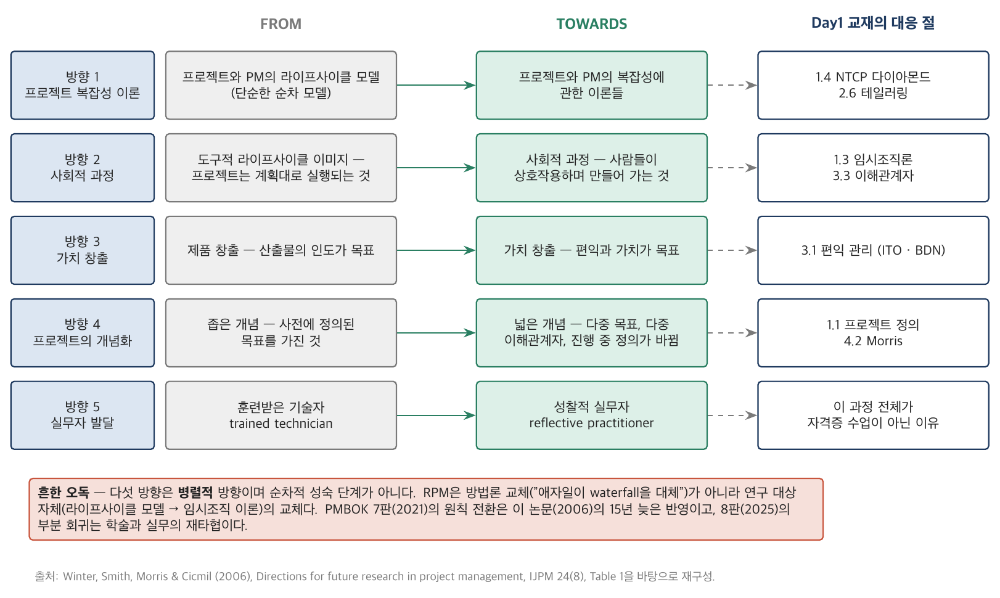

*그림 4-1. Rethinking Project Management의 다섯 방향 — FROM → TOWARDS와 Day1 교재의 대응 절. 다섯 방향은 병렬적이며 순차적 성숙 단계가 아니다. 각 방향의 TOWARDS가 Day1의 어느 절에 대응하는지를 오른쪽 열에 붙였다(복잡성 → 1.4·2.6, 사회적 과정 → 1.3·3.3, 가치 → 3.1, 개념화 → 1.1·4.2, 실무자 → 과정 전체). Winter, Smith, Morris & Cicmil (2006), Table 1을 바탕으로 재구성.*

### 실무자가 이것을 알면 무엇이 달라지는가

이 다섯 방향은 이 교재의 뼈대이며, 각 방향이 Day1의 한 절에 대응한다. 방향 1(복잡성)은 제1장 1.4의 NTCP와 제2장 2.6의 테일러링이고, 방향 2(사회적 과정)는 제1장 1.3의 임시조직론과 제3장 3.3의 이해관계자이며, 방향 3(가치)은 제3장 3.1의 편익 관리이고, 방향 4(개념화)는 제1장 1.1의 프로젝트 정의와 4.2의 Morris이며, 방향 5(실무자)는 이 과정 전체가 자격증 수업이 아닌 이유다.

실무적으로 이 논문이 주는 가장 큰 것은 **표준 변경을 뉴스가 아니라 사조로 보게 해 준다**는 점이다. PMBOK 7판의 원칙 전환(2021)은 이 논문(2006)의 15년 늦은 반영이었고, APM BoK 7판(2019)이 그 사이에 있다. 8판의 프로세스 부분 회귀(2025)는 학술과 실무의 재타협이다. 이것을 알면 "또 개정이냐"가 "왜 그랬는지 알겠다"로 바뀐다.

같은 특집호의 쌍둥이 논문 Cicmil, Williams, Thomas, Hodgson의 「Rethinking Project Management: Researching the actuality of projects」(pp. 675-698)는 "actuality of projects" — 표준이 기술하는 프로젝트와 실무자가 살아내는 프로젝트가 다른 대상이라는 것 — 을 정식화한다. Crawford, Morris, Thomas, Winter의 「Practitioner development: From trained technicians to reflective practitioners」(pp. 722-733)는 방향 5를 단독으로 확장하며, 자격 기반 역량 모델의 한계와 Schön 계보의 reflective practice로의 이행을 다룬다.

### 흔한 오독

RPM을 "애자일이 waterfall을 대체했다"는 방법론 교체 서사로 축약하는 것이 첫 번째 오독이다. RPM의 논지는 방법론 교체가 아니라 연구 대상 자체(라이프사이클 모델 → 임시조직 이론)의 교체다. 두 번째 오독은 다섯 방향을 순차적 성숙 단계로 그리는 것 — 원문은 병렬적 방향이다. 세 번째는 "성찰"을 회고 회의(retrospective)로 등치하는 것 — Schön 계보의 reflective practice는 행위 중 성찰(reflection-in-action)을 포함하며 사후 회의보다 실시간 판단 습관에 무게가 있다. 그리고 이 개념을 자격증 무용론으로 쓰는 것도 오독이다 — 원 논문의 주장은 대체가 아니라 발달 경로다.

### 어디를 읽을 것인가

Winter et al.(2006)은 12페이지이며 전체를 읽는다. 특히 Table 1(다섯 방향 요약)과 각 방향의 "implications" 단락. Geraldi와 Söderlund의 「Project studies: What it is, where it is going」(IJPM 36(1), 2018, pp. 55-70)은 RPM 이후 12년의 지형을 정리하므로 그다음에 읽을 하나다.

---

## 4.2 Morris — 프로젝트 관리에서 프로젝트들의 관리로

### 무엇인가

Peter Morris는 1994년 『The Management of Projects』(Thomas Telford)에서 어법 하나를 바꿨다. "project management"가 아니라 "the management of projects"다. 전자는 실행 통제 — 계획을 세우고 진척을 감시하고 변경을 통제하는 것 — 이고, 후자는 프로젝트가 정의되는 앞단(front-end), 기술, 상업, 정치까지 포함한 넓은 영역이다. Morris의 주장은 프로젝트의 성패가 대부분 실행이 아니라 앞단에서 결정되는데, 프로젝트 관리 지식체계(BOK)는 실행만 다룬다는 것이다.

2013년 『Reconstructing Project Management』(Wiley-Blackwell)에서 그는 40년 분야 역사를 다시 쓰면서 특히 "표준 지식체계가 왜 front-end를 배제하게 되었는가"의 계보를 추적한다. 동반 논문 「Reconstructing Project Management Reprised: A Knowledge Perspective」(Project Management Journal, 2013)가 지식 관점의 요약이다.

### front-end definition의 역설

Morris의 주장을 Samset과 Volden이 2016년 IJPM 34(2)의 「Front-end definition of projects: Ten paradoxes and some reflections regarding project management and project governance」(pp. 297-313)에서 열 개의 역설로 정리했다. 핵심 역설은 이것이다 — **정보의 가치가 가장 큰 시점에 예산·권한·데이터가 가장 적다.** 착수 전에 내리는 결정(무엇을 할 것인가, 어느 대안인가, 어느 규모인가)이 실행 중의 어떤 최적화로도 되돌릴 수 없는데, 그 결정을 내리는 시점에는 정보도 자원도 없다.

Flyvbjerg의 break-fix model이 이 역설의 메커니즘이다. 앞단이 부실하면 실행 단계에서 반복적으로 파손(break)이 일어나고 수리(fix)하며, 그 수리 비용이 원가 초과의 실체다. 즉 "실행을 잘하자"는 처방에는 한계선이 있고, 그 선은 앞단에서 그어진다.

### 실무자에게

한국 조직에서 PM은 대개 사업기획 단계에 들어가지 못한다. 품의서가 결재된 뒤에 지명되고, 이미 정해진 범위·예산·기간을 받는다. Morris는 이 구조가 실패의 원인임을 학술 어휘로 명명해 준다. PM 개인이 이것을 바꿀 수는 없지만, 두 가지는 할 수 있다. 첫째, 착수 시점에 앞단의 결정을 목록화하고(Engwall) 그 결정의 가정과 리스크를 헌장에 적는다. 둘째, 다음 프로젝트에서는 앞단에 들어가겠다고 요구할 근거를 만든다 — 이번 프로젝트의 종료 보고서에 "앞단에서 결정된 X가 실행 중 Y의 원인이었다"를 기록한다.

### 흔한 오독

front-end를 "기획 단계 문서 강화"로 축약하는 것. 역설의 요점은 문서량이 아니라 의사결정 권한과 대안 유지(option preservation)에 있다. 그리고 front-end 강화를 "착수 지연"으로 오해하는 것 — Flyvbjerg의 처방은 think slow, act fast이므로 실행 단계는 짧아야 한다.

### 어디를 읽을 것인가

Morris(2013) 『Reconstructing Project Management』의 Part 1(역사)과 Part 3(front-end와 거버넌스). Samset & Volden(2016)은 17페이지이며 열 개의 역설 각각이 한 절이므로 역설 목록만 먼저 읽고 관심 있는 것으로 들어간다.

---

## 4.3 Flyvbjerg — 착각과 기만, 그리고 "천천히 생각하고 빠르게 실행하라"

### delusion과 deception의 구분

Flyvbjerg, Garbuio, Lovallo의 2009년 California Management Review 논문 「Delusion and Deception in Large Infrastructure Projects」(51(2), pp. 170-193)는 프로젝트 예측이 틀리는 이유를 두 개의 별개 모델로 분리한다.

**Delusion(착각)**은 심리학적 설명이다. 낙관 편향(optimism bias), 계획 오류, 내부 시각. 사람들은 진심으로 이번에는 잘될 것이라고 믿는다. 처방은 교육, outside view, reference class forecasting이다.

**Deception(기만)**은 정치·경제적 설명이다. 전략적 왜곡(strategic misrepresentation) — 프로젝트를 승인받기 위해 원가를 의도적으로 낮추고 편익을 의도적으로 높이는 것. 처방은 교육이 아니라 인센티브·책임·리스크 자본 구조의 설계다. Flyvbjerg, Bruzelius, Rothengatter의 2003년 『Megaprojects and Risk: An Anatomy of Ambition』(Cambridge UP)이 제도 처방의 원전이다 — 민간 리스크 자본을 투입해 낙관 견적을 걸러내기.

이 구분이 실무 처방을 결정한다. Flyvbjerg의 2021년 PMJ 논문 「Top Ten Behavioral Biases in Project Management: An Overview」(52(6))에서 편향 순위 1위는 optimism bias가 아니라 **strategic misrepresentation**이다. 그의 명시적 논지는 "behavioral bias를 cognitive bias와 등치하는 것은 오류이며, 절반은 political bias"라는 것이다. 이 구분을 놓치면 편향 교육 워크숍으로 정치 문제를 해결하려는 헛수고가 된다. 반대 방향의 오용도 있다 — 모든 낙관 견적을 거짓말로 규정해 조직 내 신뢰를 파괴하는 것.

2002년 Journal of the American Planning Association의 「Underestimating Costs in Public Works Projects: Error or Lie?」(68(3), pp. 279-295)는 이 질문을 통계로 정면 제기한 출발점이다. 70년간 원가 추정 정확도가 개선되지 않았다는 결과가 "학습 실패"가 아니라 "학습할 인센티브가 없음"을 시사한다. 2009년 「Survival of the Unfittest」(Oxford Review of Economic Policy 25(3))는 논리 사슬을 완성한다 — 선정되는 것은 최고의 프로젝트가 아니라 서류상 가장 좋아 보이는 프로젝트이고, 서류상 가장 좋아 보이려면 원가를 가장 과소·편익을 가장 과대 추정해야 하므로, 선정된 프로젝트가 곧 최악의 프로젝트가 된다.

온담에 적용하면 — 편익 214억 가운데 물류 처리량 96억은 분모가 이사회 자료에 없고, 처리량 목표 4,200이 현장 검증된 숫자가 아니라는 것을 물류본부장이 공개적으로 말한다. 이것은 delusion인가 deception인가. 답은 알 수 없고, 알 필요도 없다. 처방이 같기 때문이다 — 편익 프로필에 분모·측정 방법·오너 실명을 요구하고, 그것이 없는 항목은 편익 합계에서 제외한다. CFO의 "근거 없는 항목은 승인하지 않겠다"가 정확히 Flyvbjerg의 제도 처방이다.

### think slow, act fast

Flyvbjerg와 Gardner의 2023년 『How Big Things Get Done』(한국어판 『프로젝트 설계자』, 한국경제신문, 2024)은 학술 결과를 실무 언어로 옮긴 책이며, 그 요지는 "천천히 생각하고 빠르게 실행하라"다. 앞단(계획)에 시간을 충분히 쓰고 — Pixar가 영화를 만들기 전에 스토리보드를 수백 번 고치듯 — 실행은 짧게 한다. 실행이 길수록 예상치 못한 사건이 끼어들 창이 넓어지기 때문이다.

이 처방의 학술 근거 두 가지가 있다. 하나는 2022년 JMIS의 멱함수 논문(제1장 1.2)이며, 다른 하나는 2022년 Oxford Review of Economic Policy의 「How to Solve Big Problems: Bespoke Versus Platform Strategies」(38(2))다. 후자는 왜 태양광·풍력·서버랙은 학습곡선을 타고 원전·댐·올림픽은 못 타는지를 설명한다 — 반복 가능한 동일 단위를 다수 생산하는 것(platform, modularity)이 한 번에 큰 것(bespoke)보다 낫다. 여기서 모듈화는 "단계를 잘게 쪼개기"가 아니다 — 순차 단계 분할과 다르며, 반복 가능한 동일 단위를 만들어 학습곡선을 타는 것이다.

P1에 적용하면 — 615개 매장 배포는 모듈화 가능하다(파일럿 12개점 → 확대). 데이터 전환 7.4TB는 모듈화하기 어렵다(정본이 하나). 컷오버 34시간은 bespoke이며 되돌릴 수 없다. 그래서 P1의 리스크는 매장 배포가 아니라 데이터 전환과 컷오버에 집중되어야 하며, 그 두 지점 앞에 "천천히 생각하는" 시간(리허설 3회, G2·G3 게이트)이 배치되어 있다.

### Hiding Hand 논쟁 — 데이터로 결판나지 않는 논쟁

Flyvbjerg의 주장에 반대편이 있다는 것도 알아야 한다. Albert Hirschman은 1967년 『Development Projects Observed』에서 "Hiding Hand" 원리를 제안했다 — 무지가 오히려 착수를 돕고, 문제가 드러나면 창의성이 그것을 해결한다는 것이다. Flyvbjerg는 2016년 World Development의 「The Fallacy of Beneficial Ignorance」(84, pp. 176-189)에서 이를 p<0.0001로 기각하고, 평균 프로젝트는 원가 초과와 편익 미달의 double whammy에 시달린다고 결론지었다. 방법론 비판이 교육적으로 더 값지다 — Hirschman의 원 연구가 11개 프로젝트만을 근거로 했고, 성공 사례만 골라 표본을 구성했다(sampling on the dependent variable)는 지적이다. 이것은 "성공 사례 벤치마킹"의 방법론적 함정에 대한 수업이기도 하다.

Ika는 2018년 같은 저널(103, pp. 369-382)에서 Flyvbjerg가 Hirschman을 허수아비로 만들었다고 반박했고, Kreiner는 2020년 PMJ(51(4), pp. 400-410)에서 이 논쟁의 진짜 쟁점이 데이터가 아니라 존재론 — 프로젝트는 사전에 확정된 계획의 집행인가, 진행 중에 정의가 변하는 탐색인가 — 이라고 재해석했다. 이 논쟁을 아는 실무자는 "Flyvbjerg에 따르면"이라고 말할 때 그 반대편이 무엇인지도 말할 수 있다.

### 어디를 읽을 것인가

입문은 『프로젝트 설계자』 전체(8시간). 숫자 질문에 답하려면 2014년 PMJ 개관 논문(arXiv 1409.0003, 무료)과 2021년 PMJ 편향 논문(arXiv 2202.00125, 무료). IT 청중에게는 2011년 HBR 3페이지 「Why Your IT Project Might Be Riskier Than You Think」(arXiv 1304.0265)가 배포 자료로 가장 실용적이다.

---

## 4.4 Staw — 몰입의 상승과 결정자의 분리

### 무엇인가

Barry Staw는 1976년 Organizational Behavior and Human Performance의 「Knee-deep in the big muddy: A study of escalating commitment to a chosen course of action」(16(1), pp. 27-44)에서 실패하는 사업에 추가 투입하는 현상 — **escalation of commitment(몰입의 상승)** — 을 실험으로 분리했다.

실험 설계가 핵심이다. 피험자는 회사의 R&D 예산을 두 사업부 중 하나에 배분하는 결정을 내린다. 그 뒤 결과가 나쁘다는 정보를 받고, 다시 배분 결정을 한다. 조건은 두 가지 — 첫 번째 배분을 자기가 했는가, 아니면 다른 사람이 한 것을 이어받았는가. 결과: **동일한 나쁜 결과에서, 그 결정을 자기가 내렸을 때 추가 투입이 유의하게 커진다.**

이것이 말하는 바는 escalation의 원인이 sunk cost(매몰비용) 계산 착오가 아니라 **self-justification(자기 정당화)**이라는 것이다. 사람들은 자기 결정이 옳았음을 증명하기 위해 더 투입한다. 후속 연구(Staw & Fox, 1977, Human Relations; Staw, 1981, Academy of Management Review)가 이 발견을 확장했다.

### 착수 결정자와 중단 결정자를 분리해야 하는 이유

원인이 자기 정당화라면 처방은 회계 교육("매몰비용을 무시하세요")이 아니라 **조직 설계**다. 두 가지가 나온다.

첫째, **착수 결정자와 중단 결정자를 분리한다.** 프로젝트를 승인한 사람이 중단 여부를 결정하면 자기 정당화가 작동한다. 중단 결정은 착수 결정에 참여하지 않은 사람 — 또는 최소한 착수 결정의 책임을 지지 않는 위원회 — 이 내려야 한다. 온담에서 김선호 대표가 프로그램 이사회 의장이자 게이트의 최종 승인자이며 "매장 615개를 하나의 채널처럼"이라는 비전의 소유자라는 사실은 이 관점에서 리스크다. G1이나 G2에서 P1을 중단해야 할 상황이 오면 그 결정을 대표가 내릴 수 있겠는가. 사외이사 1인이 이사회에 있다는 것이 이 분리의 최소 장치다.

둘째, **중단 기준(kill criteria)을 착수 시점에 사전 확약(pre-commitment)한다.** "G2에서 데이터 전환 정본이 확정되지 않으면 컷오버를 2027년 하반기로 연기한다", "G1에서 편익 프로필 8종 중 5종 이상의 오너 실명과 분모가 없으면 편익 합계를 재산정하기 전에 G1을 통과시키지 않는다"처럼, 정보가 없어 자기 정당화가 작동하지 않는 착수 시점에 기준을 정해 둔다. 온담의 2019년 스마트오더는 34억 투입 후 8개월 만에 중단됐고, 내부감사는 "중단 결정 시점의 손실 확정 절차가 없음"을 지적했다. 이사회 조건 5항은 이 절차를 만들라는 것이며, 그 절차의 핵심이 사전 확약된 중단 기준이다.

순환과 처방을 그림 4-2에 대조했다.

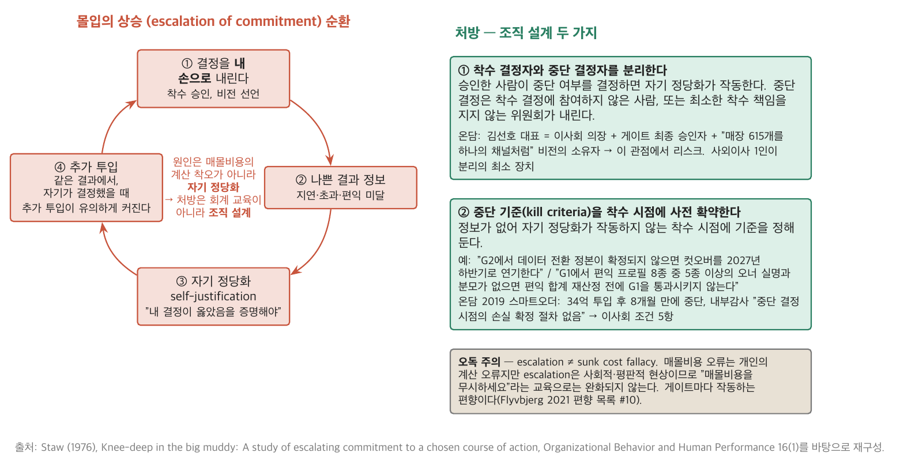

*그림 4-2. Staw의 몰입의 상승 순환과 두 가지 조직 설계 처방. 왼쪽: 내 손으로 내린 결정 → 나쁜 결과 → 자기 정당화 → 추가 투입의 순환. 원인이 자기 정당화이므로 처방은 회계 교육이 아니라 조직 설계다. 오른쪽: 착수 결정자와 중단 결정자의 분리, 중단 기준의 사전 확약. 온담에서 김선호 대표의 3중 역할과 이사회 조건 5항이 여기 대응한다. Staw (1976)를 바탕으로 재구성.*

### 흔한 오독

escalation을 sunk cost fallacy와 동일시하는 것. 매몰비용 오류는 개인의 계산 오류지만 escalation은 사회적·평판적 현상이므로 "매몰비용을 무시하세요"라는 교육으로는 전혀 완화되지 않는다. 또 escalation을 항상 비합리로 규정하는 것 — 정보가 갱신되어 계속하는 것이 옳은 경우와 구별해야 한다. 그리고 Flyvbjerg의 2021년 편향 목록 10번이 escalation of commitment라는 점에서, 이것은 착수 시점만이 아니라 게이트마다 작동하는 편향이다.

### 어디를 읽을 것인가

Staw(1976)는 18페이지이며 실험 설계 부분(Method)을 읽으면 핵심이 잡힌다. Flyvbjerg(2021) PMJ 편향 논문의 #10 항목이 프로젝트 맥락의 요약이다.

---

## 4.5 서지와 읽는 순서

이 장에서 인용한 문헌의 정확한 서지를 읽는 순서로 정리한다. arXiv 번호가 있는 것은 전문 무료다.

**1. 입문 (과정 후 30일 안에)**
- Flyvbjerg, B., & Gardner, D. (2023). *How Big Things Get Done*. Crown/Currency. 한국어판 『프로젝트 설계자』, 한국경제신문, 2024, 박영준 옮김. — 전체.
- Winter, M., Smith, C., Morris, P., & Cicmil, S. (2006). Directions for future research in project management. *International Journal of Project Management*, 24(8), 638-649. — 전체, 특히 Table 1.
- Klein, G. (2007). Performing a Project Premortem. *Harvard Business Review*, September 2007 (F0709A). — 2페이지 전체.

**2. 핵심 논문 (과정 후 90일 안에)**
- Flyvbjerg, B. (2014). What You Should Know About Megaprojects and Why: An Overview. *Project Management Journal*, 45(2). arXiv 1409.0003. — 전체.
- Flyvbjerg, B. (2021). Top Ten Behavioral Biases in Project Management: An Overview. *Project Management Journal*, 52(6). arXiv 2202.00125. — 전체, 특히 #1과 #10.
- Flyvbjerg, B., Garbuio, M., & Lovallo, D. (2009). Delusion and Deception in Large Infrastructure Projects. *California Management Review*, 51(2), 170-193. arXiv 1303.7403. — 두 모델의 대조 부분.
- Staw, B. M. (1976). Knee-deep in the big muddy. *Organizational Behavior and Human Performance*, 16(1), 27-44. — Method 절.
- Lundin, R. A., & Söderholm, A. (1995). A theory of the temporary organization. *Scandinavian Journal of Management*, 11(4), 437-455. — 4T와 4개 행위 개념 부분.
- Engwall, M. (2003). No project is an island. *Research Policy*, 32(5), 789-808. — 사례 부분과 결론.
- Eveleens, J. L., & Verhoef, C. (2010). The Rise and Fall of the Chaos Report Figures. *IEEE Software*, 27(1), 30-36. — 전체 (7페이지).
- Cooke-Davies, T. (2002). The 'real' success factors on projects. *IJPM*, 20(3), 185-190. — 전체 (6페이지).
- Zwikael, O., & Smyrk, J. (2011). *Project Management for the Creation of Organisational Value*. Springer. — ITO 모델 장.
- Samset, K., & Volden, G. H. (2016). Front-end definition of projects: Ten paradoxes. *IJPM*, 34(2), 297-313. — 역설 목록 후 선택.

**3. 확장 (관심에 따라)**
- Morris, P. W. G. (2013). *Reconstructing Project Management*. Wiley-Blackwell. — Part 1, Part 3.
- Shenhar, A. J., & Dvir, D. (2007). *Reinventing Project Management*. Harvard Business School Press. — NTCP 4축 각 장.
- Boehm, B., & Turner, R. (2003). *Balancing Agility and Discipline*. Addison-Wesley. — 5축 진단 장.
- Snowden, D. J., & Boone, M. E. (2007). A Leader's Framework for Decision Making. *Harvard Business Review*, November 2007. — 전체.
- Mitchell, R. K., Agle, B. R., & Wood, D. J. (1997). Toward a Theory of Stakeholder Identification and Salience. *Academy of Management Review*, 22(4), 853-886. — 7유형 정의 부분.
- Ward, J., & Daniel, E. (2012). *Benefits Management* (2nd ed.). Wiley. — BDN 장.
- Buehler, R., Griffin, D., & Ross, M. (1994). Exploring the 'planning fallacy'. *Journal of Personality and Social Psychology*, 67(3), 366-381. — 실험 1~2.
- Mitchell, D. J., Russo, J. E., & Pennington, N. (1989). Back to the future: Temporal perspective in the explanation of events. *Journal of Behavioral Decision Making*, 2(1), 25-38.
- Flyvbjerg, B. (2016). The Fallacy of Beneficial Ignorance. *World Development*, 84, 176-189. / Ika, L. A. (2018). *World Development*, 103, 369-382. / Kreiner, K. (2020). Conflicting Notions of a Project. *PMJ*, 51(4), 400-410. — 세 편을 논쟁 순서로.
- Lenfle, S., & Loch, C. (2010). Lost Roots. *California Management Review*, 53(1), 32-55.
- Baccarini, D. (1996). The concept of project complexity—a review. *IJPM*, 14(4), 201-204. — 4페이지 전체.
- Cicmil, S., Williams, T., Thomas, J., & Hodgson, D. (2006). Rethinking Project Management: Researching the actuality of projects. *IJPM*, 24(8), 675-698.
- Crawford, L., Morris, P., Thomas, J., & Winter, M. (2006). Practitioner development. *IJPM*, 24(8), 722-733.
- Geraldi, J., & Söderlund, J. (2018). Project studies: What it is, where it is going. *IJPM*, 36(1), 55-70.

일부 서지(Kahneman & Tversky 1979의 수록지, Lovallo & Kahneman 2003의 권·호, Flyvbjerg 2002·2009의 공저자 표기)는 이 교재 작성 시점에 2차 출처로만 확인되었으므로, 논문에 인용할 때는 원문을 대조하라.

---

# 제5장 읽을 자료 (과정 후)

읽을 자료를 세 층으로 나눈다. **필수**는 읽지 않으면 Day1의 워크북 작성이 성립하지 않는 것이며 분량이 짧다. **심화**는 Day1에서 열어 놓은 질문을 과정 후에 닫는 것이다. **참고**는 워크북을 쓰다가 손을 뻗어 확인하는 것이다. 각 항목에 제목·저자·판본·한국어판·왜 읽는가·어느 장(절)을 붙였다. 한국어판 표기가 없는 것은 이 교재 작성 시점에 확인되지 않은 것이며, 없다는 증명이 아니다.

## 5.1 필수 (과정 전)

| 자료 | 서지 | 한국어판 | 왜 읽는가 | 어느 부분 | 시간 |
|---|---|---|---|---|---|
| **사례 회사 문서** | 『사례 연구: ㈜온담F&B홀딩스와 차세대 주문·재고 통합 플랫폼 구축 프로젝트』 (본 과정 교재/공통) | — | 4일 동안 쓰는 모든 산출물의 재료. 읽지 않으면 헌장의 어느 칸도 채울 수 없다 | §1~§3 통독, §5 핵심 숫자 표는 책상 옆에 | 40분 |
| **프리모템 원문** | Klein, G. (2007). Performing a Project Premortem. *Harvard Business Review*, September 2007, 제품번호 F0709A | 확인되지 않음 | 2페이지. 워크북 §7의 절차와 문법("실패했다")의 원전. 왜 "실패할 수 있다면"이 아니라 "실패했다"인지를 원문에서 확인한다 | 전체 | 15분 |
| **PMBOK 판본 대조표** | 본 교재 제2장 2.1의 연표와 2.2의 6원칙·7도메인 표 | — | 여러분 회사 사내 표준이 어느 판본을 인용하고 있는지를 미리 자각한다. 워크북 §2 재매핑 대장의 출발점 | 2.1 연표, 2.2 표 | 10분 |
| **성공의 두 정의** | Cooke-Davies, T. (2002). The 'real' success factors on projects. *International Journal of Project Management*, 20(3), 185-190 | 확인되지 않음 | 6페이지. 프로젝트 관리 성공과 프로젝트 성공의 분리. 이 구분 없이는 Day1의 편익 논의와 헌장의 성공 기준 항목이 뒤섞인다 | 전체 | 25분 |

과정 전 제출 과제 하나: 여러분 회사에서 최근 종료된 프로젝트 하나를 떠올려, 그 프로젝트가 온타임·온버짓이었는지와 편익을 달성했는지를 각각 O/X로 적어 오라. 두 답이 다른 프로젝트가 있다면 그것이 Day1 오전의 첫 토론 재료다.

## 5.2 심화 (과정 후)

### 30일 안에 — Day1에서 열린 질문을 닫는 것

| 자료 | 서지 | 한국어판 | 왜 읽는가 | 어느 부분 | 시간 |
|---|---|---|---|---|---|
| **프로젝트 설계자** | Flyvbjerg, B., & Gardner, D. (2023). *How Big Things Get Done*. Crown/Currency | 『프로젝트 설계자』, 한국경제신문, 2024, 박영준 옮김 | think slow act fast, reference class forecasting, modularity를 서술체로. Day1의 "그럼 우리 회사 base rate은 어디서 구하나"로 남은 질문 | 전체 | 8시간 |
| **Rethinking Project Management** | Winter, M., Smith, C., Morris, P., & Cicmil, S. (2006). Directions for future research in project management. *IJPM*, 24(8), 638-649 | 없음 | 제4장 4.1. 다섯 방향이 이 교재의 뼈대이며, 표준 변경을 사조로 보게 해 준다 | 전체, Table 1 | 1시간 |
| **임시조직 이론** | Lundin, R. A., & Söderholm, A. (1995). A theory of the temporary organization. *Scandinavian Journal of Management*, 11(4), 437-455 | 없음 | 제1장 1.3. 4T와 4개 행위 개념의 원전. 교훈이 왜 실패하는지, 종료 직전 인력 이탈이 왜 정상인지 | 전체 | 1.5시간 |
| **어떤 프로젝트도 섬이 아니다** | Engwall, M. (2003). No project is an island: linking projects to history and context. *Research Policy*, 32(5), 789-808 | 없음 | 제1장 1.3. 착수 시점의 진짜 일이 "이미 결정된 것의 목록화"인 이유. IJPM만 읽는 실무자가 놓치는 논문 | 전체 | 1.5시간 |
| **편익의 소유권** | Zwikael, O., & Smyrk, J. (2011). *Project Management for the Creation of Organisational Value*. Springer. DOI 10.1007/978-1-84996-516-3 | 확인되지 않음 | 제3장 3.1. ITO 모델 — output은 PM, outcome·utilisation은 사업 오너. 워크북 편익 프로필 "오너 실명" 칸의 이론 원전 | ITO 모델 장 | 4시간 (해당 장) |
| **CHAOS 해체** | Eveleens, J. L., & Verhoef, C. (2010). The Rise and Fall of the Chaos Report Figures. *IEEE Software*, 27(1), 30-36 | 없음 | 제1장 1.2. 여러분 제안서에서 CHAOS 수치를 빼야 하는 이유를 데이터로 | 전체 (7페이지) | 45분 |
| **이해관계자 현저성** | Mitchell, R. K., Agle, B. R., & Wood, D. J. (1997). Toward a Theory of Stakeholder Identification and Salience. *Academy of Management Review*, 22(4), 853-886 | 없음 | 제3장 3.3. 7유형의 정의와 속성 이동의 논리. 워크북 §5의 분류 근거 | 7유형 정의 절 | 2시간 |

### 90일 안에 — 자기 조직에 적용할 때 필요한 것

| 자료 | 서지 | 한국어판 | 왜 읽는가 | 어느 부분 | 시간 |
|---|---|---|---|---|---|
| **다이아몬드 접근** | Shenhar, A. J., & Dvir, D. (2007). *Reinventing Project Management: The Diamond Approach to Successful Growth and Innovation*. Harvard Business School Press. ISBN 9781591398004 | 확인되지 않음 | 제1장 1.4. NTCP 4축의 원전. 축별 단계 수(3/4/3/4)와 축별 관리 처방. 여러분 회사의 프로젝트 유형 분류 기준을 만들 때 | 4축 각 장과 성공 5차원 장 | 8시간 |
| **애자일과 규율의 균형** | Boehm, B., & Turner, R. (2003). *Balancing Agility and Discipline: A Guide for the Perplexed*. Addison-Wesley | 확인되지 않음 | 제2장 2.6. 5축 극좌표와 "축이 갈리면 분할하라"는 처방. 사내 방법론 선택 기준을 만들 때 | 5축 진단 장, 리스크 기반 방법 선택 장 | 6시간 |
| **편익 관리** | Ward, J., & Daniel, E. (2012). *Benefits Management: How to Increase the Business Value of Your IT Investments* (2nd ed.). Wiley. DOI 10.1002/9781119208242 | 확인되지 않음 | 제3장 3.1. Benefits Dependency Network. 편익 원장과 편익 프로필 양식의 원전 | BDN 장 | 6시간 (해당 장) |
| **편익 실현 관리** | Bradley, G. (2010). *Benefit Realisation Management: A Practical Guide to Achieving Benefits Through Change* (2nd ed.). Gower | 확인되지 않음 | 제3장 3.1. Ward & Daniel의 틀을 실행 절차로. benefit owner 지정 절차 | Benefit Map, benefit profile 장 | 5시간 |
| **PRINCE2 7** | *PRINCE2 7 Managing Successful Projects*. PeopleCert, 2023. ISBN 978-9925344604 | 확인되지 않음 | 제2장 2.3, 제3장 3.4. Project Board 3역할, 허용범위 격자, Product-Based Planning, Business Case 갱신의 원문. 사내 거버넌스 규정을 다시 쓸 때 | Organizing practice, Progress practice, Business case practice | 10시간 (해당 장) |
| **PMBOK 8판** | *A Guide to the Project Management Body of Knowledge (PMBOK Guide) — Eighth Edition and The Standard for Project Management*. PMI, 2025 (디지털) / 2026-01 (인쇄). ISBN 9781628258295 | 확인되지 않음 (6판은 한국어판 있음) | 제2장 2.1~2.2. 6원칙·7도메인·40프로세스의 정확한 문구. 사내 표준 재매핑 대장의 대응 위치를 확정할 때 | The Standard 전체, Governance·Finance 도메인 | 12시간 |
| **프로젝트 관리의 재구성** | Morris, P. W. G. (2013). *Reconstructing Project Management*. Wiley-Blackwell. ISBN 9780470659076 | 확인되지 않음 | 제4장 4.2. front-end가 왜 지식체계에서 배제되었는가의 계보. PM이 사업기획 단계에 들어가야 한다는 주장의 근거를 만들 때 | Part 1, Part 3 | 10시간 |
| **행동 편향 10** | Flyvbjerg, B. (2021). Top Ten Behavioral Biases in Project Management: An Overview. *Project Management Journal*, 52(6). arXiv 2202.00125 | 없음 (arXiv 무료) | 제4장 4.3. strategic misrepresentation이 1위인 이유, 2,062개 프로젝트 base rate 표. 사내 base rate 원장을 만들 때 출발점 | 전체 | 2시간 |

## 5.3 참고 (워크북을 쓰다가 손을 뻗어 확인할 것)

| 자료 | 서지 | 어느 워크북 절에서 | 무엇을 확인하는가 |
|---|---|---|---|
| **ISO 21502:2020** | *Project, programme and portfolio management — Guidance on project management*. ISO/TC 258 | §4 헌장, §6 거버넌스 | §6.4 착수의 요구 항목, §7.12 이해관계자, §5.2 거버넌스 프레임워크. 계약서·RFP에 인용할 때의 조항 번호 |
| **ISO 21505:2017** | *Guidance on governance*. ISO/TC 258 | §6 거버넌스 | Project Board 구조를 표준 근거로 정당화할 때 |
| **ISO 21506:2024** | *Vocabulary*. ISO/TC 258 | 전체 | deliverable / output / product / outcome / benefit의 정의 분쟁 |
| **PMBOK 6판** | *A Guide to the Project Management Body of Knowledge* (6th ed.). PMI, 2017. 한국어판 있음 | §2 재매핑 대장 | 사내 문서가 인용하는 6판 조항 번호(4.1 Develop Project Charter, 13.1 Identify Stakeholders 등)의 원문 |
| **Agile Practice Guide** | PMI & Agile Alliance, 2017. 한국어판(6판 번들) 있음 | §3 TDR | Suitability Filter의 3범주 항목 |
| **Cynefin 원문** | Snowden, D. J., & Boone, M. E. (2007). A Leader's Framework for Decision Making. *Harvard Business Review*, November 2007 | §3 TDR | 네 도메인의 의사결정 순서 원문. 위키 요약이 아니라 이것을 인용한다 |
| **NTCP 축별 단계** | Shenhar & Dvir (2007), 위 심화 항목 | §1 유형 진단 | Novelty 3 / Technology 4 / Complexity 3 / Pace 4의 단계 명칭 |
| **프리모템 심리학** | Mitchell, D. J., Russo, J. E., & Pennington, N. (1989). Back to the future. *Journal of Behavioral Decision Making*, 2(1), 25-38 | §7 프리모템 | "실패했다"의 문법이 왜 효과를 만드는지에 대한 실험 근거. 참가자가 저항할 때 |
| **몰입의 상승** | Staw, B. M. (1976). Knee-deep in the big muddy. *Organizational Behavior and Human Performance*, 16(1), 27-44 | §6 거버넌스 (중단 기준) | 착수 결정자와 중단 결정자 분리의 실험 근거 |
| **P3.express v2.0** | Rad, N. K. / OMIMO, 2021. 무료 공개 | §3 TDR | 33개 활동 중 A그룹(프로젝트 착수 10개)이 최소 착수 활동 기준선. PMBOK 40 프로세스와 대조 |
| **PM² Guide v3.1** | European Commission CoEPM², 2023-12. 무료 공개 | §4 헌장 | 무료로 복제 가능한 Project Charter 템플릿의 참조본 |
| **소프트웨어 진흥법 제50조 / 전자정부법 감리 규정** | 국가법령정보센터 | §6 거버넌스 (SI 착수) | 공공 발주에만 적용되는 제도임을 확인. 온담(민간)에는 적용되지 않는다 |

### 읽지 않아도 되는 것

Day1 주제에 관해 자주 추천되지만 이 교재가 읽기를 권하지 않는 것이 있다. Standish CHAOS Report 원문(방법론이 무너졌으므로 Eveleens & Verhoef로 대체), Stacey matrix를 설명하는 2차 자료(원저자가 폐기했으므로 Snowden & Boone으로 대체), "PMBOK 7판 요약" 류의 시중 교재(현행은 8판이며 7판은 실험으로 위치가 바뀌었다). 이것들을 읽었다면 잘못이 아니지만, 인용할 때는 그 한계를 함께 말해야 한다.

---

## Day1을 마치며

이 교재는 세 가지 질문으로 요약된다. **이것은 무엇인가**(프로젝트·프로그램·운영, 임시조직, 유형), **무엇을 따를 것인가**(표준의 지형과 테일러링), **어떻게 시작할 것인가**(비즈니스 케이스, 헌장, 이해관계자, 거버넌스, 리스크). 세 질문에 대한 여러분의 답이 워크북 §1~§5의 다섯 산출물(① 비즈니스 케이스 요약 · ② 헌장 · ③ 이해관계자 등록부 · ④ 거버넌스·RACI · ⑤ 프리모템·초기 리스크)이며, 그 산출물은 Day2(계획 — 범위·일정·원가 기준선), Day3(실행과 통제 — 변경·리스크·성과), Day4(종료와 이관 — 검수·운영 전환·편익 검토)의 입력이 된다.

착수 시점에 잘못 적힌 것은 계획 시점에 고쳐지지 않는다. 그것이 Morris가 말한 front-end의 무게이며, 여러분이 오늘 헌장의 가정 목록을 길게 쓰는 이유다.
