# PM 트랙 Day 2 교재 — 계획(Planning): 범위·일정·원가·리스크 기준선

> **이 교재의 위치** — 4일 PM 특강의 둘째 날 본문이다. Day1이 "무엇을 왜 하는가, 누가 결정하는가"를 문서로 세우는 날이었다면, Day2는 그 문서를 **측정 가능한 기준선(baseline)**으로 바꾸는 날이다. 슬라이드는 강사가 이 본문 가운데 무엇을 어떤 순서로 설명하는지를 정하고, 워크북은 이 본문의 개념을 온담F&B홀딩스 P1(차세대 주문·재고 통합 플랫폼 구축)에 적용해 범위 기술서·WBS·RTM·일정 기준선·원가 기준선·리스크 등록부를 직접 작성하게 한다. 본문은 그 둘의 뿌리다. 강의를 듣기 전에 한 번, 워크북을 쓰다가 막힐 때 한 번, 과정이 끝난 뒤 한 번 읽도록 쓰였다.
>
> **전제 독자** — Day1과 같다. 주니어 PM과 3~7년차 현업 실무자. 간트차트를 그리는 법, WBS의 정의, 3점 추정의 공식은 이미 안다고 전제한다. 대신 "계산은 맞는데 실무에서 틀리는 것" — float를 누가 갖는가, 컨틴전시와 관리예비비는 왜 다른 사람의 돈인가, EMV 합계가 예비비와 안 맞을 때 무엇을 조정하는가 — 에 지면을 쓴다.
>
> **사례 회사** — 모든 예시는 `교재/공통/가상회사_온담F앤B.md`와 Day1 워크북의 완성 예시본(비즈니스 케이스 요약 v0.9, 헌장 v1.0, 이해관계자 등록부, 거버넌스·RACI, 프리모템·초기 리스크 목록 R-01~R-13·O-01·O-02)을 재료로 쓴다. 두 문서에 없는 숫자는 [추가 설정]으로 표시하고 기존 값과 정합하도록 정했다. [추가 설정] 값의 정본은 워크북 완성 예시본(WBS 43개 작업패키지, 활동 20개 네트워크, 월별 PV, EMV·컨틴전시 배정표)이며, 이 본문의 사례 숫자는 그것을 따른다. 회사 정본과 워크북이 다르면 회사 정본이 우선한다.
>
> **읽는 법과 분량** — 이 교재는 하루에 다 읽는 책이 아니다. 목차의 표시대로 필독 절만 수업 전에 읽으면 되고(약 140분), 나머지는 수업 후·과정 후에 읽는다. 본문의 온담 단락은 앞머리에 **■ 사례 사실** 줄을 두어 그 단락이 쓰는 사례의 사실과 출처(사례 §·숫자 표 ID)를 먼저 적었다 — 사례 문서를 통독하지 않았어도 그 줄만 읽으면 따라올 수 있고, 더 알고 싶으면 그 §을 펼친다. 용어·약어·문서 ID(R-10, CR-09, A10, BL-02 …)가 낯설면 `교재/공통/02_용어약어색인.md`를, 4일 전체의 읽는 순서는 `교재/공통/00_학습안내.md`를 본다.
---

## 목차

표시 없는 절은 **수업 전 필독**(약 140분), (심화)는 수업 후 일주일 안에 읽는 절(약 30분), (과정 후)로 표시된 장은 4일이 끝난 뒤 읽는 학술 배경과 읽을 자료다. 각 장 끝의 "핵심 정리" 첫 상자(한 줄씩)는 수업 직전 5분 복습용이다.

**서문 — Day1에서 가져오는 것**

**제1장 계획이란 무엇인가 — 예측이 아니라 합의**
- 1.1 계획의 세 기능과 기준선 — 합의·통제 기준·의사소통
- 1.2 예측형·적응형·하이브리드에서 계획의 형태 — 온담 P1은 무엇을 어느 수준까지 미리 정하는가
- 1.3 표준에서는 — PMBOK 8판 Planning Focus Area, PRINCE2 Product-Based Planning, ISO 21502 §7 (심화)
- 1.4 분야별 대조 — SI·EPC·제조 NPD·제약의 계획 정밀도 (심화)
- 1.5 실무에서 어떻게 틀리는가 — 일정표로 축소된 계획
- 핵심 정리 / 생각해 볼 질문 / 워크북 연결

**제2장 범위와 요구사항**
- 2.1 범위 기술서 — 포함·제외·인수 기준·가정·제약
- 2.2 WBS — 100% 규칙, 8/80, 산출물 지향, 코드 체계, WBS 사전, PBS와의 관계
- 2.3 요구사항 계층과 추적표 — StRS→SyRS→SRS, RTM, 우선순위, 비기능 요구
- 2.4 범위 크립과 계약 — gold plating, "기타 협의된 사항", 한국 SI의 FP 기준선과 변경 대가
- 2.5 온담 P1 — 헌장 §5의 다섯 산출물이 WBS 레벨 2가 되고, 상위 요구 8개가 214건으로 분해되는 구조
- 핵심 정리 / 생각해 볼 질문 / 워크북 연결

**제3장 일정**
- 3.1 활동·순서·기간 — PDM 4종 의존, lead/lag, 유사·모수·3점 추정
- 3.2 CPM — 전진·후진 계산, 총여유와 자유여유
- 3.3 float는 누구의 것인가 — SCL Protocol과 계약 문안 (심화)
- 3.4 크리티컬 체인, 일정 압축, DCMA 14-Point, 몬테카를로와 P50/P80, 제약 일자 (심화)
- 3.5 하이브리드 달력 — 스프린트 케이던스와 게이트, 성수기 창, 컷오버 주말
- 3.6 온담 P1 — 임계경로는 어디를 지나는가
- 3.7 실무에서 어떻게 틀리는가
- 핵심 정리 / 생각해 볼 질문 / 워크북 연결

**제4장 원가와 조달**
- 4.1 추정 방법과 정확도 — AACE Class는 정의도로 결정된다
- 4.2 원가 기준선과 예산의 3층 — 컨틴전시와 관리예비비는 다른 사람의 돈이다
- 4.3 시간대별 배분과 S-curve — Day3 EVM의 입력, 자금 조달 한도
- 4.4 조달 — 계약 유형과 리스크 배분, 한국 SI의 FP 고정가, 견적 검산, 자원 계획 (심화)
- 4.5 온담 P1 — 168.0의 근거, 145.8의 월별 PV, 컨틴전시 10.2의 배정, 관리예비비 12.0의 집행 절차
- 4.6 실무에서 어떻게 틀리는가
- 핵심 정리 / 생각해 볼 질문 / 워크북 연결

**제5장 리스크**
- 5.1 식별 — RBS, 가정 분석, 프리모템 회수, base rate
- 5.2 정성 분석 — 확률-영향 매트릭스와 그 함정
- 5.3 정량 분석 — EMV, 민감도, 몬테카를로, 멱함수 꼬리 재방문
- 5.4 대응 — 위협 5·기회 5, 소유자·트리거·2차 리스크, 리스크 예산
- 5.5 허용범위 격자와 리스크 노출 — 허용범위는 노출의 함수다
- 5.6 리스크 등록부 vs 이슈 로그, 리뷰 주기
- 5.7 온담 P1 — 13+2건의 정량화, EMV 합과 컨틴전시 10.2의 대조, 허용범위 7축×3계층의 확정
- 5.8 실무에서 어떻게 틀리는가
- 핵심 정리 / 생각해 볼 질문 / 워크북 연결

**제6장 이 날의 학술 배경과 읽을 자료 (과정 후)**
- 6.1 planning fallacy와 reference class forecasting의 실제 절차
- 6.2 앵커링 — 추정은 첫 숫자에 묶인다
- 6.3 Goldratt의 크리티컬 체인과 Raz 등의 비판
- 6.4 Reinertsen — 배치 크기와 큐, Day3의 흐름으로
- 6.5 Hubbard의 보정된 추정
- 6.6 Jørgensen — 소프트웨어 추정 연구가 말하는 것
- 6.7 Flyvbjerg 2022 — 멱함수와 모듈화
- 6.8 Hillson — 리스크 대응의 프레임
- 6.9 읽을 자료 — 필수 / 심화 / 참고

**Day2를 마치며 — Day3 예고**

---

# 서문 — Day1에서 가져오는 것

계획 단계의 문서는 백지에서 쓰지 않는다. Day1 워크북 §7이 정한 대로, Day2의 다섯 산출물은 각각 Day1의 특정 항목을 입력으로 받는다. 이 표를 책상 옆에 두라. 워크북의 어느 칸이 막히면 대개 Day1의 해당 항목이 비어 있거나 모호한 것이 원인이다.

| Day2 산출물 | Day1에서 받는 입력 | 이 교재의 어느 장 |
|---|---|---|
| ⑥ 범위 기술서와 WBS(+WBS 사전) | 헌장 §5 범위 — 포함 5개 산출물이 WBS 레벨 2, 제외 항목 7개와 담당 프로젝트, 경계 조건 4개. 헌장 §6 주요 산출물 8종과 인수자 | 제2장 |
| ⑦ 요구사항 추적표(RTM) 골격 | 헌장 §4 상위 요구사항 8개(요구 제공자 실명 포함) → StRS 214건의 상위 노드. 헌장 §13 우선순위(옴니채널 고도화·BI 리포트 이연 가능) → MoSCoW의 근거 | 제2장 |
| ⑧ 일정 기준선 | 헌장 §7 마일스톤 — G0~G5, 외부 고정 4개(규제 2026-09-11·2027-03-31, P2 T0 2026-04-24·MC 2027-02-12), 컷오버 창 2027-02-26~28. §9 제약(성수기 창). 리스크 R-01·R-10의 근접성 | 제3장 |
| ⑨ 원가 기준선과 예비비 구조 | 비즈니스 케이스 §5 비용 내역 8개와 3층 예산(승인 168.0 / 집행 한도 156.0 / 계획 원가 145.8, PM 컨틴전시 10.2, 관리예비비 12.0). RACI 19행(컨틴전시 집행 A = P1 PM)·20행(관리예비비 집행 A = 정미란) | 제4장 |
| ⑩ 리스크 등록부(정량화)와 허용범위 격자 | 초기 리스크 13+2건(원인·사건·영향·소유자·트리거·근접성). 거버넌스 §4 허용범위 초안(원가 +6% / 일정 +15영업일 / 범위 ±3% / 품질 0.4건/FP / 리스크 EMV 8억 / 편익 −5%p / 안전 0). 비즈니스 케이스 손익분기 66% | 제5장 |

세 가지를 미리 말해 둔다.

첫째, **Day1 문서는 오늘 고쳐진다.** 워크북 §7이 예고한 대로 WBS를 만들면 헌장 §5에 없던 산출물이 나타나고, 리스크를 정량화하면 EMV 합계가 허용범위 8억을 넘는다. 그것은 오류가 아니라 계획 단계가 하는 일이다. 헌장 v1.0은 G1(2026-04-30)에 v1.1로 확정되며, 오늘 여러분이 만드는 것은 그 확정의 근거다.

둘째, **하이브리드 전제를 잊지 말라.** P1은 2주 스프린트 36회(설계 6 / 구현 20 / 통합·시험 10)와 게이트 G0~G5를 함께 쓴다. 계약은 FP 12,400점 고정가(SI 용역 68.2억)이고, 요구사항 베이스라인은 매월 마지막 수요일에 동결된다. 따라서 이 교재의 계획은 "간트차트 하나"가 아니라 릴리스 계획·스프린트 달력·게이트 마일스톤·계약 기준선의 네 층이 서로 맞물리는 것이어야 한다. 어느 층을 어느 정밀도로 미리 정하는가가 제1장의 질문이다.

셋째, **숫자의 출처를 붙이는 규칙은 오늘도 같다.** 값·단위·출처·분모. 원가 기준선의 한 줄이 "약 20억"이면 Day3의 EVM은 성립하지 않는다.

Day1 다섯 문서와 Day2 다섯 산출물의 입력 관계를 한 장으로 놓으면 그림 0-1과 같다.

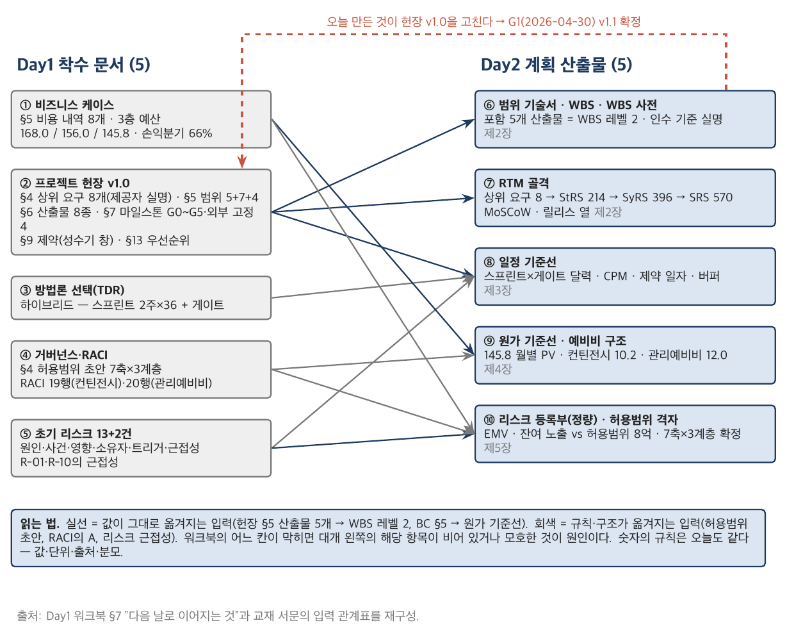

*그림 0-1. Day1 착수 문서 5종에서 Day2 계획 산출물 5종으로 흐르는 입력 관계. 실선은 값이 그대로 옮겨지는 입력(헌장 §5 산출물 5개 → WBS 레벨 2, BC §5 → 원가 기준선), 회색은 규칙·구조가 옮겨지는 입력(허용범위 초안, RACI의 A, 리스크 근접성)이다. 파선의 되돌아가는 화살표가 "오늘 만든 것이 헌장 v1.0을 고친다"이며, 헌장은 G1(2026-04-30)에 v1.1로 확정된다. Day1 워크북 §7의 표를 재구성.*

---

# 제1장 계획이란 무엇인가 — 예측이 아니라 합의

## 1.1 계획의 세 기능과 기준선 — 합의·통제 기준·의사소통

### 개념

계획을 "미래를 예측한 문서"로 이해하는 순간 계획은 반드시 실패한다. 17개월 뒤의 컷오버 날짜를 착수 시점에 맞힐 수 있는 사람은 없고, 145.8억이 정확히 145.8억으로 끝날 확률은 0에 가깝다. 예측으로서의 계획은 첫 달에 틀리고, 틀린 계획은 서랍에 들어가며, 서랍에 들어간 계획은 아무것도 통제하지 못한다.

계획은 예측이 아니라 **합의**다. 정확히 말하면 계획은 세 가지 기능을 한다.

**첫째, 합의(agreement).** 계획은 "이 범위를, 이 순서로, 이 자원으로, 이 날짜까지, 이 돈으로 한다"에 관해 스폰서·사용자·공급자·PM이 같은 문장에 서명한 것이다. 계획의 가치는 정확성이 아니라 서명자의 수와 서명의 무게에 있다. 온담에서 G1(2026-04-30)의 통과 조건이 "원가·일정 기준선 확정, FP 기준선 확인서 서명, 조달 전략 확정"인 이유가 이것이다. 세 문서에 정미란·오정근·박세연·이재현이 서명하는 순간 P1은 비로소 "무엇에 대해 늦었다고 말할 수 있는 프로젝트"가 된다.

**둘째, 통제 기준(baseline for control).** 기준선(baseline)은 승인된 계획의 특정 버전이며, 실적을 비교하는 자(尺)다. 자가 없으면 편차가 없고, 편차가 없으면 통제가 없다. "지난달 진척이 좋았다"는 문장은 기준선이 있을 때만 의미가 있다 — 무엇에 비해 좋았는가. 기준선은 세 개다. **범위 기준선**(범위 기술서 + WBS + WBS 사전), **일정 기준선**(승인된 일정 모델), **원가 기준선**(시간대별로 배분된 승인 예산, 관리예비비 제외). 이 셋은 따로 만들지만 따로 존재하지 않는다. WBS의 작업패키지 하나가 일정의 활동들이고, 그 활동들의 자원 × 기간이 원가의 한 칸이다. Day3의 EVM은 이 세 기준선이 하나의 구조(작업패키지 → 활동 → 시간대별 원가)로 통합되어 있을 때만 작동한다. 그것을 흔히 **성과 측정 기준선(PMB, performance measurement baseline)**이라고 부른다.

**셋째, 의사소통(communication).** 계획은 82명(수행사 61 + 발주사 14 + 상용SW 벤더 7)이 같은 그림을 보게 하는 도구다. Day1 제1장 1.3절의 임시조직론에서 본 대로 프로젝트 조직은 과업을 잘게 나누어야 몰입이 생긴다(fragmentation for commitment-building). WBS는 계획 도구이기 전에 "내 조각이 무엇인가"를 보여 주는 몰입 도구이고, 마일스톤 표는 "우리가 어디까지 왔는가"를 말하는 언어다.

세 기능을 분리하면 실무의 논쟁이 정리된다. "계획이 틀렸으니 소용없다"는 첫째·둘째 기능을 혼동한 말이다. 기준선은 틀리기 위해 있다 — 틀린 정도를 재는 것이 통제다. "계획을 바꾸면 안 된다"는 둘째·셋째 기능을 혼동한 말이다. 기준선은 변경 통제를 거쳐 바뀌고, 바뀐 기준선이 새 자가 된다. 바뀌지 않는 것은 자의 존재이지 자의 눈금이 아니다.

세 기능과 세 기준선, 그리고 그것이 PMB로 통합되는 구조를 그림 1-1에 놓았다.

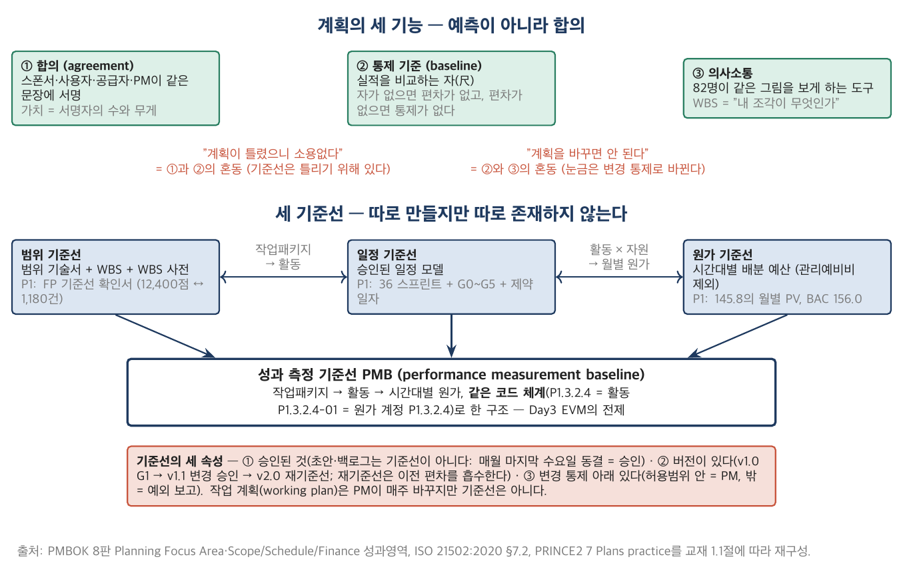

*그림 1-1. 계획의 세 기능(합의·통제 기준·의사소통)과 세 기준선이 PMB로 통합되는 구조. 위의 두 오류 문장은 각각 어느 두 기능을 혼동한 것인지를 보인다. 아래의 세 기준선은 같은 코드 체계(작업패키지 → 활동 → 시간대별 원가)로 묶일 때만 성과 측정 기준선이 되며, 그것이 Day3 EVM의 전제다. 기준선의 세 속성(승인·버전·변경 통제)은 하단에 요약했다.*

### 기준선의 세 가지 속성

기준선이라는 말을 정확히 쓰기 위해 세 속성을 세워 둔다.

**승인된 것이다.** 초안은 기준선이 아니다. 온담의 요구사항 베이스라인이 "매월 마지막 수요일 동결"인 이유는 동결이 곧 승인이기 때문이다. 동결 전의 요구사항은 백로그이고, 동결 후의 요구사항은 기준선이며, 기준선의 변경은 변경협의체(격주 수요일)와 CCB(월 1회)를 거친다.

**버전이 있다.** 기준선은 하나가 아니라 일련이다 — v1.0(G1), v1.1(변경 승인 후), v2.0(G2 재기준선). 어느 실적을 어느 버전과 비교했는지가 명시되지 않은 진척 보고는 보고가 아니다. 특히 **재기준선(re-baseline)**은 기준선을 다시 그리는 것이고, 그 순간 이전의 편차는 새 기준선에 흡수되어 사라진다. 재기준선을 자주 하는 프로젝트는 편차를 없애는 것이 아니라 편차를 보이지 않게 하는 것이다. Day3에서 재기준선의 조건을 다룬다.

**변경 통제 아래 있다.** 기준선은 PM이 혼자 바꿀 수 없다. 이것이 기준선과 작업 계획(working plan)의 차이다. PM은 작업 계획을 매주 바꾼다 — 누가 어느 활동을 며칠에 하는가. 그러나 기준선의 날짜·금액·범위는 허용범위 안에서만 PM의 것이고, 허용범위를 넘으면 예외 보고의 대상이다. Day1의 허용범위 격자가 Day2의 기준선에 붙는 이유다.

### 온담의 사례로 읽기

> ■ **사례 사실** — G1(2026-04-30) 통과 조건 세 가지와 FP 12,400점 고정가·요구사항 1,180건(사례 §3.3·§3.4, P-08·P-09); 앞 산출물 — Day1 워크북 §2.5 헌장 v1.0 §5·§7·§8.

P1의 G1 통과 조건 세 가지는 세 기준선과 정확히 대응한다. **FP 기준선 확인서**는 범위 기준선의 계약적 형태다 — FP 12,400점이 어느 요구사항 1,180건에 대응하는지를 발주사 PM·수행사 PM·형상관리 담당이 서명한 문서다. **원가·일정 기준선**은 나머지 둘이다. 그리고 **조달 전략 확정**은 기준선 밖의 것 — 상용SW 23.4억(기준선 19.4), 인프라 23.9억(기준선 20.9), 데이터 전환 11.4억(기준선 9.4) 같은 별도 계약이 언제 어떤 유형으로 체결되는가 — 가 기준선의 시간대별 배분에 들어가야 한다는 뜻이다.

여기서 하나를 짚어 둔다. G1은 2026-04-30이고 착수는 2026-01-05다. 즉 P1은 **거의 4개월 동안 기준선 없이 일한다.** 설계 스프린트 6회(2026-01-05~03-27 [추가 설정])가 그 기간에 돈다. 이것은 결함이 아니라 하이브리드의 정상 형태다 — 요구사항 1,180건이 확정되기 전에 원가 기준선을 서명하면 그 기준선은 서명과 동시에 틀린다. 그러나 이 4개월 동안 "무엇에 비해" 진척을 말할 것인가는 답이 있어야 한다. 답은 **잠정 기준선(interim baseline)**이다. 헌장 §7 마일스톤과 §8 예산 3층이 G1까지의 잠정 기준선이며, 설계 스프린트의 진척은 요구사항 확정 건수(214/396/570)와 인터페이스 문서화 본수(13본)로 측정한다. 워크북 §3에서 이 잠정 기준선을 명시적으로 쓰게 한다.

### 실무에서 어떻게 틀리는가

가장 흔한 오류는 **기준선 없이 진척을 보고하는 것**이다. "전체 진척률 42%"라는 숫자가 임원 보고서에 있는데 그 42%가 무엇의 42%인지 — 활동 수인지, 원가인지, FP인지, 기간인지 — 아무도 답하지 못한다. 기준선이 없으면 진척률은 담당자의 느낌이고, 느낌은 종료 3개월 전까지 항상 80%다.

두 번째 오류는 **기준선을 한 번 세우고 끝까지 고수하는 것**이다. 변경이 승인되었는데 기준선을 갱신하지 않으면 실적은 승인된 범위를, 기준선은 옛 범위를 가리키고, 둘의 차이는 편차가 아니라 소음이 된다. 반대 오류는 재기준선을 남발해 편차를 지우는 것이다. 둘 사이의 규칙 — 어떤 변경이 기준선을 갱신하고 어떤 변경이 편차로 남는가 — 가 변경 관리 계획의 핵심이며 Day3의 주제다.

세 번째 오류는 **세 기준선을 따로 만드는 것**이다. 범위는 사업팀이 엑셀로, 일정은 PMO가 프로젝트 도구로, 원가는 재경이 회계 코드로 관리하면 세 문서는 첫 달부터 서로 다른 것을 가리킨다. WBS 코드가 일정의 활동 코드와 원가의 계정 코드에 같은 형태로 박혀 있어야 한다. 이것이 2.2절 코드 체계의 요점이다.

---

## 1.2 예측형·적응형·하이브리드에서 계획의 형태 — 온담 P1은 무엇을 어느 수준까지 미리 정하는가

### 개념

Day1 제2장 2.6절에서 방법론 선택의 기준은 **되돌림 비용**이라고 했다. 같은 기준이 계획의 형태를 결정한다. 되돌릴 수 없는 결정 앞에서는 상세하게 미리 계획하고, 되돌릴 수 있는 것은 가까운 것만 상세히 하고 먼 것은 굵게 남긴다.

**예측형(predictive)** 계획은 착수 시점에 범위·일정·원가를 상세 수준까지 확정하고 실행 중 변경을 통제한다. 되돌림 비용이 높은 분야(건설·EPC, 설비)의 자연스러운 형태다. 정밀도의 대가는 앞단의 시간이다 — 설계 성숙도가 낮은 상태에서 예측형 계획을 세우면 그 계획은 정밀하게 틀린다.

**적응형(adaptive)** 계획은 목표와 제약을 고정하고 범위를 반복마다 다시 정한다. 릴리스 계획(어느 기능 묶음을 언제)은 굵게, 스프린트 계획(이번 2주에 무엇을)은 상세하게. 되돌림 비용이 낮은 소프트웨어의 형태다. 정밀도의 대가는 예측 가능성이다 — 17개월 뒤 무엇이 나올지를 착수 시점에 약속하지 않는다.

**하이브리드**는 둘을 섞는 것이지만, "섞는다"는 말이 아무것도 설명하지 않는다. 하이브리드 계획이 답해야 할 질문은 구체적이다 — **어느 층을 예측형으로, 어느 층을 적응형으로 계획하는가.** 답의 형태는 대개 다음과 같다.

| 계획의 층 | 형태 | 정밀도 | 온담 P1에서 |
|---|---|---|---|
| 게이트·마일스톤 | 예측형 (고정) | 날짜 단위 | G0~G5, 외부 고정 4개, 컷오버 창 |
| 범위 기준선 (계약) | 예측형 (고정, 변경 통제) | FP 단위 | FP 12,400점, 요구사항 1,180건, 월 1회 동결 |
| 릴리스 계획 | 예측형 + 적응형 | 릴리스(분기) 단위 | 가맹 포털 선행 릴리스(2026-Q4), 컷오버 릴리스, 컷오버 후 릴리스(옴니채널 고도화·BI) |
| 스프린트 케이던스 | 예측형 (고정 리듬) | 2주 | 36회, 시작·종료일 고정 |
| 스프린트 내용 | 적응형 | 백로그 항목 | 스프린트 계획 회의에서 결정 |
| 원가 기준선 | 예측형 (시간대별 배분) | 월 단위 | 145.8억의 월별 PV |

이 표의 핵심은 **케이던스는 고정하고 내용은 열어 둔다**는 것이다. 스프린트의 시작·종료일은 착수 시점에 36개 모두 달력에 박히고 바뀌지 않는다. 바뀌는 것은 각 스프린트에 무엇이 들어가는가다. 그리고 게이트는 스프린트 경계에 놓인다 — G1(2026-04-30)은 설계 스프린트 6회가 끝난 뒤, G2(2026-11-27)는 구현 스프린트 중간, G3(2027-02-19)는 통합·시험 스프린트 중간. 게이트가 스프린트 중간에 떨어지면 팀은 게이트 준비와 스프린트 목표 사이에서 찢어진다. 3.5절에서 달력을 실제로 놓는다.

어느 층이 고정되고 어느 층이 열려 있는지를 그림 1-2에 정리했다.

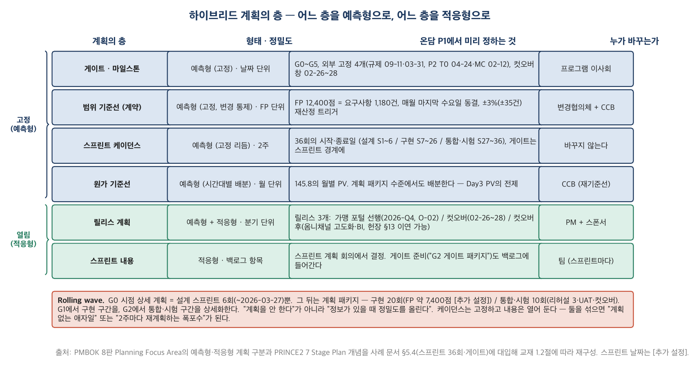

*그림 1-2. 하이브리드 계획의 층 — 고정되는 것과 열려 있는 것 (온담 P1). 위 네 층(게이트·계약 범위 기준선·스프린트 케이던스·원가 기준선)은 착수 시점에 정하고 바꾸지 않으며, 아래 두 층(릴리스 구성·스프린트 내용)은 정보가 생길 때 정한다. "케이던스는 고정하고 내용은 열어 둔다"가 하이브리드의 최소 조건이고, rolling wave는 정보가 있을 때 정밀도를 올리는 규율이다. 스프린트 날짜는 [추가 설정].*

### Rolling wave와 릴리스 계획

**Rolling wave planning**은 예측형 안에서 적응형의 원리를 쓰는 기법이다. 가까운 기간(대개 다음 게이트까지)은 작업패키지와 활동 수준까지 상세히 계획하고, 먼 기간은 계획 패키지(planning package) 수준 — 산출물과 총 예산·기간만 — 으로 남긴다. 게이트를 지날 때마다 다음 구간을 상세화한다. 이것은 "계획을 안 한다"가 아니라 "정보가 있을 때 정밀도를 올린다"이다.

P1에 적용하면 이렇다. G0 시점에 상세 계획은 설계 스프린트 6회(2026-03-27까지)이고, 그 뒤는 계획 패키지 — 구현 스프린트 20회에 FP 약 7,400점 [추가 설정, 12,400 × 60%], 통합·시험 스프린트 10회에 리허설 3회·UAT·컷오버 — 로 남긴다. G1에서 구현 구간을 상세화하고, G2에서 통합·시험 구간을 상세화한다. 원가 기준선은 계획 패키지 수준에서도 시간대별로 배분해야 한다 — 그래야 Day3의 PV가 있다.

**릴리스 계획**은 적응형의 언어다. 어느 기능 묶음이 어느 시점에 사용자에게 가는가. P1에는 사용자에게 가는 릴리스가 최소 셋 있다(워크북 §3의 릴리스 R0~R5 여섯은 개발 릴리스이며, 그중 R3·R4·R5가 아래 셋에 대응한다). (1) 가맹 발주 포털 선행 릴리스 — Day1 기회 O-02가 근거이며, 2026-Q4에 포털만 먼저 열어 가맹 부속서 협상(R-02)의 지렛대로 쓴다. (2) 컷오버 릴리스(2027-02-26~28) — POS·주문 허브·통합 재고·통합 계층 전체. (3) 컷오버 후 릴리스 — 헌장 §13이 "이연 가능"으로 정한 옴니채널 고도화(매장 간 재고 이동, 픽업 예약)와 BI 리포트. 릴리스 계획이 없으면 헌장 §13의 우선순위는 문장으로만 남고, 범위를 조정해야 하는 순간 무엇을 빼야 하는지 아무도 모른다.

### 온담의 사례로 읽기 — 36 스프린트 안에서 무엇을 미리 정하는가

> ■ **사례 사실** — 스프린트 36회 = 설계 6 / 구현 20 / 통합·시험 10, 요구 베이스라인 월 1회 동결(§3.4); 스프린트별 달력·릴리스 R1~R6은 [추가 설정] — Day2 워크북 §3.5 예시본 항목 7이 정본.

P1의 스프린트 달력을 놓아 보자 [추가 설정 — 회사 정본의 "설계 6 / 구현 20 / 통합·시험 10"과 마일스톤에 정합하도록 정했다].

| 구간 | 스프린트 | 기간 | 게이트·마일스톤 | 미리 정하는 것 | 스프린트마다 정하는 것 |
|---|---|---|---|---|---|
| 설계 | S1~S6 | 2026-01-05 ~ 03-27 | G1 2026-04-30 (S6 종료 후 5주) | 요구사항 확정 순서(SyRS 396 → SRS 570), 인터페이스 13본 문서화 전진 배치(R-06·O-01) | 어느 요구 묶음을 이번에 확정하는가 |
| 구현 | S7~S26 | 2026-03-30 ~ 2027-01-03 (구현 종료 01-01) | P2 T0 04-24, 부속서 08-14, 규제 09-11, G2 11-27 | 릴리스 구성(포털 선행 2026-Q4), 월 1회 동결일, 규제 요건 반영 릴리스(R2, S13~S18)와 규제 검증 활동(A07, 08-24~09-11 — 22영업일 버퍼는 P4의 것), 정본 판정 전 마스터 동결(R-10) | 백로그 우선순위, 스프린트 목표 |
| 통합·시험 | S27~S36 | 2027-01-04 ~ 05-23 | 리허설 3회차 01-29, MC 02-12, G3 02-19, 컷오버 02-26~28, 규제 03-31, G4 05-28(헌장 05-29 토요일 → 직전 영업일) | 리허설 3회 일자, UAT 종료 기준, 컷오버 절차·롤백, 안정화(S31~S34)·운영 이관(S35~S36) 기간의 SAC 대응 | 결함 우선순위, 이연 릴리스 R5 |

정본은 통합·시험 스프린트를 "2027-01~2027-02"로 적고 있지만 10회 × 2주는 20주이므로 그 구간은 컷오버 후 안정화·운영 이관(S31~S36, 2027-03-01~05-23)을 포함한다고 읽는다. 컷오버 전 통합·시험은 S27~S30(2027-01-04~02-28)이고, S31(03-01~03-14)이 G3 합류 버퍼 15영업일(종료 03-12)과 겹친다. 워크북 §3은 이 36회를 릴리스 R0(설계 베이스라인)~R5(이연 릴리스) 여섯으로 묶고 동결 12회를 달력에 박는다.

이 달력에서 "미리 정하는 것" 열을 보라. 36개 스프린트의 날짜, 세 릴리스의 구성, 되돌릴 수 없는 결정(G2 정본 판정, G3 컷오버 승인)의 위치, 외부 고정일 앞의 스프린트 배정 — 이것들은 착수 시점에 정하고 바꾸지 않는다. 반면 각 스프린트의 백로그는 스프린트 계획 회의의 몫이다. 두 가지를 섞으면 하이브리드는 "계획 없는 애자일"이 되거나 "2주마다 재계획하는 폭포수"가 된다.

### 실무에서 어떻게 틀리는가

하이브리드에서 가장 흔한 오류는 **스프린트를 폭포수의 단위로 쓰는 것**이다. 설계 스프린트 6회에서 설계만 하고, 구현 스프린트 20회에서 구현만 하고, 시험 스프린트에서 시험만 하면 그것은 2주 단위로 잘린 폭포수이고, 되돌림 비용을 낮추는 반복의 효과는 없다. 설계 스프린트에서도 위험한 인터페이스는 프로토타입으로 검증하고, 구현 스프린트에서도 스프린트마다 통합 가능한 증분을 만든다는 것이 하이브리드의 최소 조건이다.

두 번째 오류는 **게이트를 스프린트 위에 얹지 않고 옆에 두는 것**이다. 게이트 준비(문서, 심사, 보고)가 스프린트 계획에 들어가지 않으면 게이트 앞 2주는 스프린트 목표가 사라진다. G2 준비는 S23~S24의 백로그에 "G2 게이트 패키지"로 들어가야 한다.

세 번째는 **FP 고정가 계약과 적응형 범위의 충돌을 계획에서 다루지 않는 것**이다. 계약은 12,400점을 고정했고 스프린트는 범위를 열어 둔다. 이 충돌을 다루는 장치가 월 1회 동결과 ±3% 범위 허용범위, 그리고 FP 재산정 트리거다. 계획은 이 장치가 어느 스프린트 경계에서 작동하는지를 명시해야 한다. 2.4절에서 이 계약 구조를 다룬다.

---

## 1.3 표준에서는 — PMBOK 8판 Planning Focus Area, PRINCE2 Product-Based Planning, ISO 21502 §7 (심화)

### PMBOK 8판 — Planning Focus Area와 네 성과영역

Day1 제2장에서 본 대로 PMBOK 8판은 6 원칙 + 7 성과영역(Governance / Scope / Schedule / Finance / Stakeholders / Resources / Risk) + 5 Focus Area / 40 프로세스의 구조다. 계획은 **Planning Focus Area**에 있고, 40개 프로세스의 절반 가까이가 여기에 속한다(정확한 개수는 2차 출처 간에 19 또는 20으로 갈리므로 인쇄본을 보라). 6판을 아는 독자에게는 Planning Process Group의 24개 프로세스가 압축·재배치된 것으로 읽힌다.

Day2의 네 산출물은 네 성과영역에 대응한다.

| Day2 주제 | 8판 성과영역 | 6판 지식영역 | 무엇이 달라졌는가 |
|---|---|---|---|
| 범위·요구사항 | **Scope** | Scope Management | 요구사항 수집이 Scope 안에 남았고, 품질 통제(QC)가 Scope 도메인으로 들어왔다 — 인수 기준이 범위의 일부라는 뜻 |
| 일정 | **Schedule** | Schedule Management | 예측형·적응형 양쪽의 일정 기법(CPM과 릴리스·반복 계획)을 한 도메인에서 다룬다 |
| 원가·조달 | **Finance** (+ Governance) | Cost Management, Procurement Management | Cost → Finance 개칭. 자금 조달·현금흐름이 명시적으로 들어왔다. 조달은 Appendix X4로 내려갔고 소싱 전략 판단만 Governance에 남았다 |
| 리스크 | **Risk** | Risk Management | 7판의 Uncertainty에서 6판식 명칭으로 회귀 |

세 가지 함의를 적어 둔다. 첫째, **Finance**라는 이름은 원가 기준선이 "얼마 드는가"만이 아니라 "언제 누가 돈을 대는가"를 포함한다는 선언이다. 4.3절의 자금 조달 한도가 이 도메인의 일부다. 둘째, 조달이 부록으로 내려갔다는 것은 4.4절의 계약 유형·변경 대가·견적 검산을 PMBOK에서 배울 수 없다는 뜻이다. 그 출처는 계약 실무(FIDIC·NEC4·국가계약법·SW사업 대가산정 가이드)이며, 이 교재는 그중 한국 SI에 해당하는 것만 다룬다. 셋째, QC가 Scope로 들어왔으므로 범위 기술서의 **인수 기준(acceptance criteria)**은 선택 항목이 아니라 범위 정의의 일부다.

### PRINCE2 7 — Plans practice와 Product-Based Planning

PRINCE2 7의 Plans practice는 계획을 세 수준(Project Plan / Stage Plan / Team Plan)과 예외 계획(Exception Plan)으로 나누고, 어느 수준이든 **Product-Based Planning(PBP)**으로 시작하게 한다. PBP는 네 단계다.

1. **Project Product Description(PPD)** — 프로젝트가 최종적으로 인도하는 것 하나를 기술한다. 목적, 구성, 파생 원천, 품질 기대, 인수 기준, 인수 방법, 인수 책임자. 온담 P1의 PPD는 헌장 §6 여덟 산출물의 상위에 있는 "가동 중인 차세대 주문·재고 통합 플랫폼과 그 운영 인수 상태"다.
2. **Product Breakdown Structure(PBS)** — 최종 산출물을 구성 산출물로 분해한다. 활동이 아니라 **명사**로. "POS 개발"이 아니라 "신규 POS·매장 운영 시스템". PBS는 관리 산출물(management products — 계획서, 등록부, 보고서)과 전문 산출물(specialist products — 시스템, 문서, 데이터)을 구분한다.
3. **Product Description(PD)** — 구성 산출물 각각에 대해 목적·구성·품질 기준·품질 방법·품질 책임자를 쓴다. PD는 WBS 사전과 RTM의 인수 기준 열을 합친 것에 가깝다.
4. **Product Flow Diagram(PFD)** — 산출물 사이의 순서와 의존을 그린다. 이것이 활동 네트워크의 뼈대가 된다.

PMBOK의 WBS와 PRINCE2의 PBS는 자주 같은 것으로 취급되지만 미묘하게 다르다. WBS는 "작업(work)"의 분해이고, 표준(ISO 21511, MIL-STD-881F)은 산출물 지향을 권장하되 활동 지향도 허용한다. PBS는 정의상 산출물만 담는다. 실무에서 유용한 결합은 **PBS를 먼저 그리고, 그것을 WBS의 상위 레벨로 쓰고, 작업패키지 수준에서 활동을 붙이는 것**이다. 2.2절에서 이 순서를 따른다.

PRINCE2가 계획에 관해 PMBOK보다 강하게 말하는 것이 하나 더 있다. **계획은 Project Board가 승인하고, 승인의 단위는 단계(stage)다.** 단계 경계(stage boundary)에서 다음 단계 계획을 승인하고 프로젝트 계획을 갱신하며 비즈니스 케이스를 재확인한다. 온담의 게이트 G1·G2·G3가 정확히 단계 경계이고, 1.2절의 rolling wave가 PRINCE2에서는 Stage Plan의 형태로 제도화되어 있다.

### ISO 21502:2020 §7 — 계약서가 인용하는 조항

ISO 21502는 §6에서 "integrated project management practices"(프로젝트의 착수·지휘·통제·종료), §7에서 "management practices for a project"(계획, 편익, 범위, 자원, 일정, 원가, 리스크, 이슈, 변경 통제, 품질, 이해관계자, 의사소통, 조직 변화, 보고, 정보·문서, 조달, 교훈)를 다룬다. Day2 주제는 §7.2 planning, §7.4 scope, §7.5 resources, §7.6 schedule, §7.7 cost, §7.8 risk, §7.17 procurement에 해당한다(조항 번호는 인쇄 전 원문 대조를 권한다).

ISO 21502가 계획에 관해 말하는 것은 짧고 실무적이다. 계획은 **통합되어야** 하고(§7.2 — 범위·일정·원가·자원·리스크의 상호 의존을 반영), **기준선으로 승인**되어야 하며, **변경 통제**를 거쳐 갱신되어야 한다. 그리고 §7.7 cost는 "cost estimating"과 "developing the budget"과 "controlling costs"를 구분하며, 예산에 컨틴전시와 관리예비비를 **구분해** 포함하도록 한다. 한국 SI 계약서와 RFP가 "ISO 21502에 따라 관리한다"고 인용할 때 발주처가 실제로 기대하는 것은 대개 이 조항들 — 통합된 기준선, 변경 통제, 예비비의 구분 — 이며, 여러분이 Day2에 만드는 다섯 산출물이 그 기대의 답이다.

세 표준의 계획 구조를 나란히 놓으면 그림 1-3과 같다.

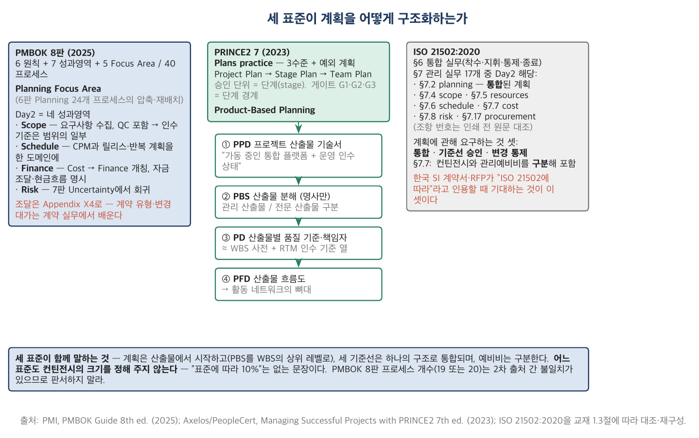

*그림 1-3. 세 표준의 계획 구조 대조 — PMBOK 8판 Planning Focus Area, PRINCE2 7 Product-Based Planning, ISO 21502 §7. PMBOK 8판은 네 성과영역(Scope·Schedule·Finance·Risk)으로 Day2를 덮되 조달을 부록으로 내렸고, PRINCE2 7은 PPD→PBS→PD→PFD의 산출물 기반 계획과 단계 단위의 승인을, ISO 21502 §7은 통합된 기준선·변경 통제·예비비의 구분을 요구한다. 어느 표준도 컨틴전시의 크기는 정해 주지 않는다.*

### 실무에서 어떻게 틀리는가

세 표준을 계획에 관해 인용할 때의 흔한 오류는 넷이다. PMBOK 8판의 프로세스 개수를 판서하는 것(2차 출처 간 불일치가 있다). PRINCE2의 PBS를 "WBS의 영국식 이름"으로 취급하는 것(PBS는 산출물만, 관리 산출물 포함). ISO 21502를 "ISO 21500"으로 잘못 부르는 것(Day1 2.4절). 그리고 세 표준 어느 것도 **컨틴전시의 크기**를 정해 주지 않는데 "표준에 따라 10%"라고 말하는 것 — 표준은 구분하라고 하지 얼마인지는 말하지 않는다.

---

## 1.4 분야별 대조 — SI·EPC·제조 NPD·제약의 계획 정밀도 (심화)

Day1 제1장 1.5절의 대조표를 계획의 관점에서 다시 놓는다. 네 분야는 "무엇을 언제 얼마나 정밀하게 미리 정하는가"에서 다르고, 그 차이는 되돌림 비용과 계약 구조에서 나온다.

| 축 | SI | 건설·EPC | 제조 NPD | 제약 임상·규제 |
|---|---|---|---|---|
| **범위 기준선의 형태** | FP(또는 M/M) 기준선 + 요구사항 목록. 계약 문서(계약서·과업지시서·제안서)가 정본 | 도면·시방서·BOQ(물량내역서). 설계 성숙도(AACE Class)가 계약 유형을 결정 | 제품 사양서(PRD) + BOM. 게이트마다 동결 수준 상승(EVT→DVT→PVT) | 임상 프로토콜. 규제기관 승인 시점에 사실상 고정 |
| **일정 기준선의 정밀도** | 릴리스·스프린트 단위. 활동 단위 CPM은 통합·전환 구간에서만 | 활동 단위 CPM 전체. 자재 리드타임과 공정 순서(Path of Construction)가 뼈대 | 금형·부품 리드타임에서 역산. 게이트 날짜는 고정, 그 사이는 rolling wave | 규제 제출·심사 시계에서 역산. 추가자료 요구 왕복 횟수가 최대 변수 |
| **원가 기준선의 형태** | 인건비 중심. 고정가 계약이면 수행사 원가는 발주사에 보이지 않는다 | 단가 × 수량. 실적원가가 항목별로 분리되므로 EVM이 정보를 준다 | 개발비 + 금형·설비 투자 + 양산 단가 목표(target cost) | 임상 비용(사이트·피험자 수) + 규제 수수료. 결과가 이진(승인/불승인) |
| **컨틴전시를 결정하는 것** | 요구사항 불안정성, 인터페이스 미지, 데이터 품질 | 설계 성숙도(Class), 지반·인허가, 물가 | 수율 곡선, 부품 단산, 설계 변경 횟수 | 추가자료 라운드 수, 사이트 모집 속도 |
| **계획이 가장 자주 틀리는 지점** | 인터페이스 상대와 데이터 전환을 "우리 일"로 안 잡음 | Class 5 견적으로 총액확정(LSTK) 계약 | 게이트 사이의 설계 변경을 계획에 안 넣음 | 심사 라운드 0회 가정 |

### SI — FP 기준선과 계약 문서

SI의 계획은 계약 이후에 시작되므로 범위 기준선의 정본은 PM이 만드는 WBS가 아니라 **계약 문서**다. 한국 SI에서 그 문서는 계약서 본문, 특수조건, 과업지시서(과업내용서), 제안요청서, 제안서의 순으로 층을 이루며, 상충 시 우선순위는 계약서에 명시되어 있어야 한다(명시가 없으면 분쟁이 된다). 그리고 규모의 정본은 **기능점수(FP)**다. FP 12,400점은 요구사항 1,180건을 기능 단위로 측정한 값이며, FP 기준선 확인서는 "이 1,180건이 이 12,400점이다"를 양쪽이 서명한 문서다. SI의 원가 기준선은 두 얼굴을 가진다 — 발주사의 기준선은 계약 금액(68.2억)과 그 지급 일정이고, 수행사의 기준선은 자기 인건비다. 발주사 PM은 수행사의 원가를 보지 못하며, 그래서 발주사의 EVM은 FP 진척(범위)과 지급 마일스톤(원가)으로 구성된다. 4.4절에서 이 구조를 다룬다.

### 건설·EPC — 계약 유형이 계획을 결정한다

EPC에서 계획의 정밀도는 계약 유형이 결정하고, 계약 유형은 설계 성숙도가 결정한다. AACE 18R-97의 Class 체계(4.1절)가 이 사슬의 언어다. Class 3(정의도 10~40%) 견적으로 총액확정(LSTK)을 체결하면 시공자는 정의되지 않은 60~90%의 리스크를 인수하는 것이고, 그 리스크는 입찰가에 프리미엄으로 들어가거나 시공 중 클레임으로 돌아온다. Merrow(2023)는 IPA 데이터로 "설계 성숙도 부족 + 경쟁입찰 압박" 조건에서 LSTK의 원가·일정 성과가 오히려 나빠진다는 것을 보였다. 그래서 EPC의 계획 규율은 "Class 2 이전에 총액을 확정하지 않는다"이고, 이것이 CII의 Front End Loading(FEL)과 PDRI 점수를 게이트에 묶는 이유다. P2(이천 물류센터 자동화, 194억)가 바로 이 분야이며, 설비 발주 확정(T0, 2026-04-24) 후에는 선급금 29.6억과 함께 되돌릴 수 없다.

### 제조 NPD — 게이트별 계획 정밀도

Stage-Gate의 게이트는 계획 정밀도의 단계이기도 하다. Gate 1~2(아이디어·사업성)에서는 원가·일정이 Class 5 수준이고 kill이 가능하다. Gate 3(개발 착수) 이후 EVT(설계 검증)→DVT(설계 확정)→PVT(양산 검증)로 갈수록 사양이 동결되고 계획은 부품·금형 리드타임에 묶인다. 금형 발주 후의 설계 변경은 주 단위 재작업이므로, NPD의 계획은 "금형 발주 전에 무엇을 확정해야 하는가"의 목록이 중심이다. 그리고 원가 기준선의 절반은 개발비가 아니라 **양산 단가 목표(target cost)**다 — 프로젝트가 예산 안에 끝나도 단가가 목표를 넘으면 실패다.

### 제약 임상·규제 — 규제 게이트에서 역산한다

제약의 일정은 규제기관의 시계에서 역산한다. 제출일이 정해지면 그 앞의 임상 완료·데이터 락·문서 작성이 역산되고, 그 뒤의 심사 기간(표준 심사 기간과 추가자료 요구 라운드)이 더해져 승인 예상일이 나온다. 계획이 틀리는 지점은 거의 항상 하나다 — **추가자료 요구 라운드를 0회로 가정하는 것**. 한 라운드가 수개월이므로 P50과 P80의 차이가 다른 분야보다 크고, 몬테카를로가 아니라 "라운드 수 시나리오"로 일정 리스크를 표현하는 것이 관례다. 온담의 규제 기한(2026-09-11, 2027-03-31)과 P4의 22영업일 규제 버퍼는 이 논리의 축소판이다.

### 네 분야가 공유하는 것

분야가 달라도 계획의 규율은 같다. **되돌릴 수 없는 결정 앞에 게이트를 두고, 그 게이트까지의 계획은 상세히, 그 뒤는 굵게.** SI의 G2(데이터 전환 정본)와 G3(컷오버), EPC의 T0(발주 확정), NPD의 금형 발주, 제약의 규제 제출이 그 결정이다. 그리고 그 결정 앞의 계획 정밀도를 결정하는 것은 방법론이 아니라 계약이다 — FP 고정가인가, LSTK인가, 실비정산인가에 따라 같은 WBS가 다른 의미를 갖는다.

네 분야의 계획 정밀도가 시간축 위에서 어디서 급등하는지를 그림 1-4에 개념도로 놓았다.

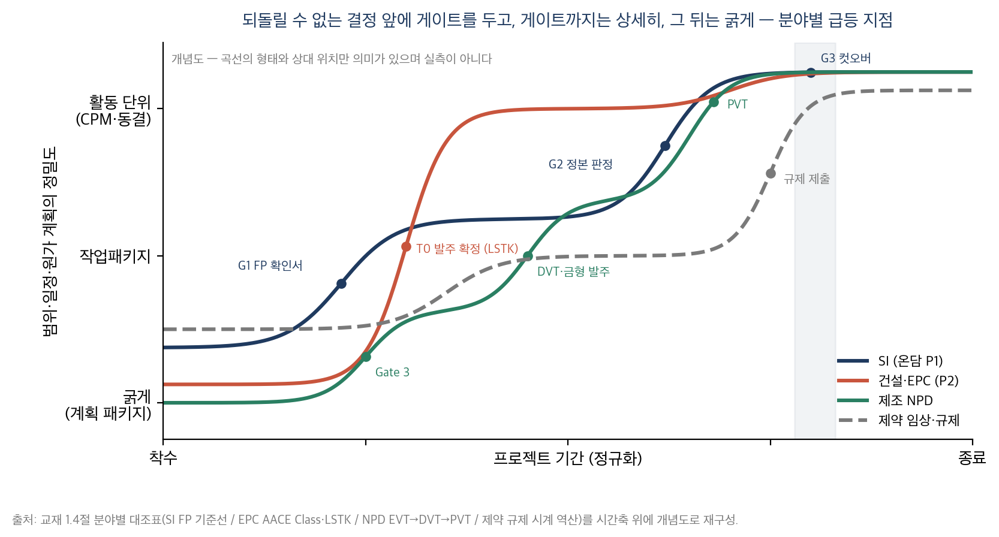

*그림 1-4. 네 분야의 계획 정밀도 곡선 — 되돌릴 수 없는 결정 앞에서 급등하는 지점. SI는 G1 FP 확인서와 G2 정본 판정에서 두 번, EPC는 T0 발주 확정(LSTK)에서 한 번 크게, NPD는 게이트마다 계단으로, 제약은 규제 제출 직전에 급등한다. 곡선의 형태와 상대 위치만 의미가 있는 개념도이며 실측이 아니다. 교재 1.4절 대조표를 시간축 위에 재구성.*

---

## 1.5 실무에서 어떻게 틀리는가 — 일정표로 축소된 계획

이 장을 닫으면서 계획 단계 전체에 걸친 세 가지 오류를 적어 둔다. 뒤의 장들은 각각의 주제에서 이 오류가 어떤 형태로 나타나는지를 다룬다.

**계획을 일정표로 축소하는 것.** 한국 기업에서 "계획서"는 대개 간트차트 한 장이다. 범위는 제안서에, 원가는 품의서에, 리스크는 없다. 그 간트차트에는 논리(의존 관계)가 없고, 막대의 길이는 담당자의 감이며, 마일스톤은 임원이 말한 날짜다. 그것은 계획이 아니라 희망의 시각화다. 계획은 세 기준선의 통합이고, 그중 일정은 범위와 원가 사이에서 도출되는 것이지 먼저 그려지는 것이 아니다.

**기준선 없이 진척을 보고하는 것.** 1.1절에서 다뤘다. 여기에 하나를 더한다 — 기준선이 있어도 그것이 승인·버전·변경 통제의 세 속성을 갖추지 못하면 기준선이 아니다. "PMO 서버에 있는 최신 일정"은 기준선이 아니라 작업 계획이다.

**처음 계획을 끝까지 고수하는 것.** Kreiner(1995)가 Day1에서 말한 역설 — 환경이 흐르므로 계획을 잘 지키는 것이 오히려 관련성 상실로 이어진다 — 이 계획 단계의 마지막 경고다. 계획의 목적은 지켜지는 것이 아니라 편차를 보이게 하는 것이고, 편차가 보이면 결정이 따라야 한다. 그 결정의 절차(변경 통제, 예외 보고, 재기준선)가 Day3다. Day2의 계획은 그 절차가 작동할 수 있는 형태 — 측정 가능한 기준선 — 로 만들어져야 한다.

---

## 제1장 핵심 정리

> **한 줄씩 — 수업 직전 5분 복습용**
> 1. 계획은 예측이 아니라 합의다 — 틀렸다고 버리지도, 바꾸면 안 된다고 붙들지도 않는다.
> 2. 기준선 = 승인됐고, 버전이 있고, 변경 통제 아래 있는 계획. 세 기준선이 합쳐져 Day3의 PMB가 된다.
> 3. 하이브리드 계획은 "어느 층을 미리 정하고 어느 층을 열어 두는가"에 답해야 한다.
> 4. 산출물에서 시작해 활동으로 내려간다(PRINCE2 Product-Based Planning) — 활동부터 나열하지 않는다.
> 5. 계획 정밀도는 되돌림 비용과 계약 구조가 정한다 — 분야마다 다르다.
> 6. P1은 G1까지 잠정 기준선으로 일한다 — 결함이 아니라 하이브리드의 정상 형태다.
>
> 아래는 같은 내용의 자세한 판이다.

1. 계획은 예측이 아니라 합의다. 세 기능 — 합의, 통제 기준(기준선), 의사소통 — 을 분리하면 "계획이 틀렸으니 소용없다"와 "계획을 바꾸면 안 된다"가 둘 다 오류임이 보인다.
2. 기준선은 승인되고, 버전이 있으며, 변경 통제 아래 있는 계획이다. 범위·일정·원가 세 기준선은 하나의 구조(작업패키지 → 활동 → 시간대별 원가)로 통합되어 PMB가 된다. Day3 EVM의 전제다.
3. 하이브리드 계획은 "어느 층을 예측형으로, 어느 층을 적응형으로"에 답해야 한다. 케이던스와 게이트와 계약 기준선은 고정하고, 스프린트 내용과 릴리스 구성은 열어 둔다. Rolling wave는 정보가 있을 때 정밀도를 올리는 규율이다.
4. PMBOK 8판은 Scope·Schedule·Finance·Risk 도메인으로 Day2를 덮되 조달은 부록으로 내렸다. PRINCE2의 Product-Based Planning(PPD→PBS→PD→PFD)은 활동이 아니라 산출물에서 시작하며, PBS를 WBS의 상위 레벨로 쓰는 것이 실무적 결합이다. ISO 21502 §7은 통합된 기준선·변경 통제·예비비의 구분을 요구한다.
5. 분야별 계획 정밀도는 되돌림 비용과 계약 구조가 결정한다. SI는 FP 기준선과 계약 문서, EPC는 AACE Class와 계약 유형, NPD는 게이트별 동결, 제약은 규제 시계의 역산.
6. P1은 G1(2026-04-30)까지 4개월을 잠정 기준선으로 일한다. 그것은 결함이 아니라 하이브리드의 정상 형태이며, 잠정 기준선의 측정 단위(요구사항 확정 건수, 인터페이스 문서화 본수)를 명시해야 한다.

## 생각해 볼 질문

1. 여러분 회사의 "프로젝트 계획서"에 세 기준선이 모두 있는가. 없다면 진척률의 분모는 무엇인가.
2. 여러분의 마지막 프로젝트에서 재기준선은 몇 번 있었는가. 그때마다 이전 편차는 어디로 갔는가.
3. P1의 설계 스프린트 6회 동안 스폰서에게 진척을 보고해야 한다. 무엇의 몇 %라고 말할 것인가.
4. 가맹 포털을 2026-Q4에 선행 릴리스하면 컷오버 릴리스의 범위와 원가 배분은 어떻게 달라지는가. 그것을 릴리스 계획 없이 결정할 수 있는가.
5. P1(SI)과 P2(설비)의 계획을 같은 양식으로 만들면 무엇이 어긋나는가.

## 워크북 연결

이 장은 워크북 §0(Day2 사용법·산출물 관계도)과 §3 "일정 기준선"의 도입부(스프린트 달력과 게이트 동기화)에 적용된다. §0에서는 Day1 다섯 문서 → Day2 다섯 산출물의 입력 관계를 확인하고, 각 산출물의 기준선 속성(승인자·버전·변경 통제 경로)을 한 줄씩 적는다. §3의 첫 과제는 36개 스프린트 날짜와 G0~G5·외부 고정일을 한 달력에 놓고, 게이트가 스프린트 경계에 있는지, 외부 고정일 앞에 어느 스프린트가 배정되는지를 확인하는 것이다. 심화 과제: G1 이전 4개월의 잠정 기준선을 정의한다 — 무엇을 어느 단위로 측정하고, 누가 그것을 승인하는가.

---

# 제2장 범위와 요구사항

## 2.1 범위 기술서 — 포함·제외·인수 기준·가정·제약

### 개념

범위 기술서(scope statement)는 헌장의 범위 항목을 **계획 수준으로 상세화한** 문서이며, 범위 기준선의 첫 번째 구성 요소다(나머지 둘은 WBS와 WBS 사전). 헌장 §5가 "무엇을 하고 무엇을 안 하는가"의 다섯 줄과 일곱 줄이었다면, 범위 기술서는 그 각각에 대해 **어디까지가 완료인가**를 붙인다.

표준 항목은 다섯이다.

**산출물 범위 기술(product scope description)** — 산출물의 특성. 헌장 §6의 명사 목록을 받아 각 산출물의 구성과 경계를 서술한다. "신규 POS·매장 운영 시스템"이라면 어느 매장(615개), 어느 단말(직영 477대 신규, 가맹 388점 SW 배포), 어느 기능군(판매·결제·재고·마감·본사 연동), 어느 기술 기반(클라우드, 중앙 재고 실시간 연결)인가.

**인수 기준(acceptance criteria)** — 산출물이 "완료되었다"고 판정하는 조건과 판정자. 1.3절에서 PMBOK 8판이 QC를 Scope 도메인에 넣었다고 했다. 인수 기준이 없는 범위 기술서는 완료를 정의하지 않은 것이고, 완료가 정의되지 않으면 검수는 협상이 된다. 인수 기준은 측정 가능해야 한다 — "안정적으로 동작한다"가 아니라 "UAT 시나리오 N건 통과, 결함밀도 0.4건/FP 이하, 부하시험 피크 처리량 5,100 케이스/h 상당의 트랜잭션 통과".

**제외(exclusions)** — 헌장의 제외 항목을 그대로 받되, **담당 프로젝트·담당자**를 붙인다. "가맹 계약 개정은 P3(협상 책임 오정근)"처럼. 제외 항목에 담당이 없으면 그것은 제외가 아니라 누락이다 — 누구도 하지 않는 일은 결국 프로젝트로 돌아온다.

**가정과 제약** — 헌장 §9를 받되 계획 수준에서 검증 상태를 갱신한다. 착수 시점의 가정 "3PL 계약 변경이 2026-06-30까지 타결된다"는 G1 시점에 "협상 착수 2026-03-16 확인, 대성 서면 회신 대기 [추가 설정]"처럼 상태가 붙는다. 검증되지 않은 가정은 제5장 리스크 등록부의 행이고, 두 문서는 같은 ID로 연결된다.

**경계 조건(boundary conditions)** — 이것은 표준 항목이 아니지만 온담 헌장 v1.0이 §5에 넣은 것이고, 이 교재는 그것을 범위 기술서에서도 유지하기를 권한다. 경계 조건은 "P1이 여기까지 하고 상대가 저기부터 한다"는 인터페이스 합의다. P2 설비 인터페이스(규격은 P1, 구현·시험은 P2), 3PL 연동(명세와 P1측 API는 P1, 협상은 물류본부), 규제 아키텍처(반영은 P1, 해석은 P4), 운영 문서(기술 문서는 P1, 절차 문서는 P5). 경계 조건이 WBS에서 "연동 명세서" 작업패키지와 "협상 지원 자료" 작업패키지로 분리되는 것이 2.5절이다.

### PRINCE2의 Project Product Description과의 대응

1.3절의 PPD는 범위 기술서와 거의 같은 문서다. PPD 항목(목적·구성·파생 원천·개발 기술·품질 기대·인수 기준·인수 방법·인수 책임자)과 범위 기술서 항목을 나란히 놓으면 PPD가 **품질 기대와 인수 책임자를 더 강하게 요구**한다는 것이 보인다. 온담 헌장 §6이 산출물마다 인수자와 인수 시점을 적은 것은 PPD의 영향이며, 범위 기술서는 거기에 인수 기준을 더한다.

### 온담의 사례로 읽기

> ■ **사례 사실** — 포함 산출물 5·제외 7·경계 조건(§3.2), 3PL WMS 준실시간 API 전환과 커스터마이징 불가(§3.5·§6.4), 데이터 전환 대상 1,842 테이블·7.4TB(P-10); 5년 초과 이력 2.6TB 아카이브는 [추가 설정](Day2 워크북 §1.5).

P1 범위 기술서에서 가장 어려운 항목은 산출물 범위가 아니라 **인수 기준과 경계 조건**이다. 두 가지를 보자.

**통합 재고 관리의 인수 기준.** 헌장 §4 상위 요구 1번은 "매장·물류센터·공장 출하 재고를 단일 원장에서 준실시간(15분 이내)으로 조회"다. 그런데 3PL WMS 연동은 대성로지스와의 협상 결과에 따라 준실시간 API 또는 야간 배치 2회 폴백이다(R-03). 인수 기준을 "15분 이내"로만 쓰면 협상이 결렬되었을 때 통합 재고는 인수 불가가 된다. 그래서 인수 기준은 조건부여야 한다 — "매장·공장 재고는 15분 이내; 센터 재고는 3PL 계약 변경 시 15분 이내, 미변경 시 야간 배치 2회(21:00·03:00 [추가 설정]) 반영". 이것이 헌장 §6의 "WMS 연동(준실시간 또는 폴백)"이 범위 기술서에서 구체화되는 형태다.

**가맹 POS SW 배포의 경계.** 헌장은 가맹 단말 HW 교체를 제외했고(비용 부담은 부속서 협상 결과에 따름), 프리모템 원문 11번은 2013년 이전 기종 90여 대가 펌웨어를 못 받는 시나리오를 냈다(R-13). 범위 기술서는 "가맹 388점 기존 단말에 SW 배포"의 경계를 명시해야 한다 — 호환 기종 기준(OS·메모리 최소 사양 [추가 설정]), 비호환 기종의 처리(배포 제외 + 수기 폴백 절차 제공 / 교체는 P1 범위 외), 단말 전수 조사(2026-04, 오정근)의 결과가 범위 기술서 v1.1의 입력이 된다는 것. 이 문장이 없으면 컷오버 다음 주 월요일에 90개 매장이 "P1이 우리 단말을 망가뜨렸다"고 말한다.

### 실무에서 어떻게 틀리는가

범위 기술서를 헌장의 복사본으로 쓰는 것이 첫 번째 오류다 — 인수 기준이 없으면 헌장과 다를 것이 없다. 두 번째는 인수 기준을 "고객 만족"이나 "정상 동작"으로 쓰는 것이다. 세 번째는 제외 항목에 담당을 붙이지 않는 것이다. 네 번째는 가정의 검증 상태를 갱신하지 않아 착수 시점의 가정이 G3까지 "가정"으로 남는 것이다. 다섯 번째는 **"기타 협의된 사항"** — 2.4절에서 따로 다룬다.

---

## 2.2 WBS — 100% 규칙, 8/80, 산출물 지향, 코드 체계, WBS 사전, PBS와의 관계

### 개념

WBS(work breakdown structure)는 프로젝트의 전체 범위를 **인도 가능한 단위로 계층 분해**한 것이다. 정의는 단순하지만 실무에서 WBS가 무너지는 방식은 다양하며, 그것을 막는 규칙이 몇 개 있다.

**100% 규칙.** WBS는 프로젝트 범위의 100%를 담는다 — 그 이상도 이하도 아니다. 하위 레벨의 합은 상위 레벨의 100%다. 이 규칙은 두 방향으로 작동한다. WBS에 없는 일은 범위 밖이고(범위 크립의 방어), 범위 안의 일은 반드시 WBS 어딘가에 있다(누락의 방어). 프로젝트 관리 자체 — PMO, 형상관리, 게이트 준비, 보고 — 도 범위이므로 WBS에 있어야 한다. ISO 21511:2018과 MIL-STD-881F가 이 규칙의 원문이며, 리딩리스트가 권하듯 "100% 규칙을 가르치기 전에 원문이 실제로 뭐라고 쓰는지" 확인하라 — 원문은 규칙을 강제하기보다 WBS의 목적(범위의 완전한 표현)에서 도출한다.

**산출물 지향 vs 활동 지향.** 표준은 산출물(deliverable) 지향을 권장한다. "설계 → 개발 → 시험"으로 나누는 활동 지향 WBS는 단계마다 모든 산출물이 섞여 있어 "무엇이 끝났는가"를 말할 수 없다. 산출물 지향 WBS는 "POS의 결제 모듈이 끝났다"를 말할 수 있고, 그것이 Day3의 EV(획득가치)를 측정 가능하게 한다. 활동은 작업패키지 아래에서, 일정 모델에서 붙는다. PRINCE2의 PBS(1.3절)를 상위 레벨로 쓰면 자연스럽게 산출물 지향이 된다.

**레벨 깊이와 8/80 규칙.** 얼마나 잘게 나누는가. 흔한 경험칙이 8/80 — 작업패키지 하나의 노력이 8시간보다 작으면 관리 비용이 일보다 크고, 80시간(2주)보다 크면 진척을 볼 수 없다. 이 숫자는 절대 규칙이 아니라 "보고 주기의 1~2배"라는 원리의 표현이다. 2주 스프린트로 일하는 P1에서 80시간 기준은 "작업패키지 하나가 스프린트 하나 안에 끝난다"와 같은 말이고, 그것이 WBS와 스프린트 백로그를 연결하는 자연스러운 크기다. 레벨 수는 대개 3~5. 너무 얕으면 통제 단위가 없고, 너무 깊으면 WBS가 활동 목록이 된다.

**통제 계정(control account)과 작업패키지(work package).** 작업패키지는 WBS의 최하위 단위이며 원가·일정·범위가 함께 측정되는 곳이다. 통제 계정은 여러 작업패키지를 묶어 EVM의 성과를 집계하는 관리 단위이며, 대개 레벨 2 또는 3에 놓인다. 통제 계정 관리자(CAM)가 지정되고, 그 사람이 그 계정의 PV·EV·AC에 책임진다. Day3에서 이 구조가 EVM의 뼈대가 된다.

**코드 체계.** WBS 코드는 계층을 표현하고(1.3.2), 일정 모델의 활동 코드·원가 계정 코드·형상 항목 코드와 **같은 뿌리**를 가져야 한다. 1.1절에서 세 기준선이 따로 만들어지는 오류를 말했다. 그 오류의 기술적 방어가 코드 체계다. P1의 WBS 코드가 P1.3.2.4라면 일정 도구의 활동은 P1.3.2.4-01, -02이고, 원가 계정은 P1.3.2.4로 집계되고, 형상 항목은 P1.3.2.4로 태그된다.

WBS의 규칙들을 한 장에 시각화하면 그림 2-1과 같다.

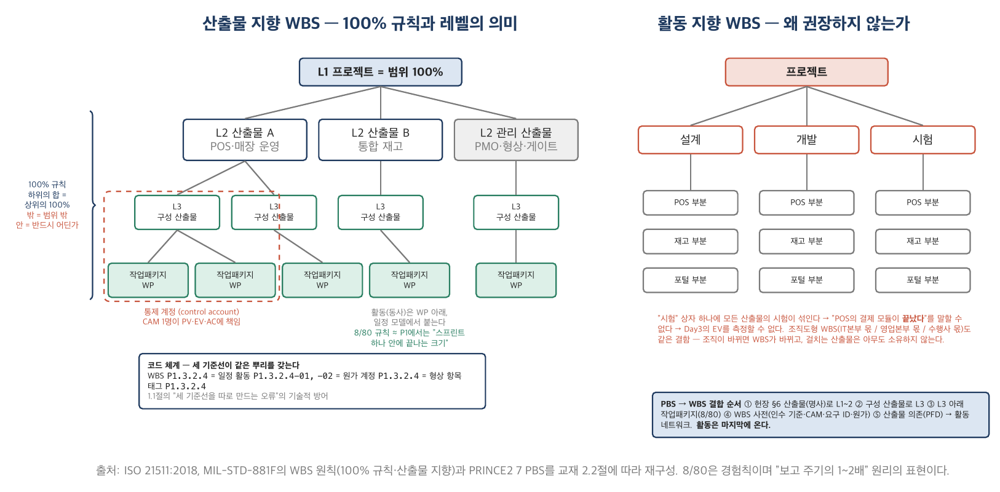

*그림 2-1. WBS 규칙의 시각화 — 100% 규칙, 산출물 지향 vs 활동 지향, 레벨·작업패키지·통제 계정의 위치. 왼쪽의 산출물 지향 트리에서는 하위의 합이 상위의 100%이고, 통제 계정은 여러 작업패키지를 묶어 CAM 한 사람이 PV·EV·AC에 책임지며, 활동은 작업패키지 아래에서 일정 모델에 붙는다. 오른쪽의 활동 지향 트리는 "시험" 상자 하나에 모든 산출물의 시험이 섞여 "무엇이 끝났는가"를 말할 수 없다. ISO 21511:2018·MIL-STD-881F·PRINCE2 7 PBS를 바탕으로 재구성.*

### WBS 사전

WBS 사전(WBS dictionary)은 WBS의 각 요소에 대한 설명서다. 항목은 대개 코드·명칭·설명·인수 기준·담당(CAM)·선행·후행·자원·기간·원가 추정·가정·품질 요구·관련 요구사항 ID다. WBS 사전은 PRINCE2의 Product Description과 같은 자리에 있으며, **RTM과 원가 기준선을 잇는 고리**다. 작업패키지의 "관련 요구사항 ID" 열이 RTM의 요구 → 작업패키지 추적을, "원가 추정" 열이 원가 기준선의 시간대별 배분을 가능하게 한다. WBS 사전 없는 WBS는 상자 이름의 목록이고, 상자 안에 무엇이 들어 있는지는 담당자의 머릿속에 있다.

### PBS와 WBS의 관계 — 실무적 결합

1.3절에서 말한 결합을 절차로 적는다.

1. 헌장 §6의 산출물(명사)로 PBS 레벨 1~2를 그린다. 관리 산출물(계획서·등록부·보고서)을 별도 가지로 둔다.
2. 각 산출물을 구성 산출물로 분해한다(레벨 3). 여기까지가 PBS이고 산출물만 있다.
3. 레벨 3 이하에서 작업패키지를 정의한다. 작업패키지는 "구성 산출물을 만드는 일의 묶음"이며 8/80을 만족한다.
4. 작업패키지에 WBS 사전을 쓴다 — 인수 기준, 담당, 요구사항 ID, 원가·기간 추정.
5. 산출물 사이의 의존(PFD)을 그린다. 이것이 제3장 활동 네트워크의 뼈대다.

이 순서의 요점은 **활동이 마지막에 온다**는 것이다. 활동에서 시작하면 WBS는 "누가 무엇을 한다"의 조직도가 되고, 산출물에서 시작하면 "무엇이 나온다"의 인도 구조가 된다.

### 실무에서 어떻게 틀리는가

WBS를 조직도로 그리는 것(IT본부 몫 / 영업본부 몫 / 수행사 몫)이 가장 흔하다. 조직이 바뀌면 WBS가 바뀌고, 한 산출물이 여러 조직에 걸치면 아무도 그것을 소유하지 않는다. 두 번째는 활동 지향으로 그려 "시험" 상자 하나에 모든 산출물의 시험이 들어가는 것이다. 세 번째는 프로젝트 관리를 WBS에서 빼는 것 — 100% 규칙 위반이며, PMO 12.6억이 어느 상자에도 없으면 원가 기준선이 145.8억이 되지 않는다. 네 번째는 WBS 사전을 쓰지 않는 것. 다섯 번째는 코드 체계를 일정·원가 도구와 맞추지 않아 세 기준선이 첫 달부터 따로 노는 것. 여섯 번째는 수행사의 WBS를 그대로 받는 것 — 수행사 WBS는 수행사의 인력 투입 구조를 반영하며, 발주사가 통제해야 할 단위(데이터 전환 용역, 상용SW, 인프라, 감리, PMO)가 빠져 있다.

---

## 2.3 요구사항 계층과 추적표 — StRS→SyRS→SRS, RTM, 우선순위, 비기능 요구

### 요구사항의 세 층 — ISO/IEC/IEEE 29148

ISO/IEC/IEEE 29148:2018은 요구사항 문서를 세 층으로 나눈다. **StRS(Stakeholder Requirements Specification)** — 이해관계자가 무엇을 필요로 하는가, 그들의 언어로. **SyRS(System Requirements Specification)** — 시스템이 무엇을 해야 하는가, 시스템의 경계와 인터페이스에서. **SRS(Software Requirements Specification)** — 소프트웨어가 무엇을 해야 하는가, 기능·데이터·화면·비기능의 수준에서. 온담 P1의 요구사항 1,180건 = StRS 214 / SyRS 396 / SRS 570은 이 계층을 그대로 쓴 것이다.

이 계층이 실무에서 중요한 이유는 **한국 SI의 "요구사항정의서"가 이 중 어느 층인지 대개 불분명하기 때문이다.** 제안요청서의 요구사항은 StRS와 SyRS가 섞여 있고, 수행사가 분석 단계에 만드는 요구사항정의서는 SRS에 가까우며, 둘 사이의 대응은 아무도 만들지 않는다. 그러면 검수 시점에 "제안요청서의 이 요구가 어느 화면에서 충족되었는가"에 답할 수 없고, 감리(정하늘 수석감리원)가 지적하는 RTM 커버리지 미달이 정확히 이것이다(프리모템 원문 15번).

29148은 "좋은 요구사항의 특성"도 정의한다 — 필요하고(necessary), 모호하지 않고(unambiguous), 검증 가능하고(verifiable), 단일하며(singular), 실현 가능하고(feasible), 완전하고(complete), 일관되어야(consistent) 한다. 이 중 실무에서 가장 자주 무너지는 것은 **검증 가능성**과 **단일성**이다. "사용자가 편리하게 발주할 수 있어야 한다"는 검증 불가하고, "발주·마감·출고 확인·배송 추적을 한 화면에서 처리한다"는 네 개의 요구가 한 문장에 있다.

### RTM — 요구 → 설계 → 시험 → 검수

요구사항 추적표(RTM, requirements traceability matrix)는 요구사항 각각이 어디서 왔고(출처), 어디로 갔는가(설계 요소, 작업패키지, 시험 케이스, 검수 확인)를 잇는 표다. 열의 최소 구성은 다음과 같다.

| 열 | 내용 | 온담 P1에서의 원천 |
|---|---|---|
| 요구 ID | 계층 표시 포함 (StRS-xxx / SyRS-xxx / SRS-xxx) | 요구사항 기준선 v1.0 |
| 상위 요구 | 이 요구가 분해되어 나온 상위 노드 | 헌장 §4 상위 요구 8개 → StRS |
| 출처(요구 제공자) | 실명 | 헌장 §4의 괄호 안 이름, 이해관계자 등록부 |
| 우선순위 | MoSCoW | 헌장 §13 우선순위 |
| 릴리스 | R0~R5 (포털 선행 = R3, 컷오버 = R4, 컷오버 후 이연 = R5) | 릴리스 계획(1.2절), 워크북 §3 스프린트 캘린더 |
| WBS 작업패키지 | 코드 | WBS 사전의 "관련 요구사항 ID"의 역방향 |
| 설계 요소 | 화면·API·테이블·인터페이스 ID | 설계 스프린트 산출물 |
| FP | 이 요구의 기능점수 | FP 기준선 확인서 |
| 시험 케이스 | 단위·통합·UAT | 시험 계획 |
| 검수 확인 | 검수 문서·일자·확인자 | Day4 검수 |
| 상태 | 확정 / 변경 중 / 이연 / 삭제 | 변경 통제 |

RTM은 **양방향**이어야 한다. 앞으로(요구 → 시험)는 "모든 요구가 시험되었는가"를, 뒤로(시험 → 요구)는 "모든 시험이 어떤 요구에 근거하는가"를 답한다. 뒤로 추적되지 않는 설계·시험은 gold plating의 증거다(2.4절). 헌장 §3의 관리 성공 기준 "RTM 커버리지 100%(동결 범위 기준)"는 앞으로의 추적을 말하고, 감리는 양방향을 본다.

RTM의 두 번째 기능은 **변경 영향 분석**이다. 요구 하나가 바뀌면 어느 설계·작업패키지·시험 케이스·FP가 영향받는지를 RTM이 즉시 보여 준다. Day3의 변경요청서 영향 분석은 RTM 없이는 감으로 하는 것이다.

### 우선순위 — MoSCoW와 Kano

**MoSCoW**(Must / Should / Could / Won't this time)는 범위 조정의 언어다. 핵심은 두 가지다. Must의 비율을 제한할 것 — Day1 R-07의 완화 조치가 "Must ≤ 60%"인 이유는 Must가 90%면 조정할 것이 없기 때문이다. 그리고 Won't를 명시할 것 — "이번에는 안 한다"를 적지 않으면 그것은 Could로 되돌아온다. 헌장 §13이 "옴니채널 고도화와 BI 리포트는 컷오버 이후 릴리스로 이연 가능"이라고 한 것이 P1의 Should/Could 경계이고, 그것이 RTM의 우선순위 열과 릴리스 열에 들어간다.

**Kano 모델**은 다른 축이다 — 요구의 충족이 만족에 미치는 영향의 형태. 당연 품질(must-be, 없으면 불만·있어도 만족 없음), 일원 품질(one-dimensional, 많을수록 만족), 매력 품질(attractive, 없어도 불만 없음·있으면 만족). 매장 직원에게 결제 속도는 당연 품질이고, 가맹점주에게 발주 리드타임은 일원 품질이며, 앱 사용자에게 픽업 예약은 매력 품질이다. Kano는 MoSCoW를 정하는 근거를 준다 — 당연 품질은 Must, 매력 품질은 Could. 그리고 Kano의 시간 축(매력 품질은 시간이 지나면 당연 품질이 된다)이 릴리스 순서의 근거가 된다. Product 트랙(Day5 이후)에서 Kano를 다시 만난다.

### 비기능 요구의 위치

비기능 요구(NFR — 성능·가용성·보안·규제·운영성)는 SRS의 한 절이 아니라 **모든 층에 걸쳐** 있다. 헌장 §4의 8개 상위 요구 중 5개가 비기능(성수기 배포 창, 가용성 99.5%, 규제 요건, 자체 운영 가능 아키텍처, SAP 마이그레이션 고려 구조)이다. NFR의 함정은 셋이다. 첫째, FP로 측정되지 않으므로 고정가 계약의 범위에서 보이지 않는다 — 12,400점에 "가용성 99.5%"는 없다. 둘째, 시험 케이스가 늦게 만들어진다 — 부하시험(3.1억)과 보안취약점 진단(2.4억)은 통합 단계의 일이지만 그 기준은 설계 단계에 확정되어야 한다. 셋째, 한 NFR이 여러 기능 요구에 걸치므로 RTM에서 다대다로 추적된다. ISO/IEC 25010의 품질 특성(기능 적합성·성능 효율성·호환성·사용성·신뢰성·보안성·유지보수성·이식성, 2023년 개정에서 안전성 추가)이 NFR 카탈로그의 뼈대이며, 각 특성에 **fit criterion**(측정 방법과 합격선)을 붙이는 것이 RTM의 비기능 행이다.

요구사항 계층과 RTM의 양방향 추적을 그림 2-2에 놓았다.

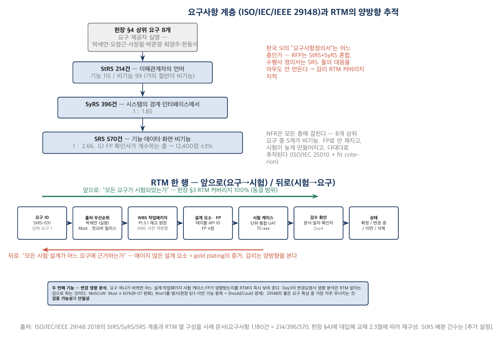

*그림 2-2. 요구사항 계층(헌장 §4 8개 → StRS 214 → SyRS 396 → SRS 570)과 RTM의 양방향 추적. 위는 ISO/IEC/IEEE 29148의 세 층에 온담의 1,180건을 대입한 것이고(1 : 1.85 : 2.66), 아래는 RTM 한 행의 열 구성이다. 앞으로의 추적(요구 → 시험)이 헌장 §3의 커버리지 100%이고, 뒤로의 추적(시험·설계 → 요구)이 gold plating의 탐지기이며, 감리는 양방향을 본다. StRS 배분 건수는 [추가 설정].*

### 실무에서 어떻게 틀리는가

요구사항정의서가 어느 층인지 모르는 것, RTM을 검수 직전에 역으로 만드는 것(감리 대응용 RTM은 추적이 아니라 사후 짝짓기다), Must가 90%인 것, Won't가 없는 것, NFR을 "성능은 충분해야 함"으로 쓰는 것, 요구 제공자 열을 부서명으로 채우는 것(실명이 아니면 변경 시 누구에게 물을지 모른다), RTM을 엑셀로 만들어 변경마다 수작업으로 갱신하다 세 달 뒤 포기하는 것.

---

## 2.4 범위 크립과 계약 — gold plating, "기타 협의된 사항", 한국 SI의 FP 기준선과 변경 대가

### 세 가지 범위 팽창

**범위 크립(scope creep)**은 승인되지 않은 범위가 통제 없이 늘어나는 것이다. 한 건 한 건은 작다 — "이 화면에 버튼 하나만", "이 리포트에 열 하나만". 합치면 FP 수백 점이다. 크립의 원인은 대개 변경 통제의 부재가 아니라 **변경 통제의 문턱이 너무 높은 것**이다. 정식 변경요청서를 쓰기에는 작으니 그냥 해 주고, 그것이 쌓인다. 처방은 문턱을 낮추는 것 — 작은 변경도 기록한다 — 이며, P1의 월 1회 동결과 ±35건 허용범위가 그 장치다. 허용범위 안의 변경은 PM이 결정하되 기록하고, 누적이 ±35건에 닿으면 FP 재산정 트리거가 걸린다.

**Gold plating**은 요구되지 않은 것을 공급자가 더 넣는 것이다. 좋은 의도(더 나은 UI, 더 많은 옵션)에서 나오지만 시험되지 않은 기능은 결함의 원천이고, 발주사는 요구하지 않은 것을 검수할 근거가 없으며, 수행사는 손익률 6.5%를 스스로 깎는다. 2.3절의 RTM 역방향 추적이 gold plating의 탐지기다 — 어느 요구에도 매이지 않은 설계 요소.

**"기타 협의된 사항"**은 한국 SI 계약의 고유한 범위 팽창 경로다. 과업지시서의 마지막 줄 — "기타 발주기관과 협의하여 정하는 사항" 또는 "상기 과업 수행에 필요한 부수 업무" — 이 문장은 발주사에게는 무한한 범위이고 수행사에게는 무한한 리스크다. 계약 협상에서 수행사가 이 문장의 삭제 또는 한정("협의된 사항은 변경협의체 의결로 확정하며 변경 대가 산정 대상이다")을 요구하는 것은 정당하고, 발주사 PM은 그 요구를 받아들이는 것이 자기 프로젝트에 이롭다 — 무한한 범위는 무한한 분쟁이기 때문이다.

### 한국 SI — FP 산정과 기준선 확인서

FP(기능점수)는 소프트웨어의 기능 규모를 사용자 관점에서 측정하는 방법이다. 한국에서는 SW사업 대가산정 가이드(한국소프트웨어산업협회)가 기능점수 기반 대가 산정을 정하며, 공공 발주에서 사실상 표준이고 민간 SI도 이를 준용한다. P1의 12,400점 × 55만 원 = 68.2억은 이 구조다.

FP는 범위 기준선의 **계약적 단위**다. 요구사항 1,180건은 문장이고, FP 12,400점은 숫자이며, 둘의 대응이 **FP 기준선 확인서**다. G1 통과 조건에 이 확인서의 서명이 있는 이유는 설계 스프린트 6회가 끝나야 요구사항이 확정되고, 확정된 요구사항을 다시 계수해야 12,400점이 맞는지 알 수 있기 때문이다. 입찰 시점의 12,400점은 제안요청서 기준의 개략 계수이고, G1의 확인서가 정밀 계수다. 둘의 차이가 ±3%를 넘으면 계약 금액 조정의 대상이 된다 — 회사 정본의 "기준선 재확인 절차: 분기 1회 또는 FP 누적 변동 ±3% 초과 시"가 이것이다.

FP를 쓸 때 알아야 할 것이 셋 있다. 첫째, **FP는 기능만 잰다.** 비기능(성능·보안·가용성), 데이터 전환, 인터페이스 재구축의 상당 부분, 인프라 구축은 FP 밖이다. 그래서 168.0억 중 SI 용역은 68.2억뿐이고 나머지 99.8억은 별도 계약이다. 둘째, **보정계수**가 있다 — 규모·연계 복잡성·성능·운영환경·보안성 등의 계수가 단가에 곱해진다. 55만 원/FP가 어떤 보정을 거친 값인지를 계약서 부속서에서 확인하라. 셋째, **FP 재산정은 분쟁의 씨앗**이다. 발주사와 수행사의 계수가 다를 수 있고, 제3자(감리 또는 FP 전문기관)의 계수가 필요할 수 있다. 계약서에 재산정의 주체·방법·비용 부담이 있어야 한다.

### 계약 문서의 우선순위와 변경 대가의 경로

1.4절에서 말한 계약 문서의 층 — 계약서 본문 / 특수조건 / 과업지시서(과업내용서) / 제안요청서 / 제안서 — 는 상충할 때 우선순위가 필요하다. 일반적 관행은 이 순서이지만 **계약서에 우선순위 조항이 있을 때만 유효**하다. 조항이 없으면 "제안서에 있으니 해 달라"와 "과업지시서에 없으니 변경이다"가 충돌하고, 그 충돌은 변경협의체가 아니라 법무로 간다.

변경 대가의 경로는 민간과 공공이 다르며, **온담은 민간이다.** 공공 SI에는 소프트웨어 진흥법에 따른 과업심의위원회 제도가 있어 과업 변경 시 발주기관이 위원회를 열어 적정 대가를 심의한다. 이 제도는 민간 계약에 적용되지 않는다. 온담의 경로는 계약상 **변경협의체**(발주 3 + 수행 3, 격주 수요일 14:00)가 변경 대가 산정과 FP 재산정 트리거를 판정하고, 사내 **CCB**(7인, 월 1회 셋째 목요일)가 범위·원가·일정 기준선의 변경을 승인하는 두 층이다. 두 층의 순서가 중요하다 — CCB가 사내에서 범위 추가를 승인해도 변경협의체가 대가에 합의하지 않으면 수행사는 하지 않으며, 변경협의체가 대가에 합의해도 CCB가 예산을 승인하지 않으면 발주사는 지급하지 못한다. 이재현 PM이 "발주사 미결정 대기와 요구사항 추가는 변경대가 대상"이라고 계약 협상 시 밝힌 것은 이 두 층 모두에 기록을 남기겠다는 뜻이고, 발주사 PM은 그 기록에 대응하는 자기 기록(결정 요청 응답 SLA 5영업일, RACI)을 가져야 한다.

한국 민간 SI의 범위 통제 구조 — 계약 문서의 층, FP 기준선 확인서, 변경의 두 층 — 를 그림 2-3에 정리했다.

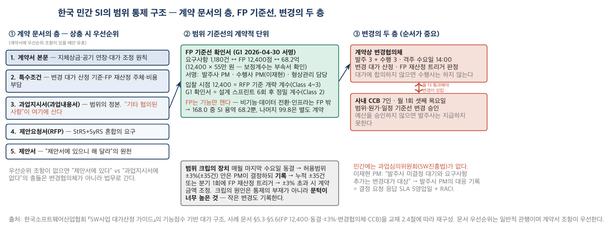

*그림 2-3. 한국 민간 SI의 범위 통제 구조 — 계약 문서 층과 우선순위, FP 기준선 확인서, 변경협의체와 CCB의 두 층. 계약 문서의 우선순위는 계약서에 조항이 있을 때만 유효하고, "기타 협의된 사항"은 과업지시서에 산다. FP 기준선 확인서는 요구사항 1,180건 ↔ 12,400점 ↔ 68.2억을 잇는 계약적 단위이며 FP는 기능만 잰다. 변경은 계약상 변경협의체(대가)와 사내 CCB(예산·기준선)의 두 층을 모두 통과해야 성립하고, 민간에는 과업심의위원회가 없다. SW사업 대가산정 가이드와 사례 문서 §5.3·§5.6을 바탕으로 재구성.*

### 실무에서 어떻게 틀리는가

"기타 협의된 사항"을 계약에 남기는 것, FP 기준선 확인서 없이 G1을 지나는 것, 보정계수를 모른 채 단가를 말하는 것, 비기능과 데이터 전환을 FP 안에 있다고 믿는 것, 공공의 과업심의위원회를 민간에서 언급하는 것, CCB와 변경협의체의 순서를 정하지 않는 것, 작은 변경을 기록하지 않아 ±35건 트리거가 작동하지 않는 것, 수행사의 대기 시간 기록에 대응하는 발주사의 결정 기록이 없는 것.

---

## 2.5 온담 P1 — 헌장 §5의 다섯 산출물이 WBS 레벨 2가 되고, 상위 요구 8개가 214건으로 분해되는 구조

> ■ **사례 사실** — 헌장 §5 산출물 5개(Day1 워크북 §2.5)와 사례 §3.2; 상위 요구 8개는 헌장 §4, StRS 214건·레벨 3 작업패키지 43개·L2 FP 배분은 [추가 설정] — Day2 워크북 §1.5·§2.5 예시본이 정본.

### WBS 레벨 1~2

헌장 §5 포함 범위의 다섯 산출물을 그대로 레벨 2로 두고, 100% 규칙이 요구하는 관리·횡단 인도물을 하나로 묶으면 P1의 WBS 레벨 2는 여섯이 된다 [추가 설정 — 구조·코드·원가 배분은 워크북 §1 완성 예시본을 따른다. 레벨 3 작업패키지는 43개(8 + 5 + 5 + 4 + 10 + 11)].

| 코드 | 레벨 2 요소 | 헌장 원천 | 성격 | FP / 원가(억) | 주요 인수자 |
|---|---|---|---|---:|---|
| 1.1 | POS·매장 운영 시스템 | §5 포함 (1), §6 | 전문 산출물 (WP 8) | 3,100 / 25.65 | 오정근(현업), 박세연(기술) |
| 1.2 | 주문 허브 | §5 포함 (2), §6 | 전문 산출물 (WP 5) | 2,900 / 15.95 | 오정근 |
| 1.3 | 통합 재고 관리 | §5 포함 (3), §6 | 전문 산출물 (WP 5) | 2,300 / 12.65 | 한동석, 박세연 |
| 1.4 | 가맹 발주 포털 | §5 포함 (4), §6 | 전문 산출물 (WP 4, 선행 릴리스) | 1,500 / 8.25 | 오정근, 서정필(사용자 검수) |
| 1.5 | 통합 계층·데이터 전환·공통 기반 | §5 포함 (5), §6 (인터페이스 설계문서 47본 포함), 인프라·상용SW | 전문 산출물 (WP 10) | 2,600 / 64.00 | 박세연 |
| 1.6 | 프로젝트 관리·통합 검증 | §6 (통합·성능시험, 보안진단, UAT, 감리, 컷오버, 소스·형상 인수, 운영 이관 기술 문서), PMO 9.6억 | 관리·횡단 산출물 (WP 11) | — / 19.30 | 박세연, 박준영, 정미란 |
| **합계** | | | | **12,400 / 145.80** | |

두 가지 결정을 설명한다. **인프라(클라우드·DR·망분리)를 별도 레벨 2로 빼지 않고 1.5 안에 둔 것.** 헌장 §5는 포함 산출물을 다섯으로 정했고, WBS 레벨 2를 헌장과 다르게 만들면 헌장·범위 기술서·WBS·FP 기준선이 서로 다른 상위 구조를 갖는다. 인프라는 API GW·MDM·SAP 애드온과 같은 층 — 다섯 산출물이 공유하는 기반 — 이므로 ⑤에 넣는 것이 100% 규칙에도 맞다. 그 대신 1.5가 64.0억으로 전체의 44%가 된다. 이것은 문제가 아니라 사실이다 — P1 원가의 절반 가까이가 특정 화면이 아니라 통합·데이터·기반에 들어간다는 것을 스폰서가 WBS에서 보아야, 옴니채널 화면 몇 개를 빼도 원가가 크게 줄지 않는 이유를 설명할 수 있다. **통합시험·성능·보안진단·감리·컷오버를 1.6 프로젝트 관리·통합 검증에 모은 것**은 산출물 지향 원칙의 예외처럼 보인다. 그러나 통합·성능시험(9.7억), 데이터 전환 리허설 3회, UAT, 컷오버 주말은 다섯 산출물을 가로지르는 인도물 — "검증된 플랫폼", "전환된 데이터", "컷오버 결과" — 을 만들며, 별도 계약(부하시험·보안진단·감리)과 별도 게이트(G3)를 갖는다. 이것을 1.1~1.5에 분산하면 G3 준비의 소유자가 사라진다. 같은 자리에 100% 규칙이 요구하는 관리 산출물 — PMO 3명(9.6억), 형상관리, 게이트 패키지, 보고, 그리고 2023년 감사 지적에 대한 답인 소스·형상 인수(1.6.10) — 를 둔다. 발주사 담당 작업패키지가 43개 중 10개(단말 조달 1.1.5, 가맹 단말 조사 1.1.6, 협상 지원 자료 1.3.1, 인프라 조달 1.5.6, 마스터 정본 판정 1.5.8, 기준선·RTM·감리 1.6.1~1.6.3·1.6.8, 소스 인수 1.6.10)라는 사실도 WBS에서만 보인다 — 이것이 없으면 R-05(발주사 미결정 대기 → 변경대가)는 등록부에만 있고 일정에는 없다.

### 레벨 3과 경계 조건의 분리

레벨 3에서 경계 조건이 작업패키지와 그 인도물 목록으로 갈라지는 것을 1.3 통합 재고로 보자 [추가 설정 — 워크북 §1 항목 8].

| 코드 | 레벨 3 작업패키지 | 대표 산출물 | 담당 | 비고 |
|---|---|---|---|---|
| 1.3.1 | 재고 원장 모델·규격서 (P2·3PL 협상 지원 자료 포함) | 원장 모델, P2 인터페이스 규격(T0 2026-04-24 전 전달), 3PL 부하 산정서 | 발주 (박세연, 한동석 협의) + 수행 재고팀 | 경계 조건: 규격은 P1, 설비측 구현·시험은 P2 / 협상은 한동석, P1은 자료만 |
| 1.3.2 | 재고 원장 코어 모듈 | 매장·센터·공장 3개 재고원 단일 원장, 15분 반영 | 수행 재고팀 | 핵심. 1.1과 인터페이스 |
| 1.3.3 | 3PL WMS 준실시간 API·폴백 | 연동 명세서, P1측 API, 야간 배치 2회 폴백, 자동 전환 | 수행 인터페이스팀 (협상: 한동석) | 경계 조건: 명세는 P1이 쓰고 API는 P1이 구현한다. 폴백이 R-03 완화 — 협상 결렬 시 인수 기준 |
| 1.3.4 | P2 설비 인터페이스 P1측 수신 구현·시험 | 수신 모듈, 통합시험 결과(MC 후) | 수행 인터페이스팀 (설비측: P2) | 시험 2027-02-12~18 (일정의 A15) |
| 1.3.5 | 공장 출하 재고 연동 (별도 법인) | 온담푸드시스템 연동 2본 | 수행 인터페이스팀 (계약: 최영주·조성태) | 계약·개인정보 주체 분리(R-09) |

1.3.1·1.3.3·1.3.4가 헌장의 한 문장("연동 명세를 작성하고 P1측 API를 구현하되 협상은 물류본부 소관")과 경계 조건을 세 작업패키지로 나눈 것이다. 1.3.1 안의 "3PL 부하 산정서"와 "P2 인터페이스 규격"이 중요하다 — 협상과 설비 구현은 P1 범위 밖이지만 협상·발주에 필요한 자료를 만드는 것은 P1 범위 안이며, 그것을 WBS에 적지 않으면 한동석 본부장은 "P1이 자료를 안 줘서 협상을 못 했다"고, P2는 "규격을 못 받아 설비 사양에 반영하지 못했다"고 말할 수 있다. 1.3.3의 WBS 사전 카드(워크북 §1 항목 10)는 협상이 실패해도 인도할 수 있는 것(④ 폴백 ⑤ 자동 전환)과 없는 것(③ 준실시간 API 가동)을 미리 갈라 둔다 — 검수 분쟁을 계획 단계에서 없애는 방법이다.

Day1 R-01의 완화 조치 "컷오버를 매장·주문 1차 / 물류 2차로 분리 가능한 설계"도 WBS에 나타난다. 1.3.2 재고 원장이 센터 재고를 야간 배치(1.3.3의 폴백)로 받는 상태로 컷오버 가능해야 하고, P2 인터페이스 수신·시험(1.3.4)과 컷오버 계획·실행(1.6.9, "매장·주문 / 물류 분리 옵션")을 분리해 둠으로써 구조에 반영한다. WBS가 리스크 대응의 형태를 결정한다는 것이 이 예다.

### 상위 요구 8개 → StRS 214건

헌장 §4의 8개 상위 요구는 StRS 214건의 상위 노드다. 배분의 형태를 예시로 놓는다 [추가 설정 — 건수는 이 교재가 정한 예시이며 워크북에서 스스로 배분한다].

| 상위 요구 (헌장 §4) | 요구 제공자 | StRS 건수 | 성격 | 주요 WBS |
|---|---|---:|---|---|
| 1. 단일 재고 원장, 준실시간 15분 | 박세연, 한동석 | 31 | 기능 | 1.3 |
| 2. 전 채널 단일 주문 원장, 매장 간 이동·픽업 | 오정근 | 46 | 기능 | 1.2 |
| 3. 가맹 포털 한 화면 (발주·마감·출고·배송) | 서정필, 오정근 | 38 | 기능 | 1.4 |
| 4. 성수기 배포 창 설계 | 오정근 | 9 | 비기능·운영 | 1.1.8, 1.6.9 |
| 5. 가용성 99.5%, 롤백 절차 | 박준영 | 22 | 비기능 | 1.5, 1.1.8, 1.6 |
| 6. 개인정보 142개·위탁 19·재위탁 4, 망분리·전자금융 | 최영주 | 27 | 비기능·규제 | 1.5, 1.3.5, 1.6.6 |
| 7. IT본부 47명 자체 운영 아키텍처와 문서 47본 | 박세연 | 24 | 비기능 | 1.5, 1.6.10 |
| 8. SAP ECC 연동의 마이그레이션 고려 구조 | 박세연 | 17 | 비기능 | 1.5.4 |
| **합계** | | **214** | 기능 115 / 비기능 99 | |

이 표가 보여 주는 것은 두 가지다. 첫째, **StRS의 거의 절반이 비기능**이다. FP 12,400점은 기능 115건이 분해된 SyRS·SRS를 주로 재고, 비기능 99건은 별도 계약(인프라, 보안진단, 감리)과 아키텍처 결정에 걸쳐 있다. 범위 기준선에서 FP만 보면 절반이 안 보인다. 둘째, **요구 제공자가 곧 인수자다.** 상위 요구 3의 제공자 서정필은 1.4의 사용자 검수 참여자이고, 상위 요구 5의 제공자 박준영은 SAC 판정권자다. RTM의 출처 열이 실명이어야 하는 이유는 G3·G4에서 그 사람이 서명하기 때문이다.

214건이 SyRS 396건, SRS 570건으로 분해되는 비율(1 : 1.85 : 2.66)은 온담 정본의 값이며, 설계 스프린트 6회의 산출물이 이 분해다. G1의 FP 기준선 확인서는 SRS 570건(과 그것이 참조하는 SyRS)을 계수한 결과가 12,400점과 ±3% 안에서 맞는지를 확인하는 문서다.

WBS 레벨 1~2와 1.3의 레벨 3을 그림 2-4에 그렸다.

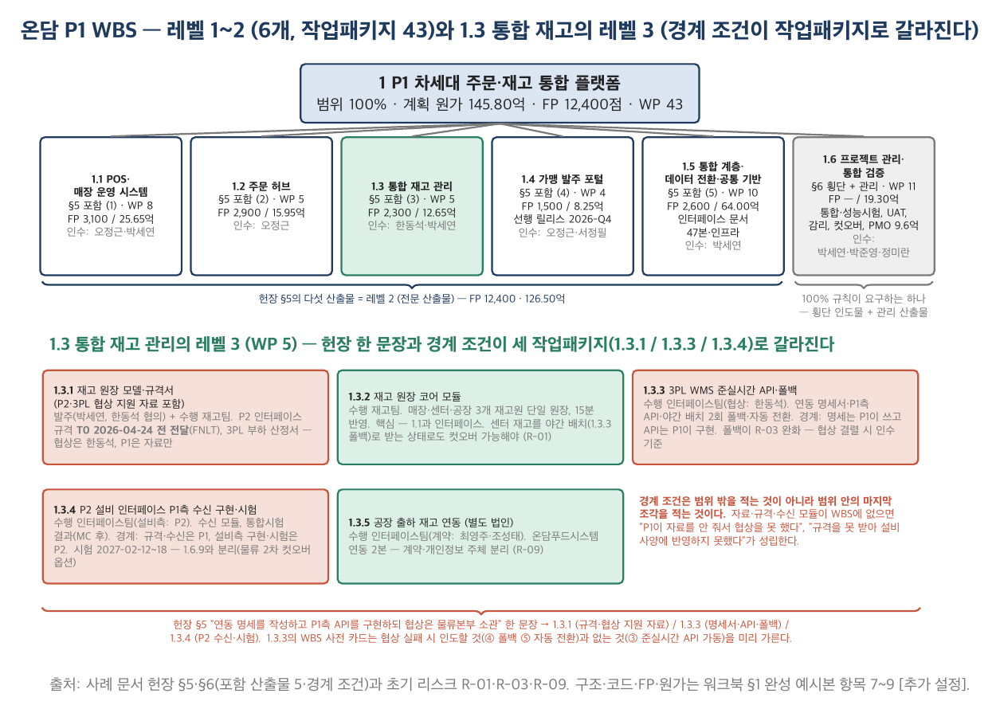

*그림 2-4. 온담 P1 WBS — 레벨 1~2 (6개)와 1.3 통합 재고의 레벨 3, 경계 조건이 작업패키지로 갈라지는 모습. 헌장 §5의 다섯 산출물이 레벨 2의 전문 산출물(1.1~1.5, FP 12,400·126.5억)이 되고, 100% 규칙이 1.6 프로젝트 관리·통합 검증(횡단 인도물 + 관리 산출물, 19.3억)을 요구한다. 아래는 헌장의 한 문장("연동 명세를 작성하고 P1측 API를 구현하되 협상은 물류본부 소관")과 경계 조건이 1.3.1(규격·협상 지원 자료) / 1.3.3(명세서·API·폴백) / 1.3.4(P2 수신·시험) 세 작업패키지로 갈라지는 모습이며, 1.3.1의 P2 인터페이스 규격은 T0(2026-04-24) 전에 P2에 넘겨야 하는 가장 이른 외부 인도물이다. 워크북 §1 완성 예시본의 구조·코드 [추가 설정].*

### 워크북에서 여러분이 결정할 것

WBS 레벨 2를 헌장의 다섯 + 관리·통합 검증 하나로 할지 검증·전환을 별도 레벨 2로 뺄지, 인프라를 1.5 안에 둘지 밖으로 뺄지, 214건을 8개 상위 요구에 어떻게 배분할지, Must의 비율을 얼마로 제한할지, 가맹 포털 선행 릴리스에 어느 StRS가 들어가는지 — 이것들은 정답이 있는 문제가 아니라 **근거를 적어야 하는 결정**이다. 워크북 §1·§2의 완성 예시본은 하나의 답이고, 여러분의 답이 예시와 다르다면 그 차이의 이유가 곧 학습이다.

---

## 제2장 핵심 정리

> **한 줄씩 — 수업 직전 5분 복습용**
> 1. 범위 기술서의 핵심은 인수 기준(측정 가능·판정자 실명)과 담당이 붙은 제외 항목이다.
> 2. WBS 규칙 — 100%, 산출물 지향, 8/80(P1에선 스프린트 하나), 코드 체계, 그리고 WBS 사전.
> 3. 요구는 StRS → SyRS → SRS 세 층이고, RTM은 요구의 내용이 아니라 행방(누가 → 설계 → 시험 → 검수)이다.
> 4. 범위 팽창의 세 경로 — 크립·gold plating·"기타 협의된 사항" — 는 각각 다른 도구로 막는다.
> 5. 온담 P1의 WBS 레벨 2는 헌장의 다섯 산출물 + 프로젝트 관리·통합 검증, 작업패키지 43개다.
>
> 아래는 같은 내용의 자세한 판이다.

1. 범위 기술서는 헌장 §5의 계획 수준 상세화이며, 핵심 항목은 인수 기준(측정 가능, 판정자 실명)과 담당이 붙은 제외 항목이다. PMBOK 8판이 QC를 Scope에 넣었으므로 인수 기준은 범위 정의의 일부다. 온담 헌장의 경계 조건은 범위 기술서에서도 유지한다.
2. WBS의 규칙 — 100%(프로젝트 관리 포함), 산출물 지향, 8/80(보고 주기의 1~2배, P1에서는 스프린트 하나), 통제 계정과 작업패키지, 일정·원가·형상과 같은 뿌리의 코드 체계. WBS 사전이 RTM과 원가 기준선을 잇는다. PBS를 먼저 그리고 활동은 마지막에 붙인다.
3. 요구사항은 StRS→SyRS→SRS 세 층(29148)이며, 한국 SI의 요구사항정의서는 어느 층인지 불분명한 경우가 많다. RTM은 양방향(요구→시험, 시험→요구)이고 변경 영향 분석의 도구다. MoSCoW는 Must 비율 제한과 Won't 명시, Kano는 우선순위와 릴리스 순서의 근거. 비기능 요구는 FP에 없고 모든 층에 걸친다.
4. 범위 팽창의 세 경로 — 크립(문턱을 낮춰 기록), gold plating(RTM 역추적), "기타 협의된 사항"(계약에서 한정). 한국 SI의 범위 기준선은 FP이며, FP는 기능만 재고 보정계수가 있고 재산정은 분쟁의 씨앗이다. 계약 문서 우선순위는 계약서에 조항이 있을 때만 유효하다. 민간의 변경 대가 경로는 변경협의체 + CCB이며 공공의 과업심의위원회는 적용되지 않는다.
5. 온담 P1의 WBS 레벨 2는 헌장의 다섯 산출물(1.1~1.5) + 프로젝트 관리·통합 검증(1.6)의 여섯이고 작업패키지는 43개, L2 원가 합 145.80 = 계획 원가다. 경계 조건은 레벨 3에서 규격·협상 지원 자료(1.3.1) / 명세서·API·폴백(1.3.3) / P2 수신·시험(1.3.4)의 별도 작업패키지로 갈라진다. 상위 요구 8개 → StRS 214건의 절반이 비기능이며, 요구 제공자가 곧 인수자다.

## 생각해 볼 질문

1. 여러분 회사의 마지막 계약서에 "기타 협의된 사항"이 있었는가. 그 문장으로 무엇이 들어왔는가.
2. 통합 재고의 인수 기준을 "15분 이내"로만 쓰면 3PL 협상 결렬 시 무엇이 일어나는가. 조건부 인수 기준은 범위를 흐리는가, 지키는가.
3. 통합시험·감리·컷오버를 1.6 프로젝트 관리·통합 검증에 모으는 것은 산출물 지향 원칙에 어긋나는가. 1.1~1.5에 분산했을 때 G3의 소유자는 누구인가. 반대로 검증·전환을 별도 레벨 2로 빼면 무엇이 달라지는가.
4. StRS 214건 중 비기능 99건은 FP 12,400점의 어디에 있는가. 없다면 그것의 범위 기준선은 무엇인가.
5. Must를 60% 이하로 제한하는 규칙을 오정근 본부장에게 어떻게 설명할 것인가.

## 워크북 연결

이 장의 내용은 워크북 §1 "범위 기술서와 WBS(+WBS 사전)"와 §2 "요구사항 추적표 골격"에서 온담 P1에 적용한다. §1에서는 헌장 §5·§6을 받아 범위 기술서(인수 기준·담당 붙은 제외·검증 상태 갱신된 가정·경계 조건)를 쓰고, WBS 레벨 1~3(6 / 43)을 그리며, 레벨 2에 FP·원가를 배분하고(합 12,400 / 145.80), 우선순위 규칙(외부 의존·임계경로·발주 담당)에 걸리는 작업패키지 3개(1.3.3·1.5.8·1.1.6)에 WBS 사전 카드를 쓴다. §2에서는 헌장 §4의 8개 상위 요구를 StRS 214건에 배분하고, RTM 골격(14열)에 HR별 2~4건씩 StRS 샘플 25건을 예시로 채우며, MoSCoW와 릴리스 열을 헌장 §13과 O-02로 정당화한다. 심화 과제: 수행사가 제출했다고 가정한 활동 지향 WBS(분석/설계/개발/시험/이행)를 산출물 지향으로 재구성하고, 그 과정에서 발주사 통제 단위(데이터 전환 용역, 상용SW, 감리, PMO)가 어디에 들어가는지 확인한다.

---

# 제3장 일정

## 3.1 활동·순서·기간 — PDM 4종 의존, lead/lag, 유사·모수·3점 추정

### 활동 정의 — WBS에서 활동으로

일정 모델은 WBS의 작업패키지를 **활동(activity)**으로 분해하는 데서 시작한다. 작업패키지는 "무엇이 나오는가"이고 활동은 "그것을 만들기 위해 누가 무엇을 하는가"다. 활동은 동사로 적고, 하나의 활동은 하나의 담당과 하나의 기간을 갖는다. 활동의 크기는 2.2절의 8/80과 같은 원리 — 보고 주기 안에 시작과 끝이 보이는 크기 — 이며, P1에서는 스프린트 안에 끝나는 크기다.

여기서 하이브리드의 구분이 필요하다. 구현 스프린트 20회 동안의 활동은 스프린트 백로그이며, 각 스프린트 계획 회의에서 정의된다 — 착수 시점에 20회분의 활동을 미리 정의하는 것은 rolling wave 원칙에 어긋난다. 반면 **통합·전환 구간(G2 이후)**의 활동 — 전환 프로그램 최종화, 리허설 3회, UAT, 롤백 검증, 컷오버 절차 — 은 되돌릴 수 없는 결정(G3) 앞에 있고 외부 고정일(컷오버 창)에 묶여 있으므로 착수 시점에 활동 수준까지 정의해 CPM을 돌린다. 1.4절 대조표에서 SI의 일정 정밀도를 "활동 단위 CPM은 통합·전환 구간에서만"이라고 한 것이 이 뜻이다.

### 순서 — PDM 4종 의존과 lead/lag

선후행도형법(PDM, precedence diagramming method)의 의존 4종은 다음과 같다.

| 유형 | 의미 | 온담 P1의 예 |
|---|---|---|
| **FS** (finish-to-start) | 선행이 끝나야 후행이 시작 | 리허설 1회차 종료 → 결함 수정 시작 |
| **SS** (start-to-start) | 선행이 시작해야 후행이 시작 | UAT 시작 → UAT 결함 트리아지 시작 |
| **FF** (finish-to-finish) | 선행이 끝나야 후행이 끝남 | 전환 검증 6종 완료 → 리허설 3회차 보고서 완료 |
| **SF** (start-to-finish) | 선행이 시작해야 후행이 끝남 | 새 POS 가동 시작 → OD-POS 병행 운영 종료 (컷오버의 정의) |

FS가 관계의 90% 이상이어야 한다는 것이 DCMA 14-Point의 4번 항목이다(3.4절). SS·FF는 병행 작업을 표현하지만 남발하면 네트워크가 임계경로를 잃는다. SF는 거의 쓰지 않으며, 쓴다면 위의 예처럼 "옛것의 종료가 새것의 시작에 묶인다"는 전환 상황뿐이다.

**Lead**는 후행을 앞당기는 것(FS−5d: 선행이 끝나기 5일 전에 후행 시작), **lag**는 늦추는 것(FS+3d: 선행이 끝나고 3일 뒤 후행 시작)이다. Lag는 물리적 대기(콘크리트 양생, 벤더 회신 대기, 규제 심사 기간)를 표현할 때만 정당하고, lead는 사실상 fast tracking(3.4절)의 표현이다. DCMA는 lead 0%, lag ≤5%를 요구한다. 대기가 사실은 활동이라면(예: "대성로지스 서면 회신 대기 10일"은 lag가 아니라 "협상 라운드 1" 활동의 기간) 활동으로 적어야 소유자가 생긴다.

의존은 네 종류의 **근거**를 갖는다 — 필수(mandatory, 물리·논리적 필연: 정본 확정 후 전환 프로그램 최종화), 임의(discretionary, 관행이나 선호: 리허설을 3회 순차로), 외부(external: P2 MC 후 물류 인터페이스 시험), 내부(internal: 발주사 인력 가용성). 근거를 적어 두면 압축이 필요할 때 무엇을 풀 수 있는지(임의 의존)와 없는지(필수·외부)가 보인다.

네 가지 의존과 lead/lag, 의존의 근거를 온담의 예로 그림 3-1에 정리했다.

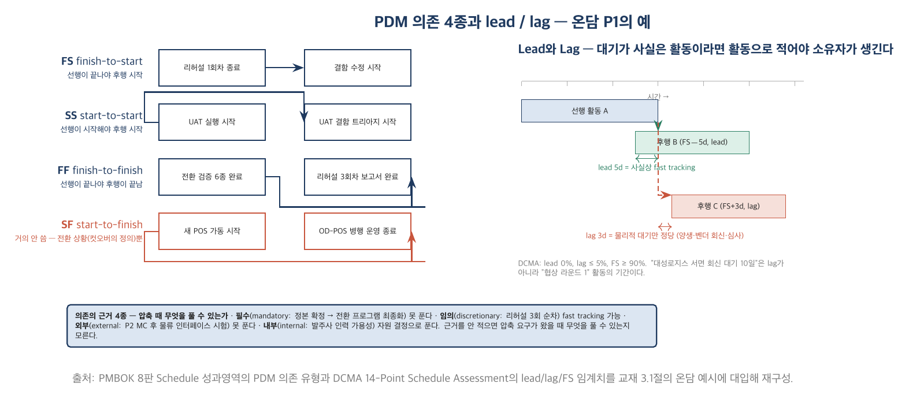

*그림 3-1. PDM 의존 4종(FS·SS·FF·SF)과 lead / lag — 온담 P1의 예와 의존의 근거 4종. FS가 관계의 90% 이상이어야 하고(DCMA 4번), SF는 "옛것의 종료가 새것의 시작에 묶이는" 전환 상황에서만 쓴다. Lead는 사실상 fast tracking이고 lag는 물리적 대기에만 정당하며, 대기가 사실은 활동이라면("대성로지스 서면 회신 대기 10일") 활동으로 적어야 소유자가 생긴다. 의존의 근거(필수·임의·외부·내부)를 적어 두어야 압축이 필요할 때 무엇을 풀 수 있는지 안다.*

### 기간 추정 — 유사·모수·3점

**유사 추정(analogous)**은 과거 유사 활동의 실적으로 추정한다. 빠르고 거칠다. 온담에는 2014년 SAP 도입의 데이터 전환 실적이 있을 것이고(사례 문서에 없으므로 워크북에서 가정한다), 그것이 1,842 테이블·7.4TB 전환의 유사 추정 출발점이다. Day1 1.2절의 reference class forecasting은 유사 추정을 통계적으로 정식화한 것이다.

**모수 추정(parametric)**은 단위당 생산성 × 수량이다. FP 12,400점 ÷ 팀 생산성(FP/인월)이 SI 용역의 기간·인력 추정이고, 테이블 1,842개 × 테이블당 매핑·검증 시간이 데이터 전환의 추정이다. 모수 추정의 함정은 생산성 계수가 어디서 왔는가다 — 업계 평균은 이 팀의 값이 아니고, 이 팀의 지난 프로젝트 값은 이 프로젝트의 값이 아니다. 설계 스프린트 6회 동안 실측한 팀 속도(velocity)가 G1 이후 구현 구간의 모수 추정에 쓰이는 것이 하이브리드의 정직한 방법이다.

**3점 추정(three-point)**은 낙관(O)·최빈(M)·비관(P) 세 값으로 기간의 분포를 표현한다. PERT 가중 평균 (O + 4M + P) / 6, 표준편차 (P − O) / 6이 관례이며, 삼각분포 (O + M + P) / 3도 쓴다. 3점 추정의 가치는 공식이 아니라 **비관값을 묻는 행위**에 있다 — "최악의 경우 얼마나 걸리는가"를 묻는 순간 담당자는 리스크를 말하기 시작하고, 그것이 제5장의 식별 입력이 된다. 함정은 두 가지다. 첫째, 비관값이 충분히 비관적이지 않다(6.1절 planning fallacy). 둘째, 활동별 3점 추정을 그대로 몬테카를로에 넣으면 활동 간 **상관(correlation)**을 무시해 P80이 심하게 과소평가된다(Hulett) — 3.4절에서 다룬다.

### 실무에서 어떻게 틀리는가

활동을 명사로 적어 산출물과 구분이 안 되는 것, 모든 관계를 FS로 억지로 만들거나 반대로 SS·FF를 남발하는 것, 대기를 lag로 숨겨 소유자를 없애는 것, 의존의 근거(필수·임의·외부·내부)를 적지 않아 압축 시 무엇을 풀 수 있는지 모르는 것, 생산성 계수의 출처를 모르는 것, 3점 추정에서 비관값을 최빈값 × 1.2로 기계적으로 만드는 것.

---

## 3.2 CPM — 전진·후진 계산, 총여유와 자유여유

### 개념

임계경로법(CPM, critical path method)은 활동 네트워크에서 **가장 긴 경로**를 찾고 각 활동의 여유를 계산하는 방법이다. 계산은 두 번 지나간다.

**전진 계산(forward pass)** — 시작에서 끝으로. 각 활동의 가장 이른 시작(ES)과 가장 이른 종료(EF = ES + 기간)를 구한다. 후행의 ES는 모든 선행의 EF 중 최대값(FS 기준).

**후진 계산(backward pass)** — 끝에서 시작으로. 각 활동의 가장 늦은 종료(LF)와 가장 늦은 시작(LS = LF − 기간)을 구한다. 선행의 LF는 모든 후행의 LS 중 최소값.

**총여유(total float, TF)** = LS − ES = LF − EF. 프로젝트 종료일을 늦추지 않고 그 활동이 늦어질 수 있는 양. TF = 0인 활동의 연쇄가 임계경로다.

**자유여유(free float, FF)** = 직후 후행의 ES − 이 활동의 EF. **바로 다음 활동**을 늦추지 않고 늦어질 수 있는 양. 자유여유는 총여유보다 작거나 같다.

두 여유의 차이가 실무에서 중요하다. 총여유는 경로의 것이고, 자유여유는 활동의 것이다. 어느 활동이 총여유 10일을 가졌다고 그것을 다 쓰면, 같은 경로의 뒤 활동들은 여유가 0이 된다 — 총여유는 **경로 위의 활동들이 공유하는 자원**이다. 이것이 3.3절 "float는 누구의 것인가"의 출발점이다.

### 온담 P1의 통합·전환 구간으로 계산해 보기

> ■ **사례 사실** — 고정 날짜 — G2 2026-11-27, G3 2027-02-19, 컷오버 02-26~28, P2 기계적 준공 2027-02-12(§3.4·§5.4·§3.5); 요약 활동 A13~A17의 기간·의존은 [추가 설정] — Day2 워크북 §3.5 항목 4·5 표가 정본.

G2(2026-11-27 데이터 전환 정본 판정) 앞의 마스터 정본 판정 종료(11-20)부터 G3(2027-02-19)·컷오버(02-26)까지의 네트워크를 놓는다 [추가 설정 — 워크북 §3 완성 예시본의 요약 활동 A13(리허설 1~3회차 45일)·A14(통합시험 30일)·A15(P2 인터페이스 시험 5일)·A16(UAT·컷오버 리허설·롤백 검증 24일)·MG3·A17을 손으로 계산할 수 있는 크기로 쪼갠 것이다. 영업일 기준이며 2027-01-01 휴일과 설 연휴(2027-02-07 전후)는 워크북과 같이 단순화를 위해 무시했다. 날짜·기간·여유는 워크북 §3 항목 5 CPM 계산표와 같다].

| ID | 활동 (워크북 활동) | 기간(영업일) | 선행 | ES | EF | LS | LF | TF |
|---|---|---:|---|---|---|---|---|---:|
| A | 마스터 6종 정본 판정 종료 → G2 11-27 (A11, FNLT) | 0 | — | 11-20 | 11-20 | 11-27 | 11-27 | 5 |
| B | 전환 프로그램 최종화 (A13) | 10 | A | 11-23 | 12-04 | 11-30 | 12-11 | 5 |
| C | 리허설 1회차 (A13) | 5 | B | 12-07 | 12-11 | 12-14 | 12-18 | 5 |
| D | 결함 수정·재매핑 1 (A13) | 10 | C | 12-14 | 12-25 | 12-21 | 01-01 | 5 |
| E | 리허설 2회차 (A13) | 5 | D | 12-28 | 01-01 | 01-04 | 01-08 | 5 |
| F | 결함 수정 2 (A13) | 5 | E | 01-04 | 01-08 | 01-11 | 01-15 | 5 |
| G | 리허설 3회차 (전환 검증 6종) (A13, **FNLT 01-29**) | 10 | F | 01-11 | 01-22 | 01-18 | 01-29 | 5 |
| H | 통합시험·성능·보안진단 (A14) | 30 | 구현 R3 종료 12-04 | 12-07 | 01-15 | 12-07 | 01-15 | **0** |
| I | UAT 실행 (A16) | 14 | H | 01-18 | 02-04 | 01-18 | 02-04 | **0** |
| J | UAT 결함 수정·재시험 (A16) | 5 | I | 02-05 | 02-11 | 02-05 | 02-11 | **0** |
| K | 롤백 절차 검증·G3 게이트 패키지 (A16) | 5 | J | 02-12 | 02-18 | 02-12 | 02-18 | **0** |
| L | P2 기계적 준공 MC (외부 마일스톤, **SNET 02-12**) | 0 | 외부 | 02-12 | 02-12 | 02-12 | 02-12 | **0** |
| M | 물류 인터페이스 통합시험 (A15) | 5 | L, H | 02-12 | 02-18 | 02-12 | 02-18 | **0** |
| N | G3 컷오버 승인 (MG3, **FNLT 02-19**) | 0 | K, M, G | 02-19 | 02-19 | 02-19 | 02-19 | **0** |
| O | 컷오버 창 대기 — 배포 패키지 확정·매장 통보 | 4 | N | 02-22 | 02-25 | 02-22 | 02-25 | 제약 사이 간격 |
| P | 컷오버 주말 (A17, **SNET 02-26**, 34시간) | 1 | O | 02-26 | 02-28 | 02-26 | 02-28 | **0** |

정본의 "리허설 3회차 2027-01-29"와 이 표의 G(01-11~01-22)가 다른 것은 의도적이다 — 이 표는 리허설 사슬을 가장 이른 일정으로 놓은 것이고, 정본의 01-29는 그 사슬의 **완료 기한(FNLT)**이다. 논리만 보면 G의 LF는 N의 02-19에서 역산되어 총여유가 19일 나오지만, 리허설 3회차가 01-29를 넘기면 G3 no-go 조건이므로 LF를 01-29로 눌러야 하고 그러면 사슬 전체의 총여유는 5일이 된다. 워크북 §3은 이것을 "제약이 만든 여유"라 부르고 데이터 경로(A02→A09→A11→A13)의 근접 임계 TF 5로 적는다.

이 계산이 말하는 것 세 가지.

**임계경로는 통합시험·UAT 사슬(H → I → J → K → N)과 P2 사슬(L → M → N)이다.** 리허설 사슬(A~G)은 총여유 5영업일을 가진다. 그런데 이 여유는 세 가지 조건 위에 있다. 마스터 정본 판정이 11-20에 끝나 G2가 11-27에 열린다는 것(R-10 — 정본 후 마스터 변경이 있으면 610 테이블 재매핑 6주(30영업일)가 이 사슬에 들어와 여유 5일을 넘어 즉시 임계가 된다). 통합시험이 01-15에 끝나 UAT가 01-18에 시작할 수 있다는 것(구현 R3가 12-04에 끝나야 한다). P2 MC가 02-12에 온다는 것(R-01 — 41주면 MC는 2027-04-02 [추가 설정: 납품 02-05 + 설치·시운전 8주]이고 M은 G3 뒤로 간다).

**G3에서 컷오버까지는 4영업일의 간격뿐이고, 그것은 여유가 아니다.** N(02-19) → O(02-22~25) → P(02-26). N에는 FNLT 02-19가, P에는 SNET 02-26이 걸려 있으므로 그 사이 4일은 "G3가 늦어도 되는 날"이 아니라 "G3 승인 뒤 615개 매장에 통보하고 패키지를 확정하는 날"이다 — 여유는 소비할 수 있고 간격은 소비하면 컷오버 준비가 없어진다. 그 뒤에 프로그램의 합류 버퍼 15영업일(02-19 → 03-12)이 있지만, 그것은 P1의 것이 아니라 프로그램의 것이다(3.3절). 컷오버 창을 놓치면 2차 창은 3월 중순 주말이고, 그것도 놓치면 2027년 하반기다.

**P2 사슬이 임계경로에 있다는 것은 P1 PM이 통제하지 못하는 활동이 P1의 임계경로를 결정한다는 뜻이다.** MC 02-12(금)에서 G3 02-19(금)까지 영업일은 정확히 5일이고, M의 여유 0은 논리가 아니라 SNET(외부 날짜)이 만든 0이다 — P2 MC가 하루 늦으면 G3가 하루 늦는다. R-01의 완화 조치(물류 분리 컷오버 설계)는 이 사슬을 임계경로에서 떼어 내는 것 — M을 N의 선행에서 제거하고 "물류 2차 컷오버" 활동(WBS 1.6.9의 분리 옵션)을 별도 경로로 두는 것 — 이며, 그 결정은 프로그램 이사회가 G1까지 내려야 한다.

이 계산표를 네트워크로 그리면 그림 3-2와 같다.

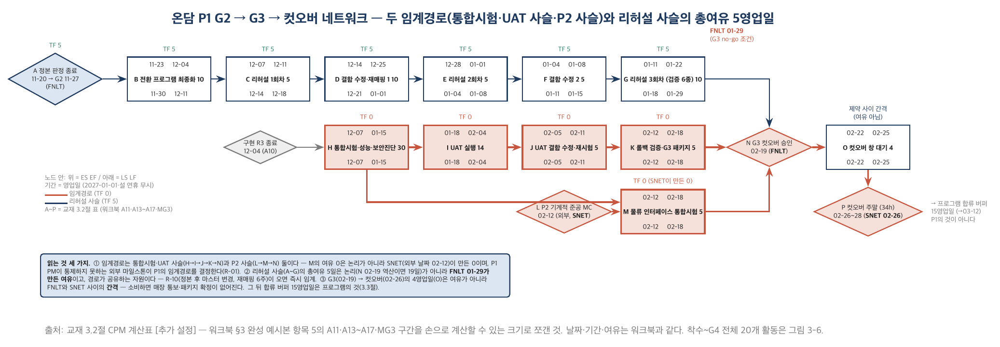

*그림 3-2. 온담 P1 G2 → G3 → 컷오버 네트워크 — 두 임계경로(통합시험·UAT 사슬·P2 사슬)와 리허설 사슬의 총여유 5영업일(FNLT 01-29가 만든 여유). 노드 안의 위 줄이 ES·EF, 아래 줄이 LS·LF이며 붉은 상자가 총여유 0의 임계경로다. 임계경로는 통합시험·UAT 사슬(H→I→J→K→N)과 P2 사슬(L→M→N) 둘이고, 리허설 사슬(A~G)의 총여유 5영업일은 경로가 공유하는 자원이자 리허설 3회차 완료 기한 01-29가 만든 여유다. G3(02-19)에서 컷오버(02-26)까지의 4영업일은 여유가 아니라 제약 사이의 간격이며 그 뒤의 합류 버퍼 15영업일은 프로그램의 것이다. 워크북 §3 완성 예시본의 A13~A17 구간을 교재 3.2절 계산표로 쪼갠 것 [추가 설정]. 워크북 §3은 착수~G4 전체를 20개 활동으로 요약한다(그림 3-6).*

### 실무에서 어떻게 틀리는가

CPM을 도구가 계산해 주는 것으로만 알고 손으로 한 번도 안 해 본 것 — 그러면 도구가 왜 그 경로를 임계라고 하는지 설명하지 못한다. 총여유와 자유여유를 구분하지 않는 것. 임계경로가 하나라고 믿는 것(P1은 둘이고, 근접 임계경로 — 여유 5일 이하, 리허설·데이터 경로 — 를 포함하면 셋이다). 외부 마일스톤(P2 MC)을 네트워크에 넣지 않아 그것이 임계경로에 있다는 사실을 모르는 것. 그리고 여유를 "남는 시간"으로 이해해 첫 활동이 다 써 버리는 것.

---

## 3.3 float는 누구의 것인가 — SCL Protocol과 계약 문안 (심화)

### 문제

리허설 사슬의 총여유 5영업일(3.2절 — FNLT 01-29가 만든 여유, 논리만 보면 19일)은 누구의 것인가. 수행사 이재현 PM은 "우리 일정에 여유가 있으니 인력을 다른 사업에 잠시 돌리겠다"고 할 수 있다. 발주사 PM은 "그 여유는 발주사 미결정 대기를 흡수하기 위한 것이니 건드리지 말라"고 할 수 있다. 프로그램 PMO장은 "P2가 늦으면 그 여유를 P2에 준다"고 할 수 있다. 셋 다 정당해 보이고, 그래서 여유는 분쟁의 원천이다.

이 질문이 실무에서 결정적인 이유는 **지연 클레임** 때문이다. 발주사 사유로 3일이 늦어졌는데 그 활동에 여유 5일이 있었다면 프로젝트는 늦지 않았다. 그러면 수행사는 공기 연장(EOT)을 청구할 수 있는가. 여유가 수행사 것이면 "우리 여유를 발주사가 썼으니 보상하라"가 되고, 프로젝트 것이면 "늦지 않았으니 청구 없음"이 된다. 건설에서 이것은 수십 년 된 쟁점이고, 답이 판례와 프로토콜로 정리되어 있다.

### SCL Delay and Disruption Protocol 2판

영국 Society of Construction Law의 Delay and Disruption Protocol 2판(2017)은 지연 분석의 사실상 표준 참조 문서다. Core Principle 8이 float에 관해 말한다 — **별도의 계약 약정이 없으면, float는 프로젝트의 공용 자원이며 먼저 쓰는 쪽이 쓴다**("first come, first served"). 즉 발주사 사유로 여유가 소진되어도 프로젝트 종료일이 늦어지지 않는 한 시공자는 EOT를 받지 못하고, 그 뒤 시공자 사유로 늦어지면 여유가 없으므로 시공자 책임이 된다. 이것이 공정해 보이지 않는다면 그것이 바로 **계약 문안으로 달리 정할 이유**다. 프로토콜은 계약에 float 소유권 조항을 명시적으로 넣기를 권한다.

프로토콜 2판이 정리한 다른 두 가지도 알아 두라. 첫째, 지연 분석 방법 6종(Impacted As-Planned / Time Impact Analysis / Time Slice Windows / As-Planned vs As-Built Windows / Retrospective Longest Path / Collapsed As-Built)을 공식 명명하고, 1판의 TIA 단일 선호를 폐기해 "기록과 사실관계에 따라 선택"하도록 했다. 둘째, **동시 지연(concurrent delay)**을 좁게 정의했다 — 발주사 사유와 시공자 사유가 같은 시기에 발생하고 효과도 같은 시기에 나타나는 "진정한 동시성"만. 온담에서 "P2도 늦고 P1도 늦었다"는 상황이 오면 이 정의가 프로그램 계층의 판단 근거가 된다. AACE RP 29R-03(Forensic Schedule Analysis)은 같은 문제를 9개 방법(MIP)으로 분류한 미국 쪽 참조다.

### 한국 SI 계약에서의 함의

SI 계약서에는 float 조항이 거의 없다. 대신 "발주사 사유의 지연은 공기 연장 사유이고, 그 밖의 지연은 지체상금 대상"이라는 이분법이 있다. 이 이분법은 여유의 존재를 무시하므로, 실제 분쟁에서는 "발주사가 3일 늦게 결정했는데 그 활동에 여유가 있었으니 지연이 아니다"와 "여유가 있었는데 발주사가 써 버려서 우리 활동이 임계가 되었다"가 충돌한다. 발주사 PM이 할 수 있는 일은 셋이다.

**여유의 위치를 기준선에서 명시한다.** 일정 기준선을 서명할 때 각 경로의 총여유가 얼마이고 어느 리스크를 흡수하기 위한 것인지를 문서로 남긴다. "데이터 경로(A11→G2, A13→리허설 3회차)의 여유 각 5영업일은 P1 PM의 것이며 R-10(정본 후 마스터 변경)과 발주사 데이터 정제 지연을 흡수하기 위한 것"처럼(워크북 §3 항목 6의 버퍼 표).

**버퍼와 여유를 구분한다.** 여유(float)는 네트워크 계산의 결과이고, 버퍼(buffer)는 의도적으로 넣은 시간이다. 프로그램 합류 버퍼 15영업일과 P4 규제 버퍼 22영업일은 버퍼이며, 소유자가 명시되어 있다(프로그램, P4). 3.4절의 크리티컬 체인은 여유를 걷어 버퍼로 모으는 방법이다.

**계약 변경 시 float 조항을 넣는다.** 변경협의체에서 대가를 다룰 때 "이 변경은 여유 N일을 소진하며, 소진 후의 지연은 어느 쪽 사유로 보는가"를 함께 합의한다. 계약 본문을 바꿀 수 없어도 변경협의체 의결서에 그 문장이 있으면 다음 분쟁의 근거가 된다.

세 입장과 SCL Protocol의 답, 그리고 여유와 버퍼의 구분을 그림 3-3에 정리했다.

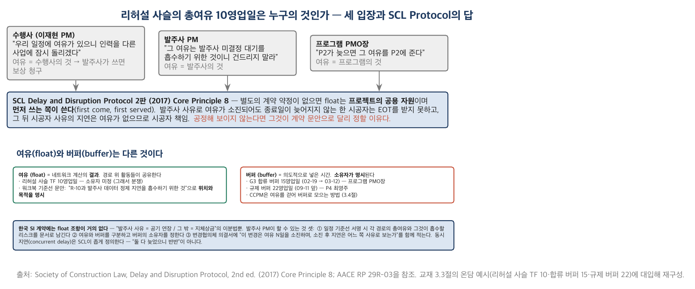

*그림 3-3. float는 누구의 것인가 — 세 입장, SCL Protocol 2판 Core Principle 8, 여유와 버퍼의 구분. 수행사·발주사·프로그램의 세 주장은 각각 정당해 보이고, 별도 약정이 없으면 SCL의 답은 "프로젝트의 공용 자원, 선착순"이다. 그것이 계약 문안으로 달리 정할 이유다. 여유(float)는 네트워크 계산의 결과이고 버퍼(buffer)는 소유자가 명시된 의도적 시간이다 — G3 합류 버퍼 15영업일(프로그램 PMO장), 규제 버퍼 22영업일(P4). SCL Delay and Disruption Protocol 2nd ed. (2017)을 바탕으로 재구성.*

### 실무에서 어떻게 틀리는가

여유를 "남는 시간"으로 알고 첫 활동에서 쓰는 것, 여유와 버퍼를 같은 말로 쓰는 것, 계약에 float 조항이 없다는 것을 모르고 분쟁에 들어가는 것, 동시 지연을 "둘 다 늦었으니 반반"으로 처리하는 것(SCL의 정의는 훨씬 좁다), 지연 분석 방법을 하나만 알고 그것이 표준이라고 믿는 것.

---

## 3.4 크리티컬 체인, 일정 압축, DCMA 14-Point, 몬테카를로와 P50/P80, 제약 일자 (심화)

### 크리티컬 체인 — Goldratt의 처방

Goldratt(1997)의 크리티컬 체인(CCPM)은 두 관찰에서 출발한다. 첫째, 담당자는 활동 기간에 안전여유를 넣는다(대개 50% 확률 추정의 두 배 가까이). 둘째, 그 안전여유는 학생 증후군(마감 직전에 시작), 파킨슨 법칙(주어진 시간을 다 쓴다), 병합 편향(merge bias — 여러 선행이 합류하면 가장 늦은 것이 결정하므로 일찍 끝난 활동의 이득은 사라지고 늦은 활동의 손실만 전파된다) 때문에 낭비된다. 처방은 활동별 안전여유를 걷어 50% 추정으로 계획하고, 걷은 여유를 **프로젝트 버퍼**(임계 체인 끝)와 **피딩 버퍼**(비임계 경로가 임계 체인에 합류하는 지점)로 모아, 버퍼 소진율로 프로젝트를 관리하는 것이다. 임계 체인은 자원 제약을 반영한 임계경로다.

CCPM이 온담 P1에 주는 것은 방법론 전체가 아니라 두 개념이다. **병합 편향**은 G3에 여섯 경로가 합류한다는 사실이 왜 위험한지를 설명한다 — 여섯 경로 각각이 P50이면 여섯이 모두 제때 올 확률은 훨씬 낮다. 프로그램이 G3 뒤에 합류 버퍼 15영업일을 둔 것이 피딩 버퍼의 논리다. **버퍼 소진율 관리**는 "이 활동이 며칠 늦었다"가 아니라 "버퍼의 몇 %를 썼는가, 진척 대비 소진이 빠른가"로 보는 것이며, Day3의 성과 보고에 이 지표를 넣을 수 있다.

CCPM이 SI·EPC에서 방법론으로 실패하는 이유는 리딩리스트가 정확히 짚었다 — **하도급·용역 계약이 활동 단위 기한으로 묶여 있어 여유를 회수할 법적 근거가 없다.** 이재현 PM에게 "리허설 기간에서 안전여유를 걷어 프로젝트 버퍼로 넘기라"고 할 수 있는 계약 조항은 없다. 6.3절에서 Raz 등의 학술적 비판을 다룬다.

### 일정 압축 — crashing과 fast tracking의 한계

압축 요구는 반드시 온다. 대표이사는 "가능하면 더 앞당기라"고 했다. 두 방법이 있다.

**Crashing**은 자원을 더 넣어 임계경로 활동의 기간을 줄이는 것이다. 한계는 셋이다. 비용이 든다(그리고 압축 비용은 선형이 아니다 — 첫 하루는 싸고 마지막 하루는 비싸다). 어떤 활동은 자원을 더 넣어도 줄지 않는다(Brooks의 법칙 — 늦은 소프트웨어 프로젝트에 인력을 더하면 더 늦어진다. 의사소통 경로가 n(n−1)/2로 늘기 때문이다. 82명이면 3,321개다). 그리고 고정가 계약에서 crashing은 수행사 원가이므로 변경 대가다.

**Fast tracking**은 순차 활동을 병행하는 것이다. 비용은 안 들지만 **재작업 리스크**가 든다. 설계가 끝나기 전에 구현을 시작하면 설계 변경이 구현을 다시 하게 한다. Williams(2002)의 시스템 다이내믹스 모델이 보인 악순환 — 압축 → 병행 증가 → 재작업 → 추가 압축 — 이 이것이다. Fast tracking은 임의 의존(3.1절)에서만 가능하고 필수 의존에서는 불가능하며, 그래서 의존의 근거를 적어 두어야 한다.

P1에서 압축 가능한 것과 불가능한 것을 나누면, 리허설 3회를 2회로 줄이는 것은 가능하지만 R-10의 완화(정본 후 변경 탐지)를 약화시키고, UAT 실행 14일을 10일로 줄이는 것은 결함밀도 0.4건/FP 기준을 위협하며, P2 MC와 규제 기한은 압축 불가다. 압축의 정직한 답은 대개 "범위"다 — 헌장 §13이 이미 그렇게 정했다.

### DCMA 14-Point — 일정의 위생

미국 국방계약관리국(DCMA)의 14-Point Schedule Assessment는 일정 모델의 **구조적 건전성**을 점검하는 지표 14개다. 지표 자체보다 이것이 "float 은닉 탐지 도구"라는 점이 강의 가치다(리딩리스트 서가 2).

| # | 지표 | 임계치 | 무엇을 잡는가 |
|---|---|---|---|
| 1 | Logic — 선행·후행이 없는 활동 | ≤ 5% | 논리 없는 간트 |
| 2 | Leads | 0% | 숨겨진 fast tracking |
| 3 | Lags | ≤ 5% | 활동을 대기로 숨김 |
| 4 | FS 관계 비율 | ≥ 90% | SS·FF 남발 |
| 5 | Hard constraints | ≤ 5% | 논리 대신 날짜 고정 |
| 6 | High float (TF > 44일) | ≤ 5% | 논리가 끊겨 여유가 부풀려진 활동 |
| 7 | Negative float | 0% | 제약 일자가 논리와 충돌 |
| 8 | High duration (> 44일) | ≤ 5% | 진척을 볼 수 없는 긴 활동 |
| 9 | Invalid dates (미래 실적, 과거 예정) | 0% | 갱신 안 된 일정 |
| 10 | Resources 미배정 | 0% | 원가와 연결 안 됨 |
| 11 | Missed tasks (기준선 대비 지연 완료) | ≤ 5% | 기준선 대비 성과 |
| 12 | Critical path test | 통과 | 임계경로 활동에 600일 주입 시 종료일이 정확히 600일 밀려야 |
| 13 | CPLI = (임계경로 길이 + 총여유) / 임계경로 길이 | ≥ 1.00 (목표 1.00) | 임계경로의 현실성 |
| 14 | BEI = 완료 활동 수 / 기준선 계획 완료 수 | ≥ 1.00 (목표 1.00) | 실행 효율 |

DCMA가 공식 문서로 현행 유지되는지는 확인되지 않았다(리딩리스트 [검증 필요]). 그러나 14개 임계치는 업계 관행으로 살아 있고, 대형 EPC·방산 발주처가 일정 제출 시 요구한다. SI에서는 5번(hard constraints)과 6번(high float)이 가장 자주 걸린다 — 임원이 말한 날짜를 제약으로 박고, 논리를 안 그려서 여유가 200일인 활동이 절반이다.

### 몬테카를로와 P50/P80

일정 리스크 분석은 활동 기간에 분포(3점 추정)를 주고 수천 번 시뮬레이션해 종료일의 분포를 얻는다. 결과는 확률로 말한다 — **P50**(50% 확률로 이 날 이전에 끝난다), **P80**. P50과 P80의 간격이 일정 리스크의 크기이고, 그 간격을 덮는 것이 일정 버퍼다.

세 가지 함정이 있다. 첫째, **상관 무시**. 활동들이 독립이라고 가정하면 큰 수의 법칙으로 분산이 줄어 P80이 P50에 붙는다 — 실제로는 같은 원인(발주사 인력 부족, 정본 지연)이 여러 활동을 동시에 늦추므로 꼬리가 훨씬 길다. Hulett의 처방은 활동별 분포가 아니라 **risk driver** 방식 — 리스크 하나를 여러 활동에 동시 매핑하고 발생 확률과 승수로 모델링 — 이다. R-06(OD-POS 지식 보유자)은 인터페이스 문서화, 데이터 매핑, 리허설 결함 수정에 동시에 걸린다. 둘째, **병합 편향**을 시뮬레이션이 잡아 주지만 입력이 독립이면 과소평가된다. 셋째, P80을 기준선으로 약속하는 것 — P80은 버퍼의 크기를 정하는 값이지 팀에 주는 목표가 아니다. 목표는 P50이고 버퍼가 P50~P80을 덮는다.

P1의 컷오버에 대해 시뮬레이션 결과가 예컨대 P50 = 2027-02-26, P80 = 2027-03-19라면 [추가 설정, 예시], 프로그램 버퍼 15영업일(03-12)은 약 P70 수준을 덮는 것이고, P80까지 덮으려면 버퍼가 5영업일 더 필요하거나 리스크(R-01, R-10)의 확률을 낮춰야 한다. 이 숫자를 스폰서에게 가져가는 것이 일정 리스크 분석의 목적이다.

### 제약 일자(constraint date)

제약 일자는 논리가 아니라 날짜로 활동을 고정하는 것이다. 종류는 "이 날 이후 시작(SNET)", "이 날 이전 종료(FNLT)", "반드시 이 날(MFO/MSO)" 등이다. 외부 고정일(규제 2026-09-11·2027-03-31, 컷오버 창)은 정당한 제약이고, 그것들은 FNLT 또는 MFO로 들어간다. 그러나 **하드 제약(MSO/MFO)이 5%를 넘으면 네트워크는 논리를 잃고**, 제약과 논리가 충돌하면 음의 여유(negative float)가 나온다. 음의 여유는 "이 경로는 논리대로 하면 제약을 못 지킨다"는 신호이며, 그것을 제약을 풀어 없애는 것이 아니라 리스크로 등록하고 압축 또는 범위 결정으로 가져가야 한다.

P1에서 외부가 정한 정당한 제약 일자는 다섯이다 — 컷오버 창(SNET 2027-02-26, A17), 규제 ①(FNLT 2026-09-11, A07 — 22영업일 규제 버퍼는 P4가 관리하므로 P1은 09-11에 맞추고 앞당겨 잡지 않는다), 규제 ②(FNLT 2027-01-29 전자금융업 신청서 제출, 리허설 3회차와 같은 날, A13), P2 T0(FNLT 2026-04-24, 1.3.1 인터페이스 규격 전달), P2 MC(SNET 2027-02-12, A15). G1·G2·G3·G4는 원칙적으로 제약이 아니라 논리의 결과여야 한다 — 게이트를 제약으로 박으면 게이트 앞의 활동이 음의 여유를 갖게 되고 그것이 "게이트 통과를 위한 문서 맞추기"로 이어진다. 워크북 §3 완성 예시본은 게이트 넷에도 FNLT를 걸어 여유를 게이트 기준으로 읽게 했고, 그 대가로 DCMA 5번(강제 제약 9/21 = 43%)이 미달로 표시된다 — 어느 쪽을 택하든 제약마다 출처를 적고 점검표에 그 결과를 숨기지 않는 것이 규칙이다.

상관을 무시한 분포와 반영한 분포의 차이를 그림 3-4에 개념 시뮬레이션으로 놓았다.

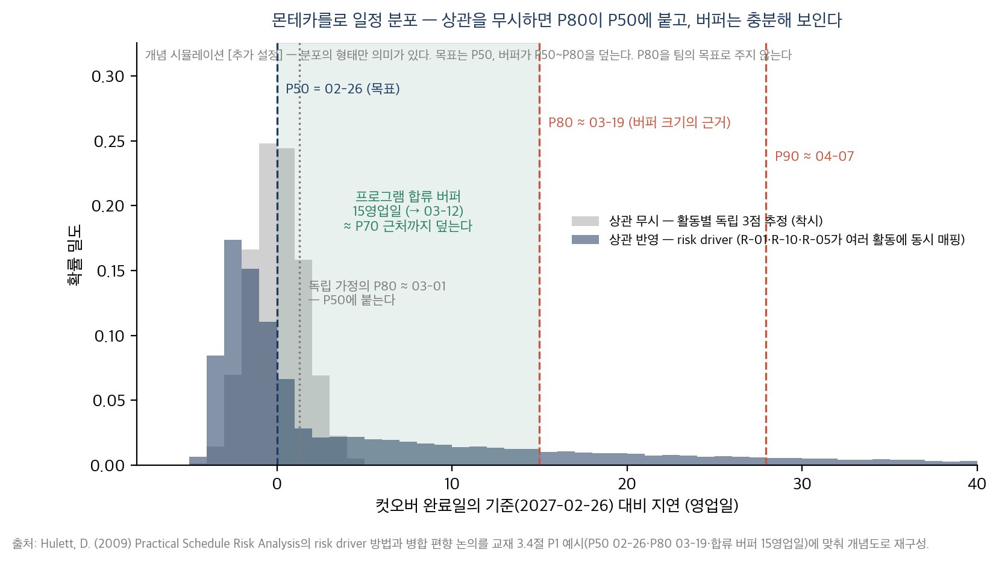

*그림 3-4. 몬테카를로 일정 분포 — P50·P80·프로그램 버퍼 15영업일의 위치, 상관 무시 시 분포가 좁아지는 착시. 활동별 3점 추정을 독립으로 합산하면(회색) 큰 수의 법칙으로 분산이 줄어 P80이 P50에 붙고 버퍼는 충분해 보인다. 같은 원인(R-01·R-10·R-05)이 여러 활동을 동시에 늦추는 risk driver 방식으로 상관을 반영하면(남색) 오른쪽 꼬리가 길어지고, 합류 버퍼 15영업일은 P70 근처까지만 덮는다. 목표는 P50이고 버퍼가 P50~P80을 덮으며, P80은 팀의 목표가 아니다. 개념 시뮬레이션 [추가 설정]으로 분포의 형태만 의미가 있다. Hulett (2009)를 바탕으로 재구성.*

### 실무에서 어떻게 틀리는가

CCPM을 계약 구조 없이 도입하는 것, crashing 비용을 선형으로 계산하는 것, fast tracking을 필수 의존에 적용하는 것, DCMA 지표를 도구의 점검표로만 돌리고 왜 걸렸는지 안 보는 것, 몬테카를로에 독립 3점 추정을 넣고 P80을 믿는 것, P80을 목표로 팀에 주는 것, 게이트를 하드 제약으로 박는 것, 음의 여유를 제약을 풀어 없애는 것.

---

## 3.5 하이브리드 달력 — 스프린트 케이던스와 게이트, 성수기 창, 컷오버 주말

### 한 달력에 놓기

1.2절의 스프린트 달력과 3.2절의 네트워크, 헌장 §7의 마일스톤, §9의 성수기 창을 하나의 달력에 놓는다 [추가 설정 — 스프린트 날짜 계산은 1.2절과 같다].

| 시기 | 스프린트 (릴리스) | 고정 마일스톤 | 성수기·배포 금지 창 | 무엇이 여기서 결정되는가 |
|---|---|---|---|---|
| 2026-01~03 | S1~S6 설계 (R0) | G0 01-05, 프리모템 01-08, 조달 착수 02-09, 설계 종료 03-27 | 설 전 2주 (2026-02-03~16 [추가 설정]) — 매장 시스템 변경 없음, P1은 아직 배포 없음 | 요구사항 확정(동결 FZ-01~03), 인터페이스 13본 복원 착수(S2), 3PL 부하 산정서·협상 착수(03) |
| 2026-04 | S7~S8 (R1) | P2 T0 04-24 (S8 마지막 영업일), 단말 조사 완료 04-30, G1 04-30 | — | 인터페이스 규격 P2 전달, 기준선 3종 서명, FP 확인서 BL-01 |
| 2026-05~06 | S9~S12 (R1, 종료 06-19) | 포털 프로토타입 시연(05, O-02), 3PL 협상 타결 목표 06-30 | — | 가맹 단말 전수 조사 결과, 3PL 준실시간 모드 확정 또는 폴백 |
| 2026-07~08 | S13~S16 (R2) | 부속서 08-14, 3PL API 종료 08-14, 보안진단 1회차(08) | **7~8월 여름 성수기** — 매장 배포 금지 | 규제 요건 반영(R2), 가맹 동의율 중간 집계(07) |
| 2026-09 | S17~S19 (R2 종료 09-11 → R3) | 규제 검증 착수 08-24, 규제 ① 09-11 (S18) | 추석 전 2주 (2026-09-11~24 [추가 설정]) | 규제 대응 검증(A07) — 22영업일 버퍼는 P4의 것 |
| 2026-10~11 | S20~S24 (R3, 종료 12-04) | 매핑 종료 10-23, G2 전 마지막 동결 FZ-10 10-28, 정본 판정 11-20, G2 11-27 (S24 중), 포털 선행 릴리스(S24) | — | 마스터 6종 정본·변경 동결(R-10), 리허설 1회차 준비 착수 11-23 |
| 2026-12 | S25~S26 (R4) | 통합시험 착수 12-07, 리허설 1회차(12-07~11), 단말 입고, 마지막 동결 FZ-12 12-30, 구현 종료 01-01 | **12월 연말 성수기** — 매장 배포 금지 | 옴니 Must·B2B EDI 잔여 구현, 데이터 전환 집중 |
| 2027-01 | S27~S28 (R4) | 통합시험 종료 01-15, 파일럿 배포, 리허설 3회차·전자금융업 신청서 01-29 | 설 전 2주 (2027-01-24~02-06 [추가 설정 — 2027년 설은 2월 7일]) | 코드 프리즈(S27), UAT 착수 01-18 |
| 2027-02 | S29~S30 (R4 종료 = 컷오버) | MC 02-12, G3 02-19, **컷오버 02-26~28** | (설 전 잠금 02-06까지) | UAT 결함 수정·롤백 검증(~02-18), 물류 인터페이스 시험(02-12~18), 컷오버 |
| 2027-03 | S31~S32 (R5) | 합류 버퍼 종료 03-12, 이연 릴리스 착수 03-15, 규제 ② 03-31 | — | 하이퍼케어(안정화 S31~S34), 이연 릴리스 R5(옴니 고도화·BI) |
| 2027-04~05 | S33~S36 (R5 종료 05-23) | 이연 릴리스 종료 04-16, 안정화 종료 04-23, 운영 이관 착수 04-26, G4 05-28 (헌장 05-29 토) | — | SAC 대응, 소스·형상 인수, 운영 이관, 종료 보고 |

이 달력에서 보이는 것 네 가지.

**G2는 스프린트 경계에 있지 않다.** 11-27은 S24(11-23~12-06)의 첫 주 금요일이다. 프로그램이 정한 날짜이므로 P1이 옮길 수 없고, 대안은 S24를 "G2 스프린트"로 정의해 첫 주를 게이트 패키지, 둘째 주를 정본 판정 후 작업으로 나누는 것이다. 이것을 계획에 적지 않으면 S24는 목표 없는 스프린트가 된다.

**가맹 포털 선행 릴리스는 12월을 피해야 한다.** O-02는 "2026-Q4"라고 했지만 12월은 성수기다. 11월 마지막 주(S24, G2 주)이거나 1월 첫 주(S27)다. 11월이면 G2 준비와 겹치고, 1월이면 UAT·코드 프리즈와 겹친다. 어느 쪽이든 자원 충돌이 있고, 그것이 릴리스 계획을 달력 위에 놓아야 하는 이유다. 워크북 §3 완성 예시본은 S24(11-23~12-06, 릴리스 R3 종료 직전)를 택했고, 그 근거를 여러분이 검토한다.

**2027년 설 연휴(2월 7일 전후)가 UAT 실행 기간에 걸린다.** 설 전 2주(01-24~02-06)는 베이커리 B2B 납품 집중 기간이므로 매장 시스템 변경은 없지만 UAT는 시험 환경이므로 진행 가능하다. 그러나 현업 UAT 참여자(매장·물류)는 성수기 업무로 빠진다. 3.2절의 I(UAT 실행 14일, 01-18~02-04)와 J(결함 수정·재시험, 02-05~11)가 이 기간에 걸쳐 있고, 그것이 임계경로다. 달력을 놓기 전에는 보이지 않던 리스크다.

**컷오버 주말 자체는 34시간이지만 그 앞뒤가 일정이다.** 금요일 20:00 전에 배포 패키지 동결, 매장 통지, 서비스데스크 증원(박준영), 롤백 판정 기준과 판정자(정미란 go/no-go)가 있어야 하고, 일요일 06:00 후에 월요일 개점 대응(강윤지 같은 지역매니저, 슈퍼유저 124명 — P3)이 있어야 한다. 컷오버 계획은 Day4의 주제이지만 그 활동들은 Day2의 일정 기준선에 있어야 한다.

이 달력을 한 장에 놓으면 그림 3-5와 같다.

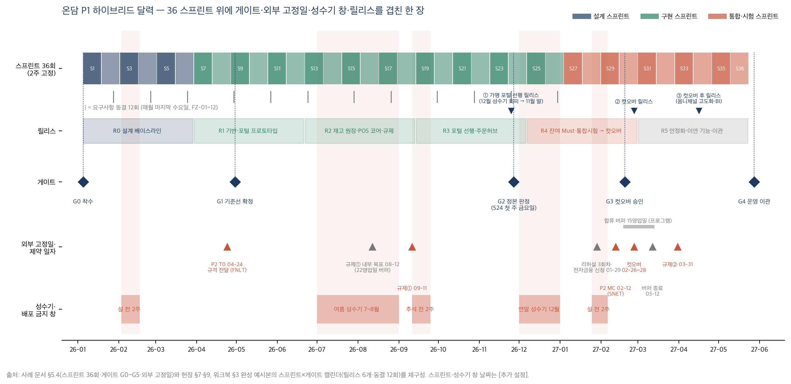

*그림 3-5. 온담 P1 하이브리드 달력 — 36 스프린트 위에 게이트·외부 고정일·성수기 창·릴리스를 겹친 한 장. 위에서부터 스프린트 36회(설계 6 / 구현 20 / 통합·시험 10)와 동결 12회, 릴리스(워크북 §3의 R0~R5와 사용자에게 가는 릴리스 3개), 게이트 G0~G4, 외부 고정일·제약 일자, 성수기·배포 금지 창이다. G2가 스프린트 경계에 있지 않다는 것, 포털 선행 릴리스가 12월을 피해야 한다는 것, 설 연휴가 UAT 결함 수정에 걸린다는 것, 컷오버 주말 앞뒤가 일정이라는 것이 달력을 놓아야 보인다. 스프린트·성수기 창 날짜는 [추가 설정].*

---

## 3.6 온담 P1 — 임계경로는 어디를 지나는가

> ■ **사례 사실** — 착수 G0 2026-01-05 ~ 컷오버 2027-02-26, 성수기 잠금 창(§3.4·§3.5); 활동 20개 네트워크와 총여유는 Day2 워크북 §3.5 예시본.

3.2절은 G2 이후를 계산했다. 착수부터 컷오버까지 전체를 보면 임계경로는 세 구간을 지난다 [추가 설정 — 활동 수준 상세는 워크북].

**구간 1 (2026-01~04): 요구사항 확정과 인터페이스 문서화 → G1.** 설계 스프린트 6회의 산출물(SyRS 396, SRS 570 확정)과 인터페이스 13본 문서화가 G1의 FP 기준선 확인서의 전제다. 이 구간의 리스크는 R-05(겸임 인력 참석률 → 결정 지연)와 R-06(OD-POS 지식 보유자)이며, 둘 다 발주사 내부다. 여기서의 지연은 G1을 늦추고, G1이 늦으면 구현 20회의 시작이 늦는다 — 그러나 구현 구간은 20회 × 2주로 고정되어 있으므로 G1 지연은 곧 G2 지연이거나 구현 스프린트 수의 감소(범위 축소)다.

**구간 2 (2026-04~11): 구현 → 정본 판정 G2.** 워크북의 계산표에서 총여유 0의 사슬은 구현 R1→R2→R3(A05→A06→A10)이지만, 이 구간의 진짜 임계는 활동이 아니라 **마스터 데이터 6종의 확정**이다. 상품·고객·매장·거래처·가격·재고 마스터가 확정되어야 정본 판정(A11, 10-26~11-20, G2 앞 여유 5일)이 가능하고, 마스터는 G2 전 마지막 동결(FZ-10 10-28)·신규 코드 요구 접수 마감(2026-10)과 3PL 협상 결과(센터 재고의 형태), 별도 법인 온담푸드시스템의 데이터 주체(R-09)에 걸린다. 데이터 경로(A02 복원 → A09 매핑 → A11 정본 → A13 리허설)는 TF 5의 근접 임계이고, 그 5일은 R-10이 소비한다. 이 구간에서 P1 PM이 볼 것은 스프린트 속도가 아니라 마스터 확정 진도다.

**구간 3 (2026-11~2027-02): 리허설·UAT·P2 합류 → G3 → 컷오버.** 3.2절의 계산이다. 임계경로는 통합시험·UAT 사슬과 P2 사슬이고, 리허설 사슬은 FNLT 01-29가 만든 여유 5일이며, G3 뒤 컷오버 창까지 4영업일의 간격(여유 아님)과 프로그램 버퍼 15일이 있다. 컷오버 뒤에도 임계경로는 끝나지 않는다 — 안정화 40일(A18)과 운영 이관 25일(A20)이 총여유 0으로 G4 05-28에 닿고, **G4 앞 여유는 0일**이다(공휴일을 반영하면 음수 — 워크북 §3 점검표 7번과 해설이 그 처리를 스폰서 결정으로 남긴다).

P2 T0(2026-04-24)과 MC(2027-02-12)가 P1에 미치는 것을 따로 적는다. T0는 P1의 **납품 기한**이다 — 재고 원장 인터페이스 규격을 그 전에 P2에 넘겨야 설비 컨소시엄(타케다 마사시 PM)이 규격을 반영해 발주한다. T0 후의 규격 변경은 설비 변경이고 되돌릴 수 없다. 따라서 1.3.1(재고 원장 모델·규격서)의 P2 인터페이스 규격은 S8 마지막 영업일(04-24)에 FNLT 제약을 갖는 P1의 **가장 이른 외부 인도물**이며, 설계 스프린트 6회 안에 재고 원장의 데이터 구조가 확정되어야 한다는 뜻이다. MC는 P1의 **입력 기한**이다 — MC 전에는 물류 인터페이스를 실제 설비와 시험할 수 없고, MC가 02-12에서 04-02로 밀리면 A15(물류 인터페이스 통합시험, 3.2절의 M)가 G3 뒤로 가서 컷오버는 물류 없이 가거나(분리) 창을 놓친다. 두 날짜 사이의 41주는 P1이 통제하지 못하는 시간이고, P1이 할 수 있는 유일한 일은 T0 전에 규격을 넘기는 것과 분리 컷오버를 설계해 두는 것이다.

착수부터 G4까지의 요약 네트워크와 세 구간, 그리고 T0·MC의 위치를 그림 3-6에 놓았다.

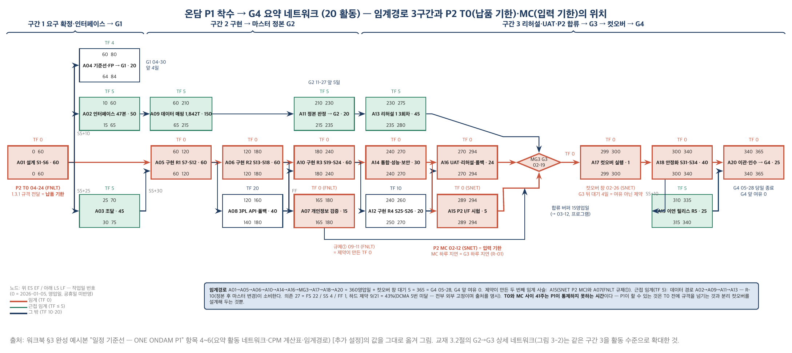

*그림 3-6. 온담 P1 착수 → G4 요약 네트워크 (20 활동) — 임계경로 3구간과 P2 T0(납품 기한)·MC(입력 기한)의 위치. 워크북 §3 완성 예시본의 활동 네트워크와 CPM 계산표(작업일 번호, 0 = 2026-01-05)를 그대로 옮긴 것이다. 붉은 사슬 A01→A05→A06→A10→A14→A16→MG3→A17→A18→A20이 총여유 0의 임계경로(365영업일 = G4 05-28, G4 앞 여유 0)이고, A15(SNET P2 MC)와 A07(FNLT 규제①)은 제약이 만든 임계, 초록의 데이터 경로 A02→A09→A11→A13은 근접 임계(TF 5)다. T0는 P1의 납품 기한, MC는 입력 기한이며 그 사이 41주는 P1이 통제하지 못하는 시간이다. 값은 [추가 설정].*

---

## 3.7 실무에서 어떻게 틀리는가

**하드 제약 남발.** 임원이 말한 날짜, 게이트, 벤더가 약속한 날짜를 모두 MFO로 박으면 네트워크는 달력이 되고, 음의 여유가 곳곳에 나오며, 그것을 제약을 풀어 없앤다. DCMA 5번·7번.

**논리 없는 간트.** 활동 300개에 의존 관계가 40개면 임계경로는 없고, 총여유는 200일이며, "일정에 여유가 많다"는 보고가 나간다. DCMA 1번·6번.

**여유를 숨기는 추정.** 담당자가 활동마다 30%를 얹고, 팀장이 10%를 더 얹고, PM이 5%를 또 얹으면 기준선은 P95이고, 실적은 파킨슨 법칙으로 기준선에 맞춰지며, 프로젝트는 "정확히 계획대로" 늦게 끝난다. 처방은 CCPM의 도입이 아니라 추정의 확률 수준(P50인가 P80인가)을 명시하고 버퍼를 분리해 소유자를 정하는 것이다.

**"압축하면 된다."** 대표이사의 "앞당기라"에 "네"라고 답하고 crashing 비용과 fast tracking의 재작업 리스크를 말하지 않는 것. 답은 선택지 — (a) 범위 이연(헌장 §13), (b) crashing 비용 N억(변경 대가), (c) 병행 시 재작업 리스크 — 와 권고와 결정 기한이다(Day1 3.4절의 "결정을 결정권자에게 가져가기").

**외부 마일스톤을 네트워크 밖에 두는 것.** P2 MC가 P1 일정표에 없으면 P1 PM은 자기 임계경로의 절반을 모른다.

**달력 없이 스프린트 수만 세는 것.** 36회 × 2주 = 72주라는 산수는 성수기, 명절, G2가 스프린트 중간에 있다는 사실, 설 연휴가 UAT에 걸린다는 사실을 모른다.

---

## 제3장 핵심 정리

> **한 줄씩 — 수업 직전 5분 복습용**
> 1. 활동은 작업패키지의 분해이며, 되돌릴 수 없는 결정 앞과 외부 고정일 주변을 촘촘히 쪼갠다.
> 2. CPM 전진·후진 계산은 손으로 한 번 해 봐야 한다 — 총여유는 경로의 것, 자유여유는 활동의 것.
> 3. 여유(float)는 약정이 없으면 선착순 공용 자원이다 — 그래서 계약 문안에 적는다.
> 4. 크리티컬 체인은 방법론으로는 SI에 안 맞지만 병합 편향과 버퍼 소진율은 가져온다.
> 5. 스프린트·릴리스·동결·게이트·고정일·성수기 창을 한 달력에 겹쳐야 충돌이 보인다.
> 6. P1 임계경로는 요구 확정(G1) → 마스터 확정(G2) → UAT·P2 합류(G3) 세 구간을 지난다.
>
> 아래는 같은 내용의 자세한 판이다.

1. 활동은 WBS 작업패키지의 분해이며, 하이브리드에서는 통합·전환 구간(되돌릴 수 없는 결정 앞, 외부 고정일에 묶인 구간)만 활동 수준 CPM을 돌리고 구현 구간은 스프린트 백로그로 둔다. PDM 4종 의존, lead/lag, 의존의 근거(필수·임의·외부·내부)를 적어야 압축 시 무엇을 풀 수 있는지 안다.
2. CPM의 전진·후진 계산은 손으로 한 번 해야 한다. 총여유는 경로가 공유하는 자원이고 자유여유는 활동의 것이다. P1의 G2→G3 구간 임계경로는 통합시험·UAT 사슬과 P2 사슬이며, 리허설 사슬은 FNLT 01-29가 만든 여유 5영업일, G3 뒤 컷오버 창까지 4영업일은 여유가 아닌 간격, 프로그램 버퍼 15영업일. 착수~G4 전체(워크북 20개 활동)의 임계경로는 A01→A05→A06→A10→A14→A16→MG3→A17→A18→A20 = 365영업일이고 G4 05-28 앞 여유는 0이다.
3. Float는 별도 약정이 없으면 프로젝트 공용 자원이며 선착순이다(SCL Protocol 2판 Core Principle 8). 그것이 계약 문안으로 달리 정할 이유이고, 한국 SI 계약에는 float 조항이 없으므로 기준선에서 여유의 위치와 목적을 명시하고 여유와 버퍼를 구분하고 변경협의체 의결서에 float 소진을 적는다.
4. CCPM은 방법론으로는 계약 구조 때문에 SI·EPC에서 실패하지만 병합 편향과 버퍼 소진율 관리는 가져올 수 있다. Crashing은 비선형 비용과 Brooks의 법칙, fast tracking은 재작업 악순환의 한계가 있고, 압축의 정직한 답은 대개 범위다. DCMA 14-Point는 float 은닉 탐지 도구다. 몬테카를로는 상관을 무시하면 P80이 과소평가되며(risk driver 방식), P80은 버퍼의 크기이지 팀의 목표가 아니다. 제약 일자는 외부 고정일에만, 게이트는 논리의 결과로.
5. 하이브리드 달력에 36 스프린트·릴리스 R0~R5·동결 12회·게이트·외부 고정일·성수기 창을 겹치면 보이지 않던 것이 보인다 — G2가 스프린트 중간에 있고, 포털 선행 릴리스가 12월을 피해야 하며(워크북은 S24), 설 연휴가 UAT 실행에 걸린다.
6. P1의 임계경로는 요구 확정·인터페이스 문서화(G1) → 마스터 6종 확정(G2) → UAT·P2 합류(G3)의 세 구간을 지난다. P2 T0는 P1의 납품 기한(인터페이스 규격), MC는 입력 기한(물류 시험)이며, 그 사이 41주는 P1이 통제하지 못한다.

## 생각해 볼 질문

1. 리허설·데이터 경로의 총여유 5영업일을 누구에게 줄 것인가. 논리로는 19일인데 제약(FNLT 01-29)이 5일로 눌렀다는 사실을 기준선 문서에 어떻게 적을 것인가.
2. 정미란 스폰서가 "컷오버를 2월 첫 주로 당길 수 있는가"라고 물었다. 선택지 셋과 권고를 어떻게 구성할 것인가.
3. P2 MC가 2027-04-02로 통지되었다. 물류 분리 컷오버를 하면 P1의 임계경로는 어떻게 바뀌고, 2차 컷오버는 언제 가능한가(성수기 창을 고려하라).
4. 여러분 회사의 일정 모델을 DCMA 14-Point로 점검하면 몇 개 항목이 걸리겠는가. 가장 먼저 걸릴 항목은 무엇인가.
5. 수행사가 활동마다 안전여유를 넣었다는 것을 어떻게 알 수 있는가. 알았다면 무엇을 요구할 수 있는가.

## 워크북 연결

이 장의 내용은 워크북 §3 "일정 기준선"에서 온담 P1에 적용한다. 36 스프린트·게이트·외부 고정일·성수기 창을 한 달력에 놓고(1.2절·3.5절), G2→G3→컷오버 네트워크의 전진·후진 계산을 손으로 완성하며(3.2절 표의 빈칸), 각 경로의 총여유와 그 소유자·목적을 기준선 문서에 적고(3.3절), 제약 일자(외부 고정일 다섯 + 게이트)를 유형(FNLT/SNET)과 출처·어겼을 때의 결과와 함께 명시한다. 착수~G4 전체는 워크북의 요약 활동 20개(A01~A20 + MG3)로 계산하며 G4 앞 여유 0을 스폰서 결정 요청으로 남긴다. R-01 시나리오(MC 04-02)와 R-10 시나리오(정본 후 변경 6주)에서 임계경로가 어떻게 바뀌는지를 각각 한 문단으로 쓴다. 심화 과제: 리스크 R-01·R-06·R-10을 risk driver로 놓고 각각이 어느 활동에 걸리는지 매핑한 뒤, 상관을 무시했을 때와 반영했을 때 P80이 어느 방향으로 움직이는지를 정성적으로 서술한다.

---

# 제4장 원가와 조달

## 4.1 추정 방법과 정확도 — AACE Class는 정의도로 결정된다

### 개념

원가 추정의 방법은 3.1절의 기간 추정과 같다 — 유사, 모수, 상향식(bottom-up, 작업패키지별 추정의 합), 3점. 다른 것은 **정확도를 말하는 언어**다. 건설·EPC와 프로세스 산업은 이 언어를 표준화했고, 그것이 AACE International의 추정 분류 체계(cost estimate classification system)다. SI에는 대응하는 표준이 없으므로 이 언어를 빌려 쓰는 것이 유용하다.

AACE RP 18R-97(프로세스 산업)과 56R-08(건축·일반 건설)은 추정을 다섯 Class로 나눈다. **Class는 정확도가 아니라 프로젝트 정의도(level of project definition)로 결정된다.** 이것이 이 체계에서 가장 자주 오해되는 점이다.

| Class | 정의도 (완전한 정의 대비 %) | 용도 | 18R-97 예시 정확도 범위 (L / H) | 56R-08 예시 정확도 범위 (L / H) |
|---|---|---|---|---|
| 5 | 0~2% | 개념 선별, 타당성 | −20~−50% / +30~+100% | −20~−30% / +30~+50% |
| 4 | 1~15% | 개념 연구, 타당성 | −15~−30% / +20~+50% | −10~−20% / +20~+30% |
| 3 | 10~40% | 예산 승인, 통제 기준선 | −10~−20% / +10~+30% | −10~−15% / +10~+20% |
| 2 | 30~75% | 통제, 입찰 | −5~−15% / +5~+20% | −5~−10% / +5~+15% |
| 1 | 65~100% | 점검 추정, 입찰 | −3~−10% / +3~+15% | −3~−5% / +3~+10% |

두 문서의 정확도 범위가 다르다는 것 자체가 요점이다. 같은 정의도에서 프로세스 플랜트는 건축보다 불확실성이 크다. 그리고 두 문서 모두 명시한다 — **정확도 범위는 자동으로 적용하는 값이 아니며, 리스크 분석으로 산정해야 하고, 컨틴전시가 적정하다면 약 80%의 프로젝트가 이 밴드에 든다.** 즉 표의 범위는 "Class 3이면 ±20%"라는 규칙이 아니라 "Class 3 정의도에서 리스크 분석을 제대로 하면 대개 이 정도 밴드가 나온다"는 경험적 관찰이다(범위 숫자는 인쇄 전 원문 표를 대조하라). 건축용 문서 번호는 56R-08이며 56R-11이 아니다 — 문서 번호 오인이 매우 흔하다.

두 문서의 정확도 범위를 Class 위에 겹쳐 놓으면 그림 4-1과 같다.

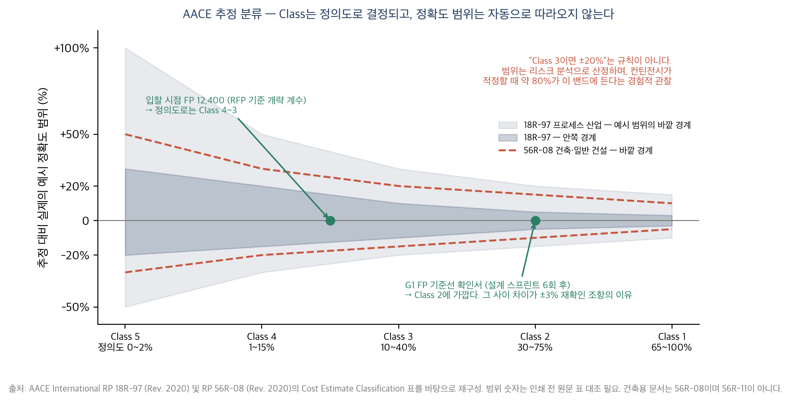

*그림 4-1. AACE 추정 분류 — Class는 정의도로 결정되고, 정확도 범위는 자동으로 따라오지 않는다. 남색 띠가 18R-97(프로세스 산업)의 예시 범위(안쪽·바깥 경계), 붉은 파선이 56R-08(건축·일반 건설)의 바깥 경계다. 같은 정의도에서 프로세스 플랜트가 건축보다 불확실성이 크다는 것 자체가 요점이며, 범위는 리스크 분석으로 산정하는 것이지 Class에서 자동으로 읽는 값이 아니다. 입찰 시점의 FP 12,400은 정의도로 Class 4~3, G1의 FP 기준선 확인서는 Class 2에 가깝고 그 차이가 ±3% 재확인 조항의 이유다. 범위 숫자는 인쇄 전 원문 표 대조 필요. AACE RP 18R-97·56R-08 (Rev. 2020)을 바탕으로 재구성.*

이 체계가 SI에 주는 것은 두 가지다. 첫째, **"우리는 어느 Class로 견적했는가"라는 질문.** 입찰 시점의 FP 12,400점은 제안요청서 기준의 개략 계수이므로 정의도로 치면 Class 4~3이고, G1의 FP 기준선 확인서는 설계 스프린트 6회 후의 계수이므로 Class 2에 가깝다. 그 사이의 정확도 차이가 ±3% 기준선 재확인 조항의 이유이며, 168.0억이라는 승인 예산이 Class 3 수준의 값이었음을 스폰서가 알아야 한다. 둘째, **정의도를 올리기 전에 총액을 확정하지 않는다는 규율.** 1.4절의 EPC 논의와 같다. SI에서 이 규율은 "설계 완료 전 FP 확정 불가"로 나타나며, 그래서 G1이 착수 4개월 뒤에 있다.

### 상향식 추정과 그 함정

원가 기준선의 기본은 상향식이다 — 작업패키지마다 자원 × 단가 × 기간을 추정하고 합친다. 정확하지만 비싸고, 두 가지 함정이 있다. 첫째, **누락**. 상향식은 WBS에 있는 것만 더하므로 WBS의 100% 규칙이 깨지면 추정도 깨진다. 둘째, **낙관의 합산**. 작업패키지 100개를 각각 P50으로 추정해 더하면 합계도 P50이라고 믿기 쉽지만, 비대칭 분포(초과는 크고 절감은 작다)에서는 합계의 평균이 P50 합보다 크고, 상관이 있으면 분산이 커진다. 상향식의 합계는 반드시 하향식(유사·모수·RCF)과 대조해야 한다. 온담의 2014년 SAP 도입 74억과 P1의 168억을 규모(FP, 테이블 수, 매장 수)로 정규화해 비교하는 것이 그 대조의 최소 형태다.

### 실무에서 어떻게 틀리는가

"Class 3이면 ±20%"를 규칙으로 인용하는 것, 56R-11이라고 쓰는 것, SI에는 Class 체계가 없다며 "우리는 그냥 견적"이라고 하는 것(그러면 정확도를 말할 언어가 없다), 상향식 합계를 하향식과 대조하지 않는 것, 입찰 시점의 숫자와 설계 후의 숫자가 같아야 한다고 믿는 것.

---

## 4.2 원가 기준선과 예산의 3층 — 컨틴전시와 관리예비비는 다른 사람의 돈이다

### 개념

원가 기준선(cost baseline)은 **시간대별로 배분된 승인 예산에서 관리예비비를 제외한 것**이다. 정의의 세 부분이 각각 중요하다. "시간대별로 배분된" — 총액이 아니라 월별(또는 기간별) 누적 곡선이다(4.3절). "승인" — 스폰서가 서명했다. "관리예비비를 제외한" — 기준선 밖의 돈이 있다.

예산의 층을 정확히 세운다. 용어는 PMBOK과 ISO 21502가 쓰는 것이며, 온담의 3층과 대응시킨다.

| 층 | 정의 | 누구의 돈 | 무엇을 위한 것 | 온담 P1 |
|---|---|---|---|---|
| **계획 원가 (작업패키지 원가 추정의 합)** | 식별된 작업의 상향식 추정 합계 | PM (작업패키지 담당) | 알려진 작업 | 145.8 |
| **컨틴전시 예비비 (contingency reserve)** | 식별된 리스크(known unknowns)의 대응 비용 | PM (허용범위 안에서 집행, 기록·보고) | 리스크 등록부의 행들 | 10.2 (승인 예산의 6.07%) |
| **원가 기준선 = 계획 원가 + 컨틴전시** | PM이 책임지는 성과 측정의 자 | PM | EVM의 BAC | 156.0 = 집행 한도 |
| **관리예비비 (management reserve)** | 식별되지 않은 리스크(unknown unknowns)와 범위 밖 사건 | 스폰서 (결재 필요) | 기준선 변경을 동반하는 사건 | 12.0 (프로그램 24억 중 P1 유보분) |
| **프로젝트 예산 = 기준선 + 관리예비비** | 승인된 총액 | 이사회·스폰서 | 계약·발주 한도 | 168.0 |

여기서 하나를 명확히 한다. 온담 정본은 "집행 한도 156.0 = 승인 예산 − 관리예비비"와 "계획 원가 145.8 = 집행 한도 − 컨틴전시"로 쓴다. PMBOK 용어로 옮기면 집행 한도 156.0이 원가 기준선(BAC)이고, 계획 원가 145.8이 작업패키지 추정의 합이며, 컨틴전시 10.2는 기준선 **안에** 있다(PM의 돈), 관리예비비 12.0은 기준선 **밖에** 있다(스폰서의 돈). Day3 EVM의 PV 곡선은 145.8로 그리고, BAC는 156.0이며, 컨틴전시 집행은 PV에 없던 원가가 AC에 나타나는 형태로 기록된다.

### 컨틴전시와 관리예비비의 구분 — 왜 다른 사람의 돈인가

두 예비비의 차이는 크기가 아니라 **누가 어떤 근거로 쓰는가**다.

**컨틴전시**는 리스크 등록부에 있는 리스크의 대응 비용이다. 근거가 있다 — R-08(앱 벤더 별도 견적 4억)이 현실화되면 컨틴전시에서 그 대응을 집행하고, 등록부의 해당 행에 "집행 N억, 잔여 컨틴전시 M억"을 기록한다. 그래서 컨틴전시의 크기는 리스크 등록부의 정량화(EMV, 몬테카를로)에서 나와야 하고(5.7절), 집행은 리스크 ID를 달고 이루어져야 한다. 윤태호 내부감사팀장이 2020년 지적한 "컨틴전시 집행 승인 근거 부재"가 정확히 이 기록의 부재다. 헌장 §8이 "집행 기록은 CCB에 월 보고"라고 한 것과 RACI 19행(컨틴전시 집행 A = P1 PM, CCB I 월 보고, 재경 C)이 그 답이다.

**관리예비비**는 등록부에 없는 것 — 식별하지 못한 리스크, 범위 밖에서 온 사건(규제 변경, 프로그램 재정의, 별도 법인의 계약 변경) — 을 위한 것이다. 근거가 없으므로 PM이 쓸 수 없고, 스폰서가 그 사건이 기준선 밖의 것임을 판단해 결재한다. 관리예비비를 집행하면 대개 기준선이 바뀐다 — 범위가 늘었거나 새 작업패키지가 생겼으므로. RACI 20행(관리예비비 집행 A = 정미란, R = P1 PM, PMO장 C)이 이 구조다.

둘을 섞으면 두 가지가 일어난다. 컨틴전시를 관리예비비처럼 쓰면(스폰서 결재를 요구) PM은 허용범위 안의 리스크 대응조차 못 하고 예외 보고만 하게 된다 — Day1 3.4절의 "권한 없는 PM"이다. 관리예비비를 컨틴전시처럼 쓰면(PM이 근거 없이 쓴다) 이사회 승인 조건 2항("관리예비비 집행은 스폰서 결재 사항")을 위반하고, 미지의 사건이 왔을 때 돈이 없다.

### 컨틴전시의 산정 — 백분율에서 EMV와 몬테카를로로

컨틴전시를 "승인 예산의 N%"로 정하는 관행은 근거가 없다. 10.2억이 6.07%인 것은 결과이지 근거가 아니다. 근거는 셋 중 하나여야 한다.

**EMV(expected monetary value)의 합.** 리스크마다 확률 × 영향(억)을 구해 더한다. 단순하고 투명하지만 평균이므로 꼬리를 덮지 못한다(5.3절). 컨틴전시 = EMV 합은 "평균적으로 충분"이지 "80% 확률로 충분"이 아니다.

**몬테카를로의 P-값.** 리스크 등록부(와 추정 불확실성)를 시뮬레이션해 원가 분포를 얻고, 원하는 신뢰 수준(대개 P70~P80)에서 계획 원가와의 차이를 컨틴전시로 잡는다. 이것이 AACE가 "리스크 분석으로 산정하라"고 한 것의 실체다.

**RCF의 uplift.** Reference class의 초과율 분포에서 원하는 신뢰 수준의 uplift를 읽는다. 외부 시각이며, 내부 리스크 등록부의 낙관을 교정한다. 온담에는 reference class가 없다(정보화 사업 4건) — 그것이 첫 번째 리스크다(Day1 3.5절).

세 방법이 서로 다른 숫자를 주면 그 차이가 정보다. 잔여 위협 EMV 합이 6.78억이고 상관을 반영한 P80이 약 10.1억, P90이 약 12.7억이면 [추가 설정, 5.7절] 그 간격이 꼬리이고, 컨틴전시 10.2억은 식별된 노출의 P80 근처를 덮을 뿐 P90 너머는 덮지 못한다는 것 — 그리고 그 10.2의 근거는 P-값이 아니라 리스크별 배정 4.60 + 미식별 리스크용 미배정 풀 5.60(스프린트 4회분)이라는 것 — 을 스폰서가 알아야 한다.

예산의 층과 각 층의 소유자·집행 경로를 그림 4-2에 놓았다.

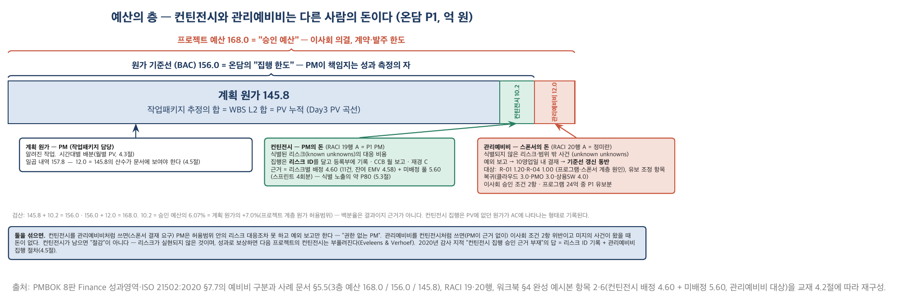

*그림 4-2. 예산의 층 — 계획 원가 145.8 / 컨틴전시 10.2 / 원가 기준선(BAC) 156.0 / 관리예비비 12.0 / 승인 예산 168.0과 각 층의 소유자. 온담의 "집행 한도" 156.0이 PMBOK의 원가 기준선(BAC)이고, 컨틴전시 10.2는 기준선 안(PM의 돈, 리스크 ID를 달고 집행 — 리스크별 배정 4.60 + 미배정 풀 5.60), 관리예비비 12.0은 기준선 밖(스폰서의 돈, 예외 보고와 결재, 기준선 갱신 동반 — R-01·R-04와 유보 조정 항목 복귀가 그 대상)이다. PV 곡선은 145.8로 그린다. 10.2가 승인 예산의 6.07%라는 것은 결과이지 근거가 아니다. PMBOK 8판 Finance 성과영역·ISO 21502 §7.7과 사례 문서 §5.5, RACI 19·20행을 바탕으로 재구성.*

### 실무에서 어떻게 틀리는가

"예산 168억"이라는 한 숫자로 말하는 것 — 그러면 156과 145.8이 어디 갔는지, 10.2를 누가 쓰는지 아무도 모른다. 예비비를 일반 원가에 섞는 것 — 작업패키지마다 10%씩 얹어 두면 컨틴전시는 보이지 않고 파킨슨 법칙으로 사라진다. 컨틴전시를 백분율로 정하고 근거를 묻지 않는 것. 컨틴전시 집행에 리스크 ID를 안 다는 것. 관리예비비를 PM 재량으로 쓰거나 반대로 컨틴전시까지 스폰서 결재를 요구하는 것. 그리고 컨틴전시가 남으면 "절감"으로 보고하는 것 — 남은 컨틴전시는 리스크가 실현되지 않은 것이지 PM이 잘한 것이 아니며, 그것을 성과로 보상하면 다음 프로젝트의 컨틴전시는 부풀려진다(Day1 1.2절 Eveleens & Verhoef의 메커니즘).

---

## 4.3 시간대별 배분과 S-curve — Day3 EVM의 입력, 자금 조달 한도

### 개념

원가 기준선이 총액이 아니라 곡선이어야 하는 이유는 Day3에 있다. EVM의 계획가치(PV)는 "이 시점까지 계획된 작업의 예산"이고, 그것은 시간대별 배분 없이는 존재하지 않는다. 누적 PV 곡선은 대개 S자 — 초반 완만, 중반 가파름, 후반 완만 — 이며 그래서 S-curve라고 부른다.

배분의 원칙은 **작업의 시점에 따른다**는 것이다. 지급 시점이 아니다. SI 용역 68.2억이 선급·중도·잔금으로 지급되더라도 PV는 스프린트 시작 월에 가중치(설계 0.7 / 구현 1.1 / 통합·시험 1.2 → 스프린트당 1.25 / 1.96 / 2.14억, 구간 비중 약 11 / 57 / 31% [추가 설정, 워크북 §4])로 배분된다. 라이선스 17.4억은 납품·검수 시점(2026-03~05)에, 1년차 유지보수 2.0은 월 0.2로 인식된다. 이 원칙 때문에 세 개의 곡선이 따로 있다.

| 곡선 | 무엇 | 누가 보는가 |
|---|---|---|
| **PV (계획가치)** | 작업 시점 기준 배분 | PM — EVM |
| **약정(commitment)** | 계약·발주 시점 기준 | 구매(강현도), 재경 — 계약·발주 한도 168.0 |
| **현금(cash)** | 지급 시점 기준 | 재경 — 자금 계획, 연차 예산 176/198/54 |

세 곡선의 차이가 실무의 마찰이다. CFO의 "1차연도 148억"은 현금 곡선의 문제이고, PM의 PV 곡선은 작업의 문제이며, 둘은 지급 조건 협상으로 조정된다 — 라이선스 지급을 분할하거나 SI 중도금 비율을 조정하면 현금은 바뀌고 PV는 안 바뀐다. 이것이 PMBOK 8판이 Cost를 **Finance**로 바꾼 이유의 실체이며, 원가 기준선 문서에는 PV 곡선과 함께 **자금 조달 한도(funding limit)** — 기간별로 쓸 수 있는 현금의 한도 — 를 적고, PV 누적이 한도를 넘는 구간이 있으면 작업을 미루거나(funding limit reconciliation) 한도를 올려야 한다.

### 배분의 형태

작업패키지 수준에서 배분 방법을 정한다. Day3의 EV 측정 방법과 같은 목록이다 — 마일스톤 가중(milestone weights), 고정 공식(0/100, 50/50), 완료 비율(percent complete), 배분 노력(apportioned effort, 다른 작업패키지에 비례 — 예: PMO는 전체 진척에 비례), 노력 수준(level of effort, 시간에 비례 — 예: 클라우드 사용료). 배분 방법을 계획 시점에 정하지 않으면 실행 시점에 EV를 어떻게 잴지 다투게 된다. FP 기반 작업패키지는 FP 완료 비율, 리허설은 0/100(회차별), 라이선스는 납품 마일스톤, PMO는 노력 수준이 자연스럽다.

같은 145.8이 세 개의 다른 곡선이 되는 모습과 자금 조달 한도를 그림 4-3에 놓았다.

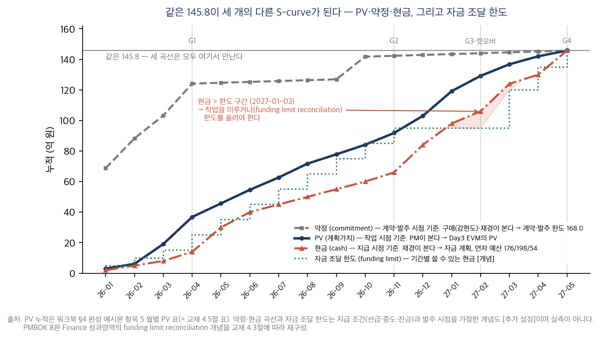

*그림 4-3. PV·약정·현금 세 곡선의 형태 차이와 자금 조달 한도 — 같은 145.8이 세 개의 다른 S-curve가 된다. PV(작업 시점)는 PM이, 약정(계약·발주 시점)은 구매·재경이, 현금(지급 시점)은 재경이 본다. 세 곡선은 모두 145.8에서 만나지만 형태가 다르고, 현금이 자금 조달 한도를 넘는 구간이 있으면 작업을 미루거나(funding limit reconciliation) 한도를 올려야 한다 — 그것이 CFO의 "1차연도 148억"과 PM의 PV 곡선이 만나는 지점이다. PV 누적은 4.5절 표(워크북 §4 항목 5)이고 약정·현금·한도는 지급 조건을 가정한 개념도 [추가 설정]이다.*

### 실무에서 어떻게 틀리는가

PV를 지급 일정으로 그리는 것(그러면 EVM은 "돈을 냈는가"를 재지 "일이 되었는가"를 재지 않는다), 배분 방법을 정하지 않고 실행 시점에 "대충 50%"로 EV를 잡는 것, 자금 조달 한도를 원가 기준선 문서에 안 적어 CFO의 삭감이 왔을 때 무엇을 미룰지 근거가 없는 것, 연차 예산(176/198/54)과 PV 곡선의 연차 합계를 대조하지 않는 것.

---

## 4.4 조달 — 계약 유형과 리스크 배분, 한국 SI의 FP 고정가, 견적 검산, 자원 계획 (심화)

### 계약 유형과 리스크 배분

계약 유형은 원가 리스크를 발주사와 공급자 사이에 나누는 방식이다. 1.3절에서 PMBOK 8판이 조달을 부록으로 내렸다고 했으므로, 이 내용의 출처는 계약 실무다.

| 유형 | 원가 리스크 | 발주사가 통제하는 것 | 언제 맞는가 | 온담 P1 |
|---|---|---|---|---|
| **고정가 (FP / LSTK)** | 공급자 | 범위 (변경 = 대가) | 범위가 정의되어 있을 때 (Class 2 이상) | SI 용역 68.2 (FP 12,400 × 55만원), 데이터 전환 11.4, 감리 4.2 |
| **실비정산 (cost-reimbursable, CPFF/CPIF)** | 발주사 | 원가 투명성 | 범위가 불확실할 때, 연구·개발 | (없음) |
| **T&M (time & materials)** | 공유 (단가 고정, 수량 변동) | 투입 시간 | 소규모·단기·범위 미정 | 앱 벤더 API 연동 추가 시 후보 (R-08) |
| **GMP (guaranteed maximum price)** | 최대 보증가까지 발주사, 초과분 공급자 | 최대 보증가 | 설계와 시공이 겹칠 때 (CM at risk) | (없음, EPC에서 흔함) |
| **단가 계약 (unit price)** | 공유 (단가 고정, 수량 실측) | 수량 | 수량이 불확실한 반복 작업 | 클라우드 사용료, 단말 148만원 × 477대 |

고정가가 발주사에게 "안전"하다는 믿음은 절반만 맞다. 고정가는 원가 리스크를 공급자에게 넘기지만, 공급자는 그 리스크를 **입찰가의 프리미엄** 또는 **변경 대가의 공격성**으로 돌려준다. 한빛디지털은 198억으로 응찰했고 168억으로 계약했다 — 그 30억의 차이 어딘가에 프리미엄이 있었거나, 없었다면 손익률 6.5%를 지키기 위한 변경 대가 청구가 온다(이재현 PM은 이미 그렇게 말했다). Merrow(2023)가 EPC에서 보인 것 — 설계 성숙도 부족 + 경쟁입찰 압박 조건에서 LSTK의 성과가 나빠진다 — 은 단독 응찰·30억 감액·설계 전 계약이라는 P1의 조건에 그대로 겹친다.

리스크 배분의 정교한 형태로 FIDIC Emerald Book의 **기준선 대비 편차** 방식을 알아 둘 만하다 — 발주자가 지반 기준선(GBR)을 제공하고, 실제가 기준선과 다를 때만 시공자에게 보상한다. 리스크를 통째로 넘기지 않고 "기준선 대비 편차"로 계약화하는 이 패턴은 SI의 데이터 품질 리스크에 이식할 수 있다. 데이터 전환 용역(11.4억)에 "정본 데이터의 결함률 기준선 N% [추가 설정]"을 붙이고 초과분만 대가 조정 대상으로 하면, 발주사는 데이터 정제 책임을, 용역사는 전환 기술 책임을 진다.

### 한국 SI의 FP 고정가 + 변경 대가 구조

2.4절에서 다룬 구조를 원가의 관점에서 다시 본다. FP 고정가 계약의 원가 기준선은 발주사에게 두 부분이다. **고정 부분** 68.2억은 지급 조건(선급·중도·잔금 [추가 설정 — 워크북에서 정한다])에 따라 현금이 나가고 FP 진척에 따라 PV가 쌓인다. **변동 부분**은 변경 대가이며, 그 재원은 컨틴전시(식별된 리스크 R-05·R-07·R-08의 결과인 변경) 또는 관리예비비(범위 밖의 변경)다. 변경 대가의 산정 기준은 계약서에 있어야 한다 — FP 추가분 × 단가인가, 인월 × 단가인가, 보정계수는 어떻게 적용하는가. 이것이 없으면 변경협의체는 매번 처음부터 협상한다.

### 견적 검산 — 상대 숫자를 먼저 검산한다

조달에서 PM이 하는 가장 실용적인 일은 **남의 숫자를 검산하는 것**이다. 벤더 견적서의 합계가 맞는지, 단가 × 수량이 합계와 같은지, 부가세가 두 번 들어갔는지, 3년 유지보수가 3년치인지 1년치 × 3인지, 라이선스 수량이 사용자 수인지 코어 수인지. 이 검산은 협상 전에 한다 — 협상 중에 발견하면 상대는 "실수"라고 하고 다시 계산하며 그때는 이미 앵커링이 되어 있다(6.2절).

검산의 순서는 셋이다. **산수** — 합계·단가·수량·세금. **정의** — 단위가 무엇인가(FP인가 인월인가, 코어인가 사용자인가, 연간인가 총액인가), 무엇이 포함되고 무엇이 제외되는가(설치? 교육? 1차연도 유지보수?). **비교** — 같은 것에 대한 다른 견적, 과거 계약, 공개 단가와의 비교. 온담의 상용SW 23.4억(API 게이트웨이 6.8 / MDM 9.2 / APM 4.1 / SAP 애드온 3.3)은 네 벤더의 견적이고, 각각 "3년 유지보수 포함"이 어떤 의미인지가 다를 수 있다. P1 PM이 강현도 구매팀장과 함께 검산하지 않으면 그 차이는 2027년 유지보수 갱신 시점에 나타난다.

### 컨소시엄·하도급

SI 계약의 상대는 한 회사가 아니다. 한빛디지털의 61명 중 일부는 하도급이고, 상용SW 벤더 3사는 각각 별도 계약이며, P2의 설비 컨소시엄은 주계약자(타케다 마사시 PM) 뒤에 여러 회사가 있다. 발주사 PM이 알아야 할 것은 셋이다. 하도급 구조를 계약서에서 확인할 수 있는가(공동수급 표준협정서, 하도급 승인). 하도급의 산출물을 누가 형상관리하는가(2023년 감사 지적 — 위탁 산출물의 형상관리·소스 인수). 하도급사의 인력 이탈이 발주사에 어떻게 통지되는가. 이 셋이 계약에 없으면 61명 중 누가 누구인지 모르는 채 프로젝트가 돈다.

### RACI에서 자원 계획으로 — 히스토그램과 평준화

자원 계획은 RACI의 R(수행)을 인력·기간으로 구체화한 것이다. 작업패키지마다 자원 × 기간이 붙으면 기간별 자원 수요를 막대로 그릴 수 있고 — **자원 히스토그램** — 그것이 가용 자원을 넘는 구간이 보인다. P1의 피크 82명은 어느 달인가. 구현 스프린트 중반(2026-09~11 [추가 설정])이며, 그 시점에 발주사 14명(대부분 겸임)의 실투입이 50% 이하로 떨어지면(R-05) 결정 지연이 시작된다.

**자원 평준화(resource leveling)**는 자원 초과 구간의 활동을 여유 안에서 미루거나(총여유 소진) 기간을 늘려 수요를 평탄하게 하는 것이다. 여기서 Day1 1.5절의 경고를 반복한다 — **건설의 자원 평준화는 노무가 대체 가능하기 때문에 작동하지만, 소프트웨어 엔지니어는 대체 불가라 평준화는 곧 지연이다.** OD-POS를 아는 사람은 한 명이고, 그 한 명이 인터페이스 문서화·데이터 매핑·리허설 결함 수정에 동시에 필요하다. 이 자원의 히스토그램은 평준화할 수 없으므로 그 사람의 시간이 곧 임계 체인이다(3.4절 CCPM의 자원 제약).

계약 유형을 리스크 배분의 스펙트럼 위에 놓고 P1의 계약들을 대입하면 그림 4-4와 같다.

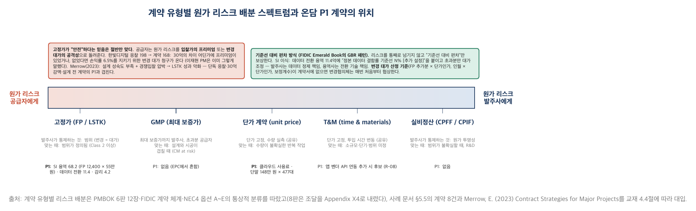

*그림 4-4. 계약 유형별 원가 리스크 배분 스펙트럼(고정가 → GMP → 단가 → T&M → 실비정산)과 온담 P1 계약의 위치. 왼쪽으로 갈수록 원가 리스크가 공급자에게, 오른쪽으로 갈수록 발주사에게 간다. P1의 SI 용역 68.2·데이터 전환 11.4·감리 4.2는 고정가, 클라우드 사용료와 단말 477대는 단가 계약, 앱 벤더 연동 추가(R-08)는 T&M 후보다. 고정가가 "안전"하다는 믿음은 절반만 맞다 — 프리미엄 또는 변경 대가로 돌아온다. FIDIC Emerald Book의 기준선 대비 편차 방식은 데이터 품질 리스크에 이식할 수 있다.*

### 실무에서 어떻게 틀리는가

고정가가 안전하다고 믿는 것, 변경 대가 산정 기준이 계약에 없는 것, 견적서 합계를 검산하지 않는 것, "3년 유지보수 포함"의 정의를 벤더마다 확인하지 않는 것, 하도급 구조와 산출물 소유를 계약에서 확인하지 않는 것, 자원 히스토그램 없이 "피크 82명"만 말하는 것, 소프트웨어 인력을 평준화할 수 있다고 믿는 것.

---

## 4.5 온담 P1 — 168.0의 근거, 145.8의 월별 PV, 컨틴전시 10.2의 배정, 관리예비비 12.0의 집행 절차

> ■ **사례 사실** — 승인 예산 168.0의 8개 내역과 3층(§3.3, P-08), 이사회 승인 조건 2항 관리예비비 원천 유보(§2.4), 응찰가 198 → 계약 168·목표 손익률 6.5%(P-12·P-13); 월별 PV 배분 규칙·컨틴전시 배정표·157.8→145.8 조정 내역은 [추가 설정] — Day2 워크북 §4.5 예시본이 정본.

### 168.0의 여덟 내역과 그 근거의 등급

비즈니스 케이스 §5의 여덟 내역을 근거의 성격으로 다시 읽는다.

| 내역 | 금액(억) | 근거의 형태 | 추정 Class (이 교재의 판단) | 원가 리스크의 위치 |
|---|---:|---|---|---|
| SI 개발 용역 | 68.2 | FP 12,400 × 55만원 — 계약 | 계약 확정 (단, FP 자체는 Class 3→G1에서 2) | 변경 대가 (R-05·R-07) |
| 상용SW 라이선스 + 3년 유지보수 | 23.4 | 벤더 견적 4건 | 견적 (검산 필요) | 수량·정의 오류, 갱신 단가 |
| 인프라 | 23.9 | 클라우드 3년 선약정 14.6 + DR·백업 4.2 + 망분리·보안장비 5.1 | 견적·단가 계약 | 사용량 변동, 규제 요건 추가(R-09) |
| POS 단말·주변기기 | 8.6 | 477대 × 148만원 = 7.06 + 설치 1.54 | 모수 (수량 확정) | 가맹 비호환 단말(R-13, 범위 밖) |
| 데이터 전환 용역 | 11.4 | 1,842 테이블 / 7.4TB — 별도 계약 | 계약 (Class 3 수준 정의) | 정본 후 변경 3.8억·6주(R-10), 데이터 품질 |
| 통합·성능시험, 3자 검증 | 9.7 | 부하 3.1 + 보안 2.4 + 감리 4.2 | 견적·계약 | 재시험 횟수 |
| 발주사 PMO·형상관리·QA | 12.6 | 3명 × 24개월 10.8 + 도구 1.8 | 내부 모수 (24개월은 프로그램 기간 — P1은 17개월) | 기간 연장(R-11) |
| P1 컨틴전시 | 10.2 | 승인 예산의 6.07% | **근거 없음 — 5.7절에서 만든다(배정 4.60 + 미배정 풀 5.60)** | — |
| **합계** | **168.0** | | | |

이 표에서 보이는 것은 168.0의 근거가 **균질하지 않다**는 것이다. 68.2는 계약이고, 8.6은 산수이고, 23.4는 검산 안 된 견적이고, 10.2는 백분율이다. 원가 기준선을 만드는 일은 이 근거의 등급을 맞추는 일이다 — 견적은 검산하고, 백분율은 리스크 분석으로 바꾸고, 계약은 지급 조건과 변경 대가 기준을 확인한다.

### 계획 원가 145.8의 산수 — 12.0은 어디서 오는가

여기서 계산을 정직하게 해야 한다. 여덟 내역 중 컨틴전시를 제외한 일곱의 합은 **157.8**이다(68.2 + 23.4 + 23.9 + 8.6 + 11.4 + 9.7 + 12.6). 그런데 계획 원가는 145.8이다. 차이 12.0은 관리예비비 유보액과 같다. 즉 이사회는 168.0을 승인 근거 여덟 내역으로 정당화했고, 프로그램 관리 규정이 그중 12.0을 원천 유보했으며, PM에게 남은 계획 원가 145.8은 **일곱 내역 157.8을 12.0만큼 줄여서** 만들어야 하는 숫자다.

이것이 G1까지 PM이 풀어야 할 첫 번째 산수다. 세 가지 길이 있다.

**(a) 재추정·기간 정합으로 줄이고, 걷어 낸 여유는 "유보"로 적는다.** 설계 스프린트 6회 후의 정의도(Class 2 상당)로 다시 추정하면 승인 시점(Class 3)의 여유가 걷힌다. 워크북 §4 조정표 [추가 설정]: PMO 12.6 → 9.6(3명 × 24개월 10.8은 프로그램 기간 기준이었고 P1은 17개월 → 7.65 + 도구 1.8 = 9.45 → 9.60; 잔여 7개월분 3.0은 G4 이후 하자보수기 PMO로 **유보**), 인프라 23.9 → 20.9(클라우드 3년 선약정 14.6을 설계 스프린트 실측 사이징 후 2년 선약정 + 1년 종량으로 재구성해 11.6; 차액 3.0은 부하시험(2027-01)에서 피크 5,100 케이스/h 초과 시 스폰서 결재로 복귀하는 **유보**). 합계 −6.0.

**(b) 범위 결정으로 줄인다 — 이연이 아니라 경계 확정.** 헌장 §13의 이연 가능 범위(옴니채널 고도화, BI 리포트)를 R5로 미루는 것은 원가를 줄이지 않는다 — FP 고정가 계약에서 이연은 인도 시점이 바뀌는 것이지 FP 기준선이 줄어드는 것이 아니고, 범위 축소는 계약 금액 감액 협상이므로 수행사가 동의해야 한다. 원가를 실제로 줄이는 범위 결정은 다른 곳에 있었다: 데이터 전환 11.4 → 9.4(7.4TB 중 5년 초과 이력 약 2.6TB는 아카이브만 하고 신 플랫폼에 이관하지 않는다 — 범위 기술서 §5 [신규] 가정, 박세연·재경팀장의 세무·감사 보존 요건 확인 필요, 헌장 v1.1 수정 요청). −2.0.

**(c) 스폰서에게 관리예비비의 재원을 묻는다 — P5 이관분.** 상용SW 23.4 → 19.4(3년 유지보수 6.0 중 G4 이후 발생하는 2·3년차 4.0은 P5 운영비 27억의 항목으로 **이관**; 라이선스 17.4 + 1년차 유지보수 2.0). −4.0. 이것은 P1 종료 후의 약정을 P5·운영 예산으로 옮기는 것이므로, 그 돈이 실제로 P5 예산(13억 + 연 운영비 27억)에 있는지를 확인해야 한다. 없다면 관리예비비 12.0은 **장부상 유보이지 별도 재원이 아니며**, 스폰서가 그것을 집행하는 순간 P1 종료 후 약정분의 재원이 사라진다. 이 질문은 PM이 답할 수 없고 정미란 CFO와 재경팀장, 박준영(P5)이 답해야 한다 — Day1 3.2절의 "헌장을 결정 요청서로 쓴다"가 원가 기준선에도 적용된다.

세 길의 합 6.0 + 2.0 + 4.0 = 12.0으로 157.8 − 12.0 = 145.8이며, 기준선 항목은 SI 68.2 / 상용SW 19.4 / 인프라 20.9 / 단말 8.6 / 데이터 전환 9.4 / 시험·감리 9.7 / PMO 9.6이 된다. 조정표의 핵심 열은 "얼마를 뺐는가"가 아니라 **"누가 언제 내는 돈으로 다시 정했는가"와 "되돌아올 조건"**이다 — 4.0은 P5가, 3.0 + 3.0은 스폰서가 조건부로, 2.0은 범위 결정으로 사라지며, 각각의 되돌아올 조건(P5 예산 거부, 사이징 초과, 하자보수기 착수, 보존 요건)이 관리예비비 집행 절차의 대상 목록이 된다. 그래서 헌장 v1.1 수정 요청 3번은 이 조정표를 헌장 §8의 부속으로 첨부하라는 것이다. 어느 길이든 **원가 기준선 문서에 그 산수가 보여야 한다.** 157.8에서 145.8로 가는 과정이 문서에 없으면 Day3에서 AC가 145.8을 넘는 순간 "원래 157.8이었다"와 "기준선은 145.8이다"가 충돌한다. 회사 정본과 Day1 문서는 3층(168.0 / 156.0 / 145.8)과 내역 8항목(합 168.0)을 각각 적었을 뿐 둘이 맞지 않는다는 것을 어디에도 적지 않았다 — 워크북 §4가 이것을 "발견"이라 부르는 이유다.

### 145.8의 월별 PV

조정 후 기준선(SI 68.2 / 상용SW 19.4 / 인프라 20.9 / 단말 8.6 / 데이터 전환 9.4 / 시험·감리 9.7 / PMO 9.6 = 145.8)을 작업 시점 기준으로 배분한 월별 PV는 다음과 같다 [추가 설정 — 배분 규칙(워크북 §4 항목 5): SI는 스프린트 시작 월에 가중치 설계 0.7 / 구현 1.1 / 통합·시험 1.2로(스프린트당 1.25 / 1.96 / 2.14), 상용SW는 라이선스 인도 시점(3월 8.0 API GW·MDM 1차, 4월 6.0 MDM 2차·APM, 5월 3.4 SAP 애드온) + 1년차 유지보수 월 0.2 × 10, 인프라는 선약정 6.0(4월) + 클라우드 월 0.4 × 14 + 망분리·보안 3.0(6월)·2.1(7월) + DR 2.1(12월)·2.1(1월), 단말은 입고 3.0(12월)·4.06(1월) + 설치 0.8(1월)·0.74(2월), 데이터 전환은 매핑~리허설 10개월 0.6→1.2→0.8, 시험·감리는 감리 게이트별(G1 0.8 / G2 1.4 / G3 1.4 / G4 0.6)·보안진단 1.0(8월)·1.4(1월)·부하시험 1.5(1월)·1.6(2월), PMO 월 0.56 × 16 + 0.64].

| 월 | 월 PV(억) | 누적 PV(억) | 누적 % | 주요 내용 |
|---|---:|---:|---:|---|
| 2026-01 | 3.06 | 3.06 | 2.1% | 설계 S1~S2, PMO |
| 2026-02 | 3.06 | 6.12 | 4.2% | 설계 S3~S4 |
| 2026-03 | 13.02 | 19.14 | 13.1% | 설계 S5~S6, 라이선스 1차 8.0(API GW·MDM), 3PL 협상 착수 |
| 2026-04 | 17.69 | 36.83 | 25.3% | **G1**, 라이선스 2차 6.0, 클라우드 선약정 6.0, 감리 0.8, 구현 R1 시작 |
| 2026-05 | 8.89 | 45.72 | 31.4% | SAP 애드온 라이선스 3.4, 데이터 전환 매핑 착수 |
| 2026-06 | 8.89 | 54.61 | 37.5% | 망분리·보안 3.0, 구현 R2 시작 |
| 2026-07 | 8.09 | 62.69 | 43.0% | 보안장비 2.1 (성수기 — 매장 배포 없음) |
| 2026-08 | 9.05 | 71.74 | 49.2% | 보안진단 1회차 1.0, 규제 검증 착수 |
| 2026-09 | 6.09 | 77.83 | 53.4% | 규제 ① 09-11, 구현 R3 시작 |
| 2026-10 | 6.29 | 84.12 | 57.7% | 매핑 종료, 마스터 정본 작업 |
| 2026-11 | 7.69 | 91.81 | 63.0% | **G2**, 감리 1.4, 리허설 준비 |
| 2026-12 | 11.19 | **103.00** | 70.6% | DR 2.1, 단말 입고 3.0, 통합시험·리허설 1회차 |
| 2027-01 | 16.20 | 119.20 | 81.8% | 단말 입고·설치 4.86, DR 2.1, 보안진단 1.4·부하시험 1.5, UAT 착수 |
| 2027-02 | 9.98 | 129.19 | 88.6% | **G3, 컷오버**, 부하시험 1.6, 감리 1.4, 단말 설치 0.74 |
| 2027-03 | 7.59 | 136.77 | 93.8% | 안정화, 이연 릴리스 R5 착수 |
| 2027-04 | 5.24 | 142.02 | 97.4% | 안정화 종료, 운영 이관 착수 |
| 2027-05 | 3.78 | **145.80** | 100.0% | **G4**, 감리 0.6, 소스 인수 |

월 값은 소수 둘째 자리 반올림이고 누적은 원값 기준이므로 손으로 더하면 ±0.01 차이가 날 수 있다. 2026년 누적은 103.00, 2027년은 42.80이다. 비즈니스 케이스 §5의 연차 집행 계획 2026년 102.0 [추가 설정]과의 차이 1.0은 PV(작업 예정)와 현금 집행(검수 후 지급)의 시점 차이로 설명 가능하며 정합이다 — 그 확인 기록이 헌장 v1.1 수정 요청 10번(BC 요약 §5)이다. 곡선의 형태는 2026-03~04에 라이선스·선약정 봉우리(누적 25%까지 4개월), 이후 월 6~9억의 완만한 구현 구간, 2026-12~2027-02에 단말·DR·시험 봉우리(누적 70→89%), 2027-03~05 꼬리(안정화·이관)다. CFO의 1차연도 148억 요구(R-04)가 P1에 배분되면 이 곡선의 2026-03~04 봉우리 — 라이선스 14.0과 클라우드 선약정 6.0 — 가 첫 번째 이연 후보이고, 그것을 미루면 A05(구현 R1)의 SS+30 의존을 통해 구현 스프린트가 인프라 없이 도는 기간이 생겨 임계경로가 밀린다 — 프리모템 원문 4번이 정확히 이 시나리오였다.

이 표를 곡선으로 그리면 그림 4-5와 같다.

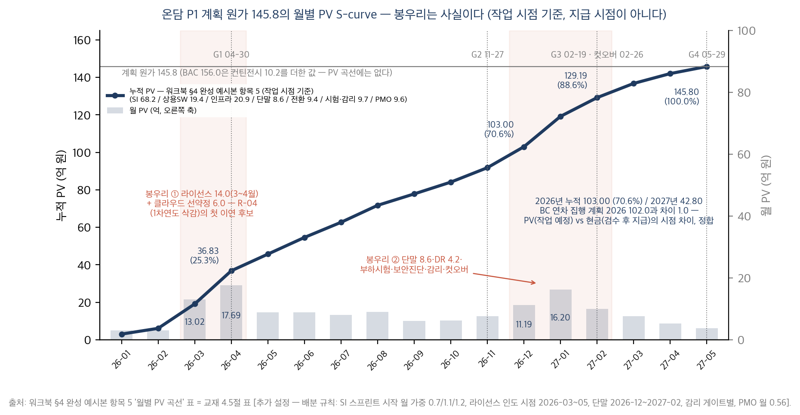

*그림 4-5. 온담 P1 계획 원가 145.8억의 월별 누적 PV S-curve — 2026-03~04(라이선스·선약정)·2026-12~2027-02(단말·DR·시험)의 급등 구간과 게이트 위치. 막대가 월 PV, 굵은 선이 누적 PV이며 봉우리는 사실이다 — 라이선스는 2026-03~05에 인도되고 단말은 2026-12~2027-02에 입고·설치된다. 첫 번째 봉우리가 R-04(1차연도 삭감)의 첫 이연 후보이고, 봉우리를 남겨야 Day3에서 4월 SPI 하락이 개발 지연인지 조달 지연인지 구분할 수 있다. 2026년 누적 103.0은 BC 연차 집행 계획 102.0과 정합이다. 워크북 §4 완성 예시본 항목 5의 값이며 배분 규칙은 [추가 설정].*

### 컨틴전시 10.2를 어느 리스크에 배정하는가

5.7절에서 리스크 등록부를 정량화한 뒤 답한다. 미리 원칙만 적는다. 컨틴전시는 **리스크별 배정액을 표로 적되 칸막이가 아니라 근거로 쓰고, 집행은 총액 안에서 한다.** 리스크별로 칸을 막으면 실현되지 않은 리스크의 몫이 사장되고, 총액으로만 두면 근거가 없다. 그래서 등록부에는 "R-08 앱 벤더 별도 견적: 대응 전 EMV 2.00, 잔여 0.60, 배정 0.60, 트리거 = 벤더 API 규격 회신 4주 지연"이 있고, 컨틴전시 배정표(워크북 §4 항목 6)에는 "총 10.2 = 컨틴전시 대상 11건 배정 4.60(잔여 EMV 4.58을 0.1 단위로 반올림) + 미배정 풀 5.60(월 동결 시 신규 식별 리스크·스프린트 재작업 — 스프린트 4회분 1.41 × 4 = 5.64에 해당, 분기 재배정) [추가 설정, 5.7절]"이 있으며, R-01·R-04의 잔여 2.20은 원인과 결정이 프로그램·스폰서 계층이므로 컨틴전시가 아니라 **관리예비비 대상**으로 따로 적는다. 집행 시 등록부와 배정표에 동시에 기록되고, 초과분은 미배정 풀 → 관리예비비 순이다.

### 관리예비비 12.0의 집행 절차

RACI 20행과 이사회 승인 조건 2항, 헌장 §12를 합치면 절차는 다음과 같다(워크북 §4 항목 7). (1) **요청** — P1 PM이 사건이 기준선 밖의 것임을 서술한다. 대상은 넷이다: 관리예비비 대상 리스크의 실현(R-01·R-04), 등록부에 없던 미식별 리스크, 조정표의 유보 항목 복귀(클라우드 3.0, PMO 3.0, 상용SW 4.0의 P5 거부 시), 컨틴전시 소진 후 잔여. 영향 분석(범위·일정·원가·편익)과 대안 3개·권고를 붙여 예외 보고 형식으로 제출한다(헌장 §12: 5영업일). (2) **검토** — 재경팀장이 집행 한도·전결 규정·연차 자금 계획과의 정합을 3영업일 내 확인한다(RACI 20행 C). (3) **결재** — 정미란 스폰서가 10영업일 내 결재하거나 프로그램 이사회에 부의한다. 단일 건 5억 초과는 프로그램 운영위 보고를 병행하고(위임전결규정의 CFO 결재 병행, 헌장 §12), 5,000만 원 이상 발주는 내부통제 지침(2026-02-16)을 따르며, 프로그램 관리예비비 24억의 총액 관리는 프로그램 PMO장이 한다. (4) **보고** — CCB 다음 회의에 보고하고 윤태호 감사팀장에게 사본을 보낸다. (5) **기준선 갱신** — 승인 금액만큼 계획 원가를 상향하고(BL-0n), PV 곡선의 해당 월을 갱신하며, 집행 한도를 동액 상향한다. 이것은 재기준선(re-baseline, CCB + 이사회 확인, P1 기간 중 최대 2회)이 아니라 **승인된 변경**으로 기록된다. (6) **기록** — 요청서·결재·CCB 보고를 형상 저장소에 보관하고 종료 보고서 원가 절에 집행 이력을 전량 첨부한다. 이 절차가 2020년 감사 지적 "컨틴전시 집행 승인 근거 부재"에 대한 두 번째 답이다(첫 번째는 컨틴전시의 리스크 ID 기록).

---

## 4.6 실무에서 어떻게 틀리는가

**"예산 168억"이라는 한 숫자.** 4.2절에서 다뤘다. 여기에 하나를 더한다 — 168억 안의 12.0 유보가 장부상 유보인지 별도 재원인지를 묻지 않는 것. 그 질문을 G1 전에 하지 않으면 G3에서 한다.

**예비비를 일반 원가에 섞기.** 작업패키지마다 얹은 10%는 컨틴전시가 아니라 낙관의 보정이고, 파킨슨 법칙으로 사라진다. 컨틴전시는 별도 줄에, 리스크 ID를 달고, 총액으로.

**견적서 합계를 검산하지 않기.** 협상 전에 산수·정의·비교의 세 단계.

**PV를 지급 일정으로 그리기.** 그러면 Day3의 EVM은 "돈을 냈는가"를 잰다.

**계획 원가의 산수를 문서에 안 남기기.** 157.8이 145.8이 된 과정(조정표 12.0과 되돌아올 조건)이 없으면 기준선은 근거 없는 숫자다.

**컨틴전시 잔액을 절감 성과로 보고하기.** 다음 프로젝트의 컨틴전시를 부풀린다.

---

## 제4장 핵심 정리

> **한 줄씩 — 수업 직전 5분 복습용**
> 1. AACE Class는 정의도로 정해지고 정확도 범위는 별도 분석이다 — "Class 3 = ±20%"는 규칙이 아니다.
> 2. 예산은 3층 — 계획 원가 + 컨틴전시(PM의 돈) = 기준선/BAC, 그 위에 관리예비비(스폰서의 돈).
> 3. 원가 기준선은 시간대별 PV 곡선이며 작업 시점으로 배분한다 — 지급 시점이 아니다.
> 4. 고정가 계약은 리스크를 없애지 않고 프리미엄이나 변경 대가로 되돌아온다.
> 5. 온담 168.0의 여덟 내역은 근거 등급이 다르고, 일곱 내역 합 157.8과 계획 원가 145.8의 차이는 발견하고 문서화해야 한다.
>
> 아래는 같은 내용의 자세한 판이다.

1. AACE Class는 정의도로 결정되고 정확도 범위는 리스크 분석으로 산정한다 — "Class 3이면 ±20%"는 규칙이 아니다. 18R-97(프로세스)과 56R-08(건축)의 범위가 다르다는 것 자체가 요점이며, 건축용은 56R-11이 아니다. SI에 이 언어를 빌리면 "우리는 어느 Class로 견적했는가"를 물을 수 있다 — 입찰 시점 FP는 Class 3~4, G1 확인서는 Class 2.
2. 예산의 층 — 계획 원가(작업패키지 추정 합, 145.8) + 컨틴전시(식별된 리스크, PM의 돈, 10.2) = 원가 기준선/BAC(156.0); + 관리예비비(미지, 스폰서의 돈, 12.0) = 승인 예산(168.0). 컨틴전시는 리스크 ID를 달고 집행·기록하고, 관리예비비는 스폰서 결재와 기준선 갱신(승인된 변경, 재기준선 아님)을 동반한다. 컨틴전시의 크기는 백분율이 아니라 EMV·몬테카를로·RCF에서 나온다.
3. 원가 기준선은 시간대별 PV 곡선이며 작업 시점 기준으로 배분한다(지급 시점이 아니다). PV·약정·현금 세 곡선은 다르고, 자금 조달 한도가 기준선 문서에 있어야 CFO의 삭감에 답할 수 있다. 배분 방법(마일스톤·고정 공식·완료 비율·배분 노력·노력 수준)은 계획 시점에 정한다.
4. 계약 유형은 리스크 배분이며 고정가는 프리미엄 또는 변경 대가로 돌아온다(Merrow). 한국 SI의 FP 고정가는 고정 부분(지급 조건·FP 진척)과 변동 부분(변경 대가, 재원은 컨틴전시 또는 관리예비비)으로 원가 기준선에 들어간다. 견적은 협상 전에 산수·정의·비교로 검산한다. 자원 히스토그램은 필요하지만 소프트웨어 인력은 평준화할 수 없다.
5. 온담 P1: 168.0의 여덟 내역은 근거 등급이 균질하지 않다(계약·산수·견적·백분율). 일곱 내역 합 157.8에서 계획 원가 145.8로 가는 12.0의 조정표 — 유보(PMO 3.0·클라우드 3.0), 범위 결정(5년 초과 이력 아카이브 2.0), P5 이관(상용SW 2·3년차 유지보수 4.0) — 와 각 조정의 되돌아올 조건이 기준선 문서에 있어야 한다. 기준선 항목은 68.2 / 19.4 / 20.9 / 8.6 / 9.4 / 9.7 / 9.6. 월별 PV는 2026-03~04(라이선스·선약정)와 2026-12~2027-02(단말·DR·시험)에 급등하며 2026년 103.0(BC 102.0과 정합) / 2027년 42.8. 컨틴전시 10.2 = 리스크별 배정 4.60 + 미배정 풀 5.60(스프린트 4회분), R-01·R-04는 관리예비비 대상. 관리예비비는 요청(예외 보고) → 재경 검토 3영업일 → 스폰서 10영업일 → CCB 보고·감사 사본 → 기준선 갱신(승인된 변경, 재기준선 아님) → 기록의 절차.

## 생각해 볼 질문

1. 여러분 회사의 마지막 프로젝트 예산은 몇 층이었는가. 컨틴전시와 관리예비비를 다른 사람이 갖고 있었는가.
2. 157.8 → 145.8의 조정 12.0 중 유보 6.0·범위 결정 2.0·P5 이관 4.0의 배합을 여러분이라면 어떻게 하겠는가. 되돌아올 조건이 붙은 유보와 재원 확인이 필요한 이관을 정미란 스폰서에게 어떻게 설명할 것인가.
3. 컨틴전시 10.2억이 식별된 잔여 노출의 약 P80이고 P90 너머는 덮지 못하며, 그 안의 미배정 풀 5.6의 근거가 P-값이 아니라 스프린트 4회분이라는 것을 알았다. 스폰서에게 P90까지 올리자고 할 것인가, 리스크 구조를 바꾸자고 할 것인가, 그대로 두고 알리기만 할 것인가.
4. CFO가 1차연도 P1 배분을 20억 줄이라고 했다. PV 곡선에서 무엇을 미룰 것인가. 미룬 것이 임계경로에 있는가.
5. 상용SW 벤더 4사의 "3년 유지보수 포함"이 서로 다른 뜻일 수 있다. 계약 전에 무엇을 물을 것인가.

## 워크북 연결

이 장의 내용은 워크북 §4 "원가 기준선과 예비비 구조"에서 온담 P1에 적용한다. 168.0의 여덟 내역에 근거 등급(계약/산수/견적/백분율)을 붙이고, 157.8 → 145.8의 조정표(항목·조정·기준선·조정 성격·근거·승인자·되돌아올 조건)를 문서화하며(스폰서 결정 요청 항목 포함), WBS 레벨 2 배분(§1과 동일, 합 145.80)과 월별 PV 표(17개월, 2026년 누적 103.0)를 배분 규칙과 함께 완성하고, 컨틴전시 배정표(배정 4.60 + 미배정 풀 5.60, 관리예비비 대상 별도)와 관리예비비 집행 절차 6단계를 쓰며, PV·약정·현금 세 곡선의 차이를 SI 지급 조건(선급·중도·잔금 비율을 스스로 정한다)으로 보이며, 자금 조달 한도(CFO의 148억 시나리오)와 대조해 이연 후보를 적는다. 컨틴전시 문서는 §5의 정량화 결과를 받아 완성한다. 심화 과제: 상용SW 견적 4건에 대해 검산 질문 목록(산수·정의·비교)을 작성하고, 데이터 전환 용역에 "기준선 대비 편차" 방식의 리스크 배분 조항 초안을 쓴다.

---

# 제5장 리스크

## 5.1 식별 — RBS, 가정 분석, 프리모템 회수, base rate

### 개념

Day1 3.5절은 착수 시점의 리스크 식별을 다뤘다 — 가정·구조·base rate에서 나오는 것, 프리모템. 계획 단계의 식별은 그 위에 두 가지를 더한다. **WBS가 생겼으므로 작업패키지 단위의 리스크**가 보이고, **일정·원가 기준선이 생겼으므로 리스크의 영향을 날짜와 금액으로** 적을 수 있다.

**RBS(risk breakdown structure)**는 리스크의 원천을 계층으로 분류한 것이다. 기술 / 조직 / 외부 / 계약 / 재무 / 규제 같은 상위 범주 아래 하위 원천을 둔다. RBS의 용도는 두 가지다. 식별의 점검표 — "외부 의존" 가지를 보면 P2·3PL·앱 벤더·규제·별도 법인이 각각 있는가를 묻게 된다. 그리고 집중의 진단 — 식별된 리스크가 한 가지에 몰려 있으면(P1은 "외부 의존"과 "조직"에 몰려 있다) 그 가지가 프로젝트의 구조적 취약점이다. Day1 초기 리스크 목록의 "범주" 열이 RBS의 레벨 1이다.

**가정 분석(assumption analysis)**은 범위 기술서(2.1절)의 가정 목록을 하나씩 "이 가정이 틀리면"으로 뒤집는 것이다. Day1에서 헌장 가정 6개가 R-01·R-02·R-03·R-05·R-08의 원인이 되었다. 계획 단계에는 가정이 늘어난다 — 생산성 계수(3.1절), 지급 조건, 단말 호환 기준, 리허설 3회로 충분하다는 것, 설 연휴에 UAT 참여자가 있다는 것. 새 가정마다 새 리스크 후보다.

**프리모템 회수.** Day1의 프리모템 원문 61건 중 15건이 발췌되었고 13+2건이 등록부에 올랐다. 나머지 46건은 어디 있는가. 계획 단계에서 그 원문을 다시 읽으면 WBS와 일정이 생긴 지금은 리스크로 서술할 수 있는 것이 있다. 예컨대 "설 연휴에 UAT 참여자가 빠진다"는 착수 시점에는 막연했지만 3.5절의 달력이 생기자 구체적 리스크가 되었다.

**Base rate.** Day1 1.2절의 reference class를 계획 단계에서 실제로 만드는 시도다. 온담의 정보화 사업 4건은 표본으로 부족하므로, 워크북에서는 "비슷한 규모의 SI 프로젝트에서 데이터 전환 정본 판정 후 마스터 변경이 일어난 비율", "FP 고정가 계약에서 변경 대가가 계약 금액의 몇 %에 이르는 비율" 같은 질문을 세우고, 답이 없다는 사실을 기록한다. Flyvbjerg(2021)가 base rate neglect를 저성과의 1차 원인으로 꼽은 것을 기억하라.

### 리스크 서술의 규칙 — 다시 한번

Day1에서 세운 규칙을 계획 단계에서도 지킨다. **원인(현재 사실) → 사건(일어날 수 있는 것) → 영향(범위·일정·원가·편익에 미치는 것)**. 계획 단계에서 달라지는 것은 영향의 단위다 — "컷오버 지연"이 아니라 "임계경로 M이 G3 뒤로 밀려 컷오버 창 이탈, 다음 창 2027년 하반기, 2차 컷오버 비용 N억". 원인은 트리거를, 사건은 확률을, 영향은 금액과 일수를 준다.

### 실무에서 어떻게 틀리는가

RBS를 만들지 않아 "외부 의존"이 다섯 개인데 하나로 세는 것, 가정 목록을 갱신하지 않아 계획 단계의 새 가정이 리스크가 안 되는 것, 프리모템 원문을 등록부에 옮긴 뒤 버리는 것, base rate 질문을 세우지 않는 것, 리스크를 "일정 지연 리스크"처럼 결과로 서술해 원인이 없는 것.

---

## 5.2 정성 분석 — 확률-영향 매트릭스와 그 함정

### 개념

정성 분석은 리스크를 확률과 영향의 등급으로 매겨 우선순위를 정하는 것이다. 흔한 도구가 **확률-영향 매트릭스(P-I matrix)** — 5×5 격자에 확률(매우 낮음~매우 높음)과 영향(매우 작음~매우 큼)을 놓고 곱 또는 위치로 등급(높음·중간·낮음)을 정한다. 정성 분석의 가치는 정확성이 아니라 **속도와 합의**다 — 13건을 한 회의에서 상·중·하로 나누고 어디에 먼저 시간을 쓸지 정한다.

### 함정

**5×5의 착시.** 확률 5단계 × 영향 5단계의 곱은 1~25이고, 그것을 "점수"로 부르면 서열척도가 비율척도처럼 보인다. 확률 4 × 영향 2 = 8과 확률 2 × 영향 4 = 8은 같은 점수지만 전혀 다른 리스크다 — 앞은 자주 일어나는 작은 것, 뒤는 드문 큰 것. 그리고 영향 5단계의 간격이 같지 않다("매우 큼"은 "큼"의 두 배가 아니라 열 배일 수 있다). 처방은 점수를 더하거나 평균 내지 말고 **위치**로 읽는 것, 그리고 영향 등급에 실제 범위(억 원, 영업일)를 붙이는 것이다. "영향 상 = 원가 2억 초과 또는 일정 10영업일 초과"처럼 정의된 등급만이 비교 가능하다.

**상관 무시.** 매트릭스는 리스크를 하나씩 놓는다. 그러나 P1의 R-01(P2 지연)·R-03(3PL 거부)·R-12(편익 분모)는 모두 한동석 본부장의 결정과 이천센터의 협조에 걸려 있고, R-05(겸임 인력)·R-06(OD-POS 지식)·R-10(정본 후 변경)은 모두 박세연 본부장의 시간에 걸려 있다. 하나가 일어나면 다른 것의 확률이 오른다. 매트릭스에 상관을 표시할 칸은 없지만, 등록부에 "연관 리스크" 열을 두고 같은 원인을 가진 리스크를 묶어 보면 진짜 상위 리스크가 보인다 — Day1 프리모템 군집화가 정확히 이것이었다.

**확률의 의미.** "확률 중 = 30~50%"라고 할 때 그 숫자는 어디서 왔는가. 대개 담당자의 감이다. 6.5절 Hubbard의 보정(calibration)이 이 감을 훈련하는 방법이고, base rate가 있으면 그것이 우선한다.

**근접성과 긴급성의 부재.** 매트릭스는 언제 일어나는가를 담지 않는다. 확률 중·영향 상인 리스크가 다음 달 것인가 내년 것인가에 따라 우선순위는 다르다. Day1 등록부의 "근접성" 열과 "다음 검토" 열이 이것을 보완한다.

P1의 위협 13건과 기회 2건을 5×5 매트릭스에 놓고 같은 원인으로 묶이는 것을 연결하면 그림 5-1과 같다.

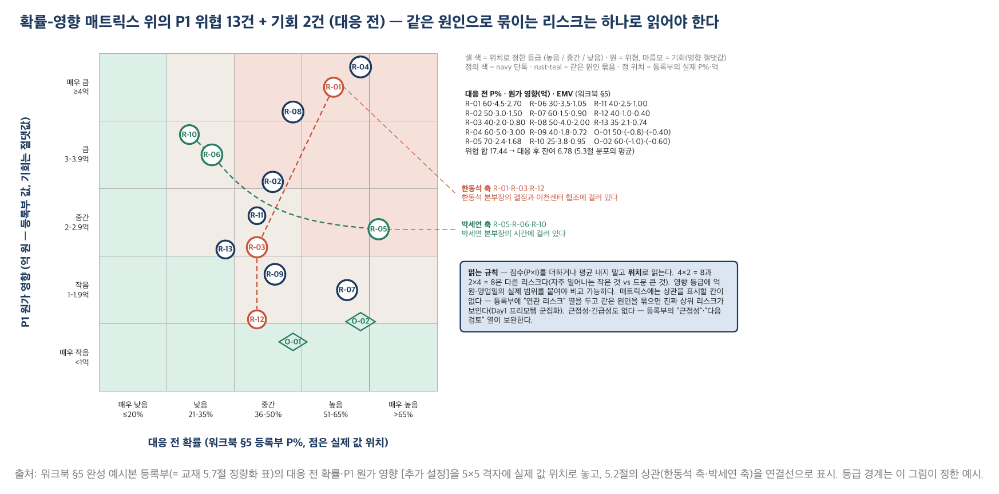

*그림 5-1. 확률-영향 매트릭스 위의 P1 위협 13건 + 기회 2건 — 같은 원인(한동석 축·박세연 축)으로 묶이는 리스크의 연결. 가로가 대응 전 확률, 세로가 P1 원가 영향(억 원 — 등급에 실제 범위를 붙였고, 점은 등록부의 실제 P%·억 위치에 놓았다. 기회 2건은 마름모, 영향은 절댓값)이며 셀의 색은 위치로 정한 등급이다. 점수를 더하지 말고 위치로 읽는다. 붉은 파선은 한동석 본부장의 결정에 걸린 R-01·R-03·R-12, 초록 파선은 박세연 본부장의 시간에 걸린 R-05·R-06·R-10이며, 매트릭스에 없는 상관을 등록부의 "연관 리스크" 열이 보완한다. 확률·영향은 워크북 §5 완성 예시본 등록부(= 5.7절 표)의 값 [추가 설정]이고 등급 경계는 이 그림이 정한 것이다.*

### 실무에서 어떻게 틀리는가

점수를 더해 "총 리스크 점수 142"를 보고하는 것, 영향 등급에 금액 정의가 없는 것, 상관을 무시해 "상 리스크 3건"이 사실은 원인 하나인 것을 모르는 것, 확률을 감으로 적고 근거를 안 묻는 것, 매트릭스만 만들고 대응으로 안 가는 것.

---

## 5.3 정량 분석 — EMV, 민감도, 몬테카를로, 멱함수 꼬리 재방문

### EMV — 기대 화폐 가치

> **작은 숫자로 먼저.** 일어날 확률 30%, 일어나면 5억이 나가는 리스크의 EMV = 0.3 × 5 = **1.5억**. 이런 리스크가 열 개 있고 EMV 합이 8억이라면, 컨틴전시 10억은 "평균적인 해"에는 남지만 열 개 중 서너 개가 같은 해에 터지면 모자란다 — EMV는 평균이고, 컨틴전시는 평균이 아니라 어느 확률까지 덮을지를 정하는 돈이다. 아래 온담의 13+2건 계산은 이 한 줄을 건마다 한 것이다.

EMV = 확률 × 영향(금액). 위협은 음수(비용), 기회는 양수(절감)로 놓거나, 관례대로 위협의 EMV를 양의 비용으로 적고 기회를 음으로 적는다. 리스크마다 EMV를 구해 더하면 **리스크 노출(risk exposure)**의 평균값이 나오고, 그것이 컨틴전시의 첫 번째 근거다(4.2절).

EMV의 한계는 두 가지다. **평균이다** — 실제 결과는 평균이 아니라 분포의 한 점이고, 위협은 대개 오른쪽 꼬리가 길다(초과는 크고 절감은 작다). EMV 합만큼의 컨틴전시는 "평균적으로 충분"이지 특정 확률로 충분한 것이 아니다. **선형이다** — 확률 10% × 영향 100억과 확률 100% × 영향 10억은 EMV가 같지만, 전자는 회사를 흔들고 후자는 관리 가능하다. 리스크 허용도(risk appetite)가 다른 두 리스크를 같은 숫자로 만든다.

그럼에도 EMV를 쓰는 이유는 **투명성**이다. 확률과 영향이 각각 적혀 있으므로 스폰서가 "그 확률은 왜 60%인가"를 물을 수 있다. 몬테카를로는 그 질문을 시뮬레이션 안에 숨긴다.

**의사결정 나무(decision tree)**는 EMV를 대안 선택에 쓰는 형태다. R-01에 대해 "분리 컷오버 설계를 지금 한다(비용 확정 N억) vs 안 한다(P2 지연 시 2차 컷오버 비용 M억 × 확률)"의 두 가지를 EMV로 비교하면 설계 옵션의 가치가 나온다. 이것이 G1까지 프로그램 이사회에 가져갈 결정의 형식이다.

### 민감도 — 무엇이 결과를 움직이는가

민감도 분석은 입력 하나씩을 범위 안에서 움직여 결과(총원가, 종료일)가 얼마나 움직이는지를 본다. 결과를 막대로 정렬하면 **토네이도 다이어그램**이 되고, 가장 긴 막대가 가장 중요한 불확실성이다. P1의 원가에서 가장 긴 막대는 대개 변경 대가(R-05·R-07·R-08의 합)이고, 일정에서는 P2 MC(R-01)와 정본 후 변경(R-10)이다. 민감도의 용도는 "어디에 리스크 대응 자원을 쓸 것인가"이며, 긴 막대의 원인을 줄이는 것이 짧은 막대 열 개를 줄이는 것보다 낫다.

### 몬테카를로 — 분포에서 P-값으로

3.4절의 일정 몬테카를로와 같은 방법을 원가에 쓴다. 리스크마다 발생 확률과 영향 분포(3점)를 주고, 추정 불확실성(작업패키지 원가의 분포)을 더해 수천 번 시뮬레이션하면 총원가의 분포가 나온다. P50·P80을 읽고, 계획 원가와의 차이를 컨틴전시로 잡는다. 함정은 3.4절과 같다 — 상관을 무시하면 분포가 좁아지고 P80이 과소평가된다. Hulett의 risk driver 방식(리스크를 여러 작업패키지에 동시 매핑)이 처방이다.

### 멱함수 꼬리 재방문 — 평균 컨틴전시의 실패

Day1 1.2절에서 Flyvbjerg 등(2022)의 발견 — IT 프로젝트 원가 초과가 정규분포가 아니라 멱함수 분포를 따른다 — 을 보았다. 계획 단계에서 이것이 뜻하는 것을 정확히 적는다.

멱함수 분포에서 평균은 꼬리에 끌려 올라가고, 분산은 (지수에 따라) 무한할 수 있다. 그런 분포에서 **"EMV 합만큼의 컨틴전시"는 대부분의 프로젝트에서는 남고, 소수의 프로젝트에서는 턱없이 모자란다.** 그리고 어떤 유한한 컨틴전시도 꼬리를 덮지 못한다 — P80을 덮으면 P90이 있고, P90을 덮으면 P95가 있으며, 그 간격은 정규분포보다 훨씬 크다. 온담 P1에서 그 꼬리는 무엇인가. 프리모템 실패 선언문 F3 — 1차연도 삭감 + 3PL 결렬 + P2 지연이 결합해 G2에서 중단 또는 범위 50% 축소 — 이 그것이다. 세 사건은 독립이 아니고(모두 재무 압박과 물류본부의 결정에 걸려 있다), 결합하면 영향은 합이 아니라 곱에 가깝다.

처방은 컨틴전시 증액이 아니다. Flyvbjerg의 처방은 **상호의존을 끊는 분할(modularity)**이며, P1에서 그 형태는 이미 나와 있다 — 매장·주문과 물류의 분리 컷오버(R-01 대응), 가맹 포털의 선행 릴리스(O-02), 야간 배치 폴백(R-03 대응). 세 가지 모두 "한 부분이 실패해도 다른 부분이 산다"는 구조이고, 그것이 꼬리를 자르는 유일한 방법이다. 컨틴전시는 몸통을 덮고, 구조가 꼬리를 자른다. 워크북에서 여러분은 컨틴전시 10.2억이 어디까지 덮고(식별된 잔여 노출의 약 P80 [추가 설정]) 그 너머는 무엇이 덮는지(분리 설계, 관리예비비, 프로그램 이사회의 중단 결정)를 한 장에 적는다.

리스크 노출의 분포와 그 위의 EMV 합·P50·P80·컨틴전시 10.2의 위치를 그림 5-2에 놓았다.

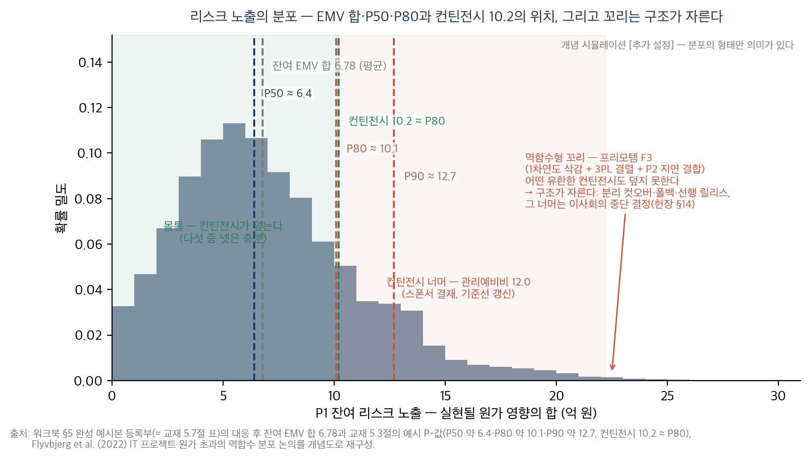

*그림 5-2. 리스크 노출의 분포 — EMV 합(평균)·P50·P80·컨틴전시 10.2의 위치, 그리고 꼬리는 컨틴전시가 아니라 구조가 자른다. 잔여 위협 EMV 합 6.78은 평균이며 분포의 오른쪽 꼬리에 끌려 P50(약 6.4)보다 크다. 컨틴전시 10.2는 식별된 노출의 약 P80으로 몸통을 덮고(다섯 중 넷은 충분 — 단, 그중 2.20은 관리예비비가 지는 R-01·R-04의 몫이고 미식별 리스크는 이 분포에 없다), 그 너머는 관리예비비 12.0이 스폰서 결재로 덮으며, 결합 사건(프리모템 F3 — 1차연도 삭감 + 3PL 결렬 + P2 지연)의 멱함수형 꼬리는 어떤 유한한 컨틴전시도 덮지 못한다 — 분리 컷오버·폴백·선행 릴리스라는 구조가 자르고, 그 너머는 이사회의 중단 결정이다. 잔여 리스크 13건은 워크북 §5 완성 예시본(= 5.7절 표)의 값이고, P-값(P50 약 6.4·P80 약 10.1·P90 약 12.7)은 4.2절·5.3절의 예시에 맞춘 개념 시뮬레이션 [추가 설정]이다.*

### 실무에서 어떻게 틀리는가

EMV 합을 컨틴전시로 놓고 "80% 안전"이라고 믿는 것, 확률 10% × 100억과 100% × 10억을 같은 리스크로 보는 것, 몬테카를로에 독립 입력을 넣는 것, 토네이도 없이 열 개 리스크에 자원을 고르게 쓰는 것, 꼬리를 컨틴전시로 덮으려는 것.

---

## 5.4 대응 — 위협 5·기회 5, 소유자·트리거·2차 리스크, 리스크 예산

### 대응 전략

위협에 대한 전략은 다섯이다 — **회피(avoid)** 원인을 제거하거나 계획을 바꿔 리스크가 성립하지 않게 한다(R-10: G2 전 마스터 6종 변경 동결을 CCB 의결 — 판정 후 변경이라는 사건 자체를 막는다). **전가(transfer)** 영향을 제3자에게 옮긴다(R-08: 앱 유지보수 계약에 소스 인수·API 연동 조항 — 벤더가 연동 의무를 진다; 보험, 고정가 계약도 전가다). **완화(mitigate)** 확률 또는 영향을 줄인다(R-06: 13본 문서화를 설계 스프린트 1~3에 전진 배치 — 이탈 시 영향을 줄인다). **수용(accept)** 아무것도 안 하되(수동적) 또는 컨틴전시를 잡아 둔다(능동적). **상신(escalate)** 프로젝트 밖의 것이므로 상위 계층에 넘긴다(R-01: P2 리드타임은 프로그램의 것 — 프로그램 PMO장이 소유자, P1은 분리 설계로 자기 몫만 완화).

기회에 대한 전략도 다섯이다 — **활용(exploit)** 확실히 일어나게 한다(O-02: 가맹 포털을 이연 불가 항목으로 헌장에 박고 2026-Q4 선행 릴리스). **공유(share)** 제3자와 나눈다(수행사와 조기 완료 인센티브). **증대(enhance)** 확률·영향을 키운다(O-01: 문서화 전진 배치를 R-06 완화와 통합). **수용**. **상신**.

Hillson(2002)이 기회를 리스크 프로세스에 정식으로 포함시키자고 제안한 이래 표준은 위협과 기회를 대칭으로 다룬다(6.8절). 실무에서 기회 칸이 비어 있는 등록부는 프로젝트를 방어적으로 만든다 — Day1에서 O-02가 "이 프리모템에서 나온 가장 실용적인 발견"이었던 것을 기억하라.

### 소유자·트리거·2차 리스크

**소유자(owner)**는 그 리스크의 원인에 가장 가까이 있고 대응 자원을 가진 사람이다. Day1 등록부에서 13건 중 P1 PM이 소유자인 것은 R-07·R-13(과 R-04의 대응안 작성)뿐이었다. 계획 단계에서 대응 전략이 붙으면 소유자의 의미가 구체화된다 — 소유자는 **대응 계획에 서명하고, 트리거를 감시하고, 대응을 집행할 권한을 가진 사람**이다. 한동석 본부장이 R-03의 소유자라는 것은 그가 3PL 협상 착수(2026-03)와 폴백 결정(2026-06-30)을 하고, 협상 미착수라는 트리거를 보고할 의무가 있다는 뜻이다. 그 의무는 RACI(Day1 §4)의 A와 일치해야 하고, 워크북 §5에서 소유자가 대응 계획에 실제로 서명한다.

**트리거(trigger)**는 리스크가 현실화되고 있다는 관측 가능한 신호다. Day1 등록부의 "트리거 신호" 열이 그것이고, 계획 단계에서는 트리거에 **측정 방법과 주기**를 붙인다 — "회의 참석률 70% 미만 2주 연속"(R-05)은 누가 매주 세는가. 트리거가 감시되지 않으면 리스크는 이슈가 된 뒤에야 발견된다.

**2차 리스크(secondary risk)**는 대응이 만드는 새 리스크다. R-02의 대응(포털과 POS SW 분리 릴리스)은 두 번 배포하므로 매장 부하와 통합 결함의 리스크를 만들고, R-08의 대응(계약 조항 추가)은 벤더가 조항을 거부하고 유지보수 계약 자체를 흔드는 리스크를 만든다. 2차 리스크는 등록부에 별도 행으로 들어가고, 원 리스크와 연결된다. **잔여 리스크(residual risk)**는 대응 후에 남는 것이며, 잔여의 EMV 합이 컨틴전시의 근거다(5.7절).

### 리스크 예산 — 대응 비용은 어디에 있는가

대응에는 돈이 든다. 문서화 전진 배치(R-06), 단말 전수 조사(R-13), 폴백 설계(R-03), 분리 컷오버 옵션 설계(R-01)는 모두 작업이다. 이 비용은 어디에 있는가. **계획된 대응의 비용은 계획 원가(작업패키지)에 있고, 리스크가 현실화되었을 때의 비용은 컨틴전시에 있다.** 분리 컷오버 설계는 WBS 1.3.4·1.6.9의 작업패키지이고(계획 원가, 추가 FP 0), P2가 실제로 늦어 2차 컷오버를 실시하는 비용 4.5억은 관리예비비다(R-01은 원인·결정이 프로그램 계층이므로 컨틴전시 대상이 아니다 — 워크북 §4 배정표). 13건 중 11건의 대응이 이렇게 WBS 작업패키지 안에 있고, 조건부 대응 6건만 컨틴전시에 배정되어 있다. 이 구분이 없으면 대응 비용이 컨틴전시에서 나가 컨틴전시가 계획 단계에 이미 반쯤 소진된다.

위협 5·기회 5 대응 전략에 P1의 리스크를 배정하고 잔여·2차 리스크의 흐름을 붙이면 그림 5-3과 같다.

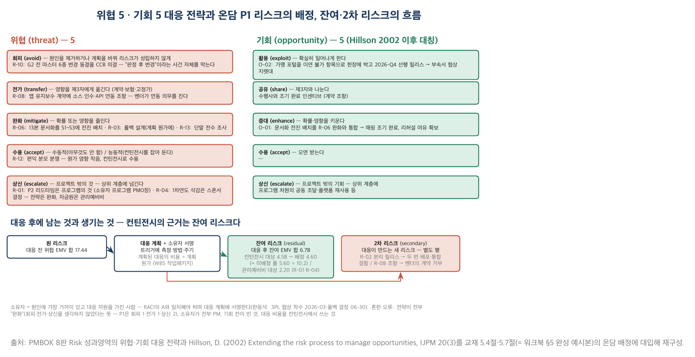

*그림 5-3. 위협 5·기회 5 대응 전략과 온담 P1 리스크의 배정, 잔여 리스크·2차 리스크의 흐름. P1의 13건에는 회피 1(R-10)·전가+완화 1(R-08)·완화+수용 1(R-03)·관리예비비 대상으로 상위 계층에 올린 2(R-01·R-04, 전략은 완화)가 있고, 기회 O-01·O-02는 활용이다. 아래의 흐름이 요점이다 — 계획된 대응의 비용은 계획 원가(작업패키지)에 있고, 잔여 리스크의 실현 비용이 컨틴전시이며(잔여 EMV 6.78 중 컨틴전시 대상 4.58 → 배정 4.60, 미배정 풀 5.60과 합쳐 10.2), 대응이 만드는 2차 리스크(R-14~R-18)는 등록부의 별도 행이다. Hillson (2002)과 PMBOK 8판 Risk 성과영역을 바탕으로 재구성.*

### 실무에서 어떻게 틀리는가

대응 전략이 전부 "완화"인 것(회피·전가·상신이 없다는 것은 원인을 제거하거나 밖으로 넘길 생각을 안 했다는 뜻), 소유자 칸이 전부 PM인 것, 소유자가 대응 계획에 서명하지 않은 것, 트리거에 측정 주기가 없는 것, 2차 리스크를 안 적는 것, 대응 비용을 컨틴전시에서 쓰는 것, 기회 칸이 빈 것.

---

## 5.5 허용범위 격자와 리스크 노출 — 허용범위는 노출의 함수다

### 개념

Day1 3.4절의 허용범위 격자(7 성과목표축 × 3 계층)는 거버넌스 문서였다 — PM이 묻지 않고 결정할 수 있는 폭. 계획 단계에서 그 격자는 **리스크 노출과 대조**되어야 한다. 원리는 간단하다. **허용범위는 그 계층이 흡수하기로 한 리스크 노출의 크기다.** 원가 허용범위 +6%(10.08억)는 "이 정도 원가 편차는 PM이 리스크 대응으로 흡수한다"는 뜻이고, 그러면 PM의 컨틴전시(10.2억)와 같은 크기여야 논리가 맞는다 — 실제로 거의 같지만 **같지 않다.** Day1의 +6%는 승인 예산 168.0을 분모로 한 프로그램 규정의 숫자이고, 계획 원가 145.8 + 10.08 = 155.88 ≠ 집행 한도 156.0이다. 0.12의 틈은 사소해 보이지만 "허용범위 내인데 집행 한도 초과"라는 상황을 논리적으로 허용한다. 그래서 워크북 §5 격자 확정본은 원가 축을 **"+10.2억 = 컨틴전시 전액 = 계획 원가의 +7.0%"**로 다시 정의한다 — 계획 원가 + 허용범위 = 집행 한도로 층이 정확히 맞물린다(헌장 v1.1 수정 요청 4번). 일정 허용범위 +15영업일은 프로그램 합류 버퍼(15영업일)와 같고, 범위 ±3%는 FP 재산정 트리거(FP ±372점)와 같다. 온담의 초안은 우연이 아니라 설계된 것이며, 계획 단계의 숫자가 그 설계의 분모를 검증한다.

리스크 축의 허용범위 "EMV 8억"은 다른 축과 성격이 다르다 — 결과의 편차가 아니라 **노출 자체의 한계선**이다. 등록부의 **잔여** 위협 EMV 합이 8억을 넘을 것으로 예상되면 그 순간 예외이며, 사건이 일어나지 않았어도 스폰서에게 보고한다. "잔여" 기준이어야 하는 이유는 대응 전 합(17.44)은 어느 프로젝트나 넘기 때문이고, 여기에 "단일 리스크 잔여 EMV 2억 초과 시 보고"를 더해야 합계가 8 아래라는 사실이 R-04(대응 전 3.00) 하나를 숨기지 못한다. 이것이 PRINCE2의 "risk tolerance"가 의미하는 것이고, 리스크 등록부를 정량화해야 하는 거버넌스적 이유다.

편익 축 −5%p는 비즈니스 케이스의 손익분기(66%)에서 역산된다. P1 직접 편익 118억의 실현률이 66% 아래로 가면 5년 NPV가 음이 된다. 100%에서 66%까지 34%p의 여지가 있고, 그것을 프로젝트(−5%p) / 프로그램(−10%p) / 이사회(그 너머)로 나눈 것이 격자다. 프로젝트 계층이 5%p(약 5.9억/년)까지의 편익 전망 하락은 스스로 다루고, 그 이상은 프로그램에 올리며, 15%p를 넘으면 이사회가 사업 계속 여부를 본다. Day1에서 "이 폭이 적절한지는 스폰서가 결정해야 한다"고 한 것의 근거가 이 역산이다.

### 사내 규정과의 대조 — 다시

Day1에서 지적한 불일치 — 원가 허용범위 10.08억 vs 본부장 위임전결 5억 — 는 헌장 §12가 "단일 건 5억 초과는 허용범위 내라도 CFO 결재 병행"으로 정리했다. 계획 단계에서 확인할 것은 그 병행이 컨틴전시 집행 절차(4.5절)와 맞는가다. 리스크 ID를 단 컨틴전시 집행 건이 5억을 넘으면(R-08 4억은 안 넘고, R-01의 2차 컷오버 4.5억은 안 넘지만 R-06 3.5 + R-10 3.8이 한 달에 겹치면 넘는다) CFO 결재가 붙고, 결재에 10영업일이 걸리면 대응이 늦어진다. 이것 자체가 등록부에 올릴 2차 리스크다(Day1 실습 과제 — 워크북의 예비 번호 R-14~R-18 뒤에 붙는다).

---

## 5.6 리스크 등록부 vs 이슈 로그, 리뷰 주기

**리스크는 아직 일어나지 않은 것, 이슈는 이미 일어난 것이다.** 리스크가 현실화되면 등록부의 상태를 "발생"으로 바꾸고 이슈 로그에 행을 만들며, 컨틴전시 집행은 이슈에 대해 이루어진다. 둘을 한 문서에 섞으면 확률이 100%인 "리스크"가 등록부에 남고, 아무도 그것을 이슈로 관리하지 않는다. 이슈 로그는 Day3의 주제다.

**리뷰 주기**는 세 층이다. 스프린트마다(2주) — 트리거 관측값 갱신, 근접한 리스크의 상태. 월 1회(CCB, 셋째 목요일) — 등록부 전체, 컨틴전시 잔액과 집행 기록, 잔여 EMV 합과 허용범위 8억의 대조. 게이트마다(G1·G2·G3) — 프리모템 재실시, 등록부 재기준선, 허용범위 격자 재확인. 등록부의 "다음 검토" 열이 이 주기를 리스크마다 정한 것이다.

등록부가 착수 때 한 번 쓰고 잠자는 것을 막는 유일한 방법은 **등록부를 보고서의 입력으로 만드는 것**이다. 월간 성과 보고(Day3)에 "잔여 EMV 합 / 허용범위 8억 / 컨틴전시 잔액 / 이번 달 발생한 리스크 / 트리거 관측값"이 고정 칸으로 있으면 등록부는 매달 갱신될 수밖에 없다.

---

## 5.7 온담 P1 — 13+2건의 정량화, EMV 합과 컨틴전시 10.2의 대조, 허용범위 7축×3계층의 확정

> ■ **사례 사실** — 허용범위 초안 7축 × 3계층(§5.6), 통제 밖의 리스크 원천(§6.4, P-17); 초기 리스크 13+2건은 Day1 워크북 §5.5, 확률·영향·EMV 값은 [추가 설정] — Day2 워크북 §5.5 예시본이 정본.

### 정량화 — 대응 전과 후

Day1 등록부의 상·중·하를 확률(%)과 영향(억)으로 바꾼다 [추가 설정 — 확률과 영향은 워크북 §5 완성 예시본의 값이며, 여러분은 워크북에서 스스로 정하고 근거(트리거 근접성 > 과거 이력 > 프리모템 득표)를 적는다. 영향은 P1 원가에 미치는 것(컨틴전시 또는 관리예비비에서 실제로 나갈 금액)만 적었고, 일정 영향은 별도 열에 있다].

| ID | 원인 → 사건 (요약) | 소유자 | 대응 전 P | 영향(억) | EMV | 대응 전략 | 잔여 P × 영향 | 잔여 EMV | 자금원 | 일정 영향(영업일) |
|---|---|---|---:|---:|---:|---|---|---:|---|---|
| R-01 | P2 리드타임 41주 → MC 04-02 → 물류 시험 G3 후 | 프로그램 PMO장 | 60% | 4.5 | 2.70 | 완화(분리 가능 설계 1.3.4·1.6.9, 분리 결정 G1 이사회 부의) — **관리예비비 대상** | 60% × 2.0 | 1.20 | 관리예비비 | 20 (임계, A15) — 창 이탈 또는 2차 컷오버 |
| R-02 | 가맹 부속서 지연·거부 → SW 배포 축소 | 오정근 | 50% | 3.0 | 1.50 | 완화(분리 릴리스 1.4.3, 단말 조사 1.1.6) + O-02 활용 | 30% × 2.0 | 0.60 | 컨틴전시 0.60 | 15 (비임계) |
| R-03 | 3PL 연동 거부 → 센터 재고 야간 배치 | 한동석 | 40% | 2.0 | 0.80 | 완화(폴백 1.3.3 계획 원가에) + 수용 | 40% × 1.2 | 0.48 | 컨틴전시 0.50 | 10 (비임계, A08 TF 20) |
| R-04 | 1차연도 148억 → P1 배분 축소 → 라이선스·선약정 지연 | 정미란 | 60% | 5.0 | 3.00 | 완화(이월 vs 총액 삭감 시나리오별 축소안 제출 완료, PV 봉우리 이월 옵션) — **관리예비비 대상** | 40% × 2.5 | 1.00 | 관리예비비 | 20 (임계, A03→A05) |
| R-05 | 겸임 인력 참석률 → 대기 → 변경대가 | 박세연 | 70% | 2.4 | 1.68 | 완화(결정 SLA 5영업일, 대체 결정권자, 투입률 월 측정) | 40% × 1.5 | 0.60 | 컨틴전시 0.60 | 10 (임계, A01·A05) |
| R-06 | OD-POS 지식 보유자 1명 → 13본 분석 불가 | 박세연 | 30% | 3.5 | 1.05 | 완화(복원 S2~S6 전진 배치 1.5.5) + O-01 | 20% × 1.5 | 0.30 | 컨틴전시 0.30 | 25 (근접 임계, A02→A09 TF 5) |
| R-07 | 동결 직전 요구 집중 → ±35건 초과 → FP 재산정 | P1 PM | 60% | 1.5 | 0.90 | 완화(접수 마감 2주 전, Must ≤ 60%) | 40% × 1.0 | 0.40 | 컨틴전시 0.40 | 10 (임계, 구현 스프린트) |
| R-08 | 앱 벤더 연동 계약 외 주장 → 별도 견적 4억 | 박세연 (계약: 오정근) | 50% | 4.0 | 2.00 | **전가**(계약 조항 추가) + 완화(API 규격 조기 제공) | 30% × 2.0 | 0.60 | 컨틴전시 0.60 (벤더 견적은 P1 예산 외) | 15 (비임계) |
| R-09 | 별도 법인 처리 주체 미확정 → 공장 연동 재설계 | 최영주 | 40% | 1.8 | 0.72 | 완화(위탁 계약 초안 03, P4 체크포인트) | 20% × 1.5 | 0.30 | 컨틴전시 0.30 | 10 (비임계) |
| R-10 | 정본 후 마스터 변경 → 610 테이블 재매핑 3.8억·6주 | 박세연 | 25% | 3.8 | 0.95 | **회피**(마스터 동결 CCB 의결, 1.5.8 산출물 ④) | 10% × 3.8 | 0.38 | 컨틴전시 0.40 | 30 (근접 임계, A13 TF 5) |
| R-11 | SAC 미합의 → G4 인수 거부 → 하자보수 장기화 | 박준영 | 40% | 2.5 | 1.00 | 완화(SAC 공동 작성 G1, G3 사전 점검, 1.6.10) | 20% × 2.0 | 0.40 | 컨틴전시 0.40 | 40 (임계, A20) |
| R-12 | 편익 분모·책임자 분쟁, 노조 실사 비협조 | 오정근·한동석 | 40% | 1.0 | 0.40 | 완화(책임자 서명 G1, 두 분모 리포트) | 25% × 0.8 | 0.20 | 컨틴전시 0.20 | 10 (비임계) |
| R-13 | 가맹 구형 단말 펌웨어 실패 → 수기 복귀·롤백 | P1 PM | 35% | 2.1 | 0.74 | 완화(전수 조사 04 1.1.6, 파일럿 구형 기종 포함 1.1.7) | 15% × 2.1 | 0.32 | 컨틴전시 0.30 | 6 (롤백) |
| **위협 합계** | | | | | **17.44** | | | **6.78** | 컨틴전시 대상 4.58 / 관리예비비 대상 2.20 | 단순 합 97.1 → 잔여 33.0 |
| O-01 | 문서화 조기 완료 → 매핑 가속 | 박세연 | 50% | −0.8 | −0.40 | 활용(R-06 조치와 통합) | 50% × −0.8 | −0.40 | — | −5 |
| O-02 | 포털 선행 릴리스 → 협상 지렛대 | 오정근 | 60% | −1.0 | −0.60 | 활용(1.4.3, 헌장 §13 이연 불가) | 60% × −1.0 | −0.60 | — | −5 |
| **순 노출** | | | | | **16.44** | | | **5.78** | | |

세 가지를 읽어 낸다.

**대응 전 EMV 합 17.44는 컨틴전시 10.2를 넘고 허용범위 8억을 두 배 넘는다.** 이것이 워크북 §7이 예고한 "EMV 합계가 8억을 넘는 경우"다. 그러나 이 숫자로 컨틴전시를 늘리자고 하면 안 된다 — 대응 전 노출은 대응하라는 신호이지 돈을 더 달라는 근거가 아니다. 대응의 가치는 17.44 − 6.78 = 10.66이고, 그 대응 13건 중 11건은 추가 원가 0의 WBS 작업패키지(기준선 포함)다.

**대응 후 잔여 위협 EMV 6.78은 허용범위 8억 이내이지만, 여유 1.22는 R-01의 잔여(1.20) 하나와 같다.** 어느 리스크 하나의 확률이 조금만 올라가도 허용범위를 넘고, 6.78은 평균이며 R-04→R-05→R-07의 결합 경로가 있다. 그래서 "이내"라는 사실로 안심하면 안 된다 — 허용범위는 안심의 기준이 아니라 보고의 기준이다. 세 가지를 함께 한다. (a) 추가 대응으로 여유를 넓힌다 — R-05의 대체 결정권자 지정을 G1 전에 완료하면 잔여 확률 30%로 내려 0.45, 합 6.63. (b) 격자의 리스크 축을 **"잔여 위협 EMV 합 8억 + 단일 리스크 잔여 EMV 2억 초과 시 스폰서 보고"**로 다시 정의한다 — 스폰서 서명 필요, 근거는 이 표. 대응 전 17.44는 어느 프로젝트나 넘으므로 "잔여" 기준이어야 대응의 가치가 보이고, 단일 건 기준이 없으면 R-04(대응 전 3.00)가 합계 안에 숨는다. (c) R-01·R-04의 잔여 2.20을 관리예비비 대상으로 분리해 자금원을 소유자(프로그램 PMO장, 정미란)와 맞춘다 — 단, 8억과의 대조는 컨틴전시·관리예비비 대상을 합산한 6.78로 한다. 합계에서 빼서 "4.58"로 보고하면 논리적으로 정당해 보여도 숫자 맞추기다. 이 교재의 권고는 (b) + (c)이며 그것이 헌장 v1.1 수정 요청 5·7번이다. 어느 쪽이든 결정은 스폰서의 것이고, 결정 요청의 형식은 Day1 3.4절과 같다 — 선택지·권고·기한.

**기회를 포함한 순 노출 5.78은 허용범위 안이다.** 그러나 기회의 EMV로 위협을 상쇄해 "허용범위 안"이라고 보고하는 것은 정직하지 않다 — O-02가 실현되지 않으면 R-02의 확률이 다시 오른다(둘은 같은 원인이다). 위협 합과 기회 합은 따로 보고한다. 일정 노출도 따로 본다 — 임계경로 직접 영향(R-01·R-04·R-05·R-10·R-11)은 대응 전 54.5영업일에서 잔여 19.0으로, 허용범위 +15 + 합류 버퍼 15 = 30 안이지만 컷오버 창은 허용범위 0이므로 R-01 하나(20일)가 창을 깬다. 원가는 돈으로 흡수되고 일정은 창으로 흡수되지 않는다 — 이 비대칭이 헌장 §13(일정·원가 고정, 범위 조정)을 숫자로 정당화한다.

### 컨틴전시 10.2와의 대조 — 무엇을 조정하는가

컨틴전시 10.2 = 컨틴전시 대상 11건 배정 4.60(잔여 EMV 4.58을 0.1 단위로 반올림) + 미배정 풀 5.60. 미배정 풀은 미식별 리스크와 스프린트 재작업 대비이며 근거는 스프린트 4회분(1.41 × 4 = 5.64, 구현 스프린트 20회의 20%)이다 — "왜 5.6인가"에 "남았다"가 아니라 "몇 회분"으로 답하기 위해서다. 몬테카를로 예시 [추가 설정 — 상관을 R-01·R-03·R-12(한동석 축)와 R-05·R-06·R-10(박세연 축)에 반영한 것으로 가정, 13건 위협의 잔여 노출]: P50 약 6.4, P80 약 10.1, P90 약 12.7. 컨틴전시 10.2는 식별된 잔여 노출의 약 P80이다. 즉 **P1의 컨틴전시는 식별된 리스크에 대해서는 다섯 중 넷은 충분하고 하나는 모자란다** — 그리고 그 분포 안의 2.20(R-01·R-04)은 관리예비비가 지고, 미식별 리스크는 분포에 없다. 이 사실을 스폰서에게 보이는 것이 정량화의 목적이며, 스폰서의 선택지는 (a) P90까지 컨틴전시 상향(약 +2.5억, 재원은 관리예비비 12.0에서 이동 — 이사회 조건 2항과 충돌하므로 프로그램 이사회 부의), (b) 리스크 구조 변경(분리 컷오버·폴백·선행 릴리스로 꼬리 자르기 — 이미 대응에 들어 있다), (c) 현 수준 유지하고 P80 수준임과 미배정 풀의 근거(스프린트 4회분)를 기록. 이 교재의 권고는 (b) + (c)다 — 꼬리는 컨틴전시가 아니라 구조가 자르며, 그 너머는 관리예비비와 이사회의 중단 결정(헌장 §14)이 덮는다.

R-04의 재원 문제를 하나 더 적는다. CFO의 1차연도 삭감은 P1 원가를 늘리는 리스크가 아니라 **현금 곡선을 바꾸는 리스크**다(4.3절). 컨틴전시로 대응할 것이 아니라 PV·현금 곡선의 이연 시나리오로 대응하며, 그래서 소유자가 정미란이고 자금원이 관리예비비이며 P1 PM은 대응안을 만든다. EMV 표의 잔여 1.00은 이월로 생기는 종량제 프리미엄·대기·압축 비용이다. R-01도 같다 — 원인이 P2 벤더 리드타임이고 대응 결정(컷오버 분리)이 프로그램 이사회의 것이므로, PM 컨틴전시로 막으면 실현될 때 나머지 11개 리스크가 무방비가 되고 스폰서는 자기 결정의 원가를 자기 예비비에서 보지 못한다.

### 허용범위 7축 × 3계층의 확정 논리

Day1 초안을 계획 단계의 숫자로 검증해 확정한다.

| 축 | 작업패키지 (수행사 PM / 패키지 담당) | 프로젝트 P1 | 프로그램 | 확정 근거 | 초안 대비 변경 |
|----|--------|----------|-------|--------------|--------|
| 원가 | 발주 집행 패키지 +2% / SI 패키지 FP ±1% | **+10.2억 = 컨틴전시 전액 = 계획 원가 145.8의 +7.0%** | +12.0억 = 관리예비비 (= 승인 예산 168.0) | 계획 원가 + 허용범위 = 집행 한도 156.0으로 층이 맞물린다. 초안 +6%(10.08, 승인 예산 기준)는 155.88 ≠ 156.0. 측정은 EAC(Day3) 기준 집행 한도 초과 **예상** 시 | **값 변경.** 단일 건 5억 초과 CFO 병행 결재 (헌장 §12) |
| 일정 | +5영업일 (패키지 완료일) | G4 기준 **+15영업일** / **컷오버 창·규제 기한 0** / G1·G2·리허설 3회차 +5(보고) | +30영업일 (합류 버퍼 15 포함) | 프로젝트 = 합류 버퍼 15영업일. 창 이탈은 15일이 아니라 6개월(다음 창)이므로 허용범위 개념이 성립하지 않는다 — 제약 일자마다 예외 | **마일스톤별 예외 추가** |
| 범위 | ±1% (패키지 FP) | **±3% = ±35건(1,180 기준) 및 FP ±372점** | ±6% | FP 재산정 트리거(계약 부속서 1)와 일치. 건수만으로는 계약과 어긋난다 | **FP 기준 병기** |
| 품질 | 0.13건/FP | **0.4건/FP** = 통합시험~UAT 발견 결함 ÷ 12,400 + **심각도 1·2 미해결 0건(G3)** | 0.8건/FP | 정의 없는 0.4는 판정 불가 — 미해결 기준이면 4,960건이 되어 무의미. 발견 밀도 + 미해결 0건으로 분리 | **측정 정의 추가** |
| 리스크 | 잔여 EMV 2.7억 | **잔여 위협 EMV 합 8억** (현재 6.78) **+ 단일 리스크 잔여 EMV 2억 초과 시 스폰서 보고** | 16억 | 대응 전 17.44는 어느 프로젝트나 넘는다. 잔여 기준이어야 대응의 가치가 보이고, 단일 건 기준이 없으면 R-04(3.00)가 합계 안에 숨는다 | **"잔여" 명시, 단일 건 기준 추가** |
| 편익 | — | −5%p | −10%p | 손익분기 66% → 34%p 여지 중 5 + 10 = 15, 나머지 19%p는 이사회. 측정 시점 G1·G2·G4 전망, 66% 미만은 허용범위가 아니라 중단 조건(헌장 §14) | **값 유지, 측정 시점 추가.** 프로젝트 5%p ≈ 5.9억/년 (118억 기준) |
| 지속가능성 | 0 | **0 = 개인정보 유출 사고 0, 보안진단 High 미조치 0(G3), 안전·환경 사고 0** | 0 | SI 프로젝트에서 "안전·환경"만으로는 측정 대상이 없음. 규제 축(HR-06)과 연결 | **정의 추가** |

이 표의 마지막 열이 워크북 §5의 산출물이다. 일곱 축 중 여섯은 계획 단계의 숫자가 초안의 값을 뒷받침하되 측정 정의·예외·병기 기준을 더했고, 하나(원가)는 분모를 바꿔 값을 다시 정의했다(+6% → 컨틴전시 전액 = +7.0%). 리스크 축은 값 8억을 유지하되 "잔여" 기준과 단일 건 기준을 명시한다. 이 변경 목록이 헌장 v1.1 수정 요청 4·5·6번이며 G1 기준선 패키지의 일부이고, 스폰서가 서명하면 격자는 초안에서 확정본이 된다.

확정된 격자를 Day1 그림 3-6의 형식으로 다시 그리고 각 축의 근거와 초안 대비 변경을 붙이면 그림 5-4와 같다.

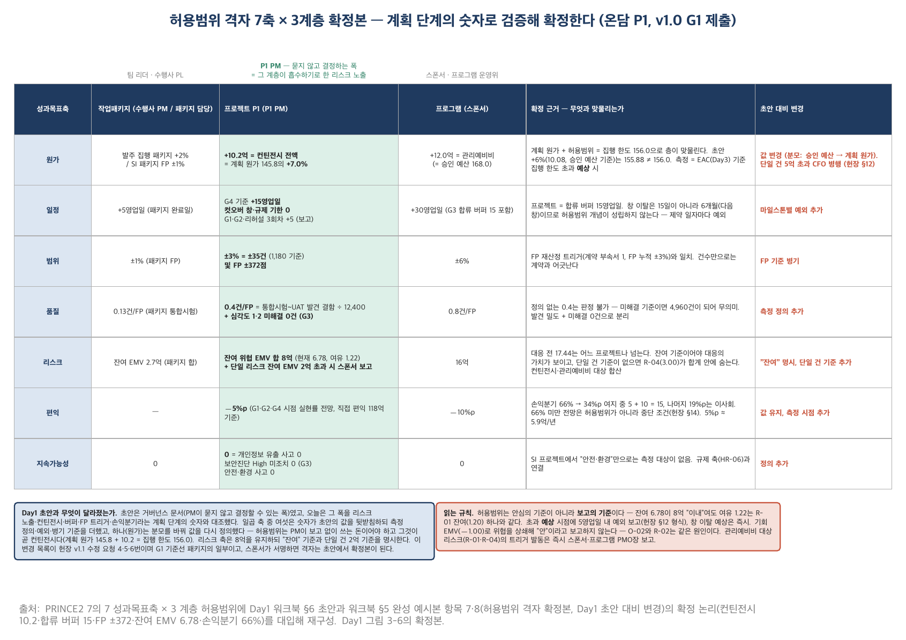

*그림 5-4. 허용범위 7축 × 3계층 확정 격자 — 각 축의 근거(컨틴전시·버퍼·FP 트리거·손익분기)와 초안 대비 변경. Day1의 초안은 거버넌스 문서였고, 계획 단계에서는 그 폭을 리스크 노출과 대조한다 — 원가는 컨틴전시 전액 10.2(계획 원가의 +7.0%, 초안 +6%는 분모가 승인 예산이어서 집행 한도와 0.12 어긋남)와, 일정 +15영업일은 합류 버퍼(컷오버 창·규제 기한은 0)와, 범위 ±3%는 FP 재산정 트리거(FP ±372점 병기)와, 편익 -5%p는 손익분기 66%의 역산과 맞물린다. 리스크 축은 잔여 위협 EMV 합 8억(현재 6.78, 여유 1.22)에 단일 리스크 2억 초과 보고를 더하고, 품질·지속가능성 축은 측정 정의를 붙인다. 이 변경 목록이 헌장 v1.1 수정 요청이며 G1 기준선 패키지의 일부다. Day1 그림 3-6의 확정본.*

---

## 5.8 실무에서 어떻게 틀리는가

**등록부가 착수 때 한 번 쓰고 잠자는 것.** 5.6절 — 보고서의 입력으로 만들지 않으면 잔다.

**소유자 칸이 전부 PM.** Day1에서 13건 중 2~3건만 PM이었다. 계획 단계에서 소유자는 대응 계획에 서명하는 사람이며, 서명하지 않은 소유자는 소유자가 아니다.

**대응 전략이 전부 "완화".** 회피(원인 제거)·전가(계약)·상신(프로젝트 밖)을 생각하지 않았다는 뜻이다. P1의 13건 중 회피 1(R-10), 전가 1(R-08), 수용을 결합한 1(R-03), 그리고 관리예비비 대상으로 상위 계층에 올린 2(R-01·R-04)가 있다.

**EMV 합으로 컨틴전시를 늘려 달라고 하는 것.** 대응 전 노출은 대응하라는 신호다.

**기회로 위협을 상쇄해 보고하는 것.** 따로 보고한다.

**허용범위와 노출을 대조하지 않는 것.** 허용범위 EMV 8억이 있는데 등록부에 EMV가 없으면 그 허용범위는 장식이다.

**꼬리를 컨틴전시로 덮으려는 것.** 구조가 자른다.

---

## 제5장 핵심 정리

> **한 줄씩 — 수업 직전 5분 복습용**
> 1. 계획 단계의 리스크 식별은 착수 때의 가정·구조·base rate에 작업패키지와 날짜·금액을 붙이는 일이다.
> 2. 5×5 매트릭스는 합의를 위한 도구다 — 점수를 더하지 말고 위치로 읽는다.
> 3. EMV는 평균이다 — 컨틴전시를 EMV 합으로 잡으면 나쁜 해에는 모자란다.
> 4. 대응 전략은 위협 5·기회 5, 소유자는 대응 계획에 서명하고 트리거를 관측 항목으로 적는다.
> 5. 허용범위는 그 계층이 흡수하기로 한 리스크 노출의 크기다 — 격자와 등록부는 같은 것을 두 번 쓴 것.
> 6. 온담 대응 후 잔여 EMV는 허용범위 8억 안이지만 여유는 R-01 하나분 — 안심의 기준이 아니다.
>
> 아래는 같은 내용의 자세한 판이다.

1. 계획 단계의 식별은 착수 시점의 가정·구조·base rate에 작업패키지 단위와 기준선 단위(날짜·금액)를 더한다. RBS는 점검표이자 집중의 진단, 가정 분석은 범위 기술서 가정의 뒤집기, 프리모템 원문의 회수, base rate 질문의 기록. 서술은 원인(사실)→사건→영향.
2. 정성 분석의 5×5 매트릭스는 속도와 합의를 위한 것이며 점수를 더하지 말고 위치로 읽는다. 영향 등급에 금액·일수 정의를 붙이고, 상관(같은 원인)을 연관 리스크로 묶으며, 근접성을 별도 열로 둔다.
3. EMV는 평균이고 선형이지만 투명하다. 민감도(토네이도)는 자원 배분의 근거, 몬테카를로는 P-값을 주되 상관을 무시하면 P80이 과소평가된다. 멱함수 꼬리는 어떤 컨틴전시로도 덮지 못하며 처방은 분할 구조(분리 컷오버·폴백·선행 릴리스)다.
4. 위협 5(회피·전가·완화·수용·상신)·기회 5(활용·공유·증대·수용·상신). 소유자는 대응 계획에 서명하고 트리거를 감시하고 집행 권한을 가진 사람. 2차 리스크는 별도 행, 잔여 EMV가 컨틴전시의 근거. 계획된 대응 비용은 계획 원가에, 현실화 비용은 컨틴전시에.
5. 허용범위는 그 계층이 흡수하기로 한 리스크 노출의 크기다. 원가 +10.2억 = 컨틴전시 전액 = 계획 원가의 +7.0%(초안 +6%는 분모가 승인 예산이어서 집행 한도와 어긋났다), 일정 +15영업일 = 합류 버퍼(컷오버 창·규제 기한은 0), 범위 ±3% = FP 트리거(±35건·FP ±372점), 리스크 잔여 EMV 8억 + 단일 2억 = 노출의 한계선(사건 전에도 예외), 편익 −5%p = 손익분기 66%에서의 역산.
6. 온담 P1: 대응 전 EMV 17.44 → 대응 후 잔여 6.78(허용범위 8억 이내, 여유 1.22 = R-01 잔여 하나 — 안심의 기준이 아니라 보고의 기준). 컨틴전시 10.2 = 배정 4.60(컨틴전시 대상 11건 잔여 4.58) + 미배정 풀 5.60(스프린트 4회분) ≈ 식별된 노출의 P80; R-01·R-04 잔여 2.20은 관리예비비 대상. 꼬리는 구조와 관리예비비와 중단 결정이 덮는다. 허용범위 7축 중 원가 축은 값 재정의(컨틴전시 전액), 나머지 6축은 값 유지에 정의·예외·병기 추가 — 헌장 v1.1 수정 요청 10건 중 4·5·6·7번.

## 생각해 볼 질문

1. 잔여 EMV 6.78은 허용범위 8억 이내이지만 여유 1.22는 R-01 하나와 같다. (a) 추가 대응 (b) 격자의 리스크 축 재정의(잔여 + 단일 2억) (c) R-01·R-04의 관리예비비 재분류 중 무엇을 먼저 하겠는가. 스폰서가 "이내니까 됐다"고 하면 무엇을 보여 줄 것인가.
2. 컨틴전시 10.2가 식별된 노출의 약 P80이며 P90 너머는 덮지 못하고, 미배정 풀 5.6의 근거가 스프린트 4회분이라는 것을 이사회에 보고해야 하는가. 보고하면 무엇이 일어나고, 안 하면 무엇이 일어나는가.
3. R-01의 소유자가 프로그램 PMO장인데 영향은 P1 컷오버다. 프로그램이 대응하지 않으면 P1 PM은 무엇을 할 수 있는가.
4. 여러분 회사의 리스크 등록부에서 소유자가 PM이 아닌 행은 몇 %인가. 그 소유자들은 자기가 소유자인 것을 아는가.
5. 프리모템 실패 선언문 F3(결합 실패)의 확률은 개별 리스크 확률의 곱인가, 그보다 큰가. 그것을 등록부에 어떻게 적을 것인가.

## 워크북 연결

이 장의 내용은 워크북 §5 "리스크 등록부(정량화)와 허용범위 격자"에서 온담 P1에 적용한다. Day1의 13+2건에 확률·영향(억, 영업일)·EMV를 붙이고 근거를 적으며, 대응 전략(5+5)·잔여 EMV·2차 리스크·트리거 측정 주기를 채우고, 소유자 서명란을 만든다. 잔여 EMV 합(6.78)을 허용범위 8억과 대조하고 자금원(컨틴전시 대상 4.58 / 관리예비비 대상 2.20)을 나누어 §4의 컨틴전시 배정표(배정 4.60 + 미배정 풀 5.60)에 연결하며, 일정 리스크 노출(임계 직접 영향 잔여 19일 vs 30일)을 따로 계산한다. 허용범위 7축 × 3계층을 확정 근거·측정 정의·초안 대비 변경(원가 축 +6% → 컨틴전시 전액 +7.0%, 리스크 축 잔여 + 단일 2억)과 함께 완성하고, 그 변경을 헌장 v1.1 수정 요청서(선택지·권고·기한)로 쓴다. 심화 과제: 한동석 축(R-01·R-03·R-12)과 박세연 축(R-05·R-06·R-10)의 상관을 가정하고, 상관이 있을 때와 없을 때 P80이 어떻게 다른지를 정성적으로 서술한 뒤, 꼬리를 자르는 구조적 대응 세 가지가 각각 어느 상관 축을 끊는지 적는다.

---

# 제6장 이 날의 학술 배경과 읽을 자료 (과정 후)

이 장은 제1~5장에서 인용한 학술 문헌 가운데 여덟 갈래를 골라 깊이 읽는다. Day1 제4장과 같은 이유에서다 — 표준이 "이렇게 하라"고만 말하는 지점에서 학술 문헌은 "왜 그런가"와 "언제 그것이 틀리는가"를 말해 주며, 계획 단계에서 그 두 질문은 추정(왜 우리는 항상 낙관하는가)과 방법(왜 CCPM은 여기서 안 되는가)에 관한 것이다.

## 6.1 planning fallacy와 reference class forecasting의 실제 절차

### 무엇인가

Kahneman과 Tversky는 1979년 논문 「Intuitive prediction: Biases and corrective procedures」에서 **planning fallacy**를 명명하고, 그 교정 절차로 **outside view**를 제안했다(수록지·권·페이지는 이 교재 작성 시점에 2차 출처로만 확인되었다 — 인용 시 원문을 대조하라). 핵심은 두 가지 예측 방식의 대비다. **Inside view**는 이 과제의 세부(단계, 자원, 장애)를 보고 완료 시점을 추정한다. **Outside view**는 이 과제를 유사한 과제들의 한 사례로 보고, 그 부류의 실제 분포에서 출발한다. 사람들은 거의 항상 inside view를 쓰고, inside view는 거의 항상 낙관적이다.

Buehler, Griffin, Ross(1994)의 실험이 이 현상의 결정적 특징을 보였다(Day1 3.5절) — **자기 과거 실적을 알려 주어도 예측이 개선되지 않는다.** 학생들은 자신이 과거에 항상 늦었다는 것을 알면서도 이번 과제는 제때 끝낼 것이라고 예측했다. 이것이 outside view가 "참고"가 아니라 "절차"여야 하는 이유다 — 정보를 주는 것으로는 안 되고, 예측의 출발점 자체를 외부 분포로 바꿔야 한다.

### RCF의 실제 절차 — 계획 단계에서

Flyvbjerg(2006)가 정식화한 reference class forecasting의 3단계를 계획 단계의 절차로 옮긴다.

1. **Reference class를 정한다.** 지금 추정하는 것(P1의 원가·일정)과 "같은 부류"의 과거 프로젝트를 모은다. 부류의 폭이 관건이다 — 너무 좁으면(온담의 정보화 사업 4건) 표본이 없고, 너무 넓으면(모든 IT 프로젝트 5,392건) 우리와 무관하다. 실무적 답은 "중견기업·수백억 규모·기존 시스템 대체·복수 벤더·규제 기한" 같은 특성 몇 개로 정의하고, 20~30건을 목표로 하되 없으면 없다고 적는 것이다.
2. **분포를 구한다.** 관심 변수 — 최종 원가 ÷ 승인 원가, 최종 기간 ÷ 계획 기간 — 의 실제 분포. 평균이 아니라 분포다. P50, P80, 그리고 꼬리의 형태.
3. **Uplift를 적용한다.** 원하는 신뢰 수준(예: P80)에서 uplift를 읽어 내부 추정에 곱하거나, 내부 추정이 분포의 어디에 있는지를 보고 "우리가 P20에 있다"는 사실을 스폰서에게 보인다.

순서가 전부다. **내부 추정을 먼저 만들고 RCF로 검증하면 앵커링(6.2절) 때문에 RCF는 형식이 된다.** 외부 분포를 먼저 보고, 그다음 "우리가 그 분포의 어디에 있을 이유가 있는가"를 묻는다. 그리고 uplift가 나오면 그것은 컨틴전시의 세 번째 근거(4.2절)이며, EMV·몬테카를로와 다른 숫자를 주면 그 차이가 내부 등록부의 낙관을 재는 자다.

### 흔한 오독

RCF를 "과거 평균 초과율을 곱한다"로 축약하는 것 — 평균이 아니라 분포이고, 분포의 형태가 멱함수면 평균은 무의미하다(6.7절). RCF를 내부 추정의 검증 도구로 쓰는 것 — 순서가 반대다. 그리고 "우리 프로젝트는 특별해서 reference class가 없다"는 것 — Flyvbjerg가 uniqueness bias라고 부르는 것이며, 그 믿음 자체가 planning fallacy의 작동 방식이다.

### 어디를 읽을 것인가

Flyvbjerg(2006) 전체(11쪽, arXiv 무료). Buehler et al.(1994) 실험 1~2. Kahneman의 『생각에 관한 생각』(Thinking, Fast and Slow, 2011) 23장 "The Outside View"가 서술체 입문이다.

---

## 6.2 앵커링 — 추정은 첫 숫자에 묶인다

Tversky와 Kahneman의 1974년 Science 논문 「Judgment under Uncertainty: Heuristics and Biases」는 세 휴리스틱(대표성, 가용성, 조정과 앵커링)을 정리했다. **앵커링**은 판단이 처음 제시된 값(앵커)에서 충분히 조정되지 못하는 현상이다. 실험에서 무작위로 돌린 룰렛 숫자가 UN 아프리카 회원국 비율의 추정에 영향을 미쳤다 — 앵커가 무관한 숫자여도 작동한다.

계획 단계에서 앵커는 어디에나 있다. 입찰가 198억은 계약가 168억의 앵커였고, 승인 예산 168억은 계획 원가 145.8의 앵커이며, 벤더 견적서의 첫 숫자는 협상의 앵커다(4.4절 "협상 전에 검산한다"의 이유). 그리고 가장 위험한 앵커는 **임원이 먼저 말한 날짜**다 — "2월 말까지"가 먼저 나오면 그 뒤의 모든 추정은 그 날짜에서 조정되고, 조정은 항상 부족하다. Jørgensen(6.6절)의 실험이 소프트웨어 추정에서 이것을 실증했다 — 고객이 "이 정도면 될 것 같다"고 말한 금액이 전문가의 추정을 유의하게 움직였다.

처방은 두 가지다. 앵커를 만나기 전에 자기 추정을 먼저 만들 것(RCF의 순서와 같다). 그리고 추정 회의에서 첫 숫자를 말하는 순서를 통제할 것 — 상급자가 먼저 말하면 나머지는 조정이다. Planning Poker의 동시 공개가 이 통제의 한 형태이며, 그것이 애자일의 관례이기 전에 앵커링에 대한 실험적 처방이다.

---

## 6.3 Goldratt의 크리티컬 체인과 Raz 등의 비판

### 무엇인가

Goldratt의 『Critical Chain』(1997)은 소설 형식으로 CCPM을 제시했다(3.4절). 활동 안전여유의 낭비 메커니즘(학생 증후군, 파킨슨 법칙, 병합 편향), 여유를 걷어 버퍼로 모으기, 자원 제약을 반영한 임계 체인, 버퍼 소진율 관리. 1990년대 후반~2000년대 초 제조·개발 조직에서 널리 시도되었다.

### Raz, Barnes, Dvir(2003)의 비판

Raz, Barnes, Dvir는 2003년 Project Management Journal에 「A critical look at critical chain project management」를 실었다(서지는 2차 출처로 확인 — 원문 대조 권장). 비판의 요지는 다음과 같다. 첫째, CCPM의 구성 요소 대부분(자원 제약 일정, 버퍼, 멀티태스킹 억제)은 새롭지 않으며 기존 일정 관리 문헌에 있었다. 둘째, "활동 기간의 50%를 안전여유가 차지한다"는 전제는 실증 근거가 약하다. 셋째, 버퍼의 크기를 정하는 방법(50% 절단법, 제곱근 합산법)이 통계적으로 정당화되지 않는다. 넷째, 임계 체인이 실행 중에 바뀌지 않는다는 가정은 비현실적이다. 다섯째, CCPM의 성공 사례는 대개 CCPM 자체보다 "일정에 경영진의 관심이 집중되었다"는 효과일 수 있다.

### 실무자에게

이 비판은 CCPM을 버리라는 것이 아니다. 방법론으로 도입하기 전에 그 전제(안전여유의 존재와 크기, 여유 회수의 가능성)가 자기 조직에서 성립하는지를 확인하라는 것이다. 3.4절에서 말한 대로 SI·EPC에서 성립하지 않는 전제는 **여유 회수의 법적 근거** — 하도급·용역 계약이 활동 단위 기한으로 묶여 있다 — 이며, 그것은 Raz 등의 비판에 없는, 계약 실무에서 나오는 다섯 번째 이유다. 반면 병합 편향과 버퍼 소진율 관리는 전제 없이 쓸 수 있는 개념이다.

### 흔한 오독

CCPM을 "여유를 없애는 방법"으로 읽는 것 — 여유를 없애는 것이 아니라 위치를 옮기고 소유자를 정하는 것이다. 그리고 버퍼 소진율 관리를 도입하면서 버퍼의 소유자(누가 쓸 수 있는가)를 정하지 않는 것 — 그러면 3.3절의 float 소유권 문제가 이름만 바뀌어 돌아온다.

---

## 6.4 Reinertsen — 배치 크기와 큐, Day3의 흐름으로

Reinertsen의 『The Principles of Product Development Flow』(2009)는 175개 원칙으로 제품 개발을 **흐름(flow)**의 경제학으로 다시 썼다. 계획 단계에 직접 닿는 것은 세 가지다.

**배치 크기.** 큰 배치(한 번에 많은 요구를 동결, 한 번에 많은 기능을 릴리스)는 규모의 경제처럼 보이지만 큐를 만들고 피드백을 늦춘다. 배치 크기를 줄이면 거래 비용은 늘지만 지연 비용은 줄고, 최적 배치는 그 둘의 합이 최소인 곳이다. P1의 월 1회 동결(배치 = 한 달치 요구)과 2주 스프린트(배치 = 2주치 작업)와 릴리스 3개(배치 = 릴리스 하나의 기능 묶음)는 각각 배치 크기의 결정이며, 그 결정의 근거를 물을 수 있다 — 왜 월 1회이고 격주가 아닌가. 답은 변경협의체가 격주이므로 동결을 격주로 하면 협의체가 동결 직후에만 열리게 되어… 이런 식으로 케이던스들의 관계를 따져야 한다.

**큐와 이용률.** 대기행렬 이론에서 대기 시간은 이용률이 100%에 가까워질수록 폭증한다(M/M/1에서 ρ/(1−ρ), 일반적으로는 Kingman 근사 — 두 식은 다르므로 구분해 인용하라). 발주사 인력 14명이 겸임으로 100% 가까이 차 있으면 결정 요청은 큐에 쌓이고 대기 시간은 선형이 아니라 폭발적으로 는다. R-05의 실체가 이것이고, 처방은 "더 열심히"가 아니라 이용률을 낮추는 것(전담 인력, 대체 결정권자)이다.

**WIP 제한과 지연 비용.** 진행 중 작업(WIP)을 제한하면 리틀의 법칙(WIP = 처리율 × 리드타임)에 따라 리드타임이 준다. 그리고 우선순위는 지연 비용(cost of delay)으로 정한다 — SAFe의 WSJF가 여기서 나왔다. 컷오버 창을 놓치면 다음 창까지의 지연 비용(편익 6개월 지연 = 118억 × 0.5 = 59억 + IPO 일정)이 헌장 §13 우선순위의 정량적 근거다.

이 셋은 Day3의 흐름·성과 측정에서 본격적으로 다룬다. 계획 단계에서 알아 둘 것은 케이던스와 배치와 이용률이 "정해진 것"이 아니라 결정이라는 사실이다.

---

## 6.5 Hubbard의 보정된 추정

Hubbard의 『How to Measure Anything』(2007, 3판 2014)은 "측정할 수 없다"는 말의 대부분이 "측정을 정의하지 않았다"는 뜻임을 보이고, 불확실한 추정을 다루는 실용적 방법을 제시했다. 계획 단계에 직접 쓰이는 것은 **보정(calibration)**이다.

보정된 추정자는 "90% 신뢰구간"을 말할 때 실제로 열 번 중 아홉 번 그 구간 안에 답이 있는 사람이다. 대부분의 전문가는 보정되어 있지 않다 — 90% 구간이라고 말한 것의 절반만 맞는다(과신). 그러나 보정은 훈련으로 개선된다. Hubbard의 방법은 답을 아는 문제(일반 상식 수십 문항)로 90% 구간을 반복 추정하고 결과를 피드백하는 것이며, 몇 시간의 훈련으로 대부분 보정에 근접한다. 훈련의 기법 두 가지 — **동등 내기 검사**(이 구간에 답이 있다는 것과 90% 확률의 복권 중 어느 쪽에 걸겠는가)와 **반대 근거 찾기**(구간의 상한·하한이 틀릴 이유를 각각 찾는다).

5.2절에서 "확률 중 = 30~50%는 어디서 왔는가"라고 물었다. 답은 보정된 사람의 판단이어야 하고, 보정되지 않은 사람의 판단은 base rate로 대체해야 한다. 워크북에서 여러분이 R-01~R-13에 확률을 붙일 때, 그 확률에 "보정됨/보정 안 됨"을 표시하는 것이 이 절의 실습이다.

Hubbard의 두 번째 기여는 **정보의 가치(EVI, expected value of information)**다 — 어떤 불확실성을 줄이는 데 돈을 쓸 가치가 있는가는 그 불확실성이 결정을 바꿀 확률과 바꿨을 때의 가치로 정해진다. 가맹 단말 전수 조사(R-13 대응)는 정보를 사는 것이고, 그 비용이 정당한지는 조사 결과가 컷오버 범위 결정을 바꿀 확률로 판단한다. 대부분의 프로젝트는 결정을 바꾸지 않을 정보를 측정하는 데 돈을 쓰고, 바꿀 정보는 측정하지 않는다.

---

## 6.6 Jørgensen — 소프트웨어 추정 연구가 말하는 것

Magne Jørgensen은 소프트웨어 개발 노력 추정에 관한 가장 체계적인 실증 연구자다. 2004년 Journal of Systems and Software의 리뷰 「A review of studies on expert estimation of software development effort」(서지는 2차 출처로 확인)가 출발점이며, 이후 20년의 실험 연구가 있다. 실무자에게 중요한 결론을 추린다.

**전문가 판단이 모델을 이긴다 — 조건부로.** 형식 모델(COCOMO류, FP 기반 회귀)이 전문가 판단보다 정확하다는 증거는 일관되지 않으며, 전문가가 유사 프로젝트 경험을 가졌을 때는 전문가가 낫다. 그러나 전문가는 앵커링과 낙관에 취약하다. 처방은 모델로 대체하는 것이 아니라 **전문가 판단을 구조화하는 것** — 유사 프로젝트를 명시적으로 참조하게 하고, 앵커를 차단하고, 복수의 독립 추정을 결합한다.

**앵커링의 실증.** Jørgensen과 Sjøberg의 실험에서 고객이 제시한 "예상 금액"(그리고 "이 정도면 될 것 같다"는 말)이 전문가의 노력 추정을 유의하게 움직였다. 6.2절의 처방이 소프트웨어에서 실증된 것이다.

**추정의 목적을 분리하라.** "얼마나 걸릴 것인가"(예측)와 "얼마에 하겠는가"(입찰)와 "언제까지 하라"(목표)는 다른 질문이고, 하나의 숫자로 답하면 셋 다 틀린다. 198억(입찰) → 168억(계약) → 145.8억(기준선)이 그 세 질문에 대한 세 답이며, 셋을 같은 숫자로 만들려는 압력이 planning fallacy의 조직적 형태다.

**불확실성 표현의 함정.** "최대 X"라고 물으면 사람들은 P70~P80 정도를 말하면서 P100이라고 믿는다. 3점 추정의 비관값이 충분히 비관적이지 않은 이유이며, 처방은 "이 값을 넘을 확률이 10%인 값"처럼 확률을 명시해 묻는 것이다.

---

## 6.7 Flyvbjerg 2022 — 멱함수와 모듈화

Day1 1.2절과 이 교재 5.3절에서 다룬 Flyvbjerg, Budzier, Lee, Keil, Lunn, Bester(2022)의 JMIS 논문 「The Empirical Reality of IT Project Cost Overruns: Discovering a Power-Law Distribution」(arXiv 2210.01573)을 계획 단계의 관점에서 한 번 더 읽는다.

**발견.** IT 프로젝트 5,392건의 원가 초과는 정규분포가 아니라 멱함수 분포를 따른다. 평균 초과율은 꼬리에 끌려 올라가고, 분산은 (추정된 지수에서) 무한에 가깝다. 즉 "평균 초과율"은 의미 있는 통계가 아니다.

**생성 메커니즘.** 기술 컴포넌트 간 상호의존에 의한 연쇄 반응. 한 컴포넌트의 지연이 의존하는 컴포넌트들로 전파되고, 전파가 다시 전파된다. Baccarini(1996)의 복잡성 정의(differentiation × interdependency) 중 interdependency 축이 꼬리를 만든다.

**계획 단계의 함의.** 첫째, 컨틴전시를 평균 초과율로 잡지 말라(4.2절, 5.3절). 둘째, 꼬리를 줄이는 것은 버퍼가 아니라 **모듈화** — 상호의존을 끊어 연쇄를 막는 것이다. Flyvbjerg(2022, Oxford Review of Economic Policy)의 「How to Solve Big Problems: Bespoke Versus Platform Strategies」가 이 처방의 학술 원전이며, 왜 태양광·서버랙은 학습곡선을 타고 원전·올림픽은 못 타는지를 같은 논리로 설명한다. P1에서 모듈화는 분리 컷오버, 폴백, 선행 릴리스, 그리고 인터페이스 47본의 명세화(의존을 문서로 만들어 연쇄를 예측 가능하게 하는 것)다. 셋째, **WBS의 구조가 리스크의 구조다.** 산출물 사이의 의존이 적은 WBS는 꼬리가 짧고, 모든 것이 통합 계층에 의존하는 WBS는 꼬리가 길다. P1.5(통합 계층)가 나머지 넷의 공통 의존이라는 사실이 P1의 구조적 리스크이고, 그것을 줄이는 것은 컨틴전시가 아니라 P1.5의 조기 안정화(설계 스프린트에서의 프로토타입)다.

---

## 6.8 Hillson — 리스크 대응의 프레임

David Hillson은 2002년 International Journal of Project Management의 「Extending the risk process to manage opportunities」(20(3), 235-240 — 서지는 2차 출처로 확인)에서 리스크 프로세스가 위협만 다루는 것을 비판하고, 기회를 같은 프로세스 안에서 대칭적으로 다루자고 제안했다. 위협의 회피·전가·완화·수용에 대응하는 기회의 활용·공유·증대·수용이 여기서 정식화되었고, PMBOK 5판 이후 표준이 이를 채택했다(상신은 6판에서 추가되었다).

Hillson의 프레임이 실무에 주는 것은 대칭 그 자체보다 **"리스크 = 불확실성 × 목표에의 영향"이라는 정의**다. 영향이 부정적이면 위협, 긍정적이면 기회이고, 둘 다 불확실성이므로 같은 도구(확률·영향·소유자·트리거)로 다룬다. 이 정의에서 두 가지가 따라온다. 첫째, 목표가 명시되지 않으면 리스크를 정의할 수 없다 — 헌장 §3의 성공 기준(관리 성공 6건, 프로젝트 성공 4건)이 리스크 등록부의 "영향" 열이 참조하는 목표다. 둘째, 같은 불확실성이 어떤 목표에는 위협이고 다른 목표에는 기회다 — O-02(포털 선행 릴리스)는 R-02의 역발상이며, Day1이 "위협의 역발상이 기회가 되는 경우는 흔하고 그것을 적는 칸이 있어야 나온다"고 한 것이 Hillson의 논지다.

Hillson의 후속 작업 중 **risk attitude**(Hillson & Murray-Webster)는 5.3절의 "확률 10% × 100억과 100% × 10억은 EMV가 같지만 다른 리스크"라는 문제를 다룬다 — 조직과 개인의 리스크 태도가 같은 EMV를 다르게 평가하며, 그 태도를 명시하지 않으면 허용범위 격자는 합의가 아니라 우연이다.

---

## 6.9 읽을 자료 — 필수 / 심화 / 참고

읽을 자료를 Day1과 같이 세 층으로 나눈다. 서지는 과정 리딩리스트(`05_리딩리스트/00_리딩리스트.md`)의 검증 표기를 따르며, 그 문서에 없는 항목(Raz et al. 2003, Hubbard, Hillson 2002, Tversky & Kahneman 1974, Jørgensen 2004)은 이 교재 작성 시점에 2차 출처로만 확인되었으므로 인용 시 원문을 대조하라. 한국어판 표기가 없는 것은 확인되지 않은 것이며 없다는 증명이 아니다.

### 필수 (과정 전)

| 자료 | 서지 | 한국어판 | 왜 읽는가 | 어느 부분 | 시간 |
|---|---|---|---|---|---|
| **Day1 워크북 완성 예시본 5종** | 본 과정 교재/PM트랙/Day1_워크북 §1.5·§2.5·§3.5·§4.5·§5.5 | — | Day2 산출물의 입력. 헌장 §4·§5·§6·§7·§8·§9·§12·§13과 리스크 13+2건, RACI 19·20행을 읽지 않으면 Day2 워크북의 어느 칸도 채울 수 없다 | 헌장 전체, 리스크 목록 전체 | 60분 |
| **AACE 18R-97 Table 1** | AACE International Recommended Practice 18R-97, *Cost Estimate Classification System — As Applied in Engineering, Procurement, and Construction for the Process Industries*, Rev. 2020-08-07 | 없음 | 한 장. "우리는 어느 Class로 견적했는가"를 답하는 언어. 정확도 범위가 자동 적용값이 아니라는 원문 문장을 확인한다 | Table 1과 그 각주 | 20분 |
| **RCF 원논문** | Flyvbjerg, B. (2006). From Nobel Prize to Project Management: Getting Risks Right. *Project Management Journal*, 37(3), 5-15. arXiv 1302.3642 | 없음 (arXiv 무료) | 11쪽. outside view를 절차로 옮긴 3단계의 원전. Day2 컨틴전시 근거 세 가지 중 하나 | 전체 | 45분 |
| **SCL Protocol Core Principles** | Society of Construction Law (2017). *Delay and Disruption Protocol*, 2nd ed. | 없음 (무료 공개) | Core Principle 8(float)만. "별도 약정이 없으면 공용 자원"이라는 문장을 원문에서 확인한다 | Core Principles 절 | 20분 |

과정 전 제출 과제 하나: 여러분 회사의 최근 프로젝트 예산이 몇 층이었는지(승인/기준선/컨틴전시/관리예비비), 각 층을 누가 갖고 있었는지 적어 오라. 층이 하나뿐이었다면 그것이 Day2 오전의 첫 토론 재료다.

### 심화 (과정 후)

**30일 안에 — Day2에서 열린 질문을 닫는 것**

| 자료 | 서지 | 한국어판 | 왜 읽는가 | 어느 부분 | 시간 |
|---|---|---|---|---|---|
| **멱함수 논문** | Flyvbjerg, B., Budzier, A., Lee, J. S., Keil, M., Lunn, D., & Bester, D. W. (2022). The Empirical Reality of IT Project Cost Overruns. *Journal of Management Information Systems*, 39(3), 607-639. arXiv 2210.01573 | 없음 (arXiv 무료) | 제5장 5.3, 제6장 6.7. 평균 컨틴전시가 왜 실패하는지의 실증과 모듈화 처방 | 전체, 특히 분포 추정과 메커니즘 절 | 2시간 |
| **planning fallacy 실험** | Buehler, R., Griffin, D., & Ross, M. (1994). Exploring the 'planning fallacy'. *Journal of Personality and Social Psychology*, 67(3), 366-381 | 없음 | 제6장 6.1. 자기 실적을 알아도 안 고쳐진다는 실험 — outside view가 절차여야 하는 이유 | 실험 1~2 | 1.5시간 |
| **일정 리스크 분석** | Hulett, D. T. (2009). *Practical Schedule Risk Analysis*. Gower (2024 재발행) | 확인되지 않음 | 제3장 3.4, 제5장 5.3. 상관 무시의 P80 과소평가와 risk driver 방식, merge bias의 정량적 취급 | risk driver 장, correlation 장 | 5시간 (해당 장) |
| **CCPM 비판** | Raz, T., Barnes, R., & Dvir, D. (2003). A critical look at critical chain project management. *Project Management Journal*, 34(4), 24-32 [검증 필요 — 권·호·페이지] | 없음 | 제6장 6.3. CCPM 도입 전에 전제를 검증해야 하는 이유 | 전체 | 1시간 |
| **보정된 추정** | Hubbard, D. W. (2014). *How to Measure Anything: Finding the Value of "Intangibles" in Business*, 3rd ed. Wiley [검증 필요 — 판본] | 『무엇이든 측정할 수 있다』 (확인 필요) | 제6장 6.5. 확률을 감으로 적지 않기 위한 보정 훈련과 정보의 가치 | calibration 장, EVI 장 | 4시간 (해당 장) |
| **기회의 대칭** | Hillson, D. (2002). Extending the risk process to manage opportunities. *IJPM*, 20(3), 235-240 [검증 필요] | 없음 | 제5장 5.4, 제6장 6.8. 위협 5·기회 5의 원전 | 전체 (6쪽) | 40분 |

**90일 안에 — 자기 조직에 적용할 때 필요한 것**

| 자료 | 서지 | 한국어판 | 왜 읽는가 | 어느 부분 | 시간 |
|---|---|---|---|---|---|
| **흐름의 원칙** | Reinertsen, D. G. (2009). *The Principles of Product Development Flow*. Celeritas | 확인되지 않음 | 제6장 6.4, Day3. 배치 크기·큐·WIP·지연 비용. 케이던스가 결정이라는 것 | 배치 크기 장, 큐 장, 케이던스 장 | 8시간 |
| **계약 전략** | Merrow, E. W. (2023). *Contract Strategies for Major Projects*. Wiley | 확인되지 않음 | 제4장 4.4. 고정가가 안전하지 않은 조건의 실증. 사내 계약 방식 재검토 시 | 전체 | 8시간 |
| **크리티컬 체인** | Goldratt, E. M. (1997). *Critical Chain*. North River Press | 『크리티컬 체인』 | 제3장 3.4. 원전을 읽고 Raz 등의 비판과 대조 | 전체 (소설) | 5시간 |
| **PRINCE2 7 Plans practice** | *PRINCE2 7 Managing Successful Projects*. PeopleCert, 2023 | 확인되지 않음 | 제1장 1.3. Product-Based Planning 4단계, 3수준 계획, 단계 경계의 원문 | Plans practice, Risk practice | 6시간 (해당 장) |
| **PMBOK 8판 Scope·Schedule·Finance·Risk** | *PMBOK Guide — Eighth Edition*. PMI, 2025 | 확인되지 않음 | 제1장 1.3. 네 도메인의 정확한 문구와 Planning Focus Area의 프로세스 목록 | 해당 도메인 | 8시간 |
| **요구공학 표준** | ISO/IEC/IEEE 29148:2018 *Systems and software engineering — Life cycle processes — Requirements engineering* | 없음 | 제2장 2.3. StRS/SyRS/SRS 계층과 좋은 요구사항의 특성 원문 | 문서 계층 절, 특성 절 | 3시간 |
| **행동 편향 10** | Flyvbjerg, B. (2021). Top Ten Behavioral Biases in Project Management. *PMJ*, 52(6). arXiv 2202.00125 | 없음 (arXiv 무료) | 제6장 전체. anchoring·planning fallacy·base rate fallacy·uniqueness bias가 한 표에 | 전체 | 2시간 |

### 참고 (워크북을 쓰다가 손을 뻗어 확인할 것)

| 자료 | 서지 | 어느 워크북 절에서 | 무엇을 확인하는가 |
|---|---|---|---|
| **ISO 21511:2018** | *Work breakdown structures for project and programme management* | §1 WBS | 100% 규칙의 원문 표현, 산출물 지향의 권고 수준 |
| **MIL-STD-881F** | US DoD, 2022-05-13 | §1 WBS | 방산 WBS 표준 — 관리 산출물의 위치, 레벨 정의 |
| **AACE 56R-08** | *Cost Estimate Classification System — Building and General Construction Industries*, Rev. 2020-08-07 | §4 원가 | 건축용 Class 표. 56R-11이 아님을 확인 |
| **DCMA 14-Point** | Defense Contract Management Agency, *14-Point Schedule Assessment* (2005~) [검증 필요 — 현행 여부] | §3 일정 | 14개 임계치 |
| **SCL Protocol 2판 전체** | Society of Construction Law, 2017 | §3 일정 | 지연 분석 6방법, 동시 지연의 정의 |
| **AACE 29R-03** | *Forensic Schedule Analysis* | §3 일정 | 9개 MIP 분류 |
| **ISO/IEC 25010:2023** | *Systems and software quality models* | §2 RTM | 비기능 요구의 품질 특성 카탈로그 (9개) |
| **SW사업 대가산정 가이드** | 한국소프트웨어산업협회, 최신판 [갱신 대상] | §1·§4 | FP 단가·보정계수의 산정 방식. 민간 준용 시 조항 |
| **소프트웨어 진흥법 (과업심의위원회)** | 국가법령정보센터 | §1 범위 | 공공에만 적용되는 제도임을 확인. 온담(민간)에는 적용되지 않는다 |
| **ANSI/PMI 19-006-2019** | *The Standard for Earned Value Management* | §4 원가 (Day3 예습) | PMB·BAC·관리예비비의 정의. 2011년 Practice Standard와 다름 |
| **Kahneman & Tversky (1979)** | Intuitive prediction: Biases and corrective procedures. *TIMS Studies in Management Science*, 12, 313-327 [검증 필요 — 수록지·페이지] | §5 리스크 | outside view의 최초 정식화 |
| **Tversky & Kahneman (1974)** | Judgment under Uncertainty: Heuristics and Biases. *Science*, 185(4157), 1124-1131 | §4 견적 검산 | 앵커링 실험의 원문 |
| **Jørgensen (2004)** | A review of studies on expert estimation of software development effort. *Journal of Systems and Software*, 70(1-2), 37-60 [검증 필요] | §3·§4 추정 | 전문가 추정의 조건부 우위와 앵커링 |
| **Williams (2002)** | *Modelling Complex Projects*. Wiley [검증 필요 — 연도] | §3 압축 | 압축 → 병행 → 재작업 악순환의 SD 모델 |

### 읽지 않아도 되는 것

Day2 주제에 관해 자주 추천되지만 이 교재가 읽기를 권하지 않는 것. "PMBOK 6판 ITTO 암기집" 류(현행은 8판이며 ITTO 구조는 폐기되었다). "AACE Class별 정확도 ±N%" 표만 떼어 놓은 2차 자료(정확도는 리스크 분석으로 산정한다는 원문 문장이 빠져 있다). CCPM 도입 성공 사례집(Raz 등의 비판을 먼저 읽고 전제를 확인한 뒤에). "몬테카를로로 P80을 구했다"고만 말하는 도구 백서(상관을 어떻게 다뤘는지 없으면 P80은 의미 없다). 이것들을 읽었다면 잘못이 아니지만, 인용할 때는 그 한계를 함께 말해야 한다.

---

## Day2를 마치며 — Day3 예고

이 교재는 하나의 문장으로 요약된다. **계획은 예측이 아니라 합의이며, 합의의 형태는 측정 가능한 기준선이다.** 범위 기준선(범위 기술서 + WBS + WBS 사전, 그리고 계약적 형태로서의 FP 기준선 확인서), 일정 기준선(임계경로·여유·버퍼·제약 일자가 명시된 일정 모델과 하이브리드 달력), 원가 기준선(작업 시점 기준의 월별 PV, 컨틴전시와 관리예비비의 구분, 자금 조달 한도), 그리고 그 셋을 흔드는 것의 목록(정량화된 리스크 등록부)과 그 셋의 편차를 누가 흡수하는가의 합의(허용범위 격자). 다섯 산출물은 워크북 §1~§5이고, G1(2026-04-30)에 정미란·오정근·박세연·이재현이 서명하면 P1은 "무엇에 대해 늦었다고 말할 수 있는 프로젝트"가 된다.

계획 단계에서 정직하게 적어야 할 것 세 가지를 다시 말한다. 157.8에서 145.8로 가는 조정표 12.0과 되돌아올 조건. 잔여 EMV 6.78이 허용범위 8억 이내이지만 여유 1.22가 리스크 하나와 같고 원가 허용범위 +6%의 분모가 틀렸다는 사실. 컨틴전시 10.2가 식별된 노출의 P80 수준일 뿐 꼬리를 덮지 못하며 미배정 풀 5.6의 근거가 스프린트 4회분이라는 사실. 이 셋은 나쁜 소식이 아니라 계획이 한 일이며, 스폰서에게 결정을 요청하는 근거다. 계획이 좋은 소식만 담고 있다면 그것은 계획이 아니라 희망이다.

**Day3 — 실행과 통제.** 기준선이 생겼으므로 편차를 잴 수 있다. EVM(PV·EV·AC, CPI·SPI, Earned Schedule — SPI가 종료 시점에 1.0으로 수렴해 정보를 잃는 결함과 그 해법), 변경 통제(변경요청서와 영향 분석, CCB와 변경협의체의 순서, 재기준선의 조건), 품질(결함밀도 0.4건/FP를 어떻게 재고 누가 판정하는가, QA와 QC가 8판에서 갈라진 이유), 이슈(리스크가 이슈가 되는 순간, 이슈 로그, 예외 보고), 그리고 흐름(Reinertsen의 배치·큐·WIP를 스프린트 성과에 적용하기). Day2의 월별 PV 표와 리스크 등록부와 허용범위 격자가 Day3 첫 시간의 입력이다 — 2026년 7월 말, 누적 PV 62.7억 시점에 P1이 어디에 있는지를 여러분이 읽게 된다.

계획 시점에 잘못 적힌 것은 실행 시점에 고쳐지지 않는다. 그것이 여러분이 오늘 원가 기준선의 산수를 문서에 남기고 리스크 등록부의 소유자에게 서명을 받는 이유다.
