# PM 트랙 Day 3 교재 — 실행과 통제(Executing · Monitoring & Controlling): 기준선과 실적의 차이를 재고, 그 차이에 대해 결정을 요청하기

> **이 교재의 위치** — 4일 PM 특강의 셋째 날 본문이다. Day1이 "무엇을 왜 하는가, 누가 결정하는가"를 문서로 세우는 날이었고 Day2가 그 문서를 **측정 가능한 기준선**으로 바꾸는 날이었다면, Day3는 그 기준선에 실적을 대어 **편차를 재고, 편차가 종료일과 최종 원가를 어떻게 바꾸는지를 예측하며, 그 예측에 대해 누가 무엇을 결정해야 하는지를 적는** 날이다. 슬라이드는 강사가 이 본문 가운데 무엇을 어떤 순서로 설명하는지를 정하고, 워크북은 이 본문의 개념을 온담F&B홀딩스 P1(차세대 주문·재고 통합 플랫폼 구축)의 2026-09-30 시점에 적용해 변경요청서·성과보고·이슈 로그와 리스크 등록부 갱신·품질 통제 기록·조달·계약 변경 기록을 직접 작성하게 한다. 본문은 그 둘의 뿌리다. 강의를 듣기 전에 한 번, 워크북을 쓰다가 막힐 때 한 번, 과정이 끝난 뒤 한 번 읽도록 쓰였다.
>
> **전제 독자** — Day1·Day2와 같다. 주니어 PM과 3~7년차 현업 실무자. EV·PV·AC의 정의, SPI·CPI의 공식, 변경통제위원회(CCB)라는 말은 이미 안다고 전제한다. 대신 "공식은 맞는데 실무에서 틀리는 것" — SPI가 오르는데 왜 예외 보고를 내는가, CPI 1.03이 왜 좋은 소식이 아닌가, 허용범위 안의 변경을 왜 CCB에 올리는가, 감리 지적의 등급보다 귀속 칸이 왜 더 무거운가, 구두 검수 보류에 왜 서면으로 답해야 하는가 — 에 지면을 쓴다.
>
> **사례 회사와 시점** — 모든 예시는 `교재/공통/가상회사_온담F앤B.md`와 Day1·Day2 워크북의 완성 예시본(헌장 v1.1, 거버넌스·RACI, 리스크 등록부 v1.0, WBS 43개 작업패키지, CPM 계산표, 월별 PV 표, 허용범위 격자)을 재료로 쓴다. 시점은 **데이터 일자 2026-09-30(수)** [추가 설정, 고정]이다 — 착수 9개월, 스프린트 S19 진행 중(R2 완료 직후), 규제 ① 검증(A07) 통과 직후, G2(2026-11-27) 앞. 이 날짜 이후에 일어난 일(EV·AC 월별 실적, 인수 FP, 결함 수, 이슈·감리 내용, 계약 조항 번호와 요율, 스프린트 실제 일자)은 모두 [추가 설정]이며, 그 정본은 **Day3 워크북 완성 예시본**이다. 이 본문의 온담 숫자는 전부 거기서 가져왔고, 워크북과 이 본문이 다르면 워크북이 우선한다. 회사 정본과 워크북이 다르면 회사 정본이 우선한다.
>
> **읽는 법과 분량** — 이 교재는 하루에 다 읽는 책이 아니다. 목차의 표시대로 필독 절만 수업 전에 읽으면 되고(약 120분), 나머지는 수업 후·과정 후에 읽는다. 본문의 온담 단락은 앞머리에 **■ 사례 사실** 줄을 두어 그 단락이 쓰는 사례의 사실과 출처(사례 §·숫자 표 ID)를 먼저 적었다 — 사례 문서를 통독하지 않았어도 그 줄만 읽으면 따라올 수 있고, 더 알고 싶으면 그 §을 펼친다. 용어·약어·문서 ID(R-10, CR-09, A10, BL-02 …)가 낯설면 `교재/공통/02_용어약어색인.md`를, 4일 전체의 읽는 순서는 `교재/공통/00_학습안내.md`를 본다.
---

## 목차

표시 없는 절은 **수업 전 필독**(약 120분), (심화)는 수업 후 일주일 안에 읽는 절(약 20분), (과정 후)로 표시된 장은 4일이 끝난 뒤 읽는 학술 배경과 읽을 자료다. 각 장 끝의 "핵심 정리" 첫 상자(한 줄씩)는 수업 직전 5분 복습용이다.

**서문 — Day2에서 가져오는 것**

**제1장 실행과 통제란 무엇인가 — 기준선이 있어야 편차가 있다**
- 1.1 통제 사이클 — 측정 → 분석 → 예측 → 조치 → 기준선 갱신
- 1.2 통제의 단위 — 예측형의 게이트·보고 주기, 적응형의 스프린트 리뷰·번다운, 하이브리드의 세 층
- 1.3 표준에서는 — PMBOK 8판 Executing·Monitoring and Controlling Focus Area, PRINCE2 7의 세 프로세스와 Progress practice·Exception, ISO 21502 §7 (심화)
- 1.4 한국 SI의 통제 사이클 — 주간·월간 보고, 감리와 검수; 분야별 대조 (심화)
- 1.5 실무에서 어떻게 틀리는가 — 90% 증후군, 기준선 없는 보고, 계획을 고쳐 편차를 없애기
- 핵심 정리 / 생각해 볼 질문 / 워크북 연결

**제2장 성과 측정 — EVM과 그 너머**
- 2.1 PV·EV·AC와 PMB — ANSI/PMI 19-006-2019가 정의하는 것, BAC는 145.8인가 156.0인가
- 2.2 Rules of Credit — 지표는 측정이 아니라 합의의 산물
- 2.3 편차·지수·예측 — SV·CV·SPI·CPI, EAC 4공식과 각각의 가정, TCPI·VAC
- 2.4 Earned Schedule — SPI가 종료로 수렴해 정보를 잃는 결함과 Lipke의 해법
- 2.5 CPI 안정성 — Christensen 연구가 말하는 것과 말하지 않는 것 (심화)
- 2.6 착시 해부 — 온담 2026-09-30의 다섯 착시
- 2.7 하이브리드에서 EV의 함정, 흐름 지표(Vacanti), DORA 지표의 위치 (심화)
- 2.8 온담 P1 성과보고 제9호 읽기 — 임계경로 −10, 예외 보고 EX-01, 조기 신호 5개
- 2.9 실무에서 어떻게 틀리는가
- 핵심 정리 / 생각해 볼 질문 / 워크북 연결

**제3장 변경 관리 — 변경은 사건이 아니라 절차다**
- 3.1 변경의 원천 4종과 변경요청서의 구조
- 3.2 6축 영향 분석 — FP 하나로 변경의 크기를 잴 수 없다
- 3.3 처리 경로 — PM 전결, CCB, 계약상 변경협의체, 스폰서; 민간에는 과업심의위원회가 없다
- 3.4 기준선 갱신(BL-0n)과 재기준선(re-baseline)의 차이, 그리고 남용
- 3.5 변경 대가와 범위 크립의 통제 도구 — 55만 원/FP, 감액도 변경, RTM 변경 이력·WBS 사전·변경 로그
- 3.6 온담 P1 — 변경 4건과 CCB 제10차, "Day1 문서는 고쳐진다"
- 3.7 실무에서 어떻게 틀리는가
- 핵심 정리 / 생각해 볼 질문 / 워크북 연결

**제4장 품질·이슈·리스크 통제**
- 4.1 QA와 QC, 결함밀도 정의의 정치 — 분모와 분자
- 4.2 결함 누적곡선 판독 — 평탄화는 수렴인가 정지인가, 심각도와 나이
- 4.3 감리 지적 대응 — 등급보다 원인 귀속 칸이 나중의 책임 귀속을 정한다
- 4.4 이슈 로그와 리스크 등록부 — 이슈에는 기한이, 리스크에는 트리거가 있다
- 4.5 리스크 재평가 — 주기·트리거·2차 리스크의 승격·컨틴전시 소진 추적
- 4.6 예외 보고(Exception Report) — 언제 쓰고 무엇을 담는가
- 4.7 실무에서 어떻게 틀리는가
- 핵심 정리 / 생각해 볼 질문 / 워크북 연결

**제5장 사람·커뮤니케이션·조달 통제**
- 5.1 성과보고 체계 — Highlight·Checkpoint, RAG의 정치, 대시보드 설계 원칙
- 5.2 나쁜 소식의 보고 — mum effect (심화)
- 5.3 이해관계자 참여 갱신 — 현저성은 이동한다
- 5.4 팀·갈등·인력 교체·수행사 성과 관리
- 5.5 동시기록 문화 — 구두 검수 보류에 서면으로 답하는 이유
- 5.6 지체상금·동시 지연·하도급 승인·계약 변경 로그 (심화)
- 5.7 실무에서 어떻게 틀리는가
- 핵심 정리 / 생각해 볼 질문 / 워크북 연결

**제6장 이 날의 학술 배경과 읽을 자료 (과정 후)**
- 6.1 Lipke(2003) — Earned Schedule 원전
- 6.2 Fleming & Koppelman — EVM의 교과서와 그 전제
- 6.3 Christensen(1992·1993) — CPI 안정성
- 6.4 Vacanti(2015)·Reinertsen(2009) — 흐름의 지표와 흐름의 경제학
- 6.5 Keil·Smith와 mum effect — 나쁜 소식은 왜 올라오지 않는가
- 6.6 Staw(1976) — 계속 투자(escalation of commitment)
- 6.7 Brooks(1975) — 늦은 프로젝트에 인력을 더하면
- 6.8 Kerzner의 진척 착시와 Kappelman의 조기 신호
- 6.9 정보시스템 감리기준 — 공공의 구조를 민간이 빌리는 법
- 6.10 읽을 자료 — 필수 / 심화 / 참고

**Day3을 마치며 — Day4 예고**

---

# 서문 — Day2에서 가져오는 것

실행·통제 단계의 문서는 백지에서 쓰지 않는다. Day2의 다섯 산출물이 오늘의 **자(尺)**다. 워크북 §0.4가 정한 대로, Day3의 다섯 산출물은 각각 Day2의 특정 항목을 입력으로 받고, Day1 §0 마스터 표에서 Day3 산출물이 3종(⑪ 변경요청서와 영향 분석 / ⑫ 성과보고 / ⑬ 조달·계약 변경 기록)으로 예고되어 있던 것을 Day2 §7의 요구(품질 통제)를 받아 **5종으로 확정**했다. 이 표를 책상 옆에 두라. 워크북의 어느 칸이 막히면 대개 Day2의 해당 항목이 비어 있거나, 기준선 값을 인용하지 않고 고쳐 적은 것이 원인이다.

| Day3 산출물 | Day2에서 받는 입력 | 이 교재의 어느 장 |
|---|---|---|
| ⑪ 변경요청서·영향 분석·CCB 의결서 | ⑥ WBS 사전 카드(추정·의존·인수 기준), ⑦ RTM 하위 추적·변경 이력 열(CR 번호 체계), ⑩ 허용범위 격자(±35건·FP ±372, 원가 10.2, 리스크 8억). Day2 §6의 헌장 v1.1 수정 요청 10건 중 1번(파일럿 FP +90)·2번(전환 5년 한정)·4번(원가 허용범위) | 제3장 |
| ⑫ 성과보고 — EVM·Earned Schedule | ⑨ 월별 PV 표 17개월(2026-09 누적 77.83, BAC = PMB 145.8)과 배분 규칙(Rules of Credit의 출발점), 3층 168.0 / 156.0 / 145.8, ⑧ CPM 계산표(ES·EF·LS·LF·TF)와 스프린트 캘린더, 버퍼 소유자 | 제2장 |
| ⑬ 이슈 로그·리스크 등록부 갱신 | ⑩ 등록부 R-01~R-13·O-01~O-02(잔여 EMV 6.78, 트리거, 자금원, 2차 리스크 R-14~R-18 예비 번호), 컨틴전시 배정표(배정 4.60 + 미배정 풀 5.60), 허용범위 8억·단일 2억 | 제4장 |
| ⑭ 품질 통제 기록 — 결함 누적·감리 지적 대응 | ⑦ RTM 시험·검수 열(TC 번호 체계, 커버리지 집계), ⑩ 품질 허용범위 두 계층(작업패키지 0.13건/FP · 프로젝트 0.4건/FP + 심각도 1·2 미해결 0), 감리 G2 기준(설계·시험 연결 100%) | 제4장 |
| ⑮ 조달·계약 변경 기록 — 변경 대가·수행사 성과·검수 보류 회신 | ⑨ 벤더 견적 검산의 단가(55만 원/FP)와 스프린트 1회 비용 1.41억, ⑥ L2 FP 배분, ⑧ 여유 소유권 문안(SCL 원칙 8), ⑨ 조정표(상용SW 4.0 P5 이관, 클라우드 선약정, 전환 −2.0) | 제5장 |

세 가지를 미리 말해 둔다.

첫째, **오늘의 시나리오는 Day2 등록부의 리스크 몇 개가 실제로 일어난 상황이다.** R-05(겸임 인력·미결정 대기)가 5~6월에 부분 실현되어 구현이 약 3주 늦었고, R-04(1차연도 삭감)는 라이선스 협상으로 대응해 4월의 조달 봉우리가 5월로 밀렸으며, R-03(3PL 거부)은 06-30 트리거가 발동해 폴백이 확정되었다. 9월 말 현재 SPI는 1 아래이고 CPI는 1 근처 — 그리고 그 CPI에는 라이선스 지급 이연이 만든 착시가 들어 있다. 가맹점주협의회장 서정필의 새 요구(발주 마감 20:00 → 22:00)가 접수되었고, 헌장 v1.1 수정 요청 10건 중 셋이 CCB에 상정되며, 감리 1차(중간) 지적 8건 중 2건은 발주사 미결정이 원인인데 "수행사 설계 미흡"으로 기재되어 있다. 이 상황은 [추가 설정]이며, 숫자는 Day2 기준선과 정합하게 정했다. 계획이 좋은 소식만 담고 있으면 희망이듯, 통제 단계의 사례가 좋은 소식만 담고 있으면 연습이 되지 않는다.

둘째, **기준선 값을 바꾸지 말고 인용하라.** 오늘 실적을 재다가 기준선이 틀렸음을 발견할 것이다 — PV는 스프린트 시작 월에 계상되는데 EV는 인수 시점에 계상되어 구조적 시차가 있고, 원가 허용범위의 "+6%"는 분모가 승인 예산이어서 집행 한도와 어긋난다. 그때 기준선을 고쳐 적는 것이 아니라 그 차이를 성과보고에 "측정 규칙 차이"로 분리해 적고, 고쳐야 할 것은 변경요청서(CR-10)로 CCB에 올려 BL-02에서 반영한다. 기준선은 CCB가 승인한 뒤에만 바뀐다. 이것이 제1장의 첫 문장이자 제3장 전체의 주제다.

셋째, **오늘의 모든 문서는 "결정 요청"으로 끝난다.** Day1 문서가 "결정되지 않은 것을 결정하는 문서", Day2 문서가 "결정된 것을 분해하고 숫자로 만드는 문서"였다면, Day3 문서는 "기준선과 실적의 차이를 재고, 그 차이에 대해 누가 언제까지 무엇을 결정해야 하는지를 적는 문서"다. 결정 요청이 없는 성과보고는 보고가 아니라 기록이고, 기록은 다음 달에도 같은 편차를 기록한다.

Day2 기준선 5종에서 Day3 통제 산출물 5종으로 흐르는 입력 관계, 그리고 다섯 산출물이 서로를 설명하는 구조를 한 장으로 놓으면 그림 0-1과 같다.

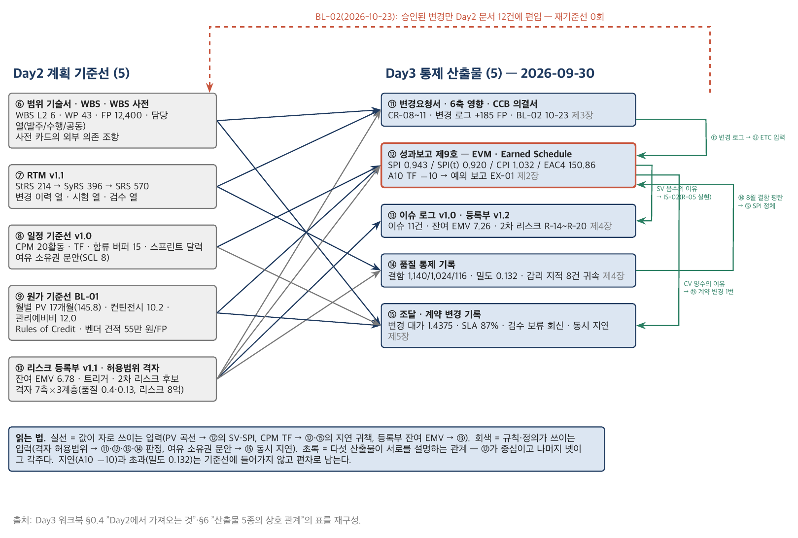

*그림 0-1. Day2 기준선 5종에서 Day3 통제 산출물 5종으로 흐르는 입력 관계와, 다섯 산출물이 서로를 설명하는 구조. 성과보고(⑫)가 중심이고 나머지 넷이 그 각주다. 되돌아가는 파선은 승인된 변경(BL-02)으로만 기준선이 움직였음을 보인다 — 지연(A10 −10)과 초과(밀도 0.132)는 편차로 남아 있다.*

---

# 제1장 실행과 통제란 무엇인가 — 기준선이 있어야 편차가 있다

## 1.1 통제 사이클 — 측정 → 분석 → 예측 → 조치 → 기준선 갱신

### 개념

Day2 1.1절은 계획의 세 기능을 합의·통제 기준·의사소통이라고 했고, 기준선을 "실적을 비교하는 자"라고 했다. 자가 없으면 편차가 없고 편차가 없으면 통제가 없다. 실행·통제 단계는 그 문장의 뒷부분이다 — 자가 생겼으므로 편차를 잰다. 그런데 편차를 재는 것만으로는 아무 일도 일어나지 않는다. "SV −4.40억"은 사실이지 결정이 아니다. 통제(control)는 편차를 재는 일이 아니라 **편차에 대해 무엇을 할지를 정하고 실행하는 일**이며, 그것은 다섯 단계의 순환이다.

**측정(measure).** 데이터 일자를 고정하고, 그 날짜까지의 실적을 기준선과 같은 단위로 적는다. 온담에서 그것은 인수 FP(7,020), 발생 원가(AC 71.13), 활동의 실제 착수·완료 일자(A10 착수 09-28), 결함 수(발견 1,140·해소 1,024), 이슈·변경의 건수다. 측정의 조건은 하나 — **기준선과 같은 규칙으로 잰다.** PV가 스프린트 시작 월에 계상되는데 EV를 담당자 느낌의 "진척률"로 재면 둘은 같은 자 위에 있지 않다.

**분석(analyze).** 편차의 크기가 아니라 **원인**을 찾는다. SV −4.40 중 −1.96은 측정 시차(진행 중 스프린트의 PV)이고, −2.44가 실질 지연이며, 그 실질 지연은 SI 열(−5.31)에 몰려 있고 시험·감리 열(+0.70)이 그것을 일부 가리고 있다. 원인이 없는 편차는 대응할 수 없다 — "일정이 6% 늦었다"에는 대응이 없지만 "R-05 실현으로 S10이 3주가 되었고 규제 Must 항목을 S16–S17에 전진 배치해 R2의 420 FP가 이월되었다"에는 대응이 있다.

**예측(forecast).** 이대로 가면 어디에 도착하는가. EAC(최종 원가 전망)와 종료일 전망(Earned Schedule의 IEAC(t), CPM의 as-is 마일스톤 전망)이다. 예측의 조건은 **전제를 적는 것**이다. EAC1(BAC ÷ CPI = 141.23)은 "현재 원가 효율이 끝까지 유지된다"는 전제이고, EAC4(AC + 상향식 ETC = 150.86)는 항목별 잔여 근거의 합이다. 어느 것이 맞는가는 공식의 문제가 아니라 전제가 이 프로젝트에 맞는가의 문제다(2.3절).

**조치(act).** 편차와 예측에 대해 결정한다. 조치는 세 층이다 — 허용범위 안에서 PM이 결정하는 것(시정 조치, 결함 해소 전담 2명 배치), 허용범위를 넘을 것으로 예상되어 상위 계층에 결정을 요청하는 것(예외 보고 EX-01 — 컷오버 창 이탈 예상), 그리고 기준선 자체를 바꾸는 것(변경요청 → CCB). 세 층의 경계가 Day1의 허용범위 격자이고, 그래서 격자가 없는 프로젝트는 모든 조치가 PM 전결이거나 모든 조치가 스폰서 결재다.

**기준선 갱신(update baseline).** 승인된 변경만이 기준선을 바꾼다. 온담에서 CCB 제10차(2026-10-15)가 CR-08·09·10·11을 의결하고 BL-02(10-23)가 발행되면 FP 12,400 → 12,585, PMB 145.80 → 146.82, PV 곡선의 2026-12·2027-01 행이 갱신된다. 그러나 A10의 −10영업일은 기준선에 들어가지 않는다 — 그것은 지연으로 기록되고, 회복 계획이 그것을 다룬다. 편차를 기준선에 흡수하는 것(재기준선)과 변경을 기준선에 편입하는 것(기준선 갱신)의 차이가 3.4절의 주제다.

이 다섯 단계는 순환이다. 갱신된 기준선(BL-02)이 다음 측정(10-31 데이터, 성과보고 제10호)의 자가 되고, 다음 분석은 "회복 계획이 효과를 내는가"를 묻고, 다음 예측은 EAC4가 153.0을 넘는가를 본다. 통제는 한 번의 판정이 아니라 **주기**이며, 주기의 길이(월 성과보고, 격주 변경협의체, 2주 스프린트 리뷰, 주간 PM 회의)가 통제의 해상도다.

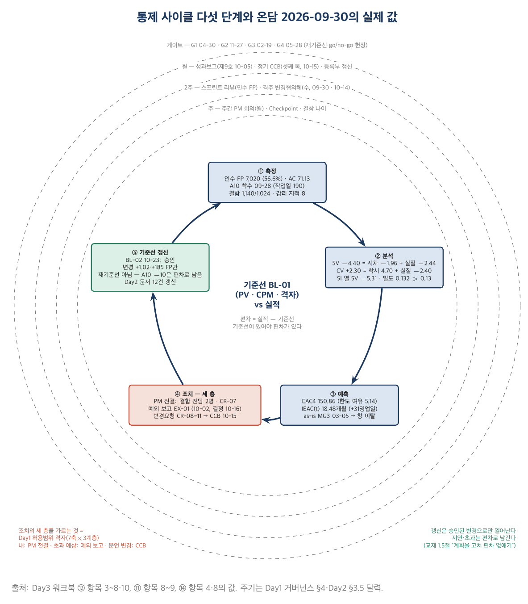

*그림 1-1. 통제 사이클 다섯 단계와 온담 2026-09-30의 실제 값. 조치의 세 층(PM 전결 / 예외 보고 / 변경요청)을 가르는 것이 Day1의 허용범위 격자이고, 기준선 갱신은 승인된 변경으로만 일어난다. 바깥의 동심원은 통제의 주기이며, 주기의 길이가 통제의 해상도다.*

### 온담의 사례로 읽기

> ■ **사례 사실** — 2026-09-30 시점의 실적(성과보고 제1~9호, 03-13 라이선스 지급 조건 변경, 5월 CV +2.70)은 전부 [추가 설정] — Day3 워크북 §0.3 "2026-09-30까지 일어난 일"과 §2.5 예시본이 정본. 사례 정본에서 오는 고정값 — 계획 원가 145.8·집행 한도 156.0(P-08), 허용범위(§5.6).

2026-09-30 시점에 P1의 통제 사이클은 아홉 번 돌았다(월 성과보고 제1호~제9호). 그중 두 번의 실패와 한 번의 성공이 이 장의 재료다.

**실패 1 — 4월 성과보고 제4호.** SPI 0.784를 "주의"로 적고 끝났다. 열별 분해를 하지 않아 상용SW −6.0(조달 이연)과 SI 실질 0이 하나의 숫자로 뭉쳐졌고, "개발은 정시, 조달만 지연"이라는 문장이 없었다. 측정은 되었으나 분석이 없었으므로 조치도 없었다 — R-04 이슈 전환(IS-01)은 2월에 이미 있었지만 그것이 4월 SPI의 원인이라는 연결이 보고서에 없었다.

**실패 2 — 5월 성과보고 제5호.** CV가 −0.16에서 +2.70으로 뛰었다. "원가 절감"으로 읽혔다. 실제로는 03-13 계약 변경(라이선스 지급 조건 50/50)의 흔적이었고, EV는 인도 확인서에 100% 인식되는데 AC는 인보이스 50%만 발생한 것이다. 이 착시는 8월 감리 준비 중에야 발견되었다. 측정 규칙(AC 인식 기준)이 실행 중에 바뀌었는데 그 변경이 성과보고 양식에 "조정 행"으로 반영되지 않았다.

**성공 — 9월 성과보고 제9호.** S18 3주 연장 결정(09-04) 시점에 A10 착수가 09-28로 밀린다는 것이 스프린트 캘린더와 CPM 계산표에서 계산되었고, 임계경로 TF −10 → as-is MG3 2027-03-05 → 컷오버 1차 창 이탈이 예측되었으며, 예외 보고 EX-01이 10-02에 제출되었다(인지 09-28 + 4영업일, 격자의 "예상 시점 5영업일" 규정 안). 측정·분석·예측·조치가 한 보고서 안에서 이어졌다. 그리고 조기 신호 5개(워크북 ⑫ 항목 9)를 사후에 적어 다음 주기의 양식을 바꿨다 — 성과보고에 조정 행, 결함표에 시험 노력 열, 스프린트 연장 결정에 "임계경로 TF 영향" 칸.

두 실패와 한 성공의 차이는 도구가 아니라 **양식**이다. 4월에 열별 분해 표가 있었다면, 5월에 조정 행이 있었다면 실패는 없었다. 통제 사이클의 실무적 정체는 보고서 양식이며, 양식에 없는 칸은 관측되지 않는다.

### 실무에서 어떻게 틀리는가

**측정만 하고 분석을 안 한다.** "SPI 0.94, CPI 1.03"이 보고서의 전부다. 원인 열이 없으므로 조치 열도 없다.

**예측을 안 한다.** 누적 실적만 적고 "이대로 가면"을 적지 않는다. EAC가 없는 성과보고는 회계 보고이고, 종료일 전망이 없는 일정 보고는 달력이다. 그리고 예측을 하되 전제를 안 적는다 — EAC 하나(대개 가장 낙관적인 BAC ÷ CPI)만 보고한다.

**조치의 세 층을 구분하지 않는다.** 모든 편차를 PM이 "만회 노력 중"으로 흡수하거나, 모든 편차를 스폰서에게 올린다. 전자는 예외 보고가 너무 늦고, 후자는 예외 보고가 월례 보고가 되어 아무도 읽지 않는다.

**기준선 갱신과 재기준선을 섞는다.** 지연을 기준선에 흡수해 편차를 0으로 만든다. 3.4절.

---

## 1.2 통제의 단위 — 예측형의 게이트·보고 주기, 적응형의 스프린트 리뷰·번다운, 하이브리드의 세 층

### 개념

Day2 1.2절이 "무엇을 어느 수준까지 미리 정하는가"를 물었다면 실행 단계의 질문은 **"무엇을 어느 주기로 재고 누가 그 결과에 대해 결정하는가"**다. 방법론에 따라 통제의 단위가 다르다.

**예측형(predictive)**의 통제 단위는 **게이트와 보고 주기**다. 기준선(범위·일정·원가)이 앞단에 확정되어 있으므로 실적은 기준선 대비 편차로 재고, 편차는 주기적 보고(주간·월간)로 올라가며, 큰 결정은 게이트(단계 경계)에서 내린다. EVM은 이 형태의 자연스러운 도구다 — 시간대별로 배분된 예산(PMB)이 있어야 PV가 있고, PV가 있어야 SPI가 있다. 건설·EPC·설비의 통제가 이것이고, 온담 P1의 G0~G5 게이트, 월 성과보고, 컨틴전시·관리예비비의 3층이 이 형태다.

**적응형(adaptive)**의 통제 단위는 **반복(iteration)과 그 리뷰**다. 범위가 백로그로 흐르고 우선순위가 매 반복마다 재조정되므로 "기준선 대비 편차"라는 개념이 약하고, 대신 반복 단위의 인도량(velocity·throughput)과 남은 일(번다운·번업), 그리고 흐름의 건전성(WIP·cycle time·work item age)을 본다. 결정은 스프린트 리뷰와 백로그 정제에서 매번 내리고, 게이트는 릴리스 단위로 성긴다. EVM을 그대로 적용하면 두 가지가 부딪힌다 — 범위가 고정되지 않아 BAC가 흔들리고, 스토리포인트는 가치가 아니라 상대 노력이라 EV의 단위가 될 수 없다(2.7절).

**하이브리드**는 두 단위를 **층**으로 겹친다. 온담 P1은 세 층이다. 맨 아래 **스프린트 층**(2주 × 36회) — 스프린트 리뷰에서 인수 FP를 확인하고 throughput·WIP·work item age를 보며, 결정은 이재현 PM과 P1 PMO가 스프린트 안에서 내린다. 가운데 **월 층** — 성과보고(EVM·ES·CPM TF), 변경협의체(격주)와 CCB(월), 리스크 등록부 갱신, 요구사항 동결(매월 마지막 수요일). 결정은 P1 PM 전결과 CCB. 맨 위 **게이트 층**(G0~G5) — 재기준선 여부, 컷오버 go/no-go, 헌장 확정. 결정은 스폰서와 프로그램 이사회. 세 층은 같은 사건을 다른 해상도로 본다. S18의 3주 연장은 스프린트 층에서는 "이월 420 FP", 월 층에서는 "A10 TF −10, SPI(t) 0.920", 게이트 층에서는 "컷오버 1차 창 이탈 예상 → 예외 보고"다.

세 층이 부딪히는 지점이 하이브리드 통제의 실무적 핵심이다. **스프린트 층은 '인수 FP'로 성과를 말하고 월 층은 'EV'로 말한다** — 둘을 잇는 것이 Rules of Credit(인수 FP ÷ 620 × 1.96)이며, 규칙이 없으면 스프린트 리뷰의 "완료"와 성과보고의 "가치"가 다른 것을 가리킨다. **스프린트 층은 범위를 재조정하고 월 층은 범위를 동결한다** — 둘을 잇는 것이 접수 마감(동결 2주 전)과 변경협의체이며, 규칙이 없으면 백로그 우선순위 조정이 범위 변경의 뒷문이 된다. **스프린트 층의 지연은 다음 스프린트로 이월되지만 월 층의 지연은 임계경로 TF를 먹는다** — 둘을 잇는 것이 스프린트 캘린더와 CPM 계산표가 같은 날짜를 가리키는 것(Day2 3.1절의 세 층)이며, 그래서 S18 연장 결정(09-04)에 "임계경로 TF 영향" 칸이 있어야 했다.

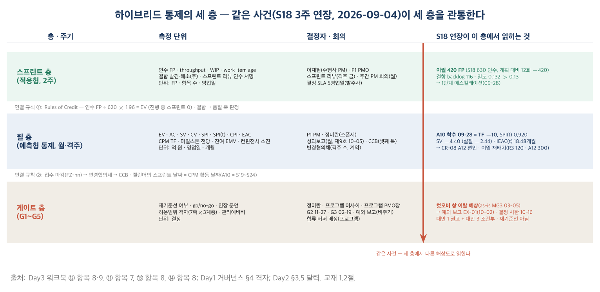

*그림 1-2. 하이브리드 통제의 세 층. 같은 사건이 세 층을 관통하며 다른 해상도로 읽히고, 층 사이의 연결 규칙(Rules of Credit, 접수 마감, 캘린더와 CPM의 날짜 일치)이 없으면 스프린트의 "완료"와 성과보고의 "가치"가 다른 것을 가리킨다.*

### 온담의 사례로 읽기 — 어느 층에서 무엇이 결정되었는가

> ■ **사례 사실** — R-05(발주사 겸임 인력의 승인 대기)는 Day1 워크북 §5.5 초기 리스크·사례 §3.5 "발주사 투입 14명 대부분 겸임"에서 온다; 2026-05-12 실현·S10 3주 연장·변경협의체 07-15 귀책 7일은 [추가 설정](Day3 워크북 §0.3·§3.5).

2026-05-12, POS 화면 정의서 승인 대기가 시작되었다(R-05 실현). 스프린트 층은 S10을 3주로 늘려 흡수했고(05-11~05-29), 그것은 이재현 PM과 P1 PMO의 결정이었다. 월 층은 5월 성과보고에서 SI SV −2.49를 기록했으나 원인 열이 없어 "약간의 지연"으로 넘어갔고, 대체 결정권자 지정(등록부 R-05의 조치)은 3주 늦은 06-03에야 실행되었다. 변경협의체는 07-15에 대기 12영업일 중 7영업일을 발주사 귀책으로 판정하고 대기 비용 0.42억을 컨틴전시에서 집행했다. 게이트 층은 이 사건을 G2 앞의 리스크 재평가(R-05 재발 확률 상향)로만 본다.

세 층이 각각 제 일을 했다. 그런데 스프린트 층의 "3주로 늘린다"는 결정이 월 층의 "임계경로 A05 TF −5"를 만들었고, 그것이 넉 달 뒤 S18의 −10과 합쳐져 게이트 층의 예외 보고가 되었다. 통제의 층이 따로 돌면 아래층의 작은 결정이 위층의 큰 사건이 될 때까지 아무도 보지 못한다. 워크북 ⑫ 항목 9의 조기 신호 2번("5월 2주차, R-05 트리거 발동, work item age 최장 12영업일")은 스프린트 층의 지표가 월 층의 대응(대체 결정권자)을 3주 일찍 당길 수 있었다는 기록이다.

### 실무에서 어떻게 틀리는가

**한 층만 있다.** 스프린트 리뷰만 있고 월 성과보고가 없어 임계경로가 보이지 않거나, 월 보고만 있고 스프린트 지표가 없어 지연을 한 달 늦게 안다.

**층 사이의 연결 규칙이 없다.** 스프린트 "완료"를 EV로 그대로 쓰거나(스프린트 시작 시 100% 인정 — PV와 같아지게), 백로그 조정을 변경 절차 밖에 둔다.

**아래층의 결정에 위층 영향 칸이 없다.** 스프린트 연장, 항목 이월, 시험 인력 이동은 스프린트 층의 일상 결정이지만 그 결정마다 "임계경로 TF에 미치는 영향"이 계산되지 않으면 위층은 그 합을 예외 보고 시점에 처음 본다.

---

## 1.3 표준에서는 — PMBOK 8판 Executing·Monitoring and Controlling Focus Area, PRINCE2 7의 세 프로세스와 Progress practice·Exception, ISO 21502 §7 (심화)

### PMBOK 8판 — 두 Focus Area와 다섯 성과영역

PMBOK Guide 8판(2025)은 7판의 원칙·성과영역 구조 위에 프로세스 기반의 **Focus Area**를 되돌려 놓았다(Day1 2.1~2.2절·Day2 1.3절). 실행·통제 단계에 해당하는 것은 **Executing**과 **Monitoring and Controlling** 두 Focus Area이며, 이 교재가 쓰는 성과영역은 다섯이다.

**Governance** — 변경 통제의 의사결정 구조(CCB), 보고와 에스컬레이션, 예외의 처리. 8판은 통합 변경 통제를 별도 프로세스가 아니라 Governance 성과영역의 의사결정 구조 아래 두고, 승인된 변경이 범위·일정·원가 기준선과 PMB를 갱신한다는 원칙을 유지한다. 제3장.

**Schedule** — 일정 통제(CPM 갱신, TF 소진, 마일스톤 전망), 적응형 지표(번다운·속도·처리량)의 병기. 제2장 2.8절.

**Finance** — 원가 통제와 EVM(EV·PV·AC·SV·CV·SPI·CPI·EAC·ETC·TCPI·VAC), 예측(forecasting)의 EAC 공식들, Earned Schedule의 참고 언급. 제2장.

**Risk** — 리스크 감시: 트리거 관측 → 대응 실행 → 잔여·2차 평가 → 예비비 대조의 순환. 제4장 4.5절.

**Stakeholders** — 이슈 관리와 에스컬레이션, 참여 감시. 제4장 4.4절·제5장 5.3절.

6판(사내 표준 대조용)과의 대응은 워크북 각 X.2 표에 있다 — 4.5 Monitor and Control Project Work / 4.6 Perform Integrated Change Control / 6.6 Control Schedule / 7.4 Control Costs / 8.3 Control Quality / 11.6 Monitor Risks / 12.3 Control Procurements / 13.4 Monitor Stakeholder Engagement. 8판이 6판과 다른 점 하나를 기억해 두라. 6판의 8.3 Control Quality는 "QC = 산출물 검사, QA = 프로세스 검사"의 이분법이었고, 7판이 그것을 지웠으며, 8판은 Quality 성과영역 안에서 둘을 다시 구분하되 **QC의 결과(결함·검사 기록)가 인수(acceptance)의 근거**라는 연결을 앞세운다. 온담에서 그 연결은 "감리 지적사항은 검수의 근거"(회사 정본 §6.3)와 "심각도 1·2 미해결 0은 G3 인수 조건"이다(제4장 4.1절).

### PRINCE2 7 — Controlling a Stage · Managing Product Delivery · Managing a Stage Boundary, 그리고 Progress practice의 Exception

PRINCE2 7(2023)은 실행·통제를 세 프로세스로 나눈다. **Controlling a Stage**(단계 통제)는 PM의 일상 — 작업 패키지 승인, 이슈·리스크의 접수와 평가, 단계 상태 검토, Highlight Report, 시정 조치, 에스컬레이션. **Managing Product Delivery**(제품 인도 관리)는 팀 매니저(온담에서는 수행사 PM 이재현)의 일 — 작업 패키지 수락, 실행, Checkpoint Report, 인도. **Managing a Stage Boundary**(단계 경계 관리)는 게이트 앞의 일 — 다음 단계 계획, 비즈니스 케이스 갱신, End Stage Report, 그리고 **예외 계획(Exception Plan)**. 세 프로세스의 분리는 두 가지를 준다. 발주사 PM과 수행사 PM의 역할이 문서 수준에서 갈라진다는 것(Checkpoint는 이재현이 P1 PM에게, Highlight는 P1 PM이 정미란에게), 그리고 게이트가 "단계를 닫고 다음 단계를 여는" 결정 지점이라는 것.

이 교재가 PRINCE2에서 가장 무겁게 빌리는 것은 **Progress practice의 관리 방식(management by exception)**이다. 각 계층은 위 계층이 준 **허용범위(tolerance)** 안에서 자율적으로 결정하고, 허용범위를 넘을 것으로 **예상되는** 순간 위 계층에 **예외 보고(Exception Report)**를 올린다. 여기서 실무자가 자주 오해하는 것이 있다. 예외 보고는 **권한의 반납이 아니다.** 허용범위는 "이 안에서는 묻지 말고 하라"는 위임이고, 예외 보고는 그 위임의 **반대급부** — "이 밖의 결정은 당신의 것이니 대안을 들고 가겠다" — 다. 허용범위가 없는 조직에서는 모든 결정이 위로 올라가 PM이 없고, 예외 보고가 없는 조직에서는 PM이 자기 권한 밖의 결정을 혼자 내려 스폰서가 없다. 둘 다 통제가 아니다. PRINCE2가 정한 Exception Report의 구조 — 원인, 영향(6개 성과 목표에 대한), 대안(보통 3개), 권고, 결정 시한 — 가 Day1 헌장 §12의 예외 보고 양식이고, 온담의 EX-01(2026-10-02)이 그 첫 실물이다(4.6절).

PRINCE2의 세 보고서를 구분해 두라. **Checkpoint Report**(팀 → PM, 주기적, 작업 패키지 수준), **Highlight Report**(PM → 이사회, 주기적, 단계 수준, RAG와 허용범위 상태), **Exception Report**(PM → 이사회, 비주기적, 허용범위 초과 예상 시). 온담의 주간 PM 회의 자료가 Checkpoint, 월 성과보고 제9호의 1장 요약이 Highlight, EX-01이 Exception이다. 셋을 한 문서로 합치면 예외가 월례에 묻힌다.

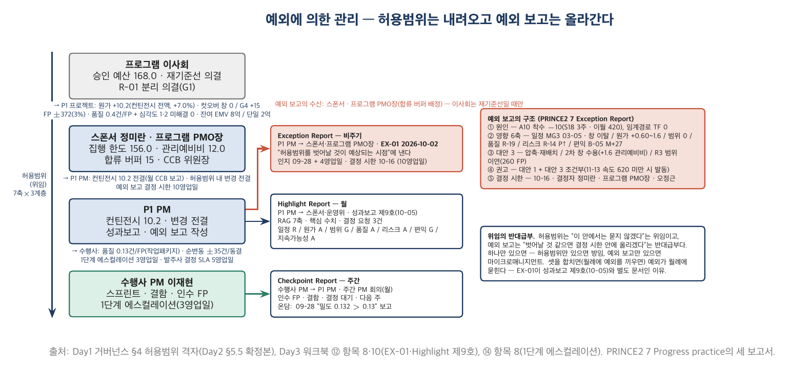

*그림 1-3. 예외에 의한 관리. 허용범위는 아래로 내려오는 위임이고 예외 보고는 위로 올라가는 반대급부다. 세 보고서(Checkpoint·Highlight·Exception)는 주기와 수신자가 다르며, 합치면 예외가 월례에 묻힌다.*

### ISO 21502:2020 §7 — 계약서가 인용하는 조항

ISO 21502는 실행·통제의 활동을 §7의 관리 실무(management practices) 안에 배치한다 — 변경 통제(7.10), 리스크 관리(7.8), 이슈 관리(7.9), 보고(7.12), 조달 관리(7.17) 등 [조항 번호는 워크북과 같이 원문 대조를 권한다]. 이 교재에서 ISO 21502의 용도는 Day2와 같다 — PMBOK·PRINCE2는 특정 기관의 문서이지만 ISO 21502는 국제표준이므로 계약서·감리 계약·사내 규정이 **중립적으로 인용**할 수 있다. 특히 이슈 관리(7.9)를 리스크 관리(7.8)와 **별도 조항**으로 둔 것이 이 교재가 이슈 로그와 리스크 등록부를 한 문서의 두 면으로 다루되 분리하는 근거다(4.4절).

### 실무에서 어떻게 틀리는가

PMBOK 6판의 ITTO를 8판이라고 부르는 것. PRINCE2의 예외 보고를 "실패 보고"로 이해해 내지 않는 것 — 예외 보고는 늦게 낼수록 대안이 줄고, 대안이 없는 예외 보고는 사후 통보다. Highlight Report를 매달 "전부 G"로 내는 것(그러면 보고할 이유가 없다). Checkpoint와 Highlight를 한 문서로 합쳐 수행사의 작업 패키지 상태가 스폰서에게 그대로 가는 것.

---

## 1.4 한국 SI의 통제 사이클 — 주간·월간 보고, 감리와 검수; 분야별 대조 (심화)

### 한국 SI의 실제 주기

한국 SI 프로젝트의 통제는 대개 네 주기로 돈다. **주간 보고**(발주사 PM 주관, 수행사 주간 실적·계획, 이슈·결정 요청), **월간 보고**(공정률·투입 인력·주요 이슈, 스티어링 또는 임원 보고), **감리**(공공은 단계별 정기 감리와 상주 감리, 민간은 계약에 따라 — 온담은 G1·중간 2회·G3·G4의 4.2억), **검수**(릴리스 또는 단계 단위, 계약서 §14의 검수 기간과 결과 통보). 네 주기가 서로 다른 조직의 것이라는 데 실무의 어려움이 있다. 주간·월간은 발주사 PMO의 것이고, 감리는 제3자의 것이며, 검수는 계약(구매·재경)의 것이다. 그리고 그 셋을 잇는 문장이 계약서에 있다 — "감리 지적사항은 검수의 근거"(온담 회사 정본 §6.3). 즉 감리의 지적 하나가 검수를 보류시키고, 검수 보류가 수행사의 대기 비용 청구가 되며, 대기 비용의 귀책이 감리 지적의 "귀속" 칸에서 결정된다. 통제 사이클이 세 조직에 걸쳐 있으므로, 어느 하나의 기록(감리 보고서의 귀속 칸, 검수 보류의 서면 여부)이 다른 둘의 결과를 정한다. 제4장 4.3절과 제5장 5.5절이 이 연결을 다룬다.

한국 SI에서 EVM이 드문 이유도 여기 있다. 월간 보고의 "공정률"은 대개 시간의 비율이거나 담당자의 느낌이고, PV가 시간대별로 배분된 PMB가 있어야 EVM이 성립하는데(2.1절) 대부분의 SI는 계약 총액과 지급 일정만 있다. 온담이 Day2에서 월별 PV 표를 만든 것은 "EVM을 하기 위해서"가 아니라 **4월의 SPI 하락이 조달인지 개발인지를 열별로 구분하기 위해서**였고(Day2 §4.6 해설), 그 예고가 실제로 일어났다.

### 분야별 대조

| 분야 | 통제의 중심 단위 | 성과 측정 | 인수·검수 | 통제 사이클의 특징 |
|---|---|---|---|---|
| **건설·EPC** | 기성(progress payment) | 물리적 진도(physical % complete)의 측정 규칙이 계약 문서. EVM은 계약 요건(ANSI/EIA-748 계열)인 경우가 많다 | 검사·시험 계획(ITP)의 hold point·witness point, 부적합 보고서(NCR), 상주 감리 | 월별 CPI·SPI·EAC가 없으면 기성이 나가지 않는다. 지연 클레임의 절차(EOT, 동시 지연)가 SCL 프로토콜로 정식화 |
| **SI(한국)** | 릴리스·단계 검수 | 공정률(시간 비율) 또는 스프린트 완료율 — EV로 오해되기 쉽다. FP 인수가 EV의 자연스러운 단위 | 감리 지적 → 검수 → 대금. 검수 지연이 대기 비용으로 전환되는 조항 | 주간·월간·감리·검수가 세 조직에 걸쳐 있고, 계약 관리가 PM의 부업이라 기록이 약하다 |
| **제조 NPD** | 게이트(DR·PV·양산 이관) | 게이트 통과 = 마일스톤 가중 EV. 원가 성과는 개발비보다 양산 원가(unit cost) 전망 | 설계 검증(DV)·양산 검증(PV), 시제품 결함, SPC | 설계 변경(ECN)이 형상관리와 직결되고 양산 이후 변경 원가가 급증 — "언제까지의 변경은 싸고 그 후는 비싼가"의 경계선 |
| **제약 임상·규제** | 실사(inspection)·규제 제출 | 등록 환자 수·사이트 개시 수 같은 물리적 진도. 원가보다 일정(특허 만료 역산) | GCP 실사, 규제기관 질의 응답 | 편차의 대부분이 외부(규제기관·사이트) 원인이라 예외 보고의 대안이 "기다린다"가 되기 쉽다 |

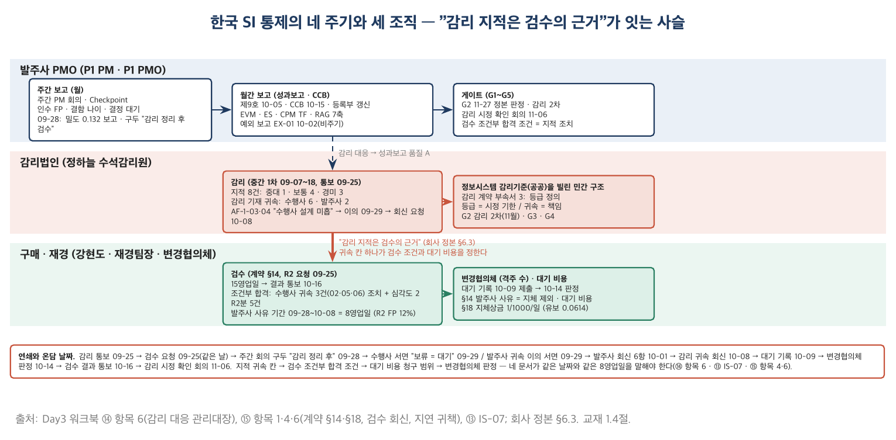

*그림 1-4. 한국 SI의 통제 사이클 — 세 조직에 걸친 네 주기와 그것을 잇는 계약 문장. 감리 보고서의 귀속 칸 하나가 검수와 대기 비용의 결과를 정한다.*

네 분야가 공유하는 것은 하나다 — **인수(acceptance)의 조건이 통제 지표를 결정한다.** 기성이 물리적 진도로 나가면 물리적 진도를 재고, 검수가 감리 지적과 결함 심각도로 결정되면 그것을 재며, 게이트가 시제품 검증으로 열리면 검증 결과를 잰다. 통제 지표는 "표준이 권하는 것"이 아니라 "돈이 움직이는 조건"에서 거꾸로 정해진다.

### 실무에서 어떻게 틀리는가

공정률을 EV로 쓰는 것. 감리와 검수를 다른 조직의 일로 두고 PM이 그 연결을 관리하지 않는 것 — 그러면 감리 보고서의 귀속 칸이 검수 분쟁의 유일한 기록이 된다. 주간 보고를 수행사가 쓰고 발주사가 받아 읽기만 하는 것 — 발주사의 결정 SLA 준수율이 어느 문서에도 없으면 변경협의체에서 "발주사가 5월에 결정을 12일 미뤘다"에 반박할 자리가 없다(5.4절).

---

## 1.5 실무에서 어떻게 틀리는가 — 90% 증후군, 기준선 없는 보고, 계획을 고쳐 편차를 없애기

이 장을 닫으며 실행·통제 단계의 오류 가운데 가장 흔하고 가장 비싼 셋을 따로 세운다.

**90% 증후군.** 담당자에게 "진척률이 얼마인가"를 물으면 종료 3개월 전까지 항상 80~90%다. 이것은 거짓말이 아니라 측정 규칙의 부재다 — "진척률"이 무엇의 비율인지(활동 수·기간·원가·FP·시험 통과율) 정의되지 않았으므로 담당자는 자기가 한 일의 느낌을 답하고, 느낌은 마지막 10%의 어려움을 보지 못한다. Kerzner가 "진척 착시"로 부른 것(6.8절)이고, 처방은 담당자를 바꾸는 것이 아니라 **Rules of Credit**(2.2절) — 진행 중 항목을 0으로 놓거나(0/100), 물리적 단위(인수 FP·확정 테이블 수)로 재거나, 마일스톤 가중으로 재는 규칙을 계획 시점에 합의하는 것이다. 온담의 SI 구현 EV가 "진행 중 스프린트 0"인 이유이며, 그것이 만드는 구조적 SV 음수(−1.96)는 착시가 아니라 규칙의 비용이다.

**기준선 없는 보고.** "지난달보다 좋아졌다"는 문장은 기준선이 없을 때 나온다. 무엇에 비해 좋아졌는가 — 지난달의 실적에 비해서라면 그것은 추세이지 편차가 아니다. 추세는 방향만 말하고 도착지를 말하지 않는다. 기준선이 없거나 있어도 버전이 명시되지 않은 보고(BL-01인가 BL-02인가)는 EV와 PV가 다른 범위를 재고 있을 수 있고, 그때 SPI는 소음이다. 온담 성과보고 제9호가 "비교 기준선 BL-01, BL-02는 10-23 발행 예정, 미반영 변경 CR-03·07 별도 표시"를 첫 표에 적은 이유다.

**계획을 고쳐 편차를 없애기.** 가장 비싼 오류다. 지연이 생기면 기준선 일정을 지연만큼 밀고, 초과가 생기면 기준선 예산을 초과만큼 올려 편차를 0으로 만든다. 재기준선(re-baseline)이라고 부르지만 실제로는 편차의 은폐다. 편차는 없어진 것이 아니라 기준선 안에 들어가 보이지 않게 된 것이고, 다음 달의 편차는 이미 밀린 기준선에 대한 것이므로 누적 지연은 아무 문서에도 남지 않는다. 종료 시점에 "17개월 계획이 20개월 걸렸는데 마지막 기준선 대비 편차는 0"이라는 보고서가 그렇게 만들어진다. 재기준선은 조건이 있고(3.4절 — CCB + 이사회, 최대 2회, 편차 이력의 보존), 온담의 A10 −10이 BL-02에 들어가지 않은 것이 그 조건의 실천이다.

셋의 공통점은 **측정 규칙·기준선 버전·편차 이력이 문서에 없다는 것**이다. 통제는 분석 능력의 문제가 아니라 기록의 문제이고, 기록은 양식의 문제다.

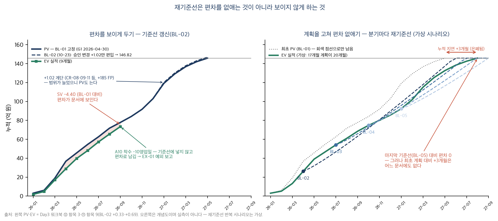

*그림 1-5. 편차를 보이게 두는 것과 계획을 고쳐 편차를 없애는 것. 오른쪽에서 마지막 기준선 대비 편차는 0이지만 최초 기준선 대비 누적 지연은 어느 문서에도 남지 않는다. 온담의 BL-02는 승인된 변경(+1.02, +185 FP)만 편입했고 A10 −10은 편차로 남겼다.*

---

## 제1장 핵심 정리

> **한 줄씩 — 수업 직전 5분 복습용**
> 1. 통제는 편차를 재는 일이 아니라 편차에 대해 무엇을 할지 정하는 일이다 — 측정→분석→예측→조치→기준선 갱신.
> 2. 통제의 단위는 방법에 따라 다르다 — 예측형은 게이트, 적응형은 스프린트, 하이브리드는 세 층.
> 3. 표준은 Focus Area·성과영역·프로세스 이름만 다르다 — 바뀌지 않는 것은 "기준선이 있어야 편차가 있다".
> 4. 한국 SI의 통제는 주간·월간·감리·검수 네 주기가 세 조직에 걸쳐 있다 — 감리 지적은 검수의 근거가 된다.
> 5. 가장 비싼 오류 셋 — 90% 증후군, 기준선 없는 보고, 계획을 고쳐 편차를 없애기.
>
> 아래는 같은 내용의 자세한 판이다.

1. 통제는 편차를 재는 일이 아니라 편차에 대해 무엇을 할지 정하고 실행하는 일이며, 측정 → 분석 → 예측 → 조치 → 기준선 갱신의 순환이다. 측정은 기준선과 같은 규칙으로, 분석은 크기가 아니라 원인을, 예측은 전제를 적어서, 조치는 세 층(PM 전결 / 예외 보고 / 변경요청)으로, 갱신은 승인된 변경으로만.
2. 통제의 단위는 방법론에 따라 다르다 — 예측형은 게이트·보고 주기, 적응형은 반복·리뷰, 하이브리드는 둘을 층으로 겹친다. 온담 P1은 스프린트 / 월 / 게이트의 세 층이며, 층 사이의 연결 규칙(Rules of Credit, 접수 마감·변경협의체, 캘린더와 CPM의 날짜 일치)이 없으면 아래층의 작은 결정이 위층의 큰 사건이 될 때까지 보이지 않는다.
3. PMBOK 8판은 Executing·Monitoring and Controlling Focus Area와 Governance·Schedule·Finance·Risk·Stakeholders 성과영역으로 통제를 배치하고, PRINCE2 7은 Controlling a Stage·Managing Product Delivery·Managing a Stage Boundary 세 프로세스와 Progress practice의 관리 방식(허용범위와 예외 보고)을 준다. 예외 보고는 권한의 반납이 아니라 위임의 반대급부다. ISO 21502 §7은 계약이 중립적으로 인용하는 조항이며 이슈와 리스크를 별도로 둔다.
4. 한국 SI의 통제 사이클은 주간·월간·감리·검수의 네 주기가 세 조직에 걸쳐 있고, "감리 지적은 검수의 근거"라는 계약 문장이 셋을 잇는다. 분야를 막론하고 통제 지표는 인수의 조건에서 거꾸로 정해진다.
5. 가장 흔하고 비싼 오류 셋 — 90% 증후군(측정 규칙의 부재), 기준선 없는 보고(버전 미명시), 계획을 고쳐 편차를 없애기(재기준선의 남용) — 의 공통점은 기록의 부재이고, 기록은 양식의 문제다.

## 생각해 볼 질문

1. 여러분 회사의 월간 보고서에서 "진척률"은 무엇의 비율인가. 활동 수·기간·원가·FP·시험 통과율 중 어느 것인지 보고서 안에 정의가 있는가. 없다면 그 숫자를 만든 사람은 누구이고 그 사람은 마지막 10%를 어떻게 세는가.
2. 온담의 S18 3주 연장 결정(09-04)은 스프린트 층의 결정이었다. 그 결정에 "임계경로 TF 영향" 칸이 있었다면 예외 보고를 09-11에 낼 수 있었다. 여러분의 스프린트 연장·항목 이월·인력 이동 결정에는 위층 영향 칸이 있는가. 없다면 위층은 언제 그 합을 처음 보는가.
3. 예외 보고를 "권한의 반납"으로 느끼는 PM과 "위임의 반대급부"로 느끼는 PM의 행동은 어떻게 다른가. 여러분 조직에서 예외 보고를 낸 PM은 어떤 대우를 받았는가 — 그 기억이 다음 예외 보고의 시점을 어떻게 바꾸는가.
4. "감리 지적사항은 검수의 근거"라는 계약 문장이 있을 때, 감리 보고서의 귀속 칸을 누가 검토하는가. 검토하지 않으면 무엇이 일어나는가.
5. 재기준선을 한 번도 하지 않은 프로젝트와 세 번 한 프로젝트 중 어느 쪽이 더 잘 관리된 것인가. 답하기 위해 무엇을 더 알아야 하는가.

## 워크북 연결

이 장은 워크북 §0(사용법·20종 마스터 표·온담 2026-09-30 상태·Day2에서 가져오는 것)과 다섯 산출물 모두의 X.1·X.2에 대응한다. 워크북 §0.1의 규칙 3("기준선과 실적의 차이를 재고 그 차이에 대해 누가 무엇을 결정해야 하는지를 적는 문서")과 규칙 4("시점을 고정한다 — 실적과 전망을 한 표에 섞으면 EVM은 성립하지 않는다")가 이 장의 통제 사이클이고, 규칙 2("기준선 값을 바꾸지 말고 인용하라")가 1.5절의 세 오류에 대한 처방이다. 각 산출물의 X.2 표준 위치 표에서 PMBOK 8판 Focus Area·성과영역과 6판 프로세스 번호, PRINCE2 7 프로세스·practice·관리 산출물, ISO 21502 조항을 대조하라. 사내 표준이 6판이면 6판 번호로 인용하되 8판 명칭을 병기한다.

---

# 제2장 성과 측정 — EVM과 그 너머

## 2.1 PV·EV·AC와 PMB — ANSI/PMI 19-006-2019가 정의하는 것, BAC는 145.8인가 156.0인가

### 개념

획득가치관리(EVM, earned value management)는 세 숫자로 프로젝트의 위치를 재는 방법이다. **PV(planned value)** — 데이터 일자까지 하기로 계획된 일의 예산. **EV(earned value)** — 데이터 일자까지 실제로 한 일의 예산(계획 당시의 값으로). **AC(actual cost)** — 데이터 일자까지 실제로 쓴 돈. 셋이 같은 단위(돈)이므로 일정과 원가를 한 표에서 비교할 수 있고, 그것이 EVM의 유일하고 결정적인 장점이다. "60%의 기간이 지났는데 40%의 가치가 인도되었다"는 문장은 시간과 가치가 같은 단위일 때만 성립한다.

세 숫자가 성립하려면 앞에 하나가 더 있어야 한다. **PMB(performance measurement baseline)** — 시간대별로 배분된 승인 예산. Day2 4.3절이 월별 PV 표를 만든 이유가 이것이다. PMB가 없으면 PV가 없고, PV가 없으면 SV·SPI가 없다. 그리고 PMB의 합이 **BAC(budget at completion)**다.

**ANSI/PMI 19-006-2019 *The Standard for Earned Value Management***는 2011년 Practice Standard 2판을 대체해 ANSI 표준으로 승격된 현행 정본이며, 적응형·증분 인도의 개념을 통합했다. PMP 소지자 대부분이 2011년판 기준으로 알고 있으므로 판본명을 정확히 부르는 것이 신뢰의 첫 단계다. 표준이 정의하는 구조를 온담에 대응하면 이렇다.

| 표준 용어 | 정의 | 온담 P1 |
|---|---|---|
| Control account | 범위·일정·원가가 통합되어 성과를 측정하는 관리 단위 | WBS L2 다섯 산출물 + 원가 항목(SI·상용SW·인프라·단말·전환·시험·감리·PMO) |
| Work package | 통제 계정 아래의 측정 단위 | WBS 43개 작업패키지 |
| Planning package | 아직 상세화되지 않은 원거리 작업의 예산 묶음 | R4·R5 스프린트 구간(rolling wave) |
| **PMB** | 시간대별로 배분된 예산의 합 — 관리예비비 제외 | **월별 PV 표 17개월, 합 145.80** |
| **BAC** | PMB의 합계 | **145.80** |
| Undistributed budget | 승인되었으나 아직 통제 계정에 배분되지 않은 예산 | 승인 변경(CR-06·08·09) 1.005가 BL-02 편입 전까지 이 상태 |
| **Management reserve** | PMB 밖, 미식별 리스크용, PM 권한 밖 | **관리예비비 12.0(정미란)** |
| (Contingency) | 표준은 컨틴전시의 위치를 조직 관행에 맡긴다 | **PMB 밖·집행 한도 안 — 집행 시 PV 없는 AC로 기록** |

### BAC는 145.8인가 156.0인가

이 질문은 온담에서 실제로 부딪혔고, 워크북 ⑫ 해설의 첫 항목이다. Day2 4.2절은 PMBOK 용어로 "원가 기준선 = 계획 원가 + 컨틴전시 = 156.0"이라고 했다. PM이 책임지는 총액이 156.0이라는 뜻이고 맞다. 그러나 EVM의 BAC는 **시간대별로 배분된 PMB의 합**이어야 하고, 컨틴전시 10.2는 어느 달에도 배분되어 있지 않다 — Day2 PV 표의 합은 145.80이다. 배분되지 않은 돈을 BAC에 넣으면 EV는 결코 BAC에 도달하지 못하고, SPI는 종료 시점에도 1이 되지 않으며, TCPI는 항상 실제보다 낮게 나온다. 그래서 온담은 **BAC = 145.80, 예외 판정 기준 = 집행 한도 156.00**으로 둘을 분리했고, CR-10이 그것을 헌장 §12 문언으로 확정했다("초과 예상 판정 기준 = EAC가 집행 한도 156.0을 초과할 전망").

표준의 용어로는 PMB(145.8)와 "관리예비비를 제외한 프로젝트 예산"(156.0)의 구분이다. 컨틴전시의 위치는 조직이 정한다 — PMB 안에 넣는 조직(통제 계정별로 배분)도 있고, 밖에 두는 조직도 있다. 온담은 밖에 두고 **집행 시 PV 없는 AC**로 기록하기로 했으므로, 컨틴전시 집행 1.41 중 AC 발생분 1.19가 SI 열의 CV −1.19로 나타난다. 이것은 원가 초과가 아니라 규칙의 결과이며, 그래서 SI 열의 원가 성과는 CPI가 아니라 "컨틴전시 소진율"로 읽어야 한다(2.6절 착시 2).

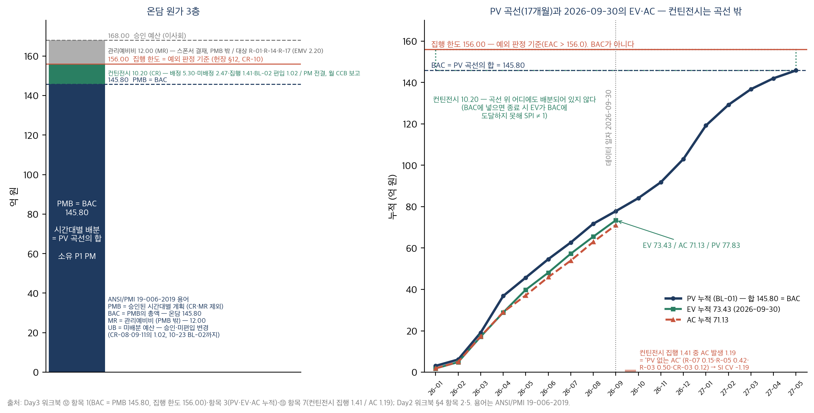

*그림 2-1. 온담 원가 3층과 PMB·BAC. 컨틴전시 10.2는 PV 곡선 위 어디에도 배분되어 있지 않으므로 BAC에 넣으면 EV가 BAC에 도달하지 못한다. 온담은 BAC = 145.80(PMB), 예외 판정 기준 = 156.00(집행 한도)으로 분리했고 컨틴전시 집행은 PV 없는 AC로 기록한다 — CR-10이 이것을 헌장 문언으로 확정했다.*

### 실무에서 어떻게 틀리는가

BAC를 승인 예산(168.0)으로 두어 CPI·TCPI가 좋아 보이는 것. PMB 없이 EVM을 시도하는 것 — 계약 총액을 기간으로 나눈 균등 배분을 PV로 쓰면 4월의 조달 봉우리 같은 구조가 사라져 편차의 원인을 열별로 분리할 수 없다. 관리예비비를 PMB에 넣는 것. 컨틴전시의 위치를 정하지 않아 집행이 어느 열의 AC로 나타나는지 매번 다른 것.

---

## 2.2 Rules of Credit — 지표는 측정이 아니라 합의의 산물

### 개념

EV를 "실제로 한 일의 예산"이라고 정의했지만, "실제로 한 일"이 얼마인지는 저절로 알 수 없다. 스프린트가 절반 지났으면 절반 한 것인가. 설계서를 냈는데 승인이 안 났으면 한 것인가. 라이선스가 인도되었는데 통합시험을 안 했으면 한 것인가. 이 질문들에 대한 답을 계획 시점에 미리 합의한 것이 **Rules of Credit(EV 측정 규칙)**이고, ANSI/PMI 19-006이 **EV 측정 기법(earned value techniques)**으로 부르는 것이다.

| 기법 | 규칙 | 적합한 작업 | 온담 적용 |
|---|---|---|---|
| **0/100** | 완료 전 0, 완료 시 100% | 짧고 이산적인 작업, 진행 중 가치를 인정하면 안 되는 작업 | 설계 스프린트(리뷰 인수 시 1.25/회), 리허설 회차, 감리·시험 회차 보고서 |
| **50/50** | 착수 시 50, 완료 시 50 | 한 보고 주기 안에 걸치는 짧은 작업 | (온담 미사용 — 라이선스 지급 조건 50/50은 AC 인식 규칙이지 EV 규칙이 아니다) |
| **마일스톤 가중(milestone weights)** | 중간 마일스톤에 가중치 배분 | 긴 작업, 검증 가능한 중간 산출물이 있는 작업 | 단말(입고 검수 70 / 설치 확인 30), 통합·시험 스프린트(통합시험 TC 통과율 60 / UAT 종료 40) |
| **물리적 %(percent complete, 물리 단위)** | 측정 가능한 산출 단위의 비율 | 산출 단위가 셀 수 있는 작업 | 구현 스프린트 = 인수 FP ÷ 620 × 1.96, 전환 매핑 = 확정 테이블 수 ÷ 1,842 |
| **배분 노력(apportioned effort)** | 다른 작업의 EV에 비례 | 검사·QA처럼 본 작업에 따라오는 작업 | (온담 미사용) |
| **노력 수준(LOE)** | 시간 경과에 비례, EV = PV | 지속적 지원 작업 | PMO(월 0.56), 유지보수, 클라우드 사용료 |

기법의 선택이 SPI를 가른다. 같은 프로젝트를 **느슨한 규칙**(스프린트 착수 시 100% 인정, 담당자 진척률)으로 재면 SPI는 1 근처에 붙어 있다가 종료 직전에 무너지고, **엄격한 규칙**(진행 중 0, 인수 시에만 인정)으로 재면 SPI는 구조적으로 1 아래에서 시작해 실제 편차를 더한 값으로 움직인다. 온담의 SI 구현 EV가 "진행 중 스프린트 0"인 결과가 데이터 일자에 항상 존재하는 SV −1.96(S20의 PV)이고, 워크북은 그것을 "측정 시차"라는 이름의 착시 3으로 분리해 병기한다. 병기이지 대체가 아니다 — 조정값을 본값 대신 쓰면 기준선 규칙을 실행 중에 바꾸는 것이다.

그래서 이 절의 제목이 "지표는 측정이 아니라 합의의 산물"이다. SPI 0.943은 자연에 있는 값이 아니라 **G1에서 합의한 규칙이 만든 값**이고, 규칙이 달랐으면 다른 값이다. 이 사실은 두 가지를 준다. 첫째, 규칙은 계획 시점에 확정하고 실행 중에 바꾸지 않는다 — 바꾸면 EV는 원하는 숫자가 된다. 둘째, 규칙을 문서로 남긴다 — 온담은 Rules of Credit을 원가 기준선 v1.0 부속 2로 G1에 확정했고 [추가 설정], BL-02에서 정식 첨부한다(워크북 §6 갱신 6번).

여섯 기법이 같은 작업에 대해 어떻게 다른 EV 곡선을 그리는지, 그리고 온담이 어느 것을 채택했는지를 그림 2-2에 놓았다.

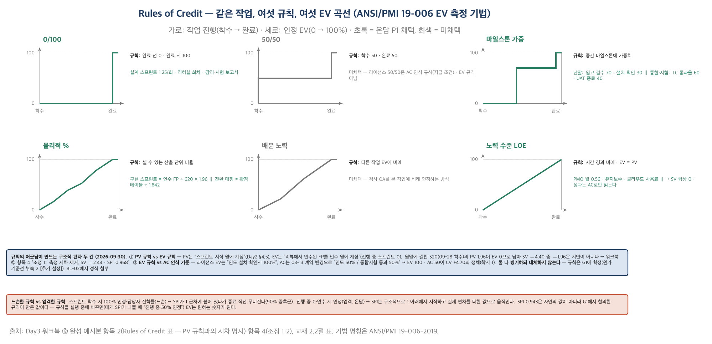

*그림 2-2. Rules of Credit — 같은 작업, 여섯 규칙, 여섯 EV 곡선. 0/100·마일스톤 가중·물리적 %·LOE가 온담 P1의 채택 규칙이고, 50/50과 배분 노력은 쓰지 않는다(라이선스의 50/50은 AC 인식 규칙이지 EV 규칙이 아니다). 아래 두 상자가 규칙의 어긋남이 만드는 구조적 편차 — PV 규칙 vs EV 규칙의 시차(S20 PV 1.96)와 EV 규칙 vs AC 인식 기준의 시차(라이선스 4.70)다. 워크북 ⑫ 항목 2·4.*

### 온담의 사례로 읽기 — PV 규칙과 EV 규칙의 시차

> ■ **사례 사실** — PV 규칙은 Day2 워크북 §4.5 항목 5(스프린트 시작 월 계상), EV 규칙(Rules of Credit)은 Day3 워크북 §2.5 항목 2 — 둘 다 [추가 설정]; 라이선스 지급 조건 50/50 변경(03-13)은 Day3 워크북 §0.3.

Day2의 PV 배분 규칙은 "스프린트 시작 월에 계상"이었다. EV 규칙은 "스프린트 리뷰에서 인수된 FP를 인수 월에 계상"이다. 두 규칙은 각각 합리적이다 — PV는 자금 조달 시점을 재고, EV는 인수 시점을 잰다. 그런데 둘이 어긋나면 월말에 걸친 스프린트 하나만큼의 구조적 SV 음수가 생긴다. 2026-09-30에 S20(09-28 착수)의 PV 1.96이 그것이다. 정상 진행에서도 EV 0이므로 SV −4.40 중 −1.96은 지연이 아니다. 워크북 ⑫ 항목 4는 이것을 "조정 1: 측정 시차 제거 — SV −2.44, SPI 0.968"로 별도 행에 적는다.

같은 구조가 라이선스에도 있다. EV 규칙은 "인도·설치 확인서 100%", AC 인식 기준은 "인보이스 발생액"인데 03-13 계약 변경으로 지급 조건이 "인도 50% / 통합시험 통과 50%"가 되었다. EV는 인도에 100%, AC는 50% — CV +4.70의 정체다(2.6절 착시 1). 이것은 EV 규칙의 문제가 아니라 **AC 인식 기준이 실행 중에 바뀌었는데 성과보고 양식에 조정 행이 없었던** 문제다.

### 실무에서 어떻게 틀리는가

규칙 없이 담당자 진척률을 EV로 쓰는 것(90% 증후군). 스프린트 착수 시 100%를 인정해 PV와 같아지게 하는 것 — SPI가 항상 1이므로 아무것도 재지 않는다. LOE 항목(PMO·클라우드)을 물리적 %로 재려 하는 것 — LOE는 EV ≡ PV이므로 SV가 0이고, 그 항목의 성과는 AC로만 읽는다. 규칙을 실행 중에 바꾸는 것 — 대개 SPI가 나쁠 때 "진행 중 50% 인정"으로 완화된다. 그리고 규칙을 문서로 남기지 않아 감리가 "EV 산정 근거"를 물을 때 답이 없는 것.

---

## 2.3 편차·지수·예측 — SV·CV·SPI·CPI, EAC 4공식과 각각의 가정, TCPI·VAC

### 편차와 지수

> **작은 숫자로 먼저.** 9월 말까지 100억어치 일을 하기로 계획했고(PV 100), 실제로 90억어치를 끝냈으며(EV 90), 그 일에 95억을 썼다(AC 95). SV = 90 − 100 = **−10**(10억어치 일이 밀렸다), CV = 90 − 95 = **−5**(끝낸 일보다 5억을 더 썼다), SPI = 90 ÷ 100 = **0.90**, CPI = 90 ÷ 95 = **0.947**. 총예산(BAC)이 200이면 이 효율이 끝까지 가는 EAC = 200 ÷ 0.947 ≈ **211**. 아래 온담의 숫자는 이 네 줄 계산을 항목별·월별로 한 것이다.

SV = EV − PV(일정 편차, 돈 단위), CV = EV − AC(원가 편차), SPI = EV ÷ PV, CPI = EV ÷ AC. 온담 2026-09-30 누적: PV 77.83 / EV 73.43 / AC 71.13 → SV −4.40 / CV +2.30 / SPI 0.943 / CPI 1.032.

세 가지 읽기 규칙을 세운다.

**SPI를 일수로 읽지 않는다.** "SPI 0.943 = 약 6% 지연"은 비율이지 일수가 아니다. 지연 일수는 Earned Schedule(2.4절) 또는 CPM(2.8절)이 준다. SV −4.40을 월평균 PV로 나누어 일수로 환산하는 관행은 PV 곡선이 봉우리를 가지면 틀린다 — 온담의 4월 PV 17.69와 9월 PV 6.09는 세 배 차이다.

**월별 지수와 누적 지수를 섞지 않는다.** 당월 EV ÷ 당월 PV(월별 SPI)는 그 달의 사건을 보이고, 누적 SPI는 추세를 보인다. 온담의 누적 SPI 추이 0.592 → 0.796 → 0.898 → **0.784(4월)** → 0.871 → 0.881 → 0.914 → 0.913 → 0.943은 4월의 하락(상용SW −6.0, 조달 이연)과 이후의 완만한 회복을 보이지만, 그 회복의 일부는 2.4절의 수렴 착시다.

**열별로 분해한다.** 누적 SV −4.40은 SI −5.31 + 상용SW 0 + 인프라 0 + 전환 +0.20 + 시험·감리 +0.70 + PMO 0이다. 누적 CV +2.30은 SI −1.19 + 상용SW **+4.70** + 인프라 −1.00 + 전환 +0.20 + 시험·감리 −0.05 + PMO −0.36이다. 합계만 보면 "일정은 조금 늦고 원가는 남는다"이고, 열별로 보면 "개발이 늦고 감리 선행이 그것을 가리며, 원가는 라이선스 이연이 인프라·PMO 초과를 덮는다"이다. 성과보고의 열별 분해는 옵션이 아니라 의무다.

### EAC 4공식과 각각의 가정

EAC(estimate at completion)는 "이대로 가면 최종 원가는 얼마인가"다. PMBOK 6판 7.4.2.3이 정리한 네 공식은 각각 다른 **전제**를 갖고, 어느 것이 맞는가는 공식이 아니라 전제가 이 프로젝트에 맞는가로 정한다.

> **미리 말해 두는 것.** 아래 표의 마지막 두 행(EAC1′·EAC3′)에 나오는 **조정 CPI 0.968 · 조정 AC 75.83**은 2.6절 "착시 해부"에서 나오는 값이다 — 라이선스 지급 조건 변경으로 아직 인보이스가 발생하지 않은 4.70억을 AC에 되돌려 넣으면(71.13 + 4.70 = 75.83) CPI는 1.032에서 73.43 ÷ 75.83 = 0.968로 내려간다. 여기서는 그 결과값만 빌려 쓴다. "조정"이라는 말이 나오면 2.6절의 이 계산을 가리킨다고 읽으면 된다.

| 공식 | 전제 | 온담 값 | VAC = BAC − EAC | 판정 |
|---|---|---:|---:|---|
| **EAC1 = BAC ÷ CPI** = 145.80 ÷ 1.032 | 현재 누적 원가 효율이 끝까지 유지된다 | 141.23 | +4.57 | 기각 — 착시(2.6절) 포함. 고정가 SI 68.2는 줄지 않으므로 PMB 아래의 EAC는 구조적으로 불가능 |
| **EAC2 = AC + (BAC − EV)** = 71.13 + 72.37 | 지금까지의 편차는 일회성, 잔여는 계획대로 | 143.50 | +2.30 | 기각 — 라이선스 미발생 4.70과 컨틴전시 잔여 집행이 잔여에 없다 |
| **EAC3 = AC + (BAC − EV) ÷ (CPI × SPI)** = 71.13 + 72.37 ÷ 0.973 | 원가 효율과 일정 효율이 함께 잔여에 영향 | 145.43 | +0.37 | 참고 — 본값 지수 둘 다 착시를 포함 |
| **EAC4 = AC + 상향식 ETC** = 71.13 + 79.72 | 항목별 잔여를 근거로 다시 추정 | **150.86** | **−5.06** | **공식 EAC** |
| EAC1′ = BAC ÷ CPI(조정 0.968) | 발생주의 조정 후 효율 유지 | 150.57 | −4.77 | EAC4의 검산 — 0.3 안에서 만난다 |
| EAC3′ = AC(조정 75.83) + 72.37 ÷ (0.968 × 0.943) | 조정 CPI × SPI | **155.04** | −9.24 | **경고 대역** — 회복 실패 시 도착지, 집행 한도까지 0.96 |

EAC4의 상향식 ETC 79.72는 SI 잔여 계약 38.51 + 변경 대가 1.02 + 대기 잔여 0.18 + 상용SW 5.90(잔여 PV 1.20 + 미발생 4.70) + 인프라 7.92(7.40 × 1.07 클라우드 실사용 추세) + 단말 8.90 + 전환 5.10 + 시험·감리 7.40 + PMO 4.80이다. 각 행에 근거(잔여 계약·미발생·변경 로그·견적)가 있고, 그래서 이것만이 "공식"이 될 수 있다. 조정 CPI로 구한 EAC1′(150.57)이 EAC4(150.86)와 0.3 안에서 만난다는 것은 상향식 ETC가 대체로 옳다는 검산이다. 두 방법이 크게 다르면 어느 하나의 전제가 틀린 것이고, 그것을 찾는 것이 분석이다.

네 공식을 다 적는 이유는 "어느 공식이 맞는가"가 아니라 **"어느 전제가 이 프로젝트에 맞는가"를 보고서 안에서 논증하기 위해서**다. EAC 하나만 보고하는 성과보고는 대개 가장 낙관적인 EAC1을 고르고, 그 보고서를 받은 스폰서는 원가가 남는다고 믿는다.

### TCPI와 VAC

**TCPI(to-complete performance index)** = (BAC − EV) ÷ (BAC − AC) 또는 (BAC − EV) ÷ (EAC − AC). "남은 일을 남은 돈으로 끝내려면 앞으로 어떤 효율이 필요한가"다. 온담: TCPI(BAC) = 72.37 ÷ 74.67 = 0.969(본값 — 착시 포함, 의미 없음), TCPI(BAC, 조정 AC 75.83) = 72.37 ÷ 69.97 = **1.034**(PMB 안에 끝내려면 잔여 구간에서 3.4% 절감 — 고정가 구조에서 비현실적, 즉 PMB 초과는 확정), TCPI(집행 한도 156.00) = 72.37 ÷ 84.87 = 0.853(집행 한도 안은 가능 — 컨틴전시 잔여가 완충), TCPI(EAC4) = 0.908. Christensen 계열 연구의 관행 "TCPI > 1.1이면 회복 불가"를 인용할 때 분모가 BAC인지 집행 한도인지를 구분하라 — 온담은 BAC 기준으로는 초과가 확정이고 집행 한도 기준으로는 여유가 있다.

**VAC(variance at completion)** = BAC − EAC. 온담 EAC4 기준 −5.06, 집행 한도 여유 5.14. **원가 예외 보고는 불요**(EAC4 150.86 < 156.00) — 단 EAC3′ 155.04는 여유 0.96이고, 다음 보고(10-31 데이터)에서 EAC4가 153.0을 넘으면 예외 보고를 준비한다고 스폰서에게 예고한다(경고 등급 A). VAC를 승인 예산 168.0과 비교하면 여유가 17.14로 보이는데, 그 돈은 관리예비비 12.0을 포함해 PM의 것이 아니다.

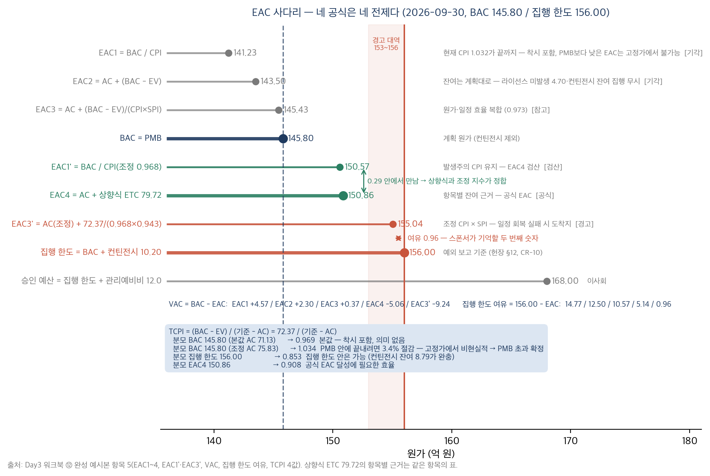

*그림 2-3. 온담 2026-09-30의 EAC 사다리. 네 공식은 네 전제이고, 항목별 근거를 가진 EAC4(150.86)만 공식이 될 수 있으며 조정 CPI의 EAC1′(150.57)이 그것을 검산한다. EAC3′(155.04)은 회복 실패 시의 도착지로 집행 한도까지 0.96 남았다 — 스폰서가 기억해야 할 두 번째 숫자다(첫 번째는 A10 −10).*

### 실무에서 어떻게 틀리는가

EAC 하나(BAC ÷ CPI)만 보고하는 것. 상향식 ETC를 수행사 견적으로 대체하는 것 — 수행사 견적은 계약 잔액이지 발주사의 잔여 원가가 아니다. VAC를 승인 예산과 비교하는 것. TCPI의 분모를 명시하지 않는 것. 그리고 CV 양수를 "절감"으로 읽는 것 — 설명할 수 없는 양수 CV는 대개 AC 인식의 지연이다.

---

## 2.4 Earned Schedule — SPI가 종료로 수렴해 정보를 잃는 결함과 Lipke의 해법

### 결함

전통 EVM의 SPI에는 구조적 결함이 있다. 프로젝트가 늦게라도 끝나면 EV는 결국 BAC에 도달하고, PV도 계획 종료 시점 이후에는 BAC에 머물러 있으므로, SPI = EV ÷ PV는 **종료 시점에 반드시 1.0으로 수렴**한다. 6개월 늦게 끝난 프로젝트도 마지막 보고서의 SPI는 1.0이다. 그리고 수렴은 종료 순간에 갑자기 일어나는 것이 아니라 후반부 내내 진행되므로, 프로젝트의 마지막 1/3에서 SPI는 실제 지연과 무관하게 **좋아지는 것처럼** 보인다. 같은 이유로 SV(돈 단위)도 0으로 수렴한다. 이것이 후반부 프로젝트에서 SPI를 보고 안심하는 조직이 겪는 일이며, Lipke(2003)가 「Schedule is Different」에서 지적한 것이다.

### Earned Schedule

Lipke의 해법은 단순하다 — 일정 편차를 돈이 아니라 **시간**으로 재라. **ES(earned schedule)**는 "현재의 누적 EV를 PV 곡선이 계획상 언제 달성하기로 했는가"의 시점이다. PV 누적이 EV를 넘지 않는 마지막 기간 C에 보간을 더한다.

ES = C + (EV − PV_C) ÷ (PV_{C+1} − PV_C)

> **작은 숫자로 먼저.** 계획(PV 누적)이 8월 말 85, 9월 말 100이고, 지금 9월 말의 EV 누적이 90이라고 하자. "90억어치는 계획상 언제 끝내기로 했나" — 8월 말(85)과 9월 말(100) 사이 (90 − 85) ÷ (100 − 85) = 1/3 지점, 즉 ES = 8 + 0.33 = **8.33개월**. 지금은 AT = 9개월째이므로 SV(t) = 8.33 − 9 = **−0.67개월**, SPI(t) = 8.33 ÷ 9 = **0.926**. 같은 데이터의 SPI는 90 ÷ 100 = 0.90이었다 — 돈의 비율이 아니라 "몇 개월 뒤처졌는가"가 나온다.

**AT(actual time)**는 경과 기간. 그러면 **SV(t) = ES − AT**(시간 단위 일정 편차), **SPI(t) = ES ÷ AT**, **IEAC(t) = PD ÷ SPI(t)**(PD = 계획 기간, 추세 외삽 종료 시점). SPI(t)는 종료 시점에 1로 수렴하지 않는다 — 6개월 늦게 끝난 프로젝트의 마지막 SPI(t)는 PD ÷ (PD + 6)이다.

온담 2026-09-30: PV 누적 8월 71.74 < EV 73.43 < 9월 77.83이므로 C = 8, ES = 8 + (73.43 − 71.74) ÷ (77.83 − 71.74) = 8 + 1.69 ÷ 6.09 = **8.28개월**. AT = 9. SV(t) = **−0.72개월**(≈ −15영업일). SPI(t) = **0.920**. PD = 17. IEAC(t) = 17 ÷ 0.920 = **18.48개월** → +1.48개월 ≈ +31영업일 → 추세 종료 **2027-07-12** > 허용범위 2027-06-18(+15영업일). **초과(추세)**.

월별 SPI와 SPI(t)를 나란히 놓으면 결함이 보인다.

| 월 | SPI | SPI(t) | 차이 | 판독 |
|---|---:|---:|---:|---|
| 2026-03 | 0.898 | 0.950 | +0.052 | 조달 봉우리 앞 — ES가 PV 완만 구간에 있어 SPI(t)가 관대 |
| 2026-04 | 0.784 | 0.887 | +0.103 | 조달 이연: 돈으로는 −8.0, 시간으로는 −0.45개월 |
| 2026-05 | 0.871 | 0.868 | −0.003 | 라이선스 인도로 SPI 회복, SPI(t)는 R-05 지연을 그대로 반영 |
| 2026-06 | 0.881 | 0.878 | −0.003 | |
| 2026-07 | 0.914 | 0.904 | −0.010 | **벌어지기 시작** |
| 2026-08 | 0.913 | 0.914 | +0.001 | |
| **2026-09** | **0.943** | **0.920** | **−0.023** | SPI는 회복처럼, SPI(t)는 정체 — 수렴 착시 |

9월 SPI는 8월보다 0.030 올랐고 SPI(t)는 0.006 올랐다. 지수만 보면 회복 중이고, 시간으로 보면 정체다. 진척 50%에서 이미 벌어지기 시작했으므로 후반부에는 더 벌어진다.

두 가지를 덧붙인다. **IEAC(t)는 추세 외삽이지 계획이 아니다.** 회복 계획이 없을 때의 도착지이며, CPM의 회복 계획(to-be MG3 02-19)과 나란히 놓고 "어느 것이 계획이고 어느 것이 추세인가"를 적는다. **ES는 프로젝트 전체의 평균이고, 지연은 임계경로에 몰려 있다.** SV(t) −0.72개월(−15영업일)은 평균이고, 임계경로 A10은 −10영업일이며, 그 −10이 컷오버 창을 깬다. ES는 온도계의 눈금을 바로잡는 보정표이지 청진기가 아니다 — 청진기는 CPM이다(2.8절).

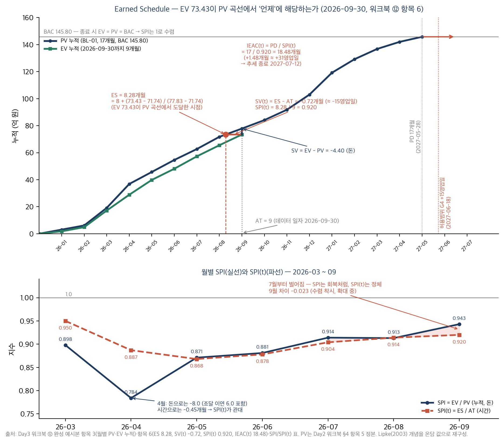

*그림 2-4. Earned Schedule. 위 — EV 73.43이 PV 곡선에서 도달한 시점(ES 8.28개월)과 경과 기간(AT 9)의 간격이 시간 단위 일정 편차 SV(t) −0.72개월이다. 아래 — SPI는 종료로 갈수록 1로 수렴하므로 후반부에 실제 지연과 무관하게 좋아지는 것처럼 보이고, SPI(t)는 그렇지 않다. 온담에서 둘은 7월부터 벌어지기 시작했다. Lipke(2003)를 온담 워크북 ⑫ 항목 6의 값으로 재구성.*

### 실무에서 어떻게 틀리는가

SPI만 보고 "지연이 회복되고 있다"고 읽는 것. ES 없이 SV를 일수로 환산하는 것. IEAC(t)를 종료일로 보고하는 것(그것은 회복 계획이 없을 때의 도착지다). ES를 계산하고 CPM을 보지 않는 것 — 평균 −15영업일이 어느 경로의 것인지 모르면 회복 계획을 세울 수 없다.

---

## 2.5 CPI 안정성 — Christensen 연구가 말하는 것과 말하지 않는 것 (심화)

### 연구

EAC1(BAC ÷ CPI)의 전제는 "현재 누적 CPI가 끝까지 유지된다"이다. 이 전제가 언제 성립하는가를 실증한 것이 Christensen과 동료들의 CPI 안정성 연구다. Christensen & Payne(1992, *Journal of Parametrics*)과 Christensen & Heise(1993, *National Contract Management Journal*)는 미 국방 획득 사업의 대규모 표본에서 **누적 CPI가 진척 20% 시점 이후 ±10% 이내에서 안정되는 경향**을 보였고, 이후 "20% 시점의 CPI가 최종 CPI를 예측한다", "CPI는 대개 나빠지면 나빠졌지 좋아지지 않는다"는 관행적 규칙이 여기서 나왔다. 실무 함의는 명확하다 — 진척 20%에서 CPI가 0.9이면 "곧 회복된다"는 말을 믿지 말라.

### 말하지 않는 것

이 규칙을 온담에 그대로 적용하면 틀린다. 세 이유다.

**표본이 다르다.** 국방 획득 사업은 원가 정산(cost-reimbursable) 계약이 많고 AC가 실제 투입 원가다. 온담의 원가 절반은 **고정가 SI**이고, 발주사 관점의 AC는 인수 FP 대금이므로 EV와 거의 같다. 그 열의 CPI는 구조적으로 1 근처에 붙어 있고 "안정"은 통계가 아니라 계약의 결과다.

**안정된 값이 무엇인지가 먼저다.** 온담의 누적 CPI 추이 0.978 → 0.984 → 0.993 → 0.994 → **1.073(5월)** → 1.047 → 1.062 → 1.041 → 1.032은 5월에 뛰었다. 그 뛰기는 원가 효율의 변화가 아니라 03-13 계약 변경(라이선스 지급 50/50)이 5월 인도에서 AC로 처음 나타난 것이다. 발생주의로 조정하면 CPI는 0.968이고, 그것이 "안정된 값"에 가깝다. 착시를 조정하지 않은 CPI에 Christensen 규칙을 적용하면 "1.03이 끝까지 간다"는 EAC1 141.23이 나온다 — PMB보다 낮은, 고정가 구조에서 불가능한 숫자다.

**진척 50%는 20%가 아니다.** 온담은 EV ÷ BAC = 50.4%다. 규칙이 성립한다면 지금의 조정 CPI 0.968은 크게 회복되지 않는다 — 즉 PMB 초과(TCPI 1.034)는 확정이고, 문제는 집행 한도 156.0 안에서 끝나는가다. Christensen 규칙은 "CPI가 좋아질 것"이라는 희망을 꺾는 데 쓰는 것이지, 착시 포함 CPI를 외삽하는 데 쓰는 것이 아니다.

6.3절에서 연구의 서지와 후속 논쟁을 다룬다.

---

## 2.6 착시 해부 — 온담 2026-09-30의 다섯 착시

> ■ **사례 사실** — 다섯 착시의 숫자(라이선스 +4.70, 측정 시차 1.96, 감리 선행 +0.70 등)는 Day3 워크북 §2.5 항목 7과 검산 스크립트 `그림/PM_Day3/src/day3_evm.py`가 정본; 고정가 SI 68.2 = FP 12,400 × 55만 원은 사례 §3.3.

성과보고의 지표를 좋게 또는 나쁘게 보이게 하는 구조적 원인을 **착시**라고 부르고, 착시마다 이름을 붙이고, 무엇이·왜·얼마만큼·조정 후 값을 적는다. 조정값은 본값 옆에 **병기**하며 대체하지 않는다. 온담 성과보고 제9호의 다섯 착시다(워크북 ⑫ 항목 7).

**착시 1 — 라이선스 인식 기준 차이.** 상용SW CV +4.70, 전체 CPI 1.032. R-04 대응으로 2026-03-13 지급 조건을 인도 50%·통합시험 통과 50%로 바꿨다. EV는 인도 확인서에 100%(MDM 2차·APM 6.0은 5월, SAP 애드온 3.4는 7월), AC는 인보이스 50%. 미발생 4.70(6.0 × 50% + 3.4 × 50%)은 2027-01 통합시험 통과 시 한꺼번에 발생한다. 크기: 전체 CV +2.30의 200%. 조정: AC 75.83, CV −2.40, CPI 0.968. 이 착시는 5월 성과보고에서 "원가 절감"으로 읽혔고 8월에야 발견되었다(조기 신호 3). 그리고 이 4.70은 2027-01 자금 봉우리(단말·DR·시험 16.20)에 얹혀 R-17(2027 자금 집중)의 일부가 되었다 — 착시는 지표만 왜곡하는 것이 아니라 리스크를 만든다.

**착시 2 — 고정가 SI의 CPI ≡ 1.** SI 열 CPI 0.961. 발주사 관점 SI AC = 인수 FP 대금 = EV이므로 CV는 오직 컨틴전시 집행(1.19 = R-07 재산정 0.15 + R-05 대기 비용 0.42 + R-03 폴백 재시험 0.50 + CR-03 0.12)과 변경 대가에서 온다. 구조적이며 조정 불가. 처방: SI 열의 원가 성과는 CPI가 아니라 **컨틴전시 소진율**(집행 1.41 / 10.20 = 13.8% vs 원가 진척 50.4%)로 읽는다. 그리고 소진율은 집행 기준과 배정 기준 두 개를 같이 본다(4.5절).

**착시 3 — 측정 시차.** SV −4.40 중 −1.96. PV는 스프린트 시작 월에, EV는 인수 시에 계상되므로 S20(09-28 착수)의 PV 1.96은 정상 진행에서도 EV 0이다. 크기: SV의 45%. 조정: SV −2.44, SPI 0.968 — 실질 지연 약 1.7 스프린트 분. 2.2절의 Rules of Credit이 만든 착시이며, 규칙의 비용이다.

**착시 4 — SPI 수렴.** 9월 SPI 0.943(8월 0.913에서 상승). 누적 EV가 커질수록 SPI는 1로 수렴한다. 실제 지연은 SPI(t) 0.920(정체). 크기: SPI − SPI(t) = +0.023, 확대 중. 처방: 일정 보고는 SPI(t)·ES·CPM TF로.

**착시 5 — 선행 인도의 양수 SV.** 시험·감리 SV +0.70. 중간감리를 2회로 분할해(계약 변경 로그 9a, 09-01) 1차를 G2 감리(11월 PV)의 절반으로 9월에 실시했다. 진척이 아니라 시점 이동이다. 처방: 진척 판단에서 제외 — 단 감리 지적 8건은 실제다.

착시 1·3을 함께 조정한 실질 성과는 **SPI 0.968·CPI 0.968** — "일정도 원가도 약 3% 뒤"이며 스폰서가 읽어야 할 한 줄이다. 그러나 3%는 평균이고, 지연은 임계경로에 몰려 있다(2.8절).

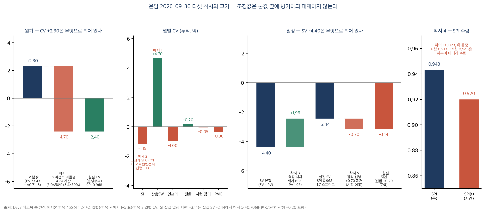

*그림 2-6. 온담 2026-09-30 다섯 착시의 크기. CV +2.30은 라이선스 인식 기준 차이 4.70을 걷어 내면 −2.40이고, SV −4.40은 측정 시차 1.96을 걷어 내면 −2.44이며, 그 안에서 감리 선행 +0.70이 SI 지연을 가린다. 조정값은 본값 옆에 병기하며 대체하지 않는다 — 대체하면 기준선 규칙을 실행 중에 바꾸는 것이다.*

---

## 2.7 하이브리드에서 EV의 함정, 흐름 지표(Vacanti), DORA 지표의 위치 (심화)

### 스토리포인트는 EV가 아니다

적응형 팀에 EVM을 적용하려는 첫 시도는 대개 "스토리포인트 완료율 = EV"다. 이것은 틀린다. 스토리포인트는 팀이 상대적 노력을 표현한 단위이고, 팀마다·시기마다 척도가 다르며, 재추정되고, 가치가 아니라 크기다. EV는 계획 시점의 **예산**이어야 하므로 단위는 돈 또는 돈으로 환산 가능한 물리 단위여야 한다. 온담이 인수 FP를 쓰는 이유다 — FP는 계약 단가(55만 원)가 붙어 있고, 스프린트 리뷰에서 3인(PMO·이재현·형상)이 확인하며, 재추정되지 않는다(변경은 CR로만). 하이브리드에서 EV가 성립하는 조건은 셋이다 — 단위가 계획 시점의 예산으로 환산되고, 인정 시점이 규칙으로 정해져 있고(인수), 범위 변경이 EV 규칙 밖의 절차(변경 관리)로 통제된다.

두 번째 함정은 **"완료"의 정의**다. 스프린트 리뷰의 "완료"가 시연인지, 시험 통과인지, 발주사 인수 서명인지에 따라 EV 인정 시점이 다르고, 느슨한 완료 정의는 통합시험에서 되돌아온다. 온담의 결함 backlog 116건 중 심각도 3·4가 109건인 것은 "인수는 되었으나 결함이 남은" 항목이 R3 개발자의 시간을 먹고 있다는 뜻이며, 그것이 A10 −10의 보이지 않는 원인 중 하나다.

### 흐름 지표 — Vacanti의 네 지표

Vacanti(2015)의 『Actionable Agile Metrics for Predictability』는 스프린트 단위 진척의 **선행 지표**를 넷으로 정리했다. **WIP**(진행 중 항목 수), **cycle time**(항목이 시작에서 완료까지 걸린 시간), **throughput**(단위 시간당 완료 항목 수), **work item age**(진행 중 항목이 시작 후 지금까지 경과한 시간). 넷은 Little's Law(평균 WIP = 평균 throughput × 평균 cycle time)로 묶이며, Vacanti는 그 법칙을 예측 도구가 아니라 **시스템 안정성의 진단 도구**로 쓴다 — 법칙이 성립하지 않는 구간(WIP가 늘고 throughput이 줄고 age가 길어지는)은 시스템이 불안정하다는 신호다.

온담 S7~S18의 흐름 지표(워크북 ⑫ 항목 9):

| 스프린트 | S7 | S8 | S9 | S10 | S11 | S12 | S13 | S14 | S15 | S16 | S17 | S18 |
|---|---:|---:|---:|---:|---:|---:|---:|---:|---:|---:|---:|---:|
| throughput(인수 FP) | 620 | 620 | 600 | **480** | **470** | 560 | 560 | 600 | 620 | 620 | 640 | 630 |
| WIP(진행 중 StRS) | 22 | 24 | 26 | **41** | 38 | 31 | 28 | 27 | 25 | 24 | 26 | 29 |
| work item age 최장(영업일) | 6 | 7 | 9 | **12** | 10 | 8 | 7 | 7 | 6 | 8 | 9 | 11 |
| cycle time 중앙값(영업일) | 14 | 15 | 16 | 21 | 22 | 18 | 17 | 16 | 15 | 15 | 16 | 17 |

S10의 WIP 41·age 12는 SI EV가 떨어지기 2주 전에 보인 신호였다(조기 신호 2). age 12영업일의 정체는 POS 화면 정의서 승인 대기 — R-05의 트리거였고, 그 시점에 대체 결정권자를 지정했다면 S10은 3주가 되지 않았을 수 있다. 흐름 지표를 EVM과 별개로 두면 throughput 하락이 SI EV 하락의 선행 지표라는 것을 놓친다.

**flow debt와 SPI 착시는 같은 병리다.** Vacanti가 말한 flow debt는 오래된 항목을 방치하고 새 항목을 빨리 끝내면 **완료 기준 cycle time의 평균이 '개선'되지만** 부채가 쌓이는 현상이다. 완료된 것만 재는 지표는 완료되지 않은 것의 나이를 보지 못한다. SPI가 종료로 수렴해 정보를 잃는 것(2.4절)과 구조가 같다 — 둘 다 "끝난 것"의 비율이 커질수록 좋아 보이는 지표다. 처방도 같다. 완료 지표 옆에 **진행 중 항목의 나이**(work item age)를 두고, SPI 옆에 SPI(t)를 둔다. 4.2절의 결함 나이(D-0966 16영업일)도 같은 처방이다.

### DORA 지표의 위치

Forsgren·Humble·Kim의 『Accelerate』(2018)가 정리한 DORA 4지표 — 배포 빈도, 변경 리드타임, 변경 실패율, 복구 시간 — 는 **소프트웨어 인도 파이프라인의 건전성** 지표다. 온담 2026-09 [추가 설정]: 배포 주 2회 / 리드타임(커밋 → 시험 환경) 3.1일 / 변경 실패율 12% / 복구 4시간. 통합시험 전까지 변경 실패율 10% 이하가 목표이고, 회복 계획 ①(회귀 자동화)의 효과 지표다.

두 가지를 분명히 해 둔다. 첫째, DORA 지표는 프로젝트 성과 지표가 아니라 **파이프라인 지표**다 — 배포가 주 2회여도 인수 FP는 이월될 수 있다. EVM·ES·CPM이 "어디에 있는가"를, 흐름 지표가 "왜 그런가"를, DORA가 "파이프라인이 그것을 감당하는가"를 말한다. 둘째, 원저는 이 지표를 자기보고 설문 기반의 잠재 구성 측정으로 얻었고, 팀의 CI 로그에서 뽑은 숫자를 **팀 간 서열**로 쓰는 것은 오용이다. 그리고 DORA 2025년 보고서는 지표 체계를 갱신했다(MTTR 대신 Failed Deployment Recovery Time, Deployment Rework Rate 신설로 5개) — 인용 시 판본을 적으라.

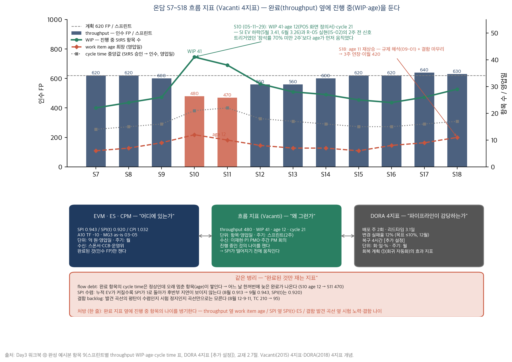

*그림 2-7. 온담 S7~S18 흐름 지표와 지표의 층위. S10의 WIP 41·work item age 12는 SI EV가 떨어지기 2주 전의 신호였다. flow debt와 SPI 수렴은 "완료된 것만 재는 지표"의 같은 병리이며, 처방은 완료 지표 옆에 진행 중 항목의 나이를 두는 것이다.*

---

## 2.8 온담 P1 성과보고 제9호 읽기 — 임계경로 −10, 예외 보고 EX-01, 조기 신호 5개

> ■ **사례 사실** — 컷오버 창 2027-02-26~28·허용범위 일정 +15영업일(§3.4·§5.6); 임계경로 A10 −10영업일·회복 대안 3개·EX-01(10-02)·조기 신호 5개는 [추가 설정] — Day3 워크북 §2.5 항목 8~10과 Day2 워크북 §3.5 CPM 표.

### 일정 통제 — EVM은 온도계, CPM은 청진기

9월 SPI는 0.943으로 8월보다 좋아졌다. SPI(t)는 0.920으로 정체다. CPM에서는 A10(구현 R3)이 기준선 착수 09-14(작업일 180)에서 실제 09-28(190)로 **임계경로 −10영업일**이다. 세 방법이 다른 말을 하는 것처럼 보이지만 같은 말이다 — SPI는 수렴 척도라 좋아 보일 뿐이고, ES는 평균이라 −15영업일이며, 실제 지연은 임계경로에 몰려 있다.

기준선 CPM 계산표(Day2 §3.5)에 실제·전망을 대면(워크북 ⑫ 항목 8): A05(구현 R1) S10 3주로 R1 종료 06-28(+5, TF 0 → −5) → A06(구현 R2) S18 3주로 R2 종료 09-25(+10, TF −10) → A07(규제 검증) 08-24~09-11 완료 142/142, FNLT 09-11 **충족** — R2 항목 재배치의 대가 → A10 착수 09-28, 전망 종료 12-18 → A14(통합시험) as-is 12-18 착수 → A16(UAT) → **as-is MG3 2027-03-05(−10)** → 컷오버 1차 창(02-26~28) **이탈** → 2차 창 03-12~14(합류 버퍼 15 전부 소진) → G4 06-11(+10, 허용범위 +15 내이나 **창 0 위반**).

비임계 경로는 여유가 흡수했다. A08(3PL API·폴백)은 R-03 발동에도 TF 20 → 12. A09(전환 매핑)는 CR-11로 140일이 되어 TF 5 → 15, 데이터 경로 여유 확대. A11(정본 판정 → G2)은 TF 10, G2 11-27 정시 전망. A15(P2 인터페이스 시험)는 G1 의결(04-24 T0 리드타임 38주 → MC 2027-03-05)로 **2차 컷오버(2027-03-27 주말)로 분리**되어 MG3 선행 조건에서 제외 — R-01의 분리 대응이 실제로 작동한 자리다.

버퍼: G3 합류 버퍼 15영업일(프로그램 PMO장)은 as-is 시 전부 소진되며 P1이 단독으로 소비할 수 없다 — **배정 요청 대상**. 규제 버퍼 22(P4)는 A07 충족으로 종료. 데이터 경로 5는 CR-11로 15. A12 여유 10은 CR-08 편입(+5)과 이월 300 FP(+5)로 0 — **제2 임계경로**.

### 회복 계획과 예외 보고 EX-01

예외 보고의 트리거는 SPI가 아니라 **컷오버 창 이탈 예상**(Day2 §3.5 항목 10, 허용범위 0)이고, 그것은 CPM만 볼 수 있다. EX-01은 2026-10-02 제출(인지 09-28 + 4영업일), 결정 시한 10-16. 대안 셋(워크북 ⑫ 항목 8):

| 대안 | 내용 | 일정 효과 | 원가 | 리스크 | 결정자 |
|---|---|---|---|---|---|
| **1. 압축·재배치(권고)** | A14 통합시험 준비를 S24와 SS 겹침(30 → 25) + UAT 1차를 통합시험 후반과 병행(A16 24 → 19 상당) + R2 이월 420 FP를 R3 120·A12 300으로 재배치 + CR-08 A12 편입 | MG3 02-19 회복, G3 앞 여유 0, A12 TF 0(제2 임계) | +0.60(회귀 자동화·시험 인력 선투입, 컨틴전시 R-19 배정) | R-19 통합시험 결함 유출 P 40 × 1.5 = 0.60; UAT 병행이 G3의 심각도 2 미해결 0 조건을 압박 | 정미란, 이재현(속도 640 약속·변경 대가 없음 확인 09-30) |
| 2. 컷오버 2차 창 수용 | 매장·주문 컷오버 03-12~14, G3 03-05 | 합류 버퍼 15 전부 소진, 물류 2차 컷오버(03-27)와 2주 간격 | +1.6(재리허설·매장 통보 재작업 [추가 설정], 관리예비비 대상 — 원인이 프로그램 버퍼 배정) | R-14 P 50 → 70 | **프로그램 PMO장(버퍼 배정), 정미란** |
| 3. R3 범위 이연 | 옴니 "매장 간 재고 이동 요청"(StRS-052 일부, 약 260 FP)을 R5로 | A10 −10 흡수 → MG3 02-19, 압축 불요 | 0(FP 기준선 유지, 인도 시점 변경) | B-05(배달수수료 회피 37억) 실현 M+24 → M+27 위험; 오정근 동의 필요 | **오정근(Senior User)**, CCB(릴리스 이연) |

권고: **대안 1을 주 계획으로, 대안 3을 조건부 예비**(11-13 S22 종료 시점 속도가 620 미만이면 자동 발동)로. 대안 2는 프로그램 PMO장의 버퍼 배정 판단 자료로 첨부. 그리고 한 문장 — **이번은 재기준선이 아니다.** Day2 §3.5 항목 10의 규칙(CCB + 이사회, 최대 2회)은 쓰지 않았고, 기준선 날짜는 유지되며, 지연은 지연으로 기록된다. 회복 계획은 작업 계획을 바꾸는 것이지 자를 바꾸는 것이 아니다.

여기서 대안 1의 구조를 보라. 압축(A14 −5, A16 −5)은 Day2 3.4절이 경고한 fast tracking이다 — 비용은 안 들지만 재작업 리스크가 들고, 그것이 R-19로 등록부에 정식 등재되어 컨틴전시 0.60이 배정된다. 그리고 대안 3은 헌장 §13(이연 가능 범위)의 확장이며 편익 B-05의 시점을 건드리므로 Senior User의 결정이다. 예외 보고의 대안은 각각 **다른 사람의 결정**이어야 한다 — 셋 다 스폰서 결정이면 대안이 아니라 메뉴다.

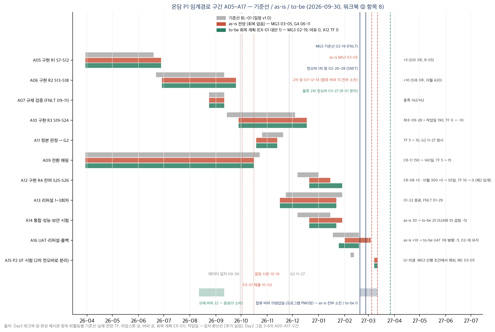

*그림 2-8. 온담 P1 임계경로의 기준선·as-is·to-be. A10 착수 −10이 그대로 가면 MG3 03-05로 컷오버 1차 창을 벗어나 합류 버퍼 15를 전부 쓰고, 회복 계획(A14 SS 겹침 −5, A16 병행 −5, 이월 재배치)이 승인되면 02-19를 회복하되 G3 앞 여유 0·A12 TF 0으로 제2 임계경로가 생긴다. A15는 G1 의결로 2차 컷오버(03-27)에 분리되어 MG3 선행 조건에서 빠졌다. 워크북 ⑫ 항목 8.*

### Highlight Report 제9호와 결정 요청

성과보고 1장의 RAG(정의: G = 허용범위 내·전망도 내 / A = 허용범위 내·전망 초과 가능 / R = 초과 예상·예외 보고 제출): **일정 R**(A10 −10, SPI(t) 0.920, EX-01) / **원가 A**(EAC4 150.86, 여유 5.14, EAC3′ 155.04 경고) / 범위 G(FP +185, +1.5%) / **품질 A**(스프린트 밀도 0.132 > 0.13, 심각도 2 미해결 7) / **리스크 A**(잔여 EMV 7.26, 여유 0.74) / 편익 G(B-08 12h 설계 검증 완료, G2 전망 118억) / **지속가능성 A**(보안 High 2건 조치 중, 기한 10-16). 일곱 축 중 G는 둘이다. 모든 축이 G인 Highlight Report는 보고할 이유가 없는 보고서다.

결정 요청 3건 — ① 정미란·프로그램 PMO장, 10-16까지, EX-01 대안 1 승인(컨틴전시 R-19 0.60 배정 포함)·대안 3 조건부 발동 규칙·대안 2 대비 합류 버퍼 배정 원칙 회신 ② CCB(정미란 위원장), 10-15, CR-08·09·10·11 의결·CR-07 사후 확인·8월 컨틴전시 보고 누락 소급 확인 ③ 정하늘·정미란, 10-08, 감리 지적 3·4번 귀속 이의 회신. 결정 요청은 "누가·언제까지·무엇을"이고, 셋 다 결정자가 다르다.

### 조기 신호 5개 — 변명이 아니라 다음 주기의 관측 목록

워크북 ⑫ 항목 9는 "그때 알 수 있었다"를 다섯 개 적었다. ① 4월 제4호 SPI 0.784 — 열별 분해가 없었다 → 열별 표. ② 5월 2주차 R-05 트리거·age 12 — 대체 결정권자 지정이 3주 늦었다 → 트리거 관측을 스프린트 리뷰 고정 안건으로. ③ 5월 제5호 CV +2.70 — 인식 기준 변경의 흔적을 절감으로 읽었다 → 조정 행. ④ 8월 throughput 정상이나 결함 발견 주 40 → 12, 시험 인력 이동 — S18 연장 결정을 8월 중순에 내렸다면 −10이 아니라 −5 → 결함표에 시험 노력 열. ⑤ 09-04 S18 연장 결정 — 그 순간 TF −10이 계산 가능했다 → 스프린트 연장 결정에 "임계경로 TF 영향" 칸. 다섯 개가 전부 **양식의 변경**으로 끝난다는 것을 보라. 신호를 적지 않는 프로젝트는 같은 것을 매달 놓치고, 적는 프로젝트는 놓친 것을 양식으로 바꾼다.

---

## 2.9 실무에서 어떻게 틀리는가

**PMB 없이 EVM을 한다** — 균등 PV에는 봉우리가 없어 4월의 조달 지연과 5월의 설계 지연이 하나의 서사가 된다. **BAC에 컨틴전시·관리예비비를 넣는다** — EV가 BAC에 도달하지 못한다. **Rules of Credit이 없거나 실행 중에 바뀐다** — 90% 증후군, 착수 시 100% 인정, SPI가 나쁠 때 "진행 중 50%". **EAC 하나(BAC ÷ CPI)만 보고한다** — 착시 포함 CPI의 외삽은 고정가 구조에서 불가능한 숫자를 낳는다. **SPI만 보고 회복 중이라고 읽는다** — 후반부일수록 SPI는 좋아 보인다. **착시를 알면서 유리한 쪽만 보고한다** — CV +2.30을 절감으로, 감리 선행 +0.70을 진척으로. **스토리포인트를 EV로 쓴다.** **흐름 지표를 EVM과 따로 둔다** — S10의 WIP 41은 2주 전 신호였다. **예외 보고의 트리거를 지수로 둔다** — 트리거는 마일스톤의 허용범위 초과 예상이다. **조기 신호를 안 적는다** — 다음 달도 같은 것을 놓친다.

---

## 제2장 핵심 정리

> **한 줄씩 — 수업 직전 5분 복습용**
> 1. EVM은 PV·EV·AC를 같은 단위(돈)에 놓아 일정과 원가를 한 표에서 비교한다 — 전제는 시간대별 PMB.
> 2. EV는 측정이 아니라 합의다 — Rules of Credit을 계획 때 정하고 실행 중 바꾸지 않는다.
> 3. SPI는 일수가 아니다; EAC는 공식이 아니라 전제를 고르는 일이고 근거가 있는 상향식 EAC4만 공식이 된다.
> 4. SPI는 종료로 갈수록 1에 수렴해 정보를 잃는다 — Earned Schedule이 그것을 개월 단위로 고친다.
> 5. CPI 안정성 규칙은 희망을 꺾는 데 쓰는 것이지, 착시가 든 CPI를 외삽하는 데 쓰는 것이 아니다.
> 6. 지표의 착시에는 이름을 붙이고 조정값을 병기한다 — 대체하지 않는다.
> 7. 스토리포인트는 EV가 아니다; 예외 보고의 트리거는 지수가 아니라 마일스톤 초과 예상이다.
>
> 아래는 같은 내용의 자세한 판이다.

1. EVM은 PV·EV·AC를 같은 단위(돈)로 놓아 일정과 원가를 한 표에서 비교하는 방법이며, 시간대별로 배분된 PMB가 전제다. ANSI/PMI 19-006-2019가 현행 정본이고, BAC = PMB의 합(온담 145.80), 관리예비비는 PMB 밖, 컨틴전시의 위치는 조직이 정한다 — 온담은 PMB 밖·집행 한도(156.00) 안·집행 시 PV 없는 AC. CR-10이 이것을 헌장 문언으로 확정했다.
2. EV는 측정이 아니라 합의의 산물이다. Rules of Credit(0/100·50/50·마일스톤 가중·물리적 %·배분·LOE)을 계획 시점에 확정하고 실행 중 바꾸지 않으며 문서로 남긴다. 엄격한 규칙(진행 중 0)이 만드는 구조적 SV 음수(온담 −1.96)는 착시로 병기하되 대체하지 않는다.
3. SPI는 일수가 아니고, 월별과 누적을 섞지 않으며, 열별로 분해한다. EAC 4공식은 4개의 전제이고 항목별 근거를 가진 EAC4(150.86)만 공식이 될 수 있으며 조정 CPI의 EAC1′(150.57)이 검산한다. TCPI는 분모(BAC / 집행 한도 / EAC)를 명시한다. VAC는 승인 예산이 아니라 BAC·집행 한도와 비교한다.
4. SPI는 종료 시점에 1로 수렴해 정보를 잃는다. Lipke의 Earned Schedule(ES·SV(t)·SPI(t)·IEAC(t))이 시간 단위로 그 결함을 고친다 — 온담 ES 8.28개월, SV(t) −0.72개월, SPI(t) 0.920, IEAC(t) 18.48개월(추세 2027-07-12, 허용범위 초과). ES는 평균이고 지연은 임계경로에 몰려 있으므로 CPM과 함께 읽는다.
5. Christensen의 CPI 안정성 규칙(20% 시점 후 ±10%)은 "CPI가 좋아질 것"이라는 희망을 꺾는 데 쓰는 것이지, 착시 포함 CPI를 외삽하는 데 쓰는 것이 아니다. 고정가 SI 열의 CPI는 계약이 만든 1이다.
6. 온담의 다섯 착시 — 라이선스 인식 기준(+4.70), 고정가 SI CPI ≡ 1, 측정 시차(1.96), SPI 수렴(+0.023), 감리 선행(+0.70). 조정 후 실질 SPI 0.968·CPI 0.968 — "일정도 원가도 약 3% 뒤", 그러나 지연은 임계경로 A10에 −10으로 몰려 있고 그것이 컷오버 창을 깬다.
7. 스토리포인트는 EV가 아니다. Vacanti의 흐름 지표(WIP·cycle time·throughput·work item age)는 스프린트 층의 선행 지표이고, flow debt와 SPI 수렴은 "완료된 것만 재는 지표"의 같은 병리다. DORA는 파이프라인 지표이며 팀 간 서열로 쓰지 않는다.
8. 예외 보고의 트리거는 지수가 아니라 마일스톤의 허용범위 초과 예상(컷오버 창 0)이다. EX-01(10-02)의 대안 3개는 각각 다른 사람의 결정이고, 회복 계획은 재기준선이 아니다. 조기 신호 5개는 변명이 아니라 다음 주기의 양식 변경이다.

## 생각해 볼 질문

1. 여러분 회사의 최근 성과보고에서 CPI가 1.05 이상이었던 프로젝트가 있다면, 그 AC의 인식 기준(검수 후 지급, 미청구 공수, 인보이스 지연)에 착시가 없었는가. 그 프로젝트의 최종 원가는 BAC 아래였는가.
2. SPI와 SPI(t)를 같이 계산해 본 적이 있는가. 두 값이 벌어지기 시작한 달을 찾을 수 있는가. 그 달에 무엇이 일어났는가.
3. 온담의 EX-01 대안 1은 fast tracking이고 그 재작업 리스크가 R-19(0.60)로 등재되었다. 압축의 리스크를 등록부에 정식 등재하지 않은 회복 계획은 무엇을 숨기는가.
4. "EV는 합의의 산물"이라면, 이재현 PM이 "진행 중 스프린트 50% 인정"을 요구할 때 발주사 PM은 무엇을 근거로 거절하는가. 거절하지 않으면 SPI는 얼마가 되는가.
5. Highlight Report 7축이 모두 G인 달이 세 달 연속이었다면 무엇을 의심해야 하는가.

## 워크북 연결

이 장의 내용은 워크북 §2 "성과보고 — EVM·Earned Schedule"에서 온담 P1의 2026-09-30 데이터로 적용한다. 항목 1(BAC 145.80 / 예외 기준 156.00, AC 인식 기준, 미반영 변경)·항목 2(Rules of Credit 표 — PV 규칙과의 시차 명시)·항목 3(월별·항목별 PV·EV·AC 표)·항목 4(본값과 조정 1·2 병기)·항목 5(EAC 4공식 + 상향식 ETC 근거표 + TCPI 4개 + 예외 판정)·항목 6(ES 보간 계산, SPI vs SPI(t) 월별 대조)·항목 7(착시 5개 이름·크기·조정)·항목 8(CPM 실제·전망·TF 소진, 마일스톤 as-is/to-be, 버퍼, EX-01 대안 3)·항목 9(조기 신호 5개, 흐름 지표 표, DORA)·항목 10(Highlight Report 1장, 결정 요청 3건)을 채운다. 검산 스크립트 `../그림/PM_Day3/src/day3_evm.py`를 한 번 돌려 본 뒤 숫자를 옮겨 적으라. 기본 과제(10-31 데이터 제10호 재계산 — EAC4가 153.0을 넘는가, SPI(t)는 회복되는가, 대안 3 발동 조건은)와 심화 과제(자기 회사 6개월 PV·EV·AC 세 열, SPI vs SPI(t)가 벌어진 달 찾기)는 §2.7.

---

# 제3장 변경 관리 — 변경은 사건이 아니라 절차다

## 3.1 변경의 원천 4종과 변경요청서의 구조

### 개념

Day2 2.4절은 범위 팽창의 세 형태(scope creep·gold plating·"기타 협의된 사항")를 다뤘고, 그 처방으로 FP 기준선 확인서와 변경 대가의 경로를 세웠다. 실행 단계의 변경 관리는 그 경로를 **실제로 통과시키는 절차**다. 변경은 사건이 아니다 — "요구가 바뀌었다"는 사건이지만, 그것이 기준선을 바꾸는가는 절차가 결정한다. 절차가 없으면 사건이 곧 기준선 변경이 되고, 그것이 범위 크립의 정체다.

변경의 원천은 넷이다. **요구의 변경** — 사용자·이해관계자가 새 것을 원하거나 있던 것을 바꾸려 한다(서정필의 22:00 마감, 오정근의 엑셀 양식 5종). **오류의 정정** — 기준선이 틀렸음을 발견했다(인터페이스 13본 중 폐기 2본·미등재 2본, PV 배분 규칙과 EV 규칙의 시차). **외부 사건** — 규제·벤더·타 프로젝트가 바뀌었다(배달3사 규격 v2, P2 리드타임 38주, 3PL 거부). **거버넌스의 변경** — 기준선의 값이 아니라 규칙이 바뀐다(원가 허용범위의 정의, 예외 보고 트리거). 네 원천은 영향 분석의 무게가 다르다 — 요구 변경은 원가 축이, 범위 축소는 편익 축이, 오류 정정은 품질 축(RTM 커버리지)이, 거버넌스 변경은 리스크·계약 축이 무겁다. 그래서 변경요청서의 첫 칸이 **유형**이다.

변경요청서(change request)는 세 문서가 순서대로 만들어지는 구조다. **요청서** — 누가 무엇을 왜 바꾸자고 하는가(항목 1~3: 식별·내용과 사유·분류와 긴급도). **영향 분석** — 바꾸면 기준선의 어디가 얼마나 움직이는가(항목 4~6: 6축). **의결서** — 누가 무엇을 결정했고 기준선이 어느 버전이 되었는가(항목 7~9: 판정과 경로·CCB 의결·기준선 갱신). 그 결과가 **변경 로그** 한 줄(항목 10)이다. 변경 관리의 실패는 대개 세 문서 중 하나를 건너뛸 때 일어난다 — 요청서 없이 영향 분석을 하면 "누가 원했는가"를 나중에 다투고, 영향 분석 없이 의결하면 CCB는 정치가 되며, 의결서 없이 기준선을 고치면 어느 버전과 실적을 비교하는지 아무도 모른다.

요청서에서 두 칸을 강조한다. **현재 기준선 문장의 인용** — "현재: 범위 기술서 v1.0 §2 ① … → 요청: …". 인용이 없는 변경은 무엇에서 무엇으로 바뀌는지 모르는 변경이고, 나중에 "원래 그랬다"와 "바뀐 것이다"가 충돌한다. **대안 3개** — 요청대로 / 축소 / 이연 또는 파라미터화 / 기각. 예외 보고의 대안 3과 같은 습관이며, CCB가 "예/아니오"가 아니라 "어느 것"을 고르게 한다. CR-09(22:00 마감)의 대안 (c) "마감 시각을 설정값으로 구현하고 운용 시각은 물류 야간조 편성 확정 후 결정"이 실제로 채택된 것은 요청서에 대안이 있었기 때문이다.

### 온담의 사례로 읽기

> ■ **사례 사실** — 변경 4건(CR-08 파일럿 임시 연동 FP +90 · CR-09 가맹 발주 마감 22:00 · CR-10 허용범위 문언 · CR-11 5년 필터)의 요청 문장·사유·일자는 Day3 워크북 §0.3과 §1.5 예시본; 가맹 388점·발주 리드타임 38시간은 사례 §1.4·§2.2(C-09, O-표), P3 파일럿 12개점은 사례 §2.5.

2026-09-30 시점의 변경 4건은 네 원천을 하나씩 대표한다. **CR-08**(파일럿 12개점 임시 재고 동기화 연동, FP +90) — 오류의 정정에 가깝다. 헌장 §5 포함 범위에 임시 연동이 없었고 WBS 1.1.7 카드는 "FP 0 — 배포 기록만"이었는데, P3가 08-28 파일럿 12개점을 확정하자 병행 운영 기간(2027-01-04~02-25)의 재고가 두 원장에서 갈라진다는 것이 드러났다. 요청자는 정미란(헌장 v1.1 수정 요청 1번, G1에서 "FP 산정 후 CCB 상정" 조건부 유보), 발견자는 P1 PM. **CR-09**(가맹 발주 마감 20:00 → 22:00, FP +35) — 요구의 변경. 서정필 협의회장의 서면(협의회 공문 2026-14호, 09-17). **CR-10**(원가 허용범위 정의 확정, FP 0) — 거버넌스의 변경. 헌장 §12 "+6%(10.08억)"와 격자 확정본 "+10.2억 = 컨틴전시 전액"이 두 값을 갖고 있었다. **CR-11**(데이터 전환 5년 이내 이력 한정, FP −60) — 범위 축소. 재경팀장의 보존 요건 확인서(09-22)가 근거이고, BL-01 조정표의 "전환 −2.0"이 아직 용역 계약(11.4)에 반영되지 않은 상태를 정합시킨다.

네 건 모두 접수 마감(FZ-10 10-14) 전에 접수되었고, 긴급도의 근거는 날짜다 — CR-08은 A12 착수 12-07 전 FP 확정, CR-09는 포털 선행 릴리스(12-04) 포함 여부, CR-10은 10-05 성과보고의 첫 EAC 기반 예외 판정, CR-11은 매핑 종료 10-23·리허설 1회차 11-23 전 용역 계약 변경 서면.

### 실무에서 어떻게 틀리는가

요청자 칸에 "현업" 또는 "PM"이 적히는 것 — PM은 접수자다. 구두 요청을 접수하지 않는 것 — 나중에 "요청한 적 없다"와 "합의된 것이다"가 충돌한다. 현재 기준선 문장 없이 요청만 있는 것. 사유가 "사용자 요구"로 끝나는 것. 대안이 요청대로 하나뿐인 것. 모든 변경이 "긴급"인 것. 번호 체계가 RTM·변경협의체·계약 문서마다 달라 한 변경이 세 번호를 갖는 것.

---

## 3.2 6축 영향 분석 — FP 하나로 변경의 크기를 잴 수 없다

### 개념

변경의 크기를 FP 하나로 재면 세 가지가 보이지 않는다. FP +35의 작은 변경(22:00 마감)이 이천센터의 야간 작업 창(21:00 피킹, 폴백 배치 21:00·03:00)과 3PL의 배송 출발 시각을 건드린다. FP 0의 변경(원가 허용범위 재정의)이 PM의 권한과 예외 보고 트리거를 바꾼다. FP −60의 범위 축소(전환 5년 한정)가 세무·회계 보존 요건을 건드린다. 그래서 영향 분석은 **6축**이다 — PRINCE2 7 Issues practice가 이슈의 영향을 6개 성과 목표(benefits·cost·time·quality·scope·risk·sustainability)에 대해 평가하도록 한 것에서 왔고, 온담은 허용범위 격자의 7축 중 지속가능성 축(변경마다 대개 "해당 없음")을 계약/편익 축에 합쳐 6축으로 쓴다.

| 축 | 무엇을 적는가 | 온담 CR-09(22:00 마감)에서 |
|---|---|---|
| **범위** | 영향받는 WBS 작업패키지 코드·RTM 행(StRS·SyRS·SRS 건수)·TC 수, FP 델타와 산정 근거, **누적 FP 변동** | 1.4.2·1.5.4, StRS-073 변경 이력, SRS 4건 수정, FP +35(파라미터화 12 + 마감 배치 재구성 15 + SAP 인터페이스 시각 8), 누적 +245 |
| **일정** | 영향받는 활동(A-ID)·스프린트, 기간 델타, 그 활동의 **TF 전→후**, 임계경로 변동, 마일스톤 영향 | A10(TF 0, 이미 −10)에 +1영업일 부담 → 회복 계획에 포함; 대안 (a)(b)는 운용 전환 R5 이후 |
| **원가** | 금액과 산식, **자금원**(기준선 내 / 컨틴전시 배정·미배정 / 관리예비비 / 감액), 잔액, EAC 영향 | +0.19 = 35 × 0.0055, 미배정 풀; 대안 (a)는 P1 예산 외 운영비(야간조 인건비 연 약 0.9억 [추가 설정], 물류본부) |
| **품질** | 추가·변경·삭제 TC, RTM 커버리지, 결함밀도 분모 변화, 심각도 1·2 조건 | TC-FRN-040~048 중 3건 재작성, TC +8, UAT-FRN-039 수정, 커버리지 불변 |
| **리스크** | 커지거나 줄거나 새로 생기는 R-ID와 잔여 EMV 변화, 허용범위 8억·단일 2억과의 관계 | R-16(폴백 배치 21:00과 22:00 마감분 피킹 충돌) P 30 → 45, 잔여 0.24 → 0.36; R-02 P 40 → 35; 순증 +0.05 → 합 7.31 |
| **계약/편익** | 변경 대가(증·감), 계약 서면 필요 여부, 하도급·라이선스 영향, 편익 B-ID 목표값·시점, **타 프로젝트·운영 조직 영향** | 대가 +0.19(변경협의체 09-30 합의); B-08(38h → 12h)은 (a)(c)에서만 유지; **물류본부 야간조(한동석)·3PL 배송 출발(대성) → 프로그램 운영위 보고** |

세 가지 규칙을 세운다. **일정 축은 TF로 말한다.** "n일"이 아니라 "A12 TF 10 → 델타 +5 → TF 5, 임계경로 불변". 여유 20일인 활동의 5일 지연과 여유 0인 활동의 5일 지연은 다른 사건이다. CR-08의 일정 축이 정확히 이 형식이며, 그 결과 A12는 이월 300 FP(+5)와 합쳐 TF 0이 되어 제2 임계경로가 되었다 — 영향 분석 하나로는 TF 5가 남았지만 회복 계획과 합치니 0이다. **원가 축은 자금원을 적는다.** 자금원이 없으면 승인은 되었는데 어느 돈에서 나가는지 몰라 EVM의 AC에 PV 없는 원가가 쌓인다. 온담의 미배정 풀 5.60은 CR-03 0.12·CR-06 0.32·CR-07 0.22·CR-08 0.495·CR-09 0.19를 거쳐 4.255가 되고, 이 중 기집행 0.34는 컨틴전시 소진에, 미집행 승인분 1.005는 BL-02에서 기준선으로 이동한다. **계약/편익 축에 타 프로젝트·운영 영향 칸을 둔다.** 그 칸이 없으면 CCB는 자기 권한 밖의 것을 결정하거나(P1 CCB가 물류본부의 야간조 편성을 결정), 결정을 미루고 요구를 방치한다.

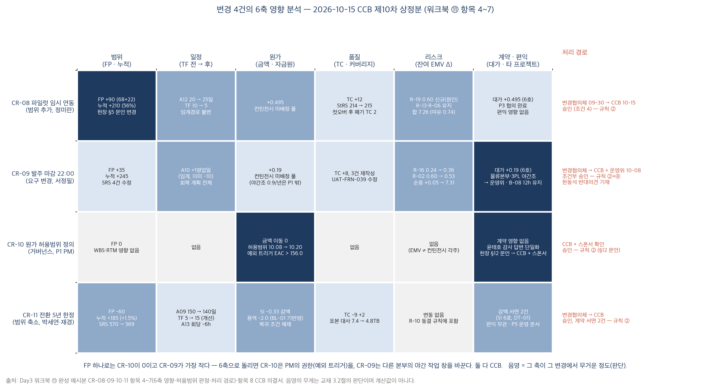

*그림 3-2. 변경 4건의 6축 영향. FP 하나로 재면 CR-10은 0이고 CR-09는 가장 작지만, 6축을 다 돌리면 CR-10은 PM의 권한을 바꾸고 CR-09는 다른 본부의 야간 작업 창을 바꾼다. 일정 축은 TF로, 원가 축은 자금원과 함께, 계약/편익 축은 타 프로젝트·운영 영향 칸과 함께 적는다.*

### 실무에서 어떻게 틀리는가

영향을 "미미"로 적는 것. FP 델타만 있고 어느 작업패키지인지 없는 것 — 그러면 원가 배분과 EV 규칙을 고칠 수 없다. 일정 영향을 "n일"로만 적고 TF를 안 보는 것. 원가 델타에 자금원이 없는 것. 품질 축을 비우는 것 — 변경마다 TC가 늘고 RTM 커버리지가 떨어지는데 감리 직전에 발견한다. 리스크 축에 "리스크 증가"라고만 적는 것. 편익 축을 비우는 것 — 범위 축소는 거의 항상 편익을 건드린다. 타 프로젝트 영향을 P1이 혼자 결정하는 것.

---

## 3.3 처리 경로 — PM 전결, CCB, 계약상 변경협의체, 스폰서; 민간에는 과업심의위원회가 없다

### 세 층의 통제와 처리 경로 규칙

온담 P1의 변경은 세 층에서 통제된다(Day1 거버넌스 §1). **계약상 변경협의체**(격주 수요일)가 변경 대가와 FP 재산정 트리거를 판정하고, **사내 CCB**(월 1회, 셋째 목요일, 위원 7·정족수 5, 위원장 정미란)가 기준선 변경을 승인하며, **허용범위 내 변경은 P1 PM이 전결**하고 CCB에 사후 보고한다. 관리예비비가 필요하면 스폰서 결재(RACI 20행)이고, 타 프로젝트·운영 조직 영향이 있으면 프로그램 운영위 보고를 병행한다. 순서는 계약상 절차가 사내 절차에 앞선다 — **변경협의체 합의 → CCB 승인 → 계약 변경 서면**.

워크북 ⑪ 완성 예시본이 앞에 적은 처리 경로 규칙(변경 관리 계획 v1.0 §3, G1 확정 [추가 설정]) 여섯 개를 그대로 옮긴다.

① 6축 모두 허용범위 내, 헌장 §5·§12·§13 문언 불변, 타 프로젝트·운영 영향 없음 → **P1 PM 전결**(RACI 16행), 다음 CCB 사후 보고.
② 헌장 문언 변경 **또는** 어느 축 초과 → **CCB 승인**(RACI 17행); 수행사 FP 영향이 있으면 변경협의체 합의 선행(RACI 18행).
③ 관리예비비 필요 → **스폰서 결재**(RACI 20행).
④ 타 프로젝트·운영 조직 영향 → **프로그램 운영위 보고 병행**.
⑤ 릴리스 이연(R5) → 헌장 §13 인용, CCB.
⑥ 승인된 변경은 CCB 후 5영업일 내 BL 번호를 올려 기준선 문서 일괄 갱신.

규칙 ②의 앞부분이 이 절의 핵심이다. **허용범위는 크기의 기준이고 헌장은 권한의 기준이며, 둘은 다른 문이다.** CR-08(+90)과 CR-11(−60)은 ±372에 한참 못 미치고 금액도 컨틴전시 안이라 PM 전결로 끝낼 수 있어 보인다. 그러나 두 건은 헌장 §5의 문장을 바꾼다. 헌장은 스폰서와 이사회가 서명한 문서이고, 그 문장이 바뀌는데 PM이 전결하면 다음 게이트에서 "헌장과 다른 것을 만들고 있다"는 감리 지적이 된다. 반대로 CR-07(+40, 인터페이스 목록 정정)은 헌장 문언을 건드리지 않으므로 PM 전결·사후 보고(09-17 전결, 10-15 CCB 사후 확인)가 맞다.

### 민간에는 과업심의위원회가 없다 — 재확인

Day2 2.4절이 확인한 것을 다시 적는다. 소프트웨어 진흥법의 **과업심의위원회**는 공공 SW 사업에서 과업 내용의 확정·변경을 심의하는 법정 기구이고, 발주기관이 설치·운영 의무를 진다. 온담은 민간이므로 **적용되지 않는다.** 그 자리를 채우는 것이 계약서 부속서의 변경협의체와 사내 CCB이며, 둘의 권한과 순서를 계약과 거버넌스 문서에 스스로 적어야 한다. 공공 프로젝트 경험이 있는 실무자가 민간에서 "과업심의위에 올리자"고 말할 때, 그 위원회는 없고 그 기능은 두 기구에 나뉘어 있다는 것을 아는 것이 첫 단계다. 반대로 공공 경험이 없는 실무자는 변경협의체가 "계약상 기구"라는 것 — 합의서가 계약 변경의 효력을 갖고, 대가 산정의 근거가 된다는 것 — 을 가볍게 본다.

### 의결 기준과 의결서

CCB 의결은 "승인"이라는 한 단어가 아니다. 의결서에는 회의 정보(일자, 출석·정족수, 의장, 배석과 퇴장 — 이재현은 변경 대가 확인 후 의결 시 퇴장), 안건별 의결(**택한 대안**으로 적는다 — "CR-09 대안 (c) 조건부 승인"), **조건**(무엇을 누가 언제까지, 미이행 시 결과), **반대의견**(실명·사유 — CCB 규칙상 의무, 없으면 "없음"이라고 적는다), 후속 조치(BL 번호, 계약 서면, RTM·등록부 갱신)와 담당·기한이 있다. 온담 CCB 제10차(2026-10-15, 출석 7/7)의 CR-09 반대의견 칸에 한동석(서면 대독, 위원 아님)의 "야간조 편성은 P2 안정화 이후에나 검토 가능"이 실명으로 적힌 것은 규칙 때문이기도 하지만, 더 실질적으로는 2027-01에 22:00 전환이 재상정될 때 물류본부의 입장이 언제부터 있었는지를 기록하기 위해서다. 2022년 WMS 고도화 축소 결정 회의록의 물류본부장 서명란이 비어 있었던 것(회사 정본 §6.5)을 기억하라. 의결서는 찬성을 기록하는 문서가 아니라 **누가 무엇을 유보했는지**를 기록하는 문서다.

### 실무에서 어떻게 틀리는가

"허용범위 내 = PM 전결"로 끝나는 것 — 헌장 문언을 바꾸는 변경을 골라내지 못한다. 누적을 안 보는 것 — 건별 +90은 허용범위 내지만 누적 +185는 ±372의 49.7%이며 다음 분기 재확인의 대상이다. 변경협의체와 CCB의 순서를 바꾸는 것 — CCB가 먼저 승인하면 변경 대가 협상에서 발주사가 지렛대를 잃는다. 의결서가 "승인" 한 단어인 것. 조건에 담당·기한이 없어 지켜졌는지 아무도 확인하지 않는 것. 반대의견을 안 적어 나중에 "나는 반대했다"가 나오는 것.

---

## 3.4 기준선 갱신(BL-0n)과 재기준선(re-baseline)의 차이, 그리고 남용

### 두 가지는 다른 행위다

**기준선 갱신(baseline update)**은 승인된 변경을 기준선에 편입하는 것이다. FP 12,400 → 12,585, PMB 145.80 → 146.82, PV 곡선의 2026-12·2027-01 행 갱신, RTM v1.2, WBS v1.1, 등록부 v1.2. 편입된 것은 **변경**이고, 편차는 그대로 남는다 — A10 −10은 BL-02에서도 −10이다. ANSI/PMI 19-006이 baseline maintenance라고 부르는 것이며, 승인된 변경의 PMB 편입과 미배분 예산·관리예비비의 이동이 기록되어야 한다.

**재기준선(re-baseline)**은 기준선 자체를 다시 그리는 것이다. 실적에 맞춰 일정을 밀거나 예산을 올려 이전의 편차를 새 기준선에 흡수한다. 그 순간 이전 편차는 사라진다. 재기준선이 정당한 경우가 있다 — 범위가 근본적으로 바뀌었거나(전면 재설계), 기준선이 너무 틀려서 편차가 더 이상 정보가 아닐 때(SPI 0.5가 여섯 달 지속). 그러나 조건이 있어야 한다. 온담은 Day2 §3.5 항목 10에서 정했다 — **CCB + 이사회 의결, 최대 2회, 편차 이력의 보존**(재기준선 전 기준선 대비 누적 편차를 종료 보고서까지 별도 행으로 유지).

둘의 차이를 실무에서 가르는 질문은 하나다. **"이것을 반영한 뒤 편차가 줄어드는가?"** 변경을 편입하면 PV가 늘어(1.02) EV와의 관계는 그대로이므로 편차가 줄지 않는다. 재기준선을 하면 편차가 0이 된다. 편차가 줄어드는 갱신은 재기준선이고, 재기준선은 조건을 따른다.

### 남용

Day2 1.1절이 예고한 대로, 재기준선을 자주 하는 프로젝트는 편차를 없애는 것이 아니라 편차를 보이지 않게 하는 것이다(1.5절 그림 1-5). 남용의 형태 셋. **분기마다 재기준선** — "지난 분기 실적을 반영한 현행화"라는 이름으로 편차를 흡수한다. **변경 없는 PV 갱신** — 실적에 맞춰 PV 곡선만 다시 그린다. 변경 로그에 없는 기준선 변경은 재기준선이다. **회복 계획을 기준선에 넣기** — as-is 전망(MG3 03-05)을 기준선으로 삼아 "계획대로"를 만든다. 온담이 EX-01의 회복 계획을 "재기준선이 아니다"라고 명시한 이유이며, 회복 계획은 작업 계획(working plan)을 바꾸는 것이지 자를 바꾸는 것이 아니다.

### 온담의 BL-02 — 여섯 건을 한 번에

> ■ **사례 사실** — 승인 변경 6건(CR-03·06·07·08·09·11)과 BL-02(10-23)의 내역은 Day3 워크북 §1.5 항목 9·10; 처리 경로 규칙 ⑥(CCB 후 5영업일 내 BL 갱신)은 변경 관리 계획 v1.0 [추가 설정].

승인된 변경 6건(CR-03·06·07·08·09·11)이 FP 기준선을 여섯 번 바꾸면 PV 곡선이 여섯 번 재발행되고 EVM의 비교 대상이 매달 달라진다. 규칙 ⑥ "CCB 후 5영업일 내 BL 번호 일괄 갱신"은 허용범위 내 변경을 변경 원장에 누적해 두었다가 CCB 주기(월)에 맞춰 편입하는 방식이다. 그 결과 2026-09-30 성과보고 제9호는 BL-01 기준이고, CR-03의 0.12억은 PV 없는 AC로 나타나며, 보고서는 "미반영 변경 CR-03 0.12(9월 AC 발생), CR-07 0.22(승인·미집행), CR-06 0.32(승인·미집행)"를 별도 행에 적는다. 이것은 오류가 아니라 규칙이다.

BL-02(2026-10-23)의 갱신 기록: FP 12,585(+185 = CR-03 +22, CR-06 +58, CR-07 +40, CR-08 +90, CR-09 +35, CR-11 −60) / SI 계획 원가 68.20 → 69.22 / PMB 145.80 → **146.82**(+1.02, 컨틴전시 미배정 풀에서 이동) / 컨틴전시 잔여 8.79 → 7.77 / **집행 한도 156.00 불변** / 관리예비비 12.00 불변(CR-11로 복귀 조건 1건 해제) / PV 2026-12 +0.33, 2027-01 +0.69 / 일정 기준선 v1.0 유지(A12 25일·TF 5, A09 140일·TF 15 — 활동 내 흡수, 마일스톤·임계경로 불변) / RTM v1.2(StRS 215, SyRS 399, SRS 575) / 범위 기술서·WBS·사전 v1.1 / 등록부 v1.2 / 헌장 v1.1 확정본(유보 해제, 서명 10-23). 컨틴전시에서 기준선으로의 이동(1.02)이 **집행 한도를 바꾸지 않는다**는 것을 명시해야 스폰서가 "기준선이 늘었다 = 돈이 더 든다"로 읽지 않는다.

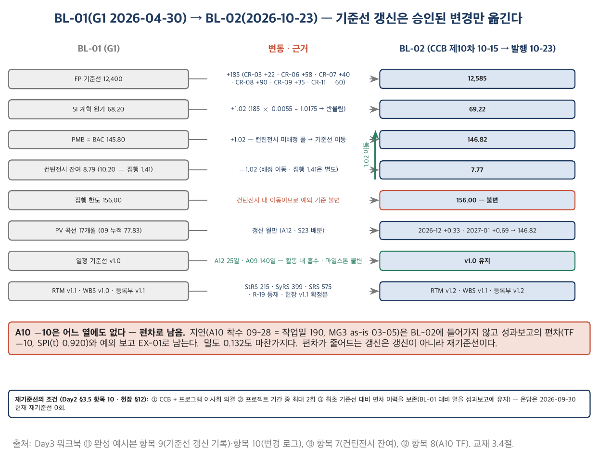

*그림 3-4. BL-01에서 BL-02로. 승인된 변경 6건(+185 FP, +1.02)만 편입되었고 집행 한도는 불변이며 A10 −10은 어느 열에도 없다. 이것이 기준선 갱신이고, 편차가 줄어드는 갱신은 재기준선이며, 재기준선은 조건(CCB + 이사회, 최대 2회, 편차 이력 보존)을 따른다.*

### 실무에서 어떻게 틀리는가

기준선 번호 없이 문서를 고치는 것. FP는 고쳤는데 PV 곡선은 안 고쳐 EV가 새 범위, PV가 옛 범위를 가리키는 것. 감액 변경을 기준선에서 빼지 않아 EV가 100%를 넘는 것. 승인만 하고 기준선을 안 고치는 것 — CCB가 의결서만 남기고 BL 번호가 올라가지 않으면 실적은 승인된 범위를, 기준선은 옛 범위를 가리키고 둘의 차이는 편차가 아니라 소음이 된다. 그리고 재기준선의 조건이 문서에 없는 것.

---

## 3.5 변경 대가와 범위 크립의 통제 도구 — 55만 원/FP, 감액도 변경, RTM 변경 이력·WBS 사전·변경 로그

### 변경 대가

한국 SI의 FP 고정가 계약에서 변경 대가는 **FP 재산정 × 계약 단가**다. 온담의 단가는 55만 원/FP(Day2 §4.5 벤더 견적 검산)이고, CR-08 +90 = 0.495억, CR-09 +35 = 0.1925억, CR-11 −60 = −0.33억, CR-03 +22 = 0.121, CR-06 +58 = 0.319, CR-07 +40 = 0.22 → 누적 +185 FP = **1.0175억**. 여기에 변경협의체가 판정한 대기 비용 0.42(7영업일 × 6명 × 100만 원/일 [추가 설정, 계약 부속서 2 단가표])가 붙어 SI 계약의 누적 변경은 1.4375다.

세 가지를 세운다. **감액도 변경이다.** CR-11의 −0.33은 "돈이 줄어드니 좋다"로 끝나기 쉽지만, 변경협의체 합의(09-30, 수행사 이의 없음)·SI 변경 합의서 6호·FP 확인서 BL-02의 3인 서명이 증액과 똑같이 필요하다. 감액을 기준선에서 빼지 않으면 EV가 100%를 넘고, 계약에서 빼지 않으면 잔금 정산에서 다툰다. **FP 산정 근거가 있어야 한다.** CR-08의 90 = 연동 2본 68 + 배포·회수 도구 22(FP 산정서 부록 v1.1)처럼. 근거 없는 FP는 G4에서 다시 협상된다. **서면 번호가 있어야 한다.** 합의서 3호(CR-03, 03-25), 5호(CR-06 + 대기 비용, 07-15), 6호(CR-07~11 통합 +105 FP = +0.5775, 10-23 예정). 변경 대가에 FP 근거·단가·변경협의체 합의 일자·서면 번호 넷 중 하나가 없으면 그 변경은 종료 시점에 다시 협상된다.

### 범위 크립의 통제 도구

변경이 절차를 통과하게 하는 도구는 Day2 문서에 이미 있다. **RTM 변경 이력 열** — 모든 변경은 요구사항 행의 이력에 CR 번호로 남고(StRS-073 변경 이력에 CR-09, StRS-095 신규에 CR-08), 번호 체계가 RTM·변경협의체·계약 서면에서 같다. 변경 이력이 없는 요구사항의 변경은 "결함"이나 "해석 차이"로 위장한 변경이다. **WBS 사전** — 작업패키지 카드의 추정(FP·공수·기간)·의존·인수 기준이 영향 분석의 단위다. CR-08의 일정 축이 "A12 TF 10 → 5"로 적힐 수 있었던 것은 1.1.7 카드와 CPM 계산표가 있었기 때문이고, 1.1.6 카드의 "외부 의존 — 대응안 결정 전 착수 불가" 조항이 감리 지적 4번의 귀속 이의 근거가 되었다(4.3절). **변경 로그** — 착수 이후 모든 CR의 한 줄 요약. 기각(CR-05 Won't)·이연(CR-04)도 남기고, PM 전결 건도 넣으며(CCB 안건만으로 만들면 누적이 틀린다), 누적 행(FP +185, +1.5%, ±372의 49.7%)을 분기 재확인과 대조한다.

누적의 의미를 다시 적는다. 건마다 372점 아래이지만 합이 372점을 넘는 순간 기준선 재확인(3인 서명)이 트리거되고, 그때 처음 누적표를 만들면 늦다. 워크북 §1.7 기본 과제의 CR-12(배달 주문 가맹 배분·정산, 개산 +160)가 접수되면 누적은 +345(93%)가 된다 — 그것을 지금 볼 수 있어야 한다.

### "Day1 문서는 고쳐진다" — 헌장 v1.1의 의미

Day2 서문이 "Day1 문서는 오늘 고쳐진다"고 했고, Day2 §6은 헌장 v1.1 수정 요청 10건을 냈다. 그중 셋이 오늘 CCB에 왔다 — 1번(파일럿 FP)은 CR-08, 2번(전환 5년 한정)은 CR-11, 4번(원가 허용범위)은 CR-10. G1(04-30)에 서명된 헌장 v1.1은 §5·§12 두 곳에 유보 표시를 갖고 있었고, 10-23의 확정본에서 유보가 해제된다. 즉 **헌장은 착수 때 한 번 쓰고 끝나는 문서가 아니라 변경 관리 절차를 통해 버전이 올라가는 문서**이며, 그 버전의 변경은 변경요청서·영향 분석·CCB 의결서를 똑같이 거친다. 서정필의 요구도, 헌장 수정 요청도, 원가 허용범위의 재정의도 같은 양식으로 들어와 같은 6축으로 분석되고 같은 의결서로 나간다. 그것이 "모든 변경이 같은 문을 통과한다"의 뜻이다.

### 실무에서 어떻게 틀리는가

변경 대가를 종료 시점에 한꺼번에 협상하는 것 — 그때 기록이 있는 쪽이 이긴다. 감액을 변경으로 처리하지 않는 것. FP 산정 근거 없이 금액만 합의하는 것. 변경 로그를 CCB 안건만으로 만드는 것. 기각 건을 지우는 것. 누적을 분기 재확인 직전에 처음 세는 것. 헌장을 "착수 문서"로 두고 실행 중 갱신하지 않아 G3에서 헌장과 산출물이 다른 것.

---

## 3.6 온담 P1 — 변경 4건과 CCB 제10차, "Day1 문서는 고쳐진다"

> ■ **사례 사실** — CCB 7인 구성(위원장 정미란, 박세연, 오정근, 나영선, 최영주, 프로그램 PMO장, 재경팀장)은 사례 §4.1; 2026-10-15 제10차 의결 내용·의결서 문안은 [추가 설정] — Day3 워크북 §1.5 항목 8.

2026-10-15 CCB 제10차(정기, 출석 7/7 — 정미란 위원장, 박세연, 오정근, 나영선, 최영주, 프로그램 PMO장, 재경팀장; 배석 P1 PM·PMO 기준선 담당·이재현(의결 시 퇴장)·강현도; 한동석 서면 의견 제출·불참)의 의결을 한 표로 놓는다.

| 안건 | 유형 · 경로 | 6축 요지 | 의결 | 조건 · 반대의견 |
|---|---|---|---|---|
| **CR-08** 파일럿 임시 연동 FP +90 | 범위 추가·헌장 §5 문언 → 변경협의체(09-30) → CCB | 1.1.7 산출물 +3, StRS-095 신규·SyRS 3·SRS 6·TC 12; 원안 R4 S27–S28은 코드 프리즈 → **A12 편입** 20 → 25일, TF 10 → 5; +0.495 미배정 풀(4.94 → 4.445); R-19 신규 후보 | **승인 — 대안 (b)** | ① A12 TF 5 이하 시 2영업일 내 보고 ② R-19 등록부 v1.2 등재(10-23) ③ 임시 연동은 컷오버 후 30일 내 폐기 절차를 런북(Day4 ⑯)에 ④ 파일럿 매장 재선정(IS-04) 11-13 / 반대 없음 |
| **CR-09** 22:00 마감 FP +35 | 요구 변경·운영 영향 → 변경협의체(09-30) → CCB + 운영위(10-08) | 1.4.2·1.5.4, StRS-073·SRS 4 수정, TC +8; A10 +1(임계); +0.19 미배정 풀; R-16 P 30 → 45(0.24 → 0.36); B-08 12h는 (a)(c)에서 유지; 물류본부·3PL 영향 | **조건부 승인 — 대안 (c)** 파라미터 구현, 초기 운용 20:00 | ① 22:00 운용 전환은 한동석 야간조 편성안·3PL 배송 시각 합의 첨부해 2027-01 CCB 재상정 ② 협의회 회신(오정근, 10-23) ③ B-08 12h 유지, 14h 불채택 ④ R-16 갱신 / **한동석(서면 대독) 반대의견 기재** |
| **CR-10** 원가 허용범위 정의 FP 0 | 거버넌스·헌장 §12 문언 → CCB + 스폰서 | 금액 이동 없음; 허용범위 10.08 → 10.20; 예외 트리거 "EAC > 156.0" 단일화; 리스크 축과의 관계 각주("EMV는 기대값, 컨틴전시는 자금") | **승인 — 대안 (a)** | ① 헌장 v1.1 §12 문언 확정·서명(정미란, 10-23) ② 격자 확정본·회사 정본 §5.6 각주 ③ 운영위 보고(11월) ④ 윤태호 내부감사팀장 사본 / 반대 없음 |
| **CR-11** 전환 5년 한정 FP −60 | 범위 축소·헌장 §5 문언·계약 감액 2건 → 변경협의체(09-30) → CCB | 1.5.7·1.5.9·1.2.2·1.5.2, SRS −2 +1, TC −9 +2; A09 150 → 140, TF 5 → 15; SI −0.33 감액 + 용역 −2.0(BL-01 기반영, 계약 정합); 보존 요건 확인서(재경팀장 09-22); 편익 무관 | **승인 — 대안 (a)** | ① 용역 변경 계약 1호(−2.0) 10-23 ② SI 합의서 6호(CR-08·09·11 통합 +65 FP + CR-07 = +105 FP, +0.5775) 10-23 ③ 5년 필터 규칙을 G2 정본 판정서 동결 규칙에 ④ 아카이브 접근 절차 P5 운영 문서 ⑤ 확인서를 헌장 §9 가정 부속으로 / 반대 없음 |
| 사후 보고 | CR-07(+40, 0.22, PM 전결 09-17) 승인 확인. 컨틴전시 집행 현황 누적 1.41 — **8월 CCB 보고 누락분(R-03 0.50) 소급 보고**(감리 지적 8번 대응) | | | |

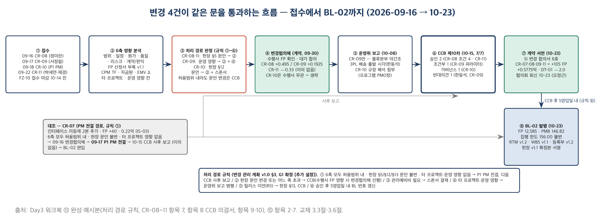

*그림 3-6. 변경 4건이 같은 문을 통과하는 흐름 — 접수, 6축, 처리 경로 판정, 변경협의체(계약), 운영위, CCB(사내), 계약 서면, BL-02. CR-07은 헌장 문언을 건드리지 않아 PM 전결·사후 보고로 갔다.*

의결 후 BL-02 발행 2026-10-23. 네 건에서 읽을 것 셋. **CR-09에서 CCB는 설계 변경과 운영 변경을 분리했다.** 마감 시각을 설정값으로 만들어 두면(FP +35) 운영이 준비되는 순간 코드 변경 없이 전환할 수 있고, 준비되지 않으면 20:00으로 운용해도 협의회에 "기능은 있다"고 답할 수 있다. 6축 중 계약/편익 축의 타 프로젝트·운영 영향 칸이 이 결정을 만들었다. **CR-11에서 감액 변경의 영향 분석은 "얼마가 줄어드는가"가 아니라 "기준선과 계약이 언제 같아지는가, 그 전에 무엇이 잘못 실행되는가"를 물었다.** 리허설 1회차(11-23)가 7.4TB로 돌면 34시간 창 검증이 왜곡된다. **CR-10에서 FP 0의 변경이 성과보고의 판정 기준을 바꿨다.** 예외 보고 트리거가 하나(EAC > 156.0)가 되어 ⑫의 판정과 정합하고, 윤태호 내부감사팀장의 "컨틴전시 집행 승인 근거" 질의에 두 문서가 다른 답을 하지 않게 되었다.

---

## 3.7 실무에서 어떻게 틀리는가

**구두 합의** — 발주사 담당자가 수행사 개발자에게 직접 말하고, 수행사는 기록해 두었다가 분기 재확인에서 한꺼번에 변경 대가로 내놓는다. 이재현 PM의 착수 발언은 위협이 아니라 예고였고, 변경요청서는 그 예고에 대한 발주사의 유일한 방어다. **변경을 이슈로 위장** — 요구가 "결함"으로 백로그에 들어온다. 온담은 결함 정의에 "요구 변경·해석 차이는 변경요청"을 넣고 판정 다툼은 PMO 품질 담당이 3영업일 내 결정한다. **CCB가 승인만 하고 기준선을 안 고침** — 의결서만 남고 BL 번호가 올라가지 않는다. **허용범위 내 변경의 누적을 안 봄** — 누적표가 수행사의 것뿐이면 분기 재확인은 수행사의 숫자로 한다. **헌장 문언 변경을 PM이 전결** — 다음 게이트에서 감리 지적이 된다. **변경협의체와 CCB의 순서 역전** — 대가 협상의 지렛대가 없다. **감액을 변경으로 처리하지 않음.** **재기준선으로 편차를 지움.**

---

## 제3장 핵심 정리

> **한 줄씩 — 수업 직전 5분 복습용**
> 1. 변경은 사건이 아니라 절차다 — 원천 넷(요구·오류·외부·거버넌스)마다 다른 문서로 들어온다.
> 2. 영향은 6축(범위·일정·원가·품질·리스크·계약/편익)으로 재고, FP 하나로 크기를 재지 않는다.
> 3. 처리 경로의 핵심 규칙 — 헌장 문언이 바뀌거나 어느 축이 허용범위를 넘으면 CCB다.
> 4. 기준선 갱신(BL-0n)은 승인된 변경의 편입이고, 재기준선은 편차를 지우는 일이다 — 둘을 섞지 않는다.
> 5. 변경 대가는 FP × 단가이고 감액도 변경이다 — 근거·단가·합의 일자·서면 번호 넷이 있어야 한다.
> 6. 헌장은 한 번 쓰는 문서가 아니라 변경 절차로 버전이 올라가는 문서다.
>
> 아래는 같은 내용의 자세한 판이다.

1. 변경은 사건이 아니라 절차다. 원천은 요구 변경·오류 정정·외부 사건·거버넌스 변경의 넷이고 각각 영향 분석의 무게가 다르다. 변경요청서(식별·내용과 사유·분류) → 영향 분석(6축) → CCB 의결서(의결·조건·반대의견·기준선 갱신) → 변경 로그 한 줄의 순서이며, 현재 기준선 문장의 인용과 대안 3개가 요청서의 핵심 칸이다.
2. 6축(범위·일정·원가·품질·리스크·계약/편익)은 PRINCE2 Issues practice의 6개 성과 목표에서 왔다. 일정 축은 TF로, 원가 축은 자금원과 함께, 계약/편익 축은 타 프로젝트·운영 영향 칸과 함께 적는다. FP 하나로는 CR-10이 0이고 CR-09가 가장 작지만 6축으로는 둘 다 CCB다.
3. 처리 경로 규칙 여섯 개 — 핵심은 ② "헌장 문언 변경 또는 어느 축 초과 → CCB". 허용범위는 크기의 기준이고 헌장은 권한의 기준이며 둘은 다른 문이다. 순서는 변경협의체(계약) → CCB(사내) → 계약 서면. 민간에는 과업심의위원회가 없고 그 기능은 두 기구에 나뉘어 있다. 의결서는 택한 대안·조건(담당·기한·미이행 시)·반대의견(실명)을 적으며, 찬성이 아니라 유보를 기록하는 문서다.
4. 기준선 갱신은 승인된 변경의 편입(BL-01 → BL-02: +185 FP, +1.02, 집행 한도 불변, A10 −10은 편차로 남음)이고, 재기준선은 편차를 흡수하는 것이며 조건(CCB + 이사회, 최대 2회, 편차 이력 보존)을 따른다. "반영한 뒤 편차가 줄어드는가"가 둘을 가르는 질문이다. 회복 계획은 재기준선이 아니다.
5. 변경 대가는 FP × 55만 원이고 감액도 변경이며, FP 근거·단가·변경협의체 합의 일자·서면 번호 넷이 있어야 G4에서 다시 협상되지 않는다. 범위 크립의 통제 도구는 RTM 변경 이력 열·WBS 사전·변경 로그이고, 누적(+185, 49.7%)을 분기 재확인 전에 볼 수 있어야 한다.
6. 헌장은 착수 때 한 번 쓰고 끝나는 문서가 아니라 변경 관리 절차로 버전이 올라가는 문서다. 헌장 v1.1 수정 요청 10건 중 1·2·4번이 CR-08·11·10이 되어 같은 문을 통과했고, 10-23 확정본에서 유보가 해제된다.

## 생각해 볼 질문

1. 여러분 회사의 변경 로그에서 요청자가 사람 이름으로 적힌 변경의 비율은 얼마인가. "현업"으로 적힌 변경이 분쟁이 되면 누가 원했는지를 누가 증명하는가.
2. 허용범위 안의 변경 중 헌장(또는 사업 계획서) 문언을 바꾸는 것을 골라낼 수 있는가. 골라내지 못했을 때 다음 게이트에서 무엇이 일어나는가.
3. CR-09에서 CCB가 대안 (a)(요청대로 22:00 운용)를 승인했다면 무엇이 일어났을까. P1 CCB가 물류본부의 야간조 편성을 결정할 수 있는가. 결정했다면 한동석은 무엇을 했을까.
4. "반영한 뒤 편차가 줄어드는가"를 여러분 회사의 최근 기준선 변경에 적용해 보라. 줄어들었다면 그것은 재기준선이었고, 조건을 따랐는가.
5. 변경 대가를 종료 시점에 한꺼번에 협상하는 관행은 누구에게 유리한가. 기록이 있는 쪽인가, 목소리가 큰 쪽인가.

## 워크북 연결

이 장의 내용은 워크북 §1 "변경요청서·영향 분석·CCB 의결서"에서 온담 P1의 변경 4건(CR-08·09·10·11) 전문으로 적용한다. 항목 1~3(식별·내용과 사유·분류)에서 현재 기준선 문장 인용과 대안 3개, 항목 4~6(6축)에서 TF·자금원·타 프로젝트 칸, 항목 7(허용범위 판정과 처리 경로 규칙 ①~⑥), 항목 8(CCB 제10차 의결서 — 택한 대안·조건·반대의견), 항목 9(BL-01 → BL-02 갱신 기록), 항목 10(변경 로그 CR-01~11, 누적 +185)을 채운다. 검산은 §1.6(FP 누적, 금액 1.0175, 미배정 풀 4.255 → 기집행 0.34 + 편입 1.005, 146.82 + 7.77 + 1.41 = 156.00, A12 TF, A09 TF). 기본 과제(CR-12 배달 주문 가맹 배분·정산 +160, 누적 +345 = 93%, 헌장 §13과 §5 충돌 시 결정자)와 심화 과제(자기 회사 변경 로그의 요청자 실명 비율·TF 표기 수·누적 합)는 §1.7.

---

# 제4장 품질·이슈·리스크 통제

## 4.1 QA와 QC, 결함밀도 정의의 정치 — 분모와 분자

### QA와 QC

품질 보증(QA, quality assurance)은 "절차를 지켰는가"를 묻고, 품질 통제(QC, quality control)는 "산출물이 맞는가"를 묻는다. PMBOK 6판은 둘을 8.2 Manage Quality와 8.3 Control Quality로 나눴고, 7판이 그 구분을 지웠으며, 8판은 Quality 성과영역 안에서 둘을 다시 구분하되 **QC의 결과가 인수(acceptance)의 근거**라는 연결을 앞세운다(1.3절). 온담에서 QC의 두 축은 **결함**(수행사 시험과 발주사 검증에서 발견된 것)과 **감리 지적**(정하늘 수석감리원이 문서·절차·산출물을 검토해 지적한 것)이다. 둘은 성격이 다르다 — 결함은 코드의 오류이고 감리 지적은 관리의 오류이며, 결함은 수행사가 고치고 감리 지적은 대개 발주사·수행사가 나누어 고친다. 그런데 온담의 계약 구조에서 둘은 한 지점에서 만난다. **검수**다. 감리 지적사항은 검수의 근거이고(회사 정본 §6.3), 심각도 1·2 미해결 결함은 G3의 인수 조건이며, 검수가 보류되면 수행사는 대기 비용을 말한다. 그래서 품질 통제 기록은 품질 문서이면서 **계약 문서**다.

### 결함밀도 정의의 정치

"0.4건/FP"는 Day1 거버넌스 §4가 정한 품질 허용범위다. 이 숫자는 정의 없이는 아무것도 재지 않는다. **분자**는 무엇인가 — 설계 검토 결함인가, 스프린트 시험 결함인가, 통합시험·UAT 결함인가, 발주사 검증 결함인가, 심각도 4까지인가. **분모**는 무엇인가 — 계약 FP 12,400인가, 인수 FP 누적인가, BL-02의 12,585인가. 분자·분모의 선택마다 값이 다르고, 그래서 정의는 기술이 아니라 **정치**다 — 수행사는 분자를 좁게(심각도 1·2만) 분모를 넓게(계약 FP) 정의하고 싶고, 발주사는 반대다.

Day2 §5.5 격자는 이 정치를 계층으로 해결했다. **프로젝트 계층(P1 PM)** — 통합시험(A14)~UAT(A16) 발견 결함 ÷ FP 기준선(BL-02 12,585), 기준 0.4건/FP + G3 심각도 1·2 미해결 0. 2026-09-30에는 통합시험이 시작되지 않았으므로 판정할 수 없다. **작업패키지 계층(수행사 PM)** — 스프린트 시험 결함(설계 검토 제외) ÷ 인수 FP 누적, 기준 0.13건/FP. 지금 잴 수 있는 **선행 지표**다. 그 값은 930 ÷ 7,020 = **0.132건/FP**로 기준을 막 넘었다. 이것은 "품질이 나쁘다"가 아니라 "1단계 에스컬레이션(수행사 PM → P1 PM)이 일어나야 한다"는 뜻이고, 실제로 이재현 → P1 PM 보고 09-28(인지 09-25 + 1영업일), P1 PM 결정 10-01(결함 해소 전담 2명 10월 배치, backlog 10-31 60 이하, 시험 노력 주간 보고 추가)이 기록되었다. 격자에 계층이 없으면 0.132는 0.4보다 한참 아래이므로 아무 일도 일어나지 않고, 통합시험에서 처음 0.4를 잰다. 그때는 늦다.

에스컬레이션은 크기가 아니라 **경계를 넘었는가**로 발동한다. 0.132는 0.13을 1.5% 넘었을 뿐이다. 그러나 6~7월에 이미 0.16까지 갔었는데 8월의 시험 정지가 0.129로 끌어내려 "회복"처럼 보였다는 사실이 더 중요하다 — 에스컬레이션은 8월에 일어났어야 했다(4.2절).

프로젝트 계층의 전망은 범위로 적는다 — 스프린트 밀도 0.132 × 통합시험 유출률 35% [추가 설정, Kan의 DRE 가정] = 0.046 + UAT 발견 약 0.04 [추가 설정] = **약 0.09건/FP(범위 0.07~0.13)**, 절대 건수 약 1,130건(통합시험 580 + UAT 550). 기준 0.4 대비 22%다. 범위로 적어야 "0.4는 넉넉하니 품질은 문제없다"는 결론이 나오지 않는다 — 두 입력은 온담에 과거 데이터가 없어 문헌 가정이고, 실제 제약은 밀도가 아니라 **심각도 1·2 미해결 0**이며, 그것은 발견 수가 아니라 **해소 능력**의 문제다. 통합시험 30일에 580건을 해소하려면 주당 100건 이상이 필요하고 현재 능력은 주 40건이다. 절대 건수 전망을 적는 이유는 이 계산을 지금 하기 위해서다.

분자·분모의 선택이 값을 어디까지 움직이는지, 그리고 격자의 두 계층이 그 정치를 어떻게 끊는지를 그림 4-1에 놓았다.

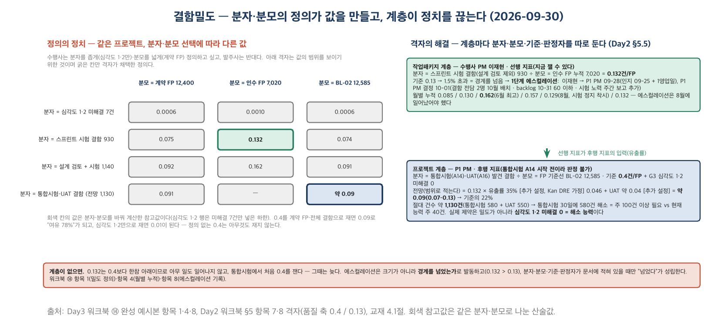

*그림 4-1. 결함밀도 — 분자·분모의 정의가 값을 만들고, 계층이 정치를 끊는다. 왼쪽 격자는 같은 930·1,140건을 다른 분자·분모로 나눈 참고값이며, 굵은 두 칸만 Day2 §5.5 격자가 채택한 정의다 — 작업패키지 계층 930 ÷ 인수 FP 7,020 = 0.132(기준 0.13, 수행사 PM, 선행), 프로젝트 계층 통합시험~UAT ÷ BL-02 12,585 = 전망 약 0.09(기준 0.4, P1 PM, 후행). 에스컬레이션은 크기가 아니라 경계를 넘었는가로 발동한다. 워크북 ⑭ 항목 1·4·8.*

### 실무에서 어떻게 틀리는가

결함밀도의 분자·분모가 격자 정의와 다른 것 — 계층을 혼동하면 선행 지표를 잃는다. 결함 정의에 "요구 변경·해석 차이는 변경요청"이 없어 변경이 결함으로 위장하는 것(3.7절). 심각도 기준서가 없어 발견자가 주관 분류하는 것(온담 감리 지적 5번 — 09-28 기준서 v1.0 작성, 116건 재분류). QA(절차 준수)와 QC(산출물 판정)를 한 문서로 합쳐 "절차를 지켰으니 품질이 좋다"가 되는 것.

---

## 4.2 결함 누적곡선 판독 — 평탄화는 수렴인가 정지인가, 심각도와 나이

### 곡선의 두 평탄

결함 누적곡선(발견 누적·해소 누적·미해결)이 평탄해지는 데는 두 가지 뜻이 있고, 둘을 구분하는 것이 판독의 전부다. **수렴형 평탄** — 시험 노력은 그대로인데 발견이 줄어든다. 결함이 다 나오고 있다는 신호다. **정지형 평탄** — 시험이 멈췄다. 시험 인력이 다른 일로 갔거나, 시험 대상이 인수되지 않았거나, 결함을 등록하지 않는다. 곡선만 보면 둘은 같다. 구분하는 방법은 하나 — **발견 곡선을 노력 곡선(주당 실행 TC 수)과 같이 읽는다.**

온담 34주(2026-02-02~09-27)의 곡선을 네 구간으로 판독하면(워크북 ⑭ 항목 3):

| 구간 | 기간 | 발견(주당) | 시험 노력 | 유형 | 판독 |
|---|---|---|---|---|---|
| ① 설계 검토 | 02-02~03-29(S3–S6) | 18 → 34 → 33 → 15 | 검토회 주 2회 | **수렴형** | 설계서 47종 검토가 S5까지 대부분 완료, 발견 감소가 노력 감소 없이 일어남 |
| ② 스프린트 시험 상승 | 03-30~07-31(S7–S15) | 14 → 52(6월 최고) → 38 | 주 210 TC | 상승 후 완만 | 인수 FP에 비례. 6월 밀도 0.16 최고 — R-05 지연 후 S11·S12 재작업 몰림. backlog 15 → 96(해소 병목) |
| ③ 8월 평탄 | 08-03~08-23(S16) | **12 → 9 → 11** | 주 **95** TC(−55%) | **정지형** | 시험 인력 6명 중 4명이 규제 검증(A07, 142개 항목 증적)으로 이동. S16 인수 620 FP는 규제 항목(검증형)이라 FP당 결함 적음. **곡선만 보면 품질 개선, 노력을 보면 시험 중단** |
| ④ 9월 재상승 | 08-24~09-27(S17–S18) | 27 → 44 → 52 → 38 → 28 | 주 230 TC | 재상승 후 하강 | 8월 미시험분이 S17에 몰림. 9/21 주 28은 수렴인지 S19 착수 지연에 따른 시험 대상 부족인지 10월 관측 필요. backlog **116**(최고) |

8월 평탄의 대가는 9월 첫 두 주의 재상승(44·52)과 backlog 116으로 돌아왔다. Day2 §5.6 해설이 "0.4건/FP를 정의 없이 두면 G3에서 '0.4 이내'와 '인수 불가'가 동시에 참이 된다"고 경고한 것과 같은 구조다 — 발견 곡선을 노력 곡선 없이 두면 "품질 개선"과 "시험 중단"이 동시에 참이 된다. 워크북 ⑭ 항목 9가 결함표에 시험 노력 열을 추가한 이유다.

**주간보고 진척률은 오르는데 결함 곡선이 평탄하면 조기 신호다.** 8월의 throughput은 620·620으로 정상이었다(2.7절 표). 인수 FP는 늘었는데 결함 발견이 주 40 → 12로 떨어졌으면 둘 중 하나다 — 품질이 갑자기 좋아졌거나, 시험이 줄었거나. 전자는 드물다. 이 신호를 8월 중순에 읽었다면 S18 연장 결정이 그때 내려졌을 것이고 A10의 지연은 −10이 아니라 −5였을 것이다(조기 신호 4). 성과보고의 8월 SPI 정체(0.913)와 결함 곡선의 8월 평탄은 **같은 사건의 두 얼굴**이다.

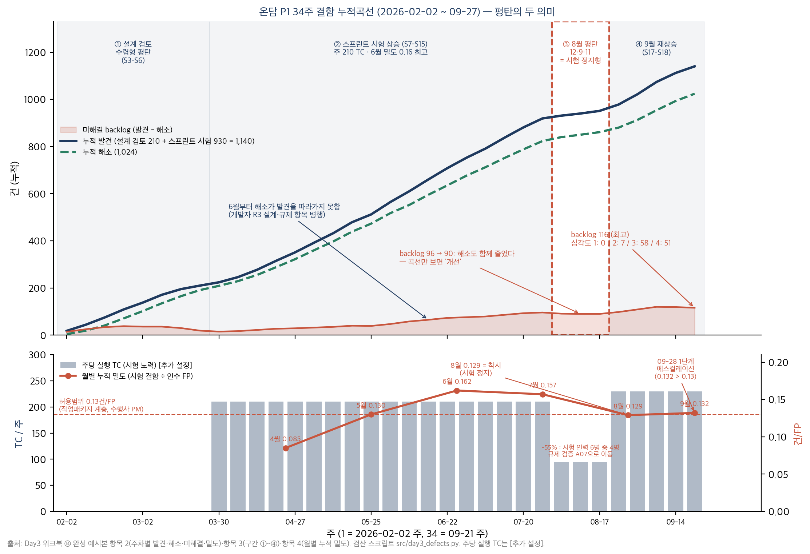

*그림 4-2. 온담 34주 결함 누적곡선과 시험 노력. 8월의 평탄은 결함이 없었던 것이 아니라 시험이 반으로 준 것이며, 노력 곡선 없이는 둘을 구분할 수 없다. 밀도는 6~7월에 이미 0.16이었고 8월의 0.129는 착시다 — 에스컬레이션은 8월에 일어났어야 했다. 워크북 ⑭ 항목 2·3·4.*

### 심각도와 나이

총 건수는 노력의 지표이고, **미해결 고심각도 건수와 나이**는 인도의 지표다. 온담의 심각도 체계(기준서 v1.0, 09-28): **1** = 규제 요건 위반·데이터 손상·결제/재고 원장 중단 / **2** = 주요 기능 불가·우회 없음(Must 미충족 포함) / **3** = 기능 오류이나 우회 있음 / **4** = 경미·UI·문구. 우선순위(P1~P3)는 별도 열이다 — 심각도는 영향의 크기, 우선순위는 고치는 순서이며 둘을 합치면 "심각하지만 나중에"를 적을 수 없다.

2026-09-30 미해결 116 = 심각도 1: **0** / 2: **7** / 3: 58 / 4: 51. 심각도 2 미해결 7건은 적은 수다. 그러나 **나이**(발견일 → 데이터 일자, 영업일)를 보면 D-0966(API GW 인증 토큰 만료 미검증, 보안 High VA-1-01)이 16영업일째이고, 이것은 격자의 지속가능성 축("High 미조치 0")과 직결된다. 건수 집계에서는 7건 중 1건이지만 나이 집계에서는 가장 오래된 것이며, 10-16 기한을 넘기면 지속가능성 축이 경고에서 초과로 바뀐다. 나머지 여섯 — D-0871(3PL 폴백 전환 15분 초과, 10-09), D-0902(POS 반품 적립 취소 누락, 10-09), D-0915(파기 주기 로그 미기록, 10-16, 감리 6번과 동일 원인), D-0931(엑셀 업로드 인코딩, 10-09, CR-03 확장분), D-0944(IF-SAP-12 타임아웃 재시도 없음, 10-16, CR-09 파라미터 영향), D-0958(MDM 중복 오탐, 10-23, 정본 판정 착수 10-19 전 필수) — 는 심각도 2 나이 중앙값 8이다. 2.7절의 work item age가 결함 관리에서는 "가장 오래 열려 있는 심각한 것"을 매주 보는 습관이 되고, 온담은 "심각도 2의 나이 10영업일 초과 건"을 주간 PM 회의 고정 안건으로 두었다.

그리고 미해결 116 중 심각도 3·4가 109건이라는 것 — 인수에는 지장이 없지만 R3 개발자의 시간을 먹고 있고, 그것이 A10 −10의 보이지 않는 원인 중 하나다. **품질 지표는 일정 지표와 같은 사람의 시간을 놓고 경쟁한다.**

### 실무에서 어떻게 틀리는가

발견 곡선만 보고 평탄을 수렴으로 읽는 것. 시험 노력을 기록하지 않는 것. 총 건수로 품질을 말하는 것. 심각도와 우선순위를 한 열로 합치는 것. 미해결 결함의 나이를 세지 않는 것 — 30일을 넘은 고심각도 결함은 결함이 아니라 결정이 필요한 이슈다. 해소 능력(주당 해소 수)을 전망에 넣지 않는 것 — 통합시험 580건을 주 40건으로는 해소할 수 없다.

---

## 4.3 감리 지적 대응 — 등급보다 원인 귀속 칸이 나중의 책임 귀속을 정한다

### 지적사항 대응 관리대장

감리 보고서의 지적사항은 등급(중대·보통·경미)·내용·조치 기한을 갖는다. 대응 관리대장은 그것을 옮겨 적는 것이 아니라 **발주사가 판정한 원인 귀속과 그 근거**를 붙이는 것이다. 온담 중간감리 1차(수행 09-07~18, 통보 09-25, AF-1-01~08): 등급 중대 1(03)·보통 4(01·02·04·08)·경미 3(05·06·07). 감리 기재 귀속은 수행사 6·발주사 2. **발주사 판정 귀속은 수행사 3(02·05·06)·발주사 4(03·04·07·08)·공동 1(01).**

두 건이 갈린다. **AF-1-03(중대)** — 재고 원장 P2 설비 인터페이스 규격(IF-P2-01~04)에 설비측 확인 서명 부재, "수행사 설계 미흡". 그러나 규격은 WBS 1.3.1 **발주 담당**(박세연·한동석 협의)의 산출물이고, P2 전달은 RACI 9행 **A = 프로그램 PMO장**이다. 규격은 T0 전 04-17에 전달되었고, 설비 벤더의 05-29 변경 요청 2건에 대한 프로그램 PMO의 회신이 09-30 현재 미결이며(회신 요청 06-05·07-10·08-21), 수행사는 06-08·08-24 두 차례 미결 상태를 서면 통지했다. 수행사가 확인 서명 없이 규격을 확정할 권한은 없다. **AF-1-04(보통)** — 가맹 SW 배포 범위(1.1.6) 설계 미확정, "수행사 설계 미흡". 그러나 비호환 단말 32점(8.2%)의 대응안 결정은 WBS 1.1.6 **발주 담당**, RACI 11행 **오정근(A)**이다. 대응안 3개는 04-30 조사 보고에 제시되었고, 결정은 부속서 협상 후로 유보한다는 영업본부 회신(05-08)이 있으며, 08-14 동의 71% 후에도 미결이다. 배포 패키지 설계는 WBS 사전 1.1.6 카드의 외부 의존 조항에 따라 결정 이후 착수하도록 계획되어 있었다.

### 왜 귀속 두 글자가 등급보다 무거운가

이의 서면(09-29)의 첫 줄은 **"지적 사실의 인정"**이다. 다투는 것은 지적이 아니라 귀속 두 글자다. 그 두 글자가 중요한 이유는 계약에 있다. 감리 지적사항은 검수의 근거이고, R2 검수가 진행 중인 상태에서 수행사는 지적이 "발주사 사유"인지 "수행사 사유"인지에 따라 대기 비용을 청구하거나 못 한다(5.5절). "수행사 설계 미흡"으로 기록된 채 G2 감리에 가면 그 기록은 나중에 "수행사가 고치지 않았다"가 되고, 변경협의체에서 발주사는 자기 미결정의 대가를 수행사에 전가한 셈이 된다. 반대로 발주사 귀속으로 정정되면 프로그램 PMO장(10-16)과 오정근(11-27)이 **기한**을 갖는다. 귀속은 과거의 책임을 나누는 칸이 아니라 **다음 조치의 담당과 기한을 정하는 칸**이다.

이의의 근거가 전부 Day2 문서(WBS 트리의 담당 열 — 발주/수행/공동, WBS 사전의 외부 의존 조항)와 Day1 문서(RACI 9·11행)라는 것을 보라. Day2 §1.6 해설이 발주사 담당 작업패키지 10개를 WBS에 둔 이유("이재현 PM이 '대기는 변경대가'라고 말할 때 발주사가 반박할 수 있는 유일한 근거")가 여기서 현금화된다. 그 열이 없었다면 이의 서면은 "우리 잘못이 아니다"라는 주장일 뿐이다. 이의 서면의 요청 사항 ③ — "향후 감리 지적의 귀속 판정 시 WBS 담당 열과 RACI를 기준으로 하는 데 합의" — 는 이번 두 건이 아니라 앞으로의 모든 지적을 위한 것이다.

나머지 여섯 건도 귀속이 조치를 정한다. AF-1-01(RTM 하위 분해 88%, 시험 연결 76%) — 미분해 26건은 R3·R4 항목으로 누락이 아니지만 RTM 갱신 주기(동결 시)가 감리 시점과 어긋난 것은 PMO 소관 → **공동**, RTM 갱신을 스프린트 리뷰마다로. AF-1-07(형상 동기화 주 1회 → 일 1회) — **발주사 PMO**, 10-02 완료. AF-1-08(컨틴전시 R-03 0.50 8월 CCB 보고 누락) — **P1 PM**, 10-15 소급 보고, 집행 결재 시 CCB 안건 자동 등재 절차. 감리 기재가 "발주사"인 두 건(07·08)은 발주사가 그대로 받았고, "수행사"인 여섯 건 중 셋만 수행사다. 감리 기재를 그대로 받은 대장은 검수·변경협의체에서 발주사의 미결정을 수행사의 미흡으로 기록한다.

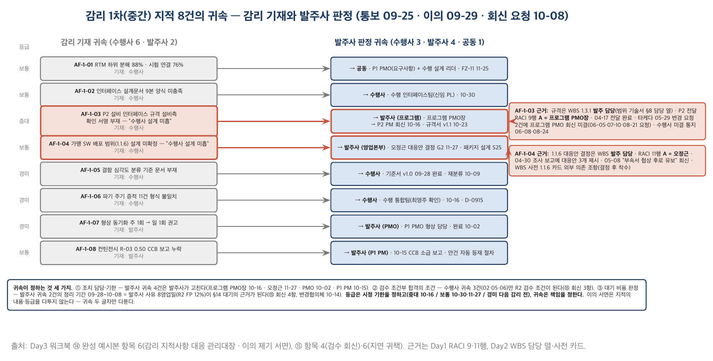

*그림 4-3. 감리 지적 8건의 귀속 — 감리 기재와 발주사 판정. 등급은 시정 기한을 정하고 귀속은 다음 조치의 담당·기한과 검수·대기 비용의 판정을 정한다. AF-1-03·04의 귀속 이의 근거는 전부 Day1 RACI와 Day2 WBS 담당 열·사전 외부 의존 조항이다.*

### 실무에서 어떻게 틀리는가

감리 지적을 등급순으로만 관리하는 것. 귀속 칸을 감리 기재 그대로 두는 것. 이의를 "지적에 대한 이의"로 내어 감리와 다투는 것 — 다투는 것은 사실이 아니라 귀속이다. 이의의 근거를 문서(WBS 담당 열·RACI)가 아니라 주장으로 대는 것. 감리 시정조치를 검수 조건에 연결하지 않는 것 — 그러면 검수는 감리와 무관하게 나가고 지적은 다음 감리에 재지적된다.

---

## 4.4 이슈 로그와 리스크 등록부 — 이슈에는 기한이, 리스크에는 트리거가 있다

### 두 문서의 관계

Day2 5.6절이 정의를 세웠다 — 리스크는 아직 일어나지 않은 것, 이슈는 이미 일어나서 지금 조치해야 하는 것. 실행 단계에서 둘은 한 문서의 두 면이 된다. **리스크가 실현되면 이슈가 되고**(확률 100%), **이슈를 조치하면 새 리스크(2차)가 생기며**, **이슈의 원인이 등록부에 없었다면 그것은 미식별 리스크**였다는 뜻이고 다음 갱신의 입력이다.

둘이 다른 점은 **시한과 에스컬레이션**이다. 리스크는 소유자가 트리거를 관측하지만, 이슈는 소유자가 기한 안에 조치하고 기한을 넘기면 다음 단계로 올라간다(Day1 거버넌스 §3 — 1단계 수행사 PM → P1 PM 3영업일, 2단계 P1 PM → 스폰서 10영업일, 3단계 스폰서 → 이사회, 병행 경로 변경협의체·소관 임원·운영위). 이슈 로그에 기한이 없으면 이슈는 "알고 있는 문제"가 되어 몇 달을 산다. 둘을 섞으면 이슈는 관측되고 리스크는 조치되는 거꾸로 된 관리가 된다. ISO 21502가 이슈 관리(7.9)를 리스크 관리(7.8)와 별도 조항으로 둔 것이 분리의 근거다.

### 리스크 → 이슈 전환 규칙

워크북 ⑬ 항목 3의 규칙(리스크 관리 계획 v1.0 §4 [추가 설정])을 옮긴다. **트리거 발동은 신호다** — 소유자가 관측 사실과 일자를 기록하고 조건부 대응의 집행 준비를 시작한다. 발동 자체로 컨틴전시를 쓰지 않는다. **실현은 사건이다** — 확률 100%가 된 순간 등록부 행을 "실현 → IS-nn"으로 바꾸고 이슈 로그에 등재하며 컨틴전시 배정분 집행을 개시한다. 실현 후에도 같은 원인의 재발 가능성이 있으면 **같은 번호로 잔여 리스크를 재평가해 유지**한다. **부분 실현**(R-04: 삭감 확정, 영향은 대응으로 흡수)은 실현으로 기록하고 흡수 조치가 만든 새 노출(R-17)을 2차 리스크로 등재한다. **대응 완료·종결**(R-03: 폴백 확정) — 사건은 확정되었으나 원가 영향이 배정분 안에서 끝났으면 종결하고 폴백이 만드는 새 노출(R-16)을 등재한다. **관리예비비 대상 리스크의 트리거 발동은 당일 스폰서·프로그램 PMO장 보고**, 컨틴전시 집행은 월 CCB 보고 — 누락 시 감리 지적 대상(IS-05, AF-1-08).

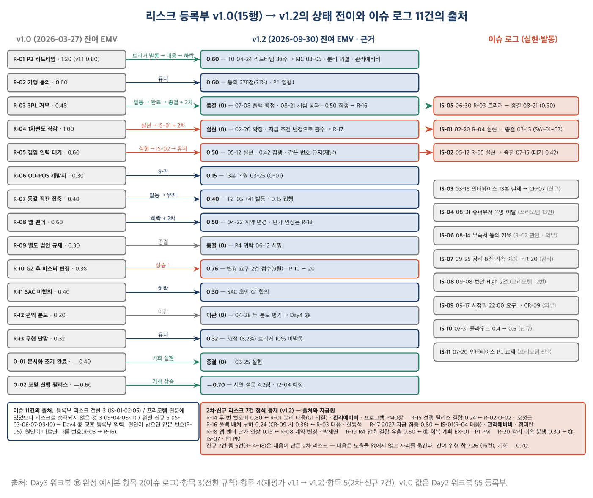

*그림 4-4. 등록부 v1.0에서 v1.2로의 상태 전이와 이슈 로그의 출처. 원인이 남으면 같은 번호(R-05), 원인이 다르면 다른 번호(R-03 → R-16). 이슈 11건 중 등록부에 있던 것 3, 프리모템 원문에 있던 것 3, 완전 신규 5 — Day4 교훈의 입력이다.*

R-03을 종결하고 R-05를 유지한 차이는 **원인이 남아 있는가**다. R-03의 원인(대성의 데이터 개방 거부)은 2027-06 재협상까지 바뀌지 않고 대응은 완료되었으며 배정 0.50은 전액 집행되었다 — 남는 것은 폴백이 만드는 새 노출이고 그것은 다른 원인(배치 창 충돌)이므로 R-16이라는 다른 번호다. R-05의 원인(겸임 인력의 결정 지연)은 대체 결정권자를 지정했어도 G2 정본 판정과 UAT에서 다시 나타난다 — 같은 원인이 남았으므로 같은 번호로 확률·영향만 다시 판정한다(40 × 1.5 = 0.60 → 50 × 1.0 = 0.50). "실현 = 삭제"로 처리하는 등록부는 같은 리스크를 매 게이트마다 새 번호로 다시 등록하고, 그 결과 컨틴전시 배정 이력이 끊긴다.

### 온담 이슈 로그 v1.0 — 11건과 그 출처

> ■ **사례 사실** — 이슈 11건(IS-01~11)의 출처는 Day2 워크북 §5.5 리스크 등록부의 R-03·R-04·R-05·R-07과 Day3 워크북 §0.3 상황; 3PL 폴백·인터페이스 13본 실체는 사례 §3.5·§2.1.

2026-09-30 이슈 로그는 11건(종결 5 · 진행 6)이다. 종결 — IS-01(R-04 실현 02-20, 라이선스 50/50 03-13), IS-02(R-05 실현 05-12, 변경협의체 07-15 발주사 귀책 7일·0.42), IS-03(인터페이스 13본 실체 03-18 → CR-07), IS-05(R-03 트리거 06-30, 폴백 07-08, 시험 08-21 통과, 0.50 집행 — **8월 CCB 보고 누락**), IS-11(인터페이스 PL 교체 07-20 → 승인 08-03). 진행 — IS-04(슈퍼유저 11명 이탈 08-31, 재선정 11-13), IS-06(부속서 동의 71%, 배포 범위 확정 G2 11-27), IS-07(감리 8건 귀속 이의, 회신 10-08, 심각도 1), IS-08(보안 High 2건, 10-16), IS-09(서정필 22:00, CR-09), IS-10(클라우드 월 0.4 → 0.5, 10-31). 종결 5건은 모두 기한 안에 조치되었고, 진행 6건은 기한과 다음 단계가 적혀 있다.

**출처 열**이 이 문서의 두 번째 가치다. 리스크 전환 3(IS-01·02·05) / 신규 발견 2(IS-03·10) / 감리·진단 2(IS-07·08) / 외부 3(IS-04·06·09) / 수행사 1(IS-11). 등록부에 없던 원인 5건 중 3건(IS-04·08·11)은 **프리모템 원문**(Day1 워크북 §5.5 — 6번 개발자 이탈, 12번 보안, 13번 교육 이탈)에 있었으나 리스크로 승격되지 않았던 것이다. 61건의 원문 중 15건만 승격되었고 나머지는 군집 대표에 흡수되었다. 이 세 이슈는 흡수된 원문이 실제로 일어난 사례이며, Day4 교훈 등록부(⑲)에 "프리모템 원문의 승격 기준"으로 들어간다. 이슈 로그가 리스크 등록부와 프리모템 기록을 거꾸로 추적할 수 있어야 "우리는 무엇을 미리 보았는가"가 문장이 아니라 비율(11건 중 3건은 등록부, 3건은 프리모템, 5건은 완전 신규)이 된다.

### 실무에서 어떻게 틀리는가

이슈를 결함 관리 도구로 흘려 "발주사 미결정 대기"가 결함 목록에 묻히는 것. 기한 없는 이슈. 실현된 리스크를 등록부에서 지우는 것(컨틴전시 집행 기록이 끊긴다). 실현된 리스크를 확률 100%로 등록부에 그대로 두는 것(그것은 이슈다). 출처 열이 없어 미식별 리스크의 비율을 말할 수 없는 것. 소유자가 전부 PM인 것 — 온담 11건 중 P1 PM이 소유자인 것은 IS-07 하나다.

---

## 4.5 리스크 재평가 — 주기·트리거·2차 리스크의 승격·컨틴전시 소진 추적

### 주기와 깊이

등록부 v1.0은 2026-03-27의 판정이었다. 그 뒤 여섯 달 동안 R-04가 실현되고 R-05가 실현되고 R-03의 트리거가 발동하고 R-01의 근접성이 T0에서 확정되었다. G1 이후 갱신하지 않은 등록부는 "리스크 등록부"라는 이름의 3월 사진이다. Hillson & Simon의 ATOM이 구분한 대로 검토에는 두 깊이가 있다 — **월 갱신(minor review)**: 트리거 관측, 확률·영향 재판정, 신규 등재, 컨틴전시 소진 대조. **게이트 재평가(major review)**: 전체 재식별, 정량 분석 재실행, 소유자 재서명. 온담은 월 갱신(10-31 데이터, FZ-10 다음 주 PM 회의)과 G2 재평가(11-27 — R-10·R-14·R-02·R-19·R-17)를 예정했고, v1.2(10-23 발행)에 소유자 서명 22건(위협 16 + 기회 1 + 종결·이관 5의 종결 확인)을 받는다.

### 재평가의 세 숫자

갱신의 핵심은 세 숫자다. **잔여 위협 EMV 합**이 허용범위 8억 안에 있는가 — v1.0 6.78 → **v1.2 7.26(16건)**, 여유 1.22 → **0.74**. **단일 리스크**가 2억을 넘는가 — 최대 0.80(R-14·R-17), 없음. **컨틴전시 소진**이 진척에 비해 빠른가 — 집행 1.41 = 13.8% vs 원가 진척 50.4%. 판정: **리스크 축 예외 보고 불요, 경고.**

변동을 분해해야 대응의 가치를 말할 수 있다. 6.78 − 종결·실현·이관 1.98(R-03 0.48 + R-04 1.00 + R-09 0.30 + R-12 0.20) + 신규 3.13(R-14 0.80 + R-15 0.24 + R-16 0.24 + R-17 0.80 + R-18 0.15 + R-19 0.60 + R-20 0.30) + 재평가 순증 −0.67(R-01 −0.60, R-05 −0.10, R-06 −0.15, R-08 −0.10, R-10 **+0.38**, R-11 −0.10) = 7.26. 여유가 줄어든 이유는 종결 4건(−1.98)보다 신규 7건(+3.13)이 크기 때문이고, **신규 7건 중 5건(R-14·15·16·17·18)은 대응 조치가 만든 2차 리스크**다. 대응은 노출을 없애지 않고 다른 자리로 옮긴다.

관리예비비 대상 2.20은 v1.0과 같은 숫자지만 내용이 바뀌었다. v1.0의 2.20은 "P2 리드타임"과 "CFO 삭감"이라는 두 외부 결정에 대한 노출이었다. v1.2의 2.20은 그 두 결정이 **이미 내려진 뒤** 남은 노출 — 분리 컷오버가 만드는 두 번의 창(R-14 0.80, 소유자 프로그램 PMO장), 삭감이 만든 이월분 12.7의 2027 집중(R-17 0.80, 정미란), MC의 추가 지연(R-01 0.60) — 이다. 셋 다 원인이 프로그램·스폰서 계층이고 PM의 컨틴전시로는 어느 것도 막을 수 없다. 스폰서가 이 갱신에서 읽어야 할 것은 "관리예비비 노출이 그대로다"가 아니라 "당신의 결정 두 개가 만든 2차 노출이 당신의 예비비를 여전히 2.20만큼 겨누고 있다"이다.

여유 0.74를 "경고"로 적고 예외 보고를 내지 않은 이유. 격자의 리스크 축은 "8억 초과 **예상**"이 트리거다. 7.26은 8 아래이고, 예상되는 초과 사건(R-10 정본 판정 후 마스터 변경, 잔여 0.76)은 G2 직후라는 시점이 있다. 지금 예외 보고를 내면 스폰서는 "무엇을 결정하라는 것인가"에 답할 수 없다 — 아직 결정할 사건이 없다. 대신 성과보고 제9호에 "11월 갱신에서 R-10 실현 시 8억 초과"를 예고하고, R-10 배정을 0.40 → 0.80으로 올려 자금을 미리 확보했다. **예외 보고는 결정이 필요한 순간에 내는 것이고, 경고는 그 순간이 언제 올지를 미리 말하는 것이다.**

### 2차 리스크의 승격

Day2 5.4절이 2차 리스크를 "별도 행"으로 두라고 했고, 등록부 v1.0은 R-14~R-18을 예비 번호로 두었다. v1.2에서 7건이 정식 등재된다(워크북 ⑬ 항목 5) — R-14 두 번 컷오버(R-01 대응, 50 × 1.6 = 0.80, 관리예비비) / R-15 선행 릴리스 결함으로 협의회 지렛대 상실(R-02·O-02, 0.24, 오정근) / R-16 폴백 배치와 22:00 마감의 야간 창 충돌(R-03 대응 + CR-09, 0.24 → CR-09 22:00 운용 시 0.36, 한동석) / R-17 라이선스 4.70 + 배분 −8.0 이월의 2027 자금 집중(IS-01, 0.80, 관리예비비, 정미란) / R-18 앱 벤더 단가 인상(R-08 대응, 0.15, 박세연) / R-19 R4 압축·A14·A16 병행의 결함 유출(EX-01 대안 1, 40 × 1.5 = 0.60, P1 PM) / R-20 감리 귀속 분쟁의 검수 지연(IS-07, 0.30, P1 PM). 각 행에 원인 → 사건 → 영향, 출처(어느 대응·이슈·변경이 만들었는가), 트리거, 자금원이 있다. 승격의 기준은 하나 — **원인이 다르면 다른 번호다.**

### 컨틴전시 소진 추적 — 집행과 배정

컨틴전시 10.20의 v1.2 구성: 배정 5.30(13건) + 미배정 풀 2.47 + 집행(약정) 1.41 + BL-02 편입 1.02 = 10.20. 집행 1.41 = R-07 0.15(6월) + R-05 0.42(7월) + R-03 0.50(8월) + CR-03 0.12(9월) + CR-07 0.22(약정) — AC 발생은 1.19(⑫ SI CV −1.19). 관리예비비 요청 0건.

소진율은 두 기준으로 본다. **집행 기준** 13.8% vs 진척 50.4% — 느리다, 좋은 숫자다. **배정 기준** — 미배정 풀이 5.60에서 2.47로 줄었다. Day2가 "스프린트 4회분"으로 설명한 풀이 **1.75회분**이 되었고, 이유는 승인 변경 편입(1.005)과 신규 리스크 배정(1.70 + R-10 증액 0.40 + R-05·R-07 재충전 0.47 − 해제 0.80)이다. 즉 컨틴전시는 집행이 아니라 **배정으로** 소진되고 있다. 리스크가 실현되어서가 아니라 식별되어서 생기는 소진이고, 좋은 관리의 흔적이지만 결과는 같다 — 다음 신규 리스크 2건이면 풀이 비고, 그 다음은 관리예비비다. 소진율을 집행 기준 하나로만 보고하는 프로젝트는 풀이 비는 것을 관리예비비 요청 시점에 처음 안다.

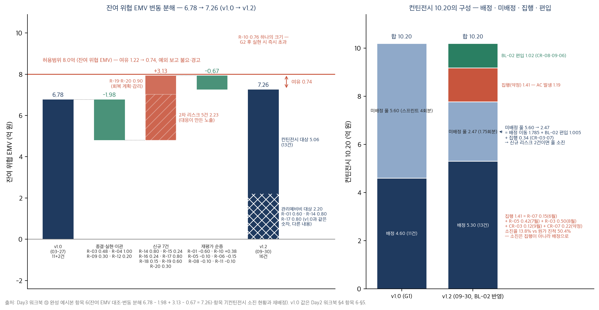

*그림 4-5. 잔여 EMV의 변동 분해와 컨틴전시 소진. 여유가 1.22에서 0.74로 준 것은 종결 4건보다 신규 7건이 크기 때문이고 신규 7건 중 5건은 대응이 만든 2차 리스크다. 컨틴전시는 집행(13.8%)이 아니라 배정으로 소진되고 있으며 미배정 풀은 스프린트 4회분에서 1.75회분이 되었다. 워크북 ⑬ 항목 6·7.*

### 실무에서 어떻게 틀리는가

등록부를 G1 이후 갱신하지 않는 것. 변동을 분해하지 않아 "EMV가 7.26이 되었다"만 있고 대응의 가치를 말할 수 없는 것. 2차 리스크를 원 리스크 행에 "완화 조치의 부작용"으로 적어 소유자·트리거·자금원이 없는 것. 관리예비비 대상 리스크의 트리거 발동을 당일 보고하지 않는 것. 컨틴전시 집행을 CCB에 보고하지 않는 것(AF-1-08). 소진율을 집행 기준 하나로만 보는 것. 그리고 여유가 남아 있다고 "이내니까 됐다"로 끝내는 것 — 여유 0.74는 R-10 하나의 크기다.

---

## 4.6 예외 보고(Exception Report) — 언제 쓰고 무엇을 담는가

### 시점

예외 보고는 허용범위를 **넘을 것으로 예상되는 순간**에 쓴다. 넘은 뒤가 아니다. 넘은 뒤의 보고는 대안이 없고, 대안이 없는 예외 보고는 사후 통보다. 온담 격자의 시점 규정은 "예상 시점 5영업일"이며, EX-01은 인지 09-28(S18 종료·A10 착수 지연 확정) + 4영업일 = 10-02 제출로 규정 안이다. 그러나 조기 신호 5번이 말한 대로 09-04 S18 연장 결정 시점에 TF −10은 계산 가능했고, 예외 보고를 09-11에 낼 수 있었다. 예외 보고의 시점은 규정의 문제이기 전에 **양식의 문제**다 — 스프린트 연장 결정에 임계경로 TF 칸이 있었다면 3주 빨랐다.

### 내용

PRINCE2 7 Exception Report의 구조를 그대로 쓴다. **원인** — 무엇이 일어났는가(R-05 실현 S10 3주, 규제 Must 전진 배치 S18 3주, R2 420 FP 이월 → A10 착수 −10). **영향** — 6개 성과 목표에 대해(일정: as-is MG3 03-05·컷오버 1차 창 이탈·2차 창 03-12~14·합류 버퍼 15 전부 소진·G4 06-11 / 원가: 대안별 / 범위·품질·리스크·편익: 대안별). **대안 3개** — 각각 일정 효과·원가·리스크·**결정자**(2.8절 표). **권고** — 대안 1 주 계획 + 대안 3 조건부 예비(11-13 S22 속도 620 미만 시 자동 발동) + 대안 2는 버퍼 배정 판단 자료. **결정 시한** — 10-16(10영업일). 그리고 한 줄 — **재기준선이 아니다.**

세 가지 규칙. **대안은 각각 다른 사람의 결정이어야 한다.** 대안 1은 정미란(원가·품질 트레이드오프)과 이재현(속도 640 약속), 대안 2는 프로그램 PMO장(버퍼 배정), 대안 3은 오정근(Senior User, 편익 시점). 셋 다 스폰서 결정이면 대안이 아니라 메뉴다. **권고가 있어야 한다.** 대안만 나열하고 권고가 없는 예외 보고는 결정을 미루는 문서다. **경고와 예외를 섞지 않는다.** 원가 축(EAC4 150.86 < 156.0, EAC3′ 155.04 여유 0.96)과 리스크 축(7.26 < 8.0, 여유 0.74 = R-10 하나)은 경고(A)이고 예외 보고를 내지 않는다 — 대신 다음 호에서 "EAC4 > 153.0이면 예외 보고 준비", "11월 R-10 실현 시 8억 초과"를 예고한다. 예외 보고가 월례 보고가 되면 아무도 읽지 않는다.

### 실무에서 어떻게 틀리는가

넘은 뒤에 내는 것. 대안이 하나(연장)뿐인 것. 대안의 결정자가 전부 스폰서인 것. 권고가 없는 것. 경고를 예외로 내어 예외 보고가 월례가 되는 것. 예외 보고를 재기준선 요청으로 쓰는 것. "실패 보고"로 느껴 내지 않는 것 — 1.3절, 예외 보고는 위임의 반대급부다.

---

## 4.7 실무에서 어떻게 틀리는가

**결함밀도의 계층이 없다** — 0.4 하나면 통합시험 전까지 아무 일도 일어나지 않는다. **발견 곡선만 본다** — 8월 평탄을 품질 개선으로 읽는다. **감리 지적의 귀속을 감리 기재대로 둔다** — 발주사 미결정이 수행사 미흡으로 기록된다. **이슈와 리스크를 섞는다** — 이슈는 관측되고 리스크는 조치된다. **실현된 리스크를 지운다** — 컨틴전시 배정 이력이 끊긴다. **변동을 분해하지 않는다** — 대응의 가치를 말할 수 없다. **2차 리스크를 별도 행으로 두지 않는다** — 소유자·트리거·자금원 없는 노출 3.13이 생긴다. **소진율을 집행 기준으로만 본다** — 미배정 풀이 비는 것을 관리예비비 요청 시점에 안다. **예외 보고를 넘은 뒤에, 대안 하나로, 권고 없이 낸다.**

---

## 제4장 핵심 정리

> **한 줄씩 — 수업 직전 5분 복습용**
> 1. QA는 절차, QC는 산출물 — 검수의 근거는 QC 기록이다.
> 2. 결함 누적곡선의 평탄은 수렴일 수도 정지일 수도 있다 — 시험 노력 곡선을 나란히 놓아야 구분된다.
> 3. 감리 지적은 등급보다 원인 귀속 칸이 무겁다 — 나중의 검수·대기 비용 판정이 거기서 갈린다.
> 4. 이슈에는 기한이, 리스크에는 트리거가 있다 — 트리거 발동은 신호, 실현은 사건.
> 5. 재평가는 세 숫자 — 잔여 EMV, 단일 최대, 컨틴전시 소진율 — 와 변동의 분해로 보고한다.
> 6. 예외 보고는 넘은 뒤가 아니라 넘을 것으로 예상되는 순간에, 대안 3개와 결정 시한을 붙여 낸다.
>
> 아래는 같은 내용의 자세한 판이다.

1. QA는 절차, QC는 산출물이며 QC의 결과가 인수의 근거다. 온담의 QC 두 축(결함·감리 지적)은 검수에서 만나므로 품질 통제 기록은 계약 문서다. 결함밀도의 정의(분자·분모)는 정치이고 격자의 계층(작업패키지 0.13 / 프로젝트 0.4 + 심각도 1·2 미해결 0)이 그것을 해결한다 — 0.132는 "품질이 나쁘다"가 아니라 "1단계 에스컬레이션"이다. 프로젝트 계층 전망은 범위(0.07~0.13)로 적고, 실질 제약은 밀도가 아니라 해소 능력이다.
2. 결함 누적곡선의 평탄은 수렴형과 정지형이 있고 시험 노력 곡선 없이는 구분할 수 없다. 온담 8월(주 12·9·11, TC 210 → 95)은 정지형이며 9월의 재상승과 backlog 116으로 돌아왔다. 진척률은 오르는데 결함 곡선이 평탄하면 조기 신호다. 총 건수는 노력의 지표, 미해결 고심각도 건수와 나이(D-0966 16영업일)는 인도의 지표다.
3. 감리 지적은 등급보다 귀속 칸이 무겁다 — 귀속이 다음 조치의 담당·기한과 검수·대기 비용 판정을 정한다. 온담 8건은 감리 기재 수행사 6·발주사 2에서 발주사 판정 수행사 3·발주사 4·공동 1로 갈렸고, 이의의 근거는 전부 Day1 RACI와 Day2 WBS 담당 열·사전 외부 의존 조항이다. 다투는 것은 지적이 아니라 귀속이다.
4. 이슈에는 기한이, 리스크에는 트리거가 있다. 전환 규칙 — 트리거 발동은 신호, 실현은 사건, 원인이 남으면 같은 번호 유지(R-05), 원인이 다르면 다른 번호(R-03 → R-16). 이슈 로그의 출처 열(등록부 3 / 프리모템 3 / 신규 5)이 Day4 교훈의 입력이다.
5. 재평가의 세 숫자 — 잔여 EMV 7.26(여유 0.74), 단일 최대 0.80, 소진 13.8%. 변동 분해 6.78 − 1.98 + 3.13 − 0.67. 신규 7건 중 5건은 대응이 만든 2차 리스크이고, 관리예비비 대상 2.20은 숫자는 같으나 내용이 바뀌었다(프로그램·스폰서의 결정이 만든 2차 노출). 컨틴전시는 집행이 아니라 배정으로 소진된다 — 미배정 풀 4회분 → 1.75회분.
6. 예외 보고는 넘을 것으로 예상되는 순간에, 원인·6축 영향·대안 3(각각 다른 결정자)·권고·결정 시한으로 쓰며 재기준선이 아니다. 경고(원가 A·리스크 A)와 예외(일정 R)를 섞지 않는다 — 예외는 결정이 필요한 순간에, 경고는 그 순간이 언제 올지를 미리 말하는 것.

## 생각해 볼 질문

1. 여러분 회사의 결함밀도(또는 품질 지표)의 분자와 분모를 한 문장으로 말할 수 있는가. 수행사가 말하는 정의와 같은가.
2. 최근 12주의 결함 발견 곡선 옆에 시험 노력 곡선을 놓아 본 적이 있는가. 평탄 구간이 있었다면 어느 유형이었는가.
3. 온담 이의 서면의 첫 줄은 "지적 사실의 인정"이다. 인정하지 않고 귀속만 다투었다면 감리법인은 어떻게 반응했을까. 인정하고 귀속을 다투는 것과 둘 다 다투는 것의 차이는 무엇인가.
4. 관리예비비 대상 EMV 2.20이 v1.0과 v1.2에서 같은 숫자다. 스폰서가 "그대로네"라고 하면 무엇을 보여 줄 것인가.
5. 컨틴전시 미배정 풀이 스프린트 1.75회분이다. 다음 신규 리스크 2건이면 풀이 빈다. 지금 관리예비비를 요청해야 하는가, 요청하지 않아야 하는가 — 각 선택이 스폰서에게 어떻게 읽히는가.

## 워크북 연결

이 장의 내용은 워크북 §3 "이슈 로그·리스크 등록부 갱신"과 §4 "품질 통제 기록"에서 적용한다. §3은 항목 1(갱신 범위·심각도 정의)·항목 2(이슈 로그 11건 — 출처·심각도·소유자·기한·에스컬레이션·연결)·항목 3(전환 규칙)·항목 4(15행 재평가 — 잔여 전후·근거·자금원·다음 트리거)·항목 5(R-14~R-20 정식 등재)·항목 6(잔여 EMV 대조·변동 분해·일정 노출 25.5영업일)·항목 7(컨틴전시 배정 v1.0 → v1.2, 미배정 풀 2.47)·항목 8(예외 판정·에스컬레이션 현황)·항목 9(검토 주기). §4는 항목 1(측정 정의 — 결함·심각도·밀도 두 계층·감리 등급)·항목 2(34주 누적표 + 시험 노력)·항목 3(네 구간 판독)·항목 4(밀도 0.132·전망 0.09)·항목 5(심각도 2 미해결 7건과 나이)·항목 6(감리 8건 대응 관리대장 + 이의 서면 완성본)·항목 7(RTM 커버리지 대조)·항목 8(허용범위 대비 판정·에스컬레이션)·항목 9(다음 조치). 검산은 §3.6·§4.6. 기본 과제(§3.7 — G2 직후 R-10·R-01 잔여 실현 시 IS-12·13과 8억 초과 판정·자금원 순서 / §4.7 — 통합시험 2주차 주 270 발견·심각도 2 누적 31 시 프로젝트 계층 밀도 첫 계산과 R-19 트리거)와 심화 과제는 각 §X.7.

---

# 제5장 사람·커뮤니케이션·조달 통제

## 5.1 성과보고 체계 — Highlight·Checkpoint, RAG의 정치, 대시보드 설계 원칙

### 세 보고서와 그 수신자

1.3절이 세운 구분을 실무 형태로 옮긴다. **Checkpoint**(수행사 → P1 PM, 주간) — 작업 패키지 수준, 스프린트 실적·계획·결정 요청. **Highlight**(P1 PM → 스폰서·운영위·CCB, 월) — 단계 수준, 7축 RAG와 허용범위 상태, 핵심 수치, 이번·다음 기간, 예외, 이슈·리스크 상위 5, 컨틴전시·버퍼 소진, **결정 요청**. **Exception**(P1 PM → 스폰서·프로그램 PMO장, 비주기) — 4.6절. 셋의 수신자가 다르므로 셋을 한 문서로 합치면 수행사의 작업 패키지 상태가 스폰서에게 그대로 가고 예외가 월례에 묻힌다.

### RAG의 정치

RAG(Red·Amber·Green)는 정의가 없으면 감정이다. 온담의 정의 — **G** = 허용범위 내·전망도 내 / **A** = 허용범위 내·전망 초과 가능(경고) / **R** = 초과 예상·예외 보고 제출. 정의가 있어도 정치는 남는다 — 담당자는 A를 G로 올리고 싶고(문제 없음), PM은 R을 A로 내리고 싶으며(아직 통제 중), 스폰서는 A를 R로 읽는다(왜 미리 말하지 않았나). 처방은 **수치 없는 RAG를 금지**하는 것이다. 제9호의 일곱 축은 각각 값(A10 −10·SPI(t) 0.920 / EAC4 150.86·여유 5.14 / FP +185 / 밀도 0.132·심각도 2 미해결 7 / EMV 7.26·여유 0.74 / B-08 12h 검증·118억 / High 2건 기한 10-16)과 허용범위와 전망 근거를 갖는다. 색은 그 숫자의 요약이지 대체가 아니다. 그리고 모든 축이 G인 보고서는 보고할 이유가 없다 — 제9호는 G 2·A 4·R 1이다.

### 대시보드 설계 원칙

대시보드가 성과보고를 대체하지 못하는 이유는 대시보드에 결정 요청 칸이 없기 때문이다. 원칙 넷. **본값과 조정값을 같은 화면에** — CPI 1.032와 조정 0.968이 한 칸에 없으면 화면은 착시를 확대한다. **완료 지표 옆에 진행 중 항목의 나이** — SPI 옆 SPI(t), throughput 옆 work item age, 미해결 결함 수 옆 최장 나이. **열별 분해가 한 클릭 안에** — 합계 SV −4.40에서 SI −5.31·시험·감리 +0.70으로 내려갈 수 없는 대시보드는 서사를 만든다. **결정 요청과 시한** — 누가·언제까지·무엇을. 이 넷이 없는 대시보드는 예쁜 기록이다.

---

## 5.2 나쁜 소식의 보고 — mum effect (심화)

### 현상

나쁜 소식은 올라오지 않는다. 심리학의 **mum effect**(Rosen & Tesser, 1970)는 사람이 나쁜 소식의 전달자가 되기를 꺼리는 경향이고, Keil·Smith와 동료들은 이것을 소프트웨어 프로젝트에 적용해 **"왜 아무도 말해 주지 않았는가"**의 구조를 실증했다(6.5절). 핵심 발견 셋 — 문제를 아는 사람과 보고할 권한이 있는 사람이 다르다(정보 비대칭), 보고자는 비난받을 것을 예상해 침묵하거나 완화하며(blame), 조직 분위기(climate)가 침묵의 비용을 결정한다. 실무자는 이것을 성격의 문제로 안다. 연구는 구조의 문제라고 말한다.

### 온담에서

> ■ **사례 사실** — R-05 실현의 경과(5월 2주차 work item age 12영업일 → 변경협의체 07-15)는 Day3 워크북 §0.3·§3.5; 오정근 본부장의 결정 지연이 발주사 귀책 7일·대기 비용 0.42억이 된 산식은 §5.5 예시본 항목 2.

R-05 실현의 첫 신호는 5월 2주차 스프린트 리뷰에서 work item age 12영업일로 보였다. 수행사는 그것을 알았고, 발주사 PMO도 보았다. 그러나 그 신호가 "오정근 본부장이 결정을 미루고 있다"는 문장으로 월 성과보고에 올라간 것은 5월 말이 아니라 변경협의체 판정(07-15) 뒤다. 발주사 PMO가 자기 본부장의 미결정을 스폰서에게 보고하는 것, 수행사가 발주사의 미결정을 서면으로 통지하는 것 — 둘 다 mum effect의 자리다. 결과는 대체 결정권자 지정 3주 지연이었다.

처방은 사람을 바꾸는 것이 아니라 **양식과 규칙**이다. ① **트리거를 관측 항목으로** — 등록부 R-05의 트리거("참석률 70% 미만 2주 연속", "결정 SLA 5영업일 초과")가 스프린트 리뷰 고정 안건이면 보고자는 "본부장이 늦다"가 아니라 "트리거가 발동했다"를 말한다. 사실은 비난이 아니다. ② **발주사 결정 SLA 준수율을 수행사 성과 기록에 나란히** — 5월 58% → 9월 91%(총 87건 중 76건 87%). 발주사가 자기 숫자를 먼저 적으면 수행사의 통지는 고발이 아니라 확인이 된다(5.4절). ③ **조기 신호를 사후에 적되 책임 추궁이 아니라 양식 변경으로 끝내는 규칙** — 2.8절. ④ **예외 보고를 낸 PM을 어떻게 대우하는가** — 조직의 climate는 이것으로 결정된다. 첫 예외 보고를 실패 보고로 다룬 조직의 두 번째 예외 보고는 늦다.

Staw(1976)의 escalation of commitment(6.6절)는 mum effect의 반대편이다 — 나쁜 소식이 올라가도, 그 결정을 내린 사람은 추가 투입으로 자기 결정을 정당화한다. 두 병리가 만나면 문제는 보고되지 않고, 보고되어도 중단되지 않는다. Day1이 게이트의 중단 기준(kill criteria)을 착수 결정과 동시에 제출하게 한 이유가 여기 있고, Day3에서 그 기준은 EX-01 대안 3의 자동 발동 조건(11-13 S22 속도 620 미만)처럼 **사전에 정한 숫자**로 나타난다.

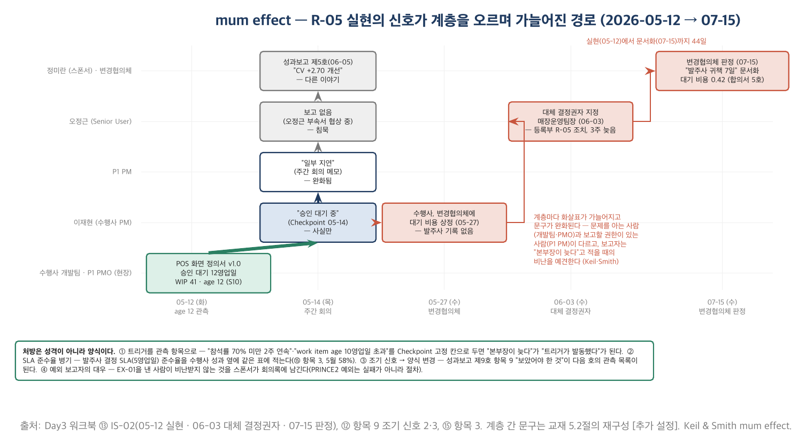

*그림 5-2. mum effect — R-05 실현의 신호가 계층을 오르며 가늘어진 경로. 문제를 아는 사람과 보고할 권한이 있는 사람이 다르고, 보고자는 비난을 예견한다. 처방은 성격이 아니라 양식이다 — 트리거를 관측 항목으로 두면 "본부장이 늦다"가 "트리거가 발동했다"가 된다.*

---

## 5.3 이해관계자 참여 갱신 — 현저성은 이동한다

Day1 3.3절의 현저성(salience — 권력·정당성·긴급성)은 착수 시점의 사진이었다. 아홉 달 뒤 사진은 달라졌다. **서정필**(S-10) — 착수 시 "정당성은 있으나 권력이 약한" 협의회장이었으나, 부속서 동의 71%(잔여 112점)와 포털 선행 릴리스(O-02)를 지렛대로 22:00 요구가 CCB 안건이 되었다. 권력이 올랐다. **한동석** — CCB 위원이 아닌데 CR-09의 반대의견에 실명으로 기재되었고, 22:00 운용 전환의 사실상 결정자다. 긴급성이 올랐다. **프로그램 PMO장** — R-01의 소유자이자 합류 버퍼 15의 소유자이며 AF-1-03의 조치 담당인데, 05-29 설비 벤더의 변경 요청에 09-30 현재 회신이 없다. 회신 요청 세 번(06-05·07-10·08-21)에 답하지 않는 담당자는 **권한을 잃은 것**이거나 그 안건의 긴급성을 다르게 보는 것이고, 어느 쪽이든 P1 PM은 참여 전략을 바꿔야 한다 — 서면 촉구가 아니라 스폰서 결정 요청(제9호 결정 요청 ①에 합류 버퍼 배정 원칙 회신을 넣은 이유). **오정근** — 5월 결정 SLA 58%의 당사자였고, AF-1-04의 조치 담당(11-27)이며, CR-09 협의회 회신자(10-23)이자 EX-01 대안 3의 결정자다. 한 사람에게 결정이 몰려 있다 — R-05의 원인 구조가 그대로 남아 있다는 뜻이다.

참여 갱신의 도구는 이해관계자 등록부의 재판정이 아니라 **회의록의 서명란과 결정 SLA**다. 회의록 서명을 미루는 담당자, 회신 요청에 답하지 않는 소유자, SLA를 넘기는 결정자는 등록부의 어느 칸보다 정확하게 현저성의 이동을 보여 준다. 2022년 WMS 고도화 축소 결정 회의록의 물류본부장 서명란이 비어 있었던 것을 다시 기억하라.

---

## 5.4 팀·갈등·인력 교체·수행사 성과 관리

### 수행사 성과 기록은 협상 자료다

velocity 12회 평균 585 FP(94.4%), 이월 420, 인력 계획 54 / 실 52(평균 52.3, 피크 계획 61), 결함 0.132/FP. 이 숫자만 적힌 표는 변경협의체에서 "발주사가 5월에 결정을 12일 미뤘다"는 한 마디에 무너진다. 온담은 같은 표에 **발주사 결정 SLA 준수율**(5월 58% → 9월 91%)을 나란히 적었다. 두 가지가 된다 — 5월의 지연이 발주사 원인임을 발주사가 먼저 인정했다는 기록이고, 9월에는 그 원인이 제거되었으므로 이후의 지연은 수행사 원인이라는 근거다. 일방적 기록은 상대가 반박하는 순간 전체가 의심받고, **양방향 기록은 반박할 자리가 없다.**

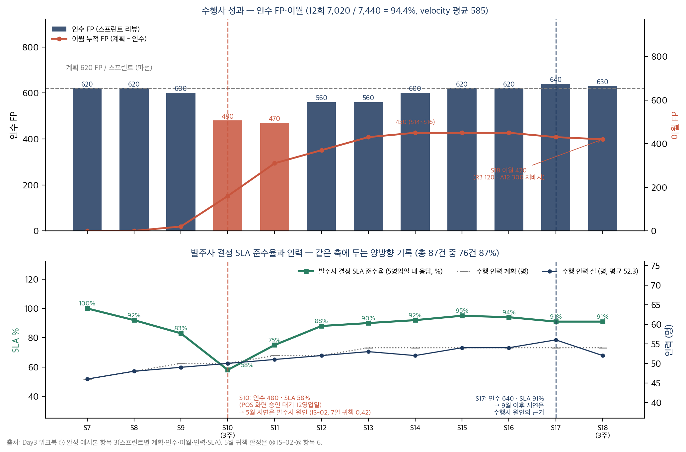

*그림 5-4. 수행사 성과와 발주사 결정 SLA 준수율을 같은 축에 — 양방향 기록. S10의 인수 480은 SLA 58%와 함께 읽어야 하고, S17 이후 SLA 91%는 이후 지연의 귀책을 가르는 근거다.*

### 인력 교체

핵심 인력의 교체는 이슈(IS-11)이자 계약 사건이다. 인터페이스 PL(1.3.3 3PL 연동·1.5.5 47본 재구축 리더)의 07-20 퇴직 통보에 대한 승인 조건 — 2주 인수인계(07-20~08-02) 전임·후임 동시 투입(비용 수행사 부담), 지식 이전 체크리스트 24항목 확인(박세연 서명 08-03), 폴백 시험(08-21) 후임 주관 통과, 이후 PL 6명 교체는 4주 전 통보. 승인서에 세 서명(P1 PM·이재현 07-23, 박세연 08-03)과 사후 확인(폴백 시험 통과, 감리 2번 후임 담당)이 있다. Brooks(1975)의 법칙(6.7절) — 늦은 프로젝트에 인력을 더하면 더 늦어진다 — 은 교체에도 적용된다. 후임의 학습 기간은 전임의 이탈 기간과 겹치지 않으면 임계경로의 손실이고, 그래서 "동시 투입"이 조건이다.

### 갈등

Day3의 갈등은 대개 **귀책**을 둘러싼다 — 대기 비용, 검수 보류, 지연의 원인. 갈등의 처방은 회의가 아니라 **판정 기준의 사전 합의**다. 여유 소유권 문안(SCL 원칙 8)과 동시 지연 원칙(SCL 원칙 10)을 변경협의체가 07-15에 계약 해석 기준으로 합의해 두었기 때문에, 09-30의 귀책 분해는 감정이 아니라 산식이 된다(5.6절). 기준이 없으면 수행사는 전 구간을 동시 지연(지체상금 면제)으로, 발주사는 전 구간을 수행사 단독(대기 비용 면제)으로 주장한다.

---

## 5.5 동시기록 문화 — 구두 검수 보류에 서면으로 답하는 이유

### 사건

R2 검수 요청 09-25(R2분 3,300 FP, 계약 §14 15영업일 → 결과 통보 10-16). 09-28 주간 PM 회의에서 발주사 PMO가 "감리 지적 정리 후 검수"라고 **구두**로 말했다. 수행사는 09-29 서면(HB-P1-2026-073)으로 "발주사 사유에 의한 검수 보류 = 대기 비용 산정 대상"이라고 주장했다. 이 시점에 발주사가 할 수 있는 것은 셋이다 — 침묵(수행사 서면이 유일한 기록이 된다), 부인(구두는 없었다 — 회의에 배석자가 있다), **서면 회신**.

### 회신의 구조

10-01 회신(워크북 ⑮ 항목 4 완성본)은 여섯 항이다. ① 검수 요청의 접수와 기산일(09-25)·통보 기한(10-16) 확인. ② **구두 통보의 정정** — "보류"가 아니라 §14에 따른 진행 중. ③ **검수 완료 조건** — 수행사 귀속 감리 지적 3건(AF-1-02·05·06)의 조치, 심각도 2 미해결 중 R2 관련 5건 해소, RTM 검수 열 갱신; 미충족 부분은 조건부 합격(보완 요구), 대금은 보완 확인 후. ④ **발주사 사유 기간의 명시** — AF-1-03·04는 발주사(프로그램 PMO장·영업본부) 결정 미완이 원인이므로 **09-28부터 귀속 정리 회신 예정일 10-08까지 8영업일은 발주사 사유 기간으로 인정**, 단 영향 범위는 해당 지적과 직접 관련된 산출물(R2 FP의 약 12%)에 한정하고 나머지 R2·R3 작업은 병행 가능하므로 대기 아님; 대기 인력·일수는 수행사가 10-09까지 제출하는 대기 기록으로 10-14 변경협의체가 판정. ⑤ 계약상 효과 — 발주사 사유 기간은 지체 일수에서 제외, 대기 비용은 협의체 판정으로 합의서 6호에, 수행사 귀속 조치 지연은 §18 지체 일수에 포함. ⑥ 요청 — "검수 보류" 표현 정정 확인, 대기 기록 10-09, 조치 계획서 10-06.

### 왜 발주사가 스스로 "8영업일"을 적는가

수행사에 유리한 문장을 발주사가 먼저 쓰는 것처럼 보인다. 그러나 대안은 두 가지뿐이다. 발주사 사유를 0으로 적으면 수행사는 09-28부터 검수 결과일까지 전 기간을 대기로 주장하고, 감리 지적 3·4번의 원인이 발주사 미결정이라는 사실이 변경협의체에서 드러나는 순간 발주사의 모든 기록이 의심받는다. 스스로 범위를 정해 적으면(8영업일, 영향 범위 12%, 나머지는 병행 가능) 발주사가 대기 비용의 **경계를 먼저 긋는** 것이다. **기록이 없으면 판정은 기록이 있는 쪽의 것이 된다** — SCL 프로토콜이 전체 원칙의 첫 자리에 기록(records)을 두는 이유다. 그리고 이 회신의 4항은 ⑭의 귀속 이의 서면(09-29)과 ⑬의 IS-07을 그대로 인용한다. 세 문서가 같은 날짜(09-28~10-08)와 같은 8영업일을 말해야 변경협의체에서 통한다.

**동시기록(contemporaneous records)**이라는 말의 뜻은 이것이다 — 사건이 일어난 그 시점에, 그 사건의 당사자가, 상대가 볼 수 있는 형태로 적는다. 나중에 재구성한 기록은 기억이고, 기억은 이해관계에 따라 다르다. 구두 검수 보류에 서면으로 답하지 않은 발주사는 발주자 사유 기간을 **공제받지 못한다** — 공제할 근거 기록이 상대의 것뿐이기 때문이다.

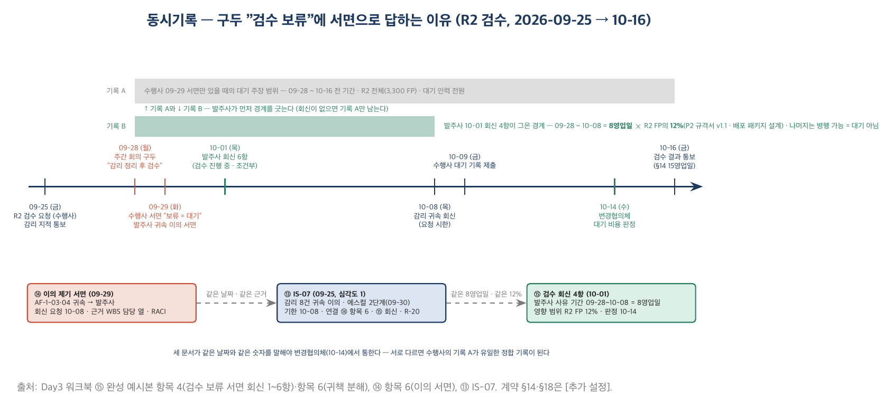

*그림 5-5. 동시기록 — 구두 검수 보류에 서면으로 답하는 이유. 발주사 회신이 없으면 수행사의 09-29 서면이 유일한 기록이 되어 대기 주장 범위는 전 기간·R2 전체다. 회신으로 발주사가 경계를 먼저 그었다(8영업일 × 12%). 세 문서가 같은 날짜와 같은 숫자를 말해야 변경협의체에서 통한다.*

---

## 5.6 지체상금·동시 지연·하도급 승인·계약 변경 로그 (심화)

### 지연 귀책의 사전 분해

R2(A06)는 +10영업일이고 A05·A06·A10은 기준선 TF 0이므로 그 10일은 여유에 흡수되지 않고 G4를 민다. 지금 분해할 수 있는 이유는 각 구간의 회의록·통지·판정이 있기 때문이다. G4(2027-05)에는 R3·R4·통합시험·컷오버의 지연이 겹쳐 9월의 10일은 "복합 원인"이 된다.

| 구간 | 지연 | 귀책 | 계약상 효과 | 판정 |
|---|---:|---|---|---|
| S10 3주 — POS 화면 승인 대기 중 SLA 초과분 | 7 | **발주사 단독** | 대기 비용·지체 제외 | 완료 07-15, 0.42 지급 |
| S10 — 승인 후 재작업 중 수행사 결함 재시험 | 3 | **수행사 단독** | §18 지체 일수 | 유보 — G4 정산 |
| S18 3주 — 규제 해석 추가(최영주 09-01) 2 + R2 결함 마무리 3 겹침 | 3 | **동시** | 공기 연장 인정·대기 비용·지체상금 불인정 | 10-14 확인 예정 |
| S12–S17 속도 640(초과 근무, 수행사 부담) | −3 | — | 수행사 단독 3일에서 우선 상계 주장 가능 | 10-14 협의 |
| AF-1-03·04 귀속 정리(09-28~10-08) | 8(병행 가능, 임계 영향 0) | **발주사 단독**(R2 FP 12% 한정) | 대기 비용(해당 부분)·지체 제외 | 대기 기록 10-09 → 10-14 |
| **순 지연(임계경로)** | **10** | 발주 7 + 동시 3 + 수행 3 − 회복 3 | G4 +10(EX-01로 0 목표) | |

**동시 지연(concurrent delay)**의 원칙은 SCL 프로토콜 2판 핵심 원칙 10이다 — 발주사 원인과 수행사 원인의 지연이 같은 기간에 겹치면 수행사는 그 기간의 **공기 연장은 받되 연장 비용은 받지 못하고**, 발주사는 지체상금을 물리지 못한다. Day2 3.3절이 "동시 지연은 진정한 동시성만"이라고 좁게 정의한 것을 기억하라 — S18의 2일(발주사)과 3일(수행사)은 같은 3주 구간 안에서 실제로 겹쳤다. 이 원칙을 변경협의체가 07-15에 계약 §14·§18의 해석 기준으로 합의한 것이 Day2 여유 소유권 문안의 갱신(워크북 §6 12번)이다.

**지체상금**은 산식이 있어야 감정이 아니다 — 수행사 단독 3일 × 1/1000 × 지연 부분 계약금(R2 FP 3,720 × 55만 원 = 20.46억) = **0.0614억(614만 원)** [계약 §18 요율·산정 기준은 추가 설정]. 작은 숫자다. 그러나 그 숫자가 있어야 "물릴 것인가"가 산식이 되고, 회복 계획이 성공하면 G4 완료일이 기준선과 같아져 "지연"이 성립하지 않으므로 소멸한다는 것도 산식으로 말할 수 있다. 수행사의 공기 연장(EOT) 청구는 09-30 현재 없다(회복 계획 동의). G4 정산 원칙 — 최종 완료일 기준 순 지연 확정 → 귀책 분해표(매월 한 행씩 누적) 적용 → 동시 구간 상계 → 대기 비용 기지급분 정산.

10영업일이 어떻게 네 구간으로 나뉘고 각 구간이 계약상 무엇을 낳는지를 그림 5-6에 폭포로 놓았다.

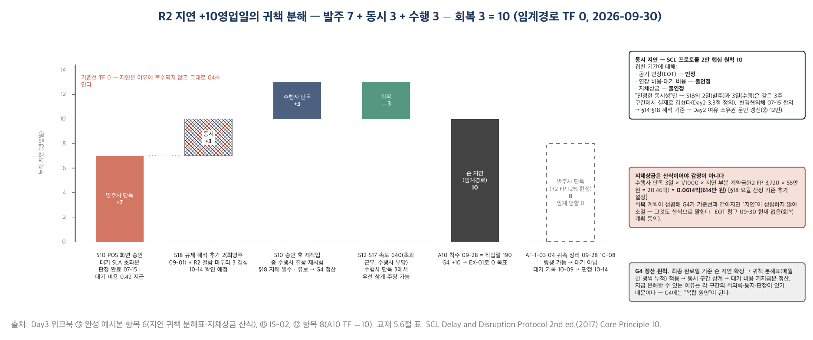

*그림 5-6. R2 지연 +10영업일의 귀책 분해 — 발주 7 + 동시 3 + 수행 3 − 회복 3 = 10. 기준선 TF 0이므로 여유에 흡수되지 않고 그대로 G4를 민다. 동시 구간 3일에는 SCL 핵심 원칙 10이 적용되어 공기 연장은 인정되고 비용·지체상금은 불인정이며, 수행사 단독 3일의 지체상금은 산식(3 × 1/1000 × 20.46억 = 0.0614억)으로 유보된다. 귀속 정리 8영업일은 병행 가능하므로 임계 영향 0이고 R2 FP 12%에 한정된 대기 비용 판정 대상이다. 워크북 ⑮ 항목 6.*

### 하도급 승인

배달3사 연동 어댑터 220 FP(1.2.3 총 380 중, R3 S19–S24)의 ㈜모빌커넥트 [추가 설정] 하도급 — 요청 08-05, 승인 08-19, 비율 220 × 55만 원 = 1.21억 / 68.2 = 1.8%(계약 §21 한도 내). 검토 열 넷: 기술(박세연 08-10, 어댑터 계층 분리·소스 발주사 저장소 직접 커밋) / **보안·개인정보(최영주 08-14 — 주문 데이터에 고객 연락처 포함 → 개인정보 처리 재위탁 해당, 재위탁 4건 → 5건, P4 위탁 구조·고객 고지 문구 갱신 09-01)** / 형상(PMO 08-12, 소스 인수·SBOM·라이선스 조항 승계) / 계약(강현도 08-17, 직접 지급 협조·수행사 연대 책임). 하도급 승인은 SI 계약의 일이지만 효과는 규제 워크스트림에 미친다 — 최영주가 08-14에 확인하지 않았다면 9월 규제 검증은 "재위탁 4건" 기준으로 통과했을 것이고, 2027-03 전자금융업 심사에서 5번째 재위탁이 발견되었을 것이다. 2023 감사 지적("위탁 산출물 소스 인수")도 소스 인수 조항의 하도급 승계로 여기서 대응된다. 소프트웨어진흥법·하도급법의 서면 승인 요건은 조문 원문 대조를 권한다.

### 계약 변경 로그 — 금액 0인 변경을 넣는 이유

로그 10건(예정 포함): 03-13 라이선스 50/50(SW-01~03, 금액 0·시점 이동 4.70) / 03-25 SI 3호 +0.121 / 04-24 클라우드 2년 선약정+종량 −3.0 유보(CL-01) / 04-10 유지보수 4.0 P5 이관(SW-04) / 04-16 SI 4호 R5 이연(0) / 04-22 앱 벤더 소스 인수 조항(0, P1 예산 외) / 07-08 3PL 폴백(0, P1 예산 외) / 07-15 SI 5호 +0.739 / 08-19 하도급 승인 1호(0) / 09-01 감리 중간 2회 분할(AU-01, 0) / 10-23 예정 SI 6호 +0.5775·DT-01 −2.0. 금액 0인 변경 다섯이 있다. 1번은 ⑫의 CV +4.70 착시를 만들고 R-17의 일부가 되었으며, 7번은 R-16과 CR-09의 야간 창 충돌을 만들었고, 9a번은 시험·감리 SV +0.70의 원인이다. **금액이 0인 변경은 돈이 아니라 시점과 조건을 바꾸고, 시점과 조건의 변경은 EVM·리스크·일정에 나타난다.** 로그에 없으면 그 나타남을 설명할 수 없다.

조달 예정: 단말 발주 10-30(견적 8.9, 기준선 8.6, 5억 초과 → 정미란 병행 결재 10-23, 입고 12-14, 설치 2027-01~02 설 잠금 회피) / DR·백업 11-13(2.1 + 2.1) / 부하시험 3자 계약 11-27(1.5 + 1.6 + 시나리오 0.2) / 보안진단 2회차 2027-01. 단말 입고 지연은 2027-01 봉우리 이월로 R-17과 결합한다.

---

## 5.7 실무에서 어떻게 틀리는가

**RAG에 수치가 없다** — 색은 감정이 된다. **모든 축이 G다.** **세 보고서를 한 문서로 합친다** — 예외가 월례에 묻힌다. **나쁜 소식을 성격의 문제로 다룬다** — 구조의 문제다. **첫 예외 보고를 실패 보고로 대우한다** — 두 번째는 늦다. **이해관계자 등록부를 착수 사진으로 둔다.** **수행사 성과만 적는다** — 발주사 SLA 준수율이 없으면 협상에서 무너진다. **구두 검수 보류에 서면으로 답하지 않는다** — 발주자 사유 기간을 공제받지 못한다. **지연 귀책을 G4에서 한 번에 정산하려 한다** — 그때는 복합 원인이다. **동시 지연을 "반반"으로 처리한다** — 효과는 비대칭(연장 인정·비용 불인정)이다. **하도급 승인에 개인정보·형상 검토가 없다.** **금액 0인 계약 변경을 로그에 안 넣는다.**

---

## 제5장 핵심 정리

> **한 줄씩 — 수업 직전 5분 복습용**
> 1. 세 보고서(주간 Checkpoint·월 Highlight·비주기 Exception)는 수신자가 다르니 합치지 않는다.
> 2. 나쁜 소식이 올라오지 않는 것은 성격이 아니라 구조다 — 처방은 양식(트리거를 관측 항목으로).
> 3. 현저성은 이동한다 — 착수 때 등록부를 실행 중에 갱신하지 않으면 결정이 한 사람에게 몰린다.
> 4. 수행사 성과 기록은 협상 자료다 — 발주사 SLA 준수율을 나란히 적어 양방향으로 만든다.
> 5. 구두 검수 보류에는 서면으로 답한다 — 동시기록이 없으면 발주자 사유 기간을 공제받지 못한다.
> 6. 지연 귀책은 지금 분해한다 — 동시 지연은 연장은 인정, 비용은 불인정.
>
> 아래는 같은 내용의 자세한 판이다.

1. 세 보고서(Checkpoint 주간 / Highlight 월 / Exception 비주기)는 수신자가 다르므로 합치지 않는다. RAG는 정의(G·A·R)와 수치가 있어야 감정이 아니고, 모든 축이 G인 보고서는 보고할 이유가 없다. 대시보드의 원칙 — 본값과 조정값 같은 화면, 완료 지표 옆 진행 중 항목의 나이, 열별 분해, 결정 요청과 시한.
2. mum effect는 성격이 아니라 구조(정보 비대칭·비난 예상·climate)다. 처방은 양식 — 트리거를 관측 항목으로, 발주사 SLA 준수율 병기, 조기 신호 → 양식 변경, 예외 보고자의 대우. escalation of commitment(Staw)가 그 반대편에 있고, 둘을 함께 막는 것이 사전에 정한 숫자(대안 3 자동 발동 조건)다.
3. 현저성은 이동한다 — 서정필·한동석의 상승, 프로그램 PMO장의 회신 부재, 오정근에게 몰린 결정. 도구는 등록부 재판정이 아니라 회의록 서명란과 결정 SLA다.
4. 수행사 성과 기록은 협상 자료이며 발주사 SLA 준수율(5월 58% → 9월 91%)을 나란히 적어 양방향으로 만든다. 인력 교체는 이슈이자 계약 사건이며 동시 투입·지식 이전 확인·사후 확인이 조건이다. 갈등의 처방은 판정 기준(여유 소유권·동시 지연 원칙)의 사전 합의다.
5. 동시기록 — 구두 검수 보류에 서면으로 답하지 않으면 발주자 사유 기간을 공제받지 못한다. 온담 10-01 회신은 구두 정정·완료 조건·발주사 사유 8영업일(영향 범위 12%)·계약상 효과·요청의 구조이며, ⑭ 이의 서면·⑬ IS-07과 같은 날짜와 숫자를 말한다. 기록이 없으면 판정은 기록이 있는 쪽의 것이다.
6. 지연 귀책은 지금 분해한다(발주 7 + 동시 3 + 수행 3 − 회복 3 = 10). 동시 지연은 연장 인정·비용 불인정(SCL 원칙 10, 07-15 합의). 지체상금은 산식(614만 원, 회복 시 소멸)이어야 감정이 아니다. 하도급 승인의 검토 열은 기술·보안/개인정보(재위탁 4 → 5)·형상·계약 넷이다. 계약 변경 로그에 금액 0인 변경을 넣는다 — 시점과 조건의 변경이 EVM·리스크·일정에 나타난다.

## 생각해 볼 질문

1. 여러분 회사에서 예외 보고(또는 그에 해당하는 것)를 낸 PM은 어떤 대우를 받았는가. 그 기억이 지금 여러분의 보고 시점을 얼마나 늦추는가.
2. 온담의 발주사 PMO가 09-28 회의에서 "감리 정리 후 검수"라고 말한 것은 잘못인가. 잘못이라면 무엇이 잘못인가 — 말한 것인가, 서면으로 정정하지 않은 것인가.
3. 발주사 사유 기간을 발주사가 먼저 8영업일로 적는 것과 수행사의 주장을 기다려 반박하는 것 중 어느 쪽이 발주사에 유리한가. 변경협의체의 시각에서 답하라.
4. 계약 변경 로그에서 금액 0인 변경을 세어 보라. 그중 성과보고의 어느 숫자를 움직인 것이 있는가.
5. 프로그램 PMO장이 회신 요청 세 번에 답하지 않았다. P1 PM이 할 수 있는 다음 행동은 무엇이고, 그 행동이 스폰서에게 어떻게 읽힐 것인가.

## 워크북 연결

이 장의 내용은 워크북 §5 "조달·계약 변경 기록"과 §2 항목 10(Highlight Report)·§3 항목 2(이슈 소유자·에스컬레이션)에서 적용한다. §5는 항목 1(계약 구조 11개와 조항)·항목 2(변경 대가 산정표 — FP·단가·합의 일자·서면·지급 시점)·항목 3(수행사 성과 기록 12 스프린트 + 발주사 SLA 준수율, 인력 교체 승인서)·항목 4(검수 보류 서면 회신 완성본 6항)·항목 5(하도급 승인 기록 — 검토 열 넷)·항목 6(지체상금·지연 귀책 사전 정리표, 동시 지연 원칙)·항목 7(계약 변경 로그 10건)·항목 8(조달 상태·다음 조달)을 채운다. 검산은 §5.6(1.0175, 0.42, 0.5775, 1.77%, 94.4%, 0.0614, 7+3+3−3). 기본 과제(10-14 변경협의체 — 대기 기록 32인일, S18 동시 지연 재주장, 초과 근무 0.35 변경 대가 요구에 대한 세 회신)와 심화 과제(자기 회사 계약서의 검수·지체상금·변경 조항 한 장 요약, 금액 0인 변경 세기)는 §5.7.

---

# 제6장 이 날의 학술 배경과 읽을 자료 (과정 후)

이 장은 제1~5장에서 인용한 문헌 가운데 아홉 갈래를 골라 깊이 읽는다. Day1 제4장·Day2 제6장과 같은 이유에서다 — 표준이 "이렇게 하라"고만 말하는 지점에서 학술 문헌은 "왜 그런가"와 "언제 그것이 틀리는가"를 말해 주며, 실행·통제 단계에서 그 두 질문은 지표(왜 SPI는 종료에서 1이 되는가)와 사람(왜 나쁜 소식은 올라오지 않는가)에 관한 것이다. 서지의 검증 표기는 과정 리딩리스트(`05_리딩리스트/00_리딩리스트.md`)를 따르고, 그 문서에 없는 항목은 [검증 필요]로 표시했다.

## 6.1 Lipke(2003) — Earned Schedule 원전

Walt Lipke의 「Schedule is Different」(*The Measurable News*, 2003년 3월)는 네 쪽짜리 실무 논문이며, EVM 40년의 결함 하나를 고쳤다. 논지는 2.4절 그대로다 — SV와 SPI는 원가 단위이므로 프로젝트가 늦게라도 끝나면 EV = PV = BAC가 되어 종료 시점에 반드시 SV = 0, SPI = 1.0으로 수렴하고, 후반부의 일정 지표는 정보를 잃는다. 해법은 EV를 PV 곡선에 투영해 **시간** 축의 값(ES)을 읽는 것이며, 그로부터 SV(t) = ES − AT, SPI(t) = ES ÷ AT, IEAC(t) = PD ÷ SPI(t)가 나온다. 이후 Lipke의 『Earned Schedule』(Lulu, 2009)과 Vanhoucke 등의 실증 연구가 ES 기반 예측이 전통 SPI 기반보다 일관되게 정확하다는 것을 보였다.

**흔한 오독.** ES를 "일정 EVM의 대체"로 읽는 것 — ES는 EVM의 확장이며 같은 PV·EV를 쓴다. ES가 임계경로를 대체한다고 읽는 것 — ES는 프로젝트 평균이고 지연의 위치는 CPM만 안다(온담 −15영업일 평균 vs 임계경로 −10). 그리고 ES를 후반부에만 쓰는 것 — 두 지수가 벌어지기 시작하는 시점(온담 7월, 진척 40%)이 가장 정보가 많다.

## 6.2 Fleming & Koppelman — EVM의 교과서와 그 전제

Fleming & Koppelman의 『Earned Value Project Management』(4판, PMI, 2010)는 EVM 실무의 표준 교과서다. 열 단계(범위 정의 → WBS → 통합 → 통제 계정 → 기준선 → 측정 → 예측 → 변경 관리 …)와 EAC 공식들의 전제, 그리고 **고정가 계약에서의 EVM**을 다룬다. 이 교재가 빌린 것은 셋이다. EVM은 PMB 없이 성립하지 않는다(2.1절). EAC의 공식은 전제의 선택이며 하나만 보고하는 것은 전제를 숨기는 것이다(2.3절). 고정가 계약에서 발주사 관점의 AC는 계약 대금이므로 CPI는 계약이 만든 1이고, 원가 성과는 변경 대가와 예비비 소진에서 읽는다(2.6절 착시 2). 저자들은 또 "EVM은 원가 정산 계약의 정부 사업에서 시작되었으므로 민간 고정가로 옮길 때 무엇을 바꿔야 하는가"를 명시적으로 묻는데, 온담의 "컨틴전시는 PMB 밖·집행 시 PV 없는 AC"가 그 답의 한 형태다.

## 6.3 Christensen(1992·1993) — CPI 안정성

David S. Christensen과 동료들의 두 논문 — Christensen & Payne, 「Cost Performance Index Stability — Fact or Fiction?」(*Journal of Parametrics* 12(1), 1992) [검증 필요 — 호·페이지], Christensen & Heise, 「Cost Performance Index Stability」(*National Contract Management Journal* 25(1), 1993) [검증 필요] — 은 미 국방 획득 사업의 대규모 계약 성과 데이터에서 누적 CPI가 진척 20% 시점 이후 ±10% 이내에서 안정되는 경향을 보였다. 이후 "20% 규칙"과 "CPI는 좋아지지 않는다"가 EAC1의 실무적 정당화가 되었고, Christensen은 후속 연구에서 여러 EAC 공식의 정확도를 비교했다(6판이 인용하는 EAC 공식 비교의 원류).

**실무자에게.** 규칙의 표본은 원가 정산 계약이며 온담 같은 고정가·발주사 관점 EVM에 그대로 옮기면 틀린다(2.5절). 규칙의 쓸모는 "CPI가 곧 회복된다"는 희망을 꺾는 것이다 — 착시를 조정한 CPI(0.968)가 진척 50%에서 안정된 값이라면 PMB 초과는 확정이고, 문제는 집행 한도 안에서 끝나는가다. 착시 포함 CPI(1.032)를 외삽하는 데 이 규칙을 쓰는 것이 가장 흔한 오용이다.

## 6.4 Vacanti(2015)·Reinertsen(2009) — 흐름의 지표와 흐름의 경제학

Day2 6.4절이 Reinertsen의 『The Principles of Product Development Flow』(Celeritas, 2009)를 배치 크기·큐·WIP의 경제학으로 소개했다. Day3에서 그것은 측정이 된다. Reinertsen의 큐 논증(이용률이 100%에 가까워질수록 대기 시간이 폭증 — M/M/1의 ρ/(1−ρ)와 Kingman 근사는 다른 식이므로 구분해 인용하라)은 R-05의 구조 — 발주사 인력 14명이 겸임으로 거의 100% 차 있을 때 결정 요청이 큐에 쌓이는 것 — 를 설명하고, 처방이 "더 열심히"가 아니라 이용률을 낮추는 것(전담·대체 결정권자)임을 말한다.

Daniel Vacanti의 『Actionable Agile Metrics for Predictability』(ActionableAgile Press, 2015 표기 — 일부 출처 2014 [검증 필요])는 그 경제학을 네 지표(WIP·cycle time·throughput·work item age)로 잰다. 세 기여. **Little's Law를 예측 도구가 아니라 시스템 안정성의 진단 도구로 재정의** — 법칙의 성립 가정(원문 대조 필요)이 깨지는 구간이 불안정의 신호다. **flow debt** — 오래된 항목을 방치하고 새 항목을 빨리 끝내면 평균 cycle time이 '개선'되지만 부채가 쌓인다. 2.7절이 이것을 SPI 수렴과 같은 병리("완료된 것만 재는 지표")로 묶었고, 처방(work item age 병기)을 4.2절의 결함 나이에도 적용했다. **Cycle Time Scatterplot과 백분위수(50/85/95%)** — 평균이 아니라 분포로 약속한다. 온담 S7~S18의 표(2.7절)는 이 넷을 EVM 옆에 둔 것이며, S10의 WIP 41·age 12가 SI EV 하락의 선행 신호였다.

## 6.5 Keil·Smith와 mum effect — 나쁜 소식은 왜 올라오지 않는가

mum effect의 원전은 Rosen & Tesser(1970, *Sociometry*)의 사회심리학 실험이다 [검증 필요]. 소프트웨어 프로젝트에 이식한 것은 Mark Keil, H. Jeff Smith와 동료들의 일련의 연구다 — Smith & Keil, 「The reluctance to report bad news on troubled software projects: a theoretical model」(*Information Systems Journal* 13(1), 2003) [검증 필요], Keil, Im & Mähring, 「Reporting bad news on software projects: the effects of blame, …」(*ISJ* 17(1), 2007) [검증 필요], 그리고 Keil & Robey의 de-escalation 연구(*JMIS*, 1999) [검증 필요]. 세 발견이 5.2절의 뼈대다 — **정보 비대칭**(아는 사람과 보고할 권한이 있는 사람이 다르다), **비난 예상**(blame이 클수록 보고가 완화된다), **조직 분위기**(climate가 침묵의 비용을 정한다). 처방은 성격 교정이 아니라 구조 — 트리거를 관측 항목으로 만들어 사실이 비난이 되지 않게 하고, 예외 보고자의 대우로 climate를 정한다. 같은 갈래의 Kappelman, McKeeman & Zhang(2006), 「Early Warning Signs of IT Project Failure: The Dominant Dozen」(*Information Systems Management*) [검증 필요 — 권·호·페이지]은 조기 신호 12개를 사람 요인·프로세스 요인으로 나눠 순위화했고, 상위 신호가 대부분 기술이 아니라 "경영진 후원 부재·이해관계자 미참여·PM 경험 부족" 같은 사람 요인임을 보였다 — 2.8절 조기 신호 5개의 이론적 틀이다.

## 6.6 Staw(1976) — 계속 투자(escalation of commitment)

Barry Staw의 「Knee-deep in the big muddy」(*Organizational Behavior and Human Performance* 16(1), 1976, 27-44)는 escalation of commitment의 원 실험이다. 핵심은 sunk cost가 아니라 **self-justification** — 실패한 결정을 자기가 내렸을 때 추가 투입이 커진다. 처방이 완전히 달라진다 — 회계적 매몰비용 교육이 아니라 **착수 결정자와 중단 결정자의 분리**. Day1이 게이트의 중단 기준을 착수 결정과 동시에 제출하게 하고 판정자를 착수 결정자와 분리한 근거이며, Day3에서는 예외 보고의 대안이 "각각 다른 사람의 결정"이어야 하는 이유(4.6절)이고, 대안 3의 자동 발동 조건(11-13 S22 속도 620)처럼 **사전에 정한 숫자**가 결정자의 self-justification을 우회하는 장치다. 후속 — Staw & Fox(1977, *Human Relations* 30(5)), Staw(1981, *AMR* 6(4)). Flyvbjerg(2021)의 열 편향 중 ⑩이 이것이다.

## 6.7 Brooks(1975) — 늦은 프로젝트에 인력을 더하면

Frederick Brooks의 『The Mythical Man-Month』(Addison-Wesley, 1975; 20주년 기념판 1995; 『맨먼스 미신』 인사이트 2015)의 법칙 — "늦은 소프트웨어 프로젝트에 인력을 더하면 더 늦어진다" — 은 두 논증에 선다. 새 인력의 학습 기간과 기존 인력의 교육 부담, 그리고 의사소통 경로 n(n−1)/2의 증가(82명이면 3,321개). Day2 3.4절이 crashing의 한계로 인용했고, Day3에서는 세 자리에 나타난다 — 회복 계획 대안 1이 인력 추가가 아니라 SS 겹침·병행(fast tracking)과 재배치인 이유, 인력 교체 승인 조건이 "전임·후임 동시 투입"인 이유(5.4절), 결함 해소 전담 2명을 "R3 설계 병행 해제"로 만든 이유(기존 인력의 재배치). Williams(2002)의 시스템 다이내믹스 모델이 이 격언을 정량 구조(압축 → 병행 → 재작업 → 추가 압축)로 승격시켰다.

## 6.8 Kerzner의 진척 착시와 Kappelman의 조기 신호

Harold Kerzner의 『Project Management: A Systems Approach』(13판 2022; 14판 [검증 필요])는 통독 대상이 아니라 참조서다. Day3에서 빌리는 것은 진척 보고의 착시 — 담당자 진척률이 종료 3개월 전까지 항상 80~90%인 현상(1.5절 90% 증후군)과 그 처방으로서의 측정 규칙, 그리고 스폰서십 실패 유형(회의록 서명을 미루는 담당자는 권한을 잃은 것 — 5.3절)이다. Kappelman 등의 Dominant Dozen(6.5절)과 함께 읽으면 조기 신호 목록이 "기술 지표"에서 "사람·프로세스 지표"로 넓어진다.

## 6.9 정보시스템 감리기준 — 공공의 구조를 민간이 빌리는 법

한국 공공 SI의 정보시스템 감리는 전자정부법 제57조·시행령 제71조(의무 대상 — 사업비 5억 이상 등, 사업비 정의에 HW·SW 단순 구입비 제외)와 **정보시스템 감리기준**(행정안전부 고시 제2024-53호, 2024-06-27 일부개정 — 착수 시점 기준으로 현행 확인)에 따라 단계별로 실시되고, 지적사항이 "개선권고"인지 "시정조치"인지에 따라 수행사의 대응 의무가 다르며, 시정조치 미이행은 검수 거부 사유로 연결된다. 온담은 민간이므로 이 고시가 적용되지 않지만, 감리 4.2억을 계약해 같은 구조 — 단계별 감리, 지적 등급, 시정 확인, "감리 지적은 검수의 근거" — 를 빌렸다. 빌릴 때 반드시 함께 빌려야 하는 것이 **귀속 판정 원칙**이다(4.3절). 공공 감리기준은 지적의 등급과 시정 절차를 정하지만 귀속은 발주기관이 판정하며, 그 판정의 근거(WBS 담당 열·RACI)가 계약에 없으면 감리 보고서의 기재가 유일한 기록이 된다. 감리기준은 고정된 것이 아니라 개정된다(2021-4호 → 2024-53호) — 사업 착수 시점의 판본을 확인하라.

## 6.10 읽을 자료 — 필수 / 심화 / 참고

### 필수 (과정 전)

| 자료 | 서지 | 한국어판 | 왜 읽는가 | 어느 부분 | 시간 |
|---|---|---|---|---|---|
| **Day2 워크북 완성 예시본 5종** | 본 과정 교재/PM트랙/Day2_워크북 §1.5·§2.5·§3.5·§4.5·§5.5 | — | Day3 산출물의 자. 월별 PV 표·CPM 계산표·등록부·격자·WBS 사전 카드를 읽지 않으면 Day3 워크북의 어느 칸도 채울 수 없다 | §3.5 항목 5·7, §4.5 항목 5·6, §5.5 항목 2~7 | 60분 |
| **Lipke, Schedule is Different** | *The Measurable News*, 2003년 3월 | 없음 | 네 쪽. ES·SV(t)·SPI(t)·IEAC(t) 네 공식을 강의장에서 처음 보면 오후가 무너진다 | 전체 | 30분 |
| **ANSI/PMI 19-006-2019 용어 절** | *The Standard for Earned Value Management*, PMI, 2019 | 없음 | PMB·BAC·통제 계정·관리예비비·EV 측정 기법의 정의. "BAC는 145.8인가 156.0인가"를 표준 용어로 답하기 위해 | 용어 정의, EV 기법 절 | 40분 |
| **PRINCE2 7 Progress practice 요약** | *Managing Successful Projects*, PeopleCert, 2023 | 확인되지 않음 | 허용범위·예외 보고·세 보고서의 원문 | Progress practice | 40분 |

과정 전 제출 과제 하나: 여러분 회사의 최근 성과보고서 한 부를 가져와 그 안의 "진척률"이 무엇의 비율인지, 기준선 버전이 명시되어 있는지, 결정 요청 칸이 있는지 세 가지에 O/X를 적어 오라.

### 심화 (과정 후)

**30일 안에**

| 자료 | 서지 | 한국어판 | 왜 읽는가 | 어느 부분 | 시간 |
|---|---|---|---|---|---|
| **Fleming & Koppelman** | *Earned Value Project Management*, 4th ed., PMI, 2010 | 없음 | 6.2절. 고정가 계약의 EVM, EAC 전제 | 열 단계 장, 예측 장 | 4시간 |
| **Christensen 두 논문** | Christensen & Payne (1992), *J. of Parametrics* 12(1) / Christensen & Heise (1993), *NCMJ* 25(1) [검증 필요] | 없음 | 6.3절. CPI 안정성의 실증과 표본의 한계 | 전체 | 1.5시간 |
| **Vacanti** | *Actionable Agile Metrics for Predictability*, 2015 [검증 필요 — 연도] | 미확인 | 6.4절. flow debt, Little's Law 성립 조건, 백분위수 | Little's Law 장, flow debt 장 | 5시간 |
| **Staw (1976)** | *OBHP* 16(1), 27-44 | 없음 | 6.6절. self-justification — 착수 결정자 ≠ 중단 결정자의 근거 | 전체 | 1시간 |
| **Smith & Keil (2003)** | *ISJ* 13(1) [검증 필요] | 없음 | 6.5절. 나쁜 소식이 올라오지 않는 구조 | 모델 절 | 1시간 |
| **Kappelman et al. (2006)** | Dominant Dozen, *ISM* [검증 필요] | 없음 | 6.8절. 조기 신호 12개 | 목록과 순위 | 40분 |

**90일 안에**

| 자료 | 서지 | 왜 읽는가 | 시간 |
|---|---|---|---|
| **Reinertsen** | *The Principles of Product Development Flow*, 2009 | 6.4절. 큐·이용률·WIP — R-05의 구조를 경제 언어로 | 8시간 |
| **SCL Protocol 2판 전체** | Society of Construction Law, 2017 | 5.6절. 핵심 원칙 8·10·14, 기록(records), 지연 분석 6방법 | 4시간 |
| **PMBOK 8판 M&C Focus Area·다섯 성과영역** | PMI, 2025 | 1.3절. 통제 활동의 배치와 용어 | 6시간 |
| **PRINCE2 7 세 프로세스** | Controlling a Stage · Managing Product Delivery · Managing a Stage Boundary | 1.3절. 발주·수행 PM의 역할 분리, 예외 계획 | 4시간 |
| **Brooks** | *The Mythical Man-Month*, 1975/1995 — 『맨먼스 미신』 | 6.7절 | 4시간 |
| **Kan** | *Metrics and Models in Software Quality Engineering*, 2nd ed., 2002 | 4.1·4.2절. Rayleigh 모델, DRE, 결함밀도 분모 | 5시간(해당 장) |
| **Forsgren, Humble & Kim** | *Accelerate*, 2018 + DORA 2025 보고서 | 2.7절. 4지표의 정의와 측정 방법론, 2025 갱신(5지표) | 4시간 |

### 참고 (워크북을 쓰다가 손을 뻗어 확인할 것)

| 자료 | 어느 워크북 절에서 | 무엇을 확인하는가 |
|---|---|---|
| **ANSI/PMI 19-006-2019 Baseline maintenance** | §1 항목 9, §2 항목 1 | 승인된 변경의 PMB 편입, 미배분 예산·관리예비비 이동 기록 |
| **PMI, Practice Standard for Project Configuration Management (2007)** | §1 항목 9 | BL 번호 체계, "승인된 변경만 기준선을 바꾼다" |
| **PMBOK 6판 7.4.2.2~7.4.2.5** | §2 항목 4·5 | EVM·EAC 4공식·TCPI의 원문 |
| **PRINCE2 7 Issues·Change practice** | §1 항목 4~7 | 6개 성과 목표, change authority·change budget |
| **Hillson & Simon, ATOM 3판 (2020)** | §3 항목 9 | Major/Minor review의 주기와 깊이 |
| **ISO 21502:2020 §7.8·7.9·7.10·7.12·7.17** | 각 X.2 | 조항 번호 원문 대조 |
| **정보시스템 감리기준 (행안부 고시 2024-53호)** | §4 항목 6 | 지적 등급·시정조치 확인 구조 (민간 준용) |
| **소프트웨어진흥법·하도급법 관련 조문** | §5 항목 5 | 하도급 서면 승인·직접 지급 (조문 원문 대조 필수) |
| **SCL Protocol 핵심 원칙 10** | §5 항목 6 | 동시 지연의 정의와 효과 |

### 읽지 않아도 되는 것

Day3 주제에 관해 자주 추천되지만 이 교재가 읽기를 권하지 않는 것. "EVM 공식 암기 카드"만 있는 2차 자료(전제 없는 공식은 EAC1만 낳는다). SPI·CPI를 팀 KPI로 쓰는 대시보드 백서(지표는 합의의 산물이며 규칙이 바뀌면 값이 바뀐다). DORA 지표로 팀을 서열화한 사례집(원저의 측정 방법론을 오용한 것이다). "변화관리 3단계(unfreeze–change–refreeze)" 류 — Cummings, Bridgman & Brown(2016, *Human Relations* 69(1))이 Lewin은 그런 모델을 만든 적이 없음을 사료로 보였다. 이것들을 읽었다면 잘못이 아니지만, 인용할 때는 그 한계를 함께 말해야 한다.

---

## Day3을 마치며 — Day4 예고

이 교재는 하나의 문장으로 요약된다. **통제는 편차를 재는 일이 아니라 편차에 대해 누가 무엇을 결정해야 하는지를 적는 일이며, 그 결정 요청이 없는 문서는 기록일 뿐이다.** 성과보고(PV·EV·AC와 그 착시, EAC 4공식과 그 전제, Earned Schedule, CPM의 임계경로 −10, 예외 보고 EX-01), 변경요청서(6축, 처리 경로 규칙 ②, BL-02와 재기준선의 차이), 이슈 로그와 리스크 등록부 갱신(기한과 트리거, 잔여 EMV 7.26의 변동 분해, 2차 리스크 7건, 배정으로 소진되는 컨틴전시), 품질 통제 기록(0.132의 에스컬레이션, 8월 평탄의 판독, 감리 지적의 귀속), 조달·계약 변경 기록(변경 대가 1.0175, 검수 보류 회신의 8영업일, 귀책 분해 7 + 3 + 3 − 3, 금액 0인 변경). 다섯 산출물은 워크북 §1~§5이고, 서로를 설명한다 — 성과보고의 어느 숫자가 다른 넷 어디에도 설명되지 않으면 그 숫자는 아직 이해되지 않은 것이다.

실행 단계에서 정직하게 적어야 할 것 세 가지를 다시 말한다. SPI가 오르는데 예외 보고를 낸 이유 — SPI(t)는 정체이고 임계경로는 −10이며 컷오버 창은 허용범위 0이라는 사실. CPI 1.032가 좋은 소식이 아닌 이유 — 라이선스 4.70의 인식 기준 차이를 걷어 내면 0.968이고 EAC3′ 155.04는 집행 한도까지 0.96 남았다는 사실. 컨틴전시 소진 13.8%가 안심의 근거가 아닌 이유 — 미배정 풀이 스프린트 4회분에서 1.75회분이 되었고 관리예비비 대상 2.20의 원인이 전부 프로그램·스폰서 계층이라는 사실. 이 셋은 나쁜 소식이 아니라 통제가 한 일이며, 스폰서에게 결정을 요청하는 근거다. 그리고 재기준선은 0회다 — 기준선은 승인된 변경으로만 움직였고, 지연과 초과는 편차로 남아 결정을 기다린다.

**Day4 — 전환과 종료.** 시점은 2027-02(G3 직전)에서 2027-05(G4)와 2028-03(G5)으로 옮겨 간다. 컷오버 런북과 SAC(두 번의 컷오버 — 매장·주문 02-26, 물류 03-27 — 와 1차 하이퍼케어 지표가 2차 go 조건이 되는 구조, G3 go/no-go 자료로서의 성과보고 제13호와 심각도 1·2 미해결 0 판정), 운영 이관 체크리스트(ITIL의 서비스 전환 — 운영 문서 12종, 소스 인수 100%와 하도급분 220 FP의 클린 빌드, 유지보수 4.0의 P5 예산, 아카이브·22:00 파라미터·폴백 배치의 운영 절차), 종료 보고서(BAC 146.82 대비 17개월 EVM 이력, 변경 로그 BL-01 → BL-0n, 귀책 분해표의 G4 정산 — 2019년 스마트오더의 세 줄과 대비되는 문서), 교훈 등록부(이슈 로그의 출처 열 — 등록부 3·프리모템 3·신규 5 — 와 조기 신호 5개가 다음 프로젝트의 양식·규칙 변경이 되는 것), 편익 실현 원장(B-08 12h의 M+12 판정, 두 분모 리포트, 손익분기 66%와 허용범위 −5%p의 G5 판정). Day3의 다섯 문서가 Day4 첫 시간의 입력이며, 특히 오늘 적어 둔 EX-01의 대안 3개는 G3에서 심각도 2 미해결이 0이 아닐 때 EX-02가 다시 꺼낼 것이다.

실행 시점에 기록되지 않은 것은 종료 시점에 정산되지 않는다. 그것이 여러분이 오늘 구두 통보에 서면으로 답하고, 지연 귀책을 매월 한 행씩 분해해 두고, 착시를 지우지 않고 병기하는 이유다.
