# PM 트랙 Day 4 교재 — 전환과 종료(Transition · Closing): 오픈은 이벤트가 아니라 이관이다

> **이 교재의 위치** — 4일 PM 특강의 넷째 날이자 마지막 날 본문이다. Day1이 "무엇을 왜 하는가, 누가 결정하는가"를 문서로 세우는 날, Day2가 그 문서를 **측정 가능한 기준선**으로 바꾸는 날, Day3가 기준선에 실적을 대어 **편차를 재고 결정을 요청하는** 날이었다면, Day4는 프로젝트가 만든 것을 **프로젝트가 아닌 조직에 넘기고, 넘긴 뒤에도 작동해야 하는 문서를 남기며, 임시조직을 제도적으로 끝내는** 날이다. 슬라이드는 강사가 이 본문 가운데 무엇을 어떤 순서로 설명하는지를 정하고, 워크북은 이 본문의 개념을 온담F&B홀딩스 P1(차세대 주문·재고 통합 플랫폼 구축)의 두 시점 — 컷오버 직전 2027-02-05와 G4 종료 2027-05-28 — 에 적용해 컷오버 런북·서비스 수용 기준·운영 이관 체크리스트·SLA/OLA/UC·종료 보고서·미해결 사항 이관 목록·교훈 등록부·편익 실현 원장을 직접 작성하게 한다. 본문은 그 둘의 뿌리다. 강의를 듣기 전에 한 번, 워크북을 쓰다가 막힐 때 한 번, 과정이 끝난 뒤 — 특히 여러분의 프로젝트가 오픈을 앞두었을 때 — 한 번 읽도록 쓰였다.
>
> **전제 독자** — Day1~Day3과 같다. 주니어 PM과 3~7년차 현업 실무자. 컷오버·하이퍼케어·SLA·하자보수·교훈이라는 말은 이미 안다고 전제한다. 대신 "말은 아는데 실무에서 틀리는 것" — 오픈 다음 날 아침 서비스데스크가 왜 "우리는 인수한 적 없다"고 말하는가, 되돌릴 수 없는 시각이 왜 기술적 롤백 시한보다 먼저 오는가, SLA 99.5%가 왜 서명은 되어도 성립은 안 되는가, 지체상금 0에 왜 네 줄의 근거가 필요한가, 편익 판정의 기준값이 왜 두 개인가, 교훈은 왜 다음 프로젝트 착수 회의에서 낭독되고 잊히는가 — 에 지면을 쓴다.
>
> **사례 회사와 시점** — 모든 예시는 `교재/공통/가상회사_온담F앤B.md`와 Day1~Day3 워크북 완성 예시본(헌장 v1.1, BL-02, 리스크 등록부 v1.2, 성과보고 제9호, 예외 보고 EX-01, 귀책 분해표)을 재료로 쓴다. 시점은 둘이다 [추가 설정, 고정]. **(a) 2027-02-05(금)** — 컷오버 3주 전, 런북 v1.0과 SAC v1.0이 확정되어 G3(02-19) 자료에 첨부되는 날. **(b) 2027-05-28(금)** — G4, P1 종료 승인일. 종료 보고서는 06-04 발행, 프로그램 이사회 보고 06월. 이 두 날짜 사이에 일어난 일(EX-01 스폰서 결정 = 대안 1, 리허설 3회, 두 번의 컷오버, D−2 라이선스 사건, ELS 8주의 인시던트, 포인트 이중차감, 최종 AC 151.95, 이관 10건, 교훈 15건)은 모두 [추가 설정]이며, 그 정본은 **Day4 워크북 완성 예시본**과 그 검산 스크립트다. 이 본문의 온담 숫자는 전부 거기서 가져왔고, 워크북과 본문이 다르면 워크북이 우선한다. 회사 정본과 워크북이 다르면 회사 정본이 우선한다.
>
> **표준 판본에 관한 고지** — 이 교재는 PMBOK Guide 8판(2025), PRINCE2 7(2023), ISO 21502:2020을 인용하고, ITIL은 **practice 명칭(ITIL 4 어휘)으로 고정해** 쓴다. 2026-02에 ITIL Version 5 Foundation이 출시되어 현행 판본은 v5이며, 이 교재가 ITIL 4 어휘를 쓰는 것은 "4가 최신"이어서가 아니라 여러분 회사의 운영 규정과 벤더 계약서에 지금 적혀 있는 어휘가 그것이기 때문이다(3.1절). 개인정보 보호법은 법률 제21445호(2026-03-10 공포, 2026-09-11 시행)를 기준으로 **조문은 단정하고 적용은 단정하지 않는다**(3.8절).
>
> **읽는 법과 분량** — 이 교재는 하루에 다 읽는 책이 아니다. 목차의 표시대로 필독 절만 수업 전에 읽으면 되고(약 110분), 나머지는 수업 후·과정 후에 읽는다. 본문의 온담 단락은 앞머리에 **■ 사례 사실** 줄을 두어 그 단락이 쓰는 사례의 사실과 출처(사례 §·숫자 표 ID)를 먼저 적었다 — 사례 문서를 통독하지 않았어도 그 줄만 읽으면 따라올 수 있고, 더 알고 싶으면 그 §을 펼친다. 용어·약어·문서 ID(R-10, CR-09, A10, BL-02 …)가 낯설면 `교재/공통/02_용어약어색인.md`를, 4일 전체의 읽는 순서는 `교재/공통/00_학습안내.md`를 본다.
---

## 목차

표시 없는 절은 **수업 전 필독**(약 110분), (심화)는 수업 후 일주일 안에 읽는 절(약 25분), (과정 후)로 표시된 장은 4일이 끝난 뒤 읽는 학술 배경과 읽을 자료다. 각 장 끝의 "핵심 정리" 첫 상자(한 줄씩)는 수업 직전 5분 복습용이다.

**서문 — Day3에서 가져오는 것**

**제1장 전환과 종료란 무엇인가 — 오픈은 이벤트가 아니라 이관이다**
- 1.1 프로젝트의 끝과 서비스의 시작이 같은 날이 아닌 이유 — 세 개의 시계
- 1.2 표준에서는 — PMBOK 8판 Closing Focus Area, PRINCE2 7 Closing a Project의 5활동, ISO 21502 §7 (심화)
- 1.3 임시조직의 끝 — Lundin & Söderholm의 제도화된 종료, Staw의 중단 결정자 (심화)
- 1.4 분야별 대조 — EPC의 MC/PAC/FAC, SI의 검수·정산·유보금·하자보수, NPD의 양산 이관, 제약의 DB lock (심화)
- 1.5 실무에서 어떻게 틀리는가 — 오픈 = 종료, 보고서 없는 해산, 소리 없이 소멸하는 미해결 사항
- 핵심 정리 / 생각해 볼 질문 / 워크북 연결

**제2장 컷오버 — 되돌릴 수 없는 시각을 정하는 기술**
- 2.1 런북의 구조 — T−24h에서 T+24h까지, 확인 열은 관측값으로
- 2.2 go/no-go 게이트와 판정자 — 되돌리는 비용이 다른 세 지점
- 2.3 Point of no return — 무엇이 되돌릴 수 없게 만드는가, 온담 01:40
- 2.4 롤백 트리거와 롤백 계획의 비대칭 — 롤백도 프로젝트다
- 2.5 데이터 마이그레이션 6종 검증 — 이 데이터의 정답을 누가 판정하는가
- 2.6 리허설의 의미 — 결과가 나빠야 좋은 리허설
- 2.7 창·성수기·주말, 빅뱅·단계적·병행, 그리고 두 번 컷오버(R-14)의 비용 (심화)
- 2.8 D−2 라이선스 사건 — 거버넌스 변경의 부작용이 14개월 뒤 청구되는 구조
- 2.9 실무에서 어떻게 틀리는가
- 핵심 정리 / 생각해 볼 질문 / 워크북 연결

**제3장 서비스 전환 — ITIL과 SLA의 세 층**
- 3.1 ITIL 판본을 정직하게 — v5가 현행, 이 교재가 4 어휘로 고정하는 이유
- 3.2 서비스 수용 기준(SAC) — 인수 거부권이 실재해야 문서가 장치가 된다
- 3.3 Early Life Support — 종료 조건이 없는 하이퍼케어는 상주가 된다
- 3.4 Change Enablement · Release · Deployment — 셋을 구분해야 CAB가 정치가 되지 않는다 (심화)
- 3.5 SLA/OLA/UC 3층 — 한 층이 비면 SLA는 구조적으로 불가능하다
- 3.6 Error budget — 99.5%를 3시간 39분으로, 다시 릴리스 속도로 환전하기
- 3.7 Incident와 Problem, Known Error DB — 인시던트를 닫는 것과 문제를 닫는 것은 다르다 (심화)
- 3.8 개인정보 보호법 개정과 운영 의무 — 조문은 단정하고 적용은 단정하지 않는다
- 3.9 사용자 채택과 변화관리 — 저항은 정보다 (심화)
- 3.10 표준에서는 — ISO/IEC 20000, PMBOK 8판 운영 준비도, PRINCE2 7 hand over products (심화)
- 3.11 실무에서 어떻게 틀리는가
- 핵심 정리 / 생각해 볼 질문 / 워크북 연결

**제4장 종료 — 보고서는 마지막 독자를 위해 쓴다**
- 4.1 종료 보고서의 구조 — 선언이 아니라 증명
- 4.2 BL-02 대비 최종 성과 — 네 축과 변경·예비비 총괄, "절감"과 "초과"가 동시에 참인 이유
- 4.3 계약 종결 — 검수·정산·유보금·하자보수, 지체상금 0의 네 줄
- 4.4 문서·형상 인수 — 2023년 지적사항의 회수 (심화)
- 4.5 미해결 사항 이관 목록 — 소유자 실명이 없는 이관은 소멸이다
- 4.6 잔여 리스크의 운영 이관과 팀 해산 — 사람의 전환
- 4.7 문서의 마지막 독자 — 3년 뒤의 내부감사·분쟁·다음 PM
- 4.8 실무에서 어떻게 틀리는가
- 핵심 정리 / 생각해 볼 질문 / 워크북 연결

**제5장 교훈과 편익 — 프로젝트가 끝난 뒤에 남는 것**
- 5.1 교훈은 왜 조직에 남지 않는가 — Williams(2008), Duffield & Whitty의 Syllk (심화)
- 5.2 교훈 등록부의 설계 — 여섯 칸, "적용 대상"이 없는 교훈은 감상이다
- 5.3 온담 P1의 교훈 15건 중 다섯 — 그리고 사내 표준 개정 요청 3건
- 5.4 편익 실현의 책무 분리 — Zwikael & Smyrk의 ITO, 원장의 측정 책임자 실명 칸
- 5.5 편익이 실패하는 이유 — Ward & Daniel, 소유자·측정 시점·기준값
- 5.6 분모 정치 — 91.3 vs 84.6, Day3의 정정이 편익 판정권의 문제였던 이유
- 5.7 손익분기 66%, M+12/M+24 리뷰의 두 시계, 편익 리스크
- 5.8 온담 P1은 어느 성공인가 — Cooke-Davies의 세 정의와 Flyvbjerg의 곱셈 (심화)
- 5.9 실무에서 어떻게 틀리는가
- 핵심 정리 / 생각해 볼 질문 / 워크북 연결

**제6장 이 날의 학술 배경·읽을 자료 — 그리고 PM 트랙을 마치며 (과정 후)**
- 6.1 Zwikael & Smyrk(2011) — ITO 모형과 프로젝트 소유자
- 6.2 Ward & Daniel(2012) — 편익 의존성 네트워크
- 6.3 Williams(2008)·Duffield & Whitty(2015) — 교훈 학습의 실증과 Syllk
- 6.4 Lundin & Söderholm(1995) — Transition과 제도화된 종료
- 6.5 Beyer 외(2016) — SRE의 error budget
- 6.6 Ford, Ford & D'Amelio(2008) — 저항의 재해석
- 6.7 ITIL Version 5·ISO/IEC 20000 — 서지와 판본
- 6.8 개인정보 보호법 법률 제21445호 — 조문의 위치
- 6.9 읽을 자료 — 필수 / 심화 / 참고
- **PM 트랙을 마치며 — 20종의 사슬을 거꾸로, 세 표준의 전환기, 그리고 Product 트랙**

---

# 서문 — Day3에서 가져오는 것

전환·종료 단계의 문서는 백지에서 쓰지 않는다. 그러나 앞선 사흘과 다른 점이 하나 있다 — 오늘의 다섯 문서는 **프로젝트가 아닌 것을 향해** 쓴다. 런북은 운영 조직이 오픈 다음 날 아침에 읽고, SLA/OLA/UC는 계약 상대와 사내 다른 팀이 서명하며, 종료 보고서는 이사회와 내부감사가 읽고, 교훈 등록부는 다음 프로젝트의 PM이 읽고, 편익 실현 원장은 P1이 사라진 뒤 재무본부가 판정에 쓴다. 그래서 오늘의 모든 문서는 마지막에 "결정 요청" 칸이 아니라 **"인수자 서명" 칸**을 갖는다. Day1 §0 마스터 표에서 ⑯~⑳으로 예고된 다섯 산출물이 Day3의 어느 항목을 입력으로 받는지를 표로 놓는다. 워크북의 어느 칸이 막히면 대개 Day3의 해당 항목을 인용하지 않고 새로 지어 적은 것이 원인이다.

| Day4 산출물 | Day3에서 받는 입력 | 이 교재의 어느 장 |
|---|---|---|
| ⑯ 컷오버 런북 · SAC | ⑫ EX-01의 스폰서 결정(10-16, 대안 1)과 대안 2·3의 조건, ⑭ 심각도 1·2 미해결 0(G3 조건), ⑬ R-14(두 번 컷오버, 트리거 = 1차 하이퍼케어 심각도 2 이상 ≤ 5), ⑪ CR-08 조건 ③(임시 연동 30일 내 폐기)·CR-11(전환 5년 한정), Day2 ⑥ 전환 대상 1,842테이블/7.4TB | 제2장·3.2절 |
| ⑰ 운영 이관 체크리스트 · SLA/OLA/UC · ELS | ⑬ 이슈 미결 6건(IS-04·06·07·08·09·10), ⑭ 감리 지적 대응·인터페이스 47본 문서(AF-1-02 9본 보완), ⑮ 하도급 승인 조건 ③(소스 인수·SBOM)·계약 변경 로그 4번(유지보수 P5 이관)·6번(앱 벤더)·7번(3PL 폴백·2027-06 재협상), ⑬ R-16(폴백 배치 창 충돌) | 제3장 |
| ⑱ 종료 보고서 · 미해결 사항 이관 목록 · 계약 종결 | ⑫ BL-02(FP 12,585 / PMB 146.82 / 집행 한도 156.00)·EAC4 150.86·조정 CPI 0.968, ⑪ 변경 로그 CR-01~11(+185 FP·+1.02), ⑬ 잔여 EMV 7.26·컨틴전시 소진 현황, ⑮ 귀책 분해표(발주 7 + 동시 3 + 수행 3 − 회복 3 = 10)·검수 보류 회신·계약 구조표 | 제4장 |
| ⑲ 교훈 등록부 | ⑫ 조기 신호 5개·착시 5개, ⑭ 감리 귀속 이의(09-29), ⑮ 동시 기록(07-15·10-14), ⑬ IS-02(대체 결정권자 3주)·프리모템 미승격 3건·컨틴전시 CCB 보고 누락(AF-1-08) | 제5장 전반 |
| ⑳ 편익 실현 원장 | ⑫ 편익 축 G(G2 전망 118억 유지, 오정근 서명), ⑬ R-12 이관(두 분모 리포트 StRS-034), ⑪ CR-04(옴니 R5 이연)·CR-09(20:00 운용 — B-08 측정식의 전제), Day1 ① BC §4 편익 표(측정 책임자 실명·분모)·§6 손익분기 66% | 제5장 후반 |

세 가지를 미리 말해 둔다.

첫째, **오늘의 시나리오는 Day3의 결정 요청에 스폰서가 답한 뒤의 세계다.** 2026-10-16 정미란 CFO는 EX-01의 대안 1을 채택했다 — A14 30→25영업일, A16 24→19영업일 상당의 압축, R2 이월 420 FP의 R3·A12 재배치, CR-08의 A12 편입, 컨틴전시 R-19 0.60 배정. 프로그램 PMO장은 합류 버퍼 15영업일을 P1에 배정하지 않고 유보했고, 11-13 S22 종료 속도 640 ≥ 620으로 대안 3(범위 이연)은 발동하지 않았다. 그 결과 MG3 2027-02-19가 회복되었고 **1차 컷오버 창 2027-02-26(금) 20:00 ~ 02-28(일) 06:00이 유지**되었으며, 물류(P2 설비 인터페이스)는 G1 의결대로 2차 컷오버 03-27 주말로 분리되었다. 그 뒤 리허설 3회, 통합시험(결함 612), UAT(결함 575, 심각도 1·2 미해결 0), G3 go(02-19), D−2 라이선스 사건, 34시간의 1차 컷오버(트리거 발동 0), ELS 8주(인시던트 140, P1 2건), 2차 컷오버 8시간, 운영 이관, G4 2027-05-28 정시 종료. 계획이 좋은 소식만 담고 있으면 희망이듯, 종료의 사례가 매끄럽기만 하면 연습이 되지 않는다 — 그래서 이 시나리오에는 새벽 1시의 표본 대조 불일치 1건, 결재함에 12일 묵은 발주서, D+5의 포인트 이중차감 3,412건, 3PL 계약이 없어 "최선 노력"으로 강등된 SLA 항목, 그리고 종료 보고서 이관 목록의 "승인 전" 네 줄이 있다.

둘째, **기준선 값을 바꾸지 말고 인용하라 — 종료에서도.** 종료 보고서의 최종 성과는 BL-02 대비로 쓰고 BL-01 대비는 참고 열로만 둔다. 승인 예산 168.0 대비 16.05를 "절감"으로 적고 싶은 유혹이 종료 시점에 가장 크다. 그러나 PM이 책임진 자(尺)는 PMB 146.82였고 그 자로 재면 5.13을 더 썼다. 어느 층을 자로 쓰느냐에 따라 "절감"과 "초과"가 동시에 참이 되며, 종료 보고서는 그 셋을 분리해 적는다(4.2절). 편익 원장도 같다 — 이사회 승인본의 기준값(순환실사 SKU 91.3%)을 고치지 않고, 두 분모 리포트가 보여 준 84.6%를 병기하되 판정 분모는 승인된 분모로 둔다(5.6절). 재기준선이 한 번도 없었다는 사실 자체가 종료 보고서의 첫 문장이다.

셋째, **오늘의 모든 문서는 "인수자 서명"으로 끝난다.** 런북은 D+1 07:20 박준영의 ELS 착수 서명으로, 이관 체크리스트는 박준영·박세연·강현도·최영주 네 사람의 총괄·기술·계약·보안 인수 서명으로, 종료 보고서는 정미란의 G4 승인으로, 교훈 등록부는 프로그램 PMO장의 개정 요청 접수로, 편익 원장은 재경팀장의 정본 관리 인계로 끝난다. 서명자가 프로젝트 안에 있으면 그 문서는 프로젝트와 함께 사라진다. Day1의 문서가 "결정되지 않은 것을 결정하는 문서", Day2가 "결정된 것을 분해하고 숫자로 만드는 문서", Day3가 "기준선과 실적의 차이를 재고 결정을 요청하는 문서"였다면, Day4는 **"프로젝트가 끝난 뒤에도 남아서 작동해야 하는 문서"**다.

Day3 통제 산출물 5종에서 Day4 전환·종료 산출물 5종으로 흐르는 입력 관계, 그리고 다섯 산출물이 서로를 인계하는 사슬을 한 장으로 놓으면 그림 0-1과 같다.

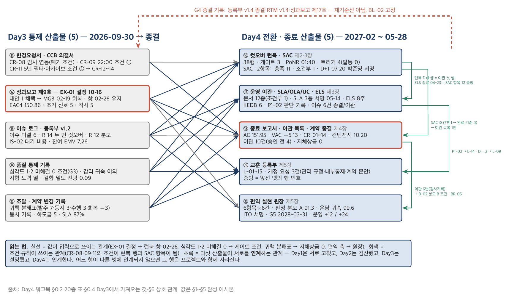

*그림 0-1. Day3 통제 산출물 5종에서 Day4 전환·종료 산출물 5종으로 흐르는 입력 관계와, 다섯 산출물이 서로를 인계하는 사슬. 런북이 시작이고 편익 원장이 끝이다. 되돌아가는 파선은 Day1~Day3 문서의 종결 기록이며 재기준선이 아니다.*

---

# 제1장 전환과 종료란 무엇인가 — 오픈은 이벤트가 아니라 이관이다

## 1.1 프로젝트의 끝과 서비스의 시작이 같은 날이 아닌 이유 — 세 개의 시계

### 개념

프로젝트에는 끝이 있고 서비스에는 없다. 이 당연한 문장이 실무에서 문제가 되는 것은 두 조직이 **다른 시계**를 보기 때문이다. 프로젝트 조직의 시계는 마일스톤으로 간다 — G3, 컷오버, G4. 운영 조직의 시계는 월로 간다 — 이번 달 가용성, 이번 달 인시던트, 이번 달 CAB. 그리고 편익의 시계는 그보다 느리게 간다 — M+12, M+24, G5. 오픈은 세 시계가 한 점에서 만나는 순간처럼 보이지만 실제로는 프로젝트 시계의 마지막 마일스톤 하나와 운영 시계의 첫 달이 겹치는 것뿐이고, 편익 시계는 그 시점에 아직 시작하지도 않았다.

온담 P1으로 말하면 이렇다. 오픈은 2027-02-28(일) 06:00이다. 프로젝트는 그 뒤로도 석 달을 더 산다 — 2차 컷오버 03-27, ELS 종료 04-23, 운영 이관 착수 04-26, R5 릴리스 05-07, 감리 G4 05-14, SAC 판정 05-21, 계약 종결 05-26, **G4 05-28**. 운영은 오픈 다음 날 07:20에 박준영 서비스운영팀장이 ELS 착수 서명을 한 순간부터 시작되었고, 편익은 첫 측정(B-08 리드타임 2027-04, 13.6시간)이 있었을 뿐 판정은 G5 2028-03-31이다. 세 시계 사이의 시차를 문서로 채우는 것이 전환·종료 단계의 일이며, 다섯 산출물은 각각 그 시차의 한 구간을 맡는다 — 런북은 오픈 전후 34시간, ELS와 이관 체크리스트는 오픈에서 G4까지 13주, 종료 보고서는 G4 하루, 교훈 등록부와 편익 원장은 G4 이후의 시간이다.

"오픈은 이벤트가 아니라 이관이다"라는 이 장의 부제는 그래서 정의의 문제다. 이벤트는 한 시각에 일어나고 끝난다. 이관(handover)은 **주는 쪽과 받는 쪽이 있고, 받는 쪽이 받았다고 서명해야 끝난다.** 컷오버 런북의 마지막 행이 "06:00 오픈"이 아니라 "D+1 07:00 판정 회의 → ELS 착수 인계 → 박준영 서명 07:20"인 이유가 그것이다. 서명이 없는 오픈은 프로젝트가 자기 손에서 시스템을 놓은 사건이지, 운영이 그것을 받은 사건이 아니다.

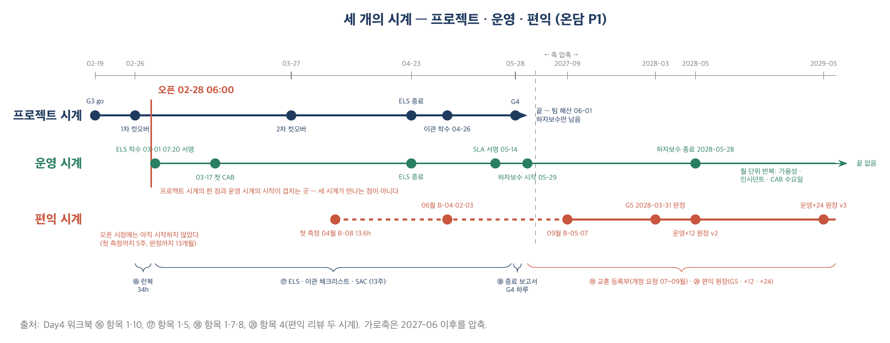

*그림 1-1. 세 개의 시계 — 프로젝트·운영·편익. 오픈은 프로젝트 시계의 마지막 마일스톤 하나와 운영 시계의 첫 달이 겹치는 곳이고, 편익 시계는 그 시점에 아직 시작하지 않았다. 다섯 산출물은 각각 시차의 한 구간을 맡는다.*

### 온담의 사례로 읽기

> ■ **사례 사실** — 2019 스마트오더(34억, 8개월 중단, 종료 보고서 중단 사유 세 줄)와 2022 WMS 고도화(12억, 범위 63% 축소)는 사례 §6.5·§1.2; P1의 세 시계 — G4 2027-05-29(프로젝트), ELS 8주 2027-03-01~04-23(운영), G5 2028-03-31(편익)은 사례 §3.4·§2.4와 Day4 워크북 §0.3.

온담에는 세 시계가 어긋난 채로 끝난 프로젝트가 둘 있다. 2019년 스마트오더는 8개월 만에 중단되었고 종료 보고서에 중단 사유가 세 줄 적혀 있다 — 프로젝트 시계만 있고 운영·편익 시계가 없었다. 2022년 WMS 고도화는 범위가 63% 줄었고 범위 축소 결정 회의록의 물류본부장 서명란이 비어 있다 — 받는 쪽의 서명이 없는 이관이었다. 2020년과 2023년 내부감사가 두 건에 대해 지적한 것("편익 산정 근거 부재", "손실 확정 절차 부재", "위탁 산출물 형상관리·소스 인수 절차 미비")은 모두 **세 시계 중 하나가 문서에 없었다**는 지적으로 읽을 수 있다. 회사 정본 §6.5의 네 질문 — 매장 직원의 "이번엔 없어지지 않느냐", 가맹점주의 "또 우리에게 일을 얹느냐", CFO의 "이번엔 근거가 있느냐", 내부감사의 "이번엔 절차가 있느냐" — 에 대한 답이 오늘의 다섯 문서다.

P1은 그 답을 헌장 v1.1 §14에 미리 적어 두었다. 정상 종료의 완료 기준 다섯 — ① SAC 미해소 0건 또는 해소 기한·책임자 서명된 목록, ② 소스·형상 발주사 인수 100%, ③ 인터페이스 47본 설계문서 인수, ④ 컷오버 후 3개월 가용성 99.5%, ⑤ 종료 보고서·교훈 기록 제출. 이 다섯 중 셋(①·②·③)은 운영 시계의 인수 조건이고 하나(④)는 운영 시계의 첫 3개월 성과이며 하나(⑤)만 프로젝트 시계의 산출물이다. 즉 P1의 종료 조건은 처음부터 **운영이 받았는가**로 정의되어 있었고, 그래서 G4 판정에 박준영(SAC)과 박세연(형상)의 판정이 정미란의 승인보다 먼저 온다.

### 실무에서 어떻게 틀리는가

**오픈일을 종료일로 적는다.** 헌장의 종료일이 컷오버일이고, 컷오버 다음 날 PM은 다른 프로젝트로 간다. 하이퍼케어는 수행사 인력이 "알아서" 남는 기간이 되고, 언제 빠져도 되는지를 아무도 결정하지 못해 하자보수가 상주로 변한다. P1은 헌장이 G4를 컷오버 3개월 뒤(05-28)로 두었고, 그 사이에 ELS 종료 기준(2주 연속 P1 0·P2 ≤ 2·오류율 ≤ 0.5%·콜 ≤ 480·심각도 2 backlog 0)이 있었다.

**편익 시계를 프로젝트 시계에 맞춘다.** 종료 보고서에 "편익 118억 달성 예정"을 적고 끝낸다. 편익은 정의상 프로젝트 종료 후에 발생하므로, 종료 시점에 소유권이 상설 조직으로 이전되지 않으면 측정 자체가 불가능하다. P1의 종료 보고서는 편익 축을 "미판정 — ⑳ 원장으로 이관"이라고 적는다. 그것이 정직한 문장이다.

**운영 시계를 프로젝트가 대신 본다.** SAC를 프로젝트가 채점한다. 프로젝트가 자기 인수 기준을 판정하면 그것은 인수가 아니라 자기 평가다(3.2절).

---

## 1.2 표준에서는 — PMBOK 8판 Closing Focus Area, PRINCE2 7 Closing a Project의 5활동, ISO 21502 §7 (심화)

### PMBOK 8판 — Closing Focus Area와 세 성과영역

PMBOK Guide 8판(2025)은 종료를 하나의 Focus Area로 둔다. 그 안에 배치된 활동은 인도물 이전(transition of deliverables), 계약 종결, 재무 정산, 팀 해산, 기록 보관, 성과 평가, 교훈·지식 이전, 편익 실현 계획의 이전이다. 6판의 4.7 Close Project or Phase가 "최종 산출물 이전"을 한 프로세스 안에 두었던 것과 달리, 8판은 계약 종결과 재무 정산을 Closing 안에 명시적으로 포함하고(6판에서는 12.3 Control Procurements 안에 있었다), **운영 준비도(operational readiness)**를 종료의 조건으로 적는다. 성과영역 중 셋이 종료와 직접 관계한다 — Governance(종료 승인·편익 책임), Stakeholders(운영 조직·사용자 채택), Delivery(인도물의 인수). 사내 표준이 6판이면 6판 번호(4.7, 12.3)로 인용하되 8판 명칭을 병기한다.

8판이 종료에서 강조하는 것 중 실무적으로 가장 무거운 것은 "편익 실현 계획을 프로젝트 후 조직(운영·PMO)에 이전한다"는 문장이다. 편익 관리 계획(benefits management plan)은 6판 1.2.6.2에도 있었지만 "누구에게 넘기는가"가 없었다. 8판은 넘긴다고 쓴다. 온담 편익 원장의 "소유 재무본부(재경팀장) — P1 종료 후 정본 관리자" 한 줄이 그 문장의 실행이다.

### PRINCE2 7 — Closing a Project의 5활동과 네 산출물

PRINCE2 7(2023)의 Closing a Project 프로세스는 다섯 활동이다. **Prepare planned closure**(계획된 종료 준비 — 완료 기준 대비 확인, 산출물 상태 확인), **Prepare premature closure**(조기 종료 준비 — 중단 시 인계 가능한 것의 확보와 손실 확정), **Hand over products**(산출물 인계 — 운영·유지보수 조직의 공식 수용, 편익 리뷰 계획의 인계), **Evaluate the project**(프로젝트 평가 — PID 대비 성과, 교훈), **Recommend project closure**(종료 권고 — 프로젝트 이사회의 승인 요청). 산출물은 넷이다 — **End Project Report**(종료 보고서: PID 대비 성과·편익 리뷰 계획·교훈·후속 조치 권고 포함), **Lessons Report**(교훈 보고서: Lessons log에서 정리), **Benefits Management Approach**(편익 관리 방식: 갱신본을 인계), **Follow-on Action Recommendations**(후속 조치 권고: 미해결 사항·미완 작업·잔여 리스크의 이관 목록). 오늘의 다섯 산출물 중 넷(⑱·⑲·⑳과 ⑯·⑰의 인수 기록)이 이 네 산출물에 거의 그대로 대응한다.

PRINCE2가 종료에서 주는 규율 두 가지를 기억하라. 첫째, **인수(acceptance)는 운영·유지보수 조직의 공식 수용**이며 프로젝트 관리자의 선언이 아니다. 둘째, **premature closure는 정규 활동**이다. 중단은 실패가 아니라 종료의 한 종류이고, 중단에도 인계·평가·권고가 있다. 헌장 §14가 중단 조건(편익 전망 손익분기 66% 미만, 컷오버 창 2회 연속 이탈)과 손실 확정 절차(재경팀장 30일 내 산정)를 적어 둔 것은 2020년 지적("손실 확정 절차 부재")에 대한 답이자 premature closure 활동의 사전 정의다. P1에서는 발동하지 않았지만, 발동하지 않았다는 기록 자체가 종료 보고서에 있다(프리모템 F3 대조).

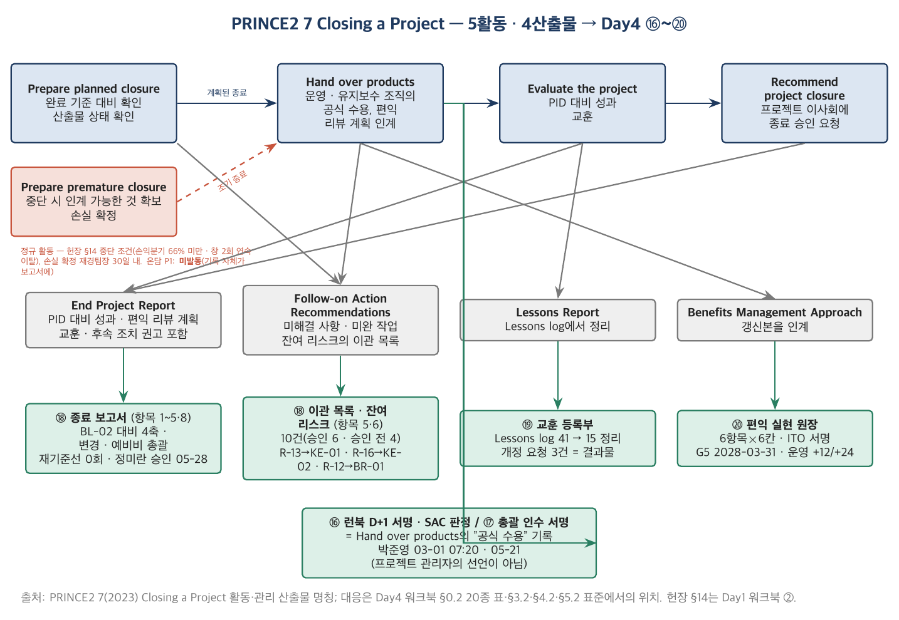

*그림 1-2. PRINCE2 7 Closing a Project의 5활동과 4 산출물, 그리고 Day4 산출물 ⑯~⑳의 대응. premature closure는 예외 경로가 아니라 정규 활동이며, P1에서는 발동하지 않았다는 기록이 남는다.*

### ISO 21502:2020 §7 — 계약이 중립적으로 인용하는 조항

ISO 21502는 §7에 프로젝트·단계 종료와 편익 관리 관련 조항을 둔다. 원문 대조를 전제로 말하면, 종료에서 요구하는 것은 종료 조건의 확인, 산출물의 인계, 계약 종결, 기록의 보관, 교훈의 식별, 그리고 편익의 실현·유지에 대한 책임의 명시다. ISO 21502가 PMBOK·PRINCE2보다 실무적으로 중요한 순간은 계약서가 "ISO 21502에 따른 프로젝트 관리"를 인용할 때이며, 그때 종료 조항은 검수 조건의 해석 근거가 된다. 조항 번호는 인쇄 전 원문 대조를 권한다.

### 실무에서 어떻게 틀리는가

**표준의 산출물 이름을 문서의 목차로 쓴다.** "End Project Report" 목차를 그대로 옮기고 각 절에 한 문단씩 채운다. 표준은 무엇이 있어야 하는가를 말하지 그 값이 어디서 오는가를 말하지 않는다. 종료 보고서의 모든 숫자는 월별 성과보고·변경 로그·등록부의 어느 행에서 왔는지가 추적되어야 하고, 추적되지 않는 숫자는 종료 시점에 만들어진 숫자다(4.1절).

**premature closure를 실패 처리 절차로 읽는다.** 그래서 중단 조건을 헌장에 적지 않고, 중단이 오면 세 줄로 끝낸다. 2019년이 그랬다.

---

## 1.3 임시조직의 끝 — Lundin & Söderholm의 제도화된 종료, Staw의 중단 결정자 (심화)

### 개념

Day1 1.3절에서 빌린 Lundin & Söderholm(1995)의 임시조직 이론은 네 구조 개념(시간·과업·팀·전환)과 네 행위 개념(행위 기반 기업가정신·몰입 형성을 위한 단편화·계획된 고립·**제도화된 종료**)으로 프로젝트를 설명했다. 오늘은 그중 둘을 회수한다.

**전환(Transition)** — 임시조직은 무엇인가를 이전 상태에서 이후 상태로 바꾸기 위해 존재한다. 그 "이후 상태"는 임시조직의 것이 아니라 영구조직의 것이다. OD-POS 2.1에서 신 플랫폼으로의 전환은 P1이 하지만, 전환된 상태에서 사는 것은 서비스운영팀·매장·물류센터다. 그래서 전환의 완료를 판정하는 것은 임시조직이 아니라 영구조직이어야 하고, SAC의 판정권이 박준영에게 있는 것은 이론의 귀결이다.

**제도화된 종료(institutionalized termination)** — 임시조직의 끝은 제도로 정해져 있다. 종료 보고서, 해산, 인력의 복귀. Lundin & Söderholm이 이 개념으로 설명한 실무 현상은 둘이다. 종료 직전의 인력 이탈(끝이 보이면 팀원은 다음 자리를 찾는다 — 온담 IS-11 개발자 이탈, IS-04 슈퍼유저 이탈이 그 형태다)과 **교훈의 실패**(임시조직이 해산하면 그 조직이 배운 것도 해산한다). 교훈이 조직에 남으려면 임시조직이 사라지기 전에 영구조직의 제도(규정·양식·계약 문안)로 옮겨져야 하며, 5.1절의 Williams(2008)와 Syllk가 그 조건을 실증한다.

**Staw(1976)의 회수.** Day3 6.6절에서 계속 투자(escalation of commitment)의 처방으로 "착수 결정자와 중단 결정자를 분리하라"를 빌렸다. 종료에서 이 처방은 두 방향으로 작동한다. 중단의 종료에서는 self-justification이 중단을 늦추므로 착수 결정자(김선호·프로그램 이사회)가 아닌 판정자(재경팀장의 손실 확정, 프리모템 F3의 사전 조건)가 있어야 한다. 정상 종료에서는 반대 방향 — 착수 결정자는 "잘 끝났다"를 선언하고 싶어 하므로, 잘 끝났는지의 판정을 착수 결정자가 아닌 인수자(박준영·박세연)와 판정자(재무본부의 편익 판정)에게 둔다. "끝났다고 선언하는 사람과 받았다고 서명하는 사람이 달라야 한다"는 워크북 §3.1의 문장은 Staw의 처방을 종료에 옮긴 것이다.

### 온담의 사례로 읽기

> ■ **사례 사실** — 팀 해산의 사람별 일자(발주사 14명 중 12명 06-01 복귀·2명 P5 전환, 수행사 05-31 철수, PMO 3명 배치)는 [추가 설정] — Day4 워크북 §3.5 항목 8; 발주사 14명·PMO 3명은 사례 §3.5·P-29.

P1의 팀 해산은 사람별 일자로 적혀 있다 — 발주사 14명 중 12명 06-01 원 소속 복귀, 2명 P5 전환, 수행사 05-31 철수·하자보수 대기 4명 비상주, P1 PMO 3명 중 2명 프로그램 PMO(P2 지원)·1명 하자보수기 잔류(승인 전), P1 PM 06-01 프로그램 PMO. 이것이 "제도화된 종료"의 실무 형태다. 해산을 "06-01 해산"으로만 적으면 6월 첫 주의 하자 문의는 아무에게도 가지 않는다. 발주사 14명이 겸임이었다는 사실(R-05의 원인)은 종료에서 반대로 작동한다 — 겸임이었기 때문에 돌아갈 자리가 있고, 그 자리에서 하자보수기의 "누가 답하는가"가 정해진다.

그리고 OD-POS 2.1의 종료 세션(03-19)이 있다. 박세연 CIO(2011년 원 설계자)가 주관해 15년 운영 기록을 아카이브하고 개발자를 초청했다. "없어진 시스템"이 아니라 "임무를 마친 시스템"으로 — 이것은 감상이 아니라 Bridges(1991)의 "끝냄(ending)" 처리이며(3.9절), 강윤지 후임 지역매니저의 "이번엔 없어지지 않는 건가요"에 대한 답의 한 형태다. 임시조직의 끝을 제도화하는 것은 문서만이 아니라 의례도 포함한다.

### 실무에서 어떻게 틀리는가

**해산을 날짜 하나로 적는다.** "05-31 프로젝트 해산." 하자보수 창구·잔류 인력·복귀 인력의 다음 소속이 없다.

**교훈을 임시조직 안에서만 나눈다.** 회고 워크숍을 하고 팀이 흩어진다. 5.1절.

---

## 1.4 분야별 대조 — EPC의 MC/PAC/FAC, SI의 검수·정산·유보금·하자보수, NPD의 양산 이관, 제약의 DB lock (심화)

전환·종료의 구조는 분야마다 이름이 다르지만 뼈대는 같다 — **단계적 증명서, 하자 목록, 성능 확인, 보증 기간, 그리고 받는 쪽의 서명.**

**건설·EPC.** 기계적 준공(Mechanical Completion, MC) → 시운전(commissioning) → 성능 시험(performance test) → 임시 인수(Provisional Acceptance Certificate, PAC) → 하자담보 기간(Defects Liability Period) → 최종 인수(Final Acceptance Certificate, FAC). 각 단계에 계약상 증명서가 붙고, 하자 목록(punch list)은 A(인수 전 필수)·B(인수 후 기한 내)·C(경미)로 등급을 나눈다. SAC에 해당하는 것은 PAC의 조건 목록이고, 미해결 사항 이관 목록에 해당하는 것은 punch list B·C이며, 성능 보증치(가동률·처리량)가 SLA에 해당한다. EPC가 SI에 주는 교훈은 **"조건부 인수"가 정규 장치**라는 점이다 — punch list B가 있는 채로 PAC를 발급하며, 그 목록에 기한과 책임자가 붙는다. 헌장 §14 ①의 "또는 해소 기한·책임자 서명된 목록"이 그것이다.

**SI.** 검수(릴리스별·최종) → 잔금 → 유보금(retention, 통상 계약액의 일정 비율) 또는 하자보수보증증권 → 하자보수 기간(통상 1년) → 유지보수 계약(별도). 지체상금은 기준선 완료일 대비 지연 일수로 산정되므로 Day3의 귀책 분해표가 매월 누적되어 있어야 종료 보고서의 한 줄이 된다. SI가 EPC와 다른 점은 컷오버가 데이터 전환·인터페이스 전환·단말 배포의 세 갈래로 동시에 일어나고, point of no return이 성능 시험이 아니라 **데이터 정본 전환 시각**에 있다는 것이다(2.3절).

**제조 NPD.** 양산 이관(production ramp-up)이 컷오버이고, 파일럿 런의 수율·불량률이 go 조건이며, 롤백은 구 라인 유지다. 인수 문서는 SOP(표준 작업 절차)와 Run@Rate(목표 생산 속도에서의 품질·처리량 확인)이고, ELS에 해당하는 것은 양산 초기 수율 안정화 기간, SLA에 해당하는 것은 품질 목표(ppm)와 공급 리드타임, UC는 협력사 품질 보증 협약이다. 미해결 사항은 설계 변경 잔여(ECN backlog)로 남는다.

**제약·임상.** 임상시험의 종료는 database lock(이후 데이터 수정 불가)이며 그 전에 데이터 실사와 쿼리 해소가 끝나야 한다. DB lock이 point of no return이고, 제약이 주는 교훈은 **"되돌릴 수 없는 시각"을 규제가 명시적으로 정의한다**는 점이다 — SI의 PoNR이 대개 암묵적인 것과 대비된다.

### 실무에서 어떻게 틀리는가

**다른 분야의 어휘를 그대로 가져온다.** SI 계약에 "FAC"를 쓰거나 EPC 계약에 "하자보수"를 쓴다. 어휘가 아니라 구조를 빌려야 한다 — 조건부 인수의 정규화(EPC), PoNR의 명시적 정의(제약), go 조건의 수율 숫자화(NPD).

---

## 1.5 실무에서 어떻게 틀리는가 — 오픈 = 종료, 보고서 없는 해산, 소리 없이 소멸하는 미해결 사항

이 장의 세 오류는 세 문서의 부재로 요약된다.

**오픈을 종료로 착각한다 — SAC의 부재.** 오픈 다음 날 아침 서비스데스크가 "우리는 아직 인수한 적 없다"고 말하는 프로젝트는 런북만 있고 SAC가 없는 프로젝트다. 박준영 팀장이 Day1부터 "문서와 SLA 없이는 인수하지 않는다"고 말해 온 것은 협박이 아니라 SAC의 목차였고, 그 목차가 G1(2026-04-24)에 초안으로 합의되어 월 1회 검토를 아홉 번 거쳤기 때문에 G3 사전 점검(01-28)에서 12항목 중 7항목 미해소가 **미리** 드러났다. 사전 점검이 없었다면 그 7항목은 G4에서 처음 드러났을 것이고, Day1 프리모템 F 시나리오 12번("SAC 미해소 23건으로 인수 거부, 5개월 하자보수 체제")이 되었을 것이다.

**종료 보고서 없이 팀을 해산한다 — 증명의 부재.** 2019년 스마트오더의 세 줄이 이것이다. 종료 보고서는 프로젝트의 마지막 문서가 아니라 **내부감사의 첫 문서**다. 윤태호 내부감사팀장이 서면으로 질의한 것("편익 산정 근거와 컨틴전시 집행 승인 근거를 문서로 제출하십시오")에 대한 답이 종료 보고서 항목 4(컨틴전시 총괄 — 집행 결재와 CCB 보고 이력)와 ⑳ 원장이다. 종료 보고서가 없으면 그 질의는 해산한 팀의 누군가가 3년 뒤 이메일 아카이브를 뒤져 답한다.

**미해결 사항이 아무도 모르게 소멸한다 — 이관 목록의 부재.** 프로젝트가 끝나도 끝나지 않은 것이 반드시 있다 — 승인 대기 중인 절차, 협의 중인 계약, 범위 밖이라 하지 않은 것. 이것을 종료 보고서에 적지 않으면 소멸하고, 적되 소유자를 "영업본부"로 적으면 역시 소멸한다. 소유자 실명·기한·승인 여부의 세 칸이 있어야 이관이다(4.5절). P1의 목록 10건 중 "승인 전" 4건은 종료 보고서에서 가장 짧은 줄들이지만 가장 오래 남는 줄들이다.

세 오류의 공통점은 Day3 1.5절과 같다 — 기록의 부재이고, 기록은 양식의 문제다. 다만 종료에서 양식의 부재는 프로젝트 안에서 발견되지 않는다. 프로젝트가 사라진 뒤 운영 조직·내부감사·다음 PM이 발견한다.

---

## 제1장 핵심 정리

> **한 줄씩 — 수업 직전 5분 복습용**
> 1. 프로젝트·운영·편익은 다른 시계를 본다 — 오픈은 프로젝트 시계의 마지막 눈금일 뿐이다.
> 2. 오픈은 이벤트가 아니라 이관이다 — 받는 쪽이 받았다고 서명해야 끝난다.
> 3. 표준의 종료 활동은 인도물 이전·계약 종결·정산·해산·기록·교훈·편익 계획 이전 — 이름만 다르다.
> 4. 임시조직의 끝은 제도화해야 한다 — 끝났다고 선언하는 사람과 받았다고 서명하는 사람이 달라야 한다.
> 5. 분야마다 이름은 다르지만 뼈대는 같다 — 단계적 증명서, 하자 목록, 보증 기간, 받는 쪽의 서명.
>
> 아래는 같은 내용의 자세한 판이다.

1. 프로젝트·운영·편익은 다른 시계를 본다. 오픈은 세 시계가 만나는 점이 아니라 프로젝트 시계의 마지막 마일스톤 하나와 운영 시계의 첫 달이 겹치는 곳이며, 편익 시계는 그때 아직 시작하지 않았다. 다섯 산출물은 각각 시차의 한 구간을 맡는다.
2. 오픈은 이벤트가 아니라 이관이다 — 주는 쪽과 받는 쪽이 있고 받는 쪽이 받았다고 서명해야 끝난다. P1 헌장 §14의 완료 기준 다섯 중 넷은 "운영이 받았는가"로 정의되어 있다.
3. PMBOK 8판은 Closing Focus Area에 인도물 이전·계약 종결·재무 정산·팀 해산·기록·교훈·편익 계획 이전을 두고 운영 준비도를 종료 조건으로 적는다. PRINCE2 7 Closing a Project는 5활동(planned closure·premature closure·hand over·evaluate·recommend)과 4 산출물(End Project Report·Lessons Report·Benefits Management Approach·Follow-on Action Recommendations)이며, premature closure는 정규 활동이다.
4. 임시조직의 끝은 제도화되어야 한다(Lundin & Söderholm). 끝났다고 선언하는 사람과 받았다고 서명하는 사람은 달라야 한다(Staw의 처방을 종료에 옮긴 것). 해산은 사람별 일자로 적는다.
5. 분야마다 이름은 다르지만 뼈대는 같다 — 단계적 증명서, 하자 목록, 성능 확인, 보증 기간, 받는 쪽의 서명. 세 오류(오픈 = 종료, 보고서 없는 해산, 소멸하는 미해결 사항)는 SAC·종료 보고서·이관 목록의 부재이며, 종료에서 양식의 부재는 프로젝트가 사라진 뒤에 발견된다.

## 생각해 볼 질문

1. 여러분 회사의 최근 시스템 오픈에서 "운영이 받았다"는 서명은 누가 언제 했는가. 서명이 없었다면 하이퍼케어의 수행사 인력은 어떤 기준으로 철수했는가.
2. 헌장의 종료일이 컷오버일인 프로젝트와 컷오버 + 3개월인 프로젝트에서 PM의 마지막 한 달은 어떻게 다른가. 어느 쪽이 유지보수 계약 협상에 유리한가.
3. 조기 종료(중단)의 절차가 헌장에 적혀 있는 프로젝트를 본 적이 있는가. 없다면 중단이 왔을 때 손실은 누가 얼마로 확정했는가.
4. 임시조직이 해산하면서 배운 것도 함께 해산한다면, 여러분 조직에서 임시조직의 학습이 영구조직으로 옮겨진 실제 사례는 무엇인가 — 규정·양식·계약 문안 중 어느 것이 바뀌었는가.
5. EPC의 punch list B(인수 후 기한 내 해소)처럼 "조건부 인수"가 정규 장치인 조직과, "인수 = 완벽"을 요구하는 조직 중 어느 쪽의 인수가 더 늦어지는가. 왜인가.

## 워크북 연결

이 장은 워크북 §0(사용법·20종 마스터 표·온담 2027-05-28 상태·Day3에서 가져오는 것)과 다섯 산출물 모두의 X.1·X.2에 대응한다. 워크북 §0.1의 규칙 2("오늘의 다섯 산출물은 모두 프로젝트가 아닌 것을 향해 쓴다 — 인수자 서명 칸")와 규칙 3("시점이 둘이다 — 계획 / 실적 열을 분리하라")이 이 장의 세 시계이고, §0.3의 시간순 요약이 1.1절의 프로젝트 시계다. 각 산출물의 X.2 표준 위치 표에서 PMBOK 8판 Closing Focus Area·성과영역과 6판 프로세스 번호(4.7·12.3), PRINCE2 7 활동·산출물, ISO 21502 조항, ITIL practice를 대조하라. 분야별 대조(1.4절)는 각 X.1의 마지막 문단에 있다.

---

# 제2장 컷오버 — 되돌릴 수 없는 시각을 정하는 기술

## 2.1 런북의 구조 — T−24h에서 T+24h까지, 확인 열은 관측값으로

### 개념

컷오버 런북(cutover runbook)은 "시스템을 바꾸는 n시간 동안 누가 몇 시에 무엇을 하고, 무엇을 확인하면 다음으로 가고, 무엇이 보이면 되돌리는가"를 분 단위로 적은 문서다. 프로젝트 문서 중 유일하게 **시각(時刻)**이 주어인 문서이며, 그래서 시각의 기준(T0)을 먼저 정한다. T0는 창의 시작이고, 그 전의 준비는 T−, 그 후의 작업은 T+로 적는다. 런북의 열은 여덟이다 — 순번, T, 계획 시각, 갈래(데이터 D·인터페이스 I·매장 S·통제 C), 작업, 담당(실명), **확인(관측값·기준)**, 롤백 판단점(★, 비용), 그리고 **실행 기록**. 마지막 두 열이 런북을 일정표와 구별한다. 확인 열은 "정상 확인"이 아니라 관측 가능한 값 — 건수·해시·응답 코드·성공률 — 이어야 하고, 실행 기록 열은 계획 시각 옆에 실제 시각을 적는 자리다.

런북에 T−24h와 T+24h가 있는 이유는 컷오버가 창 안에서만 일어나지 않기 때문이다. 창 전날의 최종 상태 점검(G3 이후 변화가 없는가), 전 백업, 컨트롤룸 개설, 배포 큐 적재, 외부 조직 통보가 T−이고, 오픈 다음 날의 하이퍼케어 1일차 지표와 D+1 판정 회의가 T+다. 런북의 첫 행이 "T0 20:00 거래 정지"라면 그 전의 스무 가지 준비는 누군가의 머릿속에 있는 것이고, 마지막 행이 "06:00 오픈"이라면 오픈 다음 날의 첫 인시던트는 누구에게 가는지 정해지지 않은 것이다.

갈래(track)를 나누는 것은 병렬 작업을 시각표 위에서 보이게 하기 위해서다. 온담 1차 컷오버에서 데이터 갈래(마스터 전환 → 검증 1차 → PoNR → 이력 적재 → 검증 2차)와 인터페이스 갈래(구 연결 차단 → 신 연결 전환 → 47본 시험)와 매장 갈래(오프라인 모드 → 펌웨어 배포 → 스모크 → 온라인 전환)는 서로 다른 사람이 서로 다른 시각에 하는 일이며, 통제 갈래(게이트·교대·보고)가 셋을 묶는다. 갈래가 없으면 런북은 한 사람이 순서대로 하는 일의 목록이 되고, 새벽 3시에 "지금 인터페이스 팀은 뭘 하고 있어야 하나"를 아무도 답하지 못한다.

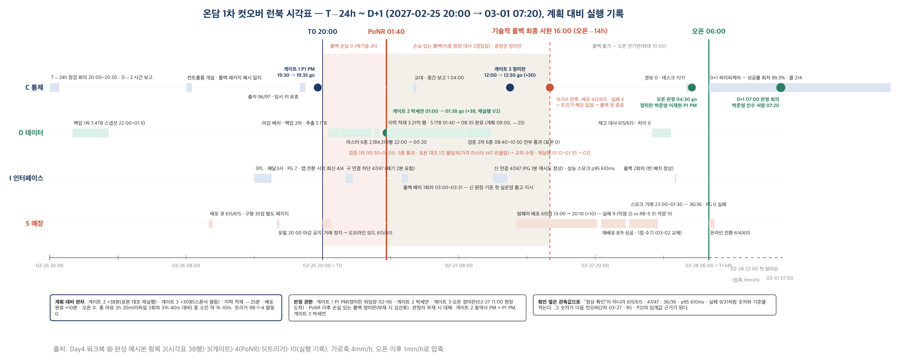

*그림 2-1. 온담 1차 컷오버 런북의 시각표 — T−24h에서 D+1까지, 네 갈래와 세 게이트·PoNR·기술적 롤백 최종 시한. 계획 시각 옆의 괄호가 실행 기록이며, 여유 2h 20m 중 1h 10m을 소진했다.*

### 온담의 사례로 읽기

> ■ **사례 사실** — 컷오버 창 2027-02-26(금) 20:00부터 34시간(사례 §3.4, P-35), 헌장 §7의 허용범위 0(Day1 워크북 §2.5); 런북 38행·버전 v1.0(02-05)→v1.1(02-25)·리허설 3회차 실측은 [추가 설정] — Day4 워크북 §0.3·§1.5 항목 2.

온담 1차 컷오버 런북은 38행이다. T0 = 2027-02-26(금) 20:00, 창 34시간(P-35), 헌장 §7의 컷오버 창이며 허용범위 0. 버전은 v1.0(02-05, 리허설 3회차 01-22 실측 반영, G3 자료 첨부) → v1.1(02-25, D−2 사건으로 게이트 1 조건에 "임시 라이선스 유효" 추가). 컨트롤룸은 본사 7층 대회의실, 수행사 워룸 6층 20명, 이천센터 상황실(한동석 대리, 폴백 배치 확인). 인력 82명 전원 + 서비스데스크 11 + 지역매니저 4 = 97명. 역할은 실명이다 — 통제관 P1 PM, 데이터 박세연(게이트 2 판정)·전환 용역사 PM, 롤백 이재현, 운영 인수 박준영·서비스데스크 리더, 규제 최영주(원격), 기록 P1 PMO 기준선 담당, 재무 재경팀장(원격, 결제 대사).

38행 중 몇 행을 읽어 보자. 행 1(T−24h, 02-25 20:00): 최종 상태 점검 회의 — 확인 열은 "신규 심각도 1·2 = 0, 변경 동결(CAB 잠금 02-20~03-12) 확인"이고, 실행 기록은 "20:00~20:50, 변화 없음. D−2 라이선스 사건 보고". 행 11(T+1.5h, 21:30): 최종 백업 2차 + 전환 대상 추출(5년 필터, 5.1TB) — 확인 열 "추출 행 수 = 리허설 3회차 ±0.5%", 실행 기록 "행 수 +0.2%(2월 거래 증가분)". 행 21(T+13h, 09:00): 이력 적재 완료 예정 — 실행 기록 "**08:35 완료**(6h 55m, 리허설 +5분)". 행 29(T+24h, 20:00): 배포 1차 결과 집계 — 확인 열 "실패 ≤ 31점(5%)·직영 ≤ 10점(RB-3)", 실행 기록 "20:10 완료, 실패 9점(직영 2·가맹 7, 구형 기종 5 포함) — RB-3 미발동". 행 38(D+1, 03-01 07:00): D+1 영업일 판정 회의 → ELS 착수 인계 — 실행 기록 "**박준영 인수 서명 07:20**".

계획 대비 편차의 총계: 게이트 2 +38분, 게이트 3 +30분, 이력 적재 −25분, 배포 완료 +10분, 오픈 0. 여유 2h 20m(계획 34h − 리허설 3회차 31h 40m) 중 소진 1h 10m(편차 합 53분 + 교대·보고 지연 17분). 이 숫자가 다음 컷오버(2차 03-27, 향후 R5·P2)의 런북이 이번 런북을 베낄 수 있게 하는 것이다. 계획 시각과 실제 시각이 한 칸에 섞여 있으면 다음 런북은 이번 것을 베낄 수 없다.

### 실무에서 어떻게 틀리는가

**확인 열이 "정상 확인"이다.** 새벽 2시의 "정상"은 판단이지 관측이 아니다. 관측값(건수·해시·응답·성공률)이 있으면 판단은 비교가 되고, 비교는 피로한 사람도 할 수 있다.

**실행 기록 열이 없다.** 컷오버가 끝나면 런북은 버려지고, 다음 컷오버는 "지난번에 대충 30시간 걸렸다"에서 시작한다.

**T−가 없다.** 창 전날의 스무 가지 준비가 담당자의 체크리스트에만 있다. 그 담당자가 병가를 내면 창 시작 전에 이미 늦는다. 온담에서 T−24h~T−0.5h의 여덟 행 중 하나(행 7, 임시 라이선스 유효 확인)는 D−2 사건이 없었다면 런북에 없었을 행이다.

---

## 2.2 go/no-go 게이트와 판정자 — 되돌리는 비용이 다른 세 지점

### 개념

go/no-go 게이트는 "여기서 멈출 것인가 계속할 것인가"를 조건표로 판정하는 지점이다. 게이트가 어디에 서야 하는지를 정하는 원칙은 하나다 — **되돌리는 비용이 달라지는 곳에 선다.** 컷오버에는 그런 지점이 대개 셋이다. 착수 전(비용 0 — 착수를 안 하면 된다), 데이터 정본 전환 전(비용 = 시간 — 구 시스템 재기동이면 되고 손실은 없다), 매장·사용자 배포 전(비용 = 돈과 영업일 — 배포된 것을 걷어 들여야 한다). 그리고 마지막에 오픈 판정이 있다.

게이트의 세 요소는 **조건·판정자·시간 한도**다. 조건은 관측 가능한 값으로 미리 적혀 있어야 한다("전부 충족"이 원칙이며 재실행 허용 횟수도 조건의 일부다). 판정자는 게이트마다 다를 수 있고 달라야 한다 — 게이트의 성격(데이터 문제인가, 돈과 매장의 문제인가)에 따라 판정할 자격이 있는 사람이 다르기 때문이다. 시간 한도는 "미충족 시 언제까지 재시도하고 그 뒤에는 무엇을 하는가"이며, 이것이 없으면 게이트는 "될 때까지"가 된다. 판정 당일에 조건을 정하는 게이트는 게이트가 아니라 회의다.

판정자 배치의 원칙은 워크북 §1.6 해설의 한 문장에 있다. **세 게이트를 모두 스폰서에게 맡기면 새벽 1시의 게이트 2는 "스폰서 깨우기 vs 그냥 진행"의 선택이 되고, 대개 후자가 된다.** 게이트 2가 데이터의 문제이면 CIO가, 게이트 3이 돈과 매장의 문제이면 스폰서가 판정한다. 판정자가 부재할 때의 대체자도 미리 적는다(위임장의 날짜까지).

### 온담의 사례로 읽기

> ■ **사례 사실** — 게이트 3개의 계획·실제 시각, 판정자, 게이트 2 표본 대조 재실행 +38분, 게이트 3 스폰서 열람 +30분은 [추가 설정] — Day4 워크북 §1.5 항목 3; 판정권 — SAC 박준영(사례 §4.2), 스폰서 정미란(§4.1).

| 게이트 | 계획 / 실제 | 조건 | 판정자 | 미충족 시 |
|---|---|---|---|---|
| 1 착수 | 02-26 19:30 / 19:35 | 인력 97명 출석(핵심 12명 전원), 백업 1차 해시 일치, **임시 라이선스 유효(만료 03-26 > 정식 03-05)**, 매장 통보·오프라인 안내 완료, G3 이후 신규 심각도 1·2 결함 0·CAB 잠금 유지, 기상 특보·PG사 점검 공지 없음 | P1 PM(정미란 위임장 02-19) | 착수 연기 최대 22:00, 이후 창 34h 확보 불가 → 대안 2(03-12) |
| 2 데이터 정본 전환 | 02-27 01:00 / **01:38** | 마스터 6종 검증 6종 통과, 재실행 2회 이내, 구 원장 읽기 전용 전환 준비 | **박세연**(대체: 용역사 PM + P1 PM) | 재실행 2회 초과 → RB-1 전체 롤백(PoNR 전, 손실 0) |
| 3 매장 배포 | 02-27 12:00 / **12:30** | 이력 검증 6종 통과, 인터페이스 47/47, 성능 스모크 통과, 배포 패키지 해시, RB-2 미발동 | **정미란**(대체: 박세연) | 13:00~16:00 재시험 후 재판정, 16:00 초과 시 전체 롤백 또는 오픈 연기 |
| 오픈 판정 | 02-28 04:30 / 04:30 | 스모크 ≥ 99.0%·PG 0 실패, 배포 ≥ 95%(수기 모드 매장 승인), 재고 대사 차이 0, 경보 0 | 정미란·박준영·이재현·P1 PM | 오픈 연기(최대 10:00) |

게이트 2의 38분이 이 표의 핵심이다. 00:30 검증 6종 1차에서 5종 통과, 표본 필드 대조 1건 불일치 — 2,000행 중 1건, 가격 마스터 VAT 포함가의 소수 자릿수. 무시하고 진행할 수 있어 보인다. 그러나 통과 기준은 0이고 재실행 허용 2회가 조건에 **미리** 적혀 있었다. 조건이 미리 적혀 있었기 때문에 새벽 1시에 "이 정도는 괜찮지 않은가"라는 토론이 없었고, 변환 규칙 수정 → 가격 마스터 재실행(01:12~01:35) → 표본 0건 → 01:38 go. 38분은 여유 2h 20m 안에서 흡수되었다. 반대로 조건이 없었다면 그 1건은 오픈 후 가격 오류 문의 수백 건이 되었을 것이고, 원인이 "새벽에 넘어간 1건"임을 아무도 기억하지 못했을 것이다. **게이트 조건은 판정을 엄격하게 하기 위한 것이 아니라 빠르게 하기 위한 것이다.**

게이트 3의 30분은 다른 종류다. 정미란이 11:00 현장 도착 후 검증 보고를 열람하는 데 걸린 시간이다. 스폰서가 판정하는 게이트에는 스폰서의 열람 시간이 들어가고, 그것도 여유에서 나간다. 이것을 "스폰서가 늦었다"로 적으면 다음 런북은 배우지 못하고, "게이트 3 판정자 열람 30분을 계획 시각에 포함"으로 적으면 배운다.

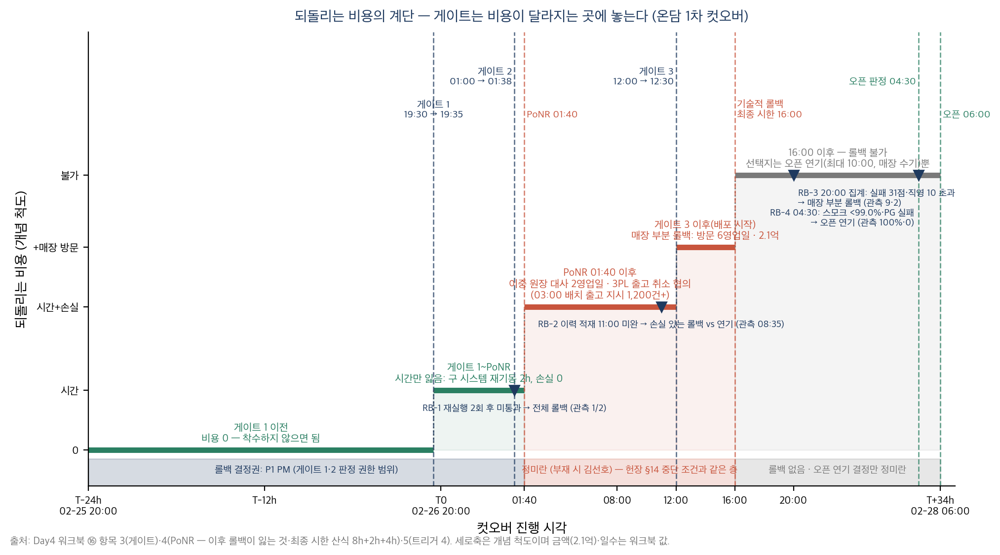

*그림 2-2. 되돌리는 비용의 계단 — 게이트는 비용이 달라지는 곳에 선다. PoNR(01:40)은 게이트 2 직후이고, 기술적 롤백 최종 시한(16:00)은 그보다 14시간 뒤다. 두 시각 사이의 롤백 결정권자가 한 층 올라간다.*

### 실무에서 어떻게 틀리는가

**게이트가 하나다.** "오픈 go/no-go 회의"가 창 시작 전에 한 번 있다. 그 뒤의 모든 결정은 컨트롤룸의 즉흥이 된다.

**판정자가 전부 스폰서다.** 위에서 말한 대로 새벽의 게이트는 건너뛰어진다.

**조건에 재실행 허용이 없다.** 그래서 1건 불일치는 "통과"로 처리되거나 "롤백"이 되거나 둘 중 하나이고, 둘 다 틀렸다.

**미충족 시 선택지에 시간 한도가 없다.** 게이트 1의 "착수 연기 최대 22:00"과 게이트 3의 "16:00 초과 시"가 없으면, 재시도는 창을 다 먹는다.

---

## 2.3 Point of no return — 무엇이 되돌릴 수 없게 만드는가, 온담 01:40

### 개념

Point of no return(PoNR)은 "이 시각 이후 구 시스템으로 되돌리면 잃는 것이 생기는 시각"이다. 기술적으로 되돌릴 수 없는 시각이 아니다 — 기술적 롤백은 그보다 한참 뒤까지 가능하다. 두 시각을 구별하지 못하는 것이 SI 컷오버에서 발주사가 가장 자주 놓치는 것이며, 워크북 §1.1이 그것을 첫 문단에 적어 두었다. **데이터 정본이 바뀌는 시각이 먼저 오고, 그 뒤의 롤백은 데이터 손실(정확히는 이중 원장의 정리 비용)을 동반하므로 결정권자가 바뀐다.**

PoNR을 정의하는 절차는 셋이다. 첫째, **무엇이** 되돌릴 수 없게 만드는가를 적는다 — 대개 "신 시스템에만 기록되는 거래가 생기기 시작하는 순간"이다. 둘째, 그 이후 롤백이 **무엇을 잃는가**를 실측한다 — 롤백 리허설이 그 실측이다. 셋째, PoNR 이후의 롤백 **결정권자**를 한 층 올린다. 이 셋이 런북의 "4. Point of no return" 표다.

### 온담의 사례로 읽기

> ■ **사례 사실** — PoNR 2027-02-27(토) 01:40(T+5h40m)과 03:00 3PL 배치 출고 지시·매장 오프라인 모드(로컬 캐시 판매·새벽 동기화)는 [추가 설정] — Day4 워크북 §1.5 항목 4; 3PL 대성로지스 WMS 야간 배치 구조는 사례 §2.1·§3.5.

온담의 PoNR은 **2027-02-27(토) 01:40(T+5h40m)**, 계획·실제 동일이다. 게이트 2 통과 직후 신 재고·주문 원장을 '정본'으로 활성화하는 시각이다. 이 시각부터 ① 이력 적재가 신 원장에 기록되고, ② 03:00 3PL 폴백 배치 1회차가 신 원장 기준으로 출고 지시를 생성해 대성로지스에 전송되며, ③ 매장 오프라인 캐시 판매분이 신 원장으로 동기화된다. 즉 01:40 이후 구 시스템으로 되돌리면 신 원장에만 있는 거래·출고 지시가 생긴다. 롤백 리허설(01-22, 3회차 병행)의 실측 — PoNR 후 롤백 시나리오 7h 50m, 대사 대상 1,140건 추정 — 이 "이후 롤백이 잃는 것"의 근거다: 03:00 배치 출고 지시(토요일 새벽 출고분 1,200건 이상)와 매장 캐시 판매분의 구 원장 수작업 대사 2영업일, 대성로지스 출고 취소 협의. 데이터가 사라지는 것은 아니지만 이중 원장 정리 비용이 발생한다.

**기술적 롤백 최종 시한은 02-27(토) 16:00** = 오픈 06:00 − 14시간(구 시스템 복원 8h + 검증 2h + 매장 캐시 재동기화 4h; 롤백 리허설 실측 7h 50m + 여유)이다. 01:40과 16:00 사이의 14시간 20분이 "되돌릴 수는 있으나 잃는 것이 있는" 구간이며, 그 구간의 롤백 결정권은 P1 PM이 아니라 **정미란**(부재 시 김선호 — 헌장 §14 중단 조건과 같은 층)에게 있다. 16:00 이후에는 롤백이 불가하고 오픈 연기만 가능하다(정미란). 이 구조를 표로 쓰면 이렇다 — 01:40 이전 P1 PM / 01:40~16:00 정미란 / 16:00 이후 연기만.

왜 PoNR을 게이트 2 **직후**에 두었는가. 게이트 2를 통과한다는 것은 정본을 바꾸겠다는 결정이므로 그 결정의 결과(원장 활성화)가 PoNR이다. 게이트와 PoNR을 떼어 놓으면 — 예컨대 정본 전환을 이력 적재 완료 후로 미루면 — 03:00 폴백 배치가 구 원장 기준으로 나가고 오픈 후 첫 출고분이 이중 원장이 된다. PoNR을 앞당기면 잃는 것이 커지고, 늦추면 창 안에 오픈이 안 들어온다. 01:40은 그 사이의 한 점이며, 리허설이 그 점을 정했다.

### 실무에서 어떻게 틀리는가

**PoNR을 정의하지 않는다.** 그래서 컷오버 중 "지금 되돌릴 수 있나"라는 질문에 기술팀은 "네, 8시간이면 됩니다"라고 답하고, 그 답에는 새벽 3시에 이미 나간 출고 지시 1,200건이 빠져 있다.

**PoNR과 기술적 시한을 하나로 적는다.** 그러면 롤백 결정권자가 한 층 올라가는 구간이 없고, PM이 새벽에 손실 있는 롤백을 결정하거나 결정하지 못한다.

**롤백 리허설을 안 한다.** PoNR 이후 롤백이 "가능하다"는 것과 "무엇을 잃는가"는 실측 없이는 모른다. 온담의 7h 50m·1,140건이 없었다면 16:00이라는 시한도, 결정권 상향의 근거도 없었다.

---

## 2.4 롤백 트리거와 롤백 계획의 비대칭 — 롤백도 프로젝트다

### 개념

롤백 트리거(rollback trigger)는 "이 지표가 이 값을 넘으면 되돌린다"는 사전 합의다. 요소는 지표·임계값·관측 시각(런북의 어느 행에서 보는가)·판정자·발동 시 조치·복구 소요다. 트리거가 사전 합의여야 하는 이유는 게이트 조건과 같다 — 컨트롤룸의 새벽에 "이 정도면 괜찮지 않은가"를 토론하지 않기 위해서다. 그리고 트리거는 게이트와 짝을 이룬다. 게이트 2의 트리거는 마스터 검증 실패, 게이트 3 이후의 트리거는 배포 실패 매장 수, 오픈 판정의 트리거는 스모크 성공률과 PG 승인이다.

롤백 계획의 **비대칭**이란 이것이다 — 컷오버 계획은 몇 달을 들여 38행을 쓰지만, 롤백 계획은 대개 "구 시스템 재기동"한 줄이다. 그러나 PoNR 이후의 롤백은 컷오버보다 어렵다. 신 원장에만 있는 거래를 구 원장으로 옮기는 대사, 이미 전송된 출고 지시의 취소 협의, 이미 배포된 펌웨어의 회수, 매장 오프라인 모드의 해제 순서, 외부 조직(3PL·PG·배달3사·앱 벤더) 재통보. 그것은 하나의 작은 프로젝트이고, 런북·역할·시각표·검증이 따로 있어야 한다. "롤백도 프로젝트다"라는 이 절의 부제는 그 뜻이다. 온담 워크북 §1.7 기본 과제가 "롤백 자체의 런북을 10행으로 적으라"고 요구하는 이유다.

트리거에는 전체 롤백과 **부분 롤백**이 있다. 매장 갈래의 배포 실패는 매장만 구 POS 이미지로 복원하고 데이터는 신 원장을 유지할 수 있다(RB-3). 갈래가 나뉘어 있어야 부분 롤백이 정의된다.

### 온담의 사례로 읽기

> ■ **사례 사실** — 롤백 트리거 4개(RB-1~4)의 임계값·판정자·관측값과 기술적 롤백 최종 시한 16:00은 [추가 설정] — Day4 워크북 §1.5 항목 5; 배포 대상 직영 227·가맹 388점(사례 C-09), 앱 MAU 41만(O-01).

| ID | 지표 | 임계값 | 판정자 | 발동 시 조치 | 관측값 / 판정 |
|---|---|---|---|---|---|
| RB-1 | 마스터 검증 6종 미통과 | 재실행 2회 후 1종 이상 미통과 | 박세연 | 전체 롤백(PoNR 전, 재기동 2h, 손실 0), 다음 창 대안 2(03-12~14) | 재실행 1/2 → 0건 / 미발동 |
| RB-2 | 이력 적재 완료 시각 | 02-27 11:00 미완 | P1 PM → 정미란(PoNR 후) | 손실 있는 롤백(대사 2영업일) vs 오픈 연기(최대 10:00) — 정미란 판단 | 08:35 완료 / 미발동 |
| RB-3 | 펌웨어 배포 실패 매장 수 | 31점(5%) 초과 또는 직영 10점 초과 | 오정근(부재 시 매장운영팀장)·박세연 | 매장 갈래 부분 롤백, 오픈 연기 검토 | 9점(직영 2) / 미발동 |
| RB-4 | 스모크 성공률·PG 승인 | 99.0% 미만 또는 PG 7본 중 1본 이상 실패 | 정미란 | 오픈 연기(최대 10:00) → 미해결 시 신 플랫폼 부분 운영(PG 대체 경로) | 36/36 100%, PG 0 / 미발동 |

네 트리거 중 발동은 0이다. 그런데 관측값은 전부 기록되었다 — 1/2, 08:35/11:00, 9/31(직영 2/10), 100%/99.0%·PG 0/0. 발동하지 않은 트리거의 관측값을 적는 이유는 그것이 **다음 컷오버의 임계값 근거**이기 때문이다. 2차 컷오버(03-27)의 트리거 RB-A(센터 재고 대사 불일치 0.5% 초과)·RB-B(설비 IF 4본 중 1본 이상 수신 실패)는 1차의 관측값 위에서 정해졌고, 2차의 관측값(대사 불일치 0.03% = 25건)은 다시 다음 것의 근거가 된다.

RB-2의 임계값 11:00을 보라. 리허설 6h 50m + 4h = 01:40 + 10h 50m ≈ 12:30인데 11:00으로 잡았다. 적재 후 검증 2차에 2시간을 확보하기 위한 보수적 설정이다. 임계값은 "언제 실패인가"가 아니라 "언제까지 결정하면 나머지 계획이 살아 있는가"로 정한다.

RB-3의 판정자가 오정근인 것도 원칙의 결과다. 매장 갈래의 부분 롤백은 매장 재방문 6영업일·2.1억(정본의 롤백 비용)이고 그 비용과 영향은 영업본부의 것이므로, Senior User가 판정한다. 데이터 판정자(박세연)가 매장 롤백을 판정하면 매장이 겪을 일을 모르는 사람이 결정하는 것이 된다.

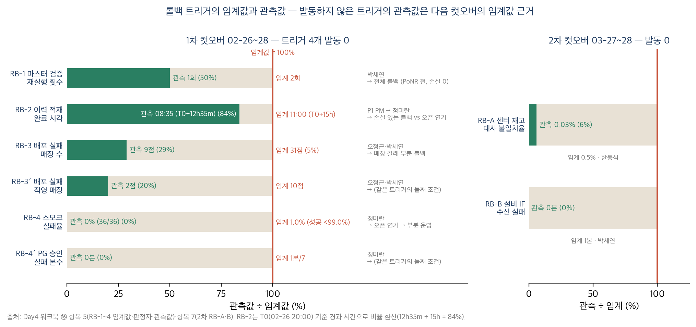

*그림 2-3. 롤백 트리거의 임계값과 관측값 — 발동 0. 발동하지 않은 트리거의 관측값이 다음 컷오버의 임계값 근거다.*

### 실무에서 어떻게 틀리는가

**트리거가 "심각한 문제 발생 시"다.** 임계값이 숫자가 아니면 판정은 토론이 된다.

**롤백 계획이 한 줄이다.** 롤백 런북·롤백 리허설·롤백 외부 통보가 없다. 롤백이 컷오버보다 어렵다는 것을 롤백하는 날 처음 안다.

**부분 롤백이 정의되지 않는다.** 갈래가 없어서 배포 실패 20점 때문에 전체를 되돌리거나, 전체를 되돌릴 수 없어 20점을 방치한다.

---

## 2.5 데이터 마이그레이션 6종 검증 — 이 데이터의 정답을 누가 판정하는가

### 개념

데이터 전환의 검증은 "옮긴 데이터가 원본과 같은가"를 여섯 각도에서 묻는다. ① **건수**(테이블별 행 수 — 원본(필터 후) − 적재 = 0), ② **금액 합계**(매출·발주·재고 금액 원장의 합계 일치 — 원 단위), ③ **키 유일성**(PK 중복 0), ④ **참조 정합성**(FK 고아 레코드 0), ⑤ **코드 매핑 커버리지**(미매핑 코드 0 — 분모는 매핑표의 코드 수), ⑥ **표본 필드 대조**(무작위 표본 n행 × 전 필드의 값 불일치 0). 앞의 다섯은 집계이고 여섯째만 값 자체를 본다. 집계는 빠르지만 상쇄 오류(A 테이블에서 +1, B에서 −1)를 놓치고, 표본 대조는 느리지만 변환 규칙의 오류(반올림·시간대·통화 표기)를 잡는다. 여섯이 다 있어야 한다.

각 검증에는 **분모**와 **통과 기준**과 **서명자**가 있다. 분모가 없으면 "0건 불일치"가 무엇 중 0건인지 모른다. 통과 기준이 0이 아니면(예: "1% 이내") 그 1%가 어느 테이블에 몰려 있는지를 묻지 않게 된다. 서명자는 검증마다 다르다 — 금액 합계는 재경팀장이, 키·참조는 CIO가, 코드 매핑은 통합팀이, 표본 대조는 품질 담당과 용역사 PM이. **"이 데이터의 정답을 누가 판정하는가"**는 검증 표의 마지막 열이며, 그 답이 "전환 용역사"이면 용역사가 자기 일을 채점하는 것이다.

여기에 Day3의 데이터 정본 판정이 연결된다. 전환 검증의 세 실패(키 중복·고아·미매핑)는 전환 도구의 문제가 아니라 **원본 데이터의 정본이 정해지지 않은** 문제인 경우가 많다. 브랜드 간 중복 상품 코드는 어느 브랜드의 코드가 정본인지가 결정되어야 풀리고, 폐점 매장 참조는 폐점 매장을 어떻게 다룰지(보존·마스킹·삭제)가 결정되어야 풀린다. 그 결정은 CCB·G2의 것이지 전환 팀의 것이 아니다.

### 온담의 사례로 읽기

> ■ **사례 사실** — 전환 대상 1,842 테이블·7.4TB(사례 §3.2, P-10), 멤버십 218만(O-02); 5년 필터 후 5.1TB, 마스터 6종 2,184,310행·이력 3.21억 행, 검증 6종의 리허설·본 컷오버 결과는 [추가 설정] — Day4 워크북 §1.5 항목 6과 CR-11(Day3 워크북 §1.5).

전환 대상 1,842테이블, 원본 7.4TB → CR-11(5년 필터) 적용 후 **5.1TB**. 마스터 6종(상품·고객·매장·거래처·가격·재고) 2,184,310행, 이력 3.21억 행. 검증 6종의 리허설 3회와 본 컷오버 결과:

| 검증 | 분모 | 리허설 1 (11-23) | 리허설 2 (01-08) | 리허설 3 (01-22) | 본 컷오버 마스터 (00:30) | 본 컷오버 이력 (08:40) | 서명 |
|---|---|---|---|---|---|---|---|
| ① 건수 | 1,842테이블 | 0 (7.4TB 전체) | 0 | 0 | 0 | 0 | 용역사 PM·P1 PMO 품질 |
| ② 금액 합계 | 5년 원장 | −41,200원(반올림) → 규칙 정정 | 0 | 0 | 0 | 0 | 재경팀장 |
| ③ 키 유일성 | PK 1,842 | **1,204**(브랜드 간 상품 코드 중복 — R-10) | 0 | 0 | 0 | 0 | 박세연 |
| ④ 참조 정합성 | FK 3,916 | **412**(폐점 매장·단종 상품) | 0 | 0 | 0 | 0 | 박세연 |
| ⑤ 코드 매핑 | 4,318 코드 | **96**(97.8%) | 0 | 0 | 0 | 0 | 수행 통합팀·P1 PMO |
| ⑥ 표본 대조 | 2,000행(마스터) / 5,000행(이력) | 18 | 3 (시간대·통화) | 0 | **1** → 재실행 → 0 | 0 | P1 PMO 품질·용역사 PM |

리허설 1회차의 미통과 3종(1,204·412·96)은 전부 **데이터 정본 정제**(G2 11-27)로 해소되었다. 1,204건은 R-10(마스터 변경)의 문제였고 G2에서 마스터 6종 정본 판정이 내려진 뒤 사라졌다. 즉 리허설은 시험이 아니라 정본 판정의 **입력**이었다. 본 컷오버의 표본 1건은 성격이 다르다 — 리허설 3회차가 통과했는데 본 컷오버에서 나온 이유는 2월 가격 개정분(신규 가격 12건)이 3회차 이후 추가되었기 때문이며, 변환 규칙(반올림)의 문제였다. 검증은 리허설 시점의 데이터가 아니라 **컷오버 시점의 데이터**를 본다는 것, 그래서 리허설과 본 컷오버 사이에 원본이 바뀌면 통과한 검증도 다시 실패할 수 있다는 것이 이 1건의 교훈이다.

서명 열을 보라. 금액 합계에 재경팀장이 서명한다 — 5년 매출 원장의 합계가 일치한다는 것을 재무본부가 확인하지 않으면, 신 플랫폼의 첫 월마감에서 "합계가 다르다"는 말이 나올 때 그것이 전환 오류인지 운영 오류인지를 가릴 수 없다.

### 실무에서 어떻게 틀리는가

**건수만 본다.** 행 수가 맞으면 "전환 완료". 상쇄 오류와 변환 규칙 오류가 오픈 후 문의로 돌아온다.

**통과 기준이 "허용 오차 이내"다.** 0이 아니면 몰린 곳을 묻지 않는다.

**정답 판정자가 전환 팀이다.** 재경팀장의 금액 서명, CIO의 키·참조 서명이 없으면 전환 검증은 자기 채점이다.

**리허설 시점의 통과를 컷오버 시점의 통과로 안다.** 온담의 표본 1건.

---

## 2.6 리허설의 의미 — 결과가 나빠야 좋은 리허설

### 개념

컷오버 리허설(dress rehearsal)은 본 컷오버와 같은 절차·같은 볼륨·같은 사람으로 창 안에 들어오는지를 실측하는 것이다. 리허설의 목적은 통과가 아니라 **실측**이다 — 소요 시간, 실패하는 검증, 병목이 되는 갈래, 교대 시점의 인수 누락. 그래서 결과가 나쁜 리허설이 좋은 리허설이다. 1회차에서 창을 초과하고 검증 3종이 실패하면 그 셋이 G2의 안건이 되고, 2회차에서 통과하면 그 통과 시간이 런북의 계획 시각이 되며, 3회차에서 롤백을 병행하면 PoNR 이후 롤백의 실측이 생긴다. 성공한 리허설만 남기는 런북은 다음 프로젝트에 "3회 하면 된다"는 잘못된 교훈을 남긴다. 실패한 리허설을 남기는 런북은 "1회차는 전체 볼륨으로 돌려 창 초과를 미리 보라"는 교훈을 남긴다(L-15).

리허설의 횟수보다 중요한 것은 **각 회차의 목적이 다르다**는 것이다. 1회차 — 전체 볼륨에서 무엇이 깨지는가(창 초과·검증 실패의 발견). 2회차 — 정본 정제 후 절차가 창 안에 들어오는가(계획 시각의 확정). 3회차 — 본 컷오버와 동일 조건 + 롤백 병행(여유의 확정, PoNR 이후 롤백 실측). 세 회차가 같은 목적이면 두 번은 낭비다.

### 온담의 사례로 읽기

> ■ **사례 사실** — 리허설 3회(11-23 41h 20m · 01-08 33h 10m · 01-22)의 소요와 미통과 항목은 [추가 설정] — Day4 워크북 §0.3·§1.5 항목 6; 마일스톤 '데이터 전환 리허설 3회차 2027-01-29'는 사례 §5.4.

1회차 11-23: **41h 20m**(7.4TB 전체 대상, 창 34h 초과 7h 20m), 검증 6종 중 3종 미통과(키 중복 1,204·고아 412·미매핑 96). 2회차 01-08: **33h 10m**(5.1TB, 6종 통과, 표본 3건 보정 — 날짜 시간대·통화 표기). 3회차 01-22: **31h 40m**(6종 통과, 롤백 리허설 7h 50m 병행). 계획 34h 대비 여유 2h 20m.

1회차의 41시간 20분은 7.4TB 전체를 대상으로 했기 때문이다. CR-11(전환 5년 한정)은 09-22에 접수되어 10-15 CCB에서 의결되었지만 5년 필터 규칙 자체는 G2 정본 판정(11-27)과 함께 확정되었고, 그래서 1회차는 필터 전 볼륨으로 돌렸다. 이것이 의도였는가. 워크북 §1.6은 그렇게 읽는다 — 1회차를 전체 볼륨으로 돌린 덕에 "필터 없이는 창에 안 들어온다"가 숫자(7h 20m 초과)로 확인되었고, 그 숫자가 CR-11의 필터 규칙을 G2에서 확정하는 근거가 되었다. 리허설 1회차가 5.1TB로 통과했다면 CR-11의 아카이브 접근 절차(조건 ④)는 우선순위에서 밀렸을 것이고, 그 절차는 SAC 항목 11의 조건부가 아니라 미해소가 되었을 수 있다.

3회차의 롤백 병행이 PoNR 이후 롤백의 실측(7h 50m, 대사 1,140건)을 만들었고, 그것이 기술적 롤백 최종 시한 16:00과 결정권 상향의 근거가 되었다(2.3절). 리허설 없이 정한 PoNR은 추측이다.

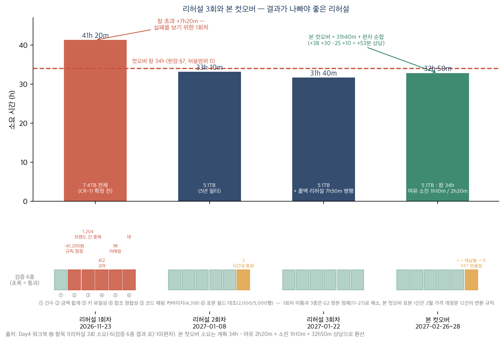

*그림 2-4. 리허설 3회의 소요 시간과 검증 결과. 1회차의 창 초과(7.4TB 전체)와 미통과 3종이 G2 정본 판정의 안건이 되었다. 결과가 나빠야 좋은 리허설이다.*

### 실무에서 어떻게 틀리는가

**리허설을 축소 볼륨으로 한다.** 10%로 돌려 3시간 걸렸으니 전체는 30시간이라고 계산한다. 선형이 아니다 — 인덱스·락·디스크 I/O는 볼륨에 비선형이고, 창 초과는 전체 볼륨에서만 보인다.

**리허설을 통과할 때까지 반복한다.** 목적이 통과이므로 실패는 숨겨지고, 실패의 원인(정본 미확정)은 CCB에 가지 않는다.

**롤백 리허설을 안 한다.** 2.3절.

---

## 2.7 창·성수기·주말, 빅뱅·단계적·병행, 그리고 두 번 컷오버(R-14)의 비용 (심화)

### 개념

**창(window).** 컷오버 창은 업무가 멈춰도 되는 시간이며, 대개 주말이고, 성수기·마감·결산·규제 기한을 피한다. 창이 하나뿐이면 허용범위 0이 되고, 허용범위 0인 창은 런북의 모든 행에 "되돌릴 수 있는 마지막 시각"을 붙이게 만든다. 창이 여럿이면(다음 주말도 가능하면) 게이트 1의 "미충족 시 → 다음 창"이 값싼 선택지가 된다. 창의 수가 컷오버의 위험을 결정한다.

**빅뱅(big-bang) / 단계적(phased) / 병행(parallel).** 빅뱅은 한 창에 전부 전환한다 — 임시 상태가 없고 이중 원장이 없지만, 실패 시 영향이 전부다. 단계적은 매장·지역·기능·조직 단위로 나눠 여러 창에 전환한다 — 각 창의 위험은 작지만 창 사이에 **임시 상태**(두 시스템이 공존하고 데이터가 나뉘어 있는 기간)가 생기며, 그 임시 상태의 규칙(어느 원장이 정본인가, 무엇을 하지 말아야 하는가)이 런북에 명시되어야 한다. 병행은 구·신 시스템을 일정 기간 동시에 운영하며 결과를 대조한다 — 가장 안전하지만 비용이 두 배이고, 사용자가 두 번 입력해야 하며, "언제 구 시스템을 끌 것인가"의 결정이 미뤄진다. ITIL의 Deployment Management practice가 이 셋을 배포 방식(big-bang·phased·pull·continuous)으로 정리한다.

### 온담의 사례로 읽기

> ■ **사례 사실** — 두 번 컷오버(1차 매장·주문 02-26~28 34h, 2차 물류 03-27~28 8h)는 Day3 EX-01 대안(Day3 워크북 §2.5 항목 8)과 R-14(§3.5)에서 온 결정; 성수기 잠금 창·P2 기계적 준공 2027-02-12·설비 인터페이스 4본(15억 별도 계약)은 사례 §3.5·§5.4.

온담은 **두 번 컷오버**를 택했다 — 1차(매장·주문, 02-26 20:00~02-28 06:00, 34h)와 2차(물류 — 이천센터 재고 원장·P2 설비 인터페이스 4본, 03-27 22:00~03-28 06:00, 8h). 빅뱅과 단계적의 중간이며, 나눈 기준은 조직(매장 vs 센터)이 아니라 **P2의 준비 상태**다. P2 설비 리드타임 38주로 물류 인터페이스가 3월에야 시험 가능했고(A15 03-08~12), G1이 분리를 의결했으며(R-01), 그 분리의 2차 리스크가 R-14(두 번 컷오버의 임시 상태)였다.

두 번 컷오버의 비용은 셋이다. 첫째, **임시 상태 4주**(02-28~03-28) — 매장 재고 = 신 원장(정본), 이천센터 재고 = 구 SAP 원장(정본), 둘 사이의 대사는 폴백 야간 배치 2회(21:00·03:00). 런북 항목 7이 "하지 말 것"을 명시한다: 센터 재고를 신 원장에서 조회·수정하지 않는다(읽기 전용 미러), 재고 정확도 리포트(StRS-034)는 3월분을 "매장 원장 기준"으로만 산출하고 센터 분모는 4월부터. 둘째, **임시 연동의 수명** — CR-08의 파일럿 임시 연동 2본은 "컷오버 후 30일 내 폐기"가 조건 ③이었는데, 2차 컷오버가 있으므로 "2차 후 30일 = 04-27"로 CCB 01-21에서 갱신했다. 셋째, **2차 컷오버 후의 첫 평일** — 03-29(월) 03:00 폴백 배치 1회차가 실패했다(P2-07, 84분 지연 → KE-02). 배치 대상이 센터 재고까지 늘어나 1회차가 40분을 초과하며 2회차와 겹친 것이며, Day3 등록부의 R-16(폴백 배치 창 충돌)이 그대로 실현되었다. 22:30 파라미터로 조정했고 그것이 운영 문서 4종(배치 명세)의 한 줄이 되었다.

그리고 두 번 컷오버가 정시에 성공한 **조건**이 있다 — 1차 하이퍼케어 2주(03-01~12)의 심각도 2 이상 인시던트가 5건 이하일 것(R-14의 트리거)이 2차 컷오버 게이트 1의 착수 조건 ①이었고, 실제 4건이었다. 앞 컷오버의 안정화 지표를 뒤 컷오버의 게이트 조건으로 묶은 것, 이것이 L-15("잘됨")이며 프로그램 컷오버 표준의 안건이다. 분리 컷오버에서 이 연결이 없으면 2차는 1차의 상태와 무관하게 달력대로 진행되고, 1차가 불안정한 채로 2차가 얹힌다.

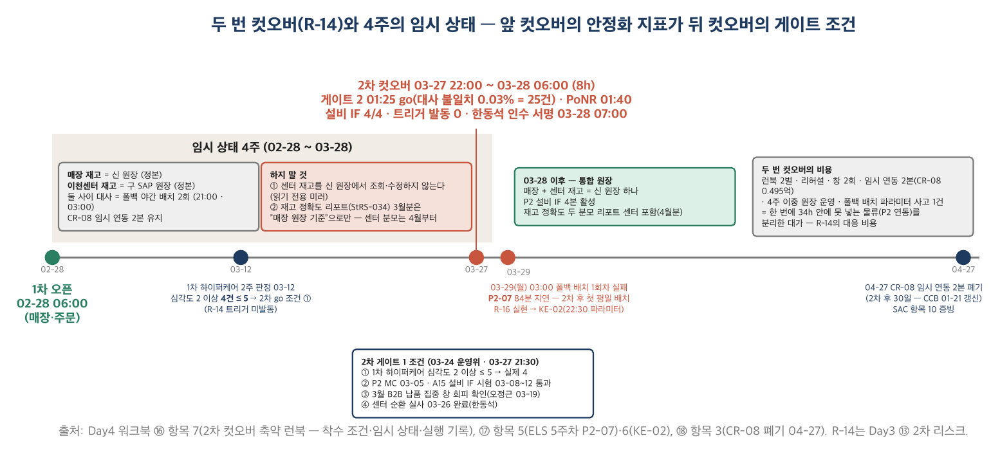

*그림 2-5. 두 번 컷오버와 4주의 임시 상태. 1차 하이퍼케어 지표(심각도 2 이상 ≤ 5)가 2차 게이트 1의 조건이 되는 연결이 두 컷오버를 정시에 성공시킨 조건이다(L-15). 임시 상태의 "하지 말 것"이 런북에 명시되어야 한다.*

### 실무에서 어떻게 틀리는가

**단계적 전환에서 임시 상태의 규칙을 적지 않는다.** 두 원장이 공존하는 4주 동안 누군가 센터 재고를 신 원장에서 수정하고, 대사가 깨지고, 그것이 "전환 오류"로 기록된다.

**병행 운영의 종료 조건이 없다.** 구 시스템이 1년 뒤에도 켜져 있다.

**두 컷오버를 달력으로만 연결한다.** 1차의 안정화와 무관하게 2차가 진행된다.

---

## 2.8 D−2 라이선스 사건 — 거버넌스 변경의 부작용이 14개월 뒤 청구되는 구조

### 개념

컷오버 직전에 발견되는 사건의 대부분은 기술이 아니라 **절차**에서 온다. 결재가 안 난 발주, 갱신되지 않은 인증서, 만료된 계정, 통보되지 않은 외부 조직. 이것들의 공통점은 각각의 절차가 정상이었다는 것이다 — 아무도 규정을 어기지 않았고, 규정들이 겹친 자리에 대기가 생겼다. 그래서 담당자를 찾는 것은 답이 아니고, **어느 규정들이 어떻게 겹쳤는가**를 적는 것이 답이며, 그 기록이 교훈 등록부를 거쳐 규정 개정 요청이 된다.

### 온담의 사례로 읽기

> ■ **사례 사실** — 5,000만 원 이상 CFO 직접 결재(2026-02-16 시행)와 정미란의 해외 출장은 사례 §3.5·§6.3(CR-10의 배경은 Day3 워크북 §1.5); 2027-02-24 라이선스 발주서 미접수 사건의 경과·임시 키·게이트 조건 추가는 [추가 설정] — Day4 워크북 §1.5 항목 9.

2027-02-24(수) 14:30, 컨트롤룸 사전 점검 중 P1 PMO 기준선 담당이 운영 환경 API 게이트웨이 라이선스 키 발급 상태를 벤더에 조회했고, "발주서 미접수"라는 회신을 받았다. 사실 관계: API GW 라이선스 5.6억(SW-01) 중 운영 환경 2차분 발주서가 02-13 소관 본부장(박세연) 결재 후 **CFO 직접 결재 대기** 상태였다 — 재무본부 내부통제 지침(2026-02-16 시행)이 단일 건 5,000만 원 이상을 CFO 직접 결재로 정했고, 정미란은 G3 준비와 해외 출장(02-16~23)으로 결재함이 정체되었으며, 구매팀은 "결재 완료 후 발주"가 절차이므로 벤더에 발주서를 보내지 않았다. 정식 키 없이 02-26 컷오버를 하면 운영 환경 API GW 기동 불가(개발 키는 계약상 운영 사용 금지) → 창 이탈.

선택지 셋. ① 결재 대기(정미란 02-25 복귀 → 결재 → 발주 → 벤더 키 발급 표준 5영업일 → 03-04) — 창 이탈. ② **벤더 임시 라이선스 30일**(수수료 0.02억, 정식 발주 시 상계 불가). ③ 개발 키 운영 사용 — 계약 위반, 기각. 결정 ②, P1 PM·강현도 02-24 17:00, 벤더 담당 회신 19:00, 임시 키 02-25 10:00 적용·시험. 자금원 컨틴전시 미배정 풀 0.02(CCB 03-18 사후 보고). 런북 v1.1에서 게이트 1 조건 ③에 "임시 라이선스 유효(만료 03-26 > 정식 03-05)" 추가. 사후: 정미란 결재 02-25 → 발주 02-26 → 정식 키 03-05 적용(임시 키 만료 03-26 전).

원인은 담당자 실수가 아니라 **세 개의 정상적인 결정이 겹쳐 만든 대기**다. (1) R-04(1차연도 삭감)의 대응으로 라이선스 지급 조건을 50/50으로 바꾼 것(IS-01, 2026-03-13 계약 변경 — Day3 착시 1의 원인이기도 하다)이 운영 환경 2차분 발주를 2027년 2월로 밀었다. (2) 그 시점이 재무본부 내부통제 지침(2026-02-16) 시행 후였다 — Day1에서 회수하라: 정미란 CFO의 결재 절차는 회사 정본에 "5,000만 원 이상 직접 결재"로 적혀 있었고, 그것은 이해관계자 등록부의 한 줄이었지 리스크 등록부의 한 줄이 아니었다. (3) G3 자료의 조달 상태 표(⑮ 항목 8)가 라이선스 2차분을 "계약 내"로만 표기해 발주 단계(결재·발주·키 발급)를 추적하지 않았다. 2026년 2월의 거버넌스 변경(내부통제 지침)과 2026년 3월의 계약 변경(50/50)이 2027년 2월의 컷오버 창 앞에서 청구된 것이며, 이 절의 부제 "14개월 뒤 청구되는 구조"가 그것이다.

이 사건을 회의록에만 적을 수도 있었다. 임시 라이선스로 해결되었고 비용은 0.02억이다. 그러나 런북 부록(항목 9)에 적었기 때문에 다음 컷오버의 게이트 1 조건에 "라이선스·결재 상태"가 들어가고, 교훈 등록부 L-09를 거쳐 내부통제 지침 개정 요청 2번("프로그램 게이트·컷오버 창 앞 4주 이내 발주 예정 건은 소관 PM이 사전 결재 목록을 제출하고 CFO가 일괄 결재한다. 결재 대기 5영업일 초과 건은 재경팀이 PM에 통보한다")과 조달 상태 양식의 "발주·결재 단계" 열이 된다. 회의록에만 남는 사건은 다음 프로젝트에서 같은 새벽에 다시 발견된다.

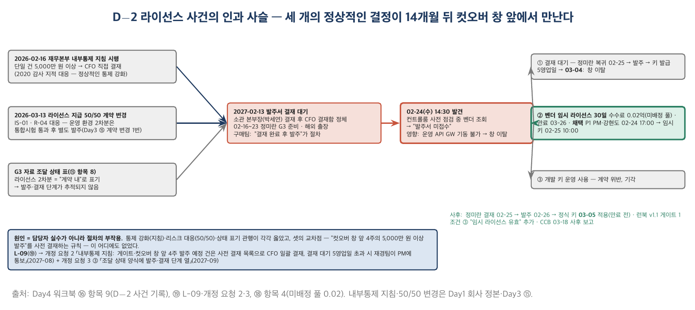

*그림 2-6. D−2 라이선스 사건의 인과 사슬 — 세 개의 정상적인 결정(거버넌스 변경·계약 변경·양식의 표기)이 겹쳐 만든 대기. 담당자가 아니라 규정의 겹침을 적어야 L-09가 지침 개정이 된다.*

### 실무에서 어떻게 틀리는가

**담당자를 찾는다.** "구매팀이 확인하지 않았다", "CFO가 결재하지 않았다". 다음 프로젝트에서 그 사람들이 바뀌어도 같은 새벽이 온다.

**컷오버 창 앞의 조달 상태를 "계약 내"로만 본다.** 계약이 되어 있는 것과 발주·결재·인도가 된 것은 다르다. 조달 상태 표에 단계 열이 있어야 한다.

**임시 조치의 만료일을 잊는다.** 임시 라이선스 만료 03-26이 런북 행 7의 확인 열과 게이트 1 조건에 들어가 있었기 때문에, 정식 키 03-05가 추적되었다.

---

## 2.9 실무에서 어떻게 틀리는가

이 장의 오류들은 하나의 태도로 수렴한다 — **컷오버를 이벤트로 본다.** 이벤트에는 준비와 실행이 있고, 실행은 그날의 사람들이 잘하면 된다. 이관에는 조건과 판정과 서명이 있고, 조건은 미리 적혀 있어야 하며, 판정은 관측값으로 하고, 서명은 받는 쪽이 한다. "오픈 회의"가 게이트의 전부이고 PoNR이 없으며 트리거가 "심각한 문제 시"인 것, 리허설을 통과를 위해 하는 것(축소 볼륨·롤백 리허설 없음), 검증을 건수로 끝내고 정답 판정자가 전환 팀인 것, 분리 컷오버를 달력으로만 연결하는 것, 절차 사건을 회의록에 묻는 것 — 전부 그 태도의 결과다. 그리고 하나 더: 런북을 "너무 세세하다"고 걷어 내는 것. 런북은 프로젝트 문서이며 T−24h의 시각표·갈래·확인 열·실행 기록이 들어가는 것이 맞다. 걷어 내면 컷오버 당일 컨트롤룸에는 화이트보드만 남는다.

---

## 제2장 핵심 정리

> **한 줄씩 — 수업 직전 5분 복습용**
> 1. 런북은 시각이 주인인 유일한 프로젝트 문서다 — 확인 열은 관측값으로 채운다.
> 2. 게이트는 되돌리는 비용이 달라지는 곳에 선다 — 그래서 셋이고, 판정자가 각각 다르다.
> 3. 되돌릴 수 없는 시각(PoNR)과 기술적으로 롤백 가능한 최종 시한은 다른 시각이다.
> 4. 롤백 트리거는 숫자·관측 시각·판정자·조치·복구 소요를 가진 사전 합의다 — 롤백도 프로젝트다.
> 5. 데이터 검증 6종에는 분모·통과 기준·서명자가 있고, 결과가 나빠야 좋은 리허설이다.
> 6. 거버넌스 변경의 부작용은 14개월 뒤 D−2에 청구될 수 있다 — 결재 경로 변경은 리스크 등록부에 오른다.
>
> 아래는 같은 내용의 자세한 판이다.

1. 런북은 시각이 주인 유일한 프로젝트 문서다. T0를 정하고 T−24h~T+24h를 갈래(데이터·인터페이스·매장·통제)로 나누어 적으며, 확인 열은 관측값(건수·해시·응답·성공률), 실행 기록 열은 계획 시각 옆의 실제 시각이다. 온담 1차 컷오버 38행, 여유 2h 20m 중 소진 1h 10m.
2. 게이트는 되돌리는 비용이 달라지는 곳에 선다 — 착수 전(0), 데이터 정본 전환 전(시간), 배포 전(돈·영업일). 조건·판정자·시간 한도가 미리 적혀 있어야 하고, 판정자는 게이트의 성격에 따라 다르다. 게이트 조건은 판정을 엄격하게 하기 위한 것이 아니라 빠르게 하기 위한 것이다(게이트 2의 38분).
3. PoNR은 "되돌리면 잃는 것이 생기는 시각"(01:40, 신 원장 활성화)이고 기술적 롤백 최종 시한(16:00)과 다르다. 그 사이의 롤백 결정권은 한 층 올라간다. 롤백 리허설(7h 50m·1,140건)이 없으면 PoNR은 추측이다.
4. 롤백 트리거는 지표·임계값(숫자)·관측 시각·판정자·조치·복구 소요를 갖는 사전 합의이며, 발동하지 않은 트리거의 관측값이 다음 컷오버의 임계값 근거다(RB-1~4 발동 0). 롤백도 프로젝트다 — 부분 롤백은 갈래가 있어야 정의된다.
5. 데이터 검증 6종(건수·금액·키·참조·매핑·표본)에는 분모·통과 기준 0·서명자가 있고, 서명자가 전환 팀이면 자기 채점이다. 리허설 1회차의 실패 3종은 정본 판정(G2)의 입력이었고, 본 컷오버의 표본 1건은 리허설 이후 원본이 바뀌었기 때문이다. 리허설은 결과가 나빠야 좋은 리허설이며, 두 번 컷오버는 앞의 안정화 지표를 뒤의 게이트 조건으로 묶어야 하고(L-15), D−2 사건은 담당자가 아니라 규정의 겹침으로 적어야 지침 개정이 된다(L-09).

## 생각해 볼 질문

1. 여러분 회사의 최근 오픈에서 point of no return은 몇 시였는가 — 정의되어 있었는가, 아니면 사후에 "그때가 그랬다"고 아는가. 그 시각 이후 롤백 결정권자는 누구였는가.
2. 게이트 2를 스폰서가 판정했다면 새벽 1시의 표본 1건은 어떻게 처리되었을 것 같은가. 여러분 조직에서 "스폰서 깨우기 vs 그냥 진행"이 실제로 어느 쪽으로 갔던 사례가 있는가.
3. 리허설 1회차가 축소 볼륨으로 통과했다면 CR-11의 필터 규칙과 아카이브 접근 절차는 언제 확정되었을까. 리허설의 실패가 CCB 안건이 된 사례를 여러분은 갖고 있는가.
4. 단계적 전환의 임시 상태에서 "하지 말 것"이 문서에 적혀 있지 않았을 때 실제로 무슨 일이 일어났는가. 그것은 전환 오류로 기록되었는가, 운영 오류로 기록되었는가.
5. D−2 사건에서 "담당자가 놓쳤다"로 적힌 회의록과 "세 규정이 겹쳤다"로 적힌 런북 부록 중 어느 쪽이 내부통제 지침을 바꾸는가. 여러분 회사의 결재 지침에 프로젝트 창 앞 사전 결재 조항이 있는가.

## 워크북 연결

이 장은 워크북 §1(⑯ 컷오버 런북·SAC)의 항목 1~7·9·10에 대응한다. 항목 2 시각표 38행(2.1절), 항목 3 게이트 3 + 오픈 판정(2.2절), 항목 4 PoNR(2.3절), 항목 5 롤백 트리거 4(2.4절), 항목 6 검증 6종 × 리허설 3 + 본 컷오버(2.5·2.6절), 항목 7 2차 컷오버 축약 런북과 임시 상태(2.7절), 항목 9 D−2 사건(2.8절), 항목 10 실행 기록·인수 서명(2.1절). SAC(항목 8)는 3.2절에서 다룬다. §1.6 해설의 검산을 손으로 한 번 따라 하고, §1.7 기본 과제(RB-1 발동 시 항목 3·4·5·7 재작성, 롤백 런북 10행, 헌장 §14 중단 조건 ② 해당 여부)는 2.3·2.4절을 읽은 뒤 풀라.

---

# 제3장 서비스 전환 — ITIL과 SLA의 세 층

## 3.1 ITIL 판본을 정직하게 — v5가 현행, 이 교재가 4 어휘로 고정하는 이유

### 개념

이 장은 ITIL의 어휘를 빌린다 — Change Enablement, Service Validation and Testing, Release Management, Deployment Management, Incident Management, Problem Management, Service Level Management, Early Life Support, Known Error Database. 이 어휘는 ITIL 4(2019~)의 practice 명칭이다. 그런데 **2026-02-12 PeopleCert가 ITIL Version 5 Foundation을 출시했고**(상위 모듈은 3~4월 순차), 2026년 9월 현재 현행 판본은 v5다. 바뀐 것은 둘 — 상위 구조의 명칭이 Service Value System에서 **ITIL Value System**으로, 가치 흐름 모델이 Service Value Chain 6활동(Plan / Improve / Engage / Design and transition / Obtain-build / Deliver and support)에서 **Product and Service Lifecycle 8활동**(Discover / Design / Acquire / Build / Transition / Operate / Deliver / Support)으로. 유지된 것은 34 practices(14 general management + 17 service management + 3 technical management), 7 guiding principles, 4 dimensions(organizations and people 차원에 AI가 명시 편입)다. 프레이밍은 Service Management에서 Digital Product and Service Management(DPSM)로 옮겨 갔고, ITIL 4는 폐기되지 않고 병행 유지된다.

그러면 이 교재는 왜 4 어휘로 쓰는가. 이유는 셋이다. 첫째, **여러분 회사의 운영 규정과 벤더 계약서에 지금 적혀 있는 것이 ITIL 4 어휘**다. 온담의 P5 운영 문서 초안, 수행사 유지보수 계약, 클라우드 CSP 계약, ISO/IEC 20000 인증 증적이 전부 그 어휘로 되어 있다. 둘째, 34 practices의 이름은 판본이 바뀌어도 같다 — 이 장이 쓰는 어휘는 전부 practice 명칭이며, 상위 구조 명칭(Value System)과 가치 흐름 모델(6활동/8활동)은 이 장에서 쓰지 않는다. 셋째, 이 장에서 다투는 것은 어휘가 아니라 판단이다 — SLA 99.5%가 세 층 위에서 성립하는가, 포인트 이중차감이 '훼손'인가, 릴리스를 몇 번 할 수 있는가. 그 판단은 판본이 바뀌어도 같다.

그래서 이 교재의 ITIL 표현은 낡은 것이 아니라 **고정된 것**이다. 다만 회사에 돌아가 운영 규정을 개정할 때는 6활동을 8활동으로 다시 매핑해야 한다 — 이 장의 서비스 전환(Transition)은 8활동 중 다섯째 Transition과 여섯째 Operate의 경계에 놓이고, ELS는 그 경계 위의 기간이다. "ITIL 4가 최신"이라고 쓰거나 말하지 마라. 그 문장은 2026-02-12 이후 틀린 문장이며, v5를 아는 청중 앞에서 신뢰를 잃는다.

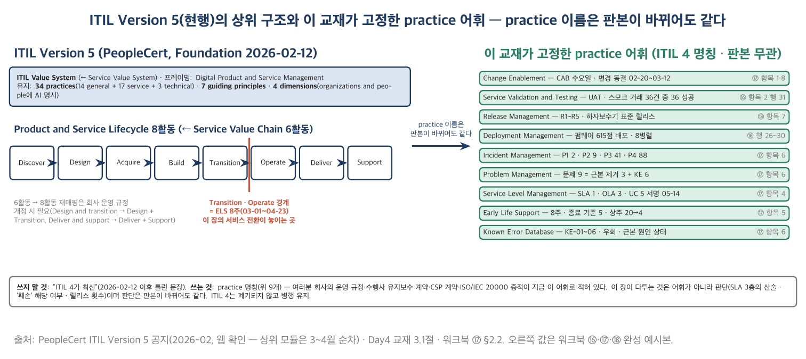

*그림 3-1. ITIL Version 5의 상위 구조와 이 교재가 고정한 practice 어휘. 이 장은 상위 구조 명칭과 가치 흐름 모델을 쓰지 않고 practice 명칭만 쓴다 — practice 이름은 판본이 바뀌어도 같다.*

### 실무에서 어떻게 틀리는가

**"ITIL 4가 최신"이라고 쓴다.** 위에서 말했다. **반대로, 판본 갱신을 이유로 운영 규정의 practice 명칭을 전부 바꾼다.** 바꿀 것은 상위 구조 명칭과 6활동 → 8활동 매핑이지 practice가 아니다. **판본 논쟁으로 오후를 보낸다.** 이 절이 여기 있는 이유는 그 논쟁을 8분 안에 끝내기 위해서다.

---

## 3.2 서비스 수용 기준(SAC) — 인수 거부권이 실재해야 문서가 장치가 된다

### 개념

서비스 수용 기준(Service Acceptance Criteria, SAC)은 "운영 조직이 이 시스템을 자기 것으로 받는 조건"을 항목별로 적고 각 항목에 판정자와 증빙을 붙인 문서다. ITIL의 Service Validation and Testing practice가 원전이며, PRINCE2 7의 Quality practice에서는 acceptance criteria → acceptance record의 사슬이다. SAC의 항목은 대개 10~12개 — 운영 문서, 모니터링, 백업·복구, 보안, 교육, Known Error, SLA/OLA/UC 서명, 인시던트·문제·변경 절차, 소스·형상, 인터페이스 운영, 라이선스·계약 이관, 잔여 결함·ELS 종료.

SAC가 문서에서 **장치**가 되는 조건은 하나다 — **판정자가 인수자(운영 조직)이고, 그 판정자에게 인수 거부권이 실재해야 한다.** 프로젝트가 자기 인수 기준을 판정하면 그것은 인수가 아니라 자기 평가다. 거부권이 실재한다는 것은 헌장에 SAC 미충족이 종료 조건에 걸려 있다는 뜻이다(헌장 §14 ①). 그리고 거부권이 실재하려면 두 번째 조건이 따라온다 — **조건부 충족의 경로**가 있어야 한다. 거부권만 있고 조건부가 없으면 인수자는 12항목 중 1항목 때문에 전체를 거부하거나(하자보수기 3주 지연, 유보금·팀 해산 지연) 거짓으로 충족을 적거나 둘 중 하나가 되고, 둘 다 틀렸다. "미해소 0 **또는** 해소 기한·책임자 서명된 목록"이 그 경로이며, 조건부 항목은 종료 보고서의 미해결 사항 이관 목록으로 간다.

SAC를 언제 확정하는가. G4에서 한 번 채점하는 표가 아니라 **G1에서 초안을 합의하고, 월 1회 검토하고, G3에서 사전 점검하고, G4에서 판정하는** 작업 목록이다. 사전 점검이 없으면 미해소 항목은 G4에서 처음 드러나고, 그때는 해소할 시간이 없다.

### 온담의 사례로 읽기

> ■ **사례 사실** — SAC 12항목의 초안 합의(G1 2026-04-24, RACI 22행)·사전 점검 미해소 7·판정 05-21은 [추가 설정] — Day4 워크북 §1.5 항목 8; 판정권자 박준영과 P5 운영 이관 13억은 사례 §4.2·§2.5(P-27).

SAC v1.0은 G1(2026-04-24)에 초안 합의(RACI 22행), 월 검토 9회, 사전 점검 2027-01-28, 판정 05-21, 판정권자 박준영. 12항목. G3 사전 점검(01-28)에서 **미해소 7**(운영 문서 8/12, 모니터링 임계값 12/24, DR 시험 미실시, 교육 데스크 6/11, SLA UC 3PL 없음·수행사 유지보수 UC 초안, CAB 미실시, 라이선스·계약 이관 미해소) → G4 판정(05-21) **충족 11·조건부 1**. 조건부 1은 항목 11(라이선스·계약 이관)의 아카이브 접근 절차 — 문서가 있고 운영팀 검토도 끝났으나 재경팀의 승인(세무 보존 요건과의 정합 확인)이 06-15에야 나온다. 이것을 "미해소"로 두고 G4를 06-15 이후로 미루면 허용범위 +15영업일(06-18) 안이긴 하지만 하자보수 개시·유보금·팀 해산이 3주 밀리고 그 비용은 아카이브 승인 대기와 무관하게 발생한다. "충족"으로 적으면 거짓이다. 그래서 헌장이 처음부터 두 번째 경로를 열어 두었고, 조건부 항목은 종료 보고서 이관 목록 1번(재경팀장, 06-15, 승인)이 되었다. 헌장 §14 완료 기준 ① 충족. 서명 박준영 05-21, 승인 정미란 05-28.

프리모템 F 시나리오 12번("SAC 미해소 23건으로 인수 거부, 5개월 하자보수 체제")과 이 결과의 차이는 항목 수가 아니라 **G3 사전 점검이 있었는가**다. 01-28의 미해소 7은 14주 동안 운영 조직과 프로젝트가 함께 채운 작업 목록이 되었다 — DR 전환 시험 04-10(RTO 실측 3h 20m), 임계값 12 → 24(ELS 중 조정), 데스크 교육 11/11, CAB 03-17부터 8회, UC ② 재협상·⑥ 강등(3.5절), 문서 12종 05-14 서명. 항목 7(SLA/OLA/UC)이 "SLA 서명"이 아니라 "**3층 전부 서명**"인 이유가 3.5절이다.

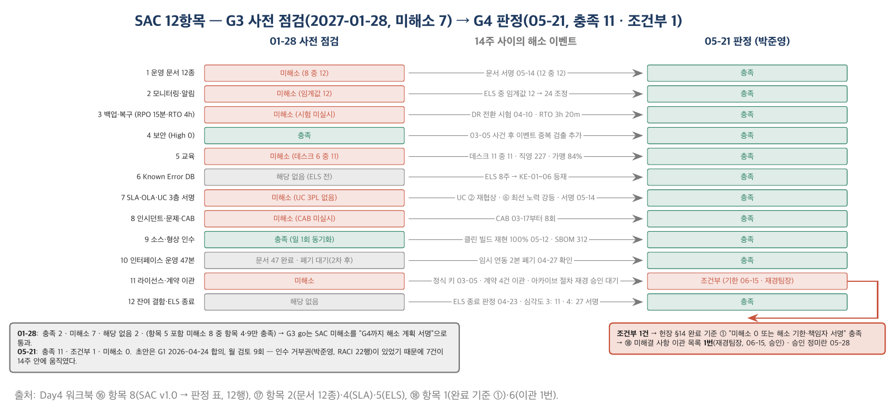

*그림 3-2. SAC 12항목의 G3 사전 점검(미해소 7)에서 G4 판정(충족 11·조건부 1)까지. 사전 점검이 있었기 때문에 미해소는 작업 목록이 되었고, 조건부 1건은 이관 목록 1번이 되었다.*

### 실무에서 어떻게 틀리는가

**판정자가 프로젝트다.** 자기 평가. **거부권이 헌장에 없다.** SAC는 참고 자료가 된다. **조건부 경로가 없다.** 1항목 때문에 전체 거부 또는 거짓 충족. **G3 사전 점검이 없다.** 미해소가 G4에서 처음 드러난다. **항목에 증빙 열이 없다.** "충족"이 판정자의 인상이 된다.

---

## 3.3 Early Life Support — 종료 조건이 없는 하이퍼케어는 상주가 된다

### 개념

Early Life Support(ELS)는 배포 직후 지원을 강화하는 기간이다. ITIL의 Release Management·Deployment Management practice에서 배포 후 운영 조직이 단독으로 서비스를 지원할 수 있다고 판정될 때까지의 구간이며, 한국 SI에서는 "하이퍼케어"라는 이름으로 수행사 상주 인력의 단계적 철수로 나타난다. ELS의 세 요소는 **기간·종료 기준·인력 축소 계획**이다. 종료 기준은 "n주 연속"의 지속 조건으로 적어야 하고(한 주 좋았다고 끝내지 않는다), 인력 축소는 그 기준과 연동되어야 한다. 종료 기준이 없으면 수행사 인력이 언제 빠져도 되는지를 아무도 결정하지 못하고, 하자보수가 상주로 변하며, 그 비용은 누구의 예산에도 없다.

ELS의 지표는 인시던트(P1~P4)·업무 오류율·서비스데스크 콜·핫픽스 수·심각도 2 backlog다. 인시던트 등급은 SAC 항목 8에서 미리 정의되어 있어야 하고(P1 = 매장 결제 불가 등), 등급 정의가 없으면 ELS의 첫 주에 "이것이 P1인가 P2인가"가 인시던트보다 오래 걸린다.

### 온담의 사례로 읽기

> ■ **사례 사실** — ELS 8주(2027-03-01~04-23)의 종료 기준 5개와 주별 인시던트·콜 실적은 [추가 설정] — Day4 워크북 §2.5 항목 5; 매장 주문 오류율 1.8%·데스크 콜 400/주 기준값은 사례 §2.2(O-13 등), 데스크 11명은 §4.2.

ELS 8주, 2027-03-01~04-23, 판정 박준영. 종료 기준 다섯 — ① 2주 연속 P1 0, ② P2 주 2건 이하, ③ 매장 주문 오류율 0.5% 이하(O-13 1.8% → 목표), ④ 데스크 콜 480/주 이하(기준 400), ⑤ 심각도 2 backlog 0. 주별 실적:

| 주 | 상주 | P1 | P2 | P3 | 오류율 | 콜 | 핫픽스 | 비고 |
|---|---|---|---|---|---|---|---|---|
| 1 (03-01~05) | 20 | **2** | 3 | 9 | 2.4% | 1,840 | 3 | P1-01(03-03 재고 API 57분), **P1-02(03-05 포인트 이중차감)** |
| 2 (03-08~12) | 20 | 0 | 2 | 8 | 1.3% | 1,120 | 2 | KE-03 핫픽스 03-12, 1차 하이퍼케어 판정(심각도 2 이상 4 ≤ 5) |
| 3 | 15 | 0 | 1 | 6 | 0.9% | 780 | 1 | OD-POS 종료 세션 03-19, CAB 첫 회 03-17 |
| 4 | 15 | 0 | 0 | 5 | 0.7% | 610 | 1 | 2차 컷오버 준비 |
| 5 (03-29~04-02) | 18 | 0 | **2** | 6 | 0.8% | 690 | 2 | 2차 컷오버 후, P2-07(폴백 배치 84분 → KE-02) — 유예 조건 내 |
| 6 | 10 | 0 | 1 | 4 | 0.5% | 540 | 1 | 단기 성과 공지 04-05, DR 시험 04-10 |
| 7 | 10 | 0 | 0 | 2 | 0.4% | 470 | 1 | 종료 기준 ①~⑤ 1주차 충족 |
| 8 (04-19~23) | 6 | 0 | 0 | 1 | 0.4% | 450 | 0 | **2주 연속 충족 → 04-23 종료 판정**, 상주 6 → 4 |
| 합 | | **2** | **9** | **41** | | | **11** | P4 88건 별도 |

인시던트 140 = P1 2 · P2 9 · P3 41 · P4 88. 상주 20 → 15 → 10 → 6 → 4가 종료 기준과 연동되어 있다 — 3주차의 15는 2주차 판정(심각도 2 이상 4 ≤ 5) 후, 6주차의 10은 오류율 0.5% 도달 후, 8주차의 6은 7주차 기준 충족 후. 5주차의 재상승(P2 2·오류율 0.8%)은 2차 컷오버 후 허용 조건("2차 후 1주는 기준 적용 유예") 안이며, 이 유예 조건이 미리 적혀 있었기 때문에 5주차에 "ELS를 연장할 것인가"의 토론이 없었다. 가용성: 3월 다운 57분(P1-01만 산입 — P1-02는 데이터 손상이지 다운이 아니다) → 99.872%, 4월 0분 → 100%, 8주 합산 99.927%. 헌장 §14 ④(컷오버 후 3개월 가용성 99.5%) 충족.

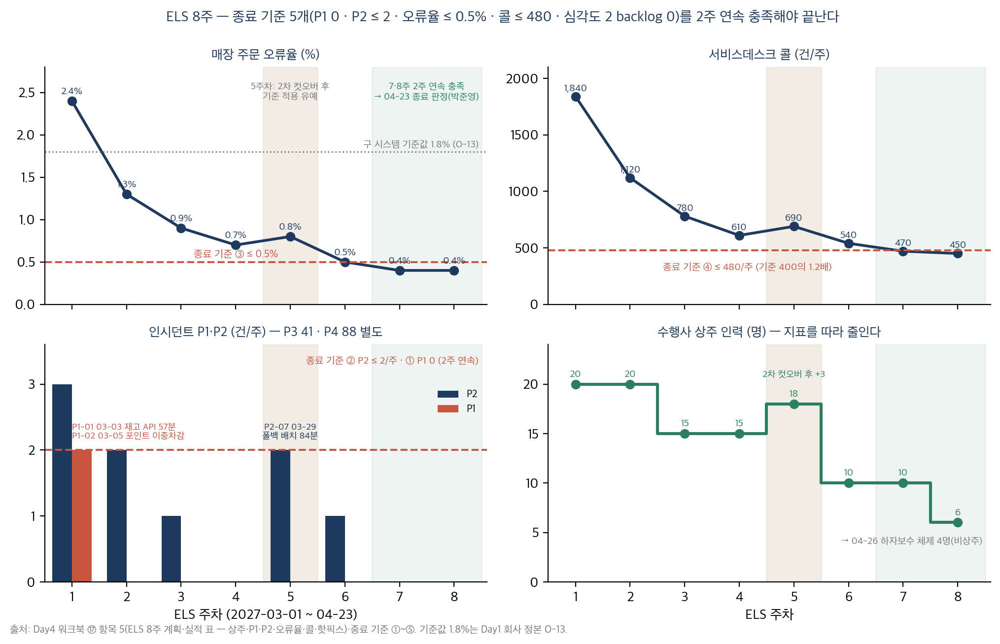

*그림 3-3. ELS 8주의 지표 곡선과 종료 기준. 상주 인력 축소가 지표와 연동되어 있고, 5주차의 재상승은 미리 적힌 유예 조건 안이며, 종료는 "2주 연속"의 지속 조건으로 판정되었다.*

### 실무에서 어떻게 틀리는가

**종료 기준이 없다.** 하이퍼케어가 "안정될 때까지"이고 상주가 하자보수가 된다. **기준이 순간 조건이다.** 한 주 좋았다고 끝낸다. **인력 축소가 달력이다.** 지표와 무관하게 4주 뒤 절반. **2차 이벤트의 유예 조건이 없다.** 2차 컷오버 후 재상승을 두고 ELS 연장 토론이 벌어진다. **다운과 데이터 손상을 섞는다.** P1-02를 다운으로 산입하면 3월 가용성이 틀리고, 산입하지 않는 규칙이 없으면 "왜 안 넣었나"가 된다.

---

## 3.4 Change Enablement · Release · Deployment — 셋을 구분해야 CAB가 정치가 되지 않는다 (심화)

### 개념

세 practice는 흔히 하나로 뭉뚱그려지지만 다른 질문에 답한다. **Change Enablement**는 "이 변경을 해도 되는가"(승인) — 변경 유형(standard·normal·emergency), 변경 권한(change authority), CAB/ECAB, 변경 일정(change schedule)이 요소다. **Release Management**는 "무엇을 언제 묶어 내보내는가"(구성) — 릴리스 단위, 릴리스 일정, 릴리스 노트. **Deployment Management**는 "어떻게 환경에 옮기는가"(실행) — 배포 방식(big-bang·phased·pull·continuous), 배포 절차, 롤백. 컷오버 런북은 Deployment의 문서이고, CR-04(옴니 고도화 3종 R5 이연)는 Release의 결정이며, CAB 잠금(02-20~03-12)은 Change Enablement의 결정이다.

셋을 구분해야 하는 실무적 이유는 **CAB의 안건**에 있다. 셋이 섞이면 CAB는 "이 기능을 넣을 것인가"(제품 결정)와 "이번 주에 배포해도 되는가"(운영 위험 결정)를 한 회의에서 다루게 되고, 전자는 현업이 후자는 운영이 우세하므로 회의는 정치가 된다. 나누면 — 무엇을 넣을지는 릴리스 계획(현업·제품), 언제 어떻게 내보낼지는 CAB(운영 위험, error budget), 표준 변경(standard change — 사전 승인된 저위험 변경)은 CAB에 오지 않는다 — 회의는 계산이 된다(3.6절).

프로젝트에서 운영으로의 이관은 변경 권한의 이전이기도 하다. 프로젝트 중에는 CCB(정미란 위원장, Day3)가 변경 권한이고, 운영 이관 후에는 CAB(박준영 위원장, 수요일)다. 두 회의체가 겹치는 기간(ELS)의 규칙이 있어야 한다 — 온담은 CAB 첫 회 03-17, CCB 해산 05-28, 그 사이 프로젝트 변경(CR-14 잔여·R5 릴리스)은 CCB, 운영 변경(핫픽스·파라미터)은 CAB.

### 온담의 사례로 읽기

> ■ **사례 사실** — 운영 CAB(위원장 박준영)·서비스 리뷰 월 1회·프로젝트 CCB 05-28 해산은 [추가 설정] — Day4 워크북 §2.5 항목 1; CCB 7인 원 구성은 사례 §4.1.

운영 이관 후 거버넌스: 수요일 CAB(위원장 박준영, 위원 인프라·보안·개발운영·수행사 유지보수, 현업 대표 매장운영팀장), 서비스 리뷰 월 1회(박세연·오정근·한동석), 프로젝트 CCB 05-28 해산. CAB 8회(03-17·24·31·04-07…)가 SAC 항목 8의 증빙이다. 운영 문서 9종(배포·형상 절차)에 CAB 변경 모델과 표준 변경 목록이 있다. 미해결 사항 이관 3번(22:00 운용 전환)은 CCB 01-21에서 "P2 안정화 후 CAB 재상정"으로 넘어간 것으로, 프로젝트 변경이 운영 변경으로 권한 이전된 예다.

### 실무에서 어떻게 틀리는가

**CAB가 제품 결정을 한다.** 현업과 운영의 싸움터. **표준 변경이 없다.** 파라미터 하나도 CAB를 거쳐 2주 걸린다. **CCB와 CAB의 인계 규칙이 없다.** ELS 중 변경이 두 회의체에 동시에 올라가거나 어디에도 안 올라간다.

---

## 3.5 SLA/OLA/UC 3층 — 한 층이 비면 SLA는 구조적으로 불가능하다

### 개념

Service Level Management practice의 세 문서. **SLA**(Service Level Agreement)는 서비스 제공자(IT본부)와 고객(현업) 사이의 약속. **OLA**(Operational Level Agreement)는 제공자 내부 팀 간(서비스운영팀 ↔ 인프라팀·보안팀·개발운영파트)의 약속. **UC**(Underpinning Contract)는 외부 공급자(수행사 유지보수·CSP·앱 벤더·3PL·API GW 벤더)와의 계약. 세 층의 관계는 산술이다 — **SLA의 복구 시간 ≥ 그것을 받치는 OLA·UC 사슬의 합**이어야 성립한다. 약속(SLA)은 그 약속을 받치는 안쪽 약속(OLA)과 바깥 약속(UC)의 합보다 강할 수 없다.

이 산술이 실무에서 가지는 힘은 **"한 층이 비면 SLA는 협상이 아니라 산술로 불가능하다"**는 데 있다. UC의 복구 시간이 SLA보다 길면 SLA는 처음부터 지킬 수 없고, UC 자체가 없으면(외부 조직의 작업인데 계약이 없으면) 어떤 OLA로도 성립하지 않는다. 그래서 SLA 서명 전에 항목별로 3층 매핑표를 만들어 가장 긴 사슬을 합산해야 하고, 합이 SLA를 넘는 항목은 (a) UC를 재협상하거나 (b) OLA를 강화하거나 (c) SLA를 "최선 노력(best effort)"으로 강등해야 한다. 강등은 후퇴가 아니라 **정직한 경계 표시**다 — IT본부가 자기가 통제하지 못하는 조직의 작업 시각을 현업에 SLA로 약속하면 첫 미달에서 SLA 전체의 신뢰가 무너진다.

### 온담의 사례로 읽기

> ■ **사례 사실** — SLA 7·OLA 3·UC 5의 문안과 시간값(P1 복구 2시간, 수행사 UC 초안 복구 4시간 → 재협상 90분, 3PL UC 부재)은 [추가 설정] — Day4 워크북 §2.5 항목 4; 3PL WMS 계약이 물류본부 소관이라 P1이 UC를 맺을 수 없다는 구조는 사례 §3.5·§6.4.

SLA 7항목, OLA 3, UC 5, 서명 05-14. 항목 ②와 ⑥이 핵심이다.

**② P1 인시던트 복구 — 응답 15분 / 복구 2시간.** OLA: 데스크 접수 → 인프라·개발운영 착수 30분 → 원인 분리 30분. UC(수행사 유지보수 초안): 착수 1시간·복구 4시간. 사슬 = 15 + 30 + 30 + 240 = **315분 > 120분**. 초안 상태에서 SLA P1 복구 2시간은 UC 4시간 하나만으로 이미 불가능했다. 재협상 → 착수 30분·복구 90분(24/7 대기, 연 +0.6억 [추가 설정]) → 15 + 30 + 30 + 90 = 165분, 병렬 착수로 ≤ 120 → 성립. 이 재협상은 G3 사전 점검(01-28)에서 발견되어 05-14 전에 끝났다. G4에서 처음 발견되었다면 SLA는 발효되지 못한 채 이관되었을 것이다.

**⑥ 출고 확정 D+1 06:00 — B-08 리드타임 12h의 운영 전제.** 가맹 점주가 가장 원하는 약속이다. 그러나 출고 확정은 대성로지스 WMS의 작업이고, 대성과의 계약은 물류본부 소관이며(P1 예산 밖, Day3 계약 구조표), 준실시간 연동은 거부되었다(R-03·IS-05). **3PL UC 없음 → 구조적 불가 → "최선 노력"으로 강등**, 2027-06 3PL 재협상(계약 변경 로그 7번) 후 재상정 → 이관 목록 4번(한동석, 06-30). ④ 일마감·폴백 배치 완료 항목도 같다 — 배치 종료는 P1 측 통제 가능이므로 성립하되, 3PL UC는 "배치 파일 수신 확인 30분"으로 **한정** 서명(한동석 05-10). 2022년 WMS 고도화 축소 회의록에 물류본부장 서명란이 비어 있었던 회사(정본 §6.5)에서, 3PL UC 부재를 표에 드러내는 것 자체가 진전이다.

나머지 — ① 가용성 99.5%(CSP 리전 99.9%, 벤더 패치 영업일 1일; ② 재협상 조건부 성립), ③ P2 복구 8시간(30 + 60 + 240 = 330 ≤ 480 성립), ⑤ 가맹 발주 마감 처리(P1 내부, 성립), ⑦ 앱 주문 연동 장애 복구 4시간(앱 벤더 UC 복구 3시간 + 개발운영 30분 = 210 ≤ 240 성립 — R-18 협상 결과 월 3,600만 원, 이관 5번).

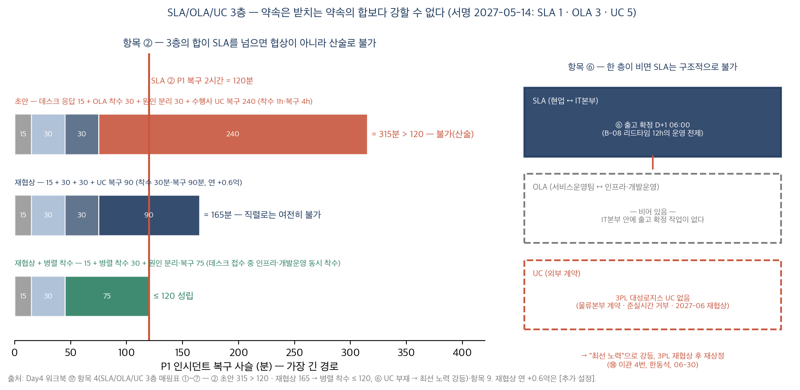

*그림 3-4. SLA/OLA/UC 3층의 산술 — 항목 ② 사슬 315분 > 120분(초안 불가 → UC 재협상 후 성립), 항목 ⑥ UC 부재(구조적 불가 → 최선 노력 강등). 3층 매핑표가 하는 일은 SLA를 좋게 만드는 것이 아니라 SLA가 어디까지 진실인지를 보이는 것이다.*

### 실무에서 어떻게 틀리는가

**SLA만 서명한다.** OLA는 구두, UC는 계약서 어딘가. 첫 P1 인시던트에서 수행사가 "우리 계약은 4시간"이라고 말한다.

**UC가 없는 항목을 SLA에 넣는다.** 3PL·외부 기관·다른 본부 소관의 작업을 IT본부가 약속한다.

**강등을 패배로 본다.** 그래서 강등 대신 거짓 서명을 한다. 강등은 재협상 안건의 목록이다.

**사슬을 합산하지 않는다.** 항목별로 가장 긴 사슬을 적어 보기 전에는 315분이 보이지 않는다.

---

## 3.6 Error budget — 99.5%를 3시간 39분으로, 다시 릴리스 속도로 환전하기

### 개념

SLA 99.5%는 운영 조직에게는 "지켜야 할 숫자"이고 프로젝트 조직에게는 "넘지 않으면 되는 숫자"다. 같은 숫자를 다르게 읽으면 릴리스마다 "위험하다 / 필요하다"의 토론이 된다. SRE(Beyer 외, 2016, 3장·4장)의 **error budget**은 그 토론을 계산으로 바꾼다. 가용성 목표를 시간으로 환산하면 "한 달에 이만큼은 멈춰도 된다"는 예산이 나오고, 그 예산은 장애(비계획)에만 쓰는 것이 아니라 **릴리스에도 쓰는** 것이다. 릴리스 한 번은 기대값으로 "변경 실패율 × 복구 시간"만큼의 예산을 먹는다. 그러면 릴리스 가능 횟수 = 릴리스 몫 ÷ 릴리스당 기대 다운이 되고, 릴리스 속도는 기능의 문제가 아니라 **복구 시간의 문제**임이 드러난다. 그리고 error budget policy — 예산이 소진되면 릴리스를 동결하고 다음 달 초기화한다는 규칙 — 가 있어야 예산이 예산이 된다.

계산은 이렇다. 평균 달의 분 수 = 365.25 / 12 × 1,440 = 43,830분. 0.5% = **219.2분 = 3시간 39분**(28일 달 202분, 30일 216분, 31일 223분). 계획 정지(CAB 승인된 유지보수 창, 2차 컷오버 8시간)는 SLA 산정에서 제외한다. 예산을 비계획 유보와 릴리스 몫으로 나눈다 — 온담은 60 : 40, 즉 131.5분 : 87.7분. 릴리스당 기대 다운을 DORA 지표(변경 실패율·복구 시간 — Day3 2.7절)로 계산한다.

### 온담의 사례로 읽기

> ■ **사례 사실** — 가용성 목표 99.5%와 릴리스당 기대 다운 시간은 [추가 설정] — Day4 워크북 §2.5 항목 3, 검산 `그림/PM_Day4/src/day4_closing.py`; 매장 영업시간·615개 매장(C-09)은 사례 §1.4.

| 릴리스당 기대 다운 | 계산 | 월 릴리스 가능 | 주 환산 |
|---|---|---|---|
| DORA 실측(2026-09): 실패율 12% × 복구 240분 | **28.8분** | 87.7 / 28.8 = **3.0회** | 0.7회 — 주 1회 불가 |
| ELS 목표: 10% × 45분 | **4.5분** | **19.5회** | 4.5회 |
| 중간 목표(하자보수기): 10% × 90분 | 9.0분 | 9.7회 | 2.2회 — CAB 표준 릴리스 주 1회 + 핫픽스 |

DORA 실측(12%·4시간)으로는 월 3회가 한계이고, ELS 목표(10%·45분)로는 월 19회다. 즉 릴리스 속도를 여섯 배로 만드는 것은 기능 팀이 아니라 **복구 시간을 240분에서 45분으로** 만드는 것이며, 복구 45분은 KEDB(우회 방법이 준비된 오류)·회귀 자동화(R-19의 0.25억 회귀 도구)·롤백 스크립트의 문제다. 이것이 SRE가 error budget을 "안정과 속도의 환율"이라 부르는 이유이고, 그 환율이 있으면 CAB는 정치가 아니라 계산이 된다.

Error budget policy: 월 누적 다운이 유보 131.5분을 넘으면 표준 릴리스 동결(핫픽스만), 다음 달 초기화 / 릴리스 몫 87.7분 소진 시 CAB 승인 릴리스만. 결정자 박준영, 이의 시 서비스 리뷰. ELS 실적: 3월 다운 57분(P1-01) = 예산 223분의 26%, 유보의 43% / 4월 0분. R5 릴리스(05-07)와 핫픽스 11건이 이 예산 안에서 결정되었다.

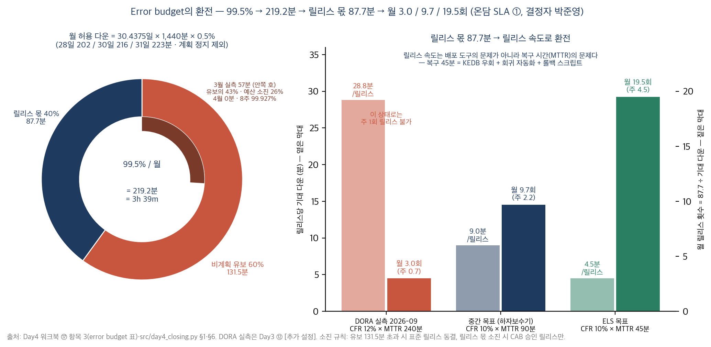

*그림 3-5. Error budget의 환전 — 99.5% → 219.2분 → 릴리스 몫 87.7분 → 복구 시간에 따라 월 3.0회 / 9.7회 / 19.5회. 릴리스 속도를 여섯 배로 만드는 것은 기능이 아니라 복구 시간이다.*

### 실무에서 어떻게 틀리는가

**가용성을 퍼센트로만 본다.** 99.5%가 3시간 39분이라는 것을 아무도 계산하지 않고, "99.5%면 거의 안 멈추는 것"으로 읽는다. **예산을 장애에만 쓴다.** 릴리스는 예산 밖의 "위험"이 되고 운영은 릴리스 금지로 간다. **policy가 없다.** 예산이 소진되어도 아무 일도 안 일어나면 예산이 아니다. **계획 정지를 산입한다.** 2차 컷오버 8시간을 넣으면 3월 가용성이 98.7%가 되고 헌장 §14 ④가 흔들린다 — 제외 규칙이 미리 있어야 한다.

---

## 3.7 Incident와 Problem, Known Error DB — 인시던트를 닫는 것과 문제를 닫는 것은 다르다 (심화)

### 개념

**Incident Management**는 서비스를 복구하는 practice이고, **Problem Management**는 원인을 제거하는 practice다. 인시던트는 복구되면 닫힌다 — 원인을 몰라도. 문제는 원인이 제거되어야 닫힌다 — 인시던트가 재발하지 않아도. 둘을 섞으면 "복구했으니 끝"이 되어 같은 인시던트가 매주 돌아오거나, "원인을 못 찾았으니 안 끝났다"가 되어 인시던트 티켓이 영원히 열려 있다. **Known Error**는 원인이 알려졌고 우회 방법(workaround)이 있으나 근본 제거가 아직 안 된(또는 안 하기로 한) 문제이며, **Known Error Database(KEDB)**는 그 목록이다. KEDB의 각 항목은 증상·우회·근본 원인·상태·소유자·연결 인시던트를 갖는다. KEDB가 있으면 서비스데스크의 1차 해결률이 오르고(우회 방법이 있으므로), 복구 시간이 준다(error budget의 릴리스 몫이 는다).

SAC 항목 6이 "ELS 중 식별된 Known Error 전부 등재"인 이유는, ELS가 끝났을 때 운영 조직이 단독으로 지원할 수 있으려면 "무엇이 알려진 오류이고 어떻게 우회하는가"가 문서로 넘어와야 하기 때문이다. 근본 제거를 안 하기로 한 결정(사용률 1% 미만, ECC 교체 전까지 유지)도 KEDB에 적힌다 — 그것이 잔여 리스크의 운영 이관이다(4.6절).

### 온담의 사례로 읽기

> ■ **사례 사실** — ELS 인시던트 140·문제 레코드 9·Known Error 6은 [추가 설정] — Day4 워크북 §2.5 항목 6.

ELS 8주 인시던트 140, 문제 레코드 9 = 근본 원인 제거 3(재고 API 커넥션 풀·PG 타임아웃 재시도·포털 세션) + **Known Error 6**.

| KE | 증상 | 우회 | 근본 원인 · 상태 | 소유자 |
|---|---|---|---|---|
| KE-01 | 구형 단말(잔여 9점) 영수증 인쇄 지연 8초 | 재부팅·인쇄 큐 초기화 | 펌웨어 드라이버 호환(CR-14 패치 범위 밖) — 단말 교체 협의(이관 2번) | 오정근 |
| KE-02 | 폴백 배치 1회차 40분 초과 시 2회차와 겹쳐 재고 정합 오류(R-16) | 1회차 22:30로(파라미터) | 배치 대상 증가(2차 후 센터 포함) — 근본 해소는 3PL 준실시간 전환 시(2027-06) | 한동석·박준영 |
| KE-03 | 반품 시 멤버십 취소 이벤트 중복 → 포인트 이중차감 | 중복 검출 배치 + 자동 복구 | 이벤트 멱등 키 누락 — **근본 제거 03-12 핫픽스**, 재발 감시로 KEDB 잔류 | 수행사 유지보수 |
| KE-04 | IF-SAP-12 타임아웃 시 재시도 3회 후 실패 | 수동 재전송 화면 | SAP ECC 야간 배치와 경합 — ECC 교체(2027-12 EoM) 전까지 유지 | 박세연 |
| KE-05 | 엑셀 발주 구형 xls 인코딩 수량 0 | xlsx 변환 안내·업로드 전 검증 | 구형 라이브러리 — 사용률 1% 미만, 제거 보류(CAB 04-14) | 박준영 |
| KE-06 | 옴니 매장 간 재고 이동 시 예약 반영 15분 지연 | 안내 문구·재조회 | 3PL 폴백 배치 주기 — KE-02와 동일 원인 계열 | 오정근 |

여섯 항목의 "상태" 열을 보라. 근본 제거 완료(KE-03), 다른 과제에 의존(KE-02·06 → 3PL 재협상, KE-04 → ECC EoM), 의도적 보류(KE-05), 협의 중(KE-01). 상태가 다르므로 소유자가 다르고, 소유자가 다르므로 이관처가 다르다 — KE-01은 이관 목록 2번, KE-02는 4번, KE-04는 7번으로. Day3 등록부의 R-13(구형 단말)·R-16(배치 충돌)이 KE-01·KE-02가 된 것이 "잔여 리스크의 운영 이관"의 실물이다(4.6절).

### 실무에서 어떻게 틀리는가

**인시던트를 원인 제거까지 열어 둔다.** 티켓이 안 닫히고 데스크의 지표가 망가진다. **문제를 복구와 함께 닫는다.** 재발한다. **KEDB가 없다.** 우회 방법이 데스크 담당자의 머릿속에 있고, 그 담당자가 바뀌면 1차 해결률이 떨어진다. **"보류" 결정을 적지 않는다.** KE-05를 제거하지 않기로 한 CAB 결정이 기록되지 않으면 6개월 뒤 "왜 안 고쳤나"가 된다.

---

## 3.8 개인정보 보호법 개정과 운영 의무 — 조문은 단정하고 적용은 단정하지 않는다

### 개념

개인정보 보호법 개정(법률 제21445호, 2026-03-10 공포, **2026-09-11 시행**)은 운영 단계의 의무를 바꿨다. 조문 수준에서 단정할 수 있는 것: 통지·신고 대상인 **'유출등'의 정의에 분실·도난·유출 외에 위조·변조·훼손이 포함**되었고, 유출등을 알게 된 때부터 **72시간 이내** 정보주체 통지·보호위원회 신고(신고 대상 요건은 시행령·고시)이며, 과징금 기준이 상향되었다. 조문 수준에서 단정할 수 없는 것: 개별 사건이 '훼손'에 해당하는가 — 시행 초기에 해석례·결정례가 없는 상태에서 그것을 단정할 수 있는 사람은 없다.

이 절의 규율은 워크북 §0.1 규칙 7의 한 문장 — **"법령은 조문을 단정하되 적용은 단정하지 않는다"** — 이고, 거기에 하나를 더한다: **시한은 단정한다.** 적용을 단정할 수 없다고 결정을 미루면 72시간은 지나간다. 그래서 운영 절차에는 규제 적용의 판단과 별개로 "인지 시각 기록 → CPO 24시간 내 의견 → 정보주체 통지·복구 즉시 → 신고 판단 48시간 내"라는 시한이 있어야 한다. 통지·복구는 규제 해당 여부와 무관하게 즉시 한다 — 그것은 법의 문제가 아니라 영향받은 사람의 문제이기 때문이다.

### 온담의 사례로 읽기

> ■ **사례 사실** — P1-02 포인트 이중 취소 사건(03-05 14:20 인지, 3,412건, 2,987명)은 [추가 설정] — Day4 워크북 §2.5 항목 7; 멤버십 218만·개인정보 보호법 대응 2026-09-11·CPO 최영주는 사례 O-02·§3.4·§4.2. 조문(법률 제21445호, 72시간 통지)은 3.8절 본문.

P1-02, 2027-03-05(금) **14:20 인지**(서비스데스크 동일 유형 문의 31건 집계 → P1 선언). 03-01~05 반품 처리 3,412건에서 멤버십 포인트 취소가 2회 적용, 영향 회원 **2,987명**(가맹 2,140·직영 847), 오차감 합계 1,284만 포인트. 원인 KE-03(이벤트 멱등 키 누락). 외부 접근·유출 정황 없음(보안팀 로그 03-05 20:00 확인). 다운 0.

쟁점(적용 — 단정하지 않음): ① 시스템 오류로 회원의 포인트 잔액이 사실과 다르게 기록된 것이 '훼손'에 해당하는가 — 개정법 시행 후 해석례 부재. ② 해당한다면 2,987명이 신고 대상 규모 요건에 해당하는가(시행령 기준). ③ 복구 완료 후에도 신고 의무가 유지되는가.

최영주 CPO 검토 의견(03-06(토) 11:00, 서면): "①은 해석 여지가 있다. 포인트 잔액은 회원 식별 정보와 결합된 개인정보이고 개정법이 '훼손'을 명시한 취지(외부 유출 없이도 무결성 침해를 포착)에 비추어 해당 가능성을 배제할 수 없다. 단정할 수 없으므로 **보수적으로 72시간 내 신고를 권고**한다. 정보주체 통지·복구는 규제 해당 여부와 무관하게 즉시 실시한다."

결정(정미란·최영주·박준영·P1 PM, 03-06 14:00): 회원 개별 통지(앱 푸시·문자)·포인트 자동 복구 **03-06 18:00 완료** / **개인정보보호위원회 신고 03-07(일) 16:00** — 기산 후 49시간 40분 / 협의회(서정필) 서면 설명 03-08 / 재발 방지: 멱등 키 핫픽스 03-12, 중복 검출 배치, 운영 문서 8종(보안 운영 절차) 갱신. 기록: 데스크 티켓 #ELS-0417 14:20, 보안 로그 확인서, CPO 의견서, 신고 접수증, 통지 발송 로그 2,987건, 사본 윤태호.

기록을 "법상 신고 대상이므로 신고"로 정리하면 깔끔하지만 거짓이다. 조문(정의에 훼손이 포함된다, 72시간이다)은 단정하고, 적용(이 사건이 훼손인지)은 단정하지 않으며, 그럼에도 시한 안에 결정한다(49시간 40분). 이 셋을 분리해 적어야 다음 사건에서 "지난번에 신고했으니 이번에도"가 아니라 "지난번의 쟁점 ①이 그 후 결정례로 정리되었는가"를 볼 수 있다. 그리고 이 절차가 사건 당시 운영 문서에 없어 결정 회의를 소집해 처리했다는 사실이 L-14다 — 잘됨이되 절차화가 필요한 교훈.

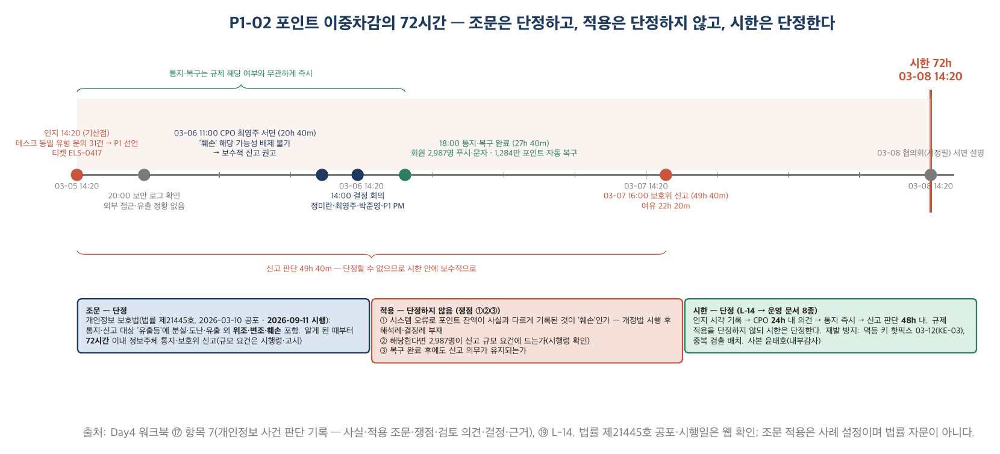

*그림 3-6. P1-02 포인트 이중차감의 72시간 — 인지 14:20에서 신고 49h 40m까지. 조문은 단정, 적용은 비단정, 시한은 단정. 통지·복구(27h 40m)는 규제 판단과 분리해 즉시.*

### 실무에서 어떻게 틀리는가

**적용을 단정한다.** "해당 안 됨"으로 결론 내고 72시간을 넘긴다. 또는 "해당됨"으로 결론 내고 그것이 다음 사건의 선례가 된다. **적용을 단정할 수 없으니 결정을 미룬다.** 시한이 지난다. **인지 시각을 기록하지 않는다.** 72시간의 기산점이 없으면 시한 준수를 증명할 수 없다. **통지·복구를 규제 판단에 묶는다.** 신고 여부를 다투는 동안 2,987명은 잘못된 잔액을 본다. **CPO의 의견을 "판정"으로 쓴다.** 최영주의 문장은 "검토 의견을 제공하지, 결정하지 않는다"(정본 §4.2)였고, 결정은 정미란이 했다.

---

## 3.9 사용자 채택과 변화관리 — 저항은 정보다 (심화)

### 개념

시스템은 배포되었다고 채택되지 않는다. 채택(adoption)은 사용자가 구 방식을 버리고 신 방식을 쓰는 것이며, 그것은 교육 이수율이 아니라 **사용 지표**로 잰다 — 전화·팩스·엑셀 발주 비율, 마감 준수율, 절차 준수율, 데스크 1차 해결률, 사용률. 그리고 채택의 장벽은 집단마다 다르므로 진단이 먼저다.

세 모형을 빌린다. **ADKAR**(Prosci, Hiatt 2006)는 개인의 전환을 Awareness(인식) → Desire(욕구) → Knowledge(지식) → Ability(능력) → Reinforcement(강화)의 다섯 단계로 보고, 채택이 안 되는 집단이 어느 단계에 막혀 있는지를 진단한다 — 모르는가(A), 원하지 않는가(D), 모르는가(K), 못 하는가(A), 알고 할 수 있는데 안 하는가(R). 장벽이 R이면 교육을 더 해도 오르지 않는다. **Kotter**(1996)의 8단계 중 운영 전환기에 쓰는 것은 "단기 성과(short-term wins)의 창출과 공지"다 — 첫 측정값을 빨리 보이는 것. **Bridges**(1991)는 변화(change — 외부 사건)와 전환(transition — 내면의 과정)을 구별하고, 전환의 첫 단계가 "끝냄(ending)"이라고 말한다 — 새 것을 시작하기 전에 옛 것을 제대로 끝내야 한다.

그리고 저항에 관한 재해석 — Ford, Ford & D'Amelio(2008)는 저항을 "변화 추진자가 극복할 장애"로 보는 관행을 뒤집어, 저항이 **변화의 설계에 관한 정보**이며 때로는 추진자 자신이 만든 것이라고 논증했다. 운영 전환기의 저항 — "이번엔 없어지지 않는 건가요"(강윤지), "처리량 목표가 인력 절반이라는 뜻이라면"(김미르) — 은 극복할 것이 아니라 읽을 것이다. 전자는 2019년의 기억이 만든 D(욕구) 장벽이고 후자는 편익 지표와 인력 평가의 연결에 대한 A/D 장벽이며, 둘 다 교육이 아니라 **서면의 약속**(한동석 04-12 "재고 정확도 리포트는 인력 평가에 쓰지 않음")과 **끝냄의 의례**(OD-POS 종료 세션)로 답한다.

### 온담의 사례로 읽기

> ■ **사례 사실** — 채택 지표(2·4·8주)와 ADKAR 장벽·조치는 [추가 설정] — Day4 워크북 §2.5 항목 8; 가맹 발주의 39%가 전화·팩스·엑셀, 슈퍼유저·교육은 P3 소관(사례 §2.1·§2.5), 강윤지 지역매니저의 "이번엔 없어지지 않나요"(§4.2).

| 집단 | 지표 | 2주 | 4주 | 8주 | 장벽 | 조치 |
|---|---|---|---|---|---|---|
| 가맹 점주(388점) | 전화·팩스·엑셀 발주 39% → 15% 이하 | 24% | 16% | **11%** | K/A — 구형 단말 9점, 60대 이상 점주 27% | P3 방문 교육 2회차, R5 "간편 재발주". D 장벽은 부속서 동의 91%로 해소 |
| 가맹 점주 | 마감 20:00 준수율 → 95% | 81% | 90% | 96% | R — 마감 놓치면 다음날 출고 불가 경험이 강화 | 마감 30분 전 알림 |
| 직영(227점) | 반품 신규 절차 준수율 → 95% | 78% | 88% | 94% | **R** — 알지만 바쁜 시간대 생략 | POS 화면 강제 확인 단계(03-12 핫픽스와 함께), 지역매니저 점검 |
| 서비스데스크(11명) | 1차 해결률 → 70% | 52% | 64% | 73% | K — FAQ 부족 | FAQ 20건, KEDB 우회 공유 |
| 물류센터(246명) | 센터 재고 조회 사용률 → 90% | — | — | 87%(4주) | A/D — 노조 우려 | 한동석 서면 04-12 |

가맹 점주의 채택률(39% → 11%)이 오른 것은 교육 때문이 아니라 부속서 동의(12-22, 91%)로 D 장벽이 먼저 풀렸기 때문이고, 남은 장벽은 K/A다. 직영의 반품 절차 준수율(78%)은 지식 부족이 아니라 R이므로 교육을 더 해도 오르지 않고, 화면에서 강제하는 단계와 점검이 답이었다 — 그리고 그 절차 미준수가 P1-02(반품 시 이벤트 중복)의 노출면이었다. 단기 성과 공지(Kotter): 04-05 협의회 공문 "가맹 발주 리드타임 38시간 → **13.6시간**(4월 1주 평균)" — 목표 12시간은 M+12 판정이지만 첫 측정값을 5주 만에 보였다. 끝냄(Bridges): 03-19 OD-POS 2.1 종료 세션.

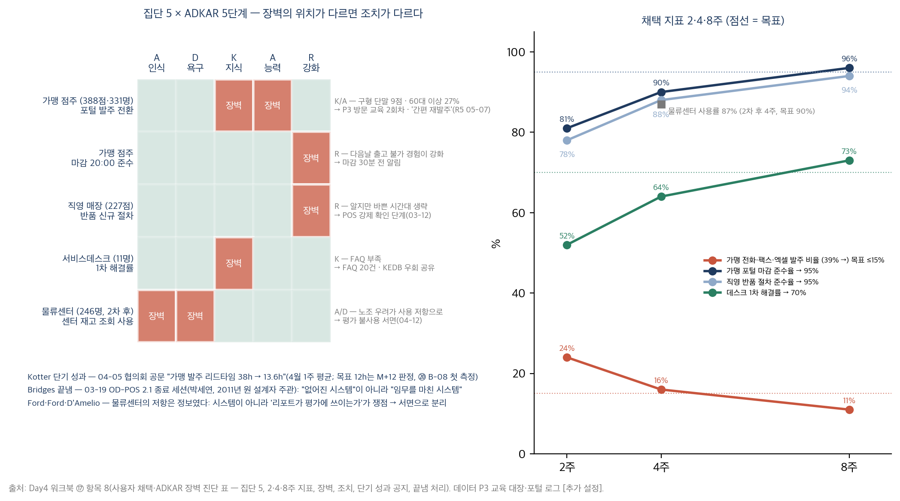

*그림 3-7. 집단별 ADKAR 장벽 진단과 채택 지표 곡선. 장벽이 다르므로 조치가 다르다 — R 장벽에 교육을 더 하면 채택률은 교육 이수율과 함께 오르는 척하다가 ELS가 끝나면 내려간다.*

### 실무에서 어떻게 틀리는가

**채택을 교육 이수율로 잰다.** 100% 이수, 39% 여전히 팩스. **모든 집단에 같은 교육을 한다.** 장벽 진단이 없으므로. **저항을 극복 대상으로 본다.** 김미르의 질문에 답하지 않고 "변화 관리 세션"을 연다. **끝냄을 생략한다.** 구 시스템이 어느 날 조용히 꺼지고, 15년을 그 시스템과 일한 사람들은 "없어졌다"고 느낀다.

---

## 3.10 표준에서는 — ISO/IEC 20000, PMBOK 8판 운영 준비도, PRINCE2 7 hand over products (심화)

**ISO/IEC 20000-1**(서비스 관리 시스템 요구사항)은 서비스 수준 관리·공급자 관리·인시던트·문제·변경·릴리스·배포 조항을 두며, 인증 심사에서 이 장의 문서들 — SLA/OLA/UC 서명본, 인시던트·문제 레코드, KEDB, CAB 회의록, 릴리스 기록 — 이 증적이 된다. 조항 번호는 원문 대조를 전제로 하되, 이 장의 3층 매핑표·ELS 계획·KEDB가 심사 증적으로 그대로 쓰일 수 있도록 작성되어 있다는 점을 기억하라. **PMBOK 8판**은 Closing Focus Area에서 "운영 준비도(operational readiness)"를 종료 조건으로 두고 Stakeholders 성과영역에서 운영 조직·사용자 채택을 다룬다 — SAC와 채택 지표가 그 실행이다. **PRINCE2 7**은 Closing a Project의 hand over products 활동에서 인수를 "운영·유지보수 조직의 공식 수용"으로 정의하고, Organizing practice에서 운영·유지보수 인터페이스 역할을 두며, 편익 리뷰의 책임을 프로젝트 종료 후 Senior User에게 넘긴다. 세 표준이 공통으로 요구하는 것은 하나 — **인수는 받는 쪽의 서명이다.**

## 3.11 실무에서 어떻게 틀리는가

이 장의 오류는 **약속과 그 약속을 받치는 것을 분리하지 않는 것**으로 수렴한다. SLA를 서명하되 OLA·UC를 합산하지 않고(315분), SAC를 만들되 거부권과 조건부 경로를 두지 않으며, ELS를 두되 종료 조건과 인력 축소를 연동하지 않고, 가용성을 약속하되 error budget과 policy를 두지 않으며, 인시던트를 닫되 문제를 열지 않고, 조문을 알되 적용 판단의 시한을 두지 않으며, 채택을 요구하되 장벽을 진단하지 않는다. 그리고 ITIL 판본을 말하되 어느 어휘를 왜 쓰는지 고지하지 않는다.

---

## 제3장 핵심 정리

> **한 줄씩 — 수업 직전 5분 복습용**
> 1. ITIL 현행 판본은 v5다 — 이 교재가 4 어휘를 쓰는 것은 운영 규정과 벤더 문서가 그 말을 쓰기 때문이다.
> 2. SAC는 판정자가 인수자이고 거부권이 실재해야 문서가 장치가 된다.
> 3. ELS는 종료 조건(n주 연속)과 인력 축소 계획이 연동되어야 한다 — 없으면 상주가 된다.
> 4. SLA는 그것을 받치는 OLA·UC 사슬의 합보다 강할 수 없다 — 한 층이 비면 약속이 아니다.
> 5. 가용성 목표는 error budget(분)으로, 다시 릴리스 속도로 환전해야 운영과 개발이 같은 숫자를 본다.
> 6. 인시던트는 복구로 닫고 문제는 원인 제거로 닫는다 — Known Error에는 상태와 소유자가 있다.
> 7. 법 조문은 단정하고 적용은 단정하지 않는다 — 판단 기록을 남긴다; 저항은 정보다.
>
> 아래는 같은 내용의 자세한 판이다.

1. ITIL의 현행 판본은 Version 5(2026-02-12)이며 상위 구조 명칭(ITIL Value System)과 가치 흐름 모델(Product and Service Lifecycle 8활동)이 바뀌었고 34 practices·7 원칙·4 차원은 유지되었다. 이 교재는 practice 명칭(ITIL 4 어휘)으로 고정해 쓴다 — 회사의 규정·계약이 그 어휘이고, practice 이름은 판본이 바뀌어도 같으며, 다투는 것은 어휘가 아니라 판단이기 때문이다. "4가 최신"이라고 쓰지 마라.
2. SAC는 판정자가 인수자이고 거부권이 헌장에 실재하며 조건부 충족의 경로("미해소 0 또는 기한·책임자 서명")가 있을 때 문서에서 장치가 된다. G1 초안 → 월 검토 → G3 사전 점검(미해소 7) → G4 판정(충족 11·조건부 1). 조건부 1건은 이관 목록 1번이 된다.
3. ELS는 기간·종료 기준("n주 연속"의 지속 조건)·인력 축소 계획이 연동되어야 하고, 2차 이벤트의 유예 조건이 미리 있어야 한다. 온담 8주: 인시던트 140(P1 2·P2 9·P3 41·P4 88), 핫픽스 11, 상주 20 → 4, 04-23 종료. Change Enablement·Release·Deployment를 구분해야 CAB가 정치가 되지 않는다.
4. SLA는 그것을 받치는 OLA·UC 사슬의 합보다 강할 수 없다 — 항목 ② 315분 > 120분(UC 재협상 후 성립), 항목 ⑥ 3PL UC 부재(최선 노력 강등). 한 층이 비면 SLA는 협상이 아니라 산술로 불가능하고, 강등은 정직한 경계 표시다. Error budget: 99.5% → 219.2분 → 릴리스 몫 87.7분 → 복구 240분이면 월 3.0회, 45분이면 19.5회. 릴리스 속도는 복구 시간의 문제이고, KEDB(6건)·회귀 자동화·롤백 스크립트가 그 답이다.
5. 인시던트는 복구로 닫고 문제는 원인 제거로 닫으며, Known Error는 상태(제거·의존·보류·협의)와 소유자를 갖고 이관된다. 개인정보 사건은 조문 단정·적용 비단정·시한 단정의 세 줄로 적는다(P1-02: 인지 14:20 → 통지·복구 27h 40m → 신고 49h 40m). 채택은 사용 지표로 재고 장벽(ADKAR)은 집단별로 진단하며, 저항은 극복할 것이 아니라 읽을 정보다(Ford·Ford·D'Amelio).

## 생각해 볼 질문

1. 여러분 회사의 운영 규정은 어느 ITIL 판본의 어휘로 되어 있는가. v5의 8활동으로 다시 매핑한다면 ELS는 어느 활동의 경계에 놓이는가.
2. 여러분이 서명한(또는 받은) SLA 중 UC가 없는 항목이 있는가. 그 항목의 첫 미달에서 무슨 일이 일어났는가 — SLA 전체의 신뢰가 흔들렸는가, 아니면 아무도 SLA를 읽지 않았는가.
3. 99.5%를 분으로 환산해 본 적이 있는가. 그 예산 중 릴리스 몫을 정하고 릴리스당 기대 다운을 계산하면 여러분 조직의 월 릴리스 가능 횟수는 몇인가. 실제 횟수와 어느 쪽이 큰가.
4. 포인트 이중차감이 '훼손'에 해당하는지에 대해 여러분은 어느 쪽으로 기우는가. 그 판단과 무관하게 49시간 40분 안에 결정할 수 있는 절차가 여러분 회사에 있는가.
5. 김미르 지부장의 "처리량 두 배가 인원 절반이라는 뜻이라면 그 숫자를 누가 승인했는지 먼저 답하십시오"는 저항인가 정보인가. 한동석의 서면(04-12)이 없었다면 센터 사용률 87%는 어떻게 되었을 것 같은가.

## 워크북 연결

이 장은 워크북 §1 항목 8(SAC 12항목 — 3.2절)과 §2(⑰ 운영 이관 체크리스트·SLA/OLA/UC·ELS) 전체에 대응한다. §2 항목 2 운영 문서 12종(3.2절의 SAC 항목 1·10), 항목 3 error budget(3.6절), 항목 4 3층 매핑표(3.5절), 항목 5 ELS 8주(3.3절), 항목 6 Incident vs Problem·KEDB(3.7절), 항목 7 개인정보 사건 판단 기록(3.8절), 항목 8 사용자 채택·ADKAR(3.9절), 항목 9 이슈 종결·인수 서명(3.4절의 CCB → CAB, Day3 이슈 미결 6건의 처리). §2.6 해설의 검산(219.2 = 43,830 × 0.005, 87.7/28.8 = 3.05, 3월 가용성 99.872%, 사슬 315 > 120, 72시간 기산 → 시한 03-08 14:20)을 따라 하고, §2.7 기본 과제(3PL 재협상 타결 시 3층 매핑표 재작성)는 3.5·3.6·3.7절의 결합 문제다.

---

# 제4장 종료 — 보고서는 마지막 독자를 위해 쓴다

## 4.1 종료 보고서의 구조 — 선언이 아니라 증명

### 개념

종료 보고서(End Project Report)는 "이 프로젝트가 승인받은 것 대비 무엇을 얼마에 언제 어떤 품질로 인도했고, 무엇을 남겼는가"를 이사회와 내부감사가 읽을 수 있게 적은 문서다. PRINCE2 7이 정한 내용은 PID(헌장·기준선) 대비 성과, 편익 리뷰 계획, 교훈, 후속 조치 권고이며, PMBOK 8판은 Closing Focus Area에 성과 평가·계약 종결·재무 정산·기록 보관·팀 해산을 둔다. 온담 P1 종료 보고서의 여덟 항목 — ① 문서 정보·완료 기준 판정, ② 기준선 대비 최종 성과, ③ 변경 로그 총괄, ④ 컨틴전시·관리예비비 집행 총괄, ⑤ 잔여 리스크 이관, ⑥ 미해결 사항 이관 목록, ⑦ 계약 종결, ⑧ 문서·형상 인수·팀 해산·승인 — 은 그 둘을 합친 것이다.

종료 보고서가 **선언**이 아니라 **증명**이 되는 조건은 하나다 — **모든 숫자가 월별 성과보고·변경 로그·등록부·품질 기록·계약 서면의 어느 행에서 왔는지 추적된다.** 추적되지 않는 숫자는 종료 시점에 만들어진 숫자이고, 그것이 2019년 세 줄과 2027년 여덟 항목의 차이다. 그래서 종료 보고서의 첫 줄은 입력 목록이다 — 성과보고 제17호(05-31), 변경 로그 v1.4, 등록부 v1.4, 품질 통제 기록 최종, 계약 종결 서면 7건, SAC 판정(05-21), ELS 종료 보고(04-23), 편익 실현 원장 v1.0. 그리고 완료 기준 판정 — 헌장 §14의 다섯 기준 각각에 판정·근거·일자·판정자.

온담에서 종료 보고서가 증명해야 하는 것 셋은 2020·2023년 지적사항에서 온다. ① 기준선 대비 실적이 월별 기록에서 그대로 왔고(편익 산정 근거 부재 → 근거 있음), ② 컨틴전시·관리예비비의 모든 집행이 결재·CCB 보고와 연결되며(윤태호의 서면 질의), ③ 소스·형상·문서가 발주사 저장소에서 클린 빌드로 재현된다(위탁 산출물 형상관리 미비 → 인수 절차 있음). 종료 보고서는 프로젝트의 마지막 문서가 아니라 **내부감사의 첫 문서**다.

### 온담의 사례로 읽기

> ■ **사례 사실** — 기간 2026-01-05 ~ 2027-05-28, BL-01(G1) → BL-02(10-23), 재기준선 0회, 승인·판정자 — 사례 §3.4·§4.1·§4.2 + Day3 워크북 §1.5(BL-02) + Day4 워크북 §3.5 항목 1.

기간 2026-01-05 ~ 2027-05-28(17개월; 헌장 05-29 토요일 → 직전 영업일). BL-01(G1 04-30) → BL-02(10-23), **재기준선 0회** — 이것이 첫 문장이다. 승인: 판정 박준영(SAC)·박세연(형상·문서) / 승인 정미란 05-28 / 이사회 보고 김선호 의장 06월 정기 / 사본 윤태호. 완료 기준 다섯 — ① SAC 충족 11 + 조건부 1(아카이브 절차 재경 승인 06-15, 재경팀장), ② 클린 빌드 재현 100%(05-12, 하도급 220 FP 포함, SBOM 312), ③ 인터페이스 47/47, ④ 3개월 가용성 03월 99.872% / 04월 100% / 05-01~28 100%, ⑤ 본 문서·교훈 등록부 06-04 — 전부 충족, 각각 판정자 실명.

### 실무에서 어떻게 틀리는가

**종료 보고서를 종료 시점에 처음 쓴다.** 그래서 숫자가 종료 시점에 만들어진다. 성과보고 17개 호가 있으면 종료 보고서 항목 2는 제17호의 복사다. **완료 기준을 종료 시점에 정한다.** 헌장에 다섯 기준이 없으면 "끝났다"는 PM의 선언이 되고, 이사회는 "그래서 끝난 것인가"를 묻는다. **입력 목록이 없다.** 어느 문서에서 왔는지 모르는 보고서는 3년 뒤 내부감사가 처음부터 다시 만든다.

---

## 4.2 BL-02 대비 최종 성과 — 네 축과 변경·예비비 총괄, "절감"과 "초과"가 동시에 참인 이유

### 개념

최종 성과표는 기준선(BL-0n)의 네 축 — 범위·일정·원가·품질 — 에 리스크·편익·지속가능성을 더해 "기준선 / 최종 실적 / 편차 / 허용범위 / 판정 / 참고 BL-01"의 여섯 열로 적는다. 원가 축에서 종료 보고서가 가장 자주 틀리는 것은 **어느 층을 자로 쓰는가**다. Day2에서 세운 3층 — 승인 예산 168.0 / 집행 한도 156.0 / PMB 146.82 — 중 어느 것과 비교하느냐에 따라 같은 AC가 "절감"도 되고 "초과"도 된다. 승인 예산에는 스폰서만 쓸 수 있는 관리예비비 12.0이 들어 있어 처음부터 PM의 돈이 아니었고, 집행 한도와 PMB 사이의 컨틴전시는 리스크가 실현되면 쓰라고 둔 돈이다. PM이 책임진 자는 PMB이고, 그 자로 잰 편차가 VAC다. 종료 보고서는 세 층을 분리해 적고, "절감"이라는 말을 쓰지 않는다.

### 온담의 사례로 읽기

> ■ **사례 사실** — BL-02의 네 축 기준값은 Day2·Day3 워크북 예시본, 최종 실적(AC 151.95, VAC −5.13, 결함밀도 등)은 [추가 설정] — Day4 워크북 §3.5 항목 2·4와 `day4_closing.py`; 허용범위는 사례 §5.6, 승인 예산 168.0·집행 한도 156.0은 P-08.

| 축 | BL-02 | 최종 실적(05-28) | 편차 | 허용범위 | 판정 |
|---|---|---|---|---|---|
| 범위 | FP 12,585 / RTM 1,189 / WBS 43 | 인수 FP **12,585(100%)**, RTM 검수 연결 100% | 0 | ±372 FP / ±35건 | 이내(BL-01 12,400 → +185, +1.5%) |
| 일정 | G4 2027-05-28, 창 02-26·03-27 | **G4 05-28 정시**, 1차 창 34h·2차 창 8h 정시 | 0영업일 | +15영업일(06-18) / 창 0 | 이내 — 9월 as-is 전망 06-11(+10)·ES 추세 07-12(+31)를 EX-01 대안 1로 회복 |
| 원가 | PMB **146.82** / 집행 한도 156.00 / 승인 168.00 | **AC 151.95** / CPI **0.966** | VAC **−5.13** / 한도 여유 **+4.05** | EAC > 156.00 예외 | 이내 — 예외 0회, 경고 2회(10월·1월) |
| 품질 | 0.4건/FP(통합시험~UAT ÷ 12,585), 심각도 1·2 미해결 0(G3) | 612 + 575 = **1,187건 → 0.094건/FP**; 미해결 G3 0·G4 0; 총 발견 2,563(설계 210·스프린트 1,166·통합~UAT 1,187) | 기준의 24% | 0.4 | 이내(9월 전망 0.09 적중) |
| 리스크 | 잔여 EMV 8억 / 단일 2억 | G4 종결·이관, 최대 잔여(9월) 7.26 | — | 8 / 2 | 이내(여유 최소 0.74, 11월) |
| 편익 | G2 전망 118억, −5%p | 첫 측정 B-08 13.6h, 두 분모 리포트 가동 — 판정 G5 | 미판정 | −5%p | ⑳ 원장으로 이관 |
| 지속가능성 | High 0, 사고 0 | 보안 High 0, 개인정보 사건 1건(P1-02, 신고·복구 완료) | — | 0 | 사고 1건 기록, 규제 제재 없음(06-04 현재) |

원가 항목별: SI 69.22 → 71.02(−1.80, 컨틴전시 집행 6건), 상용SW 19.40 → 19.42, 인프라 20.90 → 22.16(−1.26: 클라우드 실사용 +0.76 = 6×0.5 + 8×0.42 − 14×0.4, 망분리·보안 +0.40, DR +0.10), 단말 8.60 → 8.90, 전환 9.40 → 10.05(−0.65), 시험·감리 9.70 → 10.20(−0.50), PMO 9.60 → 10.20(−0.60). EAC 이력(EAC4): 제9호 150.86 → 10호 151.20 → 11호 152.40(R-10 재정제·CR-13, 경고) → 13호 151.70 → 15호 152.10(임시 라이선스·ELS 인력, 경고) → 17호 **151.95 확정**. EAC4 대비 +1.09(±2 내), 9월 조정 CPI 0.968 → 최종 0.966. **발생주의 조정값이 최종값을 0.002 안에서 예측했다** — 우연이 아니라 Day3에서 착시 1(라이선스 인식 기준 4.70)을 걷어 냈기 때문이다. 착시를 걷어 내지 않은 9월 CPI 1.032로 EAC1(141.23)을 채택했다면 최종 AC 151.95는 "예상 못 한 10.7억 초과"로 기록되었을 것이다.

세 층의 동시 참: 승인 168.00 대비 **16.05 미사용**(절감 아님 — 관리예비비 12.0 + 컨틴전시 반납 4.05), 집행 한도 156.00 대비 **4.05 여유**(반납), PMB 146.82 대비 **VAC −5.13**(고정가 SI의 컨틴전시 집행 1.80·클라우드 0.76·PMO 0.60·전환 0.65·시험 0.50 등). 이사회는 첫 줄을 기뻐하지만 종료 보고서가 적는 것은 세 줄이고, PM의 책임은 셋째 줄이다.

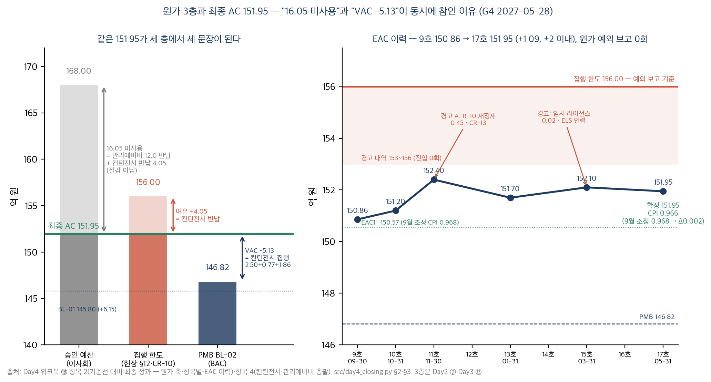

*그림 4-1. 원가 3층과 최종 AC 151.95 — "16.05 미사용"과 "VAC −5.13"이 동시에 참이다. PM의 자는 PMB이고, 9월의 조정 CPI 0.968이 최종 0.966을 예측한 것은 착시를 걷어 냈기 때문이다.*

**변경 로그 총괄 CR-01~14.** 승인 10·조건부 1(CR-09)·거버넌스 1(CR-10)·기각 1(CR-05)·이관 1(CR-12). Day3 이후 세 건 — CR-12(10-20, StRS-054 배달 주문 가맹 배분·정산 재상정, 개산 +160) → CCB 11-19 P1 범위 외 판정, P3 부속서 협상 결과 후 후속 과제 이관, FP 0. CR-13(12-16, 델리 서브 브랜드 상품 코드 체계 — R-10 부분 실현, 정본 판정 후 접수) → FP 0, 데이터 재정제 0.45 컨틴전시 R-10 집행. CR-14(01-12, 미동의 35점 컷오버 후 2차 배포·구형 단말 펌웨어 패치 — IS-06·R-13) → CCB 01-21, FP 0, 패치 0.20 컨틴전시 R-13; 같은 CCB에서 CR-09 조건 ① 재상정 → 20:00 운용 확정(22:00 파라미터 보유, 이관 3번). FP 누적 +185(+1.5%, 허용 ±372의 49.7%, 재확인 트리거 ±3% 미발동), SI +1.02.

**컨틴전시 10.20의 분해.** BL-02 편입 1.02(CR-03·06·07·08·09·11 변경 대가 → PMB) + 리스크 배정 집행 2.50(R-07 0.15·R-05 0.42·R-03 0.50·R-10 0.45·R-19 0.60·R-20 0.18·R-13 0.20) + 미배정 풀 집행 0.77(단말 0.30·아카이브 0.20·부하 시나리오 0.20·보안 0.05·임시 라이선스 0.02) + 편차 흡수 1.86(클라우드 0.76·망분리·DR 0.50·PMO 0.60 — 리스크 배정 없는 AC 초과) + **반납 4.05** = 10.20. 소진율(편입 제외) 50.3%. 관리예비비 12.0: 요청 0·집행 0·**반납 12.0**(대상 리스크 R-01·R-14·R-17 미실현 — R-01은 분리 의결로 흡수). 유보 3건(Day2 조정표): 클라우드 3.0 **반납**(IS-10 사이징 확정), PMO 3.0 → 하자보수기 **승인 전**(이관 10번), 전환 2.0 **감액 확정**(CR-11). 모든 집행에 결재(P1 PM + 재경 확인)와 CCB 월 보고(11월부터 자동 안건 — L-12)가 붙어 있어, 윤태호의 질의("컨틴전시 집행 승인 근거")에 이 표가 답이다.

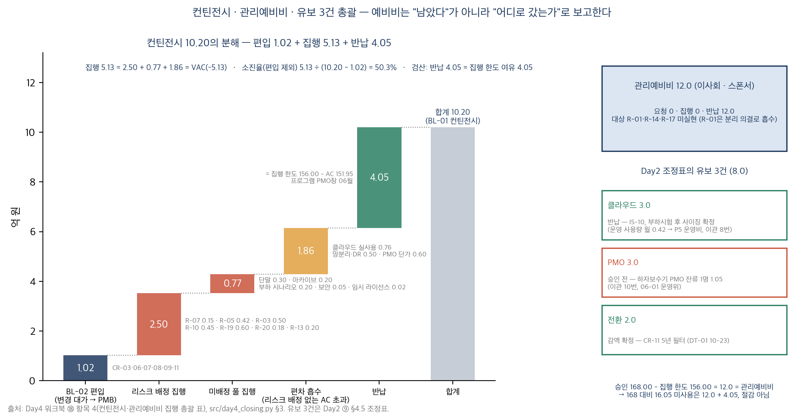

*그림 4-2. 컨틴전시 10.20의 분해 — 편입·리스크 집행·미배정 풀·편차 흡수·반납. 소진율 50.3%. 모든 집행에 결재와 CCB 보고가 붙어 있어 이 표가 내부감사 질의의 답이다.*

### 실무에서 어떻게 틀리는가

**한 층만 적는다.** 대개 승인 예산 — "16억 절감". **EAC 이력을 안 적는다.** 최종 AC가 어느 달에 어떤 이유로 움직였는지가 없으면 종료 보고서의 원가 절은 회계 보고다. **컨틴전시를 합계로만 적는다.** 10.20 중 얼마가 어느 리스크에 어느 결재로 나갔는지가 없으면 내부감사 질의에 답할 수 없다. **품질을 결함 수로 적는다.** 밀도의 분모(12,585)·분자(통합시험~UAT)·기준(0.4)이 없으면 1,187은 좋은 숫자인지 나쁜 숫자인지 모른다.

---

## 4.3 계약 종결 — 검수·정산·유보금·하자보수, 지체상금 0의 네 줄

### 개념

SI 계약 종결의 순서는 검수(릴리스별·최종 검수 확인서) → 정산(계약액 + 변경 대가 + 대기 비용 + 컨틴전시 수행사 귀속분 − 감액) → 유보금(계약액의 일정 비율을 하자보수 기간 동안 유보하거나 하자보수보증증권으로 대체) → 하자보수(기간·범위 — 인수 산출물의 결함이며 개선·요구 변경은 유지보수 계약) → 지체상금(기준선 완료일 대비 지연 일수 × 요율, 귀책 분해 후). 여기서 종료 보고서가 증명해야 하는 것은 **금액의 근거**다. 정산액의 각 항이 어느 합의서·의결서·판정에서 왔는지, 지체상금이 0이면 왜 0인지.

지체상금 0에 근거가 필요한 이유는 0이 "없음"으로 읽히기 쉬운 숫자이기 때문이다. 내부감사는 "왜 물리지 않았는가"를 묻고, 그 답은 Day3 ⑮ 항목 6의 귀책 분해표에 있어야 한다. 같은 표가 대기 비용(발주사 귀책)을 지급한 근거이기도 하다 — **같은 표가 양쪽을 다 설명할 때만 그 표는 정산의 근거가 된다.** 이것이 Day3 5.5절의 동시기록 문화가 종료에서 정산되는 방식이다.

### 온담의 사례로 읽기

> ■ **사례 사실** — SI 계약 68.20(FP 12,400 × 55만 원)은 사례 §3.3; 변경 대가 1.02·대기 비용 0.60·정산 71.02·유보금 5%·하자보수 1년·지체상금 0의 근거 네 줄은 [추가 설정] — Day3 워크북 §5.5·Day4 워크북 §3.5 항목 7.

**SI 한빛디지털.** 최종 검수 확인서 05-26. 정산 = 계약 69.22(68.20 + 변경 대가 1.02) + 대기 비용 0.60(R-05 0.42·R-20 0.18) + 컨틴전시 집행 수행사 귀속분 1.20(R-07·R-03·R-19 인력·R-13) = **71.02**, 잔금 05-31. 유보금 5% = **3.46억**(계약 §16 [추가 설정]) → 수행사 선택으로 하자보수보증증권 대체(05-26). 하자보수 1년 **2027-05-29 ~ 2028-05-28**, 범위 = 인수 산출물의 결함(심각도 무관), 개선·요구 변경은 P5 유지보수 계약, 대기 인력 4명 비상주·응답은 UC ② 기준. **지체상금 0 — 근거 네 줄:** ① G4 05-28 = 기준선 완료일 → §18의 "지연" 불성립. ② 순 지연 분해(Day3 ⑮ 항목 6 누적): 발주 7 + 동시 3 + 수행 3 − 회복 3 = 10영업일 → EX-01 대안 1(A14·A16 압축)로 0. ③ 수행사 단독 3일(S10 재작업)은 회복 3일(S12–S17 초과 근무)과 상계 — 변경협의체 10-14 확인. ④ 동시 3일은 07-15 합의(SCL 원칙 10)에 따라 공기 연장 인정·비용 불인정. 이 네 줄이 없으면 0은 "봐줬다"로 읽히고, 있으면 "계산했다"로 읽힌다. 서면: SI 합의서 6호(10-23)·7호(정산, 05-26), 검수 확인서 R1~R5, 보증증권.

**나머지.** 데이터 전환 용역 — 검증 6종 통과(02-27) 확인서 03-02, 정산 9.40 + 아카이브 0.20 + 재정제 0.45 = 10.05, 유보 3% → 보증증권, 하자 6개월(전환 데이터 정합). 상용SW 3사 — 통합시험 통과 01-15(잔금 4.70 발생 — Day3 착시 1의 해소 시점), API GW 정식 라이선스 03-05, 19.42(임시 0.02 포함), 유지보수 P5(SW-04). 클라우드 CSP — 선약정 6.0 + 종량 6.36 등, 인프라 22.16 중, P5 승계. 감리·보안진단·부하시험 10.20. POS 단말 8.90, 하자 1년(제조사). 하도급(모빌커넥트, 220 FP) — 수행사 정산 내 1.21, **직접 지급 요청 없음**, 소스 발주사 저장소 직접 커밋 확인.

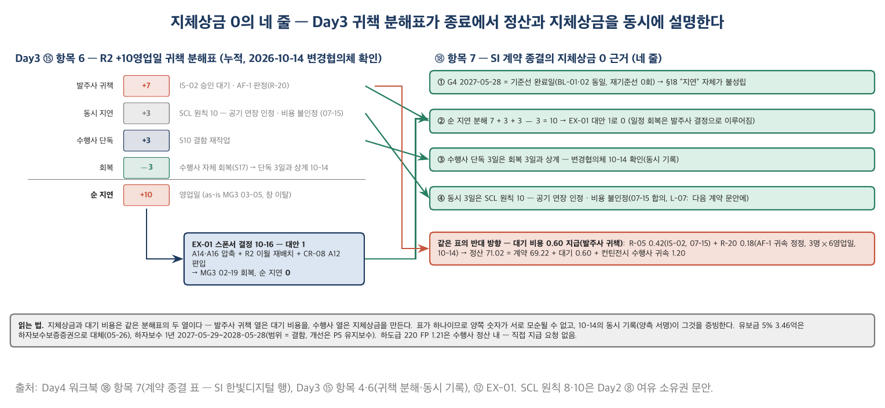

*그림 4-3. 지체상금 0의 네 줄 — Day3 귀책 분해표가 종료에서 정산되는 방식. 같은 표가 지체상금 0과 대기 비용 0.60 지급을 동시에 설명할 때만 정산의 근거가 된다.*

### 실무에서 어떻게 틀리는가

**지체상금 0을 "없음"으로 적는다.** **정산액을 한 숫자로 적는다.** 71.02가 69.22 + 0.60 + 1.20임을 모르면 대기 비용 0.60은 "왜 줬나"가 된다. **하자보수 범위를 적지 않는다.** 결함과 개선의 경계가 없으면 하자보수 1년은 무상 유지보수 1년이 된다. **하도급 직접 지급 여부를 확인하지 않는다.** 종료 후 하도급사의 직접 지급 요청이 오면 정산이 다시 열린다.

---

## 4.4 문서·형상 인수 — 2023년 지적사항의 회수 (심화)

형상 인수의 조건은 "발주사 저장소에서 클린 빌드가 재현되는가"다. 소스 파일을 받는 것이 아니라 — 그것은 2023년 지적("위탁 산출물 형상관리·소스 인수 절차 미비")의 상태다 — 발주사 저장소에서 빌드 절차서대로 빌드했을 때 운영 중인 바이너리와 같은 것이 나오는가, 하도급분(220 FP)을 포함해서, 그리고 SBOM(software bill of materials — 포함된 컴포넌트와 라이선스의 목록)이 있어서 GPL 계열 같은 라이선스 리스크가 0으로 확인되는가. 온담: 클린 빌드 재현 **100%**(05-12, 12개 모듈·하도급 어댑터 포함), SBOM 312 컴포넌트(GPL 계열 0), 빌드·배포 절차서 v1.0, 일 1회 동기화(CM-01 계획, AF-1-07 조치) → G4 후 발주사 저장소 단독 정본. SAC 항목 9의 증빙이며 헌장 §14 ②의 판정 근거.

문서 아카이브는 `governance/p1-closure/`에 헌장 v1.1, BL-01·02, RTM v1.4, 성과보고 1~17호, 변경 로그, 등록부 v1.4, 품질 기록, 계약 서면 32건, 런북·SAC, 종료 보고서·교훈·편익 원장. 보존 10년 [추가 설정]. 지적사항 대응 요약이 종료 보고서의 한 항목이다 — 2020 "편익 산정 근거 부재" → BC §4 분모·책임자·⑳ 원장 / 2020 "손실 확정 절차 부재" → 헌장 §14 중단 조건·손실 확정(미발동) / 2023 "소스 인수 절차" → 형상 인수. 종료 보고서는 지적사항에 답하는 자리이지 지적사항이 없었던 척하는 자리가 아니다.

**실무에서 어떻게 틀리는가.** 소스를 "받았다"고 적는다(빌드 재현 없이). 하도급분이 빠진다. SBOM이 없어 라이선스 리스크가 운영 중에 발견된다. 아카이브 위치가 PM의 노트북이다.

---

## 4.5 미해결 사항 이관 목록 — 소유자 실명이 없는 이관은 소멸이다

### 개념

미해결 사항 이관 목록(PRINCE2의 Follow-on Action Recommendations)은 "프로젝트가 끝나도 끝나지 않은 것"의 목록이다. 항목마다 내용·출처·**소유자 실명**·기한·**승인 여부**·수신이 있다. 세 칸이 결정적이다. 소유자가 실명이 아니고 "영업본부"이면 그 항목은 아무의 것도 아니다. 기한이 없으면 항목은 영구 대기가 된다. 그리고 **승인 여부** — 이관 항목은 두 종류다. 이미 소유자와 예산이 있어 실행만 남은 것(승인)과, 소유자는 있으나 예산·결정이 없어 다음 의사결정을 기다리는 것(승인 전). 후자를 "승인"처럼 적으면 종료 보고서가 이사회에서 통과된 순간 그 항목은 아무도 책임지지 않는 항목이 된다. 후자를 정직하게 "승인 전"으로 적으면 그 한 줄이 다음 의사결정의 안건이 된다.

어디에서 오는가. SAC의 조건부 항목, SLA의 강등 항목, KEDB의 의존·협의 항목, 변경 로그의 이관·조건부, 컨틴전시 총괄의 유보, 편익 원장의 전제, 그리고 회사 정본의 제외 범위. 출처 열이 이관 목록을 다른 넷과 묶는다.

### 온담의 사례로 읽기

> ■ **사례 사실** — 이관 목록 10건(승인 6·승인 전 4)의 내용·소유자·기한은 [추가 설정] — Day4 워크북 §3.5 항목 6; 6번(이천센터·안성 검사기록, 소유자 나영선)의 배경 — 2025-11 이사회 반려 34억·나영선 "검사기록이 더 급하다"는 사례 §1.2·§4.2·§7.

10건, 승인 6·승인 전 4.

| # | 내용 | 출처 | 소유자 | 기한 | 승인 |
|---|---|---|---|---|---|
| 1 | 아카이브 접근 절차(5년 초과 이력) 재경팀 승인 — 세무 보존 요건 정합 | SAC 11 조건부, CR-11 조건 ④ | **재경팀장**(운영 박준영) | 06-15 | 승인 |
| 2 | 가맹 미동의 잔여 9점 — 구형 단말 교체 협의 후 2차 배포(KE-01 해소) | CR-14, IS-06, R-13 | **오정근** | 07-31 | 승인(P3 예산) |
| 3 | 가맹 발주 마감 22:00 운용 전환 — 물류 야간조 편성과 함께 CAB 재상정 | CR-09 조건 ①, CCB 01-21 | **한동석** | 2027-09 CAB | **승인 전** |
| 4 | 3PL 대성로지스 준실시간 연동 재협상 — 타결 시 SLA ⑥ 복귀·KE-02·06 종결 | IS-05, 계약 변경 로그 7, SLA ⑥ | **한동석** | 06-30 | 승인 |
| 5 | 앱 벤더 유지보수 계약 갱신(월 3,600만 원, 복구 3시간 UC) | R-18, UC ⑦ | **오정근·박세연** | 06-30 | 승인 |
| 6 | 이천센터·안성 원료공장의 입고 검수·검사기록은 P1 범위 밖(종이·엑셀 유지). 재고 정확도 98.5% 목표는 검사기록 디지털화가 전제 — 2025-11 이사회 반려(34억 SI 견적) 재검토 필요 | 편익 원장 B-02 분모(전체 SKU 84.6%), R-12, 헌장 §5 제외 범위 | **나영선 품질안전본부장** | 2027-09 이사회 부의 | **승인 전** |
| 7 | SAP ECC 2027-12 유지보수 종료 대응 — 애드온·IF-SAP 8본 마이그레이션 계획(KE-04 근본 해소) | 정본 §3.2 제외 범위, KE-04 | **박세연** | 08-31 | **승인 전** |
| 8 | 클라우드 사이징 확정치(월 0.42)·DR 운영비 P5 연 운영비 27.0 반영, 유보 3.0 반납 | IS-10, 컨틴전시 총괄 | **박준영·재경팀장** | 06-30 | 승인 |
| 9 | ISMS-P 심사(2027-06) 증적 — 보안 운영 절차·파기 로그·P1-02 기록 | 정본 §3.4, SAC 4 | **최영주** | 06-30 | 승인(P4) |
| 10 | 하자보수기 PMO 잔류 1명(06~12) 예산 3.0 중 1.05 — Day2 조정표 "PMO 유보 3.0" 복귀 판단 | Day2 조정표, 컨틴전시 총괄 유보 | **프로그램 PMO장** | 06-01 운영위 | **승인 전** |

열 건을 같은 무게로 읽으라. 1번은 SAC 조건부가 그대로 옮겨진 것이고, 2번은 KE-01과 IS-06과 R-13이 하나의 이관으로 묶인 것이며, 3번은 CCB가 CAB로 권한을 넘긴 것이고, 4번은 SLA 강등의 재상정 조건이며, 6번은 편익 원장의 분모 B가 P1 밖의 전제 위에 있다는 사실을 종료 보고서에 남긴 것이고, 7번은 회사 정본의 제외 범위가 KE-04를 통해 운영 리스크로 돌아온 것이며, 10번은 Day2 조정표의 유보가 아직 스폰서 결재를 받지 않았다는 사실이다. 출처 열이 없으면 이 열 건은 종료 시점에 누군가 떠올린 목록이 되고, 출처 열이 있으면 앞선 열아홉 문서의 어느 행이 프로젝트 밖으로 나가는지의 기록이 된다.

승인 전 네 줄(3·6·7·10)의 공통점은 소유자는 있으나 **결정이 없다**는 것이다. 종료 보고서가 이사회를 통과하는 것과 이 네 줄이 결정되는 것은 별개이며, 그래서 수신 열에 결정 회의체(CAB·프로그램 이사회·운영위)가 적혀 있다. "승인 전" 표시는 종료 보고서에서 가장 짧은 줄이지만 가장 오래 남는 줄이다.

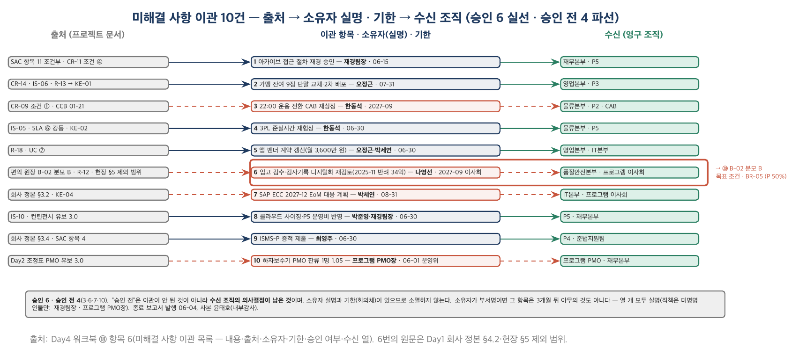

*그림 4-4. 미해결 사항 이관 10건의 출처와 수신. 승인 6(실선)·승인 전 4(파선). 소유자 실명·기한·승인 여부의 세 칸이 있어야 이관이고, 없으면 소멸이다.*

### 실무에서 어떻게 틀리는가

**소유자가 부서명이다.** **승인 여부 열이 없다.** 그래서 결정이 없는 항목이 결정된 것처럼 읽힌다. **범위 밖의 것은 적지 않는다.** "P1이 하지 않은 것"은 P1 종료 보고서에 적을 이유가 없어 보인다. 그러나 편익이 그 전제 위에 있다면 적어야 한다 — 적지 않으면 G5에서 편익 미달의 원인이 "P1 결함"으로 기록되고, 적으면 "P1 범위 밖의 전제 미충족"으로 기록된다. **출처 열이 없다.** 종료 시점에 떠올린 목록.

---

## 4.6 잔여 리스크의 운영 이관과 팀 해산 — 사람의 전환

**잔여 리스크.** 등록부 v1.4(G4 종결): 종결 12 / 운영 이관 3(R-13 → KE-01 오정근·박준영, R-16 → KE-02 한동석·박준영, R-18 → 앱 벤더 계약 리스크 오정근·박세연) / 편익 이관 1(R-12 → BR-01 재무본부·한동석·나영선). 신규 운영 리스크 3 — 3PL 재협상 결렬 시 폴백 영구화(한동석), SAP ECC 2027-12 EoM(박세연), IPO 예비심사 중 변경 동결 창(정미란) — 은 운영 리스크 등록부(박준영)로, 검토는 월 1회 서비스 리뷰. 리스크는 프로젝트가 끝났다고 사라지지 않는다. 프로젝트 등록부에서 지워지고 운영 등록부·KEDB·편익 리스크 표 중 한 곳에 **새 소유자와 함께** 다시 적힌다. 세 곳 어디에도 적히지 않은 잔여 리스크는 소멸이고, 그것은 실현될 때 "아무도 몰랐던 문제"로 돌아온다.

**팀 해산.** 1.3절에서 말한 대로 사람별 일자다. 발주사 14명(12명 06-01 복귀, 2명 P5 전환), 수행사(05-31 철수, 하자보수 대기 4명 비상주), P1 PMO 3명(2명 프로그램 PMO, 1명 잔류 — 승인 전), P1 PM(06-01 프로그램 PMO, P2·P5 지원, 하자보수기 창구). 하자보수기 체제: 창구 P5 서비스운영팀(박준영) → 수행사 UC ②, 결함/개선 판정 CAB, 월 1회 서비스 리뷰에 하자 현황. 2명의 P5 전환은 SAC 항목 5(교육)의 다른 얼굴이다 — 시스템을 만든 사람이 운영 조직에 남는 것이 가장 짧은 지식 이전이다. PMO 1명의 잔류가 "승인 전"인 것은 Day2 조정표의 "PMO 유보 3.0 → 하자보수기"가 스폰서 결재를 받지 않았기 때문이며, 이관 10번이다. Bridges의 "끝냄"은 시스템에만 필요한 것이 아니라 팀에도 필요하다.

**실무에서 어떻게 틀리는가.** 잔여 리스크를 "종결"로 일괄 처리한다. 해산을 한 날짜로 적는다. 하자보수 창구가 없어 첫 하자 문의가 전 PM의 개인 전화로 온다. 잔류 인력의 예산이 결정되지 않은 채 잔류한다.

---

## 4.7 문서의 마지막 독자 — 3년 뒤의 내부감사·분쟁·다음 PM

종료 보고서를 누가 읽는가. 06월 프로그램 이사회는 첫 독자이지 마지막 독자가 아니다. 마지막 독자는 셋이다. **3년 뒤의 내부감사** — 윤태호 팀장 또는 그 후임이 "컨틴전시 R-03 0.50은 누가 언제 승인했는가"를 물을 때, 항목 4의 결재·보고 이력(08-12 결재, 10-15 CCB 소급 보고, 11월부터 자동 안건)이 답한다. **분쟁** — 하자보수 기간 중 수행사와 "이것이 결함인가 개선인가"를 다툴 때, 계약 종결 표의 하자보수 범위 정의("인수 산출물의 결함, 심각도 무관; 개선·요구 변경은 P5")와 검수 확인서 R1~R5가 답한다. 지체상금 0의 네 줄은 나중에 누군가 "봐준 것 아닌가"를 물을 때를 위한 것이다. **다음 PM** — P2·P5 또는 2028년 후속 과제의 PM이 "온담은 컷오버를 어떻게 했는가"를 물을 때, 런북의 실행 기록 열과 교훈 L-15가 답한다.

마지막 독자를 위해 쓴다는 것은 세 가지를 뜻한다. 약어를 풀어 쓴다(RB-3이 무엇인지 3년 뒤에는 아무도 모른다). 출처를 적는다(어느 문서 어느 행). 그리고 **판단의 근거를 결론과 분리해 적는다** — "지체상금 0"이 아니라 "지체상금 0, 근거 ①~④"; "충족"이 아니라 "조건부 충족, 기한 06-15, 책임자 재경팀장". 결론만 남은 문서는 3년 뒤 검증할 수 없고, 검증할 수 없는 문서는 신뢰되지 않는다.

## 4.8 실무에서 어떻게 틀리는가

이 장의 오류는 **선언과 증명을 구별하지 못하는 것**으로 수렴한다. 종료 보고서를 종료 시점에 처음 쓰고, 원가를 한 층으로 적고("16억 절감"), 지체상금 0을 "없음"으로 적고, 소스를 "받았다"고 적고, 이관 목록의 소유자를 부서명으로 적고 승인 여부를 빼고 범위 밖의 것을 적지 않고, 잔여 리스크를 일괄 종결하고, 해산을 날짜 하나로 적는다. 그 결과는 2019년 세 줄과 같은 종류의 문서이며, 그 문서의 마지막 독자는 그것을 처음부터 다시 만들어야 한다.

---

## 제4장 핵심 정리

> **한 줄씩 — 수업 직전 5분 복습용**
> 1. 종료 보고서는 선언이 아니라 증명이다 — 모든 숫자가 앞 문서의 어느 행에서 왔는지 추적된다.
> 2. 최종 성과는 최종 기준선(BL-02) 대비 네 축으로 적고, 원가는 3층을 따로 적어 "절감"과 "초과"가 동시에 참임을 보인다.
> 3. 계약 종결은 검수 → 정산 → 유보금 → 하자보수 → 지체상금 판정의 순서이고, 0에도 근거 네 줄이 있다.
> 4. 이관 목록에 소유자 실명·기한·승인 여부가 없으면 이관이 아니라 소멸이다.
> 5. 잔여 리스크는 새 소유자와 함께 운영 등록부·KEDB·편익 리스크 표 중 한 곳에 다시 적힌다.
> 6. 문서의 마지막 독자는 3년 뒤의 감사·분쟁·다음 PM이다 — 약어를 풀고 근거를 결론과 분리한다.
>
> 아래는 같은 내용의 자세한 판이다.

1. 종료 보고서는 선언이 아니라 증명이다 — 모든 숫자가 성과보고·변경 로그·등록부·품질 기록·계약 서면의 어느 행에서 왔는지 추적되어야 하고, 완료 기준(헌장 §14 다섯)에 판정·근거·일자·판정자가 붙는다. 첫 문장은 "재기준선 0회"이고, 마지막 독자는 3년 뒤의 내부감사·분쟁·다음 PM이다.
2. 최종 성과는 BL-02 대비로 네 축 + 리스크·편익·지속가능성을 적는다. 원가는 3층(168.00 / 156.00 / 146.82)을 분리해 적으며 "16.05 미사용"과 "VAC −5.13"이 동시에 참이다 — PM의 자는 PMB다. EAC 이력(150.86 → 152.40 경고 → 151.95)과 9월 조정 CPI 0.968 → 최종 0.966은 Day3의 착시 조정이 맞았음을 보인다. 컨틴전시 10.20 = 편입 1.02 + 리스크 집행 2.50 + 미배정 풀 0.77 + 편차 흡수 1.86 + 반납 4.05, 관리예비비 12.0 반납.
3. 계약 종결은 검수 → 정산(71.02 = 69.22 + 0.60 + 1.20) → 유보금(3.46, 보증증권 대체) → 하자보수(1년, 범위 = 결함) → 지체상금(0, 근거 네 줄 — 기준선 완료일·귀책 분해 순 10 → EX-01로 0·상계·SCL 원칙 10). 같은 표가 지체상금 0과 대기 비용 0.60 지급을 동시에 설명할 때만 정산의 근거가 된다. 형상 인수는 클린 빌드 재현 100%(하도급 포함)·SBOM 312이며 2023년 지적의 회수다.
4. 미해결 사항 이관 목록은 소유자 실명·기한·승인 여부의 세 칸이 있어야 이관이고 없으면 소멸이다. 온담 10건(승인 6·승인 전 4), 출처 열이 앞선 문서의 어느 행이 프로젝트 밖으로 나가는지를 기록한다. 범위 밖이라도 편익의 전제이면 적는다. "승인 전"은 가장 짧지만 가장 오래 남는 줄이다.
5. 잔여 리스크는 운영 등록부·KEDB·편익 리스크 표 중 한 곳에 새 소유자와 함께 다시 적힌다(운영 이관 3·편익 이관 1·신규 운영 3). 팀 해산은 사람별 일자이며 하자보수 창구·잔류 예산·복귀 소속이 적혀 있어야 한다.

## 생각해 볼 질문

1. 여러분 회사의 최근 종료 보고서에서 원가 실적은 어느 층과 비교되어 있는가. 다른 층으로 바꾸면 "절감"이 "초과"로 바뀌는가.
2. 지체상금(또는 페널티)이 0으로 정산된 프로젝트에서 그 0의 근거 문장이 있었는가. 없었다면 3년 뒤 누군가 "봐준 것 아닌가"를 물었을 때 무엇으로 답하는가.
3. 미해결 사항 이관 목록에 "이 프로젝트의 편익이 실현되기 위해 이 프로젝트가 하지 않은 것"이 한 줄이라도 적혀 있는 종료 보고서를 본 적이 있는가. 없다면 그 편익의 미달은 나중에 누구의 결함으로 기록되었는가.
4. 소스를 "받았다"와 "발주사 저장소에서 클린 빌드가 재현된다"의 차이를 여러분 조직의 유지보수 계약 협상에서 어떻게 썼는가(또는 쓰지 못했는가).
5. 끝났다고 선언한 사람(PM)과 받았다고 서명한 사람(인수자)과 승인한 사람(스폰서)이 세 사람인 종료를 본 적이 있는가. 한 사람이었다면 무엇이 달랐는가.

## 워크북 연결

이 장은 워크북 §3(⑱ 종료 보고서·미해결 사항 이관 목록·계약 종결) 전체에 대응한다. 항목 1 완료 기준 판정(4.1절), 항목 2 최종 성과표·원가 항목별·EAC 이력(4.2절), 항목 3 변경 로그 CR-01~14(4.2절), 항목 4 컨틴전시·관리예비비 총괄(4.2절), 항목 5 잔여 리스크 이관(4.6절), 항목 6 이관 목록 10건(4.5절), 항목 7 계약 종결 7건(4.3절), 항목 8 형상 인수·팀 해산·승인(4.4·4.6절). §3.6 해설의 검산(AC 151.95, VAC −5.13, CPI 0.9662, 반납 4.05, 10.20 분해, 정산 71.02, 유보금 3.461, 밀도 0.0943)을 따라 하고, §3.7 기본 과제(SAC 항목 7 미충족 시 헌장 §14 ①의 두 경로와 비용 비교)는 3.2·3.5·4.5절의 결합 문제다.

---

# 제5장 교훈과 편익 — 프로젝트가 끝난 뒤에 남는 것

## 5.1 교훈은 왜 조직에 남지 않는가 — Williams(2008), Duffield & Whitty의 Syllk (심화)

### 개념

모든 방법론이 교훈(lessons learned)을 요구하고, 대부분의 조직이 교훈을 모으며, 거의 모든 조직에서 같은 실패가 반복된다. Williams(2008, *Project Management Journal* 39(4))는 이 역설을 실증했다 — 교훈 학습의 실패는 "교훈을 모으지 못해서"가 아니라 **"모은 교훈이 조직의 절차로 흡수되지 않아서"**다. 교훈은 회고 워크숍에서 식별되고 문서로 기록되며 저장소에 보관되지만, 다음 프로젝트의 착수 패키지(양식·규정·계약 문안)에는 들어가지 않는다. 그래서 다음 PM은 그 문서를 읽을 시간이 없거나, 읽어도 "우리 프로젝트는 다르다"고 생각하거나, 읽고 동의해도 바꿀 양식이 없다.

Duffield & Whitty(2015, *IJPM* 33(2))의 **Syllk**(Systemic Lessons Learned Knowledge) 모형은 흡수의 조건을 구조화한다. 조직 학습은 여섯 층을 다 통과해야 한다 — 사람 쪽의 learning·culture·social, 시스템 쪽의 technology·process·infrastructure. 회고 워크숍과 PM 커뮤니티는 사람 층을 통과시키지만 시스템 층(규정·양식·계약·도구)에 닿지 않으면 6개월 뒤 사라진다. 이것은 Day1의 임시조직 이론(1.3절)과 같은 말이다 — 임시조직이 해산하면 그 조직이 배운 것도 해산하므로, 해산 전에 영구조직의 제도로 옮겨야 한다.

그래서 교훈이 조직에 남는 조건은 교훈의 수가 아니라 **그 교훈으로 개정된 양식이 다음 프로젝트의 착수 패키지에 들어 있는가**다. 온담의 교훈 등록부가 15건마다 "적용 대상"을 사내 표준 세 개의 개정 요청으로 묶는 이유가 그것이며, 개정 요청서는 교훈 등록부의 부속이 아니라 **결과물**이다.

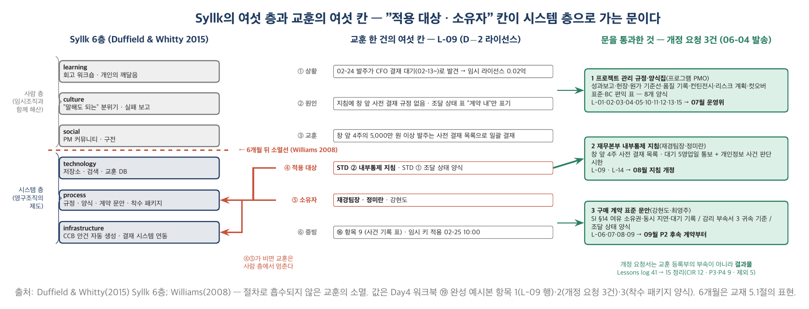

*그림 5-1. Syllk의 여섯 층과 교훈의 여섯 칸. "적용 대상"과 "소유자"가 사람 층에서 시스템 층으로 가는 문이고, 개정 요청서가 그 문을 통과하는 유일한 형식이다.*

### 실무에서 어떻게 틀리는가

**교훈을 저장소에 넣고 끝낸다.** **개정 요청이 "검토 바람"이다.** 조항 번호와 새 문장이 없으면 검토는 영원하다. **회고를 의식으로 한다.** 3년의 회고에서 실제로 바뀐 양식이 하나도 없다면 그것은 학습이 아니라 의례였다.

---

## 5.2 교훈 등록부의 설계 — 여섯 칸, "적용 대상"이 없는 교훈은 감상이다

### 개념

교훈 한 건은 여섯 칸이 채워질 때만 교훈이다. **상황**(무엇이 있었나 — 사실·일자·숫자), **원인**(왜 그랬나 — 사람이 아니라 양식·규칙·구조), **교훈**(무엇을 바꾸면 되나 — 한 문장), **적용 대상**(어느 양식·규칙·문안의 어느 칸 — 다음 프로젝트 / 사내 표준 / 계약 문안), **소유자**(누가 바꾸나 — 실명, PM은 곧 없어지므로 PM이 아닌 사람), **증빙**(어느 문서의 어느 행). "소통이 중요하다", "리스크를 미리 봐야 한다"는 교훈이 아니라 감상이다 — 상황·원인·적용 대상이 없기 때문이다.

원인 칸에 사람을 적지 않는 것이 이 설계의 규율이다. "담당자가 놓쳤다"로 적으면 사실이지만 교훈이 아니다 — 다음 프로젝트의 담당자도 놓칠 것이다. "양식에 그 칸이 없었다"로 적으면 양식이 바뀌고, 그 뒤의 모든 프로젝트에서 담당자가 놓쳐도 칸이 잡는다. 교훈 등록부에서 사람 이름은 소유자 칸에만 나온다.

그리고 **잘된 것도 교훈**이다. 잘된 것은 대개 어느 문서에도 "표준"으로 적혀 있지 않은 우연한 결정의 결과이며, 적어 두지 않으면 다음 프로젝트는 그 성공을 다시 발명해야 하거나 발명하지 못한다. 잘된 것의 교훈은 "왜 잘됐는지를 양식으로 고정하는 것"이다.

### 온담의 사례로 읽기

> ■ **사례 사실** — Lessons log 41건 → 종료 정리 15건(L-01~15)과 원천 분포는 [추가 설정] — Day4 워크북 §4.5; 조기 신호 5개는 Day3 워크북 §2.5 항목 9, 감사 지적 세 가지는 사례 §2.4·§6.5.

Lessons log 2026-01 ~ 2027-05 누적 41건 중 종료 정리 **15건**(나머지 26건: 운영 개선 등록부(CIR, 박준영) 12, P3·P4 소관 9, 재발 가능성 낮음 5). 원천 분포: 조기 신호 5(L-01~05, Day3 ⑫ 항목 9) / 착시 1(L-11) / 감리·계약 3(L-06·07·08) / 이슈·리스크 2(L-12·13) / 절차·거버넌스 3(L-09·10·14) / 잘됨 1(L-15; L-08도 잘됨). 적용 대상 약호: NP 다음 프로젝트 양식 / STD 사내 표준 / CTR 계약 문안. 15건 전부 원인 칸에 사람이 없고, 소유자 칸은 프로그램 PMO장·재경팀장·정미란·강현도·최영주·정하늘·박준영·P1 PM(→ 프로그램 PMO장)이다.

---

## 5.3 온담 P1의 교훈 15건 중 다섯 — 그리고 사내 표준 개정 요청 3건

> ■ **사례 사실** — 다섯 교훈의 사건 근거 — D−2 라이선스(2.8절), R-05 승인 대기(Day3), 분모 정치(5.6절), 두 번 컷오버(2.7절), 감리 귀속(Day3 ⑭) — 는 각 절과 워크북 예시본; 사내 표준 개정 요청 3건은 Day4 워크북 §4.5 항목 2.

다섯 건을 여섯 칸으로 읽는다. 나머지 열 건은 워크북 §4.5에 있다.

**L-02 대체 결정권자.** 상황: R-05 실현(IS-02) — POS 화면 정의서 승인 대기 12영업일, 대체 결정권자 지정이 3주 늦음(06-03), 대기 비용 0.42억. 원인: 헌장·RACI에 "결정권자 부재 시 대체자" 칸이 없어 리스크 대응(등록부 R-05 조치)이 실행 주체 없이 남음. 교훈: 결정 SLA가 있는 모든 A 역할에 대체 결정권자를 헌장에서 실명 지정한다. 적용 대상: STD ① 헌장 템플릿 §11 "대체 결정권자" 칸 / NP. 소유자: 프로그램 PMO장. 증빙: ⑬ IS-02, ⑫ 신호 2. — 원인을 "오정근 본부장이 부속서 협상에 집중해 승인이 늦었다"로 적으면 사실이지만 교훈이 아니다. 다음 프로젝트의 Senior User도 바쁠 것이다.

**L-06 감리 귀속 기준.** 상황: 감리 1차 지적 AF-1-03·04가 발주사 미결정 원인인데 "수행사 설계 미흡"으로 기재 → 이의 서면(09-29)·검수 보류 다툼·대기 비용 0.18. 원인: 감리 계약에 지적 귀속 판정 기준(WBS 담당 열·RACI)이 없었음. 교훈: 감리 계약 부속서에 "귀속은 WBS 담당 열(발주/수행/공동)과 RACI를 기준으로 판정"을 사전 합의한다. 적용 대상: CTR 감리 계약 표준 부속서 3 / STD ③. 소유자: 강현도·정하늘. 증빙: ⑭ 항목 6. — Day3 4.3절("등급보다 귀속 칸이 무겁다")이 계약 문안이 되는 경로다.

**L-08 동시 기록(잘됨).** 상황: 대기 비용 판정(IS-02·AF 귀속)에서 수행사 대기 기록과 발주사 회의록이 일치한 덕에 판정이 1회로 끝남(07-15·10-14). 원인: 주간 PM 회의록에 "결정 요청·응답 일자" 열을 착수 때부터 둔 것(contemporaneous records). 교훈: 결정 요청·응답·대기는 발생 당일 양쪽이 서명하는 동시 기록으로 남긴다 — 사후 재구성은 분쟁이 된다. 적용 대상: CTR §14 대기 기록 조항 / NP 주간 회의록 양식. 소유자: 강현도·P1 PM. 증빙: ⑮ 항목 4 회신 4항, 항목 6. — 그 열이 없었다면 IS-02의 12영업일은 07-15가 아니라 G4 정산에서 다투어졌을 것이고, 4.3절의 지체상금 0은 네 줄로 증명되지 못했을 것이다.

**L-09 컷오버 창 앞 사전 결재.** 상황: D−2(02-24) API GW 운영 라이선스 발주가 CFO 직접 결재 대기(02-13~)로 발견 → 임시 라이선스 0.02억. 원인: 내부통제 지침(2026-02-16)에 프로젝트 창 앞 사전 결재 규정이 없고, G3 조달 상태 표가 "계약 내"로만 표기해 발주 단계 미추적. 교훈: 컷오버·게이트 앞 4주의 5,000만 원 이상 발주는 사전 결재 목록으로 일괄 결재하고, 조달 상태 표에 "발주·결재 단계" 열을 둔다. 적용 대상: STD ② 내부통제 지침 / STD ① 조달 상태 양식. 소유자: 재경팀장·정미란 / 강현도. 증빙: ⑯ 항목 9. — 2.8절.

**L-15 분리 컷오버의 연결(잘됨).** 상황: 두 번 컷오버(02-26·03-27)가 모두 정시·트리거 발동 0 — 조건: 1차 하이퍼케어 지표(심각도 2 이상 ≤ 5)를 2차 go 조건으로, 리허설 1회차를 전체 볼륨으로 실행해 창 초과(41h)를 미리 관측. 원인: 런북을 2회 분리 작성하고 R-14 트리거를 게이트 조건으로 연결(G1 의결 → Day3 R-14 → ⑯). 교훈: 분리 컷오버는 앞 컷오버의 안정화 지표를 뒤 컷오버의 게이트 조건으로 묶고, 리허설 1회차는 실패를 보기 위해 돌린다. 적용 대상: STD ① 프로그램 컷오버 표준(런북 양식·게이트 3·PoNR·트리거) / NP P2·P5. 소유자: 프로그램 PMO장·박준영. 증빙: ⑯ 항목 3·6·7. — 이 사슬은 어느 한 문서에도 "표준"으로 적혀 있지 않았다.

**사내 표준 개정 요청 3건(06-04 발송).** ① **프로젝트 관리 규정·양식집**(프로그램 PMO장, 2027-07 운영위 의결, P2 G2 전 적용): 성과보고 양식 항목별 SV·CV 분해 열·발생주의 조정 행(L-01·03), 헌장 템플릿 대체 결정권자·유보 항목 해제 기한(L-02·10), 원가 기준선 템플릿 RoC 부속 2(L-11), 품질 기록 시험 노력 열(L-04), 컨틴전시 집행 → CCB 안건 자동 생성(L-12), 리스크 승격 기준에 대응 리드타임(L-13), 프로그램 컷오버 표준(L-15), BC 편익 표 분모·측정 책임자 실명 필수(⑳). ② **재무본부 내부통제 지침**(재경팀장·정미란, 2027-08): 5,000만 원 조항 단서 신설 + 개인정보 내부관리계획에 사건 판단 시한 절차(L-09·14). ③ **구매 계약 표준 문안**(강현도·최영주, 2027-09 P2 후속 계약부터): SI 표준 계약 §14 여유 소유권·동시 지연·대기 기록 문안, 감리 계약 부속서 3 귀속 기준, 조달 상태 양식(L-06·07·08·09). 15건을 각각 담당 부서에 보내면 15건 모두 "검토 중"이 된다. 세 표준은 각각 소유 부서와 개정 절차가 하나이므로 세 번의 의결로 끝나고, 기한과 적용 시점이 붙어 있어야 "접수"(06-08)가 "적용"이 된다.

### 실무에서 어떻게 틀리는가

**원인 칸에 사람 이름이 있다.** **적용 대상이 "전사"다.** **소유자가 PM이다.** PM은 06-01에 없어진다. **잘된 것이 없다.** 실패의 목록만 남고 성공은 다시 발명해야 한다. **개정 요청이 교훈 등록부의 부속이다.** 아카이브에 함께 들어가 잊힌다.

---

## 5.4 편익 실현의 책무 분리 — Zwikael & Smyrk의 ITO, 원장의 측정 책임자 실명 칸

### 개념

Day1 3장에서 빌린 Zwikael & Smyrk(2011)의 ITO 모형 — Input → Transform → Output → (Utilisation) → Outcome — 은 책임의 분리를 말한다. **output**(산출물 — 플랫폼)의 책임은 프로젝트(PM·수행사)에 있고, **outcome**(성과 — 폐기율이 2.2%로 내려가는 것)의 책임은 프로젝트 소유자(project owner — 현업 책임자, PRINCE2의 Senior User)에게 있으며, 그 사이에 **utilisation**(활용 — 매장이 발주 가이드를 지키고 구매팀이 폐기를 집계하는 것)이 있다. 이 분리가 없으면 G5에서 편익 미달의 원인은 "P1이 잘못 만들었다"와 "현업이 안 썼다" 사이에서 영원히 다투어진다.

편익 실현 원장의 **측정 책임자 실명** 칸이 그 분리의 서명이다. Day1 BC §4에서 측정 책임자를 부서명이 아니라 실명으로 적으라고 한 것은 이 날을 위해서였다 — 실명은 착수 때 적히고, 서명은 종료 때 이루어지며, 판정은 그 뒤에 온다. 그리고 ITO 서명표는 output 서명이 G4 인수로 **종결**된다고 적는다. P1 PM은 폐기율을 내릴 수 없다. P1 PM이 outcome에 서명하면 G5에서 편익 미달의 책임을 이미 없어진 조직이 지게 되고, 그것은 아무도 지지 않는 것과 같다. 반대로 outcome 소유자가 서명하지 않으면 편익은 "IT가 만든 시스템의 성과"가 되어 현업은 쓰지 않아도 책임이 없다.

### 온담의 사례로 읽기

> ■ **사례 사실** — 편익 원장 v1.0(05-21 서명, 소유 재무본부)의 6칸 값은 [추가 설정] — Day4 워크북 §5.5; 편익 항목·기준값·목표값·분모는 사례 §5.5 B-01~08, 책임자 실명은 Day1 워크북 §1.5 항목 9(오정근·한동석·나영선).

원장 v1.0 2027-05-21 서명, 소유 재무본부(재경팀장) — P1 종료 후 정본 관리자. 편익 6칸 — 측정식(코드 수준: 리포트 ID·분자·분모·주기), 기준값(값·시점·분모·출처), 목표값(값·시점), 측정 시점(첫 측정·G5·운영 +12·+24), 측정 책임자(편익 소유자 실명 + 측정 실무 직책), 미달 시 조치(원인을 output / outcome / utilisation으로 분류해 분기).

| B-ID | 편익 | 기준값 → 목표 | 측정 책임자 | 연간 금액(승인 / 온담 귀속) |
|---|---|---|---|---|
| B-04 | 폐기율(월 폐기 금액 ÷ 취급원가, RPT-INV-05; 수량 기준 병기) | 3.9%(2025) → 2.2%(M+24) | **오정근** / 강현도(집계) | 43 / 43 |
| B-05 | 배달수수료 회피(전환 매출 × 12.8%, RPT-ORD-02; 직영·가맹 분리) | 배달 경유 242.7억·앱 2.1% → 온라인 18% | **오정근** / 재경팀장 | 37 / **18.6**(직영 50.3%; 가맹점주 18.4) |
| B-07 | 매장 인건비율(직영 인건비 ÷ 직영 매출, 분기) | 21.4% → 20.1% | **오정근** / 인사본부 | 38 / 38 |
| B-02 | 재고 정확도(두 분모 병기, StRS-034) | A 91.3%(판정) / B 84.6%(참고) → A 98.5% / B 미설정 | **한동석** / 실사 담당(나영선 협의) | (B-04·03 기여) |
| B-03 | 결품률(결품 SKU-일 ÷ 진열 SKU-일, RPT-INV-06) | 4.7% → 1.5%; 기회손실 산정식 2027-11 | **오정근** / KPI 담당 | 미산정 |
| B-08 | 가맹 발주 리드타임(발주 확정 → 출고 확정, RPT-FRN-03; 20:00 운용 전제) | 38h → 12h; **첫 측정 2027-04 13.6h**(진행률 94%) | **오정근** / 박준영(포털 운영) | (B-03 기여) |
| | 직접 편익 합 | | | **118 / 온담 귀속 99.6** |

ITO 서명표(05-21): output — P1 PM·이재현(G4 인수로 종결) / outcome — 오정근(B-04·05·07·03·08)·한동석(B-02) / utilisation — 매장운영팀장·강현도·마케팅·인사본부·실사 담당·나영선·P3 PM·박준영·재경팀장 / 판정 — 재무본부(정미란·재경팀장). outcome·utilisation 서명은 2029-05까지 유효하며 서명자 변경 시 후임이 재서명한다(BR-04). Day1 프리모템 14번("측정 책임자가 경기 탓이라 했다")과 BC 항목 4의 "측정 책임자 실명"이 여기서 완성된다.

미달 시 조치의 분기 — B-04를 예로: output(리포트 오류) → 하자보수·유지보수 / outcome(발주 정확도·수요 예측 미사용) → 오정근: 발주 가이드·자동 발주 제안 채택 조치 / utilisation(매장 미준수) → P3 교육·지역매니저 점검. 미달 판정 시 오정근이 G5 전 개선 계획 제출. "원인 분석"이 아니라 세 갈래 중 하나로 분류하고 그 갈래의 소유자가 움직인다.

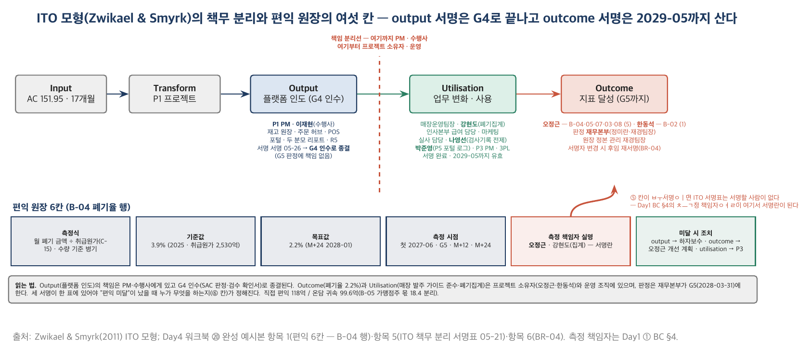

*그림 5-2. ITO의 책무 분리와 편익 원장의 여섯 칸. output 서명은 G4에서 종결되고 outcome·utilisation 서명은 2029-05까지 유효하다. 측정 책임자 실명 칸이 그 분리의 서명이다.*

### 실무에서 어떻게 틀리는가

**PM이 편익에 서명한다.** 없어진 조직이 책임을 진다 = 아무도 안 진다. **outcome 소유자가 서명하지 않는다.** "IT 시스템의 성과"가 되어 현업은 면책된다. **측정식이 없다.** G5에 "어떻게 쟀는가"를 다툰다. **미달 시 조치가 "원인 분석"이다.** 분기가 없으면 분석은 책임 회피의 형식이 된다.

---

## 5.5 편익이 실패하는 이유 — Ward & Daniel, 소유자·측정 시점·기준값

Ward & Daniel(2012, *Benefits Management* 2판)의 **편익 의존성 네트워크**(benefits dependency network)는 IT 산출물과 편익 사이에 반드시 **업무 변화**(business change)가 있고, 그 변화의 소유자가 편익의 소유자라고 말한다 — ITO의 utilisation을 다른 방향에서 본 것이다. 그들이 편익 관리의 실패 원인으로 꼽는 것은 셋이다. **소유자 부재** — 편익이 "회사"의 것이면 아무의 것도 아니다. **측정 시점 부재** — "M+24"가 달력의 어느 날인지, 그날 누가 무엇을 재는지가 없다. **기준값의 정치** — 기준값이 프로젝트 후에 정해지면 유리한 쪽으로 정해지고, 그 뒤 판정은 협상이 된다. 그래서 "기준값은 프로젝트 전에, 측정 책임자는 프로젝트 중에, 판정은 프로젝트 후에 확정된다"는 워크북 §5.1의 문장이 나온다 — 셋이 같은 문서에 있어야 한다.

온담의 원장에는 세 가지 정치가 있다. **분모 정치**(5.6절), **귀속 정치** — B-05 배달수수료 회피 37억은 이사회 승인본의 숫자이지만 가맹 매장의 배달 매출은 가맹점주의 것이므로(C-13은 연결매출이 아니다) 온담 손익에 귀속되는 몫은 직영 비중 2,980/5,920 = 50.3%인 **18.6억**이고 나머지 18.4억은 가맹점주의 편익이다. 이것을 적지 않으면 G5에서 재무본부가 손익 대조를 하는 순간 "37억이 어디 있는가"가 되고, 그때 처음 귀속을 설명하면 P1의 편익 전체가 의심받는다. 적어 두면 18.4억은 협의회(서정필)에 "가맹점주 편익"으로 공유할 수 있는 숫자가 되고 부속서 데이터 용도 논쟁(R-02·BR-03)의 지렛대가 된다. **측정 조직 소멸** — B-08을 재는 포털 로그는 P1이 만들었고, 읽는 사람은 P5 운영팀이며, 편익으로 해석하는 사람은 영업본부다. 세 조직 중 하나가 바뀌면 측정이 끊긴다(BR-04: 로그 보존 3년, 서명자 변경 시 재서명, 정본 재무본부).

**실무에서 어떻게 틀리는가.** 승인 금액을 전액 온담 손익에 귀속시킨다. 측정 시점을 "M+24"로만 적고 달력 날짜와 시계(프로그램 착수 기준인가 운영 이관 기준인가)를 적지 않는다. 측정 시스템의 로그 보존 정책이 없다.

---

## 5.6 분모 정치 — 91.3 vs 84.6, Day3의 정정이 편익 판정권의 문제였던 이유

### 개념

기준값에는 분모가 있고, 분모를 바꾸면 기준값이 바뀌며, 기준값이 바뀌면 목표까지의 거리가 바뀐다. 이사회가 승인한 목표는 특정 분모 위에 적힌 목표이므로, **승인된 목표는 승인된 분모로 판정하는 것이 정직하다.** 다른 분모가 있으면 병기하되 판정 분모를 명시하고, 다른 분모의 목표는 그 분모의 전제(누가 무엇을 해야 그 분모가 정확해지는가)가 충족된 뒤에 설정한다. 이것이 "분모 정치"의 처방이며, 유불리의 문제가 아니라 **누가 무엇을 약속했는가**의 문제다.

### 온담의 사례로 읽기

> ■ **사례 사실** — 재고 정확도 기준값 91.3%는 순환실사 SKU(전체의 69%) 기준 — 사례 §2.2·§5.5(B-02, O-08), 목표 98.5%; 전체 SKU 기준 84.6%(2026-12-18 두 분모 리포트 첫 실행)는 [추가 설정] — Day4 워크북 §5.5 항목 2. 편익 판정 권한은 재무본부(§5.6 비고).

재고 정확도의 분모 A = 순환실사 SKU(전체의 69% — 매장 완제품·이천센터 회전 SKU) 기준 **91.3%**(물류본부 순환실사 보고 2025, O-08). 분모 B = 전체 SKU(비순환 31% 포함 — 이천센터·안성 원료공장의 원료·반제품·포장재) 기준 **84.6%**(2026-12-18 StRS-034 두 분모 리포트 첫 실행). 차이의 원인: 비순환 SKU의 입고 검수·검사기록이 종이·엑셀이라 실사 자체의 정확도가 낮고(원료 로트 단위 불일치), P1은 그 기록을 디지털화하지 않았다(헌장 §5 제외 범위 — 2025-11 이사회 반려 34억 SI 견적). 이사회 승인본의 B-02 분모는 "순환실사 SKU"로 명기되어 있다.

**확정 기준값: A 91.3% → 목표 98.5%(개선 7.2%p)로 판정한다.** 논리 셋 — ① 승인된 목표는 승인된 분모로 판정하는 것이 정직하다. ② 분모 B로 바꾸면 개선 폭 13.9%p(1.93배)가 되어 P1이 약속하지 않은 것을 약속한 것이 된다. ③ 분모 B의 정확도는 P1 밖의 전제(검사기록) 위에 있다. 확장 분모 목표: B는 병기하되 미설정, **운영 +12 리뷰(2028-05)에서 설정** — 조건: 검사기록 디지털화 과제의 이사회 재검토 결과(이관 6번, 나영선, 2027-09 부의). 부결 시 B 목표는 "A와 동일 방법으로 측정 가능한 범위"로 한정. 합의 한동석·나영선·재경팀장 서명 05-21(Day3 R-12 M+3 합의의 확정), 이사회 보고 06월에 "두 분모 병기·판정은 A" 명시.

91.3을 택하면 P1에 유리해 보인다. 그러나 두 분모 리포트(StRS-034 — Day2에서 Must로 둔 이유)가 12-18에 84.6을 보여 준 것은 "P1이 부족하다"가 아니라 "회사에 P1이 하지 않은 것이 남아 있다"를 보여 준 것이고, 그 사실은 종료 보고서 이관 6번과 편익 리스크 BR-05로 갔다. **Day3에서 기준값을 정정한 것(R-12)이 실은 편익 판정권의 문제였다** — 누가 어느 분모로 98.5%를 판정하는가를 종료 전에 서명으로 확정하지 않으면 G5는 판정이 아니라 협상이 된다. 유리한 분모를 택한 것이 아니라 약속한 분모로 판정하고, 약속하지 않은 분모의 전제를 정직하게 적은 것이다. 다음 투자 결정은 그 정직한 줄 위에서 이루어진다.

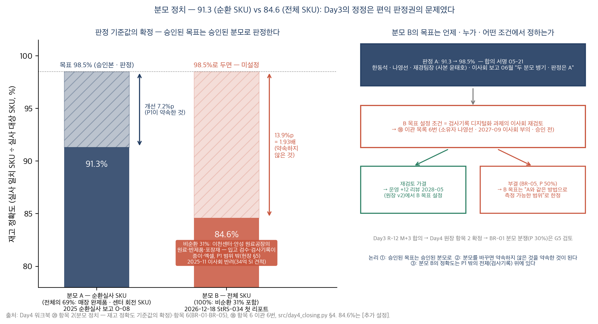

*그림 5-3. 분모 정치 — 91.3(순환 SKU) vs 84.6(전체 SKU). 승인된 목표는 승인된 분모로 판정하고, 다른 분모의 목표는 그 분모의 전제가 결정된 뒤에 설정한다. Day3의 정정(R-12)은 편익 판정권의 문제였다.*

### 실무에서 어떻게 틀리는가

**분모를 적지 않는다.** G5에서 "91.3이 무엇의 91.3인가"를 다툰다. **유리한 분모를 사후에 택한다.** 그 뒤 모든 편익 숫자가 의심받는다. **불리한 분모로 바꿔 "정직"을 과시한다.** 약속하지 않은 것을 판정받게 되고 전제 미충족이 P1 결함으로 기록된다. **전제를 이관하지 않는다.** 이관 6번이 없으면 분모 B는 영원히 "참고"다.

---

## 5.7 손익분기 66%, M+12/M+24 리뷰의 두 시계, 편익 리스크

**손익분기.** BC v1.0의 손익분기 편익 실현률 **66.0%** 재확인 — 118 × 0.66 = 77.8억/년. 할인율 8%, 2026~2031, 운영비 27억 전액 P1 귀속(보수적). NPV(100%) = +124.4(2026 할인) ~ +134.3(2026 무할인, BC 표기 관행); 70% +14.8; 50% −58.3. 최종 AC 151.95 반영(구축비 168 → 151.95: 2026 94.0 / 2027 57.95) 시 손익분기 **62.1%**, NPV(100%) +138.3 — 컨틴전시 반납 4.05·관리예비비 12.0 미사용의 효과가 손익분기 3.9%p 하락이다. 온담 귀속 99.6 기준으로는 요구 실현률이 **78%**(77.8/99.6)로 올라간다 — 이 사실도 원장에 적혀야 G5가 정직하다. 판정 규칙(허용범위 편익 −5%p): 실현률 95% 미만 → 경고(원인 분류·개선 계획) / 66% 미만 → 헌장 §14 중단 조건 수준(프로젝트는 종료되었으므로 프로그램 이사회의 후속 투자 판단 근거). 판정자 재무본부(정미란), 회의체 프로그램 이사회 G5.

**두 시계.** Day1 BC는 프로그램 착수(2026-01) 기준으로 M+24 = 2028-01, G5 = 2028-03-31(M+26)로 적었다. 그 시계로는 B-08의 M+12가 2027-01, 즉 컷오버 전이다 — BC가 쓰인 시점에는 편익 시점이 "구축 후"라는 감각으로 적혔고 실제 오픈은 2027-02-28이었다. 원장은 BC의 시계를 **고치지 않는다**(승인 문서를 사후에 고치는 것은 기준값을 고치는 것과 같다). 대신 운영 이관(2027-05) 기준의 두 번째 시계를 추가한다 — 운영 +12 = 2028-05(원장 v2: B-02 분모 B 목표 설정, 유지 판정, 측정 조직 확인), 운영 +24 = 2029-05(원장 v3: 편익 유지 판정, 원장 종결 또는 상시 KPI 전환). G5는 프로그램 시계에 그대로 둔다. 첫 측정: 2027-04(B-08 13.6h, 완료), 06(B-04·02·03 — 2차 컷오버 후 센터 포함), 09(B-05·07 — R5 후 3개월·2분기 마감), 11(B-03 기회손실 산정식 확정). 두 시계를 표에 명시하면 "M+12가 언제인가"의 혼동이 없어지고, 시계를 하나로 합치면 어느 문서의 날짜가 틀린 것이 된다.

**편익 리스크**(원장 부속, 자금원 운영 예산·프로그램 예비비). BR-01 분모 분쟁(R-12 이관, P 30%) — G5에서 A/B 다툼 재점화 → 05-21 합의문·이사회 보고 명시. BR-02 외생변수(P 40%) — 원재료가 급등·이상 기후 → 취급원가 기준 폐기율 왜곡 → 수량 기준 병기, 원재료가 지수 통제. BR-03 B-05 귀속 분쟁(P 25%) — 가맹점주 몫 18.4억을 협의회가 "본사 편익"으로 오해 → 귀속 분리 명기·가맹 귀속 지표 공유. BR-04 측정 조직 소멸(P 35%) — 로그 보존·재서명 규칙·정본 재무본부. BR-05 전제 미충족(P **50%**) — 검사기록 디지털화 재검토 부결 시 분모 B 목표 설정 불가, B-04 원료 폐기 부분 미실현 → 이관 6번 부의안에 B-02·B-04 연결 명시. Day1 프리모템 14번("측정 책임자가 경기 탓이라 했다")이 BR-02·BR-04로 대응된 것이다.

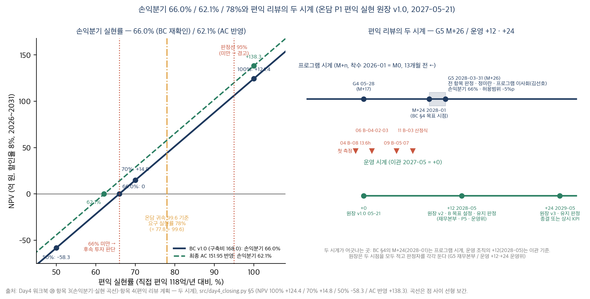

*그림 5-4. 손익분기 66.0%(BC) / 62.1%(AC 반영) / 78%(온담 귀속 기준)와 편익 리뷰의 두 시계. BC의 시계는 고치지 않고 운영 시계를 추가한다.*

---

## 5.8 온담 P1은 어느 성공인가 — Cooke-Davies의 세 정의와 Flyvbjerg의 곱셈 (심화)

Day1 1.2절의 두 개념을 회수한다. Cooke-Davies(2002)의 세 성공 — **프로젝트 관리 성공**(시간·비용·범위를 지켰는가), **프로젝트 성공**(목표한 편익을 실현했는가), **지속적 성공**(조직이 그것을 반복할 수 있는가) — 은 서로 독립이다. Flyvbjerg(2014)의 세 차원 곱셈 — 원가·일정·편익 각각이 계획대로 될 확률을 곱하면 셋 동시는 훨씬 작다 — 은 그 독립성의 통계적 표현이다.

2027-05-28의 P1은 어디에 있는가. **프로젝트 관리 성공** — 판정 가능하며, 판정은 "허용범위 이내"다: 일정 G4 정시(재기준선 0회, 컷오버 창 2회 정시), 원가 VAC −5.13이나 집행 한도 이내(예외 0회), 범위 FP 12,585 인수 100%(변경 +1.5%), 품질 밀도 0.094(기준 0.4)·심각도 1·2 미해결 0. 온타임이고 한도 내이며 PMB 대비 3.5% 초과다 — "온버짓"이라는 말을 세 층 중 어느 것으로 쓰느냐에 따라 답이 다르므로 이 교재는 그 말을 쓰지 않는다. **프로젝트 성공** — **판정 불가**. 첫 측정 하나(B-08 13.6h, 진행률 94%)가 있을 뿐이고 판정은 G5 2028-03-31이다. 2019년 스마트오더가 Day1 그림 1-6에서 "온타임·온버짓 + 편익 없음" 칸에 놓였던 것을 기억하라 — P1이 그 칸에 놓이지 않으리라는 보장은 2027-05-28 시점에 없으며, 편익 원장의 여섯 칸·ITO 서명·두 시계·편익 리스크 5건은 그 칸으로 가지 않기 위한 장치이지 결과가 아니다. **지속적 성공** — 판정은 더 뒤다. 교훈 15건이 세 표준의 개정(07·08·09월)으로 실제 반영되어 P2·P5·2028 후속 과제의 착수 패키지에 들어갔는가로 판정된다.

그래서 종료 보고서의 편익 축은 "미판정 — ⑳ 원장으로 이관"이고, 그것이 정직한 문장이다. 2027-05-28의 P1은 세 성공 중 첫째를 허용범위 안에서 이루었고, 둘째와 셋째를 판정할 **문서**를 남겼다. Flyvbjerg의 곱셈으로 말하면 세 차원 중 둘(원가·일정)의 인수가 확정되었고 셋째(편익)의 인수는 아직 곱해지지 않았다.

## 5.9 실무에서 어떻게 틀리는가

**교훈에서** — 감상을 교훈으로, 원인에 사람을, 적용 대상을 "전사"로, 소유자를 PM으로 적고, 잘된 것을 빼고, 개정 요청을 "검토 바람"으로 보낸다. 다음 프로젝트의 착수 회의에서 낭독되고 잊힌다. **편익에서** — PM이 outcome에 서명하고, 측정식과 분모가 없고, 승인 금액을 전액 귀속시키고, 시계를 하나로 합치고, 종료 보고서에 "편익 달성 예정"을 적는다. G5는 판정이 아니라 협상이 되고, 2020년 지적이 2028년에 되풀이된다. 두 실패의 공통점은 **프로젝트가 사라진 뒤의 독자를 위해 쓰지 않은 것**이다.

---

## 제5장 핵심 정리

> **한 줄씩 — 수업 직전 5분 복습용**
> 1. 교훈이 안 남는 것은 수집의 실패가 아니라 흡수의 실패다 — 적용 대상이 없는 교훈은 감상이다.
> 2. 교훈 한 건은 여섯 칸(상황·원인·교훈·적용 대상·소유자·증빙)이 차야 교훈이다.
> 3. 편익의 책무는 셋으로 나뉜다 — output(PM), outcome(현업 임원), utilisation(업무 변화 소유자).
> 4. 승인된 목표는 승인된 분모로 판정한다 — 다른 분모는 병기하되 목표를 바꾸지 않는다.
> 5. 손익분기 실현률과 M+12/M+24 두 시계가 편익 원장의 뼈대다 — PM은 그때 그 자리에 없다.
> 6. P1은 관리 성공이었다; 프로젝트 성공은 2028년 G5에서 판정된다 — 그 판정을 가능하게 만든 것이 오늘의 문서다.
>
> 아래는 같은 내용의 자세한 판이다.

1. 교훈 학습의 실패는 수집이 아니라 흡수의 실패다(Williams 2008). Syllk의 여섯 층 중 시스템 층(process·infrastructure)에 닿아야 남으며, 그 문은 교훈의 "적용 대상"과 "소유자" 칸이고 그 형식은 사내 표준 개정 요청서다. 교훈이 남는 조건은 개정된 양식이 다음 프로젝트의 착수 패키지에 있는가다.
2. 교훈 한 건은 여섯 칸(상황·원인·교훈·적용 대상·소유자·증빙)이 채워질 때만 교훈이고, 원인 칸에 사람이 있으면 교훈이 아니며, 잘된 것도 교훈이다. 온담 15건(log 41)은 세 표준 개정 요청(관리 규정 07월·내부통제 지침 08월·계약 문안 09월)으로 묶였다.
3. 편익의 책무는 output(PM·수행사, G4 종결) / outcome(오정근·한동석) / utilisation(업무 변화 소유자들)으로 분리되며(Zwikael & Smyrk), 원장의 측정 책임자 실명 칸이 그 서명이다. 편익이 실패하는 이유는 소유자 부재·측정 시점 부재·기준값의 정치이고(Ward & Daniel), 온담에는 분모·귀속(37 → 18.6)·측정 조직 소멸의 세 정치가 있다.
4. 승인된 목표는 승인된 분모로 판정한다 — A 91.3 → 98.5(7.2%p), B 84.6은 병기하되 목표는 전제(검사기록, 이관 6번)가 결정된 뒤 운영 +12에서 설정. Day3의 정정(R-12)은 편익 판정권의 문제였다. 손익분기 66.0%(AC 반영 62.1%, 온담 귀속 기준 78%), 리뷰는 프로그램 시계(G5 2028-03-31)와 운영 시계(2028-05·2029-05)의 둘, 편익 리스크 5건.
5. 2027-05-28의 P1은 프로젝트 관리 성공을 허용범위 안에서 이루었고(재기준선 0·VAC −5.13·FP 100%·밀도 0.094), 프로젝트 성공은 미판정(G5), 지속적 성공은 더 뒤다(Cooke-Davies). 종료 보고서의 편익 축 "미판정 — 원장으로 이관"이 정직한 문장이며, 원장·서명·두 시계·리스크는 2019년의 칸으로 가지 않기 위한 장치이지 결과가 아니다.

## 생각해 볼 질문

1. 여러분 회사의 최근 교훈 3건을 여섯 칸으로 채워 보라. 채울 수 없는 칸이 "적용 대상"과 "소유자"라면, 그 교훈은 어느 층에서 멈춰 있는가. 그 교훈으로 실제 개정된 양식이 하나라도 있는가.
2. L-02의 원인을 "오정근 본부장이 바빴다"로 적은 등록부와 "헌장에 대체 결정권자 칸이 없었다"로 적은 등록부는 다음 프로젝트에서 무엇이 다른가.
3. 여러분이 PM으로 종료한 프로젝트의 편익에 여러분이 서명했는가. 했다면 그 서명은 지금 누가 들고 있는가. 안 했다면 누가 했는가.
4. 재고 정확도 판정 분모를 B(84.6)로 택하는 것이 "더 정직"하다는 주장에 어떻게 답하겠는가. 약속한 분모와 약속하지 않은 분모의 전제를 분리하지 않으면 G5에서 무엇이 일어나는가.
5. 2027-05-28의 P1을 "성공"이라고 부를 수 있는가. Cooke-Davies의 세 정의 중 어느 것으로 그렇게 말하는가, 그리고 나머지 둘은 언제 누가 판정하는가.

## 워크북 연결

이 장은 워크북 §4(⑲ 교훈 등록부)와 §5(⑳ 편익 실현 원장)에 대응한다. §4 항목 1 여섯 칸·15건(5.2·5.3절), 항목 2 개정 요청 3건·착수 패키지 양식(5.1·5.3절). §5 항목 1 편익 6칸(5.4절), 항목 2 분모 정치(5.6절), 항목 3 손익분기·실현 곡선(5.7절), 항목 4 리뷰 두 시계(5.7절), 항목 5 ITO 서명표(5.4절), 항목 6 편익 리스크(5.7절). §4.6·§5.6 해설의 검산(15 = 5 + 1 + 3 + 2 + 3 + 1, 118 = 43 + 37 + 38, 99.6 = 43 + 18.6 + 38, 손익분기 0.660 / 0.621, 78% = 77.8/99.6, B-08 진행률 94%)을 따라 하라. §4.7 기본 과제(G2 중단 시 premature closure의 교훈 10건)는 1.2절과 이 장의 결합이고, §5.7 기본 과제(G5 첫 12개월 실적으로 미달 시 조치 실행)는 5.4~5.7절의 결합 문제다.

---

# 제6장 이 날의 학술 배경·읽을 자료 — 그리고 PM 트랙을 마치며 (과정 후)

이 장은 제1~5장에서 인용한 문헌 가운데 여덟 갈래를 골라 짧게 읽는다. Day1 제4장·Day2 제6장·Day3 제6장과 같은 이유에서다 — 표준이 "이렇게 하라"고만 말하는 지점에서 학술 문헌은 "왜 그런가"와 "언제 그것이 틀리는가"를 말해 주며, 전환·종료 단계에서 그 두 질문은 책임(누가 편익에 서명하는가)과 기억(왜 교훈은 남지 않는가)에 관한 것이다. 서지의 검증 표기는 과정 리딩리스트(`05_리딩리스트/00_리딩리스트.md`)를 따르고, 그 문서에 없는 항목은 [검증 필요]로 표시했다.

## 6.1 Zwikael & Smyrk(2011) — ITO 모형과 프로젝트 소유자

『Project Management for the Creation of Organisational Value』(Springer, 2011). Input-Transform-Outcome 모형의 핵심은 output과 outcome의 책임 분리이고, 그 분리를 제도화하는 역할이 **프로젝트 소유자**(project owner — 스폰서 또는 현업 책임자)다. 이 교재가 빌린 것은 원장의 ITO 서명표(5.4절)와 "output 서명은 G4에서 종결된다"는 규칙이다. **흔한 오독**: PM은 편익에 무관심해도 된다는 뜻으로 읽는 것 — PM은 utilisation이 가능하도록 output을 설계할 책임(두 분모 리포트를 Must로 둔 것)이 있다. 그리고 outcome 소유자가 "없는" 프로젝트는 시작하면 안 된다는 것이 저자들의 실제 주장이다.

## 6.2 Ward & Daniel(2012) — 편익 의존성 네트워크

『Benefits Management: How to Increase the Business Value of Your IT Projects』(2판, Wiley, 2012). Cranfield의 편익 관리 접근. 편익 의존성 네트워크(IT 산출물 → 업무 변화 → 편익 → 투자 목표)와 편익 소유자·업무 변화 소유자의 구분, 편익 리뷰의 반복. 5.5절의 세 실패 원인이 여기서 왔다. **흔한 오독**: 편익 관리를 종료 후의 측정으로만 읽는 것 — 저자들의 초점은 착수 시 네트워크를 그려 업무 변화 없이는 편익이 없음을 미리 드러내는 데 있다.

## 6.3 Williams(2008)·Duffield & Whitty(2015) — 교훈 학습의 실증과 Syllk

Williams, T. (2008). "How do organizations learn lessons from projects — and do they?" *IEEE Transactions on Engineering Management* 55(2) [검증 필요 — 게재지; 리딩리스트에는 PMJ 39(4)로 표기]. 설문·사례로 교훈의 수집은 되나 확산·적용이 안 됨을 실증. Duffield, S. & Whitty, S. J. (2015). "Developing a systemic lessons learned knowledge model for organisational learning through projects." *International Journal of Project Management* 33(2), 311-324. Syllk의 여섯 층. 5.1절. **흔한 오독**: Syllk를 지식관리 시스템(도구) 도입 논거로 읽는 것 — technology는 여섯 층 중 하나이며, process·infrastructure(규정·양식·계약) 층이 없으면 도구는 저장소가 된다.

## 6.4 Lundin & Söderholm(1995) — Transition과 제도화된 종료

*Scandinavian Journal of Management* 11(4), 437-455. Day1 1.3절에서 네 구조 개념(시간·과업·팀·전환)과 네 행위 개념을 빌렸고, 오늘은 전환(Transition)과 제도화된 종료(institutionalized termination)를 회수했다(1.3절). 종료 직전 인력 이탈과 교훈의 실패를 임시조직의 구조로 설명하는 논문이며, 그 처방 — 종료의 제도화 — 이 이 날의 다섯 문서다.

## 6.5 Beyer 외(2016) — SRE의 error budget

Beyer, B., Jones, C., Petoff, J. & Murphy, N. R. (eds.). *Site Reliability Engineering: How Google Runs Production Systems* (O'Reilly, 2016). 3장 Embracing Risk(error budget의 정의 — "안정과 속도의 환율"), 4장 Service Level Objectives(SLI·SLO·SLA의 구분). 3.6절. 함께 읽을 것은 Forsgren, Humble & Kim, *Accelerate*(IT Revolution, 2018) — 변경 실패율·복구 시간의 실증이 환전의 입력이다. **흔한 오독**: error budget을 "다운을 허용하는 면죄부"로 읽는 것 — 예산의 목적은 릴리스 동결 규칙(policy)을 숫자로 갖는 것이다.

## 6.6 Ford, Ford & D'Amelio(2008) — 저항의 재해석

Ford, J. D., Ford, L. W. & D'Amelio, A. (2008). "Resistance to change: The rest of the story." *Academy of Management Review* 33(2), 362-377. 저항을 변화 추진자의 관점에서만 서술해 온 문헌을 비판하고, 저항이 변화 설계에 관한 정보이며 때로 추진자 자신이 만든 것이라고 논증. 3.9절. 함께: Hiatt, *ADKAR*(Prosci, 2006); Kotter, *Leading Change*(HBS Press, 1996); Bridges, *Managing Transitions*(Da Capo, 1991; 4판 2016).

## 6.7 ITIL Version 5·ISO/IEC 20000 — 서지와 판본

PeopleCert, *ITIL Foundation* (Version 5, 2026-02). 상위 구조 ITIL Value System, Product and Service Lifecycle 8활동; 34 practices·7 원칙·4 차원 유지. 이 교재의 practice 어휘는 ITIL 4 *Foundation*(AXELOS, 2019)과 practice guide의 명칭이며, 3.1절의 고지대로 판본 무관하게 같다. ISO/IEC 20000-1(서비스 관리 시스템 요구사항) — 조항 번호는 원문 대조. 회사 규정 개정 시 6활동 → 8활동 매핑은 리딩리스트 §1.12의 매핑표(대응 관계는 추론 — [검증 필요])를 출발점으로.

## 6.8 개인정보 보호법 법률 제21445호 — 조문의 위치

개인정보 보호법 일부개정법률(법률 제21445호, 2026-03-10 공포, 2026-09-11 시행). 통지·신고 대상 '유출등'의 정의에 위조·변조·훼손 추가, 유출등 인지 시 72시간 이내 통지·신고, 과징금 기준 상향. 시행령·고시의 신고 대상 요건과 함께 읽어야 한다. 이 교재의 규율(3.8절): 조문은 단정, 적용은 비단정, 시한은 단정. 인쇄 전 조문 원문 대조 필수, 적용은 법무 검토.

## 6.9 읽을 자료 — 필수 / 심화 / 참고

### 필수 (과정 전)

| 자료 | 서지 | 왜 읽는가 | 어느 부분 | 시간 |
|---|---|---|---|---|
| **Day3 워크북 완성 예시본 5종** | 교재/PM트랙/Day3_워크북 §1.5~§5.5 | Day4 산출물의 입력. EX-01 대안 3개·R-14·귀책 분해표·조기 신호 5·착시 5를 읽지 않으면 오늘 워크북의 어느 칸도 채울 수 없다 | §2.5 항목 7~9, §3.5 항목 4~5, §5.5 항목 4·6 | 60분 |
| **PRINCE2 7 Closing a Project** | *Managing Successful Projects*, PeopleCert, 2023 | 5활동과 End Project Report·Follow-on action recommendations의 원문 | Closing a Project, Business case practice(benefits management approach) | 40분 |
| **SRE 3장·4장** | Beyer et al., O'Reilly, 2016(온라인 공개) | 99.5%를 분으로, 분을 릴리스로 환전하는 계산의 원전 | ch.3 Embracing Risk, ch.4 SLO | 40분 |
| **개인정보 보호법 개정 조문** | 법률 제21445호, 법제처 | '유출등' 정의와 72시간 — 조문을 직접 읽고 온다 | 통지·신고 관련 조 및 시행령 해당 조 | 30분 |

과정 전 제출 과제 하나: 여러분 회사의 최근 종료 보고서(또는 오픈 기록) 한 부를 가져와 ① 원가가 어느 층과 비교되어 있는지 ② 미해결 사항 목록에 소유자 실명·승인 여부가 있는지 ③ 편익 측정 책임자가 실명인지 세 가지에 O/X를 적어 오라.

### 심화 (과정 후)

| 자료 | 서지 | 왜 읽는가 | 시간 |
|---|---|---|---|
| **Zwikael & Smyrk** | Springer, 2011 | 6.1절. output/outcome 분리와 프로젝트 소유자 | 4시간 |
| **Ward & Daniel** | Wiley, 2nd ed., 2012 | 6.2절. 편익 의존성 네트워크 — 착수 때 그리는 법 | 5시간 |
| **Duffield & Whitty** | *IJPM* 33(2), 2015 | 6.3절. Syllk 여섯 층 | 1.5시간 |
| **Williams** | 2008 [검증 필요 — 게재지] | 6.3절. 교훈 학습 실패의 실증 | 1.5시간 |
| **Ford, Ford & D'Amelio** | *AMR* 33(2), 2008 | 6.6절. 저항은 정보다 | 1시간 |
| **Humble & Farley** | *Continuous Delivery*, Addison-Wesley, 2010, ch.10 | 롤백·블루그린·PoNR의 실무 정의, 배포 리허설 | 2시간 |
| **Forsgren, Humble & Kim** | *Accelerate*, IT Revolution, 2018 | 변경 실패율·복구 시간의 실증 — error budget 환전의 입력 | 4시간 |
| **ITIL Foundation (Version 5)** | PeopleCert, 2026 | 6.7절. 8활동과 practice — 회사 규정 개정 전에 | 6시간 |

### 참고 (워크북을 쓰다가 손을 뻗어 확인할 것)

ISO/IEC 20000-1 조항 원문(SLA·공급자·인시던트·문제·변경·릴리스) / MSP 5판 Benefits(프로그램 계층의 편익 지도 — P1 118억은 프로그램 214억의 일부) / Kotter·ADKAR·Bridges 원전 / 회사 정본 §5.5(이사회 승인 편익)·§6.5(두 번의 실패) / Day1 워크북 ① BC §4·§6, ② 헌장 §7·§14 / Day2 워크북 ⑨ 조정표(유보 3건) / 이 워크북의 검산 스크립트 `../그림/PM_Day4/src/day4_closing.py`.

### 읽지 않아도 되는 것

"프로젝트 종료 체크리스트 100가지"류(항목의 수가 아니라 세 칸이 문제다), ITIL 판본 비교 블로그(3.1절이 끝냈다), 편익 관리 소프트웨어 백서(도구는 Syllk의 한 층이다).

---

## PM 트랙을 마치며 — 20종의 사슬을 거꾸로, 세 표준의 전환기, 그리고 Product 트랙

이 교재는 하나의 문장으로 요약된다. **오픈은 이벤트가 아니라 이관이며, 이관은 받는 쪽이 서명해야 끝나고, 프로젝트가 끝난 뒤에도 남아서 작동해야 하는 문서만이 그 서명을 받을 수 있다.** 런북(38행, 게이트 3·PoNR 01:40·트리거 4 발동 0, D+1 07:20 서명), 이관 체크리스트(문서 12종·SLA 3층 — 315분 > 120분·ELS 8주·KEDB 6·72시간 안의 49시간 40분), 종료 보고서(재기준선 0회·VAC −5.13·지체상금 0의 네 줄·이관 10건 중 승인 전 4), 교훈 등록부(15건·개정 요청 3건), 편익 실현 원장(6칸·판정 분모 A·온담 귀속 99.6·ITO 서명·두 시계). 다섯 산출물은 워크북 §1~§5이고 서로를 인계한다 — 어느 하나의 행이 다른 넷 어디에도 인계되지 않으면 그 행은 프로젝트와 함께 사라진다.

**20종의 사슬을 거꾸로.** 4일 동안 만든 스무 문서를 마지막에서 처음으로 거슬러 올라가 보자. ⑳ 편익 원장의 6칸 중 "측정 책임자 실명"은 ① 비즈니스 케이스 §4의 "측정 책임자" 열에서 왔고, "분모"는 §4의 "산출 분모" 열과 가정 A3에서, "손익분기 66%"는 §6에서 왔으며, ITO 서명표의 outcome 소유자는 ② 헌장 §3(성공 기준)과 ④ 거버넌스의 편익 책임(BC §9)에서 왔다. ⑲ 교훈 15건은 ⑫ 성과보고의 조기 신호·착시, ⑭ 감리 귀속 이의, ⑮ 동시 지연, ⑬ IS-02에서 왔고, 그 문서들은 ⑧·⑨·⑩ 기준선을 자로 썼다. ⑱ 종료 보고서의 최종 AC 151.95는 ⑨ PV 곡선(145.80 → BL-02 146.82)과 ⑫ EAC4(150.86)에서, 지체상금 0은 ⑧ 여유 소유권 문안과 ⑮ 귀책 분해표에서, 이관 목록 6번은 ⑦ StRS-034 두 분모 리포트와 ① 가정 A3와 회사 정본 §4.2의 한 줄에서 왔다. ⑰ SLA 3층은 ④ RACI와 ⑮ 계약 구조표(P1 예산 밖 계약 두 건)에서, ⑯ 런북의 PoNR·트리거는 ⑧ 컷오버 창(허용범위 0)·⑩ R-14·② 헌장 §7에서 왔다. 20종은 스무 개의 문서가 아니라 **하나의 사슬**이고, 사슬의 어느 고리가 비면 그 자리에서 숫자가 끊긴다 — Day1에 측정 책임자를 부서명으로 적었다면 Day4의 ITO 서명표는 서명할 사람이 없었을 것이고, Day2에 두 분모 리포트를 Must로 두지 않았다면 Day4의 분모 정치는 G5에서 처음 터졌을 것이며, Day3에 라이선스 4.70의 착시를 걷어 내지 않았다면 Day4의 최종 AC는 "예상 못 한 10.7억 초과"로 기록되었을 것이다.

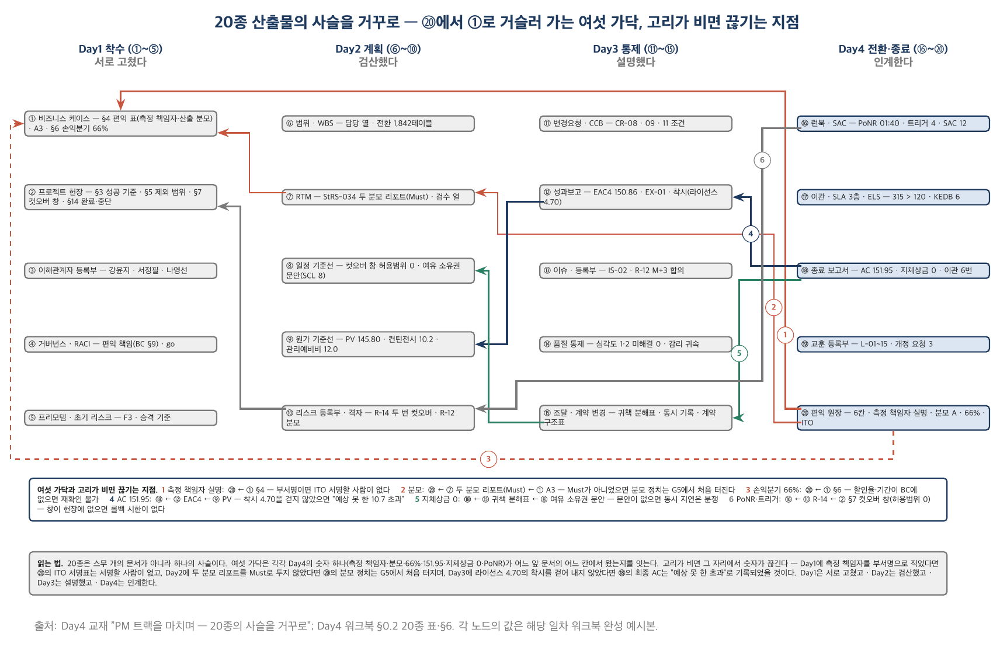

*그림 6-1. 20종 산출물의 사슬을 거꾸로 — 편익 원장의 여섯 칸이 비즈니스 케이스의 편익 표로, 종료 보고서의 숫자가 기준선과 성과보고로, 런북의 PoNR이 헌장의 컷오버 창으로 거슬러 올라간다. 고리가 비면 그 자리에서 숫자가 끊긴다.*

**세 표준의 전환기를 지나는 실무자에게.** 2026년 9월의 여러분은 세 표준이 같은 해에 흔들린 전환기에 있다 — PMBOK 8판(Focus Area와 성과영역, 6판 번호와의 병기), ITIL Version 5(ITIL Value System·8활동, practice 명칭 유지), 개인정보 보호법 제21445호(유출등·72시간, 시행 이번 주). 이 교재가 4일 동안 지킨 규율은 하나였다 — **판본을 정직하게 말하고, 어휘를 왜 고정하는지 고지하며, 조문은 단정하되 적용은 단정하지 않는다.** 회사에 돌아가 규정을 개정할 때 순서도 같다. 먼저 어느 어휘가 지금 계약서에 적혀 있는지를 확인하고, 다음에 바뀐 상위 구조를 매핑하며, 마지막에 법령의 시한을 절차에 박는다. 어휘가 낡았다고 규정을 통째로 바꾸는 것과, 판본이 바뀌었다는 것을 모른 채 "최신"이라 쓰는 것은 같은 종류의 실수다.

**Product 트랙 예고 — 당신은 발주자였다. 다음 4일은 공급자다.** 4일 동안 당신은 발주사 온담의 자리에 있었다. 이재현 PM에게 "대기와 추가는 변경대가 대상"이라는 말을 들었고, 그 말에 WBS 담당 열과 RACI와 동시 기록으로 답했으며, 검수 보류 회신을 썼고, 감리 귀속 이의를 제기했고, 지체상금 0과 대기 비용 0.60을 같은 표로 정산했다. 당신이 서명한 SAC와 SLA와 편익 원장은 공급자가 인도한 것을 조직이 받아 쓰기 위한 문서였다.

Product 트랙(Day5~Day8)에서 당신은 **반대편에 선다.** 온담F&B홀딩스는 같은 회사로 다시 등장하지만 이번에는 당신의 고객이다. 당신은 한 스타트업의 프로덕트 책임자가 되어 온담을 밖에서 본다 — 온담의 종료 보고서를 읽을 수 없고, 온담의 이관 목록에 무엇이 적혀 있는지 모르며, 세 본부장 사이의 이음새와 CFO의 결재 절차와 부채비율 187%를 고객의 관점이 아니라 공급자의 관점에서 다시 만난다. 4일 동안 발주자로서 배운 것 — 편익의 분모, 측정 책임자의 실명, 범위 밖의 전제, 승인 전 항목, 반려된 견적이 남긴 문제 — 이 이번에는 **공급자로서 무엇을 만들어 팔 것인가**의 재료가 된다. 발주자의 사슬을 끝까지 따라가 본 사람만이 공급자로서 그 사슬의 어느 고리가 비어 있는지를 볼 수 있다.

PM 트랙의 마지막 질문은 그래서 하나다. **당신이 오늘 서명한 이관 목록의 "승인 전" 네 줄 중, 어느 줄이 누군가의 사업이 되는가.** 프로젝트가 끝난 뒤에도 남아서 작동하는 문서는 그 프로젝트의 것만이 아니다. 그것은 다음 프로젝트의 — 그리고 다음 사람의 — 출발점이다. Day5에 만나자.
