# Product 트랙 Day 5 교재 — 프리시드(Pre-seed): 검사기록은 정말 문제인가

> **이 교재의 위치** — 8일 과정의 다섯째 날, Product 트랙의 첫째 날 본문이다. Day1~4에서 여러분은 ㈜온담F&B홀딩스의 발주자 — 428억 프로그램의 P1 프로젝트 PM — 였다. 오늘부터 여러분은 ㈜딥게이지의 창업팀이다. 세 사람, 현금 1.6억, 코워킹 4석. 슬라이드는 강사가 이 본문 가운데 무엇을 어떤 순서로 설명하는지를 정하고, 워크북은 이 본문의 개념을 딥게이지의 첫 90일에 적용해 산출물 다섯(㉑~㉕)을 직접 작성하게 한다.
>
> **전제 독자** — 주니어 PM과 3~7년차 현업 실무자. Day1~4를 마친 사람. 프로덕트 매니지먼트의 기초 — 애자일·스크럼·백로그 — 는 다루지 않는다. 대신 "프로젝트를 관리하던 사람이 프로덕트를 만들 때 무엇이 뒤집히는가"와 "인터뷰·트리·가정·실험이라는 도구가 왜 필요한가"에 지면을 쓴다. PM 트랙에서 배운 문서의 문법(값·단위·출처·분모)은 그대로 쓴다 — 분모만 바뀐다.
>
> **사례 회사** — 이 교재의 모든 예시는 `교재/공통/가상회사_딥게이지.md`에 정의된 ㈜딥게이지와 검사기록 AI 'GAUGE'를 재료로 쓴다. 숫자는 그 문서 §7 핵심 숫자 표(G·V·E·K)와 Day5 워크북 완성 예시본([추가 설정])을 따른다. 본문을 읽기 전에 그 문서 전체를 통독할 필요는 없다 — **§1.1 한 문단 요약 · §2 시장과 문제 · §6 등장인물 · §8 긴장**(약 25분)만 먼저 읽고, 나머지는 본문의 ■ 사례 사실 줄이 가리킬 때 찾아 읽으라. Day5 0교시의 역할 전환 선언(20분)과 `교재/공통/11_사례_한장_딥게이지.pdf`(책받침)가 같은 역할을 한다.
>
> **읽는 법과 분량** — 이 교재는 하루에 다 읽는 책이 아니다. 목차의 표시대로 필독 절만 수업 전에 읽으면 되고(약 100분), 나머지는 수업 후·과정 후에 읽는다. 본문의 딥게이지 단락은 앞머리에 **■ 사례 사실** 줄을 두어 그 단락이 쓰는 사례의 사실과 출처(정본 §·ID·워크북 §)를 먼저 적었다. 용어·약어·ID(OP-01, A-05, X-02, G-33 …)가 낯설면 `교재/공통/12_용어약어색인_Product.md`를, 4일 전체의 읽는 순서는 `교재/공통/10_Product_학습안내.md`를 본다.

---

## 목차

표시 없는 절은 **수업 전 필독**(약 100분), (심화)는 수업 후 일주일 안에 읽는 절(약 25분), (과정 후)로 표시된 장은 4일이 끝난 뒤 읽는 학술 배경과 읽을 자료다. 각 장 끝의 "핵심 정리" 첫 상자(한 줄씩)는 수업 직전 5분 복습용이다.

**서문 — PM 트랙에서 가져오는 것**

**제1장 역할 전환 — 프로덕트 매니지먼트란 무엇인가**
- 1.1 프로젝트 관리와 프로덕트 관리 — 결정의 종류가 다르다
- 1.2 발주자에서 공급자로 — 같은 문서를 반대편에서 쓴다
- 1.3 PM·PO·PdM — 용어의 지형과 이 과정의 합의
- 1.4 프리시드 단계에 있는 것과 없는 것 — 문서의 빈약함이 정상이다
- 1.5 표준·문헌의 지형 — Cagan, Torres, Ries, Rumelt, 그리고 PMBOK 8판 (심화)
- 핵심 정리 / 생각해 볼 질문 / 워크북 연결

**제2장 문제 발견 — 인터뷰에서 기회까지**
- 2.1 인터뷰 — 최근 사례를 묻는다
- 2.2 관찰과 자기 보고 — 박선재가 말하지 않은 것
- 2.3 JTBD와 네 가지 힘
- 2.4 기회 문장 — 해법 명사 금지
- 2.5 기회-해법 트리
- 2.6 딥게이지의 27건 — 8개 기회와 하나의 기각
- 핵심 정리 / 생각해 볼 질문 / 워크북 연결

**제3장 가정과 실험**
- 3.1 가정의 네 유형 — 가치·사용성·실현·사업성
- 3.2 가정 맵 — 중요도 × 증거 부족
- 3.3 실험의 종류와 증거의 강도
- 3.4 실험 카드와 사전등록
- 3.5 결과 판정 — 불확정을 성공으로 읽지 않는다
- 3.6 딥게이지의 실험 3 — 시간은 이겼고 수용은 졌다
- 핵심 정리 / 생각해 볼 질문 / 워크북 연결

**제4장 세그먼트·전략·창업 구조**
- 4.1 세그먼트와 SAM — 도면 클라우드 금지를 피할 것인가 받을 것인가
- 4.2 전략 커널 — 진단·추진 방침·일관된 행동
- 4.3 레퍼런스 클래스 — 우리 계획은 분포의 어디에 있는가
- 4.4 창업 헌장 — 지분·베스팅·옵션풀의 pre/post
- 4.5 자금과 런웨이 — 7개월의 산수
- 4.6 분야별 대조 — B2B 버티컬 SaaS·컨슈머·하드웨어·딥테크 (심화)
- 핵심 정리 / 생각해 볼 질문 / 워크북 연결

**제5장 이 날의 학술 배경 — 깊이 읽기 (과정 후)**
- 5.1 JTBD 논쟁 — Christensen과 Ulwick
- 5.2 Torres — continuous discovery의 조건
- 5.3 Rumelt — 나쁜 전략의 네 징후
- 5.4 Blank·Ries — customer development와 혁신 회계
- 5.5 Sarasvathy — effectuation, 창업자는 예측하지 않는다
- 5.6 Wasserman — 창업자의 딜레마
- 5.7 서지와 읽는 순서

**제6장 읽을 자료 (과정 후)**

---

# 서문 — PM 트랙에서 가져오는 것

오늘의 다섯 산출물은 백지에서 쓰지 않는다. 그러나 Day2~4처럼 전날 문서를 **입력**으로 받는 것도 아니다. 33개월 전으로 시계를 되감았으므로 온담의 문서는 존재하지 않는다. 오늘 가져오는 것은 문서가 아니라 **문법**이다.

| 오늘 쓰는 것 | PM 트랙에서 가져오는 문법 | 어디서 배웠나 | 무엇이 바뀌는가 |
|---|---|---|---|
| ㉑ 창업 헌장 | 헌장은 계획서가 아니라 권한 문서 — 제외 범위·가정·결정권·서명 | Day1 3.2절, ② | 권한을 주는 스폰서가 없다 — 세 사람이 서로 나눈다. 지분 칸이 생긴다 |
| ㉒ 인터뷰 | 이해관계자의 "공개 입장 / 숨은 동기" — 말과 행동을 분리한다 | Day1 3.3절, ③ | 이해관계자가 아니라 고객. 13명이 아니라 27건 |
| ㉓ 트리 | WBS의 100% 규칙·산출물 지향 | Day2 2.2절, ⑥ | **방향이 반대** — 정해진 것을 쪼개지 않고 정하지 않은 것을 나열한다 |
| ㉔ 가정·실험 | 프리모템의 "실패했다, 왜" · 리스크 등록부의 원인·사건·영향·트리거 | Day1 3.5절, ⑤·⑩ | 리스크 → 대응이 아니라 가정 → 실험 → 판정. 결과를 보기 전에 기준을 적는다 |
| ㉕ 세그먼트·커널 | RCF — 외부 분포 먼저 · 헌장의 "무엇을 만들지 않는가" | Day1 1.2절, ② 항목 5 | 유사 SaaS 12건 · 하지 않는 것 5개 |
| 전부 | 값·단위·출처·**분모** | 4일 내내 | 분모가 예산·FP·SKU에서 **인터뷰 건수·표본**으로 바뀐다 |

세 가지를 미리 말해 둔다.

첫째, **역할이 바뀌었다.** Day4 마지막에 여러분이 쓴 종료 보고서의 이관 목록 6번 — 이천센터·안성의 검사기록 디지털화, 21억, 소유자 나영선, 승인 전 — 이 오늘부터 여러분이 파는 물건이다. 그러나 그것은 Day8의 일이다. 오늘의 딥게이지는 온담을 모른다. 자동차 부품 협력사에 검사기록 AI를 팔려는 세 사람일 뿐이다. 이관 목록은 0교시 선언문에만 등장하고 오늘의 어느 문서에도 인용되지 않는다 — 그것이 옳다.

둘째, **찾을 것이 적다.** PM 트랙의 사례 정본에는 §5 핵심 숫자 표가 63개 행이었다. 딥게이지 정본에서 오늘 쓸 수 있는 숫자는 시장 크기 하나(2,150개사), 문제 크기 넷(47분·3.7일·11.5시간·2,700만), 현금 하나(1.6억), 캡테이블 한 줄뿐이다. 나머지는 여러분이 인터뷰로 만들고 실험으로 검증한다. 워크북의 ◆ 실습 입력 카드가 짧은 것은 결함이 아니라 프리시드의 정상 상태다.

셋째, **분모의 습관은 그대로다.** Day3에서 여러분은 재고 정확도 91.3%의 분모(순환실사 SKU 69%)를 따져 물었다. 오늘 "검사원 대부분이 전기 시간을 문제로 꼽았다"는 문장을 쓰면 안 된다 — "11명 중 9명"이다. Day7에서 코호트 리텐션 93%의 분모를 묻게 될 때, 그 습관이 여기서 시작한다.

*그림 0-1. Day5 다섯 산출물의 입력 관계. PM 트랙 ⑱ 이관 목록 6번은 ㉑의 선언문에만 들어간다(회색 파선). ㉒ 27건이 ㉓의 유일한 근거이고, ㉓의 잎 아래 가정이 ㉔가 되며, ㉔의 실험 결과가 ㉓의 우선순위와 ㉕의 회피 세그먼트를 고친다(되돌아가는 화살표). 오른쪽 파선은 Day6로 나가는 것 — ㉓은 ㉖ 백로그의 상위 문서, ㉔는 ㉙ 사전등록의 원형, ㉑ 항목 3의 옵션풀은 ㉚에서 시험받는다. Day5 워크북 §6의 표를 재구성.*

---

# 제1장 역할 전환 — 프로덕트 매니지먼트란 무엇인가

## 1.1 프로젝트 관리와 프로덕트 관리 — 결정의 종류가 다르다

### 개념

프로젝트 관리와 프로덕트 관리의 차이를 "일시적 vs 지속적", "산출물 vs 성과"로 설명하는 교과서가 많다. 틀린 말은 아니지만 실무에서 쓸모가 없다. 실무에서 두 직무를 가르는 것은 **어떤 종류의 결정을 내리는가**다.

프로젝트 PM의 결정은 대부분 **"어떻게"**의 결정이다. 무엇을 만들지는 헌장과 요구사항이 정해 주고, 얼마를 쓸지는 예산이 정해 주고, 언제까지인지는 마일스톤이 정해 준다. PM은 그 안에서 분해하고(WBS), 배열하고(CPM), 재고(EVM), 편차에 대해 결정을 요청한다(예외 보고). Day1~4의 20종 산출물 중 "무엇을 만들 것인가"를 PM이 정한 문서는 없다 — 헌장조차 스폰서가 승인한 비즈니스 케이스를 받아 적는 문서였다.

프로덕트 PM의 결정은 **"무엇을"**의 결정이다. 네 가지다.

| 결정 | 질문 | 프로젝트 PM에게는 | 프로덕트 PM에게는 | 오늘의 산출물 |
|---|---|---|---|---|
| **발견** | 무엇을 만들 것인가 — 누구의 어떤 아픔에 | 요구사항으로 **주어진다** | 인터뷰·관찰로 **찾는다** | ㉒·㉓ |
| **범위** | 얼마나 만들 것인가 — 무엇을 만들지 않을 것인가 | 헌장의 제외 범위로 주어진다 | Appetite 안에서 **자른다** | (Day6 ㉖) |
| **가격** | 얼마를 받을 것인가 — 무엇에 과금할 것인가 | 계약 금액으로 주어진다 | 밸류메트릭을 **정한다** | (Day6 ㉘) |
| **지표** | 무엇으로 성공을 잴 것인가 | 기준선 대비 편차(SPI·CPI) | 고객 행동의 변화(리텐션·채택률) — **분모를 정한다** | (Day7 ㉜) |

네 결정에 공통점이 하나 있다. **정답이 주어지지 않고, 틀렸다는 것을 나중에야 안다.** 프로젝트에서 틀린 결정은 기준선 대비 편차로 이번 달에 드러난다. 프로덕트에서 틀린 발견은 6개월 뒤 활성률 41%로 드러나고(Day7), 틀린 가격은 12개월 뒤 헤비 고객의 원가 붕괴로 드러나며(Day6), 틀린 세그먼트는 30개월 뒤 21억 딜 앞에서 드러난다(Day8). 그래서 프로덕트 관리의 도구는 대부분 **틀렸다는 것을 더 빨리 알기 위한 도구**다 — 인터뷰, 가정 맵, 실험, 코호트. 오늘 배우는 것이 그 첫 셋이다.

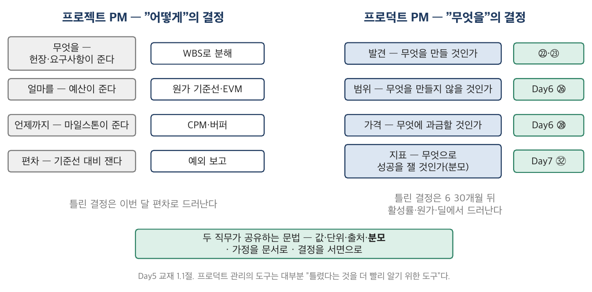

*그림 1-1. 두 직무의 결정 종류. 왼쪽(프로젝트)은 무엇·얼마·언제가 주어진 상태에서 "어떻게"를 결정하고 편차를 잰다. 오른쪽(프로덕트)은 무엇·얼마나·얼마를·무엇으로 재는가를 스스로 정하고, 틀렸음을 나중에 안다. 가운데 겹치는 띠 — 값·단위·출처·분모, 가정을 문서로, 결정을 서면으로 — 는 두 직무가 공유하는 문법이다.*

### 딥게이지의 사례로 읽기

> ■ **사례 사실** — 창업 3인의 이력(강민수 QA 9년 + 품질팀장 3년 / 오세진 VLM 5년 / 윤하경 SI PM 4년)과 문제 4숫자(47분·31분 / 3.7일 / 11.5시간 / 2,700만)는 정본 §1.2·§2.2(G-33~36); "검사원이 문제로 여기는가"는 정본 §2.2 마지막 문단.

딥게이지의 세 사람 중 윤하경은 스마트팩토리 SI PM 4년 — 프로젝트 PM이었다. 그가 D+0에 마주한 첫 결정은 "무엇을 만들 것인가"였고, 그 앞에는 요구사항이 없었다. 있는 것은 강민수가 전 직장에서 잰 네 숫자였다. 47분·3.7일·11.5시간·2,700만. SI PM에게 이 숫자는 요구사항의 근거처럼 보인다 — "기록 시간을 47분에서 20분으로 줄이는 시스템". 그러나 그 문장은 발견이 아니라 해법이다. 발견의 질문은 다르다. **그 47분을 검사원 본인이 문제로 여기는가?** 여기지 않는다면(그것이 자기 일이라고 여긴다면), 47분을 20분으로 줄이는 시스템은 태블릿처럼 서랍에 들어간다.

정본 §2.2 마지막 문단은 이렇게 끝난다 — "두 질문의 답은 다르다". 27건의 인터뷰가 그 두 번째 질문에 답하는 일이고, 그 답이 이 교재 2장이다.

### 실무에서 어떻게 틀리는가

프로젝트 PM 출신 프로덕트 PM의 첫 오류는 **발견을 요구사항 수집으로 대체하는 것**이다. 고객 열 명을 만나 "어떤 기능이 필요하세요"를 묻고 기능 목록을 만든다. 그 목록은 요구사항정의서와 같고, 그래서 익숙하다. 그러나 고객이 요구한 기능은 고객이 아는 해법이고, 고객은 자기 문제의 해법을 잘 모른다("다 해봤어요"). 두 번째 오류는 **범위를 자르지 못하는 것**이다 — 프로젝트에서 범위 축소는 실패(2022 WMS 63% 축소)였으므로. 프로덕트에서 범위를 자르지 않는 것이 실패다(Day6). 세 번째 오류는 **지표를 기준선 대비 편차로만 읽는 것**이다 — "계획 대비 유료 고객 3/5"는 편차이지 통찰이 아니다. 왜 2개사가 안 샀는가가 통찰이다.

반대 방향의 오류도 있다. 프로덕트 출신이 프로젝트 문법을 버리는 것 — 가정을 문서로 남기지 않고, 결정을 서면으로 남기지 않고, 분모를 안 적는다. 그래서 Day7에 "ARR 4.9억"이 계약 기준인지 순SaaS 기준인지를 아무도 답하지 못한다. 두 직무가 공유하는 문법을 버리는 것이 두 번째 종류의 오류다.

### 표준·문헌에서는

PMBOK 8판은 프로젝트 관리 표준이지 프로덕트 관리 표준이 아니다 — 그러나 8판이 "가치 인도(value delivery)"를 앞세우고 Delivery 성과영역에서 "무엇을 인도하는가"를 다루는 것은 두 직무의 경계가 얇아졌다는 신호다. Cagan(*Inspired*, 2018)은 프로덕트 팀의 책임을 "가치·사용성·실현·사업성 네 리스크를 배포 전에 다루는 것"으로 정의하고, Torres(2021)는 그것을 매주 하는 습관(continuous discovery)으로 만든다. 두 저자 모두 요구사항이 **주어지지 않는다**는 전제에서 시작한다. Ries(2011)의 "검증된 학습(validated learning)"은 이 장의 마지막 문장 — 틀렸다는 것을 더 빨리 알기 위한 도구 — 의 원전이다.

---

## 1.2 발주자에서 공급자로 — 같은 문서를 반대편에서 쓴다

### 개념

역할 전환은 이 과정의 설계 장치다. 같은 수강생이 4일간 발주자였고 4일간 공급자다. 목적은 하나 — **같은 문서가 반대편에서 어떻게 읽히는지를 몸으로 아는 것**이다. 여러분은 Day4에 218문항 보안성 검토 질의서를 보내는 쪽이었고, SLA 배상 상한 100%를 요구하는 쪽이었고, "이 상태로는 인수하지 못합니다"라고 말하는 쪽이었다. Day8에 그 문서들이 여러분에게 온다. 그때 여러분은 세 가지 중 하나를 하게 된다 — 그때 옳았던 요구가 지금도 옳다고 인정하거나, 어디까지 받을지를 문서로 답하거나, 거절하거나. 셋 다 답이 될 수 있다. 답이 될 수 없는 것은 "그건 발주자의 무리한 요구"라고 말하는 것이다 — 그 요구를 쓴 사람이 여러분이다.

오늘의 전환은 그보다 조용하다. 오늘 여러분은 계약서를 받지 않는다. 오늘 뒤집히는 것은 세 가지다.

| 뒤집히는 것 | 발주자였을 때 | 공급자가 된 지금 |
|---|---|---|
| **숫자의 출처** | 회사 정본 §5의 63행이 주어졌다 | 시장 1·문제 4·현금 1 — 나머지는 만든다 |
| **문서의 독자** | 스폰서·CCB·감사 — 결재를 받기 위해 쓴다 | 같이 일하는 세 사람과 6개월 뒤의 투자자 — **자기가 틀렸음을 알기 위해** 쓴다 |
| **금액의 무게** | 21억 = 428억의 4.9%, 허용범위 두 개 반 | 21억 = 매출의 37%(Day8), 지금은 현금 1.6억 |

### 딥게이지의 사례로 읽기

> ■ **사례 사실** — 이관 목록 6번의 문구(21억·나영선·승인 전)는 PM Day4 워크북 §3.5 항목 6; 역할 전환 선언 대본은 정본 머리글과 Day5 워크북 §0.1; "같은 금액의 비대칭"(4.906% vs 37.0%)은 정본 §5.6(E-07·E-09).

Day5 워크북 §0.1의 선언문은 이관 목록 6번을 읽고 끝난다 — "당신은 어제까지 이 계약의 발주자였고, 오늘부터 공급자다." 그 뒤 33개월을 되감는다. 되감는 이유는 두 가지다. 첫째, 21억 딜은 딥게이지가 자동차 협력사 58개를 확보한 뒤에야 올 수 있는 딜이다 — 세 사람짜리 회사에 온담은 RFI를 보내지 않는다. 둘째, 그 딜 앞에서 내리는 결정("자동차를 벗어날 것인가")은 오늘 정하는 세그먼트(㉕)와 기각 목록(㉓ 항목 7)이 있어야 결정이 된다. 오늘 "하지 않는 것"을 적지 않은 조는 Day8에 47건을 하나씩 판정하며 6시간을 쓴다.

같은 금액의 비대칭은 Day8에 판서된다 — 21억은 온담에게 4.906%, 딥게이지에게 37.0%. 오늘은 그 앞 문장만 말해 둔다: 협상 테이블 반대편에 앉은 사람에게 이 금액이 몇 %인지 모르는 상태에서 하는 협상은 협상이 아니다. 오늘 여러분은 반대편 사람이 된다.

### 실무에서 어떻게 틀리는가

역할 전환을 **선언 없이** 하는 것. 사내 신규 사업 TF가 흔히 그렇다 — 어제까지 벤더를 관리하던 사람이 오늘부터 서비스를 만드는데, 문서의 문법은 그대로 발주자의 것이다. 요구사항정의서를 쓰고, 검수 기준을 쓰고, 공급자(개발팀)에게 요구한다. 자기가 발견해야 할 것을 남에게 요구하는 구조다. 워크북 §0.1에 서명 칸이 있는 이유다 — 선언은 산출물이 아니지만 문서의 문법을 바꾸는 유일한 방법이다.

### 표준·문헌에서는

이 절에는 표준이 없다. 역할 전환은 교육 설계의 장치이지 실무 표준이 아니다. 굳이 대응을 찾자면 PRINCE2의 Senior Supplier — 프로젝트 보드에서 공급자의 이익을 대변하는 역할 — 이 있다. Day1에 박세연 IT본부장이 그 자리였다. 오늘 여러분이 앉는 자리는 그 반대편 끝, 공급자 자신이다.

---

## 1.3 PM·PO·PdM — 용어의 지형과 이 과정의 합의

### 개념

이 과정에서 "PM"은 Day1~4에 프로젝트 매니저였고 오늘부터 프로덕트 매니저다. 같은 두 글자가 두 직무를 가리키는 것은 한국 IT 업계의 실제 상태이고, 그래서 워크북 §0.1에 용어 합의 칸이 있다. 지형만 정리한다.

| 용어 | 어디서 온 말인가 | 실제로 하는 일 | 이 과정에서 |
|---|---|---|---|
| **프로젝트 PM** | PMBOK·PRINCE2 | 주어진 범위·예산·일정 안에서 인도 — Day1~4 | "프로젝트 PM"으로 표기 |
| **프로덕트 PM / PdM** | 미국 소프트웨어 회사(Microsoft·Google) | 발견·범위·가격·지표 — 무엇을 만들지 결정 | "PM"으로 표기 |
| **PO (Product Owner)** | 스크럼 가이드 | 백로그의 순서와 내용에 책임 — 스프린트 단위 | 직함으로 쓰지 않는다 — 역할 |
| **CPO** | 회사 조직 | PM 조직의 장, 제품 전략 | 윤하경 |
| **PMO** | PMBOK | 프로젝트 관리 지원 조직 | Day1~4의 것 |

용어 논쟁의 실무적 의미는 하나다 — **결정권이 어디 있는가**. 스크럼의 PO는 백로그 순서를 정하지만 무엇을 만들지(발견)와 얼마를 받을지(가격)는 정하지 않는 경우가 많다. 그 자리에 "PM"이라는 직함을 붙이면 발견·가격 없이 백로그만 정리하는 사람이 되고, 그것이 윤하경이 견디지 못하는 "요구사항 정리자"다(정본 §1.4). 용어를 합의한다는 것은 결정권을 합의하는 것이고, 그래서 ㉑ 항목 6(역할과 책임)에 용어 칸이 있다.

### 딥게이지의 사례로 읽기

> ■ **사례 사실** — 윤하경의 숨은 동기("요구사항 정리자로 취급되는 것을 견디지 못한다")는 정본 §1.4·§8.2; 첫 PM 채용(D+300, 연봉 7,200~9,000만 + 옵션 0.4%)은 정본 §3.3.

딥게이지는 D+300에 첫 PM을 뽑는다. 그때 CPO 윤하경과 새 PM의 경계가 문서에 없으면 둘 중 하나가 요구사항 정리자가 된다. ㉑ 항목 6에 "PM = 프로덕트 매니저(CPO 조직), PO는 쓰지 않는다"를 적고, 첫 PM 채용 시 경계를 표에 추가한다고 적어 두는 것이 D+12에 할 수 있는 전부다.

### 실무에서 어떻게 틀리는가

직함을 먼저 정하고 결정권을 나중에 정한다. "PM 3명 채용"이라는 공고에 발견·범위·가격·지표 중 무엇을 결정하는지가 없다. 채용된 사람은 백로그를 정리하고, 6개월 뒤 "PM이 하는 일이 뭔가"라는 질문이 나온다.

### 표준·문헌에서는

스크럼 가이드(2020)는 PO를 "제품 가치를 극대화할 책임"으로 정의하되 조직 안의 직함과 무관하다고 못 박는다. Cagan은 PO를 "PM 역할의 일부"로 본다. 한국의 현실은 둘의 중간이며, 이 과정은 합의문으로 처리한다.

---

## 1.4 프리시드 단계에 있는 것과 없는 것 — 문서의 빈약함이 정상이다

### 개념

프리시드 회사에는 문서가 없다. 정확히는 **참인지 아닌지 모르는 문장**만 있다. 온담 P1의 착수 시점에는 이사회 승인본, 3개년 재무, 운영 KPI 16개, 인터페이스 목록 47본이 있었다. 딥게이지의 D+0에는 네 숫자와 세 사람의 이력이 있다. 이 빈약함을 결함으로 여기면 두 가지 오류가 나온다 — 없는 숫자를 만들어 내거나(가짜 정밀도), 숫자가 없으니 결정을 미룬다(마비).

프리시드의 문서는 **결정을 기록하는 문서가 아니라 모르는 것을 기록하는 문서**다. 워크북 §0.1 2단계 — "카드에 없는 숫자는 만들어 내지 말고 '미확정 — 실험 X-nn'으로 적는다" — 가 그 규칙이다. 오늘의 다섯 산출물을 단계별로 놓으면 이렇다.

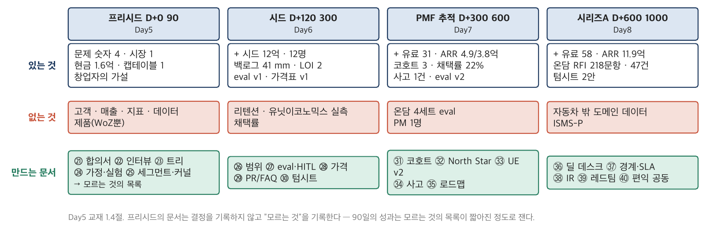

*그림 1-4. 스타트업 단계와 문서. 프리시드(D+0~90)에 있는 것은 문제 숫자 4·시장 1·현금 1·캡테이블 1과 창업자의 가설이고, 없는 것은 고객·매출·지표·데이터다. 오늘의 다섯 문서(㉑~㉕)는 "없는 것"을 만드는 것이 아니라 "모르는 것"을 목록으로 만드는 문서다 — 인터뷰가 근거를, 실험이 검증을, 커널이 선택을 기록한다. 시드(Day6)부터 백로그·eval·가격이, PMF 추적(Day7)부터 코호트·North Star가 생긴다.*

### 딥게이지의 사례로 읽기

> ■ **사례 사실** — D+0의 자산: 현금 1.6억·월 고정비 2,300만·런웨이 7개월(G-15), 캡테이블 T0(K-01), 문제 4숫자(G-33~36), 시장 2,150·11,800(G-32) — 정본 §1.4·§2.1·§2.2·§3.1. D+90의 상태(인원 5, 인터뷰 27, LOI 2)는 정본 §3.1; 채용 2명과 월 고정비 3,230만은 Day5 워크북 §0.3 [추가 설정].

D+0의 딥게이지가 가진 것을 전부 적으면 한 줄이다: 1.6억, 2,300만/월, 세 사람, 네 숫자, 시장 2,150개사. D+90의 딥게이지가 가진 것은 그보다 조금 길다: 인터뷰 27건, 기회 8개, 가정 12개, 실험 3의 결과, LOI 2건, 사람 5명, 그리고 잔여 현금 8,600만. 90일 동안 만들어진 것은 제품이 아니라 **모르는 것의 목록이 짧아진 것**이다. A-02(OCR 90%)는 이제 "모른다"가 아니라 "오전에는 되고 오후에는 안 된다"이고, A-05(검사원 수용)는 "모른다"가 아니라 "시간은 받아들이고 판정은 거부한다"다. 프리시드의 성과는 이렇게 잰다.

### 실무에서 어떻게 틀리는가

**가짜 정밀도.** 프리시드 IR 덱에 "TAM 3,200억, SAM 1,180억, SOM 94억"이 소수점까지 적혀 있다. 분모가 없다. Day7의 서영채가 묻는 질문 — "그 리텐션의 분모는 무엇인가요" — 은 프리시드에서 "그 SAM의 분모는 무엇인가요"로 시작한다. **마비.** 반대로 "데이터가 없어서 결정할 수 없다"며 인터뷰를 100건으로 늘린다. 27건으로 기회 8개의 빈도가 나왔으면 다음은 실험이지 인터뷰 28번째가 아니다. **문서를 안 쓴다.** "우리는 셋뿐이라 다 안다" — 그래서 옵션풀 pre/post를 아무도 정하지 않은 채 시드 텀시트를 받는다(F-01).

### 표준·문헌에서는

Blank(*The Four Steps to the Epiphany*, 2005)의 customer discovery는 "회사 밖으로 나가라(get out of the building)"를 첫 단계로 두고, 그 단계의 산출물을 문제 가설·고객 가설·검증 결과로 정의한다 — 오늘의 ㉒·㉔에 해당한다. Ries(2011)의 MVP는 제품이 아니라 "최소의 노력으로 최대의 검증된 학습을 얻는 실험"이며, 이 정의로 보면 딥게이지의 D+90 제품은 위저드오브오즈 하나다. 그것으로 충분하다.

---

## 1.5 표준·문헌의 지형 — Cagan, Torres, Ries, Rumelt, 그리고 PMBOK 8판 (심화)

### 지형

프로덕트 관리에는 PMBOK 같은 "정전"이 없다. 대신 몇 권의 책이 사실상의 표준 노릇을 하고, 그 책들이 서로 다른 질문에 답한다.

| 문헌 | 답하는 질문 | 이 과정에서 쓰는 곳 | 주의 |
|---|---|---|---|
| Cagan, *Inspired* (2판, 2018) | 프로덕트 팀은 무엇을 책임지는가 — 4 리스크 | 3.1절 가정의 네 유형 | 실리콘밸리 대기업 전제 — 프리시드에는 팀이 아니라 세 사람 |
| Torres, *Continuous Discovery Habits* (2021) | 발견을 매주 어떻게 하는가 — 인터뷰·OST·가정·실험 | 2·3장 전체 | 트리는 도구이지 정답 생성기가 아니다 |
| Fitzpatrick, *The Mom Test* (2013) | 고객에게 무엇을 물어야 거짓말을 안 듣는가 | 2.1절 | 짧고 실용적 — 필독 |
| Christensen 외 (2016) / Moesta (2020) | 고객은 왜 사는가 — JTBD, 네 가지 힘 | 2.3절 | 5.1절 논쟁 참조 |
| Ries, *The Lean Startup* (2011) | 무엇을 배웠는지 어떻게 아는가 — 검증된 학습, 혁신 회계 | 3.4·3.5절 | "피벗"의 남용 주의 |
| Singer, *Shape Up* (2019) | 얼마나 만들 것인가 — Appetite | Day6 | 무료 공개 |
| Rumelt, *Good Strategy Bad Strategy* (2011) | 전략이란 무엇인가 — 커널 | 4.2절 | 스타트업 책이 아니다 — 그래서 좋다 |
| Wasserman, *The Founder's Dilemmas* (2012) | 창업자는 무엇을 두고 싸우는가 — 지분·역할 | 4.4절 | 데이터 기반(1만 명) |
| Feld & Mendelson, *Venture Deals* (4판, 2019) | 텀시트는 무슨 뜻인가 | Day6·8 | 미국법 전제 — 한국 RCPS는 실무 자료로 보완 |
| PMBOK 8판 (2025) | 프로젝트는 어떻게 인도하는가 | Day1~4 | Delivery 성과영역이 프로덕트와 닿는 지점 |

### 실무에서 어떻게 틀리는가

한 권을 정전으로 삼는 것. Torres의 트리를 그리면 발견이 끝났다고 믿거나, Ries의 "피벗"을 결정 회피의 이름으로 쓰거나, Cagan의 4 리스크를 체크리스트로 만들어 채운다. 각 책은 한 질문에 답한다. 오늘의 다섯 산출물은 다섯 질문이다.

---

## 제1장 핵심 정리

> **한 줄씩 — 수업 직전 5분 복습용**
> 1. 프로젝트 PM은 "어떻게"를, 프로덕트 PM은 "무엇을·얼마나·얼마를·무엇으로 재는가"를 결정한다 — 그리고 틀렸음을 나중에 안다.
> 2. 프로덕트 관리의 도구는 대부분 틀렸다는 것을 더 빨리 알기 위한 도구다 — 인터뷰·가정 맵·실험·코호트.
> 3. 역할 전환은 선언이다 — 같은 문서를 반대편에서 쓴다는 것을 서명으로 확인한다.
> 4. PM/PO/PdM 논쟁의 실무적 의미는 결정권이 어디 있는가 하나다 — 용어를 합의한다는 것은 결정권을 합의하는 것.
> 5. 프리시드의 문서는 결정을 기록하지 않고 모르는 것을 기록한다 — 없는 숫자를 만들지 말고 "미확정 — 실험 X-nn"이라 적는다.
> 6. 프리시드 90일의 성과는 제품이 아니라 모르는 것의 목록이 짧아진 정도로 잰다.
>
> 아래는 같은 내용의 자세한 판이다.

1. 두 직무를 가르는 것은 결정의 종류다. 프로젝트 PM은 무엇·얼마·언제가 주어진 상태에서 "어떻게"를 결정하고 편차를 잰다. 프로덕트 PM은 발견(무엇을)·범위(얼마나)·가격(얼마를)·지표(무엇으로)를 스스로 정하며, 틀린 결정은 6~30개월 뒤에 드러난다. 그래서 도구가 다르다.
2. 두 직무가 공유하는 문법은 그대로다 — 값·단위·출처·분모, 가정을 문서로, 결정을 서면으로. 분모가 예산·FP·SKU에서 인터뷰 건수·표본으로 바뀔 뿐이다.
3. 역할 전환은 교육 장치이자 문서 문법의 전환이다. 발주자의 문법(요구·검수·거부)으로 발견을 하려는 사내 TF가 흔히 실패하는 이유다. Day8에 여러분이 Day4에 쓴 문서를 받는다.
4. PM(프로덕트)·PO·PdM·CPO의 지형에서 실무적으로 중요한 것은 결정권의 위치다. 스크럼 PO에 발견·가격 결정권이 없으면 "요구사항 정리자"가 된다 — 윤하경의 불안이 그것이고, ㉑ 항목 6의 용어 칸이 그 답이다.
5. 프리시드에 있는 것은 문제 숫자 4·시장 1·현금 1·캡테이블 1과 가설뿐이다. 가짜 정밀도(분모 없는 SAM)와 마비(인터뷰 100건)를 둘 다 피한다.
6. 문헌은 정전이 아니라 질문별 답이다 — Cagan(책임), Torres(습관), Fitzpatrick(질문), Christensen·Moesta(왜 사는가), Ries(학습), Singer(얼마나), Rumelt(전략), Wasserman(창업자), Feld(텀시트).

## 생각해 볼 질문

1. Day1~4의 20종 산출물 중 "무엇을 만들 것인가"를 PM이 결정한 문서가 하나라도 있었는가? 헌장 항목 5(범위)는 누가 정했는가?
2. 여러분 회사에서 "PM"이라는 직함을 가진 사람은 네 결정(발견·범위·가격·지표) 중 무엇을 결정하는가? 결정하지 않는 것은 누가 하는가?
3. 프리시드 IR 덱의 SAM 숫자 하나를 골라 그 분모를 말해 보라. 말할 수 없다면 그 숫자는 무엇인가?
4. 여러분이 Day4에 요구한 것 중, 공급자가 되어 받는다면 가장 받기 어려운 조항은 무엇인가?

## 워크북 연결

이 장은 Day5 워크북 **§0**(역할 전환 선언문·용어 합의·시점 고정·분모 선언)과 **㉑ 창업 헌장·공동창업자 합의서**의 항목 2(왜 이 회사인가 — 해법이 아니라 문제와 숫자, 1.4절)·항목 6(역할과 용어 합의, 1.3절)·항목 9(서명과 선언, 1.2절)에 대응한다. ㉑의 나머지 항목(지분·베스팅·의사결정·이탈·자금)은 4.4절·4.5절이 다룬다. 심화 과제(3~7년차): 자기 회사의 "PM" 직무기술서를 1.1절의 네 결정 표에 대조해 결정권이 없는 칸을 표시하고, 그 칸의 결정을 실제로 누가 하는지 적는다.

---

# 제2장 문제 발견 — 인터뷰에서 기회까지

## 2.1 인터뷰 — 최근 사례를 묻는다

### 개념

고객 인터뷰의 목적은 요구사항을 받는 것이 아니라 **요구사항이 존재하는지를 확인하는 것**이다. 그래서 질문의 문법이 요구사항 워크숍과 반대다. 워크숍은 "무엇이 필요하세요"를 묻고, 인터뷰는 "지난주에 무슨 일이 있었나요"를 묻는다. 앞의 질문은 의견을 낳고 뒤의 질문은 이야기를 낳으며, 의견은 거의 언제나 예의 바르고 이야기는 거의 언제나 사실이다.

Fitzpatrick(*The Mom Test*, 2013)의 세 규칙이 이 절의 전부다. ① 우리 아이디어가 아니라 상대의 삶을 묻는다. ② 미래의 가정이 아니라 **과거의 구체적 사실**을 묻는다. ③ 말을 줄이고 듣는다. 이 규칙을 지키면 어머니에게 물어도 거짓말을 듣지 않는다 — 어머니는 "쓰겠니?"에는 "그럼"이라고 하지만 "지난번에 그 일이 생겼을 때 어떻게 했니?"에는 사실을 말한다.

질문의 사다리를 그리면 이렇다. 아래로 갈수록 사실에 가깝고, 위로 갈수록 의견에 가깝다.

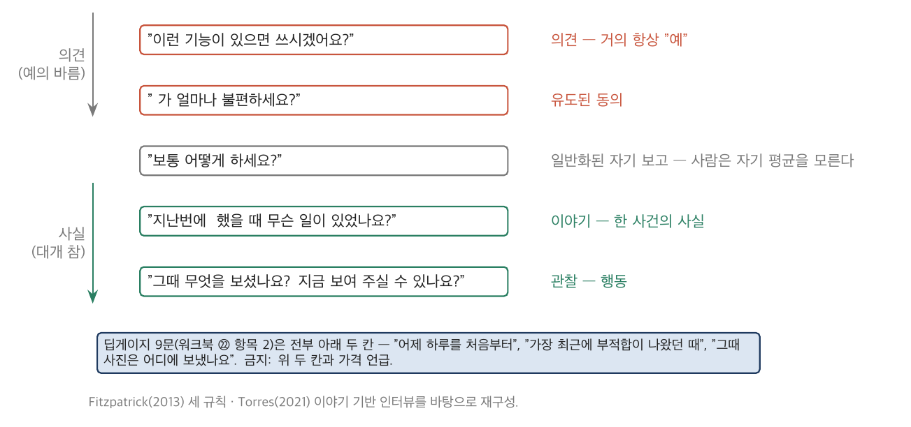

*그림 2-1. 인터뷰 질문의 사다리. 맨 위 "~하면 쓰시겠어요?"는 의견(거의 항상 예)을, "~가 불편하세요?"는 유도된 동의를, "보통 어떻게 하세요?"는 일반화된 자기 보고를, "지난번에 ~했을 때 무슨 일이 있었나요?"는 이야기를, "그때 무엇을 보셨나요 / 지금 보여 주실 수 있나요?"는 관찰을 낳는다. 딥게이지의 9문(워크북 ㉒ 항목 2)은 전부 아래 두 칸이다. Fitzpatrick(2013)·Torres(2021)를 바탕으로 재구성.*

**최근 사례**가 핵심 단어다. "보통 어떻게 하세요"는 평균을 묻는 것이고 사람은 자기 평균을 모른다. "지난번에"는 한 사건을 묻는 것이고 사람은 사건을 기억한다. 27건의 인터뷰가 27개의 사건이면 패턴이 나오고, 27개의 평균이면 패턴이 안 나온다.

인터뷰 계획에서 정할 것은 **누구를 몇 명**이다. 역할군은 의사결정 사슬을 따른다 — 쓰는 사람, 책임지는 사람, 돈 쥔 사람, 요구하는 사람. 사용자가 가장 많아야 하고 지불자·요구자는 적어도 한 명은 있어야 한다. 리크루팅 경로를 기록하는 이유는 편향을 나중에 보기 위해서다.

### 딥게이지의 사례로 읽기

> ■ **사례 사실** — 인터뷰 27건 = 검사원 11 / 품질팀장 8 / 공장장 4 / 대표 3 / 1차사 SQE 1(정본 §3.1); 12개사와 27건의 원자료·9문 가이드·리크루팅 경로(전 직장 인맥 6 / 스마트허브 4 / 멘토 1 / H사 1)는 Day5 워크북 §2.5 항목 1~3 [추가 설정].

딥게이지의 9문은 "어제 하루를 처음부터 끝까지"로 시작해 "가장 최근에 부적합이 나왔던 때"로 간다. 질문 6("기록을 옮겨 적는 일이 있나요 — 어디서 어디로, 하루에 얼마나")이 G-33의 31분을 검증하는 질문이고, 질문 7("바꿔 보려고 한 적이 있나요, 어떻게 됐나요")이 "다 해봤어요"를 끌어내는 질문이다. 금지 줄에 "쓰시겠어요?"와 가격 언급이 있다.

편향의 기록이 인터뷰 계획의 마지막 줄이다 — 전 직장 인맥 6개사는 전부 절삭·단조이고 사출·프레스는 4개사뿐이며, 30인 미만은 0건, 관리자 배석은 4건. 이 줄이 없으면 27건은 "고객의 목소리"가 되고, 있으면 "안산·화성의 절삭 공장 검사원의 목소리"가 된다. 후자가 사실이다.

### 실무에서 어떻게 틀리는가

**대표만 만난다.** 말이 통하고 시간을 내 준다. 그러나 대표는 검사원의 31분을 모르고, 클레임 2,700만은 안다 — 그래서 대표만 만난 회사는 클레임 관리 시스템을 만든다. **기능을 보여 준다.** 프로토타입 화면을 들고 가서 "이런 거 어떠세요"를 묻는다. 그 순간부터 인터뷰는 해법 인터뷰가 되고 문제는 안 나온다. 해법을 보여 주는 것은 실험(3장)에서, 정해진 가설을 검증할 때만 한다. **요약한다.** 27건을 "대부분이 ~를 원했다"로 줄인다. 분모가 사라지고, 6개월 뒤 "그때 몇 명이 그랬지?"에 답이 없다. **배석을 기록하지 않는다.** 관리자가 옆에 있는 검사원의 "괜찮아요"를 관리자 없는 검사원의 "적는 게 일이지 검사가 일이 아니에요"와 같은 무게로 센다.

### 표준·문헌에서는

Fitzpatrick(2013)이 원칙, Torres(2021) 8장이 절차(이야기 기반 인터뷰, 주 1회 습관, 스냅샷 한 장)다. Blank(2005)는 문제 인터뷰와 해법 인터뷰를 단계로 분리한다 — 27건은 전부 문제 인터뷰이고 해법 인터뷰는 X-01 이후다. Portigal(*Interviewing Users*, 2013)은 관찰·현장 방문의 기법을 다룬다.

---

## 2.2 관찰과 자기 보고 — 박선재가 말하지 않은 것

### 개념

사람이 자기 행동에 대해 말하는 것(자기 보고)과 실제로 하는 것(행동)은 다르다. 거짓말이 아니다 — 자기 평균을 모르고, 듣는 사람에 맞춰 말하고, 말하기 어려운 것은 말하지 않는다. 인터뷰는 자기 보고를 얻는 도구이고, 그래서 인터뷰만으로는 부족하다. 스냅샷 카드에 **관찰된 행동** 열이 따로 있는 이유다. 관찰 열에는 본 것만 적는다 — "태블릿이 서랍에, 배터리 없음"은 관찰이고 "불편해 보였다"는 의견이다.

괴리가 있는 인터뷰는 실패한 인터뷰가 아니라 **가장 좋은 인터뷰**다. 괴리는 가정이 되고(3장), 가정은 실험이 되며, 실험이 자기 보고를 대체한다. 딥게이지의 27건 중 괴리가 기록된 것은 넷이고, 그중 하나가 이 회사의 33개월을 관통한다.

### 딥게이지의 사례로 읽기

> ■ **사례 사실** — 박선재(52, 촉탁, 현장 17년)의 공개 발언 "다 해봤어요"와 숨은 행동(자동판정 OFF·재촬영·별도 종이 메모·관리자 배석 시 발언 변화), 2027-06 조도 경고, 2027-08 사고는 정본 §2.3·§4.6·§6.2; 괴리 4건(I-02·I-10·I-18·I-24)은 Day5 워크북 §2.5 항목 6 [추가 설정].

D+12, 세영정공 1라인. 박선재는 팀장 배석 전에는 "태블릿이 느려서 돌아갔다"고 했고 배석 후에는 "괜찮았다"고 했다. 오후 검사분을 종이 메모로 따로 보관하는 것은 인터뷰어가 라인 옆 서랍에서 봤다. 스냅샷 카드의 관찰 열에는 그것만 적혀 있다. 해석 열에는 "도구 자체가 아니라 판정 기록이 남는 것에 대한 반응일 가능성 → 가정 A-05"라고 적혀 있고, 단정하지 않는다.

이 한 줄이 왜 중요한가. D+40 X-01에서 박선재는 검사원 5명 중 별도 종이 메모를 남긴 2명에 든다(워크북 ㉔ 카드 ①). D+300 이후 그는 자동판정을 끄고 같은 부위를 재촬영한다 — 로그에만 남는다. 2027-06 그는 GAUGE가 오후 조도에서 크랙을 놓친다는 것을 팀장에게 구두로 말하고, 아무도 기록하지 않으며, 두 달 뒤 사고가 난다(정본 §4.6). 그의 두려움 — 촉탁직 1년 재계약, AI가 판단을 대체하면 — 은 인터뷰에서 한 번도 말로 나오지 않았다. 행동으로만 나왔다. D+12에 관찰 열을 채운 조와 채우지 않은 조는 Day7의 사고를 다르게 만난다.

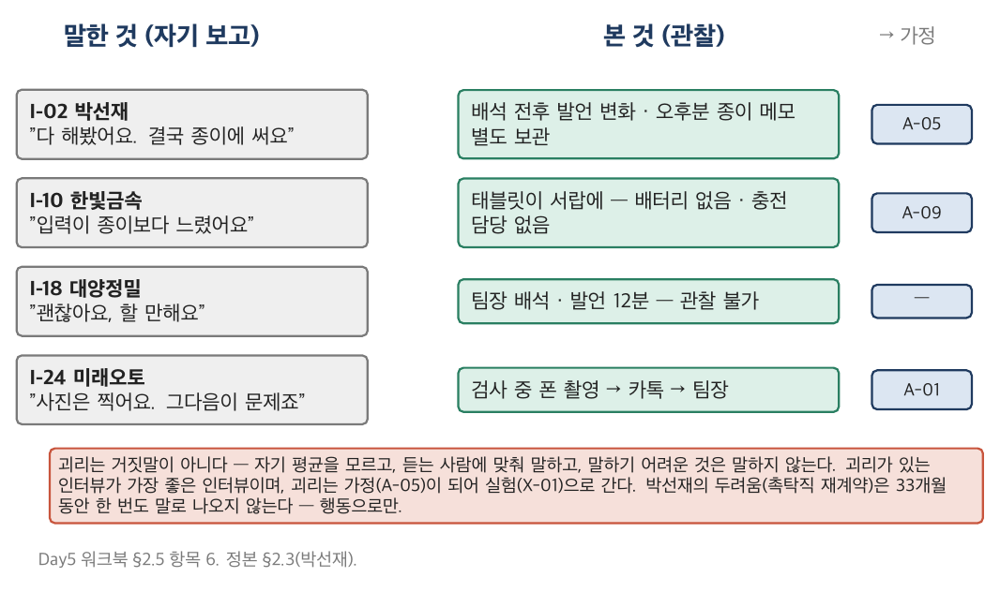

*그림 2-2. 관찰과 자기 보고의 괴리 4건. 왼쪽이 말한 것, 오른쪽이 본 것. I-02 박선재("다 해봤어요" / 배석 전후 발언 변화·오후분 종이 메모), I-10 한빛금속("입력이 느렸다" / 태블릿이 서랍에, 배터리 없음), I-18 대양정밀("괜찮아요" / 배석 12분), I-24 미래오토("사진은 찍어요" / 실제로 검사 중 촬영·카톡). 아래 줄은 각 괴리가 어느 가정(A-05·A-09·—·A-01)으로 갔는지. Day5 워크북 §2.5 항목 6을 재구성.*

### 실무에서 어떻게 틀리는가

괴리를 거짓말로 읽는 것. "검사원이 말을 바꿨다"가 아니라 "관리자가 있을 때와 없을 때 다른 것을 말할 이유가 있다"가 읽는 법이다. 그 이유(고용 구조)가 가정이 된다. 반대 오류는 괴리를 없애는 것 — 스냅샷을 정리하면서 관찰 열을 지우고 인용문만 남긴다. 그러면 27건은 27개의 의견이 된다. 세 번째 오류는 관찰을 못 했을 때 빈칸을 채우는 것이다. 회의실 인터뷰 4건은 "관찰 불가"가 기록이다.

### 표준·문헌에서는

이 절의 원전은 프로덕트 문헌보다 사회과학 방법론에 있다 — 자기 보고 편향(self-report bias), 사회적 바람직성(social desirability), 호손 효과. 프로덕트 문헌에서는 Torres(2021)의 "이야기 기반 인터뷰"가 자기 보고를 사건으로 고정하는 방법이고, Portigal(2013)의 현장 관찰이 관찰 열의 방법이다. PM 트랙에서는 Day1 3.3절의 "공개 입장 / 숨은 동기"가 같은 구조였다 — 온담의 강윤지 지역매니저("이번엔 없어지지 않나요")가 박선재와 같은 자리에 있다.

---

## 2.3 JTBD와 네 가지 힘

### 개념

고객은 제품을 사는 것이 아니라 **어떤 상황에서 어떤 진전을 위해 제품을 고용한다**(Christensen). 이 관점의 실무적 효용은 세 가지다. 첫째, 경쟁 대안이 넓어진다 — 검사기록 AI의 경쟁자는 다른 AI가 아니라 종이 일지와 카톡이다. 둘째, 같은 제품을 다른 역할이 다른 일에 고용한다는 것이 보인다 — 검사원과 팀장의 job이 다르다. 셋째, 왜 안 사는지가 보인다 — 네 가지 힘.

**JTBD 진술문**은 "~한 상황에서, ~하기 위해, ~를 고용한다"의 형식이다. 상황이 먼저다. "검사원이 기록을 빨리 하고 싶어 한다"는 진술문이 아니다 — 상황이 없다. "라인이 돌아가는 동안, 나중에 나에게 책임을 물을 수 없게 기록을 남기기 위해"가 진술문이다.

**네 가지 힘**(Moesta)은 고객이 현 방식에서 새 방식으로 옮겨 가는 것을 미는 힘 둘과 막는 힘 둘이다.

| 힘 | 방향 | 뜻 | 딥게이지에서 |
|---|---|---|---|
| **push** | 미는 | 현 상황의 불만 — "이대로는 안 된다" | "적는 게 일이지 검사가 일이 아니에요", 페널티 1,200만 |
| **pull** | 미는 | 새 해법의 매력 — "저것이면 될 것 같다" | "사진은 찍어요, 그다음이 문제죠", "그거 되면 제일 먼저 씁니다" |
| **anxiety** | 막는 | 새 것에 대한 불안 — "저것이 안 되면?" | "다 해봤어요", 판정이 기록으로 남는 것에 대한 침묵, "도면이 나가면 잘립니다" |
| **habit** | 막는 | 현 방식의 관성 — "지금도 어떻게든 된다" | 종이 일지는 라인 옆에 있고 전기는 퇴근 전 습관 |

정직한 진술문은 막는 힘이 미는 힘보다 길다. 미는 힘만 적은 문서는 팔릴 이유만 적고 안 팔릴 이유를 안 적은 것이다.

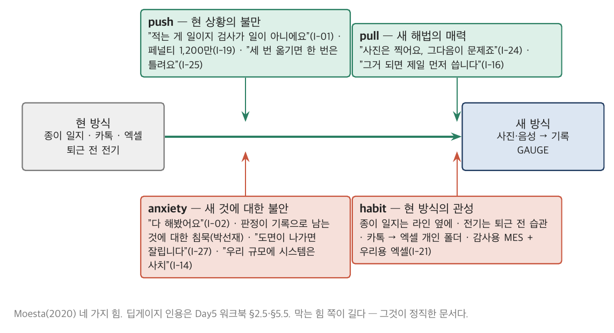

*그림 2-3. 네 가지 힘. 현 방식(종이·카톡·엑셀)에서 새 방식(GAUGE)으로의 이동을 push(현 상황의 불만)와 pull(새 해법의 매력)이 밀고, anxiety(새 것에 대한 불안)와 habit(현 방식의 관성)이 막는다. 딥게이지의 인터뷰 인용을 각 힘에 배치했다 — 막는 힘 쪽이 길다. Moesta(2020)를 바탕으로 재구성.*

### 딥게이지의 사례로 읽기

> ■ **사례 사실** — 검사원·품질팀장의 JTBD 진술문 2개와 네 가지 힘의 인용은 Day5 워크북 §5.5 항목 2 [추가 설정]; 인용의 원 인터뷰(I-01·03·16·19·24·02·27·14·21)는 워크북 §2.5 항목 3.

딥게이지는 진술문을 둘로 나눴다. 검사원 — "라인이 돌아가는 동안, 나중에 나에게 책임을 물을 수 없도록 기록을 남기기 위해, 사진과 한마디로 끝나는 기록을 고용한다." 팀장 — "부적합이 나왔을 때, 1차사에 늦지 않게 근거를 갖춰 통보하기 위해, 검사기록·사진·8D를 한 번에 만드는 것을 고용한다." 같은 기록이 검사원에게는 방패이고 팀장에게는 창이다. 이 둘을 한 문장으로 합치면 ㉒ 항목 4의 상충이 사라지고, Day7에서 팀장은 자동판정을 켜고 검사원은 끄는 상황을 설명할 수 없게 된다.

### 실무에서 어떻게 틀리는가

진술문에 제품 이름을 넣는다("GAUGE를 고용한다" — 상황이 없다). 역할군을 합친다. 막는 힘을 안 적는다. 그리고 JTBD를 페르소나로 착각한다 — 페르소나는 사람의 속성(52세 촉탁직)이고 job은 상황의 속성(라인이 도는 동안)이다. 같은 사람이 다른 상황에서 다른 job을 갖는다.

### 표준·문헌에서는

Christensen 외(*Competing Against Luck*, 2016)가 "진전(progress)"과 "고용"의 어휘를, Moesta(*Demand-Side Sales 101*, 2020)가 네 가지 힘과 도입 타임라인(첫 생각 → 수동 탐색 → 능동 탐색 → 결정 → 소비)을 준다. Ulwick(*Jobs to Be Done*, 2016)은 같은 이름으로 다른 것 — 결과 진술문(outcome statement)의 정량화 — 을 한다. 두 계보의 차이는 5.1절에서.

---

## 2.4 기회 문장 — 해법 명사 금지

### 개념

**기회**(opportunity)는 고객의 진전을 막는 미충족 욕구·아픔·장애를 적은 문장이다(Torres). 기회 문장에는 규칙이 하나다 — **해법 명사가 들어가면 무효**다. "태블릿이 필요하다", "OCR로 읽어야 한다", "앱이 있어야 한다"는 기회가 아니라 해법이다. "검사원이 라인이 도는 동안 적은 값을 하루 31분 동안 다시 적는다"가 기회다.

이 규칙이 중요한 이유는 해법이 섞인 순간 기회가 하나로 좁아지기 때문이다. "태블릿이 필요하다"는 기회에는 해법이 하나(태블릿)뿐이고, "31분 동안 다시 적는다"는 기회에는 해법이 넷(사진 OCR·음성·스캔·태블릿)이며 그중 하나는 이미 실패한 것이다. 기회를 넓게 적어야 첫 해법에 묶이지 않는다.

기회 문장의 형식: **상황 + 진전(하려는 것) + 장애(막는 것)**. 그리고 **빈도**(몇 명 중 몇 명, 역할군별)와 **강도**(얼마나 아픈가, 1~3)를 따로 센다. 한 사람이 강하게 말한 것과 열 사람이 약하게 말한 것은 다른 기회다.

### 딥게이지의 사례로 읽기

> ■ **사례 사실** — 기회 8개(OP-01~08)의 문장·근거 인터뷰 ID·빈도(검/팀/공/대/SQE)·강도와 무효 처리된 문장 3개는 Day5 워크북 §2.5 항목 5 [추가 설정]; 검산 `day5_discovery.py`(OP-01 12건 = 9/2/0/1/0).

OP-01 "검사원이 라인이 도는 동안 적은 값을 하루 31분 동안 다시 적는다(종이 → 엑셀 → 포털)" — 근거 12건, 그중 검사원 9. OP-08 "검사 데이터로 공정을 개선하고 싶지만 데이터가 없다" — 근거 2건, 공장장 1·대표 1, 강도 1. 여덟 문장 중 어느 것에도 태블릿·OCR·앱·AI·시스템이 없다(스크립트가 검사한다). 무효 처리된 문장 세 개 — "사진으로 기록해야 한다", "태블릿이 필요하다", "AI 판정이 필요하다" — 는 OP-01과 OP-05로 다시 쓰였다.

OP-08은 기각 후보다. 공장장과 대표가 "데이터로 공정을 고치고 싶다"고 했지만, 지난주에 그것 때문에 무슨 일이 있었는지 물으면 이야기가 없다. 바람이지 아픔이 아니다. 강도 1은 그 뜻이다.

### 실무에서 어떻게 틀리는가

해법을 기회로 쓴다 — 가장 흔하고 가장 안 보인다. "고객이 대시보드를 원한다"는 문장에 대시보드가 있다. 빈도를 안 센다. 강도와 빈도를 섞어 "가장 많이 나온 것"이 "가장 아픈 것"이라고 믿는다. 그리고 기회를 기능 영역으로 묶는다("OCR 기회", "포털 연동 기회") — 그것은 해법으로 묶은 것이다.

### 표준·문헌에서는

Torres(2021) 5~6장이 기회의 정의와 "해법 명사 금지"의 원전이다(원문은 "opportunities are not solutions"). Ulwick의 결과 진술문("~하는 데 걸리는 시간을 최소화한다")은 같은 취지의 다른 형식이며, 정량화(중요도 × 만족도)까지 간다. PM 트랙에서는 Day2 2.3절 요구사항의 세 층(StRS→SyRS→SRS)이 있었다 — 기회는 StRS보다 한 층 위, "요구 이전의 상황"이다.

---

## 2.5 기회-해법 트리

### 개념

기회-해법 트리(Opportunity Solution Tree, Torres)는 결과 → 기회 → 해법 → 실험을 한 그림에 놓는다. 뿌리는 **제품 결과**(고객 행동의 변화)이고, 가지는 기회(L1 → L2), 잎은 해법 후보, 잎 아래는 실험이다. 규칙은 셋이다. ① 뿌리는 매출이 아니라 고객 행동이다. ② 기회마다 해법을 셋 이상 놓는다 — 첫 해법에 묶이지 않기 위해. ③ 실험 결과가 잎의 순서를 바꾼다.

프로젝트 PM에게 익숙한 WBS와 트리는 모양이 같고 방향이 반대다.

| | WBS (Day2 2.2절) | 기회-해법 트리 |
|---|---|---|
| 뿌리 | 이미 정해진 최종 산출물 | 아직 정하지 않은 고객 행동의 변화 |
| 가지 | 산출물의 분해 — 100% 규칙(빠짐없이) | 기회 — 근거 인터뷰가 있는 것만 |
| 잎 | 작업패키지 — 하나씩 전부 만든다 | 해법 후보 — **셋 이상 놓고 대부분 만들지 않는다** |
| 검증 | 완료 정의(DoD) | 실험 |
| 바뀌는가 | 변경 통제(CCB) | 실험 결과마다 잎의 순서가 바뀐다 |

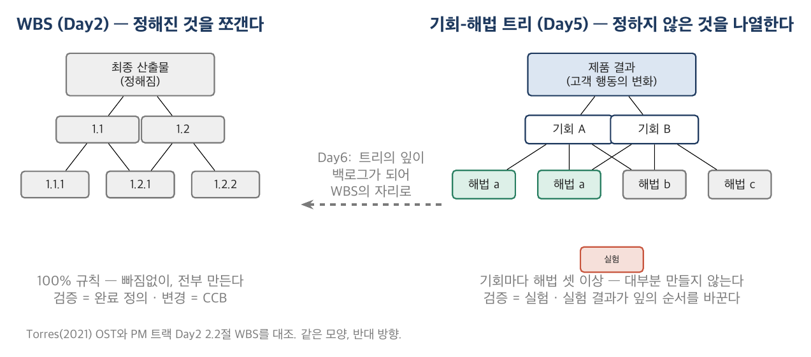

*그림 2-5. WBS와 기회-해법 트리. 왼쪽 WBS는 정해진 산출물을 빠짐없이 아래로 쪼갠다(100% 규칙, 전부 만든다). 오른쪽 트리는 정하지 않은 해법을 기회마다 셋 이상 놓고 실험으로 순서를 정하며 대부분 만들지 않는다. 가운데 화살표는 Day6에서 트리의 잎이 백로그가 되어 WBS의 자리로 넘어가는 지점이다. Torres(2021)와 PM 트랙 Day2 2.2절을 대조.*

트리의 실무적 효용은 Day6와 Day8에 있다. Day6의 백로그 41 man-month는 이 트리의 잎에서 나오고, 절단은 가지를 따라 이루어진다. Day8의 커스터마이징 요구 47건 앞에서 "이 요구는 어느 기회에서 왔는가"를 물을 수 있는 유일한 문서다. 트리에 없는 요구는 누구의 아픔에서 왔는지 아무도 답할 수 없고, 그것이 3분류(제품화·커스텀·거절)의 첫 번째 기준이다.

### 딥게이지의 사례로 읽기

> ■ **사례 사실** — 결과 정의(제품 결과: 기록 시간 47 → 20분 이하 · 통보 3.7일 → 1일)·L1 4개·해법 후보(OP-01 4안 중 1 기각 등)·우선순위 5·기각 4건은 Day5 워크북 §3.5 [추가 설정]; 실험 결과(X-01 불확정·X-02 실패·X-03 성공)는 워크북 §4.5.

딥게이지 트리의 뿌리는 "검사원이 라인이 도는 동안 기록을 끝내고, 부적합이 당일 1차사에 근거와 함께 통보된다"이다. 비즈니스 결과(유료 3·5개사)는 옆에 둔다. L1은 넷 — 기록 시간 / 부적합 대응의 속도와 근거 / 판정의 일관성 / 1차사의 요구 — 이고 OP-08은 기각 가지로 회색이다. OP-01 아래 해법 넷 중 하나(태블릿 직접 입력)는 "다 해봤어요"로 기각되어 있다. 해법 후보 표에 서비스 해법(사람이 뒤에서 패키징)이 들어 있는 것은 일부러다 — X-01이 정확히 그 방식이었고, 확장은 안 되지만 검증은 된다.

### 실무에서 어떻게 틀리는가

뿌리에 매출을 둔다 — 그러면 검사원의 시간(지불자가 아니다)이 내려간다. 기회마다 해법이 하나(이미 만들기로 한 것). 트리를 한 번 그리고 끝낸다 — 트리는 실험마다 다시 그리는 문서다. 그리고 트리를 로드맵으로 착각한다 — 트리는 만들지 않을 것을 나열한 문서이고 로드맵은 만들 것을 나열한 문서다(Day7 ㉟).

### 표준·문헌에서는

Torres(2021) 5~7장. Cagan(2018)의 4 리스크가 잎 아래 가정의 유형(3.1절)이다. Singer(*Shape Up*, 2019)의 appetite는 잎을 얼마나 만들 것인가의 규율이며 Day6의 전제다.

---

## 2.6 딥게이지의 27건 — 8개 기회와 하나의 기각

> ■ **사례 사실** — 27건 원자료·역할군 종합·기회 8·괴리 4는 Day5 워크북 §2.5; 트리(L1·해법·우선순위·기각)는 §3.5; 빈도 검산 `day5_discovery.py`. 정본에서 오는 고정값은 §3.1(11/8/4/3/1)과 G-33~36뿐이다.

27건에서 트리까지의 경로를 한 번에 놓는다.

**역할군별로 다른 것이 보였다.** 검사원 11명 중 9명이 "라인이 도는 동안은 못 적는다"고 했고, 3명은 이미 사진을 찍고 있었다(폰·카톡). 팀장 8명 중 4명이 통보 지연의 원인을 판정이 아니라 자료 수집이라고 했다. 공장장 4명 중 2명이 자동화보다 판정 일관성을 먼저 말했다. 대표 3명 중 2명이 클레임 때 "누가 봤냐"를 못 댄 경험을 말했다. SQE 1명이 도면 클라우드 금지와 340개사 가시성을 한 입으로 말했다. 다섯 역할군이 원하는 것이 다르고, 그 차이가 ㉒ 항목 4의 상충 열이다.

**기회 8개가 나왔고 하나는 기각됐다.** 빈도 순서로 OP-01(12) > OP-02·04·05(5) > OP-07(4) > OP-03·06(3) > OP-08(2). 강도 순서는 다르다 — OP-01·02·03이 3, OP-04~07이 2, OP-08이 1. 빈도와 강도를 곱하지 않는다. OP-08은 강도 1(바람)로 기각 후보, OP-06(기준서 버전)은 공장 내부 문제로 기각, OP-07의 온프렘은 Day6 Won't로 보류.

**실험이 잎의 순서를 바꿨다.** 실험 전 트리에서 판정 초안(OP-05(a), AI 판정)은 이 회사의 존재 이유였고 1순위였다. X-02가 88.7%로 실패하고 X-01에서 5명 중 2명이 별도 종이 메모를 남기자, 실현(조도)과 수용(A-05) 두 축이 동시에 L이 됐다. 판정 초안은 4순위로 내려갔고 사진·음성 → 기록 자동 생성이 1순위가 됐다. 이것이 트리를 "한 번 그리는 문서"가 아니라고 말하는 이유다.

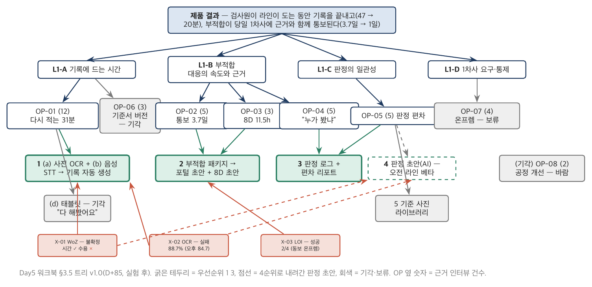

*그림 2-6. 딥게이지 기회-해법 트리 v1.0(D+85, 실험 후). 뿌리는 제품 결과, L1 넷(기록 시간 / 부적합 대응 / 판정 일관성 / 1차사 요구), OP 옆의 숫자는 근거 인터뷰 건수. 해법 잎의 굵은 테두리가 우선순위 1~3(사진·음성 → 기록 / 부적합 패키지·8D 초안 / 판정 로그), 점선이 4순위로 내려간 판정 초안(X-02 88.7%·A-05 미제거), 회색이 기각(OP-08·OP-06·태블릿). 잎 아래 X-01·02·03이 실험. Day5 워크북 §3.5를 그림으로.*

**공짜 해법이 가장 무거운 책임을 만든다.** OP-04(판정 근거 추적)의 해법 (a) 판정 로그는 1·2순위의 부산물이라 거의 공짜이고, 대표와 SQE가 원하는 것이며, 3순위로 트리에 남았다. D+85에는 알 수 없는 것이 하나 있다 — 그 로그가 Day7 사고 때 "GAUGE 로그를 근거로" 고객이 딥게이지를 공격하는 바로 그 로그라는 것. 트리에 남기는 것이 옳고, 그 책임을 미리 아는 것도 옳다.

---

## 제2장 핵심 정리

> **한 줄씩 — 수업 직전 5분 복습용**
> 1. 인터뷰는 요구사항을 받는 일이 아니라 요구사항이 존재하는지 확인하는 일이다 — "쓰시겠어요?"는 무효, "지난번에 무슨 일이 있었나요?"만.
> 2. 말한 것과 본 것을 다른 열에 적는다 — 괴리가 있는 인터뷰가 가장 좋은 인터뷰이고, 괴리는 가정이 된다.
> 3. 고객은 상황 속에서 진전을 위해 제품을 고용한다 — 진술문은 상황이 먼저, 역할이 다르면 진술문도 다르다.
> 4. 막는 힘(anxiety·habit)이 미는 힘(push·pull)보다 길어야 정직한 문서다.
> 5. 기회 문장에 해법 명사가 있으면 무효 — 기회를 넓게 적어야 첫 해법에 묶이지 않는다. 빈도와 강도는 따로 센다.
> 6. 트리는 WBS와 모양이 같고 방향이 반대다 — 정하지 않은 해법을 셋 이상 놓고 대부분 만들지 않는다.
> 7. 실험이 잎의 순서를 바꾼다 — 딥게이지의 판정 초안이 1순위에서 4순위로 내려갔다.
>
> 아래는 같은 내용의 자세한 판이다.

1. 인터뷰의 문법은 Fitzpatrick의 세 규칙 — 상대의 삶, 과거의 구체적 사실, 듣기. "최근 사례"가 핵심 단어이며 27개의 사건이 패턴을 만든다. 역할군은 의사결정 사슬(사용자·책임자·지불자·요구자)을 따르고, 리크루팅 경로와 편향을 기록한다.
2. 자기 보고와 행동은 다르다 — 거짓말이 아니라 구조(평균을 모름, 듣는 사람, 말하기 어려운 것). 관찰 열에는 본 것만, 관찰 불가는 "불가"로. 박선재의 괴리(D+12)가 A-05 → X-01 → 자동판정 OFF → Day7 사고의 선이다.
3. JTBD 진술문 = 상황 + 진전 + 고용. 검사원(방패)과 팀장(창)의 job이 다르다. 네 가지 힘 — push·pull이 밀고 anxiety·habit이 막는다. 페르소나(사람의 속성)와 job(상황의 속성)은 다르다.
4. 기회 = 상황 + 진전 + 장애, 해법 명사 금지. 빈도(분모 포함)와 강도(1~3)를 따로. OP-08(바람)은 기각 후보.
5. 트리의 규칙 셋 — 뿌리는 고객 행동, 기회마다 해법 셋 이상, 실험이 순서를 바꾼다. Day6 백로그의 유일한 상위 문서이자 Day8 47건 3분류의 첫 기준.
6. 딥게이지의 경로 — 역할군 다섯의 상충 → 기회 8·기각 1 → 실험 3 → 판정 초안 1순위 → 4순위. 판정 로그(3순위)는 공짜 해법이자 Day7의 책임.

## 생각해 볼 질문

1. 여러분이 최근에 한 고객(또는 현업) 미팅에서 "~하면 쓰시겠어요?"에 해당하는 질문을 몇 번 했는가? 그 답을 근거로 결정한 것이 있는가?
2. 박선재의 괴리를 D+12에 적지 않았다면 Day6 ㉗의 HITL 설계에서 무엇이 달라지는가?
3. 여러분 회사 제품의 경쟁 대안을 JTBD로 다시 적으면 무엇이 되는가 — 다른 제품인가, 엑셀인가, "아무것도 안 함"인가?
4. 여러분의 현재 로드맵 상위 10개를 기회 문장으로 거꾸로 적어 보라. 해법 명사 없이 적히지 않는 항목은 몇 개인가?

## 워크북 연결

이 장은 Day5 워크북 **㉒ 고객 인터뷰 스냅샷 팩**(항목 1 계획·2 가이드·3 카드 — 2.1절 / 항목 4 역할군 종합 — 2.3절 / 항목 5 기회 문장 — 2.4절 / 항목 6 괴리 — 2.2절 / 항목 7 다음 계획 — 2.1절)과 **㉓ 기회-해법 트리**(항목 1 결과·2 기회 계층·3 해법 3안·4 우선순위 — 2.5절 / 항목 6 그림·7 기각 — 2.6절 / 항목 5 가정 후보 — 3.1절)에 대응한다. 수업 중 과제(★)는 ㉒ 항목 5·6(45분)과 ㉓ 항목 2·3·4(30분)다. 기본 과제(㉒ — 김도윤의 입장 변화 / ㉓ — X-02가 성공했다면)와 심화 과제(자기 회사 VOC 20건을 기회 문장으로 / 로드맵 10개를 트리에 거꾸로)는 §2.7·§3.7.

---

# 제3장 가정과 실험

## 3.1 가정의 네 유형 — 가치·사용성·실현·사업성

### 개념

트리의 잎(해법)이 성립하려면 참이어야 하는 것들이 있다. 그것을 꺼내 적은 것이 **가정**이고, 가정에는 네 유형이 있다(Cagan의 4 리스크).

| 유형 | 질문 | 딥게이지의 예 | 누가 잘 보는가 |
|---|---|---|---|
| **가치(Value)** | 고객이 이것을 원하는가 — 진전이 되는가 | A-01 검사원이 사진·음성 입력을 종이보다 낫다고 느낀다 | 발견을 한 사람(CPO) |
| **사용성(Usability)** | 고객이 이것을 쓸 수 있는가 — 흐름 안에서 | A-05 검사원이 판정 초안을 두려워하지 않는다 · A-11 승인 시간이 늘지 않는다 | 현장을 본 사람 |
| **실현(Feasibility)** | 우리가 이것을 만들 수 있는가 — 기간·기술 안에서 | A-02 현장 조도에서 OCR 90% · A-08 마스터 매핑 2주 · A-09 와이파이·단말 | CTO |
| **사업성(Viability)** | 이것이 사업이 되는가 — 지불·법·채널 | A-03 팀장이 돈을 낸다 · A-04 1차사가 접수한다 · A-06 라인 과금 · A-07 클라우드 과반 · A-12 6개월 유료 5 | CEO |

가정은 "~라면 ~일 것이다" 또는 "~다"의 **검증 가능한 명제**다. "고객이 원한다"는 가정이 아니다 — 검증할 방법이 없다. "검사원이 사진·음성 입력을 종이보다 빠르고 편하다고 느낀다"는 가정이다 — 2주 WoZ로 검증된다. 리스크 등록부(PM 트랙 ⑤·⑩)와의 차이는 여기다. 리스크는 "일어날 수 있는 나쁜 일"이고 대응(회피·전가·완화·수용)을 적는다. 가정은 "우리가 참이라고 믿는 것"이고 실험을 적는다.

### 딥게이지의 사례로 읽기

> ■ **사례 사실** — 가정 12(A-01~12)의 문장·유형·현재 증거·중요도·증거 부족은 Day5 워크북 §4.5 항목 1 [추가 설정]; A-05의 원천(박선재)은 정본 §2.3, A-07의 원천(김도윤)은 §2.4.

딥게이지의 12개 가정 중 기술자의 편향을 그대로 두면 실현 가정(A-02·08·09)만 남는다. 가치(A-01)·사용성(A-05·11)·사업성(A-03·04·06·07·10·12)이 아홉이고, 그중 가장 위험한 것이 사용성 A-05였다. CTO가 보는 가정과 CEO가 보는 가정이 다르다는 것이 표의 마지막 열이며, 세 사람이 같이 표를 채워야 하는 이유다.

### 실무에서 어떻게 틀리는가

실현 가정만 적는다. 가정을 리스크로 쓴다("OCR이 실패할 리스크"). 검증 불가능한 문장. 그리고 가정을 적은 뒤 검증하지 않고 "알고 있는 것"으로 승격시킨다 — 그것이 6개월 뒤 활성률 41%의 구조다.

### 표준·문헌에서는

Cagan(2018) Part IV. Torres(2021) 9장은 네 유형을 이야기 지도(story map) 위에 놓아 꺼내는 절차를 준다. PM 트랙 Day1 3.5절의 프리모템 — "실패했다, 왜" — 은 가정을 꺼내는 다른 문법이며, 그 답을 "~라면 ~일 것이다"로 바꾸면 가정 목록이 된다.

---

## 3.2 가정 맵 — 중요도 × 증거 부족

### 개념

가정 열두 개를 다 검증할 수 없다. 90일이고 현금 1.6억이다. 그래서 두 축으로 배치한다 — **중요도**(틀리면 얼마나 잃는가)와 **증거 부족**(지금 얼마나 모르는가). 오른쪽 위(중요하고 모른다)가 먼저다. 왼쪽 아래(안 중요하고 안다)는 지금 손대지 않는다.

배치의 규칙은 엄격함이다. 열두 개 중 여덟이 오른쪽 위에 있으면 지도가 아니다. 중요도는 "틀리면 제품이 없어지는가 / 세그먼트가 바뀌는가 / 한 기능이 빠지는가"로 세 단계를 나누고, 증거 부족은 "현장 데이터 있음 / 인터뷰만 / 없음"으로 나눈다.

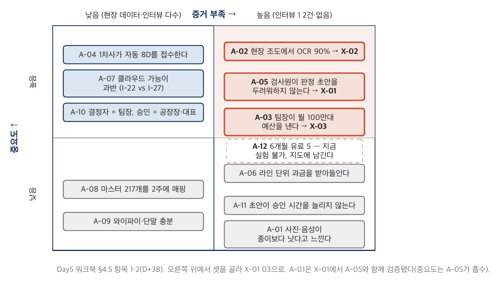

*그림 3-2. 딥게이지 가정 맵(D+38). 가로축 증거 부족, 세로축 중요도. 오른쪽 위에 A-02(OCR 90%)·A-05(검사원 수용)·A-03(지불 의사)·A-12(6개월 유료 5)가 있고, 그중 셋이 실험 X-01~03으로 갔다(굵은 테두리). A-12는 지금 실험할 수 없어 지도에 남기고 순서에서 뺐다(점선). 왼쪽 아래 A-08·A-09는 지금 손대지 않는다. Day5 워크북 §4.5 항목 2를 그림으로.*

제거 우선순위는 중요도만으로 정하지 않는다. "틀리면 가장 많이 잃는 것"과 "가장 싸게 검증되는 것"의 균형이다. A-02(OCR)는 제품의 절반이 걸려 있고 클라우드 API 42만 원·2주로 검증된다 — 1순위. A-05(수용)는 인터뷰로 검증되지 않고(자기 보고 ≠ 행동) 현장에서 2주를 봐야 한다 — 2순위. A-03(지불)은 앞 둘의 결과를 들고 가야 답이 나온다 — 3순위.

### 딥게이지의 사례로 읽기

> ■ **사례 사실** — 2×2 배치(오른쪽 위 A-02·05·03·12), 제거 순서 A-02 → A-05 → A-03과 이유, A-12 제외 처리는 Day5 워크북 §4.5 항목 2·3 [추가 설정].

A-12(6개월 안에 유료 5개사 — TIPS 조건)는 오른쪽 위에 있지만 순서에서 뺐다. 지금 실험할 수 없는 가정이기 때문이다 — 다른 셋의 결과가 곧 A-12의 증거다. 지도에서 지우면 TIPS 조건이 사라지고, 순서에 넣으면 실험이 프로젝트가 된다. 남기되 빼는 것이 답이다.

### 실무에서 어떻게 틀리는가

전부 H/H. 가장 쉬운 것부터(왼쪽 아래를 검증하며 "실험했다"). 순서에 이유가 없다. 그리고 지도를 한 번 그리고 끝낸다 — 실험마다 증거 부족 축이 움직인다.

### 표준·문헌에서는

Torres(2021) 10장 assumption mapping. 유사한 2×2는 여러 곳에 있다(Bland & Osterwalder, *Testing Business Ideas*, 2019). 축의 이름은 다르지만 뜻은 같다 — 중요하고 모르는 것부터.

---

## 3.3 실험의 종류와 증거의 강도

### 개념

실험은 가정을 검증하는 행위이고, 종류마다 **증거의 강도**와 **비용**이 다르다. 낮은 것부터 놓으면 인터뷰 < 랜딩 페이지·설문 < 위저드오브오즈(사람이 뒤에서) < 프로토타입 < 유료 파일럿 < 실제 사용 데이터다. 왼쪽은 싸고 약하며 오른쪽은 비싸고 강하다. 가정의 중요도에 맞는 강도를 고른다 — A-05(수용)를 인터뷰로 검증하면 자기 보고를 또 듣는 것이고, 유료 파일럿으로 검증하면 6개월이 걸린다. 위저드오브오즈(2주)가 그 사이에 있다.

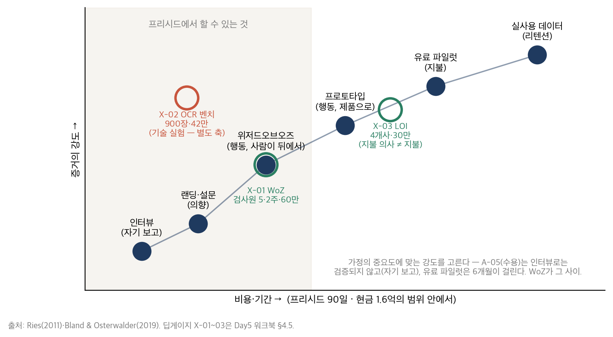

*그림 3-3. 실험의 종류. 가로축 비용·기간, 세로축 증거의 강도. 인터뷰(자기 보고) → 랜딩·설문(의향) → 위저드오브오즈(행동, 사람이 뒤에서) → 프로토타입(행동, 제품으로) → 유료 파일럿(지불) → 실사용 데이터(리텐션). 딥게이지의 X-02(OCR 벤치)는 기술 실험으로 별도 축, X-01은 WoZ, X-03은 LOI — 유료 파일럿의 앞 단계(지불 의사이지 지불이 아니다). Ries(2011)·Bland & Osterwalder(2019)를 바탕으로 재구성.*

**위저드오브오즈**는 프리시드의 도구다. 제품이 없어도 제품이 있는 것처럼 고객이 행동하게 하고, 뒤에서 사람이 그 일을 한다. 검사원은 사진과 음성만 남기고 기록·판정 초안은 이수민과 윤하경이 30분 안에 회신한다. 검사원은 자동으로 안다. 이 방식으로 행동(기록 시간·재촬영·별도 메모)을 잰다 — 자기 보고가 아니다. 확장은 안 되지만 검증은 된다.

**LOI**(구매 의향서)는 지불 의사의 증거이지 지불이 아니다. 유료 파일럿의 앞 단계다. X-03의 사전등록 문장이 "LOI는 계약이 아니다 — 성공은 지불 의사의 증거이지 매출이 아니다"인 이유다.

### 딥게이지의 사례로 읽기

> ■ **사례 사실** — X-01 WoZ(세영정공·태산정밀 각 1라인, 검사원 5, 2주, 1,120건, 비용 60만) · X-02 OCR 벤치(300장 × 3조건 = 900장, API 42만) · X-03 LOI(4개사, 30만)의 설계는 Day5 워크북 §4.5 항목 4 [추가 설정]; 파일럿 후보 4·LOI 2는 정본 §3.1.

세 실험의 총 비용은 인건비를 빼면 132만 원이다. 90일 동안 현금 7,400만이 나갔고 그중 실험 직접비는 2%다. 나머지는 사람 값이고, 그 사람 값이 실험의 진짜 비용이다 — 이수민과 윤하경이 2주 동안 뒤에서 기록을 썼다.

### 실무에서 어떻게 틀리는가

가정의 중요도와 무관하게 익숙한 실험만 한다 — 기술 팀은 벤치만, 영업 팀은 인터뷰만. 프로토타입을 먼저 만든다(제품을 만들고 나서 검증한다 — 그것은 실험이 아니라 출시다). 설문으로 행동을 재려 한다. LOI를 매출로 센다(Day6 ARR 오염의 첫 씨앗).

### 표준·문헌에서는

Ries(2011)의 MVP는 "최소 노력·최대 학습의 실험"이며 위저드오브오즈는 그 대표 사례(Zappos·Food on the Table)다. Bland & Osterwalder(*Testing Business Ideas*, 2019)는 44종의 실험을 강도·비용으로 분류한다. Kohavi 외(2020)는 오른쪽 끝(온라인 통제 실험)의 통계 규율이며 Day6 ㉙에서 다룬다.

---

## 3.4 실험 카드와 사전등록

### 개념

실험 카드는 한 장이다 — 가설(A-ID)·방법·대상과 표본·지표·**성공 기준(숫자)**·기간·비용·**사전등록 문장**·결과·판정·다음 행동. 이 중 두 칸이 카드의 존재 이유다. 성공 기준은 실험 **전에** 숫자로 적고, 사전등록 문장은 "결과를 본 뒤 기준을 바꾸지 않는다"를 서명과 함께 적는다. 이 두 칸이 없으면 모든 실험이 성공한다 — 결과를 본 뒤 기준을 결과에 맞추기 때문이다.

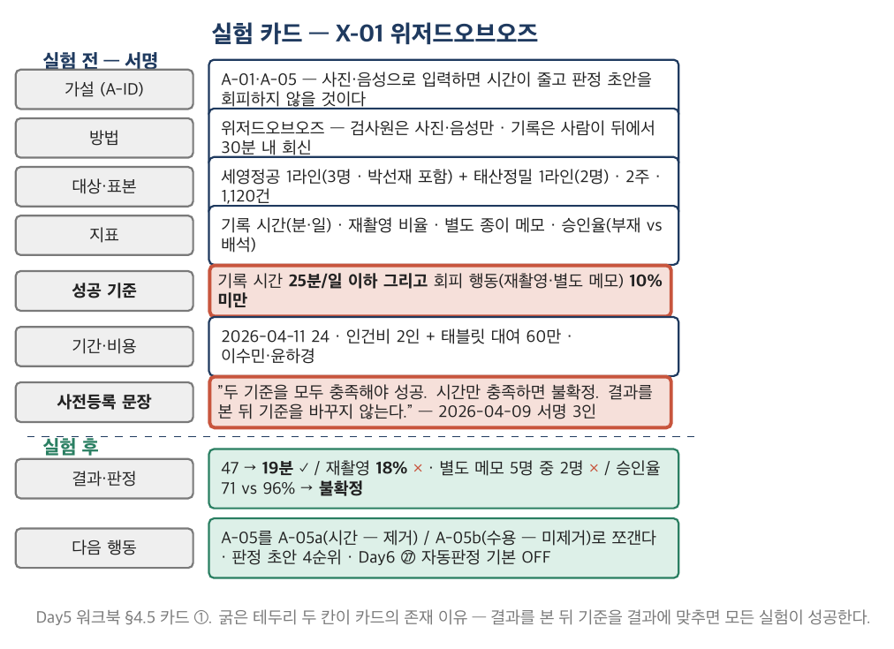

*그림 3-4. 실험 카드의 구조. 위쪽(가설·방법·표본·지표·성공 기준·기간·비용·사전등록 문장)은 실험 전에 채우고 서명한다. 아래쪽(결과·판정·다음 행동)은 빈칸으로 시작해 결과가 나온 뒤 채운다. 굵은 테두리가 성공 기준과 사전등록 문장 — 이 두 칸이 카드의 존재 이유다. X-01의 성공 기준 "25분 이하 그리고 회피 10% 미만"처럼 기준이 둘이면 "그리고/또는"을 명시한다.*

성공 기준이 둘 이상이면 "그리고"인지 "또는"인지를 적는다. X-01의 기준은 "기록 시간 25분 이하 **그리고** 회피 행동 10% 미만"이었다. 시간만 충족하면 불확정이라고 미리 적었다. 이 "그리고" 하나가 X-01을 성공이 아니라 불확정으로 만들었고, 그래서 A-05가 살아남았다.

### 딥게이지의 사례로 읽기

> ■ **사례 사실** — 카드 ①②③의 사전등록 문장과 성공 기준(X-01 25분 & 10% / X-02 평균 90% / X-03 2건 이상)은 Day5 워크북 §4.5 항목 4 [추가 설정]; 서명일 2026-04-09(D+38).

X-02의 사전등록 문장은 "평균 90 미만이면 실패. 조건별 편차가 5%p 이상이면 조도를 독립 변수로 등재한다"이다. 두 번째 문장이 없었다면 88.7%는 "거의 됐다"로 읽혔을 것이다. 있었기 때문에 8.4%p의 편차가 조도라는 변수가 됐고, I-11의 "오후엔 잘 안 보여요"가 데이터가 됐다.

### 실무에서 어떻게 틀리는가

성공 기준이 "개선되면". 결과를 본 뒤 기준을 고친다(사후 합리화). 표본이 1명·1건. 기간·비용이 없어 실험이 프로젝트가 된다(6개월짜리 "PoC"). 사전등록 문장을 안 쓴다 — 쓰지 않으면 나중에 누가 무엇에 서명했는지 없다.

### 표준·문헌에서는

사전등록(pre-registration)은 심리학·의학의 재현성 위기(2010년대)에서 온 규율이며, Kohavi 외(2020)가 온라인 실험에 적용했다(OEC·최소 표본·peeking 금지). 프리시드에서는 통계가 아니라 **문장** — 결과를 보기 전에 기준을 서명하는 것 — 이 사전등록이다. Ries(2011)의 혁신 회계(innovation accounting)가 같은 취지의 회계 문법이다.

---

## 3.5 결과 판정 — 불확정을 성공으로 읽지 않는다

### 개념

실험 결과는 셋 중 하나다 — 성공(사전등록 기준 전부 충족), 실패(주 기준 미충족), **불확정**(기준 일부만 충족 / 표본·조건이 사전등록과 다름). 세 판정 각각의 다음 행동을 실험 **전에** 적는다.

| 판정 | 기준 | 다음 행동 |
|---|---|---|
| 성공 | 전부 충족 | 가정 제거 표시, 해법 우선순위 유지·상향 |
| 실패 | 주 기준 미충족 | 가정을 반증으로 표시. 조건을 바꾼 재실험 또는 해법 강등 — 포기는 세 번째 선택지 |
| **불확정** | 일부만 충족 | **성공으로 읽지 않는다.** 가정을 쪼개서 충족된 부분만 제거 |

불확정이 가장 흔하고 가장 위험하다. 기록 시간은 줄었는데 회피 행동이 남았다 — 성공인가? 성공으로 읽으면 Day6에서 자동판정을 기본 ON으로 설계하고, Day7에 채택률 22%를 만난다. 불확정으로 읽으면 가정을 쪼갠다 — A-05a "시간이 준다"(제거됨) / A-05b "판정 초안을 수용한다"(미제거, 반증 우세). 그러면 Day6 ㉗에 "자동판정 기본 OFF"와 "검사원 책임 한계 문구"가 들어간다.

실패도 판정이다. 88.7%는 90에 가깝지만 실패다. "거의 됐다"는 판정이 아니다. 대신 실패의 다음 행동은 포기가 아니라 조건을 바꾼 재실험이다 — 오전 조건(93.1%)에서만 베타, 오후 조도 보정은 백로그로.

### 딥게이지의 사례로 읽기

> ■ **사례 사실** — X-01 불확정(47 → 19분 ✓ / 재촬영 18%·별도 메모 2명 ✗ / 승인율 부재 71% vs 배석 96%), X-02 실패(88.7%, 편차 8.4%p), X-03 성공(2/4)과 각각의 다음 행동은 Day5 워크북 §4.5 항목 4·5 [추가 설정]. D+300 eval v1 OCR 91.4%는 정본 V-01.

세 실험이 세 판정을 하나씩 냈다. 성공 하나(X-03, LOI 2건 — 그러나 "조건부 제거"), 실패 하나(X-02), 불확정 하나(X-01). 셋을 전부 "대체로 성공"으로 뭉뚱그렸다면 Day6의 범위 결정은 판정 초안을 1순위에 두고 자동판정을 ON으로 설계했을 것이다. 정본에서 D+300 eval v1의 OCR은 91.4%다 — 6개월 안에 90을 넘는다. 그러나 D+90에는 그것을 알 수 없고, 알 수 없을 때 실패를 실패로 적는 것이 판정이다.

### 실무에서 어떻게 틀리는가

불확정을 성공으로. 실패를 "거의 성공"으로. 판정 규칙을 실험 후에 정한다. 실패의 다음 행동이 포기뿐이다. 그리고 성공을 "제거"가 아니라 "확신"으로 승격한다 — LOI 2건은 "팀장이 돈을 낸다"의 증거이지 "SAM의 절반이 돈을 낸다"의 증거가 아니다(2/4, 그중 하나는 온프렘 조건).

### 표준·문헌에서는

Ries(2011)의 "pivot or persevere"는 판정의 결과이지 판정 자체가 아니다 — 판정 규칙이 먼저다. Kohavi 외(2020)는 "실험의 대부분은 실패한다(Microsoft 2/3, Bing 80~90%)"고 보고하며, 실패를 실패로 적는 문화가 실험의 전제라고 쓴다. Kahneman의 확증 편향은 "결과를 본 뒤 기준을 고친다"의 심리학이다.

---

## 3.6 딥게이지의 실험 3 — 시간은 이겼고 수용은 졌다

> ■ **사례 사실** — 세 실험의 설계·결과·판정·다음 행동은 Day5 워크북 §4.5; X-02의 조도 3조건 값(93.1 / 84.7 / 88.2)은 그 카드 ②; 2027-06 박선재의 조도 경고와 2027-08 사고는 정본 §2.3·§4.6.

**X-01 위저드오브오즈 — 불확정.** 검사원 5명, 2주, 1,120건. 기록 시간 47 → 19분(전기 31 → 4). 시간 기준(25분 이하)은 넉넉히 충족했다. 그러나 같은 부위 재촬영이 18%(기준 10% 미만)였고, 5명 중 2명(박선재 포함)이 별도 종이 메모를 남겼으며, 판정 초안 승인율이 관리자 부재 71% vs 배석 96%였다. 시간은 이겼고 수용은 졌다. 가정을 쪼갠다 — A-05a 시간(제거), A-05b 수용(미제거, 반증 우세). 다음 행동: 판정 초안은 트리 4순위, Day6 ㉗에 자동판정 기본 OFF와 검사원 책임 한계 문구.

**X-02 OCR 벤치 — 실패.** 도면·실물 300장 × 조도 3조건 = 900장, 검사항목 2,700개. 오전 93.1% / 오후 3시 이후 84.7% / 야간 조명 88.2% → 평균 88.7%. 기준 90 미달. 조건별 편차 8.4%p → 조도를 독립 변수로 등재. 다음 행동: 판정 초안은 오전 라인 한정 베타, 오후 조도 보정(촬영 가이드·플래시·재학습)은 Day6 백로그.

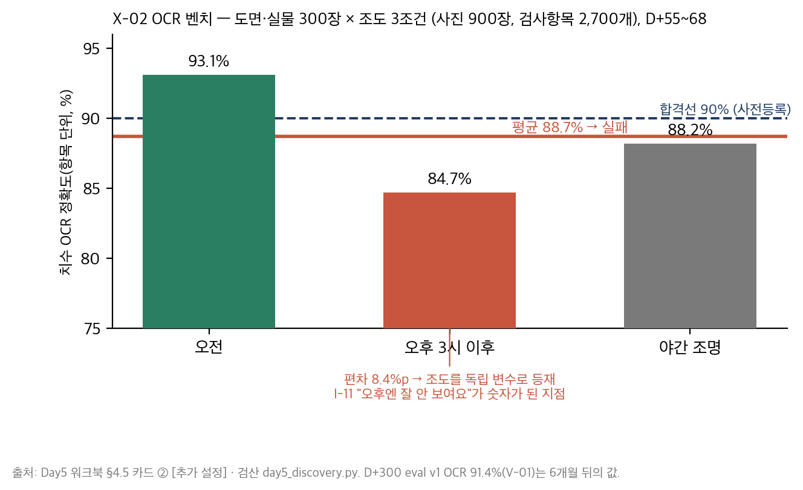

*그림 3-6. X-02 OCR 벤치 결과. 오전 93.1%, 오후 3시 이후 84.7%, 야간 조명 88.2%, 평균 88.7%(굵은 선), 합격선 90%(점선). 오전만 합격선을 넘고 오후가 8.4%p 낮다 — I-11 "오후엔 잘 안 보여요"가 숫자가 된 지점이며, 2027-06 박선재의 조도 경고와 2027-08 사고(정본 §4.6)로 이어지는 선의 첫 점이다. Day5 워크북 §4.5 카드 ②.*

**X-03 유료 파일럿 제안 — 성공.** 4개사 의사결정자 미팅. 세영정공(3라인, 2026-09 시작, 구축비 별도)·태산정밀(3라인, 검사항목 62개 전용 요구) LOI 서명. 동보프레스 "온프렘이면"(H사 계열 — A-07 반증 1건). 우진테크 "X-01 결과 보고 후". 기준 2건 이상 충족. 다음 행동: A-03 조건부 제거(2/4), A-07은 분모를 더 물어야 함(㉕ 세그먼트), 태산정밀의 62개 요구는 Day6 첫 커스텀 전례로 기록.

**셋을 합치면.** 검사원은 사진·음성으로 시간을 줄이는 것을 받아들이고 판정을 대신하는 것은 받아들이지 않는다. OCR은 오전에는 되고 오후에는 안 된다. 팀장은 LOI를 쓰되 온프렘·커스텀을 함께 가져온다. 이 세 문장이 Day6 ㉖ 범위 절단의 전제이고, ㉗ HITL 설계의 전제이며, ㉕ "판정을 대신하지 않는다"의 근거다. 그리고 X-02의 오후 84.7%는 15개월 뒤 세영정공 라인에서 크랙을 놓치는 그 조도다 — 실패를 실패로 적었기 때문에 그 점이 남는다.

---

## 제3장 핵심 정리

> **한 줄씩 — 수업 직전 5분 복습용**
> 1. 가정은 "우리가 참이라고 믿는 것"이고 네 유형(가치·사용성·실현·사업성)이 있다 — 기술자는 실현만 적는다.
> 2. 가정 맵은 중요도 × 증거 부족 — 오른쪽 위(중요하고 모른다)부터, 그러나 지금 실험할 수 없는 것은 남기되 순서에서 뺀다.
> 3. 실험의 종류마다 증거의 강도와 비용이 다르다 — 인터뷰 < 랜딩 < 위저드오브오즈 < 프로토타입 < 유료 파일럿 < 실사용.
> 4. 실험 카드의 존재 이유는 두 칸 — 실험 전의 성공 기준(숫자)과 사전등록 문장(결과를 본 뒤 기준을 바꾸지 않는다).
> 5. 판정은 셋 — 성공·실패·불확정 — 이고 불확정을 성공으로 읽지 않는다; 가정을 쪼갠다.
> 6. 딥게이지 — 시간은 이겼고(47 → 19) 수용은 졌으며(재촬영 18%) OCR은 오전만 넘었다(93.1 vs 84.7).
>
> 아래는 같은 내용의 자세한 판이다.

1. 가정 = 검증 가능한 명제. 가치(원하는가)·사용성(쓸 수 있는가)·실현(만들 수 있는가)·사업성(사업이 되는가). 리스크 등록부(대응)와 가정 맵(실험)은 문법이 다르다. 세 사람이 같이 채운다 — 보는 가정이 다르다.
2. 2×2 배치는 엄격하게(칸당 3개 이하). 제거 순서 = 틀리면 가장 많이 잃는 것 × 가장 싸게 검증되는 것. 딥게이지 A-02 → A-05 → A-03, A-12는 지도에 남기고 순서에서 제외.
3. 증거의 사다리. 위저드오브오즈는 프리시드의 도구 — 제품 없이 행동을 잰다. LOI는 지불 의사이지 지불이 아니다.
4. 카드 한 장 — 가설·방법·표본·지표·성공 기준·기간·비용·사전등록·결과·판정·다음 행동. 기준이 둘이면 "그리고/또는"을 적는다. X-01의 "그리고"가 A-05를 살렸고, X-02의 "편차 5%p면 변수 등재"가 조도를 살렸다.
5. 불확정 → 가정을 쪼갠다(A-05a/b). 실패 → 조건을 바꾼 재실험(오전 베타), 포기는 세 번째. 성공 → 제거이지 확신이 아니다(LOI 2/4).
6. 딥게이지 세 실험이 세 판정을 하나씩 — 성공·실패·불확정 — 냈고, 그 세 문장이 Day6 범위·HITL·Day5 세그먼트의 전제다. X-02의 오후 84.7%가 Day7 사고의 첫 점.

## 생각해 볼 질문

1. 여러분 회사의 최근 "PoC"에 사전등록된 성공 기준이 있었는가? 결과가 나온 뒤 판정은 셋 중 무엇이었는가 — 그리고 그 판정은 결과 전에 정해진 것인가?
2. A-05를 쪼개지 않고 X-01을 성공으로 읽었다면 Day6 ㉗의 어느 칸이 달라지는가?
3. X-02를 "거의 성공"으로 판정한 조는 Day7 사고 보고서(㉞)의 근본 원인 분석에서 무엇을 놓치는가?
4. 여러분이 지금 가장 확신하는 제품 가정 하나를 골라 유형(V/U/F/B)과 증거(무엇을 근거로)를 적어 보라. 증거가 인터뷰뿐이라면 어느 실험이 다음인가?

## 워크북 연결

이 장은 Day5 워크북 **㉔ 가정 맵·실험 카드**(항목 1 가정 목록 — 3.1절 / 항목 2 2×2·항목 3 제거 순서 — 3.2절 / 항목 4 실험 카드 ①②③ — 3.3·3.4절 / 항목 5 판정 규칙 — 3.5절)와 **㉓ 항목 5**(가정 후보 — 3.1절)에 대응한다. 수업 중 과제(★, 25분)는 ㉔ 항목 2·3·4(카드 ① — X-01의 성공 기준을 결과를 보기 전에 쓴다). 기본 과제(재촬영 6%였다면)와 심화 과제(자기 회사의 PoC를 카드로)는 §4.7. 검산 스크립트 `../그림/Product_Day5/src/day5_discovery.py`가 실험 결과의 정본이다.

---

# 제4장 세그먼트·전략·창업 구조

## 4.1 세그먼트와 SAM — 도면 클라우드 금지를 피할 것인가 받을 것인가

### 개념

세그먼트는 "누구에게 먼저 가는가"이고, 그것은 곧 "누구에게 지금 가지 않는가"다. 회피 세그먼트가 없는 세그먼트 정의는 시장 정의일 뿐이다. Moore(*Crossing the Chasm*)의 교두보(beachhead) — 한 세그먼트를 먼저 완전히 — 가 이 절의 원리이고, 프리시드에서 그것은 "우리가 지금 서비스할 수 있는 조건"으로 번역된다.

ICP(이상적 고객 프로필)는 **관찰 가능한 조건**으로 적는다 — 종업원 수, 라인 수, MES 유무, 1차사 제출 의무. "혁신적인 공장"은 조건이 아니다. 크기(SAM)는 분모와 함께 적는다 — 전체 4,300개사 중 30~300인 2,150개사, 그중 클라우드 도입 가능 1,247개사(58%, 추정). 마지막 숫자가 [추가 설정]이고 분모(1차사 도면 통제 밖)가 추정이라는 것을 문서에 적는다.

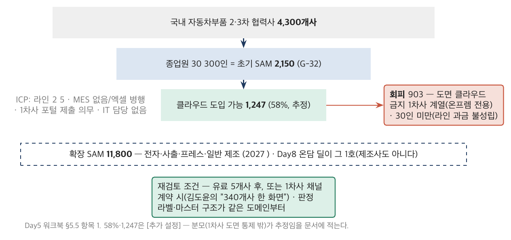

*그림 4-1. 딥게이지의 SAM 깔때기. 국내 자동차부품 2·3차 협력사 4,300개사 → 종업원 30~300인 초기 SAM 2,150(G-32) → 클라우드 도입 가능(1차사 도면 통제 밖) 1,247(58%, 추정 [추가 설정]). 오른쪽 회색이 회피 세그먼트 — 도면 클라우드 금지 1차사 계열 903(온프렘 전용)과 30인 미만(라인 과금 불성립). 점선이 확장 SAM 11,800(전자·사출·일반 제조) — Day8 온담 딜이 그 1호다. Day5 워크북 §5.5 항목 1.*

### 딥게이지의 사례로 읽기

> ■ **사례 사실** — 초기 SAM 2,150·확장 11,800(G-32); 김도윤의 "도면이 클라우드로 나가면 저는 잘립니다"와 2025년 유출 사고(정본 §2.4); X-03에서 동보프레스 "온프렘이면"(워크북 §4.5 카드 ③); 클라우드 가능 58% = 1,247과 ICP 조건은 워크북 §5.5 항목 1 [추가 설정].

김도윤(I-27) 한 사람의 인터뷰가 초기 SAM의 42%를 지웠다. 그의 담당 협력사 340곳은 도면을 클라우드에 올릴 수 없고, 그것을 어기면 SQ 등급이 강등된다. 온프렘은 GPU 서버·운영 인력·보안 인증(ISMS-P 없음)이 필요하고 프리시드 회사의 범위 밖이다. 딥게이지는 회피를 택했다 — 클라우드 가능 1,247개사에서 시작하고, 온프렘은 "유료 5개사 후 또는 1차사 채널 계약 시" 재검토한다고 적었다. 그리고 동보프레스(H사 계열, "온프렘이면")는 보류 목록에 남겼다.

같은 사람이 채널이기도 하다 — "340개사를 한 화면에서 보고 싶어요". 확장 경로의 두 번째 줄이 그것이다: 1차사 채널로 온프렘 요구를 **채널 조건부**로 재검토. 회피는 포기가 아니라 순서다.

### 실무에서 어떻게 틀리는가

회피 세그먼트가 없다. 세그먼트를 산업으로만 적는다("제조업"). 크기에 분모가 없다. 그리고 첫 인바운드가 세그먼트 밖에서 오면 세그먼트를 버린다 — Day8의 온담이 정확히 그 인바운드다(자동차도 제조사도 아니다). D+90에 "자동차를 벗어나지 않는다"를 적어 둔 조와 적지 않은 조는 그 인바운드를 다르게 만난다.

### 표준·문헌에서는

Moore(3판, 2014) 3~4장(교두보·전체 제품). SAM/TAM/SOM의 어휘는 투자자 문서의 관행이며 분모 없이 쓰이는 것이 문제다. PM 트랙 Day1 3.2절 헌장 항목 5 — 제외 범위에는 담당이 붙는다 — 가 회피 세그먼트의 거울이다: 회피에는 재검토 조건이 붙는다.

---

## 4.2 전략 커널 — 진단·추진 방침·일관된 행동

### 개념

Rumelt(*Good Strategy Bad Strategy*, 2011)의 커널은 세 줄이다. **진단**(문제의 핵심 — 무엇이 일어나고 있는가를 한 문장으로), **추진 방침**(그 문제를 다루는 접근 하나 — 다른 접근을 버린 것), **일관된 행동**(방침에서 연역되는 3~5개 행동). 목표·비전·가치는 전략이 아니다 — "업계 1위", "고객 중심"은 진단도 방침도 아니다. 나쁜 전략의 네 징후(허풍, 문제 회피, 목표를 전략으로, 나쁜 전략적 목표)는 5.3절에서.

프리시드에서 커널이 유용한 이유는 세 줄이 **트리와 인터뷰에서 연역**되어야 하기 때문이다. 진단은 27건에서 나온 사실이고, 방침은 트리의 우선순위에서 나온 선택이며, 행동은 Day6 백로그·가격·Won't로 이어진다. 커널이 27건과 무관하면 커널이 아니라 슬로건이다.

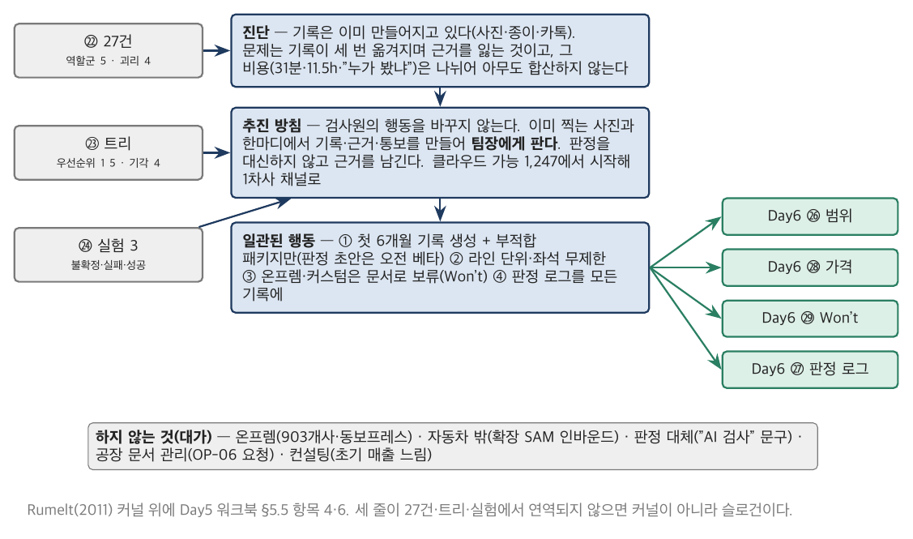

*그림 4-2. 딥게이지의 전략 커널(D+90). 진단은 27건(㉒)에서, 추진 방침은 트리의 우선순위(㉓)와 실험(㉔)에서, 일관된 행동 4개는 방침에서 연역되어 Day6 ㉖(범위)·㉘(가격)·㉙(Won't)·㉗(판정 로그)로 나간다. 아래 회색 줄이 "무엇을 하지 않는가" 5개 — 각각 대가가 붙어 있다. Rumelt(2011)의 커널 구조 위에 Day5 워크북 §5.5 항목 4·6을 놓았다.*

### 딥게이지의 사례로 읽기

> ■ **사례 사실** — 커널 세 줄·일관된 행동 4·하지 않는 것 5(온프렘 / 자동차 밖 / 판정 대체 / 공장 문서 / 컨설팅)는 Day5 워크북 §5.5 항목 4·6 [추가 설정]; "사진은 찍어요"(I-24)는 워크북 §2.5.

딥게이지의 진단은 "기록의 부재"가 아니다 — "기록은 이미 만들어지고 있다(사진·종이·카톡); 문제는 기록이 세 번 옮겨지며 근거를 잃는 것이고, 그 비용은 검사원의 31분·팀장의 11.5시간·클레임 때 '누가 봤냐'의 부재로 나뉘어 아무도 합산하지 않는다". 이 진단이 방침을 정한다 — "검사원의 행동을 바꾸지 않는다; 이미 찍는 사진과 한마디에서 기록·근거·통보를 만들어 팀장에게 판다". 진단이 "기록의 부재"였다면 방침은 "기록 시스템 구축"이 됐을 것이고, 그것은 MES 회사가 이미 하는 일이다.

"무엇을 하지 않는가" 다섯 줄에는 각각 대가가 붙어 있다 — 온프렘을 하지 않는 대가는 H사 계열 903개사와 동보프레스, 자동차를 벗어나지 않는 대가는 확장 SAM의 인바운드, 판정을 대신하지 않는 대가는 "AI 검사"라는 마케팅 문구. 대가가 없는 "하지 않는 것"은 선택이 아니라 미루기다.

### 실무에서 어떻게 틀리는가

진단 자리에 시장 크기·비전. 방침이 "고객 중심"·"데이터 기반". 행동이 방침과 무관한 할 일 목록. "하지 않는 것"에 대가가 없다. 그리고 커널을 한 번 쓰고 Day8까지 안 본다 — 커널은 47건 앞에서 꺼내 쓰는 문서다.

### 표준·문헌에서는

Rumelt(2011) 5장 "커널". 스타트업 문헌이 아니라서 오히려 좋다 — 시장·기술과 무관한 구조다. Christensen의 "무엇을 하지 않을 것인가"(*The Innovator's Dilemma*의 자원 배분)와 Porter의 "전략은 하지 않는 것의 선택이다"(1996)가 같은 계보다.

---

## 4.3 레퍼런스 클래스 — 우리 계획은 분포의 어디에 있는가

### 개념

PM 트랙 Day1 1.2절의 reference class forecasting(Flyvbjerg)을 스타트업에 적용한다 — 우리와 비슷한 회사들이 실제로 얼마나 걸렸는가(외부 시각)를 먼저 보고, 우리 계획(내부 시각)을 그 분포에 놓는다. 프리시드의 계획은 거의 언제나 분포의 상단이다. 그것 자체는 문제가 아니다 — 상단이라는 것을 모르고 IR 덱에 쓰는 것이 문제다.

레퍼런스 클래스 원장 v0는 유사 버티컬 SaaS 12건의 첫 유료까지 개월 / ARR 1억까지 개월 / 시드 규모다. 12건이 충분한가? 아니다. 그러나 0건보다 훨씬 낫고, v0라는 이름이 그것을 말한다.

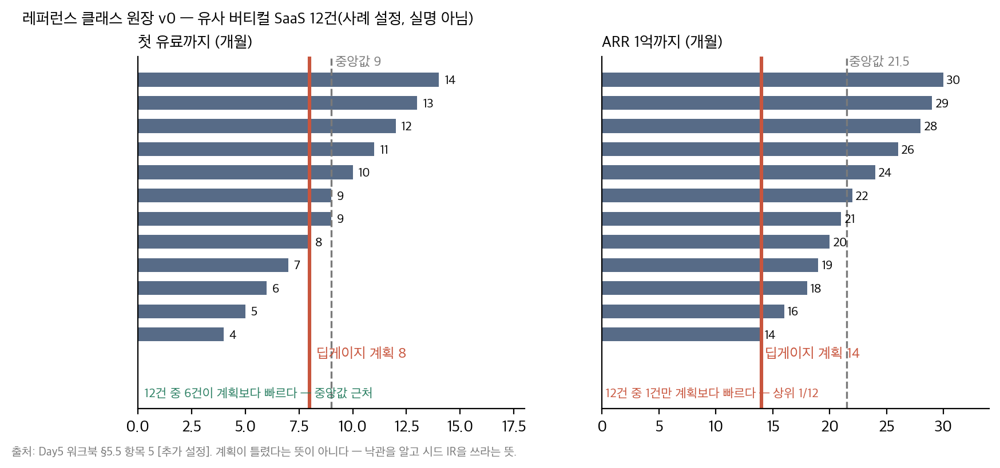

*그림 4-3. 레퍼런스 클래스 12건(사례 설정, 실명 아님). 왼쪽 첫 유료까지 개월(중앙값 9, 범위 4~14) — 딥게이지 계획 8개월(D+240)은 중앙값 근처. 오른쪽 ARR 1억까지 개월(중앙값 21.5, 범위 14~30) — 딥게이지 계획 14개월(D+420)은 분포의 최상단(상위 1/12). 계획이 틀렸다는 뜻이 아니다 — 그 낙관을 알고 시드 IR을 쓰라는 뜻이다. Day5 워크북 §5.5 항목 5.*

### 딥게이지의 사례로 읽기

> ■ **사례 사실** — 12건의 값과 중앙값(첫 유료 9 / ARR 1억 21.5), 딥게이지 계획(8 / 14)은 Day5 워크북 §5.5 항목 5 [추가 설정 — 사례 설정]; 세영정공 D+240 첫 유료는 정본 §3.7; D+300 순SaaS ARR 4,860만·D+600 3.8억은 G-05.

첫 유료 8개월은 중앙값이다 — 걱정할 것이 없다. ARR 1억 14개월은 12건 중 1건만 그보다 빠르다. 정본을 보면 딥게이지는 D+300에 순SaaS ARR 4,860만, D+600에 3.8억이므로 1억은 D+400 전후에 도달한다 — 계획이 맞는다. 그러나 D+90의 딥게이지는 그것을 알 수 없다. 알 수 없다고 적고, 시드 IR에 "ARR 1억 14개월"을 쓰려면 근거(1차사 채널)를 붙인다 — 그것이 외부 시각을 문서에 넣는 방법이다.

### 실무에서 어떻게 틀리는가

성공 사례만 모은다(생존 편향). 우리 계획을 분포에 대조하지 않는다. 분포의 상단에 있다는 것을 알면서 IR에 근거 없이 쓴다. 그리고 레퍼런스 클래스를 "우리는 다르다"로 무시한다 — 다르다는 것이 계획의 근거가 되려면 무엇이 다른지 적어야 한다.

### 표준·문헌에서는

Flyvbjerg의 RCF(PM Day1 1.2절·Day2 6.1절). Kahneman & Lovallo의 내부/외부 시각(1993·2003). 스타트업 문헌에서는 벤치마크 리포트(Bessemer, a16z, OpenView)가 사실상의 레퍼런스 클래스이며 Day7에서 지표 벤치마크로 다시 나온다.

---

## 4.4 창업 헌장 — 지분·베스팅·옵션풀의 pre/post

### 개념

창업 헌장(공동창업자 합의서)은 세 사람이 서로에게 권한을 나누는 문서이고, 프로젝트 헌장(②)과 결정적으로 다른 칸이 하나 있다 — 지분. 지분·베스팅·옵션풀은 법률 문서(주주간계약)로 확정되지만, 변호사에게 가져갈 칸이 비어 있으면 표준 문구가 채우고 그 문구가 나중에 창업자를 묶는다. Wasserman(2012)의 데이터(창업자 1만 명)에서 지분 분할을 "빨리·균등하게" 한 팀이 나중에 갈등을 더 많이 겪는다.

세 개념만 정확히 한다.

**지분과 주식수.** 지분은 %가 아니라 주식수로 먼저 적는다(액면 100원 × 1,000,000주). 균등 분할(33/33/33)은 공정해 보이지만 기여·리스크·합류 시점이 다르면 불공정이다. 배분 비율 자체는 여러 답이 방어 가능하다 — 근거 열이 비어 있는 것이 탈락이다.

**베스팅.** 4년·1년 클리프·월 베스팅이 사실상의 표준이다. 클리프가 없으면 3개월 뒤 떠난 사람이 지분을 갖는다. 가속(acceleration)은 인수 시 — single trigger(인수만으로 100%)는 인수자가 창업자를 붙잡을 이유를 없애므로 double trigger(인수 + 해임)가 창업자에게도 유리한 경우가 많다.

**옵션풀의 pre/post.** 옵션풀 10%가 pre-money에 있으면 그 희석은 기존 주주(창업자)가 지고, post-money에 있으면 투자자와 나눈다. 텀시트의 "투자 전 옵션풀 n% 설정"은 표준 문구처럼 보이지만 창업자 지분에서 n%를 빼는 문장이다. 딥게이지 정본은 이 칸을 **미명시**로 시작하고(K-01), Day8에서 한강벤처스의 "옵션풀 15% pre-money"를 만난다 — 그때 1.29%p의 계산이 손에 있는가가 시험이다.

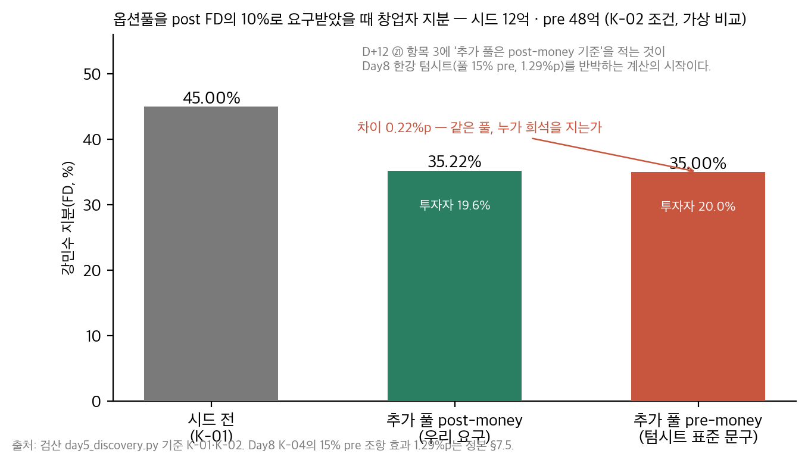

*그림 4-4. 옵션풀의 위치. 같은 규모의 풀을 pre-money에 두면(왼쪽) 희석은 창업자만 지고, post-money에 두면(오른쪽) 투자자와 나눈다. 막대는 시드 12억·pre 48억(K-02)에서 추가 풀 10%를 요구받았을 때의 강민수 지분 — post 기준과 pre 기준의 차이. 정본 K-04(Day8, 풀 15% pre)에서는 그 차이가 1.29%p다. D+12에 ㉑ 항목 3에 "추가 풀은 post-money 기준"을 적는 것이 그 계산의 시작이다. 검산 `day5_discovery.py`.*

### 딥게이지의 사례로 읽기

> ■ **사례 사실** — 캡테이블 T0 45/30/15/10, 액면 100원 × 1,000,000주(K-01); 베스팅 미확정으로 시작(정본 §7.5 아래); 세 사람의 동기(정본 §1.4); 개인 출자 내역 4,000/1,500/500, 베스팅 4년·1년 클리프·double trigger, 의사결정 규칙(만장일치/과반/전결, CTO·CPO 거부권)은 Day5 워크북 §1.5 [추가 설정].

딥게이지의 45/30/15는 출자(4,000/1,500/500)·풀타임 시점·문제의 원 소유자로 설명된다. 옵션풀 10%는 설립 시 FD에 이미 포함되어 있으므로, 시드에서 추가 풀을 요구받으면 post-money 기준을 요구한다고 ㉑ 항목 3에 적었다 — 이 한 줄이 Day6 ㉚ 협상 요청 1번이다. 의사결정 규칙에는 CPO의 범위 절단 거부권과 CTO의 아키텍처 거부권이 분기 1회씩 있다 — 정체성 불안(윤하경)과 모델의 우아함(오세진)을 문서로 다루는 방법이며, 각각 Day6 절단과 Day7 eval v2에서 시험받는다.

### 실무에서 어떻게 틀리는가

"우리는 셋뿐이라 다 안다" — 그래서 안 쓴다. 균등 분할을 공정으로. 베스팅 없이 시드를 받으러 간다(심사역이 먼저 묻는다). 옵션풀 위치를 안 정한 채 텀시트의 표준 문구를 받는다. 이탈 조항이 없다 — 정본에서 D+230에 첫 이탈(조현우)이 온다. 전부 만장일치 — 아무것도 결정하지 못하는 회사.

### 표준·문헌에서는

Wasserman(2012) Part II(역할·보상·의사결정). Feld & Mendelson(4판, 2019) — 베스팅·옵션풀·청산우선권의 정의(미국법 전제, 한국 RCPS는 Day6에서 실무 자료로 보완). YC의 SAFE post-money 표준 문서가 옵션풀 위치 논쟁의 원형이다. PM 트랙 ② 항목 12(거버넌스·PM 권한)가 ㉑ 항목 5(의사결정 규칙)의 거울 — 위임 한도를 전결 영역으로 뒤집는다.

---

## 4.5 자금과 런웨이 — 7개월의 산수

### 개념

런웨이 = 현금 ÷ 월 순소진. 산수는 쉽고 함정은 둘이다. 첫째, **채용 후 급락**을 안 본다 — 3명 기준 7개월이 5명이 되는 순간 2.7개월이 된다. 둘째, **마일스톤을 날짜로만 적는다** — "시드 12억 D+180"은 목표이지 마일스톤이 아니다. 마일스톤은 투자자가 볼 증거(LOI 2건 + 실험 결과)이고, 그 증거가 언제 생기는지가 런웨이와 맞아야 한다.

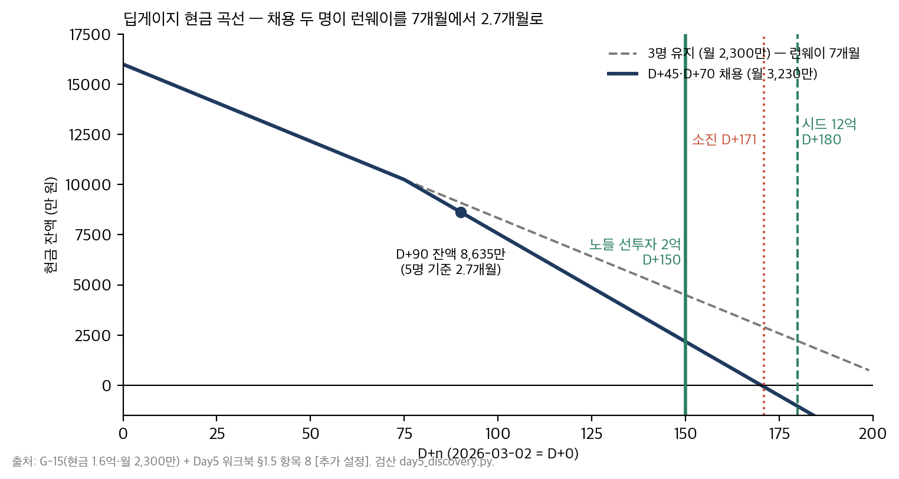

*그림 4-5. 딥게이지 현금 곡선. 3명(월 2,300만)일 때 런웨이 7개월(G-15). D+45·D+70 채용으로 월 3,230만이 되면 D+90 잔액 약 8,600만, 잔여 2.7개월 → D+170 전후 소진. 시드 본 라운드 D+180보다 먼저다. 노들투자파트너스의 선투자 2억(D+150)이 TIPS 추천 요건이 아니라 생존 조건인 이유. Day5 워크북 §1.5 항목 8, 검산 `day5_discovery.py`.*

### 딥게이지의 사례로 읽기

> ■ **사례 사실** — 현금 1.6억·월 2,300만·런웨이 7개월(G-15); 시드 RCPS 12억 D+180, 노들 선투자 2억(정본 §3.2); 채용 2명·월 3,230만·D+90 잔액 8,635만·잔여 2.7개월은 Day5 워크북 §0.3·§1.5 [추가 설정].

D+90의 딥게이지는 3,230만 원을 매달 쓰고 8,635만 원이 남았다. D+170 전후에 0이 된다. 시드 본 라운드는 D+180이다. 열흘이 모자란다 — 그리고 라운드는 늦어진다. 정본의 "노들 선투자 2억으로 TIPS 추천 요건 충족"은 요건 충족의 문장이지만 산수로 읽으면 생존의 문장이다. ㉑ 항목 8이 그 산수를 두 번(3명·5명) 하는 이유다.

### 실무에서 어떻게 틀리는가

런웨이를 한 번만 계산한다. 채용을 런웨이와 따로 결정한다. 마일스톤을 날짜로. "시드가 되면"을 전제로 쓴다 — 시드는 되지 않을 수도 있고 늦을 수도 있다. 그리고 예비창업패키지 같은 정부 자금을 현금과 같은 무게로 센다(집행 조건·정산이 있다).

### 표준·문헌에서는

특별한 표준은 없다. Ries(2011)의 런웨이 정의("남은 피벗 횟수"), Blank의 "회사 밖으로" — 런웨이는 실험을 몇 번 더 할 수 있는가로 세는 것이 프리시드의 읽는 법이다. PM 트랙 Day2 4.3절(S-curve·자금 조달 한도)이 같은 산수의 발주자 판이다.

---

## 4.6 분야별 대조 — B2B 버티컬 SaaS·컨슈머·하드웨어·딥테크 (심화)

오늘의 도구(인터뷰·트리·가정·실험·세그먼트)는 분야마다 무게가 다르다. 딥게이지는 B2B 버티컬 SaaS다.

| 분야 | 발견의 단위 | 실험의 형태 | 세그먼트의 제약 | 프리시드에서 가장 위험한 가정 |
|---|---|---|---|---|
| **B2B 버티컬 SaaS**(딥게이지) | 역할군 5의 의사결정 사슬 — 사용자·책임자·지불자·요구자 | 위저드오브오즈·유료 파일럿(LOI) | 지불자의 정책(도면 클라우드 금지), 규제, 채널 | 사용자가 쓰는가 ≠ 지불자가 사는가(A-05 vs A-03) |
| **컨슈머 앱** | 개인의 습관·상황 — 수천 명 | 랜딩·설문·베타 코호트 | 획득 채널·앱스토어·습관 형성 | 리텐션 — 2주 뒤에도 쓰는가 |
| **하드웨어** | 사용 환경·제조·인증 | 목업·소량 시제·킥스타터 | 금형·인증·유통 — 되돌림 비용이 크다 | 단가·수율·리드타임(PM 트랙 P2의 세계) |
| **딥테크**(고객이 아직 없는 제품) | 기술 성숙도·규제·파트너 | 기술 실증(TRL)·논문·정부 과제 | 시장이 아직 없다 — 만들어야 한다 | 기술이 되는가 ≠ 누가 사는가 — 순서가 뒤집힌다 |

딥게이지는 셋째 열의 제약(지불자의 정책)과 다섯째 열의 가정(사용자 ≠ 지불자)이 가장 무겁다. 검사원이 쓰고 팀장이 사고 대표가 승인하고 1차사가 요구한다 — 네 사람의 job이 다르다는 것이 B2B 버티컬의 본질이며, 그래서 인터뷰 27건이 역할군 5로 나뉜다. 컨슈머 앱이었다면 27건이 아니라 2,700명의 코호트가 필요하고, 하드웨어였다면 인터뷰보다 금형 리드타임이 먼저다(PM 트랙 Day1 1.5절의 되돌림 비용). 3~7년차라면 자기 분야의 열을 채워 보라 — 어느 도구가 무겁고 어느 도구가 가벼운가.

---

## 제4장 핵심 정리

> **한 줄씩 — 수업 직전 5분 복습용**
> 1. 세그먼트는 "누구에게 먼저"이자 "누구에게 지금 가지 않는가" — 회피 세그먼트가 없으면 시장 정의일 뿐이다.
> 2. 김도윤 한 사람이 초기 SAM의 42%를 지웠다 — 회피는 포기가 아니라 순서이고, 재검토 조건이 붙는다.
> 3. 전략 커널은 세 줄 — 진단·추진 방침·일관된 행동 — 이고 목표·비전은 전략이 아니다. "하지 않는 것"에는 대가가 붙는다.
> 4. 레퍼런스 클래스 12건 — 첫 유료 계획은 중앙값, ARR 1억 계획은 상위 1/12. 낙관을 알고 IR을 쓴다.
> 5. 창업 헌장의 결정적 칸은 지분·베스팅·옵션풀의 pre/post — 비워 두면 표준 문구가 채운다.
> 6. 런웨이는 두 번 계산한다 — 3명 7개월, 5명 2.7개월. 선투자 2억은 요건이 아니라 생존이다.
>
> 아래는 같은 내용의 자세한 판이다.

1. ICP는 관찰 가능한 조건(종업원·라인·MES·제출 의무)으로, 크기는 분모와 함께(4,300 → 2,150 → 1,247). 회피 세그먼트(도면 클라우드 금지 903·30인 미만)와 이유·재검토 조건. 첫 세그먼트 밖 인바운드(Day8 온담)를 만났을 때 "자동차를 벗어나지 않는다"가 기준이 된다.
2. 커널 — 진단은 27건에서(기록의 부재가 아니라 세 번 옮겨지며 근거를 잃는 것), 방침은 트리에서(행동을 바꾸지 않는다, 사진과 한마디에서 만들어 팀장에게 판다), 행동은 Day6로(범위·가격·Won't·판정 로그). 하지 않는 것 5개 + 대가.
3. 외부 시각 — 유사 SaaS 12건의 분포에 계획을 놓는다. 상단이라는 것을 알고 근거를 붙여 쓴다. 생존 편향·"우리는 다르다" 경계.
4. 창업 헌장 — 주식수로 먼저, 근거 열, 4년/1년 클리프/월/double trigger, 옵션풀 pre/post 명시(정본은 미명시로 시작 — F-01), 이탈 조항(D+230 첫 이탈), 전결 영역과 거부권. PM ② 항목 12의 거울.
5. 런웨이 — 현금 ÷ 순소진을 3명·5명으로 두 번. 마일스톤은 날짜가 아니라 증거(LOI 2 + 실험 3). D+170 소진 vs D+180 라운드 — 선투자 2억의 자리.
6. 분야별 — B2B 버티컬은 사용자 ≠ 지불자(역할군 5), 컨슈머는 리텐션, 하드웨어는 되돌림 비용, 딥테크는 순서가 뒤집힌다.

## 생각해 볼 질문

1. 여러분 제품의 회피 세그먼트를 한 줄로 말할 수 있는가? 그 대가와 재검토 조건은?
2. 여러분 회사의 전략 문서에서 진단·방침·행동 세 줄을 뽑을 수 있는가 — 뽑히지 않으면 그 문서는 무엇인가?
3. 옵션풀 15% pre-money 조항을 받았을 때 여러분은 무엇을 계산해 반박하겠는가(Day8 ㊴에서 실제로 한다)?
4. 런웨이 2.7개월인 회사의 CEO가 D+90에 해야 할 첫 번째 일은 무엇인가 — 인터뷰 28번째인가, 노들 심사역 미팅인가?

## 워크북 연결

이 장은 Day5 워크북 **㉕ 세그먼트·JTBD·전략 커널**(항목 1 세그먼트 — 4.1절 / 항목 4 커널·항목 6 하지 않는 것 — 4.2절 / 항목 5 레퍼런스 클래스 — 4.3절; 항목 2·3 JTBD·타임라인은 2.3절)과 **㉑ 창업 헌장·공동창업자 합의서**(항목 1·3 지분·옵션풀·4 베스팅·5 의사결정·7 이탈 — 4.4절 / 항목 8 자금 — 4.5절; 항목 2·6·9는 1장)에 대응한다. 수업 중 과제(★)는 ㉑ 항목 3·4·5(25분)와 ㉕ 항목 1·4·6(20분). 기본 과제(㉑ — 윤하경 D+120 합류 / ㉕ — H사 채널 제안)와 심화 과제(자기 회사 권한 문서를 만장일치/과반/전결로 / 전략 문서에서 커널 세 줄)는 §1.7·§5.7.

---

# 제5장 이 날의 학술 배경 — 깊이 읽기 (과정 후)

## 5.1 JTBD 논쟁 — Christensen과 Ulwick

### 무엇인가

"Jobs to Be Done"이라는 이름 아래 두 계보가 있다. Christensen(하버드)·Moesta(Re-Wired)의 계보는 **상황과 진전** — 고객이 어떤 삶의 상황에서 어떤 진전을 위해 제품을 고용하는가 — 를 이야기와 인터뷰로 찾는다(*Competing Against Luck*, 2016; *Demand-Side Sales 101*, 2020). Ulwick(Strategyn)의 계보는 **결과 진술문**(outcome statement) — "~하는 데 걸리는 시간을 최소화한다" — 을 수십 개 뽑아 중요도 × 만족도로 정량화한다(*Jobs to Be Done: Theory to Practice*, 2016). 두 계보는 이름을 두고 다투었고(Ulwick이 원조를 주장), 실무에서는 섞여 쓰인다.

### 실무자에게

이 과정은 Christensen·Moesta 계보를 쓴다 — 프리시드의 27건 인터뷰는 이야기이지 설문이 아니고, 네 가지 힘이 "왜 안 사는가"를 준다. Ulwick의 정량화는 고객이 수백 명일 때(Day7 이후) 유용하다. 혼동하지 말 것: Christensen의 "job"은 상황의 속성이고, Ulwick의 "outcome"은 결과의 측정이다. 딥게이지의 ㉕ 항목 2(진술문)는 전자, ㉓ 항목 1(결과 정의)은 후자에 가깝다.

### 흔한 오독

JTBD를 페르소나의 다른 이름으로 쓰는 것. "밀크셰이크" 일화(Christensen)를 이론으로 착각하는 것 — 그것은 예시다. 그리고 job을 "고객이 원하는 기능"으로 번역하는 것 — 그 순간 해법 명사가 들어온다.

### 어디를 읽을 것인가

Christensen 외(2016) 1~4장 · Moesta(2020) 전체(짧다) · Ulwick(2016) 1~3장. 논쟁의 요약은 Klement의 블로그(*When Coffee and Kale Compete*, 2018)가 읽기 쉽다.

## 5.2 Torres — continuous discovery의 조건

### 무엇인가

Torres(2021)의 주장은 발견이 프로젝트가 아니라 **습관**이라는 것이다 — 주 1회 고객 인터뷰, 트리를 매주 갱신, 가정을 매주 실험. 그 전제는 "제품 트리오"(PM·디자이너·엔지니어)가 함께 발견한다는 것이고, 조직이 결과(outcome)로 팀에 위임한다는 것이다.

### 실무자에게

프리시드에서 트리오는 세 창업자다. 조건은 갖춰져 있다. 문제는 시드 이후다 — 12명이 되고 세일즈가 생기면 인터뷰가 세일즈 미팅으로 대체되고 트리가 멈춘다. Day6~7에서 그 징후(태산정밀 62개 요구, 인바운드 커스텀)를 본다. 그리고 결과로 위임하는 조직이 아니면(대기업 사내 TF) 트리는 위에서 내려온 기능 목록을 정당화하는 그림이 된다.

### 흔한 오독

트리를 그리면 발견이 끝났다고 믿는 것. 트리를 로드맵으로 쓰는 것. 주 1회 인터뷰를 "고객 10명 인터뷰 프로젝트"로 대체하는 것.

### 어디를 읽을 것인가

Torres(2021) 전체 — 짧고 실용적. 2·5·9·11장이 오늘의 네 산출물에 직접 대응.

## 5.3 Rumelt — 나쁜 전략의 네 징후

### 무엇인가

Rumelt(2011)는 나쁜 전략의 징후 넷을 꼽는다 — 허풍(fluff: 유행어로 채운 문장), 문제 회피(진단이 없다), 목표를 전략으로(매출 2배가 전략), 나쁜 전략적 목표(달성 불가능하거나 서로 모순되는 목표 목록). 좋은 전략은 커널 — 진단·추진 방침·일관된 행동 — 이고, 방침은 다른 방침을 버린 선택이다.

### 실무자에게

스타트업 문서의 대부분이 넷째 징후(목표 목록)다 — "유료 5개사, ARR 1억, 시리즈A". 그것은 목표이지 전략이 아니다. 딥게이지의 커널(4.2절)이 좋은 전략인지는 Day8에 판정된다 — "자동차를 벗어나지 않는다"가 21억 앞에서 지켜지는가, 지켜지지 않는다면 그것이 방침의 갱신인가 방침의 부재였는가.

### 흔한 오독

커널을 템플릿으로 채우는 것 — 진단 칸에 시장 규모, 방침 칸에 비전, 행동 칸에 OKR. 셋이 연역 관계가 아니면 커널이 아니다.

### 어디를 읽을 것인가

Rumelt(2011) 1~7장. 2022년 후속작 *The Crux*는 진단의 심화.

## 5.4 Blank·Ries — customer development와 혁신 회계

### 무엇인가

Blank(*The Four Steps to the Epiphany*, 2005; Blank & Dorf, *The Startup Owner's Manual*, 2012)의 customer development는 제품 개발과 나란히 도는 고객 발견 → 검증 → 창출 → 회사 구축의 네 단계이며, "회사 밖으로 나가라"가 첫 문장이다. Ries(2011)의 lean startup은 그 위에 build-measure-learn과 **혁신 회계**(innovation accounting) — 배운 것을 회계처럼 기록하고 기준선 대비 개선을 잰다 — 를 얹었다.

### 실무자에게

오늘의 27건이 고객 발견, 세 실험이 고객 검증의 첫 단계다. 혁신 회계는 프리시드에서는 통계가 아니라 문장 — 사전등록 — 이다. 그리고 "피벗"은 판정의 결과이지 판정 자체가 아니다 — 판정 규칙(3.5절)이 먼저 있어야 피벗이 결정 회피의 이름이 되지 않는다.

### 흔한 오독

MVP를 "작은 제품"으로(실험이다). "피벗"을 "방향 전환"으로(검증된 학습에 근거한 가설 변경이다). lean을 "싸게"로(빠르게 배우는 것이다).

### 어디를 읽을 것인가

Ries(2011) 2부(조종) · Blank & Dorf(2012) 1~2장 · Ries의 후속작 *The Startup Way*(2017)는 대기업 적용.

## 5.5 Sarasvathy — effectuation, 창업자는 예측하지 않는다

### 무엇인가

Sarasvathy(2001, *Academy of Management Review*)는 숙련 창업자 27명(공교롭게도)의 의사결정을 분석해 그들이 목표에서 수단을 역산(causation)하지 않고 **가진 수단에서 가능한 목표를 만든다**(effectuation)는 것을 보였다. 다섯 원칙 — 손 안의 새(가진 것에서 시작), 감당 가능한 손실(기대 수익이 아니라 잃어도 되는 만큼), 조각보(파트너를 먼저), 레모네이드(우연을 활용), 조종석(예측이 아니라 통제).

### 실무자에게

딥게이지의 D+0은 정확히 손 안의 새다 — 강민수의 네 숫자, 오세진의 모델, 윤하경의 공장 경험, 1.6억. 세 실험의 비용 132만 원은 감당 가능한 손실이다. 이 관점의 실무적 효용은 프리시드의 계획을 "목표에서 역산한 로드맵"이 아니라 "가진 것으로 할 수 있는 다음 실험"으로 쓰게 한다는 것이다. Day6 이후 시드 자금이 들어오면 causation(목표에서 역산)이 필요해진다 — 두 논리의 전환점이 시드다.

### 흔한 오독

effectuation을 "계획하지 않는다"로. 계획은 하되 예측에 의존하지 않는다는 뜻이다.

### 어디를 읽을 것인가

Sarasvathy(2001) 원논문 · Read 외, *Effectual Entrepreneurship*(2판, 2016).

## 5.6 Wasserman — 창업자의 딜레마

### 무엇인가

Wasserman(*The Founder's Dilemmas*, 2012)은 창업자 약 1만 명의 데이터로 공동창업·지분·역할·투자자 관계의 선택과 그 결과를 분석했다. 핵심 발견 — "부자가 될 것인가 왕이 될 것인가"(통제와 부의 트레이드오프), 지분을 빨리·균등하게 나눈 팀의 갈등, 친구·가족과의 공동창업 리스크, CEO 교체의 구조.

### 실무자에게

㉑ 창업 헌장의 근거다. 딥게이지의 45/30/15는 균등이 아니고 근거가 있으며, 베스팅과 이탈 조항이 있다. Day8의 텀시트 2안(옵션풀 12% vs 6%, 창업자 지분 25.38% vs 27.01%)이 "부자 vs 왕"의 딜레마다 — 한강은 지분이 낮지만 채용 여력이 크고, 코너스톤은 지분이 높지만 온담 딜이 조건이다.

### 흔한 오독

데이터를 규칙으로(경향이지 법칙이 아니다). "왕"을 나쁜 선택으로(선택이다 — 단, 알고 해야 한다).

### 어디를 읽을 것인가

Wasserman(2012) 4~8장(공동창업·지분·역할). Feld & Mendelson(2019)과 함께.

## 5.7 서지와 읽는 순서

| 순서 | 문헌 | 이유 |
|---|---|---|
| 1 | Fitzpatrick, *The Mom Test* (2013) | 가장 짧고, 오늘 당장 바꿀 수 있는 것(질문) |
| 2 | Torres, *Continuous Discovery Habits* (2021) | 오늘의 네 산출물의 절차 |
| 3 | Rumelt, *Good Strategy Bad Strategy* (2011) 1~7장 | 커널 |
| 4 | Christensen 외 (2016) · Moesta (2020) | 왜 사는가 |
| 5 | Ries (2011) 2부 · Blank & Dorf (2012) 1~2장 | 학습의 회계 |
| 6 | Wasserman (2012) 4~8장 · Feld & Mendelson (2019) | 창업 구조·텀시트 — Day6 전에 |
| 7 | Sarasvathy (2001) · Cagan (2018) Part IV · Kohavi 외 (2020) 1~2장 | 배경·심화 |

*판본과 서지는 인용 전에 확인한다(제작 노트 §1.2). 위 목록의 출간 연도는 원서 기준이다.*

---

# 제6장 읽을 자료 (과정 후)

## 6.1 필수 (과정 전)

| 자료 | 분량 | 왜 |
|---|---|---|
| Fitzpatrick, *The Mom Test* (2013) 1~4장 | 60쪽 | ㉒ 인터뷰 가이드의 문법 |
| Torres, *Continuous Discovery Habits* (2021) 1·5·9장 | 70쪽 | ㉓ 트리·㉔ 가정 맵의 원전 |
| Rumelt, *Good Strategy Bad Strategy* (2011) 5장 "커널" | 20쪽 | ㉕ 항목 4 |
| `교재/공통/가상회사_딥게이지.md` §1.1 · §2 · §6 · §8 | 25분 | 사례 |
| PM 트랙 Day4 워크북 §3.5 항목 6(이관 목록 6번) · Day1 교재 1.2절(RCF) | 10분 | 역할 전환의 원문 · 외부 시각 |

## 6.2 심화 (과정 후)

**30일 안에** — Christensen 외(2016) 1~4장 · Moesta(2020) · Wasserman(2012) 4~8장 · Cagan(2018) Part IV.
**90일 안에** — Ries(2011) · Blank & Dorf(2012) · Feld & Mendelson(2019) 베스팅·옵션풀·청산우선권 장 · Bland & Osterwalder, *Testing Business Ideas*(2019) · Moore(3판, 2014) 3~4장.

## 6.3 참고 (워크북을 쓰다가 손을 뻗어 확인할 것)

Ulwick(2016) — 결과 진술문의 형식 · Portigal, *Interviewing Users*(2013) — 관찰·현장 방문 기법 · Kohavi 외(2020) 1~2장 — 사전등록·OEC(Day6 ㉙) · Sarasvathy(2001) · YC SAFE post-money 표준 문서 · PM 트랙 Day1 교재 3.3절(공개 입장/숨은 동기)·3.5절(프리모템).

### 읽지 않아도 되는 것

"PM 되는 법" 류의 개론서 — 결정의 종류(1.1절)를 다루지 않고 직함을 다룬다. JTBD 계보 논쟁의 블로그 전쟁 — 5.1절 요약으로 충분하다. 스타트업 성공담 — 레퍼런스 클래스가 아니라 생존 편향이다.

## Day5를 마치며 — Day6 예고

이 교재는 세 질문으로 요약된다. **역할이 무엇으로 바뀌었는가**(발주자 → 공급자, 어떻게 → 무엇을), **문제가 정말 문제인가**(27건, 관찰 vs 자기 보고, 기회 8·기각 1), **무엇이 참이어야 하는가**(가정 12, 실험 3, 판정 셋). 여러분의 답이 워크북 ㉑~㉕의 다섯 산출물이고, 그 산출물은 Day6(시드 — 무엇을 안 만들 것인가, 얼마를 받을 것인가)의 입력이 된다.

Day6는 D+120에서 시작한다. 시드 12억은 이미 클로징됐고 — 텀시트에 옵션풀 위치 조항이 없다는 것을 서명 후에 발견한다 — 12명이 됐고, 백로그는 41 man-month인데 가용 공수는 24다. TIPS 조건은 6개월 안에 유료 5개사다. 오늘의 트리가 그 절단의 유일한 상위 문서이고, 오늘의 X-01 불확정이 AI 판정 기능의 완료 정의(eval·오류 예산·HITL)를 정하며, 오늘의 "라인 단위 과금"이 유닛이코노믹스 v1과 헤비 고객의 원가 붕괴로 시험받는다.

발견 시점에 잘못 적힌 것은 범위 시점에 고쳐지지 않는다. 그것이 오늘 여러분이 해법 명사를 지우고 관찰 열을 채우고 성공 기준을 결과 전에 적은 이유다.
