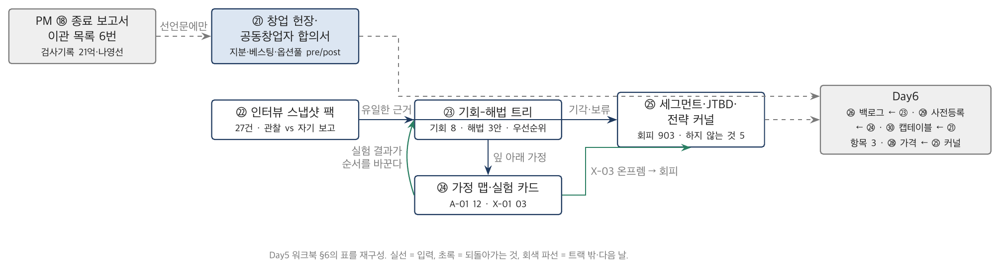

# Product 트랙 Day5 워크북 — 프리시드 단계 산출물

> **이 워크북의 위치** — Product 트랙 1일차(8일 과정의 다섯째 날). 시점 **D+0 ~ D+90 (2026-03-02 ~ 05-29)**, 회사 상태 3명 → 5명, 현금 1.6억, 유료 고객 0. 교재 `Day5_교재.pdf`가 "왜"를, 이 워크북이 "무엇을 어느 칸에"를 다룬다. 딥게이지에 관한 숫자는 `교재/공통/가상회사_딥게이지.md` §7(G·V·E·K)을 정본으로 하고, 정본에 없는 값은 `[추가 설정]`으로 표시하며 검산은 `../그림/Product_Day5/src/day5_discovery.py`에 있다.

## 목차

- 0. 이 워크북을 쓰는 법
- 1. 창업 헌장·공동창업자 합의서 (㉑ Founders' Charter & Co-founder Agreement)
- 2. 고객 인터뷰 스냅샷 팩 (㉒ Customer Interview Snapshot Pack)
- 3. 기회-해법 트리 (㉓ Opportunity Solution Tree)
- 4. 가정 맵·실험 카드 (㉔ Assumption Map & Experiment Cards)
- 5. 세그먼트·JTBD·전략 커널 1페이저 (㉕ Segment, JTBD & Strategy Kernel)
- 6. Day5 산출물 5종의 상호 관계 — 그리고 PM 트랙 문서로 되돌아가는 것
- 7. Day6로 이어지는 것
- 읽을 자료

---

## 0. 이 워크북을 쓰는 법

### 0.1 워크북 사용법

> **■ 이 워크북을 따라가는 순서 — 모든 산출물 공통**
> 1. **읽는다.** X.1(왜 쓰는가) → X.2(표준·문헌 위치) → X.3(항목별 작성 가이드). 막히면 항목 아래 📖가 가리키는 교재 절을 펼친다.
> 2. **찾는다.** X.3 끝의 **◆ 실습 입력 카드** — 정본 §·앞 산출물·추가 조건. *아직 없는 회사에는 찾을 것이 적다.* 카드에 없는 숫자는 만들어 내지 말고 "미확정 — 실험 X-nn"으로 적는다. 그것도 답이다.
> 3. **쓴다.** 카드의 **★ 수업 중 과제**에 적힌 항목을 X.4 빈 템플릿(또는 인쇄용 PDF)에 딥게이지로 직접 쓴다. **X.5 예시본은 아직 펼치지 않는다.**
> 4. **대조한다.** 다 쓴 뒤 X.5 완성 예시본과 칸별로 대조하고, X.6 해설에서 차이가 난 칸의 이유를 읽는다. 해설은 정답이 아니라 **즉시 탈락 조건**과 **방어 가능한 답의 범위**를 쓴다 — 여러분의 답이 그 범위 안에 있으면 예시본과 달라도 된다.
> 5. **바꿔 쓴다.** X.7 실습(조건을 바꾼 변형 과제·자기 회사 과제)은 복습과 과정 후 과제다.
>
> 수업에서는 3단계를 산출물당 20~45분(카드의 ★에 적힌 시간)으로 하고, X.5·X.6은 그날 저녁에 읽는 것이 정상이다.

1. PM 트랙 워크북과 같은 규칙으로 쓴다. 교재가 "왜", 워크북이 "무엇을 어느 칸에".
2. **역할 전환 선언문.** 아래 상자를 소리 내어 읽고 조원 전원이 서명한다. 산출물이 아니라 선언이다 — 오늘의 다섯 문서는 전부 이 선언 뒤에 온다.
   > 지난 나흘 동안 여러분은 428억을 집행하는 쪽에 있었습니다. 벤더의 서면을 받고, 성능시험 결과를 판정하고, 인수를 거부했습니다. 어제 마지막에 쓴 종료 보고서의 미해결 이관 목록에 이런 한 줄이 있습니다 — *"이천센터·안성 원료공장의 입고 검수·검사기록은 P1 범위 밖. 재고 정확도 98.5%는 검사기록 디지털화가 전제. 추정 소요 21억(3년). 소유자 나영선. 승인 전."* 오늘부터 그 한 줄이 여러분이 파는 물건입니다. **당신은 어제까지 이 계약의 발주자였고, 오늘부터 공급자다.** 그리고 시계를 33개월 되감습니다. 여러분이 되는 회사는 2026년 3월 2일에 세 명으로 시작합니다. 온담이라는 회사는 아직 모릅니다.
   > 서명: ____________ / ____________ / ____________ / ____________
3. **용어 합의문.** 이 트랙에서 **PM은 프로덕트 매니저**다. Day1~4의 PM은 프로젝트 매니저였다. 스크럼의 PO(Product Owner)는 백로그 책임 역할이고, PdM은 PM의 다른 표기다. 여러분 조가 쓸 용어 하나를 정해 적는다: ____________. 이 워크북은 "PM(프로덕트)"로 쓰고, 프로젝트 매니저를 가리킬 때는 "프로젝트 PM"으로 쓴다.
4. **시점을 고정한다.** 이 워크북의 기준일은 **2026-05-29(금), D+90**이다. 다섯 산출물은 각각 다른 날에 쓰였다 — ㉑ D+12, ㉒ D+10~75, ㉓·㉔ D+85, ㉕ D+90. 각 산출물의 항목 1에 그 날짜가 있다. D+90 이후의 숫자(시드 12억, 첫 유료, 채택률)는 이 워크북에 없다.
5. **분모를 선언한다.** 숫자를 적을 때 값·단위·출처·**분모**를 함께 적는다. "검사원 11명 중 9명"이지 "대부분"이 아니다. 오늘의 분모는 대개 인터뷰 건수다.
6. 각 산출물의 X.3은 항목마다 네 칸 — *무엇을 / 어떻게 / 흔한 오류 / 딥게이지에서는 이렇게*. 자기 회사 문서를 쓸 때는 "흔한 오류" 칸을 체크리스트로 쓰라.
7. X.7 실습의 **기본 과제**는 딥게이지의 조건 하나를 바꾼 변형 과제, **심화 과제**(3~7년차)는 자기 회사의 제품(또는 사내 서비스)으로 같은 문서 쓰기.
8. 표준·문헌 인용은 Torres(2021), Fitzpatrick(2013), Christensen 외(2016), Moesta(2020), Rumelt(2011), Ries(2011), Wasserman(2012)을 기준으로 한다. 판본은 인용 전에 확인한다.
9. **인쇄용 PDF.** 다섯 산출물의 빈 템플릿은 A4 인쇄용 PDF로 제공한다. 각 산출물의 X.4 첫 줄에 개별 파일 경로가 있고, 한 번에 인쇄하려면 통합본을 쓴다.
    - 📄 빈 양식 5종 통합본: [`../템플릿/Product_Day5/00_Day5_템플릿팩_빈양식.pdf`](../템플릿/Product_Day5/00_Day5_템플릿팩_빈양식.pdf) (A4, 21쪽 — 스냅샷 카드·트리·가정 목록·백로그는 가로)
    - 📄 완성 예시 5종 통합본: [`../템플릿/Product_Day5/00_Day5_템플릿팩_완성예시.pdf`](../템플릿/Product_Day5/00_Day5_템플릿팩_완성예시.pdf)
    - LaTeX 소스: `../템플릿/Product_Day5/src/` (`build.sh`, tectonic). 명세는 `../템플릿/Product_specs.py`.

### 0.2 8일 동안 만드는 산출물 전체 목록(40종)과 Day5의 위치

| 트랙 | 일차 | 산출물 | 이 산출물의 입력 | Day5 산출물과의 관계 |
|---|---|---|---|---|
| PM | Day1 | ① 비즈니스 케이스 요약 ② 헌장 ③ 이해관계자 등록부 ④ 거버넌스·RACI ⑤ 프리모템·초기 리스크 | — | ②·⑤의 형식이 ㉑·㉔의 거울 |
| PM | Day2 | ⑥ 범위·WBS ⑦ RTM ⑧ 일정 기준선 ⑨ 원가 기준선 ⑩ 리스크 정량화·격자 | Day1 | — |
| PM | Day3 | ⑪ 변경요청서 ⑫ 성과보고 EVM ⑬ 이슈·리스크 ⑭ 품질 기록 ⑮ 조달·계약 | Day2 | ⑫ Rules of Credit의 AI 완료 판정 → Day6 ㉗ |
| PM | Day4 | ⑯ 컷오버 런북·SAC ⑰ 운영 이관·SLA ⑱ 종료 보고서·이관 목록 ⑲ 교훈 ⑳ 편익 실현 원장 | Day3 | **⑱ 이관 목록 6번 = ㉑의 존재 이유** · ⑳ = Day8 ㊵ |
| **Product** | **Day5** | **㉑ 창업 헌장·공동창업자 합의서** | ⑱ 6번(역할 전환의 원문) | 오늘의 첫 문서 — 지분·베스팅·의사결정·자금 |
| **Product** | **Day5** | **㉒ 고객 인터뷰 스냅샷 팩(27건)** | — | ㉓의 유일한 근거 |
| **Product** | **Day5** | **㉓ 기회-해법 트리** | ㉒ | ㉔ 가정의 출처, Day6 ㉖ 백로그의 유일한 상위 문서 |
| **Product** | **Day5** | **㉔ 가정 맵·실험 카드 3** | ㉓ | Day6 ㉙ 실험 사전등록, Day7 ㉛ 판독 |
| **Product** | **Day5** | **㉕ 세그먼트·JTBD·전략 커널** | ㉒·㉓ | Day7 ㉜ North Star 정합성, Day8 ㊱ 확장 SAM 판단 |
| Product | Day6 | ㉖ MVP 범위 결정서 ㉗ Eval·오류 예산·HITL ㉘ 프라이싱·UE v1 ㉙ PR/FAQ·실험 사전등록 ㉚ 시드 텀시트·캡테이블 v1 | ㉓·㉔·㉑ | ㉑ 항목 3의 옵션풀 pre/post가 ㉚에서 시험된다 |
| Product | Day7 | ㉛ 코호트 판독 ㉜ North Star 트리 ㉝ UE v2 ㉞ 사고 보고·Eval v2 ㉟ 로드맵·예산 3분리 | ㉙·㉘·㉗ | ㉒의 박선재 관찰이 ㉞ 사고의 복선 |
| Product | Day8 | ㊱ 딜 데스크 47건 ㊲ 경계·SLA·배상 ㊳ IR·재무모델 ㊴ 텀시트 레드팀·캡테이블 v2 **㊵ 편익 원장 공동 확정본(= ⑳)** | ㉖·㉟·㉝·㉚ + ⑯·⑰·⑳ | ㉕의 "회피 세그먼트"가 ㊱의 "자동차를 벗어날 것인가" |

Day5의 다섯 산출물은 모두 **"아직 없는 것을 결정하는 문서"**다. PM 트랙 Day1이 "결정되지 않은 것을 결정하는 문서"였다면, 오늘은 결정할 근거조차 스스로 만들어야 한다 — 인터뷰가 그 근거이고, 실험이 그 근거의 검증이다.

### 0.3 딥게이지 한 페이지 요약 — D+0 ~ D+90 상태

**회사.** 주식회사 딥게이지. **2026-03-02**(D+0) 설립, 성수동 코워킹 4석 + 안산 스마트허브 상주 데스크 2석. 자본금 1억(액면 100원 × 1,000,000주). 현금 **1억 6,000만**(개인 출자 6,000 + 예비창업패키지 5,000 + 자본금 잔여 5,000), 월 고정비 **2,300만** → 런웨이 **7개월**(G-15). D+90 인원 5명 — 창업 3인 + 백엔드 개발자 김태오(31, D+45) + 현장 파일럿·CS 이수민(35, 전 2차사 검사원, D+70) [추가 설정]. 유료 고객 0, ARR 0.

**만들려는 것.** GAUGE — 검사원이 스마트폰으로 찍은 사진과 음성에서 초·중·종품 검사기록과 부적합(NCR) 처리를 자동 생성하는 AI SaaS. 초기 시장 자동차 2·3차 협력사(30~300인) **2,150개사**(G-32). D+90 시점의 제품은 프로토타입 — 위저드오브오즈 파일럿과 OCR 벤치가 전부다.

**문제의 크기(정본 G-33~36).** 검사원 1인 검사기록 작성 **47분/일**(전기·중복 **31분**) · 부적합 → 1차사 통보 **3.7일** · 8D 리포트 **11.5시간** · 클레임 1건 손실 **2,700만**(선별 1,100 + 운송 400 + 페널티 1,200). 이 네 숫자는 강민수가 전 직장에서 잰 것이고, 27건 인터뷰는 그것이 다른 공장에서도 성립하는지 — 그리고 **검사원 본인이 그것을 문제로 여기는지** — 를 묻는 일이다.

**D+0 ~ D+90에 일어난 일 [추가 설정].** D+12 공동창업자 합의서 서명(옵션풀 10% pre/post 논쟁으로 이틀 걸림) → D+10~75 인터뷰 27건(검사원 11 / 품질팀장 8 / 공장장 4 / 대표 3 / 1차사 SQE 1 — 안산·시흥·화성·평택·충주 12개사) → D+40~54 **X-01 위저드오브오즈**(세영정공·태산정밀 각 1라인, 검사원 5명, 2주: 기록 시간 47 → 19분, 그러나 재촬영 18%·별도 종이 메모 2명) → D+55~68 **X-02 OCR 벤치**(도면 300장 × 조도 3조건: 오전 93.1 / 오후 3시 이후 84.7 / 야간 88.2 → 평균 88.7%, 합격선 90 미달) → D+61 H사 SQE 김도윤 인터뷰("도면이 클라우드로 나가면 저는 잘립니다") → D+70~82 **X-03 유료 파일럿 제안** 4개사 → LOI **2건**(세영정공·태산정밀), 동보프레스 "온프렘이면", 우진테크 보류 → D+85 트리·가정 맵 확정 → D+90 기준일. 현금 잔액 약 8,600만, 5명 기준 월 3,230만 → **잔여 런웨이 약 2.7개월**(시드 클로징 D+180 전에 노들 선투자 2억이 필요한 이유).

**사람(이 날 등장).** [딥게이지] 강민수 CEO 38 · 오세진 CTO 34 · 윤하경 CPO 31 · 김태오 개발자 · 이수민 현장 CS / [세영정공] 박선재 검사원 52(촉탁) · 정미영 품질팀장 44 / [H사] 김도윤 SQE 41 / 인터뷰 12개사(C1~C12)의 검사원·팀장·공장장·대표 — §2.5 표.

**이 날의 숫자(정본 ID).** G-15 현금·런웨이 / G-32 SAM 2,150·11,800 / G-33 47분·31분 / G-34 3.7일 / G-35 11.5시간 / G-36 2,700만 / K-01 캡테이블 T0 / 정본 §3.1 인터뷰 27·파일럿 4·LOI 2.

### 0.4 PM 트랙에서 가져오는 것

| Day5 산출물 | 받는 입력 | 어느 문서 어느 항목 | 대조할 것 |
|---|---|---|---|
| ㉑ 창업 헌장·합의서 | 역할 전환의 원문 — 이관 목록 6번(21억, 나영선) | PM Day4 워크북 §3.5 항목 6 | 항목 2 "왜 이 회사인가"에 **쓰지 않는다** — 33개월 뒤의 일이다. 선언문에만 |
| ㉑ 항목 5 의사결정 규칙 | 헌장 ② 항목 12(거버넌스·PM 권한)의 거울 — 발주자의 위임 한도 ↔ 창업자의 전결 영역 | PM Day1 워크북 §2.5 | 같은 칸을 반대편에서 |
| ㉔ 가정 맵 | 프리모템 ⑤의 문법("실패했다, 왜")이 가정 문장("~라면 ~일 것이다")으로 바뀐다 | PM Day1 워크북 §5.5 | 원인·사건·영향 → 가정·실험·판정 |
| ㉕ 레퍼런스 클래스 | Day1 1.2절 RCF — 외부 분포 먼저 | PM Day1 교재 1.2절 | 우리 계획이 분포의 어디에 있는가 |
| ㉒ 관찰 vs 자기 보고 | 이해관계자 등록부 ③의 "공개 입장 / 숨은 동기" | PM Day1 워크북 §3.5 | 박선재는 온담의 강윤지와 같은 자리에 있다 |

---

## 1. 창업 헌장·공동창업자 합의서 (㉑ Founders' Charter & Co-founder Agreement)

### 1.1 이 문서는 무엇이고 왜 쓰는가

> 📖 **먼저 읽기** — Day5 교재 제1·4장: 1.2절(발주자에서 공급자로) · 1.4절(프리시드에 있는 것과 없는 것) · 4.4절(창업 헌장 — 지분·베스팅·옵션풀) · 4.5절(자금과 런웨이). 개념·문헌·딥게이지 사례는 거기에 있고, 여기서는 칸을 채우는 법만 다룬다.

창업 헌장은 회사가 "무엇을 왜 하는가"와 "세 사람이 어떻게 결정하고 어떻게 헤어지는가"를 한 문서에 적은 것이다. PM 트랙의 프로젝트 헌장(②)이 스폰서가 PM에게 권한을 **주는** 문서였다면, 창업 헌장은 권한을 줄 스폰서가 없는 회사에서 세 사람이 서로에게 권한을 **나누는** 문서다. 두 문서의 항목은 놀랄 만큼 닮았다 — 목적, 범위(무엇을 하지 않는가), 의사결정, 가정, 서명 — 그리고 결정적으로 다른 칸이 하나 있다. 지분이다. 프로젝트 헌장에는 "누가 얼마를 갖는가"가 없고, 창업 헌장에는 그것이 절반이다.

이 문서를 D+12에 쓰는 이유는 D+180 시드 텀시트 때문이다. 투자자가 처음 묻는 것은 제품이 아니라 캡테이블이고, 두 번째로 묻는 것은 베스팅이다. 베스팅이 없는 창업팀에 투자하는 심사역은 없다 — 한 사람이 6개월 뒤 떠나면서 30%를 들고 나갈 수 있는 회사이기 때문이다. 그리고 옵션풀 10%가 pre-money인지 post-money인지를 지금 정하지 않으면 시드 텀시트의 "옵션풀은 pre-money 기준으로 설정한다"는 한 줄이 창업자 지분에서 나온다. 딥게이지 정본은 이 칸을 **미명시** 상태로 시작한다(K-01). 여러분이 정한다.

세 사람의 동기가 다르다는 것을 이 문서는 전제한다. 강민수는 반려된 3년을 증명하려 하고, 오세진은 모델의 우아함을, 윤하경은 요구사항 정리자가 아님을 증명하려 한다. 합의서는 그 차이를 없애는 문서가 아니라 그 차이가 결정을 마비시키지 않게 하는 문서다 — 만장일치 영역과 과반 영역과 전결 영역을 나누고, 교착 시 누가 깨는지를 적는다.

이 워크북에서 쓰는 것은 법률 문서가 아니라 **합의의 요약본**이다. 실제 주주간계약서는 변호사가 쓴다. 그러나 변호사에게 가져갈 아홉 칸이 비어 있으면 변호사가 표준 문구로 채우고, 그 표준 문구가 나중에 여러분을 묶는다.

### 1.2 표준·문헌에서의 위치

| 출처 | 위치 | 대응 산출물 명칭 | 비고 |
|---|---|---|---|
| Wasserman, *The Founder's Dilemmas* (2012) | Part II 지분 분할·역할·베스팅 | founder agreement의 세 축(역할·보상·의사결정) | "부자가 될 것인가 왕이 될 것인가"의 트레이드오프 |
| Feld & Mendelson, *Venture Deals* (4판, 2019) | 베스팅·옵션풀·청산우선권 장 | 텀시트 용어의 정의 | Day6 ㉚의 사전 학습 |
| YC 표준 문서 (SAFE post-money) | 옵션풀·pre/post 정의 | — | 옵션풀 위치가 지분에 미치는 효과의 원형 |
| PM 트랙 ② 프로젝트 헌장 | 항목 2(목적)·5(범위)·12(거버넌스·PM 권한)·15(서명) | 발주자 쪽 거울 | 같은 칸을 반대편에서 — 항목 5·6 |
| PMBOK 8판 | Governance 성과영역 — 의사결정 권한의 명시 | 프로젝트 거버넌스 구조 | 회사 거버넌스의 최소형 |

### 1.3 항목별 작성 가이드

#### 항목 1. 문서 정보

*📖 교재 4.4절(창업 헌장 — 지분·베스팅·옵션풀)*

- **무엇을 적는가**: 회사명·설립일·제품 한 줄 정의·버전·서명자·다음 갱신 시점(시드 텀시트 서명 전).
- **어떻게 적는가**: 표 한 줄씩. 제품 정의는 "누가 무엇을 위해 무엇을 고용하는가"의 문장(㉕ JTBD와 같은 문장).
- **흔한 오류**: 버전이 없어 시드 때 "그때 합의했잖아"가 어느 판본인지 다툰다. 다음 갱신 시점을 적지 않아 합의서가 설립일에 멈춘다.
- **딥게이지에서는 이렇게**: v1.0, 2026-03-13(D+12) 서명, 다음 갱신은 시드 텀시트 수령 시(D+150 예정).

#### 항목 2. 왜 이 회사인가 — 문제와 팀의 자격

*📖 교재 1.4절(프리시드에 있는 것과 없는 것) · 2.4절(기회 문장 — 해법 명사 금지)*

- **무엇을 적는가**: 해법이 아니라 문제. 숫자 하나 이상(G-33~36). 팀이 이 문제를 풀 자격 — 현장 경험·기술·구축 경험 — 을 한 문단.
- **어떻게 적는가**: 3문단. 첫 문단은 문제와 숫자, 둘째는 왜 지금(무엇이 바뀌었나 — VLM/OCR의 성숙, 1차사의 디지털 제출 의무화), 셋째는 팀. 온담 이관 목록과의 관계는 **쓰지 않는다** — 33개월 뒤의 일이고, 지금 이 회사는 온담을 모른다.
- **흔한 오류**: "AI로 검사를 자동화한다"처럼 해법을 목적으로 쓴다. 숫자 없이 "비효율이 크다". 팀의 자격을 이력서로 대체한다.
- **딥게이지에서는 이렇게**: 47분/31분·3.7일·11.5시간·2,700만의 네 숫자와, 강민수가 그것을 잰 사람이라는 것, 오세진이 그것을 읽는 모델을 만들어 본 사람이라는 것, 윤하경이 공장에 시스템을 넣어 본 사람이라는 것.

#### 항목 3. 초기 지분·주식수·옵션풀

*📖 교재 4.4절(창업 헌장 — 지분·베스팅·옵션풀)*

- **무엇을 적는가**: 주주별 주식수와 FD 지분, 출자·역할 근거, **옵션풀의 위치(pre/post)와 그 뜻**.
- **어떻게 적는가**: 표. 지분은 주식수로 먼저 쓰고 %는 계산값. 옵션풀 행에 "시드 라운드에서 추가 풀 신설 시 pre-money 기준인가 post-money 기준인가"를 한 줄로 적는다 — 이 문장이 Day6 ㉚의 협상 요청 1번이 된다.
- **흔한 오류**: 지분을 %로만 적어 주식수·액면이 없다. 옵션풀을 "10%"라고만 쓰고 그 10%가 누구 지분에서 나오는지 정하지 않는다(정본의 시작 상태). 균등 분할(33/33/33)을 '공정'으로 착각한다 — 기여·리스크·풀타임 여부가 다르면 지분이 다른 것이 공정이다.
- **딥게이지에서는 이렇게**: 45/30/15/10(K-01). 옵션풀 10%는 설립 시 FD에 이미 포함(미발행 유보) → 시드에서 **추가 풀을 신설한다면 post-money 기준**을 요구한다고 적는다. 45%의 근거: 강민수 풀타임·개인 출자 6,000만 중 4,000 부담·문제의 원 소유자.

#### 항목 4. 베스팅·클리프·가속

*📖 교재 4.4절(창업 헌장 — 지분·베스팅·옵션풀)*

- **무엇을 적는가**: 기간·클리프·베스팅 단위·가속 조건(인수 시 single trigger / 인수 + 해임 double trigger).
- **어떻게 적는가**: 표, 창업자마다 한 행. 설립 전 기여를 인정해 일부를 즉시 베스팅할지도 적는다.
- **흔한 오류**: 베스팅이 없다(정본의 시작 상태). 클리프 없이 월 베스팅만 두어 3개월 뒤 떠난 사람이 지분을 갖는다. single trigger 100%로 두어 인수자가 창업자를 붙잡을 이유를 없앤다.
- **딥게이지에서는 이렇게**: 4년 · 1년 클리프 · 월 1/48 · double trigger 100%, single trigger 없음. 설립 전 기여(강민수 6개월 준비)는 인정하지 않기로 — 세 사람이 같은 날 같은 조건으로 시작한다.

#### 항목 5. 의사결정 규칙

*📖 교재 4.4절 · PM 트랙 ② 항목 12의 거울*

- **무엇을 적는가**: 만장일치 영역 / 과반 영역 / 대표 전결 영역, 교착 해소 절차.
- **어떻게 적는가**: 결정의 종류별로 한 행. 금액 한도(전결 500만 이하), 사람(채용·해고), 제품(범위·가격), 자본(투자·대출)을 나눈다. 교착은 "외부 조언자 1인 의견 후 대표 결정" 같은 절차로.
- **흔한 오류**: 전부 만장일치로 적는다 — 셋이 다 동의하는 일만 하는 회사는 아무것도 못 한다. 대표 전결 영역이 없어 매주 세 사람이 코워킹 비용을 표결한다. 교착 절차가 없다.
- **딥게이지에서는 이렇게**: 만장일치 — 지분·투자·합병·창업자 보상 / 과반 — 채용·가격·범위 절단·Won't / 대표 전결 — 500만 이하 지출·계약 체결(가격표 안) / 교착 — 예비창업패키지 멘토 의견 청취 후 대표 결정, 단 CTO는 기술 아키텍처에, CPO는 범위 절단에 거부권 1회.

#### 항목 6. 역할과 책임 — 그리고 용어 합의

*📖 교재 1.3절(PM·PO·PdM — 용어의 지형) · 4.4절*

- **무엇을 적는가**: 세 사람이 각각 **최종 결정하는 것**과 **하지 않는 것**. 그리고 이 회사에서 PM이 무엇을 뜻하는지.
- **어떻게 적는가**: 표. "하지 않는 것" 열이 핵심 — CEO가 코드를 리뷰하지 않고, CTO가 가격을 정하지 않고, CPO가 채용 최종 결정을 하지 않는다.
- **흔한 오류**: 역할을 직함으로만 적는다. "하지 않는 것"이 없다. PM/PO를 정의하지 않아 D+300 첫 PM 채용 때 CPO와 역할이 겹친다.
- **딥게이지에서는 이렇게**: CEO — 고객·자본·채용 최종 / CTO — 아키텍처·모델·인프라 / CPO — 발견·범위·가격 제안·로드맵. 용어: "PM = 프로덕트 매니저(CPO 조직), PO는 쓰지 않는다".

#### 항목 7. 이탈·해지 처리

*📖 교재 4.4절*

- **무엇을 적는가**: good leaver / bad leaver의 정의, 미베스팅 주식 처리(소각 또는 액면가 회수), 베스팅된 주식의 회사 우선매수권, 경업·비밀유지 기간.
- **어떻게 적는가**: 상황별 표. "그런 일은 없다"고 적지 않는다 — 정본에서 D+230에 첫 이탈(조현우)이 온다.
- **흔한 오류**: bad leaver를 정의하지 않아 해임된 창업자가 베스팅분 전부를 들고 나간다. 우선매수권 가격 산정 기준이 없다.
- **딥게이지에서는 이렇게**: 자발 퇴사 — 미베스팅 소각, 베스팅분 유지(회사 우선매수권, 최근 라운드 가격) / 해임(bad leaver: 중대 위반) — 미베스팅 소각 + 베스팅분 액면가 회수 / 사망·질병 — 100% 가속 / 경업 1년·비밀유지 3년.

#### 항목 8. 자금 계획 요약

*📖 교재 4.5절(자금과 런웨이 — 7개월의 산수)*

- **무엇을 적는가**: 현금·월 고정비·런웨이·다음 마일스톤(무엇이 되면 다음 돈이 들어오는가)·그 마일스톤까지 필요한 것.
- **어떻게 적는가**: 표. 런웨이는 두 번 계산한다 — 지금 인원과 채용 후 인원. 마일스톤은 "시드 12억"이 아니라 "LOI 2건 + WoZ 결과 + OCR 벤치"처럼 투자자가 볼 증거로.
- **흔한 오류**: 런웨이를 현금 ÷ 현재 고정비로만 계산해 채용 후 급락을 못 본다. 마일스톤을 날짜로만 적는다.
- **딥게이지에서는 이렇게**: 1.6억 / 2,300만 / 7.0개월. 5명이 되면 3,230만 → D+90 잔액 약 8,600만 → 2.7개월. 마일스톤 = D+90까지 LOI 2건 + 실험 3 결과 → 노들 선투자 2억(D+150) → 시드 12억(D+180).

#### 항목 9. 서명 — 그리고 역할 전환 선언

*📖 교재 1.2절(발주자에서 공급자로)*

- **무엇을 적는가**: 창업자 3인 + 조원 서명. 서명 위에 §0.1의 역할 전환 선언문 한 줄.
- **어떻게 적는가**: 실명·일자. 조원 전원.
- **흔한 오류**: 서명 없이 "합의했다". 
- **딥게이지에서는 이렇게**: 2026-03-13. "당신은 어제까지 이 계약의 발주자였고, 오늘부터 공급자다."

> **◆ 실습 입력 카드 — 이 산출물을 쓰기 위해 주어지는 것**
>
> **시점**: D+12 (2026-03-13). 회사는 설립 11일째, 인터뷰는 이틀 전에 시작됐다.
>
> **사례 정본에서 찾는다** (`교재/공통/가상회사_딥게이지.md`): §1.2 왜 이 회사가 생겼는가 · §1.4 창업팀과 초기 자본(K-01, 동기 3) · §2.2 문제의 크기(G-33~36) · §3.1 프리시드 표(G-15 현금·런웨이)
>
> **앞 산출물에서 가져온다**: PM ② 헌장 항목 12(거버넌스·PM 권한)의 형식 — 위임 한도를 전결 영역으로 뒤집는다. PM ⑱ 이관 목록 6번은 선언문에만 — 항목 2에 쓰지 않는다.
>
> **추가로 주어지는 조건** — 정본에 없는 값이다. 예시본은 이 값을 쓰며, 여러분도 그대로 쓴다:
> - 개인 출자 6,000만의 내역: 강민수 4,000 / 오세진 1,500 / 윤하경 500
> - 채용 계획: D+45 백엔드 개발자(월 550만), D+70 현장 파일럿·CS(월 380만) → 5명 기준 월 고정비 **3,230만**
> - 시드 일정 전제: 노들투자파트너스 선투자 2억 D+150, 본 라운드 12억 D+180(정본 §3.2)
>
> **여러분이 결정하는 것(찾지 않는다)**: 옵션풀 pre/post 요구 문구 · 베스팅 기간·클리프·가속 · 만장일치/과반/전결의 경계 · good/bad leaver 정의 · 설립 전 기여 인정 여부
>
> **★ 수업 중 과제** — 4교시, 약 25분 — 항목 **3(지분·옵션풀 pre/post) · 4(베스팅) · 5(의사결정 규칙)**을 §1.4에 딥게이지로 채운다. 나머지는 §1.5 예시본으로 확인. **정답을 보지 말고 쓰고, 다 쓴 뒤 대조하라.**

### 1.4 빈 템플릿

📄 인쇄용: [`../템플릿/Product_Day5/21_창업헌장합의서_빈템플릿.pdf`](../템플릿/Product_Day5/21_창업헌장합의서_빈템플릿.pdf) (A4 4쪽)

**1. 문서 정보** — 회사명/설립일 · 제품 한 줄 · 버전/기준일 · 공동창업자 · 다음 갱신 시점

**2. 왜 이 회사인가** — [3문단: 문제와 숫자 / 왜 지금 / 팀의 자격]

**3. 초기 지분·주식수·옵션풀**

| 주주 | 주식수 | 지분(FD) | 출자·역할 근거 |
|---|---:|---:|---|
| 강민수 CEO | [ ] | [ ] | [ ] |
| 오세진 CTO | [ ] | [ ] | [ ] |
| 윤하경 CPO | [ ] | [ ] | [ ] |
| 옵션풀(미발행 유보) — pre / post: ______ | [ ] | [ ] | [시드 추가 풀 신설 시 기준] |
| 계 | 1,000,000 | 100% | |

**4. 베스팅·클리프·가속** — 창업자별: 총 기간 / 클리프 / 단위 / 가속 조건

**5. 의사결정 규칙** — 결정의 종류 / 규칙(만장일치·과반·전결) / 교착 해소

**6. 역할과 책임 — 용어 합의** — 직위 / 최종 결정하는 것 / 하지 않는 것 / "PM = ______"

**7. 이탈·해지 처리** — 자발 퇴사 / 해임 / 사망·질병 / 경업·비밀유지

**8. 자금 계획 요약** — 현금 / 월 고정비 / 런웨이(지금·채용 후) / 다음 마일스톤 / 필요한 것

**9. 서명** — 강민수 / 오세진 / 윤하경 / (조원)

### 1.5 딥게이지 완성 예시본

> ■ **먼저 쓰고 나서 펼치라.** ★ 수업 중 과제의 항목을 §1.4에 직접 쓴 뒤 이 예시본과 칸별로 대조한다. 차이가 난 칸은 §1.6 해설에서 이유를 찾는다.

📄 인쇄용: [`../템플릿/Product_Day5/21_창업헌장합의서_완성예시.pdf`](../템플릿/Product_Day5/21_창업헌장합의서_완성예시.pdf)

**창업 헌장·공동창업자 합의서 v1.0** — 주식회사 딥게이지 · 2026-03-13(D+12)

**1. 문서 정보**

| 항목 | 내용 |
|---|---|
| 회사명 / 설립일 | 주식회사 딥게이지(DeepGauge Inc.) / 2026-03-02, 자본금 1억(액면 100원 × 1,000,000주) |
| 제품 한 줄 정의 | 제조 현장 검사원이 "라인이 도는 동안 나중에 책임을 물을 수 없게 기록을 남기기 위해" 고용하는, 사진·음성에서 검사기록과 부적합 처리를 만들어 주는 서비스(가칭 GAUGE) |
| 문서 버전 / 기준일 | v1.0 / 2026-03-13 |
| 공동창업자 | 강민수(대표이사) · 오세진(CTO) · 윤하경(CPO) |
| 다음 갱신 시점 | 시드 텀시트 수령 시(2026-08 예정, D+150) — 항목 3·4를 텀시트와 대조해 v1.1 |

**2. 왜 이 회사인가 — 문제와 팀의 자격**

자동차 2·3차 협력사의 검사원은 하루 47분을 검사기록을 쓰는 데 쓰고, 그중 31분은 라인에서 이미 적은 값을 종이에서 엑셀로, 엑셀에서 1차사 포털로 다시 적는 시간이다(G-33, 강민수 전 직장 실측). 부적합이 발생하면 사진과 근거를 모으는 데 이틀이 걸려 1차사 통보가 평균 3.7일 늦고(G-34), 8D 리포트 한 건에 품질팀장이 11.5시간을 쓴다(G-35). 클레임 한 건은 선별비·특별운송·페널티로 평균 2,700만 원이다(G-36). 공장 한 곳의 전기·중복 입력만 월 약 126만 원어치 사람 시간이다(6.4명 × 31분 × 22일 × 시급 1.73만 [추가 설정]).

지금인 이유는 둘이다. 첫째, 사진 한 장에서 치수와 외관 결함을 읽는 비전-언어 모델이 2024~25년에 실용 정확도에 도달했고, 그것을 만들어 본 사람이 이 팀에 있다. 둘째, 완성차 1차 협력사들이 2·3차의 검사기록을 포털로 제출하게 요구하기 시작했다 — 종이로는 낼 수 없는 것을 내라고 한다.

팀의 자격: 강민수는 완성차 품질보증 9년, 2차 협력사 품질팀장 3년 — 위의 네 숫자를 잰 사람이고 3년간 개선안을 냈다가 반려된 사람이다. 오세진은 대형 포털 비전팀 5년, VLM·OCR 모델을 만들어 배포했다. 윤하경은 스마트팩토리 SI PM 4년, 공장에 시스템을 넣고 실패하는 것을 본 사람이다. 우리가 모르는 것: 검사원이 이것을 원하는가. 그것이 D+90까지의 27건 인터뷰가 답해야 하는 질문이다.

**3. 초기 지분·주식수·옵션풀**

| 주주 | 주식수 | 지분(FD) | 출자·역할 근거 |
|---|---:|---:|---|
| 강민수 CEO | 450,000 | 45.0% | 풀타임 · 개인 출자 4,000만 · 문제의 원 소유자(네 숫자) · 고객 관계 |
| 오세진 CTO | 300,000 | 30.0% | 풀타임 · 출자 1,500만 · 핵심 기술(모델) |
| 윤하경 CPO | 150,000 | 15.0% | 풀타임 · 출자 500만 · 발견·범위·구축 경험. D+0 합류가 가장 늦음(2개월) |
| 옵션풀(미발행 유보) — **pre / post: 설립 시 FD에 포함(즉 세 사람이 이미 부담)** | 100,000 | 10.0% | 첫 5명 채용용. **시드에서 추가 풀을 요구받으면 post-money 기준으로 협상한다** — pre-money 기준이면 그 희석은 세 사람 몫이다 |
| 계 | 1,000,000 | 100.0% | K-01 |

**4. 베스팅·클리프·가속**

| 창업자 | 총 기간 | 클리프 | 베스팅 단위 | 가속 조건 |
|---|---|---|---|---|
| 강민수 | 4년 | 1년(2027-03-02) | 월 1/48 | double trigger(인수 후 12개월 내 정당한 사유 없는 해임) 100% · single trigger 없음 |
| 오세진 | 4년 | 1년 | 월 1/48 | 동일 |
| 윤하경 | 4년 | 1년 | 월 1/48 | 동일 |
| 설립 전 기여 | 인정하지 않음 — 세 사람이 같은 날 같은 조건. 강민수의 6개월 준비는 지분 45%에 반영된 것으로 본다 | | | |

**5. 의사결정 규칙**

| 결정의 종류 | 규칙 | 교착 해소 |
|---|---|---|
| 지분 변동·투자 유치·합병·해산·창업자 보상 | **만장일치** | 결렬 시 결정 보류(진행하지 않는 것이 기본값) |
| 채용·해고(창업자 외) | 과반(2/3) | — |
| 제품 범위 절단·Won't 목록·가격 | 과반. 단 **CPO 거부권 1회/분기**(범위), **CTO 거부권 1회/분기**(아키텍처·모델) | 거부권 행사 시 2주 내 재논의, 재논의에서는 과반 |
| 500만 원 이하 지출·가격표 안의 계약 체결 | 대표 전결, 월 1회 사후 보고 | — |
| 500만 원 초과 지출·가격표 밖 계약(커스텀·온프렘) | 과반 | — |
| 위 어디에도 없는 것 | 대표 결정, 다음 주간 회의에서 보고 | 두 사람이 반대하면 만장일치 항목으로 승격 |
| 교착(과반이 성립하지 않는 2:1이 두 번 반복) | 예비창업패키지 멘토 1인의 의견을 서면으로 받은 뒤 대표 결정 | 그 결정은 6개월 뒤 재검토 |

**6. 역할과 책임 — 그리고 용어 합의**

| 직위 | 최종 결정하는 것 | 하지 않는 것 |
|---|---|---|
| CEO 강민수 | 고객(어느 공장에 먼저 가는가) · 자본(투자·자금) · 채용 최종 · 대외 | 코드·모델 리뷰 · 화면 설계 |
| CTO 오세진 | 아키텍처 · 모델·데이터셋·eval · 인프라·보안 | 가격 · 고객 약속(납기·기능) |
| CPO 윤하경 | 발견(인터뷰·트리·가정) · 범위(무엇을 만들고 안 만드나) · 가격 **제안** · 로드맵 | 채용 최종 · 아키텍처 |
| 용어 합의 | **PM = 프로덕트 매니저(CPO 조직).** PO라는 직함은 쓰지 않는다. 프로젝트 관리자를 가리킬 때는 "프로젝트 PM" | 첫 PM 채용(D+300 예정) 시 CPO와의 경계를 이 표에 추가 |

**7. 이탈·해지 처리**

| 상황 | 주식 처리 | 기타 조건 |
|---|---|---|
| 자발 퇴사(good leaver) | 미베스팅분 소각. 베스팅분 유지하되 회사·잔여 창업자에게 우선매수권(가격 = 최근 라운드 주당가, 라운드 전이면 액면가의 10배) | 인수인계 1개월 |
| 해임(bad leaver — 배임·중대 위반·경업) | 미베스팅분 소각 + 베스팅분 액면가 회수 | 만장일치(당사자 제외 2인) |
| 사망·질병(6개월 이상 근무 불가) | 100% 가속, 상속·본인 보유 | — |
| 경업·비밀유지 | 퇴사 후 경업 1년 · 비밀유지 3년 | 위반 시 bad leaver 처리 |

**8. 자금 계획 요약**

| 항목 | 값 | 근거·출처 |
|---|---|---|
| 현금(설립 시) | 1억 6,000만 | 개인 출자 6,000(4,000/1,500/500) + 예비창업패키지 5,000 + 자본금 잔여 5,000 (G-15) |
| 월 고정비 | 2,300만(3명) → **3,230만**(5명, D+70 이후) | 창업자 급여 최소(3인 1,050) + 코워킹·데스크 180 + 클라우드·API 420 + 기타 650 [추가 설정]; 채용 +550 +380 |
| 런웨이 | 7.0개월(3명 기준) → **D+90 잔액 약 8,600만, 5명 기준 2.7개월** | day5_discovery.py |
| 다음 마일스톤 | D+90까지 **LOI 2건 + WoZ 파일럿 결과 + OCR 벤치 결과** → 노들 선투자 2억(D+150) → 시드 12억(D+180) | 정본 §3.2 |
| 마일스톤까지 필요한 것 | 인터뷰 27건, 파일럿 공장 2곳의 협조, 도면 300장 | 항목 2의 "우리가 모르는 것" |

**9. 서명 — 역할 전환 선언** — "당신은 어제까지 이 계약의 발주자였고, 오늘부터 공급자다." 강민수 / 오세진 / 윤하경 / (조원) — 2026-03-13

### 1.6 예시본 해설

**왜 옵션풀을 "설립 시 FD에 포함, 추가 풀은 post-money"로 적었는가.** 정본은 이 칸을 비워 두고 시작한다(K-01의 함정 F-01). 비워 두면 시드 텀시트의 표준 문구 — "투자 전 옵션풀 10% 설정" — 가 그대로 들어오고, 그 10%는 투자자가 아니라 세 사람의 지분에서 나온다. 예시본은 설립 시 이미 10%를 유보했으므로 시드에서 추가 풀을 요구받으면 post-money 기준을 요구한다고 적었다. 이 한 줄이 Day6 ㉚ 협상 요청 1번이며, Day8 ㊴에서 한강벤처스의 "15% pre-money"를 만났을 때 1.29%p의 계산으로 되돌아온다.

**왜 45/30/15인가 — 그리고 왜 균등이 아닌가.** 균등 분할은 공정해 보이지만 기여·리스크·합류 시점이 다르면 불공정이다. 강민수는 출자의 2/3를 부담했고 문제의 원 소유자이며 풀타임이 가장 먼저였다. 윤하경은 가장 늦게 합류했다. 다른 배분(40/35/25 등)도 방어 가능하다 — **탈락 조건은 배분 비율이 아니라 근거 열이 비어 있는 것**이다.

**왜 베스팅에 설립 전 기여를 인정하지 않았는가.** 인정하면 "누구의 준비가 얼마인가"를 다투게 된다. 세 사람이 같은 날 같은 조건으로 시작하고 준비의 차이는 지분 비율에 이미 반영됐다고 보는 것이 가장 단순한 규칙이다. single trigger를 두지 않은 이유는 인수자가 창업자를 붙잡을 이유를 남기기 위해서다.

**왜 거부권을 넣었는가.** CPO의 정체성 불안(정본 §1.4)은 "요구사항 정리자로 취급되는 것"이다. 범위 절단에 분기 1회 거부권을 주는 것은 그 불안을 문서로 다루는 방법이다 — Day6에서 41 → 24 절단 때 이 거부권이 쓰이는지 보라. CTO의 거부권은 Day7 eval v2(원가 2.1배) 결정에서 시험받는다.

**왜 런웨이를 두 번 계산했는가.** 7개월은 3명 기준이고, 5명이 되는 D+70 이후 실제 잔여는 2.7개월이다. 이 산수를 하지 않은 조는 시드 클로징(D+180)까지 돈이 있다고 믿는다. 노들의 선투자 2억(D+150)이 "TIPS 추천 요건"이 아니라 **생존 조건**이라는 것이 이 표의 결론이다.

> **판정 규칙** — **즉시 탈락**: ① 옵션풀 행에 pre/post 판단이 없다 ② 베스팅 표가 비어 있거나 클리프가 없다 ③ 의사결정 표에 "전부 만장일치". **정답 처리하는 것**: 옵션풀 위치를 어느 쪽으로 정했든 그 효과(누가 희석되는가)를 근거 열에 쓴 것. **오답 처리하지 않는 것**: 40/35/25 같은 다른 배분, 3년 베스팅, single trigger 50% — 근거가 있으면 방어 가능하다.

### 1.7 실습

**기본 과제.** 윤하경이 D+0 합류가 아니라 D+120(시드 직전)에 합류하는 조건으로 바뀌었다고 하자. 항목 3(지분)과 4(베스팅 — 설립 전 기여, 클리프 기산일)를 다시 쓰라. 15%는 유지되는가, 옵션풀에서 나오는가, 강민수·오세진이 나눠 내는가 — 세 안을 표로 비교하고 하나를 고르라.

**심화 과제 (3~7년차).** 자기 회사(또는 사내 신규 서비스 TF)의 "권한 문서"를 꺼내 항목 5의 형식으로 다시 쓰라 — 만장일치 / 과반 / 전결 / 교착. 전결 영역이 없는 결정을 세어 보라.

**점검 질문.**
1. 시드 텀시트에 "옵션풀 15% pre-money"가 오면 이 합의서의 어느 칸이 그것에 답하는가?
2. 세 사람 중 한 사람이 D+200에 떠나면 그 사람의 지분은 몇 %가 되는가(클리프 전이다).
3. 런웨이 2.7개월은 어느 마일스톤이 늦어지면 0이 되는가?

---

## 2. 고객 인터뷰 스냅샷 팩 (㉒ Customer Interview Snapshot Pack)

### 2.1 이 문서는 무엇이고 왜 쓰는가

> 📖 **먼저 읽기** — Day5 교재 제2장: 2.1절(인터뷰 — 최근 사례를 묻는다) · 2.2절(관찰과 자기 보고) · 2.3절(JTBD와 네 가지 힘) · 2.4절(기회 문장 — 해법 명사 금지). 개념·문헌·딥게이지 사례는 거기에 있고, 여기서는 칸을 채우는 법만 다룬다.

인터뷰 스냅샷 팩은 27건의 대화를 **같은 칸**으로 압축한 문서다. 녹취록이 아니다. 녹취록은 27시간이고 아무도 다시 읽지 않는다. 스냅샷은 한 건에 한 줄 — 누구를 만났고, 그 사람에게 최근에 무슨 일이 있었고, 그 사람이 **실제로 무엇을 했으며**, 그것이 그 사람이 **말한 것**과 어떻게 다른지, 그리고 거기서 어떤 기회가 보이는지 — 를 적는다. 27줄이 모여야 패턴이 되고, 패턴이 ㉓ 트리의 기회가 된다. 트리에 근거 인터뷰 ID가 없는 기회는 발명이다.

프로젝트 PM에게 이 문서는 낯설다. 프로젝트에는 요구사항이 온다 — 발주사가 문서로 준다. 프리시드 스타트업에는 요구사항이 없다. 있는 것은 강민수가 전 직장에서 잰 네 숫자와, 그 숫자가 다른 공장에서도 성립하는지 모른다는 사실뿐이다. 인터뷰는 요구사항을 받는 일이 아니라 **요구사항이 존재하는지를 확인하는 일**이고, 그래서 질문의 문법이 다르다. "이런 기능이 있으면 쓰시겠어요?"는 금지다. 누구나 예라고 한다. "지난주에 부적합이 났을 때 무슨 일이 있었나요?"만 묻는다. 대답은 이야기로 오고, 이야기 속에 행동이 있다.

이 문서의 가장 중요한 열은 **관찰 vs 자기 보고**다. 세영정공의 박선재 검사원은 "다 해봤어요, 결국 종이에 써요"라고 말했다. 그것은 자기 보고다. 그가 실제로 하는 것 — 관리자가 없을 때와 있을 때 다른 말을 하고, 조도가 나쁜 오후에 육안 판정을 수기로 따로 적어 두는 것 — 은 관찰이다. 이 괴리를 D+22에 적어 둔 조와 적지 않은 조는 D+520(Day7)의 사고를 다르게 만난다.

### 2.2 표준·문헌에서의 위치

| 출처 | 위치 | 대응 산출물 명칭 | 비고 |
|---|---|---|---|
| Fitzpatrick, *The Mom Test* (2013) | 3원칙 — 상대의 삶을 묻고, 과거의 구체적 사실을 묻고, 말을 줄인다 | 인터뷰 질문 가이드 | "쓰시겠어요?"가 왜 무효인가 |
| Torres, *Continuous Discovery Habits* (2021) | Ch. 8 이야기 기반 인터뷰, 인터뷰 스냅샷(interview snapshot) | 스냅샷 카드의 원형 | 한 건 = 한 장 |
| Christensen 외, *Competing Against Luck* (2016) / Moesta (2020) | JTBD 인터뷰 — 타임라인과 네 가지 힘 | 항목 4·㉕ 항목 2·3 | 첫 생각 → 결정 → 소비 |
| Blank, *The Four Steps to the Epiphany* (2005) | customer discovery — 문제 인터뷰 / 해법 인터뷰의 분리 | 27건은 전부 문제 인터뷰 | 해법 인터뷰는 X-01 이후 |
| PM 트랙 ③ 이해관계자 등록부 | 공개 입장 / 숨은 동기 열 | 관찰 vs 자기 보고의 거울 | 발주자 쪽 문서 |

### 2.3 항목별 작성 가이드

#### 항목 1. 인터뷰 계획

*📖 교재 2.1절(인터뷰 — 최근 사례를 묻는다)*

- **무엇을 적는가**: 역할군별 목표 건수·실제·리크루팅 경로·담당. 역할군은 **의사결정 사슬**을 따른다 — 쓰는 사람(검사원) / 책임지는 사람(품질팀장) / 예산 쥔 사람(공장장·대표) / 요구하는 사람(1차사 SQE).
- **어떻게 적는가**: 표. 목표는 역할군마다 다르다 — 사용자(검사원)가 가장 많아야 하고, 지불자·요구자는 적어도 한 명. 리크루팅 경로를 적는 이유는 편향을 나중에 볼 수 있게 하기 위해서다(전 직장 인맥으로만 모으면 같은 종류의 공장만 온다).
- **흔한 오류**: 대표·공장장만 만난다(말이 통하고 시간을 내 준다). 검사원을 관리자 배석으로만 만난다. 1차사를 안 만난다 — 채널이자 블로커를 모른 채 세그먼트를 정한다.
- **딥게이지에서는 이렇게**: 검사원 11 / 품질팀장 8 / 공장장 4 / 대표 3 / SQE 1 = 27(정본 §3.1). 경로: 강민수 전 직장 인맥 6개사, 안산 스마트허브 소개 4개사, 예비창업패키지 멘토 공장 1, H사 SQE는 전 직장 동료 소개.

#### 항목 2. 인터뷰 가이드

*📖 교재 2.1절*

- **무엇을 적는가**: 질문 8~10개와 각 질문이 얻으려는 것. 금지 질문을 따로.
- **어떻게 적는가**: 전부 과거형·구체형 — "지난번에 ~했을 때". 순서는 일상 → 최근 사례 → 그때 한 일 → 그때 쓴 도구 → 안 되는 것 → 시도했던 것. 해법을 보여 주지 않는다(문제 인터뷰).
- **흔한 오류**: "~하면 쓰시겠어요?", "~가 얼마나 불편하세요?"(유도), 기능 목록을 보여 주고 고르게 한다. 질문이 15개를 넘어 40분을 채운다 — 이야기가 나올 시간이 없다.
- **딥게이지에서는 이렇게**: 아래 예시본 항목 2의 9문.

#### 항목 3. 인터뷰 스냅샷 카드

*📖 교재 2.1절 · 2.2절(관찰과 자기 보고)*

- **무엇을 적는가**: ID·역할·회사(규모)·최근 사례(무슨 일이 있었나)·관찰된 행동·인용문·기회 후보(해법 명사 없이). 한 건 = 한 행(별지에서는 한 장).
- **어떻게 적는가**: 최근 사례는 이야기 한 줄("지난달 크랙 부적합 → 사진 12장을 카톡으로 팀장에게 → 팀장이 엑셀로 옮김"). 관찰은 **본 것**만(말한 것이 아니라). 인용문은 따옴표 그대로. 기회 후보는 OP-ID 후보로 적되 아직 확정하지 않는다.
- **흔한 오류**: 관찰 열에 의견을 쓴다("불편해 보였다"). 인용문을 다듬는다. 27건을 요약해 "대부분이 ~라고 했다" 한 줄로 줄인다 — 분모가 사라진다.
- **딥게이지에서는 이렇게**: 예시본 항목 3의 27행. 관찰 열이 비어 있는 행이 4건(I-18·I-23·I-26·I-27 — 회의실 인터뷰)이며 그것도 기록이다.

#### 항목 4. 역할군별 종합

*📖 교재 2.3절(JTBD와 네 가지 힘)*

- **무엇을 적는가**: 역할군마다 공통 패턴 2~3개와, 다른 역할군과 **상충**하는 것.
- **어떻게 적는가**: 표. 상충 열이 핵심이다 — 검사원은 시간을, 팀장은 근거를, 공장장은 일관성을, 대표는 클레임을, SQE는 통제를 원한다. 한 제품이 다섯을 다 만족시키지 못한다는 것이 이 표에서 처음 보인다.
- **흔한 오류**: 역할군을 합쳐 "고객은 ~를 원한다". 상충을 지운다.
- **딥게이지에서는 이렇게**: 예시본 항목 4.

#### 항목 5. 기회 문장 목록 — 해법 명사 검증

*📖 교재 2.4절(기회 문장 — 해법 명사 금지)*

- **무엇을 적는가**: 기회 문장(상황 + 진전 + 장애)·근거 인터뷰 ID·빈도(역할군별 분모 포함)·강도·해법 명사 검증(✓/✗).
- **어떻게 적는가**: "검사원이 라인이 도는 동안 적은 값을 하루 31분 동안 다시 적는다"가 기회. "태블릿·OCR·앱·AI·시스템"이 문장에 있으면 ✗ — 다시 쓴다. 빈도는 "검사원 11명 중 9명"처럼 분모와.
- **흔한 오류**: 해법을 기회로 쓴다("사진으로 기록해야 한다"). 빈도를 세지 않는다. 한 사람이 강하게 말한 것을 기회로 올린다(강도와 빈도를 섞는다).
- **딥게이지에서는 이렇게**: OP-01~08, 예시본 항목 5.

#### 항목 6. 관찰 vs 자기 보고의 괴리

*📖 교재 2.2절(관찰과 자기 보고 — 박선재가 말하지 않은 것)*

- **무엇을 적는가**: 말한 것과 본 것이 다른 인터뷰. 관리자 배석 여부. 해석과 다음 질문.
- **어떻게 적는가**: 표, 4~6행. "왜 다른가"는 해석이며 가정(㉔)으로 넘긴다 — 여기서 단정하지 않는다.
- **흔한 오류**: 괴리를 거짓말로 읽는다. 배석 여부를 기록하지 않아 나중에 두 인터뷰를 같은 무게로 센다.
- **딥게이지에서는 이렇게**: I-02 박선재, I-10 한빛금속 검사원, I-18 대양정밀(배석), I-24 미래오토.

#### 항목 7. 다음 인터뷰 계획

*📖 교재 2.1절*

- **무엇을 적는가**: 빠진 역할군, 상충을 풀 사람, LOI 후보, 확인할 것, 언제까지.
- **어떻게 적는가**: 5줄.
- **흔한 오류**: "더 많이"라고만 쓴다.
- **딥게이지에서는 이렇게**: 예시본 항목 7.

> **◆ 실습 입력 카드 — 이 산출물을 쓰기 위해 주어지는 것**
>
> **시점**: D+10 ~ D+75 (2026-03-12 ~ 05-15). 27건은 65일 동안 쌓였다.
>
> **사례 정본에서 찾는다**: §2.1 시장 · §2.2 문제 4숫자(G-33~36) · §2.3 박선재 · §2.4 김도윤 · §2.5 경쟁 대안 · §3.1(인터뷰 27 = 11/8/4/3/1) · §6.2 고객·현장 인물
>
> **앞 산출물에서 가져온다**: ㉑ 항목 2 "우리가 모르는 것 — 검사원이 이것을 원하는가". PM ③ 등록부의 "공개 입장 / 숨은 동기" 형식.
>
> **추가로 주어지는 조건** — 정본에 없는 값이다. 예시본은 이 값을 쓰며, 여러분도 그대로 쓴다:
> - 인터뷰 대상 12개사 C1~C12(세영정공·동보프레스·태산정밀·한빛금속·경일정공·우진테크·대양정밀·신광기공·미래오토·성진금속·H사·멘토 공장)와 27건의 **인터뷰 원자료 요약** — 예시본 항목 3의 최근 사례·관찰·인용 열이 원자료다. **여러분은 원자료를 만들지 않는다.** 원자료에서 항목 4·5·6을 만든다.
> - 리크루팅 경로: 전 직장 인맥 6개사 / 안산 스마트허브 4 / 멘토 공장 1 / H사 소개 1
> - 관찰 열이 비어 있는 인터뷰(회의실·배석): I-18, I-23, I-26, I-27
>
> **여러분이 결정하는 것(찾지 않는다)**: 기회 문장의 문안(해법 명사 없이) · 빈도·강도의 판정 · 어느 괴리를 가정으로 넘길 것인가 · 다음 인터뷰 대상
>
> **★ 수업 중 과제** — 4교시, 약 45분 — 예시본 항목 3의 27행(원자료)을 읽고 항목 **5(기회 문장 목록 — 해법 명사 검증 열 포함)**와 **6(관찰 vs 자기 보고 괴리)**을 §2.4에 채운다. 항목 4는 시간이 남으면. **원자료(항목 3)는 펼쳐도 된다 — 그것이 입력이다. 항목 4~7의 예시본은 펼치지 않는다.**

### 2.4 빈 템플릿

📄 인쇄용: [`../템플릿/Product_Day5/22_인터뷰스냅샷팩_빈템플릿.pdf`](../템플릿/Product_Day5/22_인터뷰스냅샷팩_빈템플릿.pdf) (A4 5쪽, 카드 표는 가로)

**1. 인터뷰 계획** — 역할군 / 목표 / 실제 / 경로 / 담당 (검사원·품질팀장·공장장·대표·1차사 SQE·계)

**2. 인터뷰 가이드** — # / 질문 / 얻으려는 것 (10행) + 금지 질문

**3. 스냅샷 카드** — ID / 역할·회사 / 최근 사례 / 관찰된 행동 / 인용문 / 기회 후보 (27행)

**4. 역할군별 종합** — 역할군 / 공통 패턴 / 상충·주의

**5. 기회 문장 목록** — OP-ID / 기회 문장 / 근거 ID / 빈도(분모) / 해법 명사 검증

| OP-ID | 기회 문장(상황 + 진전 + 장애) | 근거 인터뷰 ID | 빈도/강도 | 해법 명사 검증 |
|---|---|---|---|---|
| OP-01 | [ ] | [ ] | [ ]/[ ] | [✓/✗] |
| … | | | | |

**6. 관찰 vs 자기 보고의 괴리** — 인터뷰 ID / 자기 보고 / 관찰 / 해석·다음 질문

**7. 다음 인터뷰 계획** — [5줄]

### 2.5 딥게이지 완성 예시본

> ■ **먼저 쓰고 나서 펼치라.** 항목 3(원자료)은 입력이므로 먼저 읽는다. 항목 4~7은 §2.4에 직접 쓴 뒤 대조한다.

📄 인쇄용: [`../템플릿/Product_Day5/22_인터뷰스냅샷팩_완성예시.pdf`](../템플릿/Product_Day5/22_인터뷰스냅샷팩_완성예시.pdf)

**고객 인터뷰 스냅샷 팩 v1.0** — 딥게이지 · 2026-03-12 ~ 05-15(D+10~75) · 인터뷰어 강민수(19건)·윤하경(8건)

**1. 인터뷰 계획**

| 역할군 | 목표 건수 | 실제 | 리크루팅 경로 | 담당 |
|---|---:|---:|---|---|
| 검사원 | 10 | **11** | 파일럿 후보 공장 현장 동행 · 스마트허브 소개 | 강민수·윤하경 |
| 품질팀장 | 8 | **8** | 전 직장 인맥 6 · 스마트허브 2 | 강민수 |
| 공장장 | 4 | **4** | 팀장 소개 | 강민수 |
| 대표 | 3 | **3** | 스마트허브 · 멘토 | 강민수 |
| 1차사 SQE | 1 | **1** | 전 직장 동료 소개(H사 김도윤) | 강민수 |
| 계 | 26 | **27** | 12개사(안산 5 · 시흥 2 · 화성 2 · 평택 1 · 충주 1 · H사) | |

편향 기록: 전 직장 인맥 6개사는 전부 절삭·단조 — 사출·프레스는 스마트허브 소개 4개사뿐. 30인 미만 공장 0건(초기 SAM 밖). 관리자 배석 인터뷰 4건(I-18·I-23·I-26·I-27).

**2. 인터뷰 가이드** (문제 인터뷰 · 25~35분)

| # | 질문 | 얻으려는 것 |
|---|---|---|
| 1 | 어제 하루를 처음부터 끝까지 말씀해 주세요 — 검사는 몇 시에, 기록은 언제 하셨나요? | 일상 속 기록의 위치와 시간 |
| 2 | 가장 최근에 부적합이 나왔던 때를 말씀해 주세요. 그날 무슨 일이 있었나요? | 최근 사례(이야기) |
| 3 | 그때 사진은 찍으셨나요? 어디에 보냈나요? 그다음엔? | 실제 행동·도구 |
| 4 | 그 부적합이 1차사에 통보되기까지 며칠 걸렸나요? 무엇 때문에? | G-34 검증 |
| 5 | 8D(또는 시정조치 보고서)는 누가 언제 썼나요? 얼마나 걸렸나요? | G-35 검증 |
| 6 | 기록을 옮겨 적는 일이 있나요? 어디서 어디로, 하루에 얼마나? | G-33 검증(전기 시간) |
| 7 | 지금까지 기록을 바꿔 보려고 한 적이 있나요? 어떻게 됐나요? | 시도했던 것·실패 이유 |
| 8 | 감사나 클레임 때 "누가 언제 무엇을 보고 판정했는지"를 찾아야 했던 적이 있나요? | 판정 근거 추적 |
| 9 | 1차사가 요구하는 제출 방식이 최근에 바뀐 적이 있나요? | 외부 압력 |
| 금지 | "~하면 쓰시겠어요?" · "얼마나 불편하세요?" · 기능 목록 제시 · 가격 언급 | |

**3. 인터뷰 스냅샷 카드 — 27건 [추가 설정 · 원자료]**

| ID | 역할·회사 | 최근 사례(무슨 일이 있었나) | 관찰된 행동 | 인용문 | 기회 후보 |
|---|---|---|---|---|---|
| I-01 | 검사원·C1 세영정공(118명) | 초품 검사 → 종이 일지 → 퇴근 전 엑셀 전기 34분 실측 | 일지 여백에 개인 약어. 엑셀은 팀장 PC에서 | "적는 게 일이지 검사가 일이 아니에요" | OP-01 |
| I-02 | 검사원·C1 박선재(52, 촉탁) | 2023년 태블릿 도입 → 6개월 후 종이 복귀 | 팀장 배석 전후 발언 변화. 오후 검사 시 종이 메모 별도 보관 | "그거 다 해봤어요. 결국 종이에 쓰고 나중에 옮겨 적어요" | OP-01·OP-05 |
| I-03 | 품질팀장·C1 정미영(44) | 지난달 크랙 부적합 → 사진·근거 수집 이틀 → 통보 4일째 | 카톡 사진을 PC로 옮겨 엑셀 첨부 | "통보가 늦는 건 판정이 늦어서가 아니라 자료 모으느라" | OP-02·OP-03 |
| I-04 | 검사원·C2 동보프레스(96명) | 같은 부위를 두 번 측정 — 기준서 두 버전 | 라인 벽에 붙은 기준서가 2024년판 | "어느 게 맞는지 몰라서 둘 다 재요" | OP-06·OP-01 |
| I-05 | 품질팀장·C2 | 8D 1건 13시간, 야근 이틀 | 8D 양식에 붙일 사진을 폰에서 골라 옮기는 데 2시간 | "8D는 쓰는 게 아니라 붙이는 거예요" | OP-03 |
| I-06 | 공장장·C2 | 신입 검사원 3개월간 판정이 숙련자와 달라 재검 | 라인에서 숙련자가 뒤에서 다시 본다 | "판정이 사람 따라 다르면 시스템이 무슨 소용" | OP-05 |
| I-07 | 검사원·C3 태산정밀(41명) | 라인 2개 겸임, 기록은 점심·퇴근 후 | 검사 중 기록 못 하고 메모지에 숫자만 | "라인 돌 때는 못 적어요" | OP-01 |
| I-08 | 품질팀장·C3 | 1차사 포털 입력 규격 분기마다 변경 | 포털 화면 캡처를 인쇄해 벽에 | "바뀔 때마다 처음부터 배워요" | OP-07·OP-02 |
| I-09 | 대표·C3 | 작년 클레임 2건 합계 4,800만, 재발 방지 근거 요구받음 | 클레임 서류철을 꺼내 보여 줌 | "돈보다 '그때 누가 봤냐'를 못 대는 게 문제" | OP-04 |
| I-10 | 검사원·C4 한빛금속(152명) | 2023 태블릿 도입 실패 경험 | 태블릿이 라인 옆 서랍에(배터리 없음) | "입력이 종이보다 느렸어요" | OP-01 |
| I-11 | 검사원·C4 | 오후 3시 이후 조도 — 육안 판정 어려움 | 손전등을 따로 씀, 수기 메모에 "3시 이후" 표시 | "이 라인은 오후엔 잘 안 보여요" | OP-05·OP-04 |
| I-12 | 품질팀장·C4 | 1차사 감사에서 판정 근거 추적 실패 — 지적 1건 | 감사 대응 파일이 3개 폴더에 분산 | "누가 봤는지는 알아도 뭘 보고 그랬는지는 없어요" | OP-04 |
| I-13 | 검사원·C5 경일정공(33명) | 검사원 1명 — 기록 시간이 곧 검사 지연 | 검사 대기 부품이 쌓임 | "제가 적는 동안 라인이 기다려요" | OP-01 |
| I-14 | 대표·C5 | MES 없음, 엑셀 파일 12개 | 대표가 직접 엑셀 취합 | "우리 규모에 시스템은 사치" | OP-01·OP-08 |
| I-15 | 검사원·C6 우진테크(88명·사출) | 외관 결함 판정 — 기준 사진 없음 | 선배가 찍은 옛 사진을 폰에 보관 | "이게 불량인지 아닌지 사람마다 달라요" | OP-05·OP-06 |
| I-16 | 품질팀장·C6 | 8D 초안 자동 생성 얘기에 즉답 | (회의실) | "그거 되면 제일 먼저 씁니다" | OP-03 |
| I-17 | 공장장·C6 | 데이터로 공정 개선 희망 | (회의실) | "기록부터 있어야 뭘 고치죠" | OP-08 |
| I-18 | 검사원·C7 대양정밀(57명) — **팀장 배석** | 문제 없다고 답함 | 배석 상황. 발언 짧음 | "괜찮아요, 할 만해요" | OP-01(관찰 불가) |
| I-19 | 품질팀장·C7 | 통보 지연으로 페널티 1,200만 | 페널티 통지서 보관 | "하루만 빨랐어도" | OP-02 |
| I-20 | 검사원·C8 신광기공(210명) | 검사항목 마스터 217개 — 실제 60개 사용 | 검사표에서 쓰는 행만 형광펜 | "나머지는 한 번도 안 봐요" | OP-06·OP-01 |
| I-21 | 품질팀장·C8 | MES 검사 모듈 있으나 엑셀 병행 | MES 입력 후 엑셀에 또 입력 | "MES는 감사용, 엑셀은 우리용" | OP-01 |
| I-22 | 공장장·C8 | IT 담당 없음 | 서버실 없음 | "클라우드면 하고 서버는 못 둡니다" | OP-07 |
| I-23 | 대표·C10 성진금속(130명·충주) — **배석** | 1차사 요구가 있으면 도입 | (회의실) | "위에서 하라면 하죠" | OP-07·OP-04 |
| I-24 | 검사원·C9 미래오토(38명·사출) | 사진은 이미 찍는다 — 카톡으로 팀장에게 | 검사 중 폰으로 촬영, 카톡 전송 | "사진은 찍어요. 그다음이 문제죠" | OP-01·OP-02 |
| I-25 | 품질팀장·C9 | 카톡 → 엑셀 → 포털, 세 번 옮김 | PC에 카톡 사진 폴더 월별 정리 | "세 번 옮기면 한 번은 틀려요" | OP-02·OP-01 |
| I-26 | 공장장·C10 — **배석** | 자동화보다 판정 일관성 | (회의실) | "빨리보다 똑같이" | OP-05 |
| I-27 | 1차사 SQE·C11 H사 김도윤(41) — **회의실** | 2025년 협력사 도면 유출 사고(4,200장) → SQ 등급 강등 | (회의실) 요구는 강하게, "공문으로" | "도면이 클라우드로 나가면 저는 잘립니다. 온프렘 아니면 못 씁니다" / "340개사를 한 화면에서 보고 싶어요" | OP-07·OP-04 |

**4. 역할군별 종합**

| 역할군 | 공통 패턴 | 상충·주의 |
|---|---|---|
| 검사원(11) | ① 라인이 도는 동안은 못 적는다 — 기록은 나중(9/11) ② 이미 사진을 찍는다(폰·카톡) ③ 도구 도입 실패 경험 2건(태블릿) — "느렸다" | 시간을 줄여 주는 것은 환영, **판정을 대신하는 것은 침묵**(I-02·I-11·I-15). 배석 인터뷰(I-18)는 신뢰도 낮음 |
| 품질팀장(8) | ① 통보 지연의 원인은 판정이 아니라 자료 수집(4/8) ② 8D는 "붙이는 것"(3/8) ③ 포털 규격 변경 추종(2/8) | 팀장은 근거·속도를 원하고 검사원은 시간을 원한다 — 같은 기능이 팀장에겐 통제, 검사원에겐 감시 |
| 공장장(4) | 판정 일관성(2/4) · 데이터 활용 희망(1/4) · IT 담당 부재(1/4) | "빨리보다 똑같이" — 자동화 속도보다 판정의 표준화. 예산 승인자이나 일상 사용자 아님 |
| 대표(3) | 클레임 근거(2/3) · 1차사 요구 시 도입(1/3) · "시스템은 사치"(1/3) | 지불 결정은 클레임 경험과 1차사 압력에서 온다 — 내부 효율 논리로는 안 움직인다 |
| 1차사 SQE(1) | 도면 클라우드 금지 · 340개사 한 화면 | **최대 블로커이자 최대 채널.** 세그먼트(㉕)의 첫 결정 |

**5. 기회 문장 목록 — 해법 명사 검증**

| OP-ID | 기회 문장 | 근거 인터뷰 ID | 빈도(검/팀/공/대/SQE) / 강도 | 검증 |
|---|---|---|---|---|
| OP-01 | 검사원이 라인이 도는 동안 적은 값을 하루 31분 동안 다시 적는다(종이 → 엑셀 → 포털) | I-01·02·04·07·10·13·14·18·20·21·24·25 | **12**(9/2/0/1/0) / 3 | ✓ |
| OP-02 | 부적합이 나와도 사진·근거·기록을 모으는 데 이틀이 걸려 1차사 통보가 평균 3.7일 늦는다 | I-03·08·19·24·25 | 5(1/4/0/0/0) / 3 | ✓ |
| OP-03 | 품질팀장이 8D 한 건에 11.5시간을 쓰고 그 대부분이 이미 있는 기록을 옮겨 적는 시간이다 | I-03·05·16 | 3(0/3/0/0/0) / 3 | ✓ |
| OP-04 | 클레임·감사 때 "누가 언제 무엇을 보고 판정했는가"를 찾을 수 없다 | I-09·11·12·23·27 | 5(1/1/0/2/1) / 2 | ✓ |
| OP-05 | 신입·교대 검사원의 판정이 숙련자와 다르고 그 차이를 아무도 재지 않는다 | I-02·06·11·15·26 | 5(3/0/2/0/0) / 2 | ✓ |
| OP-06 | 현장의 도면·검사기준 버전이 최신과 다르고 검사원은 그것을 알 수 없다 | I-04·15·20 | 3(3/0/0/0/0) / 2 | ✓ |
| OP-07 | 1차사 포털 규격이 바뀔 때마다 입력 방식을 다시 배우고, 도면이 밖으로 나가면 SQ 등급이 강등된다 | I-08·22·23·27 | 4(0/1/1/1/1) / 2 | ✓ |
| OP-08 | 검사 데이터로 공정을 개선하고 싶지만 데이터가 없다 | I-14·17 | 2(0/0/1/1/0) / 1 | ✓ — **기각 후보**(아픔이 아니라 바람) |
| (무효) | ~~사진으로 기록해야 한다~~ / ~~태블릿이 필요하다~~ / ~~AI 판정이 필요하다~~ | — | — | ✗ 해법 명사 — OP-01·05로 다시 씀 |

**6. 관찰 vs 자기 보고의 괴리**

| 인터뷰 ID | 자기 보고 | 관찰·로그·제3자 진술 | 해석·다음 질문 |
|---|---|---|---|
| I-02 박선재 | "다 해봤어요, 결국 종이에" — 도구 무용론 | 팀장 배석 전에는 "태블릿이 느려서", 배석 후에는 "괜찮았다". 오후 검사분을 종이 메모로 따로 보관 | 도구 자체가 아니라 **판정 기록이 남는 것**에 대한 반응일 가능성 → 가정 A-05. 다음: 배석 없이 라인에서 재인터뷰(D+40 WoZ에서) |
| I-10 한빛금속 검사원 | "입력이 종이보다 느렸어요" | 태블릿이 서랍에, 배터리 없음 — 6개월 동안 충전 담당이 없었음 | 속도 문제인가 운영 문제인가 → A-09(환경) |
| I-18 대양정밀(배석) | "괜찮아요, 할 만해요" | 팀장 배석. 발언 12분 | 신뢰도 낮음 — 빈도 산정에서 관찰 가중 0. 다음: 현장 재방문 |
| I-24 미래오토 검사원 | "사진은 찍어요, 그다음이 문제" | 검사 중 폰 촬영 → 카톡 → 팀장. 이미 사진 기반 흐름이 존재 | 행동을 바꿀 필요가 없는 세그먼트 — A-01의 증거(부분) |

**7. 다음 인터뷰 계획**

1. 검사원 재인터뷰 3건 — **배석 없이, 라인에서**(I-02·I-11·I-18) — WoZ 파일럿(X-01) 기간에.
2. 1차사 SQE 2명 추가(H사 외 완성차 1차 협력사) — 도면 클라우드 금지가 H사만의 정책인지(A-07의 분모).
3. 사출·프레스 검사원 3건 추가 — 절삭·단조 편향 보정(외관 결함 판정 OP-05가 사출에서 더 큰가).
4. 대표 2건 — 클레임 경험이 있는 회사만(지불 논리는 클레임에서 온다 — A-03).
5. 30인 미만 공장 2건 — 초기 SAM 하한의 근거(빠졌다).

### 2.6 예시본 해설

**왜 관찰 열이 이 문서의 절반인가.** 27건 중 말과 행동이 다른 건이 넷이고, 그중 하나(박선재)가 Day7 사고와 Day7 채택률 22%의 원인으로 되돌아온다. 자기 보고만 적었다면 OP-01(시간)만 남고 OP-05(판정 대체에 대한 침묵)는 사라졌을 것이다. 관찰 열이 비어 있는 4건을 "관찰 불가"로 표시한 것도 같은 이유다 — 비어 있음이 기록이다.

**왜 OP-08을 기각 후보로 두었는가.** 공장장과 대표가 "데이터로 공정을 고치고 싶다"고 했다. 그것은 바람이지 아픔이 아니다 — 지난주에 그것 때문에 무슨 일이 있었는지 물으면 이야기가 없다. 트리(㉓)에서 기각하되 재검토 조건(유료 고객 10개사 이상, 검사 데이터 6개월 누적)을 적는다.

**왜 빈도에 분모를 붙였는가.** "대부분이 전기 시간을 문제로 꼽았다"는 문장에는 분모가 없다. "검사원 11명 중 9명"에는 있다. Day7에서 여러분은 코호트 리텐션 93%의 분모를 묻게 된다 — 그 습관이 여기서 시작한다.

**왜 김도윤이 OP-07과 OP-04 둘 다에 있는가.** 그는 도면 통제(블로커)와 340개사 가시성(채널)을 한 입으로 말했다. 한 사람의 상충하는 두 요구를 하나로 합치지 않고 두 기회로 나눠 둔 것이 ㉕ 세그먼트 결정(회피 vs 온프렘 수용)의 재료다.

> **판정 규칙** — **즉시 탈락**: ① 기회 문장에 해법 명사가 남아 있다 ② 빈도에 분모가 없다 ③ 항목 6이 비어 있다(27건 중 괴리가 0건일 수는 없다). **정답 처리하는 것**: OP-08을 기각하거나 트리에서 낮게 둔 것, 배석 인터뷰의 가중치를 낮춘 것. **오답 처리하지 않는 것**: 기회를 6개나 9개로 묶은 것, OP-02와 OP-03을 하나로 합친 것 — 근거 ID가 따라오면 방어 가능하다.

### 2.7 실습

**기본 과제.** H사 SQE 김도윤이 "클라우드도 됩니다, 단 도면 파일은 우리 서버에서만 조회"라고 입장을 바꿨다고 하자. OP-07의 문장과 빈도, 항목 4의 SQE 행, 그리고 ㉕ 항목 1의 회피 세그먼트가 어떻게 바뀌는지 쓰라.

**심화 과제 (3~7년차).** 자기 회사의 최근 요구사항 문서(또는 VOC 목록) 20건을 항목 5의 형식으로 다시 쓰라 — 해법 명사를 지우고 상황·진전·장애로. 몇 건이 살아남는가.

**점검 질문.**
1. OP-01의 빈도 12 중 검사원이 9다. 나머지 3은 누구이고, 그들이 이 기회를 말한 이유는 검사원과 같은가?
2. 27건 중 "쓰시겠어요?"에 해당하는 질문을 한 번도 하지 않았는가? 항목 2의 금지 줄과 대조하라.
3. 박선재의 괴리를 가정(㉔)으로 넘긴다면 그 가정 문장은 무엇인가?

---

## 3. 기회-해법 트리 (㉓ Opportunity Solution Tree)

### 3.1 이 문서는 무엇이고 왜 쓰는가

> 📖 **먼저 읽기** — Day5 교재 제2장: 2.4절(기회 문장) · 2.5절(기회-해법 트리) · 2.6절(딥게이지의 27건 — 8개 기회와 하나의 기각). 개념·문헌·딥게이지 사례는 거기에 있고, 여기서는 칸을 채우는 법만 다룬다.

기회-해법 트리는 "우리가 바라는 결과"를 뿌리에 두고, 그 결과를 막는 고객의 **기회**(미충족 욕구·아픔)를 가지로, 각 기회에 대한 **해법 후보**를 잎으로, 각 해법이 성립하려면 참이어야 하는 **가정**을 그 아래에 놓는 그림이다(Torres). 프로젝트 PM에게 익숙한 WBS와 모양은 비슷하지만 방향이 반대다. WBS는 이미 정해진 산출물을 아래로 쪼갠다. 트리는 아직 정해지지 않은 해법을 여러 개 놓고 **어느 것을 만들지 않을지**를 정한다. WBS의 100% 규칙은 "빠짐없이"이고, 트리의 규칙은 "기회마다 해법을 셋 이상 — 첫 해법에 묶이지 않기 위해"다.

이 문서가 Day6의 유일한 상위 문서다. ㉖ MVP 범위 결정서의 백로그 41 man-month는 이 트리의 잎에서 나오고, 절단(41 → 24 → 17)은 이 트리의 가지를 따라 이루어진다. 트리에 없는 기능이 백로그에 있으면 그 기능은 누구의 아픔에서 왔는지 아무도 답할 수 없다 — Day8의 커스터마이징 47건 앞에서 여러분을 지키는 것이 이 트리다.

D+85에 트리를 확정하는 이유는 세 실험(㉔)의 결과가 D+82에 나왔기 때문이다. X-01은 시간(OP-01)을 이겼고 수용(OP-05)에서 졌으며, X-02는 OCR 90%에 미달했다. 실험 전의 트리와 실험 후의 트리는 잎의 순서가 다르다 — 판정 초안(AI 판정)이 1순위에서 3순위로 내려간다.

### 3.2 표준·문헌에서의 위치

| 출처 | 위치 | 대응 산출물 명칭 | 비고 |
|---|---|---|---|
| Torres, *Continuous Discovery Habits* (2021) | Ch. 5~7 OST, 기회 평가, 해법 비교 | Opportunity Solution Tree | 결과 → 기회 → 해법 → 실험 |
| Cagan, *Inspired* (2판, 2018) | Part IV 발견 — 4가지 리스크(가치·사용성·실현·사업성) | 가정 후보의 네 유형(→ ㉔) | 트리의 잎 아래 |
| Ulwick, *Jobs to Be Done* (2016) | outcome-driven — 바라는 결과 문장의 형식 | 항목 1 결과 정의 | Christensen과의 논쟁은 교재 5장 |
| PM 트랙 ⑥ WBS | 100% 규칙·8/80·산출물 지향 | **방향이 반대인 거울** | 정해진 것을 쪼갬 ↔ 정하지 않은 것을 나열 |
| Singer, *Shape Up* (2019) | appetite — 해법 전에 예산(기간)을 정한다 | Day6 ㉖의 전제 | 트리의 잎을 얼마나 만들 것인가 |

### 3.3 항목별 작성 가이드

#### 항목 1. 결과(outcome) 정의

*📖 교재 2.5절(기회-해법 트리)*

- **무엇을 적는가**: 비즈니스 결과(회사가 원하는 것)와 제품 결과(고객 행동의 변화) — 트리의 뿌리는 **제품 결과**다. 측정(분자/분모)과 기한.
- **어떻게 적는가**: 두 행. 비즈니스 결과는 "6개월 내 유료 5개사"처럼 회사 지표, 제품 결과는 "검사원이 라인이 도는 동안 기록을 끝낸다"처럼 고객 행동. 제품 결과에는 현재값·목표값(47분 → 20분 이하).
- **흔한 오류**: 뿌리에 비즈니스 결과(매출)를 둔다 — 그러면 모든 기회가 "돈 되는 것"으로 정렬된다. 측정 없이 "만족도 향상".
- **딥게이지에서는 이렇게**: 비즈니스 — D+300 유료 3, D+360 유료 5(TIPS). 제품 — 기록 시간 47 → 20분 이하 & 부적합 통보 3.7일 → 1일 이내.

#### 항목 2. 기회 계층 — L1 → L2

*📖 교재 2.4절 · 2.5절*

- **무엇을 적는가**: ㉒ 항목 5의 OP를 L1(큰 기회)과 L2(하위 기회)로 배치. 근거 ID·빈도·강도.
- **어떻게 적는가**: L1은 3~5개, 각 L1 아래 L2 1~3개. L1은 고객의 상황("기록에 드는 시간", "부적합 대응"), L2는 구체 장애. 같은 L2가 두 L1에 걸리면 한 곳에만 두고 다른 곳에 참조.
- **흔한 오류**: 기회를 기능 영역으로 묶는다("OCR", "포털 연동"). 가지가 하나뿐인 L1 — 다시 인터뷰. 빈도 없이 강도만으로 순서를 정한다.
- **딥게이지에서는 이렇게**: L1 4개(기록 시간 / 부적합 대응의 속도와 근거 / 판정의 일관성 / 1차사 요구) + 기각 1(OP-08).

#### 항목 3. 해법 후보 — 기회별 3안 이상

*📖 교재 2.5절*

- **무엇을 적는가**: 기회마다 해법 셋 이상 — 무엇이 달라지는가, 실현 난이도, 차별 요소. 여기서만 제품·기술 명사를 쓴다.
- **어떻게 적는가**: 표. 셋 중 하나는 일부러 **하지 않는 해법**(수동·서비스·기존 도구)을 넣는다. "다 해봤어요"에 걸리는 해법(태블릿 직접 입력)은 기각 이유와 함께 남긴다.
- **흔한 오류**: 기회마다 해법이 하나(= 이미 만들기로 한 것). 해법이 전부 소프트웨어(사람이 뒤에서 하는 서비스 해법을 안 놓는다). 난이도를 안 적어 우선순위에서 실현 축이 빠진다.
- **딥게이지에서는 이렇게**: 예시본 항목 3 — OP-01에 4안(하나는 기각), OP-02·03에 3안, OP-04·05에 3안.

#### 항목 4. 해법 우선순위

*📖 교재 2.5절*

- **무엇을 적는가**: 기회 크기 × 실현 가능성 × 차별 — H/M/L 세 열, 상위 3개와 이유.
- **어떻게 적는가**: 점수를 더하지 않는다 — 위치로 읽는다(H·H·M이 H·L·H보다 앞). 실험 결과(㉔)가 실현 가능성 열을 바꾼다 — X-02 실패로 판정 초안의 실현 축이 M → L.
- **흔한 오류**: 합산 점수. 실험 전 순서를 실험 후에도 유지.
- **딥게이지에서는 이렇게**: 1) 사진·음성 → 검사기록 자동 생성 2) 부적합 패키지 → 포털 제출 초안 + 8D 초안 3) 판정 로그 — **판정 초안(AI)은 4위로**(X-02 88.7%).

#### 항목 5. 가정 후보 목록 → ㉔

*📖 교재 3.1절(가정의 네 유형)*

- **무엇을 적는가**: 선정한 해법이 성립하려면 참이어야 하는 것 — 가치·사용성·실현·사업성.
- **어떻게 적는가**: "~라면 ~일 것이다" 형식. 해법마다 2~4개. 출처 노드(OP/해법)를 적는다.
- **흔한 오류**: 가정을 리스크로 쓴다("OCR이 실패할 리스크") — 가정은 검증 가능한 명제여야 한다. 실현 가정만 적고 가치·사업성 가정을 빠뜨린다.
- **딥게이지에서는 이렇게**: A-01~12(㉔ 항목 1과 같은 목록).

#### 항목 6. 트리 그림

*📖 교재 2.5절 · 2.6절*

- **무엇을 적는가**: 결과 → L1 → L2 → 해법 → (실험). 노드마다 ID.
- **어떻게 적는가**: A4 한 장. 벽면판(A0)의 축소. 기각 가지는 회색으로 남긴다.
- **흔한 오류**: 그림이 표와 다르다. 기각 가지를 지운다.
- **딥게이지에서는 이렇게**: 예시본 항목 6(교재 그림 2-6과 같은 트리).

#### 항목 7. 기각한 기회와 사유

*📖 교재 2.6절*

- **무엇을 적는가**: 트리에서 뺀 기회, 사유, 재검토 조건.
- **어떻게 적는가**: 표. 재검토 조건은 숫자(유료 10개사, 데이터 6개월).
- **흔한 오류**: 기각을 기록하지 않아 Day8에 같은 요구가 "새 요구"로 돌아온다.
- **딥게이지에서는 이렇게**: OP-08(공정 개선), OP-07의 온프렘(Day6 Won't 후보로 이관), OP-06(도면 버전 — 공장 내부 문제, 우리 범위 밖).

> **◆ 실습 입력 카드 — 이 산출물을 쓰기 위해 주어지는 것**
>
> **시점**: D+85 (2026-05-26). 실험 3의 결과(D+82)를 반영한 확정본.
>
> **사례 정본에서 찾는다**: §1.3 제품(GAUGE Inspect/Flow의 모듈 정의 — 해법 후보의 어휘) · §2.2 문제 4숫자 · §3.1 프리시드 표
>
> **앞 산출물에서 가져온다**: ㉒ 항목 5 기회 문장 OP-01~08(빈도·강도) · ㉒ 항목 4 상충 · ㉔ 실험 결과 3건(X-01 불확정·X-02 실패·X-03 성공 — 이 카드의 추가 조건)
>
> **추가로 주어지는 조건** — 정본에 없는 값이다:
> - 실험 결과: X-01 기록 시간 47 → 19분(✓) / 재촬영 18%·별도 메모 2명(✗) → 불확정; X-02 OCR 평균 88.7%(오전 93.1 / 오후 84.7 / 야간 88.2) → 실패; X-03 LOI 2건 → 성공
> - 결과 목표: 제품 결과 "기록 시간 20분 이하 · 통보 1일 이내"; 비즈니스 결과 D+300 유료 3, D+360 유료 5(TIPS)
> - 해법 난이도의 근거: 사진·음성 → 기록 생성(WoZ로 검증됨, 자동화 공수 중), 판정 초안(OCR 90% 미달, 조도 변수), 포털 제출 초안(1차사별 규격 — 규격 4종 확보)
>
> **여러분이 결정하는 것(찾지 않는다)**: L1 묶음 · 해법 3안의 구성 · 우선순위 · 기각과 재검토 조건
>
> **★ 수업 중 과제** — 6교시, 약 30분 — 항목 **2(기회 계층) · 3(해법 3안 — OP-01·02·05에 대해) · 4(우선순위 상위 3)**를 §3.4에 채운다. 나머지는 §3.5 예시본으로.

### 3.4 빈 템플릿

📄 인쇄용: [`../템플릿/Product_Day5/23_기회해법트리_빈템플릿.pdf`](../템플릿/Product_Day5/23_기회해법트리_빈템플릿.pdf) (A4 5쪽)

**1. 결과 정의** — 비즈니스 결과 / 제품 결과(뿌리) · 측정(분자/분모) · 기한
**2. 기회 계층** — OP-ID / L1 / L2 / 근거 ID / 빈도·강도
**3. 해법 후보** — OP-ID / 해법 / 무엇이 달라지나 / 난이도 / 차별
**4. 해법 우선순위** — 순위 / 해법 / 기회 크기 / 실현 / 차별 / 이유
**5. 가정 후보** — A-ID / 가정 문장 / 유형 / 출처 노드
**6. 트리 그림** — [A4]
**7. 기각한 기회** — OP-ID / 기회 / 사유 / 재검토 조건

### 3.5 딥게이지 완성 예시본

> ■ **먼저 쓰고 나서 펼치라.** ★ 수업 중 과제의 항목을 §3.4에 직접 쓴 뒤 이 예시본과 칸별로 대조한다.

📄 인쇄용: [`../템플릿/Product_Day5/23_기회해법트리_완성예시.pdf`](../템플릿/Product_Day5/23_기회해법트리_완성예시.pdf)

**기회-해법 트리 v1.0** — 딥게이지 · 2026-05-26(D+85) · 작성 윤하경 · 검토 강민수·오세진

**1. 결과 정의**

| 구분 | 결과 문장 | 측정(분자/분모) | 기한 |
|---|---|---|---|
| 비즈니스 결과 | 유료 고객 3개사(D+300), 5개사(D+360 — TIPS 조건) | 유료 계약 로고 수 | 2026-12 / 2027-02 |
| **제품 결과(뿌리)** | **검사원이 라인이 도는 동안 기록을 끝내고, 부적합이 당일 1차사에 근거와 함께 통보된다** | 검사원 기록 시간 47 → **20분/일 이하**(X-01 실측 19) · 부적합 발생 → 통보 3.7일 → **1영업일 이내** | D+300 GA |

**2. 기회 계층**

| OP-ID | L1 기회 | L2 하위 기회 | 근거 인터뷰 ID | 빈도/강도 |
|---|---|---|---|---|
| **L1-A** | **기록에 드는 시간** — 라인이 도는 동안은 못 적고, 나중에 다시 적는다 | | | 12/3 |
| OP-01 | | 적은 값을 종이 → 엑셀 → 포털로 다시 적는다(31분/일) | I-01·02·04·07·10·13·14·18·20·21·24·25 | 12 / 3 |
| OP-06 | | 기준서 버전이 달라 같은 부위를 두 번 잰다 | I-04·15·20 | 3 / 2 |
| **L1-B** | **부적합 대응의 속도와 근거** — 사진·기록·근거를 모으는 데 이틀 | | | 8/3 |
| OP-02 | | 근거 수집 때문에 1차사 통보가 3.7일 늦는다 | I-03·08·19·24·25 | 5 / 3 |
| OP-03 | | 8D 한 건 11.5시간 — 대부분 옮겨 적기 | I-03·05·16 | 3 / 3 |
| OP-04 | | 클레임·감사 때 "누가 언제 무엇을 보고" 판정했는지 찾을 수 없다 | I-09·11·12·23·27 | 5 / 2 |
| **L1-C** | **판정의 일관성** — 사람·시간대·숙련에 따라 판정이 다르다 | | | 5/2 |
| OP-05 | | 신입·교대·오후 조도에서 판정이 흔들리고 아무도 재지 않는다 | I-02·06·11·15·26 | 5 / 2 |
| **L1-D** | **1차사의 요구와 통제** — 포털 규격 변경, 도면 반출 금지 | | | 4/2 |
| OP-07 | | 포털 규격 추종 / 도면 클라우드 금지(SQ 강등) | I-08·22·23·27 | 4 / 2 |
| (기각) | OP-08 데이터로 공정 개선 | — | I-14·17 | 2 / 1 → 항목 7 |

**3. 해법 후보 — 기회별 3안 이상**

| OP-ID | 해법 후보 | 무엇이 달라지는가 | 난이도 | 차별 요소 |
|---|---|---|---|---|
| OP-01 | (a) 사진 → 치수·항목 자동 전기(OCR) | 종이 → 엑셀 전기 31분이 사라진다 | M(조도 변수 — X-02) | 사진은 이미 찍는다(I-24) |
| OP-01 | (b) 음성 메모 → 검사기록 문장(STT) | 라인이 도는 동안 말로 기록 | L | 손을 쓰지 않는다 |
| OP-01 | (c) 종이 일지 스캔 → 사후 OCR | 행동을 바꾸지 않는다 | L | 도입 저항 최소 — 그러나 "나중에 옮겨 적기"가 남는다 |
| OP-01 | ~~(d) 태블릿 직접 입력~~ | — | — | **기각** — "다 해봤어요"(I-02·I-10). 입력이 종이보다 느리다 |
| OP-02 | (a) 부적합 사진·기록·판정을 하나의 패키지로 자동 묶어 포털 제출 초안 | 근거 수집 이틀 → 즉시 | M(1차사 포털 규격 4종) | 카톡 → 엑셀 → 포털 세 번 옮김이 한 번으로 |
| OP-02 | (b) 부적합 발생 시 팀장·1차사 알림만 | 인지 지연은 줄지만 근거 수집은 그대로 | L | 반쪽 |
| OP-02 | (c) 사람이 뒤에서 패키징하는 서비스(CS) | 즉시 가능 — 자동화 전 임시 | L | X-01의 방식. 확장 불가 |
| OP-03 | (a) 8D 초안 자동 생성(D1~D4 기록에서) | 11.5 → 4시간(추정) | M | "붙이는 것"을 없앤다 |
| OP-03 | (b) 8D 템플릿 + 사진 자동 첨부만 | 부분 절감 | L | — |
| OP-03 | (c) 8D 대행 서비스 | — | L | 확장 불가 |
| OP-04 | (a) 판정 로그 자동 기록(누가·언제·어느 사진·어느 기준으로) | 감사·클레임 대응 근거가 생긴다 | L | 다른 해법의 **부산물** — 공짜에 가깝다 |
| OP-04 | (b) 판정 근거 리포트(월) | 사후 | L | — |
| OP-04 | (c) 기존 MES에 로그 필드 추가(고객 자체) | 우리 범위 밖 | — | — |
| OP-05 | (a) 판정 초안 제시(치수 OCR + 외관 분류) → 검사원 승인 | 판정 편차가 줄어든다 — 단 검사원이 받아들일 때만 | **H**(X-02 미달·A-05 미제거) | 핵심 기술이나 가장 위험 |
| OP-05 | (b) 기준 사진 라이브러리(양품/불량 예시) | 판정 기준의 공유 | L | 즉시 가능, 저항 없음 |
| OP-05 | (c) 판정 편차 리포트(검사원별·시간대별) | 편차를 **재기**만 한다 | L | OP-04 로그의 부산물 — 관리자용 |

**4. 해법 우선순위**

| 순위 | 해법 | 기회 크기 | 실현 | 차별 | 선정·보류 이유 |
|---|---|---|---|---|---|
| 1 | OP-01(a)+(b) 사진·음성 → 검사기록 자동 생성 | H | M | H | 빈도 12, X-01로 시간 효과 검증(47 → 19). OCR은 조도 조건부 — 오전 라인부터 |
| 2 | OP-02(a)+OP-03(a) 부적합 패키지 → 포털 제출 초안 + 8D 초안 | H | M | H | 팀장이 돈을 내는 이유(A-03). 1의 기록이 있어야 성립 |
| 3 | OP-04(a)+OP-05(c) 판정 로그·편차 리포트 | M | L | M | 1·2의 부산물. 대표·SQE가 원하는 것 |
| 4 | OP-05(a) 판정 초안(AI 판정) | H | **L**(X-02 88.7%, 조도) | H | **실험 전 1순위 → 실험 후 4순위.** 오전 조건(93.1%)에서만 베타. A-05 미제거 |
| 5 | OP-05(b) 기준 사진 라이브러리 | M | L | L | 4의 사용성 보완. 저항 없음 |
| 보류 | OP-07 온프렘 | M | L | — | Day6 Won't 후보 — 초기 6개월 클라우드 가능 공장만(㉕) |

**5. 가정 후보 목록 → ㉔ 항목 1** (A-01~12 — ㉔에 전문)

| A-ID | 가정 | 유형 | 출처 노드 |
|---|---|---|---|
| A-01 | 검사원이 사진·음성 입력을 종이보다 빠르고 편하다고 느낀다 | 가치/사용성 | OP-01(a)(b) |
| A-02 | 현장 조도·각도에서 치수 OCR이 90% 이상 맞는다 | 실현 | OP-01(a), OP-05(a) |
| A-03 | 품질팀장(공장장)이 8D 초안·통보 자동화에 월 100만 원대 예산을 낸다 | 사업성 | OP-02(a), OP-03(a) |
| A-04 | 1차사가 자동 생성된 8D·근거 패키지를 접수한다 | 사업성 | OP-02(a) |
| A-05 | 검사원이 판정 초안을 자기 판단의 대체로 두려워하지 않는다 | 사용성/가치 | OP-05(a) |
| A-06~12 | (㉔ 항목 1) | | |

**6. 트리 그림** — 교재 그림 2-6과 동일(결과 → L1-A·B·C·D → OP → 해법 (a)(b)(c) → X-01·02·03). 기각 가지 OP-08·OP-01(d)는 회색.

```
제품 결과: 라인이 도는 동안 기록을 끝내고, 부적합이 당일 근거와 함께 통보된다
├─ L1-A 기록에 드는 시간 ── OP-01(12) ── (a)사진OCR [X-02] · (b)음성STT · (c)스캔 · ~~(d)태블릿~~
│                      └── OP-06(3) ── (기각: 공장 내부)
├─ L1-B 부적합 대응 ──── OP-02(5) ── (a)패키지→포털 초안 · (b)알림 · (c)서비스 [X-01]
│                      ├── OP-03(3) ── (a)8D 초안 · (b)템플릿 · (c)대행
│                      └── OP-04(5) ── (a)판정 로그 · (b)월 리포트 · (c)MES
├─ L1-C 판정 일관성 ──── OP-05(5) ── (a)판정 초안 [X-01·X-02] · (b)기준 사진 · (c)편차 리포트
├─ L1-D 1차사 요구 ───── OP-07(4) ── (보류: 온프렘 → Day6 Won't)
└─ (기각) OP-08(2) 공정 개선
```

**7. 기각한 기회와 사유**

| OP-ID | 기회 | 기각 사유 | 재검토 조건 |
|---|---|---|---|
| OP-08 | 검사 데이터로 공정 개선 | 아픔이 아니라 바람 — 최근 사례가 없다. 데이터가 쌓여야 성립 | 유료 10개사 이상 · 검사 데이터 6개월 누적 |
| OP-06 | 도면·기준서 버전 불일치 | 공장 내부 문서 관리 문제 — 우리가 풀면 SI가 된다 | 1차사가 기준서 배포를 우리 포털로 요구할 때 |
| OP-07(온프렘) | 도면 클라우드 금지 | 초기 6개월 범위 밖 — 클라우드 가능 공장 1,247개사(㉕)로 시작 | 유료 5개사 달성 후, 또는 1차사 채널 계약 시(Day6 Won't) |
| OP-01(d) | 태블릿 직접 입력 | "다 해봤어요" — 입력이 종이보다 느리다(I-02·I-10) | 없음 |

### 3.6 예시본 해설

**왜 뿌리가 매출이 아닌가.** 뿌리를 "유료 5개사"로 두면 모든 기회가 "돈 되는가"로 정렬되고, 검사원의 시간(OP-01)은 지불자가 아니라는 이유로 내려간다. 그러나 검사원이 쓰지 않으면 팀장이 돈을 내도 데이터가 없다(Day7 활성률 41%가 그 결말이다). 뿌리는 고객 행동의 변화여야 하고, 비즈니스 결과는 그 옆에 둔다.

**왜 판정 초안이 4위로 내려갔는가 — 그리고 왜 완전히 빼지 않았는가.** 실험 전에는 AI 판정이 이 회사의 존재 이유였다. X-02가 88.7%로 실패하고 X-01에서 검사원 5명 중 2명이 별도 종이 메모를 남기면서, 실현(조도)과 수용(A-05) 두 축이 동시에 L이 됐다. 그러나 오전 조건 93.1%는 합격선을 넘고, 정본은 D+300 GA에 eval v1 OCR 91.4%(V-01)를 적는다 — 즉 6개월 안에 올라간다. 빼지 않고 내리는 것, 그리고 조건(오전 라인·베타)을 붙이는 것이 답이다. **CTO의 거부권(㉑ 항목 5)이 여기서 처음 시험받는다** — 오세진은 4위를 받아들이는가.

**왜 OP-04 판정 로그를 3위에 두었는가.** 아무도 돈을 내겠다고 하지 않은 기회다. 그러나 1·2의 부산물로 거의 공짜이고, 대표(I-09)와 SQE(I-27)가 원하는 것이며, Day7 사고 때 "GAUGE 로그를 근거로" 고객이 딥게이지를 공격하는 바로 그 로그다. 공짜 해법이 가장 무거운 책임을 만든다는 것을 D+85에는 알 수 없다 — 그래서 트리에 남겨 두는 것이 옳다.

**왜 OP-06을 기각했는가.** 기준서 버전 관리는 공장의 문서 관리 문제다. 그것을 풀기 시작하면 검사기록 회사가 아니라 공장 문서 시스템 회사(SI)가 된다. Day8에서 온담이 요구하는 47건의 상당수가 정확히 이 종류다 — 온담에는 검사항목 마스터 자체가 없다(정본 §5.4 ②). 기각의 문법을 여기서 배운다.

> **판정 규칙** — **즉시 탈락**: ① 뿌리가 매출·유료 고객 수 ② 어느 기회에 해법이 하나뿐 ③ 실험 결과(X-02 실패)를 반영하지 않고 판정 초안을 1순위로 유지 ④ 기각 표가 비어 있다. **정답 처리하는 것**: 판정 초안을 3~5위 사이 어디에 두든 조건(조도·수용)을 붙인 것. **오답 처리하지 않는 것**: L1을 3개 또는 5개로 묶은 것, OP-04를 2위로 올린 것(근거 있으면).

### 3.7 실습

**기본 과제.** X-02가 평균 92.4%(세 조건 모두 90 이상)로 성공했다고 하자. 항목 4의 우선순위와 항목 5의 가정 목록을 다시 쓰라 — 판정 초안이 어디로 가는가, A-05(수용)는 여전히 남는가.

**심화 과제 (3~7년차).** 자기 회사의 현재 로드맵 상위 10개 항목을 이 트리에 거꾸로 붙여 보라 — 각 항목이 어느 기회에서 왔는가. 기회에 붙지 않는 항목이 몇 개인가.

**점검 질문.**
1. 트리의 잎(해법) 중 실험으로 검증된 것은 몇 개이고 인터뷰로만 뒷받침되는 것은 몇 개인가?
2. Day6 백로그 41 man-month를 이 트리로 절단한다면 어느 가지부터 자르겠는가?
3. OP-04 판정 로그가 만드는 책임(Day7)을 지금 항목 3의 "무엇이 달라지는가" 칸에 한 줄 더 쓸 수 있는가?

---

## 4. 가정 맵·실험 카드 (㉔ Assumption Map & Experiment Cards)

### 4.1 이 문서는 무엇이고 왜 쓰는가

> 📖 **먼저 읽기** — Day5 교재 제3장: 3.1절(가정의 네 유형) · 3.2절(가정 맵 — 중요도 × 증거 부족) · 3.3절(실험의 종류와 증거의 강도) · 3.4절(실험 카드와 사전등록) · 3.5절(결과 판정 — 불확정을 성공으로 읽지 않는다).

가정 맵은 트리의 잎 아래에 깔린 "참이어야 하는 것들"을 꺼내 **틀리면 가장 많이 잃는 것**부터 검증하는 순서를 정하는 문서다. 프로젝트 PM의 리스크 등록부(⑤·⑩)와 닮았지만 문법이 다르다. 리스크는 "일어날 수 있는 나쁜 일"이고 가정은 "우리가 참이라고 믿고 있는 것"이다. 리스크 등록부는 대응(회피·전가·완화·수용)을 적고, 가정 맵은 **실험**을 적는다. 그리고 실험에는 리스크 대응에 없는 규율이 하나 있다 — 결과를 보기 전에 성공 기준을 적는다.

세 실험을 고르는 기준은 중요도와 증거 부족이다. 중요하지만 증거가 없는 가정이 오른쪽 위에 오고, 그것부터 제거한다. 딥게이지의 오른쪽 위에는 셋이 있었다 — OCR이 현장에서 90%를 넘는가(A-02), 검사원이 판정 초안을 두려워하지 않는가(A-05), 팀장이 돈을 내는가(A-03). 실험 결과 A-02는 반증됐고(88.7%), A-05는 불확정이며(시간은 이겼고 수용은 졌다), A-03은 조건부로 확인됐다(LOI 2건). 세 결과 중 하나라도 "성공"으로 뭉뚱그리면 Day6의 범위가 틀린다.

실험 카드의 "사전등록 문장"이 이 문서에서 가장 중요한 칸이다. X-01의 성공 기준을 "기록 시간이 줄면 성공"으로 적었다면 X-01은 성공이다(47 → 19분). "기록 시간 25분 이하 **그리고** 회피 행동 10% 미만"으로 적어 두었기 때문에 불확정이 됐고, 그래서 A-05가 살아남아 Day6 ㉗의 HITL 설계와 Day7의 채택률 22%로 이어진다. 결과를 본 뒤에 기준을 정하면 모든 실험이 성공한다.

### 4.2 표준·문헌에서의 위치

| 출처 | 위치 | 대응 산출물 명칭 | 비고 |
|---|---|---|---|
| Cagan, *Inspired* (2판) | 가치·사용성·실현·사업성 4 리스크 | 가정의 네 유형 | 항목 1의 유형 열 |
| Torres (2021) | Ch. 9~11 가정 매핑, 실험 설계 | assumption mapping, experiment | 2×2와 카드 |
| Ries, *The Lean Startup* (2011) | build-measure-learn, innovation accounting | 실험 → 학습 | "불확정을 성공으로" 경고의 원천 |
| Kohavi, Tang & Xu (2020) | 사전등록·OEC·peeking | Day6 ㉙의 통계 규율 | 여기서는 원칙만 |
| PM 트랙 ⑤ 프리모템·초기 리스크 | 원인·사건·영향·소유자·트리거 | **거울** — 가정·실험·성공 기준·판정 | 리스크 → 대응 / 가정 → 실험 |

### 4.3 항목별 작성 가이드

#### 항목 1. 가정 목록

*📖 교재 3.1절(가정의 네 유형)*

- **무엇을 적는가**: ㉓ 항목 5에서 가져온 가정에 유형(V/U/F/B)·현재 증거·중요도·증거 부족을 붙인다.
- **어떻게 적는가**: 가정은 "~라면 ~일 것이다" 또는 "~다"의 검증 가능한 명제. 증거 열은 지금 손에 있는 것(인터뷰 몇 건·데이터·없음). 중요도 = 틀리면 얼마나 잃는가, 증거 부족 = 지금 얼마나 모르는가.
- **흔한 오류**: 실현 가정만 적는다(기술자의 편향). "고객이 원한다"처럼 검증 불가능한 문장. 증거 열에 "인터뷰에서 확인"이라고만 쓰고 건수가 없다.
- **딥게이지에서는 이렇게**: A-01~12 — 가치 2, 사용성 3, 실현 4, 사업성 5(겹침 포함).

#### 항목 2. 2×2 배치

*📖 교재 3.2절(가정 맵)*

- **무엇을 적는가**: 각 칸에 A-ID. 오른쪽 위(중요·증거 없음)가 먼저.
- **어떻게 적는가**: 격자. 칸당 3개 이하가 되도록 판정을 엄격히 — 전부 오른쪽 위에 넣으면 지도가 아니다.
- **흔한 오류**: 전부 H/H. 왼쪽 아래(안 중요·증거 있음)에 아무것도 없다 — 그러면 중요도 판정을 안 한 것이다.
- **딥게이지에서는 이렇게**: 오른쪽 위 A-02·A-05·A-03·A-12(4개) → 그중 3개 선택.

#### 항목 3. 제거 우선순위 3

*📖 교재 3.2절*

- **무엇을 적는가**: 순서와 이유 — 왜 이 순서인가.
- **어떻게 적는가**: 세 줄. "틀리면 가장 많이 잃는 것" + "가장 싸게 검증되는 것"의 균형. A-12(6개월 유료 5)는 중요하지만 지금 실험할 수 없다 — 다른 셋의 결과가 곧 A-12의 증거다.
- **흔한 오류**: 가장 쉬운 것부터. 순서에 이유가 없다.
- **딥게이지에서는 이렇게**: A-02 → A-05 → A-03.

#### 항목 4. 실험 카드 ①②③

*📖 교재 3.3절 · 3.4절(실험 카드와 사전등록)*

- **무엇을 적는가**: 가설·방법·대상·표본·지표·**성공 기준(숫자)**·기간·비용·**사전등록 문장**·결과·판정·다음 행동.
- **어떻게 적는가**: 카드 한 장. 방법은 증거 강도에 맞게 — 인터뷰 < 랜딩 < 위저드오브오즈 < 프로토타입 < 유료 파일럿. 성공 기준은 실험 전에 서명. 결과 칸은 빈칸으로 시작.
- **흔한 오류**: 성공 기준이 없거나 "개선되면". 결과를 본 뒤 기준을 고친다. 표본이 1명. 비용·기간이 없어 실험이 프로젝트가 된다.
- **딥게이지에서는 이렇게**: X-01 위저드오브오즈(A-01·A-05), X-02 OCR 벤치(A-02), X-03 유료 파일럿 제안(A-03·A-06·A-07).

#### 항목 5. 실험 결과 판정 규칙

*📖 교재 3.5절(결과 판정)*

- **무엇을 적는가**: 성공·실패·불확정의 기준과 각각의 다음 행동 — 실험 전에.
- **어떻게 적는가**: 세 행. 불확정의 다음 행동이 가장 중요하다 — "다시 실험" 또는 "가정을 쪼갠다".
- **흔한 오류**: 불확정을 성공으로 읽는다. 실패의 다음 행동이 "포기"뿐이다(조건을 바꿔 다시 할 수 있다).
- **딥게이지에서는 이렇게**: X-01 불확정 → A-05를 A-05a(시간)·A-05b(수용)로 쪼갬. X-02 실패 → 조도 조건별 재실험 + 오전 라인 한정 베타.

> **◆ 실습 입력 카드 — 이 산출물을 쓰기 위해 주어지는 것**
>
> **시점**: 사전등록 D+38 (2026-04-09) → 결과 기입 D+82 (2026-05-22) → 확정 D+85.
>
> **사례 정본에서 찾는다**: §2.3 박선재(A-05의 원천) · §2.4 김도윤(A-07) · §3.1 파일럿 후보 4·LOI 2 · G-33(47분 → 목표)
>
> **앞 산출물에서 가져온다**: ㉓ 항목 5 가정 후보(A-01~12) · ㉒ 항목 6 괴리(박선재·한빛금속)
>
> **추가로 주어지는 조건** — 정본에 없는 값이다. 예시본은 이 값을 쓰며, 여러분도 그대로 쓴다:
> - 실험 결과 원자료: **X-01** 세영정공·태산정밀 각 1라인, 검사원 5명, 2주, 검사기록 1,120건 — 기록 시간 47 → 19분(전기 31 → 4), 재촬영 비율 18%, 별도 종이 메모 5명 중 2명, 관리자 부재 시 승인율 71% vs 배석 시 96% / **X-02** 도면·실물 300장 × 조도 3조건 = 사진 900장 — 오전 93.1%, 오후 3시 이후 84.7%, 야간 조명 88.2% / **X-03** 4개사 미팅 — 세영정공·태산정밀 LOI, 동보프레스 "온프렘이면", 우진테크 "X-01 결과 보고 후"
> - 실험 비용: X-01 인건비 2인 × 2주 + 태블릿 대여 60만 / X-02 클라우드 API 42만 / X-03 교통·자료 30만
>
> **여러분이 결정하는 것(찾지 않는다)**: 중요도·증거 부족 판정 · 제거 순서 · **성공 기준의 숫자** · 판정(성공/실패/불확정)과 다음 행동
>
> **★ 수업 중 과제** — 6교시, 약 25분 — 항목 **2(2×2 배치) · 3(제거 순서 3) · 4(실험 카드 ① — X-01의 성공 기준을 결과를 보기 전에 쓴다)**를 §4.4에 채운다. 카드의 결과 칸은 예시본 대조 때 채운다.

### 4.4 빈 템플릿

📄 인쇄용: [`../템플릿/Product_Day5/24_가정맵실험카드_빈템플릿.pdf`](../템플릿/Product_Day5/24_가정맵실험카드_빈템플릿.pdf) (A4 4쪽)

**1. 가정 목록** — A-ID / 가정 / 유형 / 현재 증거 / 중요도 / 증거 부족 (12행)
**2. 2×2** — 중요도 × 증거 부족, 칸마다 A-ID
**3. 제거 우선순위 3** — 순위 / A-ID / 왜 이 순서
**4. 실험 카드 ①②③** — 가설 / 방법 / 대상·표본 / 지표·성공 기준 / 기간·비용 / 사전등록 문장 / 결과·판정 / 다음 행동
**5. 판정 규칙** — 성공 / 실패 / 불확정 → 다음 행동

### 4.5 딥게이지 완성 예시본

> ■ **먼저 쓰고 나서 펼치라.** 특히 카드 ①의 성공 기준을 §4.4에 먼저 쓴 뒤 예시본의 기준과 결과를 본다.

📄 인쇄용: [`../템플릿/Product_Day5/24_가정맵실험카드_완성예시.pdf`](../템플릿/Product_Day5/24_가정맵실험카드_완성예시.pdf)

**가정 맵·실험 카드 v1.1** — 딥게이지 · 사전등록 2026-04-09(D+38) · 결과 확정 2026-05-26(D+85) · 작성 윤하경 · 서명 강민수·오세진

**1. 가정 목록**

| A-ID | 가정 문장 | 유형 | 현재 증거(D+38) | 중요도 | 증거 부족 |
|---|---|---|---|---|---|
| A-01 | 검사원이 사진·음성 입력을 종이 기록보다 빠르고 편하다고 느낀다 | V/U | 인터뷰 11건 중 사진 촬영 이미 함 3건(I-24 등). 태블릿 실패 2건 | H | H |
| A-02 | 현장 조도·각도에서 치수 OCR이 90% 이상 맞는다 | F | 실내 벤치 96%(오세진 전 직장 경험). 현장 0건 | H | H |
| A-03 | 품질팀장(공장장)이 8D 초안·통보 자동화에 월 100만 원대 예산을 낸다 | B | "제일 먼저 씁니다"(I-16) — 지불 의사 아님 | H | H |
| A-04 | 1차사가 자동 생성된 8D·근거 패키지를 접수한다 | B | 포털 규격 4종 확보. 접수 확인 0 | H | M |
| A-05 | 검사원이 판정 초안을 자기 판단의 대체로 두려워하지 않는다 | U/V | **반증 후보** — I-02 박선재 괴리, I-11 수기 메모 | H | H |
| A-06 | 공장이 '라인 단위' 과금을 이해하고 받아들인다 | B | 없음 | M | H |
| A-07 | 클라우드 방식으로 도입 가능한 공장이 초기 SAM의 과반이다 | B/F | I-22 "클라우드면 한다" 1건 / I-27 H사 금지 1건 | H | M |
| A-08 | 검사항목 마스터(평균 217개)를 도입 2주 안에 매핑할 수 있다 | F | I-20 "실제 60개 사용" | M | M |
| A-09 | 공장 와이파이·단말 환경이 촬영·전송에 충분하다 | F | 12개사 방문 관찰 — 폰 촬영 가능 10 | M | L |
| A-10 | 도입 결정자는 품질팀장, 예산 승인은 공장장·대표 | B | 인터뷰 15건 일관 | H | L |
| A-11 | 판정 초안이 검사원 승인 시간을 늘리지 않는다 | U | 없음 | M | H |
| A-12 | 6개월 안에 유료 5개사(TIPS 조건) | B | 파일럿 후보 4 | H | H |

**2. 2×2 배치**

| | 증거 부족 — 높음 | 증거 부족 — 낮음 |
|---|---|---|
| **중요도 — 높음** | **A-02 · A-05 · A-03 · A-12** (← 여기서 3개) | A-04 · A-07 · A-10 |
| **중요도 — 낮음** | A-06 · A-11 | A-08 · A-09 |

**3. 제거 우선순위 3**

| 순위 | A-ID | 가정 | 왜 이 순서인가 |
|---|---|---|---|
| 1 | A-02 | OCR 90% | 틀리면 제품의 절반(판정 초안)이 없다. 가장 싸게(클라우드 API 42만) 가장 빨리(2주) 검증된다 |
| 2 | A-05 | 검사원 수용 | 틀리면 팀장이 돈을 내도 데이터가 안 쌓인다. 인터뷰로는 검증 불가(자기 보고 ≠ 행동) — 현장에서 2주 봐야 한다 |
| 3 | A-03 | 지불 의사 | 앞 둘의 결과를 들고 가야 진짜 답이 나온다. LOI라는 형식으로 |
| — | A-12 | 6개월 유료 5 | 지금 실험할 수 없다 — 위 셋의 결과가 곧 증거. 순서에서 제외하되 지도에는 남긴다 |

**4. 실험 카드**

**카드 ① X-01 — 위저드오브오즈: 사진·음성만 찍고 기록은 사람이 뒤에서 쓴다**

| 항목 | 내용 |
|---|---|
| 가설(A-ID) | A-01·A-05 — 검사원이 사진·음성으로 입력하면 기록 시간이 줄고, 판정 초안이 제시되어도 회피하지 않을 것이다 |
| 실험 방법 | 위저드오브오즈 — 검사원은 폰으로 사진·음성만 남긴다. 기록·판정 초안은 이수민·윤하경이 뒤에서 작성해 30분 내 회신(검사원은 자동으로 안다) |
| 대상·표본 | 세영정공 1라인(검사원 3, 박선재 포함) + 태산정밀 1라인(검사원 2), 2026-04-11~24(2주), 검사기록 1,120건 |
| 측정 지표 | 검사원 기록 시간(분/일, 스톱워치) · 재촬영 비율(같은 부위 2회 이상 ÷ 전체) · 별도 종이 메모 여부 · 판정 초안 승인율(관리자 부재/배석 분리) |
| **성공 기준(사전등록)** | 기록 시간 **25분/일 이하** **그리고** 회피 행동(재촬영·별도 메모) **10% 미만** |
| 기간·비용·담당 | 2주 · 인건비 2인 + 태블릿 대여 60만 · 이수민(현장)·윤하경 |
| 사전등록 문장 | "두 기준을 모두 충족해야 성공. 시간만 충족하면 불확정. 결과를 본 뒤 기준을 바꾸지 않는다." — 2026-04-09 강민수·오세진·윤하경 서명 |
| **결과·판정** | 기록 시간 47 → **19분**(전기 31 → 4) ✓ / 재촬영 **18%** ✗, 별도 종이 메모 **5명 중 2명**(박선재 포함) ✗ / 승인율 관리자 부재 71% vs 배석 96% → **불확정** |
| 다음 행동 | A-05를 둘로 쪼갠다 — A-05a "시간이 준다"(제거됨) / A-05b "판정 초안을 수용한다"(미제거, 반증 우세). 판정 초안은 ㉓ 4순위. Day6 ㉗ HITL 설계에 "검사원 책임 한계 문구"와 "자동판정 기본 OFF" |

**카드 ② X-02 — OCR 벤치: 도면·실물 300장 × 조도 3조건**

| 항목 | 내용 |
|---|---|
| 가설 | A-02 — 현장 조도에서 치수 OCR 90% 이상 |
| 방법 | 세영정공·한빛금속·신광기공 도면·실물 300장을 오전 / 오후 3시 이후 / 야간 조명에서 촬영(900장) → 항목 단위 정답 대조 |
| 대상·표본 | 사진 900장, 검사항목 2,700개 |
| 지표 | 항목 단위 정확도(정답 일치 ÷ 전체) — 조건별·평균 |
| **성공 기준** | 세 조건 **평균 90% 이상** (조건별 최저 85% 이상은 참고) |
| 기간·비용 | 2026-04-26~05-08 · API 42만 · 오세진·김태오 |
| 사전등록 문장 | "평균 90 미만이면 실패. 조건별 편차가 5%p 이상이면 조도를 독립 변수로 등재한다." |
| **결과·판정** | 오전 **93.1%** / 오후 3시 이후 **84.7%** / 야간 **88.2%** → 평균 **88.7%** ✗ → **실패**. 조도 편차 8.4%p → 독립 변수 등재 |
| 다음 행동 | 판정 초안은 오전 조건 라인 한정 베타. 오후 조도 보정(촬영 가이드·플래시·모델 재학습)을 Day6 백로그에. **I-11 "오후엔 잘 안 보여요"가 데이터로 확인됨** |

**카드 ③ X-03 — 유료 파일럿 제안: 4개사에 조건부 LOI**

| 항목 | 내용 |
|---|---|
| 가설 | A-03·A-06·A-07 — 팀장·공장장이 라인당 월 45만 조건에 LOI를 쓴다 |
| 방법 | X-01·X-02 결과 요약 2장 + 조건표(라인당 45만, 좌석 무제한, 구축비 별도, 시작 2026-09 이후)를 들고 의사결정자 미팅 |
| 대상·표본 | 세영정공·동보프레스·태산정밀·우진테크 — 품질팀장 + 공장장(또는 대표) 동석 |
| 지표 | LOI 서명 건수 / 거절·보류 사유 |
| **성공 기준** | **2건 이상** |
| 기간·비용 | 2026-05-11~22 · 교통·자료 30만 · 강민수 |
| 사전등록 문장 | "LOI는 계약이 아니다 — 성공은 지불 의사의 증거이지 매출이 아니다." |
| **결과·판정** | **2건 서명**(세영정공 3라인 · 태산정밀 3라인) ✓ / 동보프레스 "온프렘이면"(H사 계열 — A-07 반증 1건) / 우진테크 보류 → **성공** |
| 다음 행동 | A-03 조건부 제거(2/4). A-07은 분모를 더 물어야 한다(㉕ 세그먼트 — 클라우드 가능 58% 추정). 태산정밀의 "검사항목 62개 전용" 요구는 Day6 첫 커스텀 전례로 기록 |

**5. 실험 결과 판정 규칙**

| 판정 | 기준 | 다음 행동 |
|---|---|---|
| 성공 | 사전등록 기준 전부 충족 | 가정 제거 표시, 해법 우선순위 유지·상향 |
| 실패 | 주 기준 미충족 | 가정을 반증으로 표시. 조건을 바꾼 재실험 설계 또는 해법 강등 — 포기는 세 번째 선택지 |
| **불확정** | 기준 일부만 충족 / 표본·조건이 사전등록과 다름 | **성공으로 읽지 않는다.** 가정을 쪼개서(A-05 → A-05a/b) 충족된 부분만 제거 |

### 4.6 예시본 해설

**왜 X-01의 성공 기준이 둘인가.** 시간만 재면 성공이다(47 → 19). 그러나 회피 행동을 함께 기준에 넣었기 때문에 박선재의 종이 메모와 18%의 재촬영이 보였다. 이 "그리고"가 Day7 채택률 22%를 D+54에 예고한다. 성공 기준을 하나만 적은 조는 A-05를 제거된 것으로 표시하고 Day6에서 자동판정을 기본 ON으로 설계하게 된다.

**왜 X-02를 실패로 판정했는가 — 88.7은 90에 가까운데.** 사전등록 기준이 90이었다. "거의 됐다"는 판정이 아니다. 대신 조도 편차 8.4%p를 독립 변수로 등재한 것이 이 실험의 진짜 수확이다 — I-11의 "오후엔 잘 안 보여요"가 숫자가 됐고, 그것이 2027-06 박선재의 구두 경고와 2027-08 사고(정본 §4.6)로 이어지는 선의 첫 점이다. 실패를 실패로 적었기 때문에 그 점이 남는다.

**왜 X-03의 LOI 2건이 "성공"인데 A-03은 "조건부 제거"인가.** LOI는 지불 의사이지 지불이 아니다. 4개사 중 2개사이고, 하나는 온프렘 조건을 걸었으며, 하나는 결과를 더 보겠다고 했다. 2/4는 "팀장이 돈을 낸다"의 증거이지 "SAM의 절반이 돈을 낸다"의 증거가 아니다. 그리고 태산정밀의 LOI에는 "검사항목 62개 전용"이 붙어 있다 — 첫 유료 고객이 첫 커스터마이징 요구를 함께 가져왔다.

**왜 A-12를 지도에 남기고 순서에서 뺐는가.** 6개월 안에 유료 5개사는 실험할 수 없는 가정이다. 그러나 지우면 TIPS 조건이 사라진다. 지도에 남기고 "위 셋의 결과가 증거"라고 적는 것이 답이다.

> **판정 규칙** — **즉시 탈락**: ① 실험 카드에 성공 기준 숫자가 없다 ② 결과를 적은 뒤 기준을 고쳤다(사전등록 문장과 판정이 어긋남) ③ X-01을 성공으로 판정했다. **정답 처리하는 것**: A-05를 쪼갠 것, X-02 실패에 조도 변수를 등재한 것. **오답 처리하지 않는 것**: 제거 순서를 A-05 → A-02 → A-03으로 한 것, X-01 기준을 30분/15%로 둔 것 — 사전에 적었다면.

### 4.7 실습

**기본 과제.** X-01의 재촬영 비율이 18%가 아니라 6%였다고 하자(회피 기준 충족). X-01의 판정과 A-05의 상태, ㉓ 항목 4의 판정 초안 순위가 어떻게 달라지는가. 그래도 남는 증거(별도 종이 메모 2명)는 어떻게 다루겠는가.

**심화 과제 (3~7년차).** 자기 회사의 최근 "PoC" 또는 "파일럿" 하나를 실험 카드 형식으로 다시 쓰라 — 사전등록 문장이 있었는가, 성공 기준이 결과 전에 있었는가, 판정은 셋 중 무엇이었는가.

**점검 질문.**
1. 세 실험의 증거 강도를 순서대로 놓으면(인터뷰 < 랜딩 < WoZ < 프로토타입 < 유료 파일럿) X-03은 어디에 있는가? LOI는 유료 파일럿인가?
2. A-07(클라우드 가능 과반)의 증거는 지금 몇 건인가? 분모는?
3. 불확정을 성공으로 읽었을 때 Day6에서 무엇이 잘못 결정되는가?

---

## 5. 세그먼트·JTBD·전략 커널 1페이저 (㉕ Segment, JTBD & Strategy Kernel)

### 5.1 이 문서는 무엇이고 왜 쓰는가

> 📖 **먼저 읽기** — Day5 교재 제2·4장: 2.3절(JTBD와 네 가지 힘) · 4.1절(세그먼트와 SAM — 도면 클라우드 금지) · 4.2절(전략 커널) · 4.3절(레퍼런스 클래스).

1페이저는 D+90의 딥게이지가 "누구에게, 무엇을 위해, 무엇을 하지 않으면서" 가는지를 한 장에 적은 문서다. 세그먼트는 초기 SAM 2,150개사 안에서 **먼저 갈 곳과 피할 곳**을 정하고, JTBD 진술문은 그 고객이 우리를 왜 고용하는지를 상황·동기·결과의 문장으로 적으며, 전략 커널(Rumelt)은 진단 → 추진 방침 → 일관된 행동 세 줄로 회사의 선택을 압축한다. 마지막 절 "무엇을 하지 않는가"가 이 문서의 절반이다 — 온프렘을 하지 않고, 자동차를 벗어나지 않고, 판정을 대신하지 않는다. 이 세 줄이 Day8에서 전부 시험받는다.

레퍼런스 클래스 원장을 여기에 붙이는 이유는 PM 트랙 Day1 1.2절과 같다 — 외부 분포를 먼저 본다. 유사 버티컬 SaaS 12건의 첫 유료까지 개월(중앙값 9)과 ARR 1억까지 개월(중앙값 21.5)을 놓으면, 딥게이지의 계획(첫 유료 8개월, ARR 1억 14개월)이 첫 유료는 중앙값이고 ARR 1억은 상위 1/12이라는 것이 보인다. 그 낙관을 알고 시드 텀시트를 받는 것과 모르고 받는 것은 다르다.

### 5.2 표준·문헌에서의 위치

| 출처 | 위치 | 대응 산출물 명칭 | 비고 |
|---|---|---|---|
| Christensen 외 (2016) / Moesta (2020) | JTBD 진술문 · 네 가지 힘 · 도입 타임라인 | 항목 2·3 | 힘 넷의 균형이 전환을 결정 |
| Rumelt, *Good Strategy Bad Strategy* (2011) | 커널 — 진단·추진 방침·일관된 행동 | 항목 4 | 목표·비전은 전략이 아니다 |
| Moore, *Crossing the Chasm* (3판, 2014) | 교두보 세그먼트, 전체 제품 | 항목 1 | 한 세그먼트를 먼저 |
| Flyvbjerg — RCF (PM Day1 1.2절·Day2 6.1절) | 외부 시각 | 항목 5 | 우리 계획은 분포의 어디에 |
| PM 트랙 ② 헌장 항목 5(범위·제외) | "무엇을 만들지 않는가" | 항목 6의 거울 | — |

### 5.3 항목별 작성 가이드

#### 항목 1. 세그먼트 정의와 크기

*📖 교재 4.1절(세그먼트와 SAM)*

- **무엇을 적는가**: 초기 세그먼트(ICP)의 조건, 크기, 선택 기준 3개, **회피 세그먼트와 이유**, 확장 경로.
- **어떻게 적는가**: 표. ICP는 관찰 가능한 조건(종업원·라인 수·MES·1차사 제출 의무). 회피는 "지금은"과 "왜"를 붙인다. 크기는 정본 G-32와 [추가 설정] 비율.
- **흔한 오류**: 세그먼트를 산업으로만("제조업"). 회피 세그먼트가 없다 — 그러면 세그먼트가 아니다. 크기에 분모가 없다.
- **딥게이지에서는 이렇게**: 초기 SAM 2,150 중 **클라우드 가능 1,247(58%)**을 먼저, H사 계열 온프렘 전용 903은 회피(Day6 Won't) — 단 동보프레스처럼 이미 온 고객은 보류 목록에.

#### 항목 2. JTBD 진술문과 네 가지 힘

*📖 교재 2.3절*

- **무엇을 적는가**: 진술문("~한 상황에서, ~하기 위해, ~를 고용한다") + push/pull/anxiety/habit을 인터뷰 인용으로.
- **어떻게 적는가**: 역할군이 다르면 진술문도 다르다 — 검사원과 팀장의 job을 따로 적고 하나로 합치지 않는다. anxiety와 habit(막는 힘)이 push·pull(미는 힘)보다 길어야 정직하다.
- **흔한 오류**: 진술문에 제품 이름. 막는 힘을 적지 않는다.
- **딥게이지에서는 이렇게**: 예시본 항목 2.

#### 항목 3. 도입 타임라인

*📖 교재 2.3절*

- **무엇을 적는가**: 첫 생각 → 수동 탐색 → 능동 탐색 → 결정 → 소비 → 만족/불만, 인터뷰 사례 한 건을 따라.
- **어떻게 적는가**: 세영정공(I-01~03·X-01·X-03)의 타임라인을 따라간다. 각 단계에서 우리가 개입할 지점.
- **흔한 오류**: 일반론. 사례가 없다.
- **딥게이지에서는 이렇게**: 예시본 항목 3.

#### 항목 4. 전략 커널

*📖 교재 4.2절(전략 커널)*

- **무엇을 적는가**: 진단(문제의 핵심 한 문장) / 추진 방침(그 문제를 다루는 접근 하나) / 일관된 행동 3~5.
- **어떻게 적는가**: 목표·비전·가치를 쓰지 않는다. 진단은 27건에서 나온 사실, 방침은 선택(다른 방침을 버린 것), 행동은 방침에서 연역되는 것.
- **흔한 오류**: 진단 자리에 시장 크기. 방침이 "고객 중심". 행동이 방침과 무관.
- **딥게이지에서는 이렇게**: 예시본 항목 4.

#### 항목 5. 레퍼런스 클래스 원장 v0

*📖 교재 4.3절(레퍼런스 클래스)*

- **무엇을 적는가**: 유사 버티컬 SaaS 12건의 첫 유료까지·ARR 1억까지 개월, 시드 규모. 우리 계획의 위치.
- **어떻게 적는가**: 표 + 한 줄 판정("첫 유료 중앙값, ARR 1억 상위 1/12"). 출처를 적는다(사례 설정임을 명시).
- **흔한 오류**: 성공 사례만 모은다. 우리 계획을 분포에 대조하지 않는다.
- **딥게이지에서는 이렇게**: 예시본 항목 5 [추가 설정 — 사례 설정, 실명 아님].

#### 항목 6. 무엇을 하지 않는가

*📖 교재 4.2절*

- **무엇을 적는가**: 3~5개와 각각의 대가.
- **어떻게 적는가**: "하지 않는다 — 대가는 ~". 대가가 없으면 선택이 아니다.
- **흔한 오류**: 대가 없는 목록. Day8까지 지켜지지 않을 문장.
- **딥게이지에서는 이렇게**: 온프렘 / 자동차 밖 / 판정 대체 / 공장 문서 시스템 / 컨설팅.

> **◆ 실습 입력 카드 — 이 산출물을 쓰기 위해 주어지는 것**
>
> **시점**: D+90 (2026-05-29). 다섯 산출물의 마지막.
>
> **사례 정본에서 찾는다**: §2.1 시장(G-32 초기 SAM 2,150 · 확장 11,800 · 공장당 라인 3.2 · MES 38%) · §2.4 김도윤 · §2.5 경쟁 대안 · §3.7 세영정공 D+240 첫 유료(계획 8개월의 근거)
>
> **앞 산출물에서 가져온다**: ㉒ 항목 4(역할군 상충)·6 · ㉓ 항목 7(기각·보류) · ㉔ X-03 결과(동보프레스 온프렘)
>
> **추가로 주어지는 조건** — 정본에 없는 값이다:
> - 초기 SAM 중 **클라우드 도입 가능 비율 58%**(1차사 도면 통제 밖) → 1,247개사 / 온프렘 전용 903
> - 레퍼런스 클래스 12건(예시본 항목 5 표 — 사례 설정): 첫 유료 중앙값 **9개월**(4~14) / ARR 1억 중앙값 **21.5개월**(14~30)
> - 딥게이지 계획: 첫 유료 D+240(8개월) / ARR 1억 D+420(14개월)
>
> **여러분이 결정하는 것(찾지 않는다)**: ICP 조건 · 회피 세그먼트 · JTBD 문안 · 커널의 세 줄 · 하지 않는 것과 대가
>
> **★ 수업 중 과제** — 6교시, 약 20분 — 항목 **1(세그먼트 — 회피 포함) · 4(전략 커널 세 줄) · 6(하지 않는 것 3개와 대가)**을 §5.4에 채운다.

### 5.4 빈 템플릿

📄 인쇄용: [`../템플릿/Product_Day5/25_세그먼트전략커널_빈템플릿.pdf`](../템플릿/Product_Day5/25_세그먼트전략커널_빈템플릿.pdf) (A4 3쪽)

**1. 세그먼트** — 초기 세그먼트(ICP) / 크기(SAM) / 선택 기준 3 / 회피 세그먼트와 이유 / 확장 경로
**2. JTBD 진술문과 네 가지 힘** — 진술문 / push / pull / anxiety / habit
**3. 도입 타임라인** — 첫 생각 / 수동 탐색 / 능동 탐색 / 결정 / 소비 / 만족·불만
**4. 전략 커널** — 진단 / 추진 방침 / 일관된 행동 1·2·3
**5. 레퍼런스 클래스 12** — 회사·버티컬 / 첫 유료(개월) / ARR 1억(개월) / 시드 / 출처
**6. 하지 않는 것** — [3~5개 + 대가]

### 5.5 딥게이지 완성 예시본

> ■ **먼저 쓰고 나서 펼치라.**

📄 인쇄용: [`../템플릿/Product_Day5/25_세그먼트전략커널_완성예시.pdf`](../템플릿/Product_Day5/25_세그먼트전략커널_완성예시.pdf)

**세그먼트·JTBD·전략 커널 1페이저 v1.0** — 딥게이지 · 2026-05-29(D+90) · 작성 강민수 · 검토 전원

**1. 세그먼트 정의와 크기**

| 항목 | 내용 | 근거 |
|---|---|---|
| 초기 세그먼트(ICP) | 자동차 2·3차 협력사 · 종업원 30~300인 · 라인 2~5개 · MES 없음 또는 엑셀 병행 · 1차사 SQ 포털 제출 의무 · **도면 클라우드 반출 제약이 없는 1차사 계열** | G-32, 인터뷰 27건, I-22·I-27 |
| 크기 | 초기 SAM 2,150개사 중 클라우드 가능 **1,247개사(58%)** [추가 설정]. 확장 SAM 11,800은 2027년 이후 | G-32 |
| 선택 기준 3 | ① 기록의 91%가 종이(전기 시간이 곧 가치) ② 1차사 제출 의무(지불 논리가 외부에서 온다 — I-23) ③ IT 담당 없음 → 클라우드·폰만으로 도입(I-22) | ㉒ 항목 4 |
| **회피 세그먼트와 이유** | H사 계열 등 **도면 클라우드 금지** 1차사 협력사(903개사) — 온프렘은 운영·보안 인증(ISMS-P 없음)·GPU 비용이 프리시드 회사의 범위 밖. 이미 접촉한 동보프레스는 보류 목록. **30인 미만**(검사원 1명 — 라인 과금 불성립, I-13) | I-27, X-03, A-07 |
| 확장 경로 | ① 클라우드 가능 1,247 안에서 유료 5 → ② 1차사 채널(김도윤의 "340개사 한 화면")로 온프렘 요구를 **채널 조건부**로 재검토(2027) → ③ 전자·사출 일반 제조(확장 SAM)는 판정 라벨·마스터가 같은 도메인부터 | ㉓ 항목 7 |

**2. JTBD 진술문과 네 가지 힘**

| 항목 | 내용 | 인터뷰 근거 |
|---|---|---|
| 진술문 — 검사원 | "라인이 돌아가는 동안, 나중에 나에게 책임을 물을 수 없도록 기록을 남기기 위해, 사진과 한마디로 끝나는 기록을 고용한다" | I-01·07·13·24 |
| 진술문 — 품질팀장 | "부적합이 나왔을 때, 1차사에 늦지 않게 근거를 갖춰 통보하기 위해, 검사기록·사진·8D를 한 번에 만드는 것을 고용한다" | I-03·05·19·25 |
| push(현 상황의 불만) | "적는 게 일이지 검사가 일이 아니에요"(I-01) · "하루만 빨랐어도"(I-19) · 페널티 1,200만 경험 | |
| pull(새 해법의 매력) | "사진은 찍어요, 그다음이 문제죠"(I-24) · "그거 되면 제일 먼저 씁니다"(I-16) | |
| **anxiety(새 것에 대한 불안)** | "다 해봤어요"(I-02) — 도구 실패 경험 2건 · 판정이 기록으로 남는 것에 대한 침묵(박선재) · "도면이 나가면 잘립니다"(I-27) · "우리 규모에 시스템은 사치"(I-14) | 막는 힘이 미는 힘보다 길다 |
| **habit(현 방식의 관성)** | 종이 일지는 라인 옆에 있고 전기는 퇴근 전 습관 · 카톡 → 엑셀의 개인 폴더 · 감사용 MES와 우리용 엑셀의 이중 구조(I-21) | |

**3. 도입 타임라인 — 세영정공을 따라서**

| 단계 | 무슨 일이 있었나 | 우리가 개입할 지점 |
|---|---|---|
| 첫 생각 | 2025년 클레임 2건(4,800만) 후 대표가 "그때 누가 봤냐"를 못 댐(I-09 유형) | 클레임 직후 — 대표에게 판정 로그(OP-04) |
| 수동 탐색 | 2023 태블릿 도입 → 6개월 후 종이 복귀. "다 해봤다"의 원천 | 실패 경험을 부정하지 않고 "입력이 아니라 촬영"으로 재정의 |
| 능동 탐색 | 2026-03 강민수(전 직장 인맥)의 인터뷰 요청 수락 — 정미영 팀장 | 문제 인터뷰 → WoZ 제안 |
| 결정 | 2026-05 X-01 결과(47 → 19분)를 본 뒤 LOI — 조건: 2026-09 시작, 구축비 별도 | 결과 숫자 + 조건표. 가격 협상 없이 조건만 |
| 소비(도입 후) | 2026-09~ 3라인 파일럿 → D+240 첫 유료 | 온보딩 2주(마스터 매핑 A-08), 박선재의 회피 관찰 |
| 만족/불만 | (미래) 정본 §3.7·§4.6 — 2027-08 사고 | 지금 알 수 없다 — ㉔ A-05b가 열려 있다 |

**4. 전략 커널**

| 요소 | 내용 |
|---|---|
| **진단** | 2·3차 협력사의 검사기록은 이미 만들어지고 있다(사진·종이·카톡) — 문제는 기록의 부재가 아니라 **기록이 세 번 옮겨지며 근거를 잃는 것**이고, 그 비용은 검사원의 31분·팀장의 11.5시간·클레임 때 "누가 봤냐"의 부재로 나뉘어 아무도 합산하지 않는다 |
| **추진 방침** | 검사원의 행동을 바꾸지 않는다 — **이미 찍는 사진과 한마디 음성에서** 기록·근거·통보를 만들어 **팀장에게 판다**. 판정을 대신하지 않고 판정의 근거를 남긴다. 클라우드 가능 공장 1,247에서 시작해 1차사 채널로 나간다 |
| 일관된 행동 1 | 첫 6개월: 사진·음성 → 검사기록 자동 생성 + 부적합 패키지 → 포털 초안·8D 초안(㉓ 1·2순위)만 만든다. 판정 초안은 오전 라인 베타 |
| 일관된 행동 2 | 가격은 라인 단위, 좌석 무제한 — 검사원 수가 늘어도 비용이 안 늘어야 검사원이 쓴다 |
| 일관된 행동 3 | 온프렘·커스텀 요구는 문서로 받고 문서로 보류한다(Won't 목록, 재검토 조건) — 유료 5개사 전까지 |
| 일관된 행동 4 | 판정 로그를 모든 기록에 남긴다 — 대표·SQE가 원하는 것이고, 우리 자신을 지키는 것이다 |

**5. 레퍼런스 클래스 원장 v0** [추가 설정 — 사례 설정, 실명 아님]

| # | 회사·버티컬 | 첫 유료까지(개월) | ARR 1억까지(개월) | 시드 규모 | 출처 |
|---|---|---:|---:|---|---|
| 1 | 국내 제조 검사기록 SaaS A | 9 | 22 | 시드 10억 | 투자사 소개 |
| 2 | 국내 설비 예지보전 SaaS B | 14 | 30 | 시드 15억 | 공개 IR |
| 3 | 국내 식품 HACCP 기록 SaaS C | 6 | 18 | 프리시드 3억 | 멘토 |
| 4 | 국내 건설 안전점검 SaaS D | 8 | 21 | 시드 8억 | 공개 IR |
| 5 | 일본 협력사 품질 포털 E | 12 | 26 | 시리즈A | 기사 |
| 6 | 국내 물류 현장 기록 SaaS F | 5 | 14 | 시드 6억 | 투자사 |
| 7 | 국내 병원 감염관리 기록 SaaS G | 11 | 28 | 시드 12억 | 공개 IR |
| 8 | 국내 농장 방제 기록 SaaS H | 7 | 24 | 프리시드 2억 | 멘토 |
| 9 | 미국 제조 QMS SaaS I | 10 | 20 | 시드 4M$ | 기사 |
| 10 | 국내 화학 안전보건 기록 SaaS J | 13 | 29 | 시드 9억 | 공개 IR |
| 11 | 국내 외식 위생점검 SaaS K | 4 | 16 | 시드 5억 | 투자사 |
| 12 | 국내 전자 협력사 검사 SaaS L | 9 | 19 | 시드 11억 | 투자사 |
| | **중앙값 / 범위** | **9 / 4~14** | **21.5 / 14~30** | | |
| | **딥게이지 계획** | **8** (D+240) — 중앙값 | **14** (D+420) — **상위 1/12** | 12억(예정) | 판정: ARR 계획은 분포의 최상단. 시드 IR에 "ARR 1억 14개월"을 쓰려면 근거(1차사 채널)가 있어야 한다 |

**6. 무엇을 하지 않는가**

1. **온프렘을 하지 않는다** — 대가: H사 계열 903개사와 동보프레스를 지금 잃는다. 재검토: 유료 5개사 후, 또는 1차사 채널 계약 시.
2. **자동차를 벗어나지 않는다** — 대가: 확장 SAM 11,800(전자·사출·식품)의 인바운드를 거절한다. 재검토: 판정 라벨·마스터 구조가 같은 도메인부터, 2027년 이후.
3. **판정을 대신하지 않는다(초안만)** — 대가: "AI 검사"라는 말을 마케팅에 못 쓴다. 재검토: eval FN·FP 기준(Day6 ㉗)과 검사원 수용(A-05b) 충족 시.
4. **공장의 문서·기준서 관리를 하지 않는다** — 대가: OP-06 관련 요청(기준서 배포)을 거절한다. 재검토: 1차사가 기준서 배포 채널로 우리를 지정할 때.
5. **컨설팅·구축 대행으로 돈을 벌지 않는다** — 대가: 초기 매출이 느리다. 구축비는 받되 ARR에 넣지 않는다(Day6 ㉘). 재검토: 없음.

### 5.6 예시본 해설

**왜 회피 세그먼트를 먼저 정했는가.** 김도윤(I-27) 한 사람의 인터뷰가 초기 SAM의 42%를 지웠다. 그것을 D+90에 문서로 정한 조와 "나중에 보자"로 둔 조는 Day6 백로그에서 온프렘 항목(추정 6 man-month)을 다르게 다룬다. 회피는 포기가 아니라 순서다 — 재검토 조건이 붙어 있으면.

**왜 JTBD를 둘로 나눴는가.** 검사원의 job은 "책임을 물을 수 없게 기록을 남기는 것"이고 팀장의 job은 "근거를 갖춰 늦지 않게 통보하는 것"이다. 같은 기록이 검사원에게는 방패이고 팀장에게는 창이다. 이 둘을 한 문장으로 합치면 ㉒ 항목 4의 상충이 사라지고, Day7에서 팀장은 자동판정을 켜고 검사원은 끄는 상황을 설명할 수 없게 된다.

**왜 커널의 진단이 "기록의 부재"가 아니라 "세 번 옮겨지며 근거를 잃는 것"인가.** 기록은 이미 있다(I-24 "사진은 찍어요"). 없는 것을 만드는 회사와 있는 것을 잇는 회사는 제품이 다르다. 진단이 틀리면 방침이 "기록 시스템 구축"이 되고, 그것은 MES 회사가 이미 하는 일이다(경쟁 대안 표).

**왜 레퍼런스 클래스에 "우리 계획은 상위 1/12"라고 적었는가.** 시드 IR에 ARR 1억 14개월을 쓰는 것 자체는 문제가 아니다 — 그것이 분포의 최상단이라는 것을 모르고 쓰는 것이 문제다. 정본에서 딥게이지는 D+300 ARR 4,860만(순SaaS), D+600 3.8억이므로 1억은 D+400 전후에 도달한다 — 계획이 맞는다. 그러나 D+90에는 그것을 알 수 없고, 알 수 없다고 적는 것이 외부 시각이다.

> **판정 규칙** — **즉시 탈락**: ① 회피 세그먼트가 없다 ② 커널의 진단 자리에 시장 크기·비전이 있다 ③ "하지 않는 것"에 대가가 없다. **정답 처리하는 것**: 온프렘을 회피가 아니라 "조건부 수용(1차사 채널 계약 시)"으로 둔 것 — 대가를 적었다면. **오답 처리하지 않는 것**: JTBD를 셋(대표 포함)으로 나눈 것, 행동을 3개로 줄인 것.

### 5.7 실습

**기본 과제.** H사가 "협력사 340개에 GAUGE를 권장하되 도면은 H사 서버에서만 조회"라는 채널 제안을 D+90에 해 왔다고 하자. 항목 1(회피 세그먼트·확장 경로)과 항목 6(하지 않는 것 1번)을 다시 쓰라. 온프렘이 아닌 제3의 구조가 있는가, 그 대가는 무엇인가.

**심화 과제 (3~7년차).** 자기 회사 제품의 전략 문서에서 진단·추진 방침·일관된 행동 세 줄을 뽑아 보라. 뽑히지 않으면 그 문서는 목표 목록이다 — 커널 세 줄을 새로 쓰라.

**점검 질문.**
1. 1,247개사의 58%는 어디서 온 숫자인가? 분모를 늘리려면 누구를 더 만나야 하는가(㉒ 항목 7)?
2. 커널의 일관된 행동 4개 중 Day6 백로그에 직접 들어가는 것은 몇 개인가?
3. "하지 않는 것" 5개 중 Day8까지 지켜지는 것은 몇 개일 것 같은가(정본 §5를 읽은 뒤 답하라)?

---

## 6. Day5 산출물 5종의 상호 관계 — 그리고 PM 트랙 문서로 되돌아가는 것



*그림 0-1. Day5 다섯 산출물의 입력 관계. PM 트랙 ⑱ 이관 목록 6번은 ㉑의 선언문에만 들어가고 본문에는 들어가지 않는다(33개월 뒤의 일). ㉒ 27건이 ㉓의 유일한 근거이고, ㉓의 잎 아래 가정이 ㉔가 되며, ㉔의 실험 결과가 ㉓의 우선순위와 ㉕의 회피 세그먼트를 고친다. 파선은 Day6로 나가는 것 — ㉓은 ㉖ 백로그의 상위 문서, ㉔는 ㉙ 사전등록의 원형, ㉑ 항목 3은 ㉚에서 시험받는다.*

| 이 산출물의 항목이 | 어느 산출물의 어느 항목을 고치는가 | 어떻게 |
|---|---|---|
| ㉒ 항목 5 기회 문장(OP-01~08) | ㉓ 항목 2 기회 계층 | 빈도·강도가 L1·L2의 순서 |
| ㉒ 항목 6 괴리(박선재) | ㉔ A-05 · ㉓ 항목 4(판정 초안 4위) | 자기 보고 ≠ 행동 → 가정으로 |
| ㉓ 항목 5 가정 후보 | ㉔ 항목 1 가정 목록 | 그대로 |
| ㉔ 실험 결과(X-02 실패·X-01 불확정) | ㉓ 항목 4 우선순위 · ㉕ 항목 6 "판정을 대신하지 않는다" | 실험 후 트리 재정렬 |
| ㉔ X-03(동보프레스 온프렘) | ㉕ 항목 1 회피 세그먼트 | A-07 반증 1건 |
| ㉕ 항목 6 하지 않는 것 | ㉓ 항목 7 기각·보류 | 같은 목록의 두 표기 |
| ㉑ 항목 8 자금 계획 | (Day6) ㉚ 시드 조건 | 런웨이 2.7개월 → 선투자 2억의 이유 |
| ㉑ 항목 5 CTO·CPO 거부권 | ㉓ 항목 4(판정 초안 강등) | 첫 시험 |

**PM 트랙 문서로 되돌아가는 것.** ⑱ 이관 목록 6번은 오늘 어디에도 인용되지 않았다 — 선언문에만 있다. 그것이 옳다. 33개월 뒤 온담이 RFI를 보낼 때(Day8) 여러분은 이 트리(㉓)와 이 커널(㉕ 항목 6 "자동차를 벗어나지 않는다")을 다시 꺼내게 된다. 오늘 적은 "하지 않는 것"이 그때의 47건 3분류의 기준이다.

## 7. Day6로 이어지는 것

| Day6 산출물 | Day5에서 받는 입력 | 어느 항목 |
|---|---|---|
| ㉖ MVP 범위 결정서 | 트리의 잎(해법 우선순위 1~5) · 기각·보류 목록 · Appetite의 외부 시계(TIPS 6개월) | ㉓ 항목 4·7, ㉕ 항목 6 |
| ㉗ Eval 명세·오류 예산·HITL | X-02의 조도 변수 · A-05b(수용 미제거) → 자동판정 기본 OFF·검사원 책임 한계 문구 · 데이터셋의 모집단(자동차 3세트) | ㉔ 카드 ①② |
| ㉘ 프라이싱·UE v1 | 라인 단위·좌석 무제한(커널 행동 2) · 전기 시간의 돈 환산(라인당 39만/월) · A-06 | ㉕ 항목 4, ㉑ 항목 2, ㉔ A-06 |
| ㉙ PR/FAQ·실험 사전등록 | 실험 카드의 사전등록 문법 · 내부 FAQ의 "미확정 — X-nn" | ㉔ 항목 4·5 |
| ㉚ 시드 텀시트·캡테이블 v1 | 옵션풀 post-money 요구 · 베스팅 · 런웨이 2.7개월 | ㉑ 항목 3·4·8 |

*이 워크북의 딥게이지 관련 숫자는 `교재/공통/가상회사_딥게이지.md`를 정본으로 하며, [추가 설정]으로 표시한 항목(인터뷰 12개사·27건 원자료, 기회 OP-01~08의 빈도, 가정 A-01~12, 실험 3의 표본·결과, 클라우드 가능 비율 58%, 레퍼런스 클래스 12건, 채용 2명과 월 고정비 3,230만, 개인 출자 내역)은 정본에 없어 이 워크북이 정한 값이다. 검산: `../그림/Product_Day5/src/day5_discovery.py`.*

## 읽을 자료

**필수 (과정 전)** — Fitzpatrick, *The Mom Test* (2013) 1~4장 · Torres, *Continuous Discovery Habits* (2021) 1·5·9장 · Rumelt, *Good Strategy Bad Strategy* (2011) 5장 "커널".
**심화 (과정 후)** — Christensen 외, *Competing Against Luck* (2016) · Moesta, *Demand-Side Sales 101* (2020) · Wasserman, *The Founder's Dilemmas* (2012) 6~8장 · Cagan, *Inspired* (2판, 2018) Part IV · Ries, *The Lean Startup* (2011) 2부.
**참고 (워크북을 쓰다가 손을 뻗어 확인할 것)** — Feld & Mendelson, *Venture Deals* (4판) 베스팅·옵션풀 장 · Ulwick, *Jobs to Be Done* (2016) · Moore, *Crossing the Chasm* (3판) 4장 · PM 트랙 Day1 교재 1.2절(RCF)·3.3절(공개 입장/숨은 동기).
