# Product 트랙 Day 6 교재 — 시드(Seed): 무엇을 안 만들 것인가, 얼마를 받을 것인가

> **이 교재의 위치** — 8일 과정의 여섯째 날, Product 트랙의 둘째 날 본문이다. 어제 여러분은 ㈜딥게이지의 첫 90일을 살았다 — 인터뷰 27건, 트리, 가정 12, 실험 3, 커널. 오늘 시계는 D+120에 있고, 하루 동안 D+300까지 6개월을 산다. 시드 12억이 들어오고, 12명이 되고, 개발자 한 명이 떠나고, 첫 유료 3개사가 생기고, 청구서가 온다. 슬라이드는 강사가 이 본문 가운데 무엇을 어떤 순서로 설명하는지를 정하고, 워크북은 이 본문의 개념을 딥게이지의 6개월에 적용해 산출물 다섯(㉖~㉚)을 직접 작성하게 한다.
>
> **전제 독자** — 주니어 PM과 3~7년차 현업 실무자. Day1~5를 마친 사람. 애자일·스크럼·백로그의 기초는 다루지 않는다. 대신 "범위를 자른다는 것이 무엇인가", "AI 기능은 언제 완료인가", "무엇에 과금하는가", "텀시트의 단어 하나가 얼마인가"에 지면을 쓴다. Day5의 문법(값·단위·출처·분모)은 그대로다 — 분모가 인터뷰 건수에서 **man-month·판정 단위·라인·주식수**로 바뀐다.
>
> **사례 회사** — 이 교재의 모든 예시는 `교재/공통/가상회사_딥게이지.md`에 정의된 ㈜딥게이지와 검사기록 AI 'GAUGE'를 재료로 쓴다. 숫자는 그 문서 §7 핵심 숫자 표(G·V·E·K)와 Day6 워크북 완성 예시본([추가 설정])을 따른다. 본문을 읽기 전에 **§3.2 시드 표 · §4.2~4.4 사건 셋 · §6.1~6.3 등장인물 · §7.3 eval v1 열 · §7.5 K-01·K-02**(약 20분)만 먼저 읽고, 나머지는 본문의 ■ 사례 사실 줄이 가리킬 때 찾아 읽으라. Day5 워크북 ㉓ 항목 4(해법 우선순위)·㉕ 항목 6(하지 않는 것)·㉑ 항목 3(옵션풀)은 오늘의 입력이므로 손 닿는 곳에 둔다.
>
> **읽는 법과 분량** — 이 교재는 하루에 다 읽는 책이 아니다. 목차의 표시대로 필독 절만 수업 전에 읽으면 되고(약 120분), 나머지는 수업 후·과정 후에 읽는다. 본문의 딥게이지 단락은 앞머리에 **■ 사례 사실** 줄을 두어 그 단락이 쓰는 사례의 사실과 출처(정본 §·ID·워크북 §)를 먼저 적었다. 공식이 나오는 절에는 "작은 숫자로 먼저" 상자가 있다. 용어·약어·ID(B-08, X-04, V-03, K-02 …)가 낯설면 `교재/공통/12_용어약어색인_Product.md`를 본다.

---

## 목차

표시 없는 절은 **수업 전 필독**(약 120분), (심화)는 수업 후 일주일 안에 읽는 절(약 25분), (과정 후)로 표시된 장은 4일이 끝난 뒤 읽는 학술 배경과 읽을 자료다. 각 장 끝의 "핵심 정리" 첫 상자(한 줄씩)는 수업 직전 5분 복습용이다.

**서문 — Day5에서 가져오는 것**

**제1장 시드 단계의 제품 결정**
- 1.1 시드 단계의 네 결정 — 범위·완료 정의·가격·자본
- 1.2 외부 시계 — 런웨이·클로징·TIPS
- 1.3 문서가 두 번 쓰이는 이유 — v1.0, 사건, v1.1
- 1.4 표준·문헌의 지형 — Singer, Bryar & Carr, Kohavi, Skok, Feld (심화)
- 핵심 정리 / 생각해 볼 질문 / 워크북 연결

**제2장 범위 — Appetite·절단·Won't, 그리고 결과 전에 쓰는 글**
- 2.1 Appetite — 기간을 고정한다
- 2.2 견적과 절단 — 41 → 24
- 2.3 Won't — "나중에"가 아니다
- 2.4 두 번째 절단 — 24 → 17
- 2.5 게이트와 베타 진입 기준
- 2.6 Working Backwards — 출시일의 글을 먼저 쓴다
- 2.7 내부 FAQ — "미확정"이 답이다
- 2.8 사전등록 — OEC·표본·분석 시점·peeking
- 2.9 딥게이지의 6개월 — 29건·두 절단·네 실험
- 핵심 정리 / 생각해 볼 질문 / 워크북 연결

**제3장 AI 제품의 완료 정의 — eval·오류 예산·HITL**
- 3.1 AI 기능의 완료 정의는 왜 다른가
- 3.2 분자와 분모 — FN·FP·OCR·F1
- 3.3 데이터셋이 대표하는 것 — 모집단 정의
- 3.4 합격 기준과 개정 절차 — criteria drift
- 3.5 오류 예산
- 3.6 Human-in-the-loop — 자동판정을 켜지 않는 설계
- 3.7 분야별 대조 — 의료·금융·자율주행의 인간 감독 (심화)
- 핵심 정리 / 생각해 볼 질문 / 워크북 연결

**제4장 프라이싱·밸류메트릭·유닛이코노믹스**
- 4.1 밸류메트릭 — 무엇에 과금하는가
- 4.2 유닛이코노믹스 v1 — 한 고객의 산수
- 4.3 헤비 고객 — 청구서 780만이 말하는 것과 말하지 않는 것
- 4.4 구축비와 ARR — 오염은 정의에서 시작한다
- 4.5 파일럿에서 유료로 — 계약의 다섯 칸
- 4.6 분야별 대조 — 좌석·사용량·성과 과금의 지형 (심화)
- 핵심 정리 / 생각해 볼 질문 / 워크북 연결

**제5장 자본 — 텀시트·캡테이블·조항**
- 5.1 텀시트를 읽는 법 — 조항마다 "우리에게 무슨 뜻인가"
- 5.2 캡테이블 T0 → T1 — 주식수로 계산한다
- 5.3 청산우선권 — 참가적 1x가 가져가는 것
- 5.4 옵션풀의 위치 — 없는 조항이 가장 비싸다
- 5.5 TIPS와 제품 계획 — 외부 시계의 압력
- 5.6 협상 요청과 BATNA — 약한 BATNA를 적는 정직함
- 핵심 정리 / 생각해 볼 질문 / 워크북 연결

**제6장 이 날의 학술 배경과 읽을 자료 (과정 후)**
- 6.1 Shape Up과 애자일 — 왜 기간 고정인가
- 6.2 Kohavi — 실험의 신뢰성: OEC·SRM·peeking
- 6.3 Shankar 외 — criteria drift, 평가자를 평가하기
- 6.4 SaaS 지표의 계보 — Skok·a16z·Bessemer, 그리고 burn multiple
- 6.5 Feld & Mendelson — economics와 control
- 6.6 서지와 읽는 순서
- 6.7 읽을 자료 — 필수 / 심화 / 참고

**Day6를 마치며 — Day7 예고**

---

# 서문 — Day5에서 가져오는 것

오늘의 다섯 산출물은 어제의 다섯 산출물을 **입력**으로 받는다. PM 트랙 Day2가 Day1의 헌장을 받았듯이. 그러나 한 가지가 다르다 — 어제의 문서는 "무엇이 참이어야 하는가"를 적었고, 오늘의 문서는 그중 무엇을 **6개월 안에, 얼마에, 어떤 합격선으로, 누구 돈으로** 만들지를 적는다. 발견의 문서가 결정의 문서로 바뀐다.

| 오늘 쓰는 것 | Day5에서 받는 것 | 어느 항목 | 무엇이 바뀌는가 |
|---|---|---|---|
| ㉖ 범위 결정서 | 트리의 잎(해법 우선순위 1~5) · 기각·보류 · "하지 않는 것" 5 | ㉓ 항목 4·7, ㉕ 항목 6 | 잎이 백로그 항목이 되고, 하지 않는 것이 Won't가 된다. **공수(mm)가 붙는다** |
| ㉗ Eval·오류 예산·HITL | X-01 불확정(A-05b 미제거) · X-02 조도 변수 | ㉔ 카드 ①② | "수용은 졌다"가 자동판정 OFF·승인 필수가 되고, "오후 84.7%"가 데이터셋의 "대표하지 않는 것"이 된다 |
| ㉘ 프라이싱·UE | 커널 행동 2(라인 단위·좌석 무제한) · A-06 · 전기 시간의 돈 | ㉕ 항목 4, ㉔ A-06 | 커널의 한 줄이 4안 비교표와 두 열의 산수가 된다 |
| ㉙ PR/FAQ·사전등록 | 실험 카드의 문법 · "미확정 — X-nn" | ㉔ 항목 4·5 | 카드 3이 사전등록 4가 되고, OEC·표본·분석 시점이 붙는다 |
| ㉚ 텀시트·캡테이블 | 옵션풀 "추가 풀은 post-money 요구" · 런웨이 2.7개월 | ㉑ 항목 3·8 | 요구가 협상 요청 1번이 되고, 2.7개월이 BATNA가 된다 |
| 전부 | 값·단위·출처·**분모** | Day5 내내 | 분모가 인터뷰 건수에서 man-month · 판정 단위 · 라인 · 주식수로 |

세 가지를 미리 말해 둔다.

첫째, **오늘의 문서는 두 번 쓰인다.** 시드 6개월에는 사건이 있다 — 개발자가 떠나고(D+230), 청구서가 오고(D+280), 서명한 계약에 조항이 없다는 것을 발견한다(D+186). 각 사건은 문서 하나를 v1.1로 만든다. Day5에 여러분이 배운 "결과를 보기 전에 기준을 적는다"의 시드판은 **사건이 일어나기 전에 v1.0을 적어 두어야 사건 뒤에 무엇이 바뀌었는지 안다**는 것이다. v1.0이 없으면 v1.1은 사후 설명이 된다.

둘째, **찾을 것이 많다.** Day5의 ◆ 카드는 짧았다 — 아직 없는 회사였다. 오늘의 카드는 길다: 백로그 29건, 데이터셋 1,480항목의 분자·분모, 파일럿 3사 제원, 청구서 서비스별 내역, 텀시트 여덟 조항. 찾을 것이 많다는 것은 만들 것이 적다는 뜻이다 — 카드에 없는 숫자를 만들면 그것은 발명이다.

셋째, **분모가 또 바뀐다.** "Must 58%"는 가용 24 mm 중 14.0이고, "FN 8.1%"는 불량 296항목 중 24이며, "노들 20%"는 FD 1,250,000주 중 250,000이다. Day3에서 재고 정확도의 분모를 물었고 Day5에서 인터뷰 건수를 분모로 썼듯이, 오늘은 mm·항목·주식수다. 비율 옆에 분자·분모가 없는 칸은 빈칸이다.

*그림 0-1. Day6 다섯 산출물의 입력 관계. 왼쪽은 Day5 문서, 가운데가 오늘의 다섯, 오른쪽 파선은 Day7·8로 나가는 것. 세 사건(D+186 조항 부재 · D+230 퇴사 · D+280 청구서)이 각각 ㉚·㉖·㉘의 v1.1을 만든다. ㉖의 AI DoD는 ㉗을 인용하고, ㉗의 계약 문구는 ㉘에, ㉖의 게이트는 ㉙에 같은 숫자로 들어간다 — 두 곳에 쓰면 갈린다. Day6 워크북 §6의 표를 재구성.*

---

# 제1장 시드 단계의 제품 결정

## 1.1 시드 단계의 네 결정 — 범위·완료 정의·가격·자본

### 개념

Day5 1.1절에서 프로덕트 PM의 결정을 넷으로 나눴다 — 발견·범위·가격·지표. 프리시드는 발견의 단계였다. 시드는 **범위와 가격**의 단계이고, 거기에 두 가지가 더 붙는다. 하나는 AI 제품에만 있는 결정 — **완료 정의**(언제 "된 것"인가). 다른 하나는 모든 회사에 있지만 PM이 대개 보지 못하는 결정 — **자본**(누구 돈으로, 어떤 조건으로).

| 결정 | 질문 | 프리시드에서는 | 시드에서는 | 오늘의 산출물 |
|---|---|---|---|---|
| **범위** | 6개월 동안 무엇을 만들고 무엇을 만들지 않는가 | 트리의 잎 5개(우선순위) | 잎에 공수가 붙고, 가용 공수와 비교되고, **잘린다** | ㉖ |
| **완료 정의** | AI 판정 기능은 언제 "된 것"인가 | 실험 X-02(88.7%) | 데이터셋·합격 기준·오류 예산·사람의 자리 | ㉗ |
| **가격** | 무엇에, 얼마를 과금하는가 | 커널의 한 줄(라인 단위) | 4안 비교, 한 고객의 산수, 헤비 고객, 계약 다섯 칸 | ㉘ |
| **검증** | 이 범위·가격이 틀렸다는 것을 어떻게 아는가 | 실험 카드 3 | 출시일의 글, 미확정 FAQ, 사전등록 4 | ㉙ |
| **자본** | 누구 돈으로, 어떤 조건으로 | 런웨이 7 → 2.7개월 | 텀시트 여덟 조항, 캡테이블 T1, 매각가 3구간 | ㉚ |

네 결정(범위·완료 정의·가격·자본)의 공통점은 **되돌리는 비용이 크다**는 것이다. 발견의 오류는 인터뷰 다섯 건이면 고쳐진다. 범위의 오류는 6개월이고, 완료 정의의 오류는 사고이며, 가격의 오류는 청구서이고, 자본의 오류는 다음 라운드까지 고칠 수 없다. 그래서 시드 단계의 문서는 발견 단계의 문서보다 **숫자가 많고 서명이 많다**.

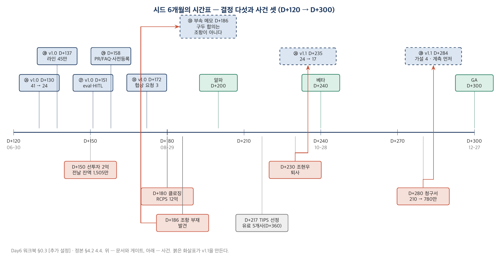

*그림 1-1. D+120에서 D+300까지. 위쪽은 다섯 문서의 v1.0(㉖ D+130 · ㉘ D+137 · ㉗ D+151 · ㉙ D+158 · ㉚ D+172)과 게이트(알파 D+200 · 베타 D+240 · GA D+300), 아래쪽은 사건 — 선투자 D+150, 클로징 D+180, 조항 부재 발견 D+186, 퇴사 D+230, 청구서 D+280. 사건에서 v1.1로 올라가는 화살표가 이 날의 구조다.*

### 딥게이지의 사례로 읽기

> ■ **사례 사실** — 시드 표(12명·RCPS 12억·24 → 17 mm·41 mm·첫 유료 3사·라인 45만)는 정본 §3.2; 사건 셋은 §4.2~4.4; 문서 작성일(D+130·137·151·158·172)과 v1.1 일자(D+235·284·186)는 Day6 워크북 §0.3 [추가 설정].

D+120의 딥게이지는 다섯 명이고 현금은 5,400만이다. 시드 협상 중이고, 노들투자파트너스의 선투자 2억이 D+150에 들어오지 않으면 D+156에 급여가 없다. 그 상태에서 D+126에 개발자 둘이 합류하고 D+130에 범위 결정서 v1.0이 쓰인다 — 백로그 41 mm, 가용 24 mm. **돈이 들어오기 전에 범위를 자른다.** 순서가 이상해 보이지만 옳다 — 시드 텀시트는 "무엇을 만들 것인가"를 묻고, 그 답이 41이면 심사역은 24를 묻는다.

D+137 가격(라인 45만), D+151 eval 명세, D+158 PR/FAQ·사전등록, D+172 텀시트 검토, D+180 클로징. 그리고 사건. D+186 조항 부재, D+230 퇴사, D+280 청구서. 각 사건이 ㉚·㉖·㉘을 v1.1로 만든다. 여러분은 오늘 v1.0을 쓰고, 사건을 받고, v1.1을 쓴다 — 세 번.

### 실무에서 어떻게 틀리는가

시드 단계의 첫 오류는 **네 결정을 하나로 합치는 것**이다 — "일단 만들고 가격은 나중에", "합격 기준은 고객이 만족하면". 범위·완료 정의·가격이 한 문서에 뭉개져 있으면 사건이 일어났을 때 어느 것이 틀렸는지 모른다. 청구서 780만이 범위의 오류(계측 미포함)인지 가격의 오류(라인 과금)인지 완료 정의의 오류(재촬영 = 수용 실패)인지 — 세 문서가 따로 있어야 세 가설이 생긴다.

두 번째 오류는 **자본을 PM의 결정 밖에 두는 것**이다. 텀시트는 대표가 서명하지만, 텀시트의 조건(TIPS 유료 5개사)은 범위를 자르고 가격을 누른다. 텀시트를 읽지 않은 PM은 왜 D+240에 세일즈가 라인 1개 계약을 받아 오려 하는지 모른다.

### 표준·문헌에서는

이 장의 지형은 1.4절에 모아 두었다. 한 줄로: 범위는 Singer(*Shape Up*), 검증은 Bryar & Carr(*Working Backwards*)와 Kohavi, 가격은 Skok과 a16z의 지표 정의, 자본은 Feld & Mendelson(*Venture Deals*), AI 완료 정의는 ISO/IEC 25010의 fit criterion 어휘와 Google *Rules of ML*. PMBOK 8판은 이 중 범위(Delivery 성과영역의 점진적 상세화)와 검증(Measurement)만 다룬다 — 가격·자본은 프로젝트 표준의 밖이다.

---

## 1.2 외부 시계 — 런웨이·클로징·TIPS

### 개념

프리시드의 시계는 하나였다 — 런웨이. 시드의 시계는 셋이다. **런웨이**(현금 ÷ 월 소진), **클로징**(돈이 실제로 들어오는 날 — 텀시트 서명일이 아니다), **조건부 자금의 마일스톤**(TIPS·정부 과제·매출 연동 대출의 조건). 세 시계는 서로 다른 속도로 가고, 제품 결정은 셋 모두의 아래에 있다.

> **작은 숫자로 먼저.** 현금 5,400만, 월 3,230만 → 런웨이 1.67개월 = 50일 → D+120 + 50 = **D+170에 0**. 선투자 2억이 D+150에 들어오면 → 2억 + (5,400 − 3,230) = 2.2억, 이때 월 3,900만(7명) → 5.6개월 → D+318. 시드 클로징 D+180이 그 전에 있으므로 산다. 선투자가 D+165로 밀리면? D+149 잔액 1,505만, D+156 급여일에 0. **15일이 회사의 수명이다.**

### 딥게이지의 사례로 읽기

> ■ **사례 사실** — D+120 현금 5,405만·D+149 잔액 1,505만·선투자 2억 D+150·초기창업패키지 1억 D+165·클로징 D+179·TIPS 선정 D+217(1차년도 5억)·D+300 현금 15.4억은 Day6 워크북 §0.3과 day6_seed.py [추가 설정 — G-15 D+300 15.4억/22개월에 맞춤]; TIPS 조건은 정본 §3.2.

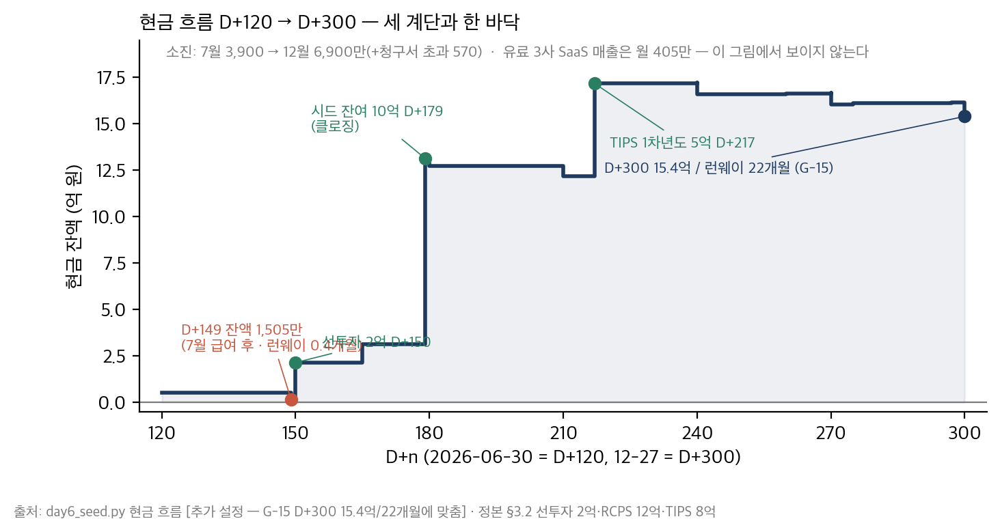

*그림 1-2. D+149의 1,505만이 이 그림의 바닥이다. 선투자 2억(D+150)·시드 잔여 10억(D+179)·TIPS 1차년도 5억(D+217)의 세 계단과 그 사이의 소진. 오른쪽 끝 15.4억 / 22개월(G-15). 첫 유료 3사의 SaaS 매출(월 405만)은 이 그림에서 보이지 않는다 — 시드 단계의 현금은 매출이 아니라 자본이다.*

TIPS는 세 번째 시계다. 운영사 추천 조건이 "2027-02(D+360)까지 유료 5개사"[추가 설정]이고, 이 조건이 ㉖의 Appetite(D+300 GA — 5개사가 쓸 제품이 있어야 한다)와 ㉘의 최소 계약(라인 2 · 12개월 — 5개사를 채우려고 라인 1개를 받고 싶어진다)을 누른다. 5.5절에서 다시 본다.

### 실무에서 어떻게 틀리는가

텀시트 서명일을 클로징으로 착각한다 — 서명 D+172, 클로징 D+179, 그 사이 급여일이 있다. 조건부 자금의 조건을 대표만 알고 PM이 모른다. 런웨이를 3명 기준으로 한 번만 계산한다(Day5 ㉑ 항목 8의 두 번 계산이 여기서 시험받는다).

### 표준·문헌에서는

런웨이·burn의 정의는 a16z "16 Startup Metrics"(2015)와 Bessemer의 *State of the Cloud* 연례 보고서의 어휘를 따른다. burn multiple(순소진 ÷ 순증 ARR)은 Sacks(2020)가 제안했고, 딥게이지 D+300의 4.26(G-13)은 시드 단계로는 정상 범위의 상단이다 — 분모(분기 순증 ARR 4,860만)가 작아서다. 6.4절.

---

## 1.3 문서가 두 번 쓰이는 이유 — v1.0, 사건, v1.1

### 개념

PM 트랙 Day3에서 변경요청서(⑪)를 배웠다 — 기준선이 있어야 변경이 있다. 시드 단계의 문서도 같다. v1.0이 기준선이고 사건이 변경 요청이며 v1.1이 승인된 변경이다. 차이는 **변경 요청을 자기 자신에게 낸다**는 것 — 발주자가 없다.

v1.0을 사건 **전에** 적어 두는 이유는 Day5 3.4절(사전등록)과 같다. 사건 뒤에 처음 적으면 그 문서는 사건을 설명하는 문서가 되고, 사건 전에 적어 두면 그 문서는 사건이 무엇을 바꿨는지 **재는** 문서가 된다. 조현우가 떠난 뒤 처음 쓴 범위 결정서는 "17 mm로 이것만 한다"이고, D+130의 v1.0이 있는 상태에서 쓴 v1.1은 "24에서 17로 — 손실 7.0은 이렇게 분해된다"이다. 두 번째 문서만 재발 방지 규칙("고객 요청 항목은 이 표를 거친다")을 낳는다.

### 딥게이지의 사례로 읽기

> ■ **사례 사실** — 세 사건과 세 v1.1: ㉚ D+186(조항 부재, 정본 §4.2) · ㉖ D+235(퇴사 D+230, §4.3) · ㉘ D+284(청구서 D+280, §4.4). 워크북 §1.5·§3.5·§5.5.

| 사건 | 문서 | v1.0이 있어서 알 수 있는 것 | v1.0이 없었다면 |
|---|---|---|---|
| D+186 옵션풀 조항 부재 | ㉚ | 협상 요청 1번이 있었고 구두 합의됐고 문서에 없다 — **문서화 실패** | "시드에서는 원래 안 정한다"는 설명 |
| D+230 조현우 퇴사 | ㉖ | 손실 7.0 중 2.2만 퇴사, 4.8은 그 전에 새어 나갔다 — 태산정밀 커스텀이 계획 외였다 | "개발자가 나가서 7 줄었다" |
| D+280 청구서 780만 | ㉘ | 원가 정렬을 M으로 **알고** 골랐고 계측을 넣지 않았다 — 가설 4를 판별할 수 없다 | "재촬영 때문" — 정본을 읽은 사람의 답 |

### 실무에서 어떻게 틀리는가

v1.0을 안 쓰고 v1.1만 쓴다(사후 설명). v1.1을 쓰면서 v1.0을 덮어쓴다(무엇이 바뀌었는지 사라진다). 사건 하나에 문서 전부를 고친다(청구서가 왔다고 범위 결정서를 고치면 가격의 문제가 범위의 문제로 둔갑한다).

### 표준·문헌에서는

PMBOK 8판의 변경 통제와 PRINCE2의 예외 관리가 이 절의 원형이다 — 기준선·허용 한계·예외 보고. 프로덕트 문헌에서는 Ries(2011)의 "피벗 또는 유지" 결정이 같은 자리에 있다: 피벗은 가설 하나를 바꾸는 것이지 전부를 바꾸는 것이 아니다.

---

## 1.4 표준·문헌의 지형 — Singer, Bryar & Carr, Kohavi, Skok, Feld (심화)

### 지형

| 질문 | 답하는 문헌 | 오늘의 절 | 한 줄 |
|---|---|---|---|
| 얼마나 만들 것인가 | Singer, *Shape Up* (2019) | 2.1~2.4 | appetite는 기간이다. 회로 차단기 |
| 무엇을 먼저 자를 것인가 | DSDM MoSCoW (Clegg & Barker, 1994) | 2.2 | Must ≤ 60%의 관행 |
| 언제 "된 것"인가(AI) | ISO/IEC 25010 · Google *Rules of ML* · Shankar 외(2024) | 3.1~3.4 | fit criterion · 지표 먼저 · criteria drift |
| 틀리는 양을 얼마까지 | SRE(Beyer 외, 2016) error budget · ISO/IEC 42001 | 3.5~3.6 | 예산과 소진 시 정책 · 인간 감독 |
| 출시일에 무엇을 말할 것인가 | Bryar & Carr, *Working Backwards* (2021) | 2.6~2.7 | PR/FAQ — 내부 FAQ가 본체 |
| 실험을 믿을 수 있는가 | Kohavi, Tang & Xu (2020) · Nosek 외(2018) | 2.8 | OEC·SRM·peeking·사전등록 |
| 무엇에 과금하는가 | Croll & Yoskovitz(2013) · Moore(2014) whole product | 4.1~4.2 | 밸류메트릭 · 포함/제외 |
| ARR이란 무엇인가 | Skok "SaaS Metrics 2.0" · a16z "16 Startup Metrics" · Sacks(2020) burn multiple | 4.4, 6.4 | bookings ≠ ARR |
| 텀시트의 단어는 얼마인가 | Feld & Mendelson, *Venture Deals* (4판, 2019) · YC SAFE 표준 문서 · Wasserman(2012) | 5.1~5.6 | economics vs control · 옵션풀 위치 |

세 문헌이 서로 다투는 지점이 하나 있다. Shape Up은 **견적을 하지 않는다**(appetite만) — MoSCoW는 견적 위에서 Must 비율을 잰다. 오늘의 ㉖은 둘을 섞어 쓴다: 기간은 appetite로 고정하고, 백로그에는 견적을 받아 Must 비율로 자른다. 순수주의자는 둘 다 불만이겠지만, 시드 단계에서 "6개월 안에 유료 5개사가 쓸 것"을 정하려면 견적 없는 appetite만으로는 41과 24의 차이를 볼 수 없고, appetite 없는 견적만으로는 기간이 늘어난다.

### 실무에서 어떻게 틀리는가

Shape Up의 "6주 사이클"을 그대로 가져온다(Basecamp의 팀 크기·제품 성숙도 전제). MoSCoW의 60%를 "Must는 60%면 된다"로 읽는다(상한이지 목표가 아니다). Kohavi의 A/B 테스트 표본 계산을 고객 3사에 적용하려 한다(2.8절 — 전수라고 적는다).

---

## 제1장 핵심 정리

> **한 줄씩 — 수업 직전 5분 복습용**
> 1. 시드의 결정은 범위·완료 정의·가격·검증·자본 다섯이고, 전부 되돌리는 비용이 크다 — 그래서 숫자와 서명이 많다.
> 2. 시계가 셋이다 — 런웨이·클로징·조건부 자금. D+149의 1,505만이 바닥이고, 15일이 수명이었다.
> 3. 돈이 들어오기 전에 범위를 자른다 — 텀시트는 "무엇을 만들 것인가"를 묻고, 41이면 24를 묻는다.
> 4. 문서는 두 번 쓰인다 — v1.0을 사건 전에 적어야 v1.1이 사후 설명이 아니라 측정이 된다.
> 5. 세 사건이 세 문서를 고친다 — 조항 부재는 ㉚, 퇴사는 ㉖, 청구서는 ㉘. 사건 하나에 전부를 고치지 않는다.
> 6. 문헌은 다툰다 — appetite(기간)와 MoSCoW(견적)를 섞어 쓰는 이유를 알고 쓴다.
>
> 아래는 같은 내용의 자세한 판이다.

1. 프리시드가 발견의 단계였다면 시드는 범위·가격의 단계이고, AI 제품에는 완료 정의가, 모든 회사에는 자본이 붙는다. 다섯 결정은 각각 문서 하나(㉖~㉚)이고, 되돌리는 비용이 6개월·사고·청구서·다음 라운드다.
2. 런웨이 산수는 두 번 이상 한다 — 인원이 바뀔 때마다. 클로징은 서명일이 아니다. 조건부 자금의 조건(유료 5개사)은 대표의 것이 아니라 제품의 것이다 — 범위와 가격을 누른다.
3. 범위 결정서 v1.0(D+130)은 클로징(D+180) 전에 쓰였다. 투자자에게 "24"를 말할 수 있어야 하고, 그 24가 트리(㉓)의 잎에서 왔다고 말할 수 있어야 한다.
4. v1.0 → 사건 → v1.1의 구조는 Day3 변경 통제의 자기 적용이다. 발주자가 없으므로 CR을 자기에게 낸다. v1.0이 없으면 손실 7.0을 분해할 수 없고, 분해 없이는 재발 방지 규칙이 없다.
5. 세 사건은 세 가지 다른 오류다 — 문서화 실패(㉚), 계획 외 착수(㉖), 계측 미포함(㉘). 하나로 뭉개면 원인이 사라진다.
6. Shape Up(기간)·MoSCoW(견적)·Kohavi(실험)·Skok(지표)·Feld(텀시트)는 각각 질문 하나에 답한다. 어느 하나를 정전으로 삼지 않는다.

## 생각해 볼 질문

1. 여러분 회사의 "이번 분기 범위"는 기간이 고정인가 범위가 고정인가? 둘 다 고정이면 무엇이 변수인가?
2. 시드 단계의 다섯 결정 중 여러분의 직무에서 결정권이 있는 것은 몇 개인가? 없는 것은 누가 결정하며, 그 결정을 여러분은 언제 아는가?
3. D+149의 1,505만은 누가 알고 있었는가? PM이 그 숫자를 몰랐다면 D+130의 범위 결정서는 무엇이 달랐을까?
4. 여러분이 최근에 쓴 문서 중 "사건 뒤에 처음 쓴" 문서를 하나 골라 보라. 사건 전 판본이 있었다면 무엇을 더 알 수 있었는가?

## 워크북 연결

이 장은 Day6 워크북 **§0**(시점 고정·분모 선언·Day5에서 가져오는 것)과 다섯 산출물의 **항목 1**(문서 정보 — 버전·기준일·v1.0/v1.1)에 대응한다. 1.2절의 현금 산수는 ㉚ 항목 5(BATNA — 잔액 1,505만)와 ㉖ 항목 1(외부 시계)에서 쓴다. 심화 과제(3~7년차): 자기 회사의 현재 분기 계획 문서에서 v1.0(사건 전 판본)이 있는지 확인하고, 없으면 지금 그 문서의 "기준선" 판본을 날짜와 함께 저장하라.

---

# 제2장 범위 — Appetite·절단·Won't, 그리고 결과 전에 쓰는 글

## 2.1 Appetite — 기간을 고정한다

### 개념

프로젝트의 범위 관리는 범위를 고정하고 기간과 원가를 추정한다(Day2). 그 반대가 있다 — **기간을 고정하고 범위를 변수로 두는 것**. Singer의 *Shape Up*(2019)은 그것을 appetite라고 부른다: "이 문제에 얼마나 쓸 것인가"의 시간. 6주, 또는 6개월. 기간이 끝나면 남은 것은 다음 사이클로 가고, 그 규칙을 회로 차단기(circuit breaker)라 부른다.

이 어휘를 정확히 쓰는 것이 이 절의 전부다. **Appetite는 기간이지 범위가 아니고, 견적이 아니다.** "우리 appetite는 24 man-month"는 틀린 문장이다 — 24는 가용 공수(4명 × 6개월)이고, appetite는 6개월이다. "우리 appetite는 사진·음성 → 검사기록 + 부적합 패키지"도 틀린 문장이다 — 그것은 범위다. 이 구별이 왜 중요한가. 기간이 고정이면 사건이 일어났을 때(개발자 퇴사) 줄어드는 것은 **범위**다. 범위가 고정이면 늘어나는 것은 기간이고, 시드 단계의 기간은 런웨이와 TIPS 시계 아래에 있다.

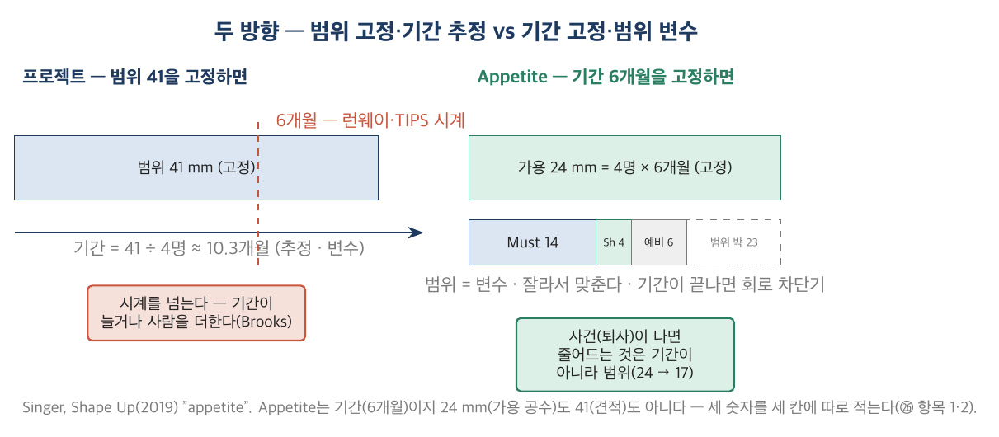

*그림 2-1. 왼쪽: 범위(41)를 고정하고 기간을 추정하면 10개월 — 런웨이·TIPS 시계를 넘는다. 오른쪽: 기간(6개월)을 고정하면 가용 24 안에서 범위를 자른다 — 기간이 끝나면 회로 차단기. 가운데 예비 25%는 어느 쪽에서도 기능이 아니다.*

### 딥게이지의 사례로 읽기

> ■ **사례 사실** — 가용 공수 24 = 4명 × 6개월(G-37), 백로그 41 mm(G-38), Appetite D+120~300은 정본 §3.2와 워크북 §1.5 항목 1; 개발 4명(오세진·김태오·조현우·서하늘)은 [추가 설정].

㉖ 항목 1의 Appetite 칸에 "6개월 — D+120 ~ D+300, GA 12-27"이라고만 적혀 있는 이유다. 24 mm는 그 아래 가용 공수 칸에 근거(누가 몇 개월)와 함께 있다. 견적 41은 항목 2에 있다. 세 숫자가 세 칸에 따로 있어야 v1.1에서 "기간은 그대로, 가용은 17, 범위는 이렇게"가 된다. 그리고 CTO 오세진을 가용 공수에 100%로 넣었다 — v1.1의 손실 분해에 "eval 도구는 CTO가 직접"이 나오는 이유가 여기 있다. CTO는 처음부터 100%가 아니었다.

### 실무에서 어떻게 틀리는가

Appetite 칸에 기능 목록을 쓴다(범위 고정). 6주 사이클을 그대로 가져온다(Basecamp의 전제 — 성숙한 제품, 작은 팀). 회로 차단기를 안 둔다 — 기간이 끝나도 "거의 다 됐으니" 2주 연장하고, 그 2주가 두 번 반복된다. 예비를 0으로 두어 첫 버그가 범위를 먹는다.

### 표준·문헌에서는

Singer(2019) Part 1 "Shaping"·Part 2 "Betting"이 원전이다(무료 공개). PMBOK 8판의 Delivery 성과영역은 "점진적 상세화"를 말하지만 기간 고정의 어휘는 없다 — 그 자리는 애자일의 타임박스(스프린트)가 차지하며, appetite는 타임박스를 사이클 단위로 키운 것이다. 6.1절.

---

## 2.2 견적과 절단 — 41 → 24

### 개념

견적은 개발자가 내고 PM은 깎지 않는다 — 깎는 것은 **범위**다. 이 원칙이 무너지면 견적표가 협상 문서가 되고, 6개월 뒤 "견적이 틀렸다"와 "범위가 컸다"를 구별할 수 없다.

절단의 도구는 MoSCoW(Must / Should / Could / Won't)와 **Must 공수 비중의 상한**이다. DSDM의 관행은 Must ≤ 60% — 나머지 40%는 Should·Could와 예비(버그·온보딩·지원)다. 상한의 용도는 "무엇을 Must에서 빼는가"를 묻는 것이 아니라 **"Must 항목의 정의를 어디까지 줄이는가"**를 묻는 것이다. 항목을 빼지 않고 정의를 줄이는 동작 — "포털 자동 제출"을 "규격 파일 내보내기"로 — 이 절단의 실제 기술이다.

> **작은 숫자로 먼저.** 가용 24. 예비 25% = 6.0 고정. Must 상한 60% = 14.4. Should ≤ 나머지 = 3.6. 견적을 받아 Must를 표시하니 15.5 (64.6%) — 초과. Must 항목의 정의를 줄인다: 음성 "문장 생성" → "변환만"(1.5 → 0.5), eval 도구 1.0 → 0.5. Must 14.0 (58.3%) ✓. Should 4.0(16.7% — 0.4 초과 허용). 합 24.0. **범위 밖: Could 12.0 · Won't 11.0 = 23.0.** 41 − 24 = 17이 아니라 41 − 18 = 23이 백로그 밖으로 나갔다 — 예비 6은 백로그 항목이 아니다.

### 딥게이지의 사례로 읽기

> ■ **사례 사실** — 백로그 29건·41.0 mm·MoSCoW 14/4/12/11·Must 첫 안 15.5 → 14.0은 워크북 §1.5 항목 2·3 [추가 설정 — G-38]; 상위 노드 없는 항목 6건(고객 요청 4·기반 1·㉗ 1).

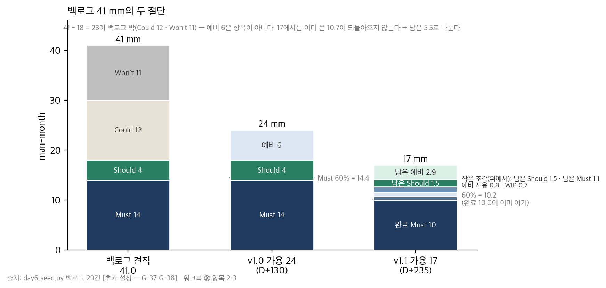

*그림 2-2. 왼쪽 막대가 41(Must 14 · Should 4 · Could 12 · Won't 11), 가운데가 v1.0의 24(Must 14 · Should 4 · 예비 6), 오른쪽이 v1.1의 17(완료 10.0 · WIP 0.7 · 예비 사용 0.8 · 남은 5.5 = Must 1.1 · Should 1.5 · 예비 2.9). 회색 점선이 Must 60% 상한. 오른쪽 막대에서 상한이 "깨지는" 이유는 2.4절.*

백로그 29건 중 상위 노드가 트리(㉓)의 잎이 아닌 것이 여섯이다 — 고객 요청 넷(B-20 태산정밀 62항목·B-21 MES·B-27 SSO·B-29 내보내기), 기반 하나(B-24 권한·과금), ㉗ 하나(B-25 eval 도구). 절단의 첫 질문은 "이 여섯은 어디서 왔는가"다. 기반과 eval 도구는 만들어야 한다(Must). 고객 요청 넷은 Could·Won't다 — 그런데 그중 하나(B-20)가 v1.1에서 2.2 mm를 먹는다. 2.4절.

### 실무에서 어떻게 틀리는가

PM이 견적을 깎는다("3.0은 너무 많아요, 2.0으로"). 견적표를 PM 혼자 만든다. Must에 모든 것을 넣고 60%를 "목표"로 읽는다. 항목을 빼는 것만 절단이라고 생각해 정의 축소를 모른다. 상위 노드 열을 비워 고객 요청과 트리의 잎이 섞인다.

### 표준·문헌에서는

MoSCoW는 Clegg & Barker(1994, DSDM)에서 왔고 60% 상한은 DSDM Agile Project Framework의 관행이다(표준 조항이 아니라 권고). Shape Up은 견적을 거부한다 — 그러나 "scope hammering"(범위를 두드려 줄이기)이라는 이름으로 정의 축소를 가장 정확히 기술한다. PMBOK 8판의 범위 기준선·WBS(Day2)는 100%를 분해하는 도구이고, 오늘은 100%를 정하는 도구다 — 방향이 반대다(Day5 서문의 표).

---

## 2.3 Won't — "나중에"가 아니다

### 개념

MoSCoW의 W는 "Won't have this time"이다 — 이번에는 만들지 않는다. 그런데 실무에서 이 칸은 "Later"로 읽히고, Later는 고객이 물을 때마다 다시 논의되며, 논의될 때마다 조금씩 만들어진다. Won't를 Won't로 유지하는 유일한 방법은 **재검토 조건**을 적는 것이다 — 측정 가능한 사건("유료 5개사 달성", "1차사 채널 계약 서명"). "고객이 원하면"은 조건이 아니다. 고객은 항상 원한다.

Day5 ㉕ 항목 6 "무엇을 하지 않는가"가 Won't의 원문이다. 거기 적은 재검토 조건과 ㉖ 항목 5의 재검토 조건은 **같은 문장**이어야 한다. 다르면 세일즈는 두 문장 중 고객에게 유리한 쪽을 말한다.

### 딥게이지의 사례로 읽기

> ■ **사례 사실** — Won't 3건 11.0 mm(B-17 자동판정 2.0 · B-18 온프렘 6.0 · B-21 MES 3.0)와 재검토 조건, v1.1 추가 B-22, 규칙 "고객 요청 항목은 이 표를 거친다"는 워크북 §1.5 항목 5; ㉕ 항목 6-1 "유료 5개사 후 또는 1차사 채널 계약 시"는 Day5 워크북 §5.5.

온프렘(B-18, 6.0 mm)의 재검토 조건은 "유료 5개사 달성 **또는** 1차사 채널 계약 서명" — Day5 ㉕와 같은 문장이다. 자동판정(B-17)의 재검토 조건은 ㉗의 합격 기준 충족 **그리고** X-04 회피 행동 < 10% — 두 문서를 잇는다. 그리고 v1.1에 규칙 두 줄이 추가됐다: "고객 요청 항목은 이 표를 거친다"와 "Won't를 '검토 중'이라 답하지 않는다". 첫 줄은 B-20의 재발 방지이고, 둘째 줄은 세일즈 스크립트다. 가격표(㉘ 항목 7)의 제외 칸이 이 목록의 공개판이다.

동보프레스는 Won't의 경계를 시험한 사례다. 온프렘을 요구했고(Day5 X-03), 온프렘은 Won't였다. D+200에 "도면 미업로드 모드"(B-19, 0.5 mm)로 계약이 됐다 — 온프렘 요구의 일부는 온프렘이 아니라 **도면**의 문제였다(김도윤). Won't를 지키면서 요구의 실체를 쪼갠 것이다. 그것은 이 문서를 거쳤다(조건·공수·승인 기록). B-20은 거치지 않았다.

### 실무에서 어떻게 틀리는가

Won't 칸에 "Later"·"Phase 2"를 쓴다. 재검토 조건이 "시장 상황에 따라". Won't를 문서에 적고 세일즈에는 안 알린다. 온프렘 같은 큰 Won't는 지키면서 62항목 같은 작은 Could는 "금방 되니까" 만든다 — 작은 것이 새는 곳이다.

### 표준·문헌에서는

PM 트랙 ⑥의 "제외 범위(out of scope)"가 발주자 쪽 거울이다 — 발주자는 제외 범위를 받았고, 공급자는 정한다. Cagan(2018)의 "제품 발견 vs 인도" 구분에서 Won't는 발견이 끝나지 않은 것을 인도하지 않는다는 규율이다. Rumelt(2011)의 커널(Day5 4.2절)에서 "하지 않는 것"이 전략의 절반이라는 문장이 이 절의 배경이다.

---

## 2.4 두 번째 절단 — 24 → 17

### 개념

가용 공수가 줄었을 때 첫 번째 할 일은 다시 자르는 것이 아니라 **손실을 분해하는 것**이다. "개발자가 나가서 7이 줄었다"는 분해가 아니다. 개발자의 잔여 기간은 얼마이고, 나머지는 어디로 갔는가 — 계획 외 착수, 재작업, 폐기된 진행 중 작업, 채용·인수인계. 분해가 없으면 대응은 "채용"뿐이고, 분해가 있으면 대응은 규칙이 된다.

두 번째로, **이미 쓴 공수는 되돌릴 수 없다.** 24 기준의 산식(Must ÷ 가용 ≤ 60%)을 17에 그대로 적용하면 초과가 나오지만 그 초과는 되돌릴 수 없는 것을 포함한다. 그래서 두 번째 산식은 분모를 바꾼다 — **남은 공수**에 대해 Must·Should·예비를 나눈다. 비례 축소(24 × 17/24)는 틀린 답이다: 이미 쓴 10.7은 비례하지 않는다.

> **작은 숫자로 먼저.** 24 − 17 = 7.0 손실. 조현우 잔여 2.17개월 × 1명 = 2.2. 나머지 4.8은? 태산정밀 62항목 2.2(Could였는데 착수) + 인수인계·채용 1.0 + 조현우 WIP 폐기 0.7 + B-02 조도 재작업 초과 0.9 = 4.8 ✓. **퇴사가 원인인 것은 7.0 중 2.2 + 1.0 + 0.7 = 3.9. 나머지 3.1은 퇴사 전에 새어 나갔다.** 남은 공수: 17 − 완료 10.0 − WIP 0.7 − 예비 사용 0.8 = **5.5**. 남은 Must 4.0 + Should 4.0 = 8.0 > 5.5 → 정의 축소(B-08 1.5 → 0.4, B-10 1.5 → 0.5, B-25 → 0) + 이동(B-22 → Won't, B-26 → Could) + 축소(B-14 1.5 → 1.0) → Must 1.1 · Should 1.5 · 예비 2.9 = 5.5 ✓.

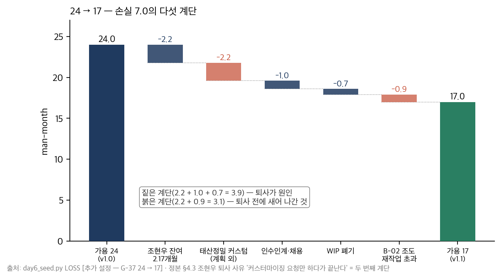

*그림 2-3. 24에서 17로 내려가는 다섯 계단. 어두운 세 계단(조현우 잔여 2.2 · 인수인계·채용 1.0 · WIP 폐기 0.7)은 퇴사가 원인이고, 밝은 두 계단(태산정밀 커스텀 2.2 · 조도 재작업 0.9)은 퇴사 전의 일이다. 두 번째 계단이 조현우의 퇴사 사유("커스터마이징 요청만 하다가 끝난다")와 같은 항목이다.*

### 딥게이지의 사례로 읽기

> ■ **사례 사실** — 조현우 퇴사 D+230과 사유는 정본 §4.3, 24 → 17은 G-37; 손실 분해 다섯 줄·D+235 상태·남은 5.5의 배분은 워크북 §1.5 항목 3·4 [추가 설정]; CPO 거부권은 Day5 ㉑ 항목 5.

손실 분해의 두 번째 줄 — 태산정밀 62항목 2.2 mm — 는 조현우의 퇴사 사유와 같은 항목이다. 그 요청을 받은 사람은 CPO 윤하경이었다. ㉑ 항목 5에서 CPO에게 준 "범위 절단 거부권 분기 1회"는 이번에도 행사되지 않았다 — 거부권은 절단을 막는 권한이었지 계획 외 착수를 막는 권한이 아니었기 때문이다. v1.1의 규칙("고객 요청 항목은 이 표를 거친다")이 그 빈자리를 채운다. 그리고 정본 §1.2가 윤하경에 대해 적은 문장 — "요구사항 정리자로 취급되는 것을 견디지 못한다" — 이 여기서 첫 번째로 시험받았다. 두 번째 시험은 Day8이다.

24 기준 Must 58.3%였던 산식이 17 기준으로 69.4%가 되는 것은 산식이 깨진 것이 아니라 분모를 바꿔야 한다는 신호다. 워크북 예시본이 "남은 5.5: Must 1.1(20%) · Should 1.5(27%) · 예비 2.9(53%)"로 적은 이유다. 예비가 절반인 것은 GA까지 온보딩 3사와 버그가 남았기 때문이고, 그것이 회로 차단기가 GA를 태우지 않게 하는 방법이다.

### 실무에서 어떻게 틀리는가

손실을 한 줄로 적는다. 비례 축소한다. 남은 공수가 아니라 총량에 산식을 적용해 "초과"만 확인하고 끝낸다. 퇴사 후 첫 대응이 채용이다(채용은 인수인계·면접으로 남은 공수를 더 먹는다 — 손실 분해 셋째 줄). 계획 외 착수를 "고객 대응"이라 부르며 표에 안 적는다.

### 표준·문헌에서는

PMBOK의 자원 관리는 가용 자원의 재산정을 말하지만 손실 분해의 형식은 없다. EVM(Day3)의 문법을 빌리면 이것은 "남은 작업의 재추정(ETC)"이며, EAC = AC + ETC의 논리 — 쓴 것은 쓴 것 — 가 여기서 그대로 쓰인다. Brooks(*The Mythical Man-Month*, 1975)의 "늦은 프로젝트에 사람을 더하면 더 늦어진다"가 셋째 줄(인수인계·채용 1.0)의 원전이다.

---

## 2.5 게이트와 베타 진입 기준

### 개념

알파·베타·GA는 날짜가 아니라 **진입 기준**이다. 날짜는 목표이고 기준은 숫자이며, 판정자는 한 사람이다. 그리고 기준은 두 문서(㉖ 항목 7과 ㉙ 항목 5)에 **같은 숫자**로 있어야 한다 — 한쪽에서 복사한다. 두 곳에 따로 쓰면 갈린다.

게이트에 하나 더 붙는 것이 **되돌림 조건**이다. 게이트는 대개 앞으로만 열린다. GA 뒤에 오류 예산이 소진돼도 "이미 출시했으니"가 된다. 되돌림 조건(어떤 숫자가 나오면 이전 단계로)이 없는 GA는 일방통행이다.

### 딥게이지의 사례로 읽기

> ■ **사례 사실** — 알파 D+200 / 베타 D+240 / GA D+300의 진입 기준·판정자·되돌림 조건은 워크북 §1.5 항목 7과 §4.5 항목 5 [추가 설정]; 기록 시간 ≤ 25분은 Day5 X-01 성공 기준의 재현.

GA 기준에 "초안 미합격 시 '합격 전 베타' 표시"가 있는 것이 이 게이트의 특징이다. eval v1 측정(D+270)이 FN 8.1%로 기준(8.0%)을 넘길 때, 기준을 고치지 않고 배포 조건을 낮추는 길을 **미리** 열어 둔 것이다. 3.4절. 되돌림 조건 — 오류 예산 2개월 연속 소진 또는 3사 중 2사 해지 통지 — 는 ㉗ 항목 5의 소진 시 조치가 라인 단위라면 이것은 제품 단위라는 차이다.

### 실무에서 어떻게 틀리는가

게이트 기준이 날짜뿐이다. 판정자가 "팀". ㉖과 ㉙의 숫자가 다르다. 되돌림 조건이 없다. 베타 기준에 "고객 만족"처럼 측정 불가능한 것을 넣는다.

### 표준·문헌에서는

PM 트랙 ⑯ SAC(서비스 인수 기준)와 Day4 2.2절의 go/no-go 게이트가 발주자 쪽 거울이다 — 인수 기준을 받았던 사람이 오늘 진입 기준을 쓴다. Singer(2019) "Decide When to Ship"의 요점은 게이트 판정자가 한 사람이어야 한다는 것이다.

---

## 2.6 Working Backwards — 출시일의 글을 먼저 쓴다

### 개념

Amazon의 PR/FAQ(Bryar & Carr, *Working Backwards*, 2021)는 출시일에 낼 보도자료를 **기획 시점에** 쓰는 것이다. 요점은 글을 잘 쓰는 것이 아니라 **쓰다가 막히는 곳을 찾는 것**이다 — "고객은 이제 ___할 수 있다"에서 빈칸을 채울 수 없으면 그 제품은 아직 결정되지 않은 것이다. 기능 목록이 아니라 고객의 변화를 쓴다. 제목에 고객과 숫자가 있어야 한다.

이것이 시드 단계의 범위 결정서(㉖) 옆에 있는 이유는 하나다. 6개월 뒤에 낼 글을 지금 쓰면, ㉖에서 잘라 낸 것이 정말 없어도 되는지 **문장으로** 확인된다. 잘라 낸 것이 보도자료에 필요하면 잘못 잘랐거나 보도자료가 과장이다.

### 딥게이지의 사례로 읽기

> ■ **사례 사실** — 보도자료 8칸(제목 "안산 세영정공, 검사기록 작성 하루 47분 → 19분")은 워크북 §4.5 항목 1 [추가 설정]; 47 → 19분은 Day5 X-01; 47분·3.7일·11.5시간·2,700만은 정본 G-33~36.

D+158에 쓴 보도자료의 두 문장이 그 시점에 참이 아니다 — "부적합 통보 1영업일 이내"(X-01은 기록 시간만 쟀다)와 "3개사 도입"(유료 0). 예시본은 그 두 문장을 지우지 않고 내부 FAQ 15번("이 보도자료에서 아직 참이 아닌 문장은?")에 적어 두었다. D+300 전에 참이 되거나 문장이 빠진다. 그것이 Working Backwards가 ㉖ 항목 8(리스크 → 실험)과 만나는 지점이다.

### 실무에서 어떻게 틀리는가

제목이 제품명이다. 해법 칸이 기능 목록이다. 고객 인용이 광고 문구다("혁신적인 솔루션"). 보도자료를 마케팅에 넘긴다(기획 문서다). 막히는 문장을 지우고 매끄럽게 만든다 — 막히는 곳이 정보다.

### 표준·문헌에서는

Bryar & Carr(2021) 4장. PM 트랙에는 대응물이 없다 — 프로젝트는 요구사항이 주어지므로 출시일의 글이 필요 없다. 가장 가까운 것은 Day1의 비즈니스 케이스(①)의 "편익 문장"이다.

---

## 2.7 내부 FAQ — "미확정"이 답이다

### 개념

PR/FAQ의 본체는 보도자료가 아니라 **내부 FAQ**다 — 무엇이 어렵나, 왜 지금인가, 무엇을 안 하나, 단가와 원가, 실패하면 어떻게 아나. 그리고 이 문서의 규율은 하나다: **답할 수 없는 질문에는 "미확정 — 실험 X-nn"이라고 적는다.** 15문 전부에 답이 있는 내부 FAQ는 어려운 질문을 뺐거나 모르는 것을 아는 척한 것이다.

Day5 ㉔의 "미확정 — 실험 X-nn" 문법이 여기서 문서 하나로 커진다. 미확정이 셋 이상이면 정상이고, 미확정마다 실험 ID(또는 "관찰만")가 붙어야 한다.

### 딥게이지의 사례로 읽기

> ■ **사례 사실** — 내부 FAQ 15문과 미확정 4(X-04·X-05·X-07·관찰만)는 워크북 §4.5 항목 3 [추가 설정]; ㉖ 항목 8 리스크 5와 대응.

예시본의 미확정 넷은 ㉖ 항목 8의 리스크 다섯과 일치한다 — 검사원이 초안을 수용하는가(X-04), 공장이 라인 과금을 받아들이는가(X-05), 조도 경고가 재촬영을 줄이는가(X-07), 유료 5개사(관찰만 — 실험이 아니라 세일즈). 네 번째 질문("단가 45만은 원가를 감당하는가")의 답은 절반이 미확정이다 — "헤비 고객이 몇 곳인지는 미확정 — 계측 없음". D+284에 그 문장이 청구서로 돌아온다.

### 실무에서 어떻게 틀리는가

15문 전부에 답이 있다. 어려운 질문(FN 8.1%, 청구서, 조현우 이후)을 뺀다. 미확정에 실험 ID가 없다. 내부 FAQ를 투자자용으로 다듬는다(그 순간 미확정이 사라진다).

### 표준·문헌에서는

Bryar & Carr(2021)는 내부 FAQ를 "가장 어려운 질문을 스스로에게"라고 쓴다. Ries(2011)의 "검증된 학습"과 Blank의 customer development에서 "모른다"를 적는 것은 학습 회계의 시작이다.

---

## 2.8 사전등록 — OEC·표본·분석 시점·peeking

### 개념

Day5 실험 카드의 확장판이다. 네 가지가 추가된다. **OEC**(overall evaluation criterion) — 판정 지표 하나. 두 지표면 "그리고"로 묶어 하나의 판정으로. **최소 표본과 그 근거** — 효과 크기·유의수준·검정력으로 계산하고, 계산할 수 없으면(모집단이 3) "전수"라고 적는다. **분석 시점** — 날짜로 고정하고 중간에 보지 않는다(peeking 금지: 중간에 보고 유의하면 멈추는 것은 오류율을 몇 배로 올린다). **SRM**(sample ratio mismatch) — 두 집단의 표본 비율이 설계와 다르면 판정하지 않는다.

> **작은 숫자로 먼저.** X-07: 오후 재촬영률 18% → 8%를 검출. 두 비율 검정, α .05 양측(z 1.96), 검정력 .8(z 0.84). n = [1.96·√(2·0.13·0.87) + 0.84·√(0.18·0.82 + 0.08·0.92)]² ÷ (0.18 − 0.08)² = (0.932 + 0.395)² ÷ 0.01 = **177/arm**. 효과 크기를 18 → 12%로 줄이면 분모가 0.0036이 되어 표본은 약 2.8배(≈ 500/arm). 효과가 작을수록 표본이 제곱으로 는다.

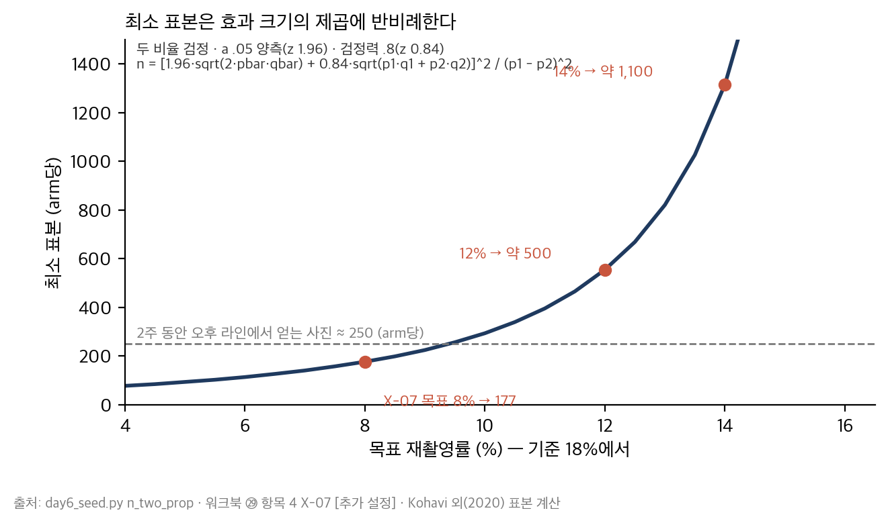

*그림 2-4. 기준 18%에서 목표 재촬영률을 낮출수록 필요한 표본(arm당). 8%(X-07)에서 177, 12%에서 약 500, 14%에서 약 1,100. 오른쪽 점선은 두 주 동안 오후 라인에서 얻을 수 있는 사진 수(약 250) — 12% 이하의 효과는 이 기간에 검출할 수 없다. 사전등록은 "무엇을 검출할 수 없는가"를 먼저 적는 일이다.*

### 딥게이지의 사례로 읽기

> ■ **사례 사실** — 사전등록 4건(X-04 판정 초안 베타 · X-05 라인 과금 · X-06 온보딩 · X-07 조도 경고)의 OEC·표본·분석 시점·중단 기준은 워크북 §4.5 항목 4 [추가 설정]; X-07 표본 177/arm은 day6_seed.py.

X-04의 OEC는 "수용률 ≥ 70% **그리고** 회피 행동 < 10%"다. Day5 X-01이 "시간은 이겼고 수용은 졌다"로 불확정이 될 수 있었던 것은 카드에 두 기준을 "모두 충족"으로 묶어 두었기 때문이다. X-04는 불확정의 처리까지 미리 적었다 — 수용률만 충족이면 초안 유지·A-05b 열어 둠. 그리고 중단 기준 — 회피 행동 20% 초과 시 즉시 초안 OFF — 은 실험이 현장을 해치는 것을 막는 가드레일이다. X-05·X-06은 모집단이 3이라 "전수"이고, 성공 기준은 3/3이다. 2/3이면 실패이고, 그 1사가 왜 다른지는 결과를 본 **뒤의** 설명이다.

### 실무에서 어떻게 틀리는가

OEC가 셋. 표본이 "충분히". 분석 시점이 "결과가 나오면". 매주 들여다보다가 유의한 주에 멈춘다(peeking). 고객 3사에 검정력 계산을 적용하려 한다. 성공 기준을 결과 뒤에 적는다 — 그러면 모든 실험이 성공한다(Day5 3.5절).

### 표준·문헌에서는

Kohavi, Tang & Xu(2020) 1~3장(OEC·가드레일)·17장(peeking)이 실무 원전이고, Nosek 외(2018, PNAS)가 사전등록의 논리 — 예측과 사후 설명의 분리 — 를 가장 짧게 쓴다. 6.2절.

---

## 2.9 딥게이지의 6개월 — 29건·두 절단·네 실험

> ■ **사례 사실** — 이 절은 워크북 §1.5·§4.5의 요약이다. 숫자는 전부 그 두 곳과 day6_seed.py에 있다.

D+130. 백로그 29건 41.0 mm를 받았다. 상위 노드가 트리의 잎인 것 23건, 아닌 것 6건. Must 첫 안 15.5 → 정의 축소로 14.0(58.3%). Should 4.0, 예비 6.0. 24. 범위 밖 Could 12.0·Won't 11.0. Won't 셋에 재검토 조건 — 온프렘은 ㉕와 같은 문장. 게이트 셋 — 알파 D+200·베타 D+240·GA D+300. 리스크 다섯 → 실험 넷 + 관찰 하나.

D+158. 보도자료 8칸, 고객 FAQ 12, 내부 FAQ 15(미확정 4). 사전등록 4건 서명 — X-04(D+290)·X-05(각 사 전환일)·X-06(계약 후 15영업일)·X-07(D+280, 177/arm).

D+200. 동보프레스 — 도면 미업로드 모드(B-19, 0.5, 예비에서). 이 문서를 거쳤다.
D+180~228. 태산정밀 62항목(B-20, Could) — 조현우 1.4 + 김태오 0.8 = 2.2. 이 문서를 거치지 않았다.
D+230. 조현우 퇴사.

D+235. 손실 7.0 분해(2.2 / 2.2 / 1.0 / 0.7 / 0.9). 남은 5.5. B-08 자동 제출 → 내보내기(0.4), B-10 D1~D3(0.5), B-25 CTO 직접(0), B-22 → Won't, B-26 → Could, B-14 → 세영 1라인(1.0). Must 1.1·Should 1.5·예비 2.9. 규칙 두 줄 추가.

D+280·290. 사전등록의 판정. X-05 성공(3/3 라인 계약), X-06 성공(매핑 9·6·10일 — 태산 62항목은 6일). X-07 **불확정** — 오후 재촬영률 18% → 9.4%(경고 ON) vs 17.1%(OFF), 8% 미만은 아니고 12% 이상도 아니다 → 경고 유지, 오후 라인 판정 초안 제외 유지. X-04 **불확정** — 수용률 71%는 충족, 회피 행동 14%는 10% 이상 20% 미만 → 초안 유지, A-05b 열어 둠. 넷 중 둘이 불확정이고, 둘 다 사전등록에 불확정의 처리가 미리 적혀 있었다.

D+300. GA. 유료 3사. 판정 초안은 세영 오전 1라인 "합격 전 베타". 이 교재는 여기서 멈춘다.

---

## 제2장 핵심 정리

> **한 줄씩 — 수업 직전 5분 복습용**
> 1. Appetite는 기간이다 — 24 mm는 가용 공수, 41은 견적, 6개월이 appetite. 세 칸에 따로 적는다.
> 2. 견적은 개발자가 내고 PM은 깎지 않는다 — 깎는 것은 범위이고, 절단의 기술은 항목 빼기가 아니라 정의 줄이기다.
> 3. Must ≤ 60%는 상한이지 목표가 아니다 — 첫 안 15.5를 14.0으로 만든 것은 정의 축소였다.
> 4. Won't는 "나중에"가 아니다 — 재검토 조건이 측정 가능한 사건이어야 하고, ㉕와 같은 문장이어야 한다.
> 5. 가용이 줄면 손실을 분해한다 — 7.0 중 퇴사가 원인인 것은 3.9, 3.1은 그 전에 새어 나갔다(계획 외 착수 2.2).
> 6. 이미 쓴 공수는 되돌릴 수 없다 — 두 번째 산식은 남은 5.5에 대해 Must·Should·예비를 나눈다.
> 7. 게이트는 날짜가 아니라 숫자와 판정자 한 사람 — 그리고 되돌림 조건. ㉖과 ㉙에 같은 숫자로.
> 8. 출시일의 글을 지금 쓰고, 막히는 문장을 지우지 않는다 — 그것이 리스크 목록이다.
> 9. 내부 FAQ 15문 전부에 답이 있으면 실패 — 미확정에는 실험 ID를 붙인다.
> 10. 사전등록: OEC 하나, 표본과 근거(또는 전수), 분석 시점 고정, peeking 금지, SRM. 효과가 작을수록 표본은 제곱으로 는다.
>
> 아래는 같은 내용의 자세한 판이다.

1. 기간 고정(appetite)과 범위 고정(프로젝트)은 사건이 났을 때 무엇이 변하는가로 갈린다. 시드 단계의 기간은 런웨이·TIPS 시계 아래 있으므로 범위가 변수여야 한다. 회로 차단기와 예비 25%가 그 규율의 장치다.
2. 견적표는 PM 혼자 만들지 않고 PM이 깎지 않는다. 상위 노드 열이 비어 있는 항목(6건)이 절단의 첫 질문이다 — 어디서 왔는가.
3. MoSCoW 상한의 용도는 "Must 항목의 정의를 어디까지 줄이는가"를 묻게 하는 것이다. 음성 "문장 생성"을 "변환만"으로 줄인 것이 v1.0의 절단이고, "포털 자동 제출"을 "내보내기"로 줄인 것이 v1.1의 절단이다.
4. Won't의 재검토 조건은 ㉕ 항목 6과 같은 문장이어야 세일즈가 하나만 말한다. 동보프레스(도면 미업로드 모드)는 Won't를 지키며 요구의 실체를 쪼갠 사례이고, 태산정밀(62항목)은 작은 Could가 새는 사례다.
5. 손실 분해 다섯 줄이 있어야 대응이 "채용"이 아니라 규칙("고객 요청 항목은 이 표를 거친다")이 된다. 그 규칙은 ㉑ 항목 5의 CPO 거부권이 막지 못한 것을 막는다.
6. 17 기준 69.4%는 산식이 깨진 것이 아니라 분모를 바꾸라는 신호다 — 남은 5.5에 Must 1.1·Should 1.5·예비 2.9. 예비가 절반인 것은 GA까지 온보딩 3사가 남았기 때문이다.
7. 게이트의 되돌림 조건(오류 예산 2개월 연속 소진 또는 2사 해지)은 ㉗ 항목 5의 라인 단위 조치와 짝을 이루는 제품 단위 조치다. GA에 "합격 전 베타"를 미리 열어 둔 것이 3장의 판정을 가능하게 했다.
8. 보도자료에서 D+158에 참이 아닌 두 문장은 지우지 않고 내부 FAQ 15번에 적었다 — D+300 전에 참이 되거나 빠진다. 그것이 ㉖ 항목 8(리스크 → 실험)과 만나는 지점이다.
9. 미확정 넷은 리스크 다섯에서 왔다 — 실험이 있는 것은 X-nn, 없는 것(유료 5개사)은 "관찰만". 미확정을 투자자용으로 다듬는 순간 사라진다.
10. X-04의 OEC "수용률 ≥ 70% 그리고 회피 < 10%"는 Day5 X-01의 교훈을 문장으로 옮긴 것이고, 중단 기준(회피 20%)은 실험이 현장을 해치지 않게 하는 가드레일이다. X-05·X-06은 전수, 성공은 3/3.

## 생각해 볼 질문

1. 여러분 회사의 백로그에서 상위 노드(어느 고객 문제에서 왔는가)가 없는 항목은 몇 %인가? 그것들은 어디서 왔는가 — 고객 요청, 내부 요청, 아무도 모름?
2. 최근에 범위를 줄인 결정 하나를 골라 보라. 항목을 뺐는가, 정의를 줄였는가? 통보 대상은 누구였고 통보했는가?
3. 여러분 회사의 "Phase 2" 목록 중 재검토 조건이 적힌 항목은 몇 개인가? 없는 항목은 지난 1년 동안 몇 번 다시 논의됐는가?
4. 실험(또는 파일럿) 결과 보고서 하나를 골라 성공 기준이 결과 전에 적혔는지 확인하라. 적혀 있지 않았다면 그 결과는 무엇인가?

## 워크북 연결

이 장은 Day6 워크북 **㉖ MVP 범위 결정서**(항목 1 Appetite — 2.1절 / 항목 2·3 견적·산식 — 2.2절 / 항목 4 절단·손실 분해 — 2.4절 / 항목 5 Won't — 2.3절 / 항목 7 게이트 — 2.5절 / 항목 8 리스크 — 2.8절)와 **㉙ PR/FAQ·사전등록·베타 진입 기준**(항목 1 보도자료 — 2.6절 / 항목 2·3 FAQ — 2.7절 / 항목 4 사전등록 — 2.8절 / 항목 5 게이트 — 2.5절)에 대응한다. ㉖ 항목 6(DoD)은 3장이 다룬다. 심화 과제(3~7년차): 자기 회사 백로그에 상위 노드 열을 붙이고, 없는 항목의 합계 공수를 세어 그것이 지난 분기 가용 공수의 몇 %였는지 적으라.

---

# 제3장 AI 제품의 완료 정의 — eval·오류 예산·HITL

## 3.1 AI 기능의 완료 정의는 왜 다른가

### 개념

일반 기능의 완료는 "동작한다"로 판정된다 — 테스트가 통과하고, 배포되고, 사용자가 쓴다. AI 판정 기능의 완료는 그렇게 판정할 수 없다. 동작은 항상 한다 — 틀리게 동작할 뿐이다. 그래서 완료 정의가 **"어느 데이터에서 얼마나 맞는가"**의 문장이 되고, 그 문장은 세 칸을 요구한다: 측정 방법(지표의 분자·분모), 판정자, **모집단**(그 데이터가 무엇을 대신하는가).

이 세 칸은 PM 트랙 Day3에서 본 것이다. Rules of Credit(⑫)의 AI 항목 — 발주자로서 여러분은 "측정·판정자·모집단 없는 완료는 완료가 아니다"라고 벤더에게 요구했다. 오늘은 공급자다. 같은 표의 반대편에서 세 칸을 채운다. 그리고 하나가 더 붙는다 — 배포 뒤에도 틀리므로 **틀리는 양을 얼마까지 허용할지**(오류 예산)와 **틀렸을 때 사람이 어디서 잡을지**(HITL). 세 문서(㉗)가 한 묶음인 이유다.

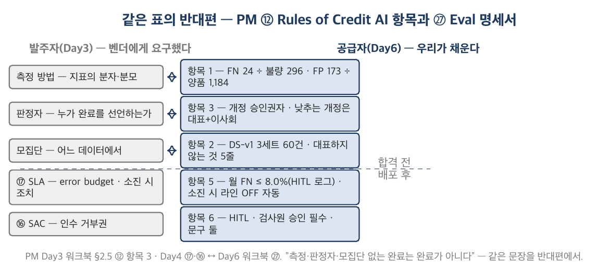

*그림 3-1. 왼쪽은 PM ⑫에서 발주자가 요구한 세 칸(측정 방법 · 판정자 · 모집단), 오른쪽은 ㉗에서 공급자가 채우는 같은 세 칸(항목 1 분자·분모 · 항목 3 승인권자 · 항목 2 데이터셋 정의). 아래 두 상자(오류 예산 · HITL)는 배포 뒤의 것 — 발주자는 SLA(⑰)로, 공급자는 ㉗ 항목 5·6으로 쓴다.*

### 딥게이지의 사례로 읽기

> ■ **사례 사실** — eval v1(OCR 91.4 / F1 0.78 / FN 8.1 / FP 14.6 / 1.8초·32원 / 합격 기준 FN ≤ 8.0 & OCR ≥ 90 / 데이터셋 자동차 3세트 60건)은 정본 §7.3 V-01~07 v1 열; ㉖ 항목 6의 AI DoD "㉗ 항목 3 인용"은 워크북 §1.5.

㉖ 항목 6에서 AI 판정 기능의 DoD는 한 줄이다 — "㉗ 항목 3 합격 기준 충족 + 항목 6 HITL 승인 흐름 가동". 여기서 다시 쓰지 않는다. 두 곳에 쓰면 갈린다. 그리고 ㉗은 D+151에 쓰였다 — 측정(D+270)보다 넉 달 전이다. 순서가 중요하다: 기준을 결과 전에 적는 것(Day5 3.4절)의 AI판이다.

### 실무에서 어떻게 틀리는가

AI 기능의 DoD를 "동작함"·"데모 통과"로 쓴다. 정확도 하나만 적는다("91%" — 무엇의?). 데이터셋을 "테스트 데이터 60건"으로만 적고 모집단을 안 적는다. 배포 뒤의 오류를 잴 방법 없이 배포한다. 발주자 시절에 요구했던 세 칸을 공급자가 되어 비운다 — 같은 사람이.

### 표준·문헌에서는

ISO/IEC 25010(SQuaRE)의 품질 특성 모델은 "measurable"을 요구하고, 요구공학의 fit criterion(Robertson & Robertson, *Mastering the Requirements Process*)이 그 어휘다 — "이 요구가 충족됐는지 어떻게 아는가"의 한 문장. Google *Rules of ML*(Zinkevich)의 Rule 2 "First, design and implement metrics"가 실무 원전이다. ISO/IEC 42001:2023은 AI 관리체계 표준으로 인간 감독과 모니터링을 요구한다 — 3.6절.

---

## 3.2 분자와 분모 — FN·FP·OCR·F1

### 개념

판정 기능의 지표는 네 칸의 표에서 나온다. 실제 불량 / 실제 양품 × 초안 불량 / 초안 양품. **FN**(false negative)은 실제 불량 중 초안이 양품이라 한 비율 — 분모는 **실제 불량**. **FP**는 실제 양품 중 초안이 불량이라 한 비율 — 분모는 **실제 양품**. 두 분모가 다르다. "정확도"는 전체 중 맞은 비율이고, 불량이 20%뿐인 데이터에서는 전부 양품이라 해도 80%가 나온다 — 그래서 판정 기능에 정확도는 쓰지 않는다.

**판정 단위**를 먼저 정한다 — 건(케이스)인지 항목인지 사진인지. 60건과 1,480항목은 같은 데이터의 다른 분모다. **OCR**은 치수 항목 중 값이 허용 오차 내로 읽힌 비율(분모: 치수 항목). **F1**은 정밀도(초안 불량 중 실제 불량)와 재현율(실제 불량 중 초안 불량 = 1 − FN)의 조화평균 — 외관 결함 분류처럼 클래스가 불균형할 때 쓴다.

> **작은 숫자로 먼저.** 60건 = 1,480항목. 실제 불량 296, 양품 1,184. 초안이 불량을 양품이라 한 것 24 → FN = 24/296 = **8.1%**. 초안이 양품을 불량이라 한 것 173 → FP = 173/1,184 = **14.6%**. 치수 1,050 중 960 → OCR **91.4%**. 외관 결함 96 중 TP 76, FN 20, FP 23 → 정밀도 76/99 = 0.768, 재현율 76/96 = 0.792 → F1 = 2 × 0.768 × 0.792 ÷ (0.768 + 0.792) = **0.78**. FN과 FP의 분자 24·173은 다른 분모 위에 있다 — 24 + 173 = 197이 "오류 197건"이 아니다.

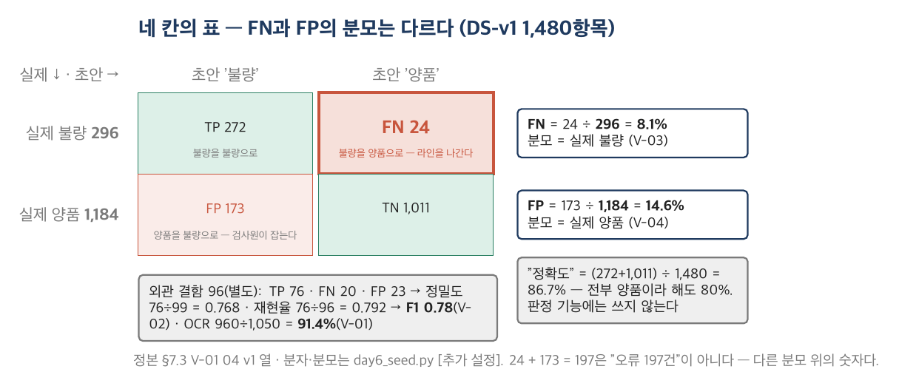

*그림 3-2. DS-v1 1,480항목. 행이 실제(불량 296 / 양품 1,184), 열이 초안. FN 24는 왼쪽 행 위에, FP 173은 오른쪽 행 위에 있다 — 8.1%와 14.6%의 분모가 다르다. 오른쪽 작은 표는 외관 결함 96의 F1. 위험한 칸은 FN 24 — 불량이 양품으로 나가는 곳.*

### 딥게이지의 사례로 읽기

> ■ **사례 사실** — 분자·분모(1,480 / 296 / 1,184 / 1,050 / 960 / 24 / 173 / 76·20·23)는 워크북 §2.5 항목 1과 day6_seed.py [추가 설정 — V-01~04에 맞춤].

FN 8.1%와 FP 14.6% 중 어느 것이 위험한가. FN이다 — 불량이 양품으로 라인을 나간다. FP는 검사원이 잡는다(양품을 불량이라 하면 검사원이 다시 본다). 그래서 합격 기준은 FN에만 있고(FN ≤ 8.0%) FP는 참고 지표다. 그러나 FP가 늘면 검사원이 초안을 무시하기 시작한다 — 수용률이 떨어진다. FP는 안전의 문제가 아니라 **수용**의 문제이고, 그것이 오류 예산에 FP 예산이 따로 있는 이유다(3.5절). 두 지표의 긴장 — FN을 낮추면 FP가 오른다 — 은 Day7의 일이다.

### 실무에서 어떻게 틀리는가

정확도 하나로 말한다. FN과 FP의 분모를 같은 것으로 적는다. 판정 단위를 안 정해 건과 항목이 섞인다. F1을 판정 초안(양/불)에 쓴다(F1은 결함 분류처럼 클래스가 여럿·불균형일 때). "오류 197건"처럼 FN·FP를 더한다.

### 표준·문헌에서는

혼동행렬과 FN/FP·정밀도·재현율·F1은 통계·기계학습의 표준 어휘다(임의의 ML 교과서). 판정 기능에서 FN을 우선하는 것은 안전 공학의 "miss vs false alarm" 비대칭이며, ISO/IEC 25010의 functional correctness 아래 어느 지표를 fit criterion으로 삼을지는 도메인이 정한다 — 검사에서는 FN이다.

---

## 3.3 데이터셋이 대표하는 것 — 모집단 정의

### 개념

"3세트 60건"은 구성이지 모집단이 아니다. 모집단은 **"이 60건이 무엇을 대신하는가"**의 문장이다 — 어느 산업, 어느 공정, 어느 조명, 어느 촬영 조건, 어느 부품. 그리고 그 문장의 여집합 — **"대표하지 않는 것"** — 이 이 문서에서 가장 값진 칸이다. 여집합 중 **고객이 실제로 가진 것**이 있으면, 합격 기준은 그 고객에 대해 아무것도 말하지 않는다.

이 칸은 Day3에서 재고 정확도 91.3%의 분모(순환실사 SKU 69%)를 따져 물은 것과 같은 자리다. 그때 여러분은 "이 91.3%는 어느 SKU에서 나온 값인가"를 물었고, 지금은 "이 8.1%는 어느 사진에서 나온 값인가"를 적는다. 그때는 감사자였고 지금은 문서를 쓴 사람이다.

### 딥게이지의 사례로 읽기

> ■ **사례 사실** — DS-v1 구성(세영 절삭 20 · 동보 프레스 20 · 한빛 단조 20, 오전 9~11시, D+160~200)·모집단 문장·"대표하지 않는 것"·라벨링 규칙(2인 독립 + 강민수 검수, 불일치 6.8%)은 워크북 §2.5 항목 2 [추가 설정 — V-07 "자동차 3세트 60건"에 맞춤]; 오후 84.7 / 야간 88.2는 Day5 X-02.

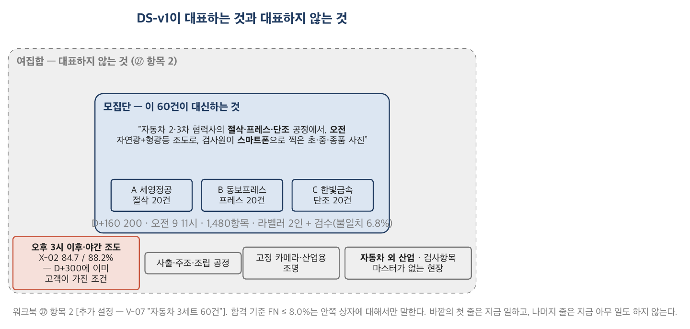

*그림 3-3. 가운데 상자가 모집단 문장 — "자동차 2·3차 협력사의 절삭·프레스·단조 공정, 오전 자연광+형광등 조도, 검사원 스마트폰 촬영". 바깥 고리가 여집합 — 오후 3시 이후·야간 조도(X-02 84.7 / 88.2), 사출·주조·조립, 자동차 외 산업, 고정 카메라·산업용 조명, 마스터가 없는 현장. 첫 줄(오후 조도)은 D+300에 이미 고객이 가진 조건이다.*

예시본의 모집단 문장은 한 줄이고 여집합은 다섯 줄이다. 첫 줄 — 오후 3시 이후 조도 — 는 Day5 X-02가 이미 보여 준 것이고, D+300의 세영정공 오후 라인이 실제로 가진 조건이다. 그래서 판정 초안은 오전 1라인에만 켜져 있고, 조도 경고(B-06)가 오후 사진에 재촬영을 안내한다. 나머지 줄(다른 공정, 자동차 외 산업)은 지금 아무 일도 하지 않는다. 지금은 여집합을 **비우지 않는 습관**만 가져가라 — 그 줄들이 무엇을 하는지는 Day8에 안다.

라벨링 규칙도 모집단의 일부다. 라벨러가 개발자면 모델이 잘 맞는 쪽으로 라벨이 기운다. 예시본은 전 검사원 2인이 독립 라벨하고 강민수가 불일치(6.8%)를 확정한다 — 그 6.8%가 "정답 자체의 불확실성"이고, FN 8.1%는 그 위에 있는 숫자다.

### 실무에서 어떻게 틀리는가

세트 수·건수만 적고 모집단 문장을 비운다. 여집합을 비운다("일반적인 제조 현장"). 라벨러가 개발자다. 데이터셋을 바꾸면서 기준 버전을 안 바꾼다(데이터셋을 바꾸면 기준이 바뀐 것이다 — 3.4절). 고객이 늘어도 데이터셋이 그대로다 — 새 고객의 조건이 여집합에 있는지 아무도 확인하지 않는다.

### 표준·문헌에서는

통계학의 표본·모집단 어휘가 원전이고, ML 실무에서는 "distribution shift"·"out-of-distribution"이 여집합의 이름이다. 데이터셋 문서화의 형식은 Gebru 외 "Datasheets for Datasets"(2018/2021)와 Mitchell 외 "Model Cards"(2019)가 제안했다 — 둘 다 "이 데이터·모델이 무엇에 쓰이면 안 되는가"를 칸으로 둔다. PM 트랙 Day3의 분모 정정(91.3 vs 84.6)이 이 절의 앞선 경험이다.

---

## 3.4 합격 기준과 개정 절차 — criteria drift

### 개념

합격 기준은 지표·부등호·숫자·**데이터셋 버전**을 함께 적는다 — "FN ≤ 8.0% on DS-v1". 데이터셋을 바꾸면 기준이 바뀐 것과 같으므로 버전이 없는 기준은 기준이 아니다.

그리고 **개정 절차**를 기준과 같은 날 적는다. 기준을 **낮추는** 개정(FN 상향, OCR 하향, 데이터셋 축소)과 **높이는** 개정을 분리해, 낮추는 쪽에는 외부 근거(측정 오류의 입증 또는 모집단 정의의 변경)와 상위 승인(대표 + 이사회 보고)을 요구하고, 높이는 쪽은 CTO 전결로 둔다. 왜 지금 적는가. 결과를 본 뒤에는 기준을 결과에 맞추고 싶어지기 때문이다 — 8.1이 나오면 8.1로, 다음에 8.3이 나오면 8.3으로. 그것이 criteria drift이고, 사고 뒤에 기준을 고치는 것은 그 극단이다. 막을 수 있는 유일한 시점이 결과 전이다.

### 딥게이지의 사례로 읽기

> ■ **사례 사실** — 합격 기준 v1 FN ≤ 8.0 & OCR ≥ 90(V-06), 측정 FN 8.1(V-03 v1)은 정본 §7.3; 개정 절차·"합격 전 베타" 판정은 워크북 §2.5 항목 3 [추가 설정].

D+270 측정. OCR 91.4% 합격, FN 8.1% — **0.1%p 초과**. 24건 대 23건, 한 건 차이. "사실상 합격"이라고 적고 싶어진다. 항목 3의 개정 근거 요건은 "측정 오류의 입증 또는 모집단 정의의 변경"이고, 한 건 차이는 둘 다 아니다. 예시본의 판정은 **불합격, 기준 유지**. 그리고 배포 조건을 낮췄다 — "합격 전 베타", 세영 오전 1라인, 승인 필수, 자동판정 없음. 기준과 배포는 다른 결정이다. 기준을 지키면서 배포하는 길이 ㉖ 항목 7의 GA 기준에 미리 열려 있었다("초안 미합격 시 '합격 전 베타' 표시").

이 판정이 옳았는지는 이 교재가 답하지 않는다. 답은 Day7에 있다. 지금 가져갈 것은 순서다 — 기준(D+151) → 측정(D+270) → 판정(기준 유지) → 배포 조건(낮춤). 거꾸로 하면(측정 → 기준) 모든 모델이 합격한다.

### 실무에서 어떻게 틀리는가

기준만 있고 개정 절차가 없다. 측정 시점이 "필요할 때". 데이터셋 버전이 없다. 0.1%p를 반올림한다. 사고 뒤에 기준을 올리고 그것을 "개선"이라 부른다(기준을 사고에 맞춘 것이다). 개정 이력을 안 남겨 6개월 뒤 기준이 몇 번 바뀌었는지 아무도 모른다.

### 표준·문헌에서는

Shankar 외, "Who Validates the Validators?"(2024)는 LLM 출력을 평가하는 사람의 기준이 **출력을 보면서 바뀐다**는 것을 관찰하고 criteria drift라 이름 붙였다 — 평가 기준을 결과와 분리해 먼저 적어야 하는 이유의 실증이다. Nosek 외(2018)의 사전등록 논리가 같은 자리에 있다. PM 트랙 Day3의 "Rules of Credit은 측정이 아니라 합의의 산물"(2.2절)이 이 절의 앞선 문장이다 — 합의를 결과 뒤에 바꾸면 측정이 아니다.

---

## 3.5 오류 예산

### 개념

SRE의 error budget은 "가용성 99.9%면 월 43분은 죽어도 된다"의 산수다 — SLO를 100%로 두지 않고, 남은 0.1%를 예산으로 써서 릴리스 속도와 안정성을 거래한다. 예산을 다 쓰면 릴리스를 멈춘다. 그것을 판정 오류로 번역한 것이 ㉗ 항목 5다.

번역에서 하나가 달라진다. 가용성은 잴 수 있다(서버가 죽었는지). 배포 뒤의 FN은 잴 수 없다 — 정답 라벨이 없다. 있는 것은 **검사원이 초안을 뒤집은 기록**뿐이다. 그래서 오류 예산의 첫 칸은 비율이 아니라 **측정 원천**이다 — 무엇으로 재는가. 그리고 그 원천이 놓치는 것을 적는다: 검사원이 초안을 믿고 넘긴 FN은 이 예산에 잡히지 않는다. 그것은 클레임으로 잡힌다.

두 번째로 달라지는 것은 **소진 시 조치가 자동**이어야 한다는 것이다. 사람이 회의에서 결정하면 늦다 — 해당 라인 초안 표시 OFF, 재학습, 재측정 합격 후 ON, 초과 기간 릴리스 동결.

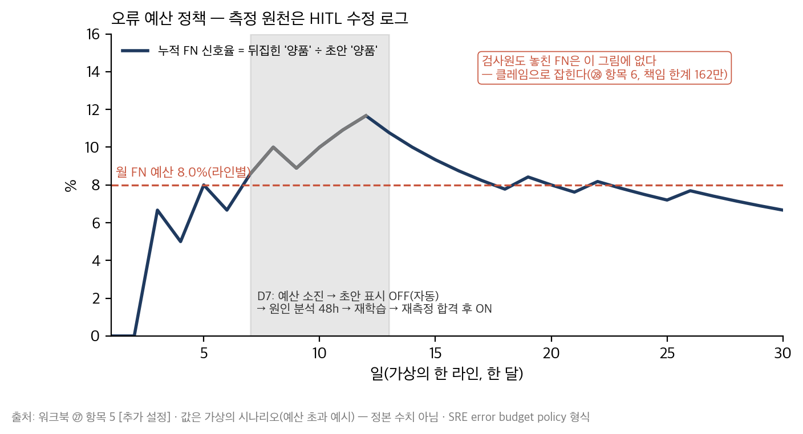

*그림 3-4. 가상의 한 라인, 한 달. 누적 FN 신호(초안 양품 → 검사원 불량)가 예산선(8.0%)에 닿는 날 초안 표시가 자동으로 꺼지고(회색 구간), 재학습·재측정 합격 후 켜진다. 오른쪽 여백의 작은 상자 — "검사원도 놓친 FN은 이 그림에 없다" — 가 이 예산의 한계다.*

### 딥게이지의 사례로 읽기

> ■ **사례 사실** — 측정 원천(HITL 수정 로그 B-12)·월 FN ≤ 8.0% / FP ≤ 15% · 신뢰도 0.85 · 소진 시 조치 · 주간/월간 보고는 워크북 §2.5 항목 5 [추가 설정]; 신뢰도 0.85 미만 구간이 전체 FN의 71%는 [추가 설정].

예시본의 월 FN 예산은 8.0% — 합격 기준과 같은 숫자다. 그러나 근거 열에 "분모가 다르다"고 적혀 있다: eval의 분모는 실제 불량이고, 예산의 분모는 검사원이 뒤집은 것이다. 같은 숫자를 쓴 것은 우연이 아니라 "배포 뒤에도 eval 기준만큼은 유지되는가"를 묻기 위해서지만, 두 분모가 다르다는 것을 모르면 "예산 안이니 FN 8% 이하"라고 읽는다 — 아니다. 검사원이 놓친 FN은 어디에도 없다. 예시본이 그 문장을 근거 열에 그대로 적은 이유다.

신뢰도 임계값 0.85는 "그 아래에서 FN의 71%가 난다"는 DS-v1 관찰에서 왔다 — 0.85 미만은 초안을 표시하지 않고 "판정 보류"를 띄운다. 예산을 지키는 가장 싼 방법은 모델을 고치는 것이 아니라 자신 없는 판정을 안 보여 주는 것이다.

### 실무에서 어떻게 틀리는가

예산만 있고 측정 원천이 없다. 소진 시 조치가 "검토". 예산 FN과 eval FN의 분모가 다르다는 것을 모른다. 검사원의 수정 건수를 검사원 실적으로 본다 — 그러면 검사원은 수정하지 않고 예산은 늘 남는다(3.6절). 소진돼도 릴리스를 계속한다("고객 약속이라서").

### 표준·문헌에서는

Beyer 외, *Site Reliability Engineering*(2016) 3~4장(SLO·error budget policy)이 원전이고, PM 트랙 ⑰(운영 이관·SLA)의 error budget이 발주자 쪽 경험이다. ISO/IEC 42001의 모니터링·성과 평가 요구가 관리체계 쪽 자리다. 여기서 "측정 원천이 놓치는 것"을 명시하는 것은 표준이 요구하지 않는다 — 이 교재가 요구한다.

---

## 3.6 Human-in-the-loop — 자동판정을 켜지 않는 설계

### 개념

HITL은 "사람이 확인한다"가 아니라 **사람이 어디서, 무엇을, 어떤 화면에서, 어떤 문구 아래 확인하는가**의 설계다. 네 칸 — 자동판정 ON/OFF 조건, 승인 흐름(화면 순서), 에스컬레이션, 책임 한계 문구. 그리고 다섯 번째 칸 — **현장 수용성**: 그 화면을 보는 사람의 눈으로 한 줄.

책임 한계 문구는 **둘**이어야 한다. 화면 문구는 검사원에게 판정권을 **돌려주는** 문장이고("최종 판정은 검사원이 합니다"), 계약 문구는 고객사 법무에게 상한을 **알리는** 문장이다("당사 책임은 연 계약액의 10%"). 두 문장을 같은 화면에 두면 검사원은 "나머지 90%는 내 책임"으로 읽는다. 촉탁직 검사원에게 그 문장은 재촬영과 별도 종이 기록으로 돌아온다 — Day5 X-01이 이미 보여 준 행동이다.

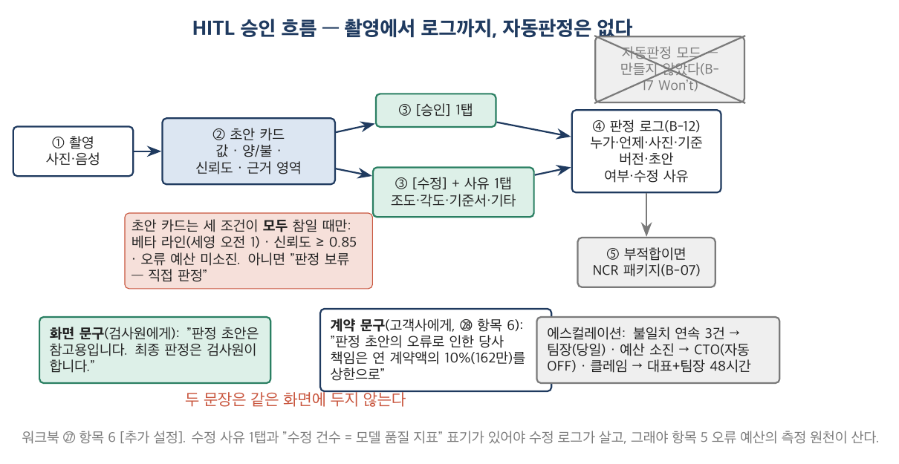

*그림 3-5. ① 촬영 → ② 초안 카드(값·양/불·신뢰도·근거 영역) → ③ [승인] 또는 [수정 + 사유 1탭] → ④ 로그(B-12) → ⑤ 부적합이면 NCR 패키지. 초안 카드는 세 조건(베타 라인 · 신뢰도 ≥ 0.85 · 오류 예산 미소진)이 모두 참일 때만 뜬다. 오른쪽 위 회색 상자 — 자동판정 — 는 만들어지지 않았다(B-17 Won't). 아래 두 문구 상자는 서로 다른 화면에 있다.*

### 딥게이지의 사례로 읽기

> ■ **사례 사실** — HITL 설계 다섯 칸(자동판정 없음 · 승인 흐름 · 에스컬레이션 · 화면/계약 문구 · 현장 수용성)은 워크북 §2.5 항목 6 [추가 설정]; 계약 책임 한계 162만은 G-40의 원형(순SaaS ACV 1,620만 × 10%); 박선재는 정본 §2.3·§8.3; A-05b는 Day5 ㉔.

예시본의 현장 수용성 칸은 [세영정공] 박선재의 눈으로 적혀 있다 — "최종 판정은 검사원"은 "책임은 너"로 읽힌다. 예측되는 행동: 초안과 다르면 재촬영, 종이에 따로 기록. 그리고 **A-05b 미해결로 표기**했다. 문구가 두려움을 없애지는 않는다. 대응은 교육이 아니라 두 가지 설계다 — 수정 사유를 1탭으로 두어 수정이 벌점이 아님을 화면이 말하게 하고, 팀장 월간 리포트에 수정 건수를 검사원 실적이 아니라 **모델 품질 지표**로 표기한다. 3.5절의 오류 예산이 이 설계에 달려 있다: 검사원이 초안을 뒤집는 것이 자기에게 불리하면 뒤집지 않고, 그러면 FN 신호가 사라진다.

정본 §8.3의 문장 — "박선재는 자동판정을 끈다. 그것은 제품 결함이 아니라 고용 구조의 반응이다" — 는 D+300 이후의 일이다. 지금 딥게이지가 한 것은 자동판정을 **만들지 않는 것**과 초안을 세영 오전 1라인에만 켜는 것이다. X-04의 결과(수용률 71%, 회피 행동 14% — 불확정)가 그 결정이 옳았음을 반쯤 말한다.

### 실무에서 어떻게 틀리는가

자동판정을 "신뢰도 높으면 ON"으로 적는다(수용·오류 예산 조건 없이). 책임 한계 문구가 하나뿐이어서 검사원 화면에 계약 문장이 뜬다. 현장 수용성 칸이 "교육으로 해결". 수정 건수를 검사원 KPI로 쓴다. 에스컬레이션이 "이상 시 보고".

### 표준·문헌에서는

ISO/IEC 42001:2023이 인간 감독(human oversight)을 관리체계의 요구로 두고, EU AI Act(2024)의 고위험 시스템 조항이 같은 어휘를 법으로 옮겼다 — 판본·적용 범위는 인용 전에 확인한다(제작 노트 §1.2). Google *Rules of ML*의 "휴리스틱 먼저" 원칙은 자동판정을 만들지 않은 결정의 공학적 근거다. Day5 2.2절(관찰과 자기 보고)이 현장 수용성 칸의 원전이다 — 인터뷰가 잡지 못한 것을 설계가 예측해야 한다.

---

## 3.7 분야별 대조 — 의료·금융·자율주행의 인간 감독 (심화)

| 분야 | 판정 기능 | FN의 뜻 | 사람의 자리 | 오류 예산의 형태 | 딥게이지와의 거리 |
|---|---|---|---|---|---|
| 제조 검사(딥게이지) | 양/불 초안 | 불량이 라인을 나간다(클레임 2,700만) | 검사원 승인 필수, 자동판정 없음 | 라인별 월 FN 비율(HITL 로그) | — |
| 의료 영상 보조 진단 | 병변 후보 표시 | 놓친 병변 | 판독의가 최종, 소프트웨어는 "보조" 등급 | 감도(sensitivity) 하한, 규제 승인 시 고정 | 가장 가깝다 — 초안·승인·책임 문구 |
| 금융 사기 탐지 | 거래 차단/통과 | 사기 통과(손실) vs 정상 차단(고객 이탈) | 임계값 위는 자동, 중간은 사람 검토 | FN·FP 비용을 금액으로 환산해 임계값 | 자동판정이 기본 — 딥게이지의 반대 |
| 자율주행 | 객체 인식·제동 | 미감지 = 사고 | 운전자 감독(레벨 2~3), 개입 요구 | 주행 거리당 개입 횟수 | 사람의 반응 시간이 설계의 중심 |
| 콘텐츠 검수 | 위반 여부 | 위반 통과 vs 정상 삭제 | 자동 삭제 + 이의 제기 | 이의 제기 인용률 | 대량·저비용 — 딥게이지와 반대 |

공통점은 FN·FP의 비용이 비대칭이고, 그 비대칭이 임계값·사람의 자리·예산의 형태를 정한다는 것이다. 차이는 **사람이 판정을 뒤집을 수 있는가**다 — 의료와 제조는 뒤집는 것이 정상이고, 금융과 콘텐츠는 뒤집는 것이 예외(이의 제기)다. 딥게이지가 자동판정을 만들지 않은 것은 의료 쪽 선택이고, 그 선택의 대가는 "AI 검사"라는 말을 마케팅에 못 쓰는 것이다(Day5 ㉕ 항목 6-3).

---

## 제3장 핵심 정리

> **한 줄씩 — 수업 직전 5분 복습용**
> 1. AI 기능의 완료는 "동작한다"가 아니라 "어느 데이터에서 얼마나 맞는가" — 측정·판정자·모집단 세 칸. 발주자로서 요구했던 그 세 칸을 공급자로서 채운다.
> 2. FN과 FP의 분모는 다르다 — 24/296과 173/1,184. 판정 기능에 "정확도"는 쓰지 않는다. 위험한 칸은 FN.
> 3. "3세트 60건"은 구성이다 — 모집단 문장과 그 여집합("대표하지 않는 것")을 적는다. 여집합의 첫 줄(오후 조도)은 이미 고객이 가진 조건이다.
> 4. 기준은 "FN ≤ 8.0% on DS-v1"처럼 데이터셋 버전과 함께 — 개정 절차를 같은 날 적어야 결과 뒤에 기준이 밀리지 않는다(criteria drift).
> 5. FN 8.1%는 불합격이다 — 기준을 지키고 배포 조건을 낮춘다("합격 전 베타"). 기준과 배포는 다른 결정이다.
> 6. 오류 예산의 첫 칸은 비율이 아니라 측정 원천 — HITL 수정 로그. 검사원도 놓친 FN은 예산에 없고 클레임에 있다. 소진 시 조치는 자동.
> 7. 책임 한계 문구는 둘 — 화면(판정권을 돌려주는)과 계약(상한을 알리는). 같은 화면에 두지 않는다.
> 8. 현장 수용성은 촉탁직의 눈으로 — 수정이 벌점이 아니어야 수정 로그가 살고, 그래야 오류 예산이 산다. A-05b는 아직 열려 있다.
>
> 아래는 같은 내용의 자세한 판이다.

1. ㉗은 세 문서가 한 묶음이다 — eval 명세(합격 전), 오류 예산(배포 후 얼마나), HITL(틀렸을 때 어디서). ㉖ 항목 6의 AI DoD는 ㉗ 항목 3을 인용만 한다. 기준(D+151)이 측정(D+270)보다 넉 달 앞선다.
2. 판정 단위(항목)를 먼저 정한다. FN = 실제 불량 중 초안 양품, FP = 실제 양품 중 초안 불량, OCR = 치수 항목 중 허용 오차 내, F1 = 정밀도·재현율의 조화평균(외관 결함). FN은 안전, FP는 수용의 문제다.
3. 모집단 문장은 산업·공정·조명·촬영 조건을 한 줄로, 여집합은 고객이 실제로 가진 것부터. 라벨러(전 검사원 2인 + 검수)와 불일치율(6.8%)도 모집단의 일부다 — 정답의 불확실성 위에 FN이 있다.
4. 개정 절차는 낮추는 개정(외부 근거 + 대표 승인 + 이사회 보고)과 높이는 개정(CTO 전결)을 분리한다. 사고·일정·영업 압력은 근거가 아니다. 데이터셋을 바꾸면 기준 버전도 바꾼다.
5. 0.1%p(24건 대 23건)를 반올림하면 다음은 8.3이다. 예시본은 불합격을 적고 배포 조건을 낮췄다 — ㉖ 항목 7의 GA 기준에 그 길이 미리 열려 있었다. 이 판정이 옳았는지는 Day7의 일이다.
6. 오류 예산 8.0%는 합격 기준과 같은 숫자이지만 분모가 다르다(검사원이 뒤집은 것). 신뢰도 0.85 미만은 초안 미표시 — 예산을 지키는 가장 싼 방법. 소진 시 라인 초안 OFF → 재학습 → 재측정 → ON, 릴리스 동결.
7. 자동판정은 만들지 않았다(B-17 Won't). 초안 표시 조건은 셋(베타 라인 · 신뢰도 · 예산 미소진)의 AND. 에스컬레이션은 불일치 연속 3건 → 팀장, 예산 소진 → CTO 자동, 클레임 → 대표 + 팀장 48시간.
8. 분야별 대조: 의료(승인 필수)와 금융(자동 기본)이 양 끝이고, 딥게이지는 의료 쪽이다 — 그 대가가 "AI 검사"를 못 쓰는 마케팅이다.

## 생각해 볼 질문

1. 여러분 회사의 AI(또는 규칙 기반 자동 판정) 기능 하나의 합격 기준을 말해 보라. 분모는? 데이터셋 버전은? 없으면 그 기능은 언제 "완료"됐는가?
2. Day3에서 벤더에게 요구한 Rules of Credit의 AI 항목을 떠올려 보라. 그 세 칸을 오늘 여러분이 채운다면 가장 비우고 싶은 칸은 무엇인가?
3. 오류 예산의 측정 원천이 놓치는 것을 여러분 회사의 지표 하나로 말해 보라 — "이 지표가 잡지 못하는 오류는 어디서 잡히는가".
4. 검사원 화면에 계약 문구가 뜬다면 박선재는 무엇을 하겠는가? 그 행동은 어느 지표에 어떻게 나타나는가?

## 워크북 연결

이 장은 Day6 워크북 **㉗ AI 기능 Eval Set 명세서·오류 예산·HITL**의 전 항목에 대응한다 — 항목 1(3.2절) · 항목 2(3.3절) · 항목 3(3.4절) · 항목 4 루브릭(3.2·3.6절) · 항목 5(3.5절) · 항목 6(3.6절) · 항목 7(3.4절). ㉖ 항목 6(DoD)과 ㉘ 항목 6(책임 한계 162만)이 이 장을 인용한다. 심화 과제(3~7년차): 자기 회사의 자동 판정 기능 하나에 대해 항목 2(모집단·여집합)와 항목 5(측정 원천이 놓치는 것)만 쓰라.

---

# 제4장 프라이싱·밸류메트릭·유닛이코노믹스

## 4.1 밸류메트릭 — 무엇에 과금하는가

### 개념

"얼마를 받을 것인가"보다 먼저 정할 것이 **"무엇에 과금할 것인가"**다 — 밸류메트릭. 좌석(사용자 수), 라인(설비 단위), 건수(사용량), 성과(회피한 손실). 네 후보를 다섯 기준으로 본다: 고객 가치와 맞는가, 고객이 예측할 수 있는가, **우리 원가와 맞는가**, 팔기 쉬운가, 나중에 늘어날 여지가 있는가. 다섯 기준의 무게는 단계마다 다르다 — 첫 유료 3사를 만드는 6개월에는 "팔기 쉬운가"와 "고객이 예측할 수 있는가"가 무겁고, "원가와 맞는가"는 가볍다(고객이 셋이고 원가가 210만이므로). 그러나 가벼운 기준을 **모르고** 포기하는 것과 **알고** 포기하는 것은 다르다. 알고 포기했으면 계측을 먼저 넣는다.

종합 칸은 점수 합산이 아니라 **어느 기준을 포기했는가**의 문장이다.

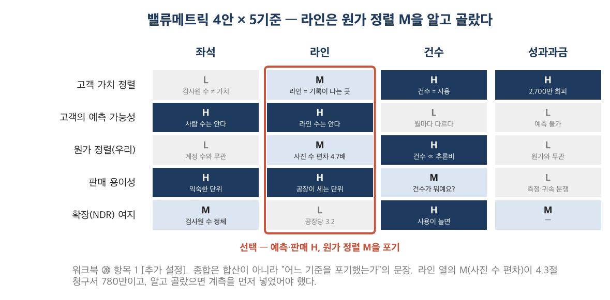

*그림 4-1. 네 열(좌석·라인·건수·성과과금) × 다섯 행. 짙을수록 H. 라인 열은 예측 가능성·판매 용이성이 H이고 원가 정렬이 M — 라인당 사진 수의 편차(4,100 vs 19,400)가 그 M이다. 건수 열은 원가 정렬 H이지만 고객이 이해하지 못한다("건수가 뭐예요?"). 성과과금은 지금 측정할 수 없다.*

### 딥게이지의 사례로 읽기

> ■ **사례 사실** — 라인당 월 45만·좌석 무제한·공장당 라인 3.2는 정본 §1.3·§2.1; 4안 × 5기준 H/M/L과 근거는 워크북 §3.5 항목 1 [추가 설정]; 커널 행동 2는 Day5 ㉕ 항목 4; 라인당 전기 시간 39.3만/월은 day5_discovery.py.

Day5 커널의 일관된 행동 2 — "가격은 라인 단위, 좌석 무제한 — 검사원 수가 늘어도 비용이 안 늘어야 검사원이 쓴다" — 가 이 표의 좌석 열을 L로 만든다. 좌석 과금은 "계정 아끼기"를 낳고, 계정을 아끼면 검사원이 남의 계정으로 기록하거나 안 쓴다(A-01·A-05). 라인은 공장이 이미 세는 단위라 계약 협상이 짧다(X-05: 3/3 라인 계약). 그 대가가 원가 정렬 M이고, 예시본은 그것을 **알고** 골랐다고 적었다. 그런데 계측은 넣지 않았다 — B-24(권한·과금 연동)에 사용량 계측이 없다. 4.3절.

가격 45만의 근거는 세 겹이다. 라인당 전기·중복 입력의 돈 환산 39.3만/월(Day5)에 8D·통보 지연·클레임 회피를 더하면 45만은 방어 가능하고, 클레임 1건 2,700만은 라인 3.0 × 45만 × **20개월**이다 — 한 건을 막으면 20개월치다. 그리고 그 근거는 팀장에게 하는 말이지 검사원에게 하는 말이 아니다(A-03: 팀장이 돈을 낸다).

### 실무에서 어떻게 틀리는가

다섯 기준을 점수로 합산해 최고점을 고른다. "우리 원가와 맞는가"를 빼먹는다. 경쟁사의 메트릭을 그대로 쓴다("SaaS는 좌석이니까"). 선택의 대가 칸을 비운다 — 그러면 청구서가 왔을 때 그것이 가격의 문제인지 모른다. 밸류메트릭을 바꾸는 것이 얼마나 비싼지(모든 계약·청구·보고가 바뀐다) 모르고 "나중에 바꾸면 된다"고 한다.

### 표준·문헌에서는

Croll & Yoskovitz, *Lean Analytics*(2013)의 단계별 지표와 Moore(2014)의 whole product(가격에 포함되는 것의 경계)가 배경이고, 밸류메트릭이라는 어휘 자체는 SaaS 프라이싱 실무(ProfitWell/Price Intelligently의 "value metric")에서 왔다. Skok의 "SaaS Metrics 2.0"은 메트릭이 NDR(순매출유지율)의 원천을 정한다는 점을 강조한다 — 4.2절의 NDR 상한.

---

## 4.2 유닛이코노믹스 v1 — 한 고객의 산수

### 개념

유닛이코노믹스는 회사 전체의 손익이 아니라 **한 단위(고객·라인·건)의 산수**다. 매출 한 단위에 대해 변동원가가 얼마이고 공헌이익이 얼마인가. 고정비(서버·인건비)는 여기 없다 — 회사 전체 GM에 있다. 이 구별이 왜 중요한가. 고정비를 섞으면 고객이 늘수록 좋아 보이고(고정비가 분산되므로), 변동원가만 보면 고객이 늘수록 나빠지는 고객(헤비)이 드러난다.

두 열을 쓴다 — 표준과 헤비. 헤비 열을 "예외"로 지우지 않는다. 헤비가 몇 곳인지 모르면 표준 열의 산수는 평균이 아니라 희망이다.

> **작은 숫자로 먼저.** 표준 공장: 사진 4,100장 × 32원 = 13.1만 + STT 3.8 + 저장 1.2 = **18.1만**. 매출 라인 3.0 × 45만 = 135만. 변동원가율 13.4%, 공헌이익률 **86.6%**. 헤비 고객: 19,400장 × 32원 = 62.1만 + 3.8 + 3.6 = **69.5만**. 매출 같은 135만. 변동원가율 51.5%, 공헌이익률 **48.5%**. 같은 가격, 사진 4.7배, 공헌이익률 38%p 차이. 공헌이익률이 0이 되는 사진 수는 (135 − 3.8 − 3.6)만 ÷ 32원 ≈ **39,900장** — 헤비의 두 배.

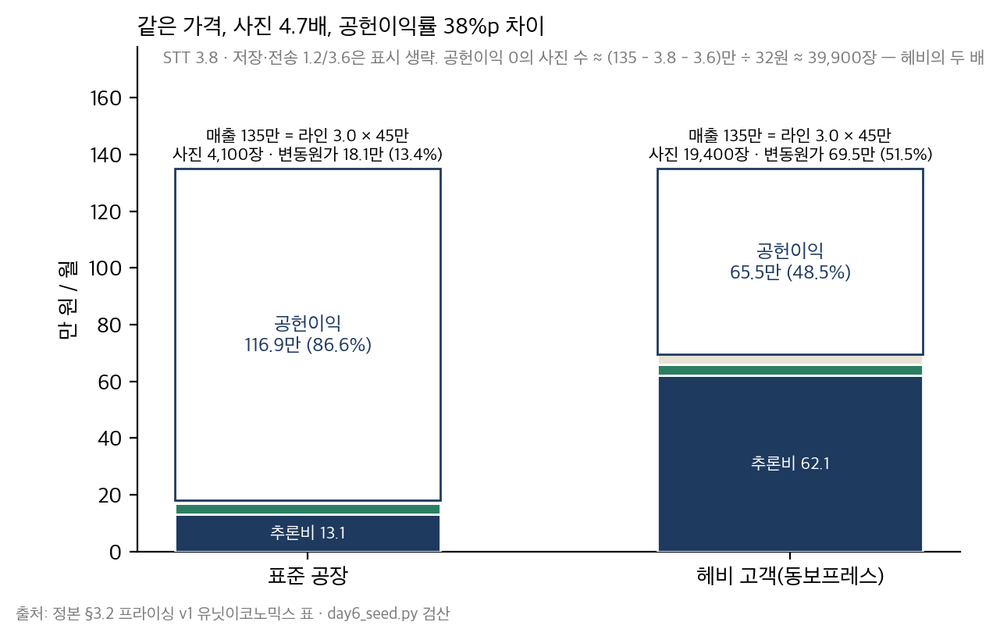

*그림 4-2. 두 막대 모두 높이가 135만(라인 3.0 × 45만). 아래쪽 색 부분이 변동원가(추론비·STT·저장) — 표준 18.1만, 헤비 69.5만. 위쪽 흰 부분이 공헌이익 — 86.6% vs 48.5%. 헤비 막대의 추론비 62.1만이 4.3절 청구서에서 444만으로 돌아온다.*

### 딥게이지의 사례로 읽기

> ■ **사례 사실** — UE 표(4,100 / 19,400 · 32원 · 18.1 / 69.5만 · 86.6 / 48.5%)는 정본 §3.2; 계약 라인 3.0 / 실사용 2.4는 G-18; NDR 상한 약 105%는 워크북 §3.5 항목 5 [추가 설정].

헤비 고객은 동보프레스다 — 프레스 라인의 사진 건수가 절삭의 4.7배. 그리고 NDR. 라인 과금을 고른 순간 확장 여지는 공장의 라인 수(평균 3.2)에 묶인다 — 계약 3.0이면 +0.2, 7%. 실사용은 2.4다(G-18) — 축소 위험 20%가 확장 여지보다 크다. 예시본이 NDR 상한을 약 105%로 낮게 적고 "GRR이 먼저"라고 쓴 이유다. 좌석 무제한은 확장 원천이 아니다 — 무제한은 확장이 없다는 뜻이다.

### 실무에서 어떻게 틀리는가

정본 표를 베끼고 산수를 안 한다. 고정비를 변동원가에 섞는다. 헤비 열을 지운다. NDR 120%를 원천 없이 목표로 적는다. 공헌이익률이 0이 되는 사용량을 계산해 본 적이 없다.

### 표준·문헌에서는

공헌이익·변동원가는 관리회계의 표준 어휘이고, SaaS 맥락에서는 Skok의 "SaaS Metrics 2.0"과 a16z "16 Startup Metrics"의 gross margin·CAC payback 정의를 따른다. Kohavi 외(2020)의 가드레일 지표(원가·지연)가 "원가율은 실험의 가드레일"이라는 관점을 준다.

---

## 4.3 헤비 고객 — 청구서 780만이 말하는 것과 말하지 않는 것

### 개념

청구서는 **금액**을 말한다. 서비스별로는 말한다(VLM·STT·저장·GPU). 테넌트(고객)별로도 말한다 — API 키가 고객별이면. 그러나 **왜**는 말하지 않는다. 사진 한 장이 재촬영인지, 앱이 자동으로 재시도한 것인지, 모델 갱신 시 배치가 전량 재추론한 것인지, 원래 사진이 많은 라인인지 — 그것은 사진 단위·호출 단위의 계측이 있어야 안다. 계측이 없으면 청구서 앞에서 할 수 있는 것은 **가설을 세우고, 가설마다 판별 계측을 적고, 첫 조치를 계측으로 두는 것**뿐이다. 가설 하나를 사실로 적고 가격을 올리는 것은 D+284에 할 수 있는 답이 아니다.

이 절은 정답이 없는 절이다. 정확히 말하면 "정답을 아직 알 수 없다"가 정답이다.

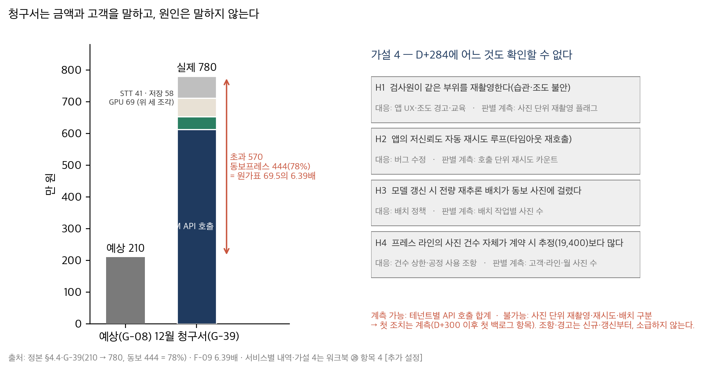

*그림 4-3. 왼쪽 막대 예상 210만, 오른쪽 실제 780만(VLM 612 · STT 41 · 저장 58 · GPU 69). 초과 570만 중 444만(78%)이 동보프레스 — 원가표 69.5만의 6.39배. 오른쪽 네 상자가 가설 H1~H4이고, 각 상자 아래가 그것을 판별할 계측이다. 네 상자 모두 회색 — D+284에 어느 것도 확인할 수 없다.*

### 딥게이지의 사례로 읽기

> ■ **사례 사실** — 청구서 210 → 780만, 초과 570의 78%(444만)가 헤비 고객, 사유 "같은 부위 재촬영"은 정본 §4.4·G-39; 6.39배는 F-09; 서비스별 내역(612/41/58/69)·가설 4·계측 가능/불가·공정 사용 6,000건·경고 4,500건은 워크북 §3.5 항목 4 [추가 설정].

정본 사건(§4.4)은 원인을 "검사원이 같은 부위를 재촬영하는 습관"이라고 적는다. 그러나 D+284의 딥게이지는 그것을 **모른다**. 여러분도 정본을 읽었으므로 안다 — 그래서 이 항목이 어렵다. 워크북 ㉘ 항목 4에 "재촬영이니 교육한다"고 쓰면 그것은 정본을 읽은 사람의 답이지 D+284에 쓸 수 있는 답이 아니다. 예시본은 가설 넷(H1 재촬영 / H2 앱 재시도 루프 / H3 모델 갱신 재추론 배치 / H4 사진 건수 자체 과소 추정)을 세우고, 가설마다 판별 계측(재촬영 플래그 / 재시도 카운트 / 배치별 사진 수 / 라인·월 사진 수)을 적고, 첫 조치를 **계측**(D+300 이후 첫 백로그 항목, 0.5 mm)으로 두었다. 대응이 전부 다르다 — H1은 UX·조도 경고, H2는 버그 수정, H3는 배치 정책, H4는 조항·상한. 어느 것인지 모르면 넷 중 하나를 고르는 것은 도박이다.

그리고 판별 **전에도** 할 수 있는 것은 함께 적었다 — 공정 사용 조항(라인당 월 6,000건, 초과 건당 40원)과 경고 임계값(4,500건). 단 신규·갱신 계약부터이고 기존 3사에 소급하지 않는다. 상한은 두지 않았다 — 검사원이 촬영을 아끼면 FN이 늘고, 그것은 ㉗의 문제다. 두 문서가 여기서 만난다.

4.1절의 문장으로 돌아가면: 원가 정렬 M을 알고 골랐으면 계측을 먼저 넣었어야 했다. 딥게이지는 알고도 넣지 않았다. 그것이 780만이다.

### 실무에서 어떻게 틀리는가

가설 하나(재촬영)를 사실로 적는다. 대응이 가격 인상뿐이다. 계측이 대응 목록에 없다. 공정 사용 조항을 기존 계약에 소급한다(고객 셋 중 하나를 잃는다). 건수 상한을 두어 검사원이 촬영을 아낀다(FN ↑). 청구서를 CTO의 문제로 넘긴다 — 가격의 문제이기도 하다.

### 표준·문헌에서는

관측 가능성(observability)의 원칙 — "잴 수 없으면 고칠 수 없다" — 이 배경이고, Kohavi 외(2020)의 가드레일 지표가 "원가는 실험의 가드레일이며 사용자 단위로 계측되어야 한다"는 관점을 준다. 가설을 열거하고 판별 조건을 적는 것은 Day5 3.1~3.2절(가정 맵)의 문법을 원가에 적용한 것이다.

---

## 4.4 구축비와 ARR — 오염은 정의에서 시작한다

### 개념

ARR(annual recurring revenue)은 **반복되는** 매출의 연환산이다. 일회성 매출 — 구축비, 컨설팅, 교육, 데이터 이관 — 은 들어가지 않는다. 계약 총액(bookings)과 ARR은 다른 숫자다. 이 정의를 계약서에 적는 것(구축비는 별도 청구)과 회사 장부에서 지키는 것(다른 계정)은 다른 일이다. 앞의 것은 대개 있고 뒤의 것은 흐려진다.

왜 흐려지는가. 시드 단계에서 ARR은 작다(4,860만). 구축비를 넣으면 25% 커진다(6,060만). 투자자 월간 보고서에 "계약 ARR 6,060만"이라고 쓰는 순간 그 숫자는 다음 달의 기준선이 되고, 다음 라운드의 IR 덱이 되고, 실사에서 깎인다. 오염은 정의에서 시작한다.

> **작은 숫자로 먼저.** 3사 × 라인 3.0 × 45만 × 12 = **4,860만**(순 SaaS ARR, G-05). 구축비 300 + 400 + 500 = **1,200만**(G-04). 더하면 6,060만(G-03, "계약 기준"). MRR 405 vs 505. ACV 1,620 vs 2,020. AI 원가 210만 ÷ MRR = **51.9%**(순 SaaS) vs 41.6%(계약). 같은 원가, 다른 분모, 10%p 차이 — G-09의 두 값이 그것이다.

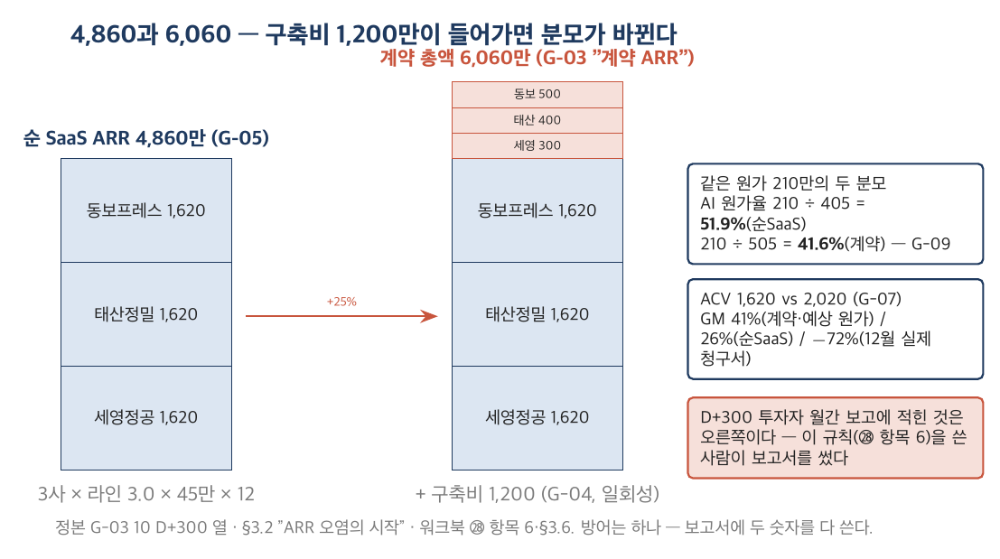

*그림 4-4. 왼쪽 막대 순 SaaS ARR 4,860만(세영·태산·동보 각 1,620만), 오른쪽 막대에 구축비 1,200만(300 + 400 + 500)이 얹혀 6,060만. 오른쪽 아래 두 숫자 — AI 원가율 51.9% vs 41.6%, ACV 1,620 vs 2,020 — 는 같은 원가·같은 계약의 다른 분모다. D+300 투자자 월간 보고에 적힌 것은 오른쪽이다.*

### 딥게이지의 사례로 읽기

> ■ **사례 사실** — 4,860 / 1,200 / 6,060만, MRR 505/405, ACV 2,020/1,620, AI 원가율 41.6/51.9%, GM 41%는 G-03~10 D+300 열; "구축비를 ARR에 넣으면 6,060만이 된다(ARR 오염의 시작)"는 정본 §3.2; 구축비 분리를 회계 규칙으로 적은 것과 D+300 월간 보고의 "계약 ARR 6,060만"은 워크북 §3.5 항목 6·§3.6 [추가 설정].

㉘ 항목 6에 구축비 분리는 계약 조항이자 회계 규칙으로 적혀 있다 — "서비스 매출 계정, ARR·MRR에 넣지 않는다". 근거 열의 리스크: "투자자 보고서에 '계약 ARR'이라는 말이 생긴다". 그것이 그대로 일어났다. D+300 월간 보고에 "계약 ARR 6,060만"이 적혔고, 이 문서를 쓴 사람이 그 보고서를 썼다. 규칙을 적은 것과 지키는 것은 다른 일이다.

GM 41%(G-10)도 같은 분모 위에 있다 — (505 − 210 − 88) ÷ 505. 순 SaaS 기준이면 (405 − 298) ÷ 405 = 26%다. 그리고 12월 실제 청구서(780만)를 넣으면 (505 − 780 − 88) ÷ 505 = **−72%**. 보고서는 210만을 썼다. 세 숫자(41 / 26 / −72%)가 전부 산수로 맞는다 — 분모와 원가의 정의가 다를 뿐이다. Day7에서 이 습관이 열 배 큰 숫자로 돌아온다. 지금 가져갈 것은 하나다: **보고서에 두 숫자를 다 쓴다** — 순 SaaS ARR 4,860만 / 계약 총액 6,060만. 하나만 쓰면 큰 쪽을 쓰게 된다.

### 실무에서 어떻게 틀리는가

구축비를 "첫 해 구독료"로 부른다. 계약 총액을 ARR이라 부른다. 보고서에 한 숫자만 쓴다. 규칙을 계약서에만 적고 장부에는 안 적는다. GM의 원가 정의를 안 적는다(예상 원가 vs 실제 청구서).

### 표준·문헌에서는

Skok의 "SaaS Metrics 2.0"과 a16z "16 Startup Metrics"(2015)가 "bookings ≠ ARR ≠ revenue"를 가장 짧게 쓴다. Bessemer *State of the Cloud*의 지표 정의도 같다. 회계 기준(수익 인식 — K-IFRS 1115 / IFRS 15)은 구축 용역과 구독을 별도 수행의무로 본다 — 판본은 인용 전에 확인한다. 6.4절.

---

## 4.5 파일럿에서 유료로 — 계약의 다섯 칸

### 개념

파일럿을 유료로 바꾸는 계약에는 다섯 칸이 있다 — 구축비 분리, 데이터 이용, 판정 오류 책임 한계, 해지·환불, 가격 인상. 각 칸은 문구와 **근거·리스크**를 함께 적는다. 책임 한계 문구는 ㉗ 항목 6의 계약 문구와 **같은 문장**이어야 한다(한 곳에서 복사). 데이터 이용 조항에는 도면 제외를 명시한다(김도윤). 가격 인상 조항은 4.3절의 공정 사용 조항이 들어올 경로다.

그리고 가격표. 공개용 한 장에서 가장 긴 칸은 **제외**여야 한다 — ㉖ Won't 목록의 공개판. 세일즈가 "검토 중"이라 답하는 순간 Won't는 다시 논의된다.

### 딥게이지의 사례로 읽기

> ■ **사례 사실** — 다섯 칸의 문구(구축비 300/400/500 · 도면 제외 · 책임 한계 162만 · 12개월/30일/50% · 연 1회 10%)와 가격표(Standard 45만 · 구축 패키지 · 제외 칸)는 워크북 §3.5 항목 6·7 [추가 설정]; 162만 = 순 SaaS ACV 1,620만 × 10%는 G-40의 원형.

책임 한계 162만의 근거 열에 적힌 리스크 — "클레임 1건 평균 2,700만(G-36)과의 격차 — 고객은 서명하고 잊는다" — 는 이 교재가 D+300에 할 수 있는 마지막 문장이다. 그 격차가 무엇을 하는지는 Day7의 일이다. 지금 가져갈 것은 두 문서(㉗·㉘)가 같은 문장을 갖고 있다는 것과, 그 문장이 검사원 화면에는 없다는 것이다(3.6절).

가격표의 제외 칸: 온프렘·MES 연동·자동판정·포털 규격 2종 이상·라인 전용 검사항목 구조. 마지막 항목이 태산정밀 62항목(B-20)의 재발 방지다 — 가격표에 "제외"로 적혀 있으면 세일즈가 "됩니다"라고 답할 수 없다.

### 실무에서 어떻게 틀리는가

책임 한계 문구가 ㉗과 다르다. 데이터 이용 조항에 도면이 포함된다. 가격표 제외 칸이 비어 있다. 플랜을 셋으로 나눠 아직 없는 기능을 상위 플랜에 적는다. 해지 조항이 없어 파일럿이 "무기한 무료"가 된다.

### 표준·문헌에서는

Moore(2014)의 whole product — 가격에 포함되는 것의 경계 — 가 가격표의 포함/제외 칸의 배경이고, PM 트랙 ⑮ 조달·계약과 ⑰ SLA가 발주자 쪽 경험이다. Day8에 여러분은 이 다섯 칸을 온담이라는 발주자에게서 **받는다** — 배상 상한 10% vs 100%.

---

## 4.6 분야별 대조 — 좌석·사용량·성과 과금의 지형 (심화)

| 메트릭 | 전형 | 고객 예측 가능성 | 원가 정렬 | NDR 원천 | 무너지는 곳 |
|---|---|---|---|---|---|
| 좌석 | 협업 도구·CRM | H | L(사용량 무관) | 인원 증가 | 계정 공유, 인원 정체 |
| 설비·자산 단위(라인·차량·매장) | 산업 SaaS, 딥게이지 | H | M(단위당 사용량 편차) | 설비 증설 | 헤비 단위, 단위 정의가 안 맞는 고객 |
| 사용량(건·호출·GB) | 인프라·API | L | H | 사용 증가 | 예산 예측 불가 → 상한 요구 |
| 결과·성과(회피 손실·매출 연동) | 광고·일부 핀테크 | L | L | 성과 증가 | 측정·귀속 분쟁 |
| 혼합(기본 + 초과분) | 대부분의 성숙 SaaS | M | M~H | 둘 다 | 복잡성 — 영업이 설명 못 함 |

딥게이지가 v1에서 라인을 고르고 v1.1에서 공정 사용(기본 6,000건 + 초과 40원)을 얹은 것은 표의 둘째 줄에서 다섯째 줄로 이동한 것이다 — 대부분의 SaaS가 가는 길이다. 다섯째 줄의 대가는 복잡성이고, 그래서 신규·갱신 계약부터다. 둘째 줄의 "단위 정의가 안 맞는 고객"은 지금 딥게이지에 없다 — 자동차 공장은 전부 라인을 센다. 그 칸이 무엇을 뜻하는지는 이 교재의 범위 밖이다.

---

## 제4장 핵심 정리

> **한 줄씩 — 수업 직전 5분 복습용**
> 1. 얼마보다 먼저 무엇에 — 밸류메트릭 4안 × 5기준. 종합은 합산이 아니라 "어느 기준을 포기했는가"의 문장.
> 2. 라인은 예측·판매 H, 원가 정렬 M을 알고 골랐다 — 알고 골랐으면 계측을 먼저 넣었어야 했다.
> 3. 유닛이코노믹스는 한 고객의 산수 — 두 열(표준 86.6% / 헤비 48.5%), 고정비는 섞지 않는다. 공헌이익 0의 사진 수는 약 39,900장.
> 4. 라인 과금의 NDR 여지는 공장의 라인 수에 묶인다(+0.2) — 실사용 2.4/3.0은 확장보다 축소가 가깝다. 상한 약 105%, GRR이 먼저.
> 5. 청구서는 금액과 고객을 말하고 원인을 말하지 않는다 — 가설 넷, 판별 계측, 첫 조치는 계측. 정답이 없는 절.
> 6. 상한은 두지 않는다 — 검사원이 촬영을 아끼면 FN이 는다. 조항은 신규·갱신부터, 소급하지 않는다.
> 7. ARR에 구축비를 넣지 않는다 — 4,860 vs 6,060. 규칙을 적은 사람이 보고서에 6,060을 썼다. 보고서에 두 숫자를 다 쓴다.
> 8. 같은 원가의 다른 분모 — AI 원가율 51.9 / 41.6%, GM 41 / 26 / −72%. 전부 산수로 맞는다. 정의를 적는다.
> 9. 계약 다섯 칸 — 구축비·데이터(도면 제외)·책임 한계(㉗과 같은 문장, 162만)·해지·인상. 가격표의 제외 칸이 Won't의 공개판.
>
> 아래는 같은 내용의 자세한 판이다.

1. 밸류메트릭의 다섯 기준은 단계마다 무게가 다르다. 시드 6개월에는 팔기 쉬운가·예측 가능한가가 무겁고, 원가 정렬은 가볍다 — 그러나 모르고 포기하는 것과 알고 포기하는 것은 다르다. 좌석 L의 근거는 커널 행동 2(검사원이 쓰게 하려면 계정을 아끼게 하면 안 된다)이고, 45만의 근거는 팀장에게 하는 말(전기 시간 39.3만 + 8D + 클레임 1건 = 20개월치)이다.
2. UE는 두 열이어야 한다. 헤비 열을 "예외"로 지우면 표준 열은 희망이 된다. 라인 과금의 구조적 한계 — 확장 여지 +0.2, 실사용 2.4 — 를 정직하게 적은 NDR 상한(105%)이 시드 IR에서 덜 좋아 보이고 Day7 데이터에서 참이다.
3. 청구서 780만 앞에서 D+284의 딥게이지가 할 수 있는 것은 가설 넷과 판별 계측과 "계측 먼저"뿐이다. 정본이 원인을 알려 주더라도 D+284에는 그 답을 쓸 수 없다 — 그것이 이 항목이 어려운 이유이고 정답이 없는 이유다. 4.1절로 돌아가면, 원가 정렬 M을 알고도 계측을 안 넣은 것이 780만이다.
4. 구축비 분리는 계약 조항이자 회계 규칙이다. 앞의 것은 있었고 뒤의 것은 흐려졌다 — D+300 월간 보고의 "계약 ARR 6,060만". 같은 원가(210만)의 두 분모(505 / 405)가 G-09의 두 값(41.6 / 51.9%)이고, GM은 41 / 26 / −72%로 세 번 맞다. 보고서에 두 숫자를 다 쓰는 것이 유일한 방어다.
5. 계약 다섯 칸의 책임 한계(162만)는 ㉗ 항목 6에서 복사한 문장이고, 근거 열의 리스크(클레임 2,700만과의 격차 — 고객은 서명하고 잊는다)가 이 교재가 D+300에 할 수 있는 마지막 문장이다. 가격표의 제외 칸(온프렘·MES·자동판정·포털 2종·항목 구조)이 B-20의 재발 방지다.

## 생각해 볼 질문

1. 여러분 회사 제품(또는 사내 시스템의 부서 과금)의 밸류메트릭은 무엇인가? 다섯 기준 중 "원가 정렬"은 H/M/L 중 무엇이고, 헤비 사용자 상위 1곳의 원가가 평균의 몇 배인지 아는가? 모르면 — 계측이 있는가?
2. 라인 과금에서 공헌이익률 0의 사진 수(약 39,900장)를 계산해 보라. 동보프레스가 그 절반이다. 두 배가 되는 고객이 나오면 무엇이 먼저 무너지는가 — 가격, 원가, 계약?
3. 여러분이 최근 본 IR 덱(또는 사업 보고서)의 ARR 숫자 하나를 골라 그 분모(무엇이 포함됐는가)를 말해 보라. 말할 수 없다면 그 숫자는 무엇인가?
4. 4.3절의 가설 넷 중 "가격 조항"이 대응인 것은 하나뿐이다. 나머지 셋의 대응을 담당 부서로 말해 보라 — 누가 청구서를 받아야 하는가?

## 워크북 연결

이 장은 Day6 워크북 **㉘ 프라이싱·밸류메트릭 결정서·유닛이코노믹스 v1**의 전 항목에 대응한다 — 항목 1·2(4.1절) · 항목 3·5(4.2절) · 항목 4(4.3절) · 항목 6(4.4·4.5절) · 항목 7(4.5절). ㉗ 항목 6(책임 한계 문구)·㉖ 항목 5(Won't → 가격표 제외 칸)·㉚ 항목 4(TIPS 압력 → 최소 계약)가 이 장을 인용한다. 심화 과제(3~7년차): 자기 회사의 매출 숫자 하나(ARR·MRR·매출액)를 골라 일회성 매출이 포함됐는지 확인하고, 포함됐다면 분리한 두 숫자를 나란히 적으라.

---

# 제5장 자본 — 텀시트·캡테이블·조항

## 5.1 텀시트를 읽는 법 — 조항마다 "우리에게 무슨 뜻인가"

### 개념

텀시트는 투자자가 보내는 두세 장의 조건 요약이다. 조항은 두 종류다 — **economics**(돈이 어떻게 나뉘는가: 밸류에이션, 청산우선권, 참가, 옵션풀, 안티딜루션)와 **control**(누가 결정하는가: 이사회, 보호 조항, drag/tag-along, 정보권). Feld & Mendelson(*Venture Deals*)의 구분이다. 읽는 법은 하나다 — 조항마다 **"우리에게 무슨 뜻인가"를 우리 숫자로** 한 줄 적는다. "참가적 우선주란 원금 회수 후 잔여 분배에도 참여하는 것"은 사전이다. "100억에서 29.6억, 비참가적이면 20억"이 뜻이다.

그리고 **없는 조항**을 행으로 적는다. 텀시트에 없는 것은 다음 라운드의 리드가 정한다.

### 딥게이지의 사례로 읽기

> ■ **사례 사실** — RCPS 12억 / pre 48 · post 60 / 20% / 참가적 1x + 상환권 연 3% + drag 60% / TIPS 8억 조건은 정본 §3.2·K-02; 참가 상한 없음·상환권 3년 후·drag에 투자자 동의 조항 없음·이사회 3 + 옵저버·옵션풀 위치 조항 없음은 워크북 §5.5 항목 1 [추가 설정]; 서영채는 정본 §6.3.

여덟 조항의 "뜻" 칸 중 셋을 옮긴다. **상환권** — 3년 뒤 13.1억(12 × 1.03³)을 요구할 수 있으나 배당 가능 이익 한도이므로 실질은 청구권이 아니라 지렛대다. **drag 60%** — 노들 20 + 강민수 36 = 56%로는 발동이 안 되고 창업자 둘 이상이 함께해야 한다; 반대로 창업 3인 72%만으로는 발동되므로 노들이 원하는 조항인지 확인해야 한다. **옵션풀 위치** — 조항이 없다. 이 마지막 행이 D+186에 추가됐다. 서영채는 첫 단독 딜의 심사역이다 — 우호적이고, 그래서 파트너 미팅에서 방어할 수 있는 숫자를 요구한다. 그가 먼저 물을 것은 월간 보고의 ARR 정의다(4.4절).

### 실무에서 어떻게 틀리는가

값만 옮기고 뜻 칸이 비어 있다. 상환권을 "3년 뒤 돌려준다"로 읽는다. 없는 조항을 적지 않는다. economics만 보고 control을 안 본다(또는 반대). 텀시트를 대표만 읽는다 — TIPS 조건이 범위·가격을 누르는데 PM이 모른다(1.2절).

### 표준·문헌에서는

Feld & Mendelson(4판, 2019) 4~5장. 한국 RCPS 실무의 상환권·전환권·참가적 배당은 상법의 종류주식 규정 위에 있다 — 판본·조문은 인용 전에 확인한다. PM 트랙 ⑮ 조달·계약의 "조건 / 대안 / 결렬 시" 형식이 발주자 쪽 경험이고, 오늘은 받는 쪽이다.

---

## 5.2 캡테이블 T0 → T1 — 주식수로 계산한다

### 개념

캡테이블은 %가 아니라 **주식수**로 계산한다. 주당가 = pre-money ÷ 라운드 전 FD 주식수. 신주 = 투자금 ÷ 주당가. 지분은 그 뒤에 나눈다. %만 적은 캡테이블은 다음 라운드에서 계산할 수 없다. 그리고 기존 주주의 주식수는 변하지 않는다 — %가 줄어드는 것은 희석이지 감소가 아니다.

> **작은 숫자로 먼저.** pre 48억 ÷ 1,000,000주 = 주당 **4,800원**. 12억 ÷ 4,800 = **250,000주**. FD 1,250,000. 노들 250,000 / 1,250,000 = **20.0%**. 강민수 450,000주는 그대로, 45.0% → **36.0%**(× 0.8). 옵션풀 100,000주 그대로, 10.0% → 8.0%. 검산: 36 + 24 + 12 + 8 + 20 = 100 ✓. post-money 60억 ÷ 1,250,000 = 4,800원 ✓ — pre와 post의 주당가가 같은 것이 정상이다(옵션풀을 pre에 신설하면 달라진다 — 5.4절).

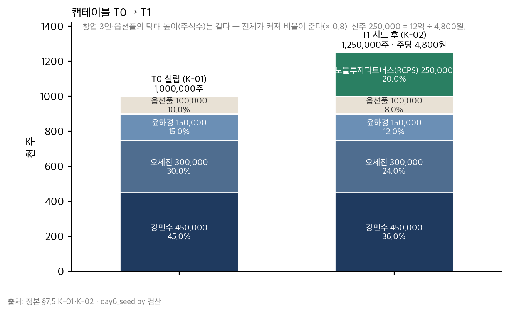

*그림 5-1. 왼쪽 T0(K-01) 1,000,000주, 오른쪽 T1(K-02) 1,250,000주. 창업 3인과 옵션풀의 막대 높이(주식수)는 같고 전체가 커져 비율이 준다. 오른쪽에 추가된 250,000주가 노들 20.0%. 주당가 4,800원.*

### 딥게이지의 사례로 읽기

> ■ **사례 사실** — K-01 → K-02(1,000,000 → 1,250,000주, 4,800원, 36/24/12/8/20)는 정본 §7.5.

㉚ 항목 2의 비고 열이 이 표의 본체다 — 옵션풀 행: "추가 풀 없음. 위치(pre/post) 미정 — 시리즈A에서 15% 요구가 오면 그때 정해진다". 시드에서 정해진 것은 8.0%라는 숫자이고, 정해지지 않은 것은 다음 풀이 누구 지분에서 나오는가다.

### 실무에서 어떻게 틀리는가

%만 적는다. 옵션풀 10 → 8%를 "줄었다"고 적는다. 주당가를 post ÷ FD로 계산한다(같지만, 옵션풀 pre 신설 시 틀린다). 전환사채·SAFE를 FD에 넣거나 빼는 기준이 없다(전환 전에는 FD 밖, 전환 조건은 비고에).

### 표준·문헌에서는

Feld & Mendelson(2019) 4장의 캡테이블 산수와 YC SAFE post-money 표준 문서의 정의(post-money = pre + 투자금, FD의 정의에 옵션풀 포함 여부)가 원전이다.

---

## 5.3 청산우선권 — 참가적 1x가 가져가는 것

### 개념

청산우선권(liquidation preference)은 매각·청산 시 우선주가 **먼저** 받는 금액이다. 1x면 원금. **비참가적**이면 우선주는 원금과 지분 환산액 중 큰 쪽을 택한다 — max(원금, 지분 × 매각가). **참가적**이면 원금을 먼저 받고 **나머지의 지분 비율을 또** 받는다 — 원금 + 지분 × (매각가 − 원금). 참가에 상한(cap, 예: 3x)이 있을 수도 있고 없을 수도 있다.

> **작은 숫자로 먼저.** 투자 12억, 지분 20%. 매각가 100억. 비참가적: max(12, 20) = **20억**. 참가적 1x: 12 + 0.2 × 88 = **29.6억**. 차이 **9.6억**. 매각가 30억: 비참가적 max(12, 6) = 12 / 참가적 12 + 0.2 × 18 = 15.6 — 차이 3.6억이지만 매각가의 12%. 매각가 300억: 60 / 69.6 — 차이 9.6억, 매각가의 3.2%. **작은 매각일수록 참가적의 비중이 크다.** 창업자 3인(참가적·풀 pre 70%)은 30억에서 12.6억, 100억에서 61.6억, 300억에서 201.6억.

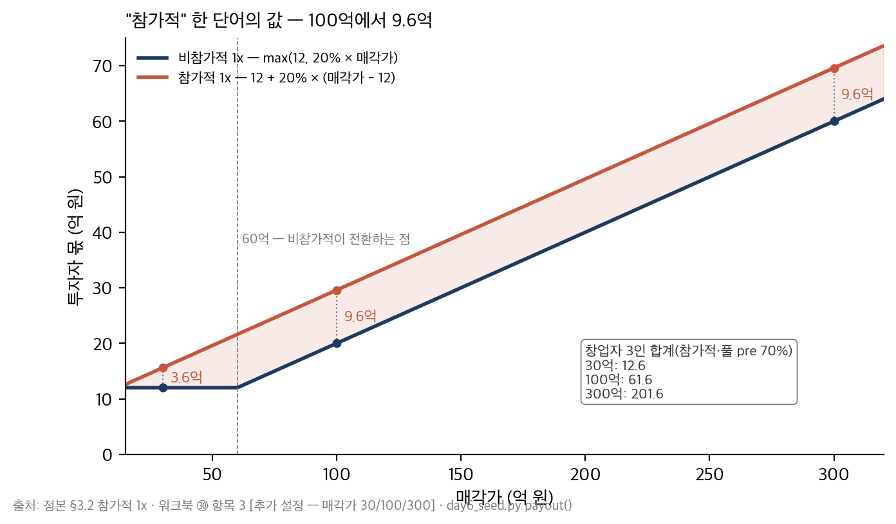

*그림 5-2. 가로축 매각가(30·100·300억), 세로축 투자자 몫. 아래 선이 비참가적(max(12, 20% × 매각가) — 60억에서 꺾인다), 위 선이 참가적 1x(12 + 20% × (매각가 − 12)). 두 선의 간격이 "참가적" 한 단어의 값 — 100억에서 9.6억. 오른쪽 작은 표가 창업자 3인 합계.*

### 딥게이지의 사례로 읽기

> ■ **사례 사실** — 참가적 1x는 정본 §3.2; 매각가 3구간(30/100/300억)과 네 조합의 산출, 창업자 3인 합계(12.6 / 61.6 / 201.6), 실제 K-02 행은 워크북 §5.5 항목 3과 day6_seed.py [추가 설정]; 협상 요청 2번의 결과(거절)는 워크북 §5.5 항목 5.

㉚ 항목 3의 표에서 학생이 직접 계산해야 하는 열은 100억이다 — 네 조합 전부. 그 산수를 한 사람만 항목 5의 2번(참가 상한 3x 또는 비참가)을 협상 목록에 올린다. 딥게이지는 올렸고, 거절당했다 — "시드 RCPS 표준입니다". 그리고 서명했다. 왜 서명했는가는 5.6절(BATNA)이다. 옵션풀은 매각 시 전량 부여·행사로 가정했다(보수적) — 미부여로 두면 창업자 몫이 부풀려진다.

### 실무에서 어떻게 틀리는가

참가적을 "1x 받고 끝"으로 계산한다. 한 구간만 계산한다(300억에서는 차이가 작아 보인다). 옵션풀을 0으로 둔다. 상한(cap)의 유무를 안 본다. 후속 라운드 우선주와의 순위(senior / pari passu)를 안 본다 — ㉚ 항목 6.

### 표준·문헌에서는

Feld & Mendelson(2019) 4장 "Liquidation Preference"가 원전이다. 참가적 우선주는 미국 초기 단계에서는 드물어졌지만 한국 RCPS 실무에서는 흔하다 — 이것도 "표준 문구예요"의 한 형태이며, Day8 한강벤처스의 같은 문장을 미리 듣는 셈이다.

---

## 5.4 옵션풀의 위치 — 없는 조항이 가장 비싸다

### 개념

옵션풀(미발행 주식 유보)을 라운드 **전**(pre-money)에 신설·증액하면 그 희석은 기존 주주만 진다 — 투자자는 정확히 합의된 %를 받는다. 라운드 **후**(post-money)에 신설하면 투자자를 포함한 전체가 진다. 텀시트의 "투자 전 옵션풀 n% 설정"이라는 한 줄은 pre-money 밸류를 그만큼 깎는 것과 같다. Day5 4.4절에서 배웠고, ㉑ 항목 3에 "추가 풀은 post-money 요구"를 적었다.

시드에서 그 차이는 작다. 그러나 조항이 **없으면** 다음 라운드의 리드가 정하고, 시드 계약에 문장이 있으면 다음 리드는 그 문장을 지워야 한다. 금액이 아니라 **선례**가 이 조항의 값이다.

> **작은 숫자로 먼저.** 풀 합계 10%를 라운드 후 FD 기준으로 요구받았다고 하자. post 기준: 기존 1,250,000 − 풀 100,000 = 1,150,000이 90% → FD 1,277,778, 새 풀 27,778주, 투자자 250,000 / 1,277,778 = **19.57%**, 창업자 70.43%. pre 기준: 창업자 900,000주가 70% → FD 1,285,714, 투자자 20.0%, 풀 128,571(새 28,571), 주당가 48억 ÷ 1,028,571 = **4,667원**(4,800이 아니다). 창업자 차이 **0.43%p**. 시리즈A 15% pre는 1.29%p(K-04, Day8).

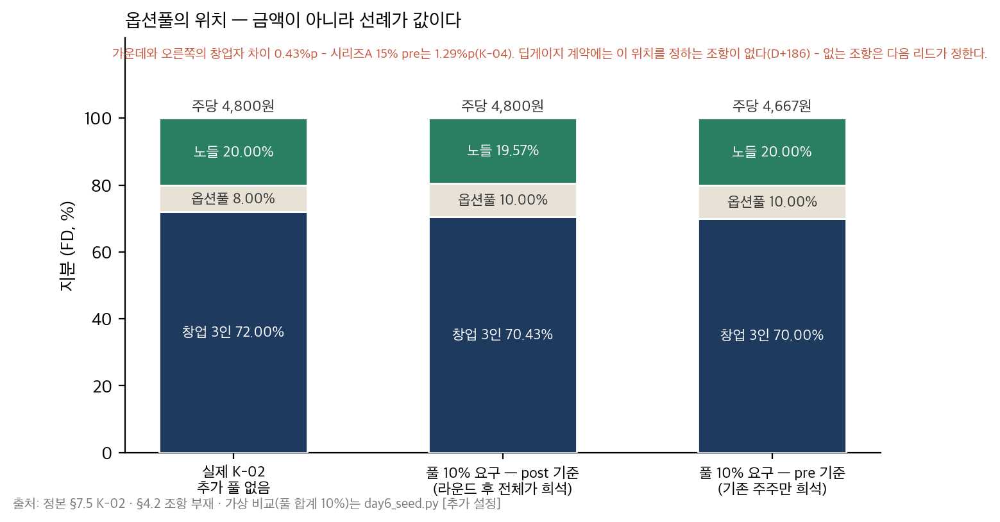

*그림 5-3. 왼쪽 실제 K-02(추가 풀 없음 — 투자자 20.0, 창업자 72.0, 풀 8.0). 가운데 post 기준 추가 풀(투자자 19.57, 창업자 70.43, 풀 10). 오른쪽 pre 기준(투자자 20.0, 창업자 70.0, 풀 10, 주당가 4,667원). 가운데와 오른쪽의 차이 0.43%p가 "투자 전 옵션풀 설정" 한 줄의 값이고, 딥게이지 계약에는 그 줄이 없다.*

### 딥게이지의 사례로 읽기

> ■ **사례 사실** — "텀시트에 옵션풀 위치 조항이 없다는 것을 서명 후 발견"은 정본 §4.2; 협상 요청 1번의 문구·구두 합의·미기재·D+186 부속 메모·노들 회신("시리즈A 리드가 정할 사항")은 워크북 §5.5 항목 5·부속 메모 [추가 설정]; 0.43%p·4,667원은 day6_seed.py; F-01은 제작 노트 §3.

D+172 협상 요청 1번: "본 라운드 이후 옵션풀을 신설·증액할 경우 그 희석은 라운드 후 전체 주주가 지분 비율대로 부담한다." 서영채의 답: "그건 시리즈A 때 얘기죠." 구두로 넘어갔고, 텀시트에도 주주간계약서에도 없다. D+186에 발견했다. 노들 회신: "시리즈A 리드가 정할 사항이며 시드 계약에 넣는 것은 관행이 아니다." 부속 메모의 마지막 줄 — **구두 합의는 조항이 아니다.**

Day5 ㉑ 항목 3에서 시작한 F-01은 여기서 끝나지 않는다. 시드에서 문장을 얻지 못한 것이 Day8 시리즈A 텀시트의 "옵션풀 15% pre-money"를 만나는 조건이다. 그때 여러분이 꺼낼 것은 이 부속 메모다.

### 실무에서 어떻게 틀리는가

옵션풀 위치를 텀시트에서 찾지 않는다(없는 것을 찾지 않는다). 구두 합의를 합의로 센다. 시드에서는 금액이 작아 "다음에"로 미룬다 — 선례가 값이라는 것을 모른다. 주당가가 4,800과 4,667로 달라지는 이유를 모른다.

### 표준·문헌에서는

YC SAFE post-money 표준 문서가 옵션풀을 "post-money capitalization"에 포함하는 방식으로 이 문제를 정의로 해결했고, Feld & Mendelson(2019) 4장 "Option Pool"이 pre-money 풀의 효과("option pool shuffle")를 설명한다.

---

## 5.5 TIPS와 제품 계획 — 외부 시계의 압력

### 개념

조건부 자금의 조건은 새 결정을 요구하지 않는다 — **이미 내린 결정을 지킬 것인가**를 묻는다. "6개월 안에 유료 5개사"는 최소 계약(라인 2·12개월)을 깨고 라인 1개·6개월 계약을 받고 싶게 하고, Won't(온프렘)를 깨고 H사 계열을 넣고 싶게 하며, 평가 지표를 "유료 고객 수"로만 보고하고 싶게 한다. 그래서 ㉚ 항목 4의 대응 칸은 새 문장이 아니라 ㉖·㉘의 **인용**이다. 새 문장이 있다면 그것은 ㉘을 고친 것이고 ㉘의 개정 이력에 있어야 한다.

### 딥게이지의 사례로 읽기

> ■ **사례 사실** — TIPS 8억(2년)·6개월 내 유료 5개사는 정본 §3.2; 운영사 추천 조건(D+360 = 2027-02)·1차년도 5억·선정 D+217·세 압력과 대응은 워크북 §5.5 항목 4 [추가 설정 — 공식 요강이 아니라 운영사가 제시한 조건].

세 줄. 라인 1개 계약의 유혹 → 최소 계약 유지, 파이프라인 4사를 D+300 전에 알파 라인으로, 세일즈 채용 앞당김(D+200). 온프렘 고객의 유혹 → Won't 유지, 도면 미업로드 모드로 풀리는 고객 먼저(B-19). 평가 지표의 유혹 → 월간 보고에 계약 라인/실사용(G-18)과 오류 예산 소진 여부를 같이 — 서영채에게 먼저. 8억은 R&D 자금이고 지분 희석이 없다 — 그래서 조건이 자본 조건보다 제품 조건에 가깝다.

### 실무에서 어떻게 틀리는가

조건을 대표만 안다. 압력 칸이 "일정 준수". 대응이 "열심히". 조건을 채우려고 가격표를 바꾸고 개정 이력에 안 남긴다. 조건부 자금을 자본처럼 런웨이에 넣는다(집행 시점·용도 제한이 있다).

### 표준·문헌에서는

정부 R&D·매칭 자금의 조건은 프로그램마다 다르고 운영 요강으로 정해진다 — 이 교재는 요강을 발명하지 않는다(제작 노트 §1.2). 조건이 제품 결정을 누른다는 구조는 Wasserman(2012)의 "자원과 통제의 거래"에서 같은 형태로 나온다.

---

## 5.6 협상 요청과 BATNA — 약한 BATNA를 적는 정직함

### 개념

협상 요청은 **텀시트에 들어갈 문장**으로 적는다 — "우호적으로 검토 부탁"은 요청이 아니다. 세 개까지. 순서는 우리에게 큰 것부터가 아니라 **상대에게 싼 것을 하나 섞는 것**이다 — 셋 다 거절당하면 아무것도 없고, 하나가 수용되면 나머지의 구두 합의가 생긴다.

그리고 BATNA(협상 결렬 시 최선의 대안)를 **정직하게** 적는다. 약하면 약하다고. 그것은 패배 선언이 아니라 **왜 2번 없이 서명했는지를 6개월 뒤의 자신에게 설명하는 기록**이다.

### 딥게이지의 사례로 읽기

> ■ **사례 사실** — 협상 요청 3(옵션풀 post / 참가 상한 3x 또는 비참가 / drag에 창업자 과반)과 결과(구두 → 미기재 / 거절 / 수용), BATNA(다른 운영사 2곳 조건 미제시 · 잔액 1,505만 · 규모 축소 8억)는 워크북 §5.5 항목 5 [추가 설정].

3번(drag에 창업자 과반 동의)은 노들에게 비용이 없었다 — 지금 노들 20%는 어차피 창업자 없이 60%를 못 채운다. 그래서 수용됐고, 그래서 1번의 구두 합의가 생겼다. 2번(참가 상한)은 9.6억의 이야기였고 거절됐다. 서명한 이유는 BATNA다 — D+149 잔액 1,505만, 대안 운영사 조건 미제시, TIPS 추천이 노들에 묶임. 9.6억은 100억 매각의 이야기이고 1,505만은 다음 주 급여의 이야기다.

Day8에 여러분은 시리즈A 텀시트 두 장을 받는다. 그때 BATNA는 다르다 — 그때 이 문단을 다시 읽으라.

### 실무에서 어떻게 틀리는가

요청이 "검토 요청"이다. BATNA가 "다른 투자자"(미팅·조건 없이). 협상 결과를 안 적는다(6개월 뒤 "그때 얘기했잖아"가 어느 판본인지 다툰다). 상대에게 싼 요청을 안 섞는다. 약한 BATNA를 숨기고 밀어붙이다 라운드가 깨진다.

### 표준·문헌에서는

BATNA는 Fisher & Ury, *Getting to Yes*(1981)의 어휘다. Feld & Mendelson(2019)은 "무엇을 협상할 것인가"의 목록에서 economics 둘·control 하나를 고르라고 권한다 — 딥게이지의 셋이 정확히 그 구성이다. PM 트랙 ⑮의 "결렬 시" 칸이 발주자 쪽 경험이다.

---

## 제5장 핵심 정리

> **한 줄씩 — 수업 직전 5분 복습용**
> 1. 텀시트는 economics(돈이 어떻게 나뉘는가)와 control(누가 정하는가) — 조항마다 "우리 숫자로 무슨 뜻인가"를 적고, 없는 조항도 행으로 적는다.
> 2. 캡테이블은 주식수로 — 4,800원 × 250,000주. 주식수는 그대로, 지분은 × 0.8. 10% → 8%는 감소가 아니라 희석.
> 3. 참가적 1x = 원금 + 지분 × 나머지 — 100억에서 29.6 vs 20.0, 9.6억. 작은 매각일수록 비중이 크다(30억에서 12%).
> 4. 옵션풀의 위치는 금액(0.43%p)이 아니라 선례가 값이다 — 구두 합의는 조항이 아니다. 없는 조항은 다음 리드가 정한다.
> 5. TIPS 조건은 새 결정이 아니라 지킬 것인가를 묻는다 — 대응은 ㉖·㉘의 인용. 새 문장이면 개정 이력에.
> 6. 협상 요청은 텀시트 문장으로 셋, 상대에게 싼 것을 하나 섞는다. BATNA는 정직하게 — 1,505만이 다음 주 급여다.
>
> 아래는 같은 내용의 자세한 판이다.

1. 여덟 조항 중 상환권(13.1억 — 실질은 지렛대), drag 60%(노들 + 강민수 56%로는 부족), 옵션풀 위치(없음)의 "뜻" 칸이 이 문서의 본체다. 뜻 칸은 항목 3의 산수를 한 뒤에만 쓸 수 있다 — 항목 1을 마지막에 채운다.
2. pre 48억 ÷ 1,000,000 = 4,800원, 12억 ÷ 4,800 = 250,000주, FD 1,250,000. K-02 36/24/12/8/20. 옵션풀 행의 비고("추가 풀 없음, 위치 미정")가 다음 라운드로 넘어가는 문장이다.
3. 네 조합 × 3구간의 표에서 학생이 반드시 직접 계산하는 것은 100억 열이다. 참가적의 값은 투자자가 전환하는 구간(매각가 60억 이상)에서 원금 × (1 − 지분) = 12 × 0.8 = 9.6억으로 일정하고, 그래서 작은 매각일수록 비중이 크다. 옵션풀은 전량 행사 가정(보수적).
4. F-01의 두 번째 장면: 협상 1번 → 구두 합의 → 미기재 → D+186 발견 → 노들 "시리즈A 리드가 정할 사항". 부속 메모가 Day8 ㊴에서 꺼낼 문서다.
5. 세 압력(라인 1개 계약 · 온프렘 고객 · 지표 축소)의 대응이 전부 인용(최소 계약 · Won't · G-18 병기)인 것은 옳다 — 조건은 결정을 요구하지 않고 결정의 유지를 요구한다.
6. 3번(drag)이 수용된 것은 노들에게 비용이 없어서이고, 그것이 1번의 구두 합의를 만들었다. 2번(참가 상한 9.6억) 없이 서명한 이유는 BATNA 문단 — 그 문단을 적는 것이 이 문서의 정직함이다.

## 생각해 볼 질문

1. 여러분 회사(또는 부서)가 최근에 서명한 계약에서 "우리에게 무슨 뜻인가"를 숫자로 쓸 수 없는 조항을 세 개 찾아 보라. 채우려면 무엇을 계산해야 하는가?
2. 참가적 1x의 값이 100억과 300억에서 같은 9.6억인 이유를 산식으로 설명해 보라. 그러면 참가적이 창업자에게 가장 아픈 매각가는 어디인가?
3. 시드에서 옵션풀 조항 한 줄을 얻는 것과 시리즈A에서 1.29%p를 지키는 것 — 어느 쪽이 더 어려운가? 왜?
4. 여러분의 협상에서 "상대에게 싼 요청"은 무엇이었는가? 그것이 없었다면 나머지 요청은 어떻게 됐을까?

## 워크북 연결

이 장은 Day6 워크북 **㉚ 시드 텀시트·캡테이블 v1**의 전 항목에 대응한다 — 항목 1(5.1절) · 항목 2(5.2절) · 항목 3(5.3·5.4절) · 항목 4(5.5절) · 항목 5·6·부속 메모(5.6·5.4절). Day5 ㉑ 항목 3·8이 입력이고, Day8 ㊴(텀시트 레드팀·캡테이블 v2)가 이 문서를 다시 꺼낸다. 심화 과제(3~7년차): 자기 회사의 캡테이블(또는 가장 가까운 자료 — 주주 구성)을 주식수로 다시 쓰고, 옵션풀의 위치 조항이 어느 계약에 있는지 찾으라. 없으면 "없음"이라고 적는다 — 그것이 답이다.

---

# 제6장 이 날의 학술 배경과 읽을 자료 (과정 후)

## 6.1 Shape Up과 애자일 — 왜 기간 고정인가

### 무엇인가
Singer의 *Shape Up*(Basecamp, 2019)은 6주 사이클·appetite·shaping(범위를 거칠게 설계)·betting(무엇에 걸 것인가)·회로 차단기로 이루어진 제품 개발 방식이다. 스크럼과의 차이는 백로그를 두지 않는다는 것(사이클마다 pitch를 새로 건다)과 견적 대신 appetite를 쓴다는 것이다.

### 실무자에게
시드 단계에 그대로 가져올 수 있는 것은 어휘(appetite = 기간, 회로 차단기)와 "scope hammering"(정의 축소)이다. 그대로 가져올 수 없는 것은 6주(성숙한 제품·작은 팀의 전제)와 "백로그 없음"(유료 5개사라는 외부 시계 아래에서는 고객 요청을 어딘가에 적어야 한다 — ㉖ 항목 2가 그 자리다).

### 흔한 오독
"Shape Up = 6주 스프린트". 아니다 — 사이클 길이는 appetite의 상한이고, 작은 배치(small batch)는 2주다. "견적을 하지 않는다 = 공수를 모른다". 아니다 — 팀 크기 × 사이클이 공수이고, 그 안에서 범위를 정한다.

### 어디를 읽을 것인가
Part 1 "Shaping"(특히 "Set Boundaries" — appetite의 정의), Part 2 "Betting"(회로 차단기), Part 3 "Building" 중 "Decide When to Ship"(scope hammering). 무료 공개(basecamp.com/shapeup).

## 6.2 Kohavi — 실험의 신뢰성: OEC·SRM·peeking

### 무엇인가
Kohavi, Tang & Xu, *Trustworthy Online Controlled Experiments*(2020)는 대규모 온라인 실험의 교과서다. OEC(단일 판정 지표), 가드레일 지표, SRM(표본 비율 불일치 — 설계와 다른 비율이면 실험이 오염된 것), peeking(중간에 보고 유의하면 멈추는 것의 오류율 팽창), 최소 검출 효과와 표본 계산.

### 실무자에게
딥게이지 규모(고객 3사, 사진 수백 장)에서 A/B 테스트의 통계는 대부분 쓸 수 없다. 쓸 수 있는 것은 **규율**이다 — OEC 하나, 분석 시점 고정, peeking 금지, SRM 점검, 성공 기준을 결과 전에. X-05·X-06처럼 모집단이 3이면 "전수"라고 적고 3/3을 기준으로 삼는다. 그것도 사전등록이다.

### 흔한 오독
"표본이 작으면 실험을 할 수 없다". 아니다 — 검정력 계산이 안 될 뿐이고, 사전등록의 규율은 표본과 무관하다. "유의하지 않으면 효과가 없다". 아니다 — 검출할 수 없었던 것이다(그림 2-4의 점선).

### 어디를 읽을 것인가
1~3장(OEC·가드레일·함정), 17장(peeking·early stopping), 21장(SRM). Nosek 외, "The Preregistration Revolution"(PNAS, 2018)을 함께 — 예측과 사후 설명의 분리를 가장 짧게 쓴다.

## 6.3 Shankar 외 — criteria drift, 평가자를 평가하기

### 무엇인가
Shankar 외, "Who Validates the Validators? Aligning LLM-Assisted Evaluation of LLM Outputs with Human Preferences"(2024)는 사람이 LLM 출력을 평가하는 기준을 정할 때 **출력을 보면서 기준이 바뀐다**는 것을 관찰했다 — criteria drift. 기준을 먼저 적게 해도 결과를 보면 기준이 움직인다.

### 실무자에게
3.4절의 개정 절차가 이 관찰의 대응이다. 기준을 결과 전에 적는 것으로 충분하지 않다 — 결과를 본 뒤 기준을 **낮추는** 데 외부 근거와 상위 승인을 요구해야 한다. FN 8.1% 앞에서 8.0%를 8.1%로 고치고 싶은 것이 criteria drift의 가장 흔한 형태다.

### 흔한 오독
"LLM 평가에만 해당". 아니다 — 사람이 결과를 보며 기준을 정하는 모든 평가에 해당한다. 검사원이 초안을 보며 "이 정도면 양품"이라고 기준을 옮기는 것도 같다.

### 어디를 읽을 것인가
논문 본문(짧다)과 EvalGen 도구 설명. 함께 읽을 것 — Gebru 외 "Datasheets for Datasets"(2018/2021)·Mitchell 외 "Model Cards"(2019): 데이터셋·모델이 무엇에 쓰이면 안 되는가를 칸으로 두는 형식(3.3절의 여집합).

## 6.4 SaaS 지표의 계보 — Skok·a16z·Bessemer, 그리고 burn multiple

### 무엇인가
David Skok의 "SaaS Metrics 2.0"(forEntrepreneurs 블로그)이 MRR·ARR·churn·CAC·LTV·payback의 실무 정의를 정리했고, a16z의 "16 Startup Metrics"(2015)가 "bookings ≠ revenue ≠ ARR", "GMV ≠ revenue" 같은 오염을 목록으로 만들었으며, Bessemer *State of the Cloud* 연례 보고서가 벤치마크를 준다. burn multiple(순소진 ÷ 순증 ARR)은 David Sacks(2020)가 제안했고 efficiency score는 그 역수다.

### 실무자에게
Day6에서 쓴 것은 ARR의 정의(구축비 제외)와 burn multiple(4.26 — 분기 소진 2.07억 ÷ 순증 ARR 4,860만)이다. 시드 단계의 burn multiple은 분모가 작아 크게 나온다 — 벤치마크보다 **정의**가 중요하다: 순증 ARR을 계약 기준(6,060)으로 잡으면 3.42가 된다. 같은 회사의 두 숫자.

### 흔한 오독
"LTV:CAC 3:1이 기준". 벤치마크는 성숙 SaaS의 것이고, 시드에서 LTV는 churn 데이터가 없어 계산할 수 없다 — 계산했다면 가정을 열거해야 한다(Day7 ㉝). "burn multiple이 낮을수록 좋다" — 분모(순증 ARR)의 정의가 같을 때만.

### 어디를 읽을 것인가
Skok "SaaS Metrics 2.0" 전문(길지만 표만 봐도 된다), a16z "16 Startup Metrics"·"16 More Startup Metrics", Sacks "The Burn Multiple"(2020). 회계 쪽은 IFRS 15 / K-IFRS 1115의 수행의무 개념 — 판본은 확인.

## 6.5 Feld & Mendelson — economics와 control

### 무엇인가
*Venture Deals*(4판, 2019)는 텀시트를 economics(밸류에이션·옵션풀·청산우선권·참가·안티딜루션·베스팅)와 control(이사회·보호 조항·drag-along·전환)로 나누고, 조항마다 "왜 투자자가 이것을 원하는가"와 "창업자는 무엇을 협상할 수 있는가"를 쓴다. YC의 SAFE post-money 표준 문서(2018 개정)는 옵션풀·전환의 정의를 문서 자체에 넣어 협상을 줄였다.

### 실무자에게
㉚ 항목 1의 "우리에게 무슨 뜻인가" 칸은 이 책의 각 장을 딥게이지 숫자로 번역한 것이다. 한국 RCPS의 상환권은 미국 텀시트에 없는 조항이므로 이 책에 없다 — 상법 종류주식 규정과 국내 실무 자료로 보완한다.

### 흔한 오독
"표준 문구니까 협상 불가". 표준은 관행이지 규칙이 아니다 — 딥게이지의 3번(drag)이 수용된 것이 그 증거다. "밸류에이션이 전부". 참가적 한 단어가 100억에서 9.6억이다 — pre 48과 pre 52의 차이보다 크다.

### 어디를 읽을 것인가
4장 "Economic Terms of the Term Sheet", 5장 "Control Terms", 9장 "Negotiation Tactics". Wasserman(2012) 9~10장(투자자와 통제)을 함께.

## 6.6 서지와 읽는 순서

| 순서 | 문헌 | 이유 |
|---|---|---|
| 1 | Singer, *Shape Up* (2019) Part 1~2 | 가장 짧고, 오늘 당장 바꿀 수 있는 것(appetite의 어휘) |
| 2 | Feld & Mendelson (2019) 4~5장 | ㉚의 사전 — 조항의 뜻 |
| 3 | Bryar & Carr (2021) 4장 | PR/FAQ의 원형 |
| 4 | Skok "SaaS Metrics 2.0" · a16z "16 Startup Metrics" | ARR·구축비·burn multiple의 정의 |
| 5 | Kohavi 외 (2020) 1~3·17장 · Nosek 외 (2018) | 사전등록의 규율 |
| 6 | Beyer 외 SRE (2016) 3~4장 · Shankar 외 (2024) · Gebru 외 · Mitchell 외 | 오류 예산 · criteria drift · 데이터셋 문서화 |
| 7 | ISO/IEC 25010 · ISO/IEC 42001 · Google *Rules of ML* | 표준의 어휘 — 인용할 때 |

*판본과 서지는 인용 전에 확인한다(제작 노트 §1.2). 위 목록의 출간 연도는 원서 기준이다.*

## 6.7 읽을 자료 — 필수 / 심화 / 참고

**필수 (과정 전)**

| 자료 | 분량 | 왜 |
|---|---|---|
| Singer, *Shape Up* (2019) Part 1 "Shaping" · Part 2 "Betting" | 60쪽 | ㉖ Appetite·회로 차단기 |
| Bryar & Carr, *Working Backwards* (2021) 4장 | 30쪽 | ㉙ PR/FAQ |
| Feld & Mendelson, *Venture Deals* (4판) 4~5장 | 60쪽 | ㉚ 조항의 뜻 |
| `교재/공통/가상회사_딥게이지.md` §3.2 · §4.2~4.4 · §6.1~6.3 · §7.3 v1 열 · §7.5 K-01·K-02 | 20분 | 사례 |
| Day5 워크북 ㉓ 항목 4·7 · ㉕ 항목 6 · ㉑ 항목 3 | 10분 | 오늘의 입력 |

**심화 (과정 후)** — **30일 안에**: Kohavi 외(2020) 1~3·17장 · Skok "SaaS Metrics 2.0" · a16z "16 Startup Metrics" · Beyer 외 SRE 3~4장. **90일 안에**: Shankar 외(2024) · Gebru 외 · Mitchell 외 · Wasserman(2012) 9~10장 · Croll & Yoskovitz(2013) · Moore(3판) 4장 whole product.

**참고 (워크북을 쓰다가 손을 뻗어 확인할 것)** — ISO/IEC 25010 품질 특성 표 · ISO/IEC 42001:2023 개요 · Google *Rules of ML* Rule 1~10 · YC SAFE post-money 표준 문서 · Nosek 외(2018) · Sacks "The Burn Multiple"(2020) · PM 트랙 Day3 워크북 §2.5(⑫ Rules of Credit) · Day4 워크북 §2(⑰ error budget) · Day2 워크북 §1(⑥ 제외 범위) · Day3 워크북 §5(⑮ 조달·계약).

### 읽지 않아도 되는 것

"MVP 만드는 법" 류의 개론서 — appetite와 견적의 구별(2.1절)을 다루지 않는다. 텀시트 "표준 양식" 모음 — 조항의 뜻(5.1절) 없이 문구만 있다. SaaS 벤치마크 리포트의 숫자만 — 분모의 정의(4.4절) 없이 비교하면 오염을 정당화한다.

## Day6를 마치며 — Day7 예고

이 교재는 네 질문으로 요약된다. **무엇을 만들지 않을 것인가**(41 → 24 → 17, Won't의 재검토 조건), **AI 기능은 언제 된 것인가**(분자·분모, 모집단의 여집합, FN 8.1%의 불합격, 오류 예산이 놓치는 것, 두 문구), **무엇에 얼마를 받을 것인가**(라인 45만, 두 열, 780만의 가설 넷, 4,860 vs 6,060), **누구 돈으로 어떤 조건으로**(4,800원 × 250,000주, 참가적 9.6억, 없는 조항). 여러분의 답이 워크북 ㉖~㉚의 다섯 산출물이고, 그 산출물은 Day7(PMF 추적 — 곡선은 평탄해졌는가)의 입력이 된다.

Day7은 D+300에서 D+600까지 열 달을 하루에 산다. 데이터 일자는 2027-10-23이다. 21명, 유료 31개사. 오늘 세영정공 오전 1라인에 "합격 전 베타"로 켜 둔 판정 초안이 그 열 달 동안 어떻게 되는지, 오늘 D+284에 "계측 먼저"라고 적은 청구서의 원인이 무엇이었는지, 오늘 6,060만이라고 적힌 월간 보고가 어디로 가는지, 오늘 오류 예산이 놓친다고 적은 FN이 어디서 잡히는지 — Day7 워크북 §0.3에 있다. 그리고 코호트 세 장이 있다. 그 판독의 규율은 오늘 X-04의 사전등록서에서 시작했다 — 분모를 먼저, 결과를 보기 전에 기준을.

범위 시점에 잘못 적힌 것은 측정 시점에 고쳐지지 않는다. 그것이 오늘 여러분이 Won't에 재검토 조건을 적고, 데이터셋의 여집합을 비우지 않고, 0.1%p를 반올림하지 않고, 청구서 앞에서 가설을 넷 세우고, 구두 합의를 조항으로 세지 않은 이유다.
