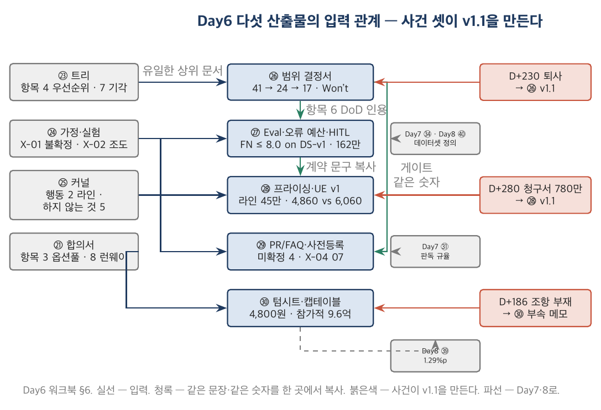

# Product 트랙 Day6 워크북 — 시드 단계 산출물

> **이 워크북의 위치** — Product 트랙 2일차(8일 과정의 여섯째 날). 시점 **D+120 ~ D+300 (2026-06-30 ~ 12-27)**, 회사 상태 5명 → 12명, 시드 RCPS 12억 클로징(D+180), 첫 유료 3개사, 현금 15.4억. 교재 `Day6_교재.pdf`가 "왜"를, 이 워크북이 "무엇을 어느 칸에"를 다룬다. 딥게이지에 관한 숫자는 `교재/공통/가상회사_딥게이지.md` §7(G·V·E·K)을 정본으로 하고, 정본에 없는 값은 `[추가 설정]`으로 표시하며 검산은 `../그림/Product_Day6/src/day6_seed.py`에 있다.

## 목차

- 0. 이 워크북을 쓰는 법
- 1. MVP 범위 결정서 (㉖ MVP Scope Decision — Appetite · MoSCoW · Won't)
- 2. AI 기능 Eval Set 명세서·오류 예산·HITL 승인 설계 (㉗ AI Eval Specification, Error Budget & Human-in-the-loop)
- 3. 프라이싱·밸류메트릭 결정서·유닛이코노믹스 v1 (㉘ Pricing, Value Metric & Unit Economics v1)
- 4. PR/FAQ·실험 사전등록서·베타 진입 기준 (㉙ PR/FAQ, Experiment Pre-registration & Beta Criteria)
- 5. 시드 텀시트·캡테이블 v1 (㉚ Seed Term Sheet & Cap Table v1)
- 6. Day6 산출물 5종의 상호 관계 — 그리고 Day5·PM 트랙 문서로 되돌아가는 것
- 7. Day7로 이어지는 것
- 읽을 자료

---

## 0. 이 워크북을 쓰는 법

### 0.1 워크북 사용법

> **■ 이 워크북을 따라가는 순서 — 모든 산출물 공통**
> 1. **읽는다.** X.1(왜 쓰는가) → X.2(표준·문헌 위치) → X.3(항목별 작성 가이드). 막히면 항목 아래 📖가 가리키는 교재 절을 펼친다.
> 2. **찾는다.** X.3 끝의 **◆ 실습 입력 카드** — 정본 §·앞 산출물·추가 조건. 오늘은 Day5와 달리 **찾을 것이 많다** — 백로그 견적표 29건, eval 데이터셋 60건의 분자·분모, 파일럿 3사 제원, 청구서 내역, 텀시트 조건. 카드에 있는 숫자를 쓰고, 없는 숫자는 만들지 않는다.
> 3. **쓴다.** 카드의 **★ 수업 중 과제**에 적힌 항목을 X.4 빈 템플릿(또는 인쇄용 PDF)에 딥게이지로 직접 쓴다. **X.5 예시본은 아직 펼치지 않는다.**
> 4. **대조한다.** 다 쓴 뒤 X.5 완성 예시본과 칸별로 대조하고, X.6 해설에서 차이가 난 칸의 이유를 읽는다. 해설은 정답이 아니라 **즉시 탈락 조건**과 **방어 가능한 답의 범위**를 쓴다.
> 5. **바꿔 쓴다.** X.7 실습(조건을 바꾼 변형 과제·자기 회사 과제)은 복습과 과정 후 과제다.
>
> 수업에서는 3단계를 산출물당 20~45분(카드의 ★에 적힌 시간)으로 하고, X.5·X.6은 그날 저녁에 읽는 것이 정상이다.

1. PM 트랙·Day5 워크북과 같은 규칙으로 쓴다. 교재가 "왜", 워크북이 "무엇을 어느 칸에".
2. **역할은 그대로, 시계만 옮긴다.** 여러분은 여전히 딥게이지의 창업팀이다. 어제 D+90에 쓴 다섯 문서(㉑~㉕)가 오늘의 입력이다. 시계는 D+120으로 옮겨져 있고, 오늘 하루 동안 D+300까지 6개월을 산다. 어제와 달리 오늘의 문서는 대부분 **두 번 쓰인다** — v1.0을 쓰고, 사건(퇴사·청구서·조항 부재)이 일어나고, v1.1을 쓴다. 그 두 판본의 차이가 이 날의 학습이다.
3. **시점을 고정한다.** 이 워크북의 기준일은 **2026-12-24(목), D+297**(D+300은 일요일)이다. 다섯 산출물의 작성일 — ㉖ v1.0 D+130 → v1.1 D+235 / ㉗ D+151 / ㉘ v1.0 D+137 → v1.1 D+284 / ㉙ D+158 / ㉚ v1.0 D+172 → 부속 메모 D+186. D+300 이후의 숫자(자동판정 채택률, 코호트, 사고, eval v2)는 이 워크북에 없다 — 있으면 실수다.
4. **분모를 선언한다.** 오늘의 분모는 어제와 다르다 — **가용 공수(man-month)**, **판정 단위(항목 건)**, **라인**, **FD 주식수**, **매각가**. "FN 8.1%"는 "불량 296건 중 초안이 양품이라 한 24건"이고, "Must 58%"는 "가용 24 mm 중 14.0 mm"다. 비율 옆에 분자·분모를 적지 않은 칸은 빈칸으로 본다.
5. 각 산출물의 X.3은 항목마다 네 칸 — *무엇을 / 어떻게 / 흔한 오류 / 딥게이지에서는 이렇게*. 자기 회사 문서를 쓸 때는 "흔한 오류" 칸을 체크리스트로 쓰라.
6. X.7 실습의 **기본 과제**는 딥게이지의 조건 하나를 바꾼 변형 과제, **심화 과제**(3~7년차)는 자기 회사의 제품(또는 사내 서비스)으로 같은 문서 쓰기.
7. 표준·문헌 인용은 Singer, *Shape Up*(2019), Bryar & Carr(2021), Kohavi 외(2020), Skok "SaaS Metrics 2.0", Feld & Mendelson(4판, 2019), ISO/IEC 25010, Google *Rules of ML*을 기준으로 한다. 판본은 인용 전에 확인한다.
8. **인쇄용 PDF.** 다섯 산출물의 빈 템플릿은 A4 인쇄용 PDF로 제공한다. 각 산출물의 X.4 첫 줄에 개별 파일 경로가 있고, 한 번에 인쇄하려면 통합본을 쓴다.
    - 📄 빈 양식 5종 통합본: [`../템플릿/Product_Day6/00_Day6_템플릿팩_빈양식.pdf`](../템플릿/Product_Day6/00_Day6_템플릿팩_빈양식.pdf) (A4, 20쪽 — 백로그 견적표·루브릭·사전등록서는 가로)
    - 📄 완성 예시 5종 통합본: [`../템플릿/Product_Day6/00_Day6_템플릿팩_완성예시.pdf`](../템플릿/Product_Day6/00_Day6_템플릿팩_완성예시.pdf)
    - LaTeX 소스: `../템플릿/Product_Day6/src/` (`build.sh`, tectonic). 명세는 `../템플릿/Product_specs.py`, 기입 내용은 `../템플릿/Product_fills.py`.

### 0.2 8일 동안 만드는 산출물 전체 목록(40종)과 Day6의 위치

| 트랙 | 일차 | 산출물 | 이 산출물의 입력 | Day6 산출물과의 관계 |
|---|---|---|---|---|
| PM | Day1 | ① 비즈니스 케이스 ② 헌장 ③ 이해관계자 ④ 거버넌스·RACI ⑤ 프리모템 | — | — |
| PM | Day2 | ⑥ 범위·WBS ⑦ RTM ⑧ 일정 ⑨ 원가 기준선 ⑩ 리스크 정량화 | Day1 | ⑥ 100% 규칙의 거울이 ㉖ Won't 목록 · ⑨ 원가 기준선의 거울이 ㉘ UE |
| PM | Day3 | ⑪ 변경요청서 ⑫ 성과보고 EVM ⑬ 이슈·리스크 ⑭ 품질 기록 ⑮ 조달·계약 | Day2 | **⑫ Rules of Credit AI 항목 ↔ ㉗ 합격 기준** · ⑪ CR ↔ ㉖ v1.1 · ⑮ 조달 ↔ ㉚ 텀시트(받는 쪽) |
| PM | Day4 | ⑯ 컷오버·SAC ⑰ 운영 이관·SLA ⑱ 종료 보고서 ⑲ 교훈 ⑳ 편익 원장 | Day3 | ⑰ error budget ↔ ㉗ 오류 예산 |
| Product | Day5 | ㉑ 창업 헌장 ㉒ 인터뷰 27 ㉓ 트리 ㉔ 가정·실험 ㉕ 세그먼트·커널 | ⑱ 6번 | **㉓이 ㉖ 백로그의 유일한 상위 문서** · ㉔ X-01 불확정 → ㉗ HITL · ㉕ 커널 행동 2 → ㉘ 라인 과금 · ㉑ 항목 3 → ㉚ 협상 1번 |
| **Product** | **Day6** | **㉖ MVP 범위 결정서** | ㉓·㉔ | 오늘의 첫 문서 — 41 → 24 → 17 |
| **Product** | **Day6** | **㉗ Eval 명세·오류 예산·HITL** | ㉖·㉔ | AI 기능의 완료 정의. **데이터셋 정의가 Day8까지 따라간다** |
| **Product** | **Day6** | **㉘ 프라이싱·UE v1** | ㉕·㉑ | 밸류메트릭 4안 → 라인 45만 → 청구서 780만 |
| **Product** | **Day6** | **㉙ PR/FAQ·사전등록·베타 기준** | ㉖·㉔ | 결과 전에 서명하는 문서 |
| **Product** | **Day6** | **㉚ 시드 텀시트·캡테이블 v1** | ㉑ | 참가적·상환권·drag·옵션풀 × 매각가 3구간 |
| Product | Day7 | ㉛ 코호트 판독 ㉜ North Star 트리 ㉝ UE v2 ㉞ 사고 보고·Eval v2 ㉟ 로드맵·예산 3분리 | ㉙·㉘·㉗ | ㉙ 사전등록이 ㉛ 판독 규율 · ㉘ UE v1이 ㉝ v2의 기준선 · ㉗ 오류 예산이 ㉞에서 개정 |
| Product | Day8 | ㊱ 딜 데스크 ㊲ 경계·SLA·배상 ㊳ IR·재무모델 ㊴ 텀시트 레드팀 ㊵ 편익 원장 공동 확정본 | ㉖·㉟·㉝·㉚ | ㉖ Won't의 절반이 ㊱ 47건으로 돌아온다 · ㉚ 옵션풀 부속 메모가 ㊴ 1.29%p · **㉗ 데이터셋 정의가 ㊵ 최종 명제** |

Day6의 다섯 산출물은 모두 **"무엇을 하지 않을지를 숫자로 정하는 문서"**다. Day5가 "무엇이 참이어야 하는가"였다면 오늘은 "참이라고 밝혀진 것 중 무엇을 6개월 안에, 얼마에, 어떤 합격선으로, 누구 돈으로 만드는가"다.

### 0.3 딥게이지 한 페이지 요약 — D+120 ~ D+300 상태

**회사(D+120).** 5명(창업 3 + 김태오 개발 + 이수민 현장 CS), 현금 약 **5,400만**(월 3,230만 → 런웨이 1.7개월), 유료 0, LOI 2건(세영정공·태산정밀). 노들투자파트너스와 시드 협상 중 — 선투자 2억(D+150)이 오면 산다, 안 오면 D+170에 돈이 끝난다(Day5 ㉑ 항목 8).

**회사(D+300).** **12명**(G-01), 월 고정비 **6,900만**(G-11), 현금 **15.4억 / 런웨이 22개월**(G-15). 시드 RCPS **12억**(pre 48 · post 60, 노들 20%, K-02) 클로징 D+180. TIPS 일반트랙 8억(2년) 선정 D+217. 유료 **3개사**(세영정공·태산정밀·동보프레스, 각 라인 3.0) — 순 SaaS ARR **4,860만**(G-05), 구축비 **1,200만**(G-04), 계약 총액 **6,060만**(G-03). AI 추론 원가 월 210만(G-08) — 그러나 12월 청구서는 **780만**(G-39). 개발 가용 공수 24 → **17 man-month**(G-37), 백로그 견적 **41 man-month**(G-38).

**만든 것.** GAUGE Inspect(사진·음성 → 검사기록, 편집·승인, 마스터 매핑, 조도 경고) + GAUGE Flow 일부(부적합 패키지, H사 포털 규격 내보내기, 8D D1~D3 초안, 판정 로그). 판정 초안(외관 결함 분류)은 세영정공 오전 1라인 **베타** — 검사원 승인 필수, 자동판정 없음. eval v1(D+270): OCR 91.4% / FN **8.1%** / FP 14.6% / F1 0.78 — 합격 기준 FN ≤ 8.0%를 **0.1%p 넘긴 채** GA에 들어갔다(V-01~06).

**D+120 ~ D+300에 일어난 일 [추가 설정 — 정본 §4.2~4.4에 있는 것은 표시].** D+126 조현우(앱)·서하늘(ML) 합류, 개발 4명 → D+130 **㉖ v1.0** 41 → 24 mm 절단 → D+137 ㉘ v1.0 라인당 월 45만 → D+149 잔액 1,505만 → D+150 노들 선투자 2억 → D+151 ㉗ v1.0 → D+158 ㉙ v1.0 → D+165 초기창업패키지 1억 → D+172 ㉚ 텀시트 검토, 협상 요청 3 → **D+180 시드 클로징 RCPS 12억**[정본 4.2] → D+186 주주간계약 검토 중 **옵션풀 위치 조항 부재 발견**[정본 4.2] → D+190 10명 → D+200 동보프레스 "도면 미업로드 모드" 조건으로 파일럿(김도윤 공문) → D+217 TIPS 선정, 운영사 추천 조건 "2027-02(D+360)까지 유료 5개사" → **D+230 조현우 퇴사**[정본 4.3] — "커스터마이징 요청만 하다가 끝난다" → D+235 **㉖ v1.1** 24 → 17 mm → D+240 세영정공 첫 유료 → D+260 태산정밀 유료(62항목) → D+270 eval v1 측정 → D+275 동보프레스 유료 → **D+280 클라우드 청구서 780만**[정본 4.4] — 초과 570만의 78%(444만)가 동보프레스 → D+280 X-07 분석(오후 재촬영률 9.4% — **불확정**) → D+284 ㉘ v1.1 → D+290 X-04 분석(수용률 71% / 회피 행동 14% — **불확정**, A-05b 열어 둠) → D+300 GA. X-05(3/3 라인 계약)·X-06(매핑 9·6·10일) 성공.

**사람(이 날 등장).** [딥게이지] 강민수 CEO · 오세진 CTO · 윤하경 CPO · 김태오 · 조현우(D+230 퇴사) · 서하늘 · 임준호 · 이수민 · 박정우 세일즈 / [노들투자파트너스] 서영채 심사역 33 — 첫 단독 딜 / [세영정공] 정미영 품질팀장 · 박선재 검사원(베타 라인) / [태산정밀] 품질팀장(62항목 요구) / [동보프레스] 품질팀장(월 사진 19,400건) / [H사] 김도윤 SQE("공문으로 주세요").

**이 날의 숫자(정본 ID).** G-01 12명 / G-03~07 ARR·MRR·ACV / G-08·09 AI 원가 210만·41.6%/51.9% / G-10 GM 41% / G-11 6,900만 / G-13·14 burn multiple 4.26·0.23 / G-15 15.4억·22 / G-18 계약 라인 3.0·실사용 2.4 / G-37 24→17 / G-38 41 / G-39 210→780 / V-01~07 v1 / K-01·K-02 / 정본 §3.2 시드 표·UE 표.

### 0.4 Day5와 PM 트랙에서 가져오는 것

| Day6 산출물 | 받는 입력 | 어느 문서 어느 항목 | 대조할 것 |
|---|---|---|---|
| ㉖ 범위 결정서 | 해법 우선순위 1~5 · 기각·보류 목록 · "하지 않는 것" 5 | Day5 ㉓ 항목 4·7, ㉕ 항목 6 | 백로그 29건의 상위 노드(OP-ID) 열이 ㉓의 잎과 일치하는가 — 상위 노드 없는 항목은 어디서 왔는가 |
| ㉖ 항목 5 Won't | WBS의 100% 규칙 — 제외 범위를 적는 자리 | PM Day2 워크북 §1(⑥ 항목 "제외 범위") | 발주자는 제외 범위를 **받았고**, 공급자는 **정한다** |
| ㉖ v1.1 | 변경요청서의 문법 — 무엇이 바뀌었고 왜, 누가 승인 | PM Day3 워크북 §1(⑪) | 범위를 줄이는 CR을 자기 자신에게 낸다 |
| ㉗ 합격 기준 | Rules of Credit — AI 항목의 완료 판정(측정·판정자·모집단) | PM Day3 워크북 §2.5(⑫) 항목 3 | Day3에서 여러분은 **발주자로서** 그 판정을 요구했다. 오늘 **공급자로서** 쓴다 |
| ㉗ 오류 예산 | SLA의 error budget — 소진 시 조치 | PM Day4 워크북 §2(⑰) | 가용성 예산 → 판정 오류 예산 |
| ㉗ HITL | X-01 불확정 — A-05b(수용) 미제거 | Day5 ㉔ 카드 ①, 항목 5 | 자동판정 OFF·검사원 책임 한계 문구가 그 답이다 |
| ㉘ 밸류메트릭 | 커널 행동 2 "라인 단위, 좌석 무제한" · A-06 · 전기 시간의 돈(라인당 39.3만/월) | Day5 ㉕ 항목 4, ㉔ A-06, day5_discovery.py | 커널이 정한 것을 4안 비교로 **다시** 검증한다 |
| ㉘ UE | 원가 기준선 — 값·단위·출처·분모 | PM Day2 워크북 §4(⑨) | 원가의 분모가 SKU·FP에서 **사진 건수·라인**으로 |
| ㉙ 사전등록 | 실험 카드의 문법(성공 기준을 결과 전에) · 내부 FAQ "미확정 — X-nn" | Day5 ㉔ 항목 4·5 | 카드 3 → 사전등록 4 |
| ㉚ 텀시트 | 옵션풀 "추가 풀은 post-money 요구"(협상 1번) · 베스팅 · 런웨이 2.7개월 | Day5 ㉑ 항목 3·4·8 | 협상 1번이 텀시트에 **문장으로** 들어갔는가 |
| ㉚ | 조달·계약 — 조건을 읽고 대안을 쓰는 법 | PM Day3 워크북 §5(⑮) | 이번에는 계약서를 **받는** 쪽 |

---

## 1. MVP 범위 결정서 (㉖ MVP Scope Decision — Appetite · MoSCoW · Won't)

### 1.1 이 문서는 무엇이고 왜 쓰는가

> 📖 **먼저 읽기** — Day6 교재 제1·2장: 1.1절(시드 단계의 네 결정) · 2.1절(Appetite — 기간을 고정한다) · 2.2절(견적과 절단 — 41 → 24) · 2.3절(Won't — "나중에"가 아니다) · 2.4절(두 번째 절단 — 24 → 17). 개념·문헌·딥게이지 사례는 거기에 있고, 여기서는 칸을 채우는 법만 다룬다.

MVP 범위 결정서는 "6개월 동안 무엇을 만들고 **무엇을 만들지 않을지**"를 공수(man-month)와 함께 적은 문서다. PM 트랙의 범위 기술서·WBS(⑥)가 "합의된 100%를 빠짐없이 분해"하는 문서였다면, 이 문서는 **합의된 100%가 없는 상태에서 100%를 정하는** 문서다. 그래서 형식이 다르다 — WBS에는 공수 상한이 없고(원가 기준선이 따로 있다), 이 문서에는 상한이 먼저 온다. Appetite 6개월, 개발 4명, 24 man-month. 백로그 견적 합계는 41이다. 17이 넘친다. 이 문서는 그 17을 **어디에 버릴지** 적는 문서다.

세 가지가 이 문서를 시드 단계의 첫 문서로 만든다. 첫째, **외부 시계**가 있다 — TIPS 운영사의 추천 조건은 "2027-02까지 유료 5개사"이고, 그 5개사가 쓸 수 있는 제품이 D+300에 있어야 한다. 둘째, **상위 문서**가 있다 — Day5의 기회-해법 트리(㉓). 백로그의 모든 항목은 트리의 잎(OP-ID) 아래 있어야 하고, 잎 아래 없는 항목은 "누가 왜 넣었는가"를 답해야 한다. 셋째, 이 문서는 **두 번 쓰인다** — D+130 v1.0(41 → 24)과 D+235 v1.1(24 → 17, 조현우 퇴사 후). 두 판본 사이에 무엇이 달라졌는가가 Day6의 첫 학습이다.

이 문서에서 가장 자주 비는 칸은 Won't 목록의 "재검토 조건"이다. Won't를 "나중에"로 적으면 그 항목은 고객이 물을 때마다 다시 논의되고, 논의될 때마다 조금씩 만들어진다. 태산정밀의 62개 검사항목이 그렇게 만들어졌고, 그것이 조현우가 떠난 이유다.

### 1.2 표준·문헌에서의 위치

| 출처 | 위치 | 대응 산출물 명칭 | 비고 |
|---|---|---|---|
| Singer, *Shape Up* (Basecamp, 2019) | Ch. "Set Boundaries" — appetite / Ch. "Betting" | pitch, appetite, circuit breaker | **Appetite는 기간이지 범위가 아니다** — 이 문서의 어휘 |
| DSDM / MoSCoW (Clegg & Barker, 1994) | Must ≤ 60% 규칙 | MoSCoW prioritisation | Must 공수 비중의 상한 관행 |
| Ries, *The Lean Startup* (2011) | MVP — 최소가 아니라 "학습에 필요한 최소" | minimum viable product | 무엇을 배우기 위한 범위인가 |
| Cagan, *Inspired* (2판, 2018) | Part IV — 제품 발견 vs 제품 인도 | delivery | 발견이 끝난 것만 인도한다 |
| PM 트랙 ⑥ 범위·WBS / ⑪ CR | 100% 규칙 · 제외 범위 · 변경의 서면 | scope baseline / change request | 같은 칸을 반대편에서 — Won't = 제외 범위, v1.1 = 자기에게 내는 CR |
| PMBOK 8판 | Delivery 성과영역 — 범위의 점진적 상세화 | progressive elaboration | 절단은 상세화의 한 형태 |

### 1.3 항목별 작성 가이드

#### 항목 1. 문서 정보와 Appetite

*📖 교재 2.1절(Appetite — 기간을 고정한다)*

- **무엇을 적는가**: 버전·기준일 / Appetite(기간) / 가용 공수와 그 근거(누가 몇 개월) / 외부 시계(TIPS·시드 조건) / 승인자.
- **어떻게 적는가**: Appetite는 "6개월"처럼 **기간**으로 적는다. "24 mm"는 가용 공수이지 Appetite가 아니다. 가용 공수는 이름과 개월로 근거를 단다 — "4명 × 6개월"이 아니라 "오세진·김태오·조현우·서하늘 × D+120~300".
- **흔한 오류**: Appetite 칸에 기능 목록을 쓴다(범위 고정). CTO를 가용 공수에 100% 넣는다(실제 50~70%). 외부 시계를 안 적어 절단의 이유가 사라진다.
- **딥게이지에서는 이렇게**: Appetite 6개월(D+120~300, GA 2026-12-27). 가용 24 mm = 4명 × 6개월(CTO 실무 포함 — 그것이 v1.1에서 문제가 된다). 외부 시계: TIPS 추천 조건 유료 5개사(D+360), 시드 클로징 D+180.

#### 항목 2. 백로그 견적표

*📖 교재 2.2절(견적과 절단 — 41 → 24) · Day5 교재 2.5절(기회-해법 트리)*

- **무엇을 적는가**: B-ID / 항목 / 상위 노드(㉓ OP-ID 또는 "고객 요청"·"기반") / 견적 mm / MoSCoW / 근거·의존.
- **어떻게 적는가**: 견적은 개발자가 낸 것을 그대로 적는다(PM이 깎지 않는다 — 깎는 것은 범위이지 견적이 아니다). 상위 노드가 없는 항목은 그렇게 표시한다 — 그 항목이 어디서 왔는지가 절단의 첫 질문이다.
- **흔한 오류**: 견적표를 PM 혼자 만든다. 항목을 잘게 쪼개 합계가 41이 아니라 "대략 40"이 된다. 상위 노드 열을 비운다.
- **딥게이지에서는 이렇게**: 29건, 합계 **41.0 mm**[추가 설정 — G-38]. 상위 노드 없는 항목 6건(고객 요청 4·기반 1·㉗ 1). 견적표는 ◆ 카드로 **주어진다** — 여러분이 하는 것은 MoSCoW 열이다.

#### 항목 3. Must 공수 비중 산식

*📖 교재 2.2절(견적과 절단) · 2.4절(두 번째 절단 — 24 → 17)*

- **무엇을 적는가**: Must 합 / Must ÷ 가용 / 상한 규칙 / 초과 시 조치 — **24 mm 기준과 17 mm 기준 두 번**.
- **어떻게 적는가**: 상한 규칙을 먼저 적고(예: Must ≤ 60%, 예비 25%, Should ≤ 15%) 그 다음 계산한다. 분자·분모를 mm로 적는다. 17 mm 기준에서는 "이미 쓴 공수"와 "남은 공수"를 분리한다 — 쓴 것은 되돌릴 수 없다.
- **흔한 오류**: 상한 규칙 없이 비율만 적는다. 예비(버그·온보딩·파일럿 지원)를 0으로 둔다. 17 mm 기준을 "24 × 17/24"로 비례 축소한다 — 이미 쓴 공수는 비례하지 않는다.
- **딥게이지에서는 이렇게**: 24 기준 Must 14.0 / 24 = **58.3%**(≤ 60% ✓), 예비 6.0(25%), Should 4.0. 17 기준 Must 총량 11.8 / 17 = **69.4%**(초과) — 남은 5.5 mm로 Must 1.1 · Should 1.5 · 예비 2.9.

#### 항목 4. 절단 결정 — 41 → 24 → 17

*📖 교재 2.2절 · 2.4절*

- **무엇을 적는가**: 무엇을 어느 시점(24/17)에 어디로(Should→Could, Could→Won't, 축소) 보냈는가, 사유, 통보 대상·일자.
- **어떻게 적는가**: 한 행에 한 항목. "축소"는 항목을 지우는 것이 아니라 정의를 바꾸는 것이므로(포털 자동 제출 → 내보내기) 바뀐 정의를 적는다. 통보 대상은 그 항목을 기다리는 사람 — 파일럿 고객·투자자·세일즈.
- **흔한 오류**: 절단을 적지 않고 백로그에서 조용히 지운다. 통보 열을 비운다(고객은 그 기능이 온다고 믿고 있다). 17로 자를 때 24의 손실 원인을 분해하지 않는다.
- **딥게이지에서는 이렇게**: 24 → 17의 손실 7.0 mm를 다섯 줄로 분해했다 — 조현우 잔여 2.2 / **태산정밀 커스텀(계획 외) 2.2** / 인수인계·채용 1.0 / WIP 폐기 0.7 / B-02 조도 재작업 0.9. 절반이 퇴사 자체가 아니라 그 전에 새어 나간 것이다.

#### 항목 5. Won't 명시 목록

*📖 교재 2.3절(Won't — "나중에"가 아니다)*

- **무엇을 적는가**: B-ID / 항목 / **재검토 조건(무엇이 되면)** / 시점.
- **어떻게 적는가**: 재검토 조건은 측정 가능한 사건 — "유료 5개사 달성", "1차사 채널 계약", "eval FN ≤ 3%". "고객이 원하면"은 조건이 아니다(항상 원한다). Day5 ㉕ 항목 6 "하지 않는 것"과 ㉓ 항목 7 기각 목록을 그대로 잇는다.
- **흔한 오류**: Won't 칸에 "Later"를 쓴다. 재검토 조건이 없어서 고객이 물을 때마다 다시 논의한다. 온프렘을 Won't에 쓰고 세일즈가 "검토 중"이라 답한다.
- **딥게이지에서는 이렇게**: v1.0 Won't 3건 11.0 mm(자동판정·온프렘·MES 연동) + v1.1에서 대시보드 추가. 온프렘의 재검토 조건: "유료 5개사 후 **또는** 1차사 채널 계약 시" — ㉕와 같은 문장.

#### 항목 6. 완료 정의(DoD)

*📖 교재 3.1절(AI 기능의 완료 정의는 왜 다른가) · PM Day3 교재 2.2절(Rules of Credit)*

- **무엇을 적는가**: 일반 기능 / AI 판정 기능(→ ㉗) / 데이터 이관·온보딩 / 문서·교육 — 각각의 완료 정의와 판정자.
- **어떻게 적는가**: 일반 기능은 "테스트 통과·배포·파일럿 1사 사용"처럼 관찰 가능한 사건. AI 기능은 **㉗의 합격 기준을 인용만** 한다(여기서 다시 쓰지 않는다 — 두 곳에 쓰면 갈린다).
- **흔한 오류**: AI 기능의 DoD를 "동작함"으로 쓴다. 온보딩(마스터 매핑)을 DoD 밖에 둔다 — 그러면 계약 후 2주가 어디에도 없다.
- **딥게이지에서는 이렇게**: AI 판정 기능 DoD = "㉗ 항목 3 합격 기준 충족 + HITL 승인 흐름 가동". 합격 전이면 화면에 "합격 전 베타" 표시.

#### 항목 7. 릴리스 계획 — 알파 / 베타 / GA 게이트

*📖 교재 2.5절(게이트와 베타 진입 기준)*

- **무엇을 적는가**: 게이트별 진입 기준(숫자) / 판정자 / 목표 시점.
- **어떻게 적는가**: 진입 기준은 ㉙ 항목 5와 **같은 숫자**여야 한다 — 한쪽에서 복사한다. 판정자는 한 사람.
- **흔한 오류**: 게이트 기준이 날짜뿐이다(날짜는 목표이지 기준이 아니다). ㉙와 다른 숫자.
- **딥게이지에서는 이렇게**: 알파 D+200(세영 1라인, 자동 생성 성공률 ≥ 90%) / 베타 D+240(3사, 기록 시간 ≤ 25분·오전 OCR ≥ 90%·재촬영 < 15%) / GA D+300(유료 3사·eval v1 측정·오류 예산 가동·HITL).

#### 항목 8. 리스크·가정 → 실험 사전등록

*📖 교재 2.5절 · Day5 교재 3.4절(실험 카드와 사전등록)*

- **무엇을 적는가**: 이 범위가 틀릴 수 있는 이유 3~5개 / 어느 실험(X-ID, ㉙ 항목 4)이 검증하는가 / 소유자.
- **어떻게 적는가**: Day5 ㉔의 미제거 가정(A-05b·A-06·A-08·A-11)에서 시작한다. 실험이 없는 리스크는 "관찰만"이라고 적는다.
- **흔한 오류**: 리스크를 적고 실험을 안 단다. 실험 ID가 ㉙에 없다.
- **딥게이지에서는 이렇게**: 5개 — A-05b(X-04) · A-06(X-05) · A-08(X-06) · A-02 오후 조도(X-07) · 유료 5개사(관찰만 — 실험이 아니라 세일즈).

> **◆ 실습 입력 카드 — 이 산출물을 쓰기 위해 주어지는 것**
>
> **시점**: v1.0 D+130 (2026-07-10) — 개발 4명이 된 지 나흘째. v1.1 D+235 (2026-10-23) — 조현우 퇴사 닷새 뒤.
>
> **사례 정본에서 찾는다** (`교재/공통/가상회사_딥게이지.md`): §3.2 시드 표(G-37 24 → 17, G-38 41, TIPS 조건) · §4.3 조현우 퇴사 · §1.3 GAUGE 모듈 표(자동판정은 D+300 이후) · §6.2 태산정밀(62개 요구)
>
> **앞 산출물에서 가져온다**: Day5 ㉓ 항목 4(해법 우선순위 1~5)·항목 7(기각·보류) · ㉕ 항목 6(하지 않는 것 5) · ㉔ 미제거 가정 A-05b·A-06·A-08·A-11 · PM ⑥의 "제외 범위" 칸 형식
>
> **추가로 주어지는 조건** — 정본에 없는 값이다. 예시본은 이 값을 쓰며, 여러분도 그대로 쓴다:
> - **백로그 견적표 29건, 합계 41.0 mm** — §1.5 항목 2 표의 B-ID·항목·상위 노드·mm 열(MoSCoW 열은 비어 있다고 보고 여러분이 채운다)
> - 가용 공수 24 = 오세진(CTO, 실무 100% 가정)·김태오·조현우·서하늘 × 6개월. 상한 규칙은 여러분이 정한다(관행: Must ≤ 60%, 예비 20~25%)
> - D+235 상태: 완료 B-01·02·04·05·07·12·24(계획 10.0 mm) · 진행 중 B-03·08·10(살린 부분 0.7) · 예비 사용 0.8 · **태산정밀 62항목에 이미 2.2 mm 사용(B-20, 계획 외)** · B-02 조도 재작업 초과 0.9 · 조현우 WIP 폐기 0.7 · 인수인계·채용 1.0 · 조현우 잔여 2.2
> - TIPS 운영사 추천 조건: 2027-02(D+360)까지 유료 5개사 [추가 설정 — 공식 요강이 아니라 운영사가 딥게이지에 제시한 조건]
>
> **여러분이 결정하는 것(찾지 않는다)**: MoSCoW 배분 · 상한 규칙 · 24 → 17에서 무엇을 축소·이동할지 · Won't 재검토 조건 · 통보 대상
>
> **★ 수업 중 과제** — 4교시, 약 40분 — 항목 **3(산식 두 번) · 4(절단 결정 — 41 → 24는 MoSCoW 열로, 24 → 17은 손실 분해와 재절단으로) · 5(Won't 목록)**를 §1.4에 딥게이지로 채운다. 나머지는 §1.5 예시본으로 확인. **정답을 보지 말고 쓰고, 다 쓴 뒤 대조하라.**

### 1.4 빈 템플릿

📄 인쇄용: [`../템플릿/Product_Day6/26_MVP범위결정서_빈템플릿.pdf`](../템플릿/Product_Day6/26_MVP범위결정서_빈템플릿.pdf) (A4 5쪽, 견적표는 가로)

**1. 문서 정보와 Appetite** — 버전/기준일 · Appetite(기간) · 가용 공수(mm) — 근거 · 외부 시계 · 승인자/승인일

**2. 백로그 견적표** — B-ID / 항목 / 상위 노드 / 공수(mm) / MoSCoW / 근거·의존 (29행 — ◆ 카드의 표를 옮기고 MoSCoW 열을 채운다)

**3. Must 공수 비중 산식**

| 항목 | 24 mm 기준 | 17 mm 기준(퇴사 후) |
|---|---|---|
| Must 합(mm) | [ ] | [ ] (쓴 것 + 남은 것) |
| Must ÷ 가용(%) | [ ] | [ ] |
| 상한 규칙 | [ ] | [ ] |
| 초과 시 조치 | [ ] | [ ] |

**4. 절단 결정 — 41 → 24 → 17** — B-ID / 항목 / 절단 시점(24/17) / 사유 / 통보 대상·일자 (8행)

**5. Won't 명시 목록** — B-ID / 항목 / 재검토 조건 / 시점 (6행)

**6. 완료 정의(DoD)** — 일반 기능 / AI 판정 기능(→ ㉗) / 데이터 이관·온보딩 / 문서·교육 — 완료 정의 · 판정자

**7. 릴리스 계획** — 알파 / 베타 / GA — 진입 기준 · 판정자 · 목표 시점(D+n)

**8. 리스크·가정 → 실험 사전등록** — # / 리스크·가정 / 검증 실험(X-ID) / 소유자 (5행)

### 1.5 딥게이지 완성 예시본

> ■ **먼저 쓰고 나서 펼치라.** 항목 2의 B-ID·항목·상위 노드·mm 열은 입력이므로 먼저 읽는다. MoSCoW 열과 항목 3·4·5는 §1.4에 직접 쓴 뒤 대조한다.

📄 인쇄용: [`../템플릿/Product_Day6/26_MVP범위결정서_완성예시.pdf`](../템플릿/Product_Day6/26_MVP범위결정서_완성예시.pdf)

**MVP 범위 결정서 v1.1** — 딥게이지 · GAUGE · v1.0 2026-07-10(D+130) → **v1.1 2026-10-23(D+235)** · 작성 윤하경 CPO · 승인 강민수·오세진

**1. 문서 정보와 Appetite**

| 항목 | 내용 |
|---|---|
| 버전 / 기준일 | v1.0 D+130(41 → 24) → v1.1 D+235(24 → 17, 조현우 퇴사 후 재산정) |
| Appetite(기간) | **6개월 — D+120 ~ D+300(2026-06-30 ~ 12-27), GA 12-27.** 기간이 고정이고 범위가 변수다. 기간이 끝나면 남은 것은 다음 사이클로 간다(회로 차단기) |
| 가용 공수(mm) — 근거 | v1.0 **24** = 오세진(CTO, 실무 100% 가정) · 김태오 · 조현우(D+126) · 서하늘(D+126) × 6개월 (G-37) → v1.1 **17** = 24 − 손실 7.0(항목 4 분해) |
| 외부 시계 | 시드 클로징 D+180 · TIPS 운영사 추천 조건 **유료 5개사(D+360, 2027-02)** · 파일럿 3사 유료 전환 D+240~275 · 세영정공 LOI "2026-09 시작" |
| 승인자 / 승인일 | 강민수·오세진 / v1.0 D+130 · v1.1 D+235 — CPO 거부권(㉑ 항목 5) 미행사 |

**2. 백로그 견적표** [추가 설정 — 합계 41.0 mm, G-38] — MoSCoW는 v1.0 기준, → 표시는 v1.1 변경

| B-ID | 항목 | 상위 노드(㉓) | mm | MoSCoW | 근거·의존 |
|---|---|---|---:|---|---|
| B-01 | 사진 촬영·업로드 앱(오프라인 큐·라인 선택) | OP-01(a) | 2.0 | Must | X-01 방식의 자동화. 기록이 나는 곳 |
| B-02 | 치수 OCR 파이프라인(VLM 호출·항목 매핑·신뢰도) | OP-01(a) | 2.5 | Must | X-02 88.7% — 오전 93.1에서 시작. **실제 3.4** |
| B-03 | 음성 메모 첨부·텍스트 변환(STT) | OP-01(b) | 0.5 | Must | 문장 생성(B-26)과 분리 — 변환만 |
| B-04 | 검사기록 편집·승인 화면(웹) | OP-01 | 1.5 | Must | HITL 승인의 자리(㉗ 항목 6) |
| B-05 | 검사항목 마스터 매핑 도구(엑셀 업로드) | OP-01 / A-08 | 1.0 | Must | 온보딩 2주(X-06)의 전제 |
| B-06 | 조도 경고(밝기 검사·재촬영 안내) | OP-05 / X-02 | 0.5 | Should | X-02 오후 84.7% 대응. 싸고 안전 |
| B-07 | 부적합(NCR) 등록 — 사진·기록·판정 묶음 | OP-02(a) | 1.5 | Must | 팀장이 돈을 내는 이유(A-03) |
| B-08 | H사 SQ 포털 제출 초안(규격 1종) | OP-02(a) | 1.5 | Must → **축소 0.4** | 파일럿 3사 모두 H사 계열. v1.1: 규격 엑셀·PDF 내보내기 |
| B-09 | 포털 규격 3종 추가(K·M·S사) | OP-02(a) / OP-07 | 3.0 | Could | 유료 5개사 확장 시 — 지금은 아님 |
| B-10 | 8D 리포트 초안 D1~D4 자동 생성 | OP-03(a) | 1.5 | Must → **축소 0.5** | v1.1: D1~D3 자동 첨부만, D4 원인 문장은 사람 |
| B-11 | 8D D5~D8 템플릿·첨부 | OP-03(b) | 1.0 | Could | D5~D8은 사람의 판단 |
| B-12 | 판정 로그(누가·언제·어느 사진·기준·초안 여부) | OP-04(a) | 0.5 | Must | 커널 행동 4. 부산물 |
| B-13 | 감사용 판정 근거 월 리포트 | OP-04(b) | 1.0 | Could | 로그가 쌓인 뒤 |
| B-14 | 외관 결함 분류·판정 초안 표시(오전 라인 베타·승인 필수) | OP-05(a) | 1.5 | Should → **축소 1.0** | ㉓ 4순위. v1.1: 세영 1라인만 |
| B-15 | 판정 편차 리포트(검사원별·시간대별) | OP-05(c) | 1.0 | Could | B-12의 부산물 |
| B-16 | 기준 사진 라이브러리 | OP-05(b) | 1.0 | Could | ㉓ 5순위 |
| B-17 | 자동판정 모드(승인 없이 확정) | OP-05(a) | 2.0 | **Won't** | A-05b 미제거 · FN 기준 미충족 |
| B-18 | 온프렘 배포 패키지(GPU·설치·릴리스) | OP-07 | 6.0 | **Won't** | ㉕ 하지 않는 것 1 |
| B-19 | 도면 미업로드 모드(마스터만·도면 이미지 제외) | OP-07 | 0.5 | Could → **Must(D+200)** | 동보프레스 계약 조건 — 김도윤 공문. 예비에서 집행 |
| B-20 | 태산정밀 라인 전용 검사항목 62개 | (고객 요청) | 1.5 | Could → **실제 2.2 사용** | LOI 조건. **계획 외 착수** — v1.1 손실의 1/3 |
| B-21 | MES 검사 모듈 연동(push) | OP-01 / (고객 요청) | 3.0 | **Won't** | MES 38%·엑셀 병행 71% — 연동은 SI |
| B-22 | 관리자 대시보드(라인별 현황·승인 대기) | OP-02 / OP-04 | 1.0 | Should → **Won't(다음 사이클)** | 엑셀 내보내기로 대체 |
| B-23 | 부적합 발생 알림(팀장·1차사) | OP-02(b) | 0.5 | Could | 반쪽 해법 — B-07 뒤에 |
| B-24 | 사용자·권한·라인 관리·과금 연동 | (기반) | 1.0 | Must | 라인 과금(㉘)의 기반 |
| B-25 | eval 하네스·데이터셋 라벨링 도구 | ㉗ | 0.5 | Must → **0(CTO 직접)** | 백로그 밖 스크립트로 |
| B-26 | 음성 메모 → 검사기록 문장 생성 | OP-01(b) | 1.0 | Should → **Could** | B-03 위에. 없어도 기록은 된다 |
| B-27 | SSO·감사 로그·보안(ISMS 준비) | (고객 요청) | 1.0 | Could | 대기업 계열 요구 — 지금 고객 아님 |
| B-28 | 검사원 교육 모드·튜토리얼 | A-01 | 1.0 | Could | 이수민이 현장에서 대신 |
| B-29 | 데이터 내보내기(엑셀·API) | (고객 요청) | 0.5 | Could | MES 연동의 최소 대체 |
| | **합계** | | **41.0** | Must 14.0 / Should 4.0 / Could 12.0 / Won't 11.0 | |

**3. Must 공수 비중 산식**

| 항목 | 24 mm 기준(v1.0, D+130) | 17 mm 기준(v1.1, D+235) |
|---|---|---|
| Must 합(mm) | **14.0**(B-01·02·03·04·05·07·08·10·12·24·25) | **11.8** = 완료 10.0 + WIP 살린 것 0.7 + 남은 Must 1.1(축소 후) |
| Must ÷ 가용(%) | 14.0 / 24 = **58.3%** | 11.8 / 17 = **69.4%** — 초과. 그러나 쓴 10.7은 되돌릴 수 없다 → **남은 5.5 기준**: Must 1.1(20%) · Should 1.5(27%) · 예비 2.9(53%) |
| 상한 규칙 | Must ≤ 60% · 예비 25% 고정(6.0) · Should ≤ 15%(4.0 → 16.7%, 0.4 초과 허용) | 남은 공수에 대해: 예비 ≥ 50%(온보딩 3사·GA 버그) · Must 먼저 · Should는 남는 것만 |
| 초과 시 조치 | Must 첫 안 15.5(64.6%) → B-03 1.5 → 0.5(문장 생성 분리), B-25 1.0 → 0.5로 14.0 | Must 항목의 **정의를 축소**(B-08 자동 제출 → 내보내기, B-10 D1~D3, B-25 CTO 직접) — 항목 4 |

**4. 절단 결정 — 41 → 24 → 17**

| B-ID | 항목 | 절단 시점 | 사유 | 통보 대상·일자 |
|---|---|---|---|---|
| B-09·11·13·15·16·23·27·28·29 | Could 9건 9.5 mm | 24(v1.0) | 상위 노드는 있으나 유료 3사가 D+300에 필요하지 않다. 백로그 유지, 다음 사이클 | 세일즈·파일럿 3사 — "GA 범위 밖" 서면 D+135 |
| B-17·18·21 | Won't 3건 11.0 mm | 24(v1.0) | 항목 5 — 재검토 조건 있음 | 동보프레스(온프렘)·서영채 심사역 D+135 |
| B-19 | 도면 미업로드 모드 0.5 | (승격 D+200) | 동보프레스 파일럿 조건 — 김도윤 공문 "도면 이미지 미업로드 시 SQ 등급 무관" | 예비 6.0에서 집행. 절단 아님, 기록 |
| B-20 | 태산정밀 62항목 | **계획 외 착수 D+180~228** | Could였으나 태산 품질팀장 요청에 조현우·김태오가 착수. 2.2 mm 소요. **이 문서를 거치지 않았다** | 사후 기록 D+235 — 재발 방지: 항목 5에 "고객 요청 항목은 이 표를 거친다" |
| — | **손실 분해 24 → 17 = 7.0** | 17(v1.1) | 조현우 잔여 2.2 · 태산 커스텀 2.2 · 인수인계·채용 1.0 · WIP 폐기 0.7 · B-02 조도 재작업 0.9 | 서영채 심사역 월간 보고 D+240 |
| B-08 | 포털 제출 초안 1.5 → 0.4 | 17 | 자동 제출 대신 규격 엑셀·PDF 내보내기. 업로드는 팀장이 2분 | 세영·태산·동보 D+236 |
| B-10 | 8D 초안 1.5 → 0.5 | 17 | D1~D3(사진·기록 자동 첨부)만. D4 원인 문장은 사람 | 3사 D+236 |
| B-22·B-26·B-14·B-25 | 대시보드 → Won't / 문장 생성 → Could / 베타 1.5 → 1.0 / eval 도구 → CTO | 17 | 남은 5.5 중 예비 2.9를 지키기 위해 | 내부 D+235 |

**5. Won't 명시 목록**

| B-ID | 항목 | 재검토 조건 | 시점 |
|---|---|---|---|
| B-17 | 자동판정 모드(승인 없이 확정) | ㉗ 합격 기준 충족(FN ≤ 8.0% & OCR ≥ 90%) **그리고** X-04 회피 행동 < 10%(A-05b) | GA 후 첫 분기 검토 |
| B-18 | 온프렘 배포 | 유료 5개사 달성 **또는** 1차사 채널 계약 서명 — ㉕ 항목 6-1과 같은 문장 | D+360 이후 |
| B-21 | MES 연동 | 유료 고객 중 MES 보유 과반 **그리고** 규격 2종 이하로 수렴 | 다음 사이클 검토 |
| B-22 | 관리자 대시보드 | 엑셀 내보내기 사용률 주 3회 이상인 고객 3사 이상 | 다음 사이클 |
| (규칙) | **고객 요청 항목은 이 표를 거친다** — 견적·상위 노드·MoSCoW 없이 착수하지 않는다 | B-20의 재발 방지 | v1.1부터 |
| (규칙) | Won't를 "검토 중"이라 답하지 않는다 — 재검토 조건을 그대로 말한다 | 세일즈 스크립트 | v1.0부터 |

**6. 완료 정의(DoD)**

| 구분 | 완료 정의 | 판정자 |
|---|---|---|
| 일반 기능 | 단위·통합 테스트 통과 · 스테이징 배포 · 파일럿 1사 검사원이 실제 라인에서 1주 사용 · 크래시 0 | 김태오(개발) + 이수민(현장) |
| AI 판정 기능(→ ㉗) | **㉗ 항목 3 합격 기준 충족 + 항목 6 HITL 승인 흐름 가동.** 합격 전이면 화면 상단 "합격 전 베타" 표시, 자동판정 없음 | 오세진 CTO(측정) · 윤하경 CPO(게이트) |
| 데이터 이관·온보딩 | 마스터 매핑 완료(영업일 ≤ 10, X-06) · 검사원 전원 교육 1회 · 첫 주 기록 100건 | 이수민 |
| 문서·교육 | 검사원 1장 가이드 · 팀장 포털 내보내기 절차 · 계약 부속(책임 한계 문구 ㉗ 항목 6) | 윤하경 |

**7. 릴리스 계획 — 알파 / 베타 / GA 게이트** (㉙ 항목 5와 같은 숫자)

| 게이트 | 진입 기준 | 판정자 | 목표 시점 |
|---|---|---|---|
| 알파 | 내부 + 세영 1라인 · 기록 자동 생성 성공률 ≥ 90% · 앱 크래시 0건/주 · 마스터 매핑 완료 | CTO | D+200 |
| 베타 | 3사 전 라인 · 검사원 기록 시간 ≤ 25분/일(X-01 재현) · 오전 OCR ≥ 90% · 재촬영률 < 15% · 판정 초안은 세영 오전 1라인만(X-04) | CPO | D+240 |
| GA | 유료 3사 · eval v1 측정 완료 · 오류 예산 정책 가동 · 판정 초안 HITL(승인 필수) · 자동판정 OFF · 초안 미합격 시 "합격 전 베타" 표시 | CEO(전원) | D+300 |

**8. 리스크·가정 → 실험 사전등록**

| # | 리스크·가정 | 검증 실험(X-ID, ㉙) | 소유자 |
|---|---|---|---|
| 1 | A-05b 검사원이 판정 초안을 수용하지 않는다(회피 행동) | X-04 | 이수민 |
| 2 | A-06 라인 과금을 공장이 받아들이지 않는다(좌석 단위 요구) | X-05 | 강민수 |
| 3 | A-08 마스터 매핑이 2주를 넘긴다(217·62·183개) | X-06 | 이수민 |
| 4 | A-02 오후 조도에서 OCR이 무너진다(84.7%) | X-07(조도 경고 효과) | 서하늘 |
| 5 | 유료 5개사(D+360)를 3사 + 2사로 못 채운다 | 실험 없음 — 관찰만(세일즈 파이프라인 주간) | 박정우 |

### 1.6 예시본 해설

**왜 Appetite를 "6개월"로만 적었는가.** Shape Up의 appetite는 "이 문제에 얼마나 쓸 것인가"의 **시간**이다. 범위를 고정하고 시간을 늘리는 것이 프로젝트의 습관이고(2022 WMS의 63% 축소는 그 반대 사례였다), 시간을 고정하고 범위를 줄이는 것이 이 문서의 습관이다. 예시본이 24 mm를 Appetite 칸이 아니라 가용 공수 칸에 적은 이유다. 기간이 끝나면 남은 것은 다음 사이클로 간다 — 그것이 회로 차단기이고, v1.1의 "예비 ≥ 50%"는 그 차단기가 GA를 태우지 않게 하는 장치다.

**왜 Must 첫 안이 15.5였고 14.0으로 줄였는가.** 견적을 받아 Must를 표시하면 대개 60%를 넘는다 — 모든 항목이 "없으면 안 되는" 것처럼 보이기 때문이다. 상한 규칙의 용도는 그때 "무엇을 Must에서 빼는가"가 아니라 **"Must 항목의 정의를 어디까지 줄이는가"**를 묻게 하는 것이다. B-03(음성)을 "문장 생성"에서 "변환"으로 줄이고 문장 생성을 B-26으로 떼어 낸 것이 그 예다. 항목을 빼지 않고 정의를 줄이는 이 동작이 v1.1에서 한 번 더 일어난다(B-08·B-10).

**왜 24 → 17의 손실을 다섯 줄로 분해했는가.** "개발자가 나갔으니 7이 줄었다"는 틀린 설명이다. 조현우의 잔여 기간은 2.2뿐이다. 나머지 4.8은 그가 나가기 **전에** 새어 나갔다 — 태산정밀 62항목(2.2, 계획 외), 조도 재작업(0.9), 폐기된 WIP(0.7), 채용·인수인계(1.0). 이 분해가 없으면 대응은 "채용"뿐이고, 분해가 있으면 대응은 "고객 요청 항목은 이 표를 거친다"(항목 5의 규칙)가 된다. 조현우의 퇴사 사유 — "커스터마이징 요청만 하다가 끝난다" — 는 이 표의 두 번째 줄이다. 그리고 그 요청을 받은 사람은 CPO였다. ㉑ 항목 5의 CPO 거부권은 이번에도 행사되지 않았다.

**왜 17 기준 산식이 "깨지는가".** 11.8 / 17 = 69.4%는 상한을 넘지만 되돌릴 수 없다 — 10.7은 이미 쓴 공수다. 그래서 예시본은 분모를 바꿨다: 남은 5.5에 대해 Must 1.1 · Should 1.5 · 예비 2.9. 비례 축소(24 × 17/24)는 이미 쓴 공수가 비례하지 않으므로 틀리고, 총량 비율은 참고값이다. 두 번째 산식의 답은 비율이 아니라 **"남은 5.5로 무엇을 끝내는가"의 목록**이다.

**왜 B-19(도면 미업로드)는 절단 표에 있고 B-20(62항목)은 손실 표에 있는가.** 둘 다 고객 요청이고 둘 다 Could였다. 차이는 **이 문서를 거쳤는가**다. B-19는 D+200에 조건(김도윤 공문)과 공수(0.5, 예비에서)와 승인(강민수)이 기록된 뒤 만들어졌고, B-20은 기록 없이 만들어졌다. 결과의 차이 — B-19는 동보프레스 계약이 되었고, B-20은 2.2 mm와 개발자 한 명이 되었다.

**왜 Won't의 재검토 조건이 ㉕와 같은 문장인가.** 다른 문장이면 세일즈는 두 문장 중 유리한 쪽을 고객에게 말한다. Day5에서 "온프렘을 하지 않는다"의 재검토 조건을 "유료 5개사 후 또는 1차사 채널 계약 시"로 적었으므로 여기서도 그 문장이다. Day8에 온담이 온프렘을 요구할 때(E-14) 여러분이 꺼낼 문장이 이것이다.

> **판정 규칙** — **즉시 탈락**: ① Appetite 칸에 기능 목록이나 mm를 적었다(기간이 아니다) ② 17 mm 기준을 24 기준의 비례 축소로 적었다 ③ Won't 칸에 재검토 조건 없이 "Later"·"검토 중"을 적었다 ④ 24 → 17의 손실을 "퇴사 7.0" 한 줄로 적었다. **정답 처리하는 것**: MoSCoW 배분이 예시본과 달라도 Must ≤ 상한 규칙을 세우고 지켰으며, 절단마다 사유와 통보 대상이 있는 것. **오답 처리하지 않는 것**: B-14(판정 초안 베타)를 Could로 내린 것 — 근거(㉗ 미합격)가 있으면 방어 가능하다; 예비 20%; Must 상한 65%.

### 1.7 실습

**기본 과제.** 조현우가 퇴사하지 않고 대신 D+200에 서영채 심사역이 "TIPS 조건을 유료 **8개사**(D+360)로 올려 달라"고 요청했다고 하자. 항목 1의 외부 시계와 항목 4를 다시 쓰라 — 무엇을 앞당기고(B-09 포털 규격? B-28 교육 모드?) 무엇을 뒤로 보내는가. 24 mm 안에서 Must ≤ 60%를 지키면서 답하라.

**심화 과제 (3~7년차).** 자기 회사의 현재 백로그(또는 프로젝트 요구사항 목록)를 꺼내 상위 노드 열을 붙여 보라. 상위 노드가 없는 항목의 비율과 합계 공수를 세라. 그 항목들이 어디서 왔는지 세 가지로 분류하라 — 고객 요청 / 내부 요청 / 아무도 모름.

**점검 질문.**
1. Appetite 6개월에서 4개월로 줄이면 24 mm는 몇이 되고, Must 상한 60%는 몇 mm인가? 그때 B-14는 어디로 가는가?
2. 손실 분해 다섯 줄 중 "이 문서로 막을 수 있었던 것"은 어느 줄인가? 몇 mm인가?
3. Won't 목록의 온프렘 재검토 조건이 충족되는 날, 누가 어느 문서에 무엇을 써야 그것이 다시 백로그가 되는가?

---

## 2. AI 기능 Eval Set 명세서·오류 예산·HITL 승인 설계 (㉗ AI Eval Specification, Error Budget & Human-in-the-loop)

### 2.1 이 문서는 무엇이고 왜 쓰는가

> 📖 **먼저 읽기** — Day6 교재 제3장: 3.1절(AI 기능의 완료 정의는 왜 다른가) · 3.2절(분자와 분모 — FN·FP·OCR·F1) · 3.3절(데이터셋이 대표하는 것 — 모집단 정의) · 3.4절(합격 기준과 개정 절차 — criteria drift) · 3.5절(오류 예산) · 3.6절(Human-in-the-loop — 자동판정을 켜지 않는 설계). 개념·문헌·딥게이지 사례는 거기에 있고, 여기서는 칸을 채우는 법만 다룬다.

일반 기능의 완료는 "동작한다"로 판정되고, AI 판정 기능의 완료는 **"어느 데이터에서 얼마나 맞는가"**로 판정된다. 그 문장을 문서로 만든 것이 Eval 명세서다. 여기에 두 문서가 붙는다 — 배포 뒤에 틀리는 양을 얼마까지 허용할지 적은 **오류 예산**, 그리고 틀렸을 때 사람이 어디서 잡을지 적은 **HITL(Human-in-the-loop) 승인 설계**. 세 문서가 한 묶음인 이유는 하나다. 합격 기준을 통과한 모델도 현장에서 틀리고, 틀리는 양이 예산을 넘으면 사람이 대신 판정해야 하며, 사람이 대신 판정하려면 화면과 계약에 그 자리가 있어야 한다.

PM 트랙 Day3에서 여러분은 발주자로서 Rules of Credit의 AI 항목 완료 판정을 **요구했다** — "측정 방법·판정자·모집단 없는 완료는 완료가 아니다". 오늘은 공급자로서 그것을 **쓴다**. 같은 표의 반대편이다. 그리고 이 문서의 항목 2(데이터셋 구성 — 모집단 정의)에 여러분이 적는 한 문장은 Day8 마지막 30분까지 따라간다. 지금은 그 문장이 왜 중요한지 말하지 않는다. 정확히 적기만 하라 — 어느 산업, 어느 공정, 어느 조도, 몇 건.

딥게이지의 v1 측정 결과(D+270)는 FN 8.1%다. 합격 기준은 FN ≤ 8.0%다. 0.1%p. 이 문서의 항목 3(개정 절차)은 그 0.1%p 앞에서 "기준을 8.1로 고치면 안 되는 이유"를 미리 적어 두는 칸이다. 사고 뒤에 기준을 고치는 것(criteria drift)은 Day7의 일이고, 그것을 막을 수 있는 유일한 시점이 지금이다.

### 2.2 표준·문헌에서의 위치

| 출처 | 위치 | 대응 산출물 명칭 | 비고 |
|---|---|---|---|
| ISO/IEC 25010 (SQuaRE) | 품질 특성 — functional correctness 등; fit criterion의 어휘 | quality requirement / fit criterion | "측정 가능한 합격 기준"의 표준 어휘 |
| ISO/IEC 42001:2023 | AI 관리체계 — 영향 평가·모니터링·인간 감독 | AI management system | HITL·오류 예산의 관리체계 자리 |
| Google, *Rules of ML* (Zinkevich) | Rule 1~3 — 지표를 먼저, 휴리스틱 먼저 | metrics before ML | "동작함"이 아니라 지표 |
| Shankar 외, "Who Validates the Validators?" (2024) | 평가 기준의 정의는 결과를 보며 바뀐다(criteria drift) | criteria drift | 항목 3 개정 절차의 근거 |
| SRE (Beyer 외, *Site Reliability Engineering*, 2016) | error budget — SLO와 소진 시 정책 | error budget policy | 가용성 → 판정 오류로 번역 |
| PM 트랙 ⑫ 성과보고 / ⑰ SLA | Rules of Credit AI 항목 · error budget | 발주자 쪽 거울 | 같은 표를 공급자로서 |

### 2.3 항목별 작성 가이드

#### 항목 1. 대상 기능과 지표 정의

*📖 교재 3.2절(분자와 분모 — FN·FP·OCR·F1)*

- **무엇을 적는가**: 기능(치수 OCR / 외관 결함 분류 / 판정 초안) / 지표 / **분자 / 분모**.
- **어떻게 적는가**: 분모는 "판정 단위"로 — 건(케이스)인지 항목인지 사진인지를 정한다. FN = 실제 불량 항목 중 초안이 양품이라 한 것 ÷ 실제 불량 항목. FP = 실제 양품 중 초안이 불량이라 한 것 ÷ 실제 양품. OCR = 치수 항목 중 값이 맞은 것 ÷ 치수 항목. F1은 정밀도·재현율을 같이 적는다.
- **흔한 오류**: "정확도 91%"만 적는다(무엇의 정확도인가). FN과 FP의 분모를 같은 것으로 적는다(다르다 — 불량과 양품). 판정 단위를 안 정해 60건과 1,480항목이 섞인다.
- **딥게이지에서는 이렇게**: 판정 단위 = 검사항목(건당 평균 24.7항목). 60건 = 1,480항목 = 불량 296 + 양품 1,184. 치수 항목 1,050, 외관 항목 430(결함 96).

#### 항목 2. 데이터셋 구성 — 모집단 정의

*📖 교재 3.3절(데이터셋이 대표하는 것 — 모집단 정의)*

- **무엇을 적는가**: 세트 구성 / 출처·수집 기간 / **이 셋이 대표하는 것** / **대표하지 않는 것** / 라벨링 규칙 / 라벨러·검수자 / 갱신 주기.
- **어떻게 적는가**: "대표하는 것"은 산업·공정·조명·촬영 조건·부품 유형을 한 문장으로. "대표하지 않는 것"은 그 문장의 여집합 중 **고객이 실제로 가진 것** — 오후 조도, 다른 공정, 다른 산업. 라벨링 규칙에 불일치 처리를 적는다.
- **흔한 오류**: 세트 수·건수만 적고 모집단 문장을 비운다. "대표하지 않는 것"을 비운다. 라벨러가 개발자다.
- **딥게이지에서는 이렇게**: 3세트 × 20건 = 60건 — 세영정공(절삭)·동보프레스(프레스)·한빛금속(단조), **오전 9~11시 촬영**. 대표하는 것: "자동차 2·3차 협력사 절삭·프레스·단조 공정, 오전 자연광+형광등 조도, 검사원 스마트폰 촬영". 대표하지 않는 것: **오후 3시 이후 조도(X-02 84.7%)**, 사출·주조, 자동차 외 산업.

#### 항목 3. 합격 기준과 개정 절차

*📖 교재 3.4절(합격 기준과 개정 절차 — criteria drift)*

- **무엇을 적는가**: 합격 기준 v1 / 측정 시점·주기 / 개정 승인권자 / 개정 근거 요건 / 개정 이력 위치.
- **어떻게 적는가**: 기준은 지표·부등호·숫자·데이터셋 버전을 함께("FN ≤ 8.0% on DS-v1"). 개정 절차는 **"결과를 본 뒤 기준을 낮추려면"**과 **"높이려면"**을 따로 적는다 — 낮추는 것은 사고·측정 오류 등 외부 근거와 이사회 보고를 요구하고, 높이는 것은 CTO 전결로 둔다.
- **흔한 오류**: 기준만 있고 개정 절차가 없다. 측정 시점이 "필요할 때". 기준을 %로만 적고 데이터셋 버전을 안 적는다(데이터셋을 바꾸면 기준이 바뀐 것과 같다).
- **딥게이지에서는 이렇게**: FN ≤ 8.0% & OCR ≥ 90% on DS-v1(V-06). 측정 D+270, 이후 분기 1회 + 모델 갱신 시. **기준을 낮추는 개정은 대표 승인 + 이사회 보고 + 근거 문서 + 개정 이력**. v1 측정 FN 8.1% → **불합격** — 기준을 고치지 않고 "합격 전 베타"로 GA.

#### 항목 4. 채점 루브릭 4차원 × 4수준

*📖 교재 3.2절 · 3.6절*

- **무엇을 적는가**: 정확 / 근거 제시 / 일관성 / 안전(오판정의 방향) — 각 1(불합격)~4(모범) 수준을 **관찰 가능한 문장**으로.
- **어떻게 적는가**: 수준마다 "이 조건이면 이 점수"가 라벨러 두 사람이 같은 점수를 주게 쓴다. "안전"은 FN과 FP의 방향을 구별한다 — 불량을 양품이라 하는 것(FN)이 그 반대보다 위험하다.
- **흔한 오류**: 수준 문장이 "좋음/보통/나쁨". 루브릭이 있는데 누가 채점하는지 없다. 안전 차원이 없다.
- **딥게이지에서는 이렇게**: 정확은 항목 값 일치, 근거는 사진 영역 표시 여부, 일관성은 같은 사진 3회 판정 일치, 안전은 FN 방향 오류 여부.

#### 항목 5. 오류 예산 정책

*📖 교재 3.5절(오류 예산)*

- **무엇을 적는가**: 월 FN 예산 / 월 FP 예산 / 신뢰도 임계값 / 소진 시 조치 / 측정·보고 주기.
- **어떻게 적는가**: 배포 뒤의 FN·FP는 라벨이 없다 — 무엇으로 재는가를 먼저 적는다(검사원의 HITL 수정 로그). 예산은 라인별·월별 비율로. 소진 시 조치는 자동이어야 한다(사람이 결정하면 늦다).
- **흔한 오류**: 예산만 있고 측정 원천이 없다. 소진 시 조치가 "검토". FN 예산을 eval 합격 기준과 같은 숫자로 적으면서 분모가 다르다는 것을 모른다.
- **딥게이지에서는 이렇게**: 측정 원천 = HITL 수정 로그(초안 양품 → 검사원 불량 = FN 신호). 월 FN ≤ 8.0%(라인별) / FP ≤ 15% / 신뢰도 0.85 미만 초안 미표시 / 소진 시 해당 라인 초안 OFF → 재학습 → 재측정 합격 후 ON, 릴리스 동결 / 주간(내부)·월간(고객). **검사원도 놓친 FN은 이 예산에 안 잡힌다** — 그것은 클레임으로 잡힌다.

#### 항목 6. Human-in-the-loop 승인 설계

*📖 교재 3.6절(Human-in-the-loop — 자동판정을 켜지 않는 설계) · Day5 교재 2.2절(관찰과 자기 보고)*

- **무엇을 적는가**: 자동판정 ON/OFF 조건 / 검사원 승인 흐름(화면 순서) / 에스컬레이션 / **검사원 책임 한계 문구** / 현장 수용성 검토.
- **어떻게 적는가**: 화면 문구와 계약 문구를 **분리**해 둘 다 적는다 — 화면은 검사원에게, 계약은 고객사에게. 현장 수용성 검토 칸에 촉탁직 검사원의 관점에서 한 줄(Day5 ㉒ 항목 6 박선재).
- **흔한 오류**: 자동판정을 "신뢰도 높으면 ON". 책임 한계 문구가 하나뿐이어서 검사원 화면에 계약 문장이 뜬다. 현장 수용성 칸이 "교육으로 해결".
- **딥게이지에서는 이렇게**: 자동판정 **없음**(B-17 Won't). 초안 표시 조건: 세영 오전 1라인 베타 + 신뢰도 ≥ 0.85. 흐름: 촬영 → 초안(값·판정·신뢰도·근거 영역) → [승인] / [수정 + 사유 1탭] → 로그(B-12). 화면 문구 "판정 초안은 참고용입니다. 최종 판정은 검사원이 합니다." / 계약 문구 "판정 초안의 오류로 인한 손해에 대한 당사 책임은 연 계약액의 10%를 상한으로 한다"(→ ㉘ 항목 6, 162만). 수용성: 이 문구가 촉탁직에게는 "책임은 너"로 읽힌다 — A-05b 미해결로 표기.

#### 항목 7. 개정 이력

*📖 교재 3.4절*

- **무엇을 적는가**: 버전 / 일자 / 변경 내용 / 근거 / 승인자. 빈 표로 시작한다.
- **어떻게 적는가**: 첫 행은 v1.0 자체. 측정 결과는 개정이 아니므로 "측정 기록"으로 따로 적는다.
- **흔한 오류**: 측정할 때마다 기준을 손본 흔적이 없다(또는 있는데 이력에 없다).
- **딥게이지에서는 이렇게**: v1.0 D+151 / 측정 기록 D+270(불합격, 기준 유지) / 다음 개정 후보 — DS-v2에 오후 조도 세트 추가(재검토 조건).

> **◆ 실습 입력 카드 — 이 산출물을 쓰기 위해 주어지는 것**
>
> **시점**: v1.0 D+151 (2026-07-31) — 시드 클로징 4주 전. 측정 기록은 D+270.
>
> **사례 정본에서 찾는다** (`교재/공통/가상회사_딥게이지.md`): §7.3 V-01~07 v1 열(OCR 91.4 / F1 0.78 / FN 8.1 / FP 14.6 / 1.8초·32원 / 합격 기준 / 데이터셋 자동차 3세트 60건) · §1.3 GAUGE 모듈(자동판정 모드는 D+300 이후) · §2.3 박선재
>
> **앞 산출물에서 가져온다**: Day5 ㉔ 카드 ① X-01 결과(재촬영 18%·별도 메모 2/5 → A-05b 미제거) · 카드 ② X-02(오전 93.1 / 오후 84.7 / 야간 88.2) · ㉖ 항목 6 AI 기능 DoD("㉗ 항목 3 인용") · PM ⑫ Rules of Credit AI 항목의 세 칸(측정·판정자·모집단) · PM ⑰ error budget 소진 시 조치 형식
>
> **추가로 주어지는 조건** — 정본에 없는 값이다:
> - 데이터셋 60건의 내역: 세영정공(절삭) 20 / 동보프레스(프레스) 20 / 한빛금속(단조) 20, **오전 9~11시 촬영**, D+160~200. 판정 단위 **1,480항목**(불량 296 / 양품 1,184), 치수 항목 1,050, 외관 항목 430(결함 96). 라벨러 2인(D+190 합류) 독립 라벨 + 강민수 검수, 불일치율 6.8%
> - 측정치(D+270)의 분자: OCR 960/1,050 · FN 24/296 · FP 173/1,184 · 외관 TP 76 / FN 20 / FP 23
> - HITL 수정 로그의 존재(B-12 판정 로그에 "초안 여부·수정 사유" 필드) — 오류 예산의 측정 원천
> - 계약 책임 한계: 연 계약액(순SaaS ACV 1,620만)의 10% = 162만(→ ㉘ 항목 6)
>
> **여러분이 결정하는 것(찾지 않는다)**: 모집단 문장과 "대표하지 않는 것" · 개정 절차(누가·근거) · 오류 예산의 비율과 소진 시 조치 · 신뢰도 임계값 · 화면 문구와 계약 문구 · 현장 수용성 한 줄
>
> **★ 수업 중 과제** — 4교시, 약 45분 — 항목 **2(데이터셋 — 모집단 정의) · 3(합격 기준·개정 절차) · 5(오류 예산) · 6(HITL — 책임 한계 문구 두 개)**를 §2.4에 딥게이지로 채운다. 항목 3에서 측정 결과 FN 8.1%를 받았을 때 무엇을 하는지도 적는다. **정답을 보지 말고 쓰고, 다 쓴 뒤 대조하라.**

### 2.4 빈 템플릿

📄 인쇄용: [`../템플릿/Product_Day6/27_Eval명세오류예산HITL_빈템플릿.pdf`](../템플릿/Product_Day6/27_Eval명세오류예산HITL_빈템플릿.pdf) (A4 4쪽, 루브릭은 가로)

**1. 대상 기능과 지표 정의** — 치수 OCR / 외관 결함 분류 / 판정 초안(FN) / 판정 초안(FP) — 지표 · 분자 · 분모

**2. 데이터셋 구성 — 모집단 정의**

| 항목 | 내용 |
|---|---|
| 세트 구성(세트 × 건수) | [ ] |
| 출처·수집 기간 | [ ] |
| **모집단 정의 — 이 셋이 대표하는 것** | [한 문장] |
| **대표하지 않는 것** | [ ] |
| 라벨링 규칙 | [ ] |
| 라벨러 / 검수자 | [ ] |
| 갱신 주기 | [ ] |

**3. 합격 기준과 개정 절차** — 합격 기준 v1 / 측정 시점·주기 / 개정 승인권자 / 개정 근거 요건 / 개정 이력 기록 위치

**4. 채점 루브릭 4차원 × 4수준** — 정확 / 근거 제시 / 일관성 / 안전 × 1(불합격)·2·3·4(모범)

**5. 오류 예산 정책** — 월 FN 예산 / 월 FP 예산 / 신뢰도 임계값 / 소진 시 조치 / 측정·보고 주기 — 값·규칙 · 근거

**6. Human-in-the-loop 승인 설계** — 자동판정 ON/OFF 조건 / 검사원 승인 흐름 / 에스컬레이션 / 검사원 책임 한계 문구(화면 · 계약) / 현장 수용성 검토

**7. 개정 이력** — 버전 / 일자 / 변경 내용 / 근거 / 승인자 (4행)

### 2.5 딥게이지 완성 예시본

> ■ **먼저 쓰고 나서 펼치라.** 특히 항목 2의 모집단 문장과 항목 6의 문구 두 개를 §2.4에 먼저 쓴 뒤 예시본과 대조한다.

📄 인쇄용: [`../템플릿/Product_Day6/27_Eval명세오류예산HITL_완성예시.pdf`](../템플릿/Product_Day6/27_Eval명세오류예산HITL_완성예시.pdf)

**AI 기능 Eval Set 명세서·오류 예산·HITL 승인 설계 v1.0** — 딥게이지 · GAUGE Inspect 판정 초안 · 2026-07-31(D+151) · 작성 오세진 CTO·윤하경 CPO · 승인 강민수 · 측정 기록 D+270

**1. 대상 기능과 지표 정의** — 판정 단위 = 검사항목(건당 평균 24.7항목). DS-v1 = 60건 = 1,480항목

| 기능 | 지표 | 분자 | 분모 |
|---|---|---|---|
| 치수 OCR | 항목 정확도 | 값이 허용 오차 내로 읽힌 치수 항목 수 | 치수 항목 1,050 |
| 외관 결함 분류 | F1(정밀도·재현율 병기) | TP(결함을 결함으로) | 정밀도: 결함 판정 수 / 재현율: 실제 결함 96 |
| 판정 초안 — FN | 불량 → 양품 오판 비율 | 실제 불량 항목 중 초안 '양품' | 실제 불량 항목 **296** |
| 판정 초안 — FP | 양품 → 불량 오판 비율 | 실제 양품 항목 중 초안 '불량' | 실제 양품 항목 **1,184** |

**2. 데이터셋 구성 — 모집단 정의** (DS-v1) [추가 설정]

| 항목 | 내용 |
|---|---|
| 세트 구성(세트 × 건수) | **3세트 × 20건 = 60건**(V-07) — A 세영정공(절삭) · B 동보프레스(프레스) · C 한빛금속(단조). 1,480항목(치수 1,050 · 외관 430) |
| 출처·수집 기간 | 파일럿 3사 실제 라인, D+160~200(A D+160~175 · B D+176~188 · C D+189~200), 검사원 스마트폰 촬영, **오전 9~11시** |
| **모집단 정의 — 이 셋이 대표하는 것** | **"자동차 2·3차 협력사의 절삭·프레스·단조 공정에서, 오전 자연광+형광등 조도로, 검사원이 스마트폰으로 찍은 초·중·종품 사진"** |
| **대표하지 않는 것** | 오후 3시 이후·야간 조도(X-02: 84.7 / 88.2%) · 사출·주조·조립 공정 · **자동차 외 산업** · 고정 카메라·산업용 조명 · 검사항목 마스터가 없는 현장 |
| 라벨링 규칙 | 라벨러 2인 독립 라벨(불량/양품·치수값·결함 유형) → 불일치 시 강민수 확정(불일치율 6.8%). 판정 기준서 = 각 사 검사기준서 최신판(B-05 매핑본) |
| 라벨러 / 검수자 | 라벨러 2인(D+190 합류, 전 검사원) / 검수 강민수 / 라벨 도구 CTO 스크립트(B-25) |
| 갱신 주기 | 분기 1회 + 모델 갱신 시 + 사고 시. **DS-v2 후보: 오후 조도 세트 20건 추가** |

**3. 합격 기준과 개정 절차**

| 항목 | 내용 |
|---|---|
| 합격 기준 v1 | **FN ≤ 8.0% 그리고 OCR ≥ 90.0% — DS-v1 기준**(V-06). 참고 지표(기준 아님): FP, F1, 지연, 단가 |
| 측정 시점·주기 | 첫 측정 D+270(GA 30일 전) · 이후 분기 1회 · 모델 갱신 시마다 갱신 전후 비교 |
| 개정 승인권자 | **기준을 낮추는 개정**(FN 상향·OCR 하향·DS 축소): 대표 승인 + 이사회 보고 + 근거 문서 · **기준을 높이는 개정**: CTO 전결, 이력 기록 |
| 개정 근거 요건 | 낮추는 개정은 "측정 오류의 입증" 또는 "모집단 정의의 변경"만 근거로 인정. **사고·일정·영업 압력은 근거가 아니다.** DS를 바꾸면 기준 버전도 바꾼다(DS-v2 → 기준 v2) |
| 개정 이력 기록 위치 | 항목 7 + 판정 로그 헤더에 기준 버전 스탬프 |
| **측정 기록 D+270** | OCR 960/1,050 = **91.4%** ✓ · FN 24/296 = **8.1%** ✗(0.1%p) · FP 173/1,184 = 14.6% · 외관 F1 0.78(P 0.768 R 0.792) · 지연 1.8초 · 단가 32원 → **판정: 불합격. 기준 유지. GA는 "합격 전 베타"(항목 6 조건) — 자동판정 없음, 초안은 세영 오전 1라인만** |

**4. 채점 루브릭 4차원 × 4수준**

| 차원 | 1 (불합격) | 2 | 3 | 4 (모범) |
|---|---|---|---|---|
| 정확 | 판정 또는 치수값이 틀렸다 | 판정은 맞으나 치수값 허용 오차 밖 | 판정·치수 모두 허용 오차 내 | 3 + 결함 유형(크랙·찍힘·치수)까지 일치 |
| 근거 제시 | 근거 영역 표시 없음 | 영역 표시가 결함 위치와 다르다 | 영역이 결함을 포함 | 3 + 기준서 항목 번호 연결 |
| 일관성 | 같은 사진 3회 판정이 2종 이상 | 3회 중 1회 다름(신뢰도 표시 있음) | 3회 일치, 신뢰도 편차 > 0.1 | 3회 일치, 신뢰도 편차 ≤ 0.1 |
| 안전(오판정의 방향) | **불량을 양품으로**(FN) | 양품을 불량으로(FP) — 검사원이 잡는다 | 오판 없음, 신뢰도 < 0.85로 '보류' 표시 | 오판 없음, 신뢰도 ≥ 0.85 |

**5. 오류 예산 정책** — 측정 원천: HITL 수정 로그(B-12) — 초안 '양품'을 검사원이 '불량'으로 뒤집은 건 = FN 신호, 그 반대 = FP 신호

| 항목 | 값·규칙 | 근거 |
|---|---|---|
| 월 FN 예산 | 라인별 — 초안 '양품' 중 검사원이 '불량'으로 뒤집은 비율 **≤ 8.0%** | 합격 기준과 같은 숫자 — 그러나 **분모가 다르다**(eval: 실제 불량 / 예산: 검사원이 뒤집은 것). 검사원도 놓친 FN은 여기 없다 → 클레임(㉘ 항목 6)으로 잡힌다 |
| 월 FP 예산 | 초안 '불량' 중 검사원이 '양품'으로 뒤집은 비율 **≤ 15%** | v1 FP 14.6%. FP가 늘면 검사원이 초안을 무시한다(수용률 ↓) |
| 신뢰도 임계값 | **0.85 미만은 초안 미표시("판정 보류 — 직접 판정")** | DS-v1에서 0.85 미만 구간의 FN이 전체 FN의 71%[추가 설정] |
| 소진 시 조치 | (자동) 해당 라인 초안 표시 OFF → CTO 원인 분석 48시간 → 재학습 → DS-v1 재측정 합격 후 ON. 초과 기간 모델 릴리스 동결 | 사람이 결정하면 늦다. PM ⑰ error budget과 같은 형식 |
| 측정·보고 주기 | 주간(내부 — 라인별 FN·FP·수용률) · 월간(고객 품질팀장 — 라인별 요약) | 팀장이 보는 숫자가 있어야 "시스템이 통과시킨 것"이 아니라 "시스템과 검사원이 함께 본 것"이 된다 |

**6. Human-in-the-loop 승인 설계**

| 항목 | 설계 |
|---|---|
| 자동판정 ON/OFF 조건 | **자동판정 기능 없음**(B-17 Won't). 초안 **표시** 조건: 베타 라인(세영 오전 1라인, X-04) **그리고** 신뢰도 ≥ 0.85 **그리고** 오류 예산 미소진. 재검토 조건(B-17): 합격 기준 충족 + X-04 회피 행동 < 10% |
| 검사원 승인 흐름(화면 순서) | ① 촬영 → ② 초안 카드(치수값·양/불·신뢰도·근거 영역 하이라이트) → ③ [승인] 1탭 / [수정] → 값·판정 수정 + 사유 1탭(조도·각도·기준서·기타) → ④ 로그 자동 기록(B-12: 누가·언제·어느 사진·기준 버전·초안 여부·수정 사유) → ⑤ 부적합이면 NCR 패키지(B-07)로 |
| 에스컬레이션(누구에게·언제) | 초안-검사원 불일치 연속 3건 → 품질팀장 알림(당일) · 라인 오류 예산 소진 → CTO(즉시, 자동 OFF) · 고객 클레임 → 대표 + 정미영 팀장 공동 검토(48시간) |
| 검사원 책임 한계 문구 | **화면(검사원에게)**: "판정 초안은 참고용입니다. 최종 판정은 검사원이 합니다." **계약(고객사에게, ㉘ 항목 6)**: "판정 초안의 오류로 인한 손해에 대한 당사의 책임은 연 계약액의 10%(162만 원)를 상한으로 한다." 두 문장은 **같은 화면에 두지 않는다** |
| 현장 수용성 검토 | [세영정공] 박선재(촉탁직 1년 재계약)의 눈으로: "최종 판정은 검사원"은 "책임은 너"로 읽힌다. 예측되는 행동 — 초안과 다르면 재촬영, 종이에 따로 기록(X-01에서 이미 관찰). **A-05b 미해결로 표기.** 대응은 교육이 아니라 ① 수정 사유 1탭(수정이 벌점이 아님을 화면이 말한다) ② 팀장 월간 리포트에 '수정 건수'를 검사원 실적이 아니라 **모델 품질 지표**로 표기 |

**7. 개정 이력**

| 버전 | 일자 | 변경 내용 | 근거 | 승인자 |
|---|---|---|---|---|
| v1.0 | D+151 | 최초 — 합격 기준 FN ≤ 8.0 & OCR ≥ 90 on DS-v1 | ㉔ X-02 결과·㉓ 4순위 | 강민수 |
| (측정) | D+270 | DS-v1 측정 — FN 8.1 불합격, 기준 유지, "합격 전 베타" | 항목 3 절차 | 오세진(측정)·윤하경(게이트) |
| (후보) | — | DS-v2: 오후 조도 세트 20건 추가 → 기준 v2 | 대표하지 않는 것 1번 | — |
| | | | | |

### 2.6 예시본 해설

**왜 모집단 문장을 그렇게 길게 적었는가.** "자동차 3세트 60건"은 구성이지 모집단이 아니다. 모집단은 "이 60건이 무엇을 대신하는가"의 문장이고, 그 문장의 여집합("대표하지 않는 것")이 이 문서에서 가장 값진 칸이다. 예시본의 여집합 첫 줄은 오후 조도 — Day5 X-02가 이미 보여 준 것이다. 두 번째·세 번째 줄(다른 공정, 자동차 외 산업)은 지금은 아무 일도 하지 않는다. 그 줄이 무엇을 하는지는 Day8에 안다. 지금은 여집합을 **비우지 않는 습관**만 가져가라.

**왜 FN 8.1%를 불합격으로 두고 기준을 안 고쳤는가.** 0.1%p는 24건 대 23건이다 — 한 건 차이. "사실상 합격"이라고 적고 싶어진다. 그러나 항목 3의 개정 근거 요건은 "측정 오류의 입증 또는 모집단 정의의 변경"뿐이고, 한 건 차이는 둘 다 아니다. 기준을 8.1로 고치면 다음 측정에서 8.3이 나올 때 다시 고치게 되고, 그것이 criteria drift다. 예시본이 택한 길은 기준을 지키고 **배포 조건을 낮추는 것** — "합격 전 베타", 세영 오전 1라인, 승인 필수. 기준과 배포는 다른 결정이다.

**왜 오류 예산의 FN 분모가 합격 기준과 다른가.** 배포 뒤에는 정답 라벨이 없다. 있는 것은 검사원이 초안을 뒤집은 기록뿐이고, 그것은 "검사원이 잡은 FN"이지 "실제 FN"이 아니다. 검사원이 초안을 믿고 넘긴 FN은 이 예산에 잡히지 않는다 — 예시본이 그 문장을 근거 열에 그대로 적은 이유다. 그 FN은 클레임으로 돌아오고, 클레임의 책임 한계가 ㉘ 항목 6(162만)이다. 두 문서가 같은 구멍을 반대편에서 보고 있다.

**왜 책임 한계 문구를 두 개로 쪼갰는가.** 계약 문구("당사 책임은 10%")를 검사원 화면에 두면 검사원은 "나머지 90%는 내 책임"으로 읽는다. 촉탁직에게 그 문장은 재촬영과 별도 종이 기록으로 돌아온다(X-01). 화면 문구는 검사원에게 판정권을 **돌려주는** 문장이어야 하고, 계약 문구는 고객사 법무에게 상한을 **알리는** 문장이어야 한다. 그리고 예시본은 그래도 A-05b가 해결되지 않았다고 적었다 — 문구가 두려움을 없애지는 않는다.

**왜 "수정 건수를 모델 품질 지표로 표기"가 대응인가.** 검사원이 초안을 뒤집는 것이 자기 실적에 불리하게 보이면 뒤집지 않거나(FN이 는다) 시스템을 안 쓴다(수용률이 준다). 뒤집는 것이 모델을 고치는 데이터라고 화면과 리포트가 말할 때만 수정 로그가 살아 있다. 오류 예산(항목 5)의 측정 원천이 이 설계에 달려 있다.

> **판정 규칙** — **즉시 탈락**: ① 항목 2의 "대표하지 않는 것"이 비어 있다 ② FN·FP의 분모를 같은 것으로 적었다 ③ 측정 결과 8.1%를 받고 기준을 8.1(또는 8.5)로 고쳤다 ④ 자동판정 ON 조건을 "신뢰도 ≥ n"으로만 적었다(A-05b·오류 예산 조건 없음) ⑤ 책임 한계 문구가 하나뿐이다. **정답 처리하는 것**: 오류 예산의 비율·임계값이 예시본과 달라도 측정 원천과 자동 조치가 있는 것; "합격 전 베타" 대신 "GA 연기"를 택한 것(근거가 있으면). **오답 처리하지 않는 것**: FN 기준을 v1에서 더 엄격하게(≤ 5%) 정한 것 — 그때 GA 판정이 어떻게 되는지 적었다면.

### 2.7 실습

**기본 과제.** D+270 측정 결과가 FN 7.6%(합격)·OCR 89.2%(불합격)로 바뀌었다고 하자. 항목 3의 판정과 항목 6의 초안 표시 조건을 다시 쓰라. OCR 불합격은 판정 초안(양/불)과 치수값 중 어느 쪽에 영향을 주는가 — 초안 카드의 어느 칸을 끄는가.

**심화 과제 (3~7년차).** 자기 회사의 AI(또는 규칙 기반 자동 판정) 기능 하나를 골라 항목 1·2를 쓰라 — 지표의 분자·분모, 데이터셋이 대표하는 것과 대표하지 않는 것. 대표하지 않는 것에 **현재 고객이 실제로 가진 조건**이 있는지 표시하라.

**점검 질문.**
1. FN 8.0%와 오류 예산 8.0%는 같은 숫자다. 같은 것을 재는가? 어느 FN이 어디에도 잡히지 않는가?
2. 항목 2의 "대표하지 않는 것" 세 줄 중 D+300 시점에 이미 고객이 가진 조건은 무엇인가?
3. 사고가 난 뒤 기준을 낮추려면 이 문서의 어느 칸이 그것을 막는가? 그 칸이 없었다면 무엇이 일어나는가?

---

## 3. 프라이싱·밸류메트릭 결정서·유닛이코노믹스 v1 (㉘ Pricing, Value Metric & Unit Economics v1)

### 3.1 이 문서는 무엇이고 왜 쓰는가

> 📖 **먼저 읽기** — Day6 교재 제4장: 4.1절(밸류메트릭 — 무엇에 과금하는가) · 4.2절(유닛이코노믹스 v1 — 한 고객의 산수) · 4.3절(헤비 고객 — 청구서 780만이 말하는 것과 말하지 않는 것) · 4.4절(구축비와 ARR — 오염은 정의에서 시작한다) · 4.5절(파일럿에서 유료로 — 계약의 다섯 칸). 개념·문헌·딥게이지 사례는 거기에 있고, 여기서는 칸을 채우는 법만 다룬다.

프라이싱 결정서는 "얼마를 받을 것인가"보다 먼저 **"무엇에 과금할 것인가"**(밸류메트릭)를 정하는 문서다. 좌석·라인·건수·성과 — 네 후보는 각각 고객이 이해하는 정도, 우리 원가와 맞는 정도, 팔기 쉬운 정도, 나중에 늘어날 여지가 다르다. Day5 커널의 일관된 행동 2는 "라인 단위, 좌석 무제한"이었다. 이 문서는 그 결정을 4안 비교표로 **다시** 검증하고, 그 다음 한 고객의 산수(유닛이코노믹스)를 두 번 — 표준 공장과 헤비 고객 — 한다. 두 번째 산수에서 공헌이익률 86.6%가 48.5%로 떨어진다. 그것이 라인 과금의 대가다.

그리고 D+280에 청구서가 온다. 예상 210만, 실제 780만. 이 문서의 항목 4는 D+284에 v1.1로 개정된다. 그 항목에서 여러분이 도달해야 할 결론은 "가격을 올린다"가 아니다. **"고객별·사진별 사용량 계측이 없으면 네 가설 중 어느 것인지 알 수 없다"**다. 정답이 없는 항목이 이 워크북에 하나 있다면 이것이다.

마지막으로 이 문서는 ARR의 정의를 적는다 — 구축비 1,200만을 넣지 않는다. 그 규칙을 적은 사람이 D+300 투자자 월간 보고에 "계약 ARR 6,060만"이라고 쓴다. 규칙과 보고서를 같은 사람이 썼다. Day7에 그 6,060만이 열 배가 되어 서영채의 메일로 돌아온다.

### 3.2 표준·문헌에서의 위치

| 출처 | 위치 | 대응 산출물 명칭 | 비고 |
|---|---|---|---|
| Skok, "SaaS Metrics 2.0" | MRR·ARR·churn·CAC·LTV의 정의 | SaaS metrics | ARR에 일회성 매출을 넣지 않는다 |
| a16z, "16 Startup Metrics" (2015) | ARR vs 계약 총액·GMV — "bookings ≠ revenue" | bookings vs ARR | 구축비 분리의 원전 |
| Croll & Yoskovitz, *Lean Analytics* (2013) | 단계별 지표 — 수익 단계의 UE | unit economics | 한 고객의 산수 |
| Kohavi 외 (2020) | 가드레일 지표 — 원가·지연 | guardrail metrics | 원가율은 가드레일 |
| Moore, *Crossing the Chasm* (3판, 2014) | whole product — 가격에 포함되는 것의 경계 | whole product | 가격표의 "포함/제외" 칸 |
| PM 트랙 ⑨ 원가 기준선 / ⑮ 조달·계약 | 값·단위·출처·분모 · 계약 조항 | cost baseline / contract | 원가의 분모가 사진 건수·라인으로 |

### 3.3 항목별 작성 가이드

#### 항목 1. 밸류메트릭 4안 비교

*📖 교재 4.1절(밸류메트릭 — 무엇에 과금하는가)*

- **무엇을 적는가**: 좌석 / 라인 / 검사기록 건수 / 회피 클레임(성과과금) × 다섯 기준(고객 가치 정렬 · 고객의 예측 가능성 · 원가 정렬 · 판매 용이성 · 확장 여지)을 H/M/L로 + 종합.
- **어떻게 적는가**: 기준마다 "누구 관점인가"를 적는다(예측 가능성은 고객, 원가 정렬은 우리). H/M/L 옆에 한 줄 근거. 종합은 합산이 아니라 **어느 기준을 포기했는가**의 문장.
- **흔한 오류**: 다섯 기준을 점수로 합산해 최고점을 고른다(기준의 무게가 다르다). "우리 원가와 맞는가"를 빼먹는다 — 그것이 항목 4의 원인이다.
- **딥게이지에서는 이렇게**: 라인 — 예측 가능성·판매 용이성 H, **원가 정렬 M**(라인당 사진 수 편차), 확장 여지 L~M(공장당 3.2). 원가 정렬 M을 알고 골랐다.

#### 항목 2. 선택과 근거

*📖 교재 4.1절 · Day5 교재 4.2절(전략 커널)*

- **무엇을 적는가**: 무엇을 골랐고 왜, 그리고 **선택의 대가** — 어떤 고객에서 이 메트릭이 무너지는가.
- **어떻게 적는가**: 근거에 숫자 — 라인당 전기 시간의 돈 환산(Day5 39.3만/월), 클레임 1건 2,700만 = 라인 3.0 × 45만 × 20개월. 대가는 항목 4로 이어지는 문장.
- **흔한 오류**: 대가 칸을 비운다. 근거가 "경쟁사도 그렇게"뿐이다.
- **딥게이지에서는 이렇게**: 라인당 월 45만, 좌석 무제한(커널 행동 2). 대가: 사진 건수가 라인당 편차가 큰 고객(프레스)에서 변동원가율이 4배.

#### 항목 3. 유닛이코노믹스 v1 — 표준 공장 vs 헤비 고객

*📖 교재 4.2절(유닛이코노믹스 v1 — 한 고객의 산수)*

- **무엇을 적는가**: 월 사진 건수 → VLM 단가 → 추론비 → STT → 저장·전송 → 변동원가 계 → 매출(라인 × 단가) → 변동원가율 → 공헌이익률. 두 열.
- **어떻게 적는가**: 정본 §3.2 표를 옮기되 **계산을 직접** 한다(4,100 × 32원 = 13.1만). 단위(만 원/월)를 표 머리에.
- **흔한 오류**: 정본 표를 베끼고 산수를 안 한다. 고정비(GPU 서빙·인건비)를 변동원가에 섞는다. 헤비 고객 열을 "예외"로 지운다.
- **딥게이지에서는 이렇게**: 표준 18.1만 / 135만 = 13.4% → 공헌이익률 86.6% · 헤비 69.5만 / 135만 = 51.5% → **48.5%**.

#### 항목 4. 원가 붕괴 시나리오와 대응 (v1.1, D+284)

*📖 교재 4.3절(헤비 고객 — 청구서 780만이 말하는 것과 말하지 않는 것)*

- **무엇을 적는가**: 시나리오(무엇이 원가를 올리는가 — 가설 목록) / 현재 계측 가능한 것과 불가능한 것 / 공정 사용 조항 / 건수 상한·초과 과금 / 경고 임계값과 조치.
- **어떻게 적는가**: 가설을 셋 이상 적고, 가설마다 **"어느 계측이 있으면 판별되는가"**를 적는다. 대응은 가설이 판별된 뒤의 것과 판별 전에도 할 수 있는 것을 나눈다.
- **흔한 오류**: 가설 하나(재촬영)를 사실로 적고 가격을 올린다. "계측"을 대응 목록에 안 넣는다. 공정 사용 조항을 기존 계약에 소급한다.
- **딥게이지에서는 이렇게**: 가설 4(재촬영 습관 / 앱 재시도 루프 / 모델 갱신 재추론 배치 / 사진 건수 자체 과소 추정). 계측 가능: 고객(테넌트)별 API 호출 합계. 불가능: 사진 단위 재촬영·재시도·배치 구분. **결론: 계측 먼저(D+300 이후 첫 항목), 조항은 갱신 시.**

#### 항목 5. NDR 상한 추정

*📖 교재 4.2절*

- **무엇을 적는가**: 고객당 확장 가능 라인 / 실사용 대비 여지 / 확장 매출의 원천 / NDR 상한(추정).
- **어떻게 적는가**: 공장당 평균 라인 3.2, 계약 3.0 → 확장 여지 0.2. 실사용 2.4(G-18) → 축소 위험이 먼저. NDR > 100%가 구조적으로 어디서 나오는지 정직하게.
- **흔한 오류**: NDR 120%를 목표로 적는다(원천 없이). 좌석 무제한을 확장 원천으로 적는다(무제한은 확장이 없다는 뜻이다).
- **딥게이지에서는 이렇게**: 상한 약 105% — 라인 +0.2와 Flow 모듈 분리 과금(미정). 실사용 2.4/3.0은 GRR 위험.

#### 항목 6. 파일럿 → 유료 전환 조건

*📖 교재 4.4절(구축비와 ARR) · 4.5절(파일럿에서 유료로 — 계약의 다섯 칸)*

- **무엇을 적는가**: 구축비 분리 / 데이터 이용·학습 활용 / 판정 오류 책임 한계 / 해지·환불 / 가격 인상 조항 — 문구와 근거·리스크.
- **어떻게 적는가**: 구축비 분리는 계약서 조항이자 **회계 규칙** — "ARR·MRR에 넣지 않는다, 별도 계정". 책임 한계는 ㉗ 항목 6의 계약 문구와 같은 문장(한 곳에서 복사). 데이터 이용은 도면 제외를 명시(김도윤).
- **흔한 오류**: 구축비를 "첫 해 구독료"로 부른다. 책임 한계 문구가 ㉗과 다르다. 데이터 이용 조항에 도면이 포함된다.
- **딥게이지에서는 이렇게**: 구축비 300/400/500 = 1,200만, 서비스 매출 계정. 책임 한계 연 계약액 10% = **162만**. 도면 이미지 학습 활용 제외(B-19).

#### 항목 7. 가격표 v1 (공개용 한 장)

*📖 교재 4.5절*

- **무엇을 적는가**: 플랜 / 단가 / 포함 / 제외 / 최소 계약.
- **어떻게 적는가**: 제외 칸에 Won't 목록(㉖ 항목 5)의 항목을 그대로 — 온프렘·MES 연동·자동판정. 최소 계약은 라인 수와 기간.
- **흔한 오류**: 제외 칸이 비어 있어 세일즈가 즉석에서 답한다. 플랜을 셋으로 나눠 아직 없는 기능을 상위 플랜에 적는다.
- **딥게이지에서는 이렇게**: Standard 한 플랜 — 라인당 월 45만, 좌석 무제한, 사진 라인당 월 6,000건 공정 사용, H사 포털 규격, 구축 패키지 별도. 제외: 온프렘·MES·자동판정·포털 2종 이상.

> **◆ 실습 입력 카드 — 이 산출물을 쓰기 위해 주어지는 것**
>
> **시점**: v1.0 D+137 (2026-07-17). v1.1 항목 4 D+284 (2026-12-11) — 청구서 나흘 뒤.
>
> **사례 정본에서 찾는다** (`교재/공통/가상회사_딥게이지.md`): §3.2 "프라이싱 v1 유닛이코노믹스" 표(표준·헤비 두 열) · §1.3 과금 단위(라인, 공장당 3.2) · §2.1 공장당 검사원 6.4 / 라인 3.2 · §4.4 청구서(210 → 780, 초과 570의 78% = 444) · G-03~07(D+300 열) · G-18 계약 3.0 / 실사용 2.4 · G-39 · G-40(책임 한계 162만의 원형) · §6.2 동보프레스(월 사진 19,400)·태산정밀(62항목, 계약 3 / 실사용 2)
>
> **앞 산출물에서 가져온다**: Day5 ㉕ 항목 4 커널 행동 2 · ㉔ A-06 · day5_discovery.py의 라인당 전기 시간 39.3만/월 · ㉖ 항목 5 Won't(가격표 제외 칸) · ㉗ 항목 6 계약 문구(책임 한계) · PM ⑨ 원가 기준선의 값·단위·출처·분모
>
> **추가로 주어지는 조건** — 정본에 없는 값이다:
> - 파일럿 3사 제원: 세영정공 라인 3(구축비 300만, 유료 D+240) · 태산정밀 라인 3, 실사용 2 예상(구축비 400만, 62항목, D+260) · 동보프레스 라인 3, 월 사진 19,400건(구축비 500만, 도면 미업로드 모드, D+275)
> - 12월 청구서 내역(서비스별): VLM API 612 · STT 41 · 저장·전송 58 · GPU·컴퓨트 69 = 780만. 테넌트별 API 호출 합계는 있음(동보프레스 초과분 444만) — **사진 단위의 재촬영·재시도·배치 구분은 없음**
> - 공정 사용·경고 임계값 후보(여러분이 정한다): 라인당 월 사진 6,000건 / 경고 4,500건 / 초과 건당 40원 [추가 설정 — 예시본 값]
> - 순SaaS ACV 1,620만 → 책임 한계 10% = 162만
>
> **여러분이 결정하는 것(찾지 않는다)**: 4안의 H/M/L과 근거 · 선택의 대가 문장 · 가설 목록과 판별 계측 · 공정 사용·상한·경고 값 · 계약 다섯 칸의 문구 · 가격표의 포함/제외
>
> **★ 수업 중 과제** — 6교시, 약 30분 — 항목 **1(4안 비교) · 2(선택과 대가) · 4(원가 붕괴 — 가설·계측·대응)**를 §3.4에 딥게이지로 채운다. 항목 3의 산수는 §3.5에서 확인하되 두 열의 공헌이익률은 직접 계산해 적어 둔다. **정답을 보지 말고 쓰고, 다 쓴 뒤 대조하라.**

### 3.4 빈 템플릿

📄 인쇄용: [`../템플릿/Product_Day6/28_프라이싱UE_v1_빈템플릿.pdf`](../템플릿/Product_Day6/28_프라이싱UE_v1_빈템플릿.pdf) (A4 3쪽)

**1. 밸류메트릭 4안 비교**

| 기준 | 좌석 | 라인 | 건수 | 성과과금 |
|---|---|---|---|---|
| 고객 가치 정렬 | [ ] | [ ] | [ ] | [ ] |
| 고객의 예측 가능성 | [ ] | [ ] | [ ] | [ ] |
| 원가 정렬 | [ ] | [ ] | [ ] | [ ] |
| 판매 용이성 | [ ] | [ ] | [ ] | [ ] |
| 확장(NDR) 여지 | [ ] | [ ] | [ ] | [ ] |
| 종합 | [ ] | [ ] | [ ] | [ ] |

**2. 선택과 근거** — [무엇을 / 왜 / 선택의 대가 — 어느 고객에서 무너지는가]

**3. 유닛이코노믹스 v1** — 월 사진 건수 / VLM 단가 / 추론비 / STT / 저장·전송 / 변동원가 계 / 매출 / 변동원가율 / 공헌이익률 × 표준 공장 · 헤비 고객

**4. 원가 붕괴 시나리오와 대응** — 시나리오(가설) / 계측 가능·불가능 / 공정 사용 조항 / 건수 상한·초과 과금 / 경고 임계값과 조치

**5. NDR 상한 추정** — 고객당 확장 가능 라인 / 실사용 대비 여지 / 확장 매출의 원천 / NDR 상한 — 값·판단 · 근거

**6. 파일럿 → 유료 전환 조건** — 구축비 분리 / 데이터 이용 / 판정 오류 책임 한계 / 해지·환불 / 가격 인상 — 문구 · 근거·리스크

**7. 가격표 v1** — 플랜 / 단가 / 포함 / 제외 / 최소 계약 (3행)

### 3.5 딥게이지 완성 예시본

> ■ **먼저 쓰고 나서 펼치라.** 항목 4는 정답이 없다 — 여러분의 가설 목록과 예시본의 가설 목록을 비교하고, "계측"이 대응에 있는지만 확인한다.

📄 인쇄용: [`../템플릿/Product_Day6/28_프라이싱UE_v1_완성예시.pdf`](../템플릿/Product_Day6/28_프라이싱UE_v1_완성예시.pdf)

**프라이싱·밸류메트릭 결정서·유닛이코노믹스 v1.1** — 딥게이지 · GAUGE · v1.0 2026-07-17(D+137) → **v1.1 2026-12-11(D+284, 항목 4 개정)** · 작성 강민수·윤하경 · 승인 전원

**1. 밸류메트릭 4안 비교** (H/M/L + 한 줄 근거)

| 기준 | 좌석(검사원 계정) | 라인 | 검사기록 건수 | 회피 클레임(성과과금) |
|---|---|---|---|---|
| 고객 가치 정렬 | L — 검사원 수 ≠ 기록의 가치 | M — 라인 = 기록이 나는 곳 | H — 건수 = 사용 | H — 2,700만 회피가 가치 |
| 고객의 예측 가능성 | H — 사람 수는 안다 | H — 라인 수는 안다 | L — 월마다 다르다 | L — 클레임은 예측 불가 |
| 원가 정렬(우리) | L — 계정 수와 사진 수 무관 | **M — 라인당 사진 수 편차(4,100 vs 19,400)** | H — 건수 ∝ 추론비 | L — 원가와 무관 |
| 판매 용이성 | H — 익숙한 단위 | H — 공장이 세는 단위 | M — "건수가 뭐예요?" | L — 측정·귀속 분쟁 |
| 확장(NDR) 여지 | M — 검사원 수 정체(6.4) | L~M — 공장당 3.2 | H — 사용이 늘면 매출 ↑ | M |
| **종합** | 검사원이 안 쓰게 만드는 단위(A-01·A-05) | **선택 — 예측·판매 H, 원가 정렬 M을 알고 포기** | 원가와 가장 맞지만 고객이 이해 못 함 — v2 후보 | 지금은 측정 불가 |

**2. 선택과 근거**

**라인당 월 45만 원, 좌석 무제한**(커널 행동 2). 근거: ① 검사원이 늘어도 비용이 안 늘어야 검사원이 쓴다(A-01·A-05 — 좌석 과금은 "계정 아끼기"를 만든다) ② 라인당 전기·중복 입력의 돈 환산 39.3만/월(Day5)에 8D·통보 지연·클레임 회피를 더하면 45만은 방어 가능 — 클레임 1건 2,700만 = 라인 3.0 × 45만 × **20개월** ③ 공장이 이미 세는 단위라 계약 협상이 짧다(X-05). **선택의 대가**: 원가가 라인이 아니라 사진 건수에 비례하므로, 라인당 사진 수가 표준(4,100)의 4.7배인 고객(동보프레스 19,400)에서 변동원가율이 13.4% → 51.5%로 오른다. 그 고객이 "정상"인지 "예외"인지는 지금 모른다 — 항목 4.

**3. 유닛이코노믹스 v1** (만 원/월, 정본 §3.2)

| 항목 | 표준 공장 | 헤비 고객 1곳(동보프레스) |
|---|---:|---:|
| 월 사진 건수 | 4,100 | **19,400** |
| 사진 VLM 단가(원) | 32 | 32 |
| 사진 추론비 | 13.1 | 62.1 |
| 음성 STT | 3.8 | 3.8 |
| 저장·전송 | 1.2 | 3.6 |
| **변동원가 계** | **18.1** | **69.5** |
| 매출(라인 3.0 × 45만) | 135 | 135 |
| 변동원가율 | 13.4% | **51.5%** |
| 공헌이익률 | 86.6% | **48.5%** |

고정비(GPU 서빙·스테이징·인건비)는 여기 없다 — 회사 전체 GM(항목 6 아래 참고 41%)에 있다.

**4. 원가 붕괴 시나리오와 대응 — v1.1(D+284)** [정본 4.4·G-39 + 추가 설정]

| 항목 | 내용 |
|---|---|
| 시나리오(무엇이 원가를 올리는가) | 12월 청구서 **780만(예상 210만)**. 초과 570만 중 동보프레스 **444만(78%)** — 원가표 69.5만의 **6.39배**. 서비스별: VLM 612 · STT 41 · 저장 58 · GPU 69. **가설 4** — H1 검사원이 같은 부위를 재촬영(습관·조도 불안) / H2 앱의 저신뢰도 자동 재시도 루프 / H3 모델 갱신 시 전량 재추론 배치가 동보 사진에 걸림 / H4 프레스 라인의 사진 건수 자체가 19,400보다 많다. 대응이 전부 다르다 — UX·조도 경고 / 버그 수정 / 배치 정책 / 상한·조항 |
| 현재 계측 가능한 것 / 불가능한 것 | 가능: 테넌트(고객)별 API 호출 합계·월 사진 수. **불가능: 사진 단위의 재촬영 플래그 · 호출 단위 재시도 카운트 · 배치 작업별 사진 수 · 라인별 분해.** 따라서 **H1~H4 중 어느 것인지 지금은 알 수 없다** |
| 공정 사용(fair use) 조항 | 신규·갱신 계약부터: "라인당 월 사진 6,000건(표준의 1.5배)까지 포함, 초과분 건당 40원". 기존 3사 계약에는 소급하지 않는다 — 갱신 시(D+600 전후) 적용 |
| 건수 상한·초과 과금 | 상한 없음(검사원이 촬영을 주저하면 FN이 는다 — ㉗). 초과 과금만. 동보프레스 12월분은 청구하지 않고 **계측 결과 공유**를 조건으로 1월 협의 |
| 경고 임계값과 조치 | 라인당 월 4,500건 도달 시 고객 품질팀장 + CS 알림 · 6,000건 도달 시 대표 보고. **첫 조치는 계측** — 사진 단위 재촬영·재시도·배치 태그(D+300 이후 첫 백로그 항목, 0.5 mm) → 1월 데이터로 H1~H4 판별 → 그때 UX·버그·정책·가격 중 하나 |

**5. NDR 상한 추정**

| 항목 | 값·판단 | 근거 |
|---|---|---|
| 고객당 확장 가능 라인 | 공장 평균 3.2 − 계약 3.0 = **+0.2**(7%) | 정본 §2.1. 라인 과금은 확장 여지가 구조적으로 작다 |
| 실사용 대비 여지 | 계약 3.0 / 실사용 **2.4**(G-18) — 축소 위험 20%가 확장 여지보다 크다 | 태산정밀 계약 3 / 실사용 2. 갱신 때 "2라인으로" 요구 예상 |
| 확장 매출의 원천 | ① 라인 증설 +0.2 ② Flow 모듈(8D·포털) 분리 과금 — **미정, v2** ③ 포털 규격 추가(B-09) 유료 옵션 | 좌석 무제한은 확장 원천이 아니다 |
| NDR 상한(추정) | **약 105%** — 그 전에 GRR을 지키는 것이 먼저 | 실사용 2.4를 3.0으로 올리는 것(온보딩·교육)이 NDR보다 급하다 |

**6. 파일럿 → 유료 전환 조건**

| 조건 | 문구 | 근거·리스크 |
|---|---|---|
| 구축비 분리 | "구축(마스터 매핑·교육·포털 규격 설정) 비용은 일회성으로 별도 청구하며 구독료에 포함되지 않는다." 세영 300 · 태산 400 · 동보 500 = **1,200만**. **회계: 서비스 매출 계정 — ARR·MRR에 넣지 않는다.** 순SaaS ARR 4,860만 / 계약 총액 6,060만 | a16z "bookings ≠ ARR". 넣으면 ACV 1,620 → 2,020으로 보인다. 리스크: 투자자 보고서에 "계약 ARR"이라는 말이 생긴다 |
| 데이터 이용·학습 활용 | "검사 사진·기록은 비식별화 후 모델 개선에 활용할 수 있다. **도면 이미지·1차사 규격 문서는 제외**하며 고객 요청 시 미업로드 모드를 제공한다." | B-19 · 김도윤 공문. 리스크: 비식별 기준을 정의해야 한다(부품 사진에서 고객 식별 가능성) |
| 판정 오류 책임 한계 | "판정 초안의 오류로 인한 손해에 대한 당사의 책임은 연 계약액의 10%(**162만 원**)를 상한으로 한다." — ㉗ 항목 6 계약 문구와 동일 | 순SaaS ACV 1,620만 × 10%. 리스크: 클레임 1건 평균 2,700만(G-36)과의 격차 — 고객은 서명하고 잊는다 |
| 해지·환불 | 12개월 계약, 30일 전 서면 통지로 해지 가능, 잔여 기간 50% 환불. 구축비는 환불 없음 | 파일럿 3사 유료 전환의 최소 저항. 리스크: 12개월 미만 이탈 시 CAC 회수 불가 |
| 가격 인상 조항 | 연 1회, 10% 이내, 90일 전 통지 | 항목 4 공정 사용 조항의 도입 경로 |

**7. 가격표 v1** (공개용 한 장)

| 플랜 | 단가 | 포함 | 제외 | 최소 계약 |
|---|---|---|---|---|
| **Standard** | 라인당 **월 45만 원** | Inspect(사진·음성 → 검사기록, 편집·승인, 마스터 매핑, 조도 경고) · Flow(부적합 패키지·H사 포털 규격 내보내기·8D D1~D3 초안·판정 로그) · 좌석 무제한 · 사진 라인당 월 6,000건(신규 계약) · 이메일 지원 | **온프렘 · MES 연동 · 자동판정 · 포털 규격 2종 이상 · 라인 전용 검사항목 구조**(㉖ Won't·Could) — "검토 중"이라 답하지 않고 재검토 조건을 말한다 | 라인 2 · 12개월 |
| 구축 패키지 | 300~500만(일회성) | 마스터 매핑(≤ 10영업일) · 검사원 교육 2회 · 포털 규격 1종 설정 | 데이터 이관(과거 기록) | 계약당 1회 |
| (온프렘) | 제공하지 않음 | — | — | ㉖ 항목 5 재검토 조건 |

### 3.6 예시본 해설

**왜 종합 칸을 점수 합산으로 쓰지 않았는가.** 다섯 기준의 무게는 단계마다 다르다. 첫 유료 3사를 만드는 6개월에는 "팔기 쉬운가"와 "고객이 예측할 수 있는가"가 무겁고, "원가와 맞는가"는 가볍다 — 고객이 셋뿐이고 원가는 210만이므로. 그래서 라인이다. 그러나 예시본은 원가 정렬 M을 **알고** 골랐다고 적었다. 모르고 고른 것과 알고 고른 것의 차이는 항목 4에서 드러난다 — 알고 골랐으면 계측을 먼저 넣었을 것이다. 딥게이지는 알고도 넣지 않았다(B-24 과금 연동에 사용량 계측이 없다). 그것이 D+280의 780만이다.

**왜 항목 4에 정답이 없는가.** 정본 사건(4.4)은 원인을 "재촬영 습관"이라고 말한다. 그러나 D+284의 딥게이지는 그것을 **모른다** — 알 수 있는 계측이 없다. 여러분이 이 항목에서 "재촬영이니 교육한다" 또는 "가격을 올린다"고 쓰면 그것은 정본을 읽고 쓴 답이지 D+284에 쓸 수 있는 답이 아니다. 방어 가능한 답의 범위는 하나다: 가설을 셋 이상 세우고, 가설마다 판별 계측을 적고, 첫 조치를 계측으로 둔다. 조항·상한·경고는 판별 **전에도** 할 수 있는 것이므로 함께 적되, 기존 계약에 소급하지 않는다. 그리고 예시본은 상한을 두지 않았다 — 검사원이 촬영을 아끼면 FN이 늘고, 그것은 ㉗의 문제가 된다. 두 문서가 여기서 만난다.

**왜 구축비 분리를 회계 규칙으로까지 적었는가.** 계약서에 "별도 청구"라고 적는 것과 회사 장부에서 "다른 계정"으로 두는 것은 다른 일이다. 앞의 것은 있었고 뒤의 것은 흐려졌다 — D+300 투자자 월간 보고에 "계약 ARR 6,060만"이 적혔다. 이 문서를 쓴 사람이 그 보고서를 썼다. 근거 열에 적힌 리스크("투자자 보고서에 '계약 ARR'이라는 말이 생긴다")가 그대로 일어난 것이다. Day7에서 그 숫자가 열 배가 되어 돌아올 때, 여러분은 이 칸을 다시 펼치게 된다.

**왜 NDR 상한을 105%로 낮게 적었는가.** 라인 과금을 고른 순간 확장 여지는 공장의 라인 수에 묶인다(3.2). 그것을 숨기고 "NDR 120% 목표"를 적으면 시드 IR에서 좋아 보이고 Day7 데이터에서 거짓이 된다. 정직한 상한을 적고 "GRR이 먼저"라고 쓴 것은 실사용 2.4/3.0이라는 숫자가 이미 있기 때문이다 — 확장보다 축소가 가깝다.

**왜 가격표의 제외 칸이 그렇게 길은가.** 제외 칸은 ㉖ Won't 목록의 공개판이다. 세일즈가 "검토 중"이라 답하는 순간 Won't는 다시 논의되고 조금씩 만들어진다(B-20). 제외 칸이 길수록 Won't가 지켜진다.

> **판정 규칙** — **즉시 탈락**: ① 4안 비교에 "원가 정렬(우리)" 기준이 없다 ② 선택의 대가 칸이 비어 있다 ③ 항목 4에서 가설 하나를 사실로 적고 가격 인상만 적었다(계측 없음) ④ 구축비를 ARR에 넣었거나 "첫 해 구독료"로 불렀다 ⑤ 책임 한계 문구가 ㉗과 다르다. **정답 처리하는 것**: 라인 대신 건수를 고른 것 — 예측 가능성·판매 용이성의 대가를 적었다면; 공정 사용 5,000건·초과 50원 같은 다른 값. **오답 처리하지 않는 것**: 항목 4의 가설이 예시본과 다른 것(계측 판별이 붙어 있으면); 상한을 둔 것(FN 리스크를 적었으면).

### 3.7 실습

**기본 과제.** 동보프레스가 계약 시 "라인 과금 말고 검사기록 건당 과금으로 하자"고 요구했다고 하자(월 19,400건 → 건당 얼마면 135만인가). 항목 1의 건수 열을 다시 쓰고, 건당 단가·최소 약정·초과 규칙을 정해 항목 7에 두 번째 플랜을 추가하라. 그 플랜에서 12월 청구서 780만은 어떻게 되는가.

**심화 과제 (3~7년차).** 자기 회사 제품(또는 사내 시스템의 부서 과금)의 밸류메트릭을 항목 1의 표로 쓰라. 현재 메트릭이 "원가 정렬" 기준에서 H/M/L 중 무엇인지, 헤비 사용자 상위 1곳의 원가가 평균의 몇 배인지 적어 보라. 모르면 "계측 없음"이라고 적는다 — 그것이 답이다.

**점검 질문.**
1. 라인 과금에서 공헌이익률이 0이 되는 월 사진 건수는 얼마인가(단가 32원, STT·저장 고정 가정)?
2. 항목 4의 가설 H1~H4 중 "가격 조항"이 대응인 것은 몇 개인가? 나머지는 무엇이 대응인가?
3. ARR 4,860만과 6,060만의 차이 1,200만은 12개월 뒤 어느 문서의 어느 칸에서 다시 나타나는가?

---

## 4. PR/FAQ·실험 사전등록서·베타 진입 기준 (㉙ PR/FAQ, Experiment Pre-registration & Beta Criteria)

### 4.1 이 문서는 무엇이고 왜 쓰는가

> 📖 **먼저 읽기** — Day6 교재 제2장: 2.5절(게이트와 베타 진입 기준) · 2.6절(Working Backwards — 출시일의 글을 먼저 쓴다) · 2.7절(내부 FAQ — "미확정"이 답이다) · 2.8절(사전등록 — OEC·표본·분석 시점·peeking) · Day5 교재 3.4절(실험 카드와 사전등록). 개념·문헌·딥게이지 사례는 거기에 있고, 여기서는 칸을 채우는 법만 다룬다.

이 문서는 세 장이 한 묶음이다. **보도자료**는 D+300에 낼 글을 D+158에 쓴다 — 기능 목록이 아니라 고객의 변화를, 아직 없는 제품에 대해. 쓰다가 막히는 문장이 곧 아직 결정되지 않은 것이다. **FAQ**는 고객이 물을 12문과 내부가 물을 15문 — 답할 수 없는 질문에는 "미확정 — 실험 X-nn"이라고 적는다. **실험 사전등록서**는 Day5 실험 카드의 확장판이다 — 판정 지표 하나(OEC), 최소 표본과 그 근거, 분석 시점, 중간에 들여다보지 않겠다는 선언, 성공·중단 기준. 결과를 보기 전에 서명한다. 그리고 **베타 진입 기준**은 ㉖ 항목 7과 같은 숫자를 한 번 더 적는 것이다.

이 묶음이 시드 단계에 있는 이유는 셋이다. 첫째, 6개월 뒤에 낼 글을 지금 쓰면 범위 결정서(㉖)에서 잘라 낸 것이 정말 없어도 되는지 문장으로 확인된다. 둘째, 유료 5개사라는 외부 시계 아래에서 실험은 "해 봤더니 좋았다"가 되기 쉽다 — 사전등록이 그것을 막는다. 셋째, Day7에 여러분은 코호트 세 장을 판독하게 되는데, 그 판독의 규율(분모를 먼저, 결과를 보기 전에 기준을)이 여기서 시작한다.

### 4.2 표준·문헌에서의 위치

| 출처 | 위치 | 대응 산출물 명칭 | 비고 |
|---|---|---|---|
| Bryar & Carr, *Working Backwards* (2021) | Ch. 4 — PR/FAQ | press release / FAQ | 출시일의 글을 먼저, 내부 FAQ가 본체 |
| Kohavi, Tang & Xu (2020) | Ch. 1~2 OEC · Ch. 3 SRM · Ch. 17 peeking | overall evaluation criterion, sample ratio mismatch | 사전등록의 어휘 |
| Nosek 외, "The Preregistration Revolution" (PNAS, 2018) | 사전등록의 논리 — 예측과 사후 설명의 분리 | preregistration | 결과를 본 뒤의 설명은 예측이 아니다 |
| Ries (2011) | 혁신 회계 — 학습 마일스톤 | validated learning | 게이트 = 학습 마일스톤 |
| Singer, *Shape Up* (2019) | Ch. "Decide When to Ship" | scope hammering, QA | 게이트 판정자 한 사람 |
| PM 트랙 ⑯ SAC / Day5 ㉔ | 인수 기준의 형식 · 실험 카드 | acceptance criteria / experiment card | 카드 3 → 사전등록 4 |

### 4.3 항목별 작성 가이드

#### 항목 1. 보도자료 (출시일에 낼 글을 지금 쓴다)

*📖 교재 2.6절(Working Backwards — 출시일의 글을 먼저 쓴다)*

- **무엇을 적는가**: 제목 / 부제 / 요약 / 문제 / 해법 / 리더 인용 / 고객 인용(가상) / 시작 방법 — 각 3줄 이내.
- **어떻게 적는가**: 제목에 고객과 숫자 — "세영정공, 47분 → 19분". 해법 칸에 기능 이름이 아니라 검사원의 하루가 어떻게 달라지는가. 고객 인용은 Day5 인터뷰의 말투로.
- **흔한 오류**: 제목이 제품명. 해법 칸이 기능 목록. 인용이 광고 문구.
- **딥게이지에서는 이렇게**: 제목 "안산 세영정공, 검사기록 작성 하루 47분 → 19분". 고객 인용은 정미영 팀장의 말투로 "통보가 늦는 건 자료 모으느라"의 반대 문장.

#### 항목 2. 고객 FAQ 12문

*📖 교재 2.7절*

- **무엇을 적는가**: 고객이 실제로 물을 것 — 가격, 데이터, 온프렘, 오판정 책임, MES, 검사원 교육, 1차사 포털, 해지.
- **어떻게 적는가**: 답은 3줄. 답이 ㉖·㉗·㉘의 칸에 있으면 그 칸을 **인용**한다(새로 쓰지 않는다). 온프렘 질문의 답은 Won't 재검토 조건 그대로.
- **흔한 오류**: 답이 세일즈 화법. 온프렘 답이 "검토 중". 오판정 책임 답이 계약과 다르다.
- **딥게이지에서는 이렇게**: 12문 중 4문의 답이 ㉘ 항목 6·7 인용, 2문이 ㉖ 항목 5, 2문이 ㉗ 항목 6.

#### 항목 3. 내부 FAQ 15문

*📖 교재 2.7절(내부 FAQ — "미확정"이 답이다)*

- **무엇을 적는가**: 무엇이 어렵나 / 왜 지금 / 무엇을 안 하나 / 단가와 원가 / 온프렘 입장 / 실패하면 어떻게 아나 / 유료 5개사 / 조현우 이후.
- **어떻게 적는가**: 답하지 못하는 질문은 **"미확정 — X-nn"** 또는 "미확정 — 관찰만". 미확정이 셋 이상이면 정상이다. 답이 있는 척하는 문장이 하나라도 있으면 그 문서는 실패다.
- **흔한 오류**: 15문 전부 답이 있다. 어려운 질문(FN 8.1% 미합격, 청구서)을 뺀다.
- **딥게이지에서는 이렇게**: 15문 중 미확정 4(X-04·X-05·X-07·관찰).

#### 항목 4. 실험 사전등록서 (실험 1건 = 1행)

*📖 교재 2.8절(사전등록 — OEC·표본·분석 시점·peeking)*

- **무엇을 적는가**: X-ID / 가설(A-ID) / **OEC(단일 판정 지표)** / 최소 표본·근거 / 분석 시점 / 성공·중단 기준 / 서명·일자.
- **어떻게 적는가**: OEC는 하나. 두 지표면 "그리고"로 묶어 하나의 판정으로. 최소 표본은 산출 근거(효과 크기·α·검정력)를 적고, 계산할 수 없으면 "전수"라고 적는다. 분석 시점은 날짜로 고정하고 **중간에 보지 않는다**고 적는다. SRM(표본 비율 불일치) 점검을 적는다.
- **흔한 오류**: OEC가 셋. 표본이 "충분히". 분석 시점이 "결과가 나오면". 성공 기준을 결과 뒤에 적는다.
- **딥게이지에서는 이렇게**: X-04 판정 초안 베타(A-05b) / X-05 라인 과금(A-06) / X-06 온보딩 2주(A-08) / X-07 조도 경고(A-02 부분). X-07 최소 표본 arm당 177(18% → 8%, α .05, 검정력 .8) → 200.

#### 항목 5. 베타 진입 기준 — 알파 / 베타 / GA

*📖 교재 2.5절(게이트와 베타 진입 기준)*

- **무엇을 적는가**: 단계별 진입 조건(숫자) / 판정자 / **되돌림 조건**.
- **어떻게 적는가**: ㉖ 항목 7에서 복사한 뒤 되돌림 조건만 추가한다 — 어떤 숫자가 나오면 이전 단계로 돌아가는가.
- **흔한 오류**: ㉖과 다른 숫자. 되돌림 조건이 없어 GA가 일방통행.
- **딥게이지에서는 이렇게**: GA 되돌림 — 오류 예산 2개월 연속 소진 또는 3사 중 2사 해지 통지 시 베타로.

> **◆ 실습 입력 카드 — 이 산출물을 쓰기 위해 주어지는 것**
>
> **시점**: D+158 (2026-08-07) — 알파 6주 전, GA 20주 전.
>
> **사례 정본에서 찾는다**: §2.2 문제 크기(47분·3.7일·11.5시간·2,700만) · §2.3 박선재·§6.2 정미영(인용의 말투) · §3.2 TIPS 조건
>
> **앞 산출물에서 가져온다**: Day5 ㉔ 카드 ①②③(사전등록 문법·X-01 결과 47 → 19분) · ㉖ 항목 5 Won't·항목 7 게이트·항목 8 리스크 5 · ㉗ 항목 6 문구 · ㉘ 항목 6·7 · Day5 ㉒ 인터뷰 인용문
>
> **추가로 주어지는 조건** — 정본에 없는 값이다:
> - X-07 효과 크기: 오후 재촬영률 18%(X-01) → 8% 목표. 최소 표본은 두 비율 검정(α .05 양측, 검정력 .8)으로 **arm당 177**(day6_seed.py) → 200 사진씩
> - X-04 표본 설계: 판정 600건 = 검사원 3 × 시간대 2 × 100, 설계효과 3 반영. 분석 D+290
> - X-06 마스터 크기: 세영 217 · 태산 62(전용) · 동보 183 항목
> - 게이트 숫자는 ㉖ 항목 7과 동일(알파 D+200 / 베타 D+240 / GA D+300)
>
> **여러분이 결정하는 것(찾지 않는다)**: 보도자료 8칸의 문장 · FAQ의 어느 질문이 "미확정"인가 · OEC의 문장 · 중단 기준 · 되돌림 조건
>
> **★ 수업 중 과제** — 6교시, 약 20분 — 항목 **3(내부 FAQ 중 5문 — 어려운 것부터) · 4(사전등록서 4행 중 X-04·X-07)**를 §4.4에 딥게이지로 채운다. 항목 1·2·5는 §4.5 예시본으로 확인. **정답을 보지 말고 쓰고, 다 쓴 뒤 대조하라.**

### 4.4 빈 템플릿

📄 인쇄용: [`../템플릿/Product_Day6/29_PRFAQ실험사전등록_빈템플릿.pdf`](../템플릿/Product_Day6/29_PRFAQ실험사전등록_빈템플릿.pdf) (A4 5쪽, 사전등록서는 가로)

**1. 보도자료** — 제목 / 부제 / 요약 / 문제 / 해법 / 리더 인용 / 고객 인용(가상) / 시작 방법

**2. 고객 FAQ 12문** — # / 질문 / 답(3줄)

**3. 내부 FAQ 15문** — # / 질문 / 답 또는 "미확정 — X-nn"

**4. 실험 사전등록서** — X-ID / 가설(A-ID) / OEC / 최소 표본·근거 / 분석 시점 / 성공·중단 기준 / 서명·일자 (4행)

**5. 베타 진입 기준** — 알파 / 베타 / GA — 진입 조건(숫자) · 판정자 · 되돌림 조건

### 4.5 딥게이지 완성 예시본

> ■ **먼저 쓰고 나서 펼치라.** 항목 3에서 여러분이 "미확정"이라 적은 질문과 예시본의 미확정 4문을 비교한다. 예시본보다 미확정이 많아도 된다 — 적으면 그 이유를 §4.6에서 찾는다.

📄 인쇄용: [`../템플릿/Product_Day6/29_PRFAQ실험사전등록_완성예시.pdf`](../템플릿/Product_Day6/29_PRFAQ실험사전등록_완성예시.pdf)

**PR/FAQ·실험 사전등록서·베타 진입 기준 v1.0** — 딥게이지 · GAUGE · 2026-08-07(D+158) · 작성 윤하경 CPO · 검토 전원

**1. 보도자료** (2026-12-27 배포 예정 — 지금 쓴다)

| 요소 | 내용 |
|---|---|
| 제목 | 안산 세영정공, 검사기록 작성 하루 47분 → 19분 — 딥게이지 'GAUGE' 정식 출시 |
| 부제 | 검사원이 찍은 사진과 한마디 음성에서 검사기록·부적합 패키지·8D 초안이 만들어진다. 자동차 2·3차 협력사 3개사 도입 |
| 요약(한 문단) | ㈜딥게이지는 12월 27일 검사기록 AI 'GAUGE'를 정식 출시했다. 검사원이 라인에서 스마트폰으로 찍은 사진과 음성 메모가 검사기록이 되고, 부적합이 나면 사진·기록·판정이 하나의 패키지로 묶여 1차사 제출 초안과 8D 초안이 된다. 파일럿 3개사에서 검사원 기록 시간은 하루 47분에서 19분으로, 부적합 통보는 3.7일에서 1영업일 이내로 줄었다 |
| 문제 | 검사원은 라인이 도는 동안 기록할 수 없어 나중에 종이 → 엑셀 → 포털로 세 번 옮겨 적는다(하루 31분). 부적합이 나면 근거를 모으는 데 이틀이 걸려 통보가 3.7일 늦고, 8D 한 건에 11.5시간을 쓴다. 클레임 한 건은 2,700만 원이다 |
| 해법 | 검사원의 행동은 바뀌지 않는다 — 이미 찍던 사진을 찍고, 한마디를 말한다. 기록은 그 자리에서 생기고, 판정의 근거(누가·언제·어느 사진·어느 기준)가 로그로 남는다. 판정은 검사원이 한다 — GAUGE는 초안과 근거를 제시한다 |
| 리더 인용 | "3년 동안 개선안을 냈고 3년 동안 반려됐습니다. 검사원이 문제라고 느끼지 않는 것을 우리가 문제라고 우기지 않는 제품을 만들려 했습니다. 검사원의 하루에서 옮겨 적는 31분만 없앴습니다." — 강민수 대표 |
| 고객 인용(가상) | "통보가 늦는 건 자료 모으느라였는데, 이제 부적합 등록하면 사진이랑 기록이 붙어서 나와요. 8D는 여전히 우리가 쓰지만, 붙이는 건 안 해요." — [세영정공] 정미영 품질팀장 |
| 시작 방법 | 라인당 월 45만 원, 좌석 무제한. 검사항목 마스터(엑셀)를 보내면 10영업일 안에 시작한다. deepgauge.kr/start |

**2. 고객 FAQ 12문**

| # | 질문 | 답(3줄) |
|---|---|---|
| 1 | 얼마입니까? | 라인당 월 45만 원, 검사원 계정 무제한. 구축(마스터 매핑·교육) 300~500만 원 일회성. 최소 라인 2, 12개월(㉘ 항목 7) |
| 2 | 우리 도면이 클라우드로 올라갑니까? | 검사 사진과 기록만 올라갑니다. 도면 이미지·1차사 규격 문서는 올리지 않는 '도면 미업로드 모드'를 제공합니다(㉘ 항목 6). 1차사 SQE 확인 공문 사례가 있습니다 |
| 3 | 온프렘으로 됩니까? | 지금은 제공하지 않습니다. 유료 5개사 달성 또는 1차사 채널 계약 시 재검토합니다(㉖ 항목 5) — "검토 중"이 아니라 이 조건입니다 |
| 4 | AI가 판정을 틀리면 누가 책임집니까? | 최종 판정은 검사원이 합니다. 초안은 참고 정보입니다. 계약상 당사 책임은 연 계약액의 10%를 상한으로 합니다(㉗ 항목 6·㉘ 항목 6) |
| 5 | 자동으로 합격/불합격을 내 주나요? | 아닙니다. 검사원이 승인해야 판정이 됩니다. 자동판정 기능은 없습니다 |
| 6 | 우리 MES와 연동됩니까? | 지금은 엑셀·PDF 내보내기로 연결합니다. MES 연동은 범위 밖입니다(㉖ Won't) |
| 7 | 1차사 포털에 바로 올라갑니까? | H사 SQ 포털 규격의 제출 파일을 만들어 드립니다. 업로드는 팀장님이 하십니다(2분). 다른 1차사 규격은 추가 검토 대상입니다 |
| 8 | 검사원 교육은 얼마나 걸립니까? | 1회 2시간. 촬영·음성·승인 세 동작입니다. 전 검사원 출신 담당(이수민)이 현장에서 첫 주를 함께합니다 |
| 9 | 오후에 사진이 잘 안 읽힌다는데? | 조도가 낮으면 앱이 경고하고 재촬영을 안내합니다. 치수 읽기 정확도는 데이터셋 기준으로 공개합니다(㉗ 항목 3) |
| 10 | 우리 데이터를 학습에 씁니까? | 비식별화한 검사 사진·기록만 씁니다. 도면은 제외이며 계약서에 명시합니다(㉘ 항목 6) |
| 11 | 해지는? | 30일 전 통지, 잔여 기간 50% 환불. 구축비는 환불되지 않습니다 |
| 12 | 라인 전용 검사항목을 넣어 줄 수 있나요? | 마스터 매핑 범위 안에서 가능합니다. 항목 구조 자체를 바꾸는 요청은 범위 결정서를 거칩니다 — 가능·불가·시점을 서면으로 답합니다(㉖ 항목 5 규칙) |

**3. 내부 FAQ 15문**

| # | 질문 | 답 또는 미확정 근거 |
|---|---|---|
| 1 | 무엇이 가장 어려운가? | 오후 조도의 OCR(84.7%)과 검사원의 수용(A-05b). 둘 다 모델이 아니라 현장의 문제 |
| 2 | 왜 지금인가? | 1차사가 포털 제출을 요구하기 시작했고(I-08·23), VLM 단가가 사진당 32원까지 내려왔다 |
| 3 | 무엇을 안 하는가? | 온프렘·MES·자동판정·포털 2종 이상·항목 구조 커스텀(㉖ 항목 5). 세일즈는 재검토 조건을 그대로 말한다 |
| 4 | 단가 45만은 원가를 감당하는가? | 표준 공장 변동원가 18.1만(13.4%). 헤비 고객은 69.5만(51.5%). **헤비 고객이 몇 곳인지는 미확정 — 계측 없음** |
| 5 | 온프렘 요구가 오면? | Won't 재검토 조건을 답한다. 동보프레스는 도면 미업로드 모드로 풀었다(D+200) — 온프렘 요구의 일부는 도면 문제다 |
| 6 | 실패하면 어떻게 아는가? | X-04(수용률·회피 행동) · X-05(라인 과금) · X-06(온보딩) · X-07(조도 경고) 사전등록 — 항목 4. 그리고 오류 예산 소진(㉗ 항목 5) |
| 7 | 검사원이 판정 초안을 받아들이는가? | **미확정 — X-04**(D+290). X-01에서 5명 중 2명이 별도 종이 기록 |
| 8 | 공장이 라인 과금을 받아들이는가? | **미확정 — X-05**(각 사 유료 전환일). LOI 2건은 라인 조건이었으나 계약은 다르다 |
| 9 | 조도 경고가 재촬영을 줄이는가? | **미확정 — X-07**(D+280). 안 줄면 오후 라인은 판정 초안 제외 |
| 10 | 유료 5개사(D+360)는 가능한가? | **미확정 — 관찰만.** 3사 + 파이프라인 4사(우진테크·한빛금속·신광기공·경일정공). 실험이 아니라 세일즈 |
| 11 | FN 8.1%(미합격)로 GA해도 되는가? | 기준은 유지, 배포 조건을 낮춘다 — "합격 전 베타", 승인 필수, 세영 오전 1라인만(㉗ 항목 3) |
| 12 | 조현우 이후 개발은? | 17 mm 재산정(㉖ v1.1). 남은 5.5로 Must 1.1·Should 1.5·예비 2.9. 채용은 D+300 이후 |
| 13 | 구축비를 ARR에 넣는가? | 넣지 않는다(㉘ 항목 6). 순SaaS ARR 4,860만 / 계약 총액 6,060만 — 보고서에 두 숫자를 다 쓴다 |
| 14 | 12월 청구서 780만은? | (D+284 추가) 초과 570 중 동보 444. 원인은 가설 4 — 계측이 먼저(㉘ 항목 4) |
| 15 | 이 보도자료에서 아직 참이 아닌 문장은? | "부적합 통보 1영업일 이내"(파일럿 실측 없음 — X-01은 기록 시간만 쟀다) · "3개사 도입"(D+158 시점 유료 0). 둘 다 D+300 전에 참이 되거나 문장이 빠진다 |

**4. 실험 사전등록서** — 결과를 보기 전에 서명한다. 분석 시점 전에 중간 결과를 보지 않는다(peeking 금지). 표본 비율 불일치(SRM)가 있으면 판정하지 않는다.

| X-ID | 가설(A-ID) | OEC | 최소 표본·근거 | 분석 시점 | 성공 / 중단 기준 | 서명·일자 |
|---|---|---|---|---|---|---|
| X-04 판정 초안 베타 — 세영 오전 1라인 | A-05b 검사원이 판정 초안을 수용한다 · A-11 승인 시간이 늘지 않는다 | **초안 수용률(수정 없이 승인) ≥ 70% 그리고 회피 행동(재촬영·별도 메모) < 10%** | 판정 600건 = 검사원 3 × 시간대 2 × 100. 설계효과 3(검사원 군집) 반영 | **D+290 고정.** SRM: 검사원별 건수 ± 20% | 성공: 두 조건 충족 → B-17 재검토 1단계 / 불확정: 수용률만 충족 → 초안 유지, A-05b 열어 둠 / **중단: 회피 행동 20% 초과 → 즉시 초안 OFF** | 강민수·오세진·윤하경 D+158 |
| X-05 라인 과금 수용 — 파일럿 3사 유료 전환 | A-06 공장이 라인 단위 과금을 받아들인다 | **계약 라인 ÷ 실사용 라인 ≥ 0.8 그리고 좌석 단위 요구 0건** | 3사 전수(계산 불가 — 모집단이 3) | 각 사 유료 전환일(D+240·260·275) | 성공: 3/3 라인 계약 / 중단: 1사라도 좌석 과금 요구 → ㉘ 항목 1 재검토 | 동 |
| X-06 온보딩 2주 — 마스터 매핑 | A-08 마스터를 2주 안에 매핑한다 | **매핑 완료까지 영업일 ≤ 10** | 3사 전수(마스터 217 · 62 · 183개) | 각 사 계약 후 15영업일 | 성공: 3/3 / 중단: 1사라도 20일 초과 → B-05 재설계 | 동 |
| X-07 조도 경고 효과 — 오후 재촬영률 | A-02(부분) 조도 경고가 오후 재촬영을 줄인다 | **오후 3시 이후 재촬영률 18% → 8% 미만**(경고 ON vs OFF 라인) | **arm당 177 → 200 사진.** 두 비율 검정, 18% vs 8%, α .05 양측, 검정력 .8 | **D+280 고정.** SRM: 오전/오후 사진 비율 55:45 ± 5 | 성공: 8% 미만 → 전 라인 ON / 실패: 12% 이상 → 오후 라인 판정 초안 제외 / **중단: 경고 표시 후 기록 시간 +5분 이상** | 동 |

**5. 베타 진입 기준** (㉖ 항목 7과 같은 숫자 + 되돌림 조건)

| 단계 | 진입 조건(숫자) | 판정자 | 되돌림 조건 |
|---|---|---|---|
| 알파(D+200) | 내부 + 세영 1라인 · 기록 자동 생성 성공률 ≥ 90% · 앱 크래시 0건/주 · 마스터 매핑 완료 | CTO | 성공률 < 80% 2주 연속 → 내부로 |
| 베타(D+240) | 3사 전 라인 · 기록 시간 ≤ 25분/일 · 오전 OCR ≥ 90% · 재촬영률 < 15% · 판정 초안은 세영 오전 1라인만(X-04) | CPO | 기록 시간 > 35분 또는 재촬영 > 25% 1사 이상 → 알파로(해당 사) |
| GA(D+300) | 유료 3사 · eval v1 측정 완료 · 오류 예산 정책 가동 · HITL(승인 필수) · 자동판정 OFF · 초안 미합격 시 "합격 전 베타" 표시 | CEO(전원) | 오류 예산 2개월 연속 소진 **또는** 3사 중 2사 해지 통지 → 베타로 |

### 4.6 예시본 해설

**왜 보도자료 항목 15문("아직 참이 아닌 문장")이 내부 FAQ에 있는가.** Working Backwards의 요점은 글을 잘 쓰는 것이 아니라 **쓰다가 막히는 곳을 찾는 것**이다. D+158에 "부적합 통보 1영업일 이내"는 측정된 적이 없다 — X-01은 기록 시간만 쟀다. 그 문장을 지우거나 D+300 전에 재거나 둘 중 하나다. 예시본은 지우지 않고 15문에 적어 두었다 — 그것이 이 문서가 ㉖ 항목 8과 만나는 지점이다(리스크 → 실험).

**왜 미확정이 넷인가 — 그리고 왜 15문 전부에 답이 있으면 실패인가.** 내부 FAQ는 투자자·세일즈·신입 개발자가 물을 것을 미리 답하는 문서가 아니라 **아직 모르는 것을 모른다고 적는 문서**다. 15문 전부에 답이 있다면 어려운 질문을 뺐거나 모르는 것을 아는 척한 것이다. 예시본의 미확정 넷은 ㉖ 항목 8의 리스크 5개와 일치한다 — 실험이 있는 것은 "미확정 — X-nn", 실험이 없는 것(유료 5개사)은 "미확정 — 관찰만".

**왜 OEC를 "그리고"로 묶었는가.** X-04의 판정 지표는 둘(수용률·회피 행동)이지만 판정은 하나여야 한다. Day5 X-01이 "시간은 이겼고 수용은 졌다"로 불확정이 된 것을 기억하라 — 그때는 카드에 두 기준을 "모두 충족"이라 적어 두었기 때문에 불확정으로 읽을 수 있었다. 두 지표를 따로 두면 "하나는 성공했다"가 된다. 그리고 X-04는 불확정의 처리까지 미리 적었다(수용률만 충족 → 초안 유지, A-05b 열어 둠).

**왜 X-05·X-06의 최소 표본이 "전수"인가.** 모집단이 3이면 검정력 계산은 의미가 없다. 그렇다고 사전등록을 안 하면 "태산정밀은 예외"라는 사후 설명이 생긴다. 전수라고 적고 성공 기준을 3/3으로 적는 것이 사전등록이다 — 2/3이 나오면 그것은 실패이고, 그 1사가 왜 다른지는 결과를 본 **뒤의** 설명이다.

**왜 GA에 되돌림 조건이 있는가.** 게이트는 대개 앞으로만 열린다. 되돌림 조건이 없으면 GA 뒤에 오류 예산이 소진돼도 "이미 출시했으니"가 된다. 예시본의 되돌림(오류 예산 2개월 연속 소진 또는 2사 해지)은 ㉗ 항목 5의 소진 시 조치가 라인 단위라면 이것은 제품 단위라는 차이다.

> **판정 규칙** — **즉시 탈락**: ① 내부 FAQ 15문 전부에 답이 있다(미확정 0) ② 사전등록서의 OEC가 셋 이상이거나 성공 기준이 비어 있다 ③ 분석 시점이 "결과가 나오면" ④ 항목 5의 숫자가 ㉖ 항목 7과 다르다. **정답 처리하는 것**: 보도자료의 제목·인용이 예시본과 달라도 고객과 숫자가 있는 것; X-07 표본을 177 대신 300으로 적은 것(근거가 있으면); 미확정이 넷보다 많은 것. **오답 처리하지 않는 것**: 고객 FAQ에 예시본에 없는 질문을 넣은 것 — 답이 ㉖·㉗·㉘의 칸을 인용하면 된다.

### 4.7 실습

**기본 과제.** X-04의 결과가 "수용률 74% / 회피 행동 13%"로 나왔다고 하자(D+290). 사전등록서의 성공·중단 기준으로 판정하라 — 성공인가, 불확정인가, 중단인가. 그 판정에 따라 ㉖ 항목 5의 B-17 재검토 조건과 ㉗ 항목 6의 초안 표시 조건이 어떻게 되는지 적으라. 결과를 본 뒤 기준을 "회피 행동 < 15%"로 고치고 싶은 유혹을 문장으로 적어 보라.

**심화 과제 (3~7년차).** 자기 회사가 최근에 낸 기능(또는 프로젝트 산출물) 하나를 골라 출시 **전에** 썼어야 할 보도자료를 지금 쓰라. 쓰다가 막히는 문장을 표시하고, 그 문장이 출시 전에 결정됐는지 사후에 설명됐는지 적으라.

**점검 질문.**
1. 항목 3의 미확정 넷 중 D+300에 "확정"으로 바뀌는 것은 몇 개인가? 어느 실험이 그것을 바꾸는가?
2. X-07의 최소 표본 177은 어느 세 숫자로 계산됐는가? 효과 크기를 18 → 12%로 줄이면 표본은 대략 몇 배가 되는가?
3. 보도자료의 "3개사 도입"이 D+300에 거짓이 되면 이 문서의 어느 칸이 먼저 그것을 알려 주는가?

---

## 5. 시드 텀시트·캡테이블 v1 (㉚ Seed Term Sheet & Cap Table v1)

### 5.1 이 문서는 무엇이고 왜 쓰는가

> 📖 **먼저 읽기** — Day6 교재 제5장: 5.1절(텀시트를 읽는 법 — 조항마다 "우리에게 무슨 뜻인가") · 5.2절(캡테이블 T0 → T1 — 주식수로 계산한다) · 5.3절(청산우선권 — 참가적 1x가 가져가는 것) · 5.4절(옵션풀의 위치 — 없는 조항이 가장 비싸다) · 5.5절(TIPS와 제품 계획 — 외부 시계의 압력) · 5.6절(협상 요청과 BATNA — 약한 BATNA를 적는 정직함). 개념·문헌·딥게이지 사례는 거기에 있고, 여기서는 칸을 채우는 법만 다룬다.

시드 텀시트는 투자자가 보내는 두세 장의 조건 요약이고, 이 문서는 그것을 **받은 쪽에서 다시 쓴 것**이다. 조항마다 "우리에게 무슨 뜻인가"를 한 줄로, 캡테이블을 주식수로, 매각가 3구간에서 누가 얼마를 받는지를 손으로. PM 트랙 Day3에서 여러분은 조달·계약(⑮)에서 벤더의 조건을 읽고 대안을 썼다. 오늘은 반대편이다 — 조건을 받는 쪽이고, BATNA가 약하다. D+149의 현금 잔액은 1,505만이었다.

이 문서는 D+172에 v1.0으로 쓰이고(텀시트 수령, 협상 요청 3개), D+180에 서명되고, D+186에 부속 메모가 붙는다 — 주주간계약서를 검토하다가 **옵션풀의 위치(pre/post)를 정하는 조항이 없다**는 것을 발견한다. Day5 ㉑ 항목 3에서 여러분이 적은 "추가 풀은 post-money 요구"가 협상 요청 1번이었고, 그것은 구두로 합의됐고, 문서에 없다. 없는 조항은 다음 라운드의 리드 투자자가 정한다. 그것이 Day8이다.

매각가 시나리오(항목 3)는 이 문서의 산수다. 참가적 1x 우선주는 매각가 100억에서 투자자에게 29.6억을 준다 — 비참가적이면 20억이다. 9.6억의 차이가 텀시트의 단어 하나("참가적")에 들어 있다. 손으로 계산한 사람만 그 단어를 협상 목록에 올린다.

### 5.2 표준·문헌에서의 위치

| 출처 | 위치 | 대응 산출물 명칭 | 비고 |
|---|---|---|---|
| Feld & Mendelson, *Venture Deals* (4판, 2019) | Ch. 4~5 — economics(청산우선권·참가·옵션풀·안티딜루션) · control(drag·이사회) | term sheet | 조항의 사전 |
| YC SAFE post-money 표준 문서 | pre/post-money의 정의, 옵션풀 처리 | post-money valuation | 옵션풀 위치의 원형 |
| 한국 RCPS 실무(상환전환우선주) | 상환권·전환권·참가적 배당 | RCPS | 상환권은 이익잉여금 범위 — 실질은 압력 |
| Wasserman, *The Founder's Dilemmas* (2012) | Ch. 9~10 — 투자자와 통제 | investor dilemmas | "부자 vs 왕" — drag·이사회 |
| PM 트랙 ⑮ 조달·계약 / Day5 ㉑ | 조건 읽기·대안 · 옵션풀 pre/post 협상 요청 | contract review / founder agreement | 같은 칸을 반대편에서 · 협상 1번 |

### 5.3 항목별 작성 가이드

#### 항목 1. 조달 조건 요약

*📖 교재 5.1절(텀시트를 읽는 법)*

- **무엇을 적는가**: 투자 금액·증권 / pre·post / 지분 / 청산우선권(배수·참가) / 상환권 / drag 요건 / 이사회·정보권 / TIPS 연계 — 값과 **"우리에게 무슨 뜻인가"**.
- **어떻게 적는가**: 뜻 칸은 조항의 정의가 아니라 **딥게이지의 숫자로 번역한 문장** — "drag 60% = 노들 20% + 강민수 36%로는 부족(56%)". 없는 조항(옵션풀 위치)도 행으로 적는다.
- **흔한 오류**: 값만 옮기고 뜻 칸이 비어 있다. 상환권을 "3년 뒤 돌려준다"로 읽는다(회사에 배당 가능 이익이 있을 때만 — 실질은 협상 압력). 없는 조항을 적지 않는다.
- **딥게이지에서는 이렇게**: 12억 RCPS, pre 48 · post 60, 20%, 참가적 1x 상한 없음, 상환권 연 3% 3년 후, drag 60%(FD), 이사회 3(창업 2 + 노들 1) + 옵저버, 월간 정보권, TIPS 추천 조건 유료 5개사. **옵션풀 위치: 조항 없음(D+186 발견).**

#### 항목 2. 캡테이블 T0 → T1

*📖 교재 5.2절(캡테이블 T0 → T1 — 주식수로 계산한다)*

- **무엇을 적는가**: 주주별 T0 주식수·지분 / T1 주식수·지분 / 비고(옵션풀이 어디서 나오는지).
- **어떻게 적는가**: **주식수로 계산한다.** 주당가 = pre ÷ T0 FD = 4,800원. 신주 = 12억 ÷ 4,800 = 250,000주. 지분은 그 뒤에 나눈다. 옵션풀 행의 비고에 "추가 풀 없음 / pre·post 미정"을 적는다.
- **흔한 오류**: 지분 %만 적고 주식수가 없다(다음 라운드에서 계산 불가). 옵션풀 10%가 T1에서 8%가 된 것을 "줄었다"고 적는다(주식수는 그대로다 — 희석이다). 
- **딥게이지에서는 이렇게**: K-01 → K-02. 강 36.0 / 오 24.0 / 윤 12.0 / 풀 8.0 / 노들 20.0. FD 1,250,000.

#### 항목 3. 매각가 시나리오 — 참가적/비참가적 × 옵션풀 pre/post × 매각가 3구간

*📖 교재 5.3절(청산우선권) · 5.4절(옵션풀의 위치)*

- **무엇을 적는가**: 30억 / 100억 / 300억에서 투자자와 창업자 3인이 각각 받는 금액 — 네 조합 + 창업자 합계.
- **어떻게 적는가**: 비참가적 = max(1x 원금, 지분 × 매각가). 참가적 1x = 원금 + 지분 × (매각가 − 원금). 옵션풀 pre/post는 투자자 지분(20.0 vs 19.6%)과 창업자 지분(70.0 vs 70.4%)을 바꾼다 — 풀 합계 10%를 요구받았을 때의 가상 비교. **실제 K-02(추가 풀 없음)는 별도 행.** 옵션풀은 전량 부여·행사로 가정(보수적).
- **흔한 오류**: 참가적을 "1x 받고 끝"으로 계산한다. 옵션풀을 매각 시 0으로 둔다(창업자 몫이 부풀려진다). 한 구간만 계산한다.
- **딥게이지에서는 이렇게**: 100억에서 참가적 29.6 vs 비참가적 20.0 — **9.6억 차이**. 30억에서는 참가적 15.6 vs 12.0.

#### 항목 4. TIPS 조건과 제품 계획의 충돌

*📖 교재 5.5절(TIPS와 제품 계획 — 외부 시계의 압력)*

- **무엇을 적는가**: 조건 / 제품 계획에의 압력 / 대응 — 3행.
- **어떻게 적는가**: 압력을 구체적 유혹으로 적는다 — "5개사를 채우려고 라인 1개 계약을 받고 싶어진다", "온프렘 요구 고객을 넣고 싶어진다". 대응은 ㉖·㉘의 칸을 인용.
- **흔한 오류**: 조건을 적고 압력 칸이 "일정 준수". 대응이 "열심히".
- **딥게이지에서는 이렇게**: 3행 — 최소 라인 2 유지 / Won't 유지 / 세일즈 채용 앞당김(D+200).

#### 항목 5. 협상 요청 3개와 BATNA

*📖 교재 5.6절(협상 요청과 BATNA)*

- **무엇을 적는가**: 순위 / 조항 / 요청 문구 / 근거 — 3행 + BATNA 문단.
- **어떻게 적는가**: 요청 문구는 **텀시트에 들어갈 문장**으로(구두 합의는 문장이 아니다). 근거는 항목 3의 숫자. BATNA는 정직하게 — 약하면 약하다고.
- **흔한 오류**: 요청이 "우호적으로 검토 부탁". BATNA가 "다른 투자자"(미팅 기록 없이). 협상 결과를 적지 않는다.
- **딥게이지에서는 이렇게**: 1 옵션풀 post-money 문구(← ㉑ 항목 3) / 2 참가 상한 3x 또는 비참가 / 3 drag 발동에 창업자 과반 동의. 결과: 1 **구두 합의 → 문서 누락**, 2 거절, 3 수용. BATNA: 약하다 — 잔액 1,505만.

#### 항목 6. 서명·다음 라운드 전제

- **무엇을 적는가**: 이 조건들이 브릿지·시리즈A에 어떻게 이월되는지 한 줄 + 서명.
- **딥게이지에서는 이렇게**: "참가적 1x·drag 60%는 후속 라운드 우선주에 동등 적용(pari passu) 예상. 옵션풀 위치는 **미정 — 다음 리드가 정한다**."

> **◆ 실습 입력 카드 — 이 산출물을 쓰기 위해 주어지는 것**
>
> **시점**: v1.0 D+172 (2026-08-21) — 텀시트 수령 이틀 뒤, 클로징 일주일 전. 부속 메모 D+186.
>
> **사례 정본에서 찾는다**: §3.2 시드 표(RCPS 12억 / pre 48 · post 60 / 20% / 참가적 1x + 상환권 연 3% + drag 60% / TIPS 8억 조건) · §7.5 K-01·K-02(주식수·주당가 4,800원) · §6.3 서영채(첫 단독 딜) · §4.2 사건
>
> **앞 산출물에서 가져온다**: Day5 ㉑ 항목 3(옵션풀 — "추가 풀은 post-money 요구")·항목 4(베스팅 4년·1년 클리프 — 텀시트의 베스팅 조항과 대조)·항목 8(런웨이 2.7개월 → D+149 잔액) · PM ⑮ 조달의 "조건 / 대안 / 결렬 시" 형식
>
> **추가로 주어지는 조건** — 정본에 없는 값이다:
> - 텀시트 세부: 참가 상한 **없음** · 상환권 3년 후 연 3% 복리(배당 가능 이익 한도) · drag 발동 FD 60%, 투자자 동의 조항 없음 · 이사회 3인(창업 2 + 노들 1) + 옵저버 1 · 월간 정보권 · 베스팅 4년·1년 클리프(㉑과 동일) · **옵션풀 위치 조항 없음**
> - 매각가 3구간: **30억 / 100억 / 300억**. 옵션풀 가상 비교의 전제: 풀 합계 10%를 라운드 후 FD 기준으로 요구받았을 때(post: 투자자 19.57% · 창업자 70.43% / pre: 20.0% · 70.0%, 주당 4,667원)
> - TIPS 운영사 추천 조건: 2027-02(D+360)까지 유료 5개사 [추가 설정]. 선정 D+217, 1차년도 5억
> - D+149 현금 잔액 1,505만 · 다른 운영사 2곳 미팅(조건 미제시)
>
> **여러분이 결정하는 것(찾지 않는다)**: 각 조항의 "우리에게 무슨 뜻인가" · 협상 요청 3개의 순위와 문구 · BATNA의 평가 · 다음 라운드 전제 문장
>
> **★ 수업 중 과제** — 6교시, 약 25분 — 항목 **2(캡테이블 주식수) · 3(매각가 시나리오 — 최소 100억 열은 네 조합 전부) · 5(협상 요청 3 + BATNA)**를 §5.4에 딥게이지로 채운다. 계산기를 쓰되 산식을 옆에 적는다. **정답을 보지 말고 쓰고, 다 쓴 뒤 대조하라.**

### 5.4 빈 템플릿

📄 인쇄용: [`../템플릿/Product_Day6/30_시드텀시트캡테이블_빈템플릿.pdf`](../템플릿/Product_Day6/30_시드텀시트캡테이블_빈템플릿.pdf) (A4 3쪽)

**1. 조달 조건 요약** — 투자 금액/증권 · pre/post · 지분 · 청산우선권 · 상환권 · drag · 이사회·정보권 · TIPS — 값 · 우리에게 무슨 뜻인가

**2. 캡테이블 T0 → T1**

| 주주 | T0 주식수 | T0 지분 | T1 주식수 | T1 지분 | 비고 |
|---|---:|---:|---:|---:|---|
| 강민수 | [ ] | [ ] | [ ] | [ ] | |
| 오세진 | [ ] | [ ] | [ ] | [ ] | |
| 윤하경 | [ ] | [ ] | [ ] | [ ] | |
| 옵션풀 | [ ] | [ ] | [ ] | [ ] | [어디서 나오는가] |
| 노들투자파트너스(RCPS) | — | — | [ ] | [ ] | [주당가] |
| 계(FD) | 1,000,000 | 100% | [ ] | 100% | |

**3. 매각가 시나리오** — 비참가적·풀 post / 비참가적·풀 pre / 참가적 1x·풀 post / 참가적 1x·풀 pre / 창업자 3인 합계 × 30억 · 100억 · 300억

**4. TIPS 조건과 제품 계획의 충돌** — 조건 / 압력 / 대응 (3행)

**5. 협상 요청 3개와 BATNA** — 순위 / 조항 / 요청 문구 / 근거 (3행) + BATNA

**6. 서명·다음 라운드 전제** — 강민수 / 오세진 / 윤하경 / (투자자 대표)

### 5.5 딥게이지 완성 예시본

> ■ **먼저 쓰고 나서 펼치라.** 항목 3의 100억 열을 네 조합 모두 직접 계산한 뒤 대조한다 — 9.6억이 어디서 나오는지 손으로 본 사람만 항목 5의 2번을 쓴다.

📄 인쇄용: [`../템플릿/Product_Day6/30_시드텀시트캡테이블_완성예시.pdf`](../템플릿/Product_Day6/30_시드텀시트캡테이블_완성예시.pdf)

**시드 텀시트·캡테이블 v1.0** — 주식회사 딥게이지 · 2026-08-21(D+172) · 작성 강민수 · 검토 법무(외부)·오세진·윤하경 · **부속 메모 v1.1 2026-09-04(D+186)**

**1. 조달 조건 요약** (정본 §3.2·K-02 + 추가 설정)

| 조건 | 값 | 우리에게 무슨 뜻인가 |
|---|---|---|
| 투자 금액 / 증권 종류 | **12억 원 / RCPS**(상환전환우선주). 선투자 2억(D+150, 전환) 포함 | 현금 12억 = 5명 기준 37개월, 12명 기준 17개월. D+149 잔액 1,505만이었다 — 이 돈이 없으면 D+156에 급여가 없다 |
| pre / post-money | **pre 48억 · post 60억** | 주당 4,800원(48억 ÷ 1,000,000주). 설립 액면 100원의 48배 — 그러나 "회사 가치 48억"이 아니라 "이 라운드의 가격" |
| 지분(FD) | 노들 **20.0%** | 250,000주 신주. 창업 3인 72%(45 → 36, 30 → 24, 15 → 12), 풀 8% |
| 청산우선권(배수·참가 여부) | **1x 참가적, 상한 없음** | 매각 시 12억을 먼저 받고 **나머지의 20%를 또** 받는다. 100억 매각에서 29.6억(비참가적이면 20억). 항목 3 |
| 상환권 | 3년 후, 연 3% 복리, 배당 가능 이익 한도 | 3년 뒤 13.1억을 요구할 수 있다 — 그러나 회사에 이익잉여금이 있을 때만. 실질은 "상환 요구 = 회사가 죽는다"이므로 **협상 압력**이지 현금 청구가 아니다 |
| drag-along 발동 요건 | FD **60%** 동의, 투자자 동의 조항 없음 | 노들 20 + 강민수 36 = **56% < 60%** — 창업자 둘 이상이 함께해야 발동. 반대로 창업 3인 72%만으로 발동 가능 → 노들이 반대해도 끌고 갈 수 있다(노들이 이것을 원하는지 확인 — 3번 협상) |
| 이사회·정보권 | 이사회 3인(강민수·오세진 + 노들 1) + 옵저버 1 · 월간 재무·지표 보고 | 이사회 과반은 창업자. 월간 보고의 "ARR" 정의는 우리가 정한다(㉘ 항목 6) — 서영채가 먼저 물을 것 |
| TIPS 연계 조건 | 운영사 추천 → 일반트랙 8억(2년), 추천 조건 **2027-02(D+360)까지 유료 5개사** [추가 설정] | 8억은 R&D 자금이지 자본이 아니다(지분 희석 없음). 조건 미달 시 후속 추천·2차년도가 흔들린다 — 항목 4 |
| **옵션풀 위치(pre/post)** | **조항 없음** — D+186 부속 메모 | ㉑ 항목 3의 "추가 풀은 post-money"가 협상 1번이었고 **구두 합의됐고 문서에 없다.** 없는 조항은 다음 라운드 리드가 정한다 |

**2. 캡테이블 T0 → T1** (K-01 → K-02, 주당 4,800원)

| 주주 | T0 주식수 | T0 지분 | T1 주식수 | T1 지분 | 비고 |
|---|---:|---:|---:|---:|---|
| 강민수 | 450,000 | 45.0% | 450,000 | **36.0%** | 주식수 불변 — 희석 |
| 오세진 | 300,000 | 30.0% | 300,000 | **24.0%** | |
| 윤하경 | 150,000 | 15.0% | 150,000 | **12.0%** | |
| 옵션풀 | 100,000 | 10.0% | 100,000 | **8.0%** | **추가 풀 없음.** 위치(pre/post) 미정 — 시리즈A에서 15% 요구가 오면 그때 정해진다 |
| 노들투자파트너스(RCPS) | — | — | 250,000 | **20.0%** | 12억 ÷ 4,800원 |
| 계(FD) | 1,000,000 | 100% | **1,250,000** | 100% | |

**3. 매각가 시나리오** (억 원 — 투자자 / 창업자 3인 합계. 옵션풀은 전량 부여·행사 가정. "풀 pre/post"는 풀 합계 10%를 요구받았을 때의 가상 비교 — 실제 K-02는 마지막 행)

| 시나리오 | 30억 | 100억 | 300억 |
|---|---|---|---|
| 비참가적 · 풀 post(투자자 19.6%) | 12.0 / 15.8 | 19.6 / 70.4 | 58.7 / 211.3 |
| 비참가적 · 풀 pre(투자자 20.0%) | 12.0 / 15.7 | **20.0** / 70.0 | 60.0 / 210.0 |
| 참가적 1x · 풀 post | 15.5 / 12.7 | 29.2 / 62.0 | 68.3 / 202.9 |
| 참가적 1x · 풀 pre | 15.6 / 12.6 | **29.6** / 61.6 | 69.6 / 201.6 |
| **창업자 3인 합계(참가적·pre)** | **12.6** | **61.6** | **201.6** |
| (참고) 실제 K-02 — 추가 풀 없음, 참가적 1x | 15.6 / 13.0 | 29.6 / 63.4 | 69.6 / 207.4 |

산식: 비참가적 = max(12, 지분 × 매각가). 참가적 = 12 + 지분 × (매각가 − 12). 창업자 = 잔여 × 창업자 지분 ÷ 보통주 지분. **100억에서 "참가적" 한 단어 = 9.6억.** 30억에서는 3.6억 — 작은 매각일수록 비중이 크다(12%).

**4. TIPS 조건과 제품 계획의 충돌**

| 조건 | 제품 계획에의 압력 | 대응 |
|---|---|---|
| D+360까지 유료 5개사 | 5개사를 채우려고 **라인 1개·6개월 계약**을 받고 싶어진다 → ACV가 반토막, 실사용 데이터가 안 쌓인다 | 최소 계약 라인 2·12개월 유지(㉘ 항목 7). 파이프라인 4사(우진·한빛·신광·경일)를 D+300 전에 알파 라인으로 — 세일즈 채용 D+200 앞당김 |
| 같은 조건 | 온프렘을 요구하는 고객(H사 계열)을 5개사에 넣고 싶어진다 → Won't가 깨지고 6.0 mm가 사라진다 | ㉖ 항목 5 재검토 조건 유지. 동보프레스처럼 **도면 미업로드 모드**로 풀리는 고객을 먼저(B-19) |
| 2차년도 3억은 1차년도 평가 후 | 평가 지표를 "유료 고객 수"로만 보고하고 싶어진다 → 실사용 라인·오류 예산은 빠진다 | 월간 보고에 계약 라인/실사용 라인(G-18)과 오류 예산 소진 여부를 같이 쓴다 — 서영채에게 먼저 |

**5. 협상 요청 3개와 BATNA**

| 순위 | 조항 | 요청 문구 | 근거 |
|---|---|---|---|
| 1 | 옵션풀 위치 | "본 라운드 이후 옵션풀을 신설·증액할 경우 그 희석은 **라운드 후(post-money) 전체 주주가 지분 비율대로** 부담한다." | ㉑ 항목 3. 풀 10%를 pre로 잡으면 창업자 지분 0.43%p 이전(항목 3 가상 비교). **결과: 구두 합의("그건 시리즈A 때 얘기죠") → 텀시트·주주간계약에 미기재 — D+186 발견** |
| 2 | 청산우선권 | "참가적 배당은 투자 원금의 **3배를 상한**으로 한다" 또는 "비참가적 1x로 한다" | 100억 매각에서 9.6억 차이(항목 3). **결과: 거절** — "시드 RCPS 표준입니다". 상한 없는 참가적으로 서명 |
| 3 | drag-along | "발동 요건 60%에 **창업자 과반의 동의**를 포함한다" | 노들 20 + 강민수 36 = 56%로는 발동 불가이지만, 후속 라운드에서 투자자 합계가 40%를 넘으면 창업자 1인만 붙으면 된다. **결과: 수용** |

**BATNA.** 정직하게 — **약하다.** ① 다른 운영사 2곳 미팅(D+140·155), 조건 미제시. ② 매출로 버티기: 유료 0, D+149 잔액 1,505만, 월 3,900만 — 불가. ③ 규모 축소(8억, pre 40억): 노들이 12억을 고집하지 않았으므로 가능했으나 TIPS 추천 요건(운영사 투자)이 노들에 묶여 있다. 결론: 협상 요청은 3개까지, 결렬 시 서명. 약한 BATNA를 적는 것이 이 표의 용도다 — 2번을 거절당하고도 서명한 이유를 6개월 뒤에 기억하기 위해.

**6. 서명·다음 라운드 전제**

"참가적 1x·상환권·drag 60%는 후속 라운드 우선주에 동등(pari passu) 적용될 것을 전제한다. 옵션풀 위치는 **미정** — 브릿지·시리즈A의 리드가 pre-money 풀을 요구할 때 이 문서 항목 5의 1번 문구를 다시 꺼낸다." — 강민수 / 오세진 / 윤하경 / [노들투자파트너스] 서영채 — 2026-08-28(D+179)

**부속 메모 v1.1 — D+186(2026-09-04).** 주주간계약서 초안 검토 중 옵션풀 위치 조항이 없음을 확인. 노들 회신: "시리즈A 리드가 정할 사항이며 시드 계약에 넣는 것은 관행이 아니다." 조치: ① 이 메모를 항목 1 마지막 행과 항목 5의 1번에 기록 ② 시리즈A 텀시트 수령 시 첫 검토 항목으로 지정 ③ ㉑ 항목 3 비고에 "협상 1번 — 문서화 실패(D+186)" 추가. **교훈: 구두 합의는 조항이 아니다.**

### 5.6 예시본 해설

**왜 "우리에게 무슨 뜻인가" 칸을 딥게이지 숫자로만 썼는가.** "참가적 우선주란 원금 회수 후 잔여 분배에도 참여하는 것"은 사전이지 뜻이 아니다. 뜻은 "100억에서 29.6억, 비참가적이면 20억"이다. 이 칸을 숫자로 쓸 수 있는 조항은 항목 3의 산수를 한 뒤에만 쓸 수 있다 — 그래서 항목 1을 마지막에 채우는 것이 맞다. 상환권 칸의 번역("실질은 협상 압력")은 정본에 없는 판단이지만 방어 가능하다 — 배당 가능 이익이 없는 회사에 상환권은 청구권이 아니라 지렛대다.

**왜 옵션풀 가상 비교의 차이가 0.43%p밖에 안 되는가 — 그런데 왜 1번인가.** 시드에서는 풀 2.8만 주의 위치가 0.43%p다. 시리즈A에서 풀 15%를 pre로 잡으면 1.29%p이고, 그것은 시리즈A 밸류 320억에서 2.4억이다. 금액이 아니라 **선례**가 1번의 이유다 — 시드 계약에 문장이 있으면 시리즈A 리드는 그 문장을 지워야 하고, 없으면 "표준 문구"를 넣으면 된다. 딥게이지는 문장을 얻지 못했다. 구두로 얻었고, 그것은 얻은 것이 아니다.

**왜 2번(참가 상한)이 거절됐는데 서명했는가.** BATNA 문단이 답이다. D+149 잔액 1,505만, 대안 운영사 조건 미제시, TIPS 추천이 노들에 묶임. 9.6억은 100억 매각의 이야기이고 1,505만은 다음 주 급여의 이야기다. 예시본이 BATNA를 "약하다"고 적은 것은 패배 선언이 아니라 **왜 2번 없이 서명했는지를 6개월 뒤의 자신에게 설명하는 기록**이다. Day8에 시리즈A 텀시트 두 장을 받을 때 여러분의 BATNA는 다르다 — 그때 이 문단을 다시 읽으라.

**왜 3번(drag)은 수용됐는가.** 노들에게 비용이 없는 요청이었다 — 지금 노들 20%는 어차피 창업자 없이 60%를 못 채운다. 협상 요청의 순서는 우리에게 큰 것부터가 아니라 **상대에게 싼 것을 하나 섞는 것**이다. 3번이 없었다면 1번의 구두 합의도 없었을 것이다.

**왜 항목 4가 ㉖·㉘의 칸을 인용만 하는가.** TIPS 조건의 압력은 새 결정을 요구하지 않는다 — 이미 내린 결정(최소 라인 2, Won't, 구축비 분리)을 **지킬 것인가**를 묻는다. 그래서 대응 칸은 새 문장이 아니라 인용이다. 새 문장이 있다면(라인 1개 계약 허용) 그것은 ㉘을 고친 것이고, ㉘의 개정 이력에 있어야 한다.

> **판정 규칙** — **즉시 탈락**: ① 캡테이블에 주식수 없이 %만 있다 ② 항목 3에서 참가적을 "1x만"으로 계산했거나 100억 열이 비어 있다 ③ 협상 요청이 텀시트 문장이 아니라 "검토 요청"이다 ④ BATNA가 "다른 투자자"뿐이다(미팅·조건 없이) ⑤ 옵션풀 위치가 어느 행에도 없다. **정답 처리하는 것**: 협상 순위가 예시본과 달라도(2번을 1번으로) 근거가 항목 3의 숫자인 것; 옵션풀 매각 시 0으로 둔 것 — "미부여 가정"이라 적었으면. **오답 처리하지 않는 것**: BATNA를 "규모 축소 8억"으로 잡고 협상을 더 밀어붙인 것 — 잔액 1,505만과 함께 적었다면.

### 5.7 실습

**기본 과제.** 노들이 "pre 40억, 참가적 대신 **비참가적 1x**, 대신 지분 23.1%(12억 ÷ 52억)"를 대안으로 제시했다고 하자. 항목 2·3을 다시 계산하라 — 강민수 지분, 100억·300억에서 창업자 3인 합계. 어느 안이 창업자에게 유리한가, 그리고 어느 매각가부터 답이 바뀌는가.

**심화 과제 (3~7년차).** 자기 회사(또는 자기 부서가 체결한 외부 계약 하나)의 계약서에서 "우리에게 무슨 뜻인가"를 숫자로 쓸 수 없는 조항을 세 개 찾아 그 칸을 채우라. 채울 수 없으면 무엇을 계산해야 채울 수 있는지 적으라.

**점검 질문.**
1. drag 60%에서 노들이 강민수 없이 발동하려면 누구누구가 필요한가? 시리즈A 후(노들 14.1%, 한강 20%)에는?
2. 옵션풀 위치가 시드에서 0.43%p, 시리즈A에서 1.29%p인 이유는 무엇인가(풀 크기? 밸류? 둘 다?).
3. 상환권 13.1억(3년 후)을 회사가 실제로 지급할 수 있으려면 D+1000의 재무제표에 무엇이 있어야 하는가?

---

## 6. Day6 산출물 5종의 상호 관계 — 그리고 Day5·PM 트랙 문서로 되돌아가는 것

*그림 0-1. Day6 다섯 산출물의 입력 관계. Day5의 트리(㉓)가 ㉖ 백로그의 유일한 상위 문서이고, ㉖의 AI 항목 DoD가 ㉗을 인용하며, ㉗의 계약 문구가 ㉘ 항목 6에, ㉖의 게이트가 ㉙ 항목 5에 같은 숫자로 들어간다. ㉑ 항목 3의 옵션풀 요구는 ㉚ 협상 1번이 된다. 세 사건(조현우 퇴사 D+230 · 청구서 D+280 · 조항 부재 D+186)이 각각 ㉖·㉘·㉚의 v1.1을 만든다. 파선은 Day7·8로 나가는 것.*

| 이 산출물의 항목이 | 어느 산출물의 어느 항목을 고치는가 | 어떻게 |
|---|---|---|
| ㉓ 항목 4·7 (Day5) | ㉖ 항목 2 상위 노드 열 | 잎이 없는 항목 6건이 절단의 첫 질문 |
| ㉖ 항목 6 AI DoD | ㉗ 항목 3 | 인용만 — 두 곳에 쓰지 않는다 |
| ㉖ 항목 7 게이트 | ㉙ 항목 5 | 같은 숫자 + 되돌림 조건 |
| ㉖ 항목 8 리스크 5 | ㉙ 항목 3 미확정 4 · 항목 4 사전등록 4 | 실험 있는 리스크 = 미확정 X-nn |
| ㉗ 항목 6 계약 문구 | ㉘ 항목 6 책임 한계 | 한 곳에서 복사(162만) |
| ㉗ 항목 5 오류 예산 | ㉙ 항목 5 GA 되돌림 | 라인 단위 → 제품 단위 |
| ㉘ 항목 4 계측 | (Day7) 첫 백로그 항목 | 780만의 원인은 계측 뒤에 안다 |
| ㉘ 항목 6 구축비 분리 | (Day7) ㉝ 분모 선언 | 6,060 vs 4,860 |
| ㉑ 항목 3 (Day5) | ㉚ 항목 5 협상 1번 → 부속 메모 | 구두 합의 → 문서 누락 |
| ㉚ 항목 4 TIPS 압력 | ㉖ 항목 5 · ㉘ 항목 7 | 지킬 것인가만 묻는다 |
| 사건 D+230 퇴사 | ㉖ v1.1 항목 3·4 | 손실 7.0 분해 |
| 사건 D+280 청구서 | ㉘ v1.1 항목 4 | 정답 없음 — 계측 먼저 |
| 사건 D+186 조항 부재 | ㉚ v1.1 부속 메모 | 다음 리드가 정한다 |

**PM 트랙 문서로 되돌아가는 것.** ⑫ 성과보고의 Rules of Credit AI 항목 — Day3에서 여러분은 "측정·판정자·모집단 없는 완료는 완료가 아니다"라고 벤더에게 요구했다. 오늘 ㉗ 항목 2·3에 그 세 칸을 공급자로서 채웠다. ⑥ WBS의 제외 범위는 ㉖ Won't 목록이 되었고, ⑨ 원가 기준선의 분모는 ㉘에서 사진 건수와 라인이 되었으며, ⑮ 조달의 "조건 / 대안 / 결렬 시"는 ㉚ 항목 5가 되었다. 같은 표, 반대편.

## 7. Day7로 이어지는 것

| Day7 산출물 | Day6에서 받는 입력 | 어느 항목 |
|---|---|---|
| ㉛ 코호트 리텐션 판독서 | 사전등록의 규율(분모를 먼저, 결과 전에 기준을, peeking 금지) · 첫 코호트 26Q4 = 유료 3사 | ㉙ 항목 4, ㉘ 항목 6 |
| ㉜ North Star & 입력 지표 트리 | 밸류메트릭(라인)과 실사용 라인의 괴리 · 판정 로그의 수용률·수정 건수 | ㉘ 항목 5, ㉗ 항목 5·6 |
| ㉝ 유닛이코노믹스 v2 | UE v1 두 열 · 구축비 분리 규칙 · AI 원가율 41.6% / 51.9%의 분모 두 개 · 780만 | ㉘ 항목 3·4·6 |
| ㉞ 사고 보고서·Eval v2·오류 예산 개정 | 합격 기준 v1과 개정 절차 · 데이터셋 정의("대표하지 않는 것: 오후 조도") · 오류 예산의 측정 원천이 놓치는 FN · 책임 한계 162만 | ㉗ 항목 2·3·5·6 |
| ㉟ 로드맵·예산 3분리·CR 신청 | Won't 목록과 재검토 조건 · Could 12 mm · "고객 요청 항목은 이 표를 거친다" | ㉖ 항목 4·5 |

*이 워크북의 딥게이지 관련 숫자는 `교재/공통/가상회사_딥게이지.md`를 정본으로 하며, [추가 설정]으로 표시한 항목(백로그 29건 견적, 손실 분해 5줄, 데이터셋 1,480항목의 분자·분모, 오류 예산 값, 청구서 서비스별 내역과 가설 4, 공정 사용 6,000건, 파일럿 3사 구축비, 매각가 3구간의 산출, 텀시트 세부, 현금 흐름, TIPS 운영사 추천 조건, 인원 12명의 구성)은 정본에 없어 이 워크북이 정한 값이다. 검산: `../그림/Product_Day6/src/day6_seed.py`.*

## 읽을 자료

**필수 (과정 전)** — Singer, *Shape Up* (2019) Part 1 "Shaping" · Part 2 "Betting"(무료 공개) · Bryar & Carr, *Working Backwards* (2021) 4장 · Feld & Mendelson, *Venture Deals* (4판, 2019) 4~5장(economics·control).
**심화 (과정 후)** — Kohavi, Tang & Xu, *Trustworthy Online Controlled Experiments* (2020) 1~3장·17장 · Skok, "SaaS Metrics 2.0" · a16z, "16 Startup Metrics" · Beyer 외, *Site Reliability Engineering* (2016) 3~4장(SLO·error budget) · Shankar 외, "Who Validates the Validators?" (2024).
**참고 (워크북을 쓰다가 손을 뻗어 확인할 것)** — ISO/IEC 25010 품질 특성 표 · ISO/IEC 42001:2023 개요 · Google *Rules of ML* Rule 1~10 · YC SAFE post-money 표준 문서 · Nosek 외 (2018) · PM 트랙 Day3 워크북 §2.5(⑫ Rules of Credit)·Day4 워크북 §2(⑰ error budget)·Day2 워크북 §1(⑥ 제외 범위).
