# Product 트랙 Day 7 교재 — PMF 추적: 곡선은 평탄해졌는가

> **이 교재의 위치** — 8일 과정의 일곱째 날, Product 트랙의 셋째 날 본문이다. 어제 여러분은 시드 6개월(D+120~300)을 살았다 — 41 → 24 → 17, FN 8.1%의 불합격, 라인 45만, 청구서 780만, 참가적 9.6억. 오늘 시계는 D+300에서 D+600까지 열 달을 하루에 지나가고, 데이터 일자는 **2027-10-23(D+600)** 하나로 고정된다. 21명, 유료 31개사, 계약 ARR 4.9억 / 순 SaaS 3.8억, 그리고 사고 하나. 슬라이드는 강사가 이 본문 가운데 무엇을 어떤 순서로 설명하는지를 정하고, 워크북은 이 본문의 개념을 딥게이지의 D+600 데이터에 적용해 산출물 다섯(㉛~㉟)을 직접 작성하게 한다.
>
> **전제 독자** — 주니어 PM과 3~7년차 현업 실무자. Day1~6을 마친 사람. 코호트 분석·SaaS 지표·OKR의 기초는 다루지 않는다. 대신 "같은 데이터를 다르게 읽을 수 있을 때 어느 읽기를 서명할 것인가"에 지면을 쓴다 — 코호트 세 장, 채택률 세 분모, LTV:CAC 세 값, 사고의 세 원인. Day3에서 재고 정확도 91.3%의 분모를 따져 물은 습관이 오늘 세 번 반복된다.
>
> **사례 회사** — 이 교재의 모든 예시는 `교재/공통/가상회사_딥게이지.md`에 정의된 ㈜딥게이지와 검사기록 AI 'GAUGE'를 재료로 쓴다. 숫자는 그 문서 §7 핵심 숫자 표(G·V·E·K)와 Day7 워크북 완성 예시본([추가 설정])을 따른다. 본문을 읽기 전에 **§3.3 PMF 표·CAC 표 · §4.5~4.9 사건 · §7.2 코호트 3장 · §7.3 eval v2 열 · §8.1·8.3**(약 20분)만 먼저 읽고, 나머지는 본문의 ■ 사례 사실 줄이 가리킬 때 찾아 읽으라. Day6 워크북 ㉗(여집합·개정 절차·놓치는 FN·문구 둘)·㉘ 항목 6(구축비 분리)·㉙ 항목 4(사전등록)는 오늘의 입력이므로 손 닿는 곳에 둔다.
>
> **읽는 법과 분량** — 이 교재는 하루에 다 읽는 책이 아니다. 목차의 표시대로 필독 절만 수업 전에 읽으면 되고(약 130분), 나머지는 수업 후·과정 후에 읽는다. 본문의 딥게이지 단락은 앞머리에 **■ 사례 사실** 줄을 두어 그 단락이 쓰는 사례의 사실과 출처(정본 §·ID·워크북 §)를 먼저 적었다. 공식이 나오는 절에는 "작은 숫자로 먼저" 상자가 있다. 용어·약어·ID(Ret-A, ㉮㉯㉰, INC-01, CR-044 …)가 낯설면 `교재/공통/12_용어약어색인_Product.md`를 본다.

---

## 목차

표시 없는 절은 **수업 전 필독**(약 130분), (심화)는 수업 후 일주일 안에 읽는 절(약 25분), (과정 후)로 표시된 장은 4일이 끝난 뒤 읽는 학술 배경과 읽을 자료다. 각 장 끝의 "핵심 정리" 첫 상자(한 줄씩)는 수업 직전 5분 복습용이다.

**서문 — Day6에서 가져오는 것**

**제1장 PMF란 무엇이고 무엇이 아닌가**
- 1.1 PMF의 정의 — 곡선은 평탄해졌는가
- 1.2 D+300~600에 일어난 일 — 열 달의 시간표
- 1.3 신호와 소음 — ARR·로고 수·NPS가 PMF가 아닌 이유
- 1.4 표준·문헌의 지형 — Ellis, Croll, Skok, Doerr, Dekker (심화)
- 핵심 정리 / 생각해 볼 질문 / 워크북 연결

**제2장 리텐션 — 코호트 판독과 분모**
- 2.1 삼각행렬 읽는 법
- 2.2 분모를 먼저 — 세 장의 같은 격자
- 2.3 동일 연령 비교와 평탄화 판정
- 2.4 이탈의 다섯 유형
- 2.5 배분 판정 — 무배분은 무판정이 아니다
- 2.6 GRR과 NDR
- 핵심 정리 / 생각해 볼 질문 / 워크북 연결

**제3장 North Star·입력 지표·게임 가능성**
- 3.1 North Star의 조건 — 매출은 후보가 아니다
- 3.2 게임 가능성 — 상호 공격
- 3.3 입력 지표 트리와 검증 상태
- 3.4 OKR — 지표가 아니라 결과로
- 핵심 정리 / 생각해 볼 질문 / 워크북 연결

**제4장 유닛이코노믹스 v2 — 같은 데이터의 두 답**
- 4.1 분모 선언 — 4,083과 3,167
- 4.2 매출총이익률 61%와 49.8%
- 4.3 CAC·payback — 세 가지 계산
- 4.4 LTV:CAC 5.8과 1.9와 1.12 — 가정의 표
- 4.5 burn multiple·런웨이
- 4.6 계약 vs 실사용·활성률·채택률 분모 3종
- 4.7 표기 규칙 — IR 덱과 이사회
- 4.8 분야별 대조 — 지표의 분모는 산업마다 어디서 갈리는가 (심화)
- 핵심 정리 / 생각해 볼 질문 / 워크북 연결

**제5장 사고·eval v2·오류 예산 개정**
- 5.1 사고 보고서의 형식 — 8D
- 5.2 세영정공 INC-01 — 무슨 일이 있었나
- 5.3 근본 원인 — 기술·절차·조직
- 5.4 계약상 책임 vs 고객 주장
- 5.5 eval v2 — FN을 낮춘 대가
- 5.6 합격 기준 개정과 criteria drift
- 5.7 오류 예산 개정
- 핵심 정리 / 생각해 볼 질문 / 워크북 연결

**제6장 로드맵·예산 3분리·변경요청**
- 6.1 Now/Next/Later — 날짜를 쓰지 않는다
- 6.2 예산 3분리 — 신뢰 복구
- 6.3 Won't 갱신 — 조건이 충족된 것과 미충족인데 만든 것
- 6.4 CR-044 — 신청자 쪽에서 쓰는 변경요청
- 핵심 정리 / 생각해 볼 질문 / 워크북 연결

**제7장 이 날의 학술 배경과 읽을 자료 (과정 후)**
- 7.1 Ellis·Vohra — PMF 서베이와 리텐션 곡선
- 7.2 코호트 분석의 계보 — 생존 분석에서 SaaS 대시보드까지
- 7.3 North Star — Amplitude·Reforge, 그리고 Goodhart
- 7.4 SaaS 지표 벤치마크의 함정
- 7.5 8D와 포스트모템 — 제조와 SRE, 그리고 Dekker
- 7.6 서지와 읽는 순서
- 7.7 읽을 자료 — 필수 / 심화 / 참고

**Day7을 마치며 — Day8 예고**

---

# 서문 — Day6에서 가져오는 것

오늘의 다섯 산출물은 어제의 다섯 산출물을 **입력**으로 받는다 — 그리고 어제 여러분이 적은 문장 중 넷이 오늘 사건의 형태로 돌아온다.

| 오늘 쓰는 것 | Day6에서 받는 것 | 어느 항목 | 무엇이 바뀌는가 |
|---|---|---|---|
| ㉛ 코호트 판독 | 사전등록의 규율 — 분모를 먼저, 결과 전에 기준을, 중간에 보지 않는다 | ㉙ 항목 4 | 실험 넷의 규율이 코호트 세 장의 규율이 된다. **익명 A의 분모는 봉인** |
| ㉜ North Star | 커널 "판정을 대신하지 않는다" · 라인(밸류메트릭) vs 실사용 | ㉕ 항목 4, ㉘ 항목 5 | 계약 3.0 / 실사용 1.6 — 매출은 후보가 아니다 |
| ㉝ UE v2 | 구축비 분리 규칙 — 그리고 그 규칙을 적은 사람이 6,060을 쓴 일 · UE v1 두 열 · 청구서 780만 | ㉘ 항목 3·4·6 | 4,860/6,060 → 3.8/4.9억. 같은 원가의 두 분모가 같은 데이터의 두 답이 된다 |
| ㉞ 사고 | ㉗의 네 문장 — 여집합("오후 3시 이후 조도") · 개정 절차 · "검사원도 놓친 FN은 예산에 없다" · 문구 둘 | ㉗ 항목 2·3·5·6 | 전부 시험받는다. 사고는 여집합 첫 줄에서 났다 |
| ㉟ 로드맵 | Won't 목록과 재검토 조건 · Could 12 mm · "고객 요청 항목은 이 표를 거친다" | ㉖ 항목 4·5 | 온프렘은 조건 충족, 자동판정은 조건 미충족인데 만들었다 |
| 전부 | 값·단위·출처·**분모** | Day5·6 내내 | 분모가 위험해진다 — 같은 분자가 22 / 14 / 38% |

세 가지를 미리 말해 둔다.

첫째, **같은 데이터에 답이 여럿이고 전부 산수로 맞다.** 코호트 세 장(익명 A 93% vs 재계산 70%), 채택률 세 분모(22 / 14 / 38), LTV:CAC 세 값(5.8 / 1.9 / 1.12), GM 두 값(61 / 49.8). 오늘의 문서는 "맞는 값"을 찾는 문서가 아니라 **가정과 분모를 열거하고 어느 값을 어디에 쓸지 서명하는** 문서다. 표가 없으면 IR 덱의 값이 내부 결정에 쓰인다 — 아웃바운드 채널이 payback 28.9개월로 열 달 유지된 이유다.

둘째, **사고는 어제 적은 문장에서 났다.** ㉗ 항목 2의 여집합 첫 줄("오후 3시 이후 조도")이 사고 조건이고, 항목 5의 근거 열("검사원도 놓친 FN은 예산에 없다")이 라인 2의 무신호이며, 항목 6의 "A-05b 미해결"이 검사원의 재촬영 생략이다. 어제 적은 것이 오늘 일어났다는 것은 문서가 무력했다는 뜻이 아니라 문서가 **정확했다**는 뜻이다 — 정확했는데 아무도 보지 않았다. 그 차이가 5장이다.

셋째, **채택률 22%의 원인을 여러분이 발견한다.** 교재 5.5절은 힌트만 준다 — eval v2에서 FN을 8.1에서 2.4로 내리며 FP가 14.6에서 21.3으로 올랐다는 것, 그리고 자동판정을 켠 라인에서 FP가 무엇을 뜻하는지. 워크북 ㉞ 항목 5의 마지막 행은 여러분의 문장이다.

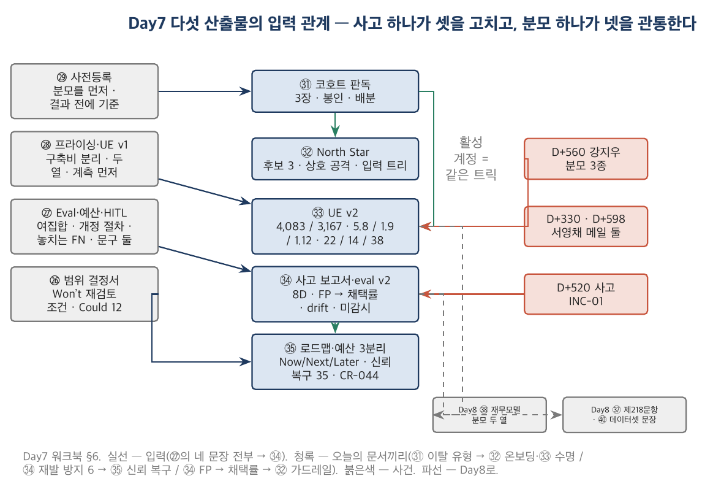

*그림 0-1. Day7 다섯 산출물의 입력 관계. 왼쪽 Day6 문서에서 오늘의 다섯으로 — ㉗의 네 문장이 전부 ㉞로 들어가고, ㉞의 재발 방지가 ㉟의 신뢰 복구 예산이 된다. ㉛의 이탈 유형이 ㉜ 입력 지표와 ㉝ 수명 가정으로 이어진다. 파선은 Day8 — ㉝ 분모가 ㊳ 재무모델, ㉞ 항목 8이 ㊲ 제218문항, ㉞ 데이터셋 문장이 ㊵ 최종 명제. Day7 워크북 §6의 표를 재구성.*

---

# 제1장 PMF란 무엇이고 무엇이 아닌가

## 1.1 PMF의 정의 — 곡선은 평탄해졌는가

### 개념

Product-market fit은 정의가 많은 말이다. Andreessen(2007)의 "시장이 제품을 끌어당기는 상태", Ellis의 "이 제품이 없어지면 매우 실망할 사용자 40% 이상", 그리고 실무에서 가장 쓸모 있는 것 — **코호트 리텐션 곡선이 0으로 떨어지지 않고 어느 높이에서 평탄해지는 것**. 세 정의는 서로를 대체하지 않는다. 첫째는 느낌이고, 둘째는 서베이이며, 셋째는 데이터다. 이 교재는 셋째를 쓴다 — 삼각행렬이 있으면 서명할 수 있고, 없으면 서명할 수 없기 때문이다.

곡선이 평탄해진다는 것은 "들어온 고객 중 일정 비율이 남고, 그 비율이 시간이 지나도 더 떨어지지 않는다"는 뜻이다. 그 높이(71%인가 30%인가)와 도달 시점(M3인가 M9인가)이 PMF의 **정도**이고, 코호트가 지날수록 높이가 올라가는지(동일 연령 비교)가 PMF의 **방향**이다. 평탄해지지 않는 곡선 — 계속 떨어지는 곡선 — 은 신규 획득이 아무리 많아도 채워지지 않는 통이다.

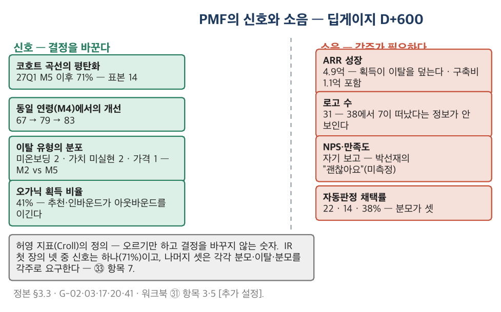

*그림 1-1. 왼쪽 열 — PMF의 신호: 코호트 곡선의 평탄화, 동일 연령에서의 개선, 이탈 유형의 편중이 사라짐, 오가닉 획득 비율. 오른쪽 열 — 소음: ARR 성장(획득이 채운다), 로고 수(이탈을 가린다), NPS(자기 보고), 자동판정 채택률(분모가 셋). 딥게이지 D+600에서 왼쪽은 71%·개선 중·미온보딩 2/가치 2·오가닉 41%, 오른쪽은 4.9억·31·(미측정)·22/14/38.*

### 딥게이지의 사례로 읽기

> ■ **사례 사실** — 유료 31(획득 38 − 이탈 7), 로고 리텐션 26Q4 67% / 27Q1 71% / 27Q2 83%, 오가닉 41%는 정본 §3.3·G-02·G-17·G-41; 평탄 판정(27Q1 M5 이후 71%)과 이탈 7의 유형은 Day7 워크북 §1.5 [추가 설정].

D+600의 딥게이지는 곡선이 평탄해진 회사다 — 27Q1 코호트(14개사)가 M5·M6에서 71%로 멈췄고, 동일 연령 M4에서 코호트가 67 → 79 → 83으로 개선되고 있다. 그것이 PMF의 정량 신호다. 그러나 71%는 열 달 만에 셋 중 하나가 떠난다는 뜻이기도 하다. 이탈 7건 중 넷이 미온보딩·가치 미실현이고 셋이 M2~M4 이탈이다 — 곡선이 평탄해진 높이가 낮은 이유는 제품이 아니라 온보딩이다. PMF는 "있다/없다"가 아니라 "어느 높이에서, 어느 방향으로"다.

### 실무에서 어떻게 틀리는가

ARR 성장률을 PMF로 읽는다(획득이 이탈을 덮는다). 로고 수를 읽는다(38이 아니라 31이고, 그 차이가 정보다). NPS를 읽는다(자기 보고 — Day5 2.2절). 마지막 코호트의 마지막 셀(83%)을 평탄선으로 읽는다(2.3절). PMF를 이분법으로 말한다 — "우리는 PMF를 찾았다".

### 표준·문헌에서는

Ellis & Brown(2017)의 리텐션 곡선과 40% 서베이, Croll & Yoskovitz(2013)의 단계별 지표(Stickiness 단계의 리텐션), Andreessen(2007)의 원문 — 7.1절. 코호트 분석의 통계적 원형은 생존 분석(Kaplan-Meier)이며 삼각행렬은 그 실무 표기다 — 7.2절.

---

## 1.2 D+300~600에 일어난 일 — 열 달의 시간표

### 개념

Day7은 열 달을 하루에 산다. 시점이 하나(D+600)로 고정된 이유는 그래야 지표가 한 표에 놓이기 때문이다 — 그러나 사건은 열 달에 걸쳐 있고, 사고 보고서(㉞)만은 사고 일자(D+520~540) 기준으로 쓴다. 시간표를 먼저 보는 이유는 각 사건이 어느 문서의 어느 칸이 되는지를 알기 위해서다.

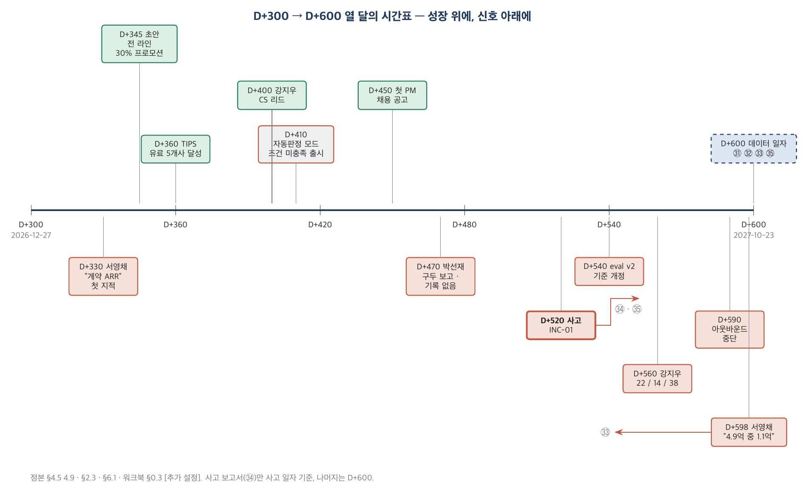

*그림 1-2. 위 — 성장(TIPS 5개사 D+360 · 강지우 D+400 · 자동판정 모드 D+410 · 첫 PM 공고 D+450), 아래 — 신호(서영채 첫 지적 D+330 · 박선재 구두 보고 D+470 · 사고 D+520 · eval v2 D+540 · 강지우 메일 D+560 · 아웃바운드 중단 D+590 · 서영채 메일 D+598). 오른쪽 끝 D+600 데이터 일자. 붉은 화살표 — 사고가 ㉞·㉟를, 두 메일이 ㉝을, 코호트가 ㉛을 만든다.*

### 딥게이지의 사례로 읽기

> ■ **사례 사실** — 사건 시점(D+330·400·450·470·520·540·560·598)은 정본 §4.5~4.9·§2.3·§6.1; D+345 초안 전 라인 확대·D+360 TIPS 달성·D+410 자동판정 출시·D+480 신입·D+590 아웃바운드 중단은 Day7 워크북 §0.3 [추가 설정].

열 달 중 절반은 성장이다 — TIPS 조건 달성(D+360), 유료 3 → 31, 12명 → 21명, CS 리드와 첫 PM 채용. 나머지 절반은 신호다 — D+330 서영채가 월간 보고의 "계약 ARR" 표기를 처음 지적했고, D+470 박선재가 오후 3시 이후 크랙을 놓친다고 팀장에게 말했고(기록 없음), D+520 사고, D+540 eval v2, D+560 강지우가 채택률의 분모 셋을 계산했고, D+598 서영채가 시리즈A IR 초안을 보고 메일을 보냈다. 그리고 D+410 — 자동판정 모드가 출시됐다. Day6 ㉖의 Won't 재검토 조건(합격 기준 충족 그리고 X-04 회피 < 10%)은 둘 다 미충족이었다. 6.3절.

### 실무에서 어떻게 틀리는가

열 달의 사건을 D+600의 지표로만 본다 — 지표는 결과이고 사건이 원인이다. 사고 보고서를 D+600 시점에서 쓴다(사고 일자 기준이어야 타임라인이 산다). 성장의 사건만 시간표에 넣고 신호의 사건(구두 보고·메일)을 빼면 5장의 조직 원인이 사라진다.

---

## 1.3 신호와 소음 — ARR·로고 수·NPS가 PMF가 아닌 이유

### 개념

ARR은 획득의 결과이고 이탈을 덮는다 — 순증 ARR이 양수여도 코호트 곡선은 0으로 갈 수 있다. 로고 수 31은 획득 38에서 이탈 7을 뺀 것이고, 7이 정보인데 31만 보인다. NPS는 자기 보고이며 Day5 2.2절의 박선재가 "괜찮아요"라고 답한 것과 같은 종류다. 자동판정 채택률은 분모가 셋이라 22도 38도 된다. 이 넷은 IR 덱의 첫 장에 놓이고, 코호트 표는 부록에 놓인다 — 그 배치가 소음이 신호를 이기는 방식이다.

> **작은 숫자로 먼저.** 월 신규 4개사, 월 로고 이탈 4.3%. 31개사에서 이탈 1.3개사 — 순증 +2.7. ARR은 오른다. 그러나 코호트 곡선이 M6에 71%에서 멈추지 않고 M12에 40%까지 떨어진다면? 12개월 뒤 31개사 중 열둘이 떠나고, 신규 48이 들어와 잔존 약 55 — ARR은 여전히 오른다. 그 회사에 PMF는 없다. **ARR 성장은 획득 속도이지 fit이 아니다.**

### 딥게이지의 사례로 읽기

> ■ **사례 사실** — ARR 4.9 / 3.8억, 로고 31/38, 채택률 22/14/38은 정본 §3.3; NPS는 딥게이지가 측정하지 않았다 [추가 설정 — 자기 보고 지표를 두지 않기로 한 것은 Day5 2.2절의 결정].

딥게이지의 IR 초안 첫 장은 "ARR 4.9억, 유료 31개사, 6개월 리텐션 71%, 자동판정 채택률 22%"다. 넷 중 신호는 71% 하나이고, 나머지 셋은 각각 분모(계약 vs 순 SaaS)·이탈(38 − 7)·분모(㉮㉯㉰)를 각주로 요구한다. 그 각주를 다는 것이 ㉝ 항목 7이다.

### 실무에서 어떻게 틀리는가

IR 첫 장의 숫자로 내부 결정을 한다. NPS 조사를 늘려 PMF를 "측정"한다. 채택률의 가장 높은 분모를 대외에 쓰고 가장 낮은 분모로 내부 결정을 하면서 둘 다 "채택률"이라 부른다(4.6절).

### 표준·문헌에서는

Croll & Yoskovitz(2013)의 "허영 지표(vanity metrics)"가 이 절의 어휘다 — 오르기만 하고 결정을 바꾸지 않는 숫자. a16z "16 Startup Metrics"(2015)의 목록(bookings ≠ revenue, 활성의 정의, 누적 차트)이 소음의 목록이다.

---

## 1.4 표준·문헌의 지형 — Ellis, Croll, Skok, Doerr, Dekker (심화)

| 질문 | 답하는 문헌 | 오늘의 절 | 한 줄 |
|---|---|---|---|
| PMF는 무엇으로 아는가 | Ellis & Brown(2017) · Andreessen(2007) · Croll & Yoskovitz(2013) | 1.1, 2.x | 리텐션 곡선의 평탄화 · 40% 서베이 · 단계별 지표 |
| 코호트를 어떻게 읽는가 | Croll(2013) Ch.5 · 생존 분석(Kaplan-Meier) · a16z "활성의 정의" | 2.1~2.3 | 삼각행렬 · 분모 · 동일 연령 |
| 무엇을 North Star로 | Amplitude *North Star Playbook*(2018) · Ellis "core value" · Goodhart/Campbell | 3.1~3.3 | 가치의 대표 · 게임 가능성 |
| 목표를 어떻게 쓰는가 | Doerr, *Measure What Matters*(2018) | 3.4 | KR은 결과로 |
| 지표의 정의 | Skok "SaaS Metrics 2.0" · a16z "16 Startup Metrics" · Sacks "Burn Multiple"(2020) | 4.x | 분모·가정·bookings ≠ ARR |
| 사고를 어떻게 쓰는가 | 8D(자동차 산업 관행) · Beyer 외 SRE(2016) Ch.15 · Dekker(2014) | 5.1~5.3 | 임시/영구 조치 분리 · 비난 없음 · 인적 오류는 결과 |
| 기준을 언제 바꾸는가 | Shankar 외(2024) · Day6 3.4절 | 5.6 | criteria drift |
| 로드맵·변경 | Cagan(2018) · Perri(2018) · Bastow(Now/Next/Later) · PM ⑪ | 6.x | 결과·조건 · 신청자 쪽 CR |

두 문헌이 다투는 지점이 하나 있다. 8D(제조)는 D3 임시 조치 → D4 근본 원인 → D5 영구 조치의 **순서**를 요구하고, 포스트모템(SRE)은 **비난 없음**을 요구한다. 둘을 합치면 "순서는 8D로, 원인 칸은 Dekker로" — ㉞의 형식이다. 고객(1차사)이 요구하는 것은 8D이고, 우리 조직이 배우는 데 필요한 것은 비난 없음이다.

### 실무에서 어떻게 틀리는가

Ellis의 40%를 절대 기준으로 쓴다(B2B 검사 SaaS의 응답자는 팀장이고 검사원이 아니다). Doerr의 OKR을 KPI 목록으로 쓴다. 8D를 고객 제출용 양식으로만 쓰고 내부 학습은 따로 안 한다(같은 문서여야 한다).

---

## 제1장 핵심 정리

> **한 줄씩 — 수업 직전 5분 복습용**
> 1. PMF의 정량 신호는 코호트 곡선의 평탄화 — 어느 높이에서(71%), 언제(M5), 어느 방향으로(M4 67→79→83).
> 2. 열 달을 하루에 — 데이터 일자는 D+600 하나, 사고 보고서만 사고 일자 기준.
> 3. 열 달의 절반은 성장이고 절반은 신호였다 — 구두 보고, 메일 둘, 채택률 분모 셋. 그리고 조건 미충족 출시 하나.
> 4. ARR·로고 수·NPS·채택률은 소음이 될 수 있다 — 획득이 이탈을 덮고, 자기 보고이고, 분모가 셋이다.
> 5. 같은 데이터에 답이 여럿이고 전부 산수로 맞다 — 오늘의 문서는 가정과 분모를 열거하고 어느 값을 어디에 쓸지 서명하는 문서다.
> 6. 어제 적은 문장에서 사고가 났다 — 문서가 무력했던 것이 아니라 정확했는데 아무도 보지 않았다.
>
> 아래는 같은 내용의 자세한 판이다.

1. 세 정의(느낌·서베이·데이터) 중 서명할 수 있는 것은 데이터다. 평탄선의 높이는 PMF의 정도, 동일 연령에서의 개선은 방향. 71%는 열 달 만에 셋 중 하나가 떠난다는 뜻이고, 그 셋의 이름이 이탈 유형(2.4절)이다.
2. D+600 고정은 지표를 한 표에 놓기 위한 것이고, 사건은 열 달에 걸쳐 있다. 시간표를 먼저 보는 이유는 사건이 어느 문서의 어느 칸이 되는지 알기 위해서다.
3. D+330 첫 지적 → D+598 메일이 ㉝, D+470 구두 보고 → D+520 사고 → D+540 eval v2가 ㉞, D+560 분모 셋이 ㉝ 항목 6, D+410 자동판정 출시(조건 미충족)가 ㉟ 항목 4.
4. 허영 지표의 정의는 "오르기만 하고 결정을 바꾸지 않는 숫자". IR 첫 장의 넷 중 셋이 각주를 요구한다.
5. 코호트 세 장·채택률 세 분모·LTV:CAC 세 값·GM 두 값 — 표가 없으면 IR 덱의 값이 내부 결정에 쓰인다(아웃바운드 28.9개월).
6. ㉗ 항목 2·5·6의 세 문장이 각각 사고 조건·라인 2 무신호·재촬영 생략이 됐다. "정확했는데 보지 않았다"의 구조가 5장의 절차·조직 원인이다.

## 생각해 볼 질문

1. 여러분 회사의 "PMF 지표"는 무엇인가? 그것은 느낌인가, 서베이인가, 데이터인가? 데이터라면 분모는?
2. ARR이 오르면서 코호트 곡선이 0으로 가는 회사를 본 적이 있는가? 그 회사의 IR 첫 장에는 무엇이 있었는가?
3. 열 달의 시간표에서 "신호" 사건 여섯 중 여러분 회사에서 기록되지 않았을 것은 무엇인가?
4. 어제 적은 문장이 오늘 사건이 됐을 때, 그 문서를 쓴 사람은 무엇을 느끼는가 — 그리고 무엇을 해야 하는가?

## 워크북 연결

이 장은 Day7 워크북 **§0**(시점 고정·분모 선언·D+300~600 요약)과 다섯 산출물의 **항목 1**(데이터 정의·전제)에 대응한다. 1.1절의 평탄화 정의는 ㉛ 항목 3, 1.3절의 소음 목록은 ㉝ 항목 7(표기 규칙)에서 쓴다. 심화 과제(3~7년차): 자기 회사 IR·경영 보고서의 첫 장 숫자 넷을 골라 신호/소음으로 분류하고, 소음이면 필요한 각주를 한 줄씩 적으라.

---

# 제2장 리텐션 — 코호트 판독과 분모

## 2.1 삼각행렬 읽는 법

### 개념

삼각행렬은 행이 코호트(같은 시기에 들어온 고객 집단), 열이 연령(M0, M1, … 들어온 뒤 몇 달째)인 표다. 오른쪽 위가 비어 있어 삼각형이다 — 젊은 코호트는 아직 오래된 연령에 도달하지 않았다(미도달 셀 ▨). 각 셀은 "그 코호트가 그 연령에 몇이 남았는가"이고, 분자(남은 수)와 분모(코호트 크기)를 **함께** 적는다. %만 적으면 분모 3의 67%와 분모 14의 71%가 같은 무게로 보인다.

읽는 방향은 셋이다. **가로**(한 코호트의 곡선 — 어디서 평탄해지는가), **세로**(같은 연령에서 코호트가 개선되는가 — 동일 연령 비교), **대각선**(같은 달력 시점 — 어느 달에 무슨 일이 있었는가). 오른쪽 아래 셀은 항상 가장 젊고 가장 높다 — 그것을 평탄선으로 읽지 않는다.

> **작은 숫자로 먼저.** 27Q1 코호트 14. M0 14(100) · M1 14 · M2 13(93) · M3 12(86) · M4 11(79) · M5 10(71) · M6 10(71). 가로: M5에서 멈췄다 — 71%. 세로(M4): 26Q4 2/3 = 67 · 27Q1 11/14 = 79 · 27Q2 10/12 = 83 — 개선. 대각선: 27Q1의 M5(2027-06~07)와 27Q2의 M2(같은 달)에 이탈이 겹치는가 — 27Q1 11→10, 27Q2 12→11. 그 달에 무엇이 있었는가(프로모션 종료·사고 전). 분자 없이 %만 있으면 세 방향 중 하나도 확인할 수 없다.

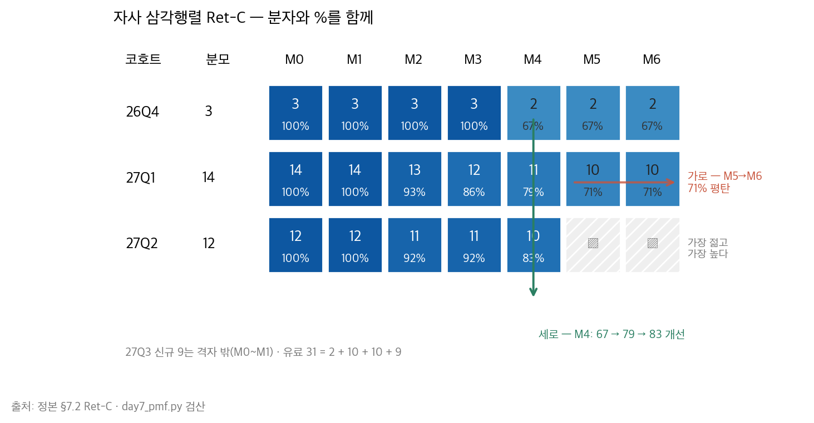

*그림 2-1. Ret-C 세 코호트 × M0~M6. 셀마다 분자/%. 가로 화살표 — 27Q1이 M5에서 71%로 멈춘다. 세로 화살표 — M4 열에서 67 → 79 → 83. 회색 셀 — 27Q2의 M5·M6 미도달. 오른쪽 아래 83%가 가장 젊고 가장 높다.*

### 딥게이지의 사례로 읽기

> ■ **사례 사실** — 자사 삼각행렬(3 → 3·3·3·3·2·2·2 / 14 → 14·14·13·12·11·10·10 / 12 → 12·12·11·11·10·▨·▨)은 정본 §7.2; 27Q3 신규 9(격자 밖)와 유료 31의 분해(2 + 10 + 10 + 9)는 워크북 §1.5 [추가 설정].

D+600의 유료 31은 26Q4 잔존 2 + 27Q1 잔존 10 + 27Q2 잔존 10 + 27Q3 신규 9(아직 M0~M1)다. 마지막 9는 삼각행렬에 없다 — 아직 아무것도 말해 주지 않는 코호트다. 그것을 "리텐션 100%"로 세면 평균이 오른다. 삼각행렬에 넣지 않는 것이 옳다.

### 실무에서 어떻게 틀리는가

%만 적는다. 코호트를 평균낸다(표본 3과 14를 섞는다). 미도달 셀을 0 또는 100으로 읽는다. 오른쪽 아래를 평탄선으로 읽는다. 대각선을 보지 않아 "그 달에 무슨 일이 있었는가"를 놓친다.

### 표준·문헌에서는

Croll & Yoskovitz(2013) Ch.5의 코호트 표가 실무 원형이고, 통계적 원형은 생존 분석의 Kaplan-Meier 곡선이다 — 미도달(검열, censoring)을 다루는 법이 거기서 왔다(7.2절). a16z "16 Startup Metrics"의 코호트 항목이 "활성의 정의를 물어라"를 말한다 — 2.2절.

---

## 2.2 분모를 먼저 — 세 장의 같은 격자

### 개념

세 회사의 삼각행렬이 같은 격자로 인쇄되어 있다면, 표 자체에는 구별이 없다. 구별은 **분모 정의**에 있다 — "코호트 크기"가 무엇인가. 신규 계약 로고인가, 첫 달에 로그인한 로고인가, 결제가 확인된 로고인가. 분모가 "활성 계정"이면 M0·M1의 이탈이 분모에서 빠지고, 그 뒤의 곡선은 살아남은 고객만의 곡선이 된다 — 살아남은 고객은 원래 잘 남는다. 그래서 판독의 첫 행위는 표를 읽는 것이 아니라 **묻는 것**이다: "이 분모는 무엇입니까?"

물어서 답을 얻으면 **재계산**한다 — 무시하지 않는다. 다른 분모의 표는 틀린 표가 아니라 다른 표이고, 같은 격자에 놓으려면 같은 분모로 바꿔야 한다.

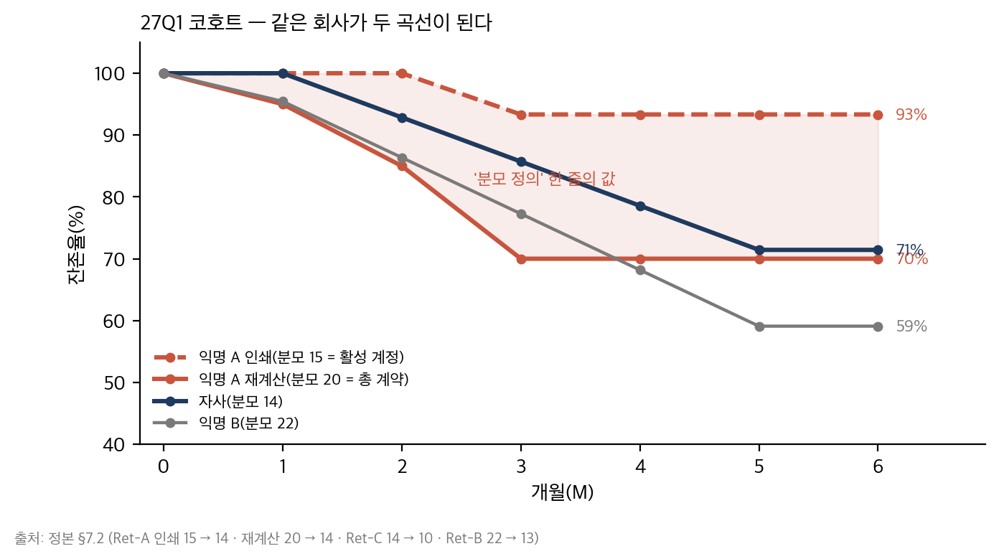

*그림 2-2. 27Q1 코호트의 M0~M6 곡선. 익명 A 인쇄(15 → 14, 93%)가 가장 높고, 같은 회사를 총 계약 로고(20)로 재계산하면 70%로 내려온다 — 자사(71%)와 같은 높이. 익명 B 59%. 인쇄와 재계산 사이의 띠가 "분모 정의" 한 줄의 값이다.*

### 딥게이지의 사례로 읽기

> ■ **사례 사실** — 익명 A 인쇄(4 → 3 = 75% / 15 → 14 = 93% / 18 → 17 = 94%), 분모 정의(계약 후 첫 달 말 30일 내 로그인 로고), 재계산(6 → 3 = 50% / 20 → 14 = 70% / 24 → 17 = 71%), 익명 B(60 / 59 / 75)는 정본 §7.2; 봉인 장치는 워크북 §1.5.

워크북은 익명 A의 분모 정의를 §1.5에 봉인해 두었다. 학생은 항목 1의 자사 칸을 채우고, 익명 A의 칸에 "미확인 — 물어야 한다"를 적고, 항목 4에서 "판독 가능?"을 결정한 뒤에 봉인을 펼친다. 펼치면 — 활성 계정. 26Q4에서 6 중 2가 첫 달에 로그인하지 않았고, 인쇄값 75%(3/4)는 실제 50%(3/6)다. 동일 연령 M4에서 인쇄 100·93·94가 재계산 67·70·71이 된다 — 자사(67·79·83)보다 낮고 개선도 느리다. 익명 A의 높이는 전부 분모에서 나왔다. 이것은 조작이 아니다 — 익명 A의 정의로는 맞는 숫자다. 다만 같은 격자에 놓으면 안 되는 숫자다.

Day3에서 여러분은 재고 정확도 91.3%의 분모(순환실사 SKU 69%)를 따져 물었다. 그때는 감사자였고, 오늘은 익명 A의 표를 받은 심사역이며, 내일은 여러분의 표를 받을 심사역 앞에 선다. 그리고 오늘 오후 ㉝ 항목 6에서 여러분 자신의 채택률 ㉰ 38%가 같은 트릭(활성 계정 분모)이라는 것을 적게 된다.

### 실무에서 어떻게 틀리는가

세 회사를 "신규 고객"으로 적고 묻지 않는다. 익명 A의 높이를 "제품이 좋아서"로 읽는다. 분모가 다르다는 것을 알고도 재계산 없이 "무시"한다(재계산이 판독이다). 자기 회사의 "활성 사용자" 분모를 익명 A처럼 정의해 두고 남에게만 묻는다.

### 표준·문헌에서는

a16z "16 Startup Metrics"(2015)의 "Active users — 정의를 물어라"가 가장 짧은 원전이다. PM 트랙 Day3 교재 2.1절의 분모 정정이 앞선 경험이다. 생존 분석에서 이것은 "위험 집단(risk set)의 정의" 문제다 — 7.2절.

---

## 2.3 동일 연령 비교와 평탄화 판정

### 개념

"평탄"은 연속 2개월 이상 같은 값이다(작은 표본에서는 3개월). 평탄선의 **높이**와 **도달 시점**을 적고, 동일 연령(M4) 열에서 코호트가 **개선되는가**를 본다. 개선(67 → 79 → 83)은 평탄화와 다른 정보다 — 평탄화는 "이 코호트가 어디서 멈추는가", 개선은 "다음 코호트가 더 높이 멈출 것인가". 둘 다 있어야 PMF의 정도와 방향이다.

판정은 셋 중 하나 — 평탄 / 하락 중 / 판독 불가(표본·분모). 근거 셀을 적는다.

### 딥게이지의 사례로 읽기

> ■ **사례 사실** — M4 동일 연령 자사 67 → 79 → 83, A 인쇄 100 → 93 → 94, A 재계산 67 → 70 → 71, B 60 → 68 → 75는 정본 §7.2; 판정 문장은 워크북 §1.5 항목 3.

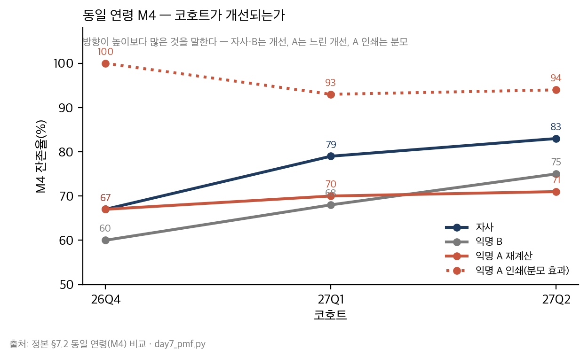

*그림 2-3. 가로축 코호트(26Q4 → 27Q1 → 27Q2), 세로축 M4 잔존율. 자사 67 → 79 → 83(개선), 익명 B 60 → 68 → 75(개선), 익명 A 재계산 67 → 70 → 71(느린 개선), 익명 A 인쇄 100 → 93 → 94(분모 효과 — 점선). 방향이 높이보다 많은 것을 말한다.*

워크북 예시본의 판정 문장: "27Q1 기준 M5 이후 71% 근처에서 평탄(표본 14). 27Q2는 M3→M4 92→83 하락 중 — 판독 대기. 코호트는 개선 중." 26Q4의 67%는 표본 3이라 유보했다. 27Q2의 83%를 평탄선으로 쓰지 않았다 — 27Q1이 M4 79에서 M5 71로 떨어졌으므로 27Q2도 M5에서 약 75가 될 수 있다. 판정은 확신이 아니라 **어느 셀을 근거로 어디까지 말할 수 있는가**다.

### 실무에서 어떻게 틀리는가

마지막 관측값을 평탄선으로. 코호트 개선을 평탄화와 혼동. 표본 3의 코호트를 표본 14와 같은 무게로. "평탄"을 1개월로 선언.

### 표준·문헌에서는

Ellis & Brown(2017)의 "평탄해지는 곡선"이 정의이고, 통계적으로는 생존 곡선의 위험률(hazard)이 0에 가까워지는 구간이다. 동일 연령 비교는 코호트 분석의 표준 관행이며 Croll(2013)이 "세로로 읽어라"로 쓴다.

---

## 2.4 이탈의 다섯 유형

### 개념

이탈은 하나의 숫자(7)가 아니라 다섯 유형의 합이다 — **미온보딩**(쓰기 시작하지 못함, M0~M2), **챔피언 이탈**(도입 추진자가 떠남), **가치 미실현**(썼는데 효과가 없음, M3~M6), **가격**, **경쟁·대체**. 유형마다 제품 대응이 다르다 — 미온보딩에 가격을 내리면 낭비이고, 가치 미실현에 온보딩을 강화해도 소용없다. 이탈 시점(M2 vs M5)이 유형의 첫 단서다. 고객이 인터뷰에서 말하는 사유(대개 "가격")와 실제 유형은 다르다 — Day5 2.2절의 관찰과 자기 보고.

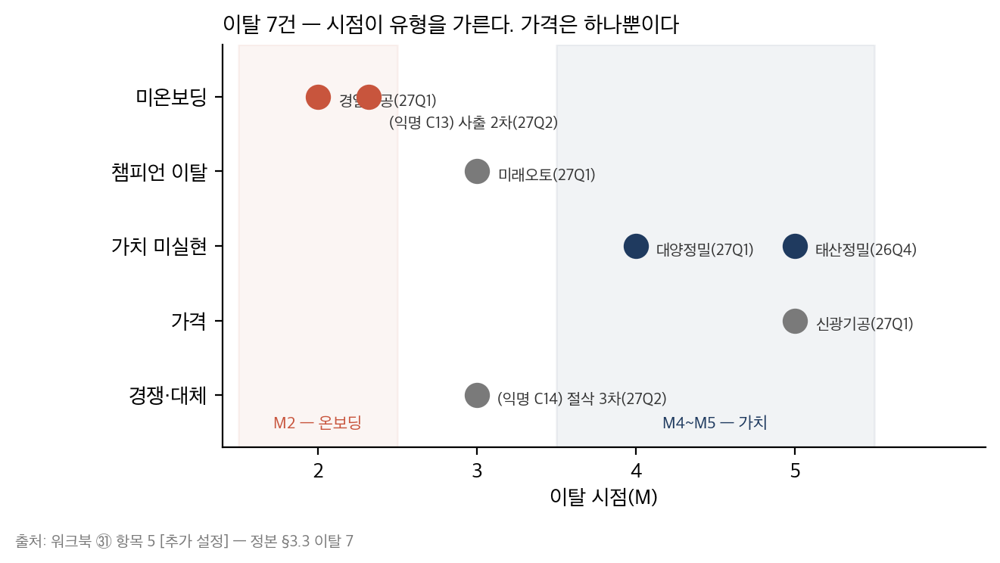

*그림 2-4. 세로축 유형 다섯, 가로축 이탈 시점(M2~M5). 점 하나가 이탈 1건. 미온보딩 둘은 M2에, 가치 미실현 둘은 M4~M5에 — 시점이 유형을 가른다. 가격은 하나뿐이다.*

### 딥게이지의 사례로 읽기

> ■ **사례 사실** — 이탈 7(정본 §3.3)의 명단·시점·유형(미온보딩 2 / 챔피언 1 / 가치 미실현 2 / 가격 1 / 경쟁·대체 1)은 워크북 §1.5 항목 5 [추가 설정]; 태산정밀(계약 3 / 실사용 2)은 정본 §6.2.

일곱 중 태산정밀이 가장 많이 말한다 — 실사용 2라인인데 계약은 3, 62항목 구조 유지 부담, 라인 축소 요청을 거절당한 뒤 해지. Day6에서 "실사용 2.4/3.0은 축소 위험이 먼저"라고 적었던 것이 그대로 일어났고, 3라인 계약을 지키려다 로고를 잃었다. GRR(매출)과 로고 리텐션은 다른 지표이고, 시드 단계에서는 로고가 먼저다. 미온보딩 둘(경일정공·익명 C13)은 M2 이탈 — 첫 달 100건 미만, 마스터 미제출 6주. 온보딩 완료율이 ㉜의 입력 지표가 되는 이유다.

### 실무에서 어떻게 틀리는가

전부 "가격"으로 분류(고객이 그렇게 말한다). 시점을 안 적는다. 한 건을 두 유형에. 이탈 인터뷰를 안 한다(7건은 할 수 있는 수다).

### 표준·문헌에서는

Skok의 churn 분류와 Croll(2013)의 "왜 떠나는가" 인터뷰가 원형이다. Day5 2.2절(관찰 vs 자기 보고)이 "고객이 말한 사유 ≠ 유형"의 근거다.

---

## 2.5 배분 판정 — 무배분은 무판정이 아니다

### 개념

세 회사의 표를 받고 5억을 배분하라는 과제에서 판정 규칙은 하나다 — **분모를 확인하지 않은 회사에 배분하지 않는다.** 판독 불가에 0을 적고 조건(재제출 시 재판정)을 적는 것은 판정을 안 한 것이 아니라 판정이다. 세 회사에 나란히 배분한 것이 판정을 안 한 것이다. 배분 비율(3.0 / 2.0인가 2.5 / 2.5인가)은 근거 셀이 있으면 방어 가능하다.

### 딥게이지의 사례로 읽기

> ■ **사례 사실** — 자사 3.0 / 익명 A 0(조건부) / 익명 B 2.0과 근거 셀은 워크북 §1.5 항목 6 [추가 설정 — 가상 연습]; 판정 규칙은 제작 노트 §3.

예시본은 자사 3.0(27Q1 평탄 71 · M4 개선 · 분모 확인), 익명 B 2.0(60/59/75 · M4 개선 · 분모 동일), 익명 A 0 — 조건부(재계산 50/70/71은 B보다 낮고, 총 계약 분모로 재제출 시 재판정). 그리고 마지막 행 "우리 회사가 3위라면" — 27Q2 M4 83이 27Q1처럼 M5에서 71로 떨어지면 자사도 B와 같은 자리이고, 고칠 것은 항목 5의 미온보딩 2·가치 미실현 2다.

### 실무에서 어떻게 틀리는가

3분할. 망점 칸에 숫자. 익명 A의 인쇄값으로 배분. "0 = 판정 회피"로 읽는다. "3위라면" 칸을 비운다(그 칸이 자기 회사 문서로 돌아오는 칸이다).

### 표준·문헌에서는

투자 판단의 문헌보다 PM 트랙 Day3 ⑫의 "측정·판정자·모집단 없는 완료는 완료가 아니다"가 원전이다 — 분모 없는 리텐션은 리텐션이 아니다.

---

## 2.6 GRR과 NDR

### 개념

GRR(gross revenue retention)은 기준 시점 고객의 MRR 중 이탈·축소를 뺀 잔존 비율 — 확장을 넣지 않는다. NDR(net dollar retention)은 확장을 더한 것. NDR < 100%는 확장이 이탈을 못 덮는다는 뜻(순축소). 두 지표 모두 **기준 시점·기간·분모(기준 MRR)**를 적어야 하고, 회사가 열 달밖에 안 됐으면 12개월 NDR은 없다 — 6개월 기준이라고 적는다.

> **작은 숫자로 먼저.** 기준 D+420 유료 17개사 MRR 1,530만. 6개월 뒤 이탈 −245(16%) → 1,285 = **GRR 84%**. 확장 +199(13%: 라인 증설 139 + Flow 애드온 60) → 1,484 = **NDR 97%**. 확장 13%p는 Day6 ㉘ 항목 5의 "NDR 상한 약 105%" 추정 안에 있고, 이탈 16%가 그것을 넘었다.

### 딥게이지의 사례로 읽기

> ■ **사례 사실** — GRR 84% / NDR 97%는 G-16; 기준 MRR 1,530·이탈 245·확장 199의 내역은 워크북 §1.5 항목 7 [추가 설정].

NDR 97%를 "거의 유지"로 읽으면 안 된다 — 확장이 이탈을 못 덮었다. 라인 과금의 확장 여지(+0.2, Day6)가 실제로 작았고, Flow 애드온(D+450 도입)이 그 절반이었다. 이탈 16%가 GRR을 84로 만들었고, 그중 태산정밀은 라인 축소를 받았으면 MRR 2/3은 남았을 로고다.

### 실무에서 어떻게 틀리는가

NDR만 쓴다(GRR이 이탈을 보여 준다). 기준 MRR·기간을 안 적는다. 신규 코호트 MRR을 분자에 넣는다. 12개월 NDR을 열 달 회사가 쓴다.

### 표준·문헌에서는

Skok "SaaS Metrics 2.0"의 정의가 표준이고, Bessemer *State of the Cloud*가 벤치마크(NDR 100%+)를 준다 — 벤치마크보다 정의가 먼저다(4.8절).

---

## 제2장 핵심 정리

> **한 줄씩 — 수업 직전 5분 복습용**
> 1. 삼각행렬은 분자와 %를 함께 — 가로(평탄), 세로(동일 연령 개선), 대각선(그 달에 무슨 일). 오른쪽 아래는 가장 젊고 가장 높다.
> 2. 세 장의 같은 격자에는 구별이 없다 — 구별은 묻는 행위에 있다. "이 분모는 무엇입니까?" 그리고 재계산한다.
> 3. 익명 A의 93%는 활성 계정 분모 — 재계산 70%. 조작이 아니라 다른 표다. 같은 격자에 놓으면 안 된다.
> 4. 평탄 = 연속 2개월. 27Q1 M5 71%. 27Q2의 83%는 평탄선이 아니다. 개선(M4 67→79→83)은 다른 정보.
> 5. 이탈은 다섯 유형의 합 — 시점이 유형을 가른다(M2 온보딩, M5 가치). 고객이 말한 사유 ≠ 유형.
> 6. 분모를 확인하지 않은 회사에 배분하지 않는다 — 무배분은 무판정이 아니라 판정이다.
> 7. GRR 84 / NDR 97 — 기준·기간·분모를 적는다. 97은 순축소다.
>
> 아래는 같은 내용의 자세한 판이다.

1. 표의 세 방향을 다 읽으려면 분자가 있어야 한다. 27Q3 신규 9는 격자 밖 — 리텐션 100%로 세지 않는다. 표본 3(26Q4)은 유보한다.
2. 봉인 장치의 뜻: 확인 전에 익명 A에 배분한 조와 판독 불가라 적은 조를 가른다. 전자가 Day3에서 91.3%를 받아 적은 자리, 후자가 분모를 따져 물은 자리. 오늘 오후 ㉝ 항목 6에서 자기 회사의 ㉰ 38%에 같은 질문을 한다.
3. 활성 계정 분모는 M0·M1 이탈을 지운다 — 살아남은 고객만의 곡선. 26Q4 6 중 2 미로그인 → 75%가 50%. M4 100·93·94 → 67·70·71.
4. 판정 문장은 확신이 아니라 근거 셀과 한계 — "표본 14", "판독 대기", "개선 중". 71%는 열 달에 셋 중 하나.
5. 태산정밀 — 3라인 계약을 지키려다 로고를 잃었다. 로고 리텐션이 GRR보다 먼저. 미온보딩 둘(M2)이 ㉜ 입력 지표(온보딩 완료율)의 이유.
6. 자사 3.0 / B 2.0 / A 0(조건부). 비율은 근거 셀이 있으면 방어 가능. "3위라면" 칸이 자기 문서로 돌아오는 칸.
7. 기준 1,530 → −245 → +199. 확장 13%p는 Day6 추정(105%) 안, 이탈 16%가 초과. 12개월 NDR은 없다.

## 생각해 볼 질문

1. 여러분 회사의 리텐션(또는 재구매·재방문) 곡선의 분모를 한 문장으로 적어 보라. 그 정의로 빠지는 고객이 있는가?
2. 익명 A가 "우리 정의가 업계 표준"이라고 하면 무엇이라 답하겠는가? 그 답은 자기 회사의 ㉰ 38%에도 적용되는가?
3. 이탈 7건 중 M2 이탈 둘과 M5 이탈 둘에 같은 대응을 했다면 무엇이 낭비되는가?
4. 자기 회사가 "3위"인 표를 받았을 때 고칠 것을 지금 적어 보라 — 어느 유형의 이탈인가?

## 워크북 연결

이 장은 Day7 워크북 **㉛ 코호트 리텐션 판독서**의 전 항목에 대응한다 — 항목 1(2.2절) · 항목 2(2.1절) · 항목 3(2.3절) · 항목 4(2.2절) · 항목 5(2.4절) · 항목 6(2.5절) · 항목 7(2.6절). 봉인은 §1.5. 심화 과제(3~7년차): 자기 회사의 리텐션 곡선을 "총 가입(총 계약)" 분모로 재계산해 인쇄값과의 차이를 적으라.

---

# 제3장 North Star·입력 지표·게임 가능성

## 3.1 North Star의 조건 — 매출은 후보가 아니다

### 개념

North Star는 "고객이 받은 가치를 가장 잘 대표하는 지표 하나"다. 네 조건 — 가치를 대표한다, 게임하기 어렵다, 측정 가능하다, 팀이 움직일 수 있다. 매출은 첫 조건에서 탈락한다 — 가치의 결과이지 가치가 아니고, 라인 과금에서는 실사용과 무관하게 들어온다(계약 3.0 / 실사용 1.6). 매출을 North Star로 두면 팀은 계약 라인을 늘리고, 그것은 실사용을 늘리지 않는다 — 태산정밀이 그렇게 떠났다.

후보는 셋 이상 놓고 서로 공격한다(3.2절). 후보마다 분자·분모·현재값을 적는다 — 현재값이 없는 후보(측정 불가)는 그 사실이 정보다.

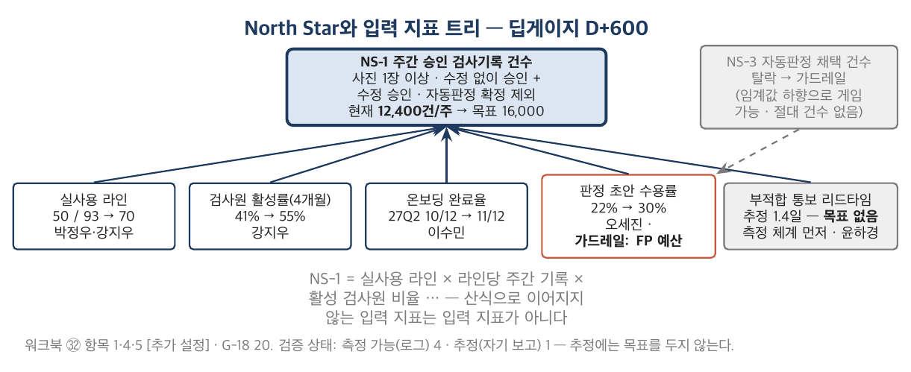

*그림 3-1. 꼭대기 NS-1 주간 승인 검사기록 건수(12,400). 아래 입력 지표 다섯 — 실사용 라인 50/93, 활성률 41%, 온보딩 완료율 10/12, 초안 수용률 22%(가드레일: FP 예산), 부적합 통보 리드타임(추정 — 목표 없음). 오른쪽 회색 — 탈락한 NS-3(자동판정 채택 건수)이 가드레일로 옮겨 간다. 각 상자에 소유자.*

### 딥게이지의 사례로 읽기

> ■ **사례 사실** — 후보 3(NS-1 주간 승인 검사기록 12,400건 · NS-2 활성 라인 50 · NS-3 자동판정 채택 — 비율만)과 선정은 워크북 §2.5 항목 1·3 [추가 설정]; 계약 3.0 / 실사용 1.6은 G-18; 절대 건수 없음은 F-08.

NS-3(자동판정 채택 건수)는 두 이유로 탈락한다. 게임이 너무 쉽다 — 신뢰도 임계값을 낮추면 채택은 오르고 FP는 오른다, 그것이 정확히 사고의 방향이다. 그리고 절대 건수가 없다 — 강지우는 비율만 낸다. 비율은 분모를 바꾸면 22가 38이 된다. North Star는 분모를 바꿀 수 없는 지표여야 한다. NS-3는 죽지 않고 가드레일이 된다 — FP 예산과 함께.

### 실무에서 어떻게 틀리는가

매출·ARR·로고 수를 후보에. 정의만 있고 분모가 없다. 후보 하나만 놓고 "선정". 현재값을 비운다. North Star가 커널(Day5 ㉕)과 반대 방향인지 확인하지 않는다.

### 표준·문헌에서는

Amplitude *The North Star Playbook*(2018)의 조건 목록, Ellis & Brown(2017)의 "core value metric", Croll(2013)의 "One Metric That Matters"(단계마다 하나). 7.3절.

---

## 3.2 게임 가능성 — 상호 공격

### 개념

Goodhart의 법칙 — 지표가 목표가 되면 좋은 지표이기를 멈춘다. 방어는 하나다: 지표를 정하기 **전에** 다른 사람이 공격한다 — "실제 가치 없이 이 숫자를 올리는 가장 쉬운 방법은?" 방어는 정의를 좁히거나(분자 한정) 보조 지표(가드레일)를 붙이는 것. 방어가 안 되면 탈락. 자기 후보를 자기가 방어하지 않는다.

정의가 길어지는 것은 실패가 아니라 상호 공격의 흔적이다. 공격 기록이 없는 North Star는 게임을 안 당한 것이 아니라 아직 안 당한 것이다.

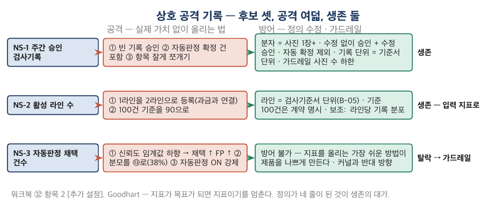

*그림 3-2. 후보마다 공격(붉은 화살표)과 방어(초록 상자). NS-1 — 빈 승인·자동 확정 포함·항목 쪼개기 → 분자 한정·제외·단위 고정 → 생존. NS-2 — 라인 이중 등록·기준 하향 → 라인 = 기준서 단위·계약 명시 → 생존(입력 지표로). NS-3 — 임계값 하향·분모 변경·ON 강제 → 방어 불가 → 가드레일.*

### 딥게이지의 사례로 읽기

> ■ **사례 사실** — 공격·방어 여덟 건은 워크북 §2.5 항목 2 [추가 설정].

NS-1(주간 승인 검사기록)에 대한 공격 셋 — 빈 기록을 승인하게 한다, 자동판정 확정 건을 "승인"에 넣는다, 항목을 잘게 쪼갠다. 방어 — 분자를 "사진 1장 이상 첨부된 기록 중 수정 없이 승인 + 수정 승인"으로 한정, 자동판정 확정 건 제외, 기록 단위 = 검사기준서의 검사 단위로 고정, 가드레일로 기록당 사진 수 하한. 정의가 한 줄에서 네 줄이 됐다. 그것이 생존의 대가다.

### 실무에서 어떻게 틀리는가

자기 후보를 자기가 방어. 공격을 "그럴 리 없다"로 넘김. 탈락 없이 셋 다 살림. 공격 기록을 남기지 않아 6개월 뒤 같은 게임을 당함.

### 표준·문헌에서는

Goodhart(1975)·Campbell(1979)이 원전이고, Kohavi 외(2020)의 가드레일 지표가 방어의 형식이다. 7.3절.

---

## 3.3 입력 지표 트리와 검증 상태

### 개념

North Star를 산식으로 분해한다 — 기록 = 실사용 라인 × 라인당 기록 × (활성 검사원 비율) … 각 인자가 입력 지표이고, 소유자 한 사람·현재값·목표값·**검증 상태**를 단다. 검증 상태는 셋 — 측정 가능(로그) / 추정(자기 보고) / 미검증. **추정·미검증 지표에는 목표값을 쓰지 않는다** — 측정할 수 없는 지표에 목표를 두면 자기 보고가 목표에 맞춰진다. 그 지표의 목표는 "측정 체계 먼저"다.

### 딥게이지의 사례로 읽기

> ■ **사례 사실** — 입력 지표 다섯(실사용 라인 50/93 · 활성률 41% · 온보딩 10/12 · 수용률 22% · 통보 리드타임 추정 1.4일)과 검증 상태는 워크북 §2.5 항목 4·5 [추가 설정]; 활성률 68 → 41은 G-19.

부적합 통보 리드타임 1.4일은 팀장 자기 보고(월 1회)다 — Day5 인터뷰의 3.7일과 같은 종류의 숫자, 사람이 말한 것. 포털 제출 시각이 로그에 없으므로 측정할 수 없고, 목표 대신 "포털 내보내기 시각 로그 추가(B-08 확장) → D+660부터 측정"이 적혔다. Day5 2.2절(관찰과 자기 보고)의 세 번째 적용이다 — 박선재, 익명 A, 그리고 우리 자신의 리드타임.

### 실무에서 어떻게 틀리는가

입력 지표가 North Star와 산식으로 안 이어짐. 소유자가 "팀". 자기 보고 지표에 목표. 목표값이 근거 없이 둥긂(50%·60%).

### 표준·문헌에서는

Amplitude(2018)의 input metric tree, Doerr(2018)의 "측정 가능한 KR". 검증 상태 표기는 이 교재의 요구다 — 문헌은 "측정 가능"을 전제하고 시작한다.

---

## 3.4 OKR — 지표가 아니라 결과로

### 개념

O(objective)는 질적이고, KR(key result)은 측정 가능한 **결과**다. KR을 "활성률 55%"처럼 지표 이름 + 숫자로 쓰면 팀은 분모를 바꾸고 싶어진다. "온보딩한 검사원 10명 중 5.5명이 넉 달 뒤에도 매주 판정을 승인한다"로 쓰면 무엇을 해야 하는지(온보딩·수정 사유 1탭·수정 건수의 표기)가 보인다. 측정 칸에 분자·분모를 따로 적는다.

### 딥게이지의 사례로 읽기

> ■ **사례 사실** — 2027-Q4 OKR(O 1 + KR 3)은 워크북 §2.5 항목 6 [추가 설정].

O — "검사원이 종이 대신 GAUGE로 기록하고 자기 판정으로 승인하는 것이 자연스러운 라인을 늘린다"(NS-1 12,400 → 16,000). KR1 — 계약 라인 10개 중 7개가 매주 100건 이상(70/93). KR2 — 온보딩한 검사원 10명 중 5.5명이 넉 달 뒤에도 매주 승인(55%). KR3 — 신규 12 중 11이 10영업일 안에 매핑을 끝내고 첫 달 100건(11/12). 첫 PM이 합류하면 이 문서를 받는다.

### 실무에서 어떻게 틀리는가

KR = KPI 목록. O = "매출 20% 성장". KR이 입력 지표와 무관. OKR을 분기마다 새로 쓰지 않고 목표만 올림.

### 표준·문헌에서는

Doerr, *Measure What Matters*(2018) — Grove의 원형. "결과로 쓴다"는 이 교재의 강조이지 Doerr의 문장은 아니다.

---

## 제3장 핵심 정리

> **한 줄씩 — 수업 직전 5분 복습용**
> 1. North Star는 가치의 대표 — 매출은 결과이지 가치가 아니다. 계약 3.0 / 실사용 1.6이 그 증거.
> 2. 후보 셋을 서로 공격한다 — 방어 안 되면 탈락. 정의가 길어지는 것은 상호 공격의 흔적.
> 3. NS-3(자동판정 채택)은 두 이유로 탈락 — 임계값 하향으로 게임 가능(사고의 방향), 절대 건수 없음. 가드레일로 산다.
> 4. 입력 지표는 산식으로, 소유자 한 사람, 검증 상태 셋 — 추정·미검증에는 목표 없음("측정 체계 먼저").
> 5. KR은 지표가 아니라 결과 문장 — "10명 중 5.5명이 넉 달 뒤에도".
>
> 아래는 같은 내용의 자세한 판이다.

1. 네 조건(가치·게임·측정·움직임). 매출을 North Star로 두면 계약 라인을 늘리고 실사용은 늘지 않는다 — 태산정밀. North Star가 커널(Day5)과 같은 방향인지 확인한다.
2. Goodhart. 자기 후보는 자기가 방어하지 않는다. NS-1의 정의가 네 줄이 된 것이 생존의 대가.
3. NS-3의 탈락은 5장의 예고 — 채택률을 올리는 가장 쉬운 방법이 제품을 나쁘게 만드는 것. 분모를 바꿀 수 있는 지표는 North Star가 아니다.
4. 통보 리드타임 1.4일은 자기 보고 — Day5 2.2절의 세 번째 적용(박선재·익명 A·우리). 목표 대신 로그.
5. O 하나 KR 셋. 첫 PM의 첫 OKR.

## 생각해 볼 질문

1. 여러분 회사 대시보드 맨 위 숫자를 세 가지 방법으로 게임해 보라. 방어가 되는가?
2. "활성 사용자"의 정의를 여러분 회사는 어떻게 정하고 있는가? 익명 A의 정의와 무엇이 다른가?
3. 자기 보고 지표 중 목표가 걸려 있는 것이 있는가? 그 목표는 무엇을 움직였는가?

## 워크북 연결

이 장은 Day7 워크북 **㉜ North Star & Input Metric Tree·분기 OKR**의 전 항목에 대응한다 — 항목 1·3(3.1절) · 항목 2(3.2절) · 항목 4·5(3.3절) · 항목 6(3.4절). ㉞ 항목 7(FP 예산)이 가드레일의 자리다. 심화 과제(3~7년차): 자기 회사의 OKR 하나를 골라 KR을 결과 문장으로 다시 쓰고, 그 문장이 요구하는 행동을 적으라.

---

# 제4장 유닛이코노믹스 v2 — 같은 데이터의 두 답

## 4.1 분모 선언 — 4,083과 3,167

### 개념

MRR·ARR·ACV·GM·원가율·payback·LTV — 전부 비율이거나 비율의 재료이고, 비율에는 분모가 있다. 시드 단계에서 분모가 갈리는 지점은 하나다: **구축비·컨설팅비(일회성)를 반복 매출에 넣는가.** 계약 기준 MRR 4,083만(구축비 월할 917 포함)과 순 SaaS MRR 3,167만. 같은 원가 1,340만을 나누면 32.8%와 42.3%. 같은 COGS 1,590만으로 GM을 계산하면 61%와 49.8%. 둘 다 산수로 맞다. 이 문서의 첫 항목이 "어느 분모인가"를 선언하는 이유다 — 선언하지 않으면 IR 표기값이 내부 결정에 쓰인다.

> **작은 숫자로 먼저.** 계약 ARR 4.9억 = 순 SaaS 3.8억 + 구축비·컨설팅 1.1억. MRR = 4.9/12 = 4,083 vs 3.8/12 = 3,167. ACV = 4.9억/31 = 1,581 vs 3.8억/31 = 1,226. 순 SaaS ACV 1,226 = 3.0라인 × **34.1만** × 12 — 명목 45만의 76%. 24%가 어디로 갔는가: 신규 6개월 30% 프로모션(TIPS 5개사 시계), 1차사 추천 15%, 선납 10%. Day6 ㉚ 항목 4에서 "라인 1개 계약의 유혹"은 막았고, 할인은 막지 못했다.

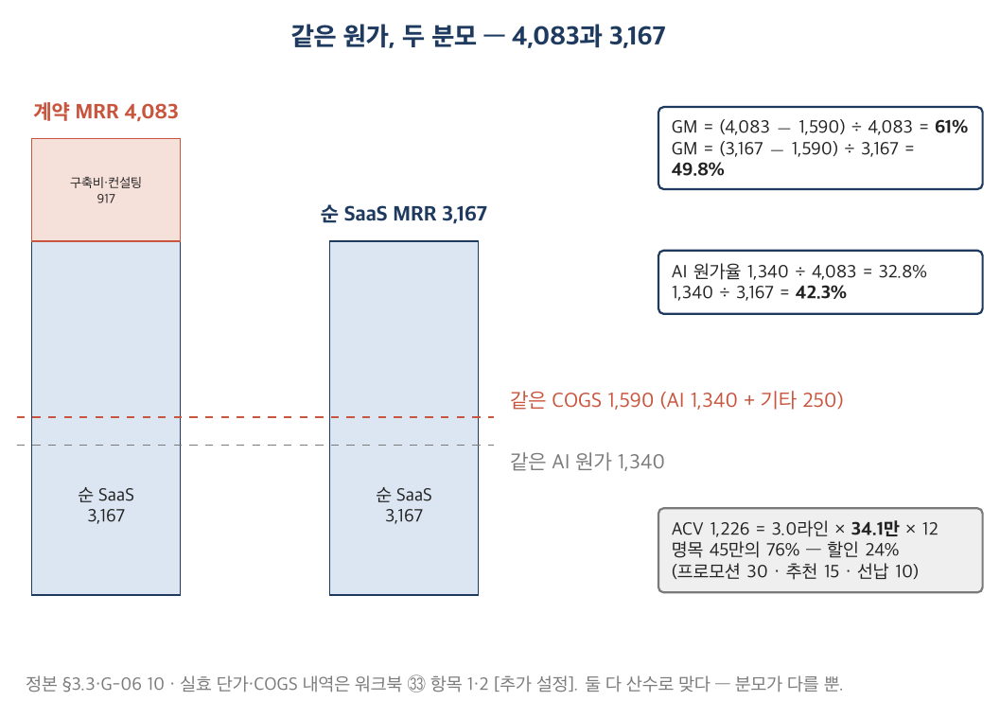

*그림 4-1. 왼쪽 막대 계약 MRR 4,083(순 SaaS 3,167 + 구축비 월할 917), 오른쪽 순 SaaS 3,167. 같은 COGS 1,590을 빼면 GM 61% vs 49.8%, 같은 AI 원가 1,340을 나누면 32.8% vs 42.3%. 아래 — 명목 45만 vs 실효 34.1만(할인 24%).*

### 딥게이지의 사례로 읽기

> ■ **사례 사실** — 4.9 / 3.8억, 1.1억, 4,083 / 3,167, 1,581 / 1,226, 32.8 / 42.3%, 61 / 49.8%는 정본 §3.3·G-03~10; 실효 단가 34.1만과 할인 구성은 워크북 §3.5 항목 1 [추가 설정]; 서영채 메일은 정본 §4.5.

D+330에 서영채가 월간 보고의 "계약 ARR" 표기를 처음 지적했고, D+598에 시리즈A IR 초안을 보고 썼다 — "ARR 4.9억 중 1.1억이 구축비·컨설팅비로 보입니다." 딥게이지의 답(정본): "고객이 계약서 한 장에 서명한 금액입니다." 맞는 말이다 — bookings로는. ARR로는 아니다. 그 메일이 요구한 것은 4.9억을 지우는 것이 아니라 **밝히는 것**이다. 지우면 "숫자를 바꿨다"가 되고, 병기하면 "정의를 밝혔다"가 된다. ㉝ 항목 1과 7이 그 답이다.

### 실무에서 어떻게 틀리는가

한 열만 적는다. 구축비를 "첫 해 매출"이라 부른다. 계약 기준으로 GM을, 순 SaaS 기준으로 원가율을 계산해 섞는다. 서영채의 메일에 "계약서 금액입니다"로 답한다(bookings ≠ ARR — Day6 4.4절).

### 표준·문헌에서는

Skok "SaaS Metrics 2.0", a16z "16 Startup Metrics"(bookings ≠ revenue ≠ ARR). 회계 기준(IFRS 15 / K-IFRS 1115)은 구축 용역과 구독을 별도 수행의무로 본다 — 판본은 확인. Day6 4.4절.

---

## 4.2 매출총이익률 61%와 49.8%

### 개념

GM = (매출 − COGS) ÷ 매출. COGS에 무엇이 들어가는지 **열거**한다 — AI 추론, 호스팅·STT·저장, 온보딩 인건비 일부, (구축 원가는 구축비 매출에 대응). 같은 COGS를 두 분모로 나눈 두 GM은 둘 다 맞다 — 분모의 정의가 다를 뿐. 12월 청구서처럼 실제값이 있으면 예상값 대신 실제값을 쓴다(Day6 4.4절의 −72%).

### 딥게이지의 사례로 읽기

> ■ **사례 사실** — COGS 1,590 = AI 추론 1,340 + 호스팅·STT·저장 170 + 온보딩 인건비 일부 80은 워크북 §3.5 항목 2 [추가 설정]; AI 원가 1,340(v2 단가 67원)은 G-08; v1 단가였다면 약 640만은 [추가 설정].

AI 원가 1,340만의 절반은 eval v2의 대가다 — 단가 32 → 67원, 2-pass. v1 단가였다면 약 640만, 순 SaaS MRR의 20%. GM 49.8%의 원인 절반이 5장의 결정(FN을 낮추기 위한 2-pass)이고, ㉝ 항목 8의 개선 레버 하나가 "2-pass를 오후 조도·저신뢰 사진에만"이다.

### 실무에서 어떻게 틀리는가

COGS를 AI 추론만으로. 두 GM의 차이를 "계산 실수"로. CS 인건비를 넣을지 말지 정하지 않아 분기마다 GM이 흔들림. 실제 청구서 대신 예상 원가.

### 표준·문헌에서는

a16z "16 More Startup Metrics"의 GM 정의(무엇이 COGS인가)와 Bessemer의 SaaS GM 벤치마크(70%+) — AI 제품의 GM이 낮은 구조적 이유(추론 원가)는 2023년 이후 a16z·Sequoia 등의 글이 다룬다 — 판본 확인.

---

## 4.3 CAC·payback — 세 가지 계산

### 개념

CAC payback = CAC ÷ (월 ACV × GM). GM을 빼면(매출 기준) IR 덱의 숫자가 되고, GM 61%를 넣으면 검산 1, 49.8%를 넣으면 검산 2. 그리고 blended CAC에 오가닉(CAC 0)이 섞여 있으면 유료 채널의 실제 CAC는 더 높다 — 유료 획득 CAC = blended ÷ (1 − 오가닉 비율).

> **작은 숫자로 먼저.** 인바운드 CAC 310만. 월 ACV(계약) 1,581/12 = 131.8 → 310/131.8 = **2.3개월**(IR). 월 ACV(순 SaaS) 1,226/12 = 102.2, × 0.61 = 62.3 → 310/62.3 = **4.98**. × 0.498 = 50.9 → **6.10**. 아웃바운드 1,470만 → 10.9 / 23.6 / **28.9**. blended 620 → 4.6 / 9.95 / 12.2. 오가닉 41% → 유료 획득 CAC = 620 ÷ 0.59 = **1,051만** → payback 20.7개월.

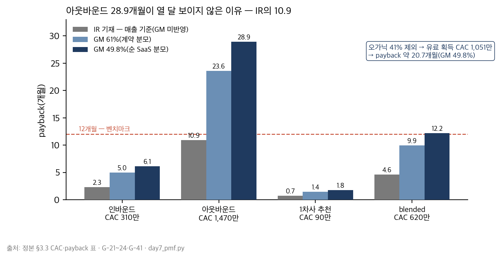

*그림 4-2. 채널 넷 × 계산 셋. 인바운드 2.3 → 4.98 → 6.10, 아웃바운드 10.9 → 23.6 → 28.9. 오른쪽 끝 유료 획득 CAC 1,051만(blended 620 ÷ 0.59). 아웃바운드의 28.9개월이 열 달 동안 보이지 않은 이유는 IR 덱의 10.9였다.*

### 딥게이지의 사례로 읽기

> ■ **사례 사실** — CAC 표(310 / 1,470 / 90 / 620, IR 2.3 / 10.9 / 0.7 / 4.6, 검산 4.98 / 23.60 / 1.44 / 9.95, 정본 6.10 / 28.93 / 1.77 / 12.20, 오가닉 41% → 1,051만)는 정본 §3.3·G-21~24·G-41; 아웃바운드 D+590 중단은 워크북 §0.3 [추가 설정].

아웃바운드 채널은 payback 28.9개월이었고 D+590까지 유지됐다. IR 덱에는 10.9였다 — GM을 빼고 계약 ACV로 계산한 값. 가정의 표(4.4절)가 없으면 IR의 값이 채널 예산을 정한다. 1차사 추천(90만, 1.77개월)이 가장 싼 채널이고 — 김도윤(Day5 "블로커이자 채널")이 그 채널이다. 그리고 그 채널이 온프렘을 요구한다(6.4절).

### 실무에서 어떻게 틀리는가

GM을 빼고 계산. blended에 오가닉을 넣어 평균을 낮춤. 28.9를 보고도 채널 유지(IR에 10.9가 있으니). 채널별로 나누지 않고 blended만.

### 표준·문헌에서는

Skok의 payback 정의(GM 반영)와 a16z의 "paid CAC vs blended CAC"가 원전이다. 벤치마크(12개월 이하)는 4.8절.

---

## 4.4 LTV:CAC 5.8과 1.9와 1.12 — 가정의 표

### 개념

LTV = ACV × GM × 수명. 수명 = 1 ÷ 이탈률. 네 가정(ACV·GM·이탈률·CAC)이 각각 두 값을 가지면 LTV:CAC는 2⁴가지가 된다. IR 덱의 5.8은 계약 ACV × GM 61% × 관행 수명 3.75년(이탈 미반영) ÷ blended 620. 검산 1.9는 순 SaaS ACV × GM 49.8% × (1 ÷ 월 이탈 4.3% = 1.93년) ÷ 620. 1.12는 같은 LTV ÷ 유료 획득 CAC 1,051. **이 문서의 본체는 결과가 아니라 가정을 열거한 표다.** 표가 있으면 5.8도 거짓이 아니다 — 각주가 있으니까.

> **작은 숫자로 먼저.** 5.8 → 1.9의 3.07배 = ACV(1,581/1,226 = 1.29) × GM(0.61/0.498 = 1.22) × 수명(3.75/1.93 = 1.94). 가장 큰 인자는 수명이고, 수명의 데이터는 코호트(㉛)에 있다 — 27Q1 M6 29%, 27Q2 M4 17% → 월 4.3%. 코호트가 있는 회사가 수명을 "관행"으로 잡는 것은 데이터를 안 본 것이다. CAC를 1,051로 바꾸면 다시 1.7배 → 1.12.

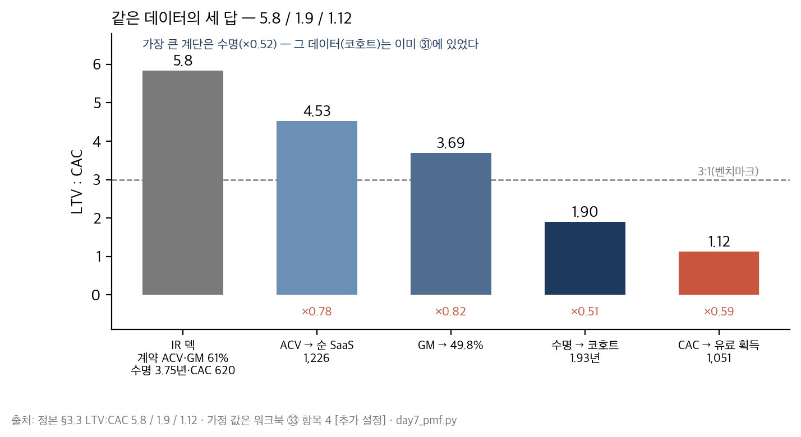

*그림 4-3. 왼쪽 5.8(IR). ACV를 순 SaaS로 → 4.5. GM을 49.8%로 → 3.7. 수명을 코호트(1.93년)로 → 1.9. CAC를 유료 획득(1,051)으로 → 1.12. 네 계단 중 가장 큰 것이 수명 — 그 데이터는 이미 ㉛에 있었다.*

### 딥게이지의 사례로 읽기

> ■ **사례 사실** — 5.8 / 1.9 / 1.12와 가정(계약 ACV·GM 61%·이탈 미반영·blended / 순 SaaS ACV·GM 49.8%·로고 이탈 반영 / 유료 획득 CAC)은 정본 §3.3; 수명 3.75년과 월 이탈 4.3%의 값은 워크북 §3.5 항목 4 [추가 설정].

㉝ 항목 4의 마지막 줄: "이 문서가 내부 결정에 쓰는 값은 1.9(채널 판단에는 1.12)이고, IR에는 5.8을 이 표와 함께 쓴다." 세 값 중 하나를 "맞는 값"이라 부르지 않는다. 시리즈A 리드가 "3:1 미만이면 투자 불가"라고 하면(워크북 §3.7 기본 과제) — 수명을 3년으로 가정하는 경로가 아니라, ACV(할인 24%)·GM(2-pass 조건부)·이탈(온보딩)을 실제로 움직이는 경로가 답이다.

### 실무에서 어떻게 틀리는가

결과만 적는다. 수명을 "업계 3~5년"으로. 하나를 "맞는 값"이라 부른다. 5.8을 내부 채널 예산에 쓴다.

### 표준·문헌에서는

Skok(LTV의 함정 — 이탈률의 정의), a16z(paid CAC). 4.8절의 벤치마크(3:1)는 성숙 SaaS의 것이고, 시드~PMF 단계의 LTV는 이탈 데이터가 부족해 가정이 결과를 지배한다 — 그래서 가정의 표다.

---

## 4.5 burn multiple·런웨이

### 개념

burn multiple = 순소진 ÷ 순증 ARR(같은 기간). 순증 ARR을 계약 기준으로 잡으면 낮아진다 — 분모를 적는다. 런웨이 = 현금 ÷ 월 순소진. 런웨이가 다음 라운드 클로징 + 실사 기간보다 짧으면 브릿지가 필요하다.

> **작은 숫자로 먼저.** 순소진 6,200 × 3 = 18,600 ÷ 분기 순증 ARR(순 SaaS) 9,000 = **2.07**. D+300의 4.26에서 개선. 현금 6.82억 ÷ 6,200 = **11개월**. 시리즈A 클로징 목표 D+900까지 10개월 + 실사 3개월 = 13 > 11 → **브릿지 필요**. Day6 1.2절의 "15일이 회사의 수명"이 규모만 커져 반복된다.

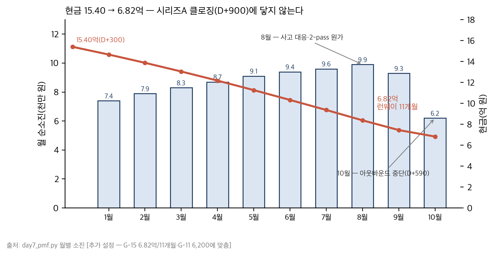

*그림 4-4. 월별 순소진(7,400 → 9,900 → 6,200)과 현금 잔액. 8월 봉우리(9,900)는 사고 대응과 eval v2의 2-pass 원가. 10월 6,200은 아웃바운드 중단(D+590). 오른쪽 끝 6.82억 / 11개월 — 시리즈A 클로징(D+900)에 닿지 않는다.*

### 딥게이지의 사례로 읽기

> ■ **사례 사실** — 6,200 / 9,000 / 2.07 / 0.48 / 6.82억 / 11개월은 G-11~15; 월별 소진 경로(7,400 → 9,900 → 6,200)는 워크북 §0.3·day7_pmf.py [추가 설정 — Day6 말 15.40억에서 6.82억으로].

순소진 6,200은 D+590 아웃바운드 중단 뒤의 숫자다 — 9월까지 9,300이었다. burn multiple 2.07은 "1원의 ARR을 얻기 위해 2.07원을 태운다"이고, 시드~PMF 단계로는 정상 범위의 상단이다. 분모 9,000을 계약 기준(구축비 포함)으로 잡으면 더 좋아 보인다 — 그래서 분모를 적는다.

### 실무에서 어떻게 틀리는가

순증 ARR에 구축비. 런웨이 11개월을 "충분"으로. 브릿지를 라운드 실패 뒤에 시작.

### 표준·문헌에서는

Sacks, "The Burn Multiple"(2020). Bessemer의 efficiency score. 6.4절(Day6)·7.4절.

---

## 4.6 계약 vs 실사용·활성률·채택률 분모 3종

### 개념

계약 라인 3.0 / 실사용 1.6 — ACV·NDR·North Star의 입력이자 라인 과금의 구조적 한계. 검사원 계정 활성률 68% → 41%(4개월) — 온보딩 뒤에 떠나는 사람. 그리고 자동판정 채택률 — 같은 분자를 세 분모로 나눈 22 / 14 / 38%. ㉮ AI 노출 건(초안·자동판정이 표시된 건), ㉯ 전체 검사기록 건(보류·오프라인·OFF 라인 포함), ㉰ 활성 계정이 처리한 건. 셋 다 계산 오류가 아니다. **절대 건수는 정본에 없다 — 만들지 않는다.** 어느 값을 대외에, 어느 값을 내부 결정에 쓰는지를 정하고, 둘 다 적으며, 분모를 각주로.

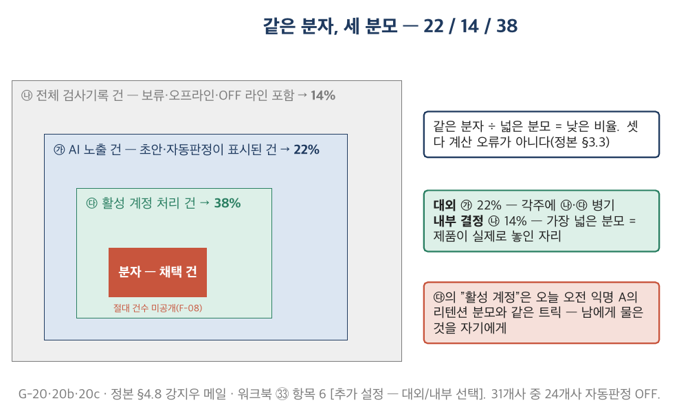

*그림 4-5. 가운데 분자(수정 없이 채택된 건 — 절대 건수 미공개). 세 분모의 크기 비교: ㉯ 전체 검사기록(가장 넓다, 14%) ⊃ ㉮ AI 노출 건(22%) ⊃ ㉰ 활성 계정 처리 건(가장 좁다, 38%). 오른쪽 — ㉰의 "활성 계정" 분모는 익명 A의 리텐션 분모와 같은 트릭.*

### 딥게이지의 사례로 읽기

> ■ **사례 사실** — 3.0 / 1.6, 68 → 41, 22 / 14 / 38, 31개사 중 24 자동판정 OFF는 G-18~20·정본 §3.3; 강지우 메일은 §4.8; 대외 ㉮ / 내부 ㉯의 선택은 워크북 §3.5 항목 6 [추가 설정].

㉝ 항목 6의 선택 — 대외 ㉮ 22%(각주에 ㉯·㉰ 병기), 내부 결정 ㉯ 14%. 가장 낮아서가 아니라 분모가 **가장 넓어서**다 — 전체 검사기록에는 보류(신뢰도 미달)·오프라인·자동판정 OFF 라인이 다 들어 있고, 그것이 제품이 실제로 놓인 자리다. ㉰ 38%는 활성 계정만의 분모 — 오늘 오전 익명 A에게 물었던 그 트릭(활성 계정)이다. 오전에 남에게 물은 것을 오후에 자기에게 적용하는 것이 이 항목이고, 그것이 Day3 감사자 → Day7 심사역 → Day8 피심사자로 이어지는 자리의 이동이다.

### 실무에서 어떻게 틀리는가

38%를 IR에, 22%를 내부에 쓰면서 둘 다 "채택률". 절대 건수를 만든다. 실사용 1.6을 "라인 정의 문제"로 넘긴다(ACV·NDR·North Star에 직결).

### 표준·문헌에서는

a16z "활성의 정의". PM 트랙 Day3의 분모 정정. 이 절은 표준이 아니라 이 과정의 규율이다 — "같은 분자에 세 분모가 있으면 셋 다 적는다".

---

## 4.7 표기 규칙 — IR 덱과 이사회

### 개념

같은 지표를 두 문서에 어떻게 쓰는가. 원칙은 셋 — **병기**(큰 숫자와 작은 숫자를 함께), **각주**(분모·가정), **분모 명시**. 큰 숫자를 지우지 않는다 — 지우면 "바꿨다"가 되고, 병기하면 "밝혔다"가 된다. 5줄이면 된다: ARR, GM, LTV:CAC, 채택률, 리텐션.

### 딥게이지의 사례로 읽기

> ■ **사례 사실** — 표기 규칙 5줄은 워크북 §3.5 항목 7 [추가 설정].

"ARR 4.9억(계약 기준; 순 SaaS 3.8억, 구축비·컨설팅 1.1억 제외)" — 이것이 서영채 메일의 답이다. "LTV:CAC 5.8(가정: 계약 ACV·GM 61%·수명 45개월·blended CAC — 표 4)" — 이것이 5.8을 거짓이 아니게 만드는 각주다. Day8 IR 1페이저(㊳)가 이 규칙 위에 쓰인다.

### 실무에서 어떻게 틀리는가

한 숫자만. 각주 없음. 이사회 자료와 IR 덱의 숫자가 다른데 이유가 안 적혀 있다(실사에서 나온다).

### 표준·문헌에서는

투자자 보고의 관행(투자자 업데이트 메일의 "정의" 각주)이 원형이다 — Feld & Mendelson(2019)의 "정보권" 조항이 요구하는 것.

---

## 4.8 분야별 대조 — 지표의 분모는 산업마다 어디서 갈리는가 (심화)

| 분야 | 갈리는 분모 | IR 표기 vs 검산 | 딥게이지와의 거리 |
|---|---|---|---|
| B2B 버티컬 SaaS(딥게이지) | 구축비 포함 여부 · 계약 라인 vs 실사용 · 활성의 정의 | 4.9 vs 3.8억 · 61 vs 49.8% | — |
| 컨슈머 앱 | DAU/MAU의 "활성" 정의 · 설치 vs 가입 vs 결제 | MAU 100만 vs 결제 3만 | 익명 A의 분모 문제가 일상 |
| 마켓플레이스 | GMV vs 순매출(take rate) · 양면의 활성 | GMV 100억 vs 매출 8억 | bookings ≠ revenue의 극단 |
| 하드웨어+구독 | 기기 매출 vs 구독 ARR · 부착률 | ARR에 기기 매출 포함 여부 | 구축비 문제와 같은 구조 |
| AI 네이티브 SaaS | 추론 원가의 COGS 포함 · 사용량 과금의 GM 변동 | GM 60 vs 40% | 2-pass 원가 — 5장 |
| 엔터프라이즈 | 계약 총액(TCV) vs ARR · 커스텀 매출 | TCV vs 라이선스 ARR — 내일의 숫자 | **Day8** |

공통점은 "큰 숫자에 일회성·비반복·비활성이 섞여 있다"는 것이고, 검산은 항상 그것을 빼는 방향이다. 마지막 줄이 내일이다 — 온담 딜의 계약 총액과 라이선스 ARR의 차이, 그리고 그것을 어떻게 계상하느냐에 따라 갈리는 집중 리스크.

---

## 제4장 핵심 정리

> **한 줄씩 — 수업 직전 5분 복습용**
> 1. 분모 선언이 첫 항목 — 4,083(계약) vs 3,167(순 SaaS). 같은 원가·같은 COGS가 32.8/42.3%, 61/49.8%.
> 2. 실효 단가 34.1만 = 명목 45만의 76% — 라인 1개 계약은 막았고 할인은 막지 못했다.
> 3. payback 세 계산 — 매출 기준(IR 2.3), GM 61%(4.98), GM 49.8%(6.10). 아웃바운드 28.9가 열 달 유지된 이유는 IR의 10.9.
> 4. LTV:CAC 5.8 / 1.9 / 1.12 — 가정의 표가 본체. 가장 큰 인자는 수명이고 그 데이터는 코호트에 있었다.
> 5. burn multiple 2.07(분모 순 SaaS) · 런웨이 11개월 < 클로징 10 + 실사 3 → 브릿지.
> 6. 채택률 22/14/38 — 절대 건수는 만들지 않는다. 대외 ㉮, 내부 ㉯(가장 넓은 분모). ㉰의 "활성"은 익명 A의 트릭.
> 7. 표기 규칙 — 병기·각주·분모 명시. 지우지 않는다, 밝힌다.
>
> 아래는 같은 내용의 자세한 판이다.

1. 서영채의 메일이 요구한 것은 4.9억을 지우는 것이 아니라 밝히는 것. "계약서 금액입니다"는 bookings의 답이지 ARR의 답이 아니다.
2. 할인 24% = 프로모션 30%(TIPS 시계) + 추천 15% + 선납 10%. ACV 1,226이 LTV의 첫 행.
3. GM 49.8%의 원인 절반은 eval v2의 2-pass(단가 32 → 67). 개선 레버 — 조건부 2-pass.
4. 3.07배 = 1.29(ACV) × 1.22(GM) × 1.94(수명). "3:1 미만 투자 불가"의 답은 수명 가정이 아니라 ACV·GM·이탈을 움직이는 것.
5. 순소진 6,200은 아웃바운드 중단 뒤. 브릿지 = Day8 SAFE 8억.
6. 오전에 남(익명 A)에게 물은 것을 오후에 자기(㉰)에게 적용한다 — Day3 감사자 → Day7 심사역 → Day8 피심사자.
7. 5줄 규칙이 Day8 IR 1페이저의 기반.

## 생각해 볼 질문

1. 여러분 회사 보고서의 비율 지표 하나를 두 분모로 계산해 보라. 두 값 중 어느 것이 어디에 쓰이고 있는가?
2. payback 계산에 GM을 넣지 않은 채널 예산 결정을 본 적이 있는가? 그 결정은 몇 달 유지됐는가?
3. 여러분 회사의 LTV 수명 가정은 어디서 왔는가 — 코호트인가, 관행인가?
4. "활성 사용자" 분모로 대외 지표를 만든 적이 있는가? 익명 A와 무엇이 다른가?

## 워크북 연결

이 장은 Day7 워크북 **㉝ 유닛이코노믹스 v2·재무 건전성**의 전 항목에 대응한다 — 항목 1(4.1절) · 항목 2(4.2절) · 항목 3(4.3절) · 항목 4(4.4절) · 항목 5(4.5절) · 항목 6(4.6절) · 항목 7(4.7절) · 항목 8(4.2~4.4절의 레버). 심화 과제(3~7년차): 자기 회사의 LTV:CAC를 가정 네 줄로 분해해 두 값을 만들고, 어느 값이 어디에 쓰이는지 적으라.

---

# 제5장 사고·eval v2·오류 예산 개정

## 5.1 사고 보고서의 형식 — 8D

### 개념

자동차 산업의 고객(1차사)은 부적합에 8D를 요구한다 — Day5 OP-03의 그 8D, 품질팀장이 11.5시간을 쓰던 문서다. 오늘 딥게이지가 그것을 **쓴다**. D1 팀 · D2 문제 기술 · D3 **임시 조치** · D4 **근본 원인**(5 Whys) · D5 영구 조치 선정 · D6 실행·검증 · D7 재발 방지(시스템) · D8 종결. 형식의 요점은 순서다 — 임시 조치(D3)가 원인 확인(D4)보다 먼저이고, 영구 조치(D5)는 D4 뒤다. 그리고 SRE의 포스트모템에서 하나를 가져온다 — **비난 없음**: 원인 칸에 사람 이름을 쓰지 않는다, 구조를 쓴다. 8D 형식 + Dekker의 원인관 = ㉞.

PM 트랙 번역 사전: 8D = 포스트모템 = RCA. ⑬ 이슈 로그의 "사실·판단 분리"와 ⑲ 교훈의 "소유자·증빙"이 D2와 D7·D8에 들어간다.

### 실무에서 어떻게 틀리는가

개요에 원인. D3와 D5를 섞음. D4에 이름("신입 검사원의 부주의"). 영구 조치가 "교육 강화". 증빙 없는 재발 방지. 고객 제출용 8D와 내부 학습용 문서를 따로 씀(같은 문서여야 한다).

### 표준·문헌에서는

8D는 Ford의 G8D와 AIAG 계열 관행(판본 확인). Beyer 외 SRE(2016) Ch.15 "Postmortem Culture". Dekker(2014) — 인적 오류는 결과이지 원인이 아니다. 7.5절.

---

## 5.2 세영정공 INC-01 — 무슨 일이 있었나

> ■ **사례 사실** — D+520(2027-08-11) 세영정공 사고(FN, 로트 2,400, 청구 2,700만, 해지 통보, 책임 한계 162만, 정미영의 말)는 정본 §4.6·G-36·G-40; 15:40·라인 2·신입 검사원·신뢰도 0.87·조도 경고 생략·라인 2 FN 신호 3개월 0건·타임라인은 워크북 §4.5 항목 1·2 [추가 설정]; 박선재 D+470 구두 보고는 정본 §2.3.

2027년 8월 11일 수요일 15시 40분. 세영정공 라인 2, 교대 조, 6월 25일에 입사한 검사원. 브래킷 외관 검사에서 GAUGE 판정 초안 '양품' — 신뢰도 0.87, 임계값 0.85 이상이라 표시됐다. 사진에 조도 경고가 떴다. 검사원은 재촬영 안내를 건너뛰고(1탭) 초안을 승인했다. 17시 10분 로트 2,400개 출하. 다음 날 9시 30분 H사 수입검사가 크랙을 발견하고 선별에 들어갔다. 11시 정미영 팀장이 강민수에게 전화했다 — 로그를 달라고. 로그에는 다 있었다: 초안 '양품', 승인, 조도 경고 플래그, 생략 플래그. 16시 임시 조치 — 전 고객 오후 3시 이후 판정 초안 표시 OFF, 자동판정 ON 7사 전원 OFF 권고. 8월 16일 청구 2,700만(선별 1,100 + 특별운송 400 + 페널티 1,200 — Day5 G-36의 그 숫자) + 해지 통보. 계약상 책임 한계 162만.

두 달 전, 6월 15일. 같은 공장 라인 1의 박선재가 팀장에게 말했다 — "오후 3시 이후에 크랙을 놓친다." 기록은 없다. 그리고 라인 2의 FN 신호(검사원이 초안을 뒤집은 건)는 석 달 동안 0건이었다. 오류 예산 리포트는 그것을 "예산 여유"로 표시했다.

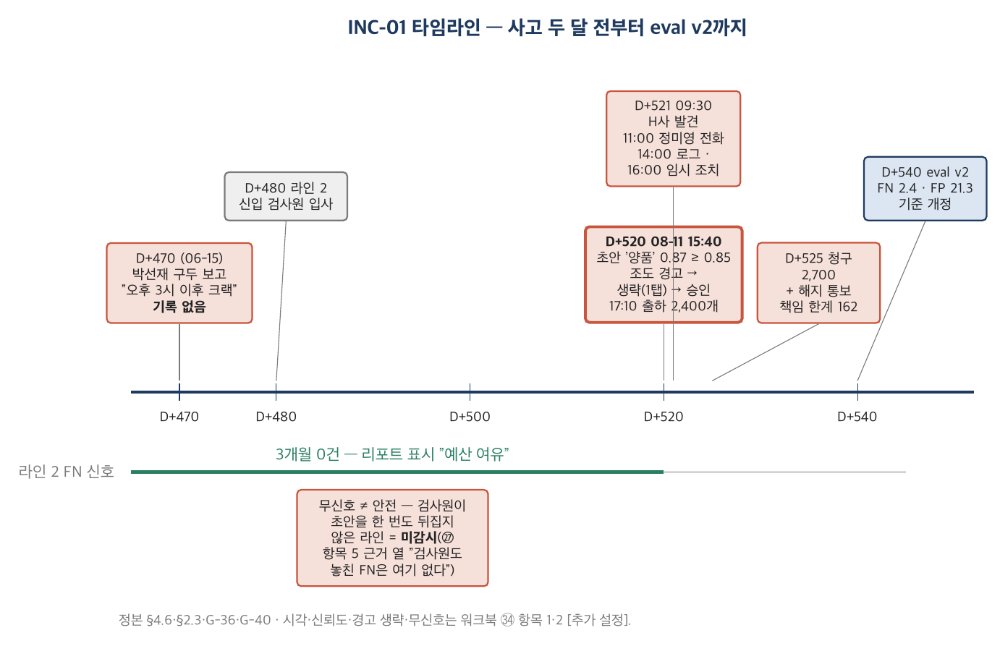

*그림 5-1. 위 — D+470 구두 보고(기록 없음), D+480 신입 입사, D+520 15:40 사고, 17:10 출하, D+521 H사 발견·전화·로그·임시 조치, D+525 청구·해지 통보, D+540 eval v2. 아래 — 같은 기간 라인 2의 FN 신호(0건 — 평평한 선)와 오류 예산 리포트의 표시("여유"). 무신호가 안전으로 읽힌 석 달.*

### 실무에서 어떻게 틀리는가

타임라인을 사고 당일부터 시작(D+470이 빠진다). 우리가 먼저 알지 못했다는 사실을 개요에서 뺀다. 정미영의 주장 근거가 우리 로그라는 것을 불리하게만 읽는다(로그가 있다는 것은 우리가 설계한 대로 기록됐다는 뜻이기도 하다).

---

## 5.3 근본 원인 — 기술·절차·조직

### 개념

5 Whys를 세 갈래로 — **기술**(무엇이 틀렸나), **절차**(왜 잡히지 않았나), **조직**(왜 알려지지 않았나). 한 갈래만 쓰면 조치가 한 갈래만 나온다. 원인 칸에 이름을 쓰면 조치가 "교육·주의"가 되고, 구조를 쓰면 조치가 "2탭 + 사유·티켓·미감시 표기"가 된다.

### 딥게이지의 사례로 읽기

> ■ **사례 사실** — D4 세 갈래는 워크북 §4.5 항목 3 [추가 설정]; 여집합 첫 줄은 Day6 ㉗ 항목 2; "검사원도 놓친 FN은 예산에 없다"는 ㉗ 항목 5; A-05b는 Day5 ㉔.

**기술** — 오후 조도 사진에서 크랙 대비가 낮아 신뢰도가 0.87로 과대(오전 사진에서 학습된 보정), 임계값 0.85가 통과시켰다. 왜? DS-v1이 오전 조도만 대표한다 — ㉗ 항목 2 여집합의 첫 줄. 오후 조도에서의 신뢰도 보정은 검증된 적이 없다.

**절차** — 재촬영 생략은 1탭이고 로그에 남는데 아무도 보지 않았다. 라인 2의 FN 신호 0건은 "안전"이 아니라 "검사원이 초안을 뒤집은 적 없음 = 미감시"였는데 예산 리포트가 그것을 "여유"로 표시했다. ㉗ 항목 5의 근거 열 — "검사원도 놓친 FN은 여기 없다, 클레임으로 잡힌다" — 그대로.

**조직** — D+470 구두 보고가 기록·전달되지 않았다. 검사원 → 팀장 → 우리로 오는 경로에 기록 절차가 없었다(CS 티켓은 팀장만 열 수 있었다). 신입의 첫 4주에 초안이 표시됐다 — 초안을 뒤집을 기준이 없는 사람에게. 그리고 A-05b — 검사원이 초안을 자기 판단의 대체로 두려워하지 않는가 — 는 반대 방향으로 실현됐다: 두려워하지 않고 **믿었다**.

세 갈래에 이름이 없다. "신입 검사원이 재촬영을 건너뛰었다"는 사실이고 원인이 아니다. "박선재의 보고를 팀장이 무시했다"도 원인이 아니다 — 검사원이 직접 등록할 경로가 없었다는 구조가 원인이다.

### 실무에서 어떻게 틀리는가

기술 원인만. 이름. "교육 강화". 조직 원인을 "커뮤니케이션 부족"으로 뭉갬(경로가 없었던 것과 소통을 안 한 것은 다르다).

### 표준·문헌에서는

Dekker(2014)의 "new view" — 오류는 시스템의 결과. Reason(1990)의 스위스 치즈 모델 — 여러 층의 구멍이 정렬될 때 사고. 세 갈래가 세 층이다.

---

## 5.4 계약상 책임 vs 고객 주장

### 개념

계약 문구는 법적으로 방어한다 — 관계적으로는 방어하지 못한다. 협상 입장은 셋 — 전액 / 계약 한계 / 중간 — 이고 각각 득실이 있다. 전액은 관계를 사고 선례를 잃는다(다음 실사에서 "계약 상한이 실효가 없다"). 한계는 선례를 지키고 관계·채널을 잃는다. 중간은 상한을 지키면서 서비스(무상 기간·증빙)로 관계를 산다. **사과와 책임 인정은 다른 문장이다.**

### 딥게이지의 사례로 읽기

> ■ **사례 사실** — 162만 vs 2,700만은 G-40; 정미영의 주장은 §4.6; 협상 3안과 중간안 선택, 12월 갱신까지 유예는 워크북 §4.5 항목 4 [추가 설정]; 책임 한계 문구의 리스크("고객은 서명하고 잊는다")는 Day6 ㉘ 항목 6.

고객 주장의 근거가 **우리 로그**다 — 초안 '양품', 승인, 조도 경고 플래그. 정미영은 로그를 요청했고 우리가 줬다. 그것은 불리한가? 법적으로는 아니다 — 로그가 "최종 판정은 검사원"을 입증한다. 관계적으로는 그렇다 — 조도 경고를 띄우고도 초안을 표시한 것은 우리 설계이고, 라인 2 무신호를 석 달 방치한 것도 우리다. 예시본은 중간안 — 162만은 그대로(문구 선례), 6개월 무상 + 재발 방지 증빙 월 1회 + 정미영에게 오후 OFF 결정 공유. Day6 ㉘ 항목 6의 근거 열에 적힌 리스크("클레임 2,700만과의 격차 — 고객은 서명하고 잊는다")가 그대로 일어났고, 이 선례가 Day8 온담의 배상 상한 100% 요구 앞에서 꺼내진다.

### 실무에서 어떻게 틀리는가

162만만 회신(선례는 지키고 세영·김도윤 채널을 잃는다). 전액 배상(문구의 선례 붕괴). 사과 문장에 책임 인정을 섞음. 로그를 주지 않음(신뢰의 마지막 조각을 잃는다).

### 표준·문헌에서는

계약법의 책임 제한 조항 실무(판본·법역 확인). PM 트랙 Day4 ⑰ SLA의 배상 조항이 발주자 쪽 경험 — Day8 ㊲에서 반대편.

---

## 5.5 eval v2 — FN을 낮춘 대가

### 개념

사고 뒤 CTO는 모델을 고친다. 2-pass — 저신뢰 사진을 대형 모델로 재추론. FN이 내려간다. 그 대가는 세 가지 — FP가 오르고(양품을 불량이라 하는 비율), 단가가 오르고(호출 두 번), 지연이 늘어난다. FN·FP·단가·지연을 **한 표**에 놓고 마지막 열에 "이것이 무엇을 바꾸는가"를 쓴다. 그리고 그 표의 마지막 행 — 채택률 — 의 인과는 여러분이 적는다. 이 절은 힌트만 준다.

> **작은 숫자로 먼저.** DS-v1 동일(1,480항목, 불량 296, 양품 1,184). v1: FN 24/296 = 8.1%, FP 173/1,184 = 14.6%, 32원, 1.8초. v2: FN **7**/296 = 2.4%, FP **252**/1,184 = **21.3%**, **67원**, **4.3초**. FP 21.3% — 양품 다섯 장 중 한 장이 불량으로 잡힌다. 자동판정을 **켠** 라인에서 그 한 장은 무엇이 되는가? 검사원이 다시 봐야 하는 부품이다. 라인 속도에서 지연 4.3초는 무엇인가? 다음 부품이다.

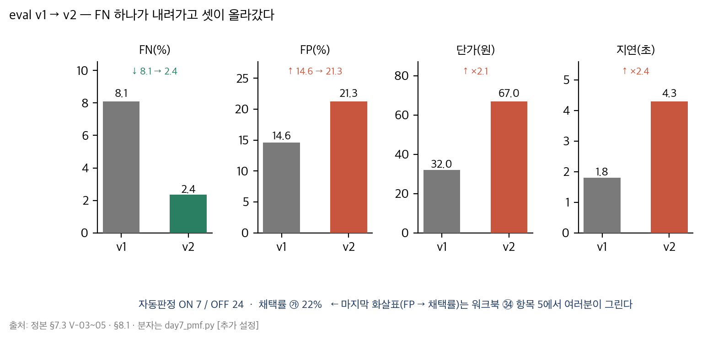

*그림 5-2. 네 지표의 v1 → v2. FN 8.1 → 2.4(아래로), FP 14.6 → 21.3, 단가 32 → 67, 지연 1.8 → 4.3(위로). 오른쪽 끝 — 자동판정 ON 7 / OFF 24, 채택률 22%. 마지막 화살표(FP → 채택률)는 점선이다 — 워크북 ㉞ 항목 5에서 여러분이 그린다.*

### 딥게이지의 사례로 읽기

> ■ **사례 사실** — v1 → v2(V-01~05), FP 21.3%가 채택률 22%의 원인이라는 문장은 정본 §7.3·§8.1; 분자(7/296, 252/1,184, 1,000/1,050, TP 89/FN 7/FP 27)는 워크북 §4.5 항목 5 [추가 설정].

정본 §8.1의 문장 — "FN을 8.1%에서 2.4%로 내리는 2-pass 추론은 기술적으로 옳다. 그 대가는 FP 21.3%, 원가 2.1배, 지연 2.4배, 그리고 채택률 22%다. 오세진은 앞의 숫자를 먼저 보고, 강지우는 뒤의 숫자를 먼저 본다." 둘은 같은 표를 보고 있다. 워크북 ㉞ 항목 5의 마지막 행에서 여러분이 쓸 문장이 그 표의 마지막 열이다. 힌트는 여기까지다 — 그리고 채택률 22%를 "검사원 교육 문제"로 적으면 즉시 탈락이다.

### 실무에서 어떻게 틀리는가

FN만 보고 "개선". FP·단가·지연을 "감수"로 넘김. 채택률 저하를 변화 관리·교육으로. CTO와 CS가 다른 표를 본다고 생각함.

### 표준·문헌에서는

정밀도-재현율 트레이드오프(ROC 곡선)는 ML의 표준 어휘다. 여기서 새로운 것은 "임계값의 이동이 **사용자 행동**(OFF)을 통해 채택률로 돌아온다"는 인과이고, 그것은 Kohavi 외(2020)의 가드레일 지표 — 원가·지연·수용 — 의 실물이다.

---

## 5.6 합격 기준 개정과 criteria drift

### 개념

사고 뒤에 합격 기준이 바뀐다. Day6 3.4절에서 배운 criteria drift는 **결과를 보고 기준을 정하는 것**이고, 방향의 문제가 아니다. 기준을 올리는 개정도 v2 결과에 맞춰 올렸다면 drift다. 그리고 더 큰 문제 — 데이터셋이 그대로면 새 기준은 **사고가 난 조건에서 측정된 적이 없다**. 기준 개정보다 데이터셋(여집합 첫 줄)이 먼저였어야 한다.

### 딥게이지의 사례로 읽기

> ■ **사례 사실** — 합격 기준 v1 → v2(FN ≤ 8.0 & OCR ≥ 90 → FN ≤ 3.0 & OCR ≥ 95, "사고 후 개정"), 데이터셋 동일은 V-06·V-07; 개정 절차 통과(높이는 개정 CTO 전결)와 반론은 워크북 §4.5 항목 6 [추가 설정].

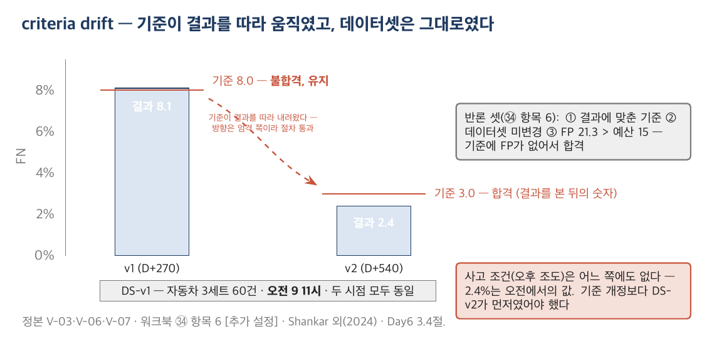

*그림 5-3. 왼쪽 — v1 결과 8.1 위에 기준 8.0(불합격, 유지). 오른쪽 — v2 결과 2.4 위에 기준 3.0(합격) — 기준이 결과를 보고 내려왔다. 아래 회색 띠 — DS-v1(오전 조도)은 두 시점 모두 같고, 사고 조건(오후 조도)은 어느 쪽에도 없다. 방향이 위쪽이라 절차는 통과했다.*

D+540, 오세진 CTO 전결로 기준이 FN ≤ 3.0 & OCR ≥ 95로 개정됐다. ㉗ 항목 3의 절차("높이는 개정은 CTO 전결")를 **통과했다**. 워크북 ㉞ 항목 6의 반론 칸: ① 3.0과 95는 2.4와 95.2를 본 뒤의 숫자다 — 결과에 맞춘 기준 ② 데이터셋이 그대로다 — 사고 조건(오후 조도)은 DS-v1에 없고, 새 기준은 오전에서의 2.4%다. 사고가 난 조건에서 FN은 v1에서도 v2에서도 측정된 적이 없다 ③ FP 예산(15%)을 초과하는 모델을 합격시켰다 — 기준에 FP가 없기 때문. 결론: 기준 개정보다 DS-v2(오후 세트)가 먼저였어야 했다. Day6에서 여러분이 적은 여집합 첫 줄이 여기서 두 번째로 시험받고, Day8에 세 번째 — 온담의 4번째 세트 — 로 시험받는다.

### 실무에서 어떻게 틀리는가

"기준이 올랐으니 좋아졌다". 반론 칸 공란. 데이터셋 변경 여부를 안 적음. 절차 통과 = drift 아님으로 읽음.

### 표준·문헌에서는

Shankar 외(2024) — 평가 기준은 결과를 보며 바뀐다. Day6 3.4절. Gebru 외 "Datasheets"의 "이 데이터셋이 대표하지 않는 것" 칸이 여기서 실물이 된다.

---

## 5.7 오류 예산 개정

### 개념

사고가 드러낸 구멍을 메운다. 이 사고의 구멍은 **무신호를 안전으로 읽은 것**이다 — FN 신호 0건인 라인은 "예산 여유"가 아니라 "검사원이 초안을 한 번도 뒤집지 않은 라인 = 미감시"다. 개정의 핵심은 예산 비율이 아니라 **'미감시' 표기**다. FP 예산은 유지하되 v2가 그것을 초과한 상태(21.3 > 15)로 출발한다는 것을 적고, 자동판정 기본값을 OFF로 고정하고 ON 조건을 FP 예산 충족 라인으로 둔다 — D+410의 조건 미충족 출시를 사후 정정하는 것이다.

### 딥게이지의 사례로 읽기

> ■ **사례 사실** — 개정 전·후(FN 8.0 → 3.0 + 미감시 표기 / FP 15 유지·초과 상태 / 임계값 0.85 → 0.90, 오후 0.95 / 자동판정 기본 OFF 고정 / 오후 초안 DS-v2 합격 전 OFF)는 워크북 §4.5 항목 7 [추가 설정].

Day6 ㉗ 항목 5의 근거 열에 "검사원도 놓친 FN은 여기 없다 — 클레임으로 잡힌다"라고 적었다. 그대로 일어났다. 라인 2의 0건은 리포트에서 "여유"로 보였고, 실제로는 신입이 초안을 믿는 라인이었다. 무신호를 안전으로 읽는 것이 오류 예산의 구조적 맹점이고, 그것을 "미감시"라는 표기 하나로 드러내는 것이 개정이다. 그리고 재발 방지 6건(항목 8)마다 증빙 열이 있다 — Day8 온담 218문항 중 제218문항이 이 표를 요구한다.

### 실무에서 어떻게 틀리는가

FN 예산만 조인다. FP 초과 상태를 안 적는다. "미감시"와 "무오류"를 구별하지 않는다. 재발 방지에 증빙 없음.

### 표준·문헌에서는

SRE의 error budget policy(소진 시 신뢰성 작업 우선)와 "silent failure"의 관측 가능성 문제 — 신호가 없는 것과 문제가 없는 것은 다르다.

---

## 제5장 핵심 정리

> **한 줄씩 — 수업 직전 5분 복습용**
> 1. 8D 순서(임시 → 원인 → 영구) + 비난 없음(원인 칸에 이름 없음) = ㉞. 고객 제출용과 내부 학습용은 같은 문서.
> 2. INC-01 — 15:40, 0.87 ≥ 0.85, 조도 경고 생략, 승인, 2,400개, 2,700만 vs 162만. 두 달 전 구두 보고, 석 달간 무신호.
> 3. 원인 세 갈래 — 기술(여집합 첫 줄), 절차(무신호 = 미감시), 조직(기록 경로 없음). 이름이 아니라 구조.
> 4. 고객 주장의 근거가 우리 로그 — 법적으로 유리, 관계적으로 불리. 중간안: 상한은 지키고 서비스로 관계를 산다. 사과 ≠ 책임 인정.
> 5. eval v2 — FN 2.4의 대가 FP 21.3·단가 2.1배·지연 2.4배. 채택률 22%의 인과는 여러분이 적는다.
> 6. 기준 개정은 절차를 통과했지만 drift다 — 결과에 맞췄고, 데이터셋은 그대로다. 사고 조건은 측정된 적이 없다.
> 7. 오류 예산 개정의 핵심은 '미감시' 표기 — 무신호는 안전이 아니다.
>
> 아래는 같은 내용의 자세한 판이다.

1. 8D는 Day5 OP-03의 그 문서 — 팀장이 11.5시간을 쓰던 것을 오늘 우리가 쓴다. PM 번역 사전: 8D = 포스트모템 = RCA.
2. 타임라인은 사고 당일이 아니라 D+470에서 시작한다. "우리가 먼저 알지 못했다"가 원인의 일부.
3. 세 층의 구멍이 정렬됐다(Reason). 이름을 쓰면 조치가 교육이 되고, 구조를 쓰면 2탭·티켓·미감시 표기가 된다.
4. 162만은 선례, 6개월 무상은 관계, 증빙은 신뢰. Day8 온담의 배상 상한 100% 앞에서 이 선례를 꺼낸다.
5. 정본 §8.1 — CTO는 FN을 먼저, CS는 채택률을 먼저. 같은 표. "검사원 교육 문제"는 즉시 탈락.
6. 반론 셋 — 결과에 맞춘 기준, 데이터셋 미변경, FP 없는 기준. DS-v2가 먼저였어야 했다.
7. 재발 방지 6건의 증빙 열이 Day8 제218문항의 답이다.

## 생각해 볼 질문

1. 여러분 회사의 최근 장애·사고 보고서에서 원인 칸에 이름이 있었는가? 조치는 무엇이었는가?
2. "신호가 없다"를 "문제가 없다"로 읽고 있는 지표가 여러분 회사에 있는가?
3. 사고 뒤에 기준을 바꾼 적이 있는가? 그 기준은 결과를 보기 전에 정해졌는가?
4. 고객이 여러분의 로그를 근거로 주장할 때, 로그를 주겠는가? 그 결정이 다음 사고의 로그에 어떤 영향을 주는가?

## 워크북 연결

이 장은 Day7 워크북 **㉞ AI 판정 오류 사고 보고서·Eval v2·오류 예산 개정**의 전 항목에 대응한다 — 항목 1·2(5.2절) · 항목 3(5.1·5.3절) · 항목 4·9(5.4절) · 항목 5(5.5절) · 항목 6(5.6절) · 항목 7·8(5.7절). Day6 ㉗의 네 문장이 입력이고, Day8 ㊲(제218문항)·㊵(데이터셋 문장)가 출력이다. 심화 과제(3~7년차): 자기 회사의 사고 하나에 대해 D4를 세 갈래로, 이름 없이 쓰라.

---

# 제6장 로드맵·예산 3분리·변경요청

## 6.1 Now/Next/Later — 날짜를 쓰지 않는다

### 개념

로드맵은 날짜의 목록이 아니라 **순서와 조건**의 목록이다. Now(지금 하는 것 — 근거가 있다), Next(무엇이 되면 다음 — 조건이 있다), Later(조건이 아직 없다). 날짜를 쓰면 고객·투자자에게 약속이 되고, 약속은 사고가 나면 깨진다. 항목마다 상위 노드(㉓의 잎 또는 ㉘·㉞의 항목)와 근거(실험·사고·데이터)와 크기(S·M·L)를 단다. Later는 "안 한다"가 아니라 "조건이 아직 없다"다 — Won't(조건 있음)·Later(조건 없음)·Could(다음 사이클 후보)는 다른 세 상태다.

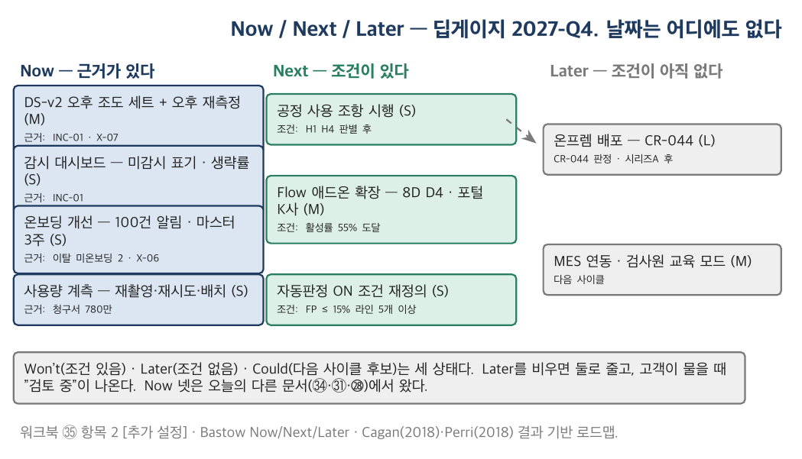

*그림 6-1. 세 열. Now 넷(DS-v2·감시 대시보드·온보딩·사용량 계측) — 근거는 사고·이탈·청구서. Next 셋 — 조건(계측 결과·활성률 55%·FP 예산 충족 라인 5)이 화살표 위에 있다. Later 둘(온프렘 CR-044·MES). 날짜는 어디에도 없다.*

### 딥게이지의 사례로 읽기

> ■ **사례 사실** — Now 4 / Next 3 / Later 2와 조건은 워크북 §5.5 항목 2 [추가 설정].

Now의 넷은 전부 오늘의 다른 문서에서 왔다 — DS-v2와 감시 대시보드는 ㉞ 항목 8, 온보딩은 ㉛ 항목 5, 사용량 계측은 Day6 ㉘ 항목 4("계측 먼저")다. Next의 조건은 측정 가능한 사건이다 — "H1~H4 판별 후", "활성률 55%", "FP ≤ 15% 라인 5개". Later의 온프렘은 CR-044(6.4절)의 판정을 기다린다.

### 실무에서 어떻게 틀리는가

날짜. 근거 없는 항목. Later 공란. Next의 조건이 "여건이 되면".

### 표준·문헌에서는

Bastow(ProdPad)의 Now/Next/Later, Cagan(2018)·Perri(2018)의 결과 기반 로드맵. Singer(2019)의 "사이클마다 다시 건다".

---

## 6.2 예산 3분리 — 신뢰 복구

### 개념

개발 공수를 셋으로 나눈다 — **차별화**(고객이 돈을 내는 이유), **위생**(기술 부채·보안·규제), **신뢰 복구**(사고 뒤의 재발 방지·감시·데이터셋). 사고 후 분기에는 세 번째가 별도 예산이어야 한다 — 차별화에서 "남으면" 하거나 위생에 섞으면 우선순위와 소유자와 증빙을 잃는다. SRE의 규칙 — 오류 예산이 소진되면 신뢰성 작업이 기능 작업보다 앞선다 — 의 제품판이다.

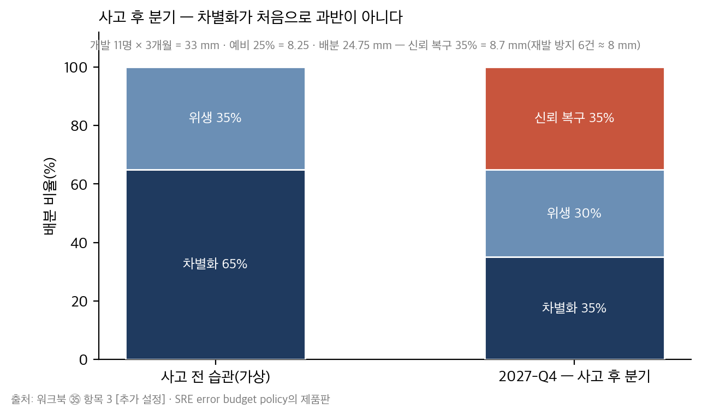

*그림 6-2. 왼쪽 — 사고 전 습관(차별화 65 / 위생 35 / 신뢰 복구 0). 오른쪽 — 2027-Q4(차별화 35 / 위생 30 / 신뢰 복구 35). 33 mm 중 예비 8.25를 뺀 24.75의 분배. 차별화가 처음으로 과반이 아니다.*

### 딥게이지의 사례로 읽기

> ■ **사례 사실** — 개발 11명 × 3개월 = 33 mm, 예비 25%, 차별화 35 / 위생 30 / 신뢰 복구 35와 포함 항목은 워크북 §5.5 항목 1·3 [추가 설정].

신뢰 복구 35%(약 8.7 mm)에 ㉞ 항목 8의 재발 방지 6건(약 8 mm)이 들어간다. 위생 30%에는 시리즈A 실사 준비(보안 문서)와 2-pass 원가 최적화(GM 레버)가 있다. 차별화 35%에 Flow 애드온 확장·포털 규격 2종·사용량 계측 — 그리고 CR-044가 요구하는 6.0 mm는 이 35%의 70%다(6.4절).

### 실무에서 어떻게 틀리는가

신뢰 복구를 위생에 섞음. 사고 전 비율(차별화 65)로 사고 후 분기를 짬. 비율만 있고 항목이 없음. 신뢰 복구 예산을 IR에서 숨김(실사에서 나온다).

### 표준·문헌에서는

Beyer 외 SRE(2016)의 error budget policy. Kniberg의 "기술 부채 예산" 관행. 세 번째 예산(신뢰 복구)의 분리는 이 교재의 요구다.

---

## 6.3 Won't 갱신 — 조건이 충족된 것과 미충족인데 만든 것

### 개념

Day6 ㉖ 항목 5의 Won't마다 재검토 조건이 있었다. 열 달 뒤 — 충족된 것(온프렘: 유료 5개사 달성)은 재검토로 넘기고, **미충족인데 만든 것**은 그렇게 적는다 — "승격, 조건 미충족, 사후 기록". 새 Won't를 추가한다. Won't 갱신 표에 "재검토 완료"라고 적는 것과 "조건 미충족 승격"이라고 적는 것은 다른 일이다 — 전자는 무엇이 잘못됐는지를 지우고, 후자는 남긴다.

### 딥게이지의 사례로 읽기

> ■ **사례 사실** — D+410 자동판정 모드 출시(B-17 조건 미충족 — FN 8.1 미합격·X-04 회피 14%), 출시 근거(IR 스토리·세일즈 요청 7사, 기록 없음)는 워크북 §0.3·§5.5 항목 4 [추가 설정]; "D+300 이후 자동판정 모드 — 켜는 고객이 적다"는 정본 §1.3.

자동판정 모드는 D+410에 출시됐다. B-17의 재검토 조건 — 합격 기준 충족 그리고 X-04 회피 행동 < 10% — 은 둘 다 미충족이었다(FN 8.1 미합격, 회피 14%). 출시 근거는 시리즈A IR의 "AI 검사" 스토리와 세일즈 요청이었고, ㉖의 표를 거치지 않았다 — Day6 태산정밀 62항목(B-20)과 같은 구조가 더 큰 규모로 반복된 것이다. INC-01은 자동판정 ON 라인에서 난 사고가 아니다. 그러나 24개사가 OFF를 요청한 것(채택률 22%)은 그 출시의 결과다. 그리고 커널(Day5 ㉕ 항목 6-3 "판정을 대신하지 않는다")이 D+410에 문서 없이 흔들렸다. ㉟ 항목 4는 그것을 "승격 — 조건 미충족, 사후 기록"으로 적고, 정정(기본 OFF 고정, ON은 FP 예산 충족 라인만)을 ㉞ 항목 7에 연결한다.

### 실무에서 어떻게 틀리는가

"재검토 완료". 조건 충족(온프렘)을 무시하고 Won't 유지. 새 Won't 없음. 출시 근거를 사후에 만들어 붙임.

### 표준·문헌에서는

PM 트랙 ⑥ 제외 범위의 변경 통제(Day2·3)가 원형이다 — 제외 범위를 바꾸려면 CR이 있어야 한다. 자동판정 출시는 CR 없이 제외 범위를 바꾼 것이다.

---

## 6.4 CR-044 — 신청자 쪽에서 쓰는 변경요청

### 개념

PM 트랙 Day3에서 여러분은 발주자로서 벤더의 CR을 받아 근거·영향·대안을 요구했다. 오늘은 세일즈와 1차사 SQE의 요구를 CPO가 진술 패킷으로 만든다 — 요청 내용 / 실험·데이터 근거 / 편익 영향(지표·분모) / 원가·공수 영향 / **포기 항목 후보**(무엇을 빼야 들어가는가) / 요청하는 결정과 시한. 포기 항목 칸이 이 문서의 핵심이다 — 그것이 없는 CR은 "이것도 해 달라"이고, 채워진 CR은 "이것 대신 저것"이다. 요청 결정은 승인 / 보류 / 기각 중 하나를 시한과 함께 — "검토 부탁"은 결정이 아니다.

### 딥게이지의 사례로 읽기

> ■ **사례 사실** — CR-044(온프렘 요구 12 → 도면 미업로드로 해소 5 → 잔여 7, 편익 +8,600만 ARR, 원가 6.0 mm + 0.7 FTE + GPU, 포기 항목 Flow 확장 + 포털 2종, 결정 "보류 — 채널 계약 서명 시 착수", 시한 D+660)은 워크북 §5.5 항목 5 [추가 설정]; 김도윤은 정본 §2.4; 온프렘 E-14는 Day8 — 오늘 인용하지 않는다.

재검토 조건(유료 5개사)은 D+360에 충족됐고 편익은 실재한다 — 7사 × 3라인 × 실효 34.1만 × 12 = 순 SaaS ARR +8,600만(23%), 1차사 채널 CAC 90만. 기각할 근거가 없다. 그러나 6.0 mm는 사고 후 분기 차별화 예산(8.7 mm)의 70%이고, 온프렘의 공헌이익률은 SaaS의 절반 이하이며(운영 0.7 FTE 연 5,600만), 시리즈A 실사 중이다. 승인할 여력이 없다. 그래서 조건부 보류 — 채널 계약서(H사)가 서명되면 즉시 착수, 시한 D+660. 포기 항목 칸에 "Flow 애드온 확장 전부 + 포털 규격 2종"이 적혀 있어야 이 판정이 가능하다. 그리고 김도윤 — Day5의 "블로커이자 채널" — 이 여기서 채널로 돌아왔고, 그의 요구는 여전히 "공문으로 주세요"다.

### 실무에서 어떻게 틀리는가

포기 항목 공란. 편익을 "고객 만족". "검토 부탁". 세일즈가 CR 없이 약속. 온프렘을 Now로 올리면서 무엇을 뺐는지 안 적음.

### 표준·문헌에서는

PM 트랙 Day3 ⑪ 변경요청서의 여섯 칸을 신청자 쪽에서 쓴 것이다. PMBOK의 변경 통제와 Shape Up의 "betting table"(무엇에 걸 것인가 = 무엇을 안 걸 것인가)이 배경이다.

---

## 제6장 핵심 정리

> **한 줄씩 — 수업 직전 5분 복습용**
> 1. 로드맵은 순서와 조건 — Now(근거)·Next(조건)·Later(조건 없음). 날짜를 쓰지 않는다. Won't·Later·Could는 세 상태.
> 2. 사고 후 분기의 예산은 셋 — 차별화 35 / 위생 30 / 신뢰 복구 35. 신뢰 복구는 별도 예산이어야 소유자와 증빙이 생긴다.
> 3. Won't 갱신 — 온프렘은 조건 충족 → CR, 자동판정은 조건 미충족 출시 → "승격, 사후 기록". 지우지 않는다.
> 4. CR-044 — 포기 항목 칸이 핵심. 기각도 승인도 아닌 조건부 보류(채널 계약 서명 시 착수, D+660).
>
> 아래는 같은 내용의 자세한 판이다.

1. Now 넷은 오늘의 다른 문서(㉞·㉛·㉘)에서 왔고, Next의 조건은 측정 가능한 사건이다. Later를 비우면 세 상태가 둘로 줄고 "검토 중"이 나온다.
2. 신뢰 복구 8.7 mm에 재발 방지 6건 8 mm. 차별화가 처음으로 과반이 아니다. IR에서 숨기지 않는다 — 실사에서 나온다.
3. D+410 출시는 ㉖의 표를 거치지 않았다 — B-20의 구조가 큰 규모로. 24개사 OFF가 그 결과. 정정은 ㉞ 항목 7.
4. 편익 +23%와 원가(6.0 mm = 차별화의 70%, 공헌이익률 절반)의 저울. 포기 항목이 있어야 저울이 있다. 김도윤이 채널로 돌아왔다 — "공문으로".

## 생각해 볼 질문

1. 여러분 회사의 로드맵에서 날짜를 지우고 조건을 적었을 때, Next의 조건을 적을 수 없는 항목이 몇 개인가?
2. 최근 분기 개발 공수에서 신뢰 복구(사고·장애 재발 방지)에 쓴 비율은 얼마였고, 그것은 별도 예산이었는가?
3. 조건 미충족인데 출시된 기능이 있는가? 그 기록은 어디에 있는가?
4. 여러분이 최근에 낸(또는 받은) 변경요청에 포기 항목이 있었는가?

## 워크북 연결

이 장은 Day7 워크북 **㉟ 제품 로드맵 Now/Next/Later·예산 3분리·CR 신청 진술**의 전 항목에 대응한다 — 항목 1·2(6.1절) · 항목 3(6.2절) · 항목 4(6.3절) · 항목 5(6.4절) · 항목 6(6.1절). Day6 ㉖ 항목 4·5가 입력이고, Day8 ㊱(엔터프라이즈 딜 데스크 — 용량 잠식 판단)이 출력이다. 심화 과제(3~7년차): 자기 회사의 분기 로드맵을 Now/Next/Later로 다시 쓰고 예산을 셋으로 나눠 보라.

---

# 제7장 이 날의 학술 배경과 읽을 자료 (과정 후)

## 7.1 Ellis·Vohra — PMF 서베이와 리텐션 곡선

### 무엇인가
Sean Ellis(2009~)의 PMF 서베이 — "이 제품을 더 이상 쓸 수 없다면 어떻게 느끼겠습니까?"에 "매우 실망" 40% 이상이면 PMF의 신호. Rahul Vohra(Superhuman, 2018)는 그 서베이를 세그먼트별로 나눠 40% 미만에서 40% 이상으로 가는 과정을 공개했다. Ellis & Brown(2017)은 서베이와 리텐션 곡선을 함께 쓴다.

### 실무자에게
B2B 검사 SaaS의 응답자는 팀장이고 검사원이 아니다 — 서베이의 "사용자"가 누구인가를 정해야 한다. Day5 2.2절(관찰과 자기 보고)의 이유로 이 교재는 서베이를 보조로, 코호트를 주로 쓴다. 딥게이지는 NPS를 측정하지 않았다.

### 흔한 오독
40%를 절대 기준으로. 서베이 응답자를 "활성 사용자"로 한정해 40%를 만듦(익명 A의 분모 문제와 같다).

### 어디를 읽을 것인가
Ellis & Brown(2017) Part I. Vohra, "How Superhuman Built an Engine to Find Product/Market Fit"(First Round Review, 2018). Andreessen, "The only thing that matters"(2007).

## 7.2 코호트 분석의 계보 — 생존 분석에서 SaaS 대시보드까지

### 무엇인가
삼각행렬의 통계적 원형은 생존 분석(survival analysis)의 Kaplan-Meier 추정이다 — 관측이 끝나지 않은 개체(검열, censoring)를 다루는 법이 거기서 왔다. 미도달 셀(▨)이 검열이다. 위험 집단(risk set)의 정의 — 누가 분모에 있는가 — 가 2.2절의 "분모를 먼저"다.

### 실무자에게
SaaS 대시보드의 코호트 표는 Kaplan-Meier의 단순화이고, 단순화에서 사라지는 것이 검열의 처리와 분모의 정의다. 두 가지를 손으로 적는 것이 ㉛ 항목 1이다.

### 흔한 오독
미도달을 0 또는 100으로. 코호트 평균. "리텐션 71%"를 분모 정의 없이 인용.

### 어디를 읽을 것인가
Croll & Yoskovitz(2013) Ch.5. 생존 분석 입문(임의의 통계 교과서 — Kaplan-Meier·censoring). a16z "16 Startup Metrics"의 코호트·활성 항목.

## 7.3 North Star — Amplitude·Reforge, 그리고 Goodhart

### 무엇인가
Amplitude *The North Star Playbook*(2018)이 NSM의 조건과 입력 지표 트리를 정리했고, Reforge의 성장 모델 강의가 산식 분해를 퍼뜨렸다. Goodhart(1975)·Campbell(1979)의 법칙 — 지표가 목표가 되면 지표이기를 멈춘다 — 이 상호 공격(3.2절)의 근거다.

### 실무자에게
North Star 하나 + 입력 지표 3~5 + 가드레일. 상호 공격 기록이 없는 North Star는 아직 게임을 안 당한 것. 검증 상태(측정·추정·미검증)를 표기하고 추정에 목표를 두지 않는 것은 이 교재의 요구다.

### 흔한 오독
North Star를 매출로. 입력 지표를 KPI 목록으로. 가드레일 없이.

### 어디를 읽을 것인가
Amplitude(2018, 무료 PDF). Doerr(2018) — OKR. Goodhart(1975)·Campbell(1979) 원문은 짧다.

## 7.4 SaaS 지표 벤치마크의 함정

### 무엇인가
Skok("SaaS Metrics 2.0"), Bessemer(*State of the Cloud*), a16z가 LTV:CAC 3:1, payback 12개월, NDR 100%+, GM 70%+ 같은 벤치마크를 퍼뜨렸다. 벤치마크는 성숙 SaaS의 것이고, 정의(분모)가 같을 때만 비교 가능하다.

### 실무자에게
Day7의 딥게이지는 LTV:CAC 1.9(또는 1.12), payback 6.1(인바운드)~28.9(아웃바운드), NDR 97, GM 49.8 — 벤치마크 미달이다. 그것은 실패의 증거가 아니라 단계(PMF 추적)와 정의(순 SaaS)의 결과다. 벤치마크에 맞추려고 분모를 바꾸는 것이 함정이다.

### 흔한 오독
3:1을 투자 기준으로. 벤치마크의 분모를 확인하지 않고 비교. AI 제품의 GM을 일반 SaaS 벤치마크로 판단.

### 어디를 읽을 것인가
Skok 전문. a16z "16 Startup Metrics"·"16 More". Sacks "The Burn Multiple"(2020). Bessemer *State of the Cloud* 최근 판(판본 확인).

## 7.5 8D와 포스트모템 — 제조와 SRE, 그리고 Dekker

### 무엇인가
8D는 Ford의 G8D(1987~)에서 자동차 산업 전반으로 퍼진 문제 해결 형식 — 임시 조치와 영구 조치의 분리, 근본 원인의 검증. SRE의 포스트모템(Beyer 외, 2016, Ch.15)은 비난 없음(blameless)을 문화로 요구한다. Dekker(2014)는 "인적 오류는 결과이지 원인이 아니다"(new view)를 안전 공학에서 정립했고, Reason(1990)의 스위스 치즈 모델이 다층 원인의 비유다.

### 실무자에게
고객(1차사)이 요구하는 것은 8D이고, 조직이 배우는 데 필요한 것은 비난 없음이다. 둘을 합치면 "순서는 8D로, 원인 칸은 Dekker로". 같은 문서여야 한다 — 고객 제출용과 내부 학습용을 따로 쓰면 둘 다 거짓이 된다.

### 흔한 오독
비난 없음을 "책임 없음"으로. 8D를 양식 채우기로. D4에 이름.

### 어디를 읽을 것인가
Beyer 외 SRE(2016) Ch.15(무료 공개). Dekker(2014) 1~3장. Reason, *Human Error*(1990) 7장. 8D 양식은 AIAG 계열 문서(판본 확인).

## 7.6 서지와 읽는 순서

| 순서 | 문헌 | 이유 |
|---|---|---|
| 1 | Croll & Yoskovitz, *Lean Analytics* (2013) 5·7장 | 코호트·SaaS 단계 — 가장 짧다 |
| 2 | Ellis & Brown, *Hacking Growth* (2017) Part I | PMF의 정의와 리텐션 |
| 3 | Skok "SaaS Metrics 2.0" · a16z "16 Startup Metrics" | 지표의 정의 — ㉝ |
| 4 | Beyer 외 SRE (2016) 15장 · Dekker (2014) 1~3장 | 사고 보고서의 문화 — ㉞ |
| 5 | Amplitude *North Star Playbook* (2018) · Doerr (2018) | North Star·OKR — ㉜ |
| 6 | Sacks (2020) · Bessemer *State of the Cloud* | burn multiple·벤치마크 — 함정 포함 |
| 7 | Perri (2018) · Bastow Now/Next/Later · Shankar 외 (2024) | 로드맵 · criteria drift |

*판본과 서지는 인용 전에 확인한다(제작 노트 §1.2). 위 목록의 출간 연도는 원서 기준이다.*

## 7.7 읽을 자료 — 필수 / 심화 / 참고

**필수 (과정 전)**

| 자료 | 분량 | 왜 |
|---|---|---|
| Croll & Yoskovitz, *Lean Analytics* (2013) 5·7장 | 50쪽 | ㉛ 코호트 |
| Ellis & Brown, *Hacking Growth* (2017) Part I | 60쪽 | PMF·리텐션 |
| Skok, "SaaS Metrics 2.0" | 40쪽 | ㉝ 지표 정의 |
| Beyer 외, *SRE* (2016) 15장 | 15쪽 | ㉞ 포스트모템 |
| `교재/공통/가상회사_딥게이지.md` §3.3 · §4.5~4.9 · §7.2 · §7.3 v2 · §8.1·8.3 | 20분 | 사례 |
| Day6 워크북 ㉗ 항목 2·3·5·6 · ㉘ 항목 6 · ㉙ 항목 4 | 10분 | 오늘의 입력 |

**심화 (과정 후)** — **30일 안에**: Doerr(2018) · Amplitude(2018) · Dekker(2014) 1~3장 · a16z "16 Startup Metrics"·"16 More" · Sacks(2020). **90일 안에**: Perri(2018) · Reason(1990) 7장 · Vohra(2018) · 생존 분석 입문 · Bessemer *State of the Cloud*.

**참고 (워크북을 쓰다가 손을 뻗어 확인할 것)** — 8D 양식(AIAG 계열 — 판본 확인) · Goodhart(1975)·Campbell(1979) · ISO/IEC 42001:2023 사고 관리 · Kohavi 외(2020) 가드레일 · PM 트랙 Day3 워크북 §1(⑪)·§3(⑬), Day4 워크북 §4(⑲)·§2(⑰), Day3 교재 2.1절(분모 정정).

### 읽지 않아도 되는 것

"PMF 찾는 법" 류의 글 — 정의를 하나로 고정하지 않는다. SaaS 벤치마크 인포그래픽 — 분모가 없다. 사고 사례집의 "교훈 10가지" — 이름이 있는 원인은 원인이 아니다.

## Day7을 마치며 — Day8 예고

이 교재는 네 질문으로 요약된다. **곡선은 평탄해졌는가**(27Q1 M5 71%, M4 67→79→83 — 그리고 익명 A의 분모), **무엇으로 성공을 잴 것인가**(NS-1, 상호 공격, 검증 상태), **같은 데이터의 두 답 중 어느 것을 서명할 것인가**(4,083과 3,167, 5.8과 1.9와 1.12, 22와 14와 38), **사고 뒤에 무엇을 고치고 무엇을 고치지 말았어야 했는가**(세 갈래 원인, FP 21.3 → 채택률 22, 기준 개정과 그대로인 데이터셋, 미감시). 여러분의 답이 워크북 ㉛~㉟의 다섯 산출물이고, 그 산출물은 Day8(시리즈A와 첫 엔터프라이즈 — 제품 회사로 남을 수 있는가)의 입력이 된다.

Day8은 두 시점을 산다 — 2028-05(온담의 요구 목록 접수, 시리즈A 텀시트 2안)와 2028-11-26(에필로그). 오늘 CR-044를 보류한 온프렘이 온담의 E-14로 돌아오고, 오늘 162만의 선례가 배상 상한 10% vs 100%가 되며, 오늘 ㉝의 표기 규칙이 IR 1페이저의 ARR 두 값(계약 기준 vs 검산)이 되고, 오늘 ㉞ 항목 8의 증빙 열이 218문항 중 제218문항의 답이 된다. 그리고 오늘 ㉞ 항목 6에서 여러분이 적은 문장 — "데이터셋은 그대로다, 사고 조건은 측정된 적이 없다" — 이 마지막 30분의 최종 명제가 된다: FN 2.4%는 자동차 3세트 60건에서 나온 값이고, 온담의 4번째 세트에서는 한 번도 측정되지 않았다.

측정 시점에 밝혀진 것은 서명 시점에 감출 수 없다. 그것이 오늘 여러분이 익명 A의 분모를 묻고, 5.8 옆에 1.9를 적고, 22 옆에 14와 38을 적고, 원인 칸에 이름 대신 구조를 적고, 기준 개정 옆에 반론을 적은 이유다.
