# Product 트랙 Day 8 교재 — 시리즈A와 첫 엔터프라이즈: 제품 회사로 남을 수 있는가

> **이 교재의 위치** — 8일 과정의 마지막 날, Product 트랙의 넷째 날 본문이다. 어제 여러분은 D+600에 서서 코호트 세 장을 읽고, 채택률의 세 분모를 적고, 사고 보고서의 원인 칸에 이름 대신 구조를 적었다. 오늘 시계는 두 번 멈춘다 — **2028-05-10(D+800)**, 온담F&B의 요구 47건이 확정 접수되고 시리즈A 텀시트 두 장이 책상 위에 있는 날, 그리고 **2028-11-26(D+1000)**, 에필로그. 오늘의 다섯 문서(㊱~㊵)는 모두 첫 시점에서 쓰고, 둘째 시점은 마지막 30분에만 연다.
>
> **전제 독자** — 주니어 PM과 3~7년차 현업 실무자. Day1~7을 마친 사람. 엔터프라이즈 세일즈·SLA·텀시트의 기초는 다루지 않는다. 대신 "같은 문서를 반대편에서 쓸 때 무엇이 달라지고 무엇이 그대로인가"에 지면을 쓴다 — Day4에서 여러분이 보낸 SAC와 요구한 배상 상한과 서명받은 편익 원장을, 오늘은 받고 막고 서명한다.
>
> **사례 회사** — 이 교재의 모든 예시는 `교재/공통/가상회사_딥게이지.md`에 정의된 ㈜딥게이지와 검사기록 AI 'GAUGE', 그리고 `가상회사_온담F앤B.md`의 온담F&B를 재료로 쓴다. 숫자는 정본 §7 핵심 숫자 표(G·V·E·K)와 Day8 워크북 완성 예시본([추가 설정])을 따른다. 정본에 없는 값은 본문에 [추가 설정]으로 표시한다.
>
> **읽는 법과 분량** — 이 교재는 하루에 다 읽는 책이 아니다. 목차의 표시대로 필독 절만 수업 전에 읽으면 되고(약 130분), 나머지는 수업 후·과정 후에 읽는다. 본문의 딥게이지 단락은 앞머리에 **■ 사례 사실** 줄을 두어 그 절이 정본의 어느 숫자 위에 서 있는지 먼저 보인다. 공식이 나오는 절에는 **작은 숫자로 먼저** 상자를 두어 손으로 검산한 뒤 본문의 큰 숫자를 읽게 한다.

---

## 목차

표시 없는 절은 **수업 전 필독**(약 130분), (심화)는 수업 후 일주일 안에 읽는 절(약 25분), (과정 후)로 표시된 장은 4일이 끝난 뒤 읽는 학술 배경과 읽을 자료다. 각 장 끝의 "핵심 정리" 첫 상자(한 줄씩)는 수업 직전 5분 복습용이다.

**서문 — Day7에서 가져오는 것**

**제1장 엔터프라이즈 딜의 구조 — 같은 금액의 비대칭**
- 1.1 D+600~1000 — 두 시점
- 1.2 21억의 해부 — 구축·라이선스·운영
- 1.3 같은 금액의 네 비율 — 4.9 / 37.0 / 24.1 / 82.1
- 1.4 BATNA — 자동차를 벗어날 것인가
- 1.5 표준·문헌의 지형 — Moore, Fisher & Ury, Feld, Ward & Daniel (심화)
- 핵심 정리 / 생각해 볼 질문 / 워크북 연결

**제2장 제품화·커스텀·거절 — 코드체계 5차원**
- 2.1 47건을 하나씩 판정하면 6시간 — 5차원 표 먼저
- 2.2 다섯 차원 읽기 — 판정 라벨·식별자·단위·규격·흐름
- 2.3 3분류의 기준 — 58사에게도 가치가 있는가
- 2.4 용량 잠식 계산 — 138 mm와 14명
- 2.5 분류별 계약 문구와 소유권
- 2.6 즉시 탈락 셋
- 핵심 정리 / 생각해 볼 질문 / 워크북 연결

**제3장 경계·SLA·배상 — 반대편에서 쓰는 같은 문서**
- 3.1 제품-프로젝트 경계 3영역
- 3.2 SLA/OLA/UC — 공급자 쪽에서
- 3.3 AI 판정 오류를 SLA에 넣을 것인가
- 3.4 배상 상한 — 물리적 하한과 4구간
- 3.5 218문항 — 받는 쪽의 SAC
- 3.6 데이터 이관 — 정본 판정자와 61.4%
- 핵심 정리 / 생각해 볼 질문 / 워크북 연결

**제4장 자본 — 시리즈A·옵션풀·BATNA**
- 4.1 IR 1페이저 — 두 값 병기
- 4.2 집중 리스크 3표기
- 4.3 재무모델 3케이스 — 온담 포함·제외
- 4.4 IC 반대신문 — 답에 분모를
- 4.5 캡테이블 T2 → T3 — 주식수로 계산한다
- 4.6 옵션풀 pre/post — 1.29%p
- 4.7 텀시트 레드팀과 2×2
- 4.8 채용 여력과 협상 요청
- 핵심 정리 / 생각해 볼 질문 / 워크북 연결

**제5장 편익 원장 공동 확정과 8일 사슬**
- 5.1 ⑳를 반대편에서 — output 열
- 5.2 output·outcome·utilisation — 칸마다 실명
- 5.3 인수 기준의 모집단
- 5.4 두 시계와 미달 시 조치
- 5.5 8일 사슬 역추적
- 5.6 에필로그 — D+1000
- 5.7 8일 최종 명제
- 핵심 정리 / 생각해 볼 질문 / 워크북 연결

**제6장 이 날의 학술 배경과 읽을 자료 (과정 후)**
- 6.1 Moore — 캐즘·볼링 핀·전체 제품
- 6.2 협상론 — BATNA와 객관적 기준
- 6.3 벤처 파이낸스 — 텀시트의 경제와 통제
- 6.4 편익 관리 — Ward & Daniel에서 MSP·PMBOK 8판까지
- 6.5 SLA·책임 제한·AI 관리체계
- 6.6 서지와 읽는 순서
- 6.7 읽을 자료 — 필수 / 심화 / 참고

**Product 트랙을 마치며 — 8일의 끝**

---

# 서문 — Day7에서 가져오는 것

Day7의 다섯 문서에서 오늘로 넘어오는 것은 다음 여섯이다.

| Day7에서 | 오늘 어디에 | 무엇이 되는가 |
|---|---|---|
| ㉝ 표기 규칙 — 4.9 vs 3.8억, GM 61 vs 49.8, LTV:CAC 5.8 vs 1.9 | ㊳ 항목 2 | ARR **18.9 vs 15.68** — 규칙이 IR 덱에 절반만 적용됐다 |
| ㉞ 항목 4 — 책임 한계 162만의 선례, 중간안 | ㊲ 항목 5 | 배상 상한 **10% vs 100%** — 4구간 |
| ㉞ 항목 8 — 재발 방지 6건의 증빙 열 | ㊲ 항목 6 | 218문항 중 **제218문항**의 답 |
| ㉞ 항목 5 — 데이터셋 "자동차 3세트 60건, 온담 4세트 미측정" | ㊵ 항목 4 | **인수 기준의 모집단** — 8일 최종 명제 |
| ㉟ 항목 4·5 — Won't 갱신, CR-044 보류(온프렘) | ㊱ 항목 3 | 47건 중 C-31 온프렘 — Won't가 요구로 돌아온다 |
| ㉝ 항목 5 — 런웨이 11개월, 브릿지 필요 | ㊴ 항목 2 | SAFE 8억 → K-03 → 텀시트 2안 |

그리고 세 가지를 미리 말해 둔다.

**첫째, 두 시점을 섞지 않는다.** 오늘의 다섯 문서는 모두 2028-05(D+800~821)에 쓴다. D+1000의 숫자 — 34명, 개발 21명 중 14명 온담 투입, 릴리스 7개월 공백 — 는 워크북 §7에 봉인되어 있고 마지막 30분에만 연다. 그것을 먼저 보고 쓰면 오늘의 문서는 결과에 맞춘 문서가 된다. Day7에서 여러분은 그 오류에 이름을 붙였다(criteria drift).

**둘째, 반대편이다.** Day1~4에서 여러분은 온담 P1의 PM이었다. SAC 12항목을 보냈고(⑯), SLA 7항목의 3층 매핑을 그려 수행사의 UC를 재협상했고(⑰), 편익 원장의 output 서명을 받았다(⑳). 오늘 여러분은 그 수행사다. 218문항이 오고, 99.5%와 배상 100%가 오고, 편익 원장의 output 칸에 여러분 이름이 들어간다. 같은 문서다. 달라지는 것은 어느 칸에 서명하느냐다.

**셋째, 분모의 마지막 판이다.** Day3에서 재고 정확도 91.3%의 분모(순환실사 SKU 69%)를 따져 물었고, Day7에서 익명 A의 활성 계정과 채택률의 세 분모를 따져 물었다. 오늘은 ARR의 분자(18.9 중 7.0이 무엇인가)와 FN 2.4%의 모집단(자동차 3세트 60건)이다. 8일의 마지막 문장은 그 모집단에 관한 것이다.

---

# 제1장 엔터프라이즈 딜의 구조 — 같은 금액의 비대칭

## 1.1 D+600~1000 — 두 시점

### 개념

큰 계약은 결정이 아니라 기간이다. RFI가 오고, 제안서가 나가고, 요구 목록이 자라고, 텀시트가 오고, 서명이 되고, 그 뒤에 결과가 온다. 이 교재는 그 기간에서 두 점을 고른다 — 요구가 확정된 날(결정 직전)과 결과가 보이는 날(에필로그). 두 점 사이의 여섯 달은 정본에 없다. 여러분이 첫 점에서 쓴 문서가 둘째 점을 어떻게 바꿨을지는 여러분이 판정한다.

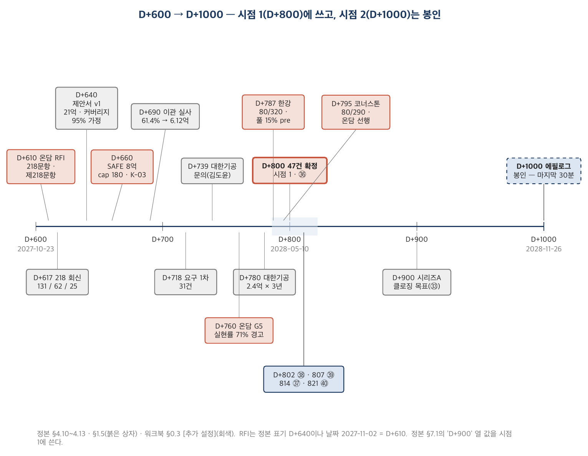

*그림 1-1. D+600(Day7)에서 D+1000(에필로그)까지. 시점 1(D+800)에 47건 확정·텀시트 2안·대한기공 제안이 모여 있고, 시점 2(D+1000)는 봉인이다. 정본 §4.10~4.13 사건은 진하게, [추가 설정]은 연하게.*

### 딥게이지의 사례로 읽기

> ■ **사례 사실** — RFI 2027-11-02·218문항·제218문항은 §4.10(정본 표기 D+640, 날짜 기준 D+610); SAFE 8억 D+660은 §4.11; 47건·텀시트 2안·대한기공은 §4.12(D+800~900); 에필로그는 §1.5·§4.13. 회신 3범주·제안서·이관 실사(61.4%)·G5·텀시트 수령일·문서 작성일은 [추가 설정].

RFI가 2027-11-02에 왔다. 온담 P1 종료 보고서(⑱) 이관 목록 6번 — "품질·검사기록 디지털화 모듈" — 이 2027-09 프로그램 이사회에서 별건 승인된 결과다. 218문항이 함께 왔고 제218문항은 두 달 반 전 세영정공 사고의 근본원인 분석서를 요구했다. 5영업일 뒤 회신했다(즉시 131 / 조건부 62 / 불가 25). 12월에 제안서(21억 구조)와 SAFE 8억. 1월에 이관 대상 실사 — 코드 매핑 커버리지 실측 61.4%, 구축비 3.00억의 실제 소요가 6.12억으로 검산됐다. 2월 요구 목록 1차 31건. 3월 31일 온담 P1 G5 — 편익 실현률 71%, 경고, 개선 계획에 검사기록 디지털화. 4월 대한기공 제안, 한강 텀시트. 5월 5일 코너스톤 텀시트. **5월 10일 요구 목록 v3 = 47건 확정.** 여기가 시점 1이다.

시점 2는 2028-11-26이다. 34명, 개발 21명 중 14명이 온담에, 자동차 58사의 릴리스가 7개월간 없다. 시리즈A 80억은 클로징됐고 리드는 정본에 없다.

### 실무에서 어떻게 틀리는가

결정일을 서명일로 잡는다(서명일에는 이미 요구 목록이 47건이고 텀시트 선행 조건이 붙어 있다 — 결정은 요구가 확정되는 날 이전에 끝나야 한다). 결과를 아는 채로 결정 문서를 쓴다(사후 합리화). 두 시점 사이의 여섯 달을 "협상"이라는 한 단어로 뭉갠다 — 그 안에 ㊱~㊵의 다섯 문서가 있다.

### 표준·문헌에서는

Moore의 볼링 핀 모델은 세그먼트를 옮기는 결정이 한 고객이 아니라 "다음 핀"의 선택이라고 말한다 — 온담이 다음 핀인가 다른 레인인가는 §8.6의 질문이다. Day7 ㉟ 로드맵 규칙(날짜를 쓰지 않는다)은 오늘 ㊱ 항목 4(제품화 시점 미약속)로 이어진다.

---

## 1.2 21억의 해부 — 구축·라이선스·운영

### 개념

계약 총액은 세 종류의 돈을 섞어 놓은 숫자다 — 한 번 받는 돈(구축·이관), 반복해서 받는 돈(라이선스 = ARR), 받아서 그대로 쓰는 돈(운영 원가의 통과). IR 덱은 셋을 더해 ARR이라 부르고 싶어 하고, 심사역은 셋을 나눠 묻는다. 해부의 규칙은 하나 — **각 줄이 ARR인가 아닌가**를 표시한다. 그리고 라이선스의 산식(라인 수 × 단가)이 어느 세그먼트를 전제로 설계됐는지를 본다 — 밸류메트릭은 세그먼트를 바꾸면 무너진다.

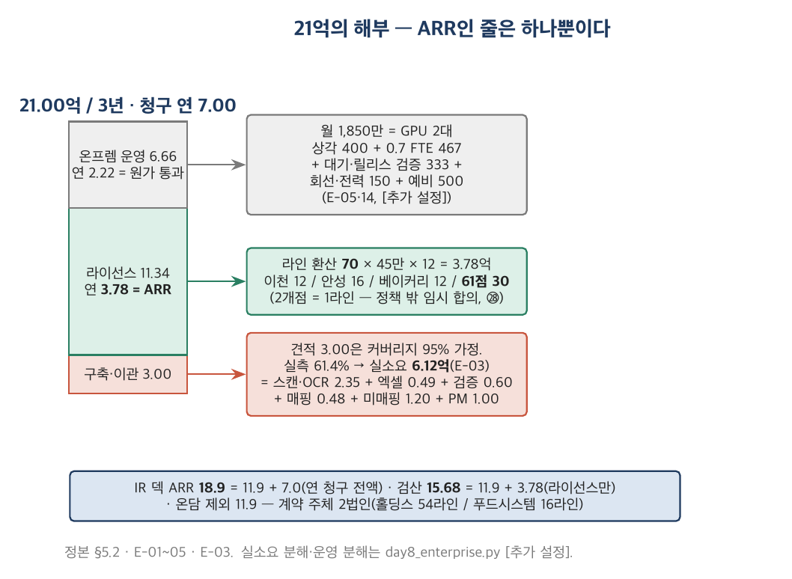

*그림 1-2. 21억 중 ARR 성격은 연 3.78억뿐이다. 구축 3.00은 실소요 6.12로 검산되고(커버리지 61.4%), 운영 2.22/년은 원가 통과다. 라인 70 중 30은 "2개점 = 1라인"의 임시 합의.*

### 딥게이지의 사례로 읽기

> ■ **사례 사실** — 21.00 = 3.00 + 11.34 + 6.66, 연 청구 7.00, 라인 70 × 45만 × 12 = 3.78, 월 1,850만(GPU 2대 + 0.7 FTE), 라인 구성 12/16/12/30은 §5.2·E-01~05; 실소요 6.12·커버리지 61.4%는 §5.5·E-03. 운영 원가 분해와 실소요 분해는 워크북 §1.5 항목 1 [추가 설정].

21억을 세 줄로 나누면 이렇다. 구축·이관 3.00억 — 1년차 일시. 라이선스 11.34억 — 연 3.78 = 라인 환산 70 × 45만 × 12. 온프렘 운영·GPU 상각·SLA 6.66억 — 연 2.22 = 월 1,850만. 청구는 연 7.00억 균등. ARR인 줄은 둘째 줄뿐이다. 첫째 줄은 게다가 견적이 틀렸다 — 코드 매핑 커버리지 95%를 가정한 3.00억이 실측 61.4%에서 6.12억이 됐다. 셋째 줄은 GPU 2대 상각·0.7 FTE·대기·회선의 원가 통과다.

라인 70의 구성을 보라. 이천센터 12(냉장 3구역 × 2교대 + 입고 2 + 출고 2 + 이물 2), 안성 원료공장 16(4라인 × 4검사지점), 이천 베이커리 12, 그리고 **브레드온담 직영 61점 30 — 2개점 = 1라인**. 마지막 줄은 딥게이지 프라이싱 정책 밖의 임시 합의다. 라인 과금은 Day6 ㉘에서 공장을 전제로 설계됐고 점포에는 맞지 않는다. 70 중 30이 정책 밖이라는 것은 3.78억 중 1.62억의 산식이 없다는 뜻이다.

### 실무에서 어떻게 틀리는가

21억 또는 7억을 ARR로 적는다(IR 덱이 그렇게 했다 — 18.9억). 구축비를 견적 그대로 원가로 쓴다(6.12로 검산하지 않으면 배상 상한의 물리적 하한이 과대 평가된다 — F-14). 라인 70을 하나의 숫자로 본다(30이 정책 밖이다). 계약 주체를 하나로 본다(안성·베이커리 28라인은 조성태의 별도 법인이다).

### 표준·문헌에서는

Skok의 ARR 정의(반복 매출만) · a16z "16 Startup Metrics"의 bookings ≠ revenue ≠ ARR. Day6 ㉘ 항목 5(밸류메트릭 = 라인)와 항목 6(구축비 분리 규칙)이 오늘 이 절의 원형이다.

---

## 1.3 같은 금액의 네 비율 — 4.9 / 37.0 / 24.1 / 82.1

### 개념

같은 21억이 두 회사에게 다른 무게다. 그 무게를 비율로 쓰면 넷이 나온다 — 온담에게 21/428, 딥게이지에게 7/18.9(IR), 3.78/15.68(검산), 그리고 138/168(개발 용량). 첫째는 상대의 시선이고 둘째·셋째는 같은 것의 과대·적정 표기이며 넷째는 IR 덱에 없는 실제 리스크다. **집중 리스크를 ARR 비중으로만 말하는 IR 덱은 거짓말을 하고 있다**(정본 §5.6).

> **작은 숫자로 먼저.** 온담: 21 ÷ 428 = **4.906%** — 원가 허용범위 10.08억의 두 배가 넘는다. 하루짜리 안건이 아니다. 딥게이지 IR: 7.0 ÷ (11.9 + 7.0) = 7.0 ÷ 18.9 = **37.0%**. 검산: 3.78 ÷ (11.9 + 3.78) = 3.78 ÷ 15.68 = **24.1%**(순SaaS 10.3을 분모로 쓰면 3.78 ÷ 14.08 = 26.8%). 용량: 138 ÷ (14 × 12) = 138 ÷ 168 = **82.1%** = 14명 전원의 9.9개월.

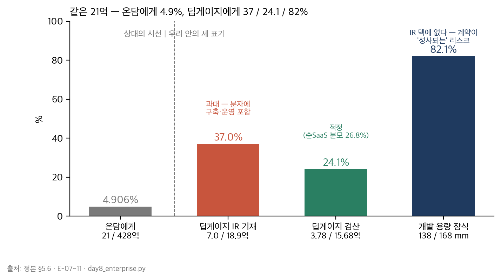

*그림 1-3. 왼쪽 두 막대는 온담과 딥게이지의 시선 차이, 오른쪽 셋은 딥게이지 안에서의 표기 차이. 37.0은 분자에 구축·운영이 들어 있어 과대, 82.1은 IR 덱에 없어 과소.*

### 딥게이지의 사례로 읽기

> ■ **사례 사실** — 4.906 / 37.0 / 24.1 / 138 mm / 9.9개월 / 82.1%는 §5.6·E-07~11. 순SaaS 분모 26.8%는 [추가 설정](심화).

온담에게 21억은 428억 프로그램의 4.906%다 — Day2에서 여러분이 정한 원가 허용범위 10.08억의 두 배가 넘는다. 이사회 안건이지 팀장 결재가 아니다. 그래서 CFO 결재 3주이고 218문항이다. 딥게이지에게 7억은 IR 덱 기준 ARR의 37.0%다 — "이 계약이 깨지면 회사가 없다"로 읽히는 숫자. 그런데 그 분자는 구축비와 운영 원가를 포함한다. 라이선스만 ARR로 세면 24.1%이고, 그것이 적정한 표기다. 세 번째 숫자는 IC 반대신문에서 나온다 — 47건 138 man-month는 개발 14명 전원의 9.9개월, 연간 용량의 82.1%. 계약이 깨지는 리스크가 아니라 계약이 **성사되는** 리스크다.

### 실무에서 어떻게 틀리는가

37%만 쓴다(과대 — IC가 "온담 없으면 죽는 회사"로 읽는다). 24.1%만 쓴다(IC가 37%를 이미 계산해 왔다 — Day7 서영채의 지적이 재현된다). 82.1%를 쓰지 않는다(그것이 실제 리스크다). 온담 쪽 비율(4.906%)을 모른다 — 상대가 왜 3주 걸리는지, 왜 218문항인지 이해하지 못한 채 협상한다.

### 표준·문헌에서는

a16z "16 More Startup Metrics"의 고객 집중(concentration) — 분모를 ARR로, 분자를 반복 매출로. PM Day2 ⑨ 원가 허용범위 — 발주자 쪽에서 21억의 무게.

---

## 1.4 BATNA — 자동차를 벗어날 것인가

### 개념

BATNA(협상 결렬 시 최선의 대안)는 협상의 바닥이다. 바닥이 없으면 상대의 모든 요구가 "받거나 죽거나"가 되고, 바닥이 있으면 요구마다 "바닥보다 나은가"를 물을 수 있다. BATNA는 존재해야 값이 있다 — 제안서 상태의 대안은 카드가 아니고 서명된 대안이 의자다. 그리고 큰 계약의 실제 질문은 계약 자체가 아니라 세그먼트다: 이 한 건이 다음 핀인가, 다른 레인인가.

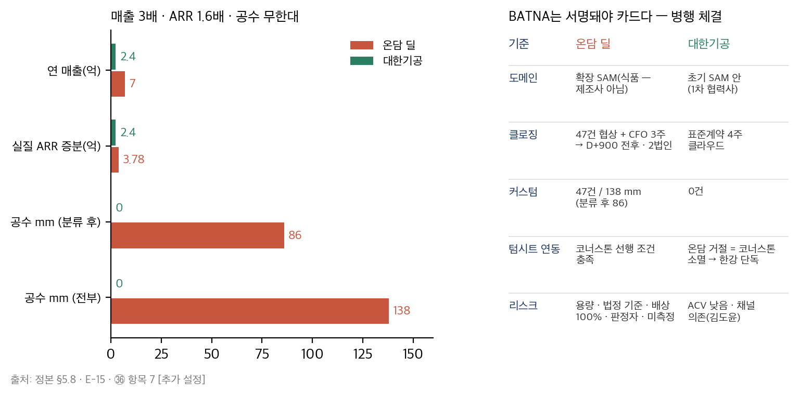

*그림 1-4. 매출은 세 배 차이지만 ARR은 1.6배, 공수는 무한대 차이. 대한기공은 도메인 안에 있어 제품이 흔들리지 않는다. 온담을 거절하면 코너스톤 텀시트가 동시에 사라진다.*

### 딥게이지의 사례로 읽기

> ■ **사례 사실** — 대한기공 연 2.4억 × 3년(21억의 34.3%), 커스텀 0, 클라우드, 4주는 §5.8·E-15; 코너스톤 선행 조건은 §3.4; §8.6의 질문. 김도윤 소개·병행 체결 권고는 [추가 설정].

대한기공은 1차 협력사(매출 3,200억)이고 표준계약 연 2.4억 × 3년을 제안했다. 커스터마이징 0건, 클라우드, 4주 클로징. 21억의 34.3%다. 매출은 3분의 1이지만 도메인 안에 있다 — 제품이 흔들리지 않는다. 그리고 ARR로 비교하면 3.78 vs 2.40, 1.6배 차이다. 온담을 거절하면 코너스톤 텀시트가 동시에 사라진다(선행 조건). 표면의 질문은 "21억을 받을까"이고 실제 질문은 "초기 SAM 2,150을 떠나 확장 SAM 11,800으로 갈 것인가"다. 온담은 제조사조차 아니다.

예시본(㊱ 항목 8)의 답은 "벗어나지 않는다 — 조건부 Go". 온담은 자동차 제품이 식품에서도 서는지 측정하는 한 건이고, 두 번째 식품 고객은 측정 결과(㊵ 항목 4) 이후에 판단한다. 그리고 대한기공을 **병행 체결**한다 — BATNA를 실제로 만든다.

### 실무에서 어떻게 틀리는가

BATNA를 "차선책"으로 읽고 비교표를 만들지 않는다. 2.4를 21과 비교한다(연 vs 3년). 대한기공을 "작다"로만 본다. 세그먼트 질문에 답하지 않고 계약만 판정한다. BATNA를 제안서 상태로 둔다.

### 표준·문헌에서는

Fisher & Ury, *Getting to Yes* 6장 — BATNA를 개발하라(develop your BATNA): 대안은 생각이 아니라 행동으로 만든다. Moore, *Crossing the Chasm* 3~4장 — 볼링 핀, 다음 세그먼트의 선택 기준(기존 세그먼트와 공유하는 전체 제품). Day5 ㉓ 초기 SAM / 확장 SAM.

---

## 1.5 표준·문헌의 지형 — Moore, Fisher & Ury, Feld, Ward & Daniel (심화)

오늘의 다섯 문서 뒤에 있는 문헌은 네 갈래다. **세그먼트**(Moore, 1991/2014) — 캐즘을 건넌 뒤 어느 핀으로 갈 것인가, 전체 제품(whole product)을 공유하는 세그먼트만 다음 핀이 된다. **협상**(Fisher & Ury, 1981/2011) — BATNA·객관적 기준·입장이 아니라 이해. 배상 상한의 물리적 하한(3.4절)은 객관적 기준의 응용이다. **벤처 파이낸스**(Feld & Mendelson, 2011/2019) — 텀시트를 economics(가격·옵션풀·청산우선권)와 control(이사회·drag·정보권)로 나눠 읽는다. 4.5~4.8절의 순서가 그 둘이다. **편익 관리**(Ward & Daniel, 2006/2012; MSP; PMBOK 8판) — 편익은 프로젝트가 아니라 조직 변화에서 나오고, output·outcome·utilisation은 다른 사람의 서명이다. 5장이 그 위에 있다.

네 갈래가 만나는 지점이 ㊵ 항목 4(인수 기준의 모집단)다 — 세그먼트를 옮기면(Moore) 측정의 모집단이 바뀌고, 그것은 객관적 기준(Fisher & Ury)의 문제이며, 투자자가 묻고(Feld), 편익 원장의 output 열이 된다(Ward & Daniel). 판본은 인용 전에 확인한다 — 이 교재는 판본을 기억하지 않고 검색한다.

### 실무에서 어떻게 틀리는가

문헌을 "읽었다"로 끝낸다. Moore를 세그먼트 확장의 허가증으로 읽는다(그는 반대로 집중을 말한다). Feld를 조항 사전으로만 읽는다(주식수로 계산하지 않으면 사전은 쓸모가 없다).

---

## 제1장 핵심 정리

> **한 줄씩 — 수업 직전 5분 복습용**
> 1. 두 시점 — D+800(47건 확정·텀시트 2안)에 쓰고, D+1000(에필로그)은 마지막 30분에 연다. 섞으면 criteria drift.
> 2. 21억 = 구축 3.00(실소요 6.12) + 라이선스 11.34(연 3.78 = ARR) + 운영 6.66(원가 통과). ARR인 줄은 하나.
> 3. 라인 70 중 30은 "2개점 = 1라인" — 정책 밖. 밸류메트릭은 세그먼트를 바꾸면 무너진다.
> 4. 네 비율 — 4.906(온담) / 37.0(IR, 과대) / 24.1(검산) / 82.1(용량, IR 덱에 없다).
> 5. BATNA 대한기공 2.4 × 3 — 도메인 안, 커스텀 0. 병행 체결해야 카드다. 온담 거절 = 코너스톤 소멸.
> 6. 실제 질문은 "자동차를 벗어날 것인가" — 온담은 측정 한 건이지 세그먼트 전환이 아니다.
>
> 아래는 같은 내용의 자세한 판이다.

1. 시점 1은 2028-05-10(D+800), 문서 작성일은 ㊱ D+800 / ㊳ D+802 / ㊴ D+807 / ㊲ D+814 / ㊵ D+821. 시점 2는 2028-11-26(D+1000) — 34명, 14명 온담 투입, 7개월 공백, 리드 미기재. 정본 §7.1의 'D+900' 열은 시점 1의 값으로 쓴다.
2. 연 청구 7.00 = 라이선스 3.78 + 운영 2.22 + 구축 3.00/3(균등). ARR 성격은 3.78. 실소요 6.12 = 스캔·OCR 2.35 + 엑셀 0.49 + 검증 0.60 + 매핑 0.48 + 미매핑 1.20 + PM 1.00 [추가 설정].
3. 라인 70 = 12 + 16 + 12 + 30. 두 법인 — 홀딩스 54라인, 푸드시스템 16.
4. 37.0 = 7.0/18.9, 24.1 = 3.78/15.68, 82.1 = 138/168. 순SaaS 분모면 26.8(심화). IR 덱 문구는 세 값 다, 분모와 함께.
5. 온담 vs 대한기공 — 7.0 vs 2.4(연) · 21 vs 7.2(3년) · 3.78 vs 2.40(ARR) · 138(86) vs 0(mm) · 확장 SAM vs 초기 SAM · CFO 3주 + 협상 vs 4주.
6. ㊱ 항목 8의 조건부 Go 일곱 조건(3분류 · 상한 6 FTE · SOW 7.08 · 정본 판정자 · 측정 80건 · 배상 4구간 · 라인 별지) + 대한기공 병행.

## 생각해 볼 질문

1. 여러분 회사의 가장 큰 계약 하나를 세 줄(일시 / 반복 / 통과)로 나눠 보라. 반복 매출은 총액의 몇 %인가?
2. 그 계약의 상대 회사에게 그 금액은 무엇의 몇 %인가? 그 비율이 상대의 결재 단계와 요구 문항 수를 설명하는가?
3. 여러분 회사에 서명된 BATNA가 있는가, 제안서 상태의 BATNA가 있는가?
4. 최근에 "큰 고객 한 건"으로 세그먼트를 옮긴 적이 있는가? 그것이 다음 핀이었는가 다른 레인이었는가?

## 워크북 연결

이 장은 Day8 워크북 **㊱ 엔터프라이즈 딜 데스크 시트**의 항목 1(1.2절) · 항목 6(1.3절) · 항목 7·8(1.4절)에 대응한다. 항목 2~5는 제2장.

---

# 제2장 제품화·커스텀·거절 — 코드체계 5차원

## 2.1 47건을 하나씩 판정하면 6시간 — 5차원 표 먼저

### 개념

요구 목록은 저자를 따라 읽힌다. 스폰서의 19건은 중요해 보이고 영업본부장의 5건은 부차적으로 보이며, 47건을 순서대로 판정하면 판정 기준이 30번째쯤에서 바뀐다. 해법은 요구를 판정하기 전에 **요구가 갈리는 차원**을 먼저 판정하는 것이다. 우리 제품과 이 고객의 코드체계가 어디서 다른가 — 그 차원마다 한 번 판정하면, 47건은 그 판정을 옮겨 적는 별지가 된다. 정본 §5.4의 표현: 하나씩 판정하면 6시간, 다섯 차원으로 판정하면 40분.

### 딥게이지의 사례로 읽기

> ■ **사례 사실** — 47건, 저자별 19/11/9/5/3, 138 mm = 62 + 31 + 28 + 12 + 5는 §4.12·E-10; 5차원은 §5.4; "6시간 vs 40분"은 §5.4. 47건의 개별 항목·차원 태그·공수는 워크북 §1.5 별지 [추가 설정].

온담의 47건은 다섯 사람이 썼다 — 나영선(품질안전본부장, 19건 62 mm), 한동석(물류본부장, 11건 31 mm), 박세연(IT본부장, 9건 28 mm), 오정근(영업본부장, 5건 12 mm), 최영주(준법지원팀장, 3건 5 mm). 같은 요구가 다른 사람의 목록에 다른 말로 있다 — C-05(마스터 구축, 나영선)와 C-36(ERP 연동 API, 박세연)은 둘 다 "마스터가 없다"는 같은 차원의 요구다. 하나씩 판정하면 하나는 제품화, 하나는 거절이 되기 쉽다. 차원으로 판정하면 둘 다 같은 답이다. 그리고 47건 중 20건은 다섯 차원 밖(인프라·보안·운영)이다 — 그것도 표가 먼저 있어야 보인다.

### 실무에서 어떻게 틀리는가

요구 목록을 받은 순서로 판정한다. 저자의 직급을 판정 근거로 쓴다. "전부 검토 중"으로 두 달을 보낸다 — 그 두 달 동안 요구는 47에서 60이 된다(태산정밀 62항목의 전례). 차원 표를 만들되 판정 열을 비운다.

### 표준·문헌에서는

Perri, *Escaping the Build Trap* — 요구 목록이 아니라 결과로. 정본 §8.2 — CPO 윤하경은 "요구사항 정리자"가 되는 것을 견디지 못한다; 47건 앞에서 시험받는다. Day6 ㉖ 항목 3(범위 절단의 기준)이 오늘의 차원 표의 원형.

---

## 2.2 다섯 차원 읽기 — 판정 라벨·식별자·단위·규격·흐름

### 개념

코드체계 불일치의 다섯 차원은 데이터 모델의 다섯 층이다 — 출력(판정 라벨), 키(검사항목 식별자), 1차 키의 단위(시간·수량), 판정의 근거(규격), 판정 후의 흐름(부적합 처리). 각 차원의 불일치는 성격이 다르다: 재설계인가(①), 매핑 대상 부재인가(②), 데이터 모델 변경인가(③), 규제 리스크인가(④), 제품의 존재 이유 절반인가(⑤). 성격이 다르면 판정도 다르다.

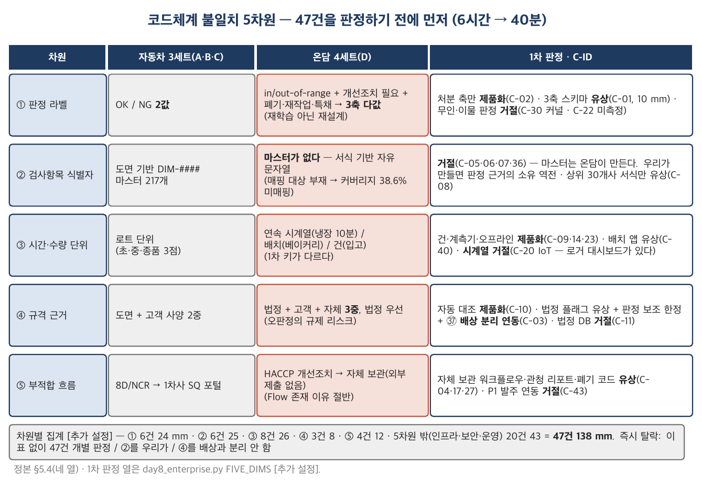

*그림 2-1. 정본 §5.4의 네 열 위에 1차 판정 열을 얹은 것. ②(마스터 없음)는 거절, ④(법정 기준)는 배상 분리와 연동 — 두 차원이 즉시 탈락 조건이다.*

### 딥게이지의 사례로 읽기

> ■ **사례 사실** — 5차원의 네 열(자동차 / 온담 / 불일치의 성격)은 §5.4 그대로. 1차 판정 열과 C-ID 배치는 워크북 §1.5 항목 2 [추가 설정].

**① 판정 라벨.** 자동차는 OK / NG 2값. 온담은 in-range / out-of-range + 개선조치 필요·불필요 + 폐기·재작업·특별채택의 3축 다값. 모델 출력 스키마 변경 — 재학습이 아니라 재설계다. 판정: 처분 축(폐기·재작업·특채)만 제품화 — 자동차 NCR에도 특채·재작업이 있다(C-02). 3축 스키마는 유상 모듈(C-01, 10 mm). 무인 판정(C-30)과 식품 이물 판정(C-22)은 거절 — 하나는 커널 위반, 하나는 온담 세트 미측정.

**② 검사항목 식별자.** 자동차는 도면 기반 `DIM-####`, 마스터 217개. 온담은 **마스터가 없다** — 서식 기반 자유 문자열, "굽는 온도"와 "가열온도(℃)"가 같은 항목이다. 매핑 대상이 존재하지 않는다. 판정: **거절**(C-05·06·07·36). 마스터는 온담이 만든다. 우리가 만들면 판정 근거의 소유가 뒤집히고 3년간 우리가 고친다. 커버리지 61.4%의 나머지 38.6%가 이 차원이다. 상위 30개사 성적서 서식만 유상(C-08).

**③ 시간·수량 단위.** 자동차는 로트 단위(초·중·종품 3점). 온담은 냉장 온도 10분 간격 연속 시계열 / 베이커리 배치 / 입고 건 단위. 데이터 모델의 1차 키가 다르다. 판정: 건 단위·계측기 입력·오프라인은 제품화(C-09·14·23 — 자동차 수입검사·게이지·지하 공장도 같다). 배치 앱은 유상(C-40). 시계열은 거절(C-20 — IoT 모니터링이지 검사기록이 아니고, 로거 벤더 대시보드가 이미 있다).

**④ 규격 근거.** 자동차는 도면 + 고객 사양 2중. 온담은 식품위생 법정 기준 + 고객 사양 + 자체 기준 3중, 법정 우선. 판정 우선순위 로직 + 법정 기준 오판정의 규제 리스크. 판정: 성적서 vs 자체 규격 자동 대조는 제품화(C-10). 법정 한계 플래그는 유상이되 **판정 보조로 한정하고 ㊲ 항목 5 배상 분리 조항과 연동**(C-03). 법정 기준 DB 탑재·갱신은 거절(C-11 — 갱신 책임을 지면 배상 상한이 무의미해진다).

**⑤ 부적합 처리 흐름.** 자동차는 8D/NCR → 1차사 SQ 포털 제출. 온담은 HACCP 개선조치 → 자체 보관(외부 제출 없음), 안성 납품분만 고객사 5사 서식. GAUGE Flow의 존재 이유가 절반만 성립한다. 판정: 자체 보관 워크플로우·관청 리포트·폐기 코드 연동은 유상(C-04·17·27). P1 자동 발주 연동은 거절(C-43 — P1 소관).

### 실무에서 어떻게 틀리는가

②를 제품화나 유상 커스텀으로 판정한다(즉시 탈락 — 2.6절). ④를 배상 메모와 연동하지 않는다(즉시 탈락). ③의 시계열을 "데이터가 있으니 쉽다"로 본다(있는 데이터가 우리 1차 키가 아니다). ⑤에서 Flow를 그대로 팔려 한다(제출할 곳이 없다).

### 표준·문헌에서는

데이터 모델의 키·단위·도메인 불일치는 통합 실무의 고전적 분류다(PM Day4 ⑯ 데이터 전환의 검증 6종 중 키 유일성·참조 정합성·코드 매핑 커버리지가 ②·③의 검증 판이다). ISO/IEC 42001의 책임·투명성 — ④의 판정 보조 vs 판정 대행.

---

## 2.3 3분류의 기준 — 58사에게도 가치가 있는가

### 개념

요구는 셋 중 하나다 — 제품화(로드맵 편입·무상·시점 미약속) / 유상 커스텀(별도 SOW·단가·소유권) / 거절(대안 제시·사유). 기준은 둘뿐이다: **다른 고객(자동차 58사)에게도 가치가 있는가**, 그리고 **커널과 충돌하는가**. 첫째가 예이고 둘째가 아니오면 제품화, 첫째가 아니오이되 모듈로 격리 가능하면 유상, 둘째가 예이거나 소유가 고객 쪽이면 거절. 분류가 둘이 되면(거절이 없으면) 유상 커스텀이 거절의 완곡어가 되고 회사는 SI가 된다.

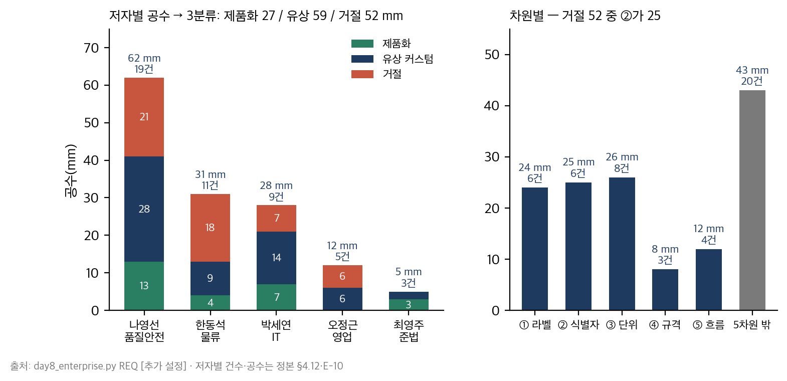

*그림 2-2. 왼쪽: 저자별 공수(62/31/28/12/5)를 3분류로 쌓은 것. 오른쪽: 차원별 건수·공수(①24 ②25 ③26 ④8 ⑤12 —43). 거절 52 mm 중 25 mm가 ②다.*

### 딥게이지의 사례로 읽기

> ■ **사례 사실** — 3분류 결과(제품화 14건 27 mm / 유상 19건 59 mm / 거절 14건 52 mm)와 차원별 집계는 워크북 §1.5 항목 3 [추가 설정]; 커널 6-1·6-2는 Day5 ㉕; 태산정밀 62항목은 §6.2·Day6 B-20.

예시본의 결과는 제품화 14건 27 mm / 유상 커스텀 19건 59 mm / 거절 14건 52 mm. 제품화 14건은 자동차에도 있는 것들이다 — 처분 코드, 건 단위 입고 검수, 규격 자동 대조, 계측기 입력, 오프라인 모드, SSO, 감사 로그, 계정 일괄 관리(김도윤의 "340개 협력사 한 화면"과 같은 요구), 그리고 사고 RCA 증빙 연 2회(C-47 — ㉞ 항목 8을 전 고객 공개 리포트로). 유상 19건은 온담 전용이되 모듈로 격리되는 것들 — 3축 스키마, HACCP 워크플로우, 관청 리포트, 온프렘 패키지(CR-044의 보류분이 온담 SOW로), 점포 태블릿 앱. 거절 14건은 세 갈래 — 커널 충돌 3(무인 판정 C-30, 감시 대시보드 C-41, 미측정 이물 판정 C-22), 마스터 부재 4(C-05·06·07·36), 온담·P1 소관 4(법정 DB C-11, 3PL C-25, DR C-37, 발주 C-43), 축소·별지 3.

거절 14건 중 커널 충돌 3건이 중요하다. Day5 ㉕ 항목 6에 여러분이 적은 두 문장 — "판정을 대신하지 않는다"(6-1), "감시 도구가 아니다"(6-2) — 이 오늘 계약 문장이 된다. 주말·야간 무인 판정(C-30)은 1 mm짜리 작은 요구다. 작아서 받으면 커널이 깨진다.

### 실무에서 어떻게 틀리는가

거절이 없다. 공수가 없다. 유지보수 부담(H·M·L)이 없다 — 커스텀은 만드는 날이 아니라 3년간 고치는 날이 비용이다. 저자 이름으로 판정한다. 작은 요구(1 mm)를 근거 없이 받는다 — 커널은 큰 요구가 아니라 작은 요구로 깨진다.

### 표준·문헌에서는

Moore의 전체 제품(whole product) — 세그먼트마다 전체 제품이 다르면 그것은 다른 레인이다. Cagan, *Inspired* — 고객 요청은 문제의 증거이지 해법의 명세가 아니다. Day6 ㉖ 항목 4(Won't 목록)·항목 5(재검토 조건).

---

## 2.4 용량 잠식 계산 — 138 mm와 14명

### 개념

돈을 받아도 시간은 돌아오지 않는다. 커스텀의 비용은 단가가 아니라 그 기간에 다른 고객에게 나가지 못한 릴리스다. 계산은 세 줄 — 공수(mm) ÷ 개발 인원 = 개월, 공수 ÷ 연간 용량 = %, 그리고 그 개월 동안 사라지는 릴리스 횟수. 분모(연간 용량 = 인원 × 12)를 먼저 쓴다.

> **작은 숫자로 먼저.** 개발 14명 × 12개월 = **168 mm**(연간 용량). 47건 전부: 138 ÷ 14 = **9.9개월**, 138 ÷ 168 = **82.1%**. 분류 후(제품화 27 + 유상 59 = 86): 86 ÷ 14 = 6.1개월, 86 ÷ 168 = 51.2%. 유상만: 59 ÷ 14 = 4.2개월, 35.1%. 상한 6 FTE면 연 72 mm — 86 mm를 14개월에 분산한다.

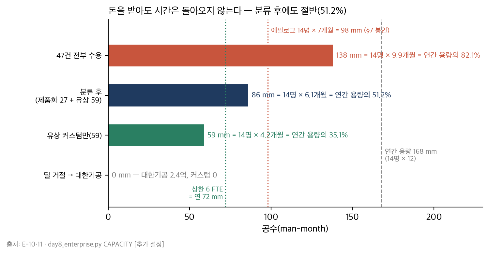

*그림 2-3. 전부 수용이면 14명의 9.9개월(82.1%), 분류 후에도 절반(51.2%). 상한 6 FTE 선이 그려져 있다 — 에필로그의 98 mm(14명 × 7개월)는 §7 봉인.*

### 딥게이지의 사례로 읽기

> ■ **사례 사실** — 138 mm · 9.9개월 · 82.1%는 E-10·11; 개발 14명은 G-01. 분류 후 86 mm·상한 6 FTE·시나리오 표는 워크북 §1.5 항목 5 [추가 설정].

전부 수용하면 14명 전원이 9.9개월 — 분기 릴리스 세 번이 사라진다. 조현우가 D+230에 떠나며 남긴 문장("커스터마이징 요청만 하다가 끝난다")이 회사 규모로 실현되는 시나리오다. 분류 후에도 86 mm, 절반이다 — 돈을 받아도(7.08억) 자동차 58사의 릴리스 두 번이 사라진다. 그래서 예시본은 계약 조건에 **상한 6 FTE(연 72 mm)**를 넣는다. 상한은 "얼마를 받느냐"가 아니라 "얼마를 잃느냐"의 조항이다. 워크북 ㊱ 항목 5의 마지막 줄은 "에필로그 예측"이다 — 봉인을 열기 전에 여러분이 적는다.

### 실무에서 어떻게 틀리는가

138 mm를 "1년이면 된다"로 읽는다. 제품화를 공수에서 뺀다(값을 안 받을 뿐 시간은 든다). 릴리스 공백을 계산하지 않는다 — 그것이 58사 이탈의 원인이 되고 NDR이 깎인다. 상한 없이 "최선을 다해"로 계약한다.

### 표준·문헌에서는

Day6 ㉖ Appetite(용량을 먼저 정하고 범위를 자른다)와 같은 논리 — 오늘은 고객이 범위를 가져왔고 용량은 그대로다. Day7 ㉟ 예산 3분리(차별화·위생·신뢰 복구) — 온담 86 mm는 어느 예산에서 나오는가.

---

## 2.5 분류별 계약 문구와 소유권

### 개념

분류는 내부 판정이고 계약 문구는 그 판정을 상대와 공유하는 문장이다. 세 문단이 필요하다 — 제품화는 **시점을 약속하지 않는** 문장, 유상은 **소유권·재사용권·단가·유지보수**가 있는 문장, 거절은 **누가 하는지**를 쓰는 문장. 재사용권이 없는 커스텀은 다른 고객에게 팔 수 없는 순수 비용이고, 시점이 적힌 제품화는 다음 분기의 분쟁이며, "안 한다"로 끝나는 거절은 "그럼 돈을 더 주면"을 부른다.

### 딥게이지의 사례로 읽기

> ■ **사례 사실** — 계약 문구 셋, 단가 1,200만/mm, 유지보수 18%, 소유권(코드 온담 / 모델 딥게이지 / 재사용권 딥게이지)은 워크북 §1.5 항목 4·§2.5 항목 3 [추가 설정]; ㉟ 로드맵 규칙("날짜를 쓰지 않는다")은 Day7.

제품화 문구: "표준 제품 로드맵에 편입하며 라이선스 범위에서 무상 제공한다. 릴리스 시점은 분기 릴리스 리뷰에서 통지하며 본 계약은 시점을 약속하지 않는다." 유상 문구: "별도 SOW(59 mm × 1,200만 = 7.08억). 코드·문서 소유권 온담, 모델 가중치 딥게이지, 딥게이지는 온담 식별 정보를 제외한 재사용권을 가진다. 유지보수 연 SOW의 18%." 거절 문구: "마스터·법정 기준 DB·IoT 시계열·P1 포털·DR은 온담 IT본부 소관으로 딥게이지는 인터페이스 사양을 제공한다. 무인 판정·감시 대시보드는 설계 원칙과 충돌한다. 식품 이물 판정은 온담 세트 측정 후 재논의한다."

세 문구 중 가장 중요한 한 줄은 유상의 재사용권이다. 그것이 있으면 온담의 HACCP 워크플로우가 두 번째 식품 고객의 제품이 되고, 없으면 온담 전용 코드로 3년간 남는다. 그리고 온담은 47건을 "21억에 포함된 요구사항"으로 이해하고 있다(공문 문구) — SOW 없이 착수하면 138 mm 전부가 무상이 된다.

### 실무에서 어떻게 틀리는가

제품화에 날짜를 쓴다. 재사용권을 비운다. 모델 가중치의 소유를 정하지 않는다(온담 데이터로 학습한 모델은 누구 것인가 — ㊲ 항목 3 학습 데이터 행). 거절 사유에 "리소스 부족"을 쓴다.

### 표준·문헌에서는

소프트웨어 라이선스·SOW의 IP 조항 실무(판본·법역 확인). PM Day3 ⑮ 조달·계약 — 발주자 쪽에서 본 같은 조항.

---

## 2.6 즉시 탈락 셋

### 개념

이 장의 문서(㊱)에는 즉시 탈락이 셋 있다. 첫째, **5차원 표 없이 47건 개별 판정** — 판정이 저자를 따라가고 6시간이 걸리며 48번째 요구에 기준이 없다. 둘째, **②(마스터 없음)를 제품화·유상 커스텀으로** — 매핑 대상이 없는 것을 우리가 만들면 판정 근거의 소유가 뒤집히고 커버리지 38.6%의 비용이 우리 것이 되며 3년간 우리가 고친다. 셋째, **④(법정 기준)를 ㊲ 배상 메모와 연동하지 않음** — 법정 기준 플래그 하나가 규제 책임을 우리에게 옮기고, 배상 상한 100% 요구가 그 위에 얹힌다.

### 딥게이지의 사례로 읽기

> ■ **사례 사실** — 셋은 `13_Product_4일계획.md` §4 Day8과 워크북 §1.6 판정 규칙 [추가 설정]; 근거는 §5.4·§5.5(38.6%)·§5.7(배상 100%).

셋 다 47건 목록 위에서는 보이지 않는다. C-05는 7 mm짜리 한 줄이고, C-03은 3 mm짜리 한 줄이다. 차원 표 위에서는 C-05가 38.6%이고 C-03이 7억이다. 그래서 표가 먼저다.

### 실무에서 어떻게 틀리는가

즉시 탈락을 "정답의 반대"로 읽는다 — 즉시 탈락은 방어 불가능한 답이고, 그 밖의 답은 근거가 있으면 통과다(㊱ 해설의 정답 처리 범위: 경계 항목의 분류, 상한 FTE 4~7, Go/No-go의 결론).

### 표준·문헌에서는

PM 트랙의 판정 규칙 형식(즉시 탈락 / 정답 처리 / 오답 처리하지 않음)을 그대로 쓴다.

---

## 제2장 핵심 정리

> **한 줄씩 — 수업 직전 5분 복습용**
> 1. 47건은 저자를 따라 읽힌다 — 차원으로 먼저 판정하면 40분, 하나씩이면 6시간.
> 2. 5차원 — ① 출력 스키마(재설계) ② 마스터 없음(매핑 대상 부재) ③ 1차 키(시계열/배치/건) ④ 법정 3중(규제 리스크) ⑤ 자체 보관(Flow 절반).
> 3. 3분류 기준은 둘 — 58사에게도 가치가 있는가, 커널과 충돌하는가. 제품화 27 / 유상 59 / 거절 52 mm.
> 4. 용량 — 168 mm 분모. 138 = 82.1%, 86 = 51.2%. 돈을 받아도 릴리스는 사라진다 → 상한 6 FTE.
> 5. 문구 — 제품화는 시점 미약속, 유상은 재사용권, 거절은 누가 하는지.
> 6. 즉시 탈락 셋 — 표 없이 개별 판정 / ②를 우리가 / ④를 배상과 분리 안 함.
>
> 아래는 같은 내용의 자세한 판이다.

1. 저자별 19/11/9/5/3건 · 62/31/28/12/5 mm. C-05(나영선)와 C-36(박세연)은 같은 차원 — 같은 판정.
2. 차원별 집계 ①6건 24 mm / ②6·25 / ③8·26 / ④3·8 / ⑤4·12 / —20·43. 거절 52 중 ②가 25.
3. 거절 14건 = 커널 충돌 3(C-22·30·41) + 마스터 부재 4(C-05·06·07·36) + 온담·P1 소관 4(C-11·25·37·43) + 축소·별지 3(C-13·20·42). 작은 요구(C-30, 1 mm)가 커널을 깬다.
4. 4 시나리오 — 138·9.9·82.1 / 86·6.1·51.2 / 59·4.2·35.1 / 0. 에필로그 예측을 봉인 전에 적는다.
5. 유상 SOW 59 × 1,200만 = 7.08억 · 유지보수 18% · 코드 온담 / 모델 딥게이지 / 재사용권 딥게이지. 온담은 47건을 "21억 포함"으로 읽고 있다.
6. 즉시 탈락은 방어 불가능한 답 — 그 밖은 근거가 있으면 통과.

## 생각해 볼 질문

1. 여러분 제품과 최근의 큰 고객이 갈리는 차원을 셋 적어 보라. 그 차원 하나가 요구 목록의 몇 건을 설명하는가?
2. 여러분 회사의 마지막 커스텀 계약에 재사용권 조항이 있었는가? 없었다면 그 코드는 지금 어디에 있는가?
3. 1 mm짜리 요구 중 원칙과 충돌하는 것을 받은 적이 있는가? 그 뒤에 무엇이 따라왔는가?
4. 상한 FTE 조항이 없는 커스텀 계약의 실제 투입은 견적의 몇 배였는가?

## 워크북 연결

이 장은 Day8 워크북 **㊱ 엔터프라이즈 딜 데스크 시트**의 항목 2(2.1·2.2절) · 항목 3(2.3절) · 항목 5(2.4절) · 항목 4(2.5절)와 §1.6 판정 규칙(2.6절)에 대응한다. ㊲ 항목 2·3(경계 3영역·소유권)은 제3장.

---

# 제3장 경계·SLA·배상 — 반대편에서 쓰는 같은 문서

## 3.1 제품-프로젝트 경계 3영역

### 개념

경계 합의서는 "무엇이 제품이고 무엇이 프로젝트이고 무엇이 고객 것인가"를 3자가 서명하는 문서다. 영역은 셋 — 제품 라인(우리 것, 무상, 시점 미약속) / 유상 커스텀(온담 전용, 모듈 격리, SOW) / 고객 자체 개발(온담 소관, 우리는 인터페이스 사양). 내부 판정의 "거절"이 합의서에서는 "고객 자체 개발"이 된다 — 거절은 우리 언어이고 합의서는 누가 하는지를 쓴다. 미확정 항목은 협의 대상으로 남기되 **서명 전에 0**이어야 한다. 그리고 영역마다 소유권·재사용권·유지보수를 나눈다 — 학습 데이터를 별도 행으로.

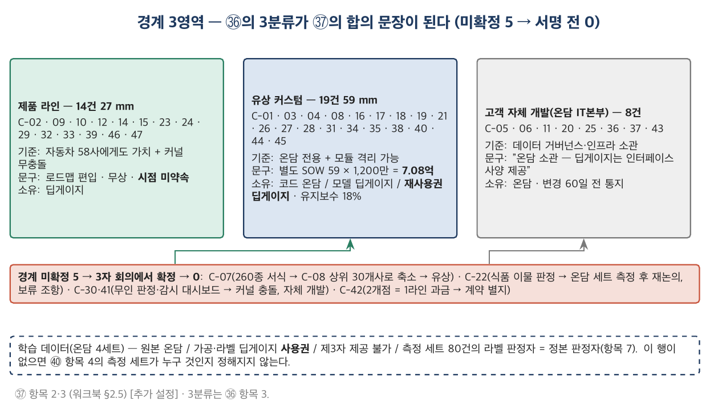

*그림 3-1. ㊱의 3분류가 ㊲의 3영역으로 옮겨진다. 미확정 5건(C-07·22·30·41·42)은 3자 회의에서 셋 중 하나로 확정된다.*

### 딥게이지의 사례로 읽기

> ■ **사례 사실** — 3영역 배치·판정 기준·소유권 표·학습 데이터 행은 워크북 §2.5 항목 2·3 [추가 설정]; 4종 검사 대상은 §5.3; 두 법인은 §5.1.

예시본은 제품 라인 14 / 유상 19 / 자체 개발 8(C-05·06·11·20·25·36·37·43) / 미확정 5. 미확정 5건은 3자 회의에서 확정된다 — C-07은 C-08로 축소해 유상, C-22는 측정 후 재논의 조항(보류), C-30·41은 커널 충돌로 자체 개발, C-42는 계약 별지. 서명 전 미확정 0. 소유권 표의 마지막 행이 학습 데이터다 — 원본은 온담, 가공·라벨은 딥게이지 사용권, 제3자 제공 불가, 그리고 **측정 세트 80건의 라벨 판정자 = 정본 판정자**. 이 한 행이 없으면 ㊵ 항목 4의 측정 세트가 누구 것인지 정해지지 않는다.

### 실무에서 어떻게 틀리는가

미확정을 남기고 서명한다. 판정 기준 없이 C-ID만 나열한다(48번째 요구에서 다시 싸운다). 학습 데이터 행이 없다. 유지보수율이 없다. "거절"을 합의서에 그대로 쓴다(상대는 "그럼 누가?"를 묻는다).

### 표준·문헌에서는

ITIL 4의 서비스 범위(scope) 정의 · SOW 실무. PM Day2 ⑥ 범위 기술서의 제외 범위(exclusions) — 온담 P1 헌장 §5의 "검사기록 제외"가 3년 뒤 이 문서의 대상이 됐다.

---

## 3.2 SLA/OLA/UC — 공급자 쪽에서

### 개념

SLA는 약속이고 OLA는 사내 팀의 뒷받침이며 UC는 외부 계약의 뒷받침이다. 한 층이 비면 SLA는 성립하지 않는다 — Day4 ⑰에서 여러분이 표로 증명한 문장이다. 오늘 같은 표를 공급자 쪽에서 그린다. 온프렘 SLA의 특징은 **고객이 UC의 당사자**가 된다는 것이다 — 서버는 온담 전산실에 있고 야간 1차 대응은 온담 IT본부이며 릴리스는 온담 승인 후다. 그 층은 온담이 서명해야 한다.

### 딥게이지의 사례로 읽기

> ■ **사례 사실** — 99.5% · 온프렘 · 릴리스 분기 1회 승인 후 · GPU 2대 + 0.7 FTE는 E-13·14; 허용 다운 219.2분은 PM ⑰ 항목 3과 같은 산식. SLA 6행·야간 대기 0.5 FTE·NBD·온담 야간 1차 대응 30분은 워크북 §2.5 항목 4 [추가 설정].

99.5%는 월 219.2분(30.4375일 × 24 × 60 × 0.5%)이다. GPU 2대는 성능이 아니라 가용성 조건이다 — 단일 장애 무중단, 이중 장애 시 벤더 NBD 교체 24~72시간 > 219분. 그래서 가용성은 "조건부 성립(이중화 전제)". P1 복구 4시간은 야간에 무너진다 — 0.7 FTE는 평일 주간이고 야간 대기 0.5 FTE를 붙여도 온담 1차 대응 30분 + 4시간 = 4.5시간. **불성립** → 야간은 "최선 노력"으로 강등하거나 온담 IT본부가 야간 1차 대응 OLA를 서명한다. 릴리스 행에는 "온담 승인 지연 기간의 판정 오류는 SLA 제외"를 쓴다 — 온담이 승인을 미루면 모델 갱신이 미뤄지고 그 기간의 정확도는 우리 책임이 아니다. 데이터 정정 2영업일은 정본 판정자 지정이 전제다.

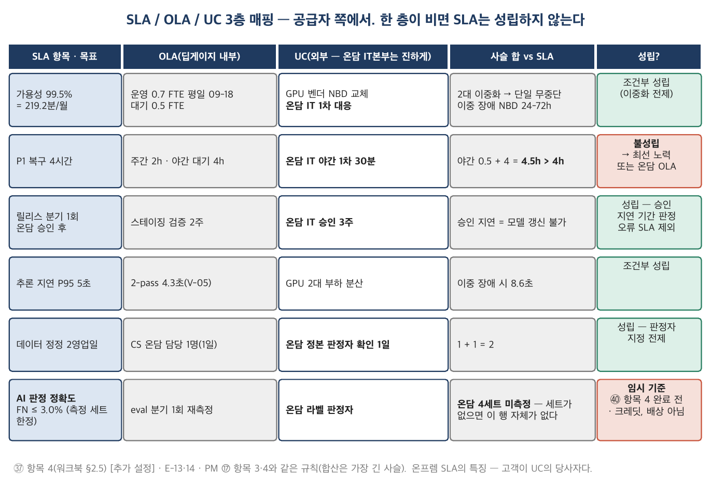

*그림 3-2. 여섯 행 중 두 행이 문제다 — P1 야간(4.5h > 4h)과 AI 판정 정확도(모집단 없음). 온담 IT본부가 UC 당사자인 층은 진하게.*

### 실무에서 어떻게 틀리는가

99.5%만 있고 분이 없다. 야간을 주간 인력으로 성립시킨다(⑰에서 여러분이 거부한 것). 고객이 서명해야 하는 층을 우리 OLA로 쓴다. 릴리스 승인 지연을 우리 리스크로 남긴다. 계획 정지(유지보수 창)의 처리 규칙이 없다.

### 표준·문헌에서는

ITIL 4 Service Level Management — SLA·OLA·UC의 정합성. Beyer 외 *SRE* 3·4장 — error budget. PM Day4 ⑰ 항목 3·4 — 요구하던 쪽의 같은 표.

---

## 3.3 AI 판정 오류를 SLA에 넣을 것인가

### 개념

온담은 넣자고 한다 — 정당하다, 그것이 사는 물건이니까. 문제는 두 가지다. 첫째, **모집단**: FN ≤ 3.0%는 자동차 3세트 60건의 기준이고 온담 세트에서는 측정된 적이 없다. 모집단 없는 SLA 항목은 무효다. 둘째, **연동**: SLA에 넣는 순간 배상 조항이 그것을 잡는다. 61점 중 한 점포의 오판정 하나가 연 청구 7억의 배상 사유가 된다. 답은 "넣되 한정한다" — 측정 세트에서 측정된 FN에 한정하고, 위반 시 서비스 크레딧이며 배상 대상이 아니고, 자동판정은 기본 OFF이며 최종 판정은 온담 검사원이다.

### 딥게이지의 사례로 읽기

> ■ **사례 사실** — V-06·V-07(FN ≤ 3.0 & OCR ≥ 95, 자동차 3세트 60건, 온담 4세트 미측정)은 §7.3; 커널 6-1은 Day5 ㉕; 세영 사고의 로그("최종 판정은 검사원")는 Day7 ㉞ 항목 4. SLA 행의 문구는 워크북 §2.5 항목 4·5 [추가 설정].

세영정공 사고에서 배운 것이 여기서 쓰인다. 정미영은 GAUGE 로그를 근거로 주장했고 그 로그가 "최종 판정은 검사원"을 입증했다 — 법적으로 유리했다. 온담에서도 같다: 자동판정 OFF, 초안만, 최종 판정 온담 검사원. 그 설계가 원칙(커널 6-1)이면서 동시에 배상 조항이다. SLA 표의 여섯째 행은 이렇게 적힌다 — "FN ≤ 3.0% (측정 세트 한정) / eval 분기 1회 / 온담 라벨 판정자 / **온담 4세트 미측정 — 세트가 없으면 이 행 자체가 성립하지 않는다** / 측정 계획 완료 전 임시 기준". ㊵ 항목 4가 그 측정 계획이다.

### 실무에서 어떻게 틀리는가

넣지 않는다(온담이 계약하지 않는다). 넣되 모집단 없이 "FN ≤ 3.0%"로 넣는다(첫 오판정에서 무효가 드러난다). 배상에 연동한다(로트 하나가 61점이다). 법정 기준 판정(④)을 분리하지 않는다.

### 표준·문헌에서는

ISO/IEC 42001:2023 — AI 시스템의 책임 경계·투명성. Day6 ㉗ 항목 5("검사원도 놓친 FN은 예산에 없다") — 오류 예산이 계약이 되는 지점.

---

## 3.4 배상 상한 — 물리적 하한과 4구간

### 개념

배상 상한 협상은 두 숫자 사이의 흥정이 아니다. 먼저 **물리적 하한**을 계산한다 — 이 계약이 우리에게 남기는 돈이 얼마이고 현금이 얼마인가. 그 위에서 상한을 **금액이 아니라 조건**으로 가른다: 일반 SLA 위반 / output 미달 / 보안 사고 / 고의·중과실. 상대가 실제로 두려워하는 것에 높은 구간을 열어 주고 우리가 감당 못 하는 것을 구간 밖에 둔다. 그리고 구축비는 견적이 아니라 검산값으로 계산한다 — F-14.

> **작은 숫자로 먼저.** 1년차 현금: 청구 7.00 − 구축 실소요 6.12 − 운영 2.22 − 제품화 2.70 = **−4.04억**. 3년 공헌: 21.00 − 6.12 − 6.66 − 2.70 = **5.52억**(유상 커스텀 SOW 7.08억 별도, 운영은 원가 통과). 현금 7.52억. 배상 100% = 7.0억 = 3년 공헌의 **127%** = 현금의 **93%**. 50% = 3.5(63% / 47%). 25% = 1.75(32% / 23%). 10% = 0.7(13% / 9%). 3.00으로 계산하면 1년차 −0.92, 3년 공헌 8.64 — 7억이 "감당 가능해 보이는" 숫자가 된다.

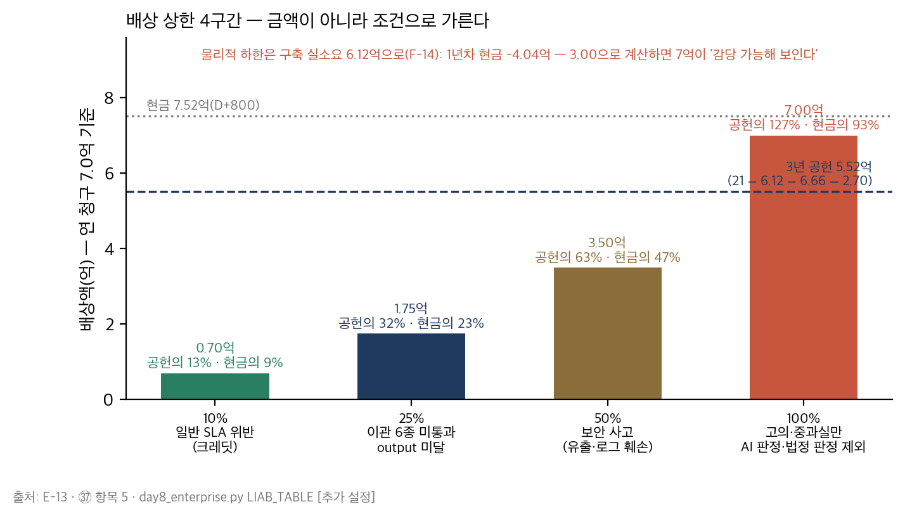

*그림 3-3. 100%(7.0억)는 3년 공헌의 1.27배, 현금의 93%. 각 구간은 조건으로 갈린다 — AI 판정 오류·법정 기준 판정은 어느 구간에도 없다.*

### 딥게이지의 사례로 읽기

> ■ **사례 사실** — 온담 100% vs 딥게이지 10%는 E-13; 162만 선례는 G-40·Day7 ㉞ 항목 4; 구축 실소요 6.12는 E-03. 물리적 하한·4구간의 조건·권고는 워크북 §2.5 항목 5 [추가 설정].

예시본의 4구간: **10%** — 가용성·복구 등 일반 SLA 위반, 서비스 크레딧, 연 상한 10%. **25%** — 이관 검증 6종 미통과·output 미달(㊵ 항목 6), 재이관 비용 + 상한 25%. **50%** — 보안 사고(검사기록 유출·감사 로그 훼손). **100%** — 고의·중과실에 한함. AI 판정 오류·법정 기준 판정은 어느 구간에도 없다. 권고: 25% 구간을 열어 준다 — 온담이 실제로 두려워하는 것은 이관 실패(11년치 41,000권)이지 오판정이 아니다. 그리고 100%의 조건(고의·중과실)을 지킨다. 세영정공 162만의 원형 — 상한은 지키고 서비스로 관계를 산다.

### 실무에서 어떻게 틀리는가

"50%에서 만나자"(조건 없는 중간 — 다음 실사에서 "왜 50%였나"에 답이 없다). 3.00억으로 하한을 계산한다(F-14). AI 판정을 배상에 넣는다. 법정 기준 판정을 우리가 진다(C-11을 받으면 그렇게 된다). 초안 10%를 고수한다(관계를 잃는다) 또는 100%를 받는다(회사를 건다).

### 표준·문헌에서는

Fisher & Ury — 객관적 기준(objective criteria): 금액이 아니라 조건. 계약법의 책임 제한 조항 실무(판본·법역 확인). PM Day4 ⑰ — 요구하던 쪽의 배상 조항. Day6 ㉘ 항목 6 — 책임 한계 10%의 근거 열("고객은 서명하고 잊는다") — 온담은 잊지 않았다.

---

## 3.5 218문항 — 받는 쪽의 SAC

### 개념

보안성 검토 질의서는 발주자의 SAC(서비스 수용 기준)다. Day4에서 여러분은 12항목을 보내고 인수 거부권을 행사했다. 오늘 218문항이 왔고 ISMS-P 미인증 상태에서 5영업일이다. 대응의 규율은 셋으로 나누는 것 — 즉시 답변 가능 / 조건부(기한·비용) / 답변 불가(대안). 불가를 조건부로 쓰지 않는다(ISMS-P는 4주에 안 된다). 그리고 제218문항 — 사고 RCA·재발 방지 증빙 — 에는 요약이 아니라 전문을 낸다. 숨긴 것이 실사에서 나온다.

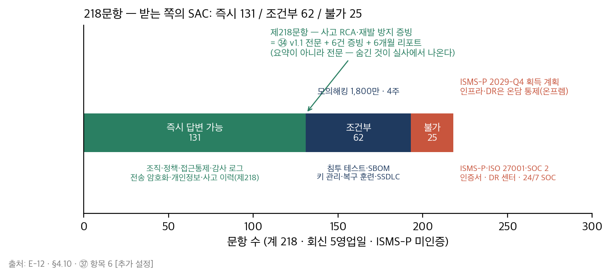

*그림 3-4. 제218문항은 즉시 답변 범주다 — Day7 ㉞ 항목 8의 증빙 열이 그대로 답이다.*

### 딥게이지의 사례로 읽기

> ■ **사례 사실** — 218문항·5영업일·ISMS-P 미인증은 E-12·§5.7; 제218문항 원문은 §4.10. 3범주(131/62/25)·모의해킹 1,800만·4주·2029-Q4 ISMS-P 계획은 워크북 §2.5 항목 6 [추가 설정].

즉시 131 — 조직·정책·접근통제·감사 로그·전송 암호화·개인정보 처리·사고 이력. 제218문항은 여기다: ㉞ v1.1 전문 + 재발 방지 6건 이행 증빙 + 감시 대시보드 리포트 6개월치. 조건부 62 — 침투 테스트·SBOM·키 관리·복구 훈련·SSDLC: 외부 모의해킹 1,800만·4주(C-45), SBOM(C-34). 불가 25 — ISMS-P·ISO 27001·SOC 2 인증서·DR 센터·24/7 SOC: 2029-Q4 ISMS-P 획득 계획, 그리고 **온프렘이므로 인프라·DR은 온담 통제**(C-37). 불가 항목의 절반은 온프렘이라는 사실이 대안이다 — 온담이 요구한 배포 형태가 온담의 답이다.

Day7 ㉟ 규칙 4("신뢰 복구 35%를 숨기지 않는다")가 여기서 시험된다. 사고 보고서를 요약해 내면 실사에서 전문이 나온다 — 세영정공에 준 로그가 있다.

### 실무에서 어떻게 틀리는가

"대부분 답변 가능"으로 뭉갠다. 불가를 조건부로 쓴다. 제218문항에 요약을 낸다. 5영업일을 넘긴다(온담 CFO 3주 앞에 우리 5일이 있다).

### 표준·문헌에서는

PM Day4 ⑯ 항목 8 — SAC 12항목·판정자·증빙: 오늘은 218항목의 답변자. ISMS-P 인증 기준(판본 확인) — 조직·물리·기술 통제의 범주.

---

## 3.6 데이터 이관 — 정본 판정자와 61.4%

### 개념

이관 조항의 첫 줄은 **정본 판정자**다 — 이관된 데이터가 맞는지를 누가 판정하는가. 법인은 판정하지 않는다, 사람이 한다. 둘째는 검증 6종(건수 / 합계 / 키 유일성 / 참조 정합성 / 코드 매핑 커버리지 / 표본 대조)과 통과 기준 — 통과할 수 없는 기준(커버리지 95%, 실측 61.4%)은 이관 실패 조항이다. 셋째는 매핑 불가분(38.6%)의 처리 — 임시 식별자로 이관하되 판정 초안에서 제외, 온담 마스터 정비 후 재매핑. 넷째는 구축비의 범위 — 3.00은 61.4% 기준 이관까지다.

### 딥게이지의 사례로 읽기

> ■ **사례 사실** — 41,000권 + 12,800 + 8.4TB, 계약 범위 11,200권 / 4,100개, 검증 6종, 정본 판정자 미지정, 61.4%, 3.00 → 6.12는 §5.5·E-03·E-17. 판정자 지정(나영선)·통과 기준·마스터 정비 기한 6개월은 워크북 §2.5 항목 7 [추가 설정].

정본은 판정자를 비워 두었다 — 나영선(품질) vs 한동석(이천) vs 조성태(안성) 중 누구인지 계약서에 없다. 예시본은 나영선(이천·안성은 위임 판정자)을 택한다 — 스폰서이고 19건의 저자이고 ㊵의 서명자이며 4종 중 2종의 담당. 조성태(별도 법인의 권리)도 근거 있는 답이다. 즉시 탈락은 "온담"이라고 적는 것뿐이다. 통과 기준: 건수 100% / 합계 오차 0 / 키 유일성 100% / 참조 정합성 ≥ 99.5% / **커버리지 ≥ 61.4%(1차) → 마스터 정비 후 95%** / 표본 300건 오류 ≤ 0.5%. 38.6%는 임시 식별자로 이관, 판정 초안 제외, 마스터 정비 기한(계약 후 6개월)을 온담 의무로. 구축비 3.00은 61.4% 기준의 범위 — 재매핑은 별도 견적. 3.00으로 6.12어치를 약속하면 1년차 −4.04가 −7.16이 된다.

### 실무에서 어떻게 틀리는가

판정자를 법인으로. 95%를 1차 기준으로. 38.6%를 우리가 메운다(②의 즉시 탈락이 여기서 재발). 마스터 정비 기한이 없다(38.6%가 영원히 임시). 3.00으로 전체를 약속.

### 표준·문헌에서는

PM Day4 ⑯ 항목 5·6 데이터 전환 검증 6종 — 발주자 쪽에서 요구하던 것. Day6 ㉖ 온보딩 규칙(마스터 3주) — 소형 고객의 같은 문제.

---

## 제3장 핵심 정리

> **한 줄씩 — 수업 직전 5분 복습용**
> 1. 경계 3영역 — 제품 14 / 유상 19 / 자체 8, 미확정 5 → 서명 전 0. 학습 데이터 행을 잊지 않는다.
> 2. SLA 3층 — 공급자 쪽. 온프렘은 고객이 UC 당사자. P1 야간 4.5h > 4h 불성립.
> 3. AI 판정 오류 — 넣되 측정 세트 한정·서비스 크레딧·배상 제외·최종 판정 검사원. 모집단 없는 행은 무효.
> 4. 배상 — 물리적 하한은 6.12로(F-14): 1년차 −4.04, 3년 공헌 5.52, 100% = 127%. 4구간은 조건으로.
> 5. 218문항 — 131 / 62 / 25. 제218문항은 ㉞ 전문. 불가의 절반은 온프렘이 답.
> 6. 이관 — 판정자는 사람(나영선). 커버리지 61.4% 1차 → 마스터 후 95%. 38.6%는 온담 것.
>
> 아래는 같은 내용의 자세한 판이다.

1. 미확정 5건의 확정 — C-07 축소·유상 / C-22 측정 후 보류 / C-30·41 자체 / C-42 별지. 소유권 — 유상은 코드 온담·모델 딥게이지·재사용권 딥게이지·유지보수 18%.
2. 여섯 행 — 가용성 조건부(이중화) / P1 야간 불성립 / 릴리스 성립 + 승인 지연 제외 / 지연 조건부 / 정정 성립(판정자 전제) / AI 판정 임시 기준. 219.2분.
3. 세영 로그의 교훈 — "최종 판정은 검사원"이 원칙이자 배상 조항.
4. 10% 일반 SLA(크레딧) / 25% output 미달·이관 / 50% 보안 / 100% 고의·중과실. 권고: 25%를 열고 100%의 조건을 지킨다.
5. 제218문항 = ㉞ v1.1 전문 + 6건 증빙 + 6개월 리포트. 모의해킹 1,800만·4주.
6. 6종 통과 기준(건수 100 / 합계 0 / 키 100 / 참조 99.5 / 커버리지 61.4 → 95 / 표본 300건 0.5%). 마스터 정비 기한 6개월 온담 의무.

## 생각해 볼 질문

1. 여러분 회사가 공급자로 서명한 SLA에서 고객이 뒷받침해야 하는 층이 있었는가? 그 층을 고객이 서명했는가?
2. 최근 계약의 배상 상한은 어떻게 정해졌는가 — 조건으로, 아니면 중간에서?
3. 보안 질의서를 받았을 때 "불가" 항목을 정직하게 적은 적이 있는가? 그 뒤에 무슨 일이 있었는가?
4. 이관 데이터의 정본 판정자가 계약서에 사람 이름으로 있는가?

## 워크북 연결

이 장은 Day8 워크북 **㊲ 경계 합의서·SLA/OLA/UC·배상 메모**의 항목 1·2·3(3.1절) · 항목 4(3.2·3.3절) · 항목 5(3.4절) · 항목 6(3.5절) · 항목 7(3.6절)에 대응한다.

---

# 제4장 자본 — 시리즈A·옵션풀·BATNA

## 4.1 IR 1페이저 — 두 값 병기

### 개념

IR 1페이저는 IC가 파트너 없이 5분에 읽는 한 장이다. 여섯 칸(문제 / 제품 / 트랙션 / 유닛이코노믹스 / 팀 / 조달과 사용처)에 각 3줄. 규율은 하나 — **계약 기준값과 검산값을 병기하거나 각주에 분모를 쓴다.** 두 값 중 어느 것을 앞에 쓰느냐가 IC가 기억하는 숫자를 정하고, 그것이 밸류 배수의 분모가 된다. 검산을 앞에 쓰면 "자기 숫자를 깎아서 내는 회사"가 되고, 그것이 pre 320억의 근거다.

### 딥게이지의 사례로 읽기

> ■ **사례 사실** — 58사 · 11.9 · 18.9 vs 15.68 · 27명 · 3,780 · 54/46.9 · 8,400 · 1.20 · 7.52/8.9 · 80/320은 §3.4·§7.1; 문제의 네 숫자는 G-33~36. 여섯 칸의 문장·COGS 4,560·CAC 740·payback 8.0/10.7은 워크북 §3.5 항목 1·2 [추가 설정].

예시본의 트랙션 칸: "유료 58개사 · ARR **15.68억**(검산 — 계약 기준 18.9억, 온담 라이선스 3.78만 ARR / 온담 제외 11.9억) · GRR 87 / NDR 104%(D+435 21사 기준)". 유닛이코노믹스 칸: "GM **46.9%**(계약 MRR 기준 54%) — AI 원가 44.0% · CAC 740만 → payback **10.7개월**(계약 기준 8.0) · burn multiple 1.20". 제품 칸에 커널 한 줄 — "판정을 대신하지 않는다(자동판정 기본 OFF, 채택률 26%는 설계값)". 이 한 줄이 없으면 IC의 둘째 질문("채택률 26%면 안 쓰이는 것 아닌가요")에 변명으로 답하게 된다.

IR 덱은 ㉝ 표기 규칙을 절반만 적용했다 — GM에 계약 MRR(54%), burn multiple에 순SaaS(1.20). 각각 더 좋아 보이는 분모다. 우연이 아니다. 예시본은 두 값을 병기해 그 불일치를 스스로 드러낸다 — IC가 찾기 전에.

### 실무에서 어떻게 틀리는가

18.9만 쓴다(서영채가 24시간 안에 찾는다 — D+598의 메일이 D+802에 재현된다). 두 값을 쓰되 분모를 안 쓴다. 팀 칸에 온담 투입 상한을 안 쓴다. 한 덱 안에서 지표마다 유리한 분모를 고른다.

### 표준·문헌에서는

Skok "SaaS Metrics 2.0" · a16z "16 Startup Metrics". Day7 ㉝ 항목 7 표기 규칙 — 그리고 그 규칙을 적은 사람이 18.9를 덱에 쓴 일(Day6 ㉘ 항목 6의 6,060만과 같은 반복).

---

## 4.2 집중 리스크 3표기

### 개념

집중 리스크는 "가장 큰 고객이 깨지면 얼마를 잃는가"로 읽히지만, 큰 고객의 실제 리스크는 계약이 성사됐을 때 무엇을 잃는가에도 있다. 세 값을 다 쓴다 — ARR 비중 IR 기재(과대) / 검산(적정) / 개발 용량 잠식(IR 덱에 없다). 세 값 중 하나만 쓰면 나머지 둘을 IC가 계산해 온다.

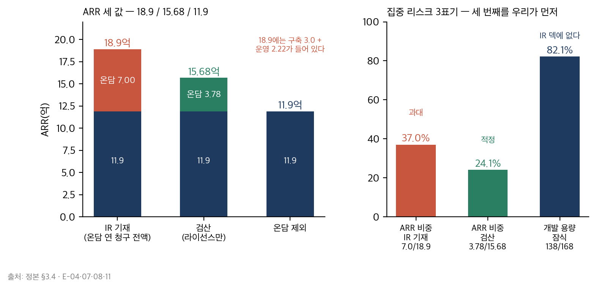

*그림 4-1. 왼쪽: 온담 연 청구 7.0 중 ARR 성격은 3.78. 오른쪽: 같은 온담이 IR 덱에서 37.0%, 검산에서 24.1%, 개발 용량에서 82.1%.*

### 딥게이지의 사례로 읽기

> ■ **사례 사실** — 37.0 / 24.1 / 82.1은 E-07·08·11; §5.6의 문장. IR 덱 문구는 워크북 §1.5 항목 6·§3.5 항목 2 [추가 설정].

예시본의 IR 덱 문구: "온담 계약은 연 매출의 37%이나 ARR 기준 24.1%(라이선스 3.78억). 요구 47건 138 mm는 분류 후 86 mm(51%)로 별도 SOW·로드맵 편입 분리, 투입 상한 6 FTE." 세 값 다, 분모와 함께. 세 번째 숫자를 우리가 먼저 말한다 — IC 반대신문 1문의 답이다.

### 실무에서 어떻게 틀리는가

1.3절과 같다 — 37만, 24.1만, 82.1 누락.

### 표준·문헌에서는

a16z "16 More Startup Metrics" — concentration.

---

## 4.3 재무모델 3케이스 — 온담 포함·제외

### 개념

3케이스는 같은 모델에 고객 수만 다르게 넣은 것이 아니다. 케이스를 가르는 것은 **결정**이다 — 온담을 받는가(Base), 거절하는가(Bear), 받고 식품으로 넓히는가(Bull). 거절이 Bear인 이유는 매출 때문이 아니라 코너스톤 소멸과 한강 재협상이 모델에 들어오기 때문이다. 그리고 조달 시점을 0개월차에 넣지 않는다 — 런웨이 8.9개월 안에 클로징이 있어야 한다는 것이 이 모델의 첫 결론이다.

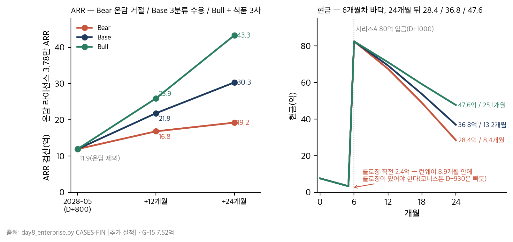

*그림 4-2. Bear 16.8 → 19.2 / Base 21.8 → 30.3 / Bull 25.9 → 43.3억. 현금은 6개월차 2.4억까지 내려갔다가 80억이 들어온다 — 클로징 지연의 리스크가 곡선의 바닥이다.*

### 딥게이지의 사례로 읽기

> ■ **사례 사실** — 현금 7.52·순소진 8,400·80억은 §3.4; 세 케이스의 가정·ARR·현금·런웨이·필요 조달은 워크북 §3.5 항목 3 [추가 설정].

Base: 58 → 84 → 118사, ACV 2,052 → 2,150 → 2,250, 온담 3분류 수용(라이선스 3.78 = ARR, 구축 3.0 매출/6.12 원가 1년차, 운영 2.22 원가 통과). ARR 검산 21.8 → 30.3억(IR 표기 25.0 → 33.5). 24개월 현금 36.8억, 런웨이 13.2개월, 시리즈B 150억 착수 18~20개월 차. Bear: 58 → 70 → 82, ACV 유지, 온담 거절 + 대한기공 2.4. ARR 16.8 → 19.2. 현금 28.4억, 런웨이 8.4개월 — 시리즈B 앞당김 또는 채용 동결. "거절하면 죽는다"가 아니라 "거절하면 시리즈B를 앞당긴다"다 — 거절이 선택지라는 것을 숫자로 보여야 협상이 된다. Bull: 58 → 96 → 150, 온담 + 식품 3사. ARR 25.9 → 43.3. 첫 6개월(클로징 전) 순소진 0.85억 × 6 = 5.1억 → 클로징 시점 현금 2.4억. 코너스톤 B안(D+930 이후)은 그 안에서 빠듯하다.

### 실무에서 어떻게 틀리는가

온담을 세 케이스 모두에 넣는다. 80억을 0개월차에. 가정 없이 ARR만. 온담 적자 3.12를 운전자본에 숨긴다(사용처 행으로 드러내야 실사에서 "구축비를 검산하는 회사"가 된다).

### 표준·문헌에서는

Day7 ㉝ 항목 5(런웨이 11 → 브릿지 필요)의 연장. Feld & Mendelson — IC가 보는 것은 모델의 정확도가 아니라 가정의 정직성.

---

## 4.4 IC 반대신문 — 답에 분모를

### 개념

반대신문 8문은 우호적으로 고르지 않는다. 답은 3줄 이내이고 분모를 쓴다. "분모가 다르다"로 끝나면 안 된다 — 다르다는 것을 인정하고 어느 것이 적정인지, 그리고 IC가 아직 묻지 않은 숫자를 먼저 말한다. 사고 질문에는 ㉞ 항목 8을 그대로.

### 딥게이지의 사례로 읽기

> ■ **사례 사실** — 8문과 답은 워크북 §3.5 항목 6 [추가 설정]; 근거 숫자는 E-07~11·G-20·V-04·㉞ 항목 8.

여덟 질문 — 집중 리스크 37 vs 24.1 / 채택률 26 / 온담 거절과 코너스톤 / GM 54 vs 원가율 44 / 사고 재발 / 구축비 6.12와 적자 / 온담 투입 인원 / NDR 104의 분모. 답의 규칙은 셋 — 분모를 쓴다(9,917 vs 8,583 / ㉮ / D+435 21사 2,150만), 세 번째 숫자를 먼저 말한다(82.1%), 변명을 쓰지 않는다("검사원 교육"은 ㉞의 즉시 탈락).

### 실무에서 어떻게 틀리는가

질문을 우호적으로. 답이 길다. 채택률에 변명. "사고는 없었다"(있었다 — 그리고 제218문항이 그 보고서를 갖고 있다).

### 표준·문헌에서는

Feld & Mendelson 3장 — IC 프로세스. PM Day3 ⑫ 성과보고의 예외 보고 — 나쁜 숫자를 먼저 말하는 형식의 원형.

---

## 4.5 캡테이블 T2 → T3 — 주식수로 계산한다

### 개념

캡테이블은 %가 아니라 주식수로 계산한다(Day6 규칙). %로 계산하면 옵션풀이 어디 있는지 보이지 않고, 주식수로 계산하면 풀이 pre-money FD에 들어가 주당가를 내리고 투자자가 같은 돈으로 더 많은 주식을 받는 것이 보인다. 순서는 셋 — SAFE 전환(T2), 풀 신설(A안), 신규 투자자(T3). SAFE는 cap 가격과 discount 가격 중 낮은 쪽으로 전환된다.

> **작은 숫자로 먼저.** T2: K-02 1,250,000 + SAFE 8억 ÷ 14,400원(= cap 180억 ÷ 1,250,000) = 55,556 → **1,305,556**. A안: 풀 15% pre → (100,000 + x) ÷ (1,305,556 + x) = 0.15 → x = **112,745** → pre FD 1,418,301 → 주당 320억 ÷ 1,418,301 = **22,562** → 한강 80억 ÷ 22,562 = 354,578 → FD **1,772,879**. 강민수 450,000 ÷ 1,772,879 = **25.38%**, 풀 212,745 ÷ 1,772,879 = **12.00%**, 한강 **20.00%**. B안: 풀 조항 없음 → 주당 290억 ÷ 1,305,556 = **22,213** → 코너스톤 360,150 → FD **1,665,706** → 강민수 **27.01%**, 풀 6.00%, 코너스톤 21.62%. discount 확인: 22,562 × 0.8 = 18,050 > 14,400 → cap 적용.

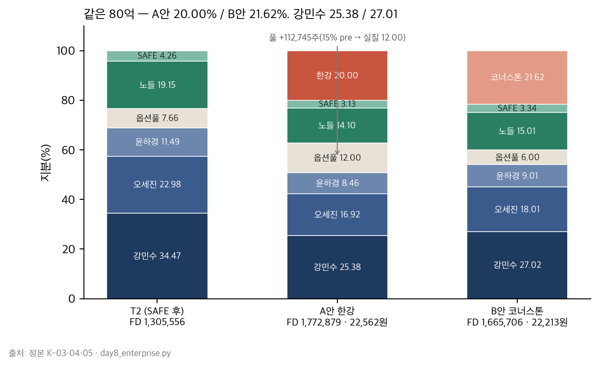

*그림 4-3. 같은 80억이 A안에서는 20.00%, B안에서는 21.62%. 차이는 pre 30억과 풀 112,745주.*

### 딥게이지의 사례로 읽기

> ■ **사례 사실** — K-02·K-03·K-04·K-05 전부 §7.5. 주당가를 원 단위로 반올림한 뒤 주식수를 구하는 방식(끝자리 ±1)은 워크북 §4.5 항목 2 [추가 설정].

T2에서 강민수 34.5%, 노들 19.15%, SAFE 4.26%. A안 T3에서 강민수 25.38 / 오세진 16.92 / 윤하경 8.46 / 풀 12.00 / 노들 14.10 / SAFE 3.13 / 한강 20.00. B안에서 27.01 / 18.01 / 9.00 / 6.00 / 15.01 / 3.34 / 21.62. 두 안의 강민수 차이 1.63%p는 pre 30억과 풀 112,745주가 합쳐진 것이다 — 그 둘을 떼어 보는 것이 4.6절이다. SAFE 전환의 심화: 정본은 cap을 FD 1,250,000으로 나눈 14,400원(pre 방식)으로 전환한다. SAFE 문서가 post-money cap이면 8/180 = 4.44%(58,140주)여야 한다 — 전환 산식을 텀시트 부속에 확정한다(㊴ 레드팀 7행).

### 실무에서 어떻게 틀리는가

%로 계산. SAFE 전환 누락. discount로 전환(cap이 더 낮다). 주당가와 주식수의 반올림 순서를 정하지 않는다(정본 방식: 주당가 원 단위 반올림 → 주식수).

### 표준·문헌에서는

Feld & Mendelson 4장 — economics. YC SAFE post-money 표준 문서 — cap의 정의. Day6 ㉚ 항목 2(T0 → T1).

---

## 4.6 옵션풀 pre/post — 1.29%p

### 개념

"옵션풀 15% pre-money"는 표준 문구다. 표준이라는 것과 값이 없다는 것은 다르다. 풀을 pre에 두면 풀 신설의 희석을 기존 주주만 지고, post에 두면 투자자도 나눈다. 계산은 같은 풀(주식수)을 두 위치에 놓고 신규 투자자의 지분을 비교하는 것이다. 차이가 "표준 문구"의 값이다.

> **작은 숫자로 먼저.** 같은 112,745주를 라운드 **후에** 신설했다면 — 320억 pre를 풀 없는 FD 1,305,556에 적용 → 주당 **24,511** → 한강 80억 ÷ 24,511 = 326,384 → 풀 신설 → FD **1,744,685**. 한강 326,384 ÷ 1,744,685 = **18.71%**(pre 방식 20.00). 강민수 450,000 ÷ 1,744,685 = **25.79%**(25.38). 기존 주주에서 신규 투자자로 **1.29%p** 이전 = 한강이 같은 80억으로 더 받는 28,194주. 풀 가치 112,745 × 22,562 = **25.4억** — "풀 pre"는 pre 320을 294.6으로 깎은 것과 같다. 시드에서 같은 계산은 0.43%p였다(풀 27,778주, pre 48억).

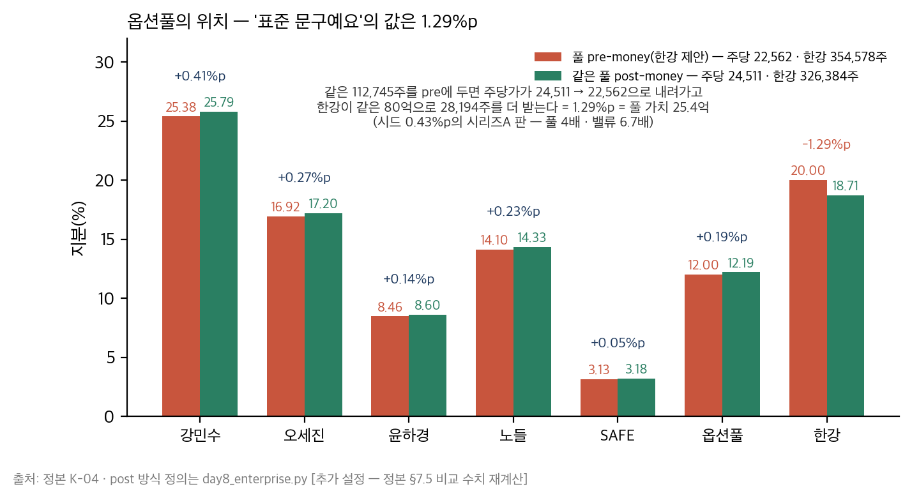

*그림 4-4. 같은 풀 112,745주를 pre에 두면 주당가가 24,511에서 22,562로 내려가고 한강이 28,194주를 더 받는다. Day6 그림 5-3의 시리즈A 판.*

### 딥게이지의 사례로 읽기

> ■ **사례 사실** — K-04(풀 15% pre, 실질 12.00%)는 §7.5; 임재혁의 문장은 §6.3. post 방식의 정의(320억 pre를 풀 없는 FD에 적용, 한강도 희석 분담)와 25.79 / 18.71 / 1.29%p / 25.4억은 §7.5·워크북 §4.5 항목 3. 시드 0.43%p는 Day6 ㉚.

"같은 풀을 post에 둔다"는 문장은 계산 방식을 하나로 정하지 않는다. 예시본은 가장 표준적인 정의를 쓰고 그 정의를 카드에 적었다 — 정의가 적혀 있으면 다른 정의로 다른 숫자가 나와도 통과다. 즉시 탈락은 정의 없이 %p만 적는 것이다. 그리고 요청 문구는 둘이다 — "추가 풀은 post-money 기준" 또는 "풀 pre 유지 시 pre-money 345.4억". 둘은 같은 것이다. 임재혁이 첫째를 거부하면 둘째를 낸다.

Day6 워크북 점검 질문 2("시드 0.43%p, 시리즈A 1.29%p — 풀 크기인가 밸류인가 둘 다인가")의 답: 둘 다. 풀이 4배(27,778 → 112,745)이고 밸류가 6.7배(48 → 320)다.

### 실무에서 어떻게 틀리는가

계산 없이 동의(F-12). 15%가 라운드 후에도 15%라고 읽는다(12.00%). %p를 %로. 정의 없이 %p만.

### 표준·문헌에서는

Feld & Mendelson 4장 — option pool shuffle. YC SAFE post-money — 옵션풀 처리. Day5 교재 4장·그림 4-4, Day6 교재 5장·그림 5-3.

---

## 4.7 텀시트 레드팀과 2×2

### 개념

레드팀은 조항마다 "최악의 경우 이 조항이 우리에게 무엇을 하는가"를 청산·해임·다운라운드·매각으로 나눠 묻고, 발생 조건과 대응 문구를 쓴다. "리스크 있음"으로 끝나면 레드팀이 아니다. 그리고 두 텀시트는 서로의 BATNA이므로 온담 결정과 2×2로 연동한다 — 한 칸(거절 × 코너스톤)은 소멸이고, 한 칸(거절 × 한강)은 pre 재산정이다.

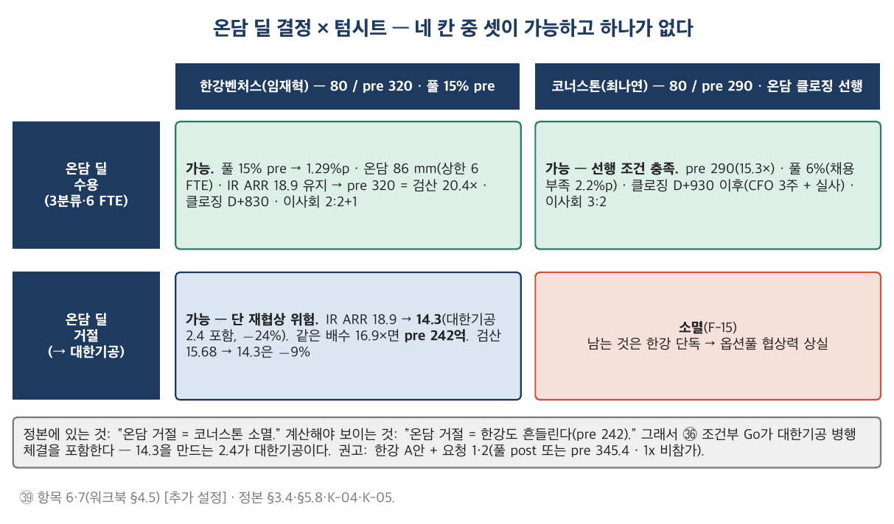

*그림 4-5. 네 칸 중 셋이 가능하고 하나가 없다. 가능한 셋도 같지 않다 — 풀·이사회·클로징 일정·IR ARR이 다르다.*

### 딥게이지의 사례로 읽기

> ■ **사례 사실** — 두 텀시트의 금액·pre·풀·선행 조건은 §3.4; 온담 거절 = 코너스톤 소멸은 §5.8·F-15. 기타 조항(참가·drag·이사회·클로징)·워터폴 500억·pre 242억은 워크북 §4.5 항목 1·4·6 [추가 설정].

레드팀 일곱 행 중 셋. **1x 참가적**(한강, 시드 RCPS와 동일): 매각 500억 시 한강 80 + 20% × 408 = 161.6억 vs 비참가(보통주 전환) 97.6억 → 창업자 3인 207.1 vs 247.7억, 차이 40.6억 = 한강 우선권 80 × 창업자 50.77%. **drag 우선주 60%**: 한강 20.00 + 노들 14.10 = 34.1%가 우선주의 과반 → 창업자 반대 매각 가능 → drag 발동에 이사회 과반 + 창업 1인 동의. **정보권의 ARR 정의**: "계약 ARR" 보고 → 서영채 D+330 지적이 주주간계약에서 재현 → ㉝ 표기 규칙을 부속으로.

2×2: 수용 × 한강 — 가능, 풀 1.29%p, 클로징 D+830. 수용 × 코너스톤 — 가능, pre 290, 풀 6%(채용 부족), 클로징 D+930 이후, 이사회 3:2. 거절 × 한강 — 가능하나 IR ARR 18.9 → 14.3(대한기공 포함, −24%), 같은 배수 16.9×면 **pre 242억**. 거절 × 코너스톤 — **소멸**. "거절하면 코너스톤이 사라진다"는 정본에 있고, "거절하면 한강도 흔들린다"는 계산해야 보인다. 그래서 ㊱의 조건부 Go가 대한기공 병행 체결을 포함한다 — 14.3을 만드는 2.4가 대한기공이다.

### 실무에서 어떻게 틀리는가

레드팀이 "리스크 있음". 발생 조건 없음. 2×2를 O/X로. 정보권을 안 본다. 거절 × 한강 칸에 재산정이 없다.

### 표준·문헌에서는

Feld & Mendelson 5장 — control terms. Day6 ㉚ 항목 3(워터폴 3구간)·항목 5(drag).

---

## 4.8 채용 여력과 협상 요청

### 개념

옵션풀은 %가 아니라 채용 계획의 함수다. 가용 풀(풀 − 기부여)과 필요 옵션(계획 인원 × 직급별 비율)을 비교해 부족분을 구한다. 풀 12%와 6%의 차이는 "누가 희석을 언제 지는가"의 차이다 — 지금 창업자만(한강) vs 나중에 창업자와 투자자가 함께(코너스톤). 협상 요청은 셋이면 협상이고 다섯이면 거절이다. BATNA를 정직하게 적는다.

### 딥게이지의 사례로 읽기

> ■ **사례 사실** — 첫 PM 옵션 0.4%는 §3.3·§6.1; 27 → 34명은 G-01. 기부여 40,000주·채용 34명·직급별 비율·필요 5.8%·A +69,918 / B −36,611·요청 3·BATNA·권고는 워크북 §4.5 항목 5·7 [추가 설정].

가용 풀 A 172,745주(9.74%) / B 60,000주(3.60%). 27 → 60명 계획 34명 — 시니어 5(0.40%) · 미드 14(0.15%) · 주니어 14(0.05%) · CFO 1(1.00%) = 5.8% = A 102,827주 / B 96,611주. A 여유 +69,918주(3.9%p), B 부족 −36,611주(2.2%p) — 시리즈B 전 풀 증설 필요, 그 희석은 창업자와 코너스톤이 나눈다. 코너스톤이 풀 조항을 안 넣은 것은 관대함이 아닐 수 있다. 요청 셋: ① 풀 post 또는 pre 345.4억 ② 1x 비참가(시드 RCPS 동반 전환 — 매각 500억 시 +40.6억) ③ (B안 시) 선행 조건을 "ARR 3.78억 이상 신규 계약"으로 일반화. BATNA: 다른 리드 없음 / 브릿지(노들, 서영채 자기 희석 반대) / 매출로 버티기(런웨이 8.9, 감원 없이 불가). 권고: 한강 A안 + 요청 1·2 — 온담 조건부 수용·대한기공 병행. 코너스톤은 요청 3이 관철될 때만.

### 실무에서 어떻게 틀리는가

풀 %만 비교. 기부여를 안 뺀다. B의 부족을 "나중에"로. 요청 다섯 개. BATNA 낙관. 권고 "둘 다 좋다".

### 표준·문헌에서는

Feld & Mendelson 4장 — 옵션풀과 채용 계획. Fisher & Ury — 요청은 이해(interest)로, BATNA는 정직하게.

---

## 제4장 핵심 정리

> **한 줄씩 — 수업 직전 5분 복습용**
> 1. 1페이저 — 검산값을 앞에, 계약 기준을 괄호에, 분모를 각주에. 커널 한 줄이 채택률의 답.
> 2. 3표기 — 37.0 / 24.1 / 82.1. 세 번째를 우리가 먼저.
> 3. 3케이스 — 결정으로 가른다(수용 / 거절 / 확장). 80억은 6개월차. Bear = 코너스톤 소멸 + pre 242.
> 4. IC 8문 — 답에 분모, 3줄, 변명 없음.
> 5. 캡테이블 — 주식수로. T2 1,305,556 → A 1,772,879 / B 1,665,706. 강민수 25.38 / 27.01.
> 6. 옵션풀 — 같은 112,745주, pre면 한강 20.00 / post면 18.71 → 1.29%p = 25.4억. 요청: post 또는 pre 345.4.
> 7. 레드팀 — 참가적 40.6억, drag 34.1%, 정보권 ARR 정의. 2×2 — 거절 × 코너스톤 소멸.
> 8. 채용 — 필요 5.8%, A +3.9%p / B −2.2%p. 요청 셋, BATNA 정직, 권고 한강 + 1·2.
>
> 아래는 같은 내용의 자세한 판이다.

1. 트랙션 표 여섯 행 — ARR 18.9 / 15.68 / 11.9 / 10.3 · GM 54 / 46.9 · NDR 104(D+435 21사 2,150) · payback 8.0 / 10.7 · burn multiple 1.20(계약 기준 0.99) · 집중 3표기. IR 덱은 규칙을 절반만 적용했다.
2. 배수 — 320 / 18.9 = 16.9× · 320 / 15.68 = 20.4× · 320 / 11.9 = 26.9× · 290 / 18.9 = 15.3×.
3. Base 21.8 → 30.3 · 현금 36.8 · 13.2개월 / Bear 16.8 → 19.2 · 28.4 · 8.4 / Bull 25.9 → 43.3 · 47.6 · 25.1. 클로징 전 6개월 현금 2.4억.
4. 사용처 80 = 개발·eval 32(측정 1,200만 포함) + 세일즈·CS 20 + 온프렘·보안 8 + 온담 적자·제품화 5.82 + 예비 14.18.
5. SAFE 55,556 @ 14,400(cap 방식; post-money 해석이면 4.44%). A안 주당 22,562 / B안 22,213.
6. post 방식 정의 — 320억 pre를 풀 없는 FD에 적용, 한강도 희석 분담. 정의가 적혀 있으면 다른 정의도 통과.
7. 워터폴 500억 — 참가 207.1 / 비참가 247.7. 300억 — 105.6 / 132.0. 거절 × 한강 — ARR 14.3, pre 242.
8. 가용 A 172,745 / B 60,000 · 필요 102,827 / 96,611.

## 생각해 볼 질문

1. 여러분 회사의 가장 최근 경영 보고 한 장에서 두 값이 다른 지표는 몇 개이고, 다른 이유가 "더 좋아 보이는 분모"인 것은 몇 개인가?
2. "표준 문구예요"를 들은 조항 중 계산해 본 것이 있는가?
3. 여러분 회사의 옵션풀은 채용 계획에서 나왔는가, 투자자 요구에서 나왔는가?
4. 큰 고객 한 건이 조달 조건과 연동된 적이 있는가? 그때 그 고객을 거절할 수 있었는가?

## 워크북 연결

이 장은 Day8 워크북 **㊳ IR 1페이저·재무모델 3케이스**(항목 1·2 → 4.1·4.2절 · 항목 3·4 → 4.3절 · 항목 5·6 → 4.2·4.4절)와 **㊴ 텀시트 레드팀·캡테이블 v2**(항목 1·4·6 → 4.7절 · 항목 2 → 4.5절 · 항목 3 → 4.6절 · 항목 5·7 → 4.8절)에 대응한다.

---

# 제5장 편익 원장 공동 확정과 8일 사슬

## 5.1 ⑳를 반대편에서 — output 열

### 개념

편익 실현 원장은 발주자의 문서다 — 소유는 재무본부이고 서명은 현업 임원이며 수행사의 서명은 output 열 하나다. Day4에서 여러분은 그 표를 만들고 "output 서명은 G4 인수로 종결되어 P1 PM·수행사는 G5 판정에 책임이 없다"고 적었다. 오늘 여러분이 그 수행사다. 공동 확정본의 규칙은 하나 — **표를 바꾸지 않고 열만 더한다.** 분모 A의 목표는 손대지 않고, 오늘 할 일은 ⑳ 항목 2가 예약해 둔 한 가지("B 목표는 M+12 리뷰에서 설정")와 output 열이다.

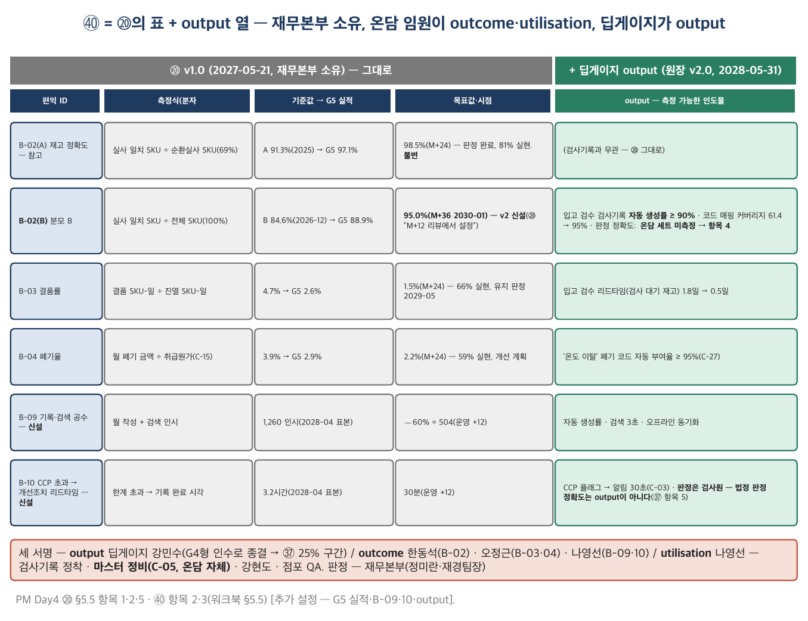

*그림 5-1. ⑳ v1.0의 6칸 오른쪽에 output 열이 붙는다. B-02(A)는 그대로, B-02(B)의 목표만 신설, B-09·10은 검사기록 디지털화가 만드는 새 항목.*

### 딥게이지의 사례로 읽기

> ■ **사례 사실** — ⑳ v1.0(2027-05-21, 재무본부 소유)·B-02 분모 A 91.3 → 98.5 / B 84.6·"B 목표는 M+12 리뷰에서 설정"·리뷰 계획 2028-05 원장 v2는 PM Day4 워크북 §5.5; §9 접합점 표. G5 실적(B-04 2.9 / B-03 2.6 / B-02A 97.1 / B 88.9 · 실현률 71% · 경고)·B-09·10·output 열은 워크북 §5.5 항목 2 [추가 설정].

온담 G5(2028-03-31)는 지났다. 편익 실현률 71% — 손익분기 66% 위이나 95% 미만이라 "경고", 개선 계획 제출. 그 개선 계획의 한 줄이 검사기록 디지털화이고, 그 공급자가 여러분이다. 원장 v2(2028-05-31)는 ⑳ 리뷰 계획 그대로의 시점이다. 표에서 바뀌는 것 — B-02(B) 목표 신설(84.6 → G5 88.9 → **95.0%, M+36 2030-01**), output 열(입고 검수 검사기록 자동 생성률 ≥ 90% · 코드 매핑 커버리지 61.4 → 95% · 판정 정확도: 온담 세트 미측정), 신설 B-09(검사기록 작성·검색 공수 월 1,260 인시 → −60%)·B-10(CCP 한계 초과 → 개선조치 기록 3.2시간 → 30분). 바뀌지 않는 것 — B-02(A) 91.3 → 98.5(G5 97.1, 81% 실현), B-03·04의 측정식·목표.

B-10의 output 열에 한 줄이 있다: "판정은 검사원 — 법정 기준 판정 정확도는 output이 아니다." ㊲ 항목 5의 분리 조항이 편익 원장에서 다시 적힌다. 한 문서의 조항이 다른 문서의 칸이다.

### 실무에서 어떻게 틀리는가

딥게이지 문서로 만든다(소유자는 재무본부). 분모 A를 손댄다. output 열에 outcome을 쓴다("재고 정확도 95%" — 한동석의 서명이다). 판정 정확도를 output으로 약속한다(모집단이 없다).

### 표준·문헌에서는

Ward & Daniel — benefit owner와 change owner의 분리. MSP — benefits realisation plan의 소유. PM Day4 ⑳ 항목 1·2·5.

---

## 5.2 output·outcome·utilisation — 칸마다 실명

### 개념

편익은 세 사람의 서명이다 — output(무엇을 인도하는가, 공급자) / outcome(무엇이 달라지는가, 현업 임원) / utilisation(누가 쓰게 만드는가, 업무 변화 소유자). 칸에 회사명이나 제품명이 들어가면 그 칸은 서명이 아니다. 그리고 utilisation 칸에 **전제**를 넣는다 — 커버리지 95%의 전제인 마스터 정비는 온담의 일이다.

### 딥게이지의 사례로 읽기

> ■ **사례 사실** — ⑳ 항목 5 ITO 서명표(output P1 PM·이재현 / outcome 오정근·한동석 / utilisation 실명)는 PM Day4; ㊵ 항목 3은 워크북 §5.5 [추가 설정].

⑳의 output 열 "P1 PM·이재현(수행사)"이 "딥게이지 강민수"로 바뀐다. outcome은 ⑳의 서명자 그대로 — 한동석(B-02), 오정근(B-03·04), 나영선(B-09·10). utilisation에 나영선의 마스터 정비(C-05, 온담 자체)가 들어간다 — ㊱에서 거절한 것이 ㊵에서 온담의 서명 칸이 된다. 그것이 거절의 뜻이다: 안 한다가 아니라 누가 한다.

### 실무에서 어떻게 틀리는가

output에 "GAUGE". utilisation이 비거나 "온담". 마스터 정비를 output에(②의 즉시 탈락 재발).

### 표준·문헌에서는

Ward & Daniel 6장 — benefits dependency network의 소유. PM Day1 ④ RACI.

---

## 5.3 인수 기준의 모집단

### 개념

인수 기준은 수치가 아니라 **수치 + 모집단**이다. "FN ≤ 3.0%"는 어느 데이터에서 잰 것인가가 없으면 기준이 아니다. 새 세그먼트에서는 지표 자체가 바뀔 수 있다 — 시계열에는 OCR이 없고, HACCP의 위험은 FN이 아니라 재현율이다. 측정 전에는 임시 기준과 유효 기간과 자동판정 OFF가 있고, 측정 후에는 확정 절차와 판정자가 있으며, 측정 비용은 공급자가 낸다. **모집단 없는 fit criterion은 무효다.**

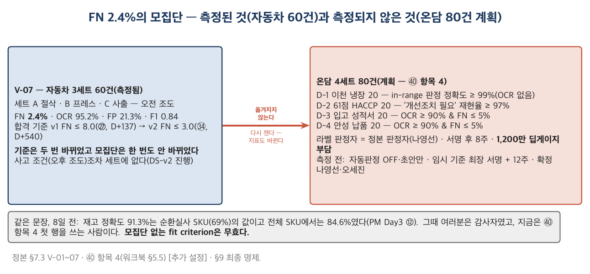

*그림 5-2. 왼쪽은 V-07 — 세트 A·B·C 60건, 오전 조도. 오른쪽은 세트 D-1~4 80건, 세트마다 다른 지표. 기준은 두 번 바뀌었고(8.0 → 3.0) 모집단은 한 번도 안 바뀌었다.*

### 딥게이지의 사례로 읽기

> ■ **사례 사실** — V-06·V-07은 §7.3; ㉗ 합격 기준 v1(FN ≤ 8.0)·㉞ v2 개정은 Day6·7. 측정 세트 D-1~4 × 20건 = 80건·시점 8주·비용 1,200만·세트별 임시 기준·확정 절차는 워크북 §5.5 항목 4 [추가 설정].

㊵ 항목 4 첫 행은 정본 V-07의 문장 그대로다 — "FN 2.4 / OCR 95.2 / FP 21.3은 자동차 3세트(A·B·C) 60건, 오전 조도의 값이다. 온담 4세트에서는 한 번도 측정되지 않았다." 이 문서에서 가장 불리한 문장이고, 적지 않으면 서명 후에 나온다 — 첫 오판정 때, 218문항의 다음 판 때, 시리즈B 실사 때. 적으면 측정 계획이 따라온다: D-1 이천 냉장 20 / D-2 HACCP 20 / D-3 입고(상위 30개사) 20 / D-4 안성 20 = 80건, 라벨 판정자 = 정본 판정자, 계약 서명 후 8주, 1,200만 딥게이지 부담. 임시 기준은 세트마다 다르다 — D-3·D-4(건 단위) OCR ≥ 90% & FN ≤ 5% / D-2 '개선조치 필요' 재현율 ≥ 97% / D-1 in-range 판정 정확도 ≥ 99%. 측정 전 자동판정 OFF·초안만. 확정은 측정 후 4주 내 양측 서명(나영선 · 오세진).

4세트에 "FN ≤ 3.0%"를 그대로 쓰는 것은 모집단만 틀린 것이 아니라 지표도 틀린 것이다 — ㊱ 5차원 ③(1차 키가 다르다)의 인수 기준 판.

### 실무에서 어떻게 틀리는가

"FN ≤ 3.0%"를 그대로(즉시 탈락). 측정 계획 없이 "추후 협의". 측정 비용을 고객에게(고객은 측정을 미룬다). 4세트에 같은 지표.

### 표준·문헌에서는

ITIL 4 — acceptance criteria의 측정 가능성. ISO/IEC 42001 — AI 성능 평가의 데이터 대표성. Day6 ㉗ 항목 1(데이터셋)·항목 3(개정 절차) · Day7 ㉞ 항목 6(criteria drift 반론 셋 중 둘째 — 데이터셋 미변경).

---

## 5.4 두 시계와 미달 시 조치

### 개념

편익 리뷰는 두 시계로 돈다 — 발주자의 프로그램 시계(M+n / 운영 +n)와 공급자의 릴리스 시계(분기). 어느 리뷰에 누가 오는가를 실명으로 — 공급자는 발주자 리뷰에 배석이지 판정자가 아니다. 미달 시 조치는 넷으로 가르고 **output 미달만** 배상에 연동한다. outcome 미달을 배상에 넣으면 ⑳ 항목 5의 책무 분리가 무너지고, output 미달을 배상에서 빼면 ㊲ 25% 구간의 대상이 없다.

### 딥게이지의 사례로 읽기

> ■ **사례 사실** — ⑳ 항목 4 리뷰 계획(2028-05 운영 +12 / 2029-05 운영 +24)은 PM Day4; 배상 25% 구간은 ㊲ 항목 5. 딥게이지 시계 두 행·미달 4행은 워크북 §5.5 항목 5·6 [추가 설정].

네 리뷰 — 원장 v2 확정(2028-05-31, 재무본부 판정, 딥게이지 배석) / 온담 4세트 측정 확정(계약 서명 + 8주, 나영선·오세진·조성태) / 운영 +24 유지 판정(2029-05, 딥게이지 배석·판정자 아님) / 딥게이지 분기 릴리스 리뷰(온담 승인 후, 박세연·나영선 위임자). 미달 네 행 — output 미달(딥게이지, 재이관·재측정, **㊲ 25% 연동**) / outcome 미달(온담 임원, 개선 계획, 비연동) / utilisation 미달(나영선·점포 QA, 교육·점검, 비연동) / 측정 불가(분모 B의 실사 자체가 없음 — 온담 물류본부, 판정 보류, 비연동, 단 측정 세트는 output).

### 실무에서 어떻게 틀리는가

한 시계로 합친다. G5를 미래로 쓴다. 공급자가 편익을 판정한다. outcome을 배상에. output을 배상에서 뺀다.

### 표준·문헌에서는

MSP — benefits review의 시점과 책임. PM Day4 ⑳ 항목 4·6 — 두 시계의 원형.

---

## 5.5 8일 사슬 역추적

### 개념

마지막 문서의 모든 칸은 앞 문서에서 왔다. 사슬을 거꾸로 걸으면 두 가지가 보인다 — 어느 칸이 몇 번 바뀌었는가, 그리고 어느 칸이 한 번도 안 바뀌었는가. 기준은 여러 번 바뀌는데 모집단이 안 바뀌면 그 기준은 결과에 맞춘 것이다(criteria drift). 그리고 첫 문서의 한 줄("제외 범위")이 마지막 문서의 계약(21억)이 되는 것도 보인다.

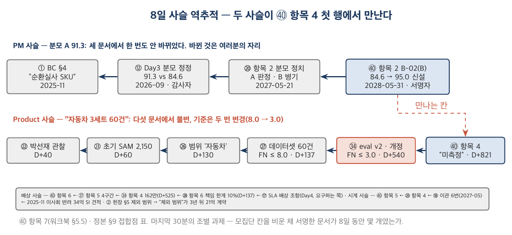

*그림 5-3. PM 사슬(분모 A 91.3 — 세 문서에서 불변)과 Product 사슬(자동차 3세트 60건 — 다섯 문서에서 불변, 기준은 두 번 변경). 두 사슬이 만나는 칸이 ㊵ 항목 4 첫 행.*

### 딥게이지의 사례로 읽기

> ■ **사례 사실** — §9 접합점 표(⑳ → ㊵ · ⑫ → ㉗ · ⑰ → ㊲ · ⑯ → 218문항 · 6종 검증 · Day3 분모 정정). 여섯 행의 사슬은 워크북 §5.5 항목 7 [추가 설정].

**PM 사슬**: ㊵ 항목 2 분모 A 91.3 ← ⑳ 항목 2 분모 정치(2027-05-21) ← ⑫ Day3 분모 정정(2026-09) ← ① BC §4 "순환실사 SKU"(2025-11). 세 문서에서 분모는 한 번도 안 바뀌었다. 바뀐 것은 여러분의 자리다 — 감사자에서 서명자로. **Product 사슬**: ㊵ 항목 4 "자동차 3세트 60건" ← ㉞ 항목 5(D+540) ← ㉗ 항목 1(D+137) ← ㉖ 항목 3 범위 "자동차"(D+130) ← ㉓ 초기 SAM 2,150(D+60) ← ㉒ 박선재 관찰(D+40). 기준은 두 번 바뀌었고(㉗ v1 8.0 → ㉞ v2 3.0) 모집단은 한 번도 안 바뀌었다. 세트 D는 한 번도 없었다. **배상 사슬**: ㊵ 항목 6 ← ㊲ 항목 5 4구간 ← ㉞ 항목 4 162만(D+525) ← ㉘ 항목 6 책임 한계 10%(D+137) ← ⑰ SLA 배상 조항(Day4, 요구하는 쪽). **시계 사슬**: ㊵ 항목 5 ← ⑳ 항목 4 ← ⑱ 이관 6번(2027-05) ← 2025-11 이사회 반려 34억 SI 견적 · ② 헌장 §5 제외 범위 — "검사기록은 제외 범위"가 3년 뒤 21억 계약이 됐다.

### 실무에서 어떻게 틀리는가

사슬이 한 단계에서 끝난다. 변경 이력이 비어 있다. 불변인 칸을 "안정적"으로 읽는다(모집단 불변은 안정이 아니라 미측정이다).

### 표준·문헌에서는

PM Day2 ⑦ RTM — 추적성의 원형. Day7 ㉞ 항목 6 — criteria drift.

---

## 5.6 에필로그 — D+1000

### 개념

결과는 결정을 판정하지 않는다 — 결과는 결정의 조건이 지켜졌는지를 판정한다. 에필로그를 보는 순서: 예측(봉인 전에 적은 것)과 대조하고, 어느 조건이 빠졌거나 안 지켜졌는지를 찾고, 그것을 바꿀 수 있었던 문서의 칸을 짚는다.

### 딥게이지의 사례로 읽기

> ■ **사례 사실** — 34명(개발 21) · 58사 · ARR 11.9억(온담 제외) · 80억 클로징 · 14명 온담 투입 · 7개월 공백은 §1.5·§4.13. 98 mm 검산·리드 미기재·대조 세 가지는 워크북 §7 [추가 설정].

2028-11-26. 34명(개발 21 / 세일즈 7 / CS 4 / 경영지원 2). 유료 58개사, ARR 11.9억(온담 제외). 시리즈A 80억 클로징 — 리드는 정본에 없다. 개발 21명 중 14명이 온담 커스터마이징에 묶여 자동차 58사의 릴리스가 7개월간 없다. 14 × 7 = 98 mm — ㊱ 분류 후 86 mm의 114%, 전부 138 mm의 71%. 상한 6 FTE(연 72 mm)가 계약에 있었다면 나올 수 없는 숫자다 — 들어가지 않았거나, 지켜지지 않았거나. ARR 11.9억은 D+800과 같다 — 여섯 달 동안 자동차 58사의 순증이 0에 가깝다는 뜻이고, 그것이 7개월 공백의 값이다. 정본 §1.5: "이 결말이 좋은 결말인지는 Day8 마지막 30분에 여러분이 판정한다."

### 실무에서 어떻게 틀리는가

결과로 결정을 판정한다("결국 받았으니 받는 게 맞았다" / "7개월 공백이니 거절이 맞았다"). 조건을 보지 않는다. 예측을 적어 두지 않아 대조할 것이 없다.

### 표준·문헌에서는

Day7 ㉞ 항목 6 — 결과를 본 뒤 기준을 바꾸는 오류의 거울상.

---

## 5.7 8일 최종 명제

> *"FN 2.4%는 자동차 3세트 60건에서 나온 값이다. 온담의 4번째 세트에서는 한 번도 측정되지 않았다. 이것은 여러분이 Day3에 재고 정확도 91.3%의 분모를 따져 물었을 때 이미 배운 것이다. 그때 여러분은 감사자였다. 지금 여러분은 그 문서를 쓴 사람이다."* — 정본 §9

명제는 세 문장으로 나뉜다. 첫째, **숫자에는 모집단이 있다** — 2.4%도 91.3%도. 둘째, **모집단은 옮겨지지 않는다** — 세그먼트를 바꾸면(자동차 → 식품, 순환실사 → 전체 SKU) 다시 잰다. 셋째, **자리가 바뀌어도 규칙은 같다** — 감사자로서 따져 물은 것을 서명자로서 적는다. 8일 동안 여러분은 40종의 문서를 썼고, 그중 모집단 칸을 비운 채 서명된 것이 몇 개였는지를 마지막 30분에 센다(㉗ v1.0의 합격 기준, ㉞ v2의 개정, ㊲ 항목 4 초안, IR 덱 18.9 — 힌트는 워크북 §7.2).

---

## 제5장 핵심 정리

> **한 줄씩 — 수업 직전 5분 복습용**
> 1. ㊵ = ⑳의 표 + output 열. 소유는 재무본부, 우리는 output 서명자. 분모 A는 손대지 않는다.
> 2. B-02(B) 84.6 → G5 88.9 → 목표 95.0(M+36) — ⑳가 예약한 한 가지. B-09·10 신설.
> 3. 세 서명 — output 딥게이지 / outcome 한동석·오정근·나영선 / utilisation 실명 + 마스터 정비(온담).
> 4. 모집단 — V-07 그대로 적는다. 4세트 80건, 세트별 지표, 8주, 1,200만 우리 부담, 측정 전 OFF.
> 5. 두 시계 — 온담 M+n·운영 +n / 딥게이지 분기. 배석이지 판정자 아님. output 미달만 배상 25%.
> 6. 사슬 — 분모 A 3문서 불변, 자동차 60건 5문서 불변, 기준 2회 변경. 제외 범위 한 줄이 21억.
> 7. 에필로그 — 98 mm, ARR 11.9 그대로. 결과는 조건을 판정한다. 최종 명제 세 문장.
>
> 아래는 같은 내용의 자세한 판이다.

1. 원장 v2.0 2028-05-31 = ⑳ 리뷰 계획 "2028-05 운영 +12". G5 실현률 71%(경고). 적용 범위 B-02(B)·03·04 + B-09·10.
2. output 열 — 자동 생성률 ≥ 90% · 커버리지 61.4 → 95(마스터 후) · 판정 정확도 미측정 / 검사 대기 재고 1.8 → 0.5일 / 온도 이탈 코드 ≥ 95% / 검색 3초 / CCP 알림 30초 — 법정 판정 정확도는 output 아님.
3. ⑳ 항목 5 형식 그대로. "P1 PM·이재현" → "딥게이지 강민수".
4. D-1 냉장 in-range ≥ 99% / D-2 HACCP 재현율 ≥ 97% / D-3·4 건 단위 OCR ≥ 90 & FN ≤ 5. 확정 4주 내 나영선·오세진 서명, 최장 서명 + 12주.
5. 네 리뷰 · 네 미달 행. 측정 불가는 보류, 측정 세트는 output.
6. 여섯 행 사슬 — PM / ITO / 데이터셋 / FN 기준 / 배상 / 시계.
7. 34명 · 14명 투입 · 7개월 · 리드 미기재. 예측을 봉인 전에 적는다.

## 생각해 볼 질문

1. 여러분이 서명받던 편익 표에서 공급자의 output 칸은 누가 채웠는가? 그 칸이 outcome과 섞여 있지 않았는가?
2. 여러분 회사의 인수 기준 하나를 골라 그 수치의 모집단을 적을 수 있는가?
3. 8일 동안 쓴 문서 중 모집단 칸을 비운 채 서명한 것을 셀 수 있는가 — 여러분 회사의 문서로 같은 셈을 해 보라.
4. 에필로그를 좋은 결말로 만들 수 있었던 한 칸을 고르라. 그 칸을 채우는 데 걸리는 시간은 얼마였는가?

## 워크북 연결

이 장은 Day8 워크북 **㊵ 편익 실현 원장 공동 확정본**의 항목 1·2(5.1절) · 항목 3(5.2절) · 항목 4(5.3절) · 항목 5·6(5.4절) · 항목 7(5.5절)과 §7 마지막 30분(5.6·5.7절)에 대응한다.

---

# 제6장 이 날의 학술 배경과 읽을 자료 (과정 후)

## 6.1 Moore — 캐즘·볼링 핀·전체 제품

### 무엇인가
Moore, *Crossing the Chasm*(1991, 3판 2014). 초기 시장과 주류 시장 사이의 캐즘, 그것을 건너는 방법으로서의 세그먼트 집중(교두보), 그리고 다음 세그먼트로 옮기는 볼링 핀 — 다음 핀은 현재 핀과 전체 제품(whole product: 제품 + 그것이 쓰이기 위한 모든 것)을 공유해야 한다.

### 실무자에게
온담이 다음 핀인가 다른 레인인가. 5차원 표가 그 답이다 — 다섯 차원 중 넷이 갈리면 전체 제품이 다르다. 대한기공은 같은 핀 안의 다음 고객이다.

### 흔한 오독
Moore를 확장의 허가증으로 읽는 것. 그는 반대로 집중을 말한다 — "캐즘을 건너는 동안 한 세그먼트를 독점하라."

### 어디를 읽을 것인가
3장(교두보 선택), 4장(전체 제품·볼링 핀). 판본은 3판.

## 6.2 협상론 — BATNA와 객관적 기준

### 무엇인가
Fisher & Ury, *Getting to Yes*(1981, 3판 2011). 입장이 아니라 이해(interests), 객관적 기준(objective criteria), 그리고 BATNA — 협상 결렬 시 최선의 대안. BATNA는 "개발하라(develop)"의 대상이다: 생각이 아니라 행동으로 만든다.

### 실무자에게
배상 4구간(조건으로 가른다)은 객관적 기준의 응용이고, 대한기공 병행 체결은 BATNA 개발이다. 텀시트 둘은 서로의 BATNA이고 온담 결정이 그 하나를 소멸시킨다.

### 흔한 오독
BATNA를 "차선책"으로 읽고 비교표를 만들지 않는 것. 객관적 기준을 "공정한 금액"으로 읽는 것 — 기준은 금액이 아니라 조건이다.

### 어디를 읽을 것인가
4장(객관적 기준), 6장(BATNA).

## 6.3 벤처 파이낸스 — 텀시트의 경제와 통제

### 무엇인가
Feld & Mendelson, *Venture Deals*(2011, 4판 2019). 텀시트를 economics(가격·옵션풀·청산우선권·안티딜루션)와 control(이사회·보호 조항·drag·정보권)로 나눠 읽는다. YC SAFE post-money 표준 문서(2018 개정) — cap·discount·전환의 정의.

### 실무자에게
4.5~4.8절의 순서가 economics → control이다. 옵션풀 셔플(pre/post)의 계산은 4장. SAFE의 cap이 pre인지 post인지는 전환 주식수를 바꾼다(4.44% vs 4.26%).

### 흔한 오독
조항 사전으로만 읽는 것 — 주식수로 계산하지 않으면 사전은 쓸모가 없다. "표준 문구"를 값이 없는 문구로 읽는 것.

### 어디를 읽을 것인가
3장(IC·프로세스), 4장(economics), 5장(control). YC SAFE는 문서와 해설(user guide) 둘 다.

## 6.4 편익 관리 — Ward & Daniel에서 MSP·PMBOK 8판까지

### 무엇인가
Ward & Daniel, *Benefits Management*(2006, 2판 2012) — 편익 의존성 네트워크, 편익 소유자(benefit owner)와 변화 소유자(change owner)의 분리. MSP(5판 2020)·PRINCE2 7판의 benefits realisation plan·review. PMBOK 8판의 가치 인도(value delivery) — 종료 후 편익 판정의 책임.

### 실무자에게
output·outcome·utilisation의 세 서명이 이 계보에서 왔다. 공급자는 output에만 서명하고, 편익 리뷰의 판정자가 아니다.

### 흔한 오독
편익을 프로젝트 산출물로 읽는 것(편익은 조직 변화에서 나온다). 공급자가 편익을 약속하는 것(그것은 outcome 서명의 침범이다).

### 어디를 읽을 것인가
Ward & Daniel 3장(프로세스), 6장(소유와 책임). MSP 편익 관리 장. PMBOK 8판은 판본을 검색해 확인한다(2026 전환기).

## 6.5 SLA·책임 제한·AI 관리체계

### 무엇인가
ITIL 4 Service Level Management practice — SLA·OLA·UC의 정합성. Beyer 외 *SRE*(2016) — error budget. 계약법의 책임 제한 조항 실무(법역·판본 확인). ISO/IEC 42001:2023 — AI 관리체계의 책임·투명성·성능 평가.

### 실무자에게
3층 매핑을 공급자 쪽에서 그리면 비는 층이 고객의 UC다(온프렘). AI 판정 오류의 SLA 편입은 42001의 성능 평가 데이터 대표성(모집단)과 연결된다.

### 흔한 오독
SLA를 %로만 읽는 것(분으로 환산). 책임 제한을 금액으로만 읽는 것(조건으로).

### 어디를 읽을 것인가
ITIL 4 SLM practice guide. SRE 3·4장. 42001은 부속서의 통제 목록.

## 6.6 서지와 읽는 순서

| 순서 | 문헌 | 이유 |
|---|---|---|
| 1 | Fisher & Ury, *Getting to Yes* 4·6장 | 오늘의 모든 협상(㊱·㊲·㊴)의 바닥 |
| 2 | Feld & Mendelson, *Venture Deals* 4·5장 | ㊴를 주식수로 다시 계산 |
| 3 | Moore, *Crossing the Chasm* 3·4장 | "자동차를 벗어날 것인가"의 문헌 |
| 4 | Ward & Daniel, *Benefits Management* 3·6장 | ㊵의 세 서명 |
| 5 | ITIL 4 SLM · SRE 3·4장 | ㊲ 항목 4 |
| 6 | YC SAFE 문서·해설 · ISO/IEC 42001 | 심화 |

## 6.7 읽을 자료 — 필수 / 심화 / 참고

**필수 (과정 전)** — Moore, *Crossing the Chasm* (3판, 2014) 3~4장 · Fisher & Ury, *Getting to Yes* (3판, 2011) 4·6장 · Feld & Mendelson, *Venture Deals* (4판, 2019) 4~5장 · Ward & Daniel, *Benefits Management* (2판, 2012) 3·6장.

**심화 (과정 후)** — YC SAFE post-money 표준 문서와 해설 · ITIL 4 Service Level Management practice guide · Beyer 외, *SRE* (2016) 3·4장 · MSP (5판, 2020) 편익 관리 · Skok "SaaS Metrics 2.0" · a16z "16 Startup Metrics"·"16 More" · Perri, *Escaping the Build Trap* (2018) · Cagan, *Inspired* (2판, 2018) · ISO/IEC 42001:2023.

**참고 (워크북을 쓰다가 손을 뻗어 확인할 것)** — PM 트랙 Day4 워크북 §1(⑯)·§2(⑰)·§5(⑳), Day3 워크북 §2(⑫) · Day5 ㉓·㉕ · Day6 ㉖·㉗·㉘·㉚ · Day7 ㉝·㉞·㉟ · 정본 §5·§7.4·§7.5·§9.

### 읽지 않아도 되는 것
엔터프라이즈 세일즈 방법론 서적(MEDDIC 등) — 오늘의 문서는 파는 법이 아니라 받은 뒤 무엇을 서명하는가다. 벤처 밸류에이션 모델링 서적 — pre 320은 협상 결과이지 모델의 출력이 아니다.

---

## Product 트랙을 마치며 — 8일의 끝

이 교재는 네 질문으로 요약된다. **같은 21억이 두 회사에게 어떻게 다른 무게인가**(4.906 / 37.0 / 24.1 / 82.1 — 그리고 세 번째 숫자를 우리가 먼저 말한다), **47건을 어떻게 판정하는가**(5차원 표 먼저, 3분류, 상한 6 FTE — ②는 우리가 만들지 않는다), **같은 문서를 반대편에서 쓸 때 무엇이 달라지는가**(SAC → 218문항, SLA 3층 → 야간 P1 불성립, 배상 요구 → 물리적 하한 6.12와 4구간, ⑳ → output 열), **표준 문구의 값은 얼마인가**(1.29%p = 25.4억, 온담 거절 = 코너스톤 소멸 + pre 242).

그리고 하나가 더 있다 — 8일의 마지막 문장. FN 2.4%는 자동차 3세트 60건에서 나온 값이고 온담의 4번째 세트에서는 한 번도 측정되지 않았다. Day3에서 재고 정확도 91.3%의 분모를 따져 물었을 때 여러분은 감사자였고, 오늘 그 문장을 ㊵ 항목 4 첫 행에 적는 사람은 여러분이다. PM 트랙 20종과 Product 트랙 20종은 다른 문서가 아니다 — 같은 문서를 반대편에서 쓴 것이고, 어느 편에 서든 표의 첫 열은 분모이고 마지막 열은 실명이다.

측정 시점에 밝혀진 것은 서명 시점에 감출 수 없다. 8일 동안 그 문장을 마흔 번 썼다.
