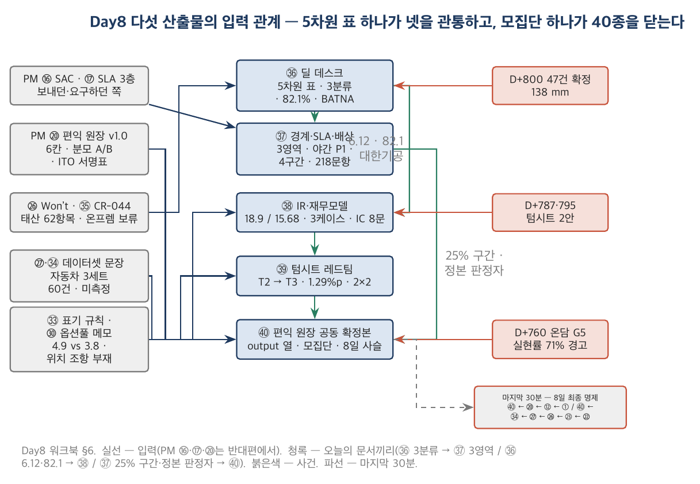

# Product 트랙 Day8 워크북 — 시리즈A·엔터프라이즈 단계 산출물

> **이 워크북의 위치** — Product 트랙 4일차(8일 과정의 마지막 날). 시점이 **둘**이다. **시점 1 = 2028-05-10(수), D+800** — 온담 요구 47건이 확정 접수된 날이고 텀시트 2안이 책상 위에 있다. 다섯 산출물 ㊱~㊵은 모두 이 날짜 기준이다. **시점 2 = 2028-11-26(일), D+1000** — 에필로그. §7에 봉인되어 있고 마지막 30분에만 연다. 회사 상태(시점 1): 27명(개발 14), 유료 58개사, ARR 11.9억(온담 제외), 현금 7.52억 / 8.9개월. 그리고 21억짜리 계약서 한 장과 47건의 요구 목록.

## 목차

- 0. 이 워크북을 쓰는 법
- 1. 엔터프라이즈 딜 데스크 시트 (㊱ Enterprise Deal Desk — 47 Requests, 5 Dimensions, 3 Classes)
- 2. 제품-프로젝트 경계 합의서·SLA/OLA/UC·배상 상한 협상 메모 (㊲ Boundary, SLA Mapping & Liability)
- 3. 시리즈A IR 1페이저·재무모델 3케이스 (㊳ Series A One-pager & 3-Case Model)
- 4. 텀시트 레드팀 메모·캡테이블 v2 (㊴ Term Sheet Red Team & Cap Table v2)
- 5. 편익 실현 원장 공동 확정본 (㊵ Benefits Realisation Ledger — Joint Confirmation = PM ⑳)
- 6. Day8 산출물 5종의 상호 관계 — 그리고 Day5~7·PM 트랙 문서로 되돌아가는 것
- 7. 마지막 30분 — 에필로그(시점 2, 봉인)와 8일 최종 명제
- 8. Product 트랙을 마치며 · 읽을 자료

---

## 0. 이 워크북을 쓰는 법

### 0.1 워크북 사용법

> **■ 이 워크북을 따라가는 순서 — 모든 산출물 공통**
> 1. **읽는다.** X.1(왜 쓰는가) → X.2(표준·문헌 위치) → X.3(항목별 작성 가이드). 막히면 항목 아래 📖가 가리키는 교재 절을 펼친다.
> 2. **찾는다.** X.3 끝의 **◆ 실습 입력 카드** — 정본 §·앞 산출물·추가 조건. 오늘은 **두 시점을 섞지 않는 것**이 규율이다. 카드의 모든 값은 시점 1(D+800)이고, 시점 2(D+1000)의 숫자는 §7에 봉인되어 있다 — 그것을 먼저 보면 오늘의 문서는 결과에 맞춘 문서가 된다(Day7 ㉞ criteria drift와 같은 오류).
> 3. **쓴다.** 카드의 **★ 수업 중 과제**에 적힌 항목을 X.4 빈 템플릿(또는 인쇄용 PDF)에 딥게이지로 직접 쓴다. **X.5 예시본은 아직 펼치지 않는다.**
> 4. **대조한다.** 다 쓴 뒤 X.5 완성 예시본과 칸별로 대조하고, X.6 해설에서 차이가 난 칸의 이유를 읽는다. 해설은 정답이 아니라 **즉시 탈락 조건**과 **방어 가능한 답의 범위**를 쓴다.
> 5. **바꿔 쓴다.** X.7 실습(조건을 바꾼 변형 과제·자기 회사 과제)은 복습과 과정 후 과제다.
>
> 수업에서는 3단계를 산출물당 25~45분(카드의 ★에 적힌 시간)으로 하고, X.5·X.6은 그날 저녁에 읽는 것이 정상이다. 마지막 30분(§7)은 예외 — 수업에서 함께 연다.

1. PM 트랙·Day5~7 워크북과 같은 규칙으로 쓴다. 교재가 "왜", 워크북이 "무엇을 어느 칸에".
2. **역할은 그대로, 상대가 바뀌었다.** 여러분은 여전히 딥게이지의 창업팀이다 — 27명의 회사이고 시리즈A 텀시트 두 장을 받았다. 그런데 오늘의 상대는 **온담F&B**다. Day1~4에서 여러분이 PM으로서 썼던 문서(⑯ SAC, ⑰ SLA, ⑳ 편익 원장)를 오늘은 **받는 쪽·서명하는 반대편**에서 쓴다. 218문항을 보내던 사람이 218문항을 받고, 배상 상한을 요구하던 사람이 배상 상한을 막는다.
3. **시점을 둘로 고정한다.** 시점 1 **2028-05-10(수), D+800** — ㊱~㊵의 기준일. 문서 작성일은 ㊱ D+800 / ㊳ D+802 / ㊴ D+807 / ㊲ D+814 / ㊵ D+821(모두 2028-05). 시점 2 **2028-11-26(일), D+1000** — 에필로그, §7 봉인. 정본 §7.1은 시리즈A 단계의 지표 열을 "D+900"으로 이름 붙였다 — 이 워크북은 그 값을 기준일 D+800의 값으로 쓴다(D+800~900 사이 IR 덱 갱신 없음 [추가 설정]).
4. **분모를 선언한다 — 이번에는 ARR의 분자도.** IR 덱의 ARR 18.9억은 온담 연 청구 7억 전액을 ARR로 센 값이고, 검산은 15.68억(라이선스 3.78억만)이다. 집중 리스크는 37.0% / 24.1% / 82.1% 세 값이다. FN 2.4%는 자동차 3세트 60건의 값이다. 오늘의 모든 표는 "이 숫자의 분모(모집단)는 무엇인가"를 먼저 쓴다.
5. 각 산출물의 X.3은 항목마다 네 칸 — *무엇을 / 어떻게 / 흔한 오류 / 딥게이지에서는 이렇게*.
6. X.7 실습의 **기본 과제**는 딥게이지의 조건 하나를 바꾼 변형 과제, **심화 과제**(3~7년차)는 자기 회사의 제품(또는 사내 서비스)으로 같은 문서 쓰기.
7. 표준·문헌 인용은 Moore *Crossing the Chasm*(3판, 2014), Fisher & Ury *Getting to Yes*(3판, 2011), ITIL 4 Service Level Management, Feld & Mendelson *Venture Deals*(4판, 2019), YC SAFE post-money 표준 문서, Ward & Daniel *Benefits Management*(2판, 2012), PMBOK 8판·PRINCE2·MSP의 편익 관리를 기준으로 한다. 판본은 인용 전에 확인한다.
8. **인쇄용 PDF.** 다섯 산출물의 빈 템플릿은 A4 인쇄용 PDF로 제공한다.
    - 📄 빈 양식 5종 통합본: [`../템플릿/Product_Day8/00_Day8_템플릿팩_빈양식.pdf`](../템플릿/Product_Day8/00_Day8_템플릿팩_빈양식.pdf) (A4, 23쪽 — 5차원 표·47건 목록·SLA 매핑·편익 항목은 가로)
    - 📄 완성 예시 5종 통합본: [`../템플릿/Product_Day8/00_Day8_템플릿팩_완성예시.pdf`](../템플릿/Product_Day8/00_Day8_템플릿팩_완성예시.pdf)
    - LaTeX 소스: `../템플릿/Product_Day8/src/`. 명세 `../템플릿/Product_specs.py`, 기입 `../템플릿/Product_fills.py`.

### 0.2 8일 동안 만드는 산출물 전체 목록(40종)과 Day8의 위치

| 트랙 | 일차 | 산출물 | 이 산출물의 입력 | Day8 산출물과의 관계 |
|---|---|---|---|---|
| PM | Day1 | ① 비즈니스 케이스 ② 헌장 ③ 이해관계자 ④ 거버넌스·RACI ⑤ 프리모템 | — | ① BC §4의 분모 "순환실사 SKU"가 ㊵ B-02의 분모 A · ② 헌장 §5 제외 범위(검사기록)가 3년 뒤 21억 계약 · ④ RACI가 ㊵ ITO 실명 |
| PM | Day2 | ⑥ 범위·WBS ⑦ RTM ⑧ 일정 ⑨ 원가 기준선 ⑩ 리스크 정량화 | Day1 | ⑨ 원가 허용범위 10.08억 ↔ ㊱ 21억의 무게(4.906%) |
| PM | Day3 | ⑪ 변경요청서 ⑫ 성과보고 EVM ⑬ 이슈·리스크 ⑭ 품질 기록 ⑮ 조달·계약 | Day2 | **⑫ 재고 정확도 분모 정정(91.3 vs 84.6) → ㊵ 항목 4 "FN 2.4%의 모집단"** · ⑮ 조달·계약의 배상 조항 ↔ ㊲ |
| PM | Day4 | ⑯ 컷오버·SAC ⑰ 운영 이관·SLA ⑱ 종료 보고서 ⑲ 교훈 ⑳ 편익 원장 | Day3 | **⑯ SAC → ㊲ 218문항(받는 쪽)** · **⑰ SLA/OLA/UC·error budget → ㊲ 항목 4(공급자 쪽)** · **⑳ → ㊵ 표 그대로 + output 열** · ⑱ 이관 6번 = 이 딜의 출처 |
| Product | Day5 | ㉑~㉕ | ⑱ 6번 | ㉒ 박선재 관찰이 세트 A·B·C의 시작 · ㉓ 초기 SAM 2,150 vs 확장 11,800 = "자동차를 벗어날 것인가" · ㉕ 커널 "판정을 대신하지 않는다"가 ㊱ 거절 기준·㊲ 배상 분리 |
| Product | Day6 | ㉖ 범위 ㉗ Eval ㉘ 프라이싱·UE ㉙ PR/FAQ ㉚ 텀시트 | ㉓·㉔·㉕·㉑ | **㉖ Won't·태산 62항목 전례 → ㊱ 47건** · **㉗ 데이터셋 "자동차 3세트 60건" → ㊵ 항목 4** · ㉘ 라인 과금이 61점에서 무너진다(2개점 = 1라인) · ㉚ 옵션풀 부속 메모 → ㊴ 항목 3 |
| Product | Day7 | ㉛ 코호트 ㉜ North Star ㉝ UE v2 ㉞ 사고 ㉟ 로드맵·CR-044 | ㉙·㉘·㉗·㉖ | ㉝ 표기 규칙 → ㊳ 두 값 병기 · ㉞ 항목 4 162만 선례 → ㊲ 배상 · ㉞ 항목 8 증빙 → 제218문항 · ㉟ CR-044 보류 → ㊱ C-31 온프렘 |
| **Product** | **Day8** | **㊱ 엔터프라이즈 딜 데스크 시트** | ㉖·㉟·㉝·⑱ | 오늘의 첫 문서 — 5차원 표가 본체, 47건은 별지 |
| **Product** | **Day8** | **㊲ 경계 합의서·SLA/OLA/UC·배상 메모** | ㊱·㉞·⑯·⑰ | 반대편에서 쓰는 같은 문서 |
| **Product** | **Day8** | **㊳ IR 1페이저·재무모델 3케이스** | ㉝·㉛·㊱ | 18.9와 15.68 — 두 값 병기 |
| **Product** | **Day8** | **㊴ 텀시트 레드팀·캡테이블 v2** | ㉚·㊱·㊳ | 1.29%p와 "온담 거절 = 코너스톤 소멸" |
| **Product** | **Day8** | **㊵ 편익 원장 공동 확정본** | ⑳·㉗·㉞·㊲ | 40종의 마지막 — 양쪽 서명, 8일 사슬 역추적 |

Day8의 다섯 산출물은 모두 **"같은 문서를 반대편에서 쓸 때 무엇이 달라지고 무엇이 그대로인가"**의 문서다. 21억은 온담에게 4.906%이고 딥게이지에게 37.0%(또는 24.1%, 또는 82.1%)다. 배상 상한 100%는 Day4에서 여러분이 요구한 것이고 오늘 여러분이 막는 것이다. 편익 원장 ⑳는 여러분이 서명받던 표이고 오늘 여러분이 output 열에 서명하는 표다.

### 0.3 딥게이지 한 페이지 요약 — 시점 1(2028-05-10, D+800)

**회사(정본 §7.1 'D+900' 열 — 기준일 D+800에 사용).** **27명**(개발 14 / 세일즈 6 / CS 4 / 경영지원 3 — 분할은 [추가 설정], G-01). 유료 **58개사**(G-02). ARR 계약 기준 **11.9억**(온담 제외; 그중 구축비·컨설팅비 1.6억, G-03·04) / 순 SaaS **10.3억**(G-05). MRR 9,917만 / 8,583만(G-06). ACV 2,052만 / 1,776만(G-07). AI 추론 원가 월 **3,780만** = 계약 MRR의 38.1% / 순SaaS의 **44.0%**(G-08·09). GM **54%**(IR) / **46.9%**(검산, G-10). 월 순소진 8,400만(G-11), 분기 순증 ARR(순SaaS) 2.10억(G-12), burn multiple **1.20**(G-13), efficiency 0.83(G-14). 현금 **7.52억 / 8.9개월**(G-15). GRR 87% / NDR 104%(G-16). 계약 라인 3.2 / 실사용 1.9(G-18), 활성률 71% → 46%(G-19), 채택률 26%(㉮, G-20).

**IR 덱의 ARR — 세 값(정본 §3.4·E-07·08).** 온담 포함 **18.9억**(온담 연 청구 7억 전액) / 검산 **15.68억**(라이선스 3.78억만 ARR) / 온담 제외 11.9억. 집중 리스크 **37.0% / 24.1%** — 그리고 세 번째 숫자 **82.1%**(개발 용량 잠식, E-11).

**온담 딜(정본 §5·E-01~17).** 21.00억 / 3년 = 구축·이관 3.00 + 라이선스 11.34(연 3.78 = 라인 환산 70 × 45만 × 12) + 온프렘 운영 6.66(연 2.22 = 월 1,850만). 청구 연 7.00억 균등. 두 법인(㈜온담F&B홀딩스 / ㈜온담푸드시스템, 대표 조성태). 검사 대상 4종(①이천 냉장 ②61점 HACCP ③입고 검수 260개사 ④안성 5사 서식). 코드체계 불일치 **5차원**. 요구 **47건 / 138 man-month**(나영선 19 · 한동석 11 · 박세연 9 · 오정근 5 · 최영주 3 = 62 + 31 + 28 + 12 + 5). 이관 종이 11,200권 + 엑셀 4,100개, 검증 6종, **정본 판정자 미지정**, 코드 매핑 커버리지 **61.4%** → 구축비 3.00 → 실소요 **6.12억**. 온담 요구: 218문항(ISMS-P 미인증, 5영업일) · SLA 99.5% · 배상 **100% vs 10%** · GPU 2대 + 0.7 FTE · 릴리스 분기 1회 승인 후 · CFO 결재 3주. BATNA **[대한기공] 연 2.4억 × 3년**(21억의 34.3%), 커스텀 0, 클라우드, 4주.

**자본(정본 §3.4·K-03~05).** 브릿지 SAFE 8억(D+660, cap 180억·discount 20%, 노들 4 + 엔젤 4) → K-03 FD 1,305,556 / 14,400원. 목표 80억 / pre 320억. **[한강벤처스] 임재혁** 80 / 320, 옵션풀 **15% pre-money**("표준 문구예요") → K-04 FD 1,772,879 / 22,562원 / 강민수 25.38 / 풀 12.00 / 한강 20.00. **[코너스톤캐피탈] 최나연** 80 / 290, **온담 딜 클로징 선행 조건** → K-05 FD 1,665,706 / 22,213원 / 강민수 27.01 / 풀 6.00 / 코너스톤 21.62.

**eval(정본 §7.3 V-07).** FN 2.4 / OCR 95.2 / FP 21.3 — **자동차 3세트 60건. 온담 4세트 미측정.**

**D+600 ~ D+800에 일어난 일 [추가 설정 — 정본 §4.10~4.12에 있는 것은 표시].** 2027-11-02(D+610) **온담 RFI** + 218문항(정본 4.10 — 정본 표기는 D+640, 날짜가 정본) → D+617 회신(즉시 131 / 조건부 62 / 불가 25) → D+640 제안서 v1(21억, 구축비는 커버리지 95% 가정) → D+660 **SAFE 8억**(정본 4.11) → D+690 이관 실사, 커버리지 실측 61.4% → 6.12억 검산 → D+718 요구 목록 1차 31건 → D+739 [대한기공] 문의([H사] 김도윤 소개) → **D+760 2028-03-31 온담 P1 G5** — 편익 실현률 71%, "경고", 개선 계획에 검사기록 디지털화(PM ⑳ 리뷰 계획) → D+780 [대한기공] 제안 → D+787 **한강 텀시트** → D+795 **코너스톤 텀시트** → **D+800 요구 목록 v3 = 47건 확정**(정본 4.12). 현금 6.82 + 8.00 − 소진 5.05 − 일회성 2.25(시리즈A 준비·ISMS-P 사전진단·RFI 대응 외주·사무실 이전) = **7.52억**.

**사람(이 날 등장).** [딥게이지] 강민수 CEO(온담 딜 앞에서 가장 흔들린다, §8.6) · 오세진 CTO · 윤하경 CPO(47건 앞에서 "요구사항 정리자"가 되는지 시험받는다, §8.2) · 강지우 CS · 박정우 세일즈 / [온담] **나영선** 품질안전본부장(스폰서, 19건) · 최영주 준법지원팀장 겸 CPO(218문항 발신자, 3건) · 한동석 물류본부장(11건) · 박세연 IT본부장(9건) · 오정근 영업본부장(5건) · **조성태** 온담푸드시스템 대표(두 번째 계약 주체) · 강현도 구매팀장(서면 전용) · 정미란 CFO(결재 3주, 화면에 없다) / [투자자] 서영채 심사역(노들, IR 초안 검토) · 임재혁(한강) · 최나연(코너스톤) / [대한기공] BATNA.

**이 날의 숫자(정본 ID).** G-01~20 'D+900' 열 / E-01~17 / K-03·04·05 / V-07 / §5.2~5.8 / §3.4 리드 후보·BATNA / §6.4 온담 측 인물 / §9 접합점 표. **시점 2(D+1000)의 숫자는 §7에 봉인.**

### 0.4 Day5~7과 PM 트랙에서 가져오는 것

| Day8 산출물 | 받는 입력 | 어느 문서 어느 항목 | 대조할 것 |
|---|---|---|---|
| ㊱ 5차원 표 | Won't 목록·재검토 조건 · 태산정밀 62항목 전례("첫 커스터마이징") · CR-044 보류(온프렘) | Day6 ㉖ 항목 4·5, Day7 ㉟ 항목 4·5 | 47건 중 몇 건이 이미 Won't였던 것인가(온프렘·무인 판정·감시 대시보드) |
| ㊱ 분류 기준 | 커널 — "판정을 대신하지 않고 근거를 남긴다" · 초기 SAM 2,150 / 확장 11,800 | Day5 ㉕ 항목 4·6, ㉓ 항목 2 | 거절 14건 중 커널 충돌이 몇 건인가 |
| ㊱ 라인 과금 | 밸류메트릭 = 라인 · 실사용 1.9 | Day6 ㉘ 항목 5, Day7 ㉝ 항목 6 | 61점 30라인(2개점 = 1라인)은 정책 안인가 밖인가 |
| ㊲ SLA/OLA/UC | 3층 매핑·error budget 219.2분 — **요구하는 쪽**에서 쓴 표 | PM Day4 ⑰ 항목 3·4 | 같은 표를 공급자 쪽에서 쓰면 비는 층이 어디인가 |
| ㊲ 218문항 | SAC 12항목·인수 거부권 — **보내는 쪽** | PM Day4 ⑯ 항목 8 | 받는 쪽의 답 — 즉시 / 조건부 / 불가 |
| ㊲ 배상 | 책임 한계 162만의 선례·중간안 · 근거 열 "고객은 서명하고 잊는다" | Day7 ㉞ 항목 4, Day6 ㉘ 항목 6 | 10%가 선례인 이유 — 그리고 100% 앞에서 그 선례가 버티는가 |
| ㊲ 제218문항 | 재발 방지 6건의 증빙 열 | Day7 ㉞ 항목 8 | 그대로 회신 가능한가 |
| ㊲ 이관 | 데이터 검증 6종 · 정본 판정자 | PM Day4 ⑯ 항목 5·6(데이터 전환) | 판정자가 계약서에 없다 |
| ㊳ 두 값 병기 | 표기 규칙(4.9 vs 3.8억, GM 61 vs 49.8, LTV:CAC 5.8 vs 1.9) | Day7 ㉝ 항목 1·7 | 규칙이 IR 덱에 절반만 적용됐다(GM은 계약 기준, burn multiple은 순SaaS) |
| ㊳ 코호트 | 삼각행렬·분모 정의 | Day7 ㉛ 항목 1·2 | NDR 104%의 기준 코호트 |
| ㊴ 옵션풀 | 부속 메모 "옵션풀 위치 조항 부재"(D+186) · 시드 0.43%p | Day6 ㉚ 항목 1·6 | 시리즈A 15% pre = 1.29%p — 계산이 손에 있는가 |
| ㊴ 워터폴 | 매각가 3구간, 참가적 vs 비참가 | Day6 ㉚ 항목 3 | 한강 1x 참가적을 같은 표로 |
| ㊵ 표 | 편익 6칸·분모 정치·ITO 서명표·리뷰 계획 — **서명받던 쪽** | PM Day4 ⑳ 항목 1·2·4·5 | ⑳ v1.0 표를 그대로 옮기고 output 열만 더한다 |
| ㊵ 모집단 | 데이터셋 문장 "자동차 3세트 60건, 오전 조도, 온담 4세트 미측정" · 합격 기준 개정 | Day6 ㉗ 항목 1·3, Day7 ㉞ 항목 5·6 | 인수 기준의 모집단 칸이 채워졌는가 |
| ㊵ 분모 | 재고 정확도 91.3 vs 84.6의 분모 정정 | PM Day3 ⑫ · 교재 2.1절 | 그때는 감사자, 지금은 그 문서를 쓴 사람 |

---

## 1. 엔터프라이즈 딜 데스크 시트 (㊱ Enterprise Deal Desk — 47 Requests, 5 Dimensions, 3 Classes)

### 1.1 이 문서는 무엇이고 왜 쓰는가

> 📖 **먼저 읽기** — Day8 교재 제1·2장: 1.2절(21억의 해부 — 구축·라이선스·운영) · 1.3절(같은 금액의 네 비율) · 1.4절(BATNA — 자동차를 벗어날 것인가) · 2.1절(47건을 하나씩 판정하면 6시간 — 5차원 표 먼저) · 2.2절(다섯 차원 읽기) · 2.3절(3분류의 기준) · 2.4절(용량 잠식 계산) · 2.6절(즉시 탈락 셋). 약 55분.

딜 데스크 시트는 표준 계약 밖의 큰 계약 한 건을 **회사 전체가 같은 표로** 판정하기 위한 문서다. 세일즈는 21억을 보고, CTO는 138 man-month를 보고, CEO는 텀시트를 본다 — 셋이 같은 표를 보지 않으면 결정은 목소리 큰 쪽이 한다. 이 문서의 본체는 **코드체계 불일치 5차원 표**(항목 2)다. 47건을 하나씩 판정하면 6시간이 걸리고 판정이 저자별로 흔들린다. 다섯 차원으로 먼저 판정하면 40분이 걸리고, 47건은 그 판정을 옮겨 적는 별지가 된다.

오늘 여러분은 온담F&B의 요구 47건(나영선 19 · 한동석 11 · 박세연 9 · 오정근 5 · 최영주 3)을 받았다. 138 man-month다 — 개발 14명 전원의 9.9개월, 연간 용량의 82.1%. Day6에 태산정밀의 62항목을 "첫 커스터마이징 — 구조로 풀 것인지 미정"(B-20)으로 적어 두었고 조현우는 "커스터마이징 요청만 하다가 끝난다"며 떠났다. 오늘 그 문장이 47건으로 돌아왔다. 그리고 표면의 질문("21억을 받을까")과 실제 질문("초기 SAM 2,150을 떠나 확장 SAM 11,800으로 갈 것인가")이 다르다는 것을 정본 §8.6이 말한다.

### 1.2 표준·문헌에서의 위치

| 출처 | 위치 | 대응 산출물 명칭 | 비고 |
|---|---|---|---|
| Moore, *Crossing the Chasm* (3판, 2014) | Ch. 3~4 — 볼링 핀, 세그먼트 집중과 '전체 제품' | whole product, bowling alley | 온담은 다음 핀인가 다른 레인인가 |
| Fisher & Ury, *Getting to Yes* (3판, 2011) | Ch. 6 — BATNA | BATNA | 대한기공 2.4억 × 3년이 협상의 바닥 |
| Skok, "SaaS Metrics 2.0" | ARR의 정의 — 반복 매출만 | ARR vs bookings | 7억 중 3.78억만 ARR |
| Perri, *Escaping the Build Trap* (2018) | Part III — 요구 목록이 아니라 결과 | outcome vs output | "요구사항 정리자"(정본 §8.2) |
| Day6 ㉖ 항목 4·5 · Day7 ㉟ 항목 4·5 | Won't 목록·재검토 조건·CR-044 | scope / won't list | 47건 중 이미 Won't였던 것 |
| PM Day2 ⑨ · Day3 ⑮ | 원가 허용범위 10.08억 · 조달·계약의 범위 조항 | tolerance, SOW | 같은 21억을 발주자 쪽에서 |

### 1.3 항목별 작성 가이드

#### 항목 1. 딜 개요 — 계약 총액·주체·실질 ARR·요구·BATNA

*📖 교재 1.2절(21억의 해부)*

- **무엇을 적는가**: 계약 총액 / 기간 / 청구 구조 · 계약 주체(2법인) · **라이선스(실질 ARR 증분)** · 구축·이관 / 온프렘 운영 · 요구 47건의 저자별 건수·공수 · 보안·SLA·배상 요구 · BATNA — 각 행에 정본 ID.
- **어떻게 적는가**: 21억을 세 줄(구축 3.00 / 라이선스 11.34 / 운영 6.66)로 쪼개고 **각 줄이 ARR인가 아닌가**를 표시한다. 연 청구 7.00 중 ARR 성격은 3.78(라인 70 × 45만 × 12)뿐이다. 라인 70의 산출(12 + 16 + 12 + **30**)을 적고, 61점 30라인이 "2개점 = 1라인"이라는 정책 밖 임시 합의임을 적는다. 구축 3.00 옆에 실소요 검산 6.12(커버리지 61.4%)를 병기한다.
- **흔한 오류**: 21억 또는 7억을 ARR로 적는다(IR 덱이 그렇게 했다 — 18.9억). 계약 주체를 하나로 적는다(안성·베이커리 28라인은 조성태의 별도 법인). 요구 47건을 "협의 중"으로 뭉갠다 — 저자별 건수·공수가 없으면 항목 5를 쓸 수 없다.
- **딥게이지에서는 이렇게**: 21.00 = 3.00 + 11.34 + 6.66 · 연 7.00 균등 · 실질 ARR 증분 3.78 · 라인 70(이천 12 / 안성 16 / 베이커리 12 / 61점 30) · 47건 138 mm(62 + 31 + 28 + 12 + 5) · 218문항·99.5%·100% vs 10%·GPU 2 + 0.7 FTE·분기 1회 · BATNA 대한기공 2.4 × 3.

#### 항목 2. 코드체계 불일치 5차원 표 — 47건을 판정하기 전에 먼저

*📖 교재 2.1절(5차원 표 먼저) · 2.2절(다섯 차원 읽기)*

- **무엇을 적는가**: 차원(① 판정 라벨 / ② 검사항목 식별자 / ③ 시간·수량 단위 / ④ 규격 근거 / ⑤ 부적합 처리 흐름) × 자동차 3세트 / 온담 4세트 / 불일치의 성격 / **1차 판정·근거**.
- **어떻게 적는가**: 정본 §5.4의 네 열을 옮기고 다섯째 열(1차 판정)을 **여러분이** 쓴다. 판정은 차원 단위로 셋 중 하나(제품화 후보 / 유상 커스텀 / 거절)이되 한 차원 안에서 갈릴 수 있다 — 갈리면 어느 요구가 어느 쪽인지 C-ID로 적는다. 판정의 근거는 "자동차 58개사에게도 가치가 있는가"와 "커널(판정 대행 없음)과 충돌하는가" 둘뿐이다.
- **흔한 오류**: 이 표를 건너뛰고 47건을 바로 판정한다(6시간, 저자별로 흔들린다 — 즉시 탈락). ②(마스터 없음)를 제품화나 커스텀으로 판정한다 — 매핑 대상이 존재하지 않는 것을 우리가 만들면 판정 근거의 소유가 뒤집힌다(즉시 탈락). ④(법정 기준)를 ㊲ 배상 메모와 연동하지 않는다(즉시 탈락).
- **딥게이지에서는 이렇게**: ① 처분 축만 제품화(C-02), 3축 스키마는 유상 모듈(C-01), 무인·이물 판정 거절 / ② **거절**(온담 자체 정비) — 상위 30개사 서식만 유상 / ③ 건 단위·계측기·오프라인 제품화, 배치 앱 유상, 시계열 거절 / ④ 자동 대조 제품화, 법정 플래그 유상 + **배상 분리 연동**, 법정 DB 거절 / ⑤ 자체 보관 워크플로우 유상, P1 소관 거절.

#### 항목 3. 요구 47건 3분류(C-01~47 · 별지)

*📖 교재 2.3절(3분류의 기준 — 58사에게도 가치가 있는가)*

- **무엇을 적는가**: C-ID / 요구 / 저자 / 차원(①~⑤ 또는 —) / 공수(mm) / 유지보수 부담(H·M·L) / 분류 / 근거. 시트에는 대표 12행, 별지에 47행 전부.
- **어떻게 적는가**: 항목 2의 차원 판정을 **옮겨 적는다** — 차원이 같은 요구는 같은 분류가 기본이고, 예외는 근거 열에 이유를 쓴다. 5차원 밖의 요구(인프라·보안·운영, "—")는 엔터프라이즈 공통인가(제품화) 온담 전용인가(유상)로 가른다. 저자별 건수·공수의 합이 정본(19/11/9/5/3 · 62/31/28/12/5)과 맞는지 마지막에 검산한다.
- **흔한 오류**: 분류가 셋이 아니라 둘이다(거절이 없다 — 유상 커스텀이 거절의 완곡어가 된다). 공수가 없다. 유지보수 부담이 없다(커스텀은 만드는 날이 아니라 3년간 고치는 날이 비용이다). 저자 이름을 판정 근거로 쓴다("스폰서가 요청했으니 제품화").
- **딥게이지에서는 이렇게**: 제품화 14건 27 mm / 유상 커스텀 19건 59 mm / 거절 14건 52 mm — 합 47건 138 mm. 거절 14건 중 커널 충돌 3(C-22·30·41), 마스터 부재 4(C-05·06·07·36), P1·온담 소관 4(C-11·25·37·43), 축소·별지 3(C-13·20·42).

#### 항목 4. 분류별 계약 문구

*📖 교재 2.5절(분류별 계약 문구와 소유권)*

- **무엇을 적는가**: 제품화(로드맵 편입·무상·**시점 미약속**) / 유상 커스텀(별도 SOW·단가·소유권·재사용권) / 거절(대안 제시·사유) — 각 분류에 계약서에 들어갈 한 문단과 그 문단의 리스크.
- **어떻게 적는가**: 제품화 문구에는 날짜를 쓰지 않는다(㉟ 로드맵 규칙 — Later를 들은 고객은 Next로 기억한다). 유상 커스텀은 mm 단가와 소유권(코드 온담 / 모델 딥게이지 / 재사용권 딥게이지)을 문장으로. 거절은 "안 한다"가 아니라 "누가 한다"(온담 IT본부 · 마스터 정비 후 재검토)로 쓴다.
- **흔한 오류**: 제품화에 "2029년 상반기"를 쓴다. 유상 커스텀의 재사용권을 비운다(다른 식품 고객에 팔 수 없으면 커스텀은 순수 비용이다). 거절 사유에 "리소스 부족"을 쓴다 — 온담은 "그럼 돈을 더 주면?"으로 답하고 그것은 유상 커스텀이다.
- **딥게이지에서는 이렇게**: 제품화 27 mm "표준 제품 로드맵에 편입, 무상, 릴리스 시점은 분기 리뷰에서 통지" / 유상 59 mm × 1,200만 = **7.08억 별도 SOW**, 코드 온담·모델 딥게이지·재사용권 딥게이지(온담 식별 정보 제외) / 거절 52 mm — 마스터·법정 DB·IoT·P1 포털·DR은 온담 소관, 무인·감시는 커널 위반, 이물 판정은 측정 후.

#### 항목 5. 용량 잠식 계산 — 4 시나리오

*📖 교재 2.4절(용량 잠식 계산)*

- **무엇을 적는가**: 시나리오(47건 전부 수용 / 분류 후 제품화 + 커스텀 / 커스텀만 / 딜 거절) × 공수 mm / 개발 개월(÷ 14명) / 연간 용량 대비 % / 자동차 58사 릴리스 공백 / 판단.
- **어떻게 적는가**: 분모를 먼저 — 개발 14명 × 12개월 = 168 mm. 각 시나리오의 mm를 14로 나눠 개월을, 168로 나눠 %를 적는다. 릴리스 공백은 "그 기간 동안 58사에게 나가는 릴리스가 몇 번인가"로 적는다(분기 1회 기준). 마지막에 **에필로그 봉인을 열기 전** 여러분의 예측을 한 줄 적어 둔다 — §7에서 대조한다.
- **흔한 오류**: 138 mm를 "1년이면 된다"로 읽는다(14명 전원이 1년간 다른 일을 안 할 때 9.9개월이다). 분류 후 시나리오에 제품화를 빼고 센다(제품화도 공수다 — 값을 안 받을 뿐). 거절 시나리오에 0 mm 옆에 "매출 0"만 적고 BATNA 2.4억을 안 적는다.
- **딥게이지에서는 이렇게**: 전부 138 mm · 9.9개월 · **82.1%** / 분류 후 86 mm · 6.1개월 · 51.2% / 커스텀만 59 mm · 4.2개월 · 35.1% / 거절 0 mm(대한기공 2.4억, 커스텀 0). 판단: 분류 후에도 절반이다 — 상한 6 FTE(연 72 mm)를 계약 조건으로.

#### 항목 6. 집중 리스크 3표기

*📖 교재 1.3절(같은 금액의 네 비율)*

- **무엇을 적는가**: 표기(ARR 비중 IR 기재 / ARR 비중 검산 / 개발 용량 잠식) × 값 / 분자·분모 / 과대·과소 / IR 덱 문구.
- **어떻게 적는가**: 37.0% = 7.0 / 18.9(온담 연 청구 전액을 ARR로), 24.1% = 3.78 / 15.68(라이선스만), 82.1% = 138 / 168. 첫째는 과대(분자에 구축·운영이 들어 있다), 셋째는 과소(IR 덱에 없다). IR 덱 문구는 세 값을 **다 쓰되 분모를 붙여** 쓴다.
- **흔한 오류**: 37%만 쓴다(온담 계약이 깨지면 회사가 없다는 인상 — 과대). 24.1%만 쓴다(IC가 37%를 이미 계산해 왔다 — Day7 서영채의 지적이 재현된다). 82.1%를 쓰지 않는다 — 집중 리스크를 ARR 비중으로만 말하는 덱은 거짓말을 하고 있다(정본 §5.6).
- **딥게이지에서는 이렇게**: 세 값 병기 + 순SaaS 분모 26.8%(심화) — "온담 계약이 연 매출의 37%이나 ARR 기준 24.1%(라이선스 3.78억), 요구 47건 138 mm는 분류 후 86 mm(51%)로 별도 SOW·로드맵 편입 분리".

#### 항목 7. BATNA 비교 — 대한기공

*📖 교재 1.4절(BATNA — 자동차를 벗어날 것인가)*

- **무엇을 적는가**: 기준(연 매출 / 3년 총액 · 실질 ARR 증분 · 공수·용량 · 도메인 · 클로징 기간·조건 · 텀시트 연동 · 리스크) × 온담 딜 / 대한기공.
- **어떻게 적는가**: 매출은 세 값(7.0 vs 2.4 / 21 vs 7.2 / ARR 3.78 vs 2.4)으로, 공수는 138(86) vs 0으로, 도메인은 초기 SAM 밖 vs 안으로. 텀시트 연동 행에 "온담 거절 = 코너스톤 소멸"을 적는다 — BATNA의 값은 매출만이 아니라 잃는 텀시트를 포함한다.
- **흔한 오류**: BATNA를 "차선책"으로 읽고 비교표를 안 만든다. 2.4억을 21억과 비교한다(연 vs 3년). 대한기공을 "작다"로만 적고 "도메인 안 — 제품이 흔들리지 않는다"를 안 적는다.
- **딥게이지에서는 이렇게**: 연 7.0 vs 2.4 · 3년 21 vs 7.2(34.3%) · **ARR 3.78 vs 2.40** · 138(86) mm vs 0 · 확장 SAM(식품, 제조사 아님) vs 초기 SAM(1차 협력사) · CFO 3주 + 47건 협상 vs 4주 · 코너스톤 선행 조건 vs 무관 · 리스크: 용량·법정 기준·배상 100% vs 낮은 ACV.

#### 항목 8. Go / No-go 권고와 조건

*📖 교재 1.4절 · 2.6절(즉시 탈락 셋)*

- **무엇을 적는가**: 받는다면 어떤 조건에서 / 거절한다면 무엇을 대신 / "자동차 버티컬을 벗어날 것인가"에 대한 답 — 한 문단.
- **어떻게 적는가**: Go의 조건을 **계약 문장으로 쓸 수 있는 것**만 적는다(3분류 · 6 FTE 상한 · 별도 SOW · 정본 판정자 · 측정 계획 · 배상 4구간). No-go면 BATNA와 잃는 것(코너스톤)을 적는다. 마지막 문장은 정본 §8.6의 질문에 대한 답이어야 한다.
- **흔한 오류**: "조건부 Go"라고만 쓰고 조건을 안 쓴다. 조건이 계약 문장이 아니다("신중하게"). 자동차를 벗어날 것인가에 답하지 않는다.
- **딥게이지에서는 이렇게**: 조건부 Go — 3분류·상한 6 FTE·SOW 7.08억·정본 판정자 나영선·측정 80건·배상 4구간·라인 정의 별지, **대한기공 병행 체결**. 답: "벗어나지 않는다 — 온담은 자동차 제품이 식품에서도 서는지 측정하는 한 건이고, 두 번째 식품 고객은 측정 결과(㊵ 항목 4) 후에 판단한다."

> **◆ 실습 입력 카드 — ㊱ 엔터프라이즈 딜 데스크 시트**
>
> **시점**: 2028-05-10(수), D+800 — 시점 1. 작성 강민수·윤하경, 승인 전원. 시점 2의 숫자는 쓰지 않는다.
>
> **정본에서 찾는다**: §5.2 계약 구조(21억 세 줄·라인 70) · §5.3 검사 대상 4종 · **§5.4 5차원 표(네 열)** · §5.5 이관(61.4% · 6.12억 · 정본 판정자 미지정) · §5.6 비대칭(4.906 / 37.0 / 24.1 / 82.1) · §5.7 온담 요구 · §5.8 BATNA · §4.12 47건 저자별 · E-01~17 · G-01 개발 14 · §8.6.
>
> **앞 산출물에서 가져온다**: ㉖ 항목 5 Won't(B-17 자동판정·B-18 온프렘·B-20 태산 62항목) · ㉟ 항목 4·5(CR-044 보류, 온프렘 6.0 mm) · ㉕ 커널 6-1(판정 대행 없음)·6-2(감시 도구 아님) · ㉓ 항목 2(초기 SAM 2,150 / 확장 11,800) · ㉘ 항목 5(라인 = 밸류메트릭).
>
> **추가로 주어지는 조건** — 정본에 없는 값이다(`day8_enterprise.py`):
> - 47건 목록 C-01~47(§1.5 별지) — 차원 태그·공수·유지보수 부담은 [추가 설정]. 5차원 밖 요구는 "—".
> - 커스텀 판매 단가 1,200만/mm · 개발자 원가 1,000만/mm(연 1.2억) · 상위 30개사 성적서 = 입고 건수의 71%.
> - 온담은 47건을 "21억에 포함된 요구사항"으로 이해하고 있다(공문 문구) — 유상 커스텀 SOW의 수용 여부는 미정.
>
> **여러분이 결정하는 것(찾지 않는다)**: 5차원 표의 1차 판정 열 · 47건의 분류 · 상한 FTE · Go/No-go와 조건 · "자동차를 벗어날 것인가"의 답
>
> **★ 수업 중 과제** — 2교시, 약 45분 — 항목 **2(5차원 표 — 1차 판정 열) · 3(47건 중 표본 12행 — 나영선 5 · 한동석 3 · 박세연 2 · 오정근 1 · 최영주 1) · 5(용량 잠식 — 분류 후 시나리오까지)**를 §1.4에 딥게이지로 채운다. 항목 1·6·7·8은 §1.5로 확인한다. **항목 5 마지막 줄 "에필로그 예측"을 한 줄 적어 둔다.**

### 1.4 빈 템플릿

📄 인쇄용: [`../템플릿/Product_Day8/36_딜데스크시트_빈템플릿.pdf`](../템플릿/Product_Day8/36_딜데스크시트_빈템플릿.pdf) (A4 5쪽, 5차원 표·47건 목록은 가로)

**1. 딜 개요** — 계약 총액 / 기간 / 청구 · 계약 주체 · 라이선스(실질 ARR 증분) · 구축·이관 / 온프렘 운영 · 요구 47건 저자별 · 보안·SLA·배상 요구 · BATNA — 내용 · 정본 ID

**2. 코드체계 불일치 5차원 표**

| 차원 | 자동차 3세트 | 온담 4세트 | 불일치의 성격 | 1차 판정·근거 |
|---|---|---|---|---|
| ① 판정 라벨 | [ ] | [ ] | [ ] | [ ] |
| ② 검사항목 식별자 | [ ] | [ ] | [ ] | [ ] |
| ③ 시간·수량 단위 | [ ] | [ ] | [ ] | [ ] |
| ④ 규격 근거 | [ ] | [ ] | [ ] | [ ] |
| ⑤ 부적합 처리 흐름 | [ ] | [ ] | [ ] | [ ] |

**3. 요구 47건 3분류** — C-ID / 요구 / 저자 / 차원 / 공수(mm) / 유지보수 부담 / 분류 / 근거 (표본 12행 + 별지)

**4. 분류별 계약 문구** — 제품화 / 유상 커스텀 / 거절 — 계약 문구 · 리스크

**5. 용량 잠식 계산**

| 시나리오 | 공수(mm) | 개발 개월(÷14) | 연간 용량 %(÷168) | 자동차 58사 릴리스 공백 | 판단 |
|---|---:|---:|---:|---|---|
| 47건 전부 수용 | [ ] | [ ] | [ ] | [ ] | [ ] |
| 분류 후(제품화 + 커스텀) | [ ] | [ ] | [ ] | [ ] | [ ] |
| 커스텀만 | [ ] | [ ] | [ ] | [ ] | [ ] |
| 딜 거절 → 대한기공 | [ ] | [ ] | [ ] | [ ] | [ ] |
| **에필로그 예측(봉인 전)** | | | | | [한 줄] |

**6. 집중 리스크 3표기** — 표기 / 값 / 분자·분모 / 과대·과소 / IR 덱 문구 (3행)

**7. BATNA 비교** — 기준 7행 × 온담 딜 / 대한기공

**8. Go / No-go 권고와 조건** — [7줄]

### 1.5 딥게이지 완성 예시본

> ■ **먼저 쓰고 나서 펼치라.** 항목 2의 1차 판정 열을 먼저 쓴다. 이 열이 비어 있으면 아래 47건 별지는 읽을 수 없다 — 별지는 이 열을 옮겨 적은 것이다.

📄 인쇄용: [`../템플릿/Product_Day8/36_딜데스크시트_완성예시.pdf`](../템플릿/Product_Day8/36_딜데스크시트_완성예시.pdf)

**엔터프라이즈 딜 데스크 시트 v1.0** — 딥게이지 · 고객 ㈜온담F&B홀딩스 / ㈜온담푸드시스템 · 2028-05-10(수, D+800) · 작성 강민수 CEO·윤하경 CPO · 승인 강민수·오세진·윤하경

**1. 딜 개요**

| 항목 | 내용 | 정본 ID |
|---|---|---|
| 계약 총액 / 기간 / 청구 | **21.00억 / 3년** = 초기 구축·이관 3.00(1년차 일시) + 플랫폼 라이선스 11.34 + 온프렘 운영·GPU 상각·SLA 6.66. 청구 **연 7.00억 균등** | E-01·02, §5.2 |
| 계약 주체 | ㈜온담F&B홀딩스(이천센터 12 + 베이커리 12 + 61점 30 = 54라인) / **㈜온담푸드시스템**(대표 조성태 — 안성 16라인). 두 법인, 두 서명 | §5.1·5.3 |
| 라이선스(실질 ARR 증분) | 연 **3.78억** = 라인 환산 **70** × 45만 × 12. 70 = 이천 12 / 안성 16 / 베이커리 12 / **61점 30(2개점 = 1라인 — 프라이싱 정책 밖 임시 합의, ㉘ 밸류메트릭이 점포에서 무너지는 물증)** | E-04, §5.2 |
| 구축·이관 / 온프렘 운영 | 구축 3.00(견적, 커버리지 95% 가정) → **실소요 검산 6.12**(커버리지 실측 61.4%, D+690) / 운영 연 2.22 = 월 1,850만(GPU 2대 상각 400 + 0.7 FTE 467 + 대기·릴리스 검증 333 + 회선·전력 150 + 예비 500 [추가 설정]) | E-03·05·14 |
| 요구 47건 — 저자별 | **나영선 19(62 mm) · 한동석 11(31) · 박세연 9(28) · 오정근 5(12) · 최영주 3(5) = 47건 / 138 mm**. 온담 공문은 47건을 "21억에 포함된 요구사항"으로 표기 | §4.12, E-10 |
| 보안·SLA·배상 요구 | 218문항(ISMS-P 미인증, 5영업일 — 회신 완료 D+617: 131 / 62 / 25) · SLA 99.5% · 배상 상한 **온담 100%(연 7억) vs 우리 초안 10%** · GPU 2대 + 0.7 FTE · 릴리스 분기 1회 온담 승인 후 · CFO 결재 3주 | E-12·13·14·16, §5.7 |
| BATNA | **[대한기공]**(1차 협력사, 매출 3,200억) 표준계약 연 2.4억 × 3년 = 7.2억(21억의 34.3%) · 커스텀 0 · 클라우드 · 4주 클로징 · [H사] 김도윤 소개 | E-15, §5.8 |

**2. 코드체계 불일치 5차원 표** (네 열은 정본 §5.4, 1차 판정 열은 [추가 설정])

| 차원 | 자동차 3세트 | 온담 4세트 | 불일치의 성격 | 1차 판정·근거 |
|---|---|---|---|---|
| ① 판정 라벨 | OK / NG **2값** | in-range / out-of-range + 개선조치 필요·불필요 + 폐기·재작업·특별채택 → **3축 다값** | 모델 출력 스키마 변경 — 재학습이 아니라 재설계 | **처분 축만 제품화**(C-02 — 자동차 NCR의 특채·재작업과 같다) · 3축 스키마는 **유상 모듈**(C-01, 10 mm) · 무인 판정·식품 이물 판정은 **거절**(C-30 커널 위반, C-22 온담 세트 미측정) |
| ② 검사항목 식별자 | 도면 기반 `DIM-####`, 마스터 217개 | **마스터가 없다** — 서식 기반 자유 문자열("굽는 온도" = "가열온도(℃)") | 매핑 대상이 존재하지 않는다 | **거절**(C-05·06·07·36) — 마스터는 온담이 만든다. 우리가 만들면 판정 근거의 소유가 뒤집힌다. 상위 30개사 성적서 서식만 유상(C-08, 건수의 71%) · 분모 B 연계는 유상(C-28) |
| ③ 시간·수량 단위 | 로트 단위(초·중·종품 3점) | 냉장 온도 10분 간격 **연속 시계열** / 베이커리 배치 / 입고 건 단위 | 데이터 모델의 1차 키가 다르다 | 건 단위·계측기·오프라인은 **제품화**(C-09·14·23 — 자동차 수입검사·게이지·지하 공장도 같다) · 배치 앱은 유상(C-40) · **시계열은 거절**(C-20 — IoT 모니터링, 로거 벤더 대시보드가 이미 있다) · 최소 연동만 유상(C-18·21) |
| ④ 규격 근거 | 도면 + 고객 사양 2중 | **식품위생 법정 기준 + 고객 사양 + 자체 기준 3중**, 법정 기준 우선 | 판정 우선순위 로직 + 법정 기준 오판정의 규제 리스크 | 성적서 vs 자체 규격 자동 대조는 **제품화**(C-10) · 법정 한계 플래그는 **유상 + 판정 보조로 한정, ㊲ 항목 5 배상 분리 조항과 연동**(C-03) · 법정 기준 DB 탑재·갱신은 **거절**(C-11 — 갱신 책임을 지면 배상 상한이 무의미) |
| ⑤ 부적합 처리 흐름 | 8D/NCR → 1차사 SQ 포털 제출 | HACCP 개선조치 → 자체 보관(외부 제출 없음). 안성 납품분만 고객사 5사 서식 | GAUGE Flow의 존재 이유가 절반만 성립 | 자체 보관 워크플로우·관청 리포트·폐기 코드 연동은 **유상**(C-04·17·27) · P1 자동 발주 연동은 **거절**(C-43 — P1 소관) |

| 차원별 집계 [추가 설정] | ① | ② | ③ | ④ | ⑤ | —(5차원 밖: 인프라·보안·운영) | 계 |
|---|---:|---:|---:|---:|---:|---:|---:|
| 건수 | 6 | 6 | 8 | 3 | 4 | 20 | 47 |
| 공수(mm) | 24 | 25 | 26 | 8 | 12 | 43 | 138 |

**3. 요구 47건 3분류 — 대표 12행** (전체 47행은 아래 별지. 차원·공수·부담·분류는 [추가 설정])

| C-ID | 요구 | 저자 | 차원 | 공수 | 부담 | 분류 | 근거 |
|---|---|---|---|---:|---|---|---|
| C-01 | 판정 라벨 3축 출력 스키마 | 나영선 | ① | 10 | H | 유상 커스텀 | 스키마 재설계 — 별도 모듈·온담 SOW. 처분 축은 C-02로 분리 |
| C-02 | 처분 코드(폐기·재작업·특별채택) 필드 | 나영선 | ① | 4 | M | **제품화** | 자동차 NCR 특채·재작업과 같은 요구 |
| C-03 | HACCP CCP 한계 초과 자동 플래그 | 나영선 | ④ | 3 | M | 유상 커스텀 | 판정 보조 한정 · ㊲ 항목 5 연동 |
| C-05 | 검사항목 마스터 구축 | 나영선 | ② | 7 | H | **거절** | 마스터는 고객의 데이터 거버넌스 |
| C-09 | 입고 검수 건 단위 기록 | 나영선 | ③ | 3 | M | **제품화** | 자동차 IQC도 건 단위 |
| C-20 | 냉장 온도 로거 시계열 수집·판정 | 한동석 | ③ | 8 | H | **거절** | IoT — GAUGE 범위 밖 |
| C-22 | 식품 이물 사진 판정 | 한동석 | ① | 6 | H | **거절** | 온담 세트 미측정 — ㊵ 항목 4 후 재논의 |
| C-27 | 폐기 사유 '온도 이탈' 코드 → RPT-INV-05 | 한동석 | ⑤ | 3 | M | 유상 커스텀 | B-04 output — ㊵ |
| C-31 | 온프렘 배포 패키지(GPU 2대, 에어갭) | 박세연 | — | 6 | H | 유상 커스텀 | CR-044 보류분 → 온담 SOW |
| C-39 | 계정 1,200개 일괄 관리·권한 매트릭스 | 박세연 | — | 3 | M | **제품화** | 김도윤의 "340개 협력사 한 화면"과 같다 |
| C-41 | 점포 순위·경고 대시보드(영업본부용) | 오정근 | — | 2 | L | **거절** | 감시 도구화 — ㉒·커널 6-2 |
| C-47 | 사고 RCA·재발 방지 증빙 연 2회(제218문항) | 최영주 | — | 2 | L | **제품화** | ㉞ 항목 8 — 전 고객 공개 리포트 |

| 분류 집계 | 건수 | 공수(mm) | 개발 개월(÷14) | 계약상 대가 |
|---|---:|---:|---:|---|
| 제품화 | 14 | 27 | 1.9 | 무상 — 로드맵 편입(원가 2.70억 딥게이지 부담) |
| 유상 커스텀 | 19 | 59 | 4.2 | 별도 SOW **59 × 1,200만 = 7.08억** |
| 거절 | 14 | 52 | — | 대안 제시(온담 자체·측정 후·별지) |
| **계** | **47** | **138** | **9.9** | |

**별지 — 47건 전체** (`day8_enterprise.py` REQ)

| C-ID | 요구 | 저자 | 차원 | mm | 부담 | 분류 |
|---|---|---|---|---:|---|---|
| C-01 | 판정 라벨 3축 출력 스키마 | 나영선 | ① | 10 | H | 유상 |
| C-02 | 처분 코드 기록 필드 | 나영선 | ① | 4 | M | 제품화 |
| C-03 | CCP 한계 초과 자동 플래그 | 나영선 | ④ | 3 | M | 유상 |
| C-04 | 개선조치 기록 워크플로우(자체 보관) | 나영선 | ⑤ | 4 | M | 유상 |
| C-05 | 검사항목 마스터 구축 | 나영선 | ② | 7 | H | 거절 |
| C-06 | 동의어 자동 병합 | 나영선 | ② | 3 | H | 거절 |
| C-07 | 성적서 260종 서식 OCR 템플릿 | 나영선 | ② | 6 | H | 거절(→ C-08 축소) |
| C-08 | 성적서 상위 30개사 서식 템플릿 | 나영선 | ② | 3 | M | 유상 |
| C-09 | 입고 검수 건 단위 기록 | 나영선 | ③ | 3 | M | 제품화 |
| C-10 | 성적서 값 vs 자체 규격 자동 대조 | 나영선 | ④ | 2 | L | 제품화 |
| C-11 | 식품위생 법정 기준 DB 탑재·갱신 | 나영선 | ④ | 3 | H | 거절 |
| C-12 | 관능 검사 항목 기록 폼 | 나영선 | ① | 1 | L | 제품화 |
| C-13 | 미생물 검사 외부 연구소 연동 | 나영선 | ③ | 2 | M | 거절 |
| C-14 | 61점 기록지 스캔 모바일 오프라인 모드 | 나영선 | ③ | 2 | M | 제품화 |
| C-15 | 점포 기록 2년 보관·자동 폐기 규칙 | 나영선 | — | 1 | L | 제품화 |
| C-16 | 검사 이력 11년치 조회 화면 | 나영선 | — | 2 | L | 유상 |
| C-17 | HACCP 심사 대비 리포트(관청 양식) | 나영선 | ⑤ | 2 | M | 유상 |
| C-18 | 판정 근거 사진 + 온도 로거 값 동시 표시 | 나영선 | ③ | 2 | M | 유상 |
| C-19 | 검사원별 판정 일치율 대시보드 | 나영선 | — | 2 | M | 유상(본인 조회 한정) |
| C-20 | 냉장 온도 로거 시계열 수집·in-range 판정 | 한동석 | ③ | 8 | H | 거절 |
| C-21 | 온도 이탈 시 이물·중량 검사 연동 알림 | 한동석 | ③ | 3 | M | 유상 |
| C-22 | 식품 이물 사진 판정 | 한동석 | ① | 6 | H | 거절(측정 후) |
| C-23 | 중량 검사 저울 값 자동 입력 | 한동석 | ③ | 2 | L | 제품화 |
| C-24 | 2교대 인수인계 기록 | 한동석 | — | 1 | L | 제품화 |
| C-25 | 3PL 출고 확정 연동(RPT-FRN-03) | 한동석 | — | 3 | M | 거절(P1 소관) |
| C-26 | 냉장 3구역 라인 정의(과금 기준) | 한동석 | — | 1 | L | 유상(별지) |
| C-27 | 폐기 사유 '온도 이탈' 코드 → 재고 원장 | 한동석 | ⑤ | 3 | M | 유상 |
| C-28 | 실사 일치 SKU ↔ 검사기록 연계(분모 B) | 한동석 | ② | 2 | M | 유상 |
| C-29 | 센터 대시보드(구역별 이탈 건수) | 한동석 | — | 1 | L | 제품화 |
| C-30 | 냉장 검사 주말·야간 무인 판정 | 한동석 | ① | 1 | H | 거절(커널) |
| C-31 | 온프렘 배포 패키지 | 박세연 | — | 6 | H | 유상 |
| C-32 | SSO/AD 연동 | 박세연 | — | 2 | L | 제품화 |
| C-33 | 감사 로그 5년 보존·내보내기 | 박세연 | — | 2 | L | 제품화 |
| C-34 | SBOM 제출·취약점 패치 30일 | 박세연 | — | 3 | M | 유상 |
| C-35 | 릴리스 분기 1회 승인 워크플로우·스테이징 | 박세연 | — | 3 | M | 유상 |
| C-36 | 온담 ERP 연동 API(입고 마스터) | 박세연 | ② | 4 | M | 거절(마스터 후) |
| C-37 | 백업·DR(온담 DR센터) | 박세연 | — | 3 | M | 거절(온담 소관) |
| C-38 | 모니터링(온담 NMS) 연동 | 박세연 | — | 2 | L | 유상 |
| C-39 | 계정 1,200개 일괄 관리·권한 매트릭스 | 박세연 | — | 3 | M | 제품화 |
| C-40 | 61점 CCP 모니터링 모바일(점포 태블릿) | 오정근 | ③ | 4 | M | 유상 |
| C-41 | 점포 순위·경고 대시보드 | 오정근 | — | 2 | L | 거절(커널) |
| C-42 | 2개점 = 1라인 과금 산식 화면 | 오정근 | — | 1 | L | 거절(별지) |
| C-43 | 매장 발주 가이드(B-03) 연동 | 오정근 | ⑤ | 3 | M | 거절(P1 소관) |
| C-44 | 지역매니저 점검 체크리스트 | 오정근 | ① | 2 | L | 유상 |
| C-45 | 218문항 조건부 62항목 증빙 | 최영주 | — | 2 | M | 유상 |
| C-46 | 검사원 계정 개인정보 위탁·국외 이전 금지 | 최영주 | — | 1 | L | 제품화 |
| C-47 | 사고 RCA·재발 방지 증빙 연 2회 | 최영주 | — | 2 | L | 제품화 |

**4. 분류별 계약 문구**

| 분류 | 계약 문구 | 리스크 |
|---|---|---|
| 제품화(14건, 27 mm) | "다음 항목은 GAUGE 표준 제품 로드맵에 편입하며 라이선스 범위에서 무상 제공한다. **릴리스 시점은 분기 릴리스 리뷰에서 통지하며 본 계약은 시점을 약속하지 않는다.**" | 온담이 Now로 기억한다(태산 62항목의 교훈) → 분기 리뷰 의사록에 "미약속" 재확인 |
| 유상 커스텀(19건, 59 mm) | "다음 항목은 별도 SOW(59 mm × 1,200만 = 7.08억)로 수행한다. 산출물 코드·문서의 소유권은 온담, 모델 가중치는 딥게이지, **딥게이지는 온담 식별 정보를 제외한 재사용권을 가진다.** 유지보수는 연 SOW 금액의 18%." | 온담이 "21억 포함"을 주장 → 47건 공문의 문구를 근거로 협상. SOW 없이 착수하면 138 mm 전부가 무상이 된다 |
| 거절(14건, 52 mm) | "다음 항목은 본 계약 범위 밖이다. 마스터·법정 기준 DB·IoT 시계열·P1 포털·DR은 **온담 IT본부 소관**으로 딥게이지는 인터페이스 사양을 제공한다. 무인 판정·감시 대시보드는 GAUGE 설계 원칙(판정 대행 없음)과 충돌한다. 식품 이물 판정은 온담 세트 측정(㊵ 항목 4) 후 재논의한다." | "리소스 부족"으로 읽히면 "돈을 더 주면"이 된다 → 사유를 소유·원칙·측정으로만 쓴다 |

**5. 용량 잠식 계산** (개발 14명 × 12 = 168 mm)

| 시나리오 | 공수(mm) | 개발 개월 | 연간 용량 % | 자동차 58사 릴리스 공백 | 판단 |
|---|---:|---:|---:|---|---|
| 47건 전부 수용 | 138 | **9.9** | **82.1** | 분기 릴리스 3회 소멸(9.9개월) | 회사가 온담 SI가 된다 — 조현우의 문장 |
| 분류 후(제품화 27 + 커스텀 59) | 86 | 6.1 | 51.2 | 2회 소멸 — 상한 없으면 | **상한 6 FTE(연 72 mm)를 계약 조건으로** — 12개월 분산 시 자동차 릴리스 유지 |
| 커스텀만(59) | 59 | 4.2 | 35.1 | 1회 | 제품화 27 mm는 어차피 한다(58사 가치) — 이 행은 하한 |
| 딜 거절 → 대한기공 | 0 | 0 | 0 | 없음 | ARR +2.4 · 코너스톤 소멸 · 정본 판정자·측정 문제 없음 |
| 에필로그 예측(봉인 전) | | | | | [학생이 쓴다 — §7에서 대조] |

**6. 집중 리스크 3표기**

| 표기 | 값 | 분자 / 분모 | 과대·과소 | IR 덱 문구 |
|---|---:|---|---|---|
| ARR 비중 — IR 기재 | **37.0%** | 7.0 / 18.9 (온담 연 청구 전액을 ARR로) | 과대 — 분자에 구축·운영이 들어 있다 | "온담 계약은 연 매출의 37%" — 매출로는 쓰되 ARR로는 쓰지 않는다 |
| ARR 비중 — 검산 | **24.1%** | 3.78 / 15.68 (라이선스만) | 적정(순SaaS 분모면 26.8%) | "ARR 15.68억 중 온담 3.78억(24.1%)" |
| 개발 용량 잠식 | **82.1%** | 138 / 168 (14명 × 12) | 과소 표기 — IR 덱에 없다 | "요구 47건 138 mm — 분류 후 86 mm(51%), 상한 6 FTE, 별도 SOW·로드맵 편입" |

**7. BATNA 비교 — 대한기공**

| 기준 | 온담 딜 | 대한기공 |
|---|---|---|
| 연 매출 / 3년 총액 | 7.0 / 21.0억 | 2.4 / 7.2억(34.3%) |
| 실질 ARR 증분 | **3.78억**(라이선스) | **2.40억**(전액 SaaS) |
| 공수(mm)·용량 | 138(분류 후 86) · 82.1%(51.2%) | 0 |
| 도메인 | 확장 SAM(식품 — 제조사조차 아니다) | 초기 SAM 안(1차 협력사) — 제품이 흔들리지 않는다 |
| 클로징 기간·조건 | 47건 협상 + CFO 결재 3주 → D+900 전후 · 2법인 | 표준계약 4주 · 클라우드 |
| 텀시트 연동 | 코너스톤 선행 조건 충족 | **온담 거절 = 코너스톤 소멸** — 한강 단독 |
| 리스크 | 용량·법정 기준 오판정·배상 100%·정본 판정자 미지정·측정 미실시 | ACV 낮음 · 1차사 채널 의존(김도윤) |

**8. Go / No-go 권고와 조건**

**조건부 Go** — 다음 일곱 조건이 계약 문장으로 들어갈 때만: ① 47건 3분류(제품화 14 / 유상 19 / 거절 14)를 계약 별지로 ② 딥게이지 투입 **상한 6 FTE**(연 72 mm) ③ 유상 커스텀 별도 SOW 7.08억 ④ 데이터 이관 **정본 판정자 나영선** 지정, 커버리지 38.6% 미매핑분은 온담 마스터 정비 후 ⑤ 온담 4세트 **80건 측정 계획**을 인수 기준 조항으로(㊵ 항목 4) ⑥ 배상 상한 4구간(㊲ 항목 5), AI 판정·법정 기준 판정 제외 ⑦ 61점 라인 정의는 계약 별지(제품 밖). 그리고 **대한기공 표준계약을 병행 체결**한다 — BATNA를 실제로 만든다. 자동차를 벗어날 것인가: **벗어나지 않는다.** 온담은 "자동차 제품이 식품에서도 서는가"를 측정하는 한 건이고, 두 번째 식품 고객은 측정 결과 이후에 판단한다. 조건 ①②⑤ 중 하나라도 빠지면 No-go — 대한기공 + 한강.

### 1.6 예시본 해설

**왜 5차원 표를 47건보다 먼저 쓰게 했는가.** 47건을 하나씩 판정하면 판정이 저자를 따라간다 — 스폰서 나영선의 19건이 제품화가 되고 오정근의 5건이 거절이 된다. 차원으로 먼저 판정하면 C-05(나영선)와 C-36(박세연)이 같은 이유(마스터 없음)로 같은 분류가 된다. 표의 다섯째 열이 본체이고 별지는 그 열의 사본이다. **즉시 탈락**: 5차원 표 없이 47건 개별 판정.

**왜 ②를 거절로 적었는가 — 그리고 왜 이것이 즉시 탈락 조건인가.** 마스터가 없다는 것은 매핑 대상이 없다는 뜻이다. 우리가 마스터를 만들면(C-05) 두 가지가 생긴다 — 온담의 검사 항목 정의를 딥게이지가 소유하게 되고(판정 근거의 소유 역전), 마스터가 바뀔 때마다 우리가 고친다(3년 유지보수). 동의어 병합(C-06)은 마스터 없이 하면 오판정이다. 커버리지 61.4%의 나머지 38.6%는 이 차원 때문이고, 그것을 우리가 메우면 구축비는 6.12에서 더 올라간다. Day4에서 여러분은 마스터 정비를 발주자 과제(⑯ 데이터 전환)로 두었다 — 오늘 반대편에서 같은 답이다.

**왜 유상 커스텀이 19건 59 mm로 가장 크고, 그런데도 상한 6 FTE를 붙였는가.** 커스텀은 돈을 받으니 괜찮아 보인다. 그러나 59 mm는 14명의 4.2개월이고 제품화 27 mm까지 86 mm는 6.1개월이다. 돈을 받아도 자동차 58사의 릴리스는 두 번 사라진다. 상한은 "얼마를 받느냐"가 아니라 "얼마를 잃느냐"의 조항이다. 정본 §1.5의 에필로그(§7 봉인)가 이 상한이 없을 때의 결말이다.

**왜 집중 리스크를 세 값 다 쓰라고 했는가.** 37%는 과대이고 24.1%는 적정이지만, 둘만 쓰면 IC는 "그럼 리스크가 작네요"로 읽는다. 82.1%가 실제 리스크다 — 계약이 깨지는 리스크가 아니라 계약이 **성사되는** 리스크. 정본 §5.6의 문장: 집중 리스크를 ARR 비중으로만 말하는 IR 덱은 거짓말을 하고 있다.

**왜 대한기공을 "병행 체결"로 적었는가.** BATNA는 존재해야 값이 있다. 제안서 상태의 대한기공은 협상 카드가 아니고, 서명된 대한기공은 온담 협상에서 우리가 일어설 수 있는 의자다. 2.4억은 작지만 도메인 안이고 커스텀이 0이다. Go/No-go의 답이 "벗어나지 않는다"인 이유도 같다 — 온담 한 건으로 세그먼트를 바꾸는 것이 아니라 측정 한 건을 사는 것이다.

> **판정 규칙** — **즉시 탈락**: ① 5차원 표 없이 47건 개별 판정 ② ②(마스터 없음)를 제품화·유상 커스텀으로 ③ ④(법정 기준)를 ㊲ 배상 메모와 연동하지 않음 ④ 분류가 둘뿐(거절 없음) ⑤ 21억 또는 7억을 ARR로. **정답 처리**: 3분류의 경계 판단(C-19·C-22·C-40 같은 경계 항목)이 근거 열과 함께 적혔으면 예시본과 달라도 통과 · 상한 FTE 값(4~7) · Go/No-go의 결론 — 조건이 계약 문장이면 어느 쪽이든. **오답 처리하지 않음**: 유상 단가(1,000~1,500만/mm) · 유지보수율 · 대한기공 병행 여부(근거 있으면).

### 1.7 실습

**기본 과제.** 온담이 "유상 커스텀 SOW 7.08억은 수용 불가 — 단 계약 총액을 21 → 25억으로 올리고 47건 전부를 포함"을 제안했다고 하자(D+830, 가상). 항목 5의 표에 다섯째 행을 추가하고 항목 8을 다시 쓰라. 4억이 138 mm의 원가(13.8억)를 덮는가 — 그리고 덮지 않는다면 온담은 왜 이 제안을 했는가(§8.5 심사역의 시선으로).

**심화 과제 (3~7년차).** 자기 회사가 최근 받은(또는 낸) 가장 큰 커스터마이징 요구 목록을 꺼내라. 항목별로 판정하기 전에 "우리 제품과 그 고객의 코드체계가 갈리는 차원"을 셋 이상 적어 보라. 그 차원 표로 목록을 다시 판정했을 때 판정이 바뀐 항목이 몇 개인가.

**점검 질문.**
1. 21억 중 ARR인 금액과 아닌 금액을 나누고, 각각을 IR 덱의 어느 줄에 어떻게 쓰겠는가?
2. C-11(법정 기준 DB)을 유상 커스텀으로 받았다고 하자. ㊲ 항목 5의 배상 상한은 어떻게 달라져야 하는가?
3. 상한 6 FTE 조항을 온담이 거부하면 항목 5의 어느 행이 되는가? 그때 §7 에필로그의 어느 숫자가 예측되는가?

---

## 2. 제품-프로젝트 경계 합의서·SLA/OLA/UC·배상 상한 협상 메모 (㊲ Boundary, SLA Mapping & Liability)

### 2.1 이 문서는 무엇이고 왜 쓰는가

> 📖 **먼저 읽기** — Day8 교재 제3장: 3.1절(제품-프로젝트 경계 3영역) · 3.2절(SLA/OLA/UC — 공급자 쪽에서) · 3.3절(AI 판정 오류를 SLA에 넣을 것인가) · 3.4절(배상 상한 — 물리적 하한과 4구간) · 3.5절(218문항 — 받는 쪽의 SAC) · 3.6절(데이터 이관 — 정본 판정자와 61.4%). 약 45분.

경계 합의서는 "무엇이 제품이고 무엇이 프로젝트이고 무엇이 고객 것인가"를 3자가 서명하는 문서다. ㊱의 3분류는 우리 내부 판정이고, 이 문서는 그 판정을 **온담과 합의한 문장**으로 바꾼다. 여기에 SLA/OLA/UC 매핑과 배상 상한 메모와 218문항 대응 계획과 이관 조항이 붙는다 — 넷은 따로 있으면 각각 협상되고, 한 문서에 있으면 서로를 제약한다(SLA에 AI 판정 오류를 넣으면 배상 상한이 달라지고, 릴리스 승인 주기가 SLA를 제약한다).

Day4에 여러분은 ⑰에서 SLA 7항목의 3층 매핑을 그렸고 "한 층이 비면 SLA는 성립하지 않는다"를 표로 증명했다. ⑯에서 SAC 12항목을 보내고 인수 거부권을 행사했다. 오늘 같은 표를 **공급자 쪽에서** 그린다 — 온담이 99.5%를 요구하고, 218문항을 보내고, 배상 100%를 적어 왔다. 제218문항은 "귀사 2027년 8월 판정 오류 사고의 근본원인 분석서와 재발방지 조치 이행 증빙을 제출하십시오"다. 그 답은 Day7 ㉞ 항목 8의 증빙 열이다.

### 2.2 표준·문헌에서의 위치

| 출처 | 위치 | 대응 산출물 명칭 | 비고 |
|---|---|---|---|
| ITIL 4, Service Level Management practice | SLA·OLA·UC의 정의와 정합성 | SLA / OLA / UC | PM Day4 ⑰과 같은 표, 반대편 |
| Beyer 외, *SRE* (2016) | Ch. 3·4 — error budget·SLO | error budget | 219.2분 — 릴리스 승인 주기와의 충돌 |
| ISO/IEC 42001:2023 | AI 관리체계 — 사고·책임·투명성 | AI liability | 판정 보조 vs 판정 대행의 경계 |
| Fisher & Ury, *Getting to Yes* (3판, 2011) | Ch. 4·6 — 객관적 기준, BATNA | objective criteria | 배상 상한의 "물리적 하한" = 객관적 기준 |
| PM Day4 ⑯ 항목 8 · ⑰ 항목 3·4 | SAC 12항목·error budget·3층 매핑 | SAC, SLA mapping | 요구하던 것을 받는다 |
| Day7 ㉞ 항목 4·8 · Day6 ㉘ 항목 6 | 162만 선례·중간안·재발 방지 증빙 | liability precedent | 10%의 출처 |
| PM Day4 ⑯ 데이터 전환 검증 6종 | 건수 / 합계 / 키 유일성 / 참조 정합성 / 매핑 커버리지 / 표본 대조 | data migration verification | 같은 6종, 정본 판정자가 없다 |

### 2.3 항목별 작성 가이드

#### 항목 1. 당사자와 문서 정보

*📖 교재 3.1절(제품-프로젝트 경계 3영역)*

- **무엇을 적는가**: 3자(딥게이지 / ㈜온담F&B홀딩스 / ㈜온담푸드시스템)와 대표자 · 상위 계약·SOW·SLA와의 관계 · 버전·기준일 · 적용 범위(검사 대상 4종 중 어느 것).
- **어떻게 적는가**: 이 문서를 마스터 계약의 **부속 문서**로 두고 SOW(유상 커스텀)·SLA·이관 조항이 이 문서를 참조하게 한다. 적용 범위는 4종 전부이되 안성(④)은 조성태 법인의 라인이라는 것을 적는다.
- **흔한 오류**: 당사자를 둘로 적는다. 이 문서와 SOW의 우선순위를 안 적는다(충돌 시 어느 문서가 이기는가).
- **딥게이지에서는 이렇게**: 3자 · 마스터 계약 부속 문서 A(경계) · B(SLA) · C(배상) · D(이관) — 충돌 시 마스터 → 이 문서 → SOW 순 · v1.0 2028-05-24(D+814) · 4종 전부.

#### 항목 2. 경계 3영역 — 항목 배치

*📖 교재 3.1절*

- **무엇을 적는가**: 제품 라인 / 유상 커스텀 / 고객 자체 개발(온담 IT본부) / 경계 미확정 — 각 영역의 C-ID와 **판정 기준**.
- **어떻게 적는가**: ㊱의 3분류를 옮기되 "거절"이 여기서는 "고객 자체 개발"이 된다 — 거절은 우리 내부 언어이고 합의서에서는 누가 하는지를 쓴다. 판정 기준을 영역마다 한 문장으로(제품 라인 = 58사 가치 + 커널 무충돌 / 유상 = 온담 전용 + 모듈 격리 가능 / 자체 = 데이터 거버넌스·인프라 소관). 미확정 항목은 협의 대상으로 남기되 **서명 전 0이어야** 한다(항목 8).
- **흔한 오류**: 미확정을 남긴 채 서명한다. 판정 기준 없이 C-ID만 나열한다 — 48번째 요구가 오면 다시 싸운다.
- **딥게이지에서는 이렇게**: 제품 14 / 유상 19 / 자체 8(C-05·06·11·20·25·36·37·43) / 미확정 5(C-07→08 축소 · C-22 측정 후 · C-30·41 커널 · C-42 별지) → 서명 전 5건을 셋 중 하나로 확정.

#### 항목 3. 소유권·재사용권·유지보수 책임

*📖 교재 3.1절*

- **무엇을 적는가**: 영역별 — 코드·모델·데이터·문서의 소유권 / 딥게이지의 재사용권 / 유지보수·업그레이드 책임과 비용. 학습 데이터(온담 4세트)를 별도 행으로.
- **어떻게 적는가**: 유상 커스텀의 재사용권은 문장으로("온담 식별 정보를 제외한 재사용권을 딥게이지가 가진다") — 이것이 없으면 커스텀은 다른 식품 고객에게 팔 수 없는 순수 비용이다. 학습 데이터 행에는 원본(온담)·가공·라벨(딥게이지 사용권)·제3자 제공 불가를 나눠 적는다.
- **흔한 오류**: 모델 가중치의 소유를 비운다(온담 데이터로 학습한 모델은 누구 것인가). 유지보수율을 안 적는다(커스텀은 3년간 고치는 비용이 만드는 비용을 넘는다). 학습 데이터 행이 없다 — ㊵ 항목 4의 측정 세트 80건이 누구 것인지 정해지지 않는다.
- **딥게이지에서는 이렇게**: 제품 — 딥게이지 / 유상 — 코드·문서 온담, 모델 딥게이지, 재사용권 딥게이지, 유지보수 연 SOW의 18% / 자체 — 온담, 인터페이스 변경 60일 전 통지 / 학습 데이터 — 원본 온담, 가공·라벨 딥게이지 사용권, 제3자 제공 불가, 라벨 판정자 = 정본 판정자.

#### 항목 4. SLA / OLA / UC 정합성 매핑

*📖 교재 3.2절(SLA/OLA/UC — 공급자 쪽에서) · 3.3절(AI 판정 오류를 SLA에 넣을 것인가)*

- **무엇을 적는가**: SLA 항목 × 목표 / OLA(딥게이지 내부) / UC(외부 — GPU 벤더·온담 IT본부) / 사슬 합 vs SLA / 성립 여부. 6행 — 가용성 · P1 복구 · 릴리스 · 추론 지연 · 데이터 정정 · **AI 판정 정확도**.
- **어떻게 적는가**: PM ⑰ 항목 4와 같은 규칙 — 합산은 가장 긴 사슬, 한 층이 비면 불성립. 온프렘이므로 UC의 절반은 **온담 IT본부**다(박세연) — 고객이 UC의 당사자가 되는 것이 온프렘 SLA의 특징이고, 그 층은 온담이 서명해야 한다. 릴리스 행에 "온담 승인 지연 기간의 판정 오류는 SLA 제외"를 쓴다. 마지막 행(AI 판정 정확도)은 **측정 세트가 없으면 항목 자체가 성립하지 않는다**를 적고 ㊵ 항목 4로 보낸다.
- **흔한 오류**: 99.5%만 있고 분(219.2)이 없다. 야간 P1 4시간을 0.7 FTE로 성립시킨다(야간 대기 없이). AI 판정 정확도를 SLA 표에 안 넣거나(온담이 넣자고 한다), 넣되 모집단 없이 "FN ≤ 3.0%"로 넣는다.
- **딥게이지에서는 이렇게**: 가용성 조건부 성립(GPU 2대 이중화 전제) / P1 야간 **불성립** → 최선 노력 또는 온담 OLA / 릴리스 성립 + 승인 지연 제외 / 지연 조건부 / 정정 성립(정본 판정자 전제) / AI 판정 — **측정 계획 완료 전 임시 기준**.

#### 항목 5. 배상 상한 협상 메모

*📖 교재 3.4절(배상 상한 — 물리적 하한과 4구간)*

- **무엇을 적는가**: 온담 요구 / 우리 초안 · AI 판정 오류의 SLA 편입 여부와 범위 · 법정 기준(④) 판정의 분리 조항 · **배상 상한의 물리적 하한 계산** · 4구간(10 / 25 / 50 / 100%)과 각 구간의 조건 · 권고안.
- **어떻게 적는가**: 물리적 하한은 구축비·원가를 검산한 뒤 계산한다(F-14) — 1년차 현금(7.00 − 6.12 − 2.22 − 2.70 = **−4.04억**), 3년 공헌(21.00 − 6.12 − 6.66 − 2.70 = **5.52억**), 현금 7.52억. 100% = 7.0억은 3년 공헌의 127%, 현금의 93%다 — 한 번이면 회사가 없다. 4구간은 **금액이 아니라 조건**으로 가른다(일반 SLA / output 미달 / 보안 사고 / 고의·중과실). AI 판정 오류는 SLA 표에는 넣되(측정 세트 한정, 서비스 크레딧) 배상 대상에서는 빼고, 법정 기준 판정은 "판정 보조 — 최종 판정은 온담 검사원"으로 분리한다.
- **흔한 오류**: 10% vs 100%를 "50%에서 만나자"로 푼다(조건 없는 중간). 물리적 하한을 3.00억 견적으로 계산한다(6.12로 해야 한다 — F-14). AI 판정 오류를 배상에 넣는다(세영 2,700만이 온담에서는 로트 하나가 61점이다). 법정 기준 판정을 우리가 진다(C-11을 받으면 그렇게 된다).
- **딥게이지에서는 이렇게**: 10% 일반 SLA(크레딧) / 25% 이관 검증·output 미달 / 50% 보안 사고 / 100% 고의·중과실만 — AI 판정·법정 판정 제외. 권고: 25% 구간을 열어 주고 100%의 조건을 지킨다. 선례 162만(㉞ 항목 4)은 "상한은 지키고 서비스로 관계를 산다"의 원형.

#### 항목 6. 보안성 검토 218문항 대응 계획

*📖 교재 3.5절(218문항 — 받는 쪽의 SAC)*

- **무엇을 적는가**: 즉시 답변 가능 / 조건부(기한·비용) / 답변 불가 — 대안 — 각 범주의 문항 수·범주·대응·증빙.
- **어떻게 적는가**: 218문항을 셋으로 나누고 수를 적는다(131 / 62 / 25). 조건부는 기한과 비용을 문장으로(모의해킹 1,800만 · 4주). 불가는 대안을 쓴다 — ISMS-P 인증서는 없고 2029-Q4 획득 계획이 있으며, 온프렘이므로 인프라 통제는 온담 것이다. 제218문항은 즉시 답변 — ㉞ 항목 8의 증빙 열을 그대로 붙인다.
- **흔한 오류**: 218문항을 "대부분 답변 가능"으로 뭉갠다. 불가 항목을 조건부로 적는다(ISMS-P는 4주에 안 된다). 제218문항에 사고 보고서 대신 요약을 낸다 — 숨긴 것이 실사에서 나온다(㉟ 규칙 4).
- **딥게이지에서는 이렇게**: 131 / 62 / 25. 제218문항 = ㉞ v1.1 전문 + 재발 방지 6건 증빙 + 감시 대시보드 리포트 6개월치.

#### 항목 7. 데이터 이관 조항

*📖 교재 3.6절(데이터 이관 — 정본 판정자와 61.4%)*

- **무엇을 적는가**: 정본 판정자 · 검증 6종과 통과 기준 · 매핑 불가분(38.6%)의 처리 · 구축비 범위·추가 비용 조건 · 일정·책임.
- **어떻게 적는가**: 정본 판정자를 **한 사람**으로 지정한다(나영선 / 한동석 / 조성태 중 — 계약서에 없다). 검증 6종은 PM Day4의 6종을 그대로, 통과 기준을 수치로. 38.6%는 "온담 마스터 정비 후 재매핑 — 정비 전에는 임시 식별자로 이관, 판정 초안 제외"로. 구축비 3.00의 범위를 "커버리지 61.4% 기준 이관"으로 한정하고 추가 비용 조건을 쓴다.
- **흔한 오류**: 판정자를 "온담"으로 적는다(법인은 판정하지 않는다). 커버리지 95%를 통과 기준으로 적는다(실측이 61.4%다 — 통과할 수 없는 기준은 이관 실패 조항이다). 3.00억으로 6.12억어치를 약속한다.
- **딥게이지에서는 이렇게**: 판정자 **나영선**(이천·안성은 위임 판정자) · 6종 통과 기준(건수 100% / 합계 오차 0 / 키 유일성 100% / 참조 정합성 99.5% / 커버리지 ≥ 61.4% 1차, 마스터 후 95% / 표본 대조 300건 오류 ≤ 0.5%) · 38.6% 임시 식별자 · 구축비 3.00 = 61.4% 기준, 재매핑은 마스터 정비 후 별도 견적.

#### 항목 8. 합의 서명

- **무엇을 적는가**: 3자 서명(강민수 · 나영선 · 조성태 · 입회). 서명 전 확인: **경계 미확정 항목이 0인가.**
- **흔한 오류**: 미확정 5건을 남기고 서명. 입회를 비운다(박세연·최영주가 각각 항목 4·6의 당사자다).

> **◆ 실습 입력 카드 — ㊲ 경계 합의서·SLA/OLA/UC·배상 메모**
>
> **시점**: 2028-05-24(수), D+814 — 3자 회의. 시점 1의 값만.
>
> **정본에서 찾는다**: §5.3 검사 대상 4종 · §5.5 이관(41,000 / 11,200 · 6종 · 판정자 미지정 · 61.4% · 6.12) · §5.7 온담 요구 · E-03·12·13·14·16·17 · §4.10 제218문항 원문 · §6.4 온담 측 인물(박세연 IT본부장 · 최영주 준법지원팀장).
>
> **앞 산출물에서 가져온다**: ㊱ 항목 3·4(3분류·계약 문구) · PM ⑰ 항목 3(219.2분) · 항목 4(3층 매핑 규칙) · PM ⑯ 항목 5·6(검증 6종) · ㉞ 항목 4(162만 중간안) · 항목 8(재발 방지 6건 증빙) · 항목 7(오류 예산 '미감시') · ㉘ 항목 6(책임 한계 10%) · ㉗ 항목 1(데이터셋 자동차 3세트).
>
> **추가로 주어지는 조건** — 정본에 없는 값이다(`day8_enterprise.py`):
> - 온프렘 운영 0.7 FTE는 평일 09~18 · 야간 대기 0.5 FTE 별도 · GPU 벤더 하드웨어 교체 NBD(익영업일) · 온담 IT본부 야간 1차 대응 30분 가능(박세연 구두)
> - 218문항 회신(D+617): 즉시 131 / 조건부 62 / 불가 25 · 모의해킹 외주 1,800만 · 4주
> - 1년차 현금 −4.04억 · 3년 공헌 5.52억(커스텀 SOW 별도, 운영 원가 통과, 제품화 27 mm 부담) · 현금 7.52억
>
> **여러분이 결정하는 것(찾지 않는다)**: 미확정 5건의 확정 · SLA 6행의 성립 판정과 문구 · AI 판정 오류의 SLA/배상 처리 · 4구간의 조건 · 정본 판정자
>
> **★ 수업 중 과제** — 3교시, 약 35분 — 항목 **4(SLA 6행 중 P1 복구·AI 판정 정확도 2행) · 5(배상 — 물리적 하한 계산과 4구간 조건) · 7(정본 판정자와 38.6% 처리)**를 §2.4에 딥게이지로 채운다. 항목 1·2·3·6은 §2.5로 확인한다.

### 2.4 빈 템플릿

📄 인쇄용: [`../템플릿/Product_Day8/37_경계합의서SLA배상_빈템플릿.pdf`](../템플릿/Product_Day8/37_경계합의서SLA배상_빈템플릿.pdf) (A4 5쪽, SLA 매핑은 가로)

**1. 당사자와 문서 정보** — 당사자·대표자 / 상위 계약·부속 문서 / 버전·기준일 / 적용 범위

**2. 경계 3영역** — 제품 라인 / 유상 커스텀 / 고객 자체 개발 / 경계 미확정 — 포함 C-ID · 판정 기준

**3. 소유권·재사용권·유지보수** — 제품 라인 / 유상 커스텀 / 고객 자체 개발 / 학습 데이터 — 소유권 · 재사용권 · 유지보수 책임·비용

**4. SLA / OLA / UC 정합성 매핑**

| SLA 항목 | 목표 | OLA(내부) | UC(외부) | 사슬 합 vs SLA | 성립? |
|---|---|---|---|---|---|
| 가용성(월) | [ ] | [ ] | [ ] | [ ] | [ ] |
| P1 복구 | [ ] | [ ] | [ ] | [ ] | [ ] |
| 릴리스 | [ ] | [ ] | [ ] | [ ] | [ ] |
| 추론 지연 | [ ] | [ ] | [ ] | [ ] | [ ] |
| 데이터 정정 | [ ] | [ ] | [ ] | [ ] | [ ] |
| AI 판정 정확도 | [ ] | [ ] | [ ] | [ ] | [ ] |

**5. 배상 상한 협상 메모**

| 항목 | 내용 |
|---|---|
| 온담 요구 / 우리 초안 | [ ] |
| AI 판정 오류의 SLA 편입 여부와 범위 | [ ] |
| 법정 기준(④) 판정의 분리 조항 | [ ] |
| 배상 상한의 물리적 하한 계산 | 1년차 현금 [ ] · 3년 공헌 [ ] · 현금 [ ] → 100% = [ ]억 = 공헌의 [ ]% |
| 4구간 제안과 조건 | 10% [ ] / 25% [ ] / 50% [ ] / 100% [ ] |
| 권고안 | [ ] |

**6. 218문항 대응 계획** — 즉시 / 조건부 / 불가 — 문항 범주 · 대응 · 증빙

**7. 데이터 이관 조항** — 정본 판정자 / 검증 6종·통과 기준 / 매핑 불가분 처리 / 구축비 범위·추가 비용 / 일정·책임 — 문구 · 리스크

**8. 합의 서명** — 딥게이지 강민수 / 온담F&B 나영선 / 온담푸드시스템 조성태 / 입회 — 서명 전 확인: 미확정 항목 [ ]건

### 2.5 딥게이지 완성 예시본

> ■ **먼저 쓰고 나서 펼치라.** 항목 5의 물리적 하한 계산을 먼저 한다 — 3.00억이 아니라 6.12억으로.

📄 인쇄용: [`../템플릿/Product_Day8/37_경계합의서SLA배상_완성예시.pdf`](../템플릿/Product_Day8/37_경계합의서SLA배상_완성예시.pdf)

**제품-프로젝트 경계 합의서 v1.0 · SLA/OLA/UC · 배상 상한 협상 메모** — 딥게이지 / ㈜온담F&B홀딩스 / ㈜온담푸드시스템 · 2028-05-24(수, D+814) · 작성 윤하경 CPO·법무 자문 · 서명 강민수·나영선·조성태

**1. 당사자와 문서 정보**

| 항목 | 내용 |
|---|---|
| 당사자·대표자 | ㈜딥게이지(강민수 CEO) / ㈜온담F&B홀딩스(서명권자 나영선 품질안전본부장 — 정미란 CFO 결재 후 효력) / ㈜온담푸드시스템(조성태 대표) |
| 상위 계약 / 부속 문서 | 마스터 계약(21억, 협상 중) 부속 문서 A(경계) · B(SLA) · C(배상) · D(이관). 유상 커스텀 SOW는 부속 A를 참조. 충돌 시 마스터 → 이 문서 → SOW |
| 버전 / 기준일 | v1.0 / 2028-05-24 · 3자 회의(강민수 · 나영선 · 조성태, 박세연·최영주 배석) |
| 적용 범위 | 검사 대상 4종 전부 — ① 이천 냉장(한동석) ② 61점 HACCP(나영선) ③ 입고 검수(나영선 + 구매) ④ 안성 납품 검사(조성태 법인) |

**2. 경계 3영역 — 항목 배치** (㊱ 항목 3에서)

| 영역 | 포함 항목(C-ID) | 판정 기준 |
|---|---|---|
| 제품 라인(14) | C-02·09·10·12·14·15·23·24·29·32·33·39·46·47 | 자동차 58사에게도 가치가 있고 커널(판정 대행 없음·감시 도구 아님)과 충돌하지 않는다 — 로드맵 편입·무상·시점 미약속 |
| 유상 커스텀(19) | C-01·03·04·08·16·17·18·19·21·26·27·28·31·34·35·38·40·44·45 | 온담 전용이되 딥게이지 코드베이스 안에서 모듈로 격리 가능 — 별도 SOW 59 mm × 1,200만 = 7.08억 |
| 고객 자체 개발(온담 IT본부, 8) | C-05·06·11·20·25·36·37·43 | 마스터·법정 기준 DB·IoT 시계열·P1 포털·DR — 온담의 데이터 거버넌스·인프라 소관. 딥게이지는 인터페이스 사양 제공 |
| 경계 미확정 — 협의 대상(5 → 서명 전 0) | C-07(→ C-08 축소로 유상) · C-22(측정 후 재논의 — 자체·보류) · C-30·41(커널 충돌 — 자체) · C-42(계약 별지 — 자체) | 회의에서 확정: C-07 유상(축소) / C-22 보류 조항 / C-30·41·42 자체 개발 → **미확정 0** |

**3. 소유권·재사용권·유지보수 책임**

| 영역 | 소유권 | 재사용권 | 유지보수 책임·비용 |
|---|---|---|---|
| 제품 라인 | 딥게이지(코드·모델·문서) | 해당 없음 — 제품 | 딥게이지 · 라이선스에 포함 |
| 유상 커스텀 | 코드·문서 **온담** / 모델 가중치 **딥게이지** | **딥게이지 — 온담 식별 정보를 제외한 재사용권**(다른 고객에 판매 가능) | 딥게이지 · 연 SOW 금액의 18% [추가 설정] |
| 고객 자체 개발 | 온담 | 해당 없음 | 온담 · 인터페이스 변경 시 60일 전 통지 |
| 학습 데이터(온담 4세트) | 원본 온담 / 가공·라벨 딥게이지 **사용권** | 딥게이지 — 모델 학습에 사용, 제3자 제공 불가 | 측정 세트 80건의 라벨 판정자 = 정본 판정자(항목 7) |

**4. SLA / OLA / UC 정합성 매핑** (온프렘 · 99.5% · 릴리스 분기 1회 승인 후. `day8_enterprise.py` SLA_MAP)

| SLA 항목 | 목표 | OLA(딥게이지 내부) | UC(외부) | 사슬 합 vs SLA | 성립? |
|---|---|---|---|---|---|
| 가용성(월) | 99.5% — 허용 다운 **219.2분** | 온프렘 운영 0.7 FTE 평일 09~18 · 대기 0.5 FTE | GPU 벤더 NBD 교체 · 온담 IT본부 1차 대응(OLA → UC로 승격 서명) | GPU 2대 이중화로 단일 장애 무중단 — 이중 장애 시 NBD 24~72h > 219분 | **조건부 성립**(이중화 전제 — GPU 2대는 성능이 아니라 가용성 조건) |
| P1 복구 | 4시간 | 평일 주간 2시간 · 야간 대기 4시간 | 온담 IT본부 야간 1차 대응 30분 | 야간 0.5 + 4 = 4.5h > 4h | **불성립** → 야간은 "최선 노력" 강등 또는 온담 OLA(야간 1차 대응) 서명 |
| 릴리스 | 분기 1회, 온담 승인 후 | 스테이징 검증 2주 | 온담 IT 승인 3주(E-14) | 승인 지연 시 모델 갱신 불가 | 성립 — 단 **"온담 승인 지연 기간의 판정 오류는 SLA 제외"** |
| 추론 지연(P95) | 5초 | 2-pass 4.3초(V-05) | GPU 2대 부하 분산 | 이중 장애 시 8.6초 | 조건부 성립 |
| 데이터 정정 | 2영업일 | CS 4명 중 온담 담당 1명(1영업일) | 온담 정본 판정자 확인 1영업일 | 1 + 1 = 2 | 성립 — **정본 판정자 지정이 전제**(항목 7) |
| **AI 판정 정확도** | FN ≤ 3.0% — **측정 세트 한정** | eval 분기 1회 재측정 | 온담 라벨 판정자 | **온담 4세트 미측정 — 세트가 없으면 이 행 자체가 성립하지 않는다** | **측정 계획(㊵ 항목 4) 완료 전 '임시 기준'** — 배상 아닌 서비스 크레딧 |

**5. 배상 상한 협상 메모**

| 항목 | 내용 |
|---|---|
| 온담 요구 / 우리 초안 | 온담 **100%**(연 청구 7.0억 전액) / 딥게이지 초안 **10%**(㉘ 항목 6 책임 한계 10%의 연장 — 세영정공 162만의 선례) |
| AI 판정 오류의 SLA 편입 여부와 범위 | **편입한다 — 단 측정 세트(80건, ㊵ 항목 4)에서 측정된 FN에 한정**, 위반 시 서비스 크레딧(무상 기간)이며 배상 대상이 아니다. 자동판정은 기본 OFF, 최종 판정은 온담 검사원(커널 6-1). 세영 사고의 교훈: 로그가 "최종 판정은 검사원"을 입증한다 |
| 법정 기준(④) 판정의 분리 조항 | "GAUGE는 식품위생 법정 기준 대비 **판정 보조 정보**를 제공하며 법정 기준 준수 판정과 그 결과의 책임은 온담에 있다. 법정 기준 DB의 탑재·갱신은 온담 소관(C-11)." 이 조항이 없으면 C-03 플래그 하나가 규제 책임을 딥게이지로 옮긴다 |
| **배상 상한의 물리적 하한 계산** | 구축 실소요 **6.12**(3.00 아님, F-14) · 운영 2.22 · 제품화 2.70 → **1년차 현금 −4.04억** · 3년 공헌 **5.52억**(커스텀 SOW 별도) · 현금 7.52억. 100% = 7.0억 = 3년 공헌의 **127%** = 현금의 **93%** — 한 번이면 회사가 없다. 50% = 3.5억(63% / 47%). 25% = 1.75억(32% / 23%). 10% = 0.7억(13% / 9%) |
| 4구간 제안과 조건 | **10%** — 가용성·복구 등 일반 SLA 위반: 서비스 크레딧(월 청구액 기준), 연 상한 10% / **25%** — 이관 검증 6종 미통과·output 미달(㊵ 항목 6): 재이관 비용 + 상한 25% / **50%** — 보안 사고(검사기록 유출·감사 로그 훼손): 상한 50% / **100%** — 고의·중과실에 한함. **AI 판정 오류·법정 기준 판정은 어느 구간에도 없다** |
| 권고안 | 25% 구간을 열어 주고(온담이 실제로 두려워하는 것은 이관 실패다 — 11년치 41,000권) 100%의 조건(고의·중과실)을 지킨다. 초안 10% 고수는 관계를 잃고, 100% 수용은 회사를 건다. Day7 ㉞ 중간안의 원형: **상한은 지키고 서비스로 관계를 산다** |

**6. 보안성 검토 218문항 대응 계획** (회신 D+617 [추가 설정])

| 구분 | 문항 범주 | 대응 | 증빙 |
|---|---|---|---|
| 즉시 답변 가능 — **131** | 조직·정책·접근통제·감사 로그·전송 암호화·개인정보 처리·**사고 이력(제218문항)** | 정책 문서 12종 회신 · 제218문항은 ㉞ v1.1 전문 + 재발 방지 6건 이행 증빙 + 감시 대시보드 리포트 6개월치 | ㉞ 항목 8 증빙 열 그대로 |
| 조건부(기한·비용) — **62** | 침투 테스트·SBOM·키 관리·백업 복구 훈련·SSDLC | 외부 모의해킹 1,800만 · 4주(C-45) · SBOM 제출(C-34) · 복구 훈련 기록 분기 | 계약 후 8주 내 회신 |
| 답변 불가 — 대안 — **25** | ISMS-P·ISO 27001·SOC 2 인증서 · DR 센터 · 24/7 SOC | 2029-Q4 ISMS-P 획득 계획 · **온프렘이므로 인프라·DR은 온담 통제**(C-37) · SOC는 온담 NMS 연동(C-38) | 계획서 + 온담 인프라 통제 확인서 |

**7. 데이터 이관 조항**

| 항목 | 문구 | 리스크 |
|---|---|---|
| 정본 판정자 | "이관 데이터의 정본 판정자는 **나영선 품질안전본부장**으로 한다. 이천센터(한동석)·안성(조성태)은 위임 판정자로 하며 상충 시 나영선이 최종 판정한다." | 정본은 미지정(§5.5) — 지정 없이는 검증 6종의 판정이 없다 |
| 검증 6종과 통과 기준 | 건수 100% / 검사·불량 건수 합계 오차 0 / 키 유일성 100% / 참조 정합성 ≥ 99.5% / **코드 매핑 커버리지 ≥ 61.4%(1차) → 마스터 정비 후 95%** / 표본 대조 300건 오류 ≤ 0.5% | 95%를 1차 기준으로 쓰면 이관 실패 조항 |
| 매핑 불가분(38.6%)의 처리 | "매핑 불가 항목은 임시 식별자로 이관하고 **판정 초안 대상에서 제외**한다. 온담 마스터 정비(C-05, 온담 소관) 완료 후 재매핑하며 재매핑은 별도 견적." | 38.6%가 영원히 임시로 남는다 → 마스터 정비 기한(계약 후 6개월)을 온담 의무로 |
| 구축비 범위·추가 비용 조건 | "구축비 3.00억은 커버리지 61.4% 기준 이관(종이 11,200권 · 엑셀 4,100개)을 범위로 한다. 범위 밖(전체 41,000권·재매핑)은 별도." | 3.00으로 6.12어치를 약속하면 1년차 −4.04가 −7.16이 된다 |
| 일정·책임 | 서명 후 이관 6개월(PM 상주) · 검증 6종 통과 → 인수(정본 판정자 서명) · 미통과 시 25% 구간 | 온담 CFO 결재 3주가 이관 시작을 미룬다 |

**8. 합의 서명** — 딥게이지 강민수 CEO ✔ / 온담F&B 나영선 품질안전본부장 ✔(CFO 결재 조건) / 온담푸드시스템 조성태 대표 ✔ / 입회 박세연 IT본부장(항목 4 UC 당사자) · 최영주 준법지원팀장(항목 6). **서명 전 확인: 경계 미확정 항목 0건 ✔**

### 2.6 예시본 해설

**왜 P1 복구 야간을 "불성립"으로 적었는가.** Day4 ⑰에서 여러분은 수행사의 4시간 UC로 2시간 SLA가 불가하다고 판정하고 UC를 재협상했다. 오늘 여러분이 그 수행사다. 0.7 FTE는 평일 주간이고 야간 대기 0.5 FTE를 붙여도 4.5시간이다. 성립시키는 길은 둘 — 온담 IT본부가 야간 1차 대응 OLA를 서명하거나(온프렘의 특징: 고객이 UC 당사자), SLA를 "최선 노력"으로 강등하거나. 셋째 길(0.7 FTE로 4시간을 약속)은 ⑰에서 여러분이 거부했던 것이다.

**왜 AI 판정 정확도를 SLA 표에 넣고 배상에서는 뺐는가.** 온담은 넣자고 한다 — 정당하다, 그것이 사는 물건이니까. 그런데 FN ≤ 3.0%는 자동차 3세트 60건의 기준이고 온담 세트에서는 한 번도 측정되지 않았다. 모집단 없는 SLA 항목은 무효이고(㊵ 항목 4), 그것을 배상에 연동하면 61점 중 한 점포의 오판정 하나가 7억이 된다. 그래서 SLA에는 **측정 세트 한정 + 서비스 크레딧**으로 넣고 배상 4구간의 어디에도 넣지 않는다. 최종 판정은 온담 검사원이다 — 커널 6-1은 원칙이면서 동시에 배상 조항이다.

**왜 물리적 하한을 6.12로 계산했는가(F-14).** 3.00으로 계산하면 1년차 현금은 −0.92이고 100% 배상 7억은 "감당 가능해 보이는" 숫자가 된다. 6.12로 계산하면 −4.04이고 3년 공헌 5.52억 위에 7억 배상이 얹힌다. 구축비 검산은 ㊱ 항목 1에서 했고 여기서 쓴다 — 한 문서의 검산이 다른 문서의 협상 카드다.

**왜 4구간을 금액이 아니라 조건으로 갈랐는가.** "50%에서 만나자"는 조건 없는 중간이고, 다음 실사에서 "그 상한은 왜 50%였나"에 답이 없다. 조건으로 가르면 온담은 자기가 두려워하는 것(이관 실패 — 11년치)에 25%를 얻고 우리는 두려워하는 것(판정 오류 100%)을 뺀다. Fisher & Ury의 객관적 기준 — 금액이 아니라 조건이 기준이다.

**왜 정본 판정자를 나영선으로 지정했는가.** 정본은 미지정이다(§5.5). 세 후보 중 나영선은 스폰서이고 19건의 저자이고 ㊵의 서명자이며 4종 중 2종의 담당이다. 한동석이나 조성태로 지정하면 "품질 기준"과 "이관 판정"이 다른 사람의 것이 된다. 예시본의 선택은 하나의 방어 가능한 답이고, 다른 답(조성태 — 별도 법인의 권리)도 근거가 있으면 통과다. 즉시 탈락은 "온담"이라고 적는 것뿐이다.

> **판정 규칙** — **즉시 탈락**: ① 배상 물리적 하한을 3.00억으로 계산 ② AI 판정 오류를 배상 구간에 편입 ③ 법정 기준 판정을 분리하지 않음(C-11을 받은 채로) ④ 정본 판정자를 법인명으로 ⑤ 미확정 항목을 남기고 서명 ⑥ SLA에 분(219.2)이 없음. **정답 처리**: P1 야간의 처리(강등 / 온담 OLA / 대기 증원 + 비용) · 4구간의 경계(20/40/60 등)가 조건과 함께 있으면 · 정본 판정자 후보 셋 중 근거 있는 선택. **오답 처리하지 않음**: 유지보수율 · 통과 기준의 수치(참조 정합성 99~99.9) · 218문항의 범주 수(±10).

### 2.7 실습

**기본 과제.** 온담이 "AI 판정 오류를 배상 25% 구간에 넣지 않으면 계약하지 않는다"고 했다고 하자(D+840, 가상). 항목 5를 다시 쓰라 — 넣되 어떤 조건(측정 세트·모집단·자동판정 OFF·최종 판정자·건당 상한)을 붙이면 물리적 하한 안에 들어오는가. 조건을 다 붙인 뒤에도 안 들어오면 그 사실을 어느 문서의 어느 칸에 쓰겠는가.

**심화 과제 (3~7년차).** 자기 회사가 공급자로 서명한 SLA 하나를 꺼내 3층 매핑을 그려라. 비어 있는 층이 있는가 — 있다면 지금까지 왜 사고가 안 났는가(운인가, 측정이 없는가).

**점검 질문.**
1. 온프렘 SLA에서 고객이 UC의 당사자가 되는 항목이 무엇인가? 그 층을 고객이 서명하지 않으면 SLA는 어떻게 되는가?
2. 제218문항에 ㉞ 전문을 내는 것과 요약을 내는 것의 차이는 무엇인가? 어느 쪽이 실사에서 유리한가?
3. 커버리지 통과 기준을 61.4%로 적은 것은 낮은 기준인가? 그 기준을 95%로 올리려면 누가 무엇을 해야 하는가?

---

## 3. 시리즈A IR 1페이저·재무모델 3케이스 (㊳ Series A One-pager & 3-Case Model)

### 3.1 이 문서는 무엇이고 왜 쓰는가

> 📖 **먼저 읽기** — Day8 교재 제4장: 4.1절(IR 1페이저 — 두 값 병기) · 4.2절(집중 리스크 3표기) · 4.3절(재무모델 3케이스 — 온담 포함·제외) · 4.4절(IC 반대신문 — 답에 분모를). 약 35분.

IR 1페이저는 투자심의위원회(IC)가 파트너의 설명 없이 5분 안에 읽는 한 장이다. 문제·제품·트랙션·유닛이코노믹스·팀·조달과 사용처 — 여섯 칸에 각 3줄. 재무모델 3케이스는 그 한 장의 숫자가 24개월 뒤 어디로 가는지의 세 갈래다. 오늘 이 문서의 규율은 하나다 — **계약 기준값과 검산값을 병기하거나, 각주에 분모를 쓴다.** Day7 ㉝ 항목 7의 표기 규칙이 IR 덱에 절반만 적용됐다(GM은 계약 MRR 기준 54%, burn multiple은 순SaaS 기준 1.20). 서영채 심사역이 D+598에 보낸 메일("ARR 4.9억 중 1.1억이 구축비·컨설팅비")이 D+802의 초안 검토에서 "18.9억 중 7억이 온담 청구 전액"으로 재현되기 전에 여러분이 먼저 쓴다.

### 3.2 표준·문헌에서의 위치

| 출처 | 위치 | 대응 산출물 명칭 | 비고 |
|---|---|---|---|
| Skok, "SaaS Metrics 2.0" | ARR·NDR·CAC payback·burn multiple의 정의 | SaaS metrics | 분모 명시 |
| a16z, "16 Startup Metrics" · "16 More" | bookings vs revenue vs ARR · 집중 리스크 | bookings ≠ ARR | 21억은 bookings |
| Feld & Mendelson, *Venture Deals* (4판, 2019) | Ch. 3 — 투자자가 보는 것, IC 프로세스 | IC memo | 반대신문의 구조 |
| Day7 ㉝ 항목 1·7 | 분모 선언·표기 규칙 | denominator rule | 규칙의 절반만 적용된 덱 |
| Day7 ㉛ 항목 2·3 | 삼각행렬·평탄화 | cohort | NDR의 기준 코호트 |
| ㊱ 항목 6 | 집중 리스크 3표기 | concentration | 세 값 병기 |

### 3.3 항목별 작성 가이드

#### 항목 1. IR 1페이저 — 여섯 칸

*📖 교재 4.1절(IR 1페이저 — 두 값 병기)*

- **무엇을 적는가**: 문제(한 문장 + 숫자) / 제품(무엇이 달라지는가) / 트랙션(고객·ARR·리텐션) / 유닛이코노믹스(GM·CAC·burn multiple) / 팀 / 조달 규모·사용처·마일스톤 — 각 3줄.
- **어떻게 적는가**: 숫자마다 분모를 붙인다 — "ARR 15.68억(계약 기준 18.9억, 온담 라이선스만 ARR)", "GM 46.9%(계약 MRR 기준 54%)". 문제 칸은 Day5의 네 숫자(작성 47분 / 통보 3.7일 / 8D 11.5시간 / 클레임 2,700만)를 그대로. 제품 칸에 커널 한 줄("판정을 대신하지 않고 근거를 남긴다")을 — 채택률 26%가 낮은 것이 아니라 설계임을 IC가 읽게.
- **흔한 오류**: 18.9억만 쓴다(서영채가 24시간 안에 찾는다). 두 값을 쓰되 분모를 안 쓴다("ARR 18.9 / 15.68" — 왜 다른지 모른다). 팀 칸에 "개발 14명"만 쓰고 온담 투입 상한을 안 쓴다.
- **딥게이지에서는 이렇게**: §3.5 항목 1.

#### 항목 2. 트랙션 표 — 두 값 병기

*📖 교재 4.1절 · 4.2절(집중 리스크 3표기)*

- **무엇을 적는가**: 지표(ARR / GM / NDR·GRR / CAC payback / burn multiple / 집중 리스크) × IR 기재값 / 검산값 / 분모·각주.
- **어떻게 적는가**: Day7 ㉝의 두 열을 그대로 D+800 값으로 갱신한다. ARR은 세 값(18.9 / 15.68 / 11.9), 집중 리스크는 세 값(37.0 / 24.1 / 82.1). payback은 CAC ÷ (ACV/12 × GM)로 두 번(8.0 / 10.7). burn multiple은 IR 덱이 이미 순SaaS 1.20을 쓴다 — 계약 기준이면 0.99라는 것을 각주로.
- **흔한 오류**: NDR 104%의 기준 코호트(D+435 21사 MRR 2,150만)를 안 쓴다. payback을 매출 기준으로(GM 없이) 계산한다. "검산값" 열을 비우고 IR 기재값만 — 이 표의 존재 이유가 검산 열이다.
- **딥게이지에서는 이렇게**: §3.5 항목 2.

#### 항목 3. 재무모델 3케이스 — Bear / Base / Bull

*📖 교재 4.3절(재무모델 3케이스)*

- **무엇을 적는가**: 가정 1(고객 수) / 가정 2(ACV·NDR) / 가정 3(온담 딜) / ARR 12개월 후 / 24개월 후 / 월 순소진·런웨이 / 필요 조달 — 세 케이스.
- **어떻게 적는가**: 24개월(2028-05 ~ 2030-05). **온담 딜 포함·제외를 케이스로 분리**하고 매출 인식을 명시한다(라이선스 3.78 = ARR / 구축 3.0 = 1년차 매출·원가 6.12 / 운영 2.22 = 원가 통과). 시리즈A 80억은 6개월차 입금(D+1000 클로징) — 그 전 6개월은 순소진 0.85억이다. ARR 12·24개월은 검산 기준으로 쓰고 IR 표기는 각주.
- **흔한 오류**: 온담을 Base에 넣고 Bear에도 넣는다(Bear는 거절이다 — 그래야 코너스톤 소멸이 모델에 나온다). 80억을 0개월차에 넣는다(런웨이 8.9개월 안에 클로징이 있어야 한다는 것이 이 모델의 첫 결론이다). 가정 없이 ARR만 있다.
- **딥게이지에서는 이렇게**: Base 검산 ARR 21.8 → 30.3억(IR 표기 25.0 → 33.5) · 24개월 현금 36.8억 · 런웨이 13.2개월 / Bear 16.8 → 19.2 · 28.4억 · 8.4개월 / Bull 25.9 → 43.3 · 47.6억 · 25.1개월.

#### 항목 4. 사용처와 마일스톤

*📖 교재 4.3절*

- **무엇을 적는가**: 사용처 / 금액 / 마일스톤(무엇이 되면) / 시점 — 합 80억.
- **어떻게 적는가**: 마일스톤은 지표로("유료 84사 · NDR 106%"), 날짜는 참고. 온담 구축 적자(6.12 − 3.00 = 3.12)와 제품화 27 mm(2.70)를 **사용처 행으로 드러낸다** — 숨기면 실사에서 나온다(㉟ 규칙 4). 온담 4세트 측정(1,200만)을 개발·eval 행 안에 명시.
- **흔한 오류**: "개발 40억 · 마케팅 30억 · 운전자본 10억" — 마일스톤 없음. 온담 적자를 운전자본에 숨긴다.
- **딥게이지에서는 이렇게**: 개발·eval 32.00 / 세일즈·CS 20.00 / 온프렘·보안 8.00 / 온담 적자·제품화 5.82 / 운전자본·예비 14.18 = 80.00.

#### 항목 5. 리스크 공개

*📖 교재 4.2절 · 4.4절*

- **무엇을 적는가**: 리스크 / 현재 상태(숫자) / 완화 — 5행: 집중 리스크(3표기) · AI 원가율 · 채택률 · 도메인 확장 · 핵심 인력.
- **어떻게 적는가**: 현재 상태는 숫자로(37.0/24.1/82.1 · 44.0% · 26%·FP 21.3 · 4세트 미측정 · 시니어 4명). 완화는 문서로 연결(3분류·상한 6 FTE / 조건부 2-pass / DS-v2 / 측정 계획 80건 / 온담 투입 상한). **숨기지 않은 리스크가 IC에서 방어된다.**
- **흔한 오류**: 리스크 칸에 "시장 경쟁"만. 도메인 확장을 기회로만 쓴다(온담 세트 미측정은 리스크다).
- **딥게이지에서는 이렇게**: §3.5 항목 5.

#### 항목 6. IC 예상 반대신문 8문과 답

*📖 교재 4.4절(IC 반대신문 — 답에 분모를)*

- **무엇을 적는가**: 8문 — 질문 / 답(분모 포함). "집중 리스크가 37%인데 24.1%라고요?" "채택률 22%면 안 쓰이는 것 아닌가요?" "온담을 거절하면 코너스톤은?" 등.
- **어떻게 적는가**: 답마다 분모를 쓴다. 답이 "분모가 다르다"로 끝나면 안 된다 — 다르다는 것을 인정하고 어느 것이 적정인지, 그리고 IC가 아직 묻지 않은 세 번째 숫자(82.1%)를 먼저 말한다. 사고 질문에는 ㉞ 항목 8을 그대로.
- **흔한 오류**: 질문을 우호적으로 고른다. 답이 길다(3줄 넘으면 IC는 안 읽는다). "채택률"에 변명(검사원 교육)을 쓴다 — ㉞의 즉시 탈락.
- **딥게이지에서는 이렇게**: §3.5 항목 6.

> **◆ 실습 입력 카드 — ㊳ IR 1페이저·재무모델 3케이스**
>
> **시점**: 2028-05-12(금), D+802 — 서영채 검토 전 초안. 시점 1의 값만 — D+1000의 34명·클로징은 쓰지 않는다.
>
> **정본에서 찾는다**: §3.4 시리즈A 표(58사 · 11.9 · 18.9 vs 15.68 · 27명 · 3,780 · 54/46.9 · 8,400 · 1.20 · 7.52/8.9 · 80/320) · §7.1 G 'D+900' 열 전부 · E-04·07·08·10·11 · §2.2 문제의 네 숫자(G-33~36) · §6.3 서영채.
>
> **앞 산출물에서 가져온다**: ㉝ 항목 1·7(분모 선언·표기 규칙) · ㉛ 항목 1(분모 정의) · ㊱ 항목 5·6(용량·3표기) · ㉞ 항목 8(재발 방지 증빙) · ㉕ 항목 4(커널) · ㉜ NS-1(주간 승인 검사기록).
>
> **추가로 주어지는 조건** — 정본에 없는 값이다(`day8_enterprise.py`):
> - COGS 4,560(AI 3,780 + 기타 780) · NDR 기준 D+435 21사 MRR 2,150(이탈 −280 · 확장 +366) · CAC blended 740(인바운드 340 · 추천 110 · 유료 1,180) · 분기 순증 ARR 계약 기준 2.55억
> - 시리즈A 입금 6개월차(D+1000) · 그 전 순소진 0.85억/월 · 케이스별 월 순소진(6개월 블록): Base 2.2/2.6/2.8 · Bear 2.5/3.1/3.4 · Bull 1.9/2.0/1.9
> - Bear = 온담 거절 + 대한기공 2.4 · Base = 온담 3분류 수용 · Bull = 온담 + 식품 3사(24개월 차 +2.0)
>
> **여러분이 결정하는 것(찾지 않는다)**: 1페이저 여섯 칸의 문장 · 케이스별 고객 수·ACV 가정 · 사용처 배분 · IC 8문의 선택과 답
>
> **★ 수업 중 과제** — 4교시(실습①), 약 25분 — 항목 **2(트랙션 표 — ARR·집중 리스크·payback 3행) · 6(IC 8문 중 1·3·6번 — 집중 리스크·코너스톤·구축비 적자)**를 §3.4에 딥게이지로 채운다. 항목 1·3·4·5는 §3.5로 확인한다.

### 3.4 빈 템플릿

📄 인쇄용: [`../템플릿/Product_Day8/38_IR1페이저재무모델_빈템플릿.pdf`](../템플릿/Product_Day8/38_IR1페이저재무모델_빈템플릿.pdf) (A4 4쪽)

**1. IR 1페이저** — 문제 / 제품 / 트랙션 / 유닛이코노믹스 / 팀 / 조달·사용처·마일스톤 — 각 3줄

**2. 트랙션 표**

| 지표 | IR 기재값 | 검산값 | 분모·각주 |
|---|---|---|---|
| ARR | [ ] | [ ] | [ ] |
| 매출총이익률 | [ ] | [ ] | [ ] |
| NDR / GRR | [ ] | [ ] | [ ] |
| CAC payback | [ ] | [ ] | [ ] |
| burn multiple | [ ] | [ ] | [ ] |
| 집중 리스크 | [ ] | [ ] | [ ] |

**3. 재무모델 3케이스** — 가정 1·2·3 / ARR 12·24개월 / 월 순소진·런웨이 / 필요 조달 × Bear / Base / Bull

**4. 사용처와 마일스톤** — 사용처 / 금액 / 마일스톤 / 시점 (6행, 합 80억)

**5. 리스크 공개** — 리스크 / 현재 상태(숫자) / 완화 (5행)

**6. IC 예상 반대신문 8문** — # / 질문 / 답(분모 포함)

### 3.5 딥게이지 완성 예시본

> ■ **먼저 쓰고 나서 펼치라.** 항목 2의 검산값 열을 먼저 채운다 — IR 기재값 열은 정본에 있다.

📄 인쇄용: [`../템플릿/Product_Day8/38_IR1페이저재무모델_완성예시.pdf`](../템플릿/Product_Day8/38_IR1페이저재무모델_완성예시.pdf)

**시리즈A IR 1페이저·재무모델 3케이스 v1.2** — 딥게이지 · 2028-05-12(금, D+802) · 작성 강민수 CEO · 검토 서영채(노들투자파트너스)

**1. IR 1페이저**

| 요소 | 내용 |
|---|---|
| 문제(한 문장 + 숫자) | 자동차 협력사 검사원은 검사보다 검사기록에 시간을 쓴다 — 작성 47분(전기 31) / 부적합 통보 3.7일 / 8D 11.5시간 / 클레임 2,700만(G-33~36). 초기 SAM 2,150개사 · 확장 11,800(G-32) |
| 제품(무엇이 달라지는가) | GAUGE — 사진·음성으로 검사기록을 만들고 판정 초안과 근거를 남긴다. **판정을 대신하지 않는다**(자동판정 기본 OFF, 채택률 26%는 설계값). Flow 애드온으로 8D·포털 제출까지 |
| 트랙션(고객·ARR·리텐션) | 유료 **58개사** · ARR **15.68억**(검산 — 계약 기준 18.9억, 온담 라이선스 3.78만 ARR / 온담 제외 11.9억) · GRR 87 / NDR 104%(D+435 21사 기준) · 27Q1 코호트 M12 71% |
| 유닛이코노믹스(GM·CAC·burn multiple) | GM **46.9%**(계약 MRR 기준 54%) — AI 원가 44.0% · CAC blended 740만 → payback **10.7개월**(계약 기준 8.0) · burn multiple **1.20** · 순소진 8,400만 · 현금 7.52억(8.9개월) |
| 팀 | 27명(개발 14 / 세일즈 6 / CS 4 / 경영지원 3) · CEO 품질 현장 · CTO 2-pass · CPO 요구 47건의 3분류 · 온담 투입 상한 6 FTE |
| 조달 규모·사용처·마일스톤 | **80억 / pre 320억** · 개발·eval 32 / 세일즈·CS 20 / 온프렘·보안 8 / 온담 적자·제품화 5.82 / 운전자본 14.18 · 12개월 후 ARR 21.8억(검산) · 온담 4세트 측정 완료 · NDR 106% |

**2. 트랙션 표 — 두 값 병기**

| 지표 | IR 기재값 | 검산값 | 분모·각주 |
|---|---|---|---|
| ARR | **18.9억**(온담 포함) | **15.68억**(라이선스만) · 온담 제외 11.9억 · 순SaaS 10.3억 | 온담 연 청구 7.0억 중 ARR 성격은 3.78억(라인 70 × 45만 × 12). 구축 3.0·운영 2.22는 ARR이 아니다 |
| 매출총이익률 | 54% | **46.9%** | 분모 계약 MRR 9,917 vs 순SaaS 8,583 · COGS 4,560(AI 3,780 + 기타 780) |
| NDR / GRR | 104% / 87% | 동일 | D+435 유료 21사 MRR 2,150만 기준 · 이탈 −280 · 확장 +366(라인 증설 + Flow) |
| CAC payback | 8.0개월 | **10.7개월** | blended CAC 740 ÷ (ACV/12 × GM) — 2,052·54% vs 1,776·46.9% |
| burn multiple | 1.20 | 1.20(순SaaS) · 계약 기준이면 0.99 | 8,400 × 3 ÷ 분기 순증 2.10억 — IR 덱이 순SaaS 분모를 쓴 유일한 지표(㉝ 규칙의 절반 적용) |
| 집중 리스크 | 37.0% | **24.1%** · 개발 용량 **82.1%** | 7.0/18.9 · 3.78/15.68 · 138/168 — 세 번째 숫자는 IR 덱에 없다 |

**3. 재무모델 3케이스** (24개월 2028-05 ~ 2030-05 · 시리즈A 80억 6개월차 입금 · `day8_enterprise.py` FIN)

| 항목 | Bear | Base | Bull |
|---|---|---|---|
| 가정 1(고객 수: 현재 → 12 → 24개월) | 58 → 70 → 82 | 58 → 84 → 118 | 58 → 96 → 150 |
| 가정 2(ACV 계약 기준 · NDR) | 2,052 → 2,052 → 2,052 · 100% | 2,052 → 2,150 → 2,250 · 104 → 106% | 2,052 → 2,300 → 2,500 · 106 → 110% |
| 가정 3(온담 딜) | **거절** → 대한기공 2.4억(코너스톤 소멸) | **수용(3분류)** — 라이선스 3.78 = ARR · 구축 3.0 매출 / 6.12 원가 1년차 · 운영 2.22 원가 통과 | 수용 + 식품 확장 3사(24개월 차 +2.0억) |
| ARR 12개월 후(검산) | 16.8억 | **21.8억**(IR 표기 25.0) | 25.9억 |
| ARR 24개월 후(검산) | 19.2억 | **30.3억**(IR 표기 33.5) | 43.3억 |
| 월 순소진 / 런웨이(24개월 차) | 3.4억 / 8.4개월(현금 28.4) | 2.8억 / **13.2개월**(현금 36.8) | 1.9억 / 25.1개월(현금 47.6) |
| 필요 조달 | 시리즈B 앞당김(20개월 차) 또는 채용 동결 · 브릿지 30억 | 시리즈B 150억 착수 18~20개월 차(ARR 26억 시점) | 선택적 — 24개월 후 |

*첫 6개월(클로징 전) 순소진 0.85억 × 6 = 5.1억 → 클로징 시점 현금 2.4억. 런웨이 8.9개월 안에 클로징이 있어야 한다는 것이 이 모델의 첫 결론이고, 코너스톤 B안(온담 서명 + 3주 + 실사 → D+930)은 그 안에서 빠듯하다(㊴ 항목 1).*

**4. 사용처와 마일스톤**

| 사용처 | 금액(억) | 마일스톤(무엇이 되면) | 시점 |
|---|---:|---|---|
| 개발·eval 확장(개발 14 → 21 → 40 · DS-v2 · **온담 4세트 80건 측정 1,200만 포함**) | 32.00 | 온담 4세트 측정 완료 · FP ≤ 15% 라인 과반 | D+1000 + 8주 / 2029-Q2 |
| 세일즈·CS(세일즈 6 → 14 · CS 4 → 9) | 20.00 | 유료 84사 · NDR 106% | 2029-05 |
| 온프렘·보안(ISMS-P · 218문항 조건부 62 · 온프렘 패키지) | 8.00 | ISMS-P 획득 · 온프렘 2사 | 2029-Q4 |
| 온담 구축 적자 보전 3.12(6.12 − 3.00) · 제품화 27 mm 2.70 | 5.82 | 커버리지 61.4 → 95% · 검증 6종 통과 | 2029-Q1 |
| 운전자본·예비 | 14.18 | 런웨이 12개월 유지 | 상시 |
| **계** | **80.00** | | |

**5. 리스크 공개**

| 리스크 | 현재 상태(숫자) | 완화 |
|---|---|---|
| 집중 리스크 | 37.0 / 24.1 / 82.1% | 3분류(86 mm) · 상한 6 FTE · 별도 SOW 7.08억 · 대한기공 병행 → 라이선스 비중 24.1 → 18% 목표 |
| AI 원가율 | 44.0%(순SaaS) · 단가 67원 | 조건부 2-pass · 단가 45원 목표 → 32% |
| 채택률·FP | 26%(㉮) · FP 21.3% | DS-v2 오후 세트 · FP 예산 ≤ 15% 라인만 ON |
| 도메인 확장(식품) | **온담 4세트 미측정** | 측정 계획 80건 · 8주 · 1,200만 — 인수 기준 조항(㊵ 항목 4) |
| 핵심 인력 | 개발 14명 중 시니어 4명 | 온담 투입 상한 6 FTE(45%) — 자동차 릴리스 분기 1회 보장 |

**6. IC 예상 반대신문 8문과 답**

| # | 질문 | 답(분모 포함) |
|---|---|---|
| 1 | 집중 리스크가 37%인데 24.1%라고요? | 분모가 다르다 — 18.9는 온담 연 청구 7억 전액을 ARR로 센 값, 15.68은 라이선스 3.78만. 그리고 세 번째 숫자 **82.1%**(138 mm / 168)를 우리가 먼저 말한다 |
| 2 | 채택률 26%면 제품이 안 쓰이는 것 아닌가요? | 분모 ㉮ AI 노출 건. 자동판정은 기본 OFF 설계 — 커널. 쓰임의 지표는 NS-1 주간 승인 검사기록(31사 12,400 → 58사 27,600건/주). FP 21.3%가 원인, DS-v2가 조치 |
| 3 | 온담을 거절하면 코너스톤은? | 소멸(선행 조건). 한강 단독 — 그래서 옵션풀 조항 협상력이 준다. BATNA는 대한기공 2.4억 × 3년(도메인 안) |
| 4 | GM 54%인데 AI 원가율이 44%면 계산이 안 맞는데요? | 54%는 계약 MRR 9,917 분모, 44%는 순SaaS 8,583 분모. 같은 분모면 46.9% / 38.1%. 덱에 병기했다 |
| 5 | 사고 이후 재발했습니까? | 0건 — 단 "무신호"가 아니라 감시 대시보드 위의 0건. 재발 방지 6건 증빙(㉞ 항목 8) = 제218문항 답변 그대로 |
| 6 | 구축비 3억이 6.12억이면 온담 딜은 적자 아닌가요? | 1년차 −4.04억, 3년 공헌 5.52억(커스텀 SOW 7.08억 별도). 그래서 배상 상한 10%이고 커스텀은 유상이다 |
| 7 | 개발 14명 중 몇 명이 온담에 붙습니까? | 분류 후 86 mm ÷ 12개월 = 7.2 FTE(51%) — 상한 6 FTE로 계약. 전부 수용이면 14명 9.9개월 |
| 8 | NDR 104%는 어느 코호트 분모입니까? | D+435 유료 21사 MRR 2,150만. 이탈 −280(GRR 87) · 확장 +366(라인 증설 + Flow). 12개월 전 고객이 없는 코호트는 제외 |

### 3.6 예시본 해설

**왜 트랙션 칸의 첫 숫자를 검산값(15.68)으로 썼는가.** IR 기재값을 앞에 쓰고 검산을 괄호에 넣으면 IC는 18.9를 기억한다. 검산을 앞에 쓰고 계약 기준을 괄호에 넣으면 IC는 "이 회사는 자기 숫자를 깎아서 낸다"를 기억한다 — 그것이 pre 320억의 근거가 된다(320 / 15.68 = 20.4×; 18.9로는 16.9×인데 IC가 15.68로 다시 계산하면 20.4×가 되어 "비싸다"가 된다). Day7 서영채의 메일이 이 순서를 정했다.

**왜 burn multiple 행에 "규칙의 절반 적용"을 적었는가.** IR 덱은 GM에 계약 MRR을, burn multiple에 순SaaS를 썼다 — 각각 더 좋아 보이는 분모다. 우연이 아니다. 표기 규칙은 "어느 분모가 유리한가"가 아니라 "한 덱에 한 분모"이고, 예시본은 두 값을 병기함으로써 그 불일치를 스스로 드러낸다. IC가 찾기 전에.

**왜 Bear를 "온담 거절"로 정의했는가.** 온담을 Bear에도 넣으면 세 케이스가 고객 수만 다른 같은 모델이 된다. 온담 거절이 Bear인 이유는 매출이 아니라 **코너스톤 소멸 + 한강 재협상**(ARR 18.9 → 14.3, 같은 배수면 pre 242억)이 모델에 들어오기 때문이다. 그리고 Bear의 24개월 현금 28.4억·런웨이 8.4개월은 "거절하면 죽는다"가 아니라 "거절하면 시리즈B를 앞당긴다"다 — 거절이 선택지라는 것을 숫자로 보여야 협상이 된다.

**왜 온담 적자 3.12억을 사용처 행으로 드러냈는가.** 운전자본에 숨기면 실사에서 나온다 — 구축비 검산 6.12는 ㊱·㊲에 이미 적혀 있고 IC는 그 문서를 요구한다. 드러내면 "이 회사는 구축비를 검산하는 회사"가 된다. ㉟ 규칙 4("신뢰 복구 35%를 숨기지 않는다")와 같은 논리.

> **판정 규칙** — **즉시 탈락**: ① 18.9만 기재 ② 검산값 열 공란 ③ NDR 기준 코호트 없음 ④ 온담을 세 케이스 모두 포함 ⑤ 80억을 0개월차 입금 ⑥ 채택률 답에 "검사원 교육". **정답 처리**: 케이스별 고객 수·ACV(±20%) · 사용처 배분(개발 30~40 / 세일즈 15~25) · IC 8문의 선택(4문 이상이 분모 질문이면). **오답 처리하지 않음**: 검산값을 앞에 쓸지 뒤에 쓸지(근거 있으면) · Bull의 식품 확장 가정.

### 3.7 실습

**기본 과제.** 서영채가 초안 검토에서 "NDR 104%의 확장 +366 중 Flow 애드온이 얼마인가"를 물었다고 하자(D+805, 가상). 항목 2의 NDR 행 각주를 다시 쓰고, Flow 비중이 60%라면 항목 5 리스크 표에 어느 행이 추가되어야 하는지 쓰라(힌트: Day7 ㉜ 입력 지표 트리의 활성률 46%).

**심화 과제 (3~7년차).** 자기 회사(또는 사업부)의 가장 최근 경영 보고 한 장을 꺼내 두 값 병기 표를 만들어라 — 기재값 / 검산값 / 분모. 두 값이 다른 지표가 몇 개인가, 그리고 다른 이유가 "실수"인 것과 "더 좋아 보이는 분모"인 것은 각각 몇 개인가.

**점검 질문.**
1. pre 320억을 18.9 / 15.68 / 11.9로 나눈 배수는 각각 얼마이고, IC는 어느 배수로 협상하겠는가?
2. Bear 케이스에서 코너스톤 소멸이 모델의 어느 행에 어떻게 나타나는가?
3. 사용처 표의 "온담 적자 3.12억"을 삭제하면 어느 문서의 어느 숫자와 모순이 생기는가?

---

## 4. 텀시트 레드팀 메모·캡테이블 v2 (㊴ Term Sheet Red Team & Cap Table v2)

### 4.1 이 문서는 무엇이고 왜 쓰는가

> 📖 **먼저 읽기** — Day8 교재 제4장: 4.5절(캡테이블 T2 → T3 — 주식수로 계산한다) · 4.6절(옵션풀 pre/post — 1.29%p) · 4.7절(텀시트 레드팀과 2×2) · 4.8절(채용 여력과 협상 요청). 약 35분.

텀시트 레드팀 메모는 텀시트 두 장의 조항을 **최악의 경우**로 읽고, 캡테이블 v2는 그 조항이 주식수로 무엇인지 계산하는 문서다. Day6 ㉚에서 여러분은 시드 텀시트를 한 장 받았고 옵션풀 위치 조항이 없다는 것을 서명 후에 발견했다(D+186, 부속 메모). 오늘은 두 장이다 — [한강벤처스] 80억 / pre 320억 / **옵션풀 15% pre-money**("그건 표준 문구예요. 어차피 필요한 거니까요") 와 [코너스톤캐피탈] 80억 / pre 290억 / **온담 딜 클로징 선행 조건**. 같은 80억이고 같은 20% 남짓인데, 한 장은 창업자 지분에서 1.29%p를 옮기고 한 장은 온담 딜의 거절권을 가져간다.

### 4.2 표준·문헌에서의 위치

| 출처 | 위치 | 대응 산출물 명칭 | 비고 |
|---|---|---|---|
| Feld & Mendelson, *Venture Deals* (4판, 2019) | Ch. 4·5 — economics(옵션풀·청산우선권·안티딜루션) · control(drag·이사회) | term sheet | 조항의 사전 |
| YC SAFE post-money 표준 문서 | pre/post-money 정의 · 전환 산식 | SAFE conversion | cap ÷ FD의 방식(심화) |
| Fisher & Ury, *Getting to Yes* (3판, 2011) | BATNA · 객관적 기준 | negotiation | 텀시트 둘 = 서로의 BATNA |
| Day6 ㉚ 항목 1·3·6 | 조항 사전 · 워터폴 3구간 · 옵션풀 부속 메모 | cap table v1 | 같은 계산, 큰 숫자 |
| ㊱ 항목 7·8 · ㊳ 항목 3 | BATNA · 조건부 Go · Bear 케이스 | deal ↔ term sheet | 2×2의 재료 |

### 4.3 항목별 작성 가이드

#### 항목 1. 두 텀시트 조건 대조

*📖 교재 4.7절(텀시트 레드팀과 2×2)*

- **무엇을 적는가**: 조항(투자 금액/pre/post · 옵션풀 · 청산우선권·참가 · drag/ROFR/정보권 · 이사회 · 선행 조건 · 클로징 일정) × 한강 / 코너스톤 / **차이의 뜻**.
- **어떻게 적는가**: 정본에 있는 것(금액·pre·풀·선행 조건)은 그대로, 없는 것(청산우선권·drag·이사회)은 [추가 설정]으로 표시하고 적는다. 차이의 뜻 열은 주식수·%p·날짜로 쓴다("pre 30억 차이 = 20.00 vs 21.62%").
- **흔한 오류**: pre 320 vs 290만 보고 한강을 고른다(옵션풀 15% pre가 pre 25.4억을 깎는다 — 실효 pre 294.6). 선행 조건을 "조건"으로만 적고 날짜로 안 옮긴다(온담 서명 + CFO 3주 + 실사 → D+930).
- **딥게이지에서는 이렇게**: §4.5 항목 1.

#### 항목 2. 캡테이블 T2 → T3 두 안

*📖 교재 4.5절(캡테이블 T2 → T3 — 주식수로 계산한다)*

- **무엇을 적는가**: 주주(강민수 / 오세진 / 윤하경 / 옵션풀 / 노들 / SAFE / 신규 리드 / 계) × T2(SAFE 전환 후) / A안 주식수·지분 / B안 주식수·지분.
- **어떻게 적는가**: **주식수로 계산한다**(Day6 규칙). T2 = K-02 1,250,000 + SAFE 55,556(8억 ÷ 14,400원 = cap 180억 ÷ 1,250,000) = 1,305,556. A안: 풀 15% pre → 신설 112,745 → pre FD 1,418,301 → 주당 22,562 → 한강 354,578 → FD 1,772,879. B안: 풀 조항 없음 → 주당 22,213 → 코너스톤 360,150 → FD 1,665,706. 주당가를 원 단위로 반올림한 뒤 주식수를 구한다(정본 방식, 끝자리 ±1).
- **흔한 오류**: %로 계산한다(20%를 곱하면 풀이 어디 있는지 안 보인다). SAFE 전환을 잊는다(4.26%). SAFE의 discount 20%로 전환한다 — cap 가격 14,400 < 22,562 × 0.8 = 18,050이므로 cap 적용이다.
- **딥게이지에서는 이렇게**: §4.5 항목 2 — 강민수 34.5 → 25.38(A) / 27.01(B).

#### 항목 3. 옵션풀 pre/post 효과

*📖 교재 4.6절(옵션풀 pre/post — 1.29%p)*

- **무엇을 적는가**: 주주(강민수 / 오세진 / 윤하경 / 신규 리드 / 풀 표기 vs 실질) × 풀 pre-money(한강 제안) / 같은 풀 post-money / 차이.
- **어떻게 적는가**: 같은 112,745주를 라운드 **후에** 신설했다면 — 320억 pre를 풀 없는 FD 1,305,556에 적용(주당 24,511) → 한강 326,384주 → 풀 신설 → FD 1,744,685. 한강 20.00 → **18.71%**, 강민수 25.38 → 25.79. 기존 주주에서 신규 투자자로 **1.29%p** 이전. 풀 가치 112,745 × 22,562 = **25.4억** — "풀 pre"는 pre-money를 25.4억 깎은 것과 같다(실효 pre 294.6억). 텀시트에는 15%, 라운드 후 실제 풀은 12.00%.
- **흔한 오류**: "표준 문구예요"에 계산 없이 동의한다(F-12). 15%가 라운드 후에도 15%라고 읽는다. 차이를 %p가 아니라 %로 쓴다.
- **딥게이지에서는 이렇게**: §4.5 항목 3.

#### 항목 4. 조항별 레드팀

*📖 교재 4.7절*

- **무엇을 적는가**: 조항 / 최악의 시나리오 / 발생 조건 / 대응 문구 — 7행.
- **어떻게 적는가**: 청산 시·해임 시·다운라운드 시·매각 시로 나눠 각 조항이 무엇을 하는지 주식수·억으로 쓴다(Day6 워터폴을 다시 돌린다 — 1x 참가적, 매각 100억). 대응 문구는 계약 문장으로. SAFE 전환 방식(cap ÷ FD 1,250,000 = pre 방식 vs 문서상 post-money cap 4.44%)은 심화 행.
- **흔한 오류**: 레드팀이 "리스크 있음"으로 끝난다. 발생 조건이 없다(모든 조항은 어떤 조건에서만 문다). 정보권의 ARR 정의를 안 본다 — 서영채의 D+330 지적이 주주간계약에서 재현된다.
- **딥게이지에서는 이렇게**: §4.5 항목 4.

#### 항목 5. 채용 여력

*📖 교재 4.8절(채용 여력과 협상 요청)*

- **무엇을 적는가**: 가용 옵션풀(주식수·%) / 계획 채용(직군·인원) / 필요 옵션 합계 / 부족분·대응 × A안 / B안.
- **어떻게 적는가**: 가용 = 풀 − 기부여(40,000주). 27 → 60명(24개월) 34명을 직급별 옵션 비율(첫 PM 0.4% 기준 — 시니어 0.4 / 미드 0.15 / 주니어 0.05 / CFO 1.0)로 곱해 필요 5.8%를 구하고 A안(9.74% 가용)·B안(3.60%)과 비교한다.
- **흔한 오류**: 풀 12% vs 6%만 비교하고 필요량을 안 구한다. 기부여를 안 뺀다. B안의 부족분을 "시리즈B 때 늘리면 된다"로 넘긴다(그때의 희석은 창업자와 코너스톤이 나눈다 — 그것이 코너스톤이 풀 조항을 안 넣은 이유일 수 있다).
- **딥게이지에서는 이렇게**: A 여유 +69,918주(3.9%p) / B 부족 −36,611주(2.2%p).

#### 항목 6. 온담 딜 결정과 텀시트의 연동

*📖 교재 4.7절*

- **무엇을 적는가**: 온담 수용 / 거절 × 한강 / 코너스톤 — 네 칸. 각 칸에 가능 여부·pre·풀·클로징·IR ARR.
- **어떻게 적는가**: 거절 × 코너스톤 = 소멸(F-15). 거절 × 한강 = 가능이나 IR ARR 18.9 → 14.3(대한기공 포함) → 같은 배수(16.9×)면 pre 242억 — 재협상 리스크를 숫자로. 수용 × 코너스톤 = 클로징 D+930 이후, 런웨이 D+1067 — 빠듯함을 날짜로.
- **흔한 오류**: 2×2를 O/X로만 채운다. "거절하면 B안이 사라진다"를 문장으로만 쓴다 — 계산(242억)이 없으면 한강도 흔들린다는 것을 못 본다.
- **딥게이지에서는 이렇게**: §4.5 항목 6.

#### 항목 7. 협상 요청 목록·BATNA·권고

*📖 교재 4.8절*

- **무엇을 적는가**: 순위 / 조항 / 요청 문구 / 근거·BATNA — 3~4행. BATNA(다른 리드 · 브릿지 연장 · 매출로 버티기)와 최종 권고.
- **어떻게 적는가**: 요청 문구는 대안 문구까지("post-money 기준 또는 pre 345.4억"). 근거는 %p·억·날짜. BATNA 셋을 정직하게 — 다른 리드 없음 / 브릿지(노들, 서영채 자기 희석 반대) / 매출(런웨이 8.9, 감원 없이 불가). 권고는 한 문장 + 조건.
- **흔한 오류**: 요청이 다섯 개를 넘는다(셋이면 협상, 다섯이면 거절). BATNA를 낙관한다. 권고가 "둘 다 좋다".
- **딥게이지에서는 이렇게**: 한강 A안 + 요청 1·2 관철 — 온담 조건부 수용·대한기공 병행. 코너스톤은 요청 3(선행 조건 일반화)이 관철될 때만.

> **◆ 실습 입력 카드 — ㊴ 텀시트 레드팀 메모·캡테이블 v2**
>
> **시점**: 2028-05-17(수), D+807. 시점 1의 값만 — 어느 텀시트로 클로징했는지는 §7에 봉인(정본은 리드를 적지 않는다).
>
> **정본에서 찾는다**: §3.4 리드 후보 2 · K-02(1,250,000 · 강 36/오 24/윤 12/풀 8/노들 20) · K-03(SAFE 55,556 · 14,400원 · 1,305,556) · K-04(112,745 · 22,562 · 1,772,879 · 25.38/16.92/8.46/12.00/14.10/3.13/20.00) · K-05(22,213 · 1,665,706 · 27.01/18.01/9.00/6.00/15.01/3.34/21.62) · §5.8 코너스톤 선행 조건 · §6.3 임재혁·최나연·서영채 · §8.6.
>
> **앞 산출물에서 가져온다**: ㉚ 항목 1(조항 사전) · 항목 3(워터폴 30/100/300 · 참가적 vs 비참가) · 항목 6(옵션풀 부속 메모 — 시드 0.43%p) · ㊱ 항목 7·8 · ㊳ 항목 2·3(배수 16.9 / 20.4 · Bear) · ㉝ 항목 5(런웨이 → 브릿지).
>
> **추가로 주어지는 조건** — 정본에 없는 값이다(`day8_enterprise.py`):
> - 한강 텀시트 기타 조항: 1x 참가적(시드 RCPS와 동일) · drag 우선주 60% · ROFR · 월간 보고 · 이사회 5인(창업 2 · 한강 1 · 노들 1 · 독립 1) · 클로징 텀시트 후 6주
> - 코너스톤 기타 조항: 1x 비참가 · drag 우선주 50% + 이사회 과반 · 이사회 5인(창업 2 · 코너스톤 2 · 노들 1) · 클로징 온담 서명 + CFO 3주 + 실사 4주
> - 기부여 옵션 40,000주 · 채용 계획 27 → 60명(시니어 5 · 미드 14 · 주니어 14 · CFO 1) · 직급별 옵션 0.40 / 0.15 / 0.05 / 1.00%
> - 옵션풀 post 방식의 정의: 320억 pre를 풀 없는 FD 1,305,556에 적용, 같은 112,745주를 라운드 후 신설(한강도 희석 분담)
>
> **여러분이 결정하는 것(찾지 않는다)**: 레드팀 7행의 최악 시나리오와 대응 문구 · 2×2 네 칸의 판정 · 요청 3개의 순위와 문구 · 권고
>
> **★ 수업 중 과제** — 4교시(실습①), 약 25분 — 항목 **3(옵션풀 pre/post — 주식수로 계산해 1.29%p를 만든다) · 6(2×2 — 거절 × 한강 칸의 pre 재산정 포함)**을 §4.4에 딥게이지로 채운다. 항목 1·2·4·5·7은 §4.5로 확인한다.

### 4.4 빈 템플릿

📄 인쇄용: [`../템플릿/Product_Day8/39_텀시트레드팀캡테이블v2_빈템플릿.pdf`](../템플릿/Product_Day8/39_텀시트레드팀캡테이블v2_빈템플릿.pdf) (A4 4쪽)

**1. 두 텀시트 조건 대조** — 조항 7행 × 한강 / 코너스톤 / 차이의 뜻

**2. 캡테이블 T2 → T3** — 주주 8행 × T2 / A안 주식수·지분 / B안 주식수·지분

**3. 옵션풀 pre/post 효과**

| 항목 | 풀 pre-money(한강 제안) | 같은 풀 post-money | 차이 |
|---|---|---|---|
| 주당가 · 한강 주식수 · FD | [ ] | [ ] | |
| 강민수 | [ ] | [ ] | [ ] |
| 오세진 | [ ] | [ ] | [ ] |
| 윤하경 | [ ] | [ ] | [ ] |
| 신규 리드(한강) | [ ] | [ ] | [ ]%p |
| 풀 표기 vs 실질 | 15% / [ ] | [ ] | 풀 가치 [ ]억 |

**4. 조항별 레드팀** — 조항 / 최악의 시나리오 / 발생 조건 / 대응 문구 (7행)

**5. 채용 여력** — 가용 풀 / 계획 채용 / 필요 옵션 / 부족분·대응 × A / B

**6. 온담 딜 결정과 텀시트의 연동**

| | 한강벤처스 | 코너스톤캐피탈 |
|---|---|---|
| 온담 딜 수용 | [ ] | [ ] |
| 온담 딜 거절 | [ ] | [ ] |

**7. 협상 요청 목록·BATNA·권고** — 순위 / 조항 / 요청 문구 / 근거·BATNA (3~4행) + 권고 한 문장

### 4.5 딥게이지 완성 예시본

> ■ **먼저 쓰고 나서 펼치라.** 항목 3을 주식수로 먼저 계산한다 — 1.29%p가 손에 있어야 임재혁의 "표준 문구예요"에 답할 수 있다.

📄 인쇄용: [`../템플릿/Product_Day8/39_텀시트레드팀캡테이블v2_완성예시.pdf`](../템플릿/Product_Day8/39_텀시트레드팀캡테이블v2_완성예시.pdf)

**텀시트 레드팀 메모·캡테이블 v2.1** — 딥게이지 · 2028-05-17(수, D+807) · 작성 강민수 CEO(CFO 대행) · 검토 서영채(노들) · 법무 자문

**1. 두 텀시트 조건 대조** (금액·pre·풀·선행 조건은 정본 §3.4; 나머지는 [추가 설정])

| 조항 | 한강벤처스(임재혁) | 코너스톤캐피탈(최나연) | 차이의 뜻 |
|---|---|---|---|
| 투자 금액 / pre / post | 80 / **320** / 400억 | 80 / **290** / 370억 | pre 30억 차이 = 한강 20.00 vs 코너스톤 21.62% — 그러나 풀 15% pre가 25.4억을 깎으므로 실효 pre 294.6 vs 290 |
| 옵션풀 | **15% pre-money**(실질 라운드 후 12.00%) | 조항 없음 — 기존 6.00% 유지 | 1.29%p 이전 vs 채용 부족 2.2%p — 둘 다 값이다(항목 3·5) |
| 청산우선권·참가 | 1x **참가적**(시드 RCPS와 동일) | 1x 비참가 | Day6 워터폴 재계산 — 매각 500억 시 창업자 3인 207.1 vs 247.7억(항목 4) |
| drag / ROFR / 정보권 | drag 우선주 60% · ROFR · 월간 보고 | drag 우선주 50% + 이사회 과반 · ROFR · 월간 보고 | B는 이사회가 drag를 막을 수 있다 — 단 이사회가 3:2 |
| 이사회 구성 | 5인 — 창업 2 · 한강 1 · 노들 1 · 독립 1 | 5인 — 창업 2 · 코너스톤 2 · 노들 1 | B는 투자자 3 vs 창업 2 |
| 선행 조건 | 실사·법률의견 | **온담 딜 클로징**(CFO 결재 3주, E-16) | 온담 거절 = B 소멸(F-15) — 온담 거절권을 B가 가져간다 |
| 클로징 일정 | 텀시트 후 6주 → D+830 | 온담 서명 + 3주 + 실사 4주 → **D+930 이후** | 런웨이 8.9개월(D+1067) 안에서 B는 빠듯하다 |

**2. 캡테이블 T2 → T3 두 안** (`day8_enterprise.py` — 주당가 원 단위 반올림 후 주식수, 끝자리 ±1)

| 주주 | T2(SAFE 후, K-03) | A안 주식수 | A안 지분 | B안 주식수 | B안 지분 |
|---|---:|---:|---:|---:|---:|
| 강민수 | 450,000 (34.5%) | 450,000 | **25.38%** | 450,000 | **27.01%** |
| 오세진 | 300,000 (23.0%) | 300,000 | 16.92% | 300,000 | 18.01% |
| 윤하경 | 150,000 (11.5%) | 150,000 | 8.46% | 150,000 | 9.00% |
| 옵션풀 | 100,000 (7.7%) | **212,745**(+112,745) | **12.00%** | 100,000 | **6.00%** |
| 노들(시드) | 250,000 (19.15%) | 250,000 | 14.10% | 250,000 | 15.01% |
| SAFE 보유자(노들 4 + 엔젤 4) | 55,556 (4.26%) — 8억 ÷ 14,400원 | 55,556 | 3.13% | 55,556 | 3.34% |
| 신규 리드 | — | **354,578**(80억 ÷ 22,562원) | **20.00%** | **360,150**(80억 ÷ 22,213원) | **21.62%** |
| **계(FD)** | **1,305,556** | **1,772,879** | 100% | **1,665,706** | 100% |

*B안 강민수 27.01%·윤하경 9.00%는 정본 K-05 표기(계산값 27.015 · 9.005 — 끝자리 반올림 차). 주식수는 주당가를 원 단위로 반올림한 뒤 구한다.*

*SAFE 전환: cap 180억 ÷ 1,250,000 = 14,400원(정본 방식). discount 가격 22,562 × 0.8 = 18,050 > 14,400 → cap 적용. 문서가 post-money cap이면 8 / 180 = 4.44%(58,140주) — 항목 4 심화 행.*

**3. 옵션풀 pre/post 효과** (post 방식: 320억 pre를 풀 없는 FD 1,305,556에 적용 → 주당 24,511 → 한강 326,384 → 같은 112,745주 신설 → FD 1,744,685)

| 항목 | 풀 pre-money(한강 제안, K-04) | 같은 풀 post-money | 차이 |
|---|---|---|---|
| 주당가 · 한강 주식수 · FD | 22,562 · 354,578 · 1,772,879 | 24,511 · 326,384 · 1,744,685 | 주당가 +1,949원 |
| 강민수 | 25.38% | 25.79% | +0.41%p |
| 오세진 | 16.92% | 17.20% | +0.27%p |
| 윤하경 | 8.46% | 8.60% | +0.14%p |
| 신규 리드(한강) | **20.00%** | **18.71%** | **−1.29%p — 기존 주주에서 신규 투자자로 이전** |
| 풀 표기 vs 실질 | 텀시트 15% / 라운드 후 **12.00%**(212,745주) | 12.19% | 풀 가치 112,745 × 22,562 = **25.4억** — "풀 pre"는 pre 320을 294.6으로 깎은 것과 같다 |

**4. 조항별 레드팀**

| 조항 | 최악의 시나리오 | 발생 조건 | 대응 문구 |
|---|---|---|---|
| 옵션풀 15% pre | 풀 미소진분이 매각 시 투자자 몫으로 재분배 — 1.29%p가 영구 | 시리즈B 전 풀 재설정 없이 매각 | "미배정 풀은 매각·청산 시 소각" 또는 pre 345.4억 |
| 1x 참가적 청산우선권 | 매각 500억 시 한강 80 + 20% × 408 = **161.6억** vs 비참가(보통주 전환) 97.6억 → 창업자 3인 **207.1 vs 247.7억(−40.6억)**. 300억이면 105.6 vs 132.0(Day6 워터폴 재계산 — 노들 1x 참가 12억·풀 전량 행사·SAFE 보통주) | 저가 매각 · 다운라운드 | 비참가 또는 3x 상한 참가 |
| drag 우선주 60% | 한강 20.00 + 노들 14.10 = 34.1%가 우선주의 과반 → 창업자 반대 매각 | 시리즈B 실패 후 M&A | drag 발동에 이사회 과반 + 창업 1인 동의 |
| 이사회 5인(투자자 2 + 독립 1) | 독립 이사가 투자자 지명이면 3:2 | CEO 해임 결의 | 독립 이사는 양측 합의 지명 |
| 온담 클로징 선행(B안) | 온담 CFO 3주 + 47건 협상 → D+930, 런웨이 D+1067 | 협상 결렬 시 자금 0 | 선행 조건을 "ARR 3.78억 이상 신규 계약"으로 일반화 |
| 정보권·월간 보고의 ARR 정의 | "계약 ARR" 보고 → 서영채 D+330 지적 재현 | 분모 불일치로 신뢰 상실 | ㉝ 표기 규칙을 주주간계약 부속으로 |
| SAFE 전환 방식(심화) | 정본은 cap ÷ FD 1,250,000 = 14,400원(pre 방식). 문서가 post-money cap이면 8/180 = 4.44%(58,140주, +2,584주) | SAFE 보유자가 post-money 해석 요구 | 전환 산식을 텀시트 부속에 확정 |

**5. 채용 여력** (기부여 40,000주 · 27 → 60명 [추가 설정])

| 항목 | A안(한강) | B안(코너스톤) |
|---|---|---|
| 가용 옵션풀(주식수·%) | 212,745 − 40,000 = **172,745 (9.74%)** | 100,000 − 40,000 = **60,000 (3.60%)** |
| 계획 채용(직군·인원, 24개월) | 시니어·리드 5(0.40%) · 미드 14(0.15%) · 주니어 14(0.05%) · CFO 1(1.00%) = 34명 | 동일 |
| 필요 옵션 합계 | 5.8% = **102,827주** | 5.8% = **96,611주** |
| 부족분·대응 | **+69,918주(3.9%p 여유)** — 시리즈B까지 풀 재설정 불요 | **−36,611주(2.2%p 부족)** — 시리즈B 전 풀 증설 필요, 그 희석은 창업자·코너스톤이 나눈다 |

**6. 온담 딜 결정과 텀시트의 연동**

| | 한강벤처스 | 코너스톤캐피탈 |
|---|---|---|
| 온담 딜 **수용** | 가능. 풀 15% pre(1.29%p) · 온담 86 mm(6 FTE 상한) · IR ARR 18.9 유지 → pre 320 = 검산 20.4× · 클로징 D+830 | 가능 — 선행 조건 충족. pre 290(15.3×) · 풀 6%(채용 부족 2.2%p) · 클로징 D+930 이후 · 이사회 3:2 |
| 온담 딜 **거절** | 가능 — 단 IR ARR 18.9 → **14.3**(대한기공 2.4 포함, −24%). 같은 배수 16.9×면 **pre 242억** — 한강 재협상 위험. 검산 15.68 → 14.3은 −9% | **소멸**(F-15). 남는 것은 한강 단독 → 옵션풀 협상력 상실 |

**7. 협상 요청 목록·BATNA·권고**

| 순위 | 조항 | 요청 문구 | 근거·BATNA |
|---|---|---|---|
| 1 | 옵션풀 위치 | "추가 풀 112,745주는 post-money 기준으로 한다" 또는 "풀 pre 유지 시 pre-money 345.4억(풀 가치 25.4억 가산)" | 1.29%p = 한강 20.00 vs 18.71. BATNA: 코너스톤(풀 조항 없음) — 온담 수용 시에만 유효 |
| 2 | 청산우선권 | 1x 비참가(시드 RCPS 동반 전환) | 워터폴: 매각 500억 시 참가적이면 창업자 3인 207.1억 → 비참가 247.7억(+40.6 = 한강 우선권 80 × 창업자 50.77%). BATNA: 코너스톤이 비참가 |
| 3 | 코너스톤 선행 조건(B안 시) | "온담 딜 클로징" → "ARR 3.78억 이상 신규 계약(온담 또는 대한기공 + 2사)" | 온담 거절권을 되찾는다. BATNA: 한강(조건 없음) |

**BATNA.** 다른 리드 — 없다(2안뿐, D+900 목표). 브릿지 연장 — 노들 추가 4억 가능성, 단 서영채는 자기 희석에 반대(§6.3). 매출로 버티기 — 런웨이 8.9개월, 순소진 8,400만, 감원 없이 불가. **권고.** 한강 A안 + 요청 1·2 관철(풀 post 또는 pre 345억) — 온담 딜은 3분류·6 FTE 상한·별도 SOW 조건부 수용, 대한기공 병행 체결. 코너스톤은 요청 3이 관철될 때만 대안. 둘 다 거절되면 브릿지 4억 + 대한기공 + 한강 재협상(pre 242)이 바닥이다.

### 4.6 예시본 해설

**왜 1.29%p를 "주식수로" 계산하게 했는가.** 임재혁의 문장("표준 문구예요")은 참이다 — 표준이다. 표준이라는 것과 값이 없다는 것은 다르다. %로 계산하면 "15% 풀"이 어디서 나오는지 안 보이고, 주식수로 계산하면 112,745주가 pre-money FD에 들어가서 주당가가 24,511에서 22,562로 내려가고 한강이 같은 80억으로 28,194주를 더 받는 것이 보인다. 그 28,194주가 1.29%p이고 25.4억이다. 시드에서 0.43%p였던 것이 시리즈A에서 1.29%p인 이유는 풀이 크고(112,745 vs 27,778) 밸류가 크기 때문이다(Day6 점검 질문 2의 답).

**왜 post 방식을 "한강도 희석 분담"으로 정의했는가.** "같은 풀을 post에 둔다"는 문장은 계산 방식을 하나로 정하지 않는다. 예시본은 가장 표준적인 정의(pre-money 320억을 풀 신설 전 FD에 적용하고, 풀은 클로징 후 신설하여 전원이 비례 희석)를 쓰고 그 정의를 카드에 적었다. 다른 정의(풀 12%를 post 기준으로 재산정 등)를 쓰면 숫자가 달라진다 — 달라진 숫자가 정의와 함께 적혀 있으면 통과다. 즉시 탈락은 정의 없이 %p만 적는 것이다.

**왜 2×2의 "거절 × 한강" 칸에 pre 242억을 적었는가.** "거절하면 코너스톤이 사라진다"는 정본에 있다. 정본에 없는 것은 "거절하면 한강도 흔들린다"다 — IR 덱의 18.9가 14.3이 되면 같은 배수로 pre 242억이다. 이 숫자가 없으면 온담 거절이 "코너스톤만 잃는 선택"으로 보이고, 있으면 "한강 재협상까지 감수하는 선택"으로 보인다. 그래서 ㊱ 항목 8의 조건부 Go가 대한기공 병행 체결을 포함한다 — 14.3을 만드는 2.4가 대한기공이다.

**왜 B안의 채용 부족을 "그 희석은 창업자·코너스톤이 나눈다"로 적었는가.** 코너스톤이 풀 조항을 안 넣은 것은 관대함이 아닐 수 있다. 시리즈B 전에 풀을 늘리면 그때의 희석은 코너스톤도 진다 — 즉 코너스톤은 지금 풀 6%로 들어와 나중에 함께 희석되는 쪽을 택했고, 한강은 지금 풀 12%를 창업자 몫에서 만들어 자기는 희석되지 않는 쪽을 택했다. 두 텀시트는 같은 문제를 반대 시점에 푼다.

> **판정 규칙** — **즉시 탈락**: ① 옵션풀 효과를 %로 계산(주식수 없음) ② SAFE 전환 누락 또는 discount로 전환 ③ 2×2의 "거절 × 코너스톤"이 소멸이 아님 ④ 요청이 5개 이상 ⑤ 정보권 ARR 정의 미검토. **정답 처리**: post 방식의 다른 정의(정의가 적혀 있으면) · 요청 순위의 다른 배열 · 권고가 코너스톤(요청 3 관철 조건이 있으면) · 채용 계획 인원(±10명). **오답 처리하지 않음**: [추가 설정] 조항(drag %·이사회 구성)의 다른 값 · SAFE post-money 해석 행의 유무.

### 4.7 실습

**기본 과제.** 한강이 요청 1을 거부하고 대신 "pre 340억, 풀 15% pre 유지"를 역제안했다고 하자(D+815, 가상). 항목 2·3을 다시 계산하라 — 강민수와 한강의 지분은 각각 얼마이고, 이것은 요청 1(pre 345.4)과 어느 만큼 다른가. 받겠는가?

**심화 과제 (3~7년차).** 자기 회사가 최근 받은 계약서(투자·조달·라이선스 어느 것이든) 한 장에서 "표준 문구"라고 들은 조항 하나를 골라 최악의 시나리오·발생 조건·대응 문구를 써 보라. 계산이 되는 조항이었는가.

**점검 질문.**
1. 옵션풀 위치가 시드에서 0.43%p, 시리즈A에서 1.29%p인 이유는 무엇인가 — 풀 크기인가, 밸류인가, 둘 다인가?
2. 코너스톤이 옵션풀 조항을 넣지 않은 것은 창업자에게 유리한가? 언제 유리하고 언제 불리한가?
3. 온담을 거절할 때 한강의 pre가 242억으로 재산정될 근거는 무엇이고, 그것을 막는 문서는 어느 것인가(㊳의 어느 행)?

---

## 5. 편익 실현 원장 공동 확정본 (㊵ Benefits Realisation Ledger — Joint Confirmation = PM ⑳)

### 5.1 이 문서는 무엇이고 왜 쓰는가

> 📖 **먼저 읽기** — Day8 교재 제5장: 5.1절(⑳를 반대편에서 — output 열) · 5.2절(output·outcome·utilisation — 칸마다 실명) · 5.3절(인수 기준의 모집단) · 5.4절(두 시계와 미달 시 조치) · 5.5절(8일 사슬 역추적). 약 40분.

이 문서는 40종의 마지막이다. PM Day4 ⑳ 편익 실현 원장 v1.0(2027-05-21, 재무본부 소유)의 표를 **그대로 가져와** 딥게이지가 output 열을 채우고 양쪽이 서명한다. Day4에서 여러분은 이 표를 온담 P1의 PM으로서 만들고 오정근·한동석·재경팀장의 서명을 받았다 — "output 서명은 G4 인수로 종결되어 P1 PM·수행사는 G5 판정에 책임이 없다"고 적었다. 오늘 여러분은 그 output 서명을 하는 수행사다. 온담 G5(2028-03-31)는 이미 지났다 — 편익 실현률 71%, "경고", 개선 계획에 검사기록 디지털화. 그 개선 계획의 공급자가 여러분이다.

이 문서의 본체는 항목 4 **인수 기준의 모집단**이다. FN 2.4% · OCR 95.2%는 자동차 3세트 60건의 값이고(V-07), 온담 4세트에서는 한 번도 측정되지 않았다. 모집단 없는 인수 기준은 무효다 — Day3에서 여러분이 재고 정확도 91.3%의 분모(순환실사 SKU 69%)를 따져 물었을 때 이미 배운 것이다. 그때 여러분은 감사자였고 지금 여러분은 그 문서를 쓴 사람이다. 측정 계획을 인수 기준 조항으로 만드는 것이 이 문서가 서명될 수 있는 조건이다.

### 5.2 표준·문헌에서의 위치

| 출처 | 위치 | 대응 산출물 명칭 | 비고 |
|---|---|---|---|
| Ward & Daniel, *Benefits Management* (2판, 2012) | Ch. 3·6 — benefits dependency network, ownership | benefits ledger, benefit owner | output/outcome/utilisation 분리의 원형 |
| MSP (5판, 2020) · PRINCE2 7판 | Benefits realisation · benefits review plan | benefits realisation plan | 두 시계(프로그램 M+n / 운영 +n) |
| PMBOK 8판 | 편익 실현·가치 인도 | value delivery | 종료 후 편익 판정의 책임 |
| ITIL 4 Service Level Management | 인수 기준·측정 | acceptance criteria | 모집단 정의 |
| PM Day4 ⑳ 항목 1·2·4·5 | 편익 6칸 · 분모 정치 · 리뷰 계획 · ITO 서명표 | ledger v1.0 | 그대로 가져온다 |
| PM Day3 ⑫ · 교재 2.1절 | 재고 정확도 분모 정정 | denominator | 8일의 첫 분모 |
| Day6 ㉗ 항목 1·3 · Day7 ㉞ 항목 5·6 | 데이터셋 60건 · 합격 기준 개정 · criteria drift | population | FN 2.4%의 모집단 |

### 5.3 항목별 작성 가이드

#### 항목 1. 문서 정보와 당사자

*📖 교재 5.1절(⑳를 반대편에서 — output 열)*

- **무엇을 적는가**: 상위 문서(⑳ 버전·소유) / 당사자·서명자 / 기준일·갱신 시점 / 적용 범위(편익 항목).
- **어떻게 적는가**: 상위 문서를 ⑳ v1.0(2027-05-21, 재무본부 정미란·재경팀장 소유)으로 명시하고 이 문서를 **v2.0**으로 — ⑳ 리뷰 계획의 "2028-05 운영 +12 원장 v2(B-02 분모 B 목표 설정)"가 이 문서다. 소유는 여전히 재무본부이고 딥게이지는 output 열의 서명자다.
- **흔한 오류**: 딥게이지 문서로 만든다(원장의 소유자는 온담 재무본부다). 적용 범위를 B-01~08 전부로 잡는다(검사기록이 기여하는 항목만 — B-02(B)·03·04 + 신설).
- **딥게이지에서는 이렇게**: §5.5 항목 1.

#### 항목 2. 편익 항목 — ⑳의 6칸 + output

*📖 교재 5.1절 · 5.2절*

- **무엇을 적는가**: 편익 ID / 측정식(분자·분모) / 기준값·시점 / 목표값·시점 / 측정 책임자(실명) / **딥게이지 output**. ⑳의 B-02(분모 A·B)·B-03·B-04를 그대로 옮기고 G5 실적을 추가, 검사기록 디지털화가 만드는 신설 항목(B-09·B-10)을 더한다.
- **어떻게 적는가**: ⑳ v1.0의 문장을 바꾸지 않는다 — 분모 A 91.3 → 98.5는 3년째 그대로이고 오늘 바꿀 것은 **분모 B의 목표 신설**뿐이다(⑳ 항목 2 "M+12 리뷰에서 설정"). output 열은 딥게이지가 인도하는 것을 측정 가능한 지표로(검사기록 자동 생성률 · 코드 매핑 커버리지 61.4 → 95 · 판정 정확도 — 단 온담 세트 미측정). B-10의 output에 **"법정 기준 판정 정확도는 output이 아니다"**를 적는다(㊲ 항목 5 분리 조항).
- **흔한 오류**: 분모 A의 목표를 손댄다. output 열에 outcome을 쓴다("재고 정확도 95%" — 그것은 한동석의 서명이다). 판정 정확도를 output으로 약속한다(모집단이 없다 — 항목 4).
- **딥게이지에서는 이렇게**: §5.5 항목 2 — B-02(B) 84.6 → G5 88.9 → 목표 95.0(M+36 2030-01) · output 자동 생성률 ≥ 90% · 커버리지 95% · 판정 정확도 측정 후.

#### 항목 3. 책무 분리 — output / outcome / utilisation

*📖 교재 5.2절(output·outcome·utilisation — 칸마다 실명)*

- **무엇을 적는가**: 편익 ID × output(딥게이지 — 무엇을 인도하는가) / outcome(온담 현업 임원 — 무엇이 달라지는가) / utilisation(업무 변화 소유자 — 누가 쓰게 만드는가). 칸마다 실명.
- **어떻게 적는가**: ⑳ 항목 5 ITO 서명표의 형식 그대로. output 열의 "P1 PM·이재현(수행사)"이 오늘은 "딥게이지 강민수"다. outcome은 ⑳의 서명자(한동석·오정근·나영선)를 유지. utilisation에 마스터 정비(C-05 — 온담 자체)를 넣는다 — 커버리지 95%의 전제가 온담의 일이라는 것을 표에 적는다.
- **흔한 오류**: output 칸에 딥게이지 대신 "GAUGE"(제품명은 서명하지 않는다). utilisation 칸이 비거나 "온담". 마스터 정비를 output에 넣는다(㊱ ②의 즉시 탈락이 여기서 재발한다).
- **딥게이지에서는 이렇게**: §5.5 항목 3.

#### 항목 4. 인수 기준의 모집단

*📖 교재 5.3절(인수 기준의 모집단)*

- **무엇을 적는가**: 현재 기준의 모집단(V-07) / 온담 4세트 측정 계획(세트 구성·건수·시점·판정자) / 임시 인수 기준(측정 전)과 유효 기간 / 측정 후 확정 절차·판정자 / 측정 비용의 부담.
- **어떻게 적는가**: 첫 행에 사실을 그대로 — "FN 2.4 / OCR 95.2 / FP 21.3은 자동차 3세트(A·B·C) 60건, 오전 조도의 값. 온담 4세트에서 미측정." 측정 계획은 4세트(D-1 냉장 / D-2 HACCP / D-3 입고 / D-4 안성) × 20건 = 80건, 라벨 판정자 = 정본 판정자(㊲ 항목 7), 시점 = 계약 서명 후 8주, 비용 1,200만 딥게이지 부담. 임시 기준은 **세트마다 다른 지표**로(건 단위 세트는 OCR·FN, HACCP은 재현율, 시계열은 in-range 정확도 — OCR이 없다) 자동판정 OFF 조건과 함께. 확정 절차는 양측 서명.
- **흔한 오류**: "FN ≤ 3.0%"를 온담에도 그대로 인수 기준으로 쓴다(모집단 없음 — 즉시 탈락). 측정 계획 없이 "추후 협의". 측정 비용을 온담에 청구한다(인수 기준을 만드는 비용은 공급자 것이다). 4세트에 같은 지표를 쓴다(냉장 시계열에 OCR은 없다).
- **딥게이지에서는 이렇게**: §5.5 항목 4.

#### 항목 5. 측정 시점·리뷰 — 두 시계

*📖 교재 5.4절(두 시계와 미달 시 조치)*

- **무엇을 적는가**: 리뷰 / 시점 / 참석·판정 / 판정 대상 — 4행. 온담 시계(G5 후속·운영 +12/+24)와 딥게이지 시계(분기 릴리스·측정 확정).
- **어떻게 적는가**: ⑳ 항목 4 리뷰 계획의 남은 행(2028-05 운영 +12 · 2029-05 운영 +24)을 그대로 두고 딥게이지 시계 두 행(측정 확정 · 분기 릴리스 리뷰)을 더한다. 어느 리뷰에 누가 오는가를 실명으로 — 딥게이지는 온담 운영위에 배석이지 판정자가 아니다.
- **흔한 오류**: 한 시계로 합친다. G5(2028-03-31)를 미래로 쓴다(지났다). 딥게이지가 온담 편익을 판정한다.
- **딥게이지에서는 이렇게**: §5.5 항목 5.

#### 항목 6. 미달 시 조치·배상의 분리

*📖 교재 5.4절*

- **무엇을 적는가**: 상황(output 미달 / outcome 미달 / utilisation 미달 / 측정 불가) × 책임 주체 / 조치 / 배상 연동 여부.
- **어떻게 적는가**: **output 미달만** ㊲ 항목 5의 25% 구간에 연동한다. outcome 미달(output 충족)은 ⑳ 규칙대로 온담 임원의 개선 계획이고 딥게이지는 데이터를 제공한다. 측정 불가(분모 B의 실사 자체가 없음)는 판정 보류 — 단 측정 세트 80건은 output이다.
- **흔한 오류**: outcome 미달을 배상에 넣는다(재고 정확도 95%를 딥게이지가 배상하면 ⑳ 항목 5의 책무 분리가 무너진다). output 미달을 배상에서 뺀다(그러면 ㊲ 25% 구간의 대상이 없다).
- **딥게이지에서는 이렇게**: §5.5 항목 6.

#### 항목 7. 8일 사슬 역추적

*📖 교재 5.5절(8일 사슬 역추적)*

- **무엇을 적는가**: 이 문서의 칸 / 출처 문서·항목 / 변경 이력 — 6행. 각 숫자·이름이 어느 문서의 어느 행에서 왔는가를 거꾸로 — ㊵ ← ⑳ ← ⑫ ← ① / ㊵ ← ㉞ ← ㉗ ← ㉖ ← ㉓ ← ㉒.
- **어떻게 적는가**: 두 사슬을 끝까지 — PM 사슬(분모 A 91.3: ⑳ 항목 2 ← ⑫ Day3 분모 정정 ← ① BC §4 "순환실사 SKU")과 Product 사슬(자동차 3세트 60건: ㉞ 항목 5 ← ㉗ 항목 1 ← ㉖ 항목 3 ← ㉓ 초기 SAM ← ㉒ 박선재 관찰). 변경 이력 열에 "몇 번 바뀌었는가"를 — 기준은 두 번 바뀌었고(㉗ v1 → ㉞ v2) 모집단은 한 번도 안 바뀌었다.
- **흔한 오류**: 사슬이 한 단계에서 끝난다("⑳에서 왔다"). 변경 이력이 비어 있다.
- **딥게이지에서는 이렇게**: §5.5 항목 7 — 마지막 30분(§7)의 조별 과제이기도 하다.

#### 항목 8. 양측 서명

- **무엇을 적는가**: output — 딥게이지 강민수 / outcome·utilisation — 온담 나영선·측정 책임자 / 조성태. 서명 전 확인: **인수 기준의 모집단 칸(항목 4)이 채워졌는가.**

> **◆ 실습 입력 카드 — ㊵ 편익 실현 원장 공동 확정본**
>
> **시점**: 2028-05-31(수), D+821 — ⑳ 리뷰 계획의 "2028-05 운영 +12 원장 v2". 시점 1의 값만.
>
> **정본에서 찾는다**: §7.3 **V-07**(자동차 3세트 60건 · 온담 4세트 미측정) · V-01~06 v2 열 · §5.3 검사 대상 4종 · §5.5 정본 판정자·커버리지 61.4% · §9 접합점 표(⑳ → ㊵ · ⑫ → ㉗ · Day3 분모 정정) · §6.4 온담 인물 · 최종 명제.
>
> **앞 산출물에서 가져온다**: **PM ⑳ 항목 1(편익 6칸 — B-02·03·04 행) · 항목 2(분모 정치 — A 91.3 / B 84.6, "B 목표는 M+12 리뷰에서 설정") · 항목 4(리뷰 계획 2028-05 · 2029-05) · 항목 5(ITO 서명표)** · ㉗ 항목 1(데이터셋)·항목 3(개정 절차) · ㉞ 항목 5(데이터셋 문장)·항목 6(criteria drift)·항목 7('미감시') · ㊲ 항목 5(배상 4구간 — 25% output 미달)·항목 7(정본 판정자) · ㊱ 항목 3(C-27·28 — B-04·B-02 output 연동).
>
> **추가로 주어지는 조건** — 정본에 없는 값이다(`day8_enterprise.py` G5 · LEDGER · POPULATION):
> - 온담 G5(2028-03-31) 실적: B-04 폐기율 2.9%(목표 2.2, 실현 59%) · B-03 결품률 2.6%(목표 1.5, 66%) · B-02 분모 A 97.1%(목표 98.5, 81%) · 분모 B 88.9% · B-08 12.4h · 전체 실현률 71% → "경고"(95% 미만), 개선 계획 제출
> - 신설 후보: B-09 검사기록 작성·검색 공수 월 1,260 인시(2028-04 표본) · B-10 CCP 한계 초과 → 개선조치 기록 리드타임 3.2시간(2028-04 표본)
> - 측정 세트: D-1 냉장 20 / D-2 HACCP 20 / D-3 입고(상위 30개사) 20 / D-4 안성 20 = 80건 · 라벨링 4주 + 측정 2주 + 검토 2주 · 비용 1,200만
>
> **여러분이 결정하는 것(찾지 않는다)**: 분모 B의 목표값·시점 · output 열의 지표 셋 · 임시 인수 기준(세트별) · 확정 절차·판정자 · 측정 비용 부담 · 사슬 역추적의 변경 이력 열
>
> **★ 수업 중 과제** — 5교시, 약 25분 — 항목 **2(B-02(B) 행 — 목표·output 열) · 4(인수 기준의 모집단 — 다섯 행 전부)**를 §5.4에 딥게이지로 채운다. 항목 7은 6교시(실습②) 조별 과제. 항목 1·3·5·6은 §5.5로 확인한다.

### 5.4 빈 템플릿

📄 인쇄용: [`../템플릿/Product_Day8/40_편익원장공동확정본_빈템플릿.pdf`](../템플릿/Product_Day8/40_편익원장공동확정본_빈템플릿.pdf) (A4 5쪽, 편익 항목은 가로)

**1. 문서 정보와 당사자** — 상위 문서(⑳ 버전·소유) / 당사자·서명자 / 기준일·갱신 시점 / 적용 범위

**2. 편익 항목 — ⑳의 6칸 + output**

| 편익 ID | 측정식(분자/분모) | 기준값·시점 | 목표값·시점 | 측정 책임자(실명) | 딥게이지 output |
|---|---|---|---|---|---|
| B-02(A) 참고 | [⑳ 그대로] | [ ] | [ ] | [ ] | [ ] |
| **B-02(B)** | [ ] | [ ] | [ ] | [ ] | [ ] |
| B-03 | [ ] | [ ] | [ ] | [ ] | [ ] |
| B-04 | [ ] | [ ] | [ ] | [ ] | [ ] |
| (신설) | [ ] | [ ] | [ ] | [ ] | [ ] |
| (신설) | [ ] | [ ] | [ ] | [ ] | [ ] |

**3. 책무 분리** — 편익 ID × output(딥게이지) / outcome(온담 임원) / utilisation(업무 변화 소유자) — 실명 (5행)

**4. 인수 기준의 모집단**

| 항목 | 내용 |
|---|---|
| 현재 기준의 모집단(V-07) | [ ] |
| 온담 4세트 측정 계획(세트·건수·시점·판정자) | [ ] |
| 임시 인수 기준(측정 전)과 유효 기간 | [ ] |
| 측정 후 확정 절차·판정자 | [ ] |
| 측정 비용의 부담 | [ ] |

**5. 측정 시점·리뷰 — 두 시계** — 리뷰 / 시점 / 참석·판정 / 판정 대상 (4행)

**6. 미달 시 조치·배상의 분리** — output 미달 / outcome 미달 / utilisation 미달 / 측정 불가 × 책임 주체 / 조치 / 배상 연동

**7. 8일 사슬 역추적** — 이 문서의 칸 / 출처 문서·항목 / 변경 이력 (6행)

**8. 양측 서명** — 딥게이지 강민수 / 온담 나영선 / 측정 책임자 / 온담푸드시스템 조성태 — 서명 전 확인: 항목 4 [채움 / 공란]

### 5.5 딥게이지 완성 예시본

> ■ **먼저 쓰고 나서 펼치라.** 항목 4의 첫 행을 먼저 쓴다 — "FN 2.4%는 어디서 나온 값인가." 그 행이 비어 있으면 항목 8은 서명할 수 없다.

📄 인쇄용: [`../템플릿/Product_Day8/40_편익원장공동확정본_완성예시.pdf`](../템플릿/Product_Day8/40_편익원장공동확정본_완성예시.pdf)

**편익 실현 원장 공동 확정본 v2.0** — 온담 P1 후속 '품질·검사기록 디지털화' · 딥게이지 GAUGE · 2028-05-31(수, D+821) · 작성 나영선(온담)·윤하경(딥게이지) · 서명 나영선 · 강민수 · 한동석 · 오정근 · 조성태

**1. 문서 정보와 당사자**

| 항목 | 내용 |
|---|---|
| 상위 문서(⑳ 버전·소유) | **편익 실현 원장 v1.0**(2027-05-21, G4 종료 보고서 부속, 소유 재무본부 정미란·재경팀장 — 정본 관리자). 이 문서는 ⑳ 리뷰 계획의 **"2028-05 운영 +12 원장 v2 — B-02 분모 B 목표 설정"** 그 자체이며 소유는 여전히 재무본부. 딥게이지는 output 열의 서명자로 추가 |
| 당사자·서명자 | output — ㈜딥게이지 강민수 CEO / outcome — 한동석 물류본부장(B-02) · 오정근 영업본부장(B-03·04) · 나영선 품질안전본부장(B-09·10) / utilisation — 나영선 · 점포 QA · 강현도 / 온담푸드시스템 조성태(안성 세트) / 판정 — 재무본부 |
| 기준일 / 갱신 시점 | 2028-05-31 · G5(2028-03-31) 결과 반영 · 다음 갱신 2029-05(운영 +24) 및 온담 세트 측정 확정 시(계약 서명 + 8주) |
| 적용 범위(편익 항목) | 검사기록 디지털화가 기여하는 항목 — **B-02(분모 B) · B-03 · B-04** + 신설 **B-09 · B-10**. B-02(A)·B-05·07·08은 ⑳ 그대로(참고 표기) |

**2. 편익 항목 — ⑳의 6칸 + output** (B-02·03·04의 측정식·기준값·목표값은 ⑳ v1.0 그대로; G5 실적·B-09·10·output은 [추가 설정])

| 편익 ID | 측정식(분자/분모) | 기준값·시점 | 목표값·시점 | 측정 책임자(실명) | 딥게이지 output |
|---|---|---|---|---|---|
| B-02(A) 재고 정확도 — 참고 | 실사 일치 SKU ÷ **순환실사 SKU(69%)** | A 91.3%(2025) → G5 실적 97.1% | 98.5%(M+24 2028-01, 판정 완료 — 81% 실현) | 한동석 / 순환실사 담당 | (A는 검사기록과 무관 — ⑳ 그대로, 목표 불변) |
| **B-02(B) 재고 정확도 — 분모 B** | 실사 일치 SKU ÷ **전체 SKU(100%, 비순환 31% 포함)** | B 84.6%(2026-12-18) → G5 88.9% | **95.0%(M+36 2030-01) — 원장 v2에서 신설**(⑳ 항목 2 "M+12 리뷰에서 설정") | 한동석 / **나영선**(검사기록 전제) | **입고 검수 검사기록 자동 생성률 ≥ 90%** · 코드 매핑 커버리지 **61.4 → 95%**(온담 마스터 정비 후) · 판정 정확도: **온담 세트 미측정 — 항목 4** |
| B-03 결품률 | 결품 SKU-일 ÷ 진열 SKU-일 | 4.7%(2025) → G5 2.6% | 1.5%(M+24) — 66% 실현, 유지 판정 2029-05 | 오정근 / 매장운영 KPI 담당 | 입고 검수 리드타임(검사 대기 재고) 기준 1.8일 → 0.5일 |
| B-04 폐기율 | 월 폐기 금액 ÷ 취급원가(C-15) · 수량 병기 | 3.9%(2025) → G5 2.9% | 2.2%(M+24) — 59% 실현, 개선 계획 | 오정근 / 강현도 | 폐기 사유 '온도 이탈' 코드 자동 부여율 ≥ 95%(C-27) · 냉장 out-of-range → 폐기 전환율 기준 31% |
| B-09 검사기록 작성·검색 공수 — **신설** | 월 기록 작성 인시 + 검색 인시(61점 + 이천 + 안성) | 월 **1,260 인시**(2028-04 표본 측정) | −60% = 504 인시(운영 +12 2029-11) | 나영선 / 점포 QA 담당 | 기록 자동 생성률 · 검색 응답 3초 · 오프라인 동기화 성공률 |
| B-10 CCP 한계 초과 → 개선조치 기록 리드타임 — **신설** | 한계 초과 시각 → 개선조치 기록 완료 시각(61점 평균) | **3.2시간**(2028-04 표본) | 30분(운영 +12) | 나영선 / 오정근(점포 실행) | 플래그 발생 → 알림 30초(C-03) · **판정은 검사원 — 법정 기준 판정 정확도는 output이 아니다**(㊲ 항목 5) |

**3. 책무 분리 — output / outcome / utilisation** (⑳ 항목 5 형식. output 열의 "P1 PM·이재현"이 "딥게이지 강민수"로)

| 편익 ID | output — 딥게이지 | outcome — 온담 임원 | utilisation — 업무 변화 소유자 |
|---|---|---|---|
| B-02(B) | 딥게이지 강민수 — 자동 생성률·커버리지·측정 세트 80건 인도 | **한동석** 물류본부장 — 분모 B 95% | **나영선** — 검사기록 디지털화 현업 정착 · **마스터 정비(C-05, 온담 자체)** |
| B-03 | 딥게이지 — 검사 대기 재고 리드타임 리포트 | **오정근** 영업본부장 | 매장운영 KPI 담당 · 구매(입고 검수) |
| B-04 | 딥게이지 — 온도 이탈 코드 자동 부여(C-27) | **오정근** | 강현도 구매팀장(폐기 집계) · 한동석(냉장 운영) |
| B-09 | 딥게이지 — 모바일·오프라인·검색 | **나영선** | 점포 QA 담당 · 지역매니저(체크리스트 C-44) |
| B-10 | 딥게이지 — CCP 플래그·알림(C-03) | **나영선** | 점포 검사원(개선조치 실행) · 오정근 |

**4. 인수 기준의 모집단**

| 항목 | 내용 |
|---|---|
| 현재 기준의 모집단(V-07) | **V-07: 자동차 3세트(A·B·C) 60건 — 오전 조도, 절삭·프레스·사출. FN 2.4 / OCR 95.2 / FP 21.3은 이 60건의 값이다. 온담 4세트에서는 한 번도 측정되지 않았다.** 합격 기준은 두 번 개정됐고(㉗ v1 FN ≤ 8.0 → ㉞ v2 FN ≤ 3.0) 데이터셋은 한 번도 바뀌지 않았다 |
| 온담 4세트 측정 계획 | **D-1** 이천센터 냉장(이물·중량 종이 + 온도 시계열) 20건 — 한동석 → 나영선 최종 / **D-2** 브레드온담 HACCP CCP 기록지 20건 — 나영선 / **D-3** 입고 검수 성적서(상위 30개사 서식) 20건 — 나영선 + 구매 / **D-4** 안성 납품 검사기록(고객사 5사 서식) 20건 — 조성태 → 나영선 최종 = **80건**. 시점: 계약 서명 후 8주(라벨링 4주 + 측정 2주 + 검토 2주). 라벨 판정자 = 정본 판정자(㊲ 항목 7) |
| 임시 인수 기준(측정 전)과 유효 기간 | 세트마다 다르다 — **D-3·D-4(건 단위)**: OCR ≥ 90% & FN ≤ 5% / **D-2**: '개선조치 필요' 재현율 ≥ 97% / **D-1**: in-range 판정 정확도 ≥ 99%(OCR 해당 없음). 측정 전에는 **자동판정 OFF·초안만**. 유효 기간: 측정 확정 시까지, 최장 계약 서명 + 12주 |
| 측정 후 확정 절차·판정자 | 측정 후 4주 내 양측 서명으로 확정 — 판정자 **나영선**(온담) · **오세진**(딥게이지). 미확정 시 임시 기준 유지 + 초안 OFF 지속. 확정 기준이 ㊲ 항목 4 "AI 판정 정확도" 행의 목표가 된다 |
| 측정 비용의 부담 | **1,200만 — 딥게이지 부담**(㊳ 사용처 개발·eval 행). 인수 기준을 만드는 비용은 공급자의 것이다 — 온담에 청구하면 온담은 측정을 미룬다 |

**5. 측정 시점·리뷰 — 두 시계** (온담 시계는 ⑳ 항목 4 그대로 + 딥게이지 시계)

| 리뷰 | 시점 | 참석·판정 | 판정 대상 |
|---|---|---|---|
| 온담 G5 후속 — 원장 v2 확정 | 2028-05-31(운영 +12) — 이 문서 | 재무본부(정미란·재경팀장) 판정 · 나영선 · 강민수 배석 | B-02 분모 B 목표 신설 · B-09·10 신설 · 측정 계획 조항 |
| 온담 4세트 측정 확정 | 계약 서명 + 8주 | 나영선(판정자) · 오세진 · 조성태 | 임시 인수 기준 → 확정 기준 |
| 운영 +24 유지 판정 | 2029-05 | 재무본부 · 운영위 · 딥게이지 배석(판정자 아님) | B-03·04·08 유지 · B-09·10 첫 판정 · 원장 종결 여부 |
| 딥게이지 분기 릴리스 리뷰 | 분기(온담 승인 후) | 박세연 · 딥게이지 온담 담당 · 나영선 위임자 | output 지표 3종 · 오류 예산 · 미감시 라인 |

**6. 미달 시 조치·배상의 분리**

| 상황 | 책임 주체 | 조치 | 배상 연동 여부 |
|---|---|---|---|
| output 미달(자동 생성률·커버리지·측정 세트) | 딥게이지 | 재이관·재측정 · 무상 기간 연장 | **연동 — ㊲ 25% 구간** |
| outcome 미달(output 충족) | 온담 현업 임원(한동석·오정근·나영선) | 개선 계획(⑳ 규칙) — 딥게이지는 데이터 제공 | 비연동 |
| utilisation 미달(현업 미사용) | 업무 변화 소유자(나영선·점포 QA) | 교육·체크리스트·지역매니저 점검 | 비연동 |
| 측정 불가(분모 B의 실사 자체가 없음) | 온담 물류본부 | 측정 체계 먼저 — 판정 보류 | 비연동 — 단 딥게이지 측정 세트 80건은 output |

**7. 8일 사슬 역추적**

| 이 문서의 칸 | 출처 문서·항목 | 변경 이력 |
|---|---|---|
| 항목 2 B-02 분모 A 91.3 / B 84.6 | ⑳ 항목 2 분모 정치(2027-05-21) ← ⑫ Day3 분모 정정(2026-09) ← ① BC §4 "순환실사 SKU"(2025-11) | 분모 A는 3년째 그대로 — B 목표만 신설 |
| 항목 3 output / outcome / utilisation 실명 | ⑳ 항목 5 ITO 서명표 ← ④ 거버넌스·RACI(Day1) | 딥게이지가 output 열의 서명자로 추가 |
| 항목 4 "자동차 3세트 60건" | ㉞ 항목 5 데이터셋 문장(D+540) ← ㉗ 항목 1 데이터셋(D+137) ← ㉖ 항목 3 범위 "자동차"(D+130) ← ㉓ 초기 SAM 2,150(D+60) ← ㉒ 박선재 관찰(D+40) | 세트 D는 한 번도 없었다 — 이 칸이 비면 서명 불가 |
| 항목 4 FN 2.4% · 임시 기준 | ㉞ eval v2 합격 기준 개정(D+540, criteria drift) ← ㉗ 항목 3 개정 절차 · 합격 기준 v1 FN ≤ 8.0 | 기준은 두 번 바뀌었고 모집단은 한 번도 안 바뀌었다 |
| 항목 6 output 미달만 배상 | ㊲ 항목 5 4구간 ← ㉞ 항목 4 162만 선례(D+525) ← ㉘ 항목 6 책임 한계 10%(D+137) ← ⑰ SLA 배상 조항(Day4, 요구하는 쪽) | 같은 조항을 반대편에서 |
| 항목 5 두 시계(M+n / 운영 +n / 딥게이지 분기) | ⑳ 항목 4 리뷰 계획 ← ⑱ 이관 목록 6번(2027-05) ← 2025-11 이사회 반려 34억 SI 견적 · ② 헌장 §5 제외 범위 | "검사기록은 제외 범위"가 3년 뒤 21억 계약이 됐다 |

**8. 양측 서명** — output: 딥게이지 강민수 CEO ✔ / outcome·utilisation: 온담 나영선 품질안전본부장 ✔ · 한동석 ✔ · 오정근 ✔ / 측정 책임자(실명): 한동석(B-02) · 오정근(B-03·04) · 나영선(B-09·10) ✔ / 온담푸드시스템 조성태 ✔ / 판정: 재무본부 정미란·재경팀장 ✔. **서명 전 확인: 항목 4 인수 기준의 모집단 칸 — 채워짐 ✔**

### 5.6 예시본 해설

**왜 ⑳의 표를 바꾸지 않고 열만 더했는가.** 원장의 소유자는 온담 재무본부다. 딥게이지가 표를 다시 만들면 "공급자가 편익을 정의했다"가 되고 그 편익은 온담 임원이 서명하지 않는다. Day4에서 여러분은 output 서명이 G4 인수로 종결된다고 적었다 — 오늘 그 output 서명 칸에 여러분 이름이 들어간다. 분모 A의 목표(98.5)는 손대지 않는다. 오늘 할 일은 ⑳ 항목 2가 예약해 둔 한 가지 — "B 목표는 M+12 리뷰에서 설정" — 뿐이다.

**왜 항목 4 첫 행에 "온담 4세트에서는 한 번도 측정되지 않았다"를 그대로 적었는가.** 정본 V-07의 문장이고, 이 문서에서 가장 불리한 문장이다. 그것을 적지 않으면 서명 후에 나온다 — 첫 오판정 때, 218문항의 다음 판 때, 시리즈B 실사 때. 적으면 측정 계획이 인수 기준 조항이 되고 임시 기준·유효 기간·확정 절차가 따라온다. Day7 ㉞에서 기준 개정 옆에 반론 셋을 적은 것과 같은 이유다. 그리고 이것이 8일 최종 명제다(§7).

**왜 세트마다 임시 기준이 다른가.** 냉장 온도 시계열(D-1)에는 OCR이 없다 — 로거가 숫자를 준다. HACCP 기록지(D-2)의 위험은 FN이 아니라 "개선조치 필요"를 놓치는 것이다(재현율). 건 단위 세트(D-3·4)만 자동차와 같은 지표(OCR·FN)로 잴 수 있다. 4세트에 "FN ≤ 3.0%"를 그대로 쓰는 것은 모집단만 틀린 것이 아니라 지표도 틀린 것이다. 이것이 ㊱ 5차원 ③(1차 키가 다르다)의 인수 기준 판이다.

**왜 측정 비용 1,200만을 딥게이지가 내는가.** 온담에 청구하면 온담은 측정을 미루고 임시 기준이 영구가 된다. 인수 기준을 만드는 비용은 공급자의 것이다 — 그래서 ㊳ 사용처 표의 개발·eval 행에 이미 들어 있다. 한 문서의 한 줄이 다른 문서의 한 줄과 같은 숫자여야 한다.

**왜 사슬 역추적을 표로 만들게 했는가.** 이 문서의 모든 칸은 앞 문서에서 왔다. 분모 A 91.3은 ①에서, "자동차 3세트"는 ㉒에서, 배상 분리는 ⑰에서. 사슬을 따라가면 두 가지가 보인다 — 기준은 여러 번 바뀌었는데 모집단은 한 번도 안 바뀌었다는 것, 그리고 헌장 §5의 "제외 범위" 한 줄이 3년 뒤 21억 계약이 됐다는 것. 마지막 30분(§7)은 이 표를 조별로 거꾸로 걷는 시간이다.

> **판정 규칙** — **즉시 탈락**: ① 항목 4 첫 행 공란 또는 "FN ≤ 3.0%"를 온담 인수 기준으로 그대로 ② 분모 A의 목표를 변경 ③ output 열에 outcome(재고 정확도 %) ④ 판정 정확도(법정 기준)를 output으로 약속 ⑤ outcome 미달을 배상에 연동 ⑥ 항목 4 공란인 채 서명. **정답 처리**: 분모 B 목표값(93~96%)·시점(M+30~36) · 세트별 임시 기준의 수치(근거 있으면) · 측정 건수(60~120) · 확정 판정자의 선택 · 신설 항목의 구성. **오답 처리하지 않음**: B-09·10의 기준값 표본(추가 설정) · 딥게이지 시계 리뷰의 주기.

### 5.7 실습

**기본 과제.** 측정 결과가 나왔다고 하자(계약 서명 + 8주, 가상): D-3 입고 OCR 88.1% · FN 6.2% / D-2 재현율 91% / D-1 in-range 99.4% / D-4 OCR 92.0% · FN 3.9%. 임시 기준을 통과한 세트와 못 한 세트를 가르고, 못 한 세트에 대해 항목 4의 확정 절차와 항목 6의 output 미달 행이 어떻게 작동하는지 쓰라. 자동판정 OFF는 어느 세트에서 풀리는가.

**심화 과제 (3~7년차).** 자기 회사가 공급자로서(또는 발주자로서) 서명한 인수 기준 하나를 꺼내라. 그 기준의 수치가 어느 모집단에서 나왔는지 적을 수 있는가. 적을 수 없다면 그 기준으로 인수·거부된 사례가 있었는가.

**점검 질문.**
1. ⑳의 output 서명이 "G4 인수로 종결"되는데, 오늘 ㊵의 output 서명은 언제 종결되는가?
2. 분모 B의 목표 95%를 딥게이지가 배상 대상으로 받아들이면 어느 표의 어느 칸이 무너지는가?
3. "온담 4세트 미측정"을 적지 않고 서명했다고 하자. 그 사실이 처음 드러나는 시점은 언제이고 누구에 의해서인가?

---

## 6. Day8 산출물 5종의 상호 관계 — 그리고 Day5~7·PM 트랙 문서로 되돌아가는 것

*그림 0-1. Day8 다섯 산출물의 입력 관계. ㊱의 5차원 표와 3분류가 ㊲ 경계·㊳ 용량 리스크·㊴ 2×2로 흐르고, ㊲ 배상 4구간이 ㊵ 미달 조치로, ㉗·㉞의 데이터셋 문장이 ㊵ 모집단으로 닫힌다. PM 트랙의 ⑯·⑰·⑳는 각각 ㊲·㊲·㊵에서 반대편으로 다시 쓰인다.*

| 이 산출물의 항목이 | 어느 산출물의 어느 항목을 고치는가 | 어떻게 |
|---|---|---|
| ㊱ 항목 2·3 5차원·3분류 | ㊲ 항목 2 경계 3영역 · ㊳ 항목 5 리스크 · ㊴ 항목 6 2×2 | 거절 → 자체 개발 · 86 mm → 상한 6 FTE · 수용/거절 |
| ㊱ 항목 1 구축비 6.12 | ㊲ 항목 5 물리적 하한 · ㊳ 항목 4 사용처(적자 3.12) · ㊳ IC 6문 | 한 검산이 세 문서의 숫자 |
| ㊱ 항목 6 3표기 | ㊳ 항목 2 트랙션·항목 5·IC 1문 | 37.0 / 24.1 / 82.1 |
| ㊱ 항목 7 BATNA | ㊴ 항목 6·7 · ㊳ Bear 케이스 | 대한기공 2.4 → 거절 시 ARR 14.3 → pre 242 |
| ㊲ 항목 4 AI 판정 행 | ㊵ 항목 4 측정 계획 | 세트 없이는 행이 없다 |
| ㊲ 항목 5 4구간 | ㊵ 항목 6 output 미달 | 25% 구간의 대상 |
| ㊲ 항목 7 정본 판정자 | ㊵ 항목 4 라벨 판정자 · 항목 5 측정 확정 | 나영선 |
| ㊳ 항목 3 Bear/Base | ㊴ 항목 1 클로징 일정 · 항목 6 | 런웨이 8.9 안의 D+930 |
| ㊴ 항목 3 1.29%p | ㊴ 항목 7 요청 1 | pre 345.4 |
| ㊵ 항목 4 모집단 | ㊲ 항목 4 · **§7 최종 명제** | 40종을 닫는 문장 |

**PM 트랙 문서로 되돌아가는 것.** ⑯ SAC의 인수 거부권은 218문항이 되어 돌아왔고(㊲ 항목 6), ⑰의 3층 매핑은 공급자 쪽에서 야간 P1이 비는 표가 되었으며(㊲ 항목 4), ⑳의 output 서명 칸에 여러분 이름이 들어갔다(㊵ 항목 3). 그리고 Day3의 분모 정정(91.3 vs 84.6)은 오늘 마지막 30분의 문장이 된다 — 그때 여러분은 감사자였고, 지금은 그 문서를 쓴 사람이다.

---

## 7. 마지막 30분 — 에필로그(시점 2, 봉인)와 8일 최종 명제

> ■ **봉인.** 이 절은 ㊱~㊵을 다 쓴 뒤, 마무리 30분에 강사와 함께 연다. ㊱ 항목 5의 "에필로그 예측" 줄을 먼저 쓰지 않았다면 지금 쓰고 나서 편다.

### 7.1 에필로그 — 2028-11-26(일), D+1000 (정본 §1.5 · §4.13)

| 항목 | 값 | 출처 |
|---|---|---|
| 인원 | **34명**(개발 21 / 세일즈 7 / CS 4 / 경영지원 2) | G-01 D+1000 · 분할은 §3.4 |
| 유료 고객 / ARR(온담 제외) | 58개사 / 11.9억 | §1.5 |
| 시리즈A | **80억 클로징** — 리드는 정본에 없다 | §1.5 · §4.13 |
| 온담 | **개발 21명 중 14명이 온담 커스터마이징에 투입** · 자동차 고객 58개사의 릴리스가 **7개월간 없다** | §1.5 |
| 검산 | 14명 × 7개월 = **98 mm** — ㊱ 분류 후 86 mm의 114%, 47건 전부 138 mm의 71% | `day8_enterprise.py` EPILOGUE_MM |

세 가지를 대조한다. **첫째**, ㊱ 항목 5에 적어 둔 여러분의 예측과 98 mm. 상한 6 FTE(연 72 mm)가 계약에 들어갔다면 이 숫자는 나올 수 없다 — 들어가지 않았거나, 들어갔는데 지켜지지 않았거나. 어느 쪽인지 정본은 말하지 않는다. **둘째**, ㊴ 항목 6의 2×2 — 온담이 수용됐으므로 남은 칸은 둘(한강 / 코너스톤)이다. 리드가 누구였는지 정본은 적지 않는다; 여러분의 권고와 대조해 어느 칸이 이 결말과 더 정합적인지 판정하라(풀 12%·이사회 2:3·클로징 일정을 근거로). **셋째**, 정본 §1.5의 마지막 문장 — *"이 결말이 좋은 결말인지는 Day8 마지막 30분에 여러분이 판정한다."* ARR 11.9억(온담 제외)은 D+800과 같다 — 여섯 달 동안 자동차 58사에서 순증 ARR이 0에 가깝다는 뜻이고, 그것이 7개월 릴리스 공백의 값이다.

### 7.2 8일 최종 명제 (정본 §9)

> *"FN 2.4%는 자동차 3세트 60건에서 나온 값이다. 온담의 4번째 세트에서는 한 번도 측정되지 않았다. 이것은 여러분이 Day3에 재고 정확도 91.3%의 분모를 따져 물었을 때 이미 배운 것이다. 그때 여러분은 감사자였다. 지금 여러분은 그 문서를 쓴 사람이다."*

**조별 과제(20분) — 40종 사슬을 거꾸로 걷는다.** ㊵ 항목 7의 표를 벽에 붙이고 두 사슬을 끝까지 걷는다.

- **PM 사슬**: ㊵ 항목 2 분모 A 91.3 ← ⑳ 항목 2(2027-05-21) ← ⑫ Day3 분모 정정(2026-09) ← ① BC §4(2025-11) — 세 문서에서 분모는 한 번도 안 바뀌었다. 바뀐 것은 여러분의 자리다.
- **Product 사슬**: ㊵ 항목 4 "자동차 3세트 60건" ← ㉞ 항목 5(D+540) ← ㉗ 항목 1(D+137) ← ㉖ 항목 3(D+130) ← ㉓(D+60) ← ㉒ 박선재(D+40) — 기준은 두 번 바뀌었고(8.0 → 3.0) 모집단은 한 번도 안 바뀌었다.
- 두 사슬이 만나는 칸: ㊵ 항목 4 첫 행. **질문 하나** — 그 칸을 비운 채 서명한 문서가 8일 동안 몇 개였는가(힌트: ㉗ v1.0의 합격 기준, ㉞ v2의 개정, ㊲ 항목 4 초안, IR 덱 18.9).

**발표(10분).** 조마다 한 문장 — "이 결말은 좋은 결말인가, 그리고 어느 문서의 어느 칸이 그것을 바꿀 수 있었는가."

---

## 8. Product 트랙을 마치며 · 읽을 자료

Product 트랙 4일은 한 회사를 D+0에서 D+1000까지 따라왔다. 검사원의 47분(㉒)에서 시작해 21억(㊱)과 80억(㊴)으로 끝났고, 마지막 문서(㊵)는 첫 문서(①)의 분모로 돌아갔다. PM 트랙 20종과 Product 트랙 20종은 다른 문서가 아니다 — 같은 문서를 반대편에서 쓴 것이다. 여러분이 어느 편에 서든, 표의 첫 열은 분모이고 마지막 열은 실명이다.

*이 워크북의 딥게이지 관련 숫자는 `교재/공통/가상회사_딥게이지.md`를 정본으로 하며, [추가 설정]으로 표시한 항목(D+600~800 사건 시점, 47건 목록의 차원·공수·부담·분류, 온프렘 운영 원가 분해, 구축 실소요 분해, 218문항 3범주, SLA 6행, 배상 4구간, 재무모델 3케이스, 텀시트 기타 조항, 채용 여력, G5 실적, B-09·10, 측정 세트 80건, 옵션풀 post 방식의 정의)은 `그림/Product_Day8/src/day8_enterprise.py`로 검산한 이 워크북이 정본이다. 옵션풀 post 비교의 방식 정의는 정본 §7.5와 같다(강민수 25.79 / 한강 18.71 / 1.29%p).*

## 읽을 자료

**필수 (과정 전)** — Moore, *Crossing the Chasm* (3판, 2014) 3~4장 · Fisher & Ury, *Getting to Yes* (3판, 2011) 4·6장 · Feld & Mendelson, *Venture Deals* (4판, 2019) 4~5장 · Ward & Daniel, *Benefits Management* (2판, 2012) 3·6장.
**심화 (과정 후)** — YC SAFE post-money 표준 문서와 해설 · ITIL 4 Service Level Management practice guide · MSP (5판, 2020) 편익 관리 · Skok "SaaS Metrics 2.0" · a16z "16 Startup Metrics"·"16 More" · Perri, *Escaping the Build Trap* (2018) · Cagan, *Inspired* (2판, 2018) · ISO/IEC 42001:2023.
**참고 (워크북을 쓰다가 손을 뻗어 확인할 것)** — PM 트랙 Day4 워크북 §1(⑯)·§2(⑰)·§5(⑳), Day3 워크북 §2(⑫) · Day6 워크북 §5(㉚) · Day7 워크북 §3(㉝)·§4(㉞) · 정본 §5·§7.4·§7.5·§9.
